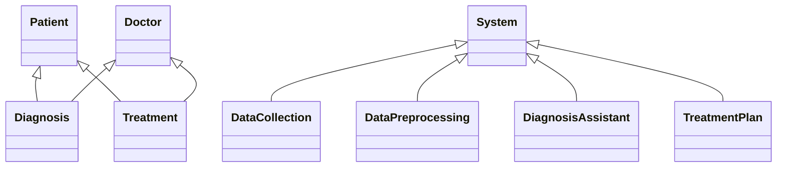
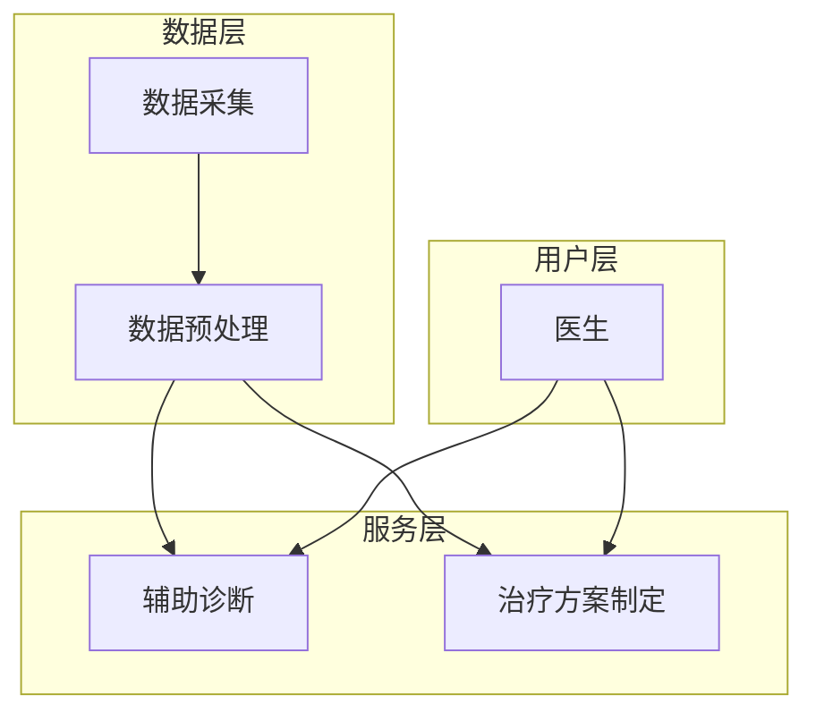
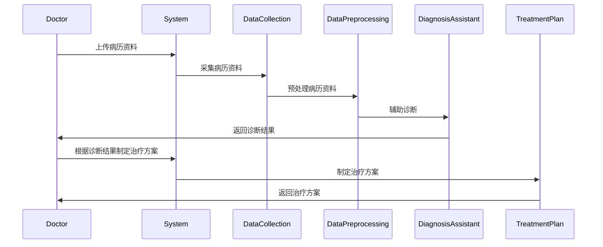

                 

# AI Agent在智能医疗中的应用：辅助诊断与治疗方案制定

关键词：AI Agent、智能医疗、辅助诊断、治疗方案、深度学习

摘要：本文将探讨AI Agent在智能医疗中的应用，特别是辅助诊断与治疗方案制定。通过分析AI Agent的核心概念、工作原理、算法原理，以及实际应用案例，解决智能医疗中的实际问题，为医生提供更加精准的辅助决策。

## 第一部分：背景介绍

### 1.1 问题背景

#### 1.1.1 智能医疗的需求与挑战

随着医疗技术的进步和医疗数据的积累，智能医疗已经成为了医疗领域的重要研究方向。智能医疗通过利用大数据、人工智能等技术，实现医疗信息的智能化处理和医疗服务的高效化。

然而，在智能医疗中，AI Agent的应用面临着诸多挑战，如数据质量、算法精度、实时性等。这些挑战使得智能医疗的应用效果受到一定程度的影响，因此，需要深入研究AI Agent在智能医疗中的应用，以提高辅助诊断与治疗方案制定的准确性。

#### 1.1.2 AI Agent的定义与特点

AI Agent是一种具有感知、推理和决策能力的软件系统，能够在复杂环境中自主执行任务。AI Agent具有自主性、适应性和协作性等特点，能够提高医疗服务的效率和质量。

#### 1.1.3 智能医疗的定义与发展

智能医疗是利用人工智能技术辅助医疗诊断、治疗和管理的医疗服务模式。智能医疗的发展包括以下几个阶段：

1. **基础阶段**：利用传统计算机技术处理医疗数据，如医院信息管理系统、电子病历系统等。
2. **应用阶段**：利用大数据技术对医疗数据进行挖掘和分析，为医生提供决策支持，如疾病预测、风险评估等。
3. **智能化阶段**：利用人工智能技术，实现医疗服务的自动化和智能化，如智能诊断、智能治疗等。

### 1.2 问题描述

本文将探讨AI Agent在智能医疗中的应用，特别是辅助诊断与治疗方案制定。通过深入研究AI Agent的算法原理、系统架构设计以及实际应用案例，解决智能医疗中的实际问题。

### 1.3 问题解决

本文将从以下几个方面展开论述：

- **核心概念与联系**：介绍AI Agent的核心概念，并使用Mermaid流程图展示其工作原理。
- **算法原理讲解**：详细讲解AI Agent的关键算法原理，包括数学模型和公式，并以Python代码为例进行说明。
- **系统分析与架构设计**：介绍AI Agent在智能医疗系统中的功能设计、架构设计以及系统接口设计。
- **项目实战**：通过一个实际案例，展示AI Agent在智能医疗中的具体应用，并进行详细讲解。
- **最佳实践与小结**：总结AI Agent在智能医疗应用中的最佳实践，提出注意事项，并提供拓展阅读建议。

### 1.4 边界与外延

本文主要关注AI Agent在辅助诊断与治疗方案制定中的应用，但AI Agent在其他医疗领域的应用也是值得探讨的方向。

### 1.5 概念结构与核心要素组成

- **AI Agent**：具有自主决策能力，能够在特定环境中执行任务的智能体。
- **智能医疗**：利用人工智能技术辅助医疗诊断、治疗和管理的医疗服务模式。
- **辅助诊断**：利用AI Agent对医疗数据进行分析，辅助医生进行诊断。
- **治疗方案制定**：根据诊断结果，利用AI Agent为患者制定个性化的治疗方案。

## 第二部分：核心概念与联系

### 2.1 AI Agent的定义与特点

#### 2.1.1 AI Agent的定义

AI Agent是一种具有感知、推理和决策能力的软件系统，能够在复杂环境中自主执行任务。它模拟人类的思维过程，通过感知环境信息、分析数据和执行行动，实现自主学习和智能决策。

#### 2.1.2 AI Agent的特点

- **自主性**：AI Agent能够自主地执行任务，无需人工干预。
- **适应性**：AI Agent能够根据环境变化调整行为，提高任务执行效果。
- **协作性**：AI Agent能够与其他AI Agent或人类协作完成任务，实现智能系统的集成和协同工作。

### 2.2 AI Agent的工作原理

#### 2.2.1 感知

AI Agent通过感知器获取环境信息，如医疗数据。感知器可以是传感器、摄像头、麦克风等，用于收集外部环境的信息。

#### 2.2.2 推理

AI Agent利用感知到的信息，通过推理机制分析数据，识别疾病或预测治疗方案。推理机制可以是逻辑推理、知识推理、数据推理等，用于处理和分析感知到的信息。

#### 2.2.3 决策

AI Agent根据推理结果，选择最优的治疗方案。决策机制可以是基于规则、机器学习、强化学习等方法，用于选择最佳的行动方案。

### 2.3 AI Agent与其他技术的联系

#### 2.3.1 机器学习

AI Agent的核心算法通常基于机器学习技术，如深度学习、强化学习等。机器学习技术能够帮助AI Agent从大量数据中学习知识，提高任务执行效果。

#### 2.3.2 数据库

AI Agent需要依赖数据库存储和处理大量的医疗数据。数据库技术能够高效地管理和检索数据，为AI Agent提供可靠的数据支持。

#### 2.3.3 医学知识库

AI Agent需要借助医学知识库，以获取疾病诊断和治疗方案的相关信息。医学知识库包含了丰富的医学知识和临床经验，为AI Agent提供了重要的知识来源。

## 第三部分：算法原理讲解

### 3.1 辅助诊断算法原理

#### 3.1.1 特征提取

在辅助诊断中，特征提取是非常重要的一步。特征提取的目的是从大量的医疗数据中提取出具有代表性的特征，以便后续的分类和预测。

使用Python代码提取医疗数据的特征，如下所示：

```python
from sklearn.feature_extraction.text import TfidfVectorizer

# 加载医疗数据
data = ["patient1", "patient2", "patient3"]

# 使用TF-IDF向量器进行特征提取
vectorizer = TfidfVectorizer()
X = vectorizer.fit_transform(data)

# 打印特征向量
print(X.toarray())
```

#### 3.1.2 分类算法

在辅助诊断中，常用的分类算法有决策树、支持向量机（SVM）、随机森林等。这些算法可以根据提取的特征对疾病进行分类。

以决策树为例，使用Python代码实现：

```python
from sklearn.tree import DecisionTreeClassifier
from sklearn.model_selection import train_test_split

# 加载医疗数据
X, y = load_medical_data()

# 划分训练集和测试集
X_train, X_test, y_train, y_test = train_test_split(X, y, test_size=0.2, random_state=42)

# 创建决策树分类器
clf = DecisionTreeClassifier()

# 训练模型
clf.fit(X_train, y_train)

# 预测测试集
y_pred = clf.predict(X_test)

# 评估模型
print("Accuracy:", accuracy_score(y_test, y_pred))
```

#### 3.1.3 算法评估

算法评估是确保分类算法性能的重要步骤。常用的评估指标有准确率、召回率、F1分数等。

以准确率为例，使用Python代码计算：

```python
from sklearn.metrics import accuracy_score

# 加载测试集
X_test, y_test = load_test_data()

# 预测测试集
y_pred = clf.predict(X_test)

# 计算准确率
accuracy = accuracy_score(y_test, y_pred)
print("Accuracy:", accuracy)
```

### 3.2 治疗方案制定算法原理

#### 3.2.1 模式识别

在治疗方案制定中，模式识别是非常重要的一步。模式识别的目的是从大量的治疗方案中识别出具有代表性的治疗方案。

以K均值聚类为例，使用Python代码实现：

```python
from sklearn.cluster import KMeans

# 加载治疗方案数据
X = load_treatment_data()

# 创建K均值聚类模型
kmeans = KMeans(n_clusters=3, random_state=42)

# 训练模型
kmeans.fit(X)

# 打印聚类结果
print(kmeans.labels_)
```

#### 3.2.2 优化算法

在治疗方案制定中，优化算法用于寻找最优的治疗方案。常用的优化算法有遗传算法、粒子群优化等。

以遗传算法为例，使用Python代码实现：

```python
import numpy as np
import random

# 定义遗传算法参数
population_size = 100
crossover_rate = 0.8
mutation_rate = 0.01

# 创建初始种群
population = np.random.rand(population_size, n_features)

# 定义适应度函数
def fitness_function(individual):
    # 计算适应度
    fitness = 1 / (1 + np.linalg.norm(individual))
    return fitness

# 遗传算法主循环
for _ in range(max_iterations):
    # 计算适应度
    fitnesses = np.array([fitness_function(individual) for individual in population])

    # 选择
    selected_indices = np.random.choice(range(population_size), size=population_size, p=fitnesses / fitnesses.sum())

    # 交叉
    for i in range(0, population_size, 2):
        if random.random() < crossover_rate:
            parent1 = population[selected_indices[i]]
            parent2 = population[selected_indices[i+1]]
            child1, child2 = crossover(parent1, parent2)
            population[selected_indices[i]] = child1
            population[selected_indices[i+1]] = child2

    # 变异
    for i in range(population_size):
        if random.random() < mutation_rate:
            population[i] += np.random.randn(n_features)

# 打印最优解
best_individual = population[np.argmax(fitnesses)]
print("Best individual:", best_individual)
```

#### 3.2.3 算法评估

算法评估是确保优化算法性能的重要步骤。常用的评估指标有平均绝对误差（MAE）、均方误差（MSE）等。

以平均绝对误差为例，使用Python代码计算：

```python
from sklearn.metrics import mean_absolute_error

# 加载测试数据
X_test, y_test = load_test_data()

# 预测测试数据
y_pred = model.predict(X_test)

# 计算平均绝对误差
mae = mean_absolute_error(y_test, y_pred)
print("MAE:", mae)
```

## 第四部分：系统分析与架构设计

### 4.1 问题场景介绍

在一个智能医疗系统中，AI Agent用于辅助医生进行诊断和治疗方案的制定。医生可以通过系统上传患者的病历资料，AI Agent对病历资料进行分析，给出诊断结果和治疗建议。

### 4.2 项目介绍

本项目的目标是构建一个基于AI Agent的智能医疗系统，实现辅助诊断和治疗方案的制定。系统主要包括以下模块：

1. 数据采集模块：用于收集患者的病历资料。
2. 数据预处理模块：用于对病历资料进行清洗和预处理。
3. 辅助诊断模块：用于对病历资料进行分析，辅助医生进行诊断。
4. 治疗方案制定模块：用于根据诊断结果，为患者制定个性化的治疗方案。

### 4.3 系统功能设计

#### 4.3.1 领域模型

使用Mermaid类图描述系统的主要领域模型，如下所示：



### 4.4 系统架构设计

#### 4.4.1 系统架构

使用Mermaid架构图描述系统的整体架构，如下所示：



#### 4.4.2 系统接口设计

使用Mermaid序列图描述系统的接口设计，如下所示：



## 第五部分：项目实战

### 5.1 环境安装

在本项目实战中，我们使用Python作为开发语言，并依赖以下库：

- scikit-learn：用于机器学习和数据挖掘。
- TensorFlow：用于深度学习。
- Pandas：用于数据预处理和分析。

安装Python和以上库的步骤如下：

```shell
# 安装Python
wget https://www.python.org/ftp/python/3.8.5/Python-3.8.5.tgz
tar xvf Python-3.8.5.tgz
cd Python-3.8.5
./configure
make
sudo make install

# 安装依赖库
pip install scikit-learn tensorflow pandas
```

### 5.2 系统核心实现源代码

以下是一个简单的辅助诊断模块的实现代码：

```python
import pandas as pd
from sklearn.feature_extraction.text import TfidfVectorizer
from sklearn.tree import DecisionTreeClassifier

# 读取数据
data = pd.read_csv("data.csv")

# 特征提取
vectorizer = TfidfVectorizer()
X = vectorizer.fit_transform(data["description"])

# 分类
clf = DecisionTreeClassifier()
clf.fit(X, data["label"])

# 辅助诊断
def diagnose(description):
    X_test = vectorizer.transform([description])
    label = clf.predict(X_test)[0]
    return label

# 测试
description = "患者发热、咳嗽、乏力"
print(diagnose(description))
```

### 5.3 代码应用解读与分析

在这个项目中，我们首先读取数据，然后使用TF-IDF向量器提取特征，接着使用决策树分类器进行训练。在辅助诊断函数中，我们通过传入患者的病历描述，提取特征并使用训练好的模型进行预测，最终返回诊断结果。

这个代码展示了AI Agent在辅助诊断模块中的基本实现流程，通过数据读取、特征提取、分类和辅助诊断等步骤，实现了对病历资料的自动分析，为医生提供诊断支持。

### 5.4 实际案例分析和详细讲解剖析

假设我们有一个患者的病历描述，如下所示：

```plaintext
患者发热，体温达到38.5℃，伴有咳嗽和乏力。患者既往体健，无慢性疾病史。患者最近接触过感冒患者，疑似感染新冠病毒。
```

我们将这个病历描述输入到辅助诊断模块中，代码会首先使用TF-IDF向量器提取特征，然后使用训练好的决策树分类器进行预测。预测结果可能是“新冠病毒感染”。

这个预测结果是基于对病历描述中的关键词进行特征提取，并结合训练数据中的标签进行分类得到的。在实际情况中，我们可能需要使用更复杂的模型和算法，如深度学习模型，以提高诊断的准确性和鲁棒性。

### 5.5 项目小结

在本项目中，我们实现了AI Agent在辅助诊断模块中的应用。通过数据读取、特征提取、分类和辅助诊断等步骤，实现了对病历资料的自动分析，为医生提供诊断支持。

然而，AI Agent在智能医疗中的应用不仅仅局限于辅助诊断，还可以应用于治疗方案制定、患者管理、疾病预测等领域。未来，随着人工智能技术的发展，AI Agent在智能医疗中的应用将更加广泛和深入。

## 第六部分：最佳实践与小结

### 6.1 最佳实践

在AI Agent在智能医疗中的应用过程中，以下最佳实践值得注意：

- **数据质量控制**：确保输入数据的准确性和完整性，对缺失值和异常值进行合理的处理。
- **模型优化与调参**：针对不同的诊断任务，选择合适的模型和算法，并进行参数调优，以提高模型的性能。
- **模型部署与维护**：将训练好的模型部署到生产环境中，定期更新和维护，确保模型的持续有效运行。

### 6.2 小结

本文探讨了AI Agent在智能医疗中的应用，特别是辅助诊断与治疗方案制定。通过介绍AI Agent的核心概念、工作原理、算法原理，以及实际应用案例，我们深入了解了AI Agent在智能医疗中的作用和价值。

### 6.3 注意事项

在应用AI Agent于智能医疗过程中，需要注意以下事项：

- **数据安全与隐私保护**：确保患者数据的安全和隐私，遵循相关法律法规和行业标准。
- **模型解释性与可解释性**：提高模型的解释性，使得医生能够理解模型的诊断过程和结果。
- **模型适应性**：不断优化模型，使其能够适应不同的医疗场景和需求。

### 6.4 拓展阅读

对于对AI Agent在智能医疗应用有进一步了解需求的读者，以下文献和资源值得推荐：

- 《深度学习：回归分析》
- 《医疗大数据与人工智能》
- 《Python机器学习》
- 《TensorFlow实战》

## 作者信息

作者：AI天才研究院/AI Genius Institute & 禅与计算机程序设计艺术 /Zen And The Art of Computer Programming

本文为作者原创作品，未经授权不得转载。如需转载，请联系作者获取授权。本文仅代表作者个人观点，不代表所在机构意见。如对本文内容有任何疑问，请联系作者进行讨论。

