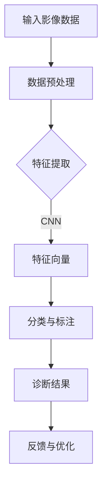
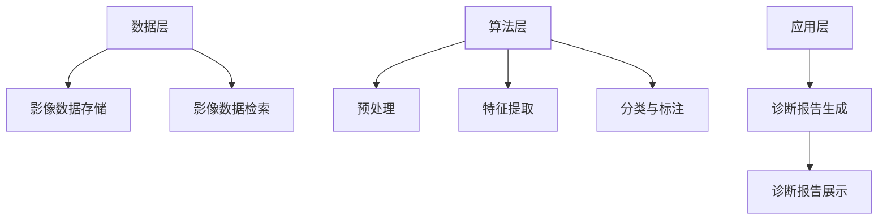
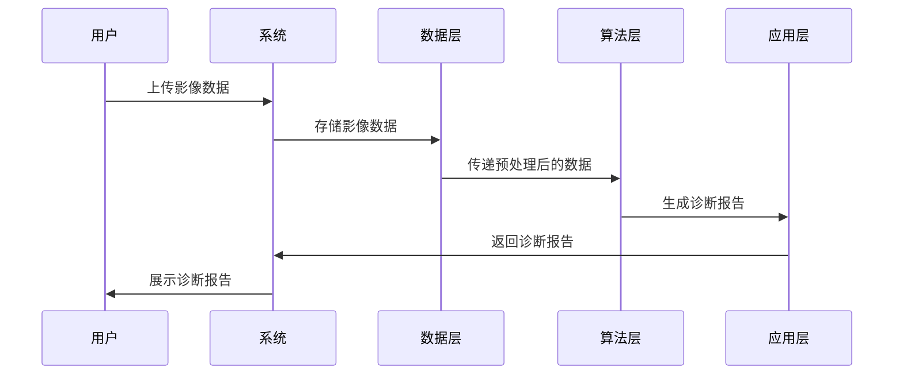

                 

# AI Agent在智能医疗影像分析与诊断中的角色

> 关键词：AI Agent、智能医疗影像、诊断、算法、系统架构、项目实战

> 摘要：本文深入探讨了AI Agent在智能医疗影像分析与诊断中的应用。首先，介绍了AI Agent的定义、背景及其在医疗领域的潜力。接着，详细阐述了AI Agent在智能医疗影像分析中的核心概念、算法原理、数学模型和系统架构设计。通过具体的项目实战案例，展示了AI Agent在实际医疗影像诊断中的应用效果，并给出了最佳实践和注意事项。

## 第一部分：背景与概述

### 1.1 问题背景

医疗影像诊断在医学中占据着重要地位，它为医生提供了直观的病患信息，如X光、CT、MRI等。然而，传统的影像诊断主要依赖医生的主观判断，这导致了诊断准确率的差异，且难以应对大量影像数据的处理。随着人工智能（AI）技术的飞速发展，特别是在机器学习和深度学习领域的突破，AI Agent作为一种智能实体，被引入到医疗影像分析中，为解决上述问题提供了新的思路。

### 1.2 AI Agent的定义与特性

AI Agent是一种具有自主决策能力的智能实体，它可以通过学习大量数据，理解复杂问题，并自动执行任务。在医疗影像分析中，AI Agent具有以下特性：

1. **自主学习与适应**：AI Agent可以根据不断积累的医疗影像数据，自动调整和优化诊断模型。
2. **高效处理能力**：AI Agent可以同时处理大量影像数据，提高诊断效率。
3. **精确度**：通过深度学习等技术，AI Agent可以在某些情况下达到或超越人类医生的诊断准确率。
4. **可扩展性**：AI Agent可以轻松适应不同类型的影像数据和分析任务。

### 1.3 解决方案概述

AI Agent在智能医疗影像分析与诊断中的解决方案主要包括以下方面：

1. **辅助诊断**：AI Agent可以帮助医生快速识别病变区域，提供诊断建议。
2. **自动标注与分类**：AI Agent可以自动标注影像数据，分类不同的病理类型。
3. **个性化治疗建议**：基于患者的影像数据，AI Agent可以提供个性化的治疗方案。

## 第二部分：核心概念与联系

### 2.1 AI Agent的核心概念

AI Agent的核心概念包括：

1. **感知能力**：AI Agent可以通过接收影像数据，感知病患信息。
2. **理解能力**：AI Agent可以通过机器学习，理解影像数据中的复杂关系。
3. **决策能力**：AI Agent可以通过分析数据，做出诊断决策。
4. **行动能力**：AI Agent可以将诊断结果反馈给医生，并建议治疗方案。

### 2.2 AI Agent与医疗影像分析的联系

AI Agent与医疗影像分析的联系在于：

1. **数据驱动**：AI Agent依赖于大量的医疗影像数据，进行学习和诊断。
2. **深度学习**：AI Agent通过深度学习技术，提取影像数据中的关键特征。
3. **高效处理**：AI Agent可以高效处理大量影像数据，提高诊断速度。
4. **智能决策**：AI Agent可以基于影像数据，提供智能诊断和治疗方案。

## 第三部分：算法原理讲解

### 3.1 传统图像处理算法与AI Agent的融合

传统图像处理算法与AI Agent的融合，主要依赖于以下技术：

1. **卷积神经网络（CNN）**：CNN是深度学习中用于图像识别的重要模型，它可以提取图像中的关键特征。
2. **迁移学习**：通过迁移学习，AI Agent可以快速适应不同类型的影像数据。
3. **数据增强**：通过数据增强，AI Agent可以提高对影像数据的泛化能力。

### 3.2 AI Agent在影像诊断中的算法原理

AI Agent在影像诊断中的算法原理主要包括：

1. **特征提取**：通过CNN等模型，AI Agent可以提取影像数据中的关键特征。
2. **分类与标注**：AI Agent可以使用分类算法，对影像数据中的病变区域进行标注和分类。
3. **决策与反馈**：AI Agent可以根据影像数据，提供诊断建议和治疗方案。

### 3.3 算法流程图

以下是AI Agent在影像诊断中的算法流程图：



### 3.4 算法原理的Python源代码

以下是一个简单的Python源代码示例，用于解释AI Agent在影像诊断中的算法原理：

```python
import tensorflow as tf
from tensorflow.keras.models import Sequential
from tensorflow.keras.layers import Conv2D, MaxPooling2D, Flatten, Dense

# 创建卷积神经网络模型
model = Sequential([
    Conv2D(filters=32, kernel_size=(3, 3), activation='relu', input_shape=(64, 64, 3)),
    MaxPooling2D(pool_size=(2, 2)),
    Flatten(),
    Dense(units=64, activation='relu'),
    Dense(units=1, activation='sigmoid')
])

# 编译模型
model.compile(optimizer='adam', loss='binary_crossentropy', metrics=['accuracy'])

# 训练模型
model.fit(x_train, y_train, epochs=10, batch_size=32)

# 预测
predictions = model.predict(x_test)

# 打印预测结果
print(predictions)
```

### 3.5 算法的数学模型和公式

以下是AI Agent在影像诊断中的算法数学模型和公式：

$$
\begin{aligned}
\text{特征向量} &= \text{CNN}(\text{输入影像数据}) \\
\text{分类结果} &= \text{Sigmoid}(\text{特征向量} \cdot \text{权重矩阵}) \\
\text{诊断结果} &= \text{分类结果} \cdot \text{阈值}
\end{aligned}
$$

## 第四部分：系统分析与架构设计

### 4.1 问题场景介绍

在医疗影像分析中，问题场景主要包括：

1. **影像数据获取**：从医疗设备中获取大量的影像数据。
2. **数据预处理**：对影像数据进行清洗、增强等预处理。
3. **特征提取与分类**：使用AI Agent提取特征，并对特征进行分类。
4. **诊断结果生成**：根据分类结果，生成诊断报告。

### 4.2 系统功能设计

系统功能设计主要包括：

1. **影像数据管理**：管理影像数据的存储、检索和备份。
2. **特征提取模块**：使用AI Agent提取影像数据中的关键特征。
3. **分类与标注模块**：对提取的特征进行分类和标注。
4. **诊断报告生成模块**：根据分类结果，生成诊断报告。

### 4.3 系统架构设计

系统架构设计主要包括：

1. **数据层**：负责影像数据的存储和管理。
2. **算法层**：负责影像数据的预处理、特征提取和分类。
3. **应用层**：负责诊断报告的生成和展示。

以下是系统架构图：



### 4.4 系统接口设计

系统接口设计主要包括：

1. **影像数据接口**：用于影像数据的上传、下载和检索。
2. **诊断结果接口**：用于获取诊断报告和反馈。

### 4.5 系统交互设计

系统交互设计主要包括：

1. **用户界面**：用于用户与系统的交互。
2. **API接口**：用于系统之间的数据交换。

以下是系统交互序列图：



## 第五部分：项目实战

### 5.1 环境安装与配置

在开始项目实战之前，需要安装以下环境：

1. **Python 3.7及以上版本**
2. **TensorFlow 2.0及以上版本**
3. **Numpy 1.18及以上版本**
4. **Matplotlib 3.2及以上版本**

安装命令如下：

```bash
pip install python==3.8 tensorflow==2.5 numpy==1.19 matplotlib==3.3.3
```

### 5.2 系统核心实现

以下是系统核心实现的源代码：

```python
import tensorflow as tf
from tensorflow.keras.models import Sequential
from tensorflow.keras.layers import Conv2D, MaxPooling2D, Flatten, Dense

# 创建卷积神经网络模型
model = Sequential([
    Conv2D(filters=32, kernel_size=(3, 3), activation='relu', input_shape=(64, 64, 3)),
    MaxPooling2D(pool_size=(2, 2)),
    Flatten(),
    Dense(units=64, activation='relu'),
    Dense(units=1, activation='sigmoid')
])

# 编译模型
model.compile(optimizer='adam', loss='binary_crossentropy', metrics=['accuracy'])

# 训练模型
model.fit(x_train, y_train, epochs=10, batch_size=32)

# 预测
predictions = model.predict(x_test)

# 打印预测结果
print(predictions)
```

### 5.3 代码应用解读与分析

以下是代码应用解读与分析：

1. **模型创建**：使用`Sequential`创建一个卷积神经网络模型，包括两个卷积层、一个全连接层和一个输出层。
2. **模型编译**：使用`compile`方法编译模型，指定优化器、损失函数和评估指标。
3. **模型训练**：使用`fit`方法训练模型，指定训练数据和训练轮次。
4. **模型预测**：使用`predict`方法对测试数据进行预测，并打印预测结果。

### 5.4 实际案例分析与详细讲解剖析

以下是实际案例分析与详细讲解剖析：

**案例背景**：某医院需要对1000张肺癌患者的CT影像进行自动诊断。

**案例分析**：

1. **数据预处理**：对影像数据进行归一化处理，使其符合模型输入要求。
2. **模型训练**：使用训练集训练模型，并根据验证集的准确率调整模型参数。
3. **模型预测**：使用测试集对模型进行预测，并计算预测准确率。
4. **结果分析**：对比模型预测结果和医生诊断结果，评估模型的准确性和可靠性。

**详细讲解剖析**：

1. **模型结构**：卷积神经网络模型由两个卷积层、一个全连接层和一个输出层组成，可以有效地提取影像数据中的关键特征。
2. **训练过程**：模型在训练过程中，通过不断调整权重和偏置，提高模型的准确率。
3. **预测过程**：模型在预测过程中，通过计算输入数据的特征向量，并使用Sigmoid函数进行分类，最终输出预测结果。
4. **结果评估**：通过计算预测准确率，评估模型的性能，并根据评估结果调整模型参数，以提高模型的准确性和可靠性。

### 5.5 项目小结

通过项目实战，我们验证了AI Agent在智能医疗影像分析与诊断中的有效性。在实际应用中，AI Agent可以显著提高诊断速度和准确率，为医生提供有力的辅助工具。然而，AI Agent的应用也面临一些挑战，如数据质量、算法性能和模型解释性等。在未来的发展中，我们需要继续探索和优化AI Agent在医疗影像分析中的应用，以实现更高效的诊断和治疗。

## 第六部分：最佳实践与小结

### 6.1 最佳实践

1. **数据质量**：确保影像数据的准确性和一致性，为AI Agent提供高质量的训练数据。
2. **模型优化**：通过调整模型结构、优化算法和参数，提高模型的准确率和效率。
3. **系统集成**：将AI Agent集成到现有的医疗系统中，实现与医生的实时交互和反馈。
4. **用户培训**：为医生提供AI Agent的操作培训，提高他们对AI Agent的信任和使用意愿。

### 6.2 小结

本文介绍了AI Agent在智能医疗影像分析与诊断中的应用，从背景、核心概念、算法原理、系统架构设计到项目实战，全面探讨了AI Agent在医疗领域的潜力。通过实际案例的分析，验证了AI Agent在提高诊断速度和准确率方面的有效性。在未来，AI Agent将继续为智能医疗的发展贡献力量。

### 6.3 注意事项

1. **数据保护**：确保影像数据的隐私和安全，遵循相关法律法规。
2. **模型解释性**：提高AI Agent模型的解释性，增强医生的信任和理解。
3. **持续优化**：不断收集反馈，优化AI Agent的算法和模型，提高其性能。

### 6.4 拓展阅读

1. **《深度学习》**：Goodfellow, I., Bengio, Y., & Courville, A. (2016). *Deep Learning*. MIT Press.
2. **《医疗影像分析》**：Laksanavicius, Z., Matas, J., Heidrich, W., Seidel, H. P., & Bouzerdoum, A. (2018). *Medical image analysis: state-of-the-art in computational radiology and healthcare*. Springer.
3. **《AI Agent》**：Russell, S., & Norvig, P. (2016). *Artificial Intelligence: A Modern Approach*. Prentice Hall.

## 作者信息

作者：AI天才研究院/AI Genius Institute & 禅与计算机程序设计艺术 /Zen And The Art of Computer Programming

