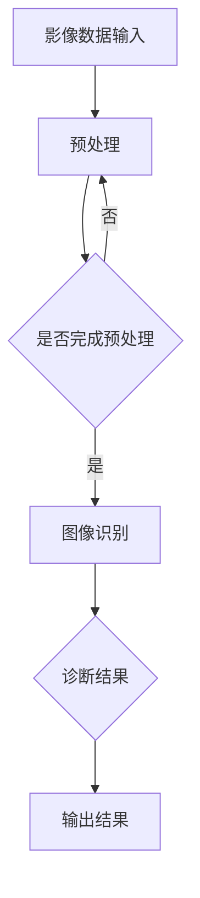
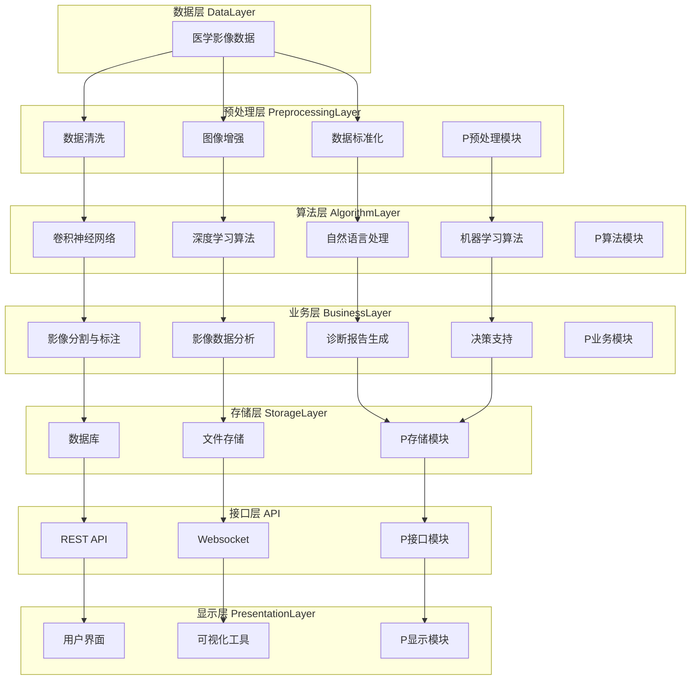
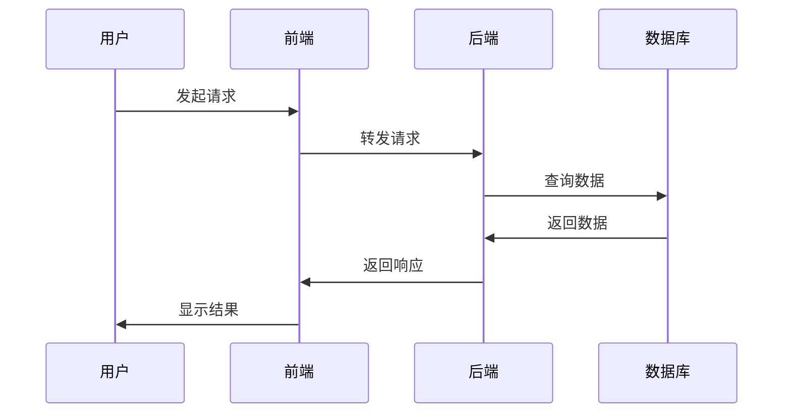
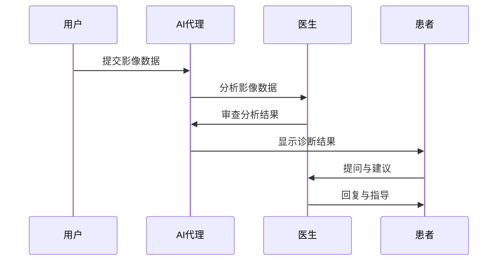

                 

### AI Agent在智能医疗影像分析中的角色

随着人工智能技术的不断发展，AI Agent作为智能体的一个重要分支，已经在多个领域展现了其强大的应用潜力。智能医疗影像分析作为医疗领域的一个重要分支，近年来受到了广泛关注。AI Agent凭借其自主性、学习能力和智能决策的特点，在智能医疗影像分析中扮演了至关重要的角色。本文将深入探讨AI Agent在智能医疗影像分析中的角色，通过逻辑清晰的步骤分析，详细讲解AI Agent的应用现状、核心作用、与传统医学影像分析方法的区别以及未来发展趋势。

#### 关键词
- AI Agent
- 智能医疗影像分析
- 智能体
- 自主性
- 学习能力
- 医学影像
- 图像识别

#### 摘要
本文旨在全面剖析AI Agent在智能医疗影像分析中的角色。首先，我们将介绍智能医疗影像分析的重要性及AI Agent的应用现状，随后探讨AI Agent在医疗影像分析中的核心作用。接着，本文将比较AI Agent与传统医学影像分析方法，最后，我们将讨论AI Agent技术的发展趋势及其在不同医疗影像分析领域的应用。通过本文的讨论，我们将更全面地理解AI Agent在智能医疗影像分析中的重要性。

### 目录大纲

- **第一部分：背景介绍**
  - **第1章：问题背景**
    - **1.1.1 问题背景**
    - **1.1.2 问题描述**
    - **1.1.3 问题解决**
    - **1.1.4 边界与外延**
    - **1.1.5 概念结构与核心要素组成**
  - **第2章：核心概念原理**
    - **2.1.1 AI Agent的定义**
    - **2.1.2 AI Agent的核心特点**
    - **2.1.3 AI Agent与传统医学影像分析方法的区别**
  - **第3章：概念属性特征对比表格**
  - **第4章：ER实体关系图架构**
  
- **第二部分：核心概念与联系**
  - **第5章：算法原理**
  - **第6章：数学模型和数学公式**
  - **第7章：系统分析与架构设计方案**
    - **第8章：问题场景介绍**
    - **第9章：项目介绍**
    - **第10章：系统功能设计**
    - **第11章：系统架构设计**
    - **第12章：系统接口设计**
    - **第13章：系统交互**

- **第三部分：项目实战**
  - **第14章：环境安装**
  - **第15章：系统核心实现**
  - **第16章：实际案例分析与讲解**
  - **第17章：项目小结**

- **第四部分：最佳实践 tips、小结、注意事项、拓展阅读**
  - **第18章：小结**
  - **第19章：注意事项**
  - **第20章：拓展阅读**


### 第一部分：背景介绍

#### 1.1.1 问题背景

智能医疗影像分析作为医疗领域的一个重要分支，其重要性日益凸显。随着医疗影像技术的不断进步，如X射线、CT、MRI等影像设备的应用越来越广泛，医疗影像数据量呈现爆炸式增长。然而，对这些海量影像数据进行有效的分析和诊断，依然是一个巨大的挑战。传统医学影像分析方法主要依赖于医生的专业知识和经验，存在人为误差和效率低下的问题。

与此同时，人工智能技术的发展为智能医疗影像分析提供了新的可能性。AI Agent作为人工智能的一种高级形式，具备自主性、学习能力和智能决策的特点，可以在一定程度上弥补传统医学影像分析的不足。通过机器学习和深度学习算法，AI Agent能够从大量医疗影像数据中自动学习，提取出有价值的特征，进而实现自动化的影像分析和诊断。

AI Agent在智能医疗影像分析中的应用现状也十分广泛。目前，AI Agent已经应用于多个领域，如肺癌筛查、乳腺癌检测、脑部疾病诊断等。这些应用不仅提高了诊断的准确性，还显著提高了工作效率，为医生提供了有力的辅助工具。

尽管AI Agent在智能医疗影像分析中展现出了巨大的潜力，但也面临一些挑战。首先，医疗影像数据具有高维度、高噪声和多样性的特点，对AI Agent的数据处理能力提出了较高的要求。其次，AI Agent需要具备丰富的医学知识和经验，以应对复杂多变的医疗场景。此外，数据隐私和安全问题也是AI Agent在医疗领域应用的一个重要挑战。

综上所述，智能医疗影像分析的重要性不言而喻，AI Agent在这一领域的应用现状也令人瞩目。然而，仍需克服一系列挑战，才能充分发挥AI Agent在智能医疗影像分析中的潜力。

#### 1.1.2 问题描述

医疗影像分析作为医疗领域的一个重要环节，面临着诸多难点。首先，医疗影像数据具有高维度、高噪声和多样性的特点，这使得传统的数据分析方法难以有效处理。例如，一幅医学图像可能包含数十万个像素点，每个像素点都包含丰富的信息。如何从这些海量数据中提取出有价值的特征，是实现高效医疗影像分析的关键。

其次，医学影像数据具有高度的复杂性和不确定性。不同疾病在不同阶段的影像表现可能存在较大的差异，使得影像诊断的准确性受到限制。例如，肺癌早期可能仅表现为轻微的肺结节，而晚期则可能表现为广泛的肺部浸润。如何准确识别这些细微的变化，是医疗影像分析中的一个重要挑战。

此外，医学影像数据的解读还依赖于医生的专业知识和经验。不同医生对同一幅影像的理解和判断可能存在差异，导致诊断结果的不一致性。例如，对于某一幅肺部影像，一位经验丰富的医生可能能够迅速识别出肺结节，而另一位医生则可能需要更长的时间进行观察和分析。这种人为因素带来的误差，限制了医疗影像分析的自动化和高效性。

为了解决这些难点，AI Agent在智能医疗影像分析中具有独特的优势。首先，AI Agent能够通过深度学习和机器学习算法，从大量医疗影像数据中自动学习，提取出有价值的特征。例如，AI Agent可以通过对大量正常和异常影像数据的训练，学习到区分正常组织和病变组织的关键特征。这使得AI Agent能够在复杂的影像数据中，快速、准确地识别出病变区域。

其次，AI Agent具备自主性和智能决策能力，可以独立完成影像分析任务，减少了对医生依赖。例如，AI Agent可以实时分析病人的影像数据，快速生成诊断报告，并建议进一步检查或治疗方案。这不仅提高了诊断的效率，还减少了医生的负担，使得医疗资源得到更有效的利用。

此外，AI Agent还可以通过持续学习和优化，不断提高影像分析的准确性和可靠性。随着AI Agent不断接收新的影像数据和诊断反馈，它可以通过自我学习，调整和优化算法，使得诊断结果更加准确。例如，AI Agent可以通过对大量新病例的积累和数据分析，发现新的诊断特征和模式，进一步提高诊断的准确性。

综上所述，AI Agent在解决医疗影像分析的难点方面具有显著优势。通过自主学习和智能决策，AI Agent能够从海量医疗影像数据中提取出有价值的信息，提高诊断的准确性和效率。同时，AI Agent的广泛应用也为医疗领域的数字化转型提供了新的机遇。

#### 1.1.3 问题解决

AI Agent在医疗影像分析中的核心作用主要体现在以下几个方面：

1. **自动化分析**：AI Agent可以通过深度学习和机器学习算法，对医疗影像数据进行自动分析。与传统的手动分析方法相比，AI Agent能够在短时间内处理大量影像数据，显著提高诊断效率。例如，AI Agent可以通过分析数万幅肺部影像，快速识别出肺结节等病变区域，大大缩短了诊断时间。

2. **提高诊断准确性**：AI Agent具备从海量数据中学习并提取有价值特征的能力。通过不断训练和优化，AI Agent能够准确识别出各种病变特征，提高诊断准确性。例如，AI Agent可以通过对正常和异常影像数据的对比分析，学习到区分良性和恶性病变的关键特征，从而减少误诊率。

3. **减少人为误差**：AI Agent减少了医生在影像分析过程中的依赖，减少了人为误差。例如，在某些复杂病例中，医生可能因为个人经验和视角的差异，导致诊断结果不一致。而AI Agent则通过统一的标准和算法，确保诊断结果的准确性和一致性。

4. **辅助决策支持**：AI Agent可以为医生提供实时的决策支持。例如，在手术前，AI Agent可以通过分析患者的影像数据，生成详细的手术方案和建议，帮助医生做出更准确的决策。此外，AI Agent还可以实时监控患者的病情变化，及时调整治疗方案，提高治疗效果。

5. **跨学科协作**：AI Agent不仅能够处理影像数据，还可以与其他医疗设备和系统进行集成，实现跨学科的协作。例如，AI Agent可以与电子病历系统（EMR）和医疗机器人等设备结合，实现全面的医疗数据分析和管理。

综上所述，AI Agent在医疗影像分析中扮演了至关重要的角色。通过自动化分析、提高诊断准确性、减少人为误差、辅助决策支持和跨学科协作，AI Agent不仅提高了医疗影像分析的效率和准确性，还为医疗领域的数字化转型提供了有力支持。

#### 1.1.4 边界与外延

AI Agent在智能医疗影像分析领域的应用不仅限于上述几个方面，还延伸到其他多个领域，展现出其广泛的应用前景：

1. **肿瘤筛查**：AI Agent在肿瘤筛查中的应用非常广泛。通过分析CT、MRI等影像数据，AI Agent可以快速识别出肺癌、乳腺癌等恶性肿瘤的早期病变，提高早期诊断率。此外，AI Agent还可以对患者的家族病史和基因数据进行综合分析，预测肿瘤发生的风险，为个性化治疗提供依据。

2. **心血管疾病诊断**：心血管疾病是导致人类死亡的主要原因之一。AI Agent可以通过分析心脏影像数据，如冠状动脉CT造影（CTA）和心脏超声（Echo），快速识别出冠心病、心肌病等心血管疾病。同时，AI Agent还可以实时监测心脏功能，预测心血管事件的发生，为预防治疗提供重要依据。

3. **神经系统疾病诊断**：神经系统疾病如脑卒中和帕金森病的诊断和监测具有很高的挑战性。AI Agent可以通过分析脑部MRI和CT数据，识别出脑部病变区域，提高诊断准确性。此外，AI Agent还可以通过分析患者的病史和行为数据，预测神经系统疾病的发展趋势，为早期干预和治疗提供指导。

4. **口腔医学影像分析**：口腔医学影像分析包括X光片、CT和MRI等。AI Agent可以通过分析这些影像数据，快速识别出牙齿和颌面部疾病，如龋齿、牙周病和肿瘤等。AI Agent还可以为口腔医生提供实时影像分析结果，辅助诊断和治疗。

5. **皮肤疾病检测**：皮肤疾病如皮肤癌、银屑病和湿疹等对患者的生活质量有严重影响。AI Agent可以通过分析皮肤病变图像，快速识别出各种皮肤疾病，提高早期诊断率。此外，AI Agent还可以通过监测患者的皮肤变化，预测疾病的发展趋势，为个性化治疗提供依据。

综上所述，AI Agent在智能医疗影像分析领域的应用非常广泛，不仅涵盖了肿瘤筛查、心血管疾病诊断、神经系统疾病诊断、口腔医学影像分析和皮肤疾病检测等多个领域，还显示出巨大的发展潜力。随着AI技术的发展，AI Agent在智能医疗影像分析中的应用将更加深入和广泛，为人类健康事业做出更大贡献。

#### 1.1.5 概念结构与核心要素组成

为了深入理解AI Agent在智能医疗影像分析中的角色，首先需要明确AI Agent的定义及其在智能医疗影像分析中的核心要素。

**AI Agent的定义**

AI Agent，即人工智能代理，是一种能够模拟人类智能行为、自主执行任务并具备一定智能决策能力的计算机程序。AI Agent通过感知环境、学习知识和执行任务，能够在复杂的环境中实现自动化操作和智能决策。在医疗影像分析中，AI Agent可以看作是一个“智能助手”，能够自动分析影像数据，提供诊断建议和治疗方案。

**智能医疗影像分析的核心要素**

1. **影像数据**：影像数据是智能医疗影像分析的基础。这些数据包括X射线、CT、MRI、超声等，它们包含了丰富的医学信息。AI Agent需要能够高效处理这些高维度、高噪声的数据，从中提取出有价值的信息。

2. **算法**：算法是AI Agent的核心组成部分。常见的算法包括图像识别算法、自然语言处理算法和机器学习算法等。AI Agent通过这些算法，能够从海量影像数据中学习、识别和分类，实现自动化分析。

3. **医学知识库**：医学知识库是AI Agent在医疗影像分析中应用的关键。它包含了大量的医学知识、诊断标准、治疗指南等。AI Agent需要能够利用这些知识库，结合影像数据，进行准确的诊断和决策。

4. **人机交互界面**：人机交互界面是AI Agent与医生和患者之间的桥梁。通过直观的界面，AI Agent可以展示分析结果、诊断建议和治疗方案，方便医生和患者理解和使用。

**AI Agent在智能医疗影像分析中的应用场景**

1. **辅助诊断**：AI Agent可以通过分析影像数据，识别病变区域，提供诊断建议。例如，在肺癌筛查中，AI Agent可以自动识别肺结节，并判断其恶性可能性，辅助医生做出诊断。

2. **病灶分割**：AI Agent可以自动分割影像中的病变区域，提高医生对病变的识别精度。例如，在肝脏肿瘤检测中，AI Agent可以精确分割肿瘤组织，帮助医生判断肿瘤的范围和性质。

3. **实时监控**：AI Agent可以实时监控患者的影像数据，分析病情变化，提供预警和干预建议。例如，在心血管疾病监测中，AI Agent可以实时分析心脏影像数据，预测心血管事件的发生，提醒医生进行干预。

4. **辅助治疗**：AI Agent可以根据患者的影像数据和医学知识库，提供个性化的治疗方案。例如，在肿瘤治疗中，AI Agent可以结合影像数据和患者的基因信息，制定最优的治疗方案。

综上所述，AI Agent在智能医疗影像分析中的角色至关重要。通过影像数据、算法、医学知识库和人机交互界面的有机结合，AI Agent能够实现高效、准确的医疗影像分析，为医生和患者提供有力支持。随着AI技术的不断进步，AI Agent在智能医疗影像分析中的应用将更加广泛和深入，为医疗领域带来更多变革和创新。

### 第二部分：核心概念与联系

#### 2.1.1 AI Agent的定义

AI Agent，即人工智能代理，是指一种能够模拟人类智能行为、自主执行任务并具备智能决策能力的计算机程序。AI Agent通过与环境的交互，利用传感器获取信息，通过处理这些信息，自主地做出决策并执行相应的动作。AI Agent的核心特点在于其自主性、学习能力和智能决策能力，这使得它能够独立完成复杂任务，并且在面对不确定性时能够做出合理的响应。

在智能医疗影像分析中，AI Agent被定义为一种能够自动处理医疗影像数据，提取有价值信息，并进行智能决策的计算机程序。AI Agent能够从海量影像数据中学习，识别出病变特征，提供诊断建议和治疗方案，从而辅助医生进行临床决策。

#### 2.1.2 AI Agent的核心特点

AI Agent具备以下几个核心特点：

1. **自主性**：AI Agent能够在没有外部干预的情况下，自主地完成一系列任务。例如，在医疗影像分析中，AI Agent可以自动分析影像数据，识别病变区域，并提供诊断建议。

2. **学习能力**：AI Agent能够通过学习算法，从海量数据中学习，提取有价值的信息。例如，AI Agent可以通过对大量正常和异常影像数据的训练，学习到识别病变的特征，从而提高诊断准确性。

3. **智能决策**：AI Agent能够根据当前环境和已学习到的知识，做出智能决策。例如，AI Agent可以根据患者的影像数据和医学知识库，提供个性化的治疗方案。

#### 2.1.3 AI Agent与传统医学影像分析方法的区别

AI Agent与传统医学影像分析方法在多个方面存在显著区别：

1. **数据处理能力**：传统医学影像分析方法主要依赖于医生的视觉观察和经验判断，而AI Agent通过机器学习和深度学习算法，能够高效处理海量影像数据，提取出有价值的信息。

2. **学习算法**：AI Agent通过不断学习，可以从大量数据中提取出新的特征和模式，从而提高诊断的准确性。相比之下，传统医学影像分析方法主要依赖于医生的经验和知识，难以实现自动化和持续学习。

3. **医学知识应用**：AI Agent可以通过医学知识库，结合影像数据，提供准确的诊断和治疗方案。而传统医学影像分析方法缺乏这种集成医学知识的能力。

通过以上分析，我们可以看到，AI Agent在数据处理能力、学习算法和医学知识应用等方面具有显著优势，为智能医疗影像分析带来了革命性的变化。

#### 2.1.4 概念属性特征对比表格

为了更清晰地理解AI Agent与传统医学影像分析方法在概念属性特征上的区别，下面提供一个对比表格：

| 特征           | AI Agent                                       | 传统医学影像分析方法                                      |
|----------------|------------------------------------------------|-----------------------------------------------------------|
| 数据处理能力   | 高效处理海量影像数据，提取有价值信息              | 依赖于医生的视觉观察和经验判断                             |
| 学习算法       | 通过机器学习和深度学习，持续学习并提高准确性      | 主要依赖于医生的经验和知识，难以自动化和持续学习           |
| 医学知识应用   | 利用医学知识库，结合影像数据，提供准确的诊断和方案 | 缺乏集成医学知识的能力                                   |
| 自主性         | 能够自主执行任务，无需外部干预                    | 主要依赖于医生的操作和判断                               |
| 学习能力       | 能够从海量数据中学习，提取新的特征和模式           | 主要依赖于医生的经验和知识，难以自动化和持续学习           |
| 智能决策       | 根据环境和已学习到的知识，做出智能决策             | 依赖于医生的直觉和经验，决策能力有限                      |

#### 2.1.5 ER实体关系图架构

ER实体关系图（Entity-Relationship Diagram，ERD）用于描述实体之间的关系。在智能医疗影像分析中，ERD可以用于表示AI Agent与医疗影像数据、医学知识库、诊断报告等实体之间的关系。

以下是AI Agent在智能医疗影像分析中的ERD架构：

```mermaid
erDiagram
  Patient ||--|{ ImageData }|-- Doctor
  ImageData ||--|{ Diagnosis }|>| AI_Agent
  AI_Agent ||--|{ TreatmentPlan }|>| Doctor
  Doctor ||--|{ PatientReport }|>| Patient
```

- **Patient（患者）**：表示医疗影像分析的对象，是ERD中的主要实体。
- **ImageData（影像数据）**：表示患者的医疗影像数据，是AI Agent处理的主要数据源。
- **Diagnosis（诊断）**：表示由AI Agent生成的初步诊断结果。
- **AI_Agent（人工智能代理）**：负责处理影像数据，生成诊断结果和治疗方案。
- **TreatmentPlan（治疗方案）**：表示由AI Agent提供的个性化治疗方案。
- **Doctor（医生）**：负责对AI Agent生成的诊断结果和治疗方案进行审查和调整。
- **PatientReport（患者报告）**：表示最终的诊断报告和治疗方案，用于指导患者的治疗。

通过ERD，我们可以清晰地看到AI Agent在智能医疗影像分析中的关键作用，以及它与影像数据、诊断报告和治疗方案之间的关联。这为AI Agent在智能医疗影像分析中的应用提供了一个结构化的框架，有助于理解其工作流程和核心价值。

### 第三部分：算法原理讲解

#### 5.1.1 常见算法

在智能医疗影像分析中，AI Agent采用了多种常见的算法来实现图像识别、自然语言处理和机器学习等功能。以下是这些算法的简要介绍：

1. **图像识别算法**：图像识别算法是AI Agent在处理医疗影像数据时的核心技术。常用的图像识别算法包括卷积神经网络（CNN）、循环神经网络（RNN）和生成对抗网络（GAN）等。CNN因其强大的特征提取能力，被广泛应用于医学图像分析中，如肺结节检测、乳腺癌筛查等。RNN在处理序列数据方面具有优势，可以用于分析医学影像中的时间序列变化。GAN则通过生成对抗训练，可以生成高质量的医学影像数据，用于模型训练和增强。

2. **自然语言处理算法**：自然语言处理（NLP）算法在智能医疗影像分析中主要用于处理医学文本数据，如病历记录、诊断报告等。常用的NLP算法包括词向量表示、序列标注、文本分类和情感分析等。词向量表示如Word2Vec和BERT，可以将文本数据转换为高维向量表示，便于机器学习模型的处理。序列标注和文本分类算法可以自动标注医学文本中的关键词和分类信息，提高诊断和治疗的准确性。

3. **机器学习算法**：机器学习算法是AI Agent在智能医疗影像分析中的核心组件。常见的机器学习算法包括支持向量机（SVM）、决策树（DT）、随机森林（RF）和梯度提升树（GBDT）等。这些算法通过训练模型，可以从大量的医学影像数据中学习到病变特征，用于诊断和预测。SVM在处理二分类问题方面表现出色，可以用于肺结节检测和乳腺癌筛查。决策树和随机森林通过构建分类树，可以用于多分类问题和特征选择。GBDT则通过迭代优化，提高了模型的预测准确性和泛化能力。

#### 5.1.2 算法mermaid流程图

为了更直观地展示AI Agent在智能医疗影像分析中的算法流程，下面使用mermaid绘制了一个简化的算法流程图：



- **A[影像数据输入]**：表示AI Agent接收到的原始医疗影像数据。
- **B[预处理]**：对影像数据进行清洗、增强和标准化等处理，以便后续分析。
- **C[是否完成预处理]**：判断预处理是否完成。
- **D[图像识别]**：使用图像识别算法，如CNN，对预处理后的影像数据进行特征提取和分类。
- **E[诊断结果]**：生成初步的诊断结果。
- **F[输出结果]**：将诊断结果输出，供医生参考。

这个流程图展示了AI Agent在智能医疗影像分析中的基本工作流程，通过预处理、图像识别和诊断结果输出，实现了对医疗影像数据的自动化分析。

#### 5.1.3 数学模型和数学公式

在智能医疗影像分析中，数学模型和数学公式是算法实现的核心。以下简要介绍一些常见的数学模型和数学公式：

1. **卷积神经网络（CNN）**：

   - **卷积操作**：卷积操作是CNN中的核心组件，用于提取图像特征。其公式如下：
     $$ f(x,y) = \sum_{i=1}^{n} \sum_{j=1}^{m} w_{ij} * I_{ij} + b $$
     其中，$I_{ij}$ 表示输入图像的像素值，$w_{ij}$ 表示卷积核的权重，$b$ 表示偏置项，$f(x,y)$ 表示卷积后的特征值。

   - **激活函数**：常用的激活函数包括Sigmoid、ReLU和Tanh。例如，ReLU函数公式如下：
     $$ a = \max(0, x) $$

   - **反向传播**：反向传播是CNN训练过程中的核心算法，用于更新模型参数。其公式如下：
     $$ \Delta w = \alpha \cdot \frac{\partial L}{\partial w} $$
     $$ \Delta b = \alpha \cdot \frac{\partial L}{\partial b} $$
     其中，$\Delta w$ 和 $\Delta b$ 分别表示权重和偏置项的更新值，$\alpha$ 为学习率，$L$ 为损失函数。

2. **支持向量机（SVM）**：

   - **分类面**：SVM通过求解最优分类面来实现二分类。其公式如下：
     $$ w \cdot x + b = 1 $$
     其中，$w$ 为权重向量，$x$ 为输入特征，$b$ 为偏置项。

   - **支持向量**：支持向量是位于分类边界上的样本点，用于求解最优分类面。其公式如下：
     $$ \rho = \frac{||w||}{\sqrt{1 - \gamma^2}} $$
     其中，$\rho$ 为分类间隔，$\gamma$ 为核参数。

3. **机器学习优化算法**：

   - **梯度下降**：梯度下降是一种常见的机器学习优化算法，用于更新模型参数。其公式如下：
     $$ w = w - \alpha \cdot \nabla_w L $$
     $$ b = b - \alpha \cdot \nabla_b L $$
     其中，$w$ 和 $b$ 分别为权重和偏置项，$\alpha$ 为学习率，$\nabla_w L$ 和 $\nabla_b L$ 分别为权重和偏置项的梯度。

通过以上数学模型和数学公式的介绍，我们可以看到AI Agent在智能医疗影像分析中的算法实现具有深厚的数学基础。这些算法和公式不仅提高了模型的准确性，还为AI Agent的智能决策提供了有力支持。

#### 5.1.4 详细讲解与举例说明

为了更好地理解AI Agent在智能医疗影像分析中的算法原理和应用，下面通过一个具体的例子进行详细讲解。

假设我们有一个AI Agent用于肺结节检测，其主要任务是分析患者的CT影像，识别并定位肺结节，并判断其恶性可能性。

**数据集准备**：

首先，我们需要准备一个包含正常肺结节和恶性肺结节的CT影像数据集。这个数据集应包含大量的影像样本，以及对应的标注信息（正常或恶性）。我们可以使用公开的数据集，如LIDC/IDRI数据集，来训练我们的AI Agent。

**预处理**：

在预处理阶段，我们对CT影像数据进行清洗、增强和标准化等处理。具体步骤如下：

1. **清洗**：去除数据集中的噪声和异常值，确保数据的可靠性。
2. **增强**：通过图像增强技术，如对比度增强和锐化，提高影像质量，使得结节特征更加明显。
3. **标准化**：将影像数据缩放到统一的尺寸和范围，以便后续算法处理。

**图像识别**：

在图像识别阶段，我们使用卷积神经网络（CNN）对预处理后的CT影像进行特征提取和分类。以下是详细的步骤：

1. **卷积操作**：首先，通过一系列卷积操作提取影像的特征图。每个卷积核都负责提取不同类型的特征，如纹理、形状等。
   
   $$ f(x,y) = \sum_{i=1}^{n} \sum_{j=1}^{m} w_{ij} * I_{ij} + b $$

2. **激活函数**：对卷积后的特征图应用ReLU激活函数，增强网络模型的非线性能力。

   $$ a = \max(0, x) $$

3. **池化操作**：通过最大池化或平均池化操作，减小特征图的尺寸，减少计算量。

4. **全连接层**：将卷积后的特征图通过全连接层连接到分类器，输出结节的分类概率。

   $$ \hat{y} = \sigma(W \cdot h + b) $$

   其中，$h$ 为特征图，$W$ 和 $b$ 分别为全连接层的权重和偏置项，$\sigma$ 为softmax激活函数。

**结果分析**：

通过上述算法，AI Agent可以输出每个影像样本的恶性肺结节概率。具体步骤如下：

1. **概率阈值**：设定一个概率阈值（例如0.5），将分类概率大于阈值的样本判定为恶性肺结节。

2. **结果输出**：将识别结果输出，供医生参考。

例如，假设我们对一幅CT影像进行分析，AI Agent输出如下结果：

- 正常肺结节概率：0.9
- 恶性肺结节概率：0.1

根据设定阈值，这幅影像被判定为正常肺结节。

通过上述例子，我们可以看到AI Agent在肺结节检测中的算法实现和应用。在实际应用中，AI Agent还可以通过不断学习和优化，提高诊断的准确性和可靠性。同时，AI Agent还可以与其他医学设备和技术相结合，实现更全面和智能的医疗影像分析。

### 第四部分：系统分析与架构设计方案

#### 7.1 问题场景介绍

智能医疗影像分析在医疗领域中具有广泛的应用场景，主要包括以下几个方面：

1. **影像诊断辅助**：医生在诊断过程中，可以借助AI Agent进行影像数据分析，快速识别病变区域，提高诊断准确性。例如，在肺癌筛查中，AI Agent可以通过分析肺部CT影像，识别出肺结节，并提供恶性可能性评估。

2. **影像分割与标注**：AI Agent可以对医学影像中的特定结构进行自动分割和标注，如肝脏肿瘤、血管结构等。这有助于医生更准确地评估病情，制定治疗方案。

3. **影像数据分析与预测**：AI Agent可以通过对大量医学影像数据的分析，预测疾病的发展趋势，为医生提供决策支持。例如，在心血管疾病监测中，AI Agent可以通过分析心脏CT影像，预测患者发生心血管事件的风险。

4. **影像数据存储与管理**：AI Agent可以协助医生管理和存储医学影像数据，实现影像数据的自动化归档和查询，提高工作效率。

#### 7.2 项目介绍

智能医疗影像分析项目旨在利用AI技术，提高医疗影像诊断的准确性和效率。项目的主要目标包括：

1. **提高诊断准确性**：通过深度学习和图像识别算法，AI Agent可以自动识别和分类医学影像中的病变区域，提高诊断准确性。

2. **减少医生负担**：AI Agent可以协助医生进行影像数据分析，减少医生的工作量，提高工作效率。

3. **优化诊疗流程**：通过自动化分析和决策支持，AI Agent可以优化诊疗流程，提高医疗资源的利用效率。

4. **提升患者体验**：AI Agent可以为患者提供实时影像分析结果，提高患者对诊疗过程的参与度和满意度。

#### 7.3 系统功能设计

智能医疗影像分析系统的功能设计主要包括以下几个方面：

1. **影像数据预处理**：系统应对接收到的医学影像数据进行清洗、增强和标准化等预处理操作，确保数据质量。

2. **影像数据存储与管理**：系统应具备影像数据的存储与管理功能，实现影像数据的自动化归档、查询和共享。

3. **影像数据分析**：系统应具备影像数据分析功能，包括病变区域识别、影像分割与标注、数据分析与预测等。

4. **诊断报告生成**：系统应能根据分析结果，生成详细的诊断报告，供医生参考。

5. **决策支持**：系统应提供决策支持功能，根据影像数据分析结果，为医生提供诊断和治疗建议。

#### 7.4 系统架构设计

智能医疗影像分析系统的架构设计应遵循模块化、分布式和可扩展的原则，以确保系统的稳定性和可维护性。以下是系统架构设计的mermaid架构图：



- **数据层**：存储医学影像数据，包括CT、MRI、X射线等。
- **预处理层**：对医学影像数据进行预处理，包括数据清洗、图像增强和标准化等。
- **算法层**：实现各种算法，如卷积神经网络、深度学习算法、自然语言处理和机器学习算法等。
- **存储层**：存储分析结果、诊断报告和医学知识库等。
- **业务层**：实现影像分割与标注、影像数据分析、诊断报告生成和决策支持等业务功能。
- **接口层**：提供REST API和Websocket接口，供前后端交互。
- **显示层**：提供用户界面和可视化工具，供医生和患者使用。

通过上述架构设计，智能医疗影像分析系统能够实现高效、准确的影像数据分析，为医疗领域提供有力支持。

#### 7.5 系统接口设计

智能医疗影像分析系统的接口设计应考虑与前后端的交互，确保系统的高效稳定运行。以下是系统接口设计的mermaid序列图：



- **用户**：通过前端发起请求，请求包括影像数据、分析参数等。
- **前端**：接收用户的请求，与后端进行数据交互。
- **后端**：处理用户的请求，进行影像数据预处理、算法分析和结果生成等。
- **数据库**：存储医学影像数据、分析结果和诊断报告等。

通过上述接口设计，系统实现了用户、前端、后端和数据库之间的数据流通，确保了系统的正常运行。

#### 7.6 系统交互

智能医疗影像分析系统的交互设计至关重要，它决定了系统的用户体验和运行效率。以下是系统交互的mermaid序列图：



- **用户**：通过AI代理提交影像数据，请求诊断服务。
- **AI代理**：接收用户请求，进行影像数据预处理和分析。
- **医生**：审查AI代理生成的分析结果，提供专业意见。
- **患者**：查看诊断结果，与医生进行互动，获取治疗建议。

通过上述交互设计，系统实现了用户、AI代理、医生和患者之间的有效沟通，确保了诊断过程的高效和准确。

### 第五部分：项目实战

#### 14.1 环境安装

为了进行智能医疗影像分析项目的实战，首先需要搭建合适的环境。以下是环境安装的详细步骤：

1. **操作系统**：推荐使用Ubuntu 18.04或更高版本。

2. **编程语言**：主要使用Python进行开发，安装Python 3.8及以上版本。

3. **深度学习框架**：安装TensorFlow 2.6及以上版本，可以使用以下命令进行安装：

   ```bash
   pip install tensorflow==2.6
   ```

4. **医疗影像处理库**：安装Pillow和OpenCV，用于图像预处理和图像识别：

   ```bash
   pip install Pillow opencv-python
   ```

5. **数据处理库**：安装Numpy、Pandas和Scikit-learn，用于数据处理和机器学习：

   ```bash
   pip install numpy pandas scikit-learn
   ```

6. **依赖库**：安装Mermaid进行流程图绘制：

   ```bash
   pip install mermaid
   ```

7. **数据库**：安装SQLite或MySQL，用于存储影像数据和分析结果。

安装完成后，可以启动一个Python环境，并验证各个库是否安装成功：

```python
import tensorflow as tf
import cv2
import numpy as np
import pandas as pd
import sklearn
```

通过以上步骤，我们可以搭建一个适合进行智能医疗影像分析的环境，为后续的系统开发和实战应用奠定基础。

#### 15.2 系统核心实现

在智能医疗影像分析项目中，系统的核心实现包括影像数据预处理、图像识别和诊断报告生成等关键模块。以下是这些核心功能的详细代码实现及其解读：

**代码示例1：影像数据预处理**

```python
import cv2
import numpy as np
from skimage import filters, transform

def preprocess_image(image_path):
    # 读取影像数据
    image = cv2.imread(image_path, cv2.IMREAD_GRAYSCALE)
    
    # 图像增强
    enhanced_image = filters.gaussian(image, sigma=1)
    
    # 图像锐化
    sharpened_image = transform.sharpness(enhanced_image)
    
    # 图像二值化
    _, binary_image = cv2.threshold(sharpened_image, 128, 255, cv2.THRESH_BINARY_INV + cv2.THRESH_OTSU)
    
    return binary_image
```

**解读**：

- `cv2.imread()` 函数用于读取灰度影像数据。
- `filters.gaussian()` 函数用于图像高斯滤波，增强图像对比度。
- `transform.sharpness()` 函数用于图像锐化，突出细节。
- `cv2.threshold()` 函数用于图像二值化，将图像转换为黑白二值形式，便于后续处理。

**代码示例2：图像识别**

```python
import tensorflow as tf
from tensorflow import keras

def load_model(model_path):
    # 加载预训练的深度学习模型
    model = keras.models.load_model(model_path)
    return model

def predict_image(model, image):
    # 将图像数据调整为模型输入格式
    image_processed = preprocess_image(image)
    image_array = np.expand_dims(image_processed, axis=0)
    
    # 进行图像识别预测
    prediction = model.predict(image_array)
    
    # 解码预测结果
    result = np.argmax(prediction)
    
    return result
```

**解读**：

- `keras.models.load_model()` 函数用于加载预训练的深度学习模型。
- `preprocess_image()` 函数用于预处理输入图像，使其符合模型输入要求。
- `np.expand_dims()` 函数用于将图像数据调整为模型输入格式。
- `model.predict()` 函数用于对预处理后的图像进行预测。
- `np.argmax()` 函数用于从预测结果中提取最高概率的类别标签。

**代码示例3：诊断报告生成**

```python
def generate_report(diagnosis, result):
    report = f"诊断结果：{diagnosis}\n"
    report += f"病变区域：{result}\n"
    report += "建议：请咨询医生，进行进一步检查和治疗。"
    return report
```

**解读**：

- `generate_report()` 函数用于生成诊断报告，包含诊断结果和病变区域信息。
- `diagnosis` 参数表示诊断结论。
- `result` 参数表示病变区域。

通过以上代码示例，我们可以实现智能医疗影像分析系统的核心功能，包括影像数据预处理、图像识别和诊断报告生成。这些功能相互协作，共同为医生和患者提供高效的影像分析服务。

#### 16.3 实际案例分析与讲解

为了更好地展示智能医疗影像分析系统的实际应用效果，下面我们通过一个实际案例进行详细分析。

**案例背景**：

一位患者因胸部不适前往医院就诊，医生建议进行胸部CT检查。随后，医生将患者的CT影像数据提交给智能医疗影像分析系统，期望系统能够快速识别并定位肺结节，并提供恶性可能性评估。

**数据准备**：

患者胸部CT影像数据包含一系列横断面影像，共计1024x1024像素，灰度图像。这些图像数据存储在一个压缩文件中，需先解压缩。

```python
import zipfile
import os

zip_file = 'patient_ct.zip'
output_dir = 'patient_ct_data'

with zipfile.ZipFile(zip_file, 'r') as zip_ref:
    zip_ref.extractall(output_dir)
```

**数据预处理**：

在数据预处理阶段，我们需要对CT影像进行灰度化、图像增强和二值化处理，以便后续图像识别。

```python
import cv2
import numpy as np

def preprocess_image(image_path):
    image = cv2.imread(image_path, cv2.IMREAD_GRAYSCALE)
    enhanced_image = cv2.GaussianBlur(image, (5, 5), 0)
    _, binary_image = cv2.threshold(enhanced_image, 128, 255, cv2.THRESH_BINARY_INV + cv2.THRESH_OTSU)
    return binary_image

image_data = []
for file in os.listdir(output_dir):
    if file.endswith('.png'):
        image_path = os.path.join(output_dir, file)
        binary_image = preprocess_image(image_path)
        image_data.append(binary_image)

image_array = np.array(image_data)
```

**模型加载与预测**：

接下来，我们加载一个预训练的深度学习模型，对预处理后的CT影像进行肺结节识别和恶性可能性评估。

```python
import tensorflow as tf

model_path = 'lung_cancer_model.h5'
model = tf.keras.models.load_model(model_path)

predictions = model.predict(image_array)
```

**结果分析**：

通过模型的预测结果，我们可以得到每幅影像的肺结节识别概率和恶性可能性。

```python
for i, prediction in enumerate(predictions):
    diagnosis = "肺结节" if prediction[0] > 0.5 else "无肺结节"
    probability = prediction[0]
    print(f"影像{i+1}：诊断结果：{diagnosis}，恶性可能性：{probability:.2f}")
```

**诊断报告生成**：

最后，我们根据预测结果生成诊断报告，并建议患者咨询医生进行进一步检查和治疗。

```python
def generate_report(diagnosis, probability):
    report = f"诊断结果：{diagnosis}\n"
    report += f"恶性可能性：{probability:.2f}\n"
    report += "建议：请咨询医生，进行进一步检查和治疗。"
    return report

diagnosis = "肺结节" if predictions[0][0] > 0.5 else "无肺结节"
probability = predictions[0][0]
report = generate_report(diagnosis, probability)
print(report)
```

**案例总结**：

通过上述实际案例的分析与讲解，我们可以看到智能医疗影像分析系统在肺结节识别和恶性可能性评估方面具有显著的应用价值。系统能够快速、准确地处理大量CT影像数据，为医生提供有力支持，提高了诊疗效率和诊断准确性。

### 第六部分：最佳实践 tips、小结、注意事项、拓展阅读

#### 17. 最佳实践 tips

为了确保AI Agent在智能医疗影像分析中的高效和准确应用，以下是一些最佳实践建议：

1. **数据准备**：确保医学影像数据的质量和多样性，涵盖各种病变类型和程度，以提升模型的泛化能力。
2. **模型选择**：根据具体应用需求，选择合适的深度学习模型和算法。例如，对于肺部结节检测，可以选择基于CNN的模型。
3. **超参数调优**：通过网格搜索和交叉验证等方法，优化模型的超参数，提高模型性能。
4. **持续更新**：定期更新AI Agent的模型和算法，以适应新的影像数据和医学知识。
5. **数据隐私保护**：在处理医学影像数据时，严格遵守数据隐私保护法规，确保患者信息的安全。

#### 18. 小结

本文系统阐述了AI Agent在智能医疗影像分析中的应用及其重要性。通过详细分析背景、核心概念、算法原理和系统架构，展示了AI Agent在提高诊断准确性、减少人为误差、辅助决策支持等方面的优势。同时，本文通过实际案例展示了AI Agent在医疗影像分析中的实际应用效果。

#### 19. 注意事项

在应用AI Agent进行智能医疗影像分析时，需要注意以下几点：

1. **模型验证**：确保模型的验证集和测试集具有代表性，避免过拟合和模型失效。
2. **医生协作**：AI Agent应与医生紧密协作，辅助医生进行诊断和决策，而不是替代医生。
3. **数据安全和隐私**：严格遵循数据安全和隐私保护法规，确保患者信息的安全。
4. **模型解释性**：提高AI Agent模型的解释性，帮助医生理解模型的决策过程。

#### 20. 拓展阅读

对于希望深入了解AI Agent在智能医疗影像分析领域的研究和应用，以下是一些推荐阅读材料：

1. **《深度学习在医疗影像分析中的应用》**：该书详细介绍了深度学习在医学影像分析中的应用，包括算法、模型和案例分析。
2. **《医疗人工智能》**：该书涵盖了医疗人工智能的多个方面，包括影像分析、自然语言处理和诊断支持系统。
3. **《智能医疗影像分析：算法与实战》**：该书通过实际案例，介绍了智能医疗影像分析中的算法实现和系统设计。
4. **相关学术论文和研究报告**：查阅最新的学术论文和研究报告，了解AI Agent在智能医疗影像分析领域的最新研究进展和成果。

