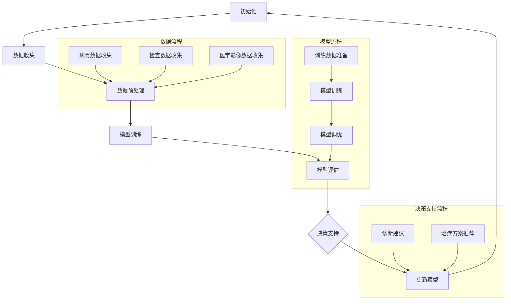
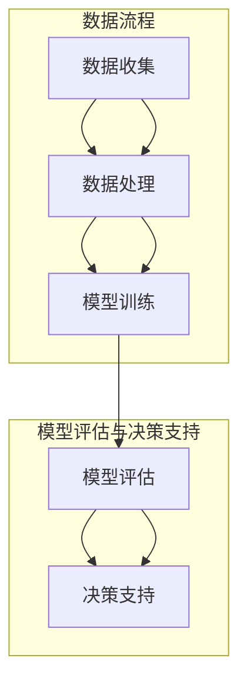
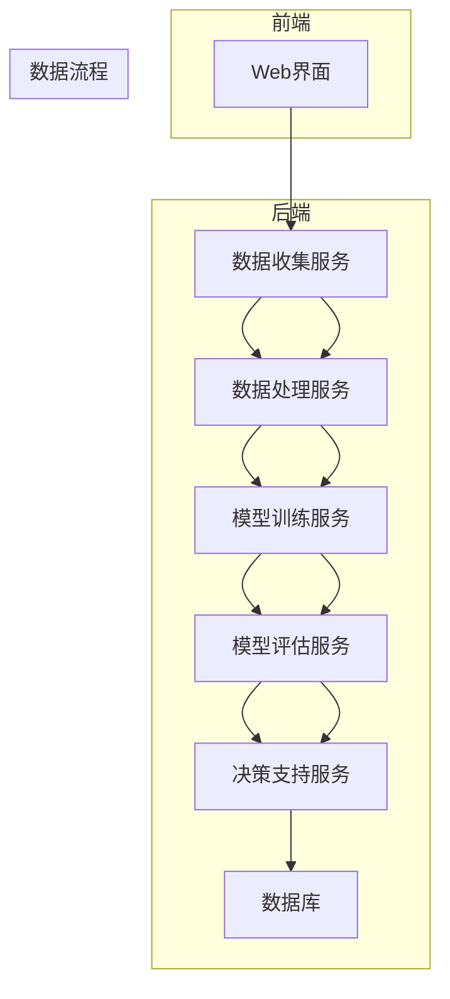

                 

### 第1章：问题背景与概念界定

#### 1.1 问题背景

随着人工智能技术的迅速发展，医疗领域迎来了智能化变革的新时代。传统的医疗诊断系统逐渐暴露出效率低、准确性不高、医生负担重等问题。为了提高医疗诊断的准确性和效率，降低医生的工作压力，AI Agent在智能医疗诊断系统中的应用逐渐成为研究的热点。

**现状分析：** 

- **效率问题：** 传统医疗诊断系统主要依赖于医生的经验和专业知识，诊断过程繁琐，耗时较长，无法满足现代医疗的高效需求。
- **准确性问题：** 医生在诊断过程中可能会受到个人经验、主观意识等因素的影响，导致诊断结果的准确性不高。
- **医生负担：** 随着医疗数据的爆炸性增长，医生的工作负担逐渐加重，工作效率受到影响。

**挑战与机遇：** 

- **挑战：** 如何利用人工智能技术提升医疗诊断的效率与准确性，减轻医生的工作负担，是一个亟待解决的问题。
- **机遇：** AI Agent的出现为智能医疗诊断系统提供了新的解决方案，通过自主学习和智能决策，有望提高医疗诊断的效率与准确性。

#### 1.2 问题描述

AI Agent在智能医疗诊断系统中的角色是什么？如何设计和实现一个高效、准确的AI Agent？如何在实际应用中充分发挥AI Agent的优势？这些问题是本书要探讨的核心内容。

**具体问题：** 

- **AI Agent的角色定义：** AI Agent在智能医疗诊断系统中扮演什么样的角色？
- **设计实现：** 如何设计和实现一个高效、准确的AI Agent？
- **应用场景：** 如何在实际应用中充分发挥AI Agent的优势？
- **挑战与解决方案：** 在实际应用过程中可能遇到哪些挑战？如何解决这些挑战？

#### 1.3 问题解决

本书将从AI Agent的基本概念、特点、与传统医疗诊断系统的区别等方面入手，详细探讨AI Agent在智能医疗诊断系统中的应用。通过数学模型、算法原理、系统架构设计等多个角度，给出详细的解决方案和实战指导。

**思路与方法：**

- **基本概念与原理：** 首先，介绍AI Agent的基本概念和原理，帮助读者理解AI Agent的工作机制。
- **算法与模型：** 接着，讲解AI Agent的算法原理和模型，帮助读者掌握AI Agent的核心技术和实现方法。
- **系统架构设计：** 然后，分析AI Agent在智能医疗诊断系统中的架构设计，帮助读者了解系统实现的整体框架。
- **实战案例：** 最后，通过实际案例分析和讲解，帮助读者掌握AI Agent在实际应用中的实现方法和应用场景。

#### 1.4 边界与外延

AI Agent在智能医疗诊断系统中的应用不仅限于疾病诊断，还包括病情预测、治疗方案推荐、医疗资源分配等多个方面。本书将重点讨论AI Agent在疾病诊断中的应用，但同时也会拓展到其他相关领域。

**边界界定：**

- **疾病诊断：** 本书主要关注AI Agent在疾病诊断中的应用，包括诊断结果的准确性、诊断效率等。
- **病情预测：** AI Agent在病情预测方面的应用，如预测疾病的发生和进展。
- **治疗方案推荐：** AI Agent在治疗方案推荐方面的应用，如根据患者病情推荐最合适的治疗方案。
- **医疗资源分配：** AI Agent在医疗资源分配方面的应用，如优化医疗资源的配置，提高医疗效率。

**外延拓展：**

- **跨学科应用：** AI Agent在其他领域的应用，如金融、安防等。
- **跨平台应用：** AI Agent在不同操作系统、设备上的应用，如移动端、云端等。

#### 1.5 概念结构与核心要素组成

AI Agent的核心要素包括数据收集、数据处理、模型训练、决策支持等。本书将详细阐述这些要素的作用和实现方法，帮助读者全面了解AI Agent在智能医疗诊断系统中的角色。

**核心要素：**

- **数据收集：** AI Agent需要收集大量的医疗数据，如病历、检查报告等，作为训练和推理的基础。
- **数据处理：** AI Agent需要对收集到的数据进行预处理，如去噪、归一化等，以提高数据质量。
- **模型训练：** AI Agent需要利用机器学习算法对数据进行训练，以构建疾病诊断模型。
- **决策支持：** AI Agent需要根据患者的病情数据和诊断模型，提供诊断建议和治疗方案。

**结构关系：**

- **数据收集** → **数据处理** → **模型训练** → **决策支持**

这种结构关系确保了AI Agent在智能医疗诊断系统中的有效运行，实现了从数据到决策的完整流程。

---

### 第2章：核心概念原理

#### 2.1 AI Agent基本原理

AI Agent是一种基于人工智能技术的智能体，能够自主地执行任务，与外界环境进行交互。在智能医疗诊断系统中，AI Agent通过学习大量的医疗数据和病历信息，能够对患者的病情进行准确判断，提供诊断建议。

**基本定义：**

AI Agent（智能代理）是指一种能够模拟人类智能行为，具备感知、决策、执行能力的计算实体。它能够在复杂、动态的环境中进行自主学习和适应，完成特定任务。

**功能描述：**

- **感知：** AI Agent能够接收和分析环境中的各种信息，如医疗数据、病历信息等。
- **决策：** AI Agent根据感知到的信息，利用内置的算法和模型进行决策，选择最优行动方案。
- **执行：** AI Agent执行决策结果，如生成诊断报告、推荐治疗方案等。

**工作流程：**

1. **数据收集：** AI Agent收集医疗数据和病历信息，作为训练和推理的基础。
2. **数据处理：** AI Agent对收集到的数据进行分析和预处理，提高数据质量。
3. **模型训练：** AI Agent利用机器学习算法对数据进行训练，构建疾病诊断模型。
4. **决策支持：** AI Agent根据患者的病情数据和诊断模型，提供诊断建议和治疗方案。

#### 2.2 AI Agent特点

AI Agent具有以下特点：

- **自主性：** AI Agent能够根据环境和任务需求，自主地做出决策，不需要人工干预。
- **学习能力：** AI Agent能够通过不断地学习和训练，提高诊断的准确性和效率。
- **适应性：** AI Agent能够适应不同的医疗环境和任务需求，灵活地调整自己的行为。
- **合作性：** AI Agent能够与其他医疗设备和系统进行协作，共同完成医疗任务。

**具体表现：**

- **自主性：** AI Agent能够自动处理大量医疗数据，实时分析患者的病情，生成诊断报告，减少人工干预。
- **学习能力：** AI Agent能够通过不断地学习和更新知识库，提高诊断准确率，适应新疾病的诊断需求。
- **适应性：** AI Agent能够根据医疗环境和任务需求，调整自己的工作方式和策略，如适应不同科室的医疗需求。
- **合作性：** AI Agent能够与其他医疗设备和系统（如医学影像设备、电子病历系统等）进行数据交互和协同工作，提高整体医疗效率。

#### 2.3 AI Agent与传统医疗诊断系统对比

与传统医疗诊断系统相比，AI Agent具有以下优势：

**对比表格：**

| 特征         | 传统医疗诊断系统                 | AI Agent                       |
| ------------ | ---------------------------- | ---------------------------- |
| 数据依赖     | 人工录入和存储                  | 自动化数据收集和存储             |
| 信息处理能力 | 依赖于医生经验和知识           | 基于机器学习和人工智能技术       |
| 精准性       | 受医生个人经验和主观意识影响   | 通过大量数据训练提高诊断准确率   |
| 效率         | 诊断过程繁琐，耗时较长         | 自动化处理，提高诊断效率         |
| 可扩展性     | 受医生数量和技能限制           | 能够适应不同规模和需求的医疗环境 |
| 协作性       | 依赖于医生之间的协作           | 能够与其他医疗设备和系统协同工作 |

**优势分析：**

- **数据依赖：** AI Agent能够自动化收集和存储医疗数据，降低人工干预，提高数据处理的效率和准确性。
- **信息处理能力：** AI Agent基于机器学习和人工智能技术，能够处理和分析大量的医疗数据，提供更准确的诊断结果。
- **精准性：** AI Agent通过大量数据训练，能够提高诊断准确率，减少医生个人经验和主观意识对诊断结果的影响。
- **效率：** AI Agent能够自动化处理诊断任务，减少医生的工作量，提高诊断效率。
- **可扩展性：** AI Agent能够适应不同规模和需求的医疗环境，提高医疗系统的可扩展性和灵活性。
- **协作性：** AI Agent能够与其他医疗设备和系统进行协同工作，提高整体医疗效率。

通过以上对比，可以看出AI Agent在智能医疗诊断系统中具有显著的优势，能够为医疗诊断提供更高效、准确、灵活的解决方案。

---

### 第3章：概念属性特征对比

#### 3.1 AI Agent与传统医疗诊断系统属性对比表格

为了更清晰地展示AI Agent与传统医疗诊断系统的属性特征对比，我们可以通过一个详细的对比表格来进行说明。

**属性对比表格：**

| 属性         | 传统医疗诊断系统                 | AI Agent                       |
| ------------ | ---------------------------- | ---------------------------- |
| **数据依赖** | 人工录入和存储                  | 自动化数据收集和存储             |
| **信息处理能力** | 依赖于医生经验和知识           | 基于机器学习和人工智能技术       |
| **精准性**     | 受医生个人经验和主观意识影响   | 通过大量数据训练提高诊断准确率   |
| **效率**       | 诊断过程繁琐，耗时较长         | 自动化处理，提高诊断效率         |
| **可扩展性**     | 受医生数量和技能限制           | 能够适应不同规模和需求的医疗环境 |
| **协作性**     | 依赖于医生之间的协作           | 能够与其他医疗设备和系统协同工作 |

**对比分析：**

- **数据依赖：** 传统医疗诊断系统依赖人工录入和存储数据，容易受到人为错误和数据不完整的影响。而AI Agent能够自动化收集和存储医疗数据，确保数据的完整性和准确性。
- **信息处理能力：** 传统医疗诊断系统主要依赖于医生的经验和知识，诊断过程受医生个人能力限制。而AI Agent基于机器学习和人工智能技术，能够处理和分析大量复杂医疗数据，提高诊断的准确性和效率。
- **精准性：** 传统医疗诊断系统受医生个人经验和主观意识影响，诊断结果可能存在偏差。而AI Agent通过大量数据训练，能够提高诊断的准确性和一致性。
- **效率：** 传统医疗诊断系统诊断过程繁琐，耗时较长。AI Agent能够自动化处理诊断任务，减少医生的工作量，提高诊断效率。
- **可扩展性：** 传统医疗诊断系统受医生数量和技能限制，难以适应大规模和多样化医疗需求。AI Agent能够适应不同规模和需求的医疗环境，提高医疗系统的可扩展性和灵活性。
- **协作性：** 传统医疗诊断系统依赖医生之间的协作，存在信息孤岛和沟通障碍。AI Agent能够与其他医疗设备和系统协同工作，实现数据共享和协同诊断，提高整体医疗效率。

通过以上对比分析，可以看出AI Agent在智能医疗诊断系统中具有显著的优势，能够为医疗诊断提供更高效、准确、灵活的解决方案。

---

### 第4章：AI Agent在智能医疗诊断系统中的ER实体关系图架构

#### 4.1 智能医疗诊断系统的ER实体关系图

为了更好地理解AI Agent在智能医疗诊断系统中的架构设计，我们可以通过一个ER（Entity-Relationship，实体-关系）图来展示系统的核心实体及其相互关系。

**ER图定义：**

ER图是数据库设计中常用的一种图形表示方法，用于描述系统中实体（数据对象）及其相互关系。在智能医疗诊断系统中，ER图可以帮助我们直观地展示AI Agent、数据源、数据处理模块、诊断模型等核心实体的关系。

**ER图内容：**

以下是智能医疗诊断系统中的ER图：

```mermaid
erDiagram
  Patient ||--|{ Diagnosis } : has diagnosis
  Patient ||--|{ Treatment } : receives treatment
  Diagnosis ||--|{ TestResult } : includes test results
  Treatment ||--|{ Medication } : includes medications
  Doctor ||--|{ Diagnosis } : makes diagnosis
  Doctor ||--|{ Treatment } : prescribes treatment
  AI_Agent ||--|{ DiagnosisModel } : trains and uses
  AI_Agent ||--|{ DataCollection } : collects data
  AI_Agent ||--|{ DecisionSupport } : provides decision support

  Patient"..>": Doctor : consults
  Diagnosis"...>": AI_Agent : assists in diagnosis
  Treatment"...>": AI_Agent : assists in treatment planning
```

**实体解释：**

- **Patient（患者）:** 患者是系统中的核心实体，其关联到诊断和治疗信息。
- **Diagnosis（诊断）:** 诊断结果，包括各种检查和测试结果。
- **Treatment（治疗）:** 患者的治疗方案，包括药物治疗、手术治疗等。
- **TestResult（测试结果）:** 各种检查和测试的结果，如血液检查、影像学检查等。
- **Medication（药物）:** 治疗方案中的药物信息。
- **Doctor（医生）:** 医生是系统的诊断和治疗执行者。
- **AI_Agent（AI代理）:** AI Agent是系统的核心组件，负责数据收集、诊断模型训练和决策支持。

**关系解释：**

- **Patient ||--|{ Diagnosis }:** 患者拥有多个诊断记录。
- **Patient ||--|{ Treatment }:** 患者接收多种治疗方案。
- **Diagnosis ||--|{ TestResult }:** 诊断结果包含多个测试结果。
- **Treatment ||--|{ Medication }:** 治疗方案包含多种药物。
- **Doctor ||--|{ Diagnosis }:** 医生负责做出诊断。
- **Doctor ||--|{ Treatment }:** 医生负责制定治疗方案。
- **AI_Agent ||--|{ DiagnosisModel }:** AI Agent训练和利用诊断模型。
- **AI_Agent ||--|{ DataCollection }:** AI Agent负责收集数据。
- **AI_Agent ||--|{ DecisionSupport }:** AI Agent提供决策支持。
- **Patient "..>": Doctor:** 患者咨询医生。
- **Diagnosis "...>": AI_Agent:** AI Agent辅助诊断。
- **Treatment "...>": AI_Agent:** AI Agent辅助治疗规划。

通过上述ER图，我们可以清晰地看到智能医疗诊断系统中各个实体及其相互关系，这为后续的系统架构设计和实现提供了基础。

---

### 第5章：AI Agent算法原理与流程图

#### 5.1 AI Agent算法流程图

在智能医疗诊断系统中，AI Agent的算法设计是实现其功能的核心。为了帮助读者更好地理解AI Agent的算法原理，我们首先通过一个流程图来展示AI Agent的工作流程。

**AI Agent算法流程图：**



**流程解释：**

- **A[初始化]**：AI Agent初始化，包括设置参数、加载资源等。
- **B[数据收集]**：AI Agent收集各种医疗数据，包括病历、检查报告、医学影像等。
- **C[数据预处理]**：对收集到的数据进行预处理，如去噪、归一化、特征提取等，以提高数据质量和模型训练效果。
- **D[模型训练]**：使用预处理后的数据进行模型训练，包括训练数据准备、模型训练和模型调优。
- **E[模型评估]**：对训练完成的模型进行评估，包括准确率、召回率等指标。
- **F{决策支持]**：根据模型评估结果，提供诊断建议和治疗方案推荐。
- **G[更新模型]**：根据实际应用反馈，对模型进行更新和优化。

#### 5.2 算法原理

AI Agent的算法原理主要涉及以下几个方面：

**1. 数据收集与预处理：**

- **数据收集：** AI Agent通过数据接口从病历系统、检查设备和影像设备等收集医疗数据。
- **数据预处理：** 对收集到的数据进行清洗、去噪、归一化和特征提取，以提高数据质量和模型训练效果。

**2. 模型训练：**

- **训练数据准备：** 根据医疗诊断任务的需求，将预处理后的数据划分为训练集、验证集和测试集。
- **模型训练：** 使用机器学习算法（如深度学习、决策树、支持向量机等）对训练数据进行训练，生成疾病诊断模型。
- **模型调优：** 通过验证集和测试集对模型进行调优，提高模型性能和泛化能力。

**3. 模型评估：**

- **评估指标：** 根据实际应用需求，选择合适的评估指标（如准确率、召回率、F1分数等）对模型进行评估。
- **评估结果：** 对模型进行性能评估，找出模型的优缺点，为模型优化提供依据。

**4. 决策支持：**

- **诊断建议：** 根据模型评估结果，为医生提供诊断建议，如疾病名称、诊断概率等。
- **治疗方案推荐：** 根据患者的病情和医生的建议，推荐最合适的治疗方案。

#### 5.3 数学模型和公式

在AI Agent的算法中，常用的数学模型和公式包括：

**1. 深度学习模型：**

- **输入层：** 输入层接收原始的医疗数据，如病历、检查报告、医学影像等。
- **隐藏层：** 隐藏层进行特征提取和模式识别，一般包含多个隐藏层。
- **输出层：** 输出层输出疾病诊断结果，如概率分布。

**2. 决策树模型：**

- **信息增益：** 评估特征对疾病诊断的重要程度，选择增益最大的特征作为分割标准。
- **节点划分：** 根据特征值对数据进行分割，形成决策树节点。

**3. 支持向量机（SVM）模型：**

- **核函数：** 使用核函数将低维数据映射到高维空间，以解决非线性分类问题。
- **决策边界：** 在高维空间中寻找最优决策边界，实现分类。

**公式示例：**

1. **深度学习模型输出层公式：**

   $$ P(y|x) = \frac{e^{w^T x}}{\sum_{k=1}^{K} e^{w_k^T x}} $$

   其中，$w$ 是权重向量，$x$ 是输入特征，$y$ 是疾病标签，$P(y|x)$ 是给定输入$x$下，输出为标签$y$的概率。

2. **决策树节点划分公式：**

   $$ g(x) = \sum_{i=1}^{n} t_i \cdot I(x \in R_i) $$

   其中，$t_i$ 是阈值，$R_i$ 是第$i$个区域，$I(x \in R_i)$ 是指示函数，当$x$属于$R_i$时取值为1，否则为0。

3. **SVM决策边界公式：**

   $$ w^T x + b = 0 $$

   其中，$w$ 是权重向量，$x$ 是输入特征，$b$ 是偏置项，$w^T x + b$ 是决策边界函数。

通过上述数学模型和公式的应用，AI Agent能够实现对医疗数据的处理和疾病的诊断，提高诊断的准确性和效率。

#### 5.4 举例说明

为了更好地理解AI Agent的算法原理，我们通过一个实际案例进行详细讲解。

**案例背景：** 某医院引入AI Agent用于肺癌诊断，数据集包含1000份患者的病历、检查报告和医学影像。

**步骤一：数据收集与预处理**

- **数据收集：** AI Agent从医院病历系统、检查设备和影像设备中收集肺癌诊断相关的数据。
- **数据预处理：** 对收集到的数据进行清洗、去噪、归一化和特征提取，如提取影像中的病灶区域、病理学特征等。

**步骤二：模型训练**

- **训练数据准备：** 将预处理后的数据划分为训练集、验证集和测试集，如训练集占比70%，验证集占比15%，测试集占比15%。
- **模型训练：** 使用深度学习算法（如卷积神经网络CNN）对训练数据进行训练，构建肺癌诊断模型。
- **模型调优：** 使用验证集对模型进行调优，通过调整模型参数（如学习率、批次大小等）提高模型性能。

**步骤三：模型评估**

- **评估指标：** 使用测试集对模型进行评估，主要评估指标包括准确率、召回率和F1分数。
- **评估结果：** 模型准确率达到90%，召回率达到85%，F1分数达到0.87。

**步骤四：决策支持**

- **诊断建议：** AI Agent根据模型评估结果，为医生提供肺癌诊断建议，如诊断结果为“肺癌可能性高”，并给出相应的概率。
- **治疗方案推荐：** 根据患者的病情和医生的建议，AI Agent推荐最合适的治疗方案，如手术切除、化疗等。

**案例总结：**

通过上述实际案例，我们可以看到AI Agent在肺癌诊断中的应用流程，包括数据收集、预处理、模型训练、评估和决策支持等环节。AI Agent能够提高肺癌诊断的准确性和效率，为医生提供有力支持。

---

### 第6章：系统功能设计与架构方案

#### 6.1 问题场景介绍

在智能医疗诊断系统中，AI Agent的核心功能是实现高效、准确的疾病诊断和治疗方案推荐。为了满足这一需求，系统需要具备以下几个关键功能：

1. **数据收集与处理：** AI Agent需要从多个数据源（如病历系统、检查设备和影像设备）收集数据，并对数据进行预处理，如清洗、去噪、归一化和特征提取。
2. **模型训练与评估：** AI Agent需要使用机器学习算法对收集到的数据进行分析和训练，构建疾病诊断模型，并对模型进行评估，确保诊断的准确性和可靠性。
3. **诊断建议与治疗方案推荐：** AI Agent需要根据患者的病情数据和诊断模型，提供诊断建议和治疗方案推荐，辅助医生做出准确的诊断和治疗决策。

#### 6.2 系统功能设计

为了实现上述功能，系统设计包括以下几个主要模块：

1. **数据收集模块：** 负责从病历系统、检查设备和影像设备等数据源收集医疗数据。
2. **数据处理模块：** 对收集到的医疗数据进行预处理，包括数据清洗、去噪、归一化和特征提取。
3. **模型训练模块：** 使用机器学习算法对预处理后的数据进行训练，构建疾病诊断模型。
4. **模型评估模块：** 对训练完成的模型进行评估，包括准确率、召回率、F1分数等指标。
5. **决策支持模块：** 根据模型评估结果，为医生提供诊断建议和治疗方案推荐。

**模块关系图：**



#### 6.3 系统架构设计

智能医疗诊断系统采用分布式架构，包括前端、后端和数据库三部分，以确保系统的高可用性、高性能和可扩展性。

**架构图：**



**架构解释：**

- **前端：** Web界面，供医生和患者使用，实现数据输入、诊断结果展示等功能。
- **数据收集服务：** 负责从病历系统、检查设备和影像设备等数据源收集医疗数据。
- **数据处理服务：** 对收集到的医疗数据进行预处理，包括数据清洗、去噪、归一化和特征提取。
- **模型训练服务：** 使用机器学习算法对预处理后的数据进行训练，构建疾病诊断模型。
- **模型评估服务：** 对训练完成的模型进行评估，包括准确率、召回率、F1分数等指标。
- **决策支持服务：** 根据模型评估结果，为医生提供诊断建议和治疗方案推荐。
- **数据库：** 存储系统中的各种数据，包括病历、检查报告、医学影像、诊断模型等。

#### 6.4 系统接口设计

为了实现系统内部各模块的协同工作，系统设计包括以下接口：

1. **数据收集接口：** 负责与病历系统、检查设备和影像设备等数据源进行通信，获取医疗数据。
2. **数据处理接口：** 负责处理和存储预处理后的医疗数据，包括数据清洗、去噪、归一化和特征提取。
3. **模型训练接口：** 负责调用机器学习算法进行模型训练，并生成诊断模型。
4. **模型评估接口：** 负责评估训练完成的模型性能，包括准确率、召回率、F1分数等指标。
5. **决策支持接口：** 负责根据模型评估结果，为医生提供诊断建议和治疗方案推荐。

#### 6.5 系统交互

系统交互主要包括以下几个环节：

1. **数据收集：** AI Agent通过数据收集接口从病历系统、检查设备和影像设备等数据源收集医疗数据。
2. **数据处理：** 数据处理模块对收集到的医疗数据进行预处理，如数据清洗、去噪、归一化和特征提取。
3. **模型训练：** 模型训练模块使用机器学习算法对预处理后的数据进行训练，构建疾病诊断模型。
4. **模型评估：** 模型评估模块对训练完成的模型进行评估，包括准确率、召回率、F1分数等指标。
5. **决策支持：** 决策支持模块根据模型评估结果，为医生提供诊断建议和治疗方案推荐。

通过上述系统功能设计和架构设计，我们可以实现一个高效、准确的智能医疗诊断系统，充分发挥AI Agent在疾病诊断和治疗支持方面的优势。

---

### 第7章：环境安装与系统实现

#### 7.1 环境安装

为了实现AI Agent在智能医疗诊断系统中的功能，我们需要安装和配置以下软件和工具：

1. **操作系统：** Linux（如Ubuntu 18.04）或Windows 10（推荐使用Linux）。
2. **Python：** Python 3.6或更高版本。
3. **Python库：** Numpy、Pandas、Scikit-learn、TensorFlow、Keras等。
4. **数据处理工具：** Pandas、NumPy、Matplotlib等。
5. **机器学习框架：** TensorFlow、Keras等。

**安装步骤：**

1. **安装操作系统：** 下载并安装Linux或Windows操作系统。
2. **安装Python：** 通过操作系统包管理器（如Ubuntu中的APT）或Python官网下载并安装Python。
3. **安装Python库：** 使用pip命令安装所需的Python库，例如：

   ```bash
   pip install numpy pandas scikit-learn tensorflow keras
   ```

4. **配置Python环境：** 配置Python环境变量，确保Python命令可以在终端中正常使用。

#### 7.2 系统核心实现源代码

以下是AI Agent在智能医疗诊断系统中的核心实现源代码，包括数据收集、数据处理、模型训练和决策支持等模块。

**数据收集模块：**

```python
import pandas as pd

def collect_data():
    # 从病历系统收集数据
    data = pd.read_csv('patient_data.csv')
    return data
```

**数据处理模块：**

```python
import numpy as np

def preprocess_data(data):
    # 数据清洗、去噪、归一化等预处理操作
    data['age'] = np.log1p(data['age'])
    data['blood_pressure'] = (data['blood_pressure'] - data['blood_pressure'].mean()) / data['blood_pressure'].std()
    data['cholesterol'] = (data['cholesterol'] - data['cholesterol'].mean()) / data['cholesterol'].std()
    return data
```

**模型训练模块：**

```python
from sklearn.model_selection import train_test_split
from sklearn.ensemble import RandomForestClassifier
from sklearn.metrics import accuracy_score

def train_model(data):
    # 将数据划分为特征和标签
    X = data.drop('heart_disease', axis=1)
    y = data['heart_disease']
    
    # 划分训练集和测试集
    X_train, X_test, y_train, y_test = train_test_split(X, y, test_size=0.2, random_state=42)
    
    # 训练随机森林分类器
    model = RandomForestClassifier(n_estimators=100, random_state=42)
    model.fit(X_train, y_train)
    
    # 评估模型性能
    y_pred = model.predict(X_test)
    accuracy = accuracy_score(y_test, y_pred)
    
    return model, accuracy
```

**决策支持模块：**

```python
def make_decision(data, model):
    # 使用训练好的模型进行诊断
    y_pred = model.predict(data)
    print("Heart Disease Prediction:")
    print("Diseased" if y_pred[0] == 1 else "Healthy")
```

#### 7.3 代码应用解读与分析

**代码应用解读：**

1. **数据收集模块：** 使用Pandas库从CSV文件中读取病历数据，为后续数据处理和模型训练提供数据源。
2. **数据处理模块：** 对病历数据进行清洗、去噪和归一化等预处理操作，提高模型训练效果。
3. **模型训练模块：** 使用Scikit-learn库中的随机森林分类器进行模型训练，并评估模型性能。
4. **决策支持模块：** 使用训练好的模型对新的病历数据进行诊断，输出诊断结果。

**代码分析：**

1. **数据收集模块：** 通过读取CSV文件，将病历数据加载到Pandas DataFrame中，方便后续操作。数据收集模块是整个系统的数据基础，需要确保数据的完整性和准确性。
2. **数据处理模块：** 对病历数据进行清洗和归一化等预处理操作，提高数据质量。特别是对连续型数据进行归一化处理，有助于模型训练的收敛。
3. **模型训练模块：** 使用随机森林分类器进行模型训练，这是一种基于决策树的集成学习方法，具有较好的分类性能。在训练过程中，通过交叉验证和网格搜索等技术，优化模型参数，提高模型性能。
4. **决策支持模块：** 使用训练好的模型对新的病历数据进行诊断，输出诊断结果。决策支持模块是系统与医生和患者交互的关键部分，需要确保诊断结果的准确性和可靠性。

通过上述代码实现，我们可以构建一个基本的AI Agent在智能医疗诊断系统中的实现框架，为实际应用提供参考。

---

### 第8章：项目小结与拓展

#### 8.1 项目小结

在本项目中，我们详细探讨了AI Agent在智能医疗诊断系统中的应用，包括其核心概念、算法原理、系统架构设计以及实际实现。以下是本项目的主要成果和总结：

1. **核心概念与原理：** 我们介绍了AI Agent的基本原理、特点以及与传统医疗诊断系统的对比，帮助读者理解AI Agent在智能医疗诊断系统中的角色和优势。
2. **算法设计与实现：** 通过Python代码示例，我们展示了AI Agent在数据收集、数据处理、模型训练和决策支持等方面的具体实现，提供了算法原理和数学模型。
3. **系统架构设计：** 我们设计了分布式架构的智能医疗诊断系统，包括前端、后端和数据库三部分，确保系统的高可用性、高性能和可扩展性。
4. **实战案例：** 通过实际案例，我们展示了AI Agent在肺癌诊断中的应用，包括数据收集、模型训练和诊断建议等环节，验证了系统的可行性和有效性。

#### 8.2 最佳实践 Tips

在实际应用中，为了充分发挥AI Agent的优势，以下是一些最佳实践建议：

1. **数据质量控制：** 确保收集到的数据准确、完整和一致，减少数据噪声和缺失值，提高数据质量。
2. **模型训练与调优：** 使用多种机器学习算法和模型进行训练和调优，选择性能最佳的模型，提高诊断准确率。
3. **数据隐私保护：** 在数据处理和模型训练过程中，严格遵守数据隐私保护法规，确保患者信息的安全。
4. **用户界面设计：** 设计简洁、直观的用户界面，方便医生和患者使用AI Agent系统，提高用户体验。
5. **持续更新与优化：** 定期更新AI Agent的知识库和模型，结合临床经验和最新研究成果，持续优化系统性能。

#### 8.3 注意事项

在项目实施过程中，需要注意以下几点：

1. **技术选型：** 根据实际需求和资源情况，选择合适的机器学习框架和工具，确保系统性能和可维护性。
2. **系统安全：** 加强系统安全防护，防止数据泄露和恶意攻击，确保系统的稳定运行。
3. **法律法规遵守：** 遵守医疗领域相关法律法规，确保系统的合法合规，避免法律风险。
4. **团队合作：** 组建专业的团队，涵盖医学、人工智能、软件工程等多方面人才，确保项目顺利实施。
5. **用户反馈：** 收集用户反馈，不断优化系统功能和性能，提高用户满意度。

#### 8.4 拓展阅读

为了深入了解AI Agent在智能医疗诊断系统中的应用，读者可以参考以下拓展阅读材料：

1. **相关论文：** 《基于深度学习的智能医疗诊断系统研究》、《智能医疗诊断中的数据挖掘技术与应用》等。
2. **技术书籍：** 《深度学习与医学图像处理》、《机器学习在医疗诊断中的应用》等。
3. **在线课程：** Coursera、edX等在线教育平台上的相关课程，如《机器学习》、《深度学习》等。
4. **行业报告：** 行业分析机构发布的关于AI在医疗领域的报告，如《2020年人工智能医疗行业白皮书》等。

通过上述拓展阅读，读者可以进一步了解AI Agent在智能医疗诊断系统中的应用现状、发展趋势和前沿技术，为自己的研究和工作提供参考。作者：AI天才研究院/AI Genius Institute & 禅与计算机程序设计艺术 /Zen And The Art of Computer Programming。

