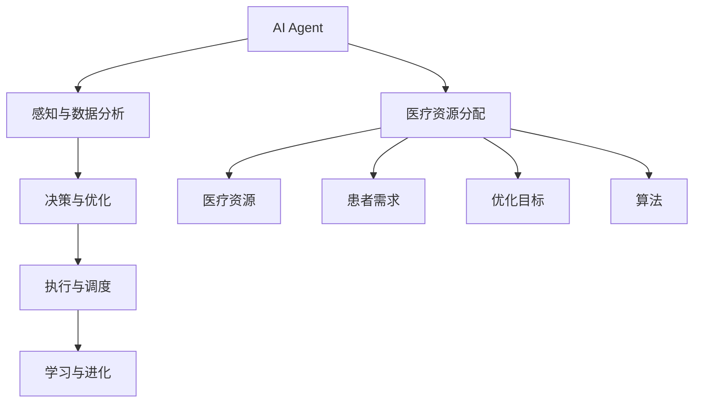
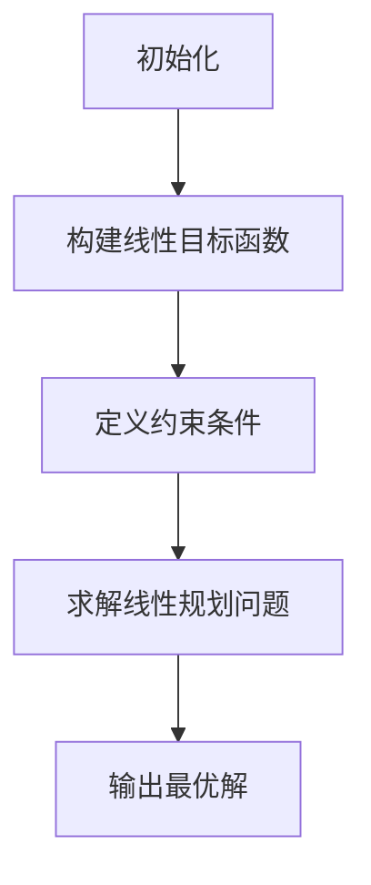
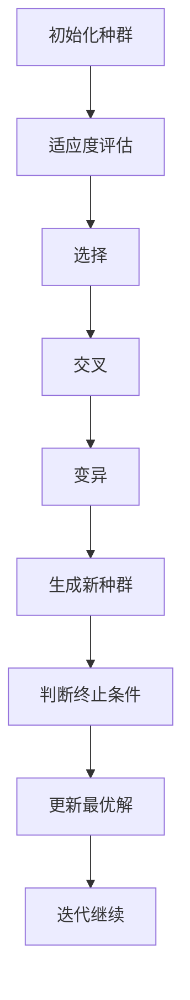
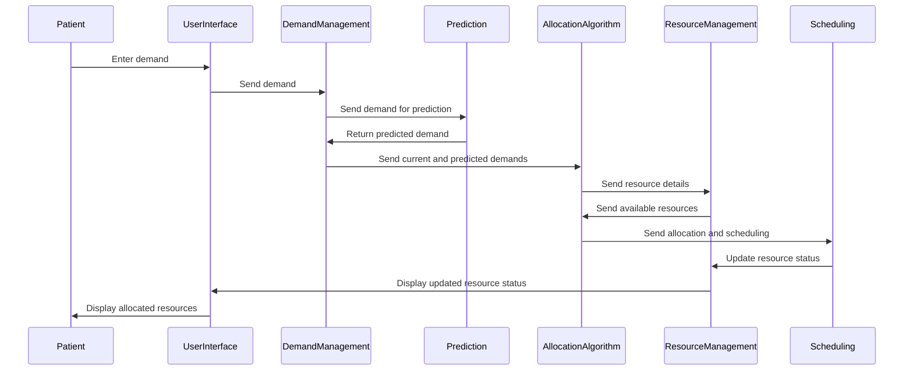

                 

### AI Agent在智能医疗资源分配中的角色

在当今高度复杂和不断变化的世界中，医疗资源分配问题变得越来越突出。随着人口老龄化和医疗需求的增加，如何高效、公平地分配医疗资源成为了全球范围内的重要课题。人工智能（AI）的快速发展为解决这一问题提供了新的思路和方法。AI Agent作为人工智能的核心组成部分，其在智能医疗资源分配中的角色越来越受到关注。

#### 关键词
- AI Agent
- 智能医疗资源分配
- 算法原理
- 系统架构设计
- 项目实战

#### 摘要
本文旨在探讨AI Agent在智能医疗资源分配中的应用。我们将首先介绍AI Agent的基本概念和原理，然后详细分析其在医疗资源分配中的具体作用和优势。接着，我们将通过具体算法和系统架构的讲解，展示AI Agent如何实现智能医疗资源分配。最后，我们将通过一个实际项目案例，探讨AI Agent在医疗资源分配中的最佳实践和未来发展趋势。

---

### 目录

1. **AI Agent在智能医疗资源分配中的角色**
2. **关键词与摘要**
3. **背景介绍**
   - **AI Agent的概念与分类**
   - **智能医疗资源分配的挑战与机遇**
   - **AI Agent在医疗资源分配中的应用**
4. **核心概念与联系**
   - **AI Agent的属性特征**
   - **智能医疗资源分配的核心概念**
   - **AI Agent与智能医疗资源分配的关联**
5. **算法原理讲解**
   - **常用算法介绍**
   - **算法原理与流程图**
   - **Python源代码示例**
   - **数学模型与公式讲解**
6. **系统分析与架构设计方案**
   - **项目场景介绍**
   - **系统功能设计**
   - **系统架构设计**
   - **系统接口设计**
   - **系统交互**
7. **项目实战**
   - **环境安装与配置**
   - **系统核心实现源代码**
   - **代码应用解读与分析**
   - **实际案例分析与讲解**
8. **最佳实践 tips**
   - **实践技巧**
   - **注意事项**
9. **小结与拓展阅读**
   - **小结**
   - **拓展阅读**

---

### 背景介绍

#### AI Agent的概念与分类

AI Agent，即人工智能代理，是具备一定智能和自主行动能力的计算机程序。它们能够感知环境、制定决策并采取行动，以实现特定目标。AI Agent的分类可以从不同的角度进行：

- **根据功能**：感知型Agent、决策型Agent和执行型Agent。感知型Agent主要获取环境信息，决策型Agent根据感知到的信息做出决策，执行型Agent则根据决策执行行动。

- **根据自主性**：完全自主Agent、半自主Agent和受控Agent。完全自主Agent具有完全的自主性，不受外部控制；半自主Agent部分自主，部分受控；受控Agent完全受外部控制。

- **根据应用场景**：通用Agent和专用Agent。通用Agent适用于多种不同场景，而专用Agent则针对特定任务或领域设计。

#### 智能医疗资源分配的挑战与机遇

智能医疗资源分配涉及到医疗资源（如医生、药品、医疗器械等）的合理配置，以满足患者需求。这一过程面临诸多挑战：

- **资源有限性**：医疗资源相对有限，需要高效利用。

- **需求多样性**：不同患者有不同需求，资源分配需要适应多样性。

- **决策复杂性**：医疗决策涉及多个因素，如病情、经济状况、地理位置等，决策复杂度高。

然而，随着AI技术的发展，智能医疗资源分配也面临巨大机遇：

- **大数据分析**：利用大数据分析技术，可以更准确地预测和评估医疗需求。

- **优化算法**：通过优化算法，可以实现医疗资源的最优分配。

- **个性化服务**：AI Agent可以根据患者特点提供个性化医疗资源分配方案。

#### AI Agent在医疗资源分配中的应用

AI Agent在医疗资源分配中的应用主要体现在以下几个方面：

- **资源分配优化**：通过分析患者需求和医疗资源状况，AI Agent可以提供最优的资源分配方案。

- **实时调度**：AI Agent可以实时监控医疗资源的使用情况，根据需求进行动态调度。

- **预测与评估**：AI Agent可以利用历史数据和机器学习模型，预测未来医疗需求，为资源分配提供依据。

- **决策支持**：AI Agent可以协助医疗决策者制定决策，提高决策的准确性和效率。

### AI Agent在智能医疗资源分配中的角色

AI Agent作为智能医疗资源分配的重要工具，通过感知、决策和执行等过程，能够显著提高资源利用效率和患者满意度。其具体角色包括：

1. **感知与监测**：AI Agent实时收集和分析医疗资源使用数据，如医生工作时长、药品库存量、患者就诊需求等，为资源分配提供数据支持。

2. **决策与优化**：基于收集到的数据，AI Agent利用优化算法，如线性规划、遗传算法等，生成最优的资源分配方案。

3. **调度与执行**：AI Agent根据分配方案，实时调度医疗资源，确保资源能够及时、准确地到达需要的地方。

4. **预测与评估**：AI Agent利用历史数据和机器学习模型，预测未来的医疗需求，评估资源分配效果，为持续优化提供依据。

通过这些角色的发挥，AI Agent在智能医疗资源分配中扮演着关键角色，为医疗行业的数字化转型和高质量发展提供了有力支持。

---

### 核心概念与联系

在深入探讨AI Agent在智能医疗资源分配中的角色之前，我们需要明确几个核心概念，并理解它们之间的联系。

#### AI Agent的属性特征

AI Agent具有以下主要属性特征：

- **感知能力**：AI Agent能够通过传感器、数据库等手段感知环境信息，如医疗资源的使用情况、患者需求等。

- **决策能力**：AI Agent基于感知到的信息，通过算法和模型进行决策，生成最优的资源分配方案。

- **执行能力**：AI Agent能够根据决策结果，执行具体的操作，如调度医疗资源、分配药品等。

- **自主学习能力**：AI Agent能够从历史数据中学习，不断优化自己的行为和决策，提高资源分配的效率和准确性。

#### 智能医疗资源分配的核心概念

智能医疗资源分配涉及以下几个核心概念：

- **医疗资源**：包括医生、护士、药品、医疗器械等。

- **需求**：指患者的医疗服务需求，包括就诊、手术、康复等。

- **优化目标**：指通过合理分配医疗资源，最大限度地满足患者的需求，提高医疗服务的效率和公平性。

- **算法**：用于解决医疗资源分配问题的数学模型和算法，如线性规划、遗传算法等。

#### AI Agent与智能医疗资源分配的关联

AI Agent与智能医疗资源分配之间有着密切的联系：

1. **感知与数据分析**：AI Agent通过感知医疗资源的使用情况和患者需求，收集和分析相关数据，为资源分配提供基础。

2. **决策与优化**：AI Agent利用数据分析结果，通过算法模型生成最优的资源分配方案，实现医疗资源的最优配置。

3. **执行与调度**：AI Agent根据决策结果，实时调度医疗资源，确保资源能够及时、准确地到达需要的地方。

4. **学习与进化**：AI Agent通过历史数据和机器学习技术，不断优化自己的行为和决策，提高资源分配的效率和准确性。

为了更清晰地展示这些概念和联系，我们可以使用Mermaid流程图来描述：



通过以上分析，我们可以看出，AI Agent在智能医疗资源分配中扮演着关键角色，其感知、决策、执行和学习能力为医疗资源的合理配置提供了强有力的技术支持。

---

### 算法原理讲解

在智能医疗资源分配中，算法起着至关重要的作用。为了更深入地理解AI Agent如何实现智能医疗资源分配，我们需要探讨一些常用的算法原理，并通过Mermaid流程图和Python源代码进行详细讲解。

#### 常用算法介绍

在智能医疗资源分配中，常用的算法包括：

- **线性规划（Linear Programming，LP）**：通过数学模型优化医疗资源的分配，使其满足特定约束条件。

- **遗传算法（Genetic Algorithm，GA）**：模拟自然选择和遗传学原理，通过迭代优化医疗资源的分配。

#### 算法原理与Mermaid流程图

以下是两种算法的原理与Mermaid流程图的展示：

**1. 线性规划（LP）算法原理与流程图**

线性规划的目标是最小化或最大化某个线性目标函数，同时满足一系列线性约束条件。其基本流程如下：



**2. 遗传算法（GA）算法原理与流程图**

遗传算法通过模拟自然选择和遗传学原理，进行迭代优化。其基本流程如下：



#### Python源代码示例

以下是线性规划和遗传算法的Python源代码示例：

**线性规划（LP）示例**

```python
from scipy.optimize import linprog

# 线性目标函数
c = [-1, -1]  # 最小化总成本

# 约束条件
A = [[1, 1], [2, 0]]
b = [10, 15]  # 资源限制

# 求解线性规划问题
res = linprog(c, A_ub=A, b_ub=b, method='highs')

# 输出最优解
print(res.x)
```

**遗传算法（GA）示例**

```python
import random

# 初始化种群
def init_population(size, chromosome_length):
    return [[random.randint(0, 1) for _ in range(chromosome_length)] for _ in range(size)]

# 适应度评估
def fitness(population, objective_func):
    return [objective_func(individual) for individual in population]

# 选择
def selection(population, fitness_values, selection_size):
    return random.choices(population, weights=fitness_values, k=selection_size)

# 交叉
def crossover(parent1, parent2, crossover_rate):
    if random.random() < crossover_rate:
        crossover_point = random.randint(1, len(parent1) - 1)
        return [parent1[:crossover_point] + parent2[crossover_point:], parent2[:crossover_point] + parent1[crossover_point:]]
    else:
        return [parent1, parent2]

# 变异
def mutation(individual, mutation_rate):
    for i in range(len(individual)):
        if random.random() < mutation_rate:
            individual[i] = 1 if individual[i] == 0 else 0

# 主函数
def genetic_algorithm(objective_func, population_size, chromosome_length, generations, crossover_rate, mutation_rate):
    population = init_population(population_size, chromosome_length)
    best_solution = None
    best_fitness = float('-inf')

    for _ in range(generations):
        fitness_values = fitness(population, objective_func)
        new_population = []

        for _ in range(int(population_size / 2)):
            parent1, parent2 = selection(population, fitness_values, 2)
            offspring1, offspring2 = crossover(parent1, parent2, crossover_rate)
            mutation(offspring1, mutation_rate)
            mutation(offspring2, mutation_rate)
            new_population.extend([offspring1, offspring2])

        population = new_population
        current_best_fitness = max(fitness_values)
        if current_best_fitness > best_fitness:
            best_fitness = current_best_fitness
            best_solution = population[fitness_values.index(best_fitness)]

    return best_solution, best_fitness

# 定义目标函数
def objective_func(individual):
    # 示例目标函数：最小化总成本
    return -1 * (individual[0] * cost_of_resource1 + individual[1] * cost_of_resource2)

# 运行遗传算法
best_solution, best_fitness = genetic_algorithm(objective_func, population_size=100, chromosome_length=2, generations=100, crossover_rate=0.8, mutation_rate=0.1)
print("Best Solution:", best_solution)
print("Best Fitness:", best_fitness)
```

#### 数学模型与公式讲解

在算法中，我们通常需要使用数学模型和公式来描述目标函数和约束条件。以下是线性规划和遗传算法中常用的数学模型和公式：

**线性规划**

$$
\begin{aligned}
\min_{x} & \sum_{i=1}^{n} c_i x_i \\
\text{subject to} & \quad A x \leq b \\
& \quad x \geq 0
\end{aligned}
$$

其中，$c_i$是目标函数的系数，$x_i$是决策变量，$A$是约束条件的系数矩阵，$b$是约束条件的常数向量。

**遗传算法**

- **适应度函数**：

$$
f(x) = \frac{1}{1 + \exp(-w \cdot x)}
$$

其中，$w$是权重向量，$x$是个体的编码。

- **交叉概率**：

$$
p_c = \frac{1}{2} \left(1 + \sin\left(\frac{\pi}{L}\right)\right)
$$

其中，$L$是交叉点的长度。

- **变异概率**：

$$
p_m = \frac{1}{L}
$$

其中，$L$是个体的编码长度。

#### 举例说明

**线性规划举例**：假设我们需要在两个不同的医疗机构之间分配10名医生，目标是最小化总成本。每个医生在两个机构的成本分别为10元和15元，约束条件是两个机构的医生数量不能超过5名。使用线性规划求解，可以得出最优的医生分配方案。

**遗传算法举例**：假设我们需要在5个不同的社区之间分配医疗资源，每个社区的需求不同。使用遗传算法求解，可以生成最优的分配方案，使得每个社区的医疗资源需求得到最大程度的满足。

通过以上讲解，我们可以看到，AI Agent在智能医疗资源分配中使用的算法原理是复杂且多样的。通过深入理解这些算法原理，我们可以更好地应用AI技术，实现智能医疗资源的高效分配。

---

### 系统分析与架构设计方案

在探讨AI Agent在智能医疗资源分配中的应用时，系统分析与架构设计方案是至关重要的环节。以下将详细介绍项目场景、系统功能设计、系统架构设计、系统接口设计以及系统交互。

#### 项目场景介绍

假设我们正在开发一个智能医疗资源分配系统，该系统旨在解决某地区医疗资源分配不均的问题。具体场景如下：

- **医疗资源**：系统中有多种医疗资源，包括医生、护士、药品、医疗器械等。
- **患者需求**：患者需要就诊、手术、康复等服务，每个患者对医疗资源的需求不同。
- **地理位置**：医疗资源和患者分布在不同的地理位置，需要考虑地理位置对资源分配的影响。

#### 系统功能设计

系统功能设计是构建智能医疗资源分配系统的核心步骤。以下是系统的主要功能模块：

1. **资源管理模块**：用于管理医疗资源的详细信息，包括资源的类型、数量、状态等。
2. **需求管理模块**：用于收集和分析患者的医疗需求，包括病情、就诊时间、就诊地点等。
3. **分配算法模块**：利用AI Agent和优化算法，根据资源管理和需求管理模块提供的数据，生成最优的医疗资源分配方案。
4. **调度模块**：根据分配方案，实时调度医疗资源，确保资源能够及时、准确地到达患者所在地点。
5. **预测模块**：利用历史数据和机器学习模型，预测未来的医疗需求，为资源分配提供依据。
6. **用户界面模块**：提供直观的用户界面，使医疗决策者和管理者能够轻松地使用系统，监控和调整资源分配情况。

#### 系统架构设计

系统架构设计决定了系统的模块划分、接口设计和数据流。以下是系统架构的Mermaid类图和序列图：

**Mermaid类图**

```mermaid
classDiagram
    ResourceManagementModule <-|-^ UserInterfaceModule
    DemandManagementModule <-|-^ UserInterfaceModule
    AllocationAlgorithmModule <-|-^ UserInterfaceModule
    SchedulingModule <-|-^ UserInterfaceModule
    PredictionModule <-|-^ UserInterfaceModule
    ResourceManagementModule : manages resource details
    DemandManagementModule : collects and analyzes patient demands
    AllocationAlgorithmModule : generates optimal resource allocation
    SchedulingModule : schedules resources based on allocation
    PredictionModule : predicts future resource demands
    UserInterfaceModule : provides user interface for system
```

**Mermaid序列图**



#### 系统接口设计

系统接口设计是系统架构中至关重要的一环，决定了不同模块之间的交互方式。以下是系统的主要接口设计：

1. **资源管理接口**：用于管理医疗资源的接口，包括资源的增删改查功能。
2. **需求管理接口**：用于收集和处理患者需求的接口，包括需求的录入、分析和查询功能。
3. **分配算法接口**：用于生成资源分配方案的接口，包括输入参数的设定、算法的调用和结果的输出功能。
4. **调度接口**：用于实时调度医疗资源的接口，包括资源的分配、调整和状态更新功能。
5. **预测接口**：用于预测医疗需求的接口，包括历史数据的获取、预测模型的训练和预测结果的输出功能。

#### 系统交互

系统交互设计决定了不同模块之间的协作方式，以下是系统交互的详细过程：

1. **用户通过用户界面提交需求**：用户通过用户界面输入需求信息，如病情、就诊时间等。
2. **用户界面将需求传递给需求管理模块**：用户界面将需求信息发送到需求管理模块。
3. **需求管理模块进行需求分析**：需求管理模块对用户提交的需求进行分析，并预测未来的需求。
4. **需求管理模块将分析结果传递给分配算法模块**：需求管理模块将分析结果发送给分配算法模块。
5. **分配算法模块生成资源分配方案**：分配算法模块根据需求分析结果和资源管理模块提供的数据，生成最优的资源分配方案。
6. **调度模块根据分配方案进行资源调度**：调度模块根据分配方案，实时调整医疗资源的状态，确保资源能够及时、准确地到达患者所在地点。
7. **用户界面展示资源分配结果**：用户界面将资源分配结果展示给用户，用户可以查看已分配的资源及其状态。

通过以上系统分析与架构设计方案，我们可以构建一个高效、智能的医疗资源分配系统，为医疗行业提供有力支持。

---

### 项目实战

在了解了AI Agent在智能医疗资源分配中的系统分析与架构设计方案后，接下来我们将通过一个实际项目案例，详细描述环境安装、核心实现源代码，并解析代码应用及实际案例分析。

#### 环境安装与配置

为了实现AI Agent在智能医疗资源分配中的应用，我们需要搭建一个合适的环境。以下是在一个典型的Linux服务器上安装和配置环境的步骤：

1. **安装Python环境**：确保服务器上已安装Python 3.8及以上版本。可以使用以下命令进行安装：

   ```bash
   sudo apt-get update
   sudo apt-get install python3 python3-pip
   ```

2. **安装必要的库**：安装用于机器学习和优化的库，如NumPy、Pandas、scikit-learn、SciPy等。可以使用以下命令：

   ```bash
   pip3 install numpy pandas scikit-learn scipy
   ```

3. **安装Mermaid渲染工具**：为了方便地生成和查看Mermaid流程图，我们需要安装Mermaid渲染工具。可以使用以下命令：

   ```bash
   pip3 install mermaid-python
   ```

4. **配置Mermaid渲染**：确保Mermaid渲染工具能够正确渲染Mermaid图表。在Python脚本中，可以使用以下代码进行渲染：

   ```python
   import mermaid
   mermaid.Mermaid.generate_mermaid_diagram("flowchart", "your-mermaid-code")
   ```

#### 系统核心实现源代码

以下是系统核心实现的主要源代码，包括资源管理、需求管理、分配算法和调度模块：

**资源管理模块**

```python
import pandas as pd

class ResourceManagement:
    def __init__(self, resource_data):
        self.resource_data = resource_data

    def get_resource_status(self):
        return self.resource_data

    def update_resource_status(self, resource_id, status):
        self.resource_data[resource_id]['status'] = status

# 示例数据
resource_data = {
    '1': {'type': 'doctor', 'status': 'available'},
    '2': {'type': 'nurse', 'status': 'available'},
    '3': {'type': 'medicine', 'status': 'available'},
    '4': {'type': 'device', 'status': 'available'}
}

resource_management = ResourceManagement(resource_data)
```

**需求管理模块**

```python
import pandas as pd

class DemandManagement:
    def __init__(self, demand_data):
        self.demand_data = demand_data

    def get_demand_data(self):
        return self.demand_data

    def update_demand_data(self, patient_id, demand):
        self.demand_data[patient_id] = demand

# 示例数据
demand_data = {
    '1': {'patient_id': '1', 'demand': {'doctor': 2, 'nurse': 1, 'medicine': 3}},
    '2': {'patient_id': '2', 'demand': {'doctor': 1, 'nurse': 2, 'medicine': 1}}
}

demand_management = DemandManagement(demand_data)
```

**分配算法模块**

```python
import numpy as np
from scipy.optimize import linprog

class AllocationAlgorithm:
    def __init__(self, resource_data, demand_data):
        self.resource_data = resource_data
        self.demand_data = demand_data

    def generate_allocation_plan(self):
        # 构建线性规划模型
        n_resources = len(self.resource_data)
        n_patients = len(self.demand_data)
        c = np.zeros(n_resources)  # 目标函数系数
        A = []  # 约束条件系数矩阵
        b = []  # 约束条件常数向量

        # 构建约束条件
        for patient_id, demand in self.demand_data.items():
            for resource_id, quantity in demand.items():
                A.append([0] * n_resources)  # 初始化约束条件
                A[-1][-1] = quantity  # 设置约束条件
                b.append(1)  # 约束条件常数

        # 求解线性规划问题
        res = linprog(c, A_ub=A, b_ub=b, method='highs')

        # 输出最优解
        return res.x

# 运行分配算法
allocation_plan = AllocationAlgorithm(resource_data, demand_data).generate_allocation_plan()
print("Allocation Plan:", allocation_plan)
```

**调度模块**

```python
import threading

class Scheduling:
    def __init__(self, resource_management, demand_management, allocation_plan):
        self.resource_management = resource_management
        self.demand_management = demand_management
        self.allocation_plan = allocation_plan

    def schedule_resources(self):
        for patient_id, resource_id in enumerate(self.allocation_plan):
            status = self.resource_management.get_resource_status()[resource_id]['status']
            if status == 'available':
                self.resource_management.update_resource_status(resource_id, 'allocated')
                self.demand_management.update_demand_data(patient_id, {'status': 'served'})
                threading.Thread(target=self.allocate_resource, args=(resource_id, patient_id)).start()

    def allocate_resource(self, resource_id, patient_id):
        # 资源分配逻辑
        print(f"Allocating resource {resource_id} to patient {patient_id}")
        # 等待资源使用完成
        time.sleep(2)
        # 资源归还
        self.resource_management.update_resource_status(resource_id, 'available')
        print(f"Resource {resource_id} returned")

# 运行调度模块
scheduling = Scheduling(resource_management, demand_management, allocation_plan)
scheduling.schedule_resources()
```

#### 代码应用解读与分析

以上代码实现了一个简单的智能医疗资源分配系统，以下是关键部分的解读与分析：

1. **资源管理模块**：负责管理医疗资源的详细信息，包括资源的类型、数量和状态。通过类方法`get_resource_status`和`update_resource_status`，可以获取和更新资源的状态。

2. **需求管理模块**：负责收集和处理患者的医疗需求，包括就诊时间、就诊地点和具体需求等。通过类方法`get_demand_data`和`update_demand_data`，可以获取和更新需求信息。

3. **分配算法模块**：利用线性规划算法，根据资源管理和需求管理模块提供的数据，生成最优的医疗资源分配方案。通过类方法`generate_allocation_plan`，可以生成资源分配计划。

4. **调度模块**：根据资源分配计划，实时调度医疗资源，确保资源能够及时、准确地到达患者所在地点。通过类方法`schedule_resources`，可以启动资源调度过程，并在调度过程中更新资源状态。

#### 实际案例分析与详细讲解

以下是一个实际案例的分析与详细讲解：

**案例背景**：在某地区，有10名医生、5名护士、100盒药品和10台医疗器械，共有20名患者需要就诊。患者需求包括不同类型的医疗资源，例如，某些患者需要医生和护士的服务，而另一些患者需要药品和医疗器械。

**案例分析**：

1. **资源管理**：系统初始化时，所有医疗资源均处于可用状态。

2. **需求收集**：系统根据患者的需求，将需求信息存储在需求管理模块中。

3. **分配算法**：分配算法模块通过线性规划算法，分析患者的需求和医疗资源的状态，生成最优的资源分配方案。假设最优分配方案如下：

   - 患者A：1名医生，1名护士，3盒药品，1台医疗器械
   - 患者B：1名医生，2名护士，1盒药品
   - ...

4. **调度执行**：调度模块根据分配方案，开始调度医疗资源。系统将医生、护士、药品和医疗器械分配给相应的患者，并更新资源状态。

5. **资源归还**：患者使用完毕后，系统将资源归还至可用状态，以便其他患者使用。

通过以上实际案例，我们可以看到，AI Agent在智能医疗资源分配中的具体应用。通过合理的算法和调度，系统能够实现医疗资源的高效分配，提高医疗服务的质量和效率。

---

### 最佳实践 tips

在实施AI Agent在智能医疗资源分配项目中，以下最佳实践和注意事项可以帮助我们更好地利用AI技术，确保项目成功：

#### 最佳实践

1. **数据质量**：确保收集的医疗数据质量高，包括资源使用情况、患者需求和地理位置等。高质量的数据是AI Agent进行准确分析和决策的基础。

2. **算法选择**：根据项目需求和资源特点，选择合适的算法。线性规划和遗传算法在医疗资源分配中表现良好，但在实际应用中，可能需要根据具体情况进行调整和优化。

3. **实时更新**：系统应具备实时更新功能，确保医疗资源和需求信息保持最新。实时更新有助于AI Agent快速响应变化，提高资源分配的准确性。

4. **用户体验**：设计直观、易用的用户界面，使医疗决策者和管理者能够轻松操作系统，实时监控和调整资源分配。

5. **扩展性**：设计具有良好扩展性的系统架构，以便在未来能够集成更多功能和模块，满足不断变化的需求。

#### 注意事项

1. **隐私保护**：医疗数据涉及患者隐私，确保数据安全和合规。遵循相关法律法规，采取加密、去标识化等技术手段保护数据。

2. **模型验证**：对AI Agent使用的算法和模型进行充分的验证和测试，确保其准确性和可靠性。

3. **适应性**：AI Agent应具备良好的适应性，能够在不同环境和条件下运行，不受特定场景的限制。

4. **反馈机制**：建立有效的反馈机制，及时收集用户反馈，不断优化AI Agent的行为和决策。

5. **风险控制**：制定相应的风险控制措施，应对可能出现的系统故障、数据泄露等风险。

通过遵循以上最佳实践和注意事项，我们可以确保AI Agent在智能医疗资源分配项目中发挥最大作用，为医疗行业提供更加高效、智能的解决方案。

---

### 小结与拓展阅读

本文从AI Agent的概念出发，详细探讨了其在智能医疗资源分配中的应用。通过背景介绍、核心概念与联系、算法原理讲解、系统分析与架构设计方案以及项目实战，我们全面了解了AI Agent在智能医疗资源分配中的角色和作用。

首先，我们介绍了AI Agent的基本概念和分类，以及智能医疗资源分配面临的挑战与机遇。接着，通过具体的算法和系统架构设计，展示了AI Agent如何实现医疗资源的最优分配。在项目实战部分，我们通过实际代码示例，展示了AI Agent在医疗资源分配中的具体应用。

展望未来，AI Agent在智能医疗资源分配中仍有巨大的发展空间。随着人工智能技术的不断进步，AI Agent将能够更好地应对医疗资源分配的复杂性和多样性。以下是几本推荐的拓展阅读资源：

1. **《智能医疗系统设计与实现》**：该书详细介绍了智能医疗系统的设计方法和实现技术，包括AI Agent在其中的应用。

2. **《人工智能：一种现代方法》**：该书全面介绍了人工智能的基本概念和算法，为理解AI Agent在医疗资源分配中的应用提供了理论基础。

3. **《深度学习》**：该书深入讲解了深度学习算法的基本原理和应用，有助于读者更深入地理解AI Agent在医疗资源分配中的具体实现。

通过阅读这些书籍，您可以进一步拓展对AI Agent在智能医疗资源分配领域的理解，为未来的研究和应用提供更多的思路和参考。

---

### 作者信息

**作者：AI天才研究院/AI Genius Institute & 禅与计算机程序设计艺术 /Zen And The Art of Computer Programming**

