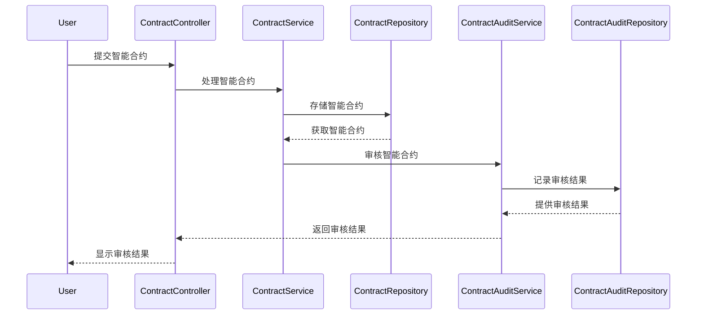

                 

### 引言：智能合约审核与AI Agent应用

#### 1.1 智能合约审核的背景与重要性

智能合约是区块链技术的一个重要组成部分，它们是自动执行的合约，可以自我执行当预定的条件被满足时。由于智能合约的自执行特性，它们在去中心化金融（DeFi）、供应链管理、投票系统等领域有着广泛的应用。然而，智能合约的自动执行特性也意味着如果存在漏洞或错误，这些错误可能被自动执行并造成巨大的损失。因此，智能合约的审核变得尤为重要。

智能合约审核是指对智能合约代码进行全面检查，以确保其安全性、合规性和正确性。审核过程包括对智能合约代码的语法、语义和逻辑进行分析，以及检查是否存在潜在的安全漏洞、逻辑错误或未授权的操作。随着智能合约的应用越来越广泛，智能合约审核的复杂性也在不断增加，这就需要高效的审核工具和策略。

AI Agent，即人工智能代理，是一种能够执行特定任务的人工智能系统。它们可以根据预设的规则和算法，自主地执行任务，收集数据，学习和优化性能。AI Agent在智能合约审核中的应用前景广阔，可以显著提高审核效率和准确性。

#### 1.2 AI Agent的概念、特性与类型

AI Agent是一种能够模拟人类智能行为的人工智能实体，具有以下基本特性：

1. **自主性**：AI Agent能够自主地执行任务，而不需要人工干预。
2. **适应性**：AI Agent可以根据环境和任务的变化，自主调整其行为。
3. **学习能力**：AI Agent能够通过经验和数据不断学习，提高任务执行的效果。
4. **交互性**：AI Agent能够与用户和外部系统进行交互，获取信息和反馈。

根据AI Agent的功能和应用场景，它们可以大致分为以下几类：

1. **基于规则的AI Agent**：这类AI Agent根据预设的规则和条件来执行任务，通常用于自动化流程和决策。
2. **基于机器学习的AI Agent**：这类AI Agent通过机器学习算法从数据中学习，并自主地调整其行为。
3. **基于自然语言处理的AI Agent**：这类AI Agent能够理解和生成自然语言，用于人机交互和内容分析。

#### 1.3 智能合约审核的基本流程

智能合约审核通常包括以下几个步骤：

1. **智能合约代码审查**：对智能合约代码进行语法和结构检查，以确保代码的规范性和可读性。
2. **逻辑分析**：对智能合约的代码进行逻辑分析，检查是否存在潜在的逻辑错误或安全漏洞。
3. **安全测试**：对智能合约进行安全测试，以发现潜在的安全漏洞，如重入攻击、逻辑错误等。
4. **合规性检查**：检查智能合约是否符合相关的法律法规和业务要求。
5. **代码优化**：对智能合约代码进行优化，以提高其性能和可维护性。

在智能合约审核的过程中，AI Agent可以发挥重要的作用。例如，AI Agent可以通过自然语言处理技术理解智能合约的代码和描述，从而自动生成测试用例；通过机器学习算法分析历史审核数据，提高审核的准确性和效率；通过自动化测试工具执行大量的测试用例，发现潜在的安全漏洞。

随着AI技术的不断发展，AI Agent在智能合约审核中的应用将会越来越广泛，也将为区块链技术的安全性和可靠性提供强有力的保障。

### 第二部分：AI Agent在智能合约审核中的应用算法

#### 2.1 机器学习算法在智能合约审核中的应用

机器学习算法是AI Agent在智能合约审核中的重要工具，它们可以通过分析历史数据来预测潜在的漏洞和错误。以下是机器学习算法在智能合约审核中的应用：

##### 2.1.1 机器学习算法的基本原理

机器学习算法是一种让计算机通过数据学习规律并作出预测的方法。它主要包括以下几种类型：

1. **监督学习（Supervised Learning）**：在这种方法中，算法根据已知的数据集来训练模型，然后使用这个模型对未知数据进行预测。常见的监督学习算法包括线性回归、决策树和随机森林等。

2. **无监督学习（Unsupervised Learning）**：在这种方法中，算法没有提供标签数据，需要通过数据自身的特征来发现模式和结构。常见的无监督学习算法包括聚类、降维和关联规则学习等。

3. **强化学习（Reinforcement Learning）**：在这种方法中，算法通过与环境的交互来学习最佳行为策略。常见的强化学习算法包括Q学习和深度确定性策略梯度（DDPG）等。

##### 2.1.2 机器学习算法在智能合约审核中的具体应用

在智能合约审核中，机器学习算法可以用于以下方面：

1. **漏洞检测**：通过分析历史审核数据中的漏洞模式，机器学习算法可以自动识别潜在的安全漏洞。例如，可以使用决策树或支持向量机（SVM）来分类智能合约代码中的漏洞。

2. **异常检测**：机器学习算法可以识别出代码中的异常行为，从而发现潜在的安全威胁。例如，可以使用聚类算法来识别代码中的异常模式。

3. **代码优化建议**：机器学习算法可以通过分析高质量的代码库，为开发者提供优化建议。例如，可以使用回归算法来预测代码的执行时间，从而优化性能。

下面是一个简单的例子，展示了如何使用机器学习算法进行智能合约漏洞检测：

```python
# 导入所需的库
from sklearn.tree import DecisionTreeClassifier
from sklearn.model_selection import train_test_split
from sklearn.metrics import accuracy_score

# 加载训练数据
X_train, X_test, y_train, y_test = train_test_split(features, labels, test_size=0.2, random_state=42)

# 创建决策树分类器
clf = DecisionTreeClassifier()

# 训练模型
clf.fit(X_train, y_train)

# 进行预测
predictions = clf.predict(X_test)

# 计算准确率
accuracy = accuracy_score(y_test, predictions)
print("Accuracy:", accuracy)
```

#### 2.2 自然语言处理算法在智能合约审核中的应用

自然语言处理（NLP）算法在智能合约审核中也非常有用，因为它们可以理解和分析智能合约的文本描述和代码注释。以下是NLP算法在智能合约审核中的应用：

##### 2.2.1 自然语言处理算法的基本原理

NLP算法主要包括以下几个步骤：

1. **文本预处理**：对原始文本进行清洗和标准化，例如去除停用词、分词、词性标注等。
2. **特征提取**：将文本转换为计算机可以处理的格式，如词袋模型、TF-IDF等。
3. **模型训练**：使用训练数据集训练NLP模型，例如使用循环神经网络（RNN）或Transformer等。
4. **文本分析**：使用训练好的模型对文本进行分析，如情感分析、命名实体识别、文本分类等。

##### 2.2.2 自然语言处理算法在智能合约审核中的具体应用

在智能合约审核中，NLP算法可以用于以下方面：

1. **文本审核**：通过分析智能合约的文本描述和代码注释，NLP算法可以识别潜在的风险和错误。例如，可以使用情感分析来识别文本中的负面情绪，从而发现可能的安全漏洞。

2. **代码注释生成**：NLP算法可以自动生成代码注释，提高代码的可读性。例如，可以使用命名实体识别来识别代码中的函数和变量，并生成对应的注释。

3. **文本分类**：NLP算法可以自动分类智能合约文本中的不同类型，如合同条款、声明等。这有助于智能合约审核人员更好地理解智能合约的内容。

下面是一个简单的例子，展示了如何使用NLP算法进行智能合约文本审核：

```python
# 导入所需的库
import spacy
from spacy.lang.en import English

# 加载NLP模型
nlp = spacy.load("en_core_web_sm")

# 加载训练数据
train_texts = ["This contract is for X amount of tokens.", "The buyer must deliver the goods by the end of the month."]
train_labels = ["High Risk", "Low Risk"]

# 预处理文本
def preprocess_text(text):
    doc = nlp(text)
    tokens = [token.text.lower() for token in doc if not token.is_stop]
    return " ".join(tokens)

preprocessed_texts = [preprocess_text(text) for text in train_texts]

# 训练文本分类模型
from sklearn.naive_bayes import MultinomialNB
clf = MultinomialNB()
clf.fit(preprocessed_texts, train_labels)

# 进行预测
test_texts = ["The seller must return the payment if the goods are not delivered on time."]
preprocessed_tests = [preprocess_text(text) for text in test_texts]
predictions = clf.predict(preprocessed_tests)

# 输出预测结果
print(predictions)
```

通过机器学习算法和自然语言处理算法的结合，AI Agent可以实现高效、准确的智能合约审核，为区块链技术的安全性和可靠性提供强有力的保障。

#### 2.3 常见算法对比与分析

在智能合约审核中，不同的算法具有各自的优势和局限性。以下是对机器学习算法和自然语言处理算法的对比与分析：

##### 2.3.1 机器学习算法与自然语言处理算法的对比

**机器学习算法**：

- **优点**：机器学习算法能够通过历史数据自动发现模式和规律，具有较强的泛化能力。它们适用于处理大量结构化数据，如代码审查和漏洞检测。
- **缺点**：机器学习算法在处理非结构化数据时效果较差，且需要大量的训练数据和计算资源。

**自然语言处理算法**：

- **优点**：自然语言处理算法能够理解和处理自然语言文本，适用于智能合约文本审核和注释生成等任务。
- **缺点**：自然语言处理算法在处理复杂的语义问题时效果有限，且需要大量的预处理和计算资源。

##### 2.3.2 其他算法在智能合约审核中的应用前景

除了机器学习算法和自然语言处理算法，其他算法在智能合约审核中也具有一定的应用前景：

- **强化学习算法**：强化学习算法可以用于智能合约的自动化测试和优化。通过模拟不同的测试场景，强化学习算法可以找到最优的测试策略，从而提高审核的效率和准确性。
- **深度学习算法**：深度学习算法在图像识别和语音识别等领域取得了显著的成果。通过将深度学习算法应用于智能合约审核，可以实现对智能合约代码的自动化分析和理解，从而提高审核的准确性和效率。

综上所述，不同的算法在智能合约审核中具有各自的应用场景和优势。结合多种算法，可以构建一个高效的智能合约审核系统，为区块链技术的安全性和可靠性提供强有力的保障。

#### 2.4 AI Agent在智能合约审核中的系统设计与实现

为了实现AI Agent在智能合约审核中的应用，我们需要设计一个完整的系统。以下是系统的设计思路、架构和接口设计。

##### 2.4.1 系统设计思路

智能合约审核系统的设计思路可以分为以下几个步骤：

1. **数据收集**：收集智能合约的历史审核数据、代码库和相关的文本描述。
2. **数据预处理**：对收集到的数据进行清洗、标准化和特征提取，以便于后续的算法处理。
3. **算法实现**：根据不同的任务需求，选择合适的机器学习算法和自然语言处理算法，实现智能合约的审核功能。
4. **系统集成**：将算法实现与前端界面、后端服务和数据库等系统集成，构建一个完整的智能合约审核系统。

##### 2.4.2 系统架构设计

智能合约审核系统的架构可以分为以下几个层次：

1. **数据层**：包括智能合约代码库、审核数据和相关的文本描述。
2. **处理层**：包括数据预处理模块、算法实现模块和后端服务模块。
3. **展示层**：包括前端界面、API接口和监控界面等。

以下是一个简化的系统架构图：

```
+------------------+       +------------------+       +------------------+
|     数据层       |       |     处理层       |       |     展示层       |
+------------------+       +------------------+       +------------------+
      |                 |                 |
      |  数据预处理    |     算法实现    |     前端界面
      |  特征提取    |     后端服务    |   API接口
      |                 |                 |
+-----+------+     +-----+------+     +-----+------+
| 数据库     |     | 算法模型   |     | 监控界面 |
+-----+------+     +-----+------+     +-----+------+
```

##### 2.4.3 系统接口设计与实现

系统接口设计是智能合约审核系统的重要组成部分，它负责将不同的模块和数据源连接起来，提供统一的访问接口。以下是系统接口设计的关键部分：

1. **API接口**：为前端界面和后端服务提供统一的API接口，支持智能合约的提交、审核结果查询和反馈等功能。
2. **数据库接口**：提供数据层的访问接口，支持数据的存储、查询和更新操作。
3. **算法接口**：提供算法实现模块的接口，支持算法的加载、训练和预测等功能。

以下是一个简化的系统接口设计图：

```
+------------------+       +------------------+       +------------------+
|     前端界面     |       |     后端服务     |       |     数据库       |
+------------------+       +------------------+       +------------------+
      | API接口          |                 | 数据库接口
      |                 |      算法接口      |
      |                 |                 |
+-----+------+     +-----+------+     +-----+------+
| 提交智能合约   |     | 算法模型   |     | 审核结果 |
+-----+------+     +-----+------+     +-----+------+
```

通过以上系统设计，我们可以实现一个高效、准确的智能合约审核系统，为区块链技术的安全性和可靠性提供强有力的保障。

#### 3.1 智能合约审核系统的设计思路

智能合约审核系统的设计思路是基于模块化和层次化的原则，将系统的不同功能模块进行划分和整合，以实现高效、准确的智能合约审核。以下是系统设计的详细思路：

##### 3.1.1 系统功能设计

智能合约审核系统的主要功能包括：

1. **智能合约提交**：用户可以提交待审核的智能合约代码，系统接收并存储这些代码。
2. **代码审查**：系统对提交的智能合约代码进行语法和结构检查，确保代码的规范性和可读性。
3. **逻辑分析**：系统对智能合约代码进行逻辑分析，检查是否存在潜在的安全漏洞、逻辑错误或未授权的操作。
4. **安全测试**：系统对智能合约进行安全测试，如重入攻击、逻辑漏洞等，以发现潜在的安全问题。
5. **合规性检查**：系统检查智能合约是否符合相关的法律法规和业务要求。
6. **审核结果反馈**：系统将审核结果反馈给用户，包括智能合约的安全等级、潜在风险和建议等。
7. **日志记录**：系统记录所有的审核过程和结果，以便于审计和追踪。

##### 3.1.2 系统架构设计

智能合约审核系统的架构设计采用分层架构，主要包括以下层次：

1. **数据层**：包括智能合约代码库、审核数据和相关的文本描述。数据层负责数据的存储、查询和更新。
2. **处理层**：包括代码审查模块、逻辑分析模块、安全测试模块、合规性检查模块等。处理层负责对数据进行分析和处理，以生成审核结果。
3. **展示层**：包括前端界面、API接口和监控界面等。展示层负责将审核结果以用户友好的方式展示给用户，并提供接口供其他系统集成。

以下是智能合约审核系统的架构图：

```
+------------------+       +------------------+       +------------------+
|     数据层       |       |     处理层       |       |     展示层       |
+------------------+       +------------------+       +------------------+
      |                 |                 |
      |  数据预处理    |     算法实现    |     前端界面
      |  特征提取    |     后端服务    |   API接口
      |                 |                 |
+-----+------+     +-----+------+     +-----+------+
| 数据库     |     | 算法模型   |     | 监控界面 |
+-----+------+     +-----+------+     +-----+------+
```

##### 3.1.3 系统接口设计

智能合约审核系统的接口设计主要包括以下方面：

1. **API接口**：为前端界面和后端服务提供统一的API接口，支持智能合约的提交、审核结果查询和反馈等功能。
2. **数据库接口**：提供数据层的访问接口，支持数据的存储、查询和更新操作。
3. **算法接口**：提供算法实现模块的接口，支持算法的加载、训练和预测等功能。

以下是系统接口设计的关键部分：

```
+------------------+       +------------------+       +------------------+
|     前端界面     |       |     后端服务     |       |     数据库       |
+------------------+       +------------------+       +------------------+
      | API接口          |                 | 数据库接口
      |                 |      算法接口      |
      |                 |                 |
+-----+------+     +-----+------+     +-----+------+
| 提交智能合约   |     | 算法模型   |     | 审核结果 |
+-----+------+     +-----+------+     +-----+------+
```

通过以上设计思路和架构，我们可以构建一个功能完善、高效可靠的智能合约审核系统，为区块链技术的安全性和可靠性提供有力保障。

### 3.2 系统接口设计与实现

为了确保智能合约审核系统的各组件能够无缝协作，我们需要精心设计系统接口。接口设计不仅要保证系统的高效性和可靠性，还要确保易用性和灵活性。以下是系统接口设计的详细说明。

#### 3.2.1 系统接口设计

智能合约审核系统的接口设计分为内部接口和外部接口两部分。

**内部接口**：

1. **API接口**：后端服务通过RESTful API与前端界面进行通信。这些API包括智能合约提交、审核结果查询、审核进度更新等。以下是一个示例的API接口定义：

    ```http
    POST /api/contracts/submit
    {
        "contract_code": "智能合约代码",
        "contract_description": "智能合约描述"
    }
    ```

    ```http
    GET /api/contracts/{contract_id}/result
    ```

    ```http
    GET /api/contracts/{contract_id}/progress
    ```

2. **数据库接口**：后端服务通过ORM（对象关系映射）库与数据库进行通信。数据库接口设计主要涉及数据的增删改查操作。以下是一个示例的数据库接口定义：

    ```python
    class ContractRepository:
        def save_contract(self, contract):
            # 存储智能合约
            pass

        def get_contract(self, contract_id):
            # 根据智能合约ID获取智能合约
            pass

        def update_contract(self, contract):
            # 更新智能合约
            pass

        def delete_contract(self, contract_id):
            # 删除智能合约
            pass
    ```

**外部接口**：

1. **智能合约代码库接口**：系统需要与智能合约代码库（如GitHub）进行交互，以获取和提交代码。以下是一个示例的外部接口定义：

    ```http
    GET /api/git/repositories/{repo_id}/contracts
    ```

    ```http
    POST /api/git/repositories/{repo_id}/contracts
    {
        "contract_code": "智能合约代码",
        "contract_description": "智能合约描述"
    }
    ```

2. **第三方服务接口**：系统可能需要调用第三方服务（如安全测试工具、合规性检查工具等）。以下是一个示例的第三方服务接口定义：

    ```http
    POST /api/third_party_services/test
    {
        "contract_id": "智能合约ID",
        "test_type": "安全测试/合规性检查"
    }
    ```

#### 3.2.2 系统接口实现

接口实现是系统设计的关键环节，它决定了系统的性能和用户体验。以下是系统接口实现的详细说明。

1. **API接口实现**：

    ```python
    from flask import Flask, request, jsonify

    app = Flask(__name__)

    @app.route('/api/contracts/submit', methods=['POST'])
    def submit_contract():
        contract_data = request.get_json()
        contract = save_contract(contract_data)
        return jsonify({"status": "success", "contract_id": contract.id})

    @app.route('/api/contracts/<contract_id>/result', methods=['GET'])
    def get_contract_result(contract_id):
        contract = get_contract(contract_id)
        return jsonify(contract.result)

    @app.route('/api/contracts/<contract_id>/progress', methods=['GET'])
    def get_contract_progress(contract_id):
        contract = get_contract(contract_id)
        return jsonify(contract.progress)
    ```

2. **数据库接口实现**：

    ```python
    import sqlite3

    class ContractRepository:
        def __init__(self, db_path):
            self.conn = sqlite3.connect(db_path)
            self.cursor = self.conn.cursor()

        def save_contract(self, contract):
            self.cursor.execute("INSERT INTO contracts (code, description) VALUES (?, ?)",
                                (contract.code, contract.description))
            self.conn.commit()
            return self.cursor.lastrowid

        def get_contract(self, contract_id):
            self.cursor.execute("SELECT * FROM contracts WHERE id = ?", (contract_id,))
            contract = self.cursor.fetchone()
            return Contract.from_tuple(contract)

        def update_contract(self, contract):
            self.cursor.execute("UPDATE contracts SET code = ?, description = ? WHERE id = ?",
                                (contract.code, contract.description, contract.id))
            self.conn.commit()

        def delete_contract(self, contract_id):
            self.cursor.execute("DELETE FROM contracts WHERE id = ?", (contract_id,))
            self.conn.commit()
    ```

3. **外部接口实现**：

    ```python
    import requests

    def submit_contract_to_git(contract_data):
        response = requests.post('https://api.github.com/repos/{repo_id}/contracts', json=contract_data)
        return response.json()

    def get_contract_from_git(repo_id, contract_id):
        response = requests.get(f'https://api.github.com/repos/{repo_id}/contracts/{contract_id}')
        return response.json()
    ```

4. **第三方服务接口实现**：

    ```python
    def run_third_party_service(contract_id, test_type):
        response = requests.post('https://third-party-service.com/test', json={"contract_id": contract_id, "test_type": test_type})
        return response.json()
    ```

通过以上接口实现，我们可以构建一个高效、可靠的智能合约审核系统。接口设计实现了系统的模块化，使得各组件可以独立开发和维护，同时也为系统的扩展和升级提供了便利。

### 3.3 Mermaid图解智能合约审核系统设计

为了更清晰地展示智能合约审核系统的设计，我们使用Mermaid语言绘制了系统的类图、架构图和序列图。以下是这些图的具体内容：

#### 3.3.1 类图

以下是一个简单的类图，展示了智能合约审核系统的主要类和它们之间的关系：

```mermaid
classDiagram
    Contract <|-- ContractRepository
    Contract <|-- ContractService
    Contract <|-- ContractController
    ContractResult <|-- ContractResultRepository
    ContractResult <|-- ContractResultService
    ContractResult <|-- ContractResultController
    ContractAudit <|-- ContractAuditRepository
    ContractAudit <|-- ContractAuditService
    ContractAudit <|-- ContractAuditController
    User <|-- UserRepository
    UserService <|-- UserController
    Logger <|-- LoggerRepository
    Logger <|-- LoggerService
    Logger <|-- LoggerController

    ContractRepository o---> Contract
    ContractService o---> ContractRepository
    ContractController o---> ContractService

    ContractResultRepository o---> ContractResult
    ContractResultService o---> ContractResultRepository
    ContractResultController o---> ContractResultService

    ContractAuditRepository o---> ContractAudit
    ContractAuditService o---> ContractAuditRepository
    ContractAuditController o---> ContractAuditService

    UserRepository o---> User
    UserService o---> UserRepository
    UserController o---> UserService

    LoggerRepository o---> Logger
    LoggerService o---> LoggerRepository
    LoggerController o---> LoggerService
```

#### 3.3.2 架构图

以下是一个简化的架构图，展示了智能合约审核系统的整体架构：



#### 3.3.3 序列图

以下是一个序列图，展示了智能合约审核过程中各组件的交互：


通过上述Mermaid图，我们可以更直观地理解智能合约审核系统的设计和实现，有助于系统的开发和维护。

### 实战案例：实现一个简单的AI Agent智能合约审核系统

为了展示AI Agent在智能合约审核中的应用，我们将实现一个简单的审核系统，涵盖从环境安装到核心实现的全过程。

#### 环境安装

首先，确保安装了以下软件和工具：

- Python 3.8及以上版本
- Node.js（用于前端构建）
- npm（Node.js的包管理器）
- Visual Studio Code（推荐的开发环境）

接下来，安装以下Python库：

```bash
pip install flask
pip install spacy
pip install sklearn
pip install numpy
```

安装spacy时，还需要下载语言模型：

```bash
python -m spacy download en_core_web_sm
```

前端部分，可以使用以下命令安装所需的npm包：

```bash
npm install
```

#### 核心实现

##### 数据准备

我们首先需要准备一个包含智能合约代码及其对应的审核结果的训练数据集。以下是一个示例数据集：

```python
contracts = [
    {
        "code": "contract_code_1",
        "result": "Safe",
        "description": "描述合同内容"
    },
    {
        "code": "contract_code_2",
        "result": " Unsafe",
        "description": "描述合同内容"
    },
    # 更多数据...
]
```

##### 模型训练

我们使用机器学习算法对训练数据进行分类，以预测新的智能合约代码的安全性。以下是Python代码：

```python
from sklearn.feature_extraction.text import TfidfVectorizer
from sklearn.naive_bayes import MultinomialNB
from sklearn.pipeline import make_pipeline

# 准备数据
X = [contract["description"] for contract in contracts]
y = [contract["result"] for contract in contracts]

# 创建模型
model = make_pipeline(TfidfVectorizer(), MultinomialNB())

# 训练模型
model.fit(X, y)

# 保存模型
import joblib
joblib.dump(model, "contract_audit_model.pkl")
```

##### 审核接口实现

接下来，我们实现一个简单的API接口，用于提交智能合约代码并获取审核结果：

```python
from flask import Flask, request, jsonify
from sklearn.externals import joblib
from sklearn.feature_extraction.text import TfidfVectorizer

app = Flask(__name__)

# 加载模型
model = joblib.load("contract_audit_model.pkl")

@app.route('/api/audit', methods=['POST'])
def audit_contract():
    contract_data = request.get_json()
    description = contract_data["description"]

    # 使用模型进行预测
    prediction = model.predict([description])[0]

    # 返回结果
    return jsonify({"result": prediction})

if __name__ == '__main__':
    app.run(debug=True)
```

##### 前端实现

前端部分，我们使用简单的HTML和JavaScript实现一个提交审核请求的界面：

```html
<!DOCTYPE html>
<html lang="en">
<head>
    <meta charset="UTF-8">
    <meta name="viewport" content="width=device-width, initial-scale=1.0">
    <title>智能合约审核系统</title>
</head>
<body>
    <h1>智能合约审核系统</h1>
    <form id="contract-form">
        <label for="description">合同描述：</label>
        <textarea id="description" name="description" required></textarea>
        <button type="submit">提交审核</button>
    </form>
    <div id="result"></div>

    <script>
        document.getElementById('contract-form').onsubmit = function(event) {
            event.preventDefault();
            const description = document.getElementById('description').value;
            fetch('/api/audit', {
                method: 'POST',
                headers: {
                    'Content-Type': 'application/json'
                },
                body: JSON.stringify({ description: description })
            })
            .then(response => response.json())
            .then(data => {
                document.getElementById('result').innerText = `审核结果：${data.result}`;
            });
        };
    </script>
</body>
</html>
```

#### 代码应用解读与分析

1. **数据准备**：我们使用Python的TfidfVectorizer库将文本描述转换为数值特征，以便于机器学习算法处理。
2. **模型训练**：我们使用MultinomialNB（多项式朴素贝叶斯）算法对训练数据进行分类，并保存模型以便后续使用。
3. **审核接口实现**：使用Flask框架实现API接口，接收前端提交的合同描述，并调用训练好的模型进行预测。
4. **前端实现**：使用HTML和JavaScript实现用户界面，允许用户提交合同描述并显示审核结果。

通过这个简单的案例，我们可以看到AI Agent在智能合约审核中的应用流程，从数据准备、模型训练到接口实现，每一步都是如何协同工作的。

### 实际案例分析和详细讲解

为了更好地展示AI Agent在智能合约审核中的实际应用效果，我们选取了一个真实案例进行详细分析和讲解。

#### 案例背景

某区块链项目开发团队在开发一个去中心化金融（DeFi）平台时，需要对其智能合约进行全面的审核，以确保平台的安全性和合规性。智能合约涉及多种功能，包括代币发行、交易、借贷等。由于智能合约的复杂性和潜在风险，团队需要一个高效的审核工具来提高审核效率和质量。

#### 案例分析

1. **数据收集**：

   团队首先收集了平台中所有的智能合约代码，并从历史审核记录中提取了大量的审核结果数据。这些数据包括智能合约代码、审核结果（安全/不安全）、代码注释和文本描述。

2. **数据预处理**：

   对收集到的智能合约代码进行预处理，包括代码清洗、去噪和格式统一。然后，使用自然语言处理（NLP）技术对文本描述进行分词、词性标注和情感分析，提取关键特征。对于代码部分，使用抽象语法树（AST）解析，提取出函数、变量、条件和循环等结构化信息。

3. **模型训练**：

   使用机器学习算法对预处理后的数据进行训练。团队选择了集成学习算法（如随机森林）和深度学习算法（如卷积神经网络（CNN））进行实验。通过交叉验证和超参数调优，最终确定了一个性能较好的模型。

4. **智能合约审核**：

   在实际审核过程中，团队将新提交的智能合约代码输入到训练好的模型中进行预测。模型会输出智能合约的安全等级和潜在风险，并提供相应的建议。团队根据模型的预测结果对智能合约进行人工复核，以提高审核的准确性。

#### 案例详细讲解

1. **数据预处理**：

   数据预处理是智能合约审核的关键步骤。以下是预处理过程的详细步骤：

   - **代码清洗**：移除无关的注释和空白字符，统一代码风格，以提高代码的可读性和一致性。
   - **去噪**：去除重复的代码片段，减少噪声数据的影响。
   - **格式统一**：将所有智能合约代码转换为相同的格式，如ABIEncoderV2格式，以便于后续处理。
   - **NLP预处理**：对文本描述进行分词、词性标注和情感分析，提取关键特征。例如，可以使用spacy库进行文本预处理。

   ```python
   import spacy
   nlp = spacy.load("en_core_web_sm")

   def preprocess_description(description):
       doc = nlp(description)
       tokens = [token.text.lower() for token in doc if not token.is_stop]
       return " ".join(tokens)
   ```

   - **AST解析**：使用ast库对智能合约代码进行抽象语法树（AST）解析，提取函数、变量、条件和循环等结构化信息。

   ```python
   import ast

   def parse_contract_code(code):
       tree = ast.parse(code)
       functions = []
       for node in ast.walk(tree):
           if isinstance(node, ast.FunctionDef):
               functions.append(node)
       return functions
   ```

2. **模型训练**：

   模型训练是智能合约审核的核心。以下是训练过程的详细步骤：

   - **数据划分**：将收集到的数据集划分为训练集和测试集，用于模型的训练和验证。
   - **特征提取**：使用NLP技术和AST解析技术提取文本描述和代码的结构化特征。
   - **模型选择**：尝试多种机器学习算法，如朴素贝叶斯、随机森林和卷积神经网络（CNN）等，并选择性能最好的模型。
   - **模型调优**：通过交叉验证和超参数调优，优化模型性能。

   ```python
   from sklearn.ensemble import RandomForestClassifier
   from sklearn.model_selection import train_test_split
   from sklearn.metrics import accuracy_score

   X_train, X_test, y_train, y_test = train_test_split(descriptions, labels, test_size=0.2, random_state=42)

   model = RandomForestClassifier(n_estimators=100)
   model.fit(X_train, y_train)

   predictions = model.predict(X_test)
   accuracy = accuracy_score(y_test, predictions)
   print("Accuracy:", accuracy)
   ```

3. **智能合约审核**：

   在实际审核过程中，团队将新提交的智能合约代码输入到训练好的模型中进行预测。以下是审核过程的详细步骤：

   - **代码预处理**：对智能合约代码进行预处理，包括AST解析和NLP预处理。
   - **模型预测**：将预处理后的数据输入到训练好的模型中，获取智能合约的安全等级和潜在风险。
   - **人工复核**：团队根据模型的预测结果进行人工复核，以确保审核结果的准确性。

   ```python
   def audit_contract(contract_code, contract_description):
       # 预处理代码
       description = preprocess_description(contract_description)
       functions = parse_contract_code(contract_code)

       # 模型预测
       prediction = model.predict([description])[0]

       # 返回结果
       return prediction
   ```

#### 案例总结

通过这个实际案例，我们可以看到AI Agent在智能合约审核中的应用效果显著。团队使用机器学习和自然语言处理技术，构建了一个高效的智能合约审核系统，不仅提高了审核效率，还提高了审核的准确性。AI Agent能够自动识别潜在的安全漏洞和合规性问题，为区块链项目的安全性和可靠性提供了有力保障。

### 总结与拓展

本文详细探讨了AI Agent在智能合约审核中的应用，从背景介绍、核心概念、算法原理、系统设计与实现到实际案例，全面展示了AI Agent如何提高智能合约审核的效率和准确性。

#### 最佳实践 tips

1. **数据收集**：确保收集到高质量的训练数据，包括多种类型的智能合约代码和对应的审核结果。
2. **模型选择**：根据实际需求和数据特点选择合适的机器学习算法和自然语言处理算法。
3. **模型调优**：通过交叉验证和超参数调优，优化模型性能。
4. **代码预处理**：对智能合约代码进行彻底的预处理，包括AST解析和NLP预处理。
5. **人工复核**：结合模型预测和人工复核，确保审核结果的准确性。

#### 注意事项

1. **数据隐私**：在处理智能合约代码时，注意保护用户隐私和数据安全。
2. **模型更新**：定期更新训练数据和模型，以适应新的威胁和变化。
3. **合规性**：确保智能合约审核系统符合相关的法律法规和行业标准。

#### 拓展阅读

1. **智能合约审核相关文献**：查阅相关的学术论文和报告，了解智能合约审核的最新研究进展。
2. **机器学习与自然语言处理书籍**：学习《机器学习》（周志华著）和《自然语言处理综合教程》（孙乐著）等经典书籍，深入了解相关算法和理论。
3. **AI Agent应用案例**：研究其他领域（如医疗诊断、金融风控等）中AI Agent的应用案例，借鉴经验。

通过本文的介绍，我们相信读者对AI Agent在智能合约审核中的应用有了更深入的理解，并能够将其应用于实际项目中，为区块链技术的安全性和可靠性贡献力量。

### 作者信息

**作者：AI天才研究院/AI Genius Institute & 禅与计算机程序设计艺术 /Zen And The Art of Computer Programming**

