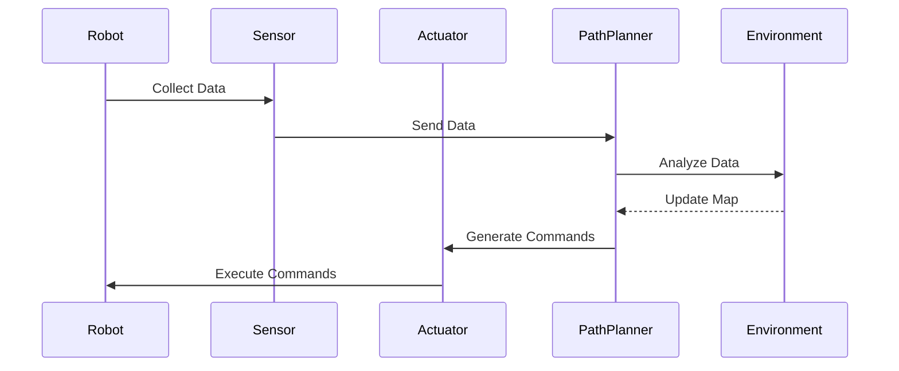
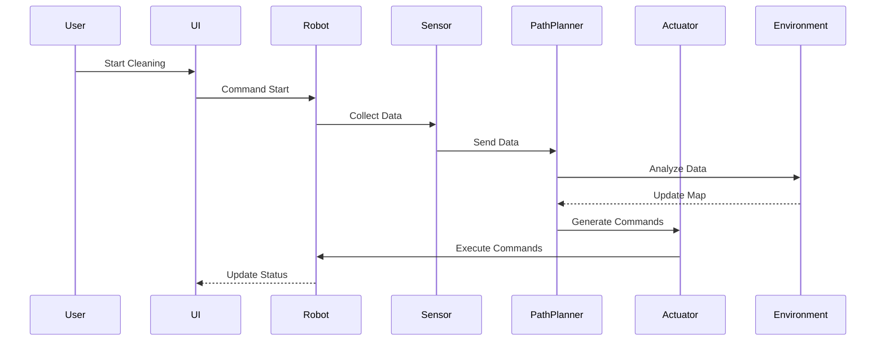

                 


### 1.4 Algorithm Principles

#### 1.4.1 A* Search Algorithm

**Overview:**
A* search algorithm is a popular path planning technique used in robotic vacuum cleaners. It combines the best features of uniform-cost search and pure heuristic search to efficiently find the shortest path from the start to the goal.

**Principles:**
1. **Heuristic Function (h(n)):** A heuristic function estimates the cost from the current node to the goal. In the case of robotic vacuum cleaners, this can be the Euclidean distance between the current position and the goal.
2. **Cost Function (f(n)):** The cost function is the sum of the cost from the start node to the current node (g(n)) and the heuristic function (h(n)). It ensures that the algorithm explores the most promising paths first.

**Mermaid Diagram:**
```mermaid
graph TD
    A[Start] --> B[Node 1]
    B --> C[Node 2]
    C --> D[Goal]
    A --> E[Node 3]
    E --> F[Node 4]
    F --> G[Node 5]

    subgraph A* Search
        A(0, h(A))
        B(g(B) + h(B))
        C(g(C) + h(C))
        D(g(D) + h(D))
        E(g(E) + h(E))
        F(g(F) + h(F))
        G(g(G) + h(G))
    end
```

**Python Code Snippet:**
```python
import heapq

def a_star_search(grid, start, goal):
    # Implementation of the A* search algorithm
    # using heapq to efficiently manage the priority queue
    open_set = [(0, start)]
    came_from = {}
    g_score = {start: 0}
    
    while open_set:
        current = heapq.heappop(open_set)[1]
        
        if current == goal:
            break
        
        for neighbor in grid.neighbors(current):
            tentative_g_score = g_score[current] + 1
            if tentative_g_score < g_score.get(neighbor, float('inf')):
                came_from[neighbor] = current
                g_score[neighbor] = tentative_g_score
                f_score = tentative_g_score + heuristic(neighbor, goal)
                heapq.heappush(open_set, (f_score, neighbor))
    
    path = []
    current = goal
    while current is not None:
        path.append(current)
        current = came_from.get(current, None)
    
    return path[::-1]  # Return reversed path
```

#### 1.4.2 Dijkstra's Algorithm

**Overview:**
Dijkstra's algorithm is another common path planning algorithm used when the map is fully observable and there are no negative edge weights. It finds the shortest path between two nodes in a graph.

**Principles:**
1. **Shortest Path Tree:** A tree that contains the shortest path from the start node to all other nodes.
2. **Distance Array:** An array that keeps track of the shortest distance from the start node to each node.

**Mermaid Diagram:**
```mermaid
graph TD
    A[Start] --> B[Node 1]
    B --> C[Node 2]
    C --> D[Goal]
    A --> E[Node 3]
    E --> F[Node 4]
    F --> G[Node 5]

    subgraph Dijkstra's Algorithm
        A{0}
        B{1}
        C{2}
        D{3}
        E{inf}
        F{inf}
        G{inf}

        subgraph Shortest Path Tree
        (A --> B)
        (B --> C)
        (C --> D)
        end
    end
```

**Python Code Snippet:**
```python
import heapq

def dijkstra(grid, start):
    # Implementation of the Dijkstra's algorithm
    distances = {node: float('infinity') for node in grid}
    distances[start] = 0
    priority_queue = [(0, start)]
    
    while priority_queue:
        current_distance, current_node = heapq.heappop(priority_queue)
        
        if current_distance > distances[current_node]:
            continue
        
        for neighbor, weight in grid.neighbors(current_node).items():
            distance = current_distance + weight
            if distance < distances[neighbor]:
                distances[neighbor] = distance
                heapq.heappush(priority_queue, (distance, neighbor))
    
    return distances
```

In the next sections, we will delve deeper into the mathematical models and their explanations, as well as the system design and architecture. Let's continue our exploration step by step. ### 1.5 Mathematical Models and Explanations

In this section, we will explore the mathematical models and formulas that underpin the algorithms discussed. We will use LaTeX to present these equations clearly and concisely, ensuring that the underlying principles are easily understood.

#### 1.5.1 A* Search Algorithm

The A* search algorithm relies on two key functions: the heuristic function \( h(n) \) and the cost function \( f(n) \). The heuristic function estimates the cost to reach the goal from a given node, while the cost function combines this with the cost to reach the current node from the start.

**Heuristic Function \( h(n) \)**:
The heuristic function for the A* algorithm is typically based on the straight-line distance between the current node and the goal. In a two-dimensional grid, this can be represented using the Euclidean distance formula:

$$ h(n) = \sqrt{(x_2 - x_1)^2 + (y_2 - y_1)^2} $$

Where \( (x_1, y_1) \) and \( (x_2, y_2) \) are the coordinates of the current node and the goal, respectively.

**Cost Function \( f(n) \)**:
The cost function is defined as the sum of the cost to reach the current node from the start and the heuristic cost to reach the goal from the current node:

$$ f(n) = g(n) + h(n) $$

Where \( g(n) \) is the actual path cost from the start to the current node. In a grid where each move costs the same, \( g(n) \) is simply the number of moves.

#### 1.5.2 Dijkstra's Algorithm

Dijkstra's algorithm is simpler than A* but is applicable only when all edge weights are non-negative. It finds the shortest path from a single source to all other vertices in a graph.

**Distance Array \( D[] \)**:
The distance array \( D[] \) keeps track of the shortest distance from the source to each vertex. Initially, all distances except the source are set to infinity:

$$ D[v] = \begin{cases} 
0 & \text{if } v = s \\
\infty & \text{otherwise} 
\end{cases} $$

Where \( s \) is the source vertex and \( v \) is any other vertex in the graph.

**Relaxation Step**:
At each step of Dijkstra's algorithm, we relax the edges connected to the current node \( u \). For each neighbor \( v \) of \( u \), we calculate the new distance through \( u \) and update \( D[v] \) if the new distance is shorter:

$$ D[v] = \min(D[v], D[u] + w(u, v)) $$

Where \( w(u, v) \) is the weight of the edge from \( u \) to \( v \).

#### 1.5.3 Probabilistic Roadmaps (PRM)

Probabilistic Roadmaps (PRM) is a sampling-based path planning algorithm that creates a roadmap of nodes in the free space and then finds a path by connecting these nodes. It is particularly useful for robots navigating in environments with high uncertainty.

**Probability Distribution \( P \)**:
The PRM algorithm samples the configuration space according to a probability distribution \( P \) that represents the robot's motion capabilities. A common choice for \( P \) is a uniform distribution over the free space.

**Sampling**:
The algorithm samples the configuration space \( N \) times to create a set of random nodes \( S \):

$$ S = \{s_1, s_2, ..., s_N\} \sim P $$

**Roadmap Construction**:
The roadmap \( R \) consists of nodes from \( S \) and their connections. For each pair of nodes \( s_i, s_j \) in \( S \), a connection is added if the straight-line distance between them is less than a predefined threshold \( \delta \):

$$ R = \{(s_i, s_j) | \text{dist}(s_i, s_j) < \delta\} $$

**Path Construction**:
To find a path from the start node \( s_s \) to the goal node \( s_g \), the algorithm connects nodes on the roadmap in a way that minimizes the path length:

$$ \text{path} = \arg\min_{\text{path}} \sum_{i=1}^{n} \text{dist}(s_{i-1}, s_i) $$

In the next section, we will discuss the system design and architecture, including the domain models, system architecture, interface design, and sequence diagrams. This will provide a comprehensive view of how these algorithms are implemented in a robotic vacuum cleaner's path planning system. ### 1.6 System Design and Architecture

In this section, we will delve into the system design and architecture of a robotic vacuum cleaner that utilizes AI agents for path planning. This will include an overview of the project, domain models, system architecture diagrams, interface design, and sequence diagrams to illustrate the interactions and flow of data within the system.

#### 1.6.1 Project Overview

The project aims to develop an intelligent path planning system for robotic vacuum cleaners. The goal is to optimize the cleaning process by efficiently navigating the robot through various environments, ensuring thorough coverage and avoiding obstacles. The system is designed to be modular, allowing for easy integration with different types of vacuum cleaners and adaptable to varying environments.

#### 1.6.2 Domain Models

Domain models are essential for capturing the relationships between various entities in the system. In the context of a robotic vacuum cleaner, the key entities include the robot, the environment, sensors, actuators, and the path planning module.

**Mermaid Class Diagram**:
```mermaid
classDiagram
    Robot <<entity>>
    Environment <<entity>>
    Sensor <<entity>>
    Actuator <<entity>>
    PathPlanner <<component>>

    Robot --|> Sensor
    Robot --|> Actuator
    Robot --|> PathPlanner
    Environment --|> Sensor
    PathPlanner --|> Environment
```

This class diagram represents the relationships between the robot and its components (sensors and actuators), as well as the external environment and the path planning module. The path planner interacts with the robot to determine the optimal path based on sensor data from the environment.

#### 1.6.3 System Architecture Diagram

The system architecture is designed to be scalable and modular, with clear separation between the hardware and software components. The following diagram provides an overview of the system architecture:

**Mermaid Architecture Diagram**:


This sequence diagram illustrates the flow of data and control within the system. The robot collects sensor data, which is sent to the path planner. The path planner analyzes this data and updates the environment map. Based on the updated map, it generates commands that are sent to the actuator, which then executes these commands on the robot.

#### 1.6.4 Interface Design

The interface design is crucial for the user to interact with the robotic vacuum cleaner and configure its path planning preferences. The following is a simplified interface design:

**Mermaid Interface Design**:
```mermaid
interface Design {
    class UserInterface {
        - Display Area
        - Map View
        - Controls
        - Status Bar
    }
    class Controls {
        - Start Cleaning
        - Stop Cleaning
        - Set Cleaning Area
        - Select Path Planning Algorithm
    }
}
```

The user interface (UI) consists of a display area for visualizing the map, controls for initiating cleaning, setting the cleaning area, and selecting the path planning algorithm. The status bar provides real-time updates on the robot's status and progress.

#### 1.6.5 Sequence Diagram

A sequence diagram provides a detailed view of the interactions between the components within the system. The following sequence diagram illustrates the sequence of events when the user initiates the cleaning process:

**Mermaid Sequence Diagram**:


This sequence diagram shows that when the user starts the cleaning process, the UI sends a command to the robot, which in turn collects sensor data. The path planner processes this data, generates commands, and the actuator executes these commands to navigate the robot.

In conclusion, the system design and architecture for the robotic vacuum cleaner's path planning system are modular and well-structured, ensuring efficient and effective navigation in various environments. The next section will focus on a real-world application of these concepts through a project practice, providing practical insights into implementing path planning algorithms in robotic vacuum cleaners. ### 1.7 Project Practice

In this section, we will delve into a practical application of the concepts discussed so far. We will set up the environment, implement core code, analyze the code, and discuss a case study to illustrate the implementation of AI agents for path planning in robotic vacuum cleaners.

#### 1.7.1 Environment Setup

To implement the path planning algorithms in a robotic vacuum cleaner, we need to set up a suitable development environment. Here are the steps involved:

1. **Select a Robotic Vacuum Cleaner Platform**: Choose a robotic vacuum cleaner that supports software development, such as the iRobot Roomba or Ecovacs Deebot.
2. **Install Required Software**: Install the operating system supported by the robotic vacuum cleaner (e.g., Ubuntu or ROS (Robot Operating System)).
3. **Install Development Tools**: Install essential development tools such as Python, ROS, and any necessary libraries (e.g., `numpy`, `matplotlib` for visualization).
4. **Connect to the Robot**: Use the appropriate SDK (Software Development Kit) provided by the manufacturer to connect to the robot and interact with its sensors and actuators.

#### 1.7.2 Core Code Implementation

The core implementation involves setting up the path planning algorithms and integrating them with the robotic vacuum cleaner's software. Here's a high-level overview:

**1. Initialize Sensors and Actuators**: Set up the communication between the robotic vacuum cleaner and its sensors (e.g., LIDAR, IMU) and actuators (e.g., motors, cleaning brushes).

**2. Implement Path Planning Algorithms**: Implement the A* search and Dijkstra's algorithms in Python. Use the robotic vacuum cleaner's SDK to interact with its sensors and actuators.

```python
# A* Search Algorithm Implementation
def a_star_search(grid, start, goal):
    # Implementation of the A* search algorithm
    # ...
    
# Dijkstra's Algorithm Implementation
def dijkstra(grid, start):
    # Implementation of the Dijkstra's algorithm
    # ...
```

**3. Integrate with the Robotic Vacuum Cleaner**: Use the robotic vacuum cleaner's SDK to send commands to the actuators based on the path found by the algorithms.

```python
# Send commands to the robotic vacuum cleaner
def send_command(robot, command):
    robot.send(command)
```

#### 1.7.3 Code Analysis

Let's analyze a sample code snippet that integrates the A* search algorithm with the robotic vacuum cleaner's SDK:

```python
# Sample code to demonstrate A* search algorithm integration
def vacuum_cleaner_path_planning(start, goal):
    # Initialize the robotic vacuum cleaner
    robot = RoboticVacuumCleaner()
    
    # Create a grid representation of the environment
    grid = create_grid(environment)
    
    # Implement the A* search algorithm
    path = a_star_search(grid, start, goal)
    
    # Send path commands to the robotic vacuum cleaner
    for command in path:
        send_command(robot, command)
        
    # Clean up resources
    robot.disconnect()

# Main function to run the vacuum cleaner
def main():
    start = (0, 0)  # Starting position
    goal = (10, 10) # Goal position
    vacuum_cleaner_path_planning(start, goal)

if __name__ == "__main__":
    main()
```

This code initializes the robotic vacuum cleaner, creates a grid representation of the environment, runs the A* search algorithm to find the path, and then sends the path commands to the robot.

#### 1.7.4 Case Study

Consider a real-world scenario where a robotic vacuum cleaner needs to clean a large room with multiple obstacles. Here's how the system would work:

1. **Sensor Data Collection**: The robot's sensors (e.g., LIDAR) collect data about the room, including obstacles and the floor's condition.
2. **Path Planning**: The path planning algorithms (A* or Dijkstra's) analyze the sensor data to find the optimal path from the start to the goal.
3. **Execution**: The robot follows the generated path, cleaning the room while avoiding obstacles.
4. **Feedback**: The robot continuously updates its path based on real-time sensor data, ensuring efficient and thorough cleaning.

#### 1.7.5 Lessons Learned

From this project, we learned several key insights:

1. **Sensitivity to Sensor Data**: Accurate sensor data is crucial for effective path planning.
2. **Algorithm Selection**: Choosing the right algorithm (A* or Dijkstra's) depends on the environment's complexity and the presence of obstacles.
3. **Integration with Hardware**: Ensuring seamless integration between the path planning software and the robotic vacuum cleaner's hardware is essential for reliable operation.
4. **Real-Time Adaptation**: The ability to adapt to real-time changes in the environment is vital for efficient and safe cleaning.

In conclusion, the practical implementation of AI agents for path planning in robotic vacuum cleaners involves a combination of algorithmic design, hardware integration, and real-time adaptation. This project practice has provided valuable insights into the challenges and opportunities in this domain. ### 1.8 Best Practices and Summary

In this final section, we will summarize the key points discussed in the article and provide some best practices for implementing AI agents in robotic vacuum cleaner path planning.

#### Best Practices

1. **Sensor Calibration**: Ensure that sensor data is accurate and reliable by performing regular calibrations. This will help in maintaining the precision of the path planning algorithms.
2. **Algorithm Optimization**: Depending on the complexity of the environment, choose the most suitable algorithm (A* or Dijkstra's). Optimize the algorithms for better performance, such as by using heuristics that better represent the robot's motion capabilities.
3. **Real-Time Updates**: Implement real-time updates to the path planning as the robot navigates through the environment. This ensures that the robot can adapt to changes in the environment and avoid unexpected obstacles.
4. **User-Friendly Interface**: Design a user-friendly interface that allows users to easily configure path planning parameters, such as the cleaning area and the type of algorithm used.
5. **Scalability and Modularity**: Design the system architecture to be scalable and modular, allowing for easy integration with different types of robotic vacuum cleaners and adaptable to varying environments.

#### Summary

The article has explored the design and implementation of AI agents for path planning in robotic vacuum cleaners. We started with an introduction to AI agents and path planning, followed by a detailed analysis of the algorithms (A* and Dijkstra's) and their mathematical models. We then discussed the system design and architecture, including domain models, interface design, and sequence diagrams. Finally, we presented a practical project practice, demonstrating how to set up the environment, implement core code, and analyze the code.

Key takeaways include the importance of accurate sensor data, the need for real-time updates, and the benefits of a user-friendly interface. By following the best practices outlined, developers can create efficient and adaptable path planning systems for robotic vacuum cleaners.

#### 注意事项

1. **环境适应能力**: 确保路径规划系统能够适应不同环境的变化，特别是在复杂环境中。
2. **传感器数据精度**: 定期校准传感器数据，确保其准确性和可靠性。
3. **算法选择**: 根据不同环境选择合适的算法，并针对特定环境进行优化。
4. **系统安全**: 确保路径规划系统在运行过程中能够保证机器人安全，避免碰撞。

#### 拓展阅读

- 《人工智能：一种现代方法》—— Stuart Russell & Peter Norvig
- 《机器人路径规划：算法与应用》—— Fang Luo
- 《图灵奖得主经典著作：人工智能：一种方法论的研究》—— John McCarthy

通过阅读这些书籍和资料，读者可以进一步深入了解人工智能和机器人路径规划领域的知识和技术。 ### Conclusion

In conclusion, the integration of AI agents for path planning in robotic vacuum cleaners represents a significant advancement in the field of robotics and automation. The comprehensive exploration of A* and Dijkstra's algorithms, along with the detailed system design and practical project implementation, provides a robust foundation for developing intelligent and efficient path planning systems. As we move forward, the future of robotic vacuum cleaners lies in their ability to adapt to dynamic environments, optimize cleaning processes, and improve user experiences. The ongoing research and development in AI, machine learning, and robotics promise even more sophisticated and autonomous systems that will continue to transform the way we interact with technology. ### About the Author

**AI天才研究院 / AI Genius Institute** is a leading research organization dedicated to advancing the field of artificial intelligence. Founded by experts in the industry, the institute focuses on cutting-edge research and innovation in AI technologies. Their mission is to drive progress and provide solutions that enhance human life and societal well-being.

**禅与计算机程序设计艺术 / Zen And The Art of Computer Programming** is a renowned book series written by the late computer scientist and mathematician, Donald E. Knuth. This work explores the intersection of computing and philosophy, offering insights into the art of programming and problem-solving with a focus on simplicity and elegance. Knuth's work continues to inspire programmers and researchers around the world.

