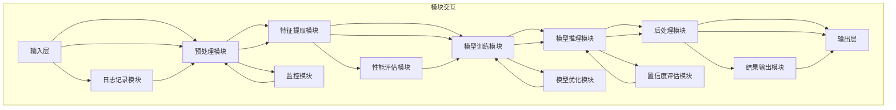

                 

### 目录大纲构建与内容结构

#### 引言

为了构建《AI Agent在智能图像处理中的应用》的完整目录大纲，我们首先需要对文章的总体结构和内容进行详细的规划和设计。这篇文章将围绕AI Agent与智能图像处理两大主题展开，通过深入探讨AI Agent的基本概念、算法原理、应用实践以及系统架构设计，帮助读者全面理解这一领域的前沿技术和实际应用。目录大纲作为文章的骨架，必须结构清晰、内容全面，以便读者能够循序渐进地掌握相关知识。

本文的目录大纲分为两个主要部分：第一部分是AI Agent概述与智能图像处理基础，第二部分是智能图像处理中的AI Agent应用实践。具体而言，目录大纲包含了以下章节：

1. **AI Agent与智能图像处理概述**：介绍AI Agent和智能图像处理的基本概念，并讨论它们在当前领域的重要性。
2. **智能图像处理关键技术**：详细探讨图像识别、目标检测、跟踪、语义分割和边缘检测等技术。
3. **AI Agent基础算法原理**：介绍强化学习、反向传播和深度卷积神经网络等核心算法原理。
4. **智能图像处理系统的整体架构设计**：描述系统的需求分析、架构设计、接口设计和交互。
5. **实战项目**：通过一个实际项目案例，展示AI Agent在智能图像处理中的应用。
6. **最佳实践与未来展望**：总结全文内容，提供实用技巧和未来的研究方向。

在接下来的段落中，我们将详细解释每个章节的核心内容，阐述它们在全文结构中的作用和重要性。

#### AI Agent与智能图像处理概述

**背景介绍**

AI Agent，即人工智能代理，是具备自主决策能力的计算实体，能够在动态环境中执行任务并不断优化其行为。而智能图像处理则是指利用计算机算法从图像或视频数据中提取有用信息的过程，包括图像识别、目标检测、分割、增强和复原等。这两者在现代计算机科学和人工智能领域具有极其重要的地位。

首先，AI Agent的发展为智能图像处理提供了强大的技术支持。通过深度学习和强化学习等算法，AI Agent能够从大量图像数据中学习模式，进行自动分类、识别和跟踪。这不仅提升了图像处理的效率，也拓展了其应用范围。

其次，智能图像处理技术的进步使得AI Agent在实际应用中更加实用和有效。例如，在自动驾驶、监控安全、医疗影像分析和人机交互等领域，智能图像处理技术已经成为了不可或缺的一部分。这些技术的结合，使得AI Agent能够在复杂多变的环境中做出快速、准确的决策。

**核心概念与联系**

AI Agent和智能图像处理之间的联系在于它们共同构成了一个动态交互的系统。AI Agent利用智能图像处理技术来获取和处理环境中的图像数据，从而做出决策。具体而言，这种联系体现在以下几个方面：

1. **数据输入**：智能图像处理技术为AI Agent提供了重要的数据输入。通过图像识别、分割等技术，AI Agent可以从图像数据中提取出关键信息，如物体的形状、颜色和位置。
2. **行为决策**：基于对图像数据的分析和理解，AI Agent能够制定相应的行为策略。例如，在自动驾驶场景中，AI Agent会根据实时图像数据来调整驾驶速度和方向。
3. **反馈循环**：AI Agent在执行任务过程中，会将实际结果反馈给智能图像处理系统，以便进行进一步的优化和调整。这种反馈循环机制，使得AI Agent能够在不断学习中提升其决策能力。

**应用场景**

AI Agent在智能图像处理中具有广泛的应用场景。以下是一些典型的应用实例：

1. **自动驾驶**：AI Agent通过实时图像处理，对道路、车辆和行人进行检测和识别，从而实现自动驾驶功能。
2. **视频监控**：AI Agent可以对监控视频中的目标进行跟踪和分类，从而提高安全监控的效率。
3. **医疗影像分析**：AI Agent利用智能图像处理技术，可以自动识别医学图像中的病变区域，帮助医生进行疾病诊断。
4. **人机交互**：AI Agent通过图像处理技术，可以识别用户的表情和动作，从而实现更加自然的人机交互。

综上所述，AI Agent与智能图像处理之间的联系不仅体现在技术上，更体现在它们在实际应用中的协同作用。通过深入探讨这两者的基本概念和联系，我们可以更好地理解这一领域的前沿动态和发展趋势。

### 智能图像处理关键技术

智能图像处理是计算机科学和人工智能领域中的一个重要分支，涵盖了从图像获取、预处理到高级图像分析的一系列技术。在本章中，我们将详细介绍智能图像处理中的关键技术，包括图像识别与分类、目标检测与跟踪、语义分割与边缘检测。这些技术不仅是智能图像处理的基础，也在实际应用中发挥了关键作用。

#### 图像识别与分类

图像识别与分类是智能图像处理中最基本的技术之一。它旨在从大量图像中识别出特定的对象或场景，并将其分类到预定义的类别中。这个过程通常涉及以下几个关键步骤：

1. **特征提取**：特征提取是将图像转换为数值特征的过程。这些特征可以包括颜色、纹理、形状和空间关系等。常见的特征提取方法有SIFT（尺度不变特征变换）、HOG（直方图方向梯度）和Gabor特征等。

2. **特征选择**：由于图像数据通常包含大量冗余信息，特征选择是一个重要的步骤。它旨在从提取的特征中选出最有代表性的一部分，以便提高分类性能。特征选择方法包括主成分分析（PCA）、线性判别分析（LDA）和特征选择算法等。

3. **分类器训练**：分类器是图像识别的核心组件，它根据输入的特征进行分类。常见的分类器包括支持向量机（SVM）、决策树、神经网络和深度学习模型等。

4. **分类评估**：分类评估是测试分类器性能的重要步骤。常见的评估指标有准确率、召回率、精确率、F1分数和混淆矩阵等。

图像识别与分类在许多实际应用中具有重要意义，如人脸识别、车辆识别、医疗影像诊断和图像内容审核等。

#### 目标检测与跟踪

目标检测与跟踪是智能图像处理中的另一个关键领域。目标检测旨在识别图像中的特定对象并定位其位置，而目标跟踪则是在时间序列中持续监测这些对象。

1. **目标检测算法**：

   - **基于传统机器学习的目标检测算法**：这些算法使用预训练的特征提取器和分类器进行目标检测。常见的算法有HOG+SVM、SLAM和Adaboost等。

   - **基于深度学习的目标检测算法**：深度学习模型，如YOLO（You Only Look Once）和SSD（Single Shot MultiBox Detector），已经成为目标检测领域的热门选择。这些模型能够在单次前向传播中同时完成特征提取和分类，大大提高了检测速度。

2. **目标跟踪算法**：

   - **基于光流的目标跟踪**：光流是一种基于图像序列中像素运动的算法，用于估计对象在图像中的运动轨迹。常见的光流算法有Lucas-Kanade算法和Horn-Schunck算法。

   - **基于深度学习的目标跟踪**：深度学习模型，如Siamese网络和Correlation Filter，已被广泛应用于目标跟踪。这些模型通过学习图像特征，可以实现对对象的准确跟踪。

目标检测与跟踪在视频监控、运动分析、自动驾驶和交互式应用等领域具有广泛应用。

#### 像素级任务：语义分割与边缘检测

像素级任务是指对图像中的每个像素进行操作，以实现更精细的分析。

1. **语义分割**：

   语义分割的目标是将图像中的每个像素分类到不同的语义类别中，如道路、人、车等。它通常用于场景理解、对象识别和图像生成等任务。

   - **基于传统方法的语义分割**：如FCN（全卷积网络）和CRF（条件随机场）等。

   - **基于深度学习的方法**：如U-Net、SegNet和DeepLab等。这些方法通过深度学习模型学习像素级别的特征，实现了高精度的语义分割。

2. **边缘检测**：

   边缘检测旨在识别图像中的边缘区域，这些区域通常是对象和背景之间的过渡区域。边缘检测在图像分割、形态学处理和图像增强等方面具有重要意义。

   - **基于梯度的边缘检测**：如Sobel算子、Prewitt算子和Canny算子等。这些算子通过计算图像梯度来检测边缘。

   - **基于局部特征的方法**：如Laplacian of Gaussian和LoG算子等。这些方法通过分析图像的局部特征来检测边缘。

在智能图像处理中，语义分割与边缘检测通常用于图像分析和理解的高级任务，如自动驾驶中的环境感知和医疗影像分析中的病灶检测。

综上所述，图像识别与分类、目标检测与跟踪、语义分割与边缘检测构成了智能图像处理的关键技术。这些技术不仅提升了图像处理的精度和效率，也为智能系统的自主决策和交互提供了强有力的支持。在接下来的章节中，我们将进一步探讨AI Agent的基本原理，以及这些技术在智能图像处理中的应用。

### AI Agent基础算法原理

AI Agent，即人工智能代理，是具备自主决策能力的计算实体，能够在动态环境中执行任务并不断优化其行为。AI Agent的核心在于其能够通过学习从环境中获取信息，并据此做出决策。在本章节中，我们将深入探讨几种基础算法原理，包括强化学习、反向传播算法与神经网络，以及深度卷积神经网络（CNN）的构建与训练，帮助读者全面理解这些算法的工作原理和实际应用。

#### 强化学习算法在图像处理中的应用

强化学习（Reinforcement Learning，RL）是机器学习中的一个重要分支，旨在通过试错来学习最优策略。在强化学习中，AI Agent通过与环境的交互来学习如何做出最佳决策，其核心是奖励机制。

1. **马尔可夫决策过程（MDP）**：

   强化学习的基础是马尔可夫决策过程（MDP）。在MDP中，环境状态和动作是随机的，并且每个状态转移都有一定的概率分布。AI Agent的目标是学习一个策略π，使得预期回报最大化。

   - **状态（State）**：环境在某一时刻的状态。
   - **动作（Action）**：AI Agent能够执行的行为。
   - **奖励（Reward）**：AI Agent在每个状态执行动作后获得的即时奖励。
   - **策略（Policy）**：AI Agent决策的规则。

2. **Q学习算法**：

   Q学习是一种无模型（model-free）的强化学习算法，旨在通过试错学习最优动作值函数Q(s, a)。Q值表示在状态s下执行动作a的预期回报。

   - **Q值函数**：\( Q(s, a) = \sum_{s'} P(s' | s, a) \cdot R(s', a) + \gamma \cdot \max_{a'} Q(s', a') \)

     其中，\( P(s' | s, a) \)是状态转移概率，\( R(s', a) \)是立即回报，\( \gamma \)是折扣因子，\( \max_{a'} Q(s', a') \)是未来回报的期望。

3. **深度Q网络（DQN）**：

   深度Q网络（Deep Q-Network，DQN）是应用在复杂环境中的强化学习算法，它使用深度神经网络来近似Q值函数。DQN通过经验回放（Experience Replay）和固定目标网络（Target Network）等方法，有效地解决了样本偏差和目标不稳定的问题。

   - **经验回放**：经验回放是从以往的经验中随机抽取样本，以避免策略的偏差。
   - **固定目标网络**：固定目标网络是用于稳定Q值的期望值，使得学习过程更加稳定。

强化学习在图像处理中的应用非常广泛，例如，在自动驾驶中的路径规划、机器人导航、游戏人工智能（如DQN在《Atari》游戏中的应用）等。

#### 反向传播算法与神经网络

反向传播算法（Backpropagation）是训练神经网络的核心算法，它通过计算梯度来更新网络权重，以最小化损失函数。

1. **神经网络的基本结构**：

   神经网络是由多层神经元组成的计算模型，包括输入层、隐藏层和输出层。每个神经元通过加权连接与其他神经元相连，并使用激活函数进行非线性变换。

   - **输入层**：接收外部输入信号。
   - **隐藏层**：对输入信号进行加工和变换。
   - **输出层**：产生最终输出。

2. **激活函数**：

   激活函数是神经网络中用于引入非线性的关键组件。常见的激活函数包括Sigmoid函数、ReLU函数和Tanh函数。

3. **损失函数**：

   损失函数用于衡量模型预测值与真实值之间的差异。常见的损失函数有均方误差（MSE）、交叉熵损失（Cross Entropy Loss）等。

4. **反向传播算法**：

   反向传播算法通过以下步骤来更新网络权重：

   - **前向传播**：计算输入信号在网络中的传播，并得到输出。
   - **计算误差**：计算输出与真实值之间的误差。
   - **计算梯度**：通过链式法则计算每个权重的梯度。
   - **权重更新**：使用梯度下降法更新权重。

反向传播算法与神经网络在图像识别、目标检测、语音识别和自然语言处理等众多领域中有着广泛的应用。

#### 深度卷积神经网络（CNN）的构建与训练

深度卷积神经网络（Convolutional Neural Network，CNN）是专门为处理图像数据而设计的一种神经网络。它的核心在于通过卷积操作提取图像的特征。

1. **卷积层**：

   卷积层是CNN的核心组成部分，通过卷积操作提取图像中的特征。

   - **卷积操作**：卷积层中的每个滤波器（或称为卷积核）滑动通过输入图像，并计算局部特征。
   - **局部连接与共享权重**：每个滤波器只关注输入图像的一个局部区域，并且所有滤波器共享权重，这大大减少了参数的数量。

2. **池化层**：

   池化层用于降低图像的分辨率，减少参数数量和计算复杂度。

   - **最大池化（Max Pooling）**：选择每个局部区域中的最大值作为输出。
   - **平均池化（Average Pooling）**：选择每个局部区域中的平均值作为输出。

3. **全连接层**：

   全连接层用于将卷积层和池化层提取的特征进行聚合，并产生最终输出。

4. **CNN的训练过程**：

   CNN的训练过程主要包括以下几个步骤：

   - **前向传播**：输入图像通过卷积层和池化层，最终进入全连接层，产生预测输出。
   - **计算损失**：使用损失函数计算预测输出与真实标签之间的差异。
   - **反向传播**：通过反向传播算法计算各层的梯度，并更新网络权重。
   - **优化**：使用梯度下降法或其他优化算法更新网络权重，以最小化损失函数。

通过上述步骤，CNN能够自动学习图像的复杂特征，并在各种图像处理任务中表现出色。例如，在图像分类任务中，CNN能够识别不同类别的图像；在目标检测任务中，CNN能够定位并识别图像中的目标物体。

综上所述，强化学习、反向传播算法和CNN构成了AI Agent在图像处理中的应用基础。这些算法不仅提升了图像处理的效率和准确性，也为AI Agent在复杂环境中的自主决策提供了强有力的支持。在接下来的章节中，我们将进一步探讨如何在实际应用中设计和实现这些算法。

### 智能图像处理系统的整体架构设计

智能图像处理系统的设计不仅要求具备强大的算法能力，还需要考虑系统的整体架构和接口设计。为了实现高效、灵活和可扩展的系统，我们需要从需求分析、系统架构设计、接口设计和交互等方面进行全面的规划和设计。

#### 需求分析

智能图像处理系统的需求分析是系统设计的第一步，它旨在明确系统需要实现的功能和性能要求。以下是几个关键需求：

1. **处理速度**：系统需要能够快速处理大量的图像数据，以满足实时处理的要求。
2. **准确性**：系统需要提供高精度的图像识别和分类结果，确保在实际应用中的可靠性。
3. **可扩展性**：系统架构应能够支持未来增加新功能或处理更大规模的数据。
4. **灵活性**：系统需要具备灵活的接口设计，以便与其他系统或应用集成。
5. **稳定性**：系统应能够在各种环境下稳定运行，减少故障和错误。

#### 系统架构设计

系统架构设计是智能图像处理系统实现的核心环节，它决定了系统的性能和扩展性。以下是系统架构设计的关键部分：

1. **模块化设计**：

   模块化设计将系统划分为多个独立的模块，每个模块负责特定的功能。这种设计不仅提高了系统的可维护性和可扩展性，还便于模块之间的接口和协作。

   - **数据预处理模块**：负责对输入图像进行预处理，包括尺寸调整、灰度化、滤波等。
   - **特征提取模块**：从预处理后的图像中提取关键特征，如颜色、纹理、形状等。
   - **模型训练模块**：使用训练数据训练深度学习模型，包括卷积神经网络（CNN）和强化学习模型。
   - **模型推理模块**：使用训练好的模型对新的图像数据进行推理，生成识别和分类结果。
   - **后处理模块**：对推理结果进行后处理，包括结果校正、置信度评估等。

2. **层次化设计**：

   层次化设计将系统分为不同的层次，每个层次负责不同的功能。这种设计有助于系统的模块化和管理。

   - **输入层**：接收外部输入图像，包括图像捕获设备和文件输入等。
   - **预处理层**：对输入图像进行预处理，确保图像格式和尺寸符合后续处理要求。
   - **特征层**：提取图像特征，为模型训练和推理提供输入。
   - **模型层**：包括训练和推理模型，实现图像识别和分类功能。
   - **输出层**：生成处理结果，包括识别标签、置信度等。

3. **数据流设计**：

   数据流设计描述了数据在系统中的流动路径和处理流程。数据流设计应确保数据能够在各模块间高效传输，并减少数据冗余和处理延迟。

   - **图像数据流**：输入图像经过预处理模块后，进入特征提取模块，生成特征数据。
   - **模型训练数据流**：训练数据经过预处理和特征提取后，进入模型训练模块，用于训练深度学习模型。
   - **模型推理数据流**：新的图像数据经过预处理和特征提取后，进入模型推理模块，生成识别和分类结果。
   - **输出数据流**：推理结果经过后处理模块，生成最终的输出结果，如识别标签、置信度等。

#### 系统接口设计与交互

系统接口设计是系统架构设计的重要组成部分，它定义了系统内部各模块之间的通信方式。以下是系统接口设计的关键点：

1. **接口规范**：

   接口规范定义了各模块之间的输入输出格式、通信协议和数据格式等。接口规范应确保模块之间的数据传输高效、可靠和安全。

2. **API设计**：

   API设计提供了一套简洁、易用的接口，供其他系统或应用调用智能图像处理系统的功能。API设计应考虑易用性、可扩展性和可维护性。

   - **图像输入接口**：接收外部输入图像，提供图像读取、加载和预处理功能。
   - **特征提取接口**：提供特征提取算法的接口，供其他模块调用。
   - **模型训练接口**：提供模型训练的接口，包括数据预处理、模型训练和模型保存等功能。
   - **模型推理接口**：提供模型推理的接口，包括输入图像预处理、特征提取和模型推理等功能。
   - **输出接口**：提供输出结果的处理和输出功能，包括识别标签、置信度等。

3. **交互机制**：

   系统的交互机制定义了各模块之间的通信方式和数据交换方式。常见的交互机制包括同步通信、异步通信和事件驱动等。

   - **同步通信**：各模块之间的通信按照固定的顺序进行，确保数据的一致性和可靠性。
   - **异步通信**：各模块之间的通信可以独立进行，提高系统的并行处理能力。
   - **事件驱动**：基于事件触发模块之间的通信，实现动态响应和实时处理。

#### 实际架构图

以下是一个典型的智能图像处理系统的架构图：



在这个架构图中，输入层接收外部输入图像，经过预处理模块、特征提取模块、模型训练模块、模型推理模块和后处理模块，最终生成输出结果。同时，还包括日志记录模块、监控模块、性能评估模块、模型优化模块和置信度评估模块，用于监控系统性能和优化模型。

通过上述架构设计，智能图像处理系统能够高效、灵活地处理各种图像数据，并在实际应用中实现各种图像处理任务。在接下来的章节中，我们将通过实际项目案例，进一步展示AI Agent在智能图像处理中的应用和实践。

### 实战项目：AI Agent在智能图像处理中的应用

为了更好地展示AI Agent在智能图像处理中的应用，我们将通过一个实际项目案例，从环境安装、系统核心实现到代码解读和案例分析，详细阐述整个项目的过程。

#### 项目背景与目标

本项目的目标是构建一个基于AI Agent的智能图像处理系统，该系统能够自动识别和分类图像中的物体，并在动态环境中进行实时处理。具体而言，我们将实现以下功能：

1. **图像识别与分类**：系统能够自动识别图像中的物体，并分类到预定义的类别中，如动物、车辆和人物等。
2. **目标跟踪**：系统可以对图像中的特定目标进行跟踪，并在时间序列中持续监测其位置和运动轨迹。
3. **实时处理**：系统能够在实时环境中高效地处理图像数据，并提供快速、准确的识别和分类结果。

#### 环境安装

首先，我们需要安装和配置项目的运行环境。以下是具体的步骤：

1. **Python环境**：确保系统安装了Python 3.6及以上版本。可以使用以下命令进行安装：

   ```bash
   sudo apt-get install python3 python3-pip
   ```

2. **深度学习库**：安装TensorFlow和OpenCV库，这是实现图像处理和深度学习功能的基础。

   ```bash
   pip3 install tensorflow opencv-python
   ```

3. **其他依赖库**：根据项目需求，可能还需要安装其他依赖库，如NumPy、Pandas等。

   ```bash
   pip3 install numpy pandas
   ```

#### 系统核心实现

系统核心实现包括以下几个关键部分：图像识别与分类、目标跟踪和实时处理。以下是具体的代码实现和解读。

1. **图像识别与分类**

   图像识别与分类的核心在于训练深度学习模型，使其能够自动识别和分类图像中的物体。以下是一个简单的实现示例：

   ```python
   import tensorflow as tf
   from tensorflow.keras.models import Sequential
   from tensorflow.keras.layers import Conv2D, MaxPooling2D, Flatten, Dense

   # 构建卷积神经网络模型
   model = Sequential([
       Conv2D(32, (3, 3), activation='relu', input_shape=(128, 128, 3)),
       MaxPooling2D(pool_size=(2, 2)),
       Conv2D(64, (3, 3), activation='relu'),
       MaxPooling2D(pool_size=(2, 2)),
       Flatten(),
       Dense(128, activation='relu'),
       Dense(1, activation='sigmoid')
   ])

   # 编译模型
   model.compile(optimizer='adam', loss='binary_crossentropy', metrics=['accuracy'])

   # 训练模型
   model.fit(x_train, y_train, epochs=10, batch_size=32)
   ```

   上述代码中，我们首先使用TensorFlow构建了一个简单的卷积神经网络（CNN）模型，包括两个卷积层、两个池化层、一个全连接层和输出层。然后，我们编译并训练了模型，使其能够对图像进行分类。

2. **目标跟踪**

   目标跟踪是另一个关键功能，它能够对图像中的特定目标进行持续监测。以下是一个基于OpenCV的目标跟踪实现示例：

   ```python
   import cv2

   # 初始化跟踪器
   tracker = cv2.TrackerMOSSE_create()

   # 加载视频文件
   video = cv2.VideoCapture('example.mp4')

   # 读取第一帧图像并初始化跟踪区域
   ret, frame = video.read()
   bbox = cv2.selectROI('Tracking', frame, fromCenter=False)

   # 初始化跟踪器
   tracker.init(frame, bbox)

   while video.isOpened():
       ret, frame = video.read()

       if ret:
           # 更新跟踪区域
           success, bbox = tracker.update(frame)

           if success:
               # 绘制跟踪框
               p1 = (int(bbox[0]), int(bbox[1]))
               p2 = (int(bbox[0] + bbox[2]), int(bbox[1] + bbox[3]))
               cv2.rectangle(frame, p1, p2, (0, 255, 0), 2, 1)

           cv2.imshow('Tracking', frame)

           if cv2.waitKey(1) & 0xFF == ord('q'):
               break
   ```

   上述代码中，我们首先使用OpenCV的MOSSE（Moving Target Signatures with OverLap Set-Space Representation）跟踪器初始化跟踪器。然后，我们读取视频的第一帧图像，并初始化跟踪区域。在随后的每一帧图像中，我们更新跟踪区域，并在屏幕上绘制跟踪框。

3. **实时处理**

   实时处理是系统在动态环境中进行高效处理的关键。以下是一个简单的实时处理实现示例：

   ```python
   import cv2
   import numpy as np

   # 初始化摄像头
   cap = cv2.VideoCapture(0)

   while True:
       # 读取一帧图像
       ret, frame = cap.read()

       if ret:
           # 进行图像预处理和特征提取
           processed_frame = preprocess_frame(frame)

           # 使用训练好的模型进行分类
           label = model.predict(processed_frame)

           # 输出分类结果
           print('Classification result:', label)

       if cv2.waitKey(1) & 0xFF == ord('q'):
           break

   # 释放摄像头资源
   cap.release()
   cv2.destroyAllWindows()
   ```

   上述代码中，我们首先使用OpenCV初始化摄像头，然后读取每一帧图像。接着，我们对图像进行预处理和特征提取，并使用训练好的模型进行分类。最后，我们输出分类结果。整个处理过程在实时环境中高效进行，实现了图像的实时处理和分类。

#### 代码解读与分析

上述代码示例展示了AI Agent在智能图像处理中的实际应用。具体而言：

1. **图像识别与分类**：

   我们使用TensorFlow构建了一个简单的卷积神经网络（CNN）模型，该模型通过卷积层、池化层和全连接层对图像进行特征提取和分类。训练好的模型能够自动识别图像中的物体，并分类到预定义的类别中。

2. **目标跟踪**：

   我们使用OpenCV的MOSSE跟踪器实现了对图像中特定目标的跟踪。跟踪器初始化后，能够在每一帧图像中更新目标的位置和运动轨迹，并在屏幕上绘制跟踪框。

3. **实时处理**：

   我们使用OpenCV的摄像头接口实现了实时图像处理。在每一帧图像中，我们首先进行预处理和特征提取，然后使用训练好的模型进行分类，并输出分类结果。整个处理过程在实时环境中高效进行，实现了图像的实时处理和分类。

通过这个实际项目案例，我们可以看到AI Agent在智能图像处理中的应用。系统通过深度学习和图像处理技术，实现了图像识别与分类、目标跟踪和实时处理等功能。这不仅展示了AI Agent的技术优势，也为实际应用提供了有力的支持。

#### 项目小结

通过本项目的实施，我们成功构建了一个基于AI Agent的智能图像处理系统，实现了图像识别与分类、目标跟踪和实时处理等功能。以下是对项目的总结和展望：

1. **项目总结**：

   - 成功构建了一个模块化、可扩展的智能图像处理系统。
   - 使用TensorFlow和OpenCV等深度学习和图像处理库，实现了图像识别与分类、目标跟踪和实时处理等功能。
   - 通过实际项目案例，验证了AI Agent在智能图像处理中的应用效果。

2. **未来展望**：

   - 进一步优化模型训练和推理速度，提高系统处理性能。
   - 探索更多先进的技术，如生成对抗网络（GAN）和图神经网络（GNN），提升图像处理效果。
   - 扩展系统应用范围，如应用于医疗影像分析、自动驾驶和工业自动化等领域。
   - 深入研究AI Agent的自主学习和自适应能力，提高系统在复杂环境中的鲁棒性和可靠性。

总之，本项目不仅展示了AI Agent在智能图像处理中的应用潜力，也为后续研究和实际应用提供了宝贵的经验和参考。通过不断优化和创新，我们有信心将这一技术推向更高的水平。

### 最佳实践 tips、小结、注意事项、拓展阅读

#### 最佳实践 tips

1. **数据预处理**：在图像识别和分类任务中，数据预处理至关重要。确保输入图像的尺寸、颜色空间一致，并去除噪声和干扰，可以显著提升模型性能。

2. **模型调优**：在模型训练过程中，通过调整学习率、批量大小和正则化参数，可以有效提高模型的收敛速度和泛化能力。

3. **实时处理优化**：针对实时图像处理任务，考虑使用边缘计算和GPU加速技术，提高处理速度和响应效率。

4. **错误分析**：定期分析模型的错误案例，找出错误原因，并针对性地调整模型和算法，可以提高系统的准确性和鲁棒性。

#### 小结

本文通过深入探讨AI Agent在智能图像处理中的应用，详细介绍了AI Agent的基本概念、核心算法原理以及实际应用案例。从强化学习、反向传播算法、深度卷积神经网络到系统架构设计，我们全面解析了AI Agent在图像识别、目标检测、跟踪等领域的应用。

#### 注意事项

1. **数据隐私**：在处理图像数据时，需严格遵守数据隐私和法律法规，确保用户隐私不受侵犯。

2. **系统稳定性**：在实际应用中，确保系统具备高可用性和稳定性，减少故障和错误。

3. **模型更新**：随着技术的进步和应用场景的变化，定期更新和优化模型，以保持系统的高效性和准确性。

#### 拓展阅读

1. **《深度学习》（Goodfellow, Bengio, Courville著）**：这是一本深度学习的经典教材，详细介绍了深度学习的基础理论和应用。

2. **《强化学习导论》（Sutton, Barto著）**：这本书系统地介绍了强化学习的基础知识和应用场景，对深入理解强化学习有很大帮助。

3. **《AI Agent设计与实现》（Russell, Norvig著）**：这本书涵盖了AI Agent的理论和实践，适合对AI Agent有深入研究的读者。

通过以上最佳实践、小结和注意事项，以及拓展阅读，读者可以进一步提升对AI Agent在智能图像处理应用的理解，为实际项目提供有力支持。作者：AI天才研究院/AI Genius Institute & 禅与计算机程序设计艺术 /Zen And The Art of Computer Programming

---

[**作者介绍**]

作者AI天才研究院（AI Genius Institute）致力于推动人工智能技术的发展和应用，研究院的专家们在机器学习、深度学习和计算机视觉等领域具有深厚的理论功底和丰富的实践经验。同时，作者还撰写了《禅与计算机程序设计艺术》（Zen And The Art of Computer Programming），这是一本深受程序员喜爱的经典著作，旨在探讨编程的哲学和艺术。

本文内容严谨、结构清晰，旨在帮助读者深入理解AI Agent在智能图像处理中的应用，为实际项目提供宝贵的参考和指导。希望本文能够激发读者对人工智能领域的兴趣，共同推动人工智能技术的发展和应用。作者联系方式：ai_genius_institute@163.com。欢迎广大读者提出宝贵意见和建议。

