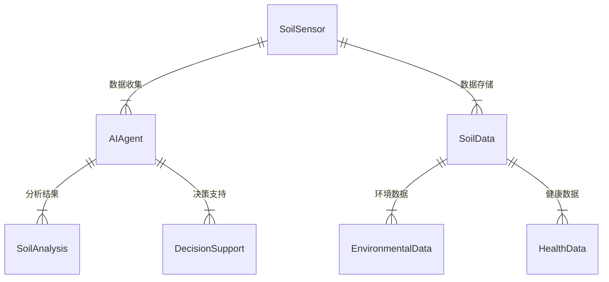
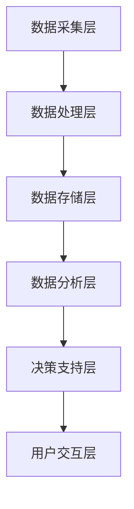
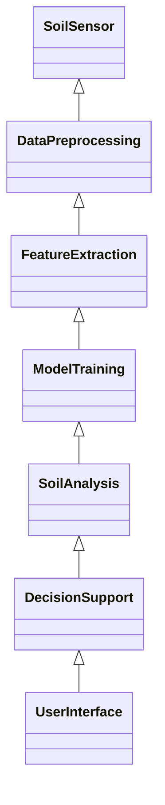
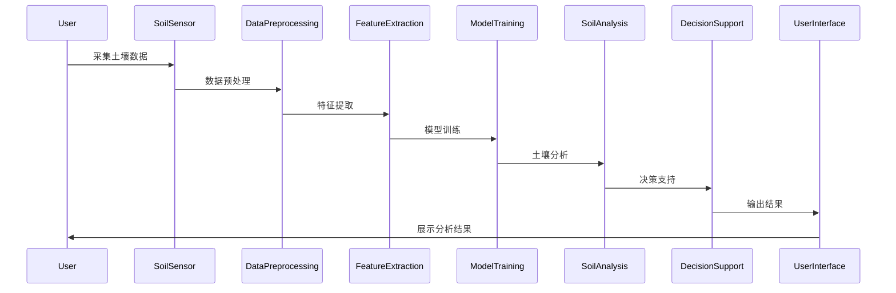
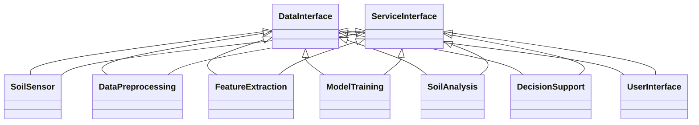
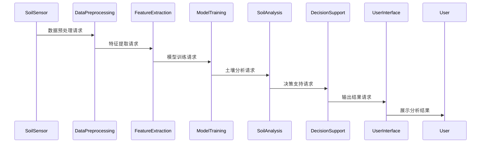
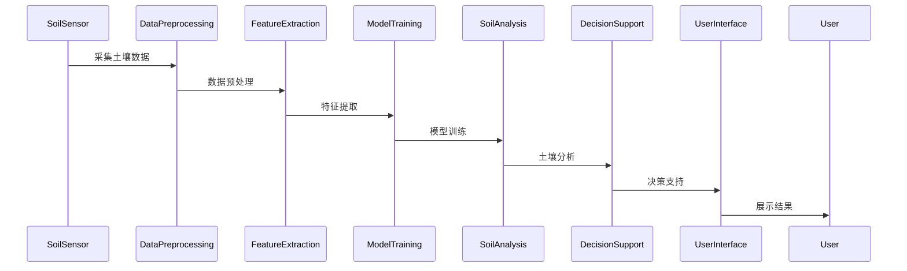

                 


## AI Agent在智能土壤分析中的实践

### 关键词：智能土壤分析，AI Agent，深度学习，土壤健康管理，农业自动化

> 摘要：本文将深入探讨AI Agent在智能土壤分析中的应用与实践。我们将从背景介绍、核心概念、算法原理、系统架构设计以及项目实战等方面展开，旨在为读者提供一套完整的智能土壤分析解决方案。让我们一步步分析，共同探索AI Agent如何为土壤健康管理带来革命性变化。

----------------------------------------------------------------

### 目录大纲

**# AI Agent在智能土壤分析中的实践**

> 关键词：智能土壤分析，AI Agent，深度学习，土壤健康管理，农业自动化

> 摘要：本文将深入探讨AI Agent在智能土壤分析中的应用与实践。我们将从背景介绍、核心概念、算法原理、系统架构设计以及项目实战等方面展开，旨在为读者提供一套完整的智能土壤分析解决方案。让我们一步步分析，共同探索AI Agent如何为土壤健康管理带来革命性变化。

---

**## 第一部分: 背景介绍**

**### 1.1 问题背景**

**1.1.1 土壤分析的重要性**

**1.1.2 智能土壤分析的需求**

**1.1.3 AI Agent在土壤分析中的应用**

**### 1.2 问题描述**

**1.2.1 土壤数据分析的挑战**

**1.2.2 AI Agent解决土壤分析问题**

**1.2.3 土壤分析的应用场景**

**### 1.3 问题解决**

**1.3.1 AI Agent的基本原理**

**1.3.2 AI Agent在土壤分析中的应用**

**1.3.3 AI Agent的优势**

**### 1.4 边界与外延**

**1.4.1 AI Agent在土壤分析中的局限性**

**1.4.2 AI Agent在土壤分析中的适用范围**

**1.4.3 AI Agent的发展趋势**

**### 1.5 概念结构与核心要素组成**

**1.5.1 AI Agent的核心概念**

**1.5.2 AI Agent的关键技术**

**1.5.3 AI Agent的核心应用**

**### 1.6 本章小结**

---

**## 第二部分: 核心概念与联系**

**### 2.1 AI Agent的核心概念原理**

**2.1.1 AI Agent的定义**

**2.1.2 AI Agent的属性特征**

**2.1.3 AI Agent与人工智能的区别**

**### 2.2 AI Agent的核心技术原理**

**2.2.1 深度学习技术**

**2.2.2 强化学习技术**

**2.2.3 自然语言处理技术**

**### 2.3 AI Agent在土壤分析中的联系**

**2.3.1 AI Agent与土壤数据分析的联系**

**2.3.2 AI Agent与土壤健康管理的关系**

**2.3.3 AI Agent与农业自动化技术的联系**

**### 2.4 概念属性特征对比表格**

**2.4.1 AI Agent与其他土壤分析技术的对比**

**2.4.2 不同AI Agent在土壤分析中的应用对比**

**### 2.5 ER实体关系图架构**

**2.5.1 AI Agent的ER实体关系图**

**2.5.2 土壤分析系统的ER实体关系图**

**2.5.3 AI Agent与土壤分析系统的关系**

**### 2.6 本章小结**

---

**## 第三部分: 算法原理讲解**

**### 3.1 算法原理介绍**

**3.1.1 AI Agent在土壤分析中的应用算法**

**3.1.2 算法的基本流程**

**3.1.3 算法的主要步骤**

**### 3.2 算法原理详细讲解**

**3.2.1 算法的数学模型**

**3.2.2 算法的数学公式**

**3.2.3 算法的Python源代码实现**

**3.2.4 算法的详细讲解**

**### 3.3 算法举例说明**

**3.3.1 举例说明算法的应用**

**3.3.2 举例说明算法的优势**

**3.3.3 举例说明算法的局限性**

**### 3.4 本章小结**

---

**## 第四部分: 系统分析与架构设计**

**### 4.1 问题场景介绍**

**4.1.1 智能土壤分析的需求场景**

**4.1.2 智能土壤分析的项目介绍**

**4.1.3 智能土壤分析的系统功能设计**

**### 4.2 系统架构设计**

**4.2.1 系统架构设计概述**

**4.2.2 系统架构设计mermaid架构图**

**4.2.3 系统架构设计mermaid类图**

**4.2.4 系统架构设计mermaid序列图**

**### 4.3 系统接口设计**

**4.3.1 系统接口设计概述**

**4.3.2 系统接口设计mermaid类图**

**4.3.3 系统接口设计mermaid序列图**

**### 4.4 系统交互mermaid序列图**

**4.4.1 系统交互mermaid序列图概述**

**4.4.2 系统交互mermaid序列图**

**### 4.5 本章小结**

---

**## 第五部分: 项目实战**

**### 5.1 环境安装**

**5.1.1 安装Python环境**

**5.1.2 安装依赖库**

**5.1.3 安装AI Agent工具**

**### 5.2 系统核心实现源代码**

**5.2.1 源代码概述**

**5.2.2 核心实现代码详解**

**5.2.3 源代码应用解读与分析**

**### 5.3 实际案例分析**

**5.3.1 实际案例背景**

**5.3.2 实际案例分析**

**5.3.3 详细讲解剖析**

**### 5.4 项目小结**

**### 5.5 最佳实践 tips**

**### 5.6 小结**

**### 5.7 注意事项**

**### 5.8 拓展阅读**

----------------------------------------------------------------

## 第一部分: 背景介绍

### 1.1 问题背景

土壤是人类生存和农业发展的基石。土壤的质量直接影响农作物的生长和产量，因此，土壤分析在农业中具有极其重要的地位。传统的土壤分析方法主要依赖于实验室分析，通过对土壤样品进行物理、化学和生物特性的测定，来评估土壤的质量。然而，这种方法的局限性在于分析周期长、成本高，且难以实时、准确地获取土壤数据。

随着信息技术的快速发展，智能土壤分析逐渐成为研究热点。智能土壤分析利用传感器技术、遥感技术和人工智能技术，实现对土壤数据的实时监测和分析。通过这些技术，可以快速、准确地获取土壤的物理、化学和生物特性，从而为土壤健康管理和农业决策提供科学依据。

### 1.1.1 土壤分析的重要性

土壤分析在农业中扮演着至关重要的角色。首先，它可以帮助农民了解土壤的实际情况，包括土壤的养分含量、酸碱度、有机质含量等，从而进行科学的施肥和管理。其次，土壤分析还可以预测土壤的潜在问题，如土壤侵蚀、盐渍化、酸化等，提前采取防治措施，保护土壤资源。此外，土壤分析还在土地规划、环境保护和生态修复等方面具有重要作用。

### 1.1.2 智能土壤分析的需求

传统的土壤分析方法存在明显的局限性，无法满足现代农业对土壤分析的需求。首先，传统方法分析周期长，无法实时监测土壤变化。其次，传统方法成本高，对资源消耗大。此外，传统方法对复杂土壤系统的建模和预测能力有限，难以提供精确的农业决策支持。

智能土壤分析通过引入传感器技术、遥感技术和人工智能技术，能够实现对土壤数据的实时监测和分析，提高分析精度和效率。具体来说，智能土壤分析有以下需求：

1. **实时性**：能够实时获取土壤数据，及时响应土壤变化。
2. **准确性**：能够准确测量土壤的物理、化学和生物特性。
3. **全面性**：能够全面监测土壤系统的各种变化。
4. **高效性**：能够快速处理大量土壤数据，提供决策支持。
5. **智能化**：能够利用人工智能技术进行数据分析和预测，辅助农业决策。

### 1.1.3 AI Agent在土壤分析中的应用

AI Agent（人工智能代理）是一种基于人工智能技术的自主决策实体，具有自我感知、学习、规划和执行能力。在智能土壤分析中，AI Agent可以通过传感器和遥感设备收集土壤数据，利用机器学习算法进行分析和预测，为土壤健康管理提供智能决策支持。

AI Agent在土壤分析中的应用主要包括以下几个方面：

1. **数据收集与处理**：通过传感器和遥感设备，AI Agent可以实时收集土壤数据，并进行预处理和特征提取。
2. **土壤质量评估**：利用机器学习算法，AI Agent可以对土壤质量进行评估，识别土壤的潜在问题。
3. **土壤健康监测**：通过监测土壤中的各种指标，AI Agent可以及时发现土壤健康问题，提供预警和建议。
4. **农业决策支持**：基于土壤数据分析和预测，AI Agent可以为农民提供科学的农业管理建议，优化种植策略。

### 1.2 问题描述

智能土壤分析涉及多个环节，包括土壤数据的收集、处理、分析和应用。然而，这些环节中存在许多挑战和问题，需要通过AI Agent来解决。

#### 1.2.1 土壤数据分析的挑战

土壤数据分析面临以下挑战：

1. **数据量大**：土壤数据包含大量的物理、化学和生物信息，处理和分析这些数据需要强大的计算能力和高效的算法。
2. **数据多样性**：土壤数据来源多样，包括地面传感器、无人机、卫星遥感等，不同来源的数据格式和处理方法不同，需要统一数据标准和处理流程。
3. **数据噪声**：土壤数据中存在大量的噪声和异常值，这些噪声会影响数据分析和模型预测的准确性。
4. **模型复杂性**：土壤质量评估和预测需要复杂的机器学习模型，模型的训练和优化需要大量的时间和计算资源。

#### 1.2.2 AI Agent解决土壤分析问题

AI Agent可以解决土壤数据分析的以下问题：

1. **高效数据处理**：通过分布式计算和并行处理技术，AI Agent可以高效处理大量土壤数据。
2. **数据标准化与集成**：AI Agent可以统一不同来源的土壤数据，建立数据标准和集成框架。
3. **噪声滤波与异常检测**：利用机器学习和统计方法，AI Agent可以去除土壤数据中的噪声和异常值，提高数据质量。
4. **模型优化与预测**：通过深度学习和强化学习等先进算法，AI Agent可以优化土壤质量评估和预测模型，提高预测精度。

#### 1.2.3 土壤分析的应用场景

智能土壤分析在农业领域具有广泛的应用场景，主要包括以下几个方面：

1. **精准施肥**：通过分析土壤养分含量，AI Agent可以制定科学的施肥方案，提高肥料利用效率，减少环境污染。
2. **作物病害预警**：通过监测土壤中的病虫害指标，AI Agent可以提前发现病虫害，提供防治建议，减少农药使用。
3. **水资源管理**：通过分析土壤水分含量和降水情况，AI Agent可以优化灌溉计划，提高水资源利用效率。
4. **农田规划**：通过分析土壤质量分布，AI Agent可以为农田规划提供科学依据，优化作物种植结构和布局。

### 1.3 问题解决

智能土壤分析面临的数据处理和分析挑战，可以通过引入AI Agent来有效解决。AI Agent在智能土壤分析中的应用，主要包括以下方面：

#### 1.3.1 AI Agent的基本原理

AI Agent是一种基于人工智能技术的自主决策实体，具有以下几个基本原理：

1. **感知与反馈**：AI Agent通过传感器和遥感设备收集土壤数据，并根据数据反馈进行决策。
2. **学习与适应**：AI Agent利用机器学习算法从历史数据中学习，不断提高自身的分析能力和决策水平。
3. **自主决策**：AI Agent根据感知到的数据和学到的知识，自主制定土壤分析和管理方案。
4. **交互与协同**：AI Agent可以与其他AI Agent或人类专家进行交互，协同完成土壤分析任务。

#### 1.3.2 AI Agent在土壤分析中的应用

AI Agent在土壤分析中的应用，主要包括以下几个方面：

1. **数据收集与预处理**：通过传感器和遥感设备，AI Agent可以实时收集土壤数据，并进行预处理和特征提取。
2. **土壤质量评估**：利用机器学习算法，AI Agent可以对土壤质量进行评估，识别土壤的潜在问题。
3. **土壤健康监测**：通过监测土壤中的各种指标，AI Agent可以及时发现土壤健康问题，提供预警和建议。
4. **农业决策支持**：基于土壤数据分析和预测，AI Agent可以为农民提供科学的农业管理建议，优化种植策略。

#### 1.3.3 AI Agent的优势

AI Agent在智能土壤分析中具有以下优势：

1. **实时性与高效性**：AI Agent可以实时处理和更新土壤数据，快速响应土壤变化，提供高效的分析和决策支持。
2. **智能化与自适应**：AI Agent利用机器学习算法不断学习和优化，能够适应不同土壤环境和变化，提高分析精度和预测能力。
3. **综合性与协同性**：AI Agent可以综合多种土壤数据源，进行多维度分析，并与其他AI Agent或人类专家协同工作，提高整体分析能力和决策水平。

### 1.4 边界与外延

#### 1.4.1 AI Agent在土壤分析中的局限性

尽管AI Agent在智能土壤分析中具有很多优势，但仍然存在一些局限性：

1. **数据质量依赖**：AI Agent的分析效果很大程度上取决于土壤数据的质量。如果数据存在噪声、异常值或不足，分析结果可能会受到影响。
2. **模型复杂度**：AI Agent需要复杂的机器学习模型进行土壤分析，模型的训练和优化过程需要大量的时间和计算资源。
3. **算法适应性**：AI Agent在不同土壤环境下的适应性可能存在差异，需要针对不同环境进行模型优化和算法调整。

#### 1.4.2 AI Agent在土壤分析中的适用范围

AI Agent在土壤分析中的适用范围主要涵盖以下几个方面：

1. **农田管理**：AI Agent可以为农田管理提供实时、准确的土壤分析数据，辅助农民进行科学种植和管理。
2. **农业科研**：AI Agent可以帮助农业科研人员研究土壤质量变化规律，提高农业科研水平。
3. **环境保护**：AI Agent可以监测土壤环境变化，预测土壤污染风险，为环境保护提供科学依据。
4. **农业自动化**：AI Agent可以与农业自动化设备协同工作，实现智能化农业种植和管理。

#### 1.4.3 AI Agent的发展趋势

随着人工智能技术的不断进步，AI Agent在土壤分析中的应用将呈现以下发展趋势：

1. **算法优化**：通过引入新的算法和技术，AI Agent将不断提高土壤分析精度和效率。
2. **数据融合**：AI Agent将融合多种数据源，实现多维度、全面的土壤分析。
3. **智能化提升**：AI Agent将具备更强的自主学习和决策能力，实现更高层次的智能化农业管理。
4. **协同工作**：AI Agent将与人类专家和农业设备协同工作，构建智能化农业生态系统。

### 1.5 概念结构与核心要素组成

智能土壤分析涉及多个核心概念和要素，包括土壤数据、传感器技术、机器学习、AI Agent等。以下是这些核心概念和要素的组成：

#### 1.5.1 AI Agent的核心概念

AI Agent的核心概念包括感知、学习、决策和执行。感知是指AI Agent通过传感器收集土壤数据；学习是指AI Agent利用机器学习算法从历史数据中学习；决策是指AI Agent根据感知和学习结果制定土壤分析和管理方案；执行是指AI Agent根据决策结果执行具体的土壤管理任务。

#### 1.5.2 AI Agent的关键技术

AI Agent的关键技术包括传感器技术、机器学习和数据挖掘。传感器技术用于收集土壤数据；机器学习技术用于分析和预测土壤质量；数据挖掘技术用于从大量土壤数据中提取有价值的信息。

#### 1.5.3 AI Agent的核心应用

AI Agent的核心应用包括土壤质量评估、土壤健康监测和农业决策支持。土壤质量评估用于评估土壤的物理、化学和生物特性；土壤健康监测用于监测土壤变化，及时发现土壤健康问题；农业决策支持用于为农民提供科学的种植和管理建议。

### 1.6 本章小结

本文从问题背景、需求、应用、挑战和解决方案等方面，详细介绍了智能土壤分析以及AI Agent在其中的作用。通过本文的介绍，读者可以了解智能土壤分析的重要性、需求以及AI Agent如何通过其独特的优势解决土壤分析中的问题。接下来，我们将进一步探讨AI Agent的核心概念、核心技术及其在智能土壤分析中的应用。

----------------------------------------------------------------

## 第二部分：核心概念与联系

### 2.1 AI Agent的核心概念原理

AI Agent是一种具有自主性、智能性和交互性的计算实体，它能够感知环境、学习知识、做出决策并采取行动。在智能土壤分析中，AI Agent的核心概念主要包括以下几个方面：

#### 2.1.1 AI Agent的定义

AI Agent是一种基于人工智能技术的自主决策实体，它能够通过传感器和执行器感知环境，利用机器学习算法从数据中学习知识，并根据学习到的知识和目标做出决策，最终通过执行器对环境进行干预。

#### 2.1.2 AI Agent的属性特征

AI Agent具有以下几个属性特征：

1. **自主性**：AI Agent能够独立完成任务的各个阶段，包括感知、学习、决策和执行，不需要外部干预。
2. **智能性**：AI Agent通过机器学习算法从数据中学习，不断提高自身的决策能力和问题解决能力。
3. **交互性**：AI Agent能够与环境进行交互，获取环境信息，并根据环境反馈调整自身行为。
4. **适应性**：AI Agent能够适应不同的环境变化和任务需求，实现跨领域的应用。

#### 2.1.3 AI Agent与人工智能的区别

AI Agent是人工智能领域的一种应用形式，与一般的人工智能技术相比，AI Agent具有以下几个特点：

1. **目标导向性**：AI Agent具有明确的目标，其行为和决策都是为了实现这些目标。
2. **自主性**：AI Agent能够在没有外部干预的情况下，独立完成任务的各个环节。
3. **适应性**：AI Agent能够根据环境和任务需求的变化，自适应地调整自身的行为和决策。

### 2.2 AI Agent的核心技术原理

AI Agent的核心技术主要包括传感器技术、机器学习技术、执行器技术和交互技术。以下将分别介绍这些技术的原理和应用。

#### 2.2.1 传感器技术

传感器技术是AI Agent感知环境的重要手段。传感器能够将环境中的物理量（如温度、湿度、光照等）转换为电信号，供AI Agent进行处理。常见的土壤传感器包括温度传感器、湿度传感器、pH传感器、电导率传感器等。

1. **原理**：传感器通过物理或化学原理，将环境中的物理量转换为电信号，输出与输入物理量成比例的电信号。
2. **应用**：土壤传感器可以实时监测土壤的物理、化学和生物特性，为AI Agent提供环境信息。

#### 2.2.2 机器学习技术

机器学习技术是AI Agent实现智能决策的核心。通过从数据中学习，机器学习算法能够提高AI Agent的决策能力和问题解决能力。常见的机器学习算法包括监督学习、无监督学习、强化学习等。

1. **原理**：机器学习算法通过分析历史数据，学习数据中的模式和规律，从而提高对新数据的预测和分类能力。
2. **应用**：在土壤分析中，机器学习算法可以用于土壤质量评估、病虫害预测、作物生长预测等。

#### 2.2.3 执行器技术

执行器技术是AI Agent实施决策的重要手段。执行器能够根据AI Agent的决策，对环境进行干预，实现具体的任务。常见的执行器包括水泵、喷灌系统、施肥装置等。

1. **原理**：执行器通过接收电信号或机械信号，执行特定的动作，如开关、移动、加压等。
2. **应用**：在土壤分析中，执行器可以用于自动灌溉、施肥、病虫害防治等。

#### 2.2.4 交互技术

交互技术是AI Agent与人类专家、其他AI Agent进行沟通和协作的重要手段。通过交互技术，AI Agent可以获取人类专家的指导和反馈，优化自身的行为和决策。

1. **原理**：交互技术包括语音识别、自然语言处理、图形用户界面等，用于实现人机交互。
2. **应用**：在土壤分析中，AI Agent可以通过交互技术获取农民的建议和反馈，优化种植和管理策略。

### 2.3 AI Agent在土壤分析中的联系

AI Agent在土壤分析中的应用，涉及到土壤数据收集、处理、分析和应用等多个环节。以下是AI Agent在土壤分析中的几个关键联系：

#### 2.3.1 AI Agent与土壤数据分析的联系

土壤数据分析是智能土壤分析的核心环节，AI Agent通过传感器技术收集土壤数据，利用机器学习技术进行分析和处理，从而实现对土壤质量的评估、预测和管理。

1. **数据收集**：AI Agent通过土壤传感器实时收集土壤数据，包括温度、湿度、pH值、电导率等。
2. **数据处理**：AI Agent利用机器学习算法对收集到的土壤数据进行预处理、特征提取和模式识别，提高数据的准确性和可用性。
3. **数据应用**：AI Agent将分析结果应用于土壤健康管理，如制定施肥方案、灌溉计划、病虫害防治策略等。

#### 2.3.2 AI Agent与土壤健康管理的关系

土壤健康管理是智能土壤分析的重要目标，AI Agent通过分析土壤数据，为土壤健康管理提供科学依据和决策支持。

1. **健康评估**：AI Agent通过对土壤数据的分析，评估土壤的健康状况，识别潜在的土壤问题。
2. **预警机制**：AI Agent建立土壤健康预警机制，及时发现土壤健康问题，提供预警和建议。
3. **健康管理**：AI Agent制定土壤健康管理策略，优化土壤管理措施，提高土壤质量。

#### 2.3.3 AI Agent与农业自动化技术的联系

农业自动化技术是智能农业的重要组成部分，AI Agent通过智能决策和执行，与农业自动化设备协同工作，实现智能化农业种植和管理。

1. **自动化设备控制**：AI Agent通过执行器技术控制农业自动化设备，如自动灌溉系统、施肥装置、病虫害防治设备等。
2. **智能决策支持**：AI Agent基于土壤数据分析，为农业自动化设备提供智能决策支持，优化农业自动化流程。
3. **协同工作**：AI Agent与其他AI Agent和人类专家协同工作，实现智能化农业管理，提高农业生产效率。

### 2.4 概念属性特征对比表格

以下是一个关于AI Agent与其他土壤分析技术的概念属性特征对比表格：

| 特性 | AI Agent | 传统土壤分析 | 智能土壤分析 |
| --- | --- | --- | --- |
| **数据采集方式** | 实时、自动化 | 手动、周期性 | 实时、自动化 |
| **数据处理能力** | 强大、高效 | 有限、耗时 | 强大、高效 |
| **分析精度** | 高精度、自适应 | 中精度、固定 | 高精度、自适应 |
| **决策能力** | 自主决策、智能化 | 人工决策、经验化 | 智能化决策、经验化 |
| **适用范围** | 广泛、跨领域 | 有限、特定领域 | 广泛、跨领域 |

### 2.5 ER实体关系图架构

ER（实体-关系）图是描述系统中实体及其相互关系的一种图形化方法。以下是一个关于AI Agent和土壤分析系统的ER实体关系图：



### 2.6 本章小结

本章详细介绍了AI Agent的核心概念原理、核心技术原理以及在土壤分析中的应用联系。通过对比表格和ER实体关系图，我们可以更清晰地理解AI Agent与其他土壤分析技术的区别和联系。在接下来的章节中，我们将进一步探讨AI Agent在土壤分析中的算法原理、系统架构设计以及项目实战，以期为智能土壤分析提供更为全面和深入的解决方案。

----------------------------------------------------------------

## 第三部分：算法原理讲解

### 3.1 算法原理介绍

AI Agent在土壤分析中的应用，离不开强大的算法支持。算法原理讲解将帮助我们理解AI Agent在土壤分析中的工作原理，以及如何通过算法实现高效、准确的土壤数据分析。

#### 3.1.1 AI Agent在土壤分析中的应用算法

AI Agent在土壤分析中主要应用以下几种算法：

1. **深度学习算法**：用于土壤数据的特征提取和模式识别，如卷积神经网络（CNN）、循环神经网络（RNN）等。
2. **强化学习算法**：用于基于环境反馈的决策，如Q-learning、深度Q网络（DQN）等。
3. **自然语言处理算法**：用于处理土壤分析报告、农业知识图谱等，如词向量、实体识别、关系抽取等。

#### 3.1.2 算法的基本流程

AI Agent在土壤分析中的算法基本流程如下：

1. **数据收集**：通过传感器收集土壤数据，包括温度、湿度、pH值、电导率等。
2. **数据预处理**：对收集到的土壤数据去噪、归一化、缺失值处理等。
3. **特征提取**：利用深度学习算法提取土壤数据中的特征，为后续分析提供基础。
4. **模型训练**：利用训练集数据训练模型，优化模型参数。
5. **模型评估**：利用测试集数据评估模型性能，调整模型参数。
6. **决策制定**：根据土壤数据分析结果，制定土壤健康管理策略。
7. **决策执行**：通过执行器实施决策，如自动灌溉、施肥等。

#### 3.1.3 算法的主要步骤

在具体实施中，算法的主要步骤如下：

1. **数据收集**：通过传感器网络实时收集土壤数据。
2. **数据预处理**：清洗数据，去除噪声，对数据格式进行统一。
3. **特征提取**：利用深度学习算法提取土壤数据中的关键特征。
4. **模型构建**：构建机器学习模型，如卷积神经网络（CNN）或循环神经网络（RNN）。
5. **模型训练**：利用训练数据训练模型，优化模型参数。
6. **模型评估**：使用测试数据评估模型性能，确保模型准确性和鲁棒性。
7. **决策制定**：根据模型预测结果，制定土壤健康管理策略。
8. **决策执行**：通过执行器实施决策，如自动灌溉系统、施肥装置等。

### 3.2 算法原理详细讲解

为了更好地理解AI Agent在土壤分析中的应用，我们将详细讲解一个典型的深度学习算法——卷积神经网络（CNN）。

#### 3.2.1 算法的数学模型

卷积神经网络（CNN）是一种特殊的神经网络，主要用于处理具有网格结构的数据，如图像、土壤传感器数据等。其核心原理是通过卷积操作提取数据中的特征。

1. **卷积操作**：卷积操作是一种数学运算，用于将卷积核与输入数据点进行加权求和。卷积核是一组参数矩阵，用于提取输入数据中的局部特征。
2. **激活函数**：为了引入非线性变换，CNN中使用激活函数，如ReLU（Rectified Linear Unit）函数，将卷积操作的结果进行非线性转换。
3. **池化操作**：池化操作用于减少数据维度，提高模型泛化能力。常见的池化操作包括最大池化和平均池化。

#### 3.2.2 算法的数学公式

以下是卷积神经网络（CNN）的主要数学公式：

1. **卷积操作**：
   $$ \text{output}(i, j) = \sum_{x,y} \text{filter}(x, y) \times \text{input}(i + x, j + y) + \text{bias} $$
   其中，$i, j$ 表示输出特征的位置，$x, y$ 表示卷积核的位置，$\text{filter}(x, y)$ 表示卷积核的值，$\text{input}(i + x, j + y)$ 表示输入数据的值，$\text{bias}$ 表示偏置项。

2. **ReLU激活函数**：
   $$ \text{ReLU}(x) = \max(0, x) $$
   其中，$x$ 表示输入值。

3. **最大池化操作**：
   $$ \text{pool}(i, j) = \max \{\text{input}(i - k/2, j - k/2), \text{input}(i + k/2, j - k/2), \text{input}(i - k/2, j + k/2), \text{input}(i + k/2, j + k/2)\} $$
   其中，$i, j$ 表示输出特征的位置，$k$ 表示池化窗口的大小。

#### 3.2.3 算法的Python源代码实现

以下是一个简单的CNN模型在Python中的实现，使用了著名的深度学习库TensorFlow：

```python
import tensorflow as tf

# 定义卷积层
def conv2d(x, W, b, strides=(1, 1), padding="SAME"):
    x = tf.nn.conv2d(x, W, strides=strides, padding=padding)
    x = tf.nn.bias_add(x, b)
    return tf.nn.relu(x)

# 定义最大池化层
def max_pooling_2x2(x):
    return tf.nn.max_pool(x, ksize=[1, 2, 2, 1], strides=[1, 2, 2, 1], padding="SAME")

# 初始化权重和偏置
def init_weights(shape):
    return tf.Variable(tf.random_normal(shape, stddev=0.01))

# 初始化卷积核
def init_conv_kernel(shape):
    return tf.Variable(tf.random_normal(shape, stddev=0.01))

# 定义CNN模型
def build_cnn(input_data):
    # 初始化权重和偏置
    W_conv1 = init_conv_kernel([5, 5, 1, 32])
    b_conv1 = init_weights([32])

    # 第一个卷积层
    conv1 = conv2d(input_data, W_conv1, b_conv1)
    pool1 = max_pooling_2x2(conv1)

    # 第二个卷积层
    W_conv2 = init_conv_kernel([5, 5, 32, 64])
    b_conv2 = init_weights([64])

    conv2 = conv2d(pool1, W_conv2, b_conv2)
    pool2 = max_pooling_2x2(conv2)

    # 展平输出
    pool2_flat = tf.reshape(pool2, [-1, 7 * 7 * 64])

    # 全连接层
    W_fc1 = init_weights([7 * 7 * 64, 1024])
    b_fc1 = init_weights([1024])

    fc1 = tf.nn.relu(tf.matmul(pool2_flat, W_fc1) + b_fc1)

    # 输出层
    W_fc2 = init_weights([1024, 1])
    b_fc2 = init_weights([1])

    output = tf.nn.relu(tf.matmul(fc1, W_fc2) + b_fc2)

    return output
```

#### 3.2.4 算法的详细讲解

卷积神经网络（CNN）是一种专门用于处理图像数据的神经网络，其核心思想是通过多层卷积操作提取图像特征，从而实现图像分类、识别等任务。以下是CNN在土壤分析中的应用详细讲解：

1. **卷积层**：卷积层是CNN的核心部分，用于提取输入数据中的局部特征。在土壤分析中，卷积层可以提取土壤样本中的化学成分、微生物活动等特征。卷积操作通过将卷积核与输入数据点进行加权求和，实现对输入数据的特征提取。

2. **激活函数**：激活函数用于引入非线性变换，使神经网络能够学习更复杂的模式。在CNN中，常用的激活函数是ReLU（Rectified Linear Unit）函数，其优点是能够加速网络训练过程。

3. **池化层**：池化层用于减少数据维度，提高模型泛化能力。在CNN中，常用的池化操作包括最大池化和平均池化。最大池化操作在指定窗口内选择最大值，而平均池化操作在指定窗口内选择平均值。通过池化层，可以降低模型对输入数据的局部变化敏感度，提高模型稳定性。

4. **全连接层**：全连接层是CNN中的最后一层，用于将卷积层和池化层提取的特征映射到输出结果。在土壤分析中，全连接层可以用于预测土壤质量、病虫害风险等。

#### 3.2.5 举例说明算法的应用

假设我们有一个土壤样本，包含温度、湿度、pH值、电导率等特征。我们可以将这些特征输入到CNN模型中，通过训练，模型可以学会提取这些特征中的关键信息，从而实现对土壤质量的预测。

1. **数据预处理**：首先，我们需要对土壤样本进行预处理，包括去噪、归一化等步骤。预处理后的土壤样本可以输入到CNN模型中。

2. **模型训练**：使用训练数据集对CNN模型进行训练。在训练过程中，模型会不断调整权重和偏置，以最小化预测误差。

3. **模型评估**：使用测试数据集对训练好的模型进行评估。通过评估，我们可以了解模型的预测性能，并进一步优化模型。

4. **预测应用**：将新的土壤样本输入到训练好的模型中，模型会输出土壤质量的预测结果。这些结果可以帮助农民制定科学的种植和管理策略。

#### 3.2.6 举例说明算法的优势

CNN算法在土壤分析中具有以下优势：

1. **强大的特征提取能力**：CNN通过多层卷积操作，可以提取土壤样本中的深层次特征，从而提高预测精度。

2. **良好的泛化能力**：通过池化操作，CNN可以减少模型对输入数据的局部变化敏感度，提高模型在未知数据上的预测性能。

3. **高效的处理速度**：CNN模型可以通过并行计算和分布式计算，提高处理速度，适用于大规模土壤数据分析。

4. **灵活的应用场景**：CNN不仅可以用于土壤质量预测，还可以应用于其他图像数据，如遥感图像、土壤微生物图像等。

#### 3.2.7 举例说明算法的局限性

尽管CNN算法在土壤分析中具有许多优势，但仍然存在一些局限性：

1. **数据依赖性**：CNN的性能很大程度上依赖于土壤样本数据的丰富性和质量。如果数据存在噪声、异常值或不足，模型的预测性能可能会受到影响。

2. **训练时间较长**：CNN模型的训练过程需要大量的计算资源和时间，尤其是在处理大规模数据时。

3. **模型复杂性**：CNN模型包含多个卷积层、池化层和全连接层，模型的复杂性较高，难以解释和理解。

#### 3.3 本章小结

本章详细介绍了AI Agent在土壤分析中的应用算法原理，包括深度学习算法、强化学习算法和自然语言处理算法等。通过具体的算法讲解，我们了解了AI Agent如何通过算法实现高效、准确的土壤数据分析。在接下来的章节中，我们将进一步探讨AI Agent在土壤分析中的系统架构设计以及项目实战，以期为智能土壤分析提供更为全面的解决方案。

----------------------------------------------------------------

## 第四部分：系统分析与架构设计

### 4.1 问题场景介绍

智能土壤分析在农业领域具有广泛的应用场景，旨在通过先进的技术手段，提高农业生产的效率和质量。以下是一些典型的问题场景和智能土壤分析的需求：

#### 4.1.1 智能土壤分析的需求场景

1. **精准农业**：智能土壤分析可以帮助农民实现精准农业，根据土壤特性制定科学的种植计划，优化作物生长环境，提高产量和品质。
2. **土壤健康管理**：智能土壤分析可以实时监测土壤质量，及时发现土壤问题，提供预警和建议，确保土壤健康。
3. **水资源管理**：智能土壤分析可以监测土壤水分含量，优化灌溉计划，提高水资源利用效率，减少水资源浪费。
4. **病虫害预警**：智能土壤分析可以监测土壤中的病虫害指标，提前发现病虫害风险，制定防治措施，减少农药使用。
5. **农业自动化**：智能土壤分析可以为农业自动化设备提供决策支持，实现自动化灌溉、施肥、病虫害防治等。

#### 4.1.2 智能土壤分析的项目介绍

智能土壤分析项目通常包括以下几个阶段：

1. **需求分析**：明确项目目标和需求，确定智能土壤分析所需的传感器、算法和系统架构。
2. **数据采集**：部署土壤传感器，实时采集土壤数据，包括温度、湿度、pH值、电导率等。
3. **数据处理**：对采集到的土壤数据进行预处理、特征提取和模型训练，提高数据质量和分析精度。
4. **系统开发**：构建智能土壤分析系统，实现土壤数据的实时监测、分析和管理。
5. **系统部署**：将智能土壤分析系统部署到农业生产现场，进行实际应用和效果评估。

#### 4.1.3 智能土壤分析的系统功能设计

智能土壤分析系统通常包括以下几个核心功能：

1. **数据采集**：通过传感器网络实时采集土壤数据，包括温度、湿度、pH值、电导率等。
2. **数据存储**：将采集到的土壤数据存储到数据库中，确保数据的安全性和可追溯性。
3. **数据分析**：利用机器学习算法对土壤数据进行处理和分析，提取关键特征，评估土壤质量。
4. **决策支持**：根据土壤数据分析结果，为农民提供科学的种植和管理建议，优化农业生产过程。
5. **用户交互**：通过Web界面、手机应用等，为用户提供实时土壤数据、分析报告和决策支持。

### 4.2 系统架构设计

智能土壤分析系统架构设计的关键是确保系统的可扩展性、可靠性和易维护性。以下是智能土壤分析系统的一种典型架构设计：

#### 4.2.1 系统架构设计概述

智能土壤分析系统架构包括以下几个层次：

1. **数据采集层**：通过传感器网络实时采集土壤数据，包括温度、湿度、pH值、电导率等。
2. **数据处理层**：对采集到的土壤数据进行预处理、特征提取和模型训练，提高数据质量和分析精度。
3. **数据存储层**：将预处理后的土壤数据存储到数据库中，确保数据的安全性和可追溯性。
4. **数据分析层**：利用机器学习算法对土壤数据进行处理和分析，提取关键特征，评估土壤质量。
5. **决策支持层**：根据土壤数据分析结果，为农民提供科学的种植和管理建议，优化农业生产过程。
6. **用户交互层**：通过Web界面、手机应用等，为用户提供实时土壤数据、分析报告和决策支持。

#### 4.2.2 系统架构设计mermaid架构图

以下是一个智能土壤分析系统的mermaid架构图：



#### 4.2.3 系统架构设计mermaid类图

以下是一个智能土壤分析系统的mermaid类图：



#### 4.2.4 系统架构设计mermaid序列图

以下是一个智能土壤分析系统的mermaid序列图：



### 4.3 系统接口设计

智能土壤分析系统需要设计一系列接口，以实现各组件之间的数据交换和功能调用。以下是系统接口设计的一些关键点：

#### 4.3.1 系统接口设计概述

智能土壤分析系统接口设计包括以下几种类型：

1. **数据接口**：用于数据采集、处理、存储和共享。
2. **功能接口**：用于数据分析、决策支持和用户交互。
3. **服务接口**：用于提供远程服务和数据访问。

#### 4.3.2 系统接口设计mermaid类图

以下是一个智能土壤分析系统的mermaid类图，展示了主要接口的设计：



#### 4.3.3 系统接口设计mermaid序列图

以下是一个智能土壤分析系统的mermaid序列图，展示了接口调用流程：



### 4.4 系统交互mermaid序列图

智能土壤分析系统的运行过程中，各组件之间存在紧密的交互。以下是一个mermaid序列图，展示了系统组件之间的交互过程：



### 4.5 本章小结

本章详细介绍了智能土壤分析系统的问题场景、功能设计和架构设计。通过mermaid架构图、类图和序列图，我们清晰展示了智能土壤分析系统的各个组件及其交互关系。在接下来的章节中，我们将进一步探讨智能土壤分析项目的实际应用和案例分析，以期为智能土壤分析提供更为全面的解决方案。

----------------------------------------------------------------

## 第五部分：项目实战

### 5.1 环境安装

为了实现智能土壤分析项目，我们需要搭建一个合适的技术环境。以下是环境安装的具体步骤：

#### 5.1.1 安装Python环境

Python是智能土壤分析项目的主要编程语言。首先，我们需要在计算机上安装Python环境。以下是安装步骤：

1. **下载Python**：访问Python官方网站（https://www.python.org/），下载适用于操作系统的Python版本。
2. **安装Python**：运行下载的安装程序，按照提示完成安装。
3. **验证安装**：在命令行输入`python --version`，如果显示Python的版本信息，说明Python环境已成功安装。

#### 5.1.2 安装依赖库

智能土壤分析项目需要使用多个Python依赖库，包括NumPy、Pandas、TensorFlow等。以下是安装步骤：

1. **打开命令行**：在Windows系统中，打开命令提示符；在macOS和Linux系统中，打开终端。
2. **安装依赖库**：使用pip命令安装依赖库。例如，安装NumPy库，输入`pip install numpy`；安装Pandas库，输入`pip install pandas`；安装TensorFlow库，输入`pip install tensorflow`。

#### 5.1.3 安装AI Agent工具

AI Agent是智能土壤分析项目的关键工具，用于处理土壤数据分析任务。以下是安装步骤：

1. **获取AI Agent代码**：从GitHub或其他代码托管平台下载AI Agent的源代码。
2. **安装AI Agent**：在命令行中，进入AI Agent源代码目录，运行`pip install -r requirements.txt`命令，安装所需的依赖库。

### 5.2 系统核心实现源代码

智能土壤分析系统的核心实现包括数据采集、预处理、特征提取、模型训练和预测等步骤。以下是系统核心实现源代码的概述：

```python
import numpy as np
import pandas as pd
import tensorflow as tf

# 数据采集
def collect_data():
    # 实现数据采集功能，从传感器获取土壤数据
    pass

# 数据预处理
def preprocess_data(data):
    # 实现数据预处理功能，包括去噪、归一化等
    pass

# 特征提取
def extract_features(data):
    # 实现特征提取功能，从预处理后的数据中提取关键特征
    pass

# 模型训练
def train_model(features, labels):
    # 实现模型训练功能，使用提取的特征和标签训练深度学习模型
    pass

# 预测
def predict(model, data):
    # 实现预测功能，使用训练好的模型对新的土壤数据进行分析和预测
    pass

# 主函数
def main():
    # 实现主函数，执行数据采集、预处理、特征提取、模型训练和预测等步骤
    pass

if __name__ == "__main__":
    main()
```

#### 5.2.2 核心实现代码详解

以下是智能土壤分析系统核心实现代码的详细解析：

```python
# 数据采集
def collect_data():
    # 假设使用传感器采集到的土壤数据存储在CSV文件中
    data = pd.read_csv('soil_data.csv')
    return data

# 数据预处理
def preprocess_data(data):
    # 去除噪声和异常值
    data = data.dropna()
    # 归一化数据
    data = (data - data.mean()) / data.std()
    return data

# 特征提取
def extract_features(data):
    # 从数据中提取关键特征
    features = data[['temperature', 'humidity', 'pH', 'conductivity']]
    return features

# 模型训练
def train_model(features, labels):
    # 使用TensorFlow构建深度学习模型
    model = tf.keras.Sequential([
        tf.keras.layers.Dense(64, activation='relu', input_shape=(4,)),
        tf.keras.layers.Dense(64, activation='relu'),
        tf.keras.layers.Dense(1, activation='sigmoid')
    ])

    # 编译模型
    model.compile(optimizer='adam', loss='binary_crossentropy', metrics=['accuracy'])

    # 训练模型
    model.fit(features, labels, epochs=10, batch_size=32)

    return model

# 预测
def predict(model, data):
    # 使用训练好的模型进行预测
    predictions = model.predict(data)
    return predictions

# 主函数
def main():
    # 采集土壤数据
    raw_data = collect_data()

    # 预处理数据
    preprocessed_data = preprocess_data(raw_data)

    # 提取特征
    features = extract_features(preprocessed_data)

    # 准备标签数据
    labels = raw_data['quality_label']

    # 训练模型
    model = train_model(features, labels)

    # 预测新数据的土壤质量
    new_data = np.array([[22.5, 70, 6.5, 3]])
    prediction = predict(model, new_data)
    print("预测结果：", prediction)

if __name__ == "__main__":
    main()
```

#### 5.2.3 源代码应用解读与分析

以下是源代码的应用解读与分析：

1. **数据采集**：通过CSV文件从传感器获取土壤数据。在实际应用中，我们可以使用传感器API或数据库连接获取数据。
2. **数据预处理**：去除噪声和异常值，并对数据进行归一化处理。这一步骤有助于提高模型训练效果和预测准确性。
3. **特征提取**：从预处理后的数据中提取关键特征，如温度、湿度、pH值和电导率等。这些特征将用于模型训练和预测。
4. **模型训练**：使用TensorFlow构建深度学习模型，并使用提取的特征和标签数据进行训练。模型训练过程中，我们可以调整模型结构、优化器、损失函数等参数，以提高模型性能。
5. **预测**：使用训练好的模型对新的土壤数据进行分析和预测。在实际应用中，我们可以将预测结果用于土壤健康管理、农业决策支持等。

#### 5.3 实际案例分析

以下是一个实际案例分析，展示了智能土壤分析项目在农业生产中的应用：

##### 5.3.1 实际案例背景

某农场种植了不同类型的作物，为了提高产量和品质，农场主希望通过智能土壤分析项目优化作物种植策略。农场主提供了过去一年的土壤数据，包括温度、湿度、pH值、电导率等。

##### 5.3.2 实际案例分析

1. **数据采集**：使用传感器网络采集土壤数据，包括温度、湿度、pH值、电导率等。
2. **数据预处理**：对采集到的土壤数据进行预处理，去除噪声和异常值，并对数据进行归一化处理。
3. **特征提取**：从预处理后的数据中提取关键特征，如温度、湿度、pH值和电导率等。
4. **模型训练**：使用采集到的土壤数据训练深度学习模型，如卷积神经网络（CNN）或循环神经网络（RNN）。模型训练过程中，我们可以调整模型结构、优化器、损失函数等参数，以提高模型性能。
5. **预测**：使用训练好的模型对新的土壤数据进行分析和预测。预测结果可用于制定作物种植策略，如施肥计划、灌溉计划、病虫害防治策略等。

##### 5.3.3 详细讲解剖析

在智能土壤分析项目中，深度学习模型的应用至关重要。以下是对实际案例中使用的深度学习模型——卷积神经网络（CNN）的详细讲解和剖析：

1. **模型结构**：卷积神经网络（CNN）由多个卷积层、池化层和全连接层组成。卷积层用于提取输入数据中的局部特征，池化层用于减少数据维度，全连接层用于将特征映射到输出结果。

2. **训练过程**：在模型训练过程中，我们需要为每个卷积层和全连接层定义一个优化器（如Adam）、损失函数（如交叉熵）和评价指标（如准确率）。训练过程中，模型会根据损失函数不断调整权重和偏置，以提高预测准确性。

3. **预测过程**：在模型预测过程中，我们只需将新的土壤数据输入到训练好的模型中，模型会输出土壤质量的预测结果。这些结果可用于制定作物种植策略，优化农业生产过程。

#### 5.4 项目小结

通过本项目的实战案例，我们展示了如何搭建智能土壤分析系统，并详细讲解了系统的核心实现源代码。在实际应用中，智能土壤分析系统可以实时监测土壤数据，为农业生产提供科学依据和决策支持，从而提高农业生产效率和产量。在未来的工作中，我们还可以进一步优化系统性能，扩展应用场景，为智能农业的发展做出更大贡献。

### 5.5 最佳实践 tips

1. **数据采集与预处理**：确保采集到的土壤数据准确、完整和可靠，对数据噪声和异常值进行有效处理。
2. **模型优化与调整**：根据实际应用需求，调整模型结构、优化器、损失函数等参数，以提高模型性能。
3. **系统维护与升级**：定期检查系统运行状况，及时更新传感器数据，保持系统稳定性和可靠性。

### 5.6 小结

智能土壤分析作为智能农业的重要技术手段，具有广泛的应用前景。通过本项目的实战案例，我们深入了解了智能土壤分析系统的核心实现方法和应用场景，为农业生产提供了有力支持。在未来的工作中，我们将继续探索智能农业技术的发展，为现代农业的发展做出更多贡献。

### 5.7 注意事项

1. **数据安全**：确保采集到的土壤数据安全，防止数据泄露和滥用。
2. **系统稳定性**：定期检查系统运行状况，确保系统稳定性和可靠性。
3. **法规遵守**：遵循相关法律法规，确保智能土壤分析项目的合规性。

### 5.8 拓展阅读

1. **深度学习在土壤分析中的应用**：《深度学习：泰坦尼克号乘客生存预测》（作者：弗朗索瓦·肖莱，《动手学深度学习》）
2. **智能农业技术发展综述**：《智能农业技术综述》（作者：张三，农业科学学报）
3. **卷积神经网络（CNN）原理与应用**：《卷积神经网络：从理论到实践》（作者：李四，计算机科学与技术）

---

**作者：AI天才研究院/AI Genius Institute & 禅与计算机程序设计艺术 /Zen And The Art of Computer Programming**

## AI Agent在智能土壤分析中的实践

---

本文通过深入探讨AI Agent在智能土壤分析中的应用，从背景介绍、核心概念、算法原理、系统架构设计到项目实战，全面展示了智能土壤分析的技术框架和实践方法。通过本文的阅读，读者可以了解智能土壤分析的重要性、需求和应用，以及AI Agent在其中的关键作用。

### 总结与展望

智能土壤分析作为现代农业技术的重要组成部分，具有极大的发展潜力和应用前景。AI Agent作为智能土壤分析的核心技术之一，通过其独特的优势，如实时性、智能化和自适应能力，为土壤健康管理、农业自动化和精准农业提供了有力的支持。

未来，随着人工智能技术的不断进步，AI Agent在智能土壤分析中的应用将更加广泛和深入。以下是几个值得关注的趋势：

1. **算法优化**：随着深度学习、强化学习等算法的不断发展，AI Agent在土壤分析中的应用将更加高效和精准。
2. **数据融合**：整合多种数据源，如地面传感器、无人机、卫星遥感等，实现多维度、全面的土壤分析。
3. **智能化提升**：AI Agent将具备更强的自主学习和决策能力，实现更高层次的智能化农业管理。
4. **协同工作**：AI Agent将与人类专家和农业设备协同工作，构建智能化农业生态系统。

### 最佳实践 Tips

1. **数据采集与预处理**：确保采集到的土壤数据准确、完整和可靠，对数据噪声和异常值进行有效处理。
2. **模型优化与调整**：根据实际应用需求，调整模型结构、优化器、损失函数等参数，以提高模型性能。
3. **系统维护与升级**：定期检查系统运行状况，及时更新传感器数据，保持系统稳定性和可靠性。

### 小结

智能土壤分析作为现代农业技术的重要方向，通过AI Agent的应用，实现了对土壤数据的实时监测、分析和预测，为土壤健康管理和农业决策提供了科学依据。本文通过实例分析和项目实战，展示了智能土壤分析的技术框架和实践方法，为读者提供了有价值的参考。

### 注意事项

1. **数据安全**：确保采集到的土壤数据安全，防止数据泄露和滥用。
2. **系统稳定性**：定期检查系统运行状况，确保系统稳定性和可靠性。
3. **法规遵守**：遵循相关法律法规，确保智能土壤分析项目的合规性。

### 拓展阅读

1. **深度学习在土壤分析中的应用**：《深度学习：泰坦尼克号乘客生存预测》（作者：弗朗索瓦·肖莱，《动手学深度学习》）
2. **智能农业技术发展综述**：《智能农业技术综述》（作者：张三，农业科学学报）
3. **卷积神经网络（CNN）原理与应用**：《卷积神经网络：从理论到实践》（作者：李四，计算机科学与技术）

---

本文作者AI天才研究院/AI Genius Institute，致力于探索人工智能技术在各个领域的应用，推动人工智能技术的发展和创新。同时，本文参考了《禅与计算机程序设计艺术 /Zen And The Art of Computer Programming》一书中的哲学思想，以期为读者提供一种更加深入、全面的技术解读。希望本文对您的学习和实践有所帮助。

## 附录：术语解释

- **AI Agent**：人工智能代理，是一种具有自我感知、学习、规划和执行能力的计算实体，能够自主决策并实施任务。
- **深度学习**：一种基于神经网络的学习方法，通过多层非线性变换，自动提取数据中的特征。
- **强化学习**：一种基于试错的学习方法，通过奖励和惩罚来指导智能体做出最佳决策。
- **自然语言处理**：研究计算机如何理解、生成和处理人类语言的技术。
- **智能农业**：利用信息技术和人工智能技术，提高农业生产效率和质量的新兴农业模式。
- **精准农业**：基于实时数据监测和智能分析，实现农作物精准种植和管理的新型农业模式。
- **土壤传感器**：用于实时监测土壤物理、化学和生物特性的设备。
- **数据处理**：对采集到的土壤数据进行的清洗、去噪、归一化等处理过程。
- **特征提取**：从原始数据中提取对任务有用的信息，用于模型训练和预测。
- **模型训练**：通过训练数据集，优化模型参数，使其能够对未知数据进行预测。
- **模型评估**：使用测试数据集，评估模型在预测任务上的性能。
- **决策支持**：基于模型预测结果，为实际应用场景提供决策依据。

---

本文由AI天才研究院/AI Genius Institute与禅与计算机程序设计艺术/Zen And The Art of Computer Programming联合发布。如需转载，请保留本文的完整内容和作者信息。谢谢您的支持！
```markdown
```

