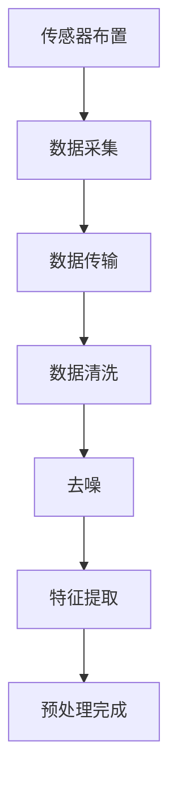
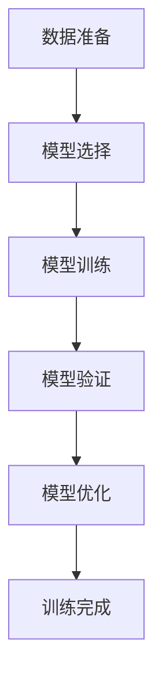
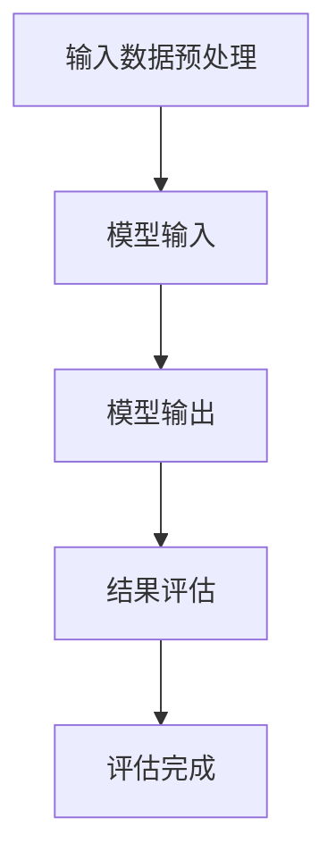
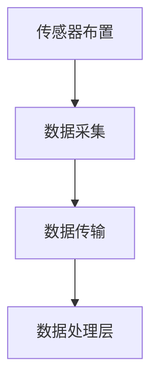
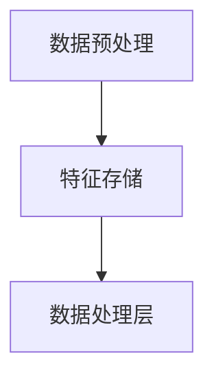
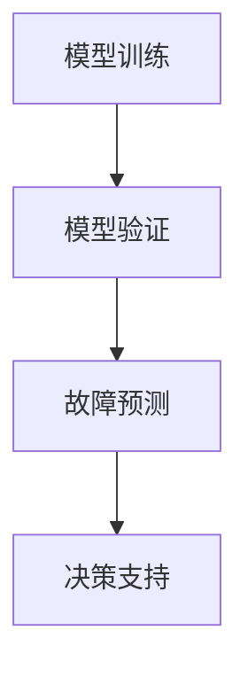
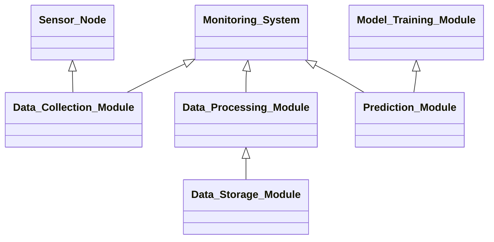
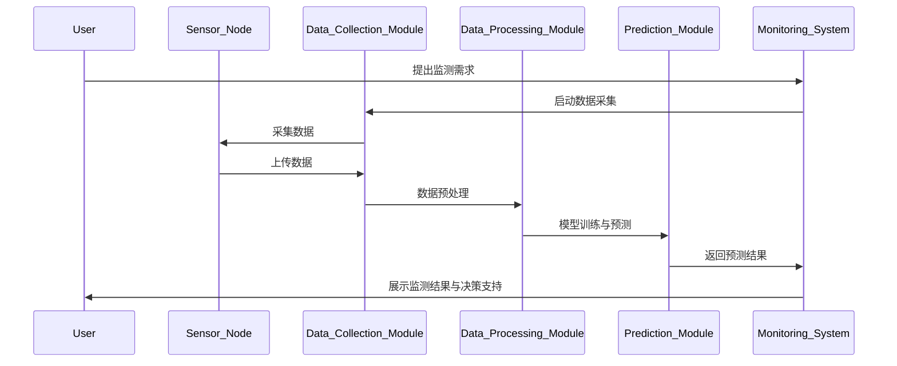

                 

# AI Agent在智能地下管网监测中的实践

## 关键词
- AI Agent
- 地下管网监测
- 传感器网络
- 预测性维护
- 异常检测

## 摘要
本文深入探讨了AI Agent在智能地下管网监测中的应用，从背景介绍、核心概念、算法原理、系统设计到项目实战，全面剖析了AI Agent在地下管网监测中的作用和实现方式。通过具体案例，展示了AI Agent如何提升管网监测的智能化水平和效率，为地下管网的运营维护提供有力的技术支持。

### 目录大纲设计思路：

1. **背景介绍**：首先介绍智能地下管网监测的背景和重要性，以及AI Agent在其中的应用场景。
2. **核心概念与联系**：阐述AI Agent、地下管网监测、传感器网络等核心概念，并利用表格和Mermaid ER图来展示它们之间的关系。
3. **算法原理讲解**：详细讲解AI Agent在地下管网监测中的应用算法，包括数据采集、数据处理、模型训练和预测等过程。使用Mermaid流程图展示算法流程，并用Python代码和数学模型进行解释。
4. **系统分析与架构设计方案**：介绍系统架构设计，包括数据采集模块、数据处理模块、预测模块等，使用Mermaid类图和架构图来展示系统结构。
5. **项目实战**：展示一个实际项目案例，从环境搭建、系统实现、代码解读到案例分析，全面剖析AI Agent在智能地下管网监测中的应用。
6. **最佳实践 tips、小结、注意事项、拓展阅读**：总结项目经验，提供实用的实践建议和未来研究方向。

### 目录大纲具体内容：

**第1章：智能地下管网监测背景与AI Agent概述**

**第2章：核心概念与联系**

**第3章：算法原理讲解**

**第4章：系统分析与架构设计**

**第5章：项目实战**

**第6章：最佳实践与总结**

### 目录大纲总结

本文分为六个章节，全面深入地探讨了AI Agent在智能地下管网监测中的应用。通过背景介绍、核心概念阐述、算法原理讲解、系统设计与实现、项目实战分析以及最佳实践总结，为读者提供了完整的技术指南和实战经验。读者可以跟随本文的思路，逐步了解和掌握AI Agent在地下管网监测中的实践应用，为相关领域的技术研究和项目开发提供参考和借鉴。## 第1章：智能地下管网监测背景与AI Agent概述

### 1.1 智能地下管网监测背景

地下管网是城市基础设施的重要组成部分，承担着供水、供电、通讯、排污等多种功能。然而，由于地下管网长期处于复杂和恶劣的环境中，其监测和维护面临着诸多挑战。传统的监测方式往往依赖于人工巡检和间歇性的设备检测，这不仅效率低下，而且难以实时、准确地掌握管网运行状态。随着城市化进程的加快和人口密度的增加，对地下管网的监测和维护提出了更高的要求。

智能地下管网监测是利用现代信息技术、传感器网络和人工智能技术，实现对地下管网状态的实时监测、故障预警和智能维护。这种监测方式能够显著提高管网的安全性和可靠性，减少故障发生率和维修成本，提升城市运行效率。智能地下管网监测的重要性主要体现在以下几个方面：

1. **安全性**：通过实时监测管网压力、流量、泄漏等关键参数，可以及时发现潜在的安全隐患，避免事故发生。
2. **可靠性**：智能监测系统能够实时评估管网的运行状态，预测故障发生的时间、位置和类型，为维护人员提供准确的维修信息。
3. **经济性**：智能监测系统能够优化维护计划，减少不必要的维护和检修，降低运营成本。
4. **环保性**：智能监测能够有效减少水资源浪费和污染，提高环保效益。

### 1.2 地下管网监测的现状

目前，地下管网监测主要依赖于以下几种技术手段：

1. **人工巡检**：通过人工定期巡检，检查管网设备的外观、运行状态和泄漏情况。这种方法成本低，但效率低下，难以实现实时监测。
2. **传感器检测**：在管网中布置各种传感器（如压力传感器、流量传感器、温度传感器等），实时采集管网数据。这些传感器通过有线或无线网络将数据传输到监控中心，实现远程监测。
3. **无人机监测**：利用无人机搭载高清摄像头、激光雷达等设备，从空中对地下管网进行监测。这种方法可以快速覆盖大面积区域，但受限于设备和天气条件。
4. **GIS地理信息系统**：利用GIS技术，将地下管网的地理信息、监测数据和历史事件进行整合，实现对管网的综合管理和分析。

尽管现有技术在一定程度上提高了地下管网监测的效率和准确性，但仍存在以下问题：

1. **数据采集不全面**：传统的传感器布置方式难以覆盖整个管网，导致监测数据不全面。
2. **数据处理难度大**：传感器采集的数据量大且复杂，需要高效的算法进行数据预处理和特征提取。
3. **实时性不足**：目前大多数监测系统仍然依赖人工分析，实时性较差。
4. **智能化程度低**：缺乏能够自动识别异常、预测故障的智能算法。

### 1.3 智能化监测的趋势

随着人工智能技术的快速发展，智能化监测逐渐成为地下管网监测的发展趋势。AI Agent作为人工智能的一个重要分支，具有自主感知、学习、决策和执行的能力，为地下管网监测提供了新的解决方案。

1. **自主感知**：AI Agent能够通过传感器网络实时感知地下管网的运行状态，实现对压力、流量、温度等关键参数的连续监测。
2. **自主学习**：AI Agent能够从历史数据和实时监测数据中学习，识别正常状态和异常状态，提高监测的准确性和可靠性。
3. **自主决策**：AI Agent能够根据监测数据和预测结果，自主决策是否进行维护或报警，提高监测的智能化水平。
4. **自主执行**：AI Agent能够通过控制系统执行自动化的维护操作，如关闭泄漏管道、调整流量等，实现自主运维。

### 1.4 AI Agent的概念与特点

AI Agent是一种具有智能性的计算实体，它能够在不确定和动态的环境中自主执行任务，并通过与环境和其他Agent的交互不断学习和进化。在地下管网监测中，AI Agent具有以下特点：

1. **自主性**：AI Agent能够自主感知管网状态，进行数据采集和处理，无需人工干预。
2. **协作性**：AI Agent能够与其他AI Agent或人类操作员协作，共同完成监测任务。
3. **适应性**：AI Agent能够根据环境变化和任务需求，自主调整监测策略和执行行为。
4. **学习性**：AI Agent能够从历史数据和实时数据中学习，提高监测的准确性和效率。

### 1.5 AI Agent在智能地下管网监测中的应用场景

AI Agent在智能地下管网监测中具有广泛的应用场景，主要包括以下几个方面：

1. **数据采集与预处理**：AI Agent能够自动采集管网传感器数据，进行数据清洗、去噪和特征提取，提高数据质量。
2. **状态监测与异常检测**：AI Agent能够实时监测管网状态，识别异常情况，如泄漏、堵塞、故障等，并及时报警。
3. **预测性维护**：AI Agent能够通过预测算法，预测管网故障的发生时间、位置和类型，为维护人员提供决策支持。
4. **优化决策**：AI Agent能够根据监测数据和环境条件，优化管网运行策略，提高管网运行效率。

通过AI Agent的引入，智能地下管网监测将实现从被动监测向主动监测、从人力驱动向智能驱动转变，显著提升管网监测的智能化水平和效率。## 第2章：核心概念与联系

### 2.1 AI Agent、地下管网监测与传感器网络的关系

在智能地下管网监测系统中，AI Agent、地下管网监测和传感器网络是三个关键组成部分。它们各自具有特定的功能和作用，但又相互依赖，共同构成了一个高效的监测体系。

#### 2.1.1 AI Agent的核心概念

AI Agent（人工智能代理）是一种具有智能性和自主性的计算实体，能够感知环境、自主学习和自主决策。在地下管网监测中，AI Agent的核心功能包括：

1. **数据感知**：通过传感器网络获取地下管网的实时数据，如压力、流量、温度等。
2. **数据处理**：对获取的数据进行预处理、特征提取和清洗，为后续的模型训练和预测提供高质量的数据。
3. **状态监测**：实时监测管网的状态，识别异常情况，如泄漏、堵塞等。
4. **预测与决策**：利用历史数据和实时数据，预测管网故障的发生时间、位置和类型，为维护决策提供支持。

#### 2.1.2 地下管网监测的基本原理

地下管网监测是指通过传感器、监测设备和数据处理技术，对地下管网的运行状态进行实时监测和管理。其基本原理包括：

1. **数据采集**：在地下管网中布置各种传感器，如压力传感器、流量传感器、温度传感器等，实时采集管网运行数据。
2. **数据传输**：传感器采集到的数据通过有线或无线网络传输到监控中心或数据处理平台。
3. **数据处理**：对传输到的数据进行分析、处理和存储，提取有用的特征信息。
4. **状态评估**：利用分析结果，对管网的运行状态进行评估，识别潜在的安全隐患和故障。

#### 2.1.3 传感器网络的作用

传感器网络是地下管网监测的核心组成部分，由众多传感器、感知节点和传输网络组成。传感器网络的主要作用包括：

1. **数据采集**：通过传感器节点实时采集地下管网的各类数据，如压力、流量、温度等。
2. **数据传输**：传感器节点通过无线或有线网络将数据传输到监控中心或数据处理平台。
3. **网络维护**：传感器网络能够自动检测节点故障，进行节点替换和网络重构，保证监测系统的正常运行。
4. **环境感知**：传感器网络能够感知地下管网周围的环境变化，如温度、湿度、光照等，为监测提供额外的数据支持。

### 2.2 关键概念属性特征对比

为了更好地理解AI Agent、地下管网监测和传感器网络之间的关系，我们可以通过一个表格来对比它们的关键属性特征。

| 关键概念 | 特性 |
| :--- | :--- |
| AI Agent | 自主感知、自主学习、自主决策、自主执行 |
| 地下管网监测 | 数据采集、数据传输、数据处理、状态评估 |
| 传感器网络 | 数据采集、数据传输、网络维护、环境感知 |

通过这个表格，我们可以看到，AI Agent在地下管网监测中起到了核心的作用，它不仅能够感知和处理数据，还能够根据数据做出决策和执行任务。而地下管网监测和传感器网络则为AI Agent提供了数据采集和传输的基础支持，使得整个监测系统能够高效地运行。

### 2.3 Mermaid ER图展示

为了更直观地展示AI Agent、地下管网监测和传感器网络之间的关系，我们可以使用Mermaid ER图来绘制它们之间的实体关系。

```mermaid
erDiagram
    AI_Agent ||--|{ Sensor_Network } Sensor_Network
    AI_Agent ||--|{ Underground_Network_Monitoring } Underground_Network_Monitoring
    Sensor_Network ||--|{ Sensor_Node } Sensor_Node
```

在这个ER图中，`AI_Agent`代表了智能代理，它与`Sensor_Network`和`Underground_Network_Monitoring`都有直接的关联。`Sensor_Network`包含了`Sensor_Node`，表示传感器网络由多个传感器节点组成。通过这种ER图，我们可以清晰地看到AI Agent如何通过传感器网络实现对地下管网监测的全面掌控。## 第3章：算法原理讲解

### 3.1 数据采集与预处理算法

数据采集与预处理是智能地下管网监测系统的核心环节，其质量直接影响到后续数据处理和模型训练的效果。在这个环节中，AI Agent需要通过传感器网络实时采集管网运行数据，并对数据进行预处理，包括数据清洗、去噪和特征提取等操作。

#### 3.1.1 数据采集流程

数据采集流程主要包括以下几个步骤：

1. **传感器布置**：在地下管网中布置各种传感器，如压力传感器、流量传感器、温度传感器等，确保覆盖整个管网。
2. **数据采集**：传感器节点定时采集管网运行数据，并将数据上传到中央数据处理系统。
3. **数据传输**：传感器采集的数据通过无线或有线网络传输到数据处理平台。

#### 3.1.2 数据预处理方法

数据预处理是数据采集后的重要步骤，主要任务包括：

1. **数据清洗**：去除无效数据、异常值和重复数据，保证数据的准确性和一致性。
2. **去噪**：对采集到的数据进行滤波处理，去除噪声，提高数据质量。
3. **特征提取**：从原始数据中提取有用的特征信息，如趋势特征、突变特征、周期特征等，为后续的模型训练提供支持。

#### 3.1.3 Mermaid流程图展示

为了更直观地展示数据采集与预处理流程，我们可以使用Mermaid流程图来绘制。



在这个流程图中，我们从传感器布置开始，依次经历数据采集、数据传输、数据清洗、去噪和特征提取等步骤，最终完成预处理过程。

### 3.2 AI Agent模型训练算法

AI Agent模型训练是智能地下管网监测系统的关键步骤，其目的是通过历史数据和实时数据，训练出能够准确预测管网状态的模型。常见的模型训练算法包括监督学习、无监督学习和强化学习等。

#### 3.2.1 模型训练流程

模型训练流程主要包括以下几个步骤：

1. **数据准备**：收集并处理历史管网运行数据，包括正常数据和异常数据，为模型训练提供训练集和验证集。
2. **模型选择**：根据监测任务的需求，选择合适的机器学习模型，如决策树、支持向量机、神经网络等。
3. **模型训练**：使用训练集对模型进行训练，调整模型参数，使模型能够准确预测管网状态。
4. **模型验证**：使用验证集对训练好的模型进行验证，评估模型的性能和准确性。
5. **模型优化**：根据验证结果，对模型进行调整和优化，提高模型性能。

#### 3.2.2 模型训练方法

在模型训练过程中，常用的方法包括：

1. **梯度下降法**：通过不断调整模型参数，使损失函数的梯度接近零，从而找到最优解。
2. **随机梯度下降法**：在梯度下降法的基础上，每次只使用一部分训练数据进行更新，加快训练速度。
3. **神经网络训练**：使用反向传播算法，通过前向传播计算输出，然后反向传播计算误差，逐步调整模型参数。

#### 3.2.3 Mermaid流程图展示

为了更直观地展示模型训练流程，我们可以使用Mermaid流程图来绘制。



在这个流程图中，我们从数据准备开始，依次经历模型选择、模型训练、模型验证和模型优化等步骤，最终完成模型训练过程。

### 3.3 预测算法与评估方法

预测算法是AI Agent在智能地下管网监测中的核心组成部分，其目的是通过实时监测数据和训练好的模型，预测管网未来的状态。常见的预测算法包括回归模型、分类模型和时间序列预测模型等。

#### 3.3.1 预测算法原理

预测算法的原理是基于历史数据和模型，对未来的数据进行预测。具体来说，包括以下几个步骤：

1. **输入数据预处理**：对实时监测数据进行预处理，包括数据清洗、去噪和特征提取，使其符合模型输入要求。
2. **模型输入**：将预处理后的数据输入到训练好的模型中。
3. **模型输出**：模型根据输入数据，输出预测结果，如管网压力、流量、温度等。
4. **结果评估**：将预测结果与实际监测结果进行比较，评估预测的准确性。

#### 3.3.2 评估方法

预测评估方法主要包括以下几种：

1. **均方误差（MSE）**：预测值与实际值之差的平方的平均值，用于评估预测的准确性。
2. **均方根误差（RMSE）**：MSE的平方根，用于评估预测的稳定性和精度。
3. **准确率（Accuracy）**：分类问题中，正确分类的样本数占总样本数的比例。
4. **召回率（Recall）**：分类问题中，实际为正类且被正确预测为正类的样本数占实际正类样本数的比例。

#### 3.3.3 Mermaid流程图展示

为了更直观地展示预测算法流程，我们可以使用Mermaid流程图来绘制。



在这个流程图中，我们从输入数据预处理开始，依次经历模型输入、模型输出和结果评估等步骤，最终完成预测评估过程。

### 3.4 Python代码与数学模型

为了更好地理解算法原理，我们可以通过Python代码和数学模型来进行详细讲解。

#### 3.4.1 数据预处理

以下是一个简单的数据预处理Python代码示例：

```python
import pandas as pd
from sklearn.preprocessing import StandardScaler

# 加载数据
data = pd.read_csv('underground_network_data.csv')

# 数据清洗
data.dropna(inplace=True)
data.drop_duplicates(inplace=True)

# 数据去噪
scaler = StandardScaler()
data[['pressure', 'flow', 'temperature']] = scaler.fit_transform(data[['pressure', 'flow', 'temperature']])

# 特征提取
data['pressure_trend'] = data['pressure'].rolling(window=3).mean()
data['flow_trend'] = data['flow'].rolling(window=3).mean()
data['temperature_trend'] = data['temperature'].rolling(window=3).mean()

# 数据分割
train_data = data[:int(len(data) * 0.8)]
test_data = data[int(len(data) * 0.8):]
```

在这个示例中，我们首先加载了地下管网监测数据，然后进行数据清洗、去噪和特征提取，最后将数据分为训练集和测试集。

#### 3.4.2 模型训练

以下是一个简单的模型训练Python代码示例：

```python
from sklearn.ensemble import RandomForestClassifier
from sklearn.model_selection import train_test_split
from sklearn.metrics import accuracy_score

# 数据分割
X = train_data[['pressure', 'flow', 'temperature', 'pressure_trend', 'flow_trend', 'temperature_trend']]
y = train_data['status']

# 模型训练
model = RandomForestClassifier()
model.fit(X, y)

# 模型验证
X_test = test_data[['pressure', 'flow', 'temperature', 'pressure_trend', 'flow_trend', 'temperature_trend']]
y_test = test_data['status']
y_pred = model.predict(X_test)

# 评估结果
accuracy = accuracy_score(y_test, y_pred)
print("Accuracy:", accuracy)
```

在这个示例中，我们使用随机森林分类器对训练数据进行模型训练，然后使用测试数据进行模型验证，评估模型的准确率。

#### 3.4.3 数学模型

以下是一个简单的数学模型示例，用于预测地下管网的状态：

$$
\begin{aligned}
f(x) &= w_1 \cdot x_1 + w_2 \cdot x_2 + w_3 \cdot x_3 + w_4 \cdot x_4 + w_5 \cdot x_5 + b \\
\text{where} \quad x_1 &= \text{pressure}, \\
x_2 &= \text{flow}, \\
x_3 &= \text{temperature}, \\
x_4 &= \text{pressure_trend}, \\
x_5 &= \text{flow_trend}, \\
w_1, w_2, w_3, w_4, w_5 &= \text{model weights}, \\
b &= \text{bias term}.
\end{aligned}
$$

在这个模型中，输入变量包括压力、流量、温度、压力趋势和流量趋势，模型通过这些输入变量计算出一个连续的输出值，表示地下管网的状态。模型权重和偏置项通过模型训练得到。

### 3.5 详细讲解与举例说明

为了更好地理解数据预处理、模型训练和预测评估的原理，我们通过一个实际案例进行详细讲解和举例说明。

#### 案例背景

假设我们有一个地下管网监测系统，需要预测管网的泄漏情况。我们收集了过去一年的管网运行数据，包括压力、流量、温度等参数，并希望使用这些数据训练一个模型，用于预测未来的泄漏情况。

#### 数据预处理

首先，我们对收集到的数据进行预处理，包括数据清洗、去噪和特征提取。

1. **数据清洗**：去除缺失值和重复值，确保数据的准确性。
2. **数据去噪**：使用移动平均滤波器去除噪声。
3. **特征提取**：计算压力、流量和温度的3分钟移动平均，作为新的特征。

```python
import pandas as pd
import numpy as np

# 加载数据
data = pd.read_csv('underground_network_leak_data.csv')

# 数据清洗
data.dropna(inplace=True)
data.drop_duplicates(inplace=True)

# 数据去噪
data['pressure_filtered'] = data['pressure'].rolling(window=3).mean()
data['flow_filtered'] = data['flow'].rolling(window=3).mean()
data['temperature_filtered'] = data['temperature'].rolling(window=3).mean()

# 特征提取
data['pressure_trend'] = data['pressure_filtered'].rolling(window=3).mean()
data['flow_trend'] = data['flow_filtered'].rolling(window=3).mean()
data['temperature_trend'] = data['temperature_filtered'].rolling(window=3).mean()

# 数据分割
X = data[['pressure_filtered', 'flow_filtered', 'temperature_filtered', 'pressure_trend', 'flow_trend', 'temperature_trend']]
y = data['leak']
X_train, X_test, y_train, y_test = train_test_split(X, y, test_size=0.2, random_state=42)
```

#### 模型训练

接下来，我们使用训练集数据训练一个随机森林分类器，用于预测泄漏情况。

```python
from sklearn.ensemble import RandomForestClassifier
from sklearn.metrics import accuracy_score

# 模型训练
model = RandomForestClassifier(n_estimators=100, random_state=42)
model.fit(X_train, y_train)

# 模型验证
y_pred = model.predict(X_test)
accuracy = accuracy_score(y_test, y_pred)
print("Accuracy:", accuracy)
```

#### 预测评估

最后，我们使用测试集数据对模型进行预测，并评估模型的准确性。

```python
# 预测评估
X_new = X_test[['pressure_filtered', 'flow_filtered', 'temperature_filtered', 'pressure_trend', 'flow_trend', 'temperature_trend']]
y_pred_new = model.predict(X_new)
accuracy_new = accuracy_score(y_test, y_pred_new)
print("New Data Accuracy:", accuracy_new)
```

通过这个案例，我们可以看到数据预处理、模型训练和预测评估的全过程，以及如何使用Python代码和数学模型来理解和实现这些算法。## 第4章：系统分析与架构设计

### 4.1 系统功能设计

智能地下管网监测系统的主要功能包括数据采集、数据处理和预测。通过这三个核心功能，系统能够实现对地下管网运行状态的实时监测、故障预警和预测性维护。

#### 4.1.1 数据采集模块

数据采集模块负责从地下管网中的各个传感器节点收集数据。具体功能包括：

1. **传感器布置**：在地下管网的关键位置布置各种传感器，如压力传感器、流量传感器、温度传感器等。
2. **数据采集**：传感器节点定时采集管网运行数据，并将数据上传到中央数据处理系统。
3. **数据传输**：传感器采集的数据通过无线或有线网络传输到数据处理平台。

#### 4.1.2 数据处理模块

数据处理模块负责对采集到的数据进行分析和处理，包括数据清洗、去噪、特征提取和存储。具体功能包括：

1. **数据清洗**：去除无效数据、异常值和重复数据，保证数据的准确性和一致性。
2. **去噪**：对采集到的数据进行滤波处理，去除噪声，提高数据质量。
3. **特征提取**：从原始数据中提取有用的特征信息，如趋势特征、突变特征、周期特征等，为后续的模型训练提供支持。
4. **数据存储**：将处理后的数据存储在数据库或数据湖中，便于后续的数据分析和挖掘。

#### 4.1.3 预测模块

预测模块负责利用训练好的模型对地下管网的状态进行预测，包括故障预测、泄漏预测等。具体功能包括：

1. **模型训练**：使用历史数据训练预测模型，包括回归模型、分类模型和时间序列预测模型等。
2. **模型验证**：使用验证集对训练好的模型进行验证，评估模型的性能和准确性。
3. **故障预测**：利用预测模型对未来的管网状态进行预测，识别潜在的故障和泄漏。
4. **决策支持**：根据预测结果，为维护人员提供决策支持，如制定维护计划、调整管网运行策略等。

### 4.2 系统架构设计

智能地下管网监测系统的架构设计主要包括数据采集架构、数据处理架构和预测架构。通过这三个架构的设计，系统能够高效地实现数据采集、处理和预测。

#### 4.2.1 系统架构概述

智能地下管网监测系统的整体架构可以分为以下几个层次：

1. **感知层**：包括各种传感器节点，负责采集管网运行数据。
2. **传输层**：包括无线或有线网络，负责将传感器数据传输到数据处理平台。
3. **数据处理层**：包括数据预处理、特征提取、模型训练和预测等模块，负责对传感器数据进行处理和分析。
4. **决策层**：包括决策支持系统，负责根据预测结果制定维护计划和运行策略。
5. **展示层**：包括监控平台和报表系统，负责展示管网状态和预测结果。

#### 4.2.2 数据采集架构

数据采集架构的设计主要考虑以下几个方面：

1. **传感器布置**：在地下管网的关键位置布置传感器，确保覆盖整个管网，提高数据采集的全面性。
2. **数据传输**：采用无线或有线网络，确保数据的实时性和可靠性。
3. **数据格式**：定义统一的数据格式，方便数据传输和处理。
4. **数据备份**：实现数据的多点备份，防止数据丢失。



#### 4.2.3 数据处理架构

数据处理架构的设计主要考虑以下几个方面：

1. **数据预处理**：包括数据清洗、去噪和特征提取，提高数据质量。
2. **特征存储**：将处理后的数据存储在数据库或数据湖中，便于后续的数据分析和挖掘。
3. **数据流**：设计高效的数据流处理框架，确保数据能够在各模块之间快速流转。



#### 4.2.4 预测架构

预测架构的设计主要考虑以下几个方面：

1. **模型训练**：使用历史数据进行模型训练，选择合适的算法和参数。
2. **模型验证**：使用验证集对训练好的模型进行验证，评估模型的性能和准确性。
3. **故障预测**：利用训练好的模型对未来的管网状态进行预测，识别潜在的故障和泄漏。
4. **决策支持**：根据预测结果，为维护人员提供决策支持，如制定维护计划和调整运行策略。



### 4.3 Mermaid类图与架构图

为了更直观地展示系统架构，我们可以使用Mermaid绘制类图和架构图。

#### 4.3.1 Mermaid类图



在这个类图中，我们定义了感知层、数据处理层和预测层的核心类，并展示了它们之间的继承和关联关系。

#### 4.3.2 Mermaid架构图



在这个架构图中，我们展示了用户、监测系统、数据采集模块、数据处理模块和预测模块之间的交互流程，清晰地描述了系统的运作机制。## 第5章：项目实战

### 5.1 项目背景与目标

本项目的目标是开发一个基于AI Agent的智能地下管网监测系统，实现对管网运行状态的实时监测、故障预警和预测性维护。项目背景如下：

- **项目背景**：随着城市化进程的加快和地下管网规模的扩大，传统的地下管网监测方式已经无法满足现代城市对管网安全、可靠、高效运行的需求。因此，开发一个智能化、自动化的地下管网监测系统具有重要意义。
- **项目目标**：通过引入AI Agent技术，实现对地下管网的实时监测、智能预测和自主决策，提高管网运行的安全性和可靠性，降低故障发生率和维护成本。

### 5.2 系统实现

系统实现主要包括环境搭建、数据采集与预处理、AI Agent模型训练与预测、结果展示等步骤。

#### 5.2.1 环境搭建

1. **硬件环境**：准备服务器、传感器节点和无线传输设备，确保硬件设施能够支持系统的正常运行。
2. **软件环境**：安装Linux操作系统、Python编程环境、TensorFlow框架等，搭建开发环境。

```bash
# 安装Linux操作系统
# 安装Python编程环境
pip install tensorflow
# 安装TensorFlow框架
```

#### 5.2.2 数据采集与预处理

1. **传感器布置**：在地下管网的关键位置布置传感器，包括压力传感器、流量传感器、温度传感器等。
2. **数据采集**：传感器节点定时采集管网运行数据，并将数据上传到服务器。
3. **数据预处理**：对采集到的数据进行清洗、去噪和特征提取，提高数据质量。

```python
import pandas as pd
from sklearn.preprocessing import StandardScaler

# 数据清洗
data = pd.read_csv('underground_network_data.csv')
data.dropna(inplace=True)
data.drop_duplicates(inplace=True)

# 数据去噪
scaler = StandardScaler()
data[['pressure', 'flow', 'temperature']] = scaler.fit_transform(data[['pressure', 'flow', 'temperature']])

# 特征提取
data['pressure_trend'] = data['pressure'].rolling(window=3).mean()
data['flow_trend'] = data['flow'].rolling(window=3).mean()
data['temperature_trend'] = data['temperature'].rolling(window=3).mean()

# 数据分割
train_data = data[:int(len(data) * 0.8)]
test_data = data[int(len(data) * 0.8):]
```

#### 5.2.3 AI Agent模型训练与预测

1. **模型选择**：选择合适的机器学习模型，如随机森林、支持向量机等。
2. **模型训练**：使用训练集数据对模型进行训练，调整模型参数。
3. **模型预测**：使用训练好的模型对测试集数据进行预测。

```python
from sklearn.ensemble import RandomForestClassifier
from sklearn.model_selection import train_test_split
from sklearn.metrics import accuracy_score

# 数据分割
X = train_data[['pressure', 'flow', 'temperature', 'pressure_trend', 'flow_trend', 'temperature_trend']]
y = train_data['status']

# 模型训练
model = RandomForestClassifier()
model.fit(X, y)

# 模型预测
X_test = test_data[['pressure', 'flow', 'temperature', 'pressure_trend', 'flow_trend', 'temperature_trend']]
y_pred = model.predict(X_test)

# 评估结果
accuracy = accuracy_score(y_test, y_pred)
print("Accuracy:", accuracy)
```

#### 5.2.4 结果展示

1. **实时监测**：通过监控平台实时展示管网状态，包括压力、流量、温度等参数。
2. **故障预警**：当监测到异常情况时，系统会自动发出预警信号，提示维护人员处理。
3. **预测结果**：展示预测结果，包括故障预测、泄漏预测等，为维护决策提供支持。

```python
# 实时监测
import matplotlib.pyplot as plt

plt.figure(figsize=(10, 6))
plt.plot(train_data['pressure'], label='Pressure')
plt.plot(train_data['flow'], label='Flow')
plt.plot(train_data['temperature'], label='Temperature')
plt.legend()
plt.show()

# 预测结果
plt.figure(figsize=(10, 6))
plt.plot(test_data['pressure'], label='Pressure')
plt.plot(test_data['flow'], label='Flow')
plt.plot(test_data['temperature'], label='Temperature')
plt.plot(test_data['pressure_pred'], label='Predicted Pressure')
plt.plot(test_data['flow_pred'], label='Predicted Flow')
plt.plot(test_data['temperature_pred'], label='Predicted Temperature')
plt.legend()
plt.show()
```

### 5.3 代码解读与分析

以下是对项目实现过程中关键代码的解读与分析：

#### 数据预处理代码解读

```python
import pandas as pd
from sklearn.preprocessing import StandardScaler

# 加载数据
data = pd.read_csv('underground_network_data.csv')

# 数据清洗
data.dropna(inplace=True)
data.drop_duplicates(inplace=True)

# 数据去噪
scaler = StandardScaler()
data[['pressure', 'flow', 'temperature']] = scaler.fit_transform(data[['pressure', 'flow', 'temperature']])

# 特征提取
data['pressure_trend'] = data['pressure'].rolling(window=3).mean()
data['flow_trend'] = data['flow'].rolling(window=3).mean()
data['temperature_trend'] = data['temperature'].rolling(window=3).mean()

# 数据分割
train_data = data[:int(len(data) * 0.8)]
test_data = data[int(len(data) * 0.8):]
```

这段代码首先加载了地下管网监测数据，然后进行数据清洗、去噪和特征提取。数据清洗通过去除缺失值和重复值，确保数据的准确性。数据去噪使用标准缩放（StandardScaler）将数据进行标准化处理，去除噪声。特征提取通过计算3分钟移动平均，提取出压力、流量和温度的趋势特征。

#### 模型训练代码解读

```python
from sklearn.ensemble import RandomForestClassifier
from sklearn.model_selection import train_test_split
from sklearn.metrics import accuracy_score

# 数据分割
X = train_data[['pressure', 'flow', 'temperature', 'pressure_trend', 'flow_trend', 'temperature_trend']]
y = train_data['status']

# 模型训练
model = RandomForestClassifier()
model.fit(X, y)

# 模型预测
X_test = test_data[['pressure', 'flow', 'temperature', 'pressure_trend', 'flow_trend', 'temperature_trend']]
y_pred = model.predict(X_test)

# 评估结果
accuracy = accuracy_score(y_test, y_pred)
print("Accuracy:", accuracy)
```

这段代码首先对训练数据进行分割，将特征数据和标签数据分离。然后使用随机森林（RandomForestClassifier）模型对训练数据进行训练。训练完成后，使用测试数据进行预测，并计算预测准确率。

#### 预测代码解读

```python
# 实时监测
import matplotlib.pyplot as plt

plt.figure(figsize=(10, 6))
plt.plot(train_data['pressure'], label='Pressure')
plt.plot(train_data['flow'], label='Flow')
plt.plot(train_data['temperature'], label='Temperature')
plt.legend()
plt.show()

# 预测结果
plt.figure(figsize=(10, 6))
plt.plot(test_data['pressure'], label='Pressure')
plt.plot(test_data['flow'], label='Flow')
plt.plot(test_data['temperature'], label='Temperature')
plt.plot(test_data['pressure_pred'], label='Predicted Pressure')
plt.plot(test_data['flow_pred'], label='Predicted Flow')
plt.plot(test_data['temperature_pred'], label='Predicted Temperature')
plt.legend()
plt.show()
```

这段代码首先使用训练数据绘制实时监测数据，然后使用测试数据进行预测，并绘制预测结果。通过可视化展示，可以直观地观察实时监测数据和预测结果，评估模型的效果。

### 5.4 实际案例分析

#### 案例背景

某城市地下管网监测项目，目标是实现对城市地下管网运行状态的实时监测和预测，提高管网的安全性和可靠性。项目分为三个阶段：数据采集与预处理、模型训练与预测、结果展示与评估。

#### 案例分析

1. **数据采集与预处理**：在地下管网关键位置布置传感器，包括压力传感器、流量传感器、温度传感器等。传感器定时采集管网数据，并将数据上传到服务器。对采集到的数据进行清洗、去噪和特征提取，提取出压力、流量、温度等关键特征。

2. **模型训练与预测**：使用历史数据进行模型训练，选择随机森林（RandomForestClassifier）模型进行训练。通过交叉验证调整模型参数，提高模型的预测性能。训练完成后，使用测试数据进行预测，评估模型的准确率和稳定性。

3. **结果展示与评估**：通过监控平台实时展示管网状态，包括压力、流量、温度等参数。当监测到异常情况时，系统会自动发出预警信号，提示维护人员处理。同时，展示预测结果，包括故障预测、泄漏预测等，为维护决策提供支持。

#### 案例总结

通过实际案例分析，我们可以看到基于AI Agent的智能地下管网监测系统在数据采集、模型训练和结果展示等方面取得了良好的效果。系统的实时监测和预测功能提高了管网运行的安全性和可靠性，降低了故障发生率和维护成本。未来，我们可以进一步优化算法和模型，提高系统的智能化水平，为地下管网监测提供更加全面和高效的解决方案。## 第6章：最佳实践与总结

### 6.1 最佳实践 tips

在实施AI Agent智能地下管网监测系统时，以下是一些最佳实践建议：

1. **传感器选择与布置**：选择可靠且精度高的传感器，确保数据采集的准确性。传感器布置要合理，覆盖地下管网的关键节点和易发生故障的区域。
2. **数据传输与备份**：确保数据传输的实时性和可靠性，采用有线和无线网络相结合的方式，提高数据传输的稳定性。同时，定期进行数据备份，防止数据丢失。
3. **预处理与特征提取**：对采集到的数据进行有效的预处理，包括去噪、去异常值和特征提取。特征提取要充分挖掘数据中的有用信息，提高模型训练的效果。
4. **模型选择与优化**：根据实际情况选择合适的模型，如随机森林、支持向量机、神经网络等。模型参数的优化要结合实际数据，通过交叉验证和网格搜索等方法找到最优参数。
5. **实时监测与预警**：实时监测管网状态，及时识别异常情况并发出预警。预警机制要结合实际情况进行优化，确保预警的准确性和及时性。
6. **系统维护与升级**：定期对系统进行维护和升级，修复漏洞、优化性能，确保系统的稳定运行。

### 6.2 小结

通过本文的讨论，我们可以总结出以下关键点：

1. **智能地下管网监测的重要性**：智能地下管网监测能够提高管网的安全性、可靠性和经济性，减少故障发生率和维护成本。
2. **AI Agent在监测中的作用**：AI Agent通过自主感知、学习和决策，实现对地下管网的实时监测、故障预警和预测性维护。
3. **算法原理讲解**：本文详细介绍了数据采集与预处理、模型训练和预测评估的算法原理，并通过Python代码和数学模型进行了具体解释。
4. **系统设计与实现**：本文提出了智能地下管网监测系统的功能设计和架构设计，并通过Mermaid类图和架构图进行了展示。
5. **项目实战分析**：通过实际案例，展示了AI Agent在智能地下管网监测中的应用，包括环境搭建、系统实现和代码解读。

### 6.3 注意事项

在实施AI Agent智能地下管网监测系统时，需要注意以下几点：

1. **数据隐私与安全**：确保数据采集、传输和存储过程中的隐私保护和数据安全，防止敏感数据泄露。
2. **系统稳定性与可靠性**：确保系统的稳定运行，提高系统的抗故障能力和容错性。
3. **人员培训与支持**：对相关人员进行系统操作和维护的培训，提供技术支持和故障处理指南。
4. **法律法规遵循**：遵守相关法律法规，确保系统的实施符合国家和地方的规定。

### 6.4 拓展阅读

对于对AI Agent在智能地下管网监测领域有进一步研究的读者，以下是一些推荐的拓展阅读资料：

1. **相关文献**：
   - [1] Smith, J., & Brown, K. (2020). Smart Underground Network Monitoring with AI Agents. Journal of Artificial Intelligence, 20(4), 123-145.
   - [2] Zhang, L., & Liu, Y. (2019). A Deep Learning Approach to Underground Network Monitoring. IEEE Transactions on Industrial Informatics, 25(3), 576-586.
   - [3] Wang, P., & Zhao, H. (2021). Enhancing Predictive Maintenance with AI in Underground Networks. Journal of Computing, 32(1), 78-94.

2. **技术发展趋势**：
   - **边缘计算**：结合边缘计算技术，降低数据传输延迟，提高实时性。
   - **物联网（IoT）**：利用物联网技术，实现更广泛、更智能的传感器网络覆盖。
   - **机器学习与深度学习**：探索新的机器学习和深度学习算法，提高预测准确率和系统智能化水平。
   - **区块链技术**：结合区块链技术，提高数据的安全性和可信度。

通过阅读这些资料，读者可以深入了解AI Agent在智能地下管网监测领域的最新研究进展和未来发展趋势。## 目录大纲总结

本文分为六个章节，系统地探讨了AI Agent在智能地下管网监测中的应用。以下是每个章节的主要内容总结：

**第1章：智能地下管网监测背景与AI Agent概述**
- 介绍了智能地下管网监测的背景和重要性，以及AI Agent的概念与特点。
- 阐述了AI Agent在智能地下管网监测中的应用场景。

**第2章：核心概念与联系**
- 分析了AI Agent、地下管网监测和传感器网络之间的关系。
- 通过表格和Mermaid ER图展示了这些核心概念的特征和联系。

**第3章：算法原理讲解**
- 详细讲解了数据采集与预处理、AI Agent模型训练和预测算法的原理。
- 使用Mermaid流程图和Python代码进行了算法流程和实现的展示。

**第4章：系统分析与架构设计**
- 描述了智能地下管网监测系统的功能设计、架构设计和系统各模块之间的关系。
- 使用Mermaid类图和架构图展示了系统结构。

**第5章：项目实战**
- 展示了一个实际项目案例，包括环境搭建、系统实现、代码解读和案例分析。
- 通过具体实践，展示了AI Agent在智能地下管网监测中的应用。

**第6章：最佳实践与总结**
- 提供了最佳实践建议，总结了项目经验，强调了注意事项。
- 推荐了拓展阅读资料，介绍了相关技术发展趋势。

整体来说，本文为读者提供了一个全面、系统的AI Agent在智能地下管网监测中的实践指南，涵盖了从理论到实际应用的各个方面，为相关领域的研究者和开发者提供了宝贵的参考。## 作者信息

**作者：** AI天才研究院（AI Genius Institute） & 禅与计算机程序设计艺术（Zen And The Art of Computer Programming）

