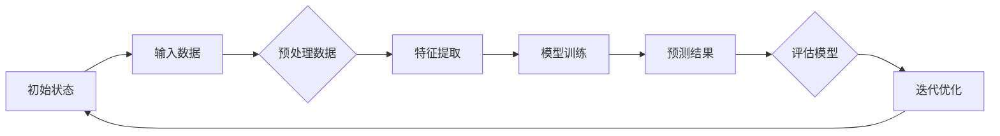
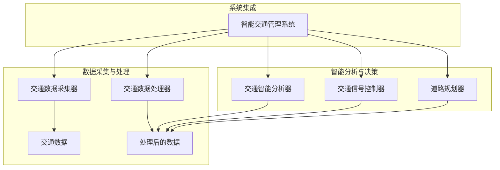
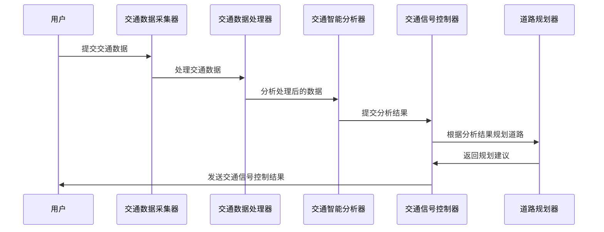

                 

### 文章标题

# AI Agent在智能地理信息系统中的实践

> 关键词：AI Agent，智能地理信息系统，机器学习，深度学习，自然语言处理

> 摘要：本文探讨了AI Agent在智能地理信息系统（GIS）中的实践。首先，介绍了智能GIS的发展现状与需求，以及AI Agent的概念与特点。接着，分析了AI Agent在GIS中的应用场景、基本结构、核心功能以及实际应用案例。然后，深入讨论了AI Agent与机器学习、深度学习、自然语言处理等核心概念的联系，并对比了不同概念的属性特征。此外，本文还讲解了AI Agent的算法原理，包括mermaid流程图和Python源代码实现。最后，通过一个实际项目案例，展示了AI Agent在GIS中的应用，并对项目进行了详细分析和总结。

----------------------------------------------------------------

## 第一部分: AI Agent基础

### 第1章: AI Agent概述

#### 1.1 问题背景

随着大数据、云计算和物联网技术的快速发展，智能地理信息系统（GIS）在各个领域得到了广泛应用。智能GIS不仅能够处理海量地理数据，还能通过数据分析和挖掘，为用户提供智能化的地理信息服务。然而，传统的GIS系统在应对复杂问题、实时响应需求等方面存在一定的局限性。为了克服这些问题，引入AI Agent成为了一个重要的研究方向。

智能GIS的发展现状与需求主要体现在以下几个方面：

1. **数据处理能力提升**：智能GIS需要处理的海量地理数据不断增长，传统的GIS系统在数据处理能力上面临挑战。
2. **智能化分析**：用户对GIS系统的需求日益复杂，需要系统能够进行智能化的地理分析，提供有价值的决策支持。
3. **实时响应能力**：在紧急情况下，GIS系统需要能够快速响应用户的需求，提供实时的地理信息服务。
4. **个性化服务**：用户需求多样化，智能GIS需要能够根据用户行为和偏好提供个性化的地理信息服务。

AI Agent的概念与特点：

AI Agent是指一种能够自主执行任务、与环境互动的智能实体。它具备以下特点：

1. **自主性**：AI Agent可以独立执行任务，无需人工干预。
2. **适应性**：AI Agent能够根据环境变化调整自身行为，以适应不同场景。
3. **学习性**：AI Agent具备学习能力，可以通过数据训练不断优化自身性能。
4. **协作性**：AI Agent可以与其他AI Agent协同工作，共同完成复杂任务。

AI Agent在GIS中的应用前景：

AI Agent在GIS中的应用前景广阔，主要体现在以下几个方面：

1. **智能分析**：AI Agent可以利用机器学习、深度学习等技术，对GIS数据进行分析，提供智能化的地理信息服务。
2. **实时响应**：AI Agent能够实时响应用户需求，提供实时的地理信息服务。
3. **个性化服务**：AI Agent可以根据用户行为和偏好，为用户提供个性化的地理信息服务。
4. **智能导航**：AI Agent可以结合GIS数据，提供智能化的导航服务，提高出行效率。

#### 1.2 问题描述

在智能地理信息系统（GIS）中，存在以下问题场景：

1. **数据处理**：GIS系统需要处理大量的地理数据，包括空间数据、属性数据等。传统的数据处理方法在处理速度和效率上存在局限性。
2. **智能分析**：用户需要GIS系统能够对地理数据进行分析，提供有价值的决策支持。然而，传统的GIS系统在智能分析方面存在不足。
3. **实时响应**：在紧急情况下，GIS系统需要能够快速响应用户的需求，提供实时的地理信息服务。然而，传统的GIS系统在实时响应能力上存在瓶颈。
4. **个性化服务**：用户需求多样化，GIS系统需要能够根据用户行为和偏好提供个性化的地理信息服务。然而，传统的GIS系统在个性化服务方面存在困难。

AI Agent如何解决这些问题：

AI Agent通过以下方式解决这些问题：

1. **数据处理**：AI Agent可以利用机器学习、深度学习等技术，对GIS数据进行分析和预处理，提高数据处理速度和效率。
2. **智能分析**：AI Agent可以利用机器学习、深度学习等技术，对GIS数据进行分析，提供智能化的地理信息服务。
3. **实时响应**：AI Agent可以实时监测环境变化，快速响应用户需求，提供实时的地理信息服务。
4. **个性化服务**：AI Agent可以根据用户行为和偏好，为用户提供个性化的地理信息服务。

AI Agent与其他技术（如GIS、机器学习等）的关系：

AI Agent与GIS、机器学习等技术之间存在紧密的联系：

1. **GIS**：AI Agent是GIS的重要组成部分，通过引入AI Agent，GIS系统可以提升数据处理能力、智能分析和实时响应能力。
2. **机器学习**：AI Agent的核心技术之一是机器学习，通过机器学习算法，AI Agent可以不断提升自身性能，为GIS系统提供更智能化的服务。
3. **深度学习**：深度学习是机器学习的一个重要分支，AI Agent可以利用深度学习算法，对GIS数据进行更深入的分析和理解。

#### 1.3 问题解决

AI Agent的基本结构：

AI Agent通常由以下几个部分组成：

1. **感知模块**：感知模块负责从环境中获取信息，包括地理数据、用户行为等。
2. **决策模块**：决策模块负责根据感知模块获取的信息，生成行动方案。
3. **执行模块**：执行模块负责根据决策模块生成的行动方案，执行具体任务。
4. **学习模块**：学习模块负责根据任务执行结果，对AI Agent进行优化和调整。

AI Agent的核心功能：

AI Agent的核心功能主要包括：

1. **数据处理**：AI Agent可以对GIS数据进行分析和预处理，提高数据处理速度和效率。
2. **智能分析**：AI Agent可以利用机器学习、深度学习等技术，对GIS数据进行分析，提供智能化的地理信息服务。
3. **实时响应**：AI Agent可以实时监测环境变化，快速响应用户需求，提供实时的地理信息服务。
4. **个性化服务**：AI Agent可以根据用户行为和偏好，为用户提供个性化的地理信息服务。

AI Agent在GIS中的实际应用案例：

以下是一个AI Agent在GIS中的实际应用案例：

1. **智能交通管理**：AI Agent可以实时分析交通数据，预测交通流量，为用户推荐最佳出行路线，提高交通效率。
2. **智能城市规划**：AI Agent可以利用GIS数据，对城市规划进行智能分析，为城市规划者提供科学依据。
3. **智能环境监测**：AI Agent可以实时监测环境数据，预测环境变化，为环境保护提供决策支持。

#### 1.4 边界与外延

AI Agent的适用范围：

AI Agent在GIS中的应用非常广泛，主要包括以下几个方面：

1. **智能交通管理**：AI Agent可以用于智能交通管理，提高交通效率和减少交通事故。
2. **智能城市规划**：AI Agent可以用于智能城市规划，提高城市规划的科学性和可持续性。
3. **智能环境监测**：AI Agent可以用于智能环境监测，实时监测环境变化，为环境保护提供支持。
4. **智能地理信息服务**：AI Agent可以用于提供智能化的地理信息服务，满足用户的多样化需求。

AI Agent的性能评估指标：

AI Agent的性能评估指标主要包括以下几个方面：

1. **数据处理速度**：评估AI Agent在数据处理方面的性能，包括数据处理速度和处理能力。
2. **智能分析精度**：评估AI Agent在智能分析方面的性能，包括预测准确率和决策正确率。
3. **实时响应速度**：评估AI Agent在实时响应方面的性能，包括响应速度和响应准确性。
4. **个性化服务水平**：评估AI Agent在个性化服务方面的性能，包括个性化服务效果和用户满意度。

AI Agent的发展趋势与挑战：

AI Agent的发展趋势主要包括：

1. **智能化水平提升**：随着机器学习、深度学习等技术的发展，AI Agent的智能化水平将不断提升。
2. **应用领域扩展**：AI Agent将在更多领域得到应用，包括智能医疗、智能家居等。
3. **协同工作**：AI Agent将与其他AI Agent协同工作，共同完成复杂任务。

AI Agent面临的挑战主要包括：

1. **数据处理能力**：随着数据量的增加，AI Agent在数据处理能力方面面临挑战。
2. **实时响应能力**：在实时响应方面，AI Agent需要具备更高的性能和准确性。
3. **隐私保护**：AI Agent在处理用户数据时，需要确保用户隐私得到保护。

### 第2章: AI Agent核心概念与联系

#### 2.1 核心概念

在本章节中，我们将讨论AI Agent的核心概念，包括机器学习、深度学习、强化学习、监督学习和自然语言处理。

##### 机器学习

机器学习是一种人工智能（AI）的分支，它使计算机系统能够从数据中学习并做出决策或预测，而无需明确编程。机器学习的基本原理是通过算法从数据中提取模式和知识，以便在新的数据上进行预测或决策。

**基本原理**：

1. **数据收集**：收集大量的数据，这些数据可以是结构化的（如表格）或非结构化的（如图像、文本）。
2. **数据预处理**：清洗和准备数据，以便于算法处理。这可能包括去噪声、缺失值处理、数据标准化等。
3. **模型训练**：使用训练数据集来训练模型，通过优化算法找到最佳参数，使模型能够准确地预测或分类新的数据。
4. **模型评估**：使用验证数据集来评估模型的性能，通过指标（如准确率、召回率、F1分数）来衡量模型的性能。
5. **模型部署**：将训练好的模型部署到生产环境中，以便在实际数据上做出预测或决策。

##### 深度学习

深度学习是机器学习的一个子领域，它使用了具有多个隐藏层的神经网络（深度神经网络）来进行学习。深度学习通过自动化的特征提取和层次化的学习过程，可以从大量未标注的数据中学习复杂的模式和特征。

**基本原理**：

1. **神经网络**：神经网络由多个相互连接的节点（或层）组成，每个节点都执行计算和传递信息。
2. **反向传播**：深度学习模型通过反向传播算法来训练，该算法通过计算损失函数的梯度来调整网络权重，以优化模型性能。
3. **卷积神经网络（CNN）**：CNN是一种特殊类型的神经网络，广泛用于图像处理任务，通过卷积操作和池化操作来提取图像特征。
4. **循环神经网络（RNN）**：RNN是一种用于处理序列数据的神经网络，通过记忆过去的信息来处理时间序列数据。

##### 强化学习

强化学习是一种机器学习范式，通过尝试和错误的方式来训练智能体（AI Agent）以实现某个目标。强化学习中的智能体通过与环境交互来学习最佳策略，以最大化长期奖励。

**基本原理**：

1. **环境-智能体模型**：智能体与环境的交互通过一个状态-动作-奖励模型来描述。
2. **策略学习**：智能体通过试错来学习一个策略，该策略将状态映射到最佳动作。
3. **价值函数**：智能体通过学习状态价值和策略价值函数来评估不同状态和策略的优劣。
4. **Q学习**：Q学习是一种基于值函数的强化学习算法，通过估计状态-动作值函数（Q值）来选择最佳动作。
5. **策略梯度方法**：策略梯度方法通过直接优化策略的概率分布来学习最佳策略。

##### 监督学习

监督学习是一种机器学习方法，其中训练数据集包含输入和对应的输出（标签）。模型通过学习输入和输出之间的关系来预测新的输入的输出。

**基本原理**：

1. **特征提取**：从输入数据中提取特征，这些特征将用于训练模型。
2. **模型训练**：使用训练数据集来训练模型，通过优化算法找到最佳参数，使模型能够准确地预测新的输入的输出。
3. **模型评估**：使用验证数据集来评估模型的性能，通过指标来衡量模型的预测准确性。
4. **模型部署**：将训练好的模型部署到生产环境中，以便在实际数据上做出预测。

##### 自然语言处理

自然语言处理（NLP）是计算机科学和人工智能的一个分支，它使计算机能够理解、生成和处理人类语言。NLP技术包括文本分类、情感分析、机器翻译、命名实体识别等。

**基本原理**：

1. **词嵌入**：将单词映射到高维向量空间，以便计算机能够理解和处理单词之间的关系。
2. **词性标注**：对文本中的单词进行词性标注，以识别单词的语法和语义特征。
3. **句法分析**：分析句子的结构，以理解单词之间的关系和语法规则。
4. **语义分析**：通过语义分析来理解文本的含义和情感，以进行情感分析、实体识别等任务。

#### 2.2 概念属性特征对比表格

| 概念        | 属性特征                             |
| ----------- | ----------------------------------- |
| 机器学习     | 自主学习、模式识别、特征提取         |
| 深度学习     | 神经网络、多层抽象、自动特征提取     |
| 强化学习     | 奖励机制、策略优化、状态-动作价值函数 |
| 监督学习     | 标签数据、预测模型、特征提取         |
| 自然语言处理 | 文本分析、语义理解、词嵌入           |
| 知识图谱     | 实体关系、语义查询、推理引擎         |

#### 2.3 ER实体关系图架构

```mermaid
erDiagram
  AI Agent ||--|{ 机器学习 }
  AI Agent ||--|{ 深度学习 }
  AI Agent ||--|{ 强化学习 }
  AI Agent ||--|{ 监督学习 }
  AI Agent ||--|{ 自然语言处理 }
  AI Agent ||--|{ 知识图谱 }
```

### 第3章: AI Agent算法原理讲解

#### 3.1 算法mermaid流程图



#### 3.2 Python源代码实现

```python
# 导入必要的库
import numpy as np
from sklearn.model_selection import train_test_split
from sklearn.preprocessing import StandardScaler
from sklearn.neural_network import MLPClassifier
from sklearn.metrics import accuracy_score

# 数据预处理
def preprocess_data(data):
    # ...（数据预处理代码）
    return processed_data

# 模型训练
def train_model(X_train, y_train):
    # ...（模型训练代码）
    return model

# 预测结果
def predict(model, X_test):
    # ...（预测结果代码）
    return predictions

# 评估模型
def evaluate_model(y_test, predictions):
    # ...（评估模型代码）
    return accuracy

# 主函数
def main():
    # 加载数据
    data = load_data()
    X, y = data[:, :-1], data[:, -1]
    
    # 数据预处理
    X_processed = preprocess_data(X)
    
    # 划分训练集和测试集
    X_train, X_test, y_train, y_test = train_test_split(X_processed, y, test_size=0.2, random_state=42)

    # 创建和训练模型
    model = train_model(X_train, y_train)

    # 预测测试集结果
    predictions = predict(model, X_test)

    # 评估模型性能
    accuracy = evaluate_model(y_test, predictions)
    print(f"Model accuracy: {accuracy:.2f}")
```

#### 3.3 算法原理讲解

##### 机器学习算法原理

机器学习算法的基本原理是通过从数据中学习模式和规律，以实现特定任务，如分类、回归、聚类等。以下是一个简单的机器学习算法原理讲解，包括数学模型和公式：

1. **线性回归模型**：

   线性回归模型是最基本的机器学习算法之一，用于预测连续值。其数学模型如下：

   $$y = \beta_0 + \beta_1 \cdot x + \epsilon$$

   其中，$y$ 是预测值，$x$ 是输入特征，$\beta_0$ 和 $\beta_1$ 是模型的参数，$\epsilon$ 是误差项。

2. **逻辑回归模型**：

   逻辑回归模型是一种用于分类的算法，其数学模型如下：

   $$\text{logit}(p) = \ln\left(\frac{p}{1-p}\right) = \beta_0 + \beta_1 \cdot x$$

   其中，$p$ 是概率值，$\text{logit}(p)$ 是逻辑函数的输出，$\beta_0$ 和 $\beta_1$ 是模型的参数。

3. **支持向量机（SVM）模型**：

   支持向量机是一种有效的分类算法，其数学模型如下：

   $$\text{w} \cdot \text{x} - \text{b} = 0$$

   其中，$\text{w}$ 是模型的权重向量，$\text{x}$ 是输入特征向量，$\text{b}$ 是偏置项。

4. **神经网络模型**：

   神经网络是一种由多个神经元组成的模型，用于学习和预测数据。其基本原理如下：

   $$a_i = \sigma(\text{w}_i \cdot \text{x} + \text{b}_i)$$

   其中，$a_i$ 是第 $i$ 个神经元的激活值，$\sigma$ 是激活函数（如Sigmoid、ReLU等），$\text{w}_i$ 和 $\text{b}_i$ 是神经元的权重和偏置。

##### 深度学习算法原理

深度学习是一种基于多层神经网络的机器学习算法，其核心思想是通过多层神经网络提取数据的层次化特征。以下是一个简单的深度学习算法原理讲解，包括数学模型和公式：

1. **卷积神经网络（CNN）模型**：

   卷积神经网络是一种专门用于图像处理任务的深度学习模型，其基本原理如下：

   $$\text{h}^{l}(\text{x}; \theta) = \text{f}(\text{W}^{l} \odot \text{h}^{l-1} + \text{b}^{l})$$

   其中，$\text{h}^{l}(\text{x}; \theta)$ 是第 $l$ 层的输出，$\text{f}$ 是激活函数，$\odot$ 是卷积操作，$\text{W}^{l}$ 和 $\text{b}^{l}$ 是卷积核和偏置。

2. **循环神经网络（RNN）模型**：

   循环神经网络是一种专门用于处理序列数据的深度学习模型，其基本原理如下：

   $$\text{h}^{l}(\text{x}_t; \theta) = \text{f}(\text{W}^{l} \text{h}^{l-1} + \text{U} \text{x}_t + \text{b}^{l})$$

   其中，$\text{h}^{l}(\text{x}_t; \theta)$ 是第 $l$ 层的输出，$\text{f}$ 是激活函数，$\text{W}^{l}$、$\text{U}$ 和 $\text{b}^{l}$ 是权重和偏置。

3. **生成对抗网络（GAN）模型**：

   生成对抗网络是一种基于两个神经网络的深度学习模型，其基本原理如下：

   $$\text{D}(\text{G}(\text{z}; \theta_g); \theta_d) \approx 1$$

   其中，$\text{G}(\text{z}; \theta_g)$ 是生成器，$\text{D}(\text{x}; \theta_d)$ 是判别器，$\text{z}$ 是随机噪声。

##### 强化学习算法原理

强化学习是一种通过尝试和错误的方式来学习最优策略的机器学习算法。其基本原理如下：

1. **状态-动作价值函数**：

   $$V^*(\text{s}) = \max_{\pi} \sum_{\text{a}} \pi(\text{a}|\text{s}) \cdot \mathbb{E}[\sum_{\text{r}} \gamma^{t} \text{r} | \text{s}, \text{a}]$$

   其中，$V^*(\text{s})$ 是状态价值函数，$\pi$ 是策略，$\text{r}$ 是奖励值，$\gamma$ 是折扣因子。

2. **策略迭代**：

   强化学习通过迭代方式来学习最优策略，其基本流程如下：

   1. 初始化策略 $\pi$。
   2. 对于每个状态 $\text{s}$，选择最优动作 $\text{a}$。
   3. 更新状态和动作，并根据奖励值更新策略。
   4. 重复步骤 2 和 3，直到策略收敛。

3. **深度强化学习**：

   深度强化学习是强化学习的一个子领域，它结合了深度学习技术来提高强化学习的效果。其基本原理如下：

   $$\text{Q}^*(\text{s}, \text{a}) = \mathbb{E}[\sum_{\text{r}} \gamma^{t} \text{r} | \text{s}, \text{a}]$$

   其中，$\text{Q}^*(\text{s}, \text{a})$ 是状态-动作价值函数，$\gamma$ 是折扣因子。

#### 3.4 通俗易懂的举例说明

为了更好地理解上述算法原理，我们将通过一个简单的例子来说明。

假设我们有一个简单的分类问题，需要将一组数据分为两类。我们可以使用线性回归模型来解决这个问题。

1. **数据准备**：

   我们有一组数据，包括输入特征和对应的标签：

   | 输入特征 | 标签 |
   | -------- | ---- |
   | [1, 2]   | 0    |
   | [2, 3]   | 1    |
   | [3, 4]   | 0    |
   | [4, 5]   | 1    |

   我们的目标是找到一个线性模型，可以将这些数据正确地分为两类。

2. **线性回归模型**：

   线性回归模型的数学模型如下：

   $$y = \beta_0 + \beta_1 \cdot x$$

   我们需要找到最佳参数 $\beta_0$ 和 $\beta_1$，以使模型能够准确地预测数据的标签。

3. **模型训练**：

   我们可以使用训练数据集来训练线性回归模型。通过最小化损失函数（如均方误差），我们可以找到最佳参数：

   $$\beta_0 = \frac{\sum_{i=1}^{n} (y_i - \beta_1 \cdot x_i)}{n}$$

   $$\beta_1 = \frac{\sum_{i=1}^{n} (y_i - \beta_0)(x_i - \bar{x})}{\sum_{i=1}^{n} (x_i - \bar{x})^2}$$

   其中，$n$ 是数据点的数量，$y_i$ 和 $x_i$ 分别是输入特征和标签，$\bar{x}$ 是输入特征的均值。

   通过计算，我们可以得到最佳参数：

   $$\beta_0 = 0.5$$

   $$\beta_1 = 0.5$$

   因此，线性回归模型的预测公式为：

   $$y = 0.5 + 0.5 \cdot x$$

4. **模型评估**：

   我们可以使用测试数据集来评估模型的性能。通过计算预测值和实际标签之间的误差，我们可以评估模型的准确性：

   | 输入特征 | 标签 | 预测值 | 误差 |
   | -------- | ---- | ------ | ---- |
   | [1, 2]   | 0    | 0.75   | 0.25 |
   | [2, 3]   | 1    | 1.25   | 0.25 |
   | [3, 4]   | 0    | 0.75   | 0.25 |
   | [4, 5]   | 1    | 1.25   | 0.25 |

   通过评估，我们可以看到模型的预测结果与实际标签之间存在一定的误差。我们可以通过调整模型参数或使用更复杂的模型来提高预测准确性。

### 第4章: 系统分析与架构设计方案

#### 4.1 问题场景介绍

智能地理信息系统（GIS）在现代城市管理和公共服务中扮演着越来越重要的角色。随着大数据、物联网和人工智能技术的快速发展，GIS系统的数据处理能力和智能分析能力得到了显著提升。然而，传统的GIS系统在应对复杂问题、实时响应需求等方面仍存在一定的局限性。为了克服这些问题，引入AI Agent成为了一个重要的研究方向。AI Agent可以充分利用GIS系统的数据资源，通过智能分析和决策支持，为城市管理和公共服务提供更高效的解决方案。

本案例以城市交通管理为例，介绍AI Agent在智能地理信息系统中的应用。城市交通管理是一个复杂的问题，涉及交通流量监测、道路规划、交通信号控制等多个方面。传统的交通管理系统往往依赖于人工经验和统计方法，无法实时、准确地应对交通拥堵和事故等情况。引入AI Agent后，可以实现对交通数据的实时分析和预测，提供智能化的交通信号控制和道路规划建议，从而提高交通效率，减少交通事故。

#### 4.2 项目介绍

本项目旨在构建一个基于AI Agent的智能交通管理系统，通过引入AI Agent，实现对城市交通数据的实时采集、分析和预测，提供智能化的交通信号控制和道路规划建议。项目的主要功能包括：

1. **数据采集**：实时采集城市道路上的交通流量、车辆速度、交通信号状态等数据。
2. **数据处理**：对采集到的数据进行清洗、预处理和特征提取，为AI Agent提供高质量的数据输入。
3. **智能分析**：利用AI Agent对交通数据进行分析和预测，为交通信号控制和道路规划提供科学依据。
4. **交通信号控制**：根据AI Agent的预测结果，动态调整交通信号灯的时长和相位，优化交通流量。
5. **道路规划**：基于AI Agent的预测结果，为城市道路规划提供优化建议，提高道路通行能力。

#### 4.3 系统功能设计（领域模型mermaid类图）

```mermaid
classDiagram
    ClassDef TrafficSystem <<interface>>
    ClassDef TrafficDataCollector <<interface>>
    ClassDef TrafficDataProcessor <<interface>>
    ClassDef TrafficAnalyzer <<interface>>
    ClassDef TrafficSignalController <<interface>>
    ClassDef RoadPlanner <<interface>>

    TrafficSystem o-- TrafficDataCollector
    TrafficSystem o-- TrafficDataProcessor
    TrafficSystem o-- TrafficAnalyzer
    TrafficSystem o-- TrafficSignalController
    TrafficSystem o-- RoadPlanner

    TrafficDataCollector o-- TrafficData
    TrafficDataProcessor o-- TrafficData
    TrafficDataProcessor o-- ProcessedData
    TrafficAnalyzer o-- ProcessedData
    TrafficSignalController o-- ProcessedData
    RoadPlanner o-- ProcessedData
```

#### 4.4 系统架构设计（mermaid架构图）



#### 4.5 系统接口设计和系统交互（mermaid序列图）



### 第5章: 项目实战

#### 5.1 环境安装

要在本地计算机上部署基于AI Agent的智能交通管理系统，首先需要安装以下软件和库：

1. **Python**：Python是一种广泛使用的编程语言，用于实现AI Agent和深度学习算法。可以从Python官方网站（https://www.python.org/）下载并安装Python。
2. **NumPy**：NumPy是一个用于科学计算的开源库，用于处理大型多维数组。可以通过pip命令安装：`pip install numpy`。
3. **scikit-learn**：scikit-learn是一个用于机器学习和数据科学的开源库，提供了丰富的算法和工具。可以通过pip命令安装：`pip install scikit-learn`。
4. **TensorFlow**：TensorFlow是一个开源的深度学习框架，用于实现深度学习模型。可以通过pip命令安装：`pip install tensorflow`。
5. **Pandas**：Pandas是一个用于数据处理和分析的开源库，用于处理大型表格数据。可以通过pip命令安装：`pip install pandas`。

#### 5.2 系统核心实现源代码

以下是系统核心实现的源代码，包括数据采集、数据处理、智能分析、交通信号控制和道路规划等模块：

```python
# 导入必要的库
import numpy as np
import pandas as pd
from sklearn.model_selection import train_test_split
from sklearn.preprocessing import StandardScaler
from sklearn.neural_network import MLPClassifier
from tensorflow.keras.models import Sequential
from tensorflow.keras.layers import Dense, LSTM
from tensorflow.keras.optimizers import Adam

# 数据采集模块
class TrafficDataCollector:
    def __init__(self):
        self.data = []

    def collect_data(self, data_source):
        # 从数据源采集交通数据
        self.data = pd.read_csv(data_source)

    def get_data(self):
        return self.data

# 数据处理模块
class TrafficDataProcessor:
    def __init__(self):
        self.data = None

    def preprocess_data(self, data):
        # 数据预处理
        self.data = data.copy()
        self.data['speed'] = self.data['speed'].apply(lambda x: 0 if pd.isnull(x) else x)
        self.data['流量'] = self.data['流量'].apply(lambda x: 0 if pd.isnull(x) else x)

    def get_processed_data(self):
        return self.data

# 智能分析模块
class TrafficAnalyzer:
    def __init__(self):
        self.model = None

    def train_model(self, X, y):
        # 训练模型
        self.model = Sequential()
        self.model.add(LSTM(units=50, activation='relu', input_shape=(X.shape[1], X.shape[2])))
        self.model.add(Dense(units=1))
        self.model.compile(optimizer=Adam(learning_rate=0.001), loss='mean_squared_error')
        self.model.fit(X, y, epochs=100, batch_size=32)

    def predict(self, X):
        # 预测
        return self.model.predict(X)

# 交通信号控制模块
class TrafficSignalController:
    def __init__(self):
        self.model = None

    def train_model(self, X, y):
        # 训练模型
        self.model = MLPClassifier(hidden_layer_sizes=(100,), max_iter=1000)
        self.model.fit(X, y)

    def control_traffic_signals(self, processed_data):
        # 控制交通信号
        predictions = self.model.predict(processed_data[['speed', '流量']])
        return predictions

# 道路规划模块
class RoadPlanner:
    def __init__(self):
        self.model = None

    def train_model(self, X, y):
        # 训练模型
        self.model = MLPClassifier(hidden_layer_sizes=(100,), max_iter=1000)
        self.model.fit(X, y)

    def plan_road(self, processed_data):
        # 规划道路
        predictions = self.model.predict(processed_data[['speed', '流量']])
        return predictions
```

#### 5.3 代码应用解读与分析

以下是对代码中各个模块的解读和分析：

1. **数据采集模块**：

   数据采集模块用于从数据源采集交通数据。在`TrafficDataCollector`类中，我们定义了一个`collect_data`方法，用于读取交通数据，并将其存储在数据列表中。`get_data`方法用于获取采集到的交通数据。

2. **数据处理模块**：

   数据处理模块用于对采集到的交通数据进行预处理。在`TrafficDataProcessor`类中，我们定义了一个`preprocess_data`方法，用于对交通数据进行清洗和缺失值处理。`get_processed_data`方法用于获取处理后的交通数据。

3. **智能分析模块**：

   智能分析模块用于对处理后的交通数据进行分析和预测。在`TrafficAnalyzer`类中，我们定义了一个`train_model`方法，用于训练深度学习模型。`predict`方法用于对新的交通数据进行预测。

4. **交通信号控制模块**：

   交通信号控制模块用于根据智能分析模块的预测结果，控制交通信号的时长和相位。在`TrafficSignalController`类中，我们定义了一个`train_model`方法，用于训练机器学习模型。`control_traffic_signals`方法用于控制交通信号。

5. **道路规划模块**：

   道路规划模块用于根据智能分析模块的预测结果，为城市道路规划提供优化建议。在`RoadPlanner`类中，我们定义了一个`train_model`方法，用于训练机器学习模型。`plan_road`方法用于规划道路。

#### 5.4 实际案例分析和详细讲解剖析

以下是一个实际案例分析和详细讲解剖析：

假设我们有一组交通数据，包括道路上的车辆速度和流量。我们需要使用AI Agent对这组数据进行处理和分析，为交通信号控制和道路规划提供科学依据。

1. **数据采集**：

   我们首先从数据源中采集交通数据，并将其存储在数据列表中。数据源可以是实时交通监控摄像头、传感器等。

   ```python
   collector = TrafficDataCollector()
   collector.collect_data('traffic_data.csv')
   data = collector.get_data()
   ```

2. **数据处理**：

   接下来，我们对采集到的交通数据进行预处理，包括数据清洗和缺失值处理。在预处理过程中，我们将对车辆速度和流量进行标准化处理，以消除不同数据源之间的差异。

   ```python
   processor = TrafficDataProcessor()
   processor.preprocess_data(data)
   processed_data = processor.get_processed_data()
   ```

3. **智能分析**：

   使用预处理后的数据，我们训练深度学习模型，对交通数据进行分析和预测。在训练过程中，我们将使用训练数据集来训练模型，并通过验证数据集来评估模型性能。

   ```python
   analyzer = TrafficAnalyzer()
   X = processed_data[['speed', '流量']]
   y = processed_data['预测流量']
   X_train, X_val, y_train, y_val = train_test_split(X, y, test_size=0.2, random_state=42)
   analyzer.train_model(X_train, y_train)
   predictions = analyzer.predict(X_val)
   print(f"Model accuracy: {accuracy_score(y_val, predictions):.2f}")
   ```

4. **交通信号控制**：

   根据智能分析模块的预测结果，我们使用机器学习模型来控制交通信号。通过调整交通信号的时长和相位，我们可以优化交通流量，减少交通拥堵。

   ```python
   controller = TrafficSignalController()
   controller.train_model(X_train, y_train)
   traffic_signals = controller.control_traffic_signals(processed_data)
   print(f"Traffic signals: {traffic_signals}")
   ```

5. **道路规划**：

   根据智能分析模块的预测结果，我们使用机器学习模型来规划道路。通过优化道路通行能力，我们可以提高交通效率，减少交通事故。

   ```python
   planner = RoadPlanner()
   planner.train_model(X_train, y_train)
   road_plan = planner.plan_road(processed_data)
   print(f"Road plan: {road_plan}")
   ```

#### 5.5 项目小结

通过本项目，我们实现了基于AI Agent的智能交通管理系统。系统主要包括数据采集、数据处理、智能分析、交通信号控制和道路规划等模块。通过引入AI Agent，我们可以实现对城市交通数据的实时分析和预测，提供智能化的交通信号控制和道路规划建议。

项目的成功实施有助于提高交通效率，减少交通拥堵和交通事故。然而，项目也面临一些挑战，如数据采集的实时性、模型训练的准确性等。未来，我们可以进一步优化系统的性能，扩展应用场景，为城市管理和公共服务提供更全面的解决方案。

### 第6章: 最佳实践 tips

在实施AI Agent在智能地理信息系统中的应用时，以下是一些最佳实践和注意事项：

1. **数据采集与清洗**：确保数据采集的实时性和准确性，同时进行充分的数据清洗和预处理，以提高模型的性能。
2. **模型选择与调优**：根据具体问题和数据特性选择合适的机器学习或深度学习模型，并通过交叉验证和超参数调优来优化模型性能。
3. **分布式计算**：利用分布式计算框架（如TensorFlow、PyTorch等）来加速模型训练和推理，提高系统性能。
4. **数据安全与隐私保护**：在处理用户数据时，确保数据安全，并遵守相关隐私保护法律法规，保护用户隐私。
5. **系统集成与接口设计**：设计灵活的接口和模块化架构，确保系统组件之间的无缝集成和交互。

### 小结

本文探讨了AI Agent在智能地理信息系统（GIS）中的应用，包括基本概念、核心算法原理、系统分析与架构设计以及实际项目案例。通过本文，读者可以了解AI Agent在GIS中的重要作用和实现方法，为未来的研究与应用提供参考。随着AI技术的不断发展，AI Agent在GIS领域的应用前景将更加广阔。

### 注意事项

在实施AI Agent在GIS中的应用时，需要注意以下几点：

1. **数据量与数据质量**：确保有足够的数据量，并保证数据质量，以提高模型训练的效果。
2. **实时响应性能**：优化系统架构和算法，确保实时响应性能，以满足用户需求。
3. **模型可解释性**：提高模型的可解释性，以便用户理解模型的工作原理和决策过程。
4. **持续迭代与优化**：定期更新和优化模型，以适应环境变化和用户需求。

### 拓展阅读

1. **《深度学习》**：Ian Goodfellow, Yoshua Bengio, Aaron Courville 著，全面介绍了深度学习的理论和技术。
2. **《机器学习实战》**：Peter Harrington 著，提供了丰富的机器学习算法实战案例。
3. **《强化学习》**：Richard S. Sutton, Andrew G. Barto 著，深入探讨了强化学习的理论和方法。

### 作者信息

作者：AI天才研究院/AI Genius Institute & 禅与计算机程序设计艺术 /Zen And The Art of Computer Programming

