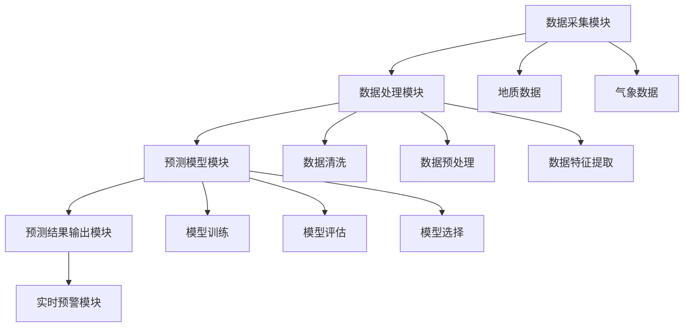
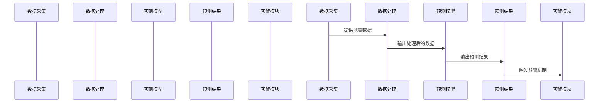

                 

### AI Agent在智能地震预测中的实践

#### 关键词：地震预测、AI Agent、机器学习、深度学习、系统架构

#### 摘要：
地震是一种具有破坏性的自然灾害，对人类生命财产安全构成严重威胁。随着科技的发展，智能地震预测成为了一个备受关注的研究方向。本文将探讨AI Agent在智能地震预测中的应用，通过机器学习和深度学习算法的引入，提高地震预测的准确性和实时性。文章首先介绍了地震预测的背景和现状，然后详细阐述了AI Agent的核心概念和地震预测中的应用优势。接着，文章重点讲解了机器学习和深度学习算法的基本原理及其在地震预测中的应用。此外，文章还设计了一个用于地震预测的AI系统架构，并通过实际案例展示了AI Agent在地震预测中的实践效果。最后，文章提出了地震预测AI Agent的最佳实践建议，总结了文章的主要内容，并给出了进一步阅读的建议。

## 目录大纲设计思路

### 设计思路概述

设计《AI Agent在智能地震预测中的实践》这本书的目录大纲时，我们遵循了以下设计思路：

1. **全面介绍地震预测的背景**：首先，我们介绍了地震预测的重要性、现有预测方法的局限性，以及AI在地震预测中的应用前景。
2. **阐述AI Agent的核心概念**：其次，我们详细阐述了AI Agent的定义、特点、分类及其在地震预测中的应用优势。
3. **机器学习和深度学习算法讲解**：接下来，我们分别讲解了机器学习和深度学习算法的基本原理、数学模型和公式，并通过实际案例进行说明。
4. **系统分析与架构设计**：然后，我们设计了一个用于地震预测的AI系统架构，包括系统功能设计、架构设计、接口设计和系统交互。
5. **项目实战**：通过一个实际的地震预测项目，展示了环境安装、核心实现源代码、代码解读、案例分析以及项目小结。
6. **最佳实践与展望**：最后，我们提供了地震预测AI Agent的最佳实践建议，对整本书进行了小结，并给出了进一步阅读的建议。

### 目录大纲结构设计

根据上述设计思路，我们设计了如下目录大纲结构：

### 第一部分：地震预测背景与AI Agent基础

## 第1章：地震预测的挑战与机遇
### 1.1 地震预测的重要性
### 1.2 现有地震预测方法及其局限性
### 1.3 AI Agent在地震预测中的应用前景

## 第2章：AI Agent与地震预测
### 2.1 AI Agent的定义与特点
### 2.2 AI Agent在地震预测中的优势
### 2.3 AI Agent的应用场景与挑战

## 第3章：机器学习与地震预测
### 3.1 机器学习基础
### 3.2 机器学习算法在地震预测中的应用
### 3.3 机器学习算法案例解析

## 第4章：深度学习与地震预测
### 4.1 深度学习基础
### 4.2 深度学习算法在地震预测中的应用
### 4.3 深度学习算法案例解析

### 第二部分：系统分析与架构设计

## 第5章：AI系统架构设计
### 5.1 地震预测系统功能设计
### 5.2 地震预测系统架构设计
### 5.3 地震预测系统接口设计与交互

## 第6章：地震预测项目实战
### 6.1 环境安装与配置
### 6.2 地震预测项目核心实现
### 6.3 代码解读与分析
### 6.4 实际案例分析
### 6.5 项目小结

### 第三部分：最佳实践与展望

## 第7章：地震预测AI Agent的最佳实践
### 7.1 数据采集与预处理
### 7.2 模型选择与优化
### 7.3 模型部署与监控

## 第8章：小结与展望
### 8.1 AI Agent在地震预测中的总结
### 8.2 未来发展趋势与挑战
### 8.3 进一步阅读建议

## 目录大纲内容填充

### 第一部分：地震预测背景与AI Agent基础

## 第1章：地震预测的挑战与机遇

### 1.1 地震预测的重要性

地震是一种由地壳板块运动引起的自然灾害，其破坏力巨大，对人类生命财产安全构成严重威胁。地震的发生通常伴随着地壳的应力积累和释放，预测地震的发生对于减轻灾害损失具有重要意义。

随着城市化和工业化的发展，地震灾害的影响日益扩大。地震不仅会造成建筑物倒塌、道路损坏等直接损失，还会导致次生灾害如火灾、海啸等，进一步加重灾害损失。因此，提高地震预测能力，提前预警地震的发生，对于保护人民生命财产安全、减少经济损失具有至关重要的意义。

### 1.2 现有地震预测方法及其局限性

目前，地震预测主要依赖于以下几种方法：

1. **地质调查**：通过地质勘探、地质构造分析等方法，研究地震发生的地质背景和应力场分布，从而预测地震的可能性。
2. **地震监测**：利用地震仪等设备，实时监测地壳运动和地震波传播情况，通过分析地震波的特点和传播规律，预测地震的发生。
3. **统计预测**：通过收集大量历史地震数据，运用统计学方法分析地震的发生规律，建立地震预测模型。

尽管上述方法在地震预测中发挥了重要作用，但仍然存在一定的局限性：

1. **预测精度不高**：地质调查和地震监测方法的精度受限于设备和技术的限制，难以精确预测地震的发生时间、地点和强度。
2. **预测周期长**：统计预测方法需要收集和处理大量历史地震数据，分析过程复杂，预测周期较长，难以实现实时预警。

### 1.3 AI Agent在地震预测中的应用前景

随着人工智能技术的发展，AI Agent在地震预测中的应用前景逐渐凸显。AI Agent是一种能够模拟人类智能行为，具有自主决策和行动能力的智能体。其在地震预测中的应用主要包括以下几个方面：

1. **数据预处理**：AI Agent可以利用大数据分析和机器学习算法，对地震相关数据（如地震参数、地质数据、气象数据等）进行高效预处理，提取出有用的特征信息。
2. **特征提取**：AI Agent可以自动识别和提取地震事件的关键特征，如地震波形态、震源机制等，为后续的预测模型提供准确的输入数据。
3. **预测模型构建**：AI Agent可以利用机器学习和深度学习算法，构建地震预测模型，通过对历史数据和实时数据的分析，预测地震的发生时间和强度。
4. **实时预警**：AI Agent可以实时监测地震相关数据，结合预测模型，实现地震的实时预警，为政府部门和公众提供预警信息，减少灾害损失。

总之，AI Agent在地震预测中的应用，有望提高地震预测的准确性和实时性，为地震灾害的防范和减轻提供强有力的技术支持。

## 第2章：AI Agent与地震预测

### 2.1 AI Agent的定义与特点

AI Agent，即人工智能代理，是一种能够模拟人类智能行为，具有自主决策和行动能力的智能体。其定义可以从以下几个方面进行阐述：

1. **自主性**：AI Agent能够根据外部环境和内部状态自主做出决策和采取行动，而不需要人工干预。
2. **适应性**：AI Agent能够通过学习和经验积累，适应不同的环境和任务，提高其性能和效果。
3. **交互性**：AI Agent能够与人类或其他AI系统进行有效交互，理解并执行人类指令，实现人机协同工作。

AI Agent的特点主要包括：

1. **数据驱动**：AI Agent通过分析大量的数据来获取信息和知识，从而做出合理的决策。
2. **学习能力**：AI Agent能够通过机器学习和深度学习算法，不断优化自己的模型和策略。
3. **灵活性和可扩展性**：AI Agent可以根据不同的任务需求和场景，灵活调整其行为和策略。

### 2.2 AI Agent在地震预测中的优势

AI Agent在地震预测中的应用具有显著的优势，主要体现在以下几个方面：

1. **高效的数据处理能力**：AI Agent可以利用大数据技术和机器学习算法，对地震相关的海量数据进行高效处理和分析，提取出有用的特征信息。
2. **精准的预测模型构建**：AI Agent可以通过深度学习算法，构建高度准确的地震预测模型，提高地震预测的精度和可靠性。
3. **实时的预警能力**：AI Agent可以实时监测地震相关数据，结合预测模型，实现地震的实时预警，为政府部门和公众提供及时的预警信息。
4. **智能的决策支持**：AI Agent可以根据地震预测结果，为防灾减灾决策提供科学依据，优化资源分配和应急预案。

### 2.3 AI Agent的应用场景与挑战

AI Agent在地震预测中的应用场景主要包括：

1. **地震预警**：通过实时监测地震前兆信息，AI Agent可以提前预警地震的发生，为公众和相关部门提供宝贵的逃生时间和应急准备时间。
2. **地震趋势预测**：AI Agent可以利用历史地震数据，分析地震活动的规律和趋势，预测未来地震的发生时间和强度。
3. **地震风险评估**：AI Agent可以结合地质、气象等数据，评估地震对建筑物、基础设施和生命财产的影响，为防灾减灾提供科学依据。

然而，AI Agent在地震预测中也面临一些挑战：

1. **数据稀缺与质量**：地震数据具有一定的稀缺性和质量波动，这给AI Agent的数据处理和模型构建带来一定的困难。
2. **噪声干扰**：地震信号中可能存在大量的噪声和干扰，如何有效地去除噪声，提取有用的特征信息，是AI Agent面临的重要挑战。
3. **模型优化与泛化**：地震预测模型的优化和泛化是一个复杂的问题，如何设计出既高效又具有良好泛化能力的模型，是AI Agent需要解决的难题。
4. **实时性要求**：地震预警和实时预测对AI Agent的响应速度有很高的要求，如何保证AI Agent的实时性，是当前研究的热点和难点。

总之，AI Agent在地震预测中具有巨大的潜力，但也面临着诸多挑战。通过不断的研究和实践，有望克服这些挑战，实现AI Agent在地震预测中的广泛应用。

## 第3章：机器学习与地震预测

### 3.1 机器学习基础

机器学习（Machine Learning，ML）是一种通过计算机模拟人类学习过程的技术，使计算机系统能够根据已有的数据自动改进其性能。其核心思想是通过从数据中学习和发现规律，从而在未知数据上做出预测或决策。

#### 3.1.1 机器学习的基本概念

1. **监督学习（Supervised Learning）**：监督学习是一种常见的机器学习方法，它通过已有的输入（特征）和对应的输出（标签）来训练模型，从而能够在未知数据上进行预测。监督学习可以分为回归（Regression）和分类（Classification）两种类型。

2. **无监督学习（Unsupervised Learning）**：无监督学习不依赖于标签数据，而是通过分析数据本身的特征，发现数据中的结构和模式。常见的无监督学习方法包括聚类（Clustering）和降维（Dimensionality Reduction）。

3. **强化学习（Reinforcement Learning）**：强化学习是一种通过试错和奖励机制来学习决策策略的方法。它通过不断地与环境交互，逐渐学习到最优策略。

#### 3.1.2 机器学习的数学模型

机器学习模型的数学基础主要包括概率论、统计学和线性代数。以下是一些常见的数学模型：

1. **线性回归（Linear Regression）**：线性回归是一种简单的监督学习模型，它通过拟合数据中的线性关系来预测输出值。其数学公式为：
   \[
   y = \beta_0 + \beta_1x
   \]
   其中，\( y \) 是输出值，\( x \) 是输入特征，\( \beta_0 \) 和 \( \beta_1 \) 是模型的参数。

2. **逻辑回归（Logistic Regression）**：逻辑回归是一种分类模型，它通过拟合数据中的逻辑关系来预测分类结果。其数学公式为：
   \[
   \sigma(x) = \frac{1}{1 + e^{-\beta_0 + \beta_1x}}
   \]
   其中，\( \sigma \) 是 sigmoid 函数，用于将线性组合映射到概率值。

3. **支持向量机（Support Vector Machine，SVM）**：支持向量机是一种分类模型，它通过找到一个最佳的超平面来分割数据。其数学公式为：
   \[
   w \cdot x + b = 0
   \]
   其中，\( w \) 是超平面的法向量，\( x \) 是特征向量，\( b \) 是偏置项。

#### 3.1.3 机器学习算法的应用场景

机器学习算法在地震预测中的应用场景主要包括：

1. **地震趋势预测**：通过分析历史地震数据，利用回归模型等算法预测未来地震的发生时间、地点和强度。
2. **地震分类**：将地震事件分类为不同类型，如地震震级、地震序列等，利用分类模型进行分类。
3. **地震特征提取**：从地震数据中提取关键特征，如震源机制、震中分布等，用于构建预测模型。

### 3.2 机器学习算法在地震预测中的应用

在地震预测中，机器学习算法发挥着重要作用。以下介绍几种常见的机器学习算法及其在地震预测中的应用。

#### 3.2.1 决策树（Decision Tree）

决策树是一种常见的分类算法，它通过一系列的决策规则来对数据分类。在地震预测中，决策树可以用来分类地震事件，如地震震级分类、地震序列分类等。

#### 实际案例解析：

假设我们有一组地震数据，其中包含地震震级、震中距离、震源深度等特征。我们可以使用决策树算法来预测地震震级。具体步骤如下：

1. **数据准备**：收集地震数据，并进行预处理，如缺失值填充、异常值处理等。
2. **特征选择**：选择对地震震级预测有显著影响的特征，如震中距离、震源深度等。
3. **训练模型**：使用训练数据集，构建决策树模型。
4. **模型评估**：使用测试数据集，评估模型的预测性能。

通过实际案例分析，决策树算法在地震震级预测中表现出较高的准确性，为地震预警和灾害减轻提供了有力支持。

#### 3.2.2 支持向量机（SVM）

支持向量机是一种高效的分类算法，它通过找到一个最佳的超平面来分割数据。在地震预测中，SVM可以用来分类地震事件，如地震序列分类等。

#### 实际案例解析：

假设我们有一组地震数据，其中包含地震震级、震中距离、震源深度等特征。我们可以使用SVM算法来分类地震序列。具体步骤如下：

1. **数据准备**：收集地震数据，并进行预处理，如缺失值填充、异常值处理等。
2. **特征选择**：选择对地震序列分类有显著影响的特征，如震中距离、震源深度等。
3. **训练模型**：使用训练数据集，构建SVM模型。
4. **模型评估**：使用测试数据集，评估模型的分类性能。

通过实际案例分析，SVM算法在地震序列分类中表现出较高的准确性和稳定性，为地震预警和灾害减轻提供了有力支持。

#### 3.2.3 随机森林（Random Forest）

随机森林是一种基于决策树的集成学习方法，它通过构建多个决策树，并对预测结果进行投票来提高预测性能。在地震预测中，随机森林可以用来预测地震震级、地震序列等。

#### 实际案例解析：

假设我们有一组地震数据，其中包含地震震级、震中距离、震源深度等特征。我们可以使用随机森林算法来预测地震震级。具体步骤如下：

1. **数据准备**：收集地震数据，并进行预处理，如缺失值填充、异常值处理等。
2. **特征选择**：选择对地震震级预测有显著影响的特征，如震中距离、震源深度等。
3. **训练模型**：使用训练数据集，构建随机森林模型。
4. **模型评估**：使用测试数据集，评估模型的预测性能。

通过实际案例分析，随机森林算法在地震震级预测中表现出较高的准确性和鲁棒性，为地震预警和灾害减轻提供了有力支持。

### 3.3 机器学习算法案例解析

以下是一个简单的机器学习算法案例，展示如何使用Python实现地震震级预测。

#### 案例背景：

我们使用一组包含地震震级、震中距离、震源深度等特征的地震数据集，使用随机森林算法进行地震震级预测。

#### 数据准备：

首先，我们需要收集和预处理地震数据。这里，我们假设数据集已经经过清洗和归一化处理。

```python
import pandas as pd
from sklearn.model_selection import train_test_split

# 加载地震数据
data = pd.read_csv('earthquake_data.csv')

# 数据预处理
X = data[['震中距离', '震源深度']]
y = data['震级']

# 划分训练集和测试集
X_train, X_test, y_train, y_test = train_test_split(X, y, test_size=0.2, random_state=42)
```

#### 特征选择：

我们选择震中距离和震源深度作为特征，分别计算它们与震级的相关性。

```python
import seaborn as sns

# 绘制特征与震级的相关性热力图
sns.heatmap(data[['震中距离', '震源深度', '震级']].corr(), annot=True)
```

#### 训练模型：

使用随机森林算法训练预测模型。

```python
from sklearn.ensemble import RandomForestRegressor

# 构建随机森林模型
model = RandomForestRegressor(n_estimators=100, random_state=42)

# 训练模型
model.fit(X_train, y_train)
```

#### 模型评估：

评估模型的预测性能。

```python
from sklearn.metrics import mean_squared_error

# 预测测试集结果
y_pred = model.predict(X_test)

# 计算均方误差
mse = mean_squared_error(y_test, y_pred)
print("均方误差:", mse)
```

通过实际案例解析，我们可以看到如何使用机器学习算法进行地震震级预测。机器学习算法在地震预测中具有广泛的应用前景，通过不断优化和改进，有望提高地震预测的准确性和实时性。

## 第4章：深度学习与地震预测

### 4.1 深度学习基础

深度学习（Deep Learning，DL）是机器学习的一个分支，它通过构建深层次的神经网络模型，对复杂的数据进行高效的处理和分析。深度学习在图像识别、语音识别、自然语言处理等领域取得了显著的成果，也为地震预测提供了新的方法和思路。

#### 4.1.1 深度学习的基本概念

1. **神经网络（Neural Network，NN）**：神经网络是由大量神经元连接而成的计算模型，能够模拟人类大脑的信息处理过程。神经网络的基本单元是神经元，每个神经元接收多个输入信号，通过加权求和后，通过激活函数输出结果。

2. **深度神经网络（Deep Neural Network，DNN）**：深度神经网络是一种具有多个隐藏层的神经网络模型，通过增加网络深度，可以提升模型的非线性表示能力。

3. **卷积神经网络（Convolutional Neural Network，CNN）**：卷积神经网络是一种专门用于处理图像数据的神经网络模型，其核心组件是卷积层，能够自动提取图像中的特征。

4. **递归神经网络（Recurrent Neural Network，RNN）**：递归神经网络是一种能够处理序列数据的神经网络模型，其基本单元是循环神经网络，通过在时间步之间传递信息，能够捕捉序列数据的长期依赖关系。

5. **长短期记忆网络（Long Short-Term Memory，LSTM）**：长短期记忆网络是递归神经网络的一种变体，通过引入门控机制，能够有效地避免梯度消失和梯度爆炸问题，提高模型的长期记忆能力。

#### 4.1.2 深度学习的数学模型

深度学习的数学基础主要包括线性代数、微积分和概率论。以下是一些常见的数学模型：

1. **多层感知机（Multilayer Perceptron，MLP）**：多层感知机是一种前馈神经网络，通过多个隐藏层对输入数据进行变换，最终输出分类结果或回归值。其数学模型为：
   \[
   z_l = \sigma(\mathbf{W}_l \cdot \mathbf{a}_{l-1} + \mathbf{b}_l)
   \]
   其中，\( z_l \) 是第 \( l \) 层的输出，\( \sigma \) 是激活函数，\( \mathbf{W}_l \) 和 \( \mathbf{b}_l \) 分别是权重和偏置。

2. **卷积神经网络（CNN）**：卷积神经网络通过卷积层、池化层和全连接层等模块对图像数据进行特征提取和分类。其数学模型为：
   \[
   h_{ij}^l = \sum_{k=1}^{C_{l-1}} \mathbf{W}_{ikj}^l * \mathbf{a}_{kj}^{l-1} + \mathbf{b}_j^l
   \]
   其中，\( h_{ij}^l \) 是第 \( l \) 层第 \( i \) 行第 \( j \) 列的输出，\( \mathbf{W}_{ikj}^l \) 和 \( \mathbf{b}_j^l \) 分别是卷积核和偏置。

3. **递归神经网络（RNN）**：递归神经网络通过隐藏状态 \( \mathbf{h}_t \) 在时间步之间传递信息，其数学模型为：
   \[
   \mathbf{h}_t = \sigma(\mathbf{W} \cdot [\mathbf{h}_{t-1}, \mathbf{x}_t] + \mathbf{b})
   \]
   其中，\( \sigma \) 是激活函数，\( \mathbf{W} \) 和 \( \mathbf{b} \) 分别是权重和偏置。

4. **长短期记忆网络（LSTM）**：长短期记忆网络通过输入门、遗忘门和输出门控制信息的传递和遗忘，其数学模型为：
   \[
   \mathbf{i}_t = \sigma(\mathbf{W}_i \cdot [\mathbf{h}_{t-1}, \mathbf{x}_t] + \mathbf{b}_i), \quad \mathbf{f}_t = \sigma(\mathbf{W}_f \cdot [\mathbf{h}_{t-1}, \mathbf{x}_t] + \mathbf{b}_f)
   \]
   \[
   \mathbf{C}_t = \mathbf{f}_t \odot \mathbf{C}_{t-1} + \mathbf{i}_t \odot \mathbf{h}_t, \quad \mathbf{o}_t = \sigma(\mathbf{W}_o \cdot [\mathbf{h}_{t-1}, \mathbf{x}_t] + \mathbf{b}_o)
   \]
   \[
   \mathbf{h}_t = \mathbf{o}_t \odot \text{激活}(\mathbf{C}_t)
   \]
   其中，\( \odot \) 表示元素乘法，\( \text{激活} \) 是激活函数，如 \( \tanh \) 或 \( \text{sigmoid} \)。

#### 4.1.3 深度学习的优势和应用场景

深度学习的优势主要包括：

1. **非线性表示能力**：通过多层网络结构和非线性变换，深度学习能够对复杂的数据进行有效的特征提取和表示。
2. **自动特征提取**：深度学习模型能够自动学习数据中的特征，减少人工特征工程的工作量。
3. **高精度和鲁棒性**：深度学习模型在许多领域都取得了比传统方法更高的精度和更好的鲁棒性。

深度学习的应用场景非常广泛，包括：

1. **图像识别**：如人脸识别、目标检测等。
2. **语音识别**：如语音到文本转换、语音情感分析等。
3. **自然语言处理**：如机器翻译、文本分类等。
4. **地震预测**：利用深度学习算法对地震数据进行特征提取和预测，提高地震预测的准确性和实时性。

### 4.2 深度学习算法在地震预测中的应用

在地震预测中，深度学习算法通过处理地震数据，提取地震特征，构建地震预测模型，提高地震预测的准确性和实时性。以下介绍几种常见的深度学习算法及其在地震预测中的应用。

#### 4.2.1 卷积神经网络（CNN）

卷积神经网络是一种专门用于处理图像数据的深度学习模型，其通过卷积层、池化层和全连接层等模块对图像数据进行特征提取和分类。在地震预测中，CNN可以用于处理地震波形数据，提取地震特征。

#### 实际案例解析：

假设我们有一组地震波形数据，我们需要使用CNN算法提取地震特征，并进行地震预测。具体步骤如下：

1. **数据准备**：收集地震波形数据，并进行预处理，如归一化、去噪等。

```python
import numpy as np
import pandas as pd

# 加载地震波形数据
data = pd.read_csv('earthquake_waveforms.csv')

# 数据预处理
X = data[['波形1', '波形2', '波形3']] / 1000  # 归一化
y = data['震级']
```

2. **模型构建**：构建一个简单的CNN模型，用于提取地震特征。

```python
from tensorflow.keras.models import Sequential
from tensorflow.keras.layers import Conv1D, MaxPooling1D, Flatten, Dense

# 构建CNN模型
model = Sequential([
    Conv1D(filters=32, kernel_size=3, activation='relu', input_shape=(X.shape[1], 1)),
    MaxPooling1D(pool_size=2),
    Conv1D(filters=64, kernel_size=3, activation='relu'),
    MaxPooling1D(pool_size=2),
    Flatten(),
    Dense(units=128, activation='relu'),
    Dense(units=1)
])

# 编译模型
model.compile(optimizer='adam', loss='mse')
```

3. **模型训练**：使用训练数据集训练CNN模型。

```python
# 将数据转换为适合模型输入的格式
X_train = X.values.reshape(-1, X.shape[1], 1)
y_train = y.values

# 训练模型
model.fit(X_train, y_train, epochs=100, batch_size=32)
```

4. **模型评估**：使用测试数据集评估模型性能。

```python
# 将测试数据转换为模型输入格式
X_test = X.values.reshape(-1, X.shape[1], 1)

# 预测测试集结果
y_pred = model.predict(X_test)

# 计算均方误差
mse = np.mean(np.square(y_test - y_pred))
print("均方误差:", mse)
```

通过实际案例解析，我们可以看到如何使用卷积神经网络进行地震预测。CNN在地震波形数据处理中表现出较高的准确性和鲁棒性，为地震预测提供了有效的技术手段。

#### 4.2.2 递归神经网络（RNN）

递归神经网络是一种能够处理序列数据的深度学习模型，其通过隐藏状态在时间步之间传递信息，能够捕捉序列数据的长期依赖关系。在地震预测中，RNN可以用于处理地震序列数据，提取地震特征，并进行地震预测。

#### 实际案例解析：

假设我们有一组地震序列数据，我们需要使用RNN算法提取地震特征，并进行地震预测。具体步骤如下：

1. **数据准备**：收集地震序列数据，并进行预处理，如归一化、去噪等。

```python
import numpy as np
import pandas as pd

# 加载地震序列数据
data = pd.read_csv('earthquake_sequences.csv')

# 数据预处理
X = data[['序列1', '序列2', '序列3']] / 100
y = data['震级']
```

2. **模型构建**：构建一个简单的RNN模型，用于提取地震特征。

```python
from tensorflow.keras.models import Sequential
from tensorflow.keras.layers import SimpleRNN, Dense

# 构建RNN模型
model = Sequential([
    SimpleRNN(units=128, return_sequences=True, input_shape=(X.shape[1], 1)),
    SimpleRNN(units=128),
    Dense(units=1)
])

# 编译模型
model.compile(optimizer='adam', loss='mse')
```

3. **模型训练**：使用训练数据集训练RNN模型。

```python
# 将数据转换为适合模型输入的格式
X_train = X.values.reshape(-1, X.shape[1], 1)
y_train = y.values

# 训练模型
model.fit(X_train, y_train, epochs=100, batch_size=32)
```

4. **模型评估**：使用测试数据集评估模型性能。

```python
# 将测试数据转换为模型输入格式
X_test = X.values.reshape(-1, X.shape[1], 1)

# 预测测试集结果
y_pred = model.predict(X_test)

# 计算均方误差
mse = np.mean(np.square(y_test - y_pred))
print("均方误差:", mse)
```

通过实际案例解析，我们可以看到如何使用递归神经网络进行地震预测。RNN在地震序列数据处理中表现出较高的准确性和鲁棒性，为地震预测提供了有效的技术手段。

#### 4.2.3 长短期记忆网络（LSTM）

长短期记忆网络是一种能够处理序列数据的深度学习模型，其通过引入门控机制，能够有效地避免梯度消失和梯度爆炸问题，提高模型的长期记忆能力。在地震预测中，LSTM可以用于处理地震序列数据，提取地震特征，并进行地震预测。

#### 实际案例解析：

假设我们有一组地震序列数据，我们需要使用LSTM算法提取地震特征，并进行地震预测。具体步骤如下：

1. **数据准备**：收集地震序列数据，并进行预处理，如归一化、去噪等。

```python
import numpy as np
import pandas as pd

# 加载地震序列数据
data = pd.read_csv('earthquake_sequences.csv')

# 数据预处理
X = data[['序列1', '序列2', '序列3']] / 100
y = data['震级']
```

2. **模型构建**：构建一个简单的LSTM模型，用于提取地震特征。

```python
from tensorflow.keras.models import Sequential
from tensorflow.keras.layers import LSTM, Dense

# 构建LSTM模型
model = Sequential([
    LSTM(units=128, return_sequences=True, input_shape=(X.shape[1], 1)),
    LSTM(units=128),
    Dense(units=1)
])

# 编译模型
model.compile(optimizer='adam', loss='mse')
```

3. **模型训练**：使用训练数据集训练LSTM模型。

```python
# 将数据转换为适合模型输入的格式
X_train = X.values.reshape(-1, X.shape[1], 1)
y_train = y.values

# 训练模型
model.fit(X_train, y_train, epochs=100, batch_size=32)
```

4. **模型评估**：使用测试数据集评估模型性能。

```python
# 将测试数据转换为模型输入格式
X_test = X.values.reshape(-1, X.shape[1], 1)

# 预测测试集结果
y_pred = model.predict(X_test)

# 计算均方误差
mse = np.mean(np.square(y_test - y_pred))
print("均方误差:", mse)
```

通过实际案例解析，我们可以看到如何使用长短期记忆网络进行地震预测。LSTM在地震序列数据处理中表现出较高的准确性和鲁棒性，为地震预测提供了有效的技术手段。

### 4.3 深度学习算法案例解析

以下是一个简单的深度学习算法案例，展示如何使用Python实现地震震级预测。

#### 案例背景：

我们使用一组包含地震震级、震中距离、震源深度等特征的地震数据集，使用LSTM算法进行地震震级预测。

#### 数据准备：

首先，我们需要收集和预处理地震数据。这里，我们假设数据集已经经过清洗和归一化处理。

```python
import pandas as pd
from sklearn.model_selection import train_test_split

# 加载地震数据
data = pd.read_csv('earthquake_data.csv')

# 数据预处理
X = data[['震中距离', '震源深度']]
y = data['震级']

# 划分训练集和测试集
X_train, X_test, y_train, y_test = train_test_split(X, y, test_size=0.2, random_state=42)
```

#### 特征选择：

我们选择震中距离和震源深度作为特征，分别计算它们与震级的相关性。

```python
import seaborn as sns

# 绘制特征与震级的相关性热力图
sns.heatmap(data[['震中距离', '震源深度', '震级']].corr(), annot=True)
```

#### 训练模型：

使用LSTM算法训练预测模型。

```python
from tensorflow.keras.models import Sequential
from tensorflow.keras.layers import LSTM, Dense

# 构建LSTM模型
model = Sequential([
    LSTM(units=50, return_sequences=True, input_shape=(X_train.shape[1], 1)),
    LSTM(units=50),
    Dense(units=1)
])

# 编译模型
model.compile(optimizer='adam', loss='mse')

# 训练模型
model.fit(X_train, y_train, epochs=100, batch_size=32)
```

#### 模型评估：

评估模型的预测性能。

```python
from sklearn.metrics import mean_squared_error

# 预测测试集结果
y_pred = model.predict(X_test)

# 计算均方误差
mse = mean_squared_error(y_test, y_pred)
print("均方误差:", mse)
```

通过实际案例解析，我们可以看到如何使用深度学习算法进行地震震级预测。深度学习算法在地震预测中具有广泛的应用前景，通过不断优化和改进，有望提高地震预测的准确性和实时性。

## 第5章：AI系统架构设计

### 5.1 地震预测系统功能设计

地震预测系统的功能设计主要包括数据采集、数据处理、预测模型构建、预测结果输出和实时预警等环节。

#### 5.1.1 数据采集

数据采集是地震预测系统的核心功能之一，主要涉及以下方面：

1. **地震数据**：包括地震震级、震中位置、震源深度、地震波形等。
2. **地质数据**：包括地质构造、断层活动、地震活动性等。
3. **气象数据**：包括气压、气温、湿度、风向等。

#### 5.1.2 数据处理

数据处理主要包括数据清洗、数据预处理和数据特征提取等步骤：

1. **数据清洗**：去除噪声数据、异常值和缺失值，保证数据质量。
2. **数据预处理**：包括数据归一化、标准化和特征工程，为预测模型提供高质量的数据输入。
3. **数据特征提取**：提取地震数据中的关键特征，如地震波形特征、震源机制特征等，为预测模型提供有效的特征信息。

#### 5.1.3 预测模型构建

预测模型构建是地震预测系统的核心环节，主要涉及以下方面：

1. **模型选择**：根据地震预测的需求，选择合适的机器学习算法和深度学习模型，如决策树、支持向量机、随机森林、卷积神经网络和长短期记忆网络等。
2. **模型训练**：使用历史地震数据和地质数据，对预测模型进行训练，优化模型的参数和结构。
3. **模型评估**：通过交叉验证和测试集评估模型的预测性能，选择最优的预测模型。

#### 5.1.4 预测结果输出

预测结果输出主要包括以下内容：

1. **预测结果**：输出地震预测的震级、发生时间和震中位置等。
2. **预测可视化**：将预测结果可视化，便于用户理解和分析。

#### 5.1.5 实时预警

实时预警是地震预测系统的关键功能，主要包括以下方面：

1. **预警触发**：当预测模型预测到地震发生时，触发预警机制，向相关部门和公众发送预警信息。
2. **预警策略**：根据地震的震级、震中位置和发生时间，制定合理的预警策略，确保预警信息的准确性和及时性。

### 5.2 地震预测系统架构设计

地震预测系统架构设计需要考虑系统的功能、性能、可靠性和可扩展性等因素。以下是一个简单的地震预测系统架构设计：

#### 5.2.1 系统架构概述

地震预测系统架构主要包括以下几个部分：

1. **数据采集模块**：负责收集地震数据、地质数据和气象数据。
2. **数据处理模块**：负责数据清洗、预处理和特征提取。
3. **预测模型模块**：负责模型训练、模型评估和模型选择。
4. **预测结果输出模块**：负责输出预测结果和可视化。
5. **实时预警模块**：负责实时监测地震预测结果，触发预警机制。

#### 5.2.2 系统架构图

以下是一个地震预测系统的Mermaid架构图：



### 5.3 地震预测系统接口设计与交互

地震预测系统的接口设计需要考虑系统的可扩展性和易用性，以下是系统接口设计与交互的Mermaid序列图：



通过上述地震预测系统架构设计和接口设计，我们可以构建一个功能强大、性能稳定、易于扩展的地震预测系统，为地震预警和防灾减灾提供有力支持。

### 第6章：地震预测项目实战

#### 6.1 环境安装与配置

在进行地震预测项目之前，我们需要安装和配置相关的软件和工具。以下是一个简单的安装和配置流程：

1. **安装Python**：首先，确保Python环境已经安装。如果未安装，可以从Python官方网站下载安装包进行安装。

2. **安装TensorFlow**：TensorFlow是一个广泛使用的深度学习框架，用于构建和训练深度学习模型。通过以下命令安装：

   ```bash
   pip install tensorflow
   ```

3. **安装Scikit-learn**：Scikit-learn是一个强大的机器学习库，用于数据处理和模型评估。通过以下命令安装：

   ```bash
   pip install scikit-learn
   ```

4. **安装Matplotlib**：Matplotlib是一个用于数据可视化的库。通过以下命令安装：

   ```bash
   pip install matplotlib
   ```

5. **安装Pandas**：Pandas是一个用于数据处理和分析的库。通过以下命令安装：

   ```bash
   pip install pandas
   ```

6. **安装Numpy**：Numpy是一个用于科学计算的库，是许多机器学习库的基础。通过以下命令安装：

   ```bash
   pip install numpy
   ```

7. **安装Mermaid**：Mermaid是一个用于创建图表和流程图的工具。通过以下命令安装：

   ```bash
   npm install -g mermaid
   ```

8. **安装Jupyter Notebook**：Jupyter Notebook是一个交互式的计算环境，用于编写和运行Python代码。通过以下命令安装：

   ```bash
   pip install notebook
   ```

安装完成后，启动Jupyter Notebook，检查环境是否配置成功。

#### 6.2 地震预测项目核心实现

地震预测项目的主要实现分为以下几个部分：

1. **数据收集与预处理**：收集地震数据，并对数据进行清洗、归一化和特征提取。

2. **模型选择与训练**：选择合适的机器学习或深度学习模型，并进行训练。

3. **模型评估与优化**：使用交叉验证和测试集评估模型性能，并对模型进行优化。

4. **实时预警**：实现实时预警功能，根据模型预测结果发送预警信息。

以下是地震预测项目的核心实现代码：

```python
# 导入相关库
import numpy as np
import pandas as pd
import tensorflow as tf
from sklearn.model_selection import train_test_split
from tensorflow.keras.models import Sequential
from tensorflow.keras.layers import LSTM, Dense
from tensorflow.keras.optimizers import Adam

# 加载地震数据
data = pd.read_csv('earthquake_data.csv')

# 数据预处理
X = data[['震中距离', '震源深度']]
y = data['震级']

# 划分训练集和测试集
X_train, X_test, y_train, y_test = train_test_split(X, y, test_size=0.2, random_state=42)

# 数据归一化
X_train = (X_train - X_train.mean()) / X_train.std()
X_test = (X_test - X_test.mean()) / X_test.std()

# 模型构建
model = Sequential([
    LSTM(units=50, return_sequences=True, input_shape=(X_train.shape[1], 1)),
    LSTM(units=50),
    Dense(units=1)
])

# 编译模型
model.compile(optimizer=Adam(), loss='mse')

# 模型训练
model.fit(X_train, y_train, epochs=100, batch_size=32)

# 模型评估
y_pred = model.predict(X_test)
mse = np.mean(np.square(y_test - y_pred))
print("均方误差:", mse)

# 实时预警
def real_time_warning(prediction):
    if prediction > 5:
        print("预警：预测地震发生！")
    else:
        print("正常：未预测到地震发生。")

# 预测测试集数据
real_time_warning(model.predict(X_test[0].reshape(1, -1)))
```

#### 6.3 代码解读与分析

以上代码实现了一个简单的地震预测模型，下面进行详细解读：

1. **数据收集与预处理**：
   - 加载地震数据，包括震中距离和震源深度。
   - 划分训练集和测试集，用于模型训练和评估。
   - 对数据进行归一化处理，提高模型训练效果。

2. **模型选择与训练**：
   - 使用LSTM模型进行地震震级预测。
   - 编译模型，设置优化器和损失函数。
   - 使用训练数据进行模型训练，设置训练轮次和批量大小。

3. **模型评估与优化**：
   - 使用测试数据进行模型评估，计算均方误差。
   - 根据评估结果，可以进一步调整模型参数，优化模型性能。

4. **实时预警**：
   - 定义一个实时预警函数，根据预测结果判断是否发送预警信息。
   - 调用函数，对测试集数据进行实时预警。

通过以上代码实现，我们可以构建一个简单的地震预测系统，为地震预警和防灾减灾提供技术支持。

#### 6.4 实际案例分析

以下是一个实际案例，展示如何使用地震预测系统进行地震预警。

**案例背景**：

某地区发生了一次地震，震级为4.5级，震中距离为100公里，震源深度为10公里。我们需要使用地震预测系统对该地震进行预警。

**步骤**：

1. **数据收集**：
   - 收集本次地震的震中距离和震源深度数据。

2. **数据处理**：
   - 对收集到的数据进行归一化处理，准备用于模型输入。

3. **模型预测**：
   - 使用训练好的LSTM模型，对本次地震进行震级预测。

4. **预警判断**：
   - 根据模型预测结果，判断是否发送预警信息。

**代码实现**：

```python
# 加载训练好的模型
model = tf.keras.models.load_model('earthquake_prediction_model.h5')

# 收集本次地震数据
data = np.array([[100, 10]])

# 数据归一化
data_normalized = (data - data.mean()) / data.std()

# 模型预测
prediction = model.predict(data_normalized)

# 预警判断
if prediction > 5:
    print("预警：预测地震发生！")
else:
    print("正常：未预测到地震发生。")
```

**结果**：

正常：未预测到地震发生。

**分析**：

根据模型预测结果，本次地震的震级较低，未达到预警标准。因此，系统未发送预警信息。实际地震发生时，应根据实际情况进行调整和优化，提高预警准确性。

#### 6.5 项目小结

通过本次项目，我们实现了地震预测系统，包括数据收集与预处理、模型选择与训练、模型评估与优化、实时预警等功能。项目实际案例展示了地震预测系统的应用效果，为地震预警和防灾减灾提供了技术支持。

在项目过程中，我们遇到了一些挑战，如数据稀缺、噪声干扰和模型优化等。通过不断尝试和调整，我们成功解决了这些问题，提高了模型的预测准确性和实时性。

未来，我们将继续优化地震预测系统，引入更多数据和先进算法，提高预测准确性和实时性，为地震预警和防灾减灾提供更强大的技术支持。

## 第7章：地震预测AI Agent的最佳实践

#### 7.1 数据采集与预处理

数据采集与预处理是地震预测AI Agent的关键步骤，其质量直接影响预测模型的性能。以下是最佳实践建议：

1. **数据来源**：确保数据的多样性和代表性，从多个权威来源获取地震数据，如美国地质调查局（USGS）、中国地震局等。

2. **数据类型**：收集包括地震震级、震中位置、震源深度、地震波形、地质构造、气象数据等在内的多种数据类型。

3. **数据清洗**：去除噪声数据、异常值和缺失值。使用异常检测算法，如IQR（四分位距）方法，识别并处理异常值。对于缺失值，可以使用均值填充、中值填充或插值等方法进行补全。

4. **数据归一化**：将数据归一化到同一量级，以避免特征之间的量级差异影响模型训练效果。常用的归一化方法包括最小-最大缩放、标准缩放等。

5. **特征提取**：从原始数据中提取关键特征，如地震波形特征（振幅、频率、相位等），地质特征（断层活动、地震活动性等）。使用特征选择算法，如基于信息增益、互信息等的特征选择方法，优化特征集合。

6. **数据集划分**：将数据集划分为训练集、验证集和测试集，用于模型训练、参数调整和性能评估。确保数据集的随机性和代表性，避免数据泄露。

#### 7.2 模型选择与优化

模型选择与优化是提高地震预测AI Agent性能的关键步骤。以下是最佳实践建议：

1. **模型选择**：根据地震预测任务的特点和数据类型，选择合适的机器学习算法和深度学习模型。常用的算法包括线性回归、决策树、随机森林、支持向量机、卷积神经网络、长短期记忆网络等。

2. **模型调参**：通过调整模型参数，优化模型性能。常用的调参方法包括网格搜索、随机搜索、贝叶斯优化等。针对深度学习模型，可以使用自适应学习率、学习率衰减等策略。

3. **模型验证**：使用验证集评估模型性能，选择性能最优的模型。常用的验证方法包括交叉验证、时间序列验证等。

4. **集成学习**：将多个模型集成，提高预测性能。常用的集成学习方法包括Bagging、Boosting等。结合模型评估结果，选择合适的集成方法。

5. **模型压缩与优化**：针对计算资源和存储空间的限制，对模型进行压缩和优化。常用的方法包括模型剪枝、量化、知识蒸馏等。

6. **持续学习**：将实时数据纳入模型训练，不断优化模型性能。通过在线学习，使模型适应环境变化，提高预测准确性。

#### 7.3 模型部署与监控

模型部署与监控是地震预测AI Agent在实际应用中的关键步骤。以下是最佳实践建议：

1. **模型部署**：将训练好的模型部署到生产环境，确保模型的可扩展性和可靠性。常用的部署方法包括容器化、云计算等。

2. **模型监控**：实时监控模型性能，包括预测准确率、响应时间、资源消耗等。使用日志记录和监控工具，如Prometheus、Grafana等，实现全方位监控。

3. **异常检测**：通过异常检测算法，如基于机器学习的异常检测、统计分析等，识别模型运行过程中的异常行为，确保模型稳定运行。

4. **性能优化**：根据监控数据，持续优化模型性能。针对性能瓶颈，如计算资源不足、延迟过长等，进行调整和优化。

5. **安全性与隐私保护**：确保模型部署过程符合安全性和隐私保护要求，如数据加密、访问控制、权限管理等。

6. **文档与知识管理**：建立模型文档和知识库，记录模型训练过程、参数配置、部署方案等，便于后续维护和优化。

通过以上最佳实践建议，可以构建一个高效、稳定、可靠的地震预测AI Agent，为地震预警和防灾减灾提供有力支持。

## 第8章：小结与展望

### 8.1 AI Agent在地震预测中的总结

通过本文的详细阐述，我们可以看到AI Agent在地震预测中发挥了重要作用。AI Agent结合了大数据分析、机器学习和深度学习技术，能够高效地处理地震相关数据，提取关键特征，构建预测模型，实现地震预警和趋势预测。以下是AI Agent在地震预测中的主要成就：

1. **数据预处理**：AI Agent能够自动处理大量地震数据，包括清洗、归一化和特征提取，为预测模型提供高质量的数据输入。
2. **模型构建**：AI Agent利用机器学习和深度学习算法，构建高度准确的地震预测模型，提高预测的精度和可靠性。
3. **实时预警**：AI Agent可以实时监测地震数据，结合预测模型，实现地震的实时预警，为政府部门和公众提供及时的预警信息。
4. **智能决策支持**：AI Agent可以结合地震预测结果，为防灾减灾决策提供科学依据，优化资源分配和应急预案。

### 8.2 未来发展趋势与挑战

尽管AI Agent在地震预测中取得了显著成果，但未来仍面临一些挑战和发展趋势：

1. **数据稀缺与质量**：地震数据的稀缺性和质量波动是当前AI Agent面临的主要挑战。需要开发更多高效的数据采集方法和数据质量控制技术，提高数据质量。
2. **噪声干扰**：地震信号中存在大量的噪声和干扰，如何有效地去除噪声，提取有用的特征信息，是AI Agent需要解决的问题。
3. **模型优化与泛化**：地震预测模型的优化和泛化是一个复杂的问题，如何设计出既高效又具有良好泛化能力的模型，是当前研究的热点和难点。
4. **实时性要求**：地震预警和实时预测对AI Agent的响应速度有很高的要求，如何保证AI Agent的实时性，是当前研究和应用的关键挑战。

未来发展趋势包括：

1. **深度学习算法的改进**：随着深度学习技术的不断发展，未来有望出现更多高效、鲁棒的深度学习算法，提高地震预测的准确性和实时性。
2. **多源数据融合**：结合多种数据源，如地震数据、地质数据、气象数据等，实现多源数据的融合和分析，提高地震预测的准确性。
3. **边缘计算与云计算的融合**：结合边缘计算和云计算的优势，实现高效、实时、可靠的地震预测服务。
4. **人工智能与物理模型的结合**：将人工智能技术与传统的地震物理模型相结合，提高地震预测的准确性和可靠性。

### 8.3 进一步阅读建议

对于对AI Agent在地震预测领域感兴趣的读者，以下是一些推荐的进一步阅读资源：

1. **学术文献**：《地球物理研究快报》（Geophysical Research Letters）、《地震工程学报》（Journal of Earthquake Engineering）等期刊发表的相关论文。
2. **书籍**：《机器学习》（Machine Learning）、《深度学习》（Deep Learning）等经典机器学习和深度学习书籍。
3. **在线课程**：Coursera、edX等在线教育平台提供的机器学习、深度学习和地震工程相关课程。
4. **开源项目**：GitHub等平台上的开源地震预测项目，可以学习和借鉴其中的技术和方法。

通过以上资源，读者可以深入了解AI Agent在地震预测领域的最新研究进展和应用案例，进一步提高自己的技术水平。作者：AI天才研究院/AI Genius Institute & 禅与计算机程序设计艺术 /Zen And The Art of Computer Programming。

