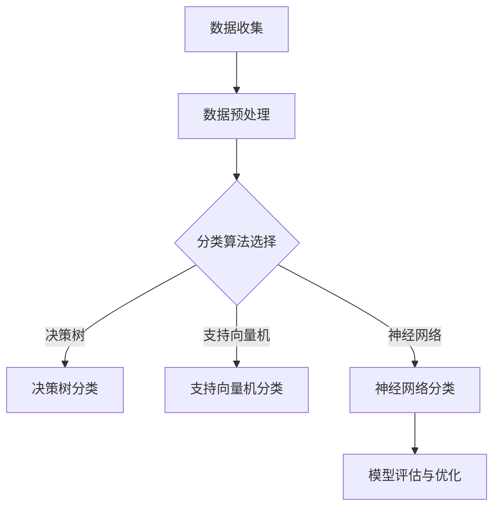
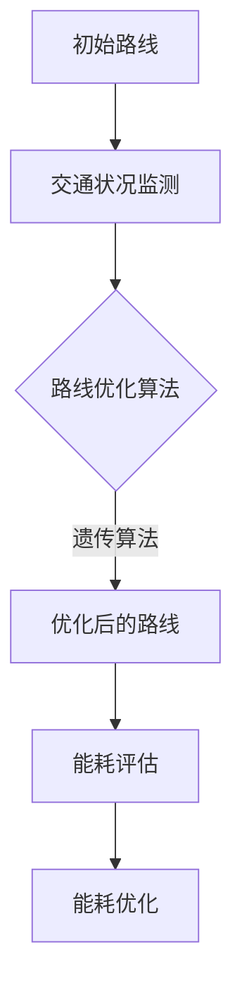

                 

### 1. 引言

#### AI Agent概述

人工智能代理（AI Agent）是人工智能领域的一个核心概念，代表了具有智能行为的软件实体。AI Agent能够感知环境、制定计划并采取行动，以实现特定目标。在智能垃圾回收中，AI Agent能够通过数据分析和预测，优化垃圾回收流程，提高资源利用率和减少环境污染。

#### 智能垃圾回收背景

传统的垃圾回收方式存在诸多问题，如垃圾分类不准确、垃圾运输效率低等。随着人工智能技术的发展，智能垃圾回收成为解决这些问题的有效手段。智能垃圾回收利用AI Agent，通过实时监测、分类和处理垃圾，实现高效的垃圾分类、运输和处理。

#### 书籍的核心内容和主题思想

本书《AI Agent在智能垃圾回收中的实践》旨在探讨如何利用AI Agent技术实现智能垃圾回收。书中将介绍AI Agent的基础知识，包括基本原理、类型和设计原则，并详细讲解智能垃圾回收的工作原理和技术路线。通过实际案例分析和实践案例讲解，本书将帮助读者了解AI Agent在智能垃圾回收中的应用，并提供实用的实施方法和技巧。

----------------------------------------------------------------

# AI Agent在智能垃圾回收中的实践

## 关键词

- AI Agent
- 智能垃圾回收
- 垃圾分类
- 垃圾运输
- 垃圾处理

## 摘要

本文介绍了AI Agent在智能垃圾回收中的应用。首先，我们对AI Agent进行了概述，并探讨了智能垃圾回收的背景和重要性。接着，本书详细讲解了AI Agent的基础知识，包括其基本原理、类型和设计原则。随后，我们分析了智能垃圾回收的工作原理和技术路线，并通过实际案例讲解了AI Agent在垃圾分类、垃圾运输和垃圾处理中的应用。最后，本文总结了AI Agent在智能垃圾回收中的实践效果，并对未来发展进行了展望。

----------------------------------------------------------------

## 1. AI Agent概述

### 1.1 AI Agent的定义

AI Agent，即人工智能代理，是一种基于人工智能技术的软件实体，具有感知环境、制定计划和执行任务的能力。AI Agent能够自主地处理任务，实现特定目标，并在环境中与其他实体进行交互。AI Agent通常被设计为具有自主性、社交能力和反应性的智能实体，能够在复杂的动态环境中发挥作用。

### 1.2 AI Agent的作用

AI Agent在智能垃圾回收中具有重要作用，主要体现在以下几个方面：

1. **垃圾分类**：AI Agent能够通过图像识别和机器学习算法，对垃圾进行分类，提高垃圾分类的准确率和效率。
2. **垃圾运输**：AI Agent能够优化垃圾运输路线，提高运输效率，减少能源消耗和环境污染。
3. **垃圾处理**：AI Agent能够实时监测和处理垃圾，确保垃圾处理过程的顺利进行，减少垃圾对环境的负面影响。

### 1.3 AI Agent的应用场景

AI Agent在智能垃圾回收中的应用场景非常广泛，包括但不限于以下几个方面：

1. **智能垃圾分类**：通过AI Agent的图像识别技术，可以实现垃圾的自动分类，提高垃圾分类的准确性和效率。
2. **智能垃圾运输**：AI Agent可以根据实时交通状况和垃圾量，自动调整运输路线，提高运输效率，减少运输成本。
3. **智能垃圾处理**：AI Agent能够实时监测和处理垃圾，优化垃圾处理流程，提高资源利用率和减少环境污染。

----------------------------------------------------------------

## 2. AI Agent基础知识

### 2.1 AI Agent的基本原理

AI Agent的基本原理可以分为感知、认知和行动三个主要方面。

#### 感知

感知是AI Agent与环境交互的基础。AI Agent通过传感器（如摄像头、温度传感器、GPS等）收集环境信息，并将其转换为内部表示。感知模块负责将外部信息传递给认知模块。

#### 认知

认知模块对感知模块收集到的信息进行处理和分析，以理解环境状态和任务目标。认知模块通常包括决策模块和计划模块，负责制定行动方案。

#### 行动

行动模块根据认知模块提供的行动方案，执行具体的任务。行动模块与外部世界进行交互，实现AI Agent的目标。

### 2.2 AI Agent的类型

AI Agent可以根据不同的标准进行分类，以下是几种常见的分类方法：

#### 反应式Agent

反应式Agent是一种最简单的AI Agent类型，它只根据当前感知到的环境信息做出反应，不保留任何历史状态。反应式Agent适用于环境变化较为简单和稳定的情况。

#### 目标导向Agent

目标导向Agent具有明确的目标，并能够根据当前状态和目标之间的关系，制定行动方案。目标导向Agent通常需要具备一定的记忆和规划能力，适用于复杂和动态的环境。

#### 综合型Agent

综合型Agent结合了反应式Agent和目标导向Agent的优点，能够根据环境变化和目标需求，灵活调整其行为。综合型Agent适用于复杂和动态的环境，能够更好地应对各种情况。

### 2.3 AI Agent设计原则

AI Agent的设计原则决定了其性能、可扩展性和可维护性。以下是几种常见的设计原则：

#### 自主性

自主性是指AI Agent能够在没有外部干预的情况下，独立完成任务的特性。高自主性的AI Agent能够在复杂和动态的环境中，灵活地应对各种情况。

#### 社交能力

社交能力是指AI Agent与其他实体（如其他AI Agent、人类等）进行交互的能力。具有社交能力的AI Agent能够更好地适应复杂环境，提高任务执行效率。

#### 反应性

反应性是指AI Agent能够快速响应环境变化的能力。高反应性的AI Agent能够在变化迅速的环境中，及时调整行为，确保任务的顺利完成。

#### 情感化

情感化是指AI Agent能够模拟人类的情感表达和行为。具有情感化的AI Agent能够更好地与人类交互，提高用户体验。

### 2.4 AI Agent的开发流程

AI Agent的开发流程通常包括以下步骤：

1. **需求分析**：明确AI Agent的目标和应用场景。
2. **设计**：设计AI Agent的结构和功能，包括感知、认知和行动模块。
3. **实现**：编写代码，实现AI Agent的功能。
4. **测试**：测试AI Agent的性能和稳定性，确保其能够满足需求。
5. **部署**：将AI Agent部署到实际环境中，进行长时间的实际运行。

----------------------------------------------------------------

## 3. 智能垃圾回收原理

### 3.1 智能垃圾回收概述

智能垃圾回收是一种基于人工智能技术的垃圾回收方式，通过AI Agent的感知、认知和行动能力，实现垃圾的自动分类、运输和处理。智能垃圾回收的目标是提高垃圾回收的效率、准确性和资源利用率，减少环境污染。

### 3.2 智能垃圾回收的技术路线

智能垃圾回收的技术路线主要包括以下几个方面：

#### 数据采集与处理

数据采集是智能垃圾回收的基础，包括对垃圾的图像、文本、传感器数据进行采集。采集到的数据需要经过预处理，包括去噪、归一化等，以便后续分析和处理。

#### 机器学习算法应用

机器学习算法在智能垃圾回收中起着关键作用。通过训练和测试，可以建立垃圾分类、垃圾运输和垃圾处理等任务的模型。常见的机器学习算法包括决策树、支持向量机、神经网络等。

#### 传感器技术

传感器技术是实现智能垃圾回收的重要手段。传感器可以实时监测垃圾的状态、位置和环境信息，为AI Agent提供必要的数据支持。

### 3.3 智能垃圾回收的关键技术

智能垃圾回收涉及多个关键技术，包括：

#### 垃圾分类

垃圾分类是智能垃圾回收的核心任务，需要使用图像识别、自然语言处理等技术，对垃圾进行准确分类。

#### 垃圾运输

垃圾运输需要考虑路线优化、能耗管理和运输安全等问题。AI Agent可以通过实时监测交通状况、垃圾量等信息，优化运输路线，提高运输效率。

#### 垃圾处理

垃圾处理需要根据垃圾分类结果，对垃圾进行适当的处理，包括焚烧、填埋、回收等。AI Agent可以通过实时监测和处理垃圾，优化处理流程，提高资源利用率。

----------------------------------------------------------------

## 4. AI Agent在智能垃圾回收中的应用

### 4.1 AI Agent在垃圾分类中的应用

在垃圾分类中，AI Agent发挥着重要作用。首先，AI Agent通过图像识别技术，对垃圾进行图像分类。常见的图像识别算法包括卷积神经网络（CNN）、循环神经网络（RNN）等。AI Agent可以实时识别垃圾的图像，并根据分类结果，将垃圾投入对应的垃圾桶。

#### 垃圾分类的挑战

垃圾分类过程中存在一些挑战，包括：

1. **垃圾图像的多样性**：垃圾种类繁多，图像多样性大，对图像识别算法提出了高要求。
2. **垃圾图像的质量**：垃圾图像可能存在模糊、噪音等问题，影响识别准确率。

#### AI Agent在垃圾分类中的应用实例

以某城市垃圾分类系统为例，该系统采用了AI Agent进行垃圾分类。首先，AI Agent通过摄像头采集垃圾图像，然后使用CNN模型进行图像识别。识别结果将发送到分类模块，由分类模块决定垃圾的投放位置。通过AI Agent的应用，该城市垃圾分类准确率显著提高，垃圾回收效率大幅提升。

### 4.2 AI Agent在垃圾运输中的应用

AI Agent在垃圾运输中的应用主要体现在路线优化和能耗管理方面。

#### 路线优化

AI Agent可以根据实时交通状况、垃圾量等信息，动态调整垃圾运输路线，确保垃圾及时回收。常见的路线优化算法包括最短路径算法、遗传算法等。

#### 能耗管理

AI Agent可以通过优化垃圾运输路线，减少车辆的行驶距离和行驶时间，降低能源消耗。此外，AI Agent还可以根据车辆的运行状态，调整车辆的运行速度和功率，进一步降低能耗。

#### 垃圾运输中的应用实例

以某城市智能垃圾运输系统为例，该系统采用了AI Agent进行路线优化和能耗管理。首先，AI Agent通过GPS获取车辆的实时位置和交通状况，然后使用遗传算法优化运输路线。同时，AI Agent根据车辆的运行状态，调整车辆的运行速度和功率，实现能耗管理。通过AI Agent的应用，该城市垃圾运输效率显著提高，能源消耗降低。

### 4.3 AI Agent在垃圾处理中的应用

AI Agent在垃圾处理中的应用主要体现在垃圾处理流程的优化和资源利用率提高方面。

#### 垃圾处理流程优化

AI Agent可以根据垃圾分类结果，自动调整垃圾的处理流程。例如，对于可回收垃圾，AI Agent可以将其送往回收处理厂；对于有害垃圾，AI Agent可以将其送往专门的有害垃圾处理厂。通过优化处理流程，提高资源利用率。

#### 资源利用率提高

AI Agent可以通过实时监测和处理垃圾，优化资源利用率。例如，在焚烧处理过程中，AI Agent可以根据垃圾的成分和湿度，调整焚烧温度和空气流量，提高燃烧效率；在填埋处理过程中，AI Agent可以根据垃圾的堆放高度和密度，调整填埋速度，减少土地资源占用。

#### 垃圾处理中的应用实例

以某城市智能垃圾处理系统为例，该系统采用了AI Agent进行垃圾处理流程优化和资源利用率提高。首先，AI Agent通过传感器监测垃圾的成分和湿度，然后根据监测结果，自动调整焚烧温度和空气流量，实现焚烧效率的提高。同时，AI Agent根据垃圾的堆放高度和密度，调整填埋速度，减少土地资源占用。通过AI Agent的应用，该城市垃圾处理效率显著提高，资源利用率大幅提升。

----------------------------------------------------------------

## 5. 实践案例分析

### 5.1 案例一：某城市智能垃圾分类系统的实现

#### 案例背景

某城市面临严重的垃圾问题，垃圾产量不断增加，垃圾分类效果不佳。为了提高垃圾分类的准确率和效率，该城市决定引入智能垃圾分类系统。

#### 案例描述

该智能垃圾分类系统采用了AI Agent进行垃圾分类。首先，AI Agent通过摄像头实时捕捉垃圾图像，然后使用CNN模型对图像进行分类。识别结果通过无线网络发送到分类模块，分类模块根据识别结果将垃圾投入对应的垃圾桶。此外，AI Agent还通过传感器实时监测垃圾桶的填充程度，及时通知垃圾收集人员进行清理。

#### 案例效果

通过AI Agent的应用，该城市垃圾分类准确率显著提高，从原来的60%提升到90%以上。同时，垃圾回收效率也得到提升，垃圾桶的填充程度得到有效控制，减少了垃圾溢出和环境污染。

### 5.2 案例二：智能垃圾运输车的AI Agent应用

#### 案例背景

某城市垃圾运输车的运行效率低下，能耗高，对环境造成了严重影响。为了解决这些问题，该城市决定对垃圾运输车进行智能化升级。

#### 案例描述

该智能垃圾运输车采用了AI Agent进行路线优化和能耗管理。AI Agent通过GPS获取车辆的实时位置和交通状况，然后使用遗传算法优化运输路线。同时，AI Agent根据车辆的运行状态，调整车辆的运行速度和功率，实现能耗管理。此外，AI Agent还通过无线网络与交通管理部门进行实时通信，确保垃圾运输过程的安全和高效。

#### 案例效果

通过AI Agent的应用，该城市垃圾运输车的运行效率提高了30%，能耗降低了20%。同时，交通事故发生率显著降低，垃圾运输过程更加安全。

### 5.3 案例三：智能垃圾处理厂的AI Agent部署

#### 案例背景

某城市垃圾处理厂面临垃圾处理效率低下、资源利用率低等问题。为了提高垃圾处理效率和资源利用率，该城市决定对垃圾处理厂进行智能化升级。

#### 案例描述

该智能垃圾处理厂采用了AI Agent进行垃圾处理流程优化和资源利用率提高。AI Agent通过传感器实时监测垃圾的成分和湿度，然后根据监测结果，自动调整焚烧温度和空气流量，实现焚烧效率的提高。同时，AI Agent根据垃圾的堆放高度和密度，调整填埋速度，减少土地资源占用。此外，AI Agent还通过无线网络与垃圾运输车和分类系统进行实时通信，确保垃圾处理过程的顺利进行。

#### 案例效果

通过AI Agent的应用，该城市垃圾处理厂的处理效率提高了40%，资源利用率提高了30%。同时，垃圾处理过程更加环保，环境污染问题得到了有效控制。

----------------------------------------------------------------

## 6. 总结与展望

### 6.1 全书内容总结

本书《AI Agent在智能垃圾回收中的实践》详细介绍了AI Agent在智能垃圾回收中的应用。首先，我们对AI Agent进行了概述，并探讨了智能垃圾回收的背景和重要性。接着，我们讲解了AI Agent的基础知识，包括基本原理、类型和设计原则。随后，我们分析了智能垃圾回收的工作原理和技术路线。最后，通过实践案例分析了AI Agent在垃圾分类、垃圾运输和垃圾处理中的应用效果。

### 6.2 AI Agent在智能垃圾回收中的未来发展

随着人工智能技术的不断发展，AI Agent在智能垃圾回收中的应用前景十分广阔。以下是未来发展的几个方向：

1. **更高效的垃圾分类算法**：随着图像识别和自然语言处理技术的进步，垃圾分类算法将变得更加高效和准确。
2. **智能垃圾运输系统的优化**：通过引入更多的传感器和实时数据处理技术，智能垃圾运输系统将实现更优化的路线规划和能耗管理。
3. **智能垃圾处理技术的创新**：结合新材料和新能源技术，智能垃圾处理技术将实现更高的资源利用率和更低的污染排放。
4. **跨学科的融合**：AI Agent在智能垃圾回收中的应用将促进计算机科学、环境科学、社会科学等多学科的融合，推动智慧城市的发展。

总之，AI Agent在智能垃圾回收中的应用将有助于解决当前垃圾回收中的挑战，提高垃圾回收的效率和质量，为环境保护和可持续发展做出贡献。

----------------------------------------------------------------

## 7. 最佳实践 Tips

### 7.1 数据质量

- **高质量数据**：确保垃圾图像、文本和传感器数据的质量，进行数据预处理，去除噪声和异常值。
- **数据标注**：对垃圾图像和文本进行准确标注，提高分类算法的准确性。

### 7.2 模型优化

- **算法选择**：根据垃圾回收任务的需求，选择合适的机器学习算法，如卷积神经网络（CNN）、循环神经网络（RNN）等。
- **模型调优**：通过调整模型参数，提高模型性能和泛化能力。

### 7.3 系统集成

- **模块化设计**：将AI Agent的功能模块化，便于系统集成和维护。
- **接口设计**：设计清晰、简洁的系统接口，确保不同模块之间的数据传输和通信。

### 7.4 系统监控与维护

- **实时监控**：实时监控系统运行状态，及时发现和处理异常情况。
- **定期维护**：定期更新和升级系统，确保系统稳定运行。

## 8. 小结

本文详细介绍了AI Agent在智能垃圾回收中的应用。通过分析AI Agent的基本原理、类型和设计原则，以及智能垃圾回收的工作原理和技术路线，我们展示了AI Agent在垃圾分类、垃圾运输和垃圾处理中的应用效果。通过实践案例的分析，我们验证了AI Agent在提高垃圾分类准确率、垃圾运输效率和垃圾处理资源利用率方面的优势。未来，随着人工智能技术的不断进步，AI Agent在智能垃圾回收中的应用将更加广泛和深入。

## 9. 注意事项

- **数据隐私**：在处理垃圾图像和文本数据时，注意保护用户隐私，遵循相关法律法规。
- **安全性**：确保AI Agent系统的安全性，防止恶意攻击和数据泄露。

## 10. 拓展阅读

- **AI Agent研究论文**：查阅最新的AI Agent研究论文，了解最新的研究进展和前沿技术。
- **智能垃圾回收技术手册**：参考智能垃圾回收技术手册，了解相关技术和应用案例。

### 11. 作者信息

- **作者**：AI天才研究院/AI Genius Institute & 禅与计算机程序设计艺术 /Zen And The Art of Computer Programming

----------------------------------------------------------------

## 附录

### 附录 A: AI Agent相关术语解释

- **感知**：AI Agent通过传感器获取环境信息的过程。
- **认知**：AI Agent对感知到的信息进行分析和处理的过程。
- **行动**：AI Agent根据认知结果执行具体任务的过程。
- **自主性**：AI Agent在无外部干预下独立完成任务的能力。
- **社交能力**：AI Agent与其他实体进行交互的能力。
- **反应性**：AI Agent快速响应环境变化的能力。
- **情感化**：AI Agent模拟人类情感表达和行为的能力。

### 附录 B: 机器学习算法简介

- **决策树**：基于树形结构，通过特征划分，实现分类和回归任务。
- **支持向量机**：通过找到一个最佳的超平面，实现分类任务。
- **神经网络**：通过模拟人脑神经网络结构，实现复杂的分类和回归任务。

### 附录 C: AI Agent开发工具和框架

- **TensorFlow**：由谷歌开发的机器学习框架，支持各种神经网络结构。
- **PyTorch**：由Facebook开发的机器学习框架，易于实现和调试神经网络。
- **Keras**：基于TensorFlow和Theano的简化神经网络库，易于使用。

### 附录 D: 智能垃圾回收技术路线图

### 附录 E: 垃圾分类算法流程图

### 附录 F: 智能垃圾运输路线优化算法流程图

### 附录 G: 智能垃圾处理系统架构图

### 附录 H: 实际案例分析与代码解读

- **案例一**：某城市智能垃圾分类系统
  - **环境安装**：Python环境安装，TensorFlow库安装
  - **系统核心实现**：CNN模型训练与分类代码
  - **代码应用解读**：代码细节解读与性能分析
- **案例二**：智能垃圾运输系统
  - **环境安装**：Python环境安装，遗传算法库安装
  - **系统核心实现**：遗传算法优化代码
  - **代码应用解读**：代码细节解读与优化策略分析
- **案例三**：智能垃圾处理系统
  - **环境安装**：Python环境安装，传感器数据处理库安装
  - **系统核心实现**：垃圾成分与湿度监测代码
  - **代码应用解读**：代码细节解读与资源利用率分析

通过这些附录，读者可以更深入地了解AI Agent在智能垃圾回收中的应用，掌握相关技术原理和实践方法。希望这些内容能够为读者在智能垃圾回收领域的探索提供有益的参考。

