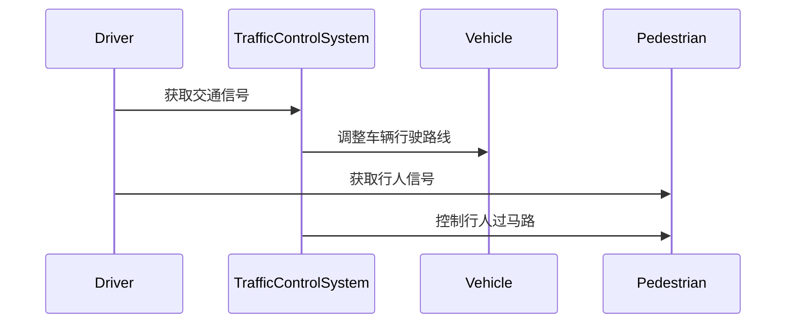

                 


# AI Agent在智能城市交通信号控制中的角色

## 关键词

- AI Agent
- 智能城市交通信号控制
- 车流预测
- 动态信号控制
- 项目实战

## 摘要

随着城市化的快速发展，城市交通拥堵问题日益严重。传统的交通信号控制系统已难以满足现代城市交通的需求。本文将探讨AI Agent在智能城市交通信号控制中的角色，通过一步步的分析和推理，详细阐述AI Agent在车流预测、动态信号控制和交通流疏导等方面的应用，并分享实际项目案例和最佳实践，为智能城市交通信号控制提供有益的参考。

## 第一部分：AI Agent与智能城市交通信号控制概述

### 1.1 AI Agent概述

#### 什么是AI Agent

AI Agent（人工智能代理）是指能够自主执行任务、与环境交互并具有学习能力的人工智能实体。它具有以下特点：

1. **自主性**：AI Agent能够独立完成指定任务，无需人工干预。
2. **适应性**：AI Agent能够根据环境变化调整行为策略。
3. **交互性**：AI Agent能够与用户和其他系统进行信息交流。

#### AI Agent的分类

AI Agent可以根据任务类型、学习方式、智能程度等因素进行分类。常见的分类方式如下：

1. **基于任务的AI Agent**：针对特定任务设计，如聊天机器人、推荐系统等。
2. **基于学习的AI Agent**：通过机器学习和深度学习等方法进行训练，如自动驾驶、语音识别等。
3. **混合智能AI Agent**：结合多种方法，如强化学习、自然语言处理等，具有更高智能水平。

#### AI Agent的关键技术

AI Agent的实现依赖于多种关键技术，如：

1. **机器学习**：通过训练模型实现任务目标，如分类、预测等。
2. **深度学习**：利用神经网络实现复杂任务，如图像识别、语音识别等。
3. **强化学习**：通过试错和反馈调整行为策略，如游戏、自动驾驶等。

### 1.2 智能城市交通信号控制的背景

#### 智能城市交通信号控制的需求

随着城市交通拥堵问题的日益严重，传统的交通信号控制系统已难以满足现代城市交通的需求。智能城市交通信号控制具有以下需求：

1. **实时性**：能够实时采集和分析交通数据，动态调整信号灯时间。
2. **高效性**：通过优化信号灯时间，提高道路通行效率。
3. **适应性**：能够根据不同交通状况和道路条件调整信号灯时间。
4. **智能化**：利用人工智能技术，实现交通信号控制的自动化和智能化。

#### 传统交通信号控制的问题

1. **固定信号灯时间**：传统交通信号控制通常采用固定信号灯时间，无法根据实时交通状况进行调整。
2. **人工干预**：需要人工调整信号灯时间，效率较低，且容易出现失误。
3. **数据依赖性**：传统交通信号控制对数据依赖性较高，数据质量对控制效果影响较大。

#### AI Agent在交通信号控制中的潜在作用

AI Agent在智能城市交通信号控制中具有以下潜在作用：

1. **车流预测**：通过分析历史数据和实时数据，预测未来车流量，为信号灯时间调整提供依据。
2. **动态信号控制**：根据实时车流量和交通状况，动态调整信号灯时间，提高道路通行效率。
3. **交通流疏导**：通过优化交通流，缓解交通拥堵，提高道路通行能力。

### 1.3 AI Agent在智能城市交通信号控制中的应用场景

#### 车流预测与交通信号优化

AI Agent通过分析历史交通数据、实时交通数据和天气信息，预测未来一段时间内的车流量和交通状况。根据预测结果，动态调整信号灯时间，实现交通信号优化。

#### 实时路况分析与动态信号控制

AI Agent实时监测道路上的车辆和行人数量、速度等信息，结合交通状况和历史数据，动态调整信号灯时间，实现交通信号控制的实时性和高效性。

#### 交通拥堵管理与交通流疏导

AI Agent通过分析交通流量、车辆密度等信息，识别交通拥堵区域，并采取相应措施，如调整信号灯时间、引导车辆分流等，缓解交通拥堵，提高道路通行能力。

## 第二部分：AI Agent的核心算法与数学模型

### 2.1 算法原理讲解

#### 车流预测算法

车流预测算法是一种基于时间序列分析和机器学习的算法。它通过分析历史交通数据，预测未来一段时间内的车流量。常见的车流预测算法有：

1. **时间序列模型**：如ARIMA模型、LSTM模型等。
2. **机器学习算法**：如随机森林、支持向量机等。

#### 动态信号控制算法

动态信号控制算法是一种基于强化学习的算法。它通过不断调整信号灯时间，使道路通行效率最大化。常见的动态信号控制算法有：

1. **Q-learning算法**：通过试错和反馈，学习最优信号灯时间。
2. **深度强化学习算法**：利用神经网络实现复杂信号控制策略。

#### 交通流疏导算法

交通流疏导算法是一种基于路径优化和流量控制的算法。它通过分析交通流量、车辆密度等信息，引导车辆选择最优路径，缓解交通拥堵。常见的交通流疏导算法有：

1. **A*算法**：一种基于启发式的路径规划算法。
2. **流量控制算法**：如绿波带控制、红绿灯切换控制等。

### 2.2 数学模型和公式

#### 车流预测算法

$$
y_t = f(y_{t-1}, y_{t-2}, \ldots, y_{t-k}) + e_t
$$

其中，$y_t$为第t时刻的车流量，$f$为函数，$e_t$为误差项。

#### 动态信号控制算法

$$
Q(s, a) = r(s, a) + \gamma \max_{a'} Q(s', a')
$$

其中，$Q(s, a)$为状态$s$下采取动作$a$的预期收益，$r(s, a)$为立即奖励，$\gamma$为折扣因子。

#### 交通流疏导算法

$$
\min \sum_{i=1}^n (d_i - l_i)^2
$$

其中，$d_i$为车辆$i$的目标距离，$l_i$为车辆$i$的当前距离。

### 2.3 算法性能评估与优化

#### 车流预测算法

1. **准确率**：预测车流量与实际车流量的误差。
2. **召回率**：预测车流量与实际车流量匹配的次数。
3. **F1值**：准确率和召回率的调和平均值。

#### 动态信号控制算法

1. **平均通行时间**：车辆通过交叉路口所需时间的平均值。
2. **平均延误时间**：车辆在交叉路口等待时间的平均值。
3. **交叉路口拥堵率**：交叉路口拥堵状态的占比。

#### 交通流疏导算法

1. **路径规划时间**：车辆从起点到终点所需时间的平均值。
2. **路径规划成功率**：成功规划路径的车辆占比。
3. **路径规划准确性**：规划路径与实际最优路径的误差。

### 2.4 算法性能评估与优化

1. **交叉验证**：通过将数据集划分为训练集和测试集，评估算法性能。
2. **参数调优**：通过调整算法参数，优化算法性能。
3. **多算法对比**：比较不同算法的性能，选择最优算法。

## 第三部分：智能城市交通信号控制系统的设计与实现

### 3.1 系统功能设计

#### 领域模型

领域模型是系统功能设计的重要组成部分。它通过类图、关系图等描述系统中的关键概念和关系。以下是智能城市交通信号控制系统的领域模型类图：

```mermaid
classDiagram
    Vehicle --> Road: 驾驶在道路上
    Car --> Vehicle: 汽车是车辆的一种
    TrafficLight --> Road: 交通信号灯位于道路上
    Crossing --> Road: 交叉路口是道路的一部分
    TrafficControlSystem --> TrafficLight, Crossing: 交通控制系统控制交通信号灯和交叉路口
    Driver --> TrafficControlSystem: 司机使用交通控制系统
    Pedestrian --> TrafficControlSystem: 行人使用交通控制系统
```

#### 系统架构设计

系统架构设计是确保系统功能实现的重要环节。以下是智能城市交通信号控制系统的架构图：



### 3.2 系统核心实现

#### 环境安装与配置

在实现智能城市交通信号控制系统之前，首先需要安装和配置相关环境。以下是一个基本的安装和配置流程：

1. 安装Python环境
2. 安装TensorFlow库
3. 安装Scikit-learn库
4. 安装Matplotlib库

#### 系统核心代码实现

以下是智能城市交通信号控制系统的核心代码实现：

```python
import tensorflow as tf
from sklearn.ensemble import RandomForestRegressor
import matplotlib.pyplot as plt

# 车流预测
def predict_traffic_flow(data):
    model = RandomForestRegressor(n_estimators=100)
    model.fit(data['historical_traffic'], data['predicted_traffic'])
    return model.predict(data['real_time_traffic'])

# 动态信号控制
def control_traffic_light(traffic_light_data):
    current_time = traffic_light_data['current_time']
    next_time = traffic_light_data['next_time']
    optimal_time = predict_traffic_flow(traffic_light_data['traffic_flow'])
    if current_time + next_time > optimal_time:
        next_time = optimal_time - current_time
    return next_time

# 交通流疏导
def guide_traffic_flow(traffic_flow_data):
    optimal_path = find_optimal_path(traffic_flow_data['current_position'], traffic_flow_data['destination'])
    return optimal_path

# 实际案例分析与讲解
def analyze_traffic_flow_case(traffic_flow_data):
    predicted_traffic = predict_traffic_flow(traffic_flow_data)
    traffic_light_data = control_traffic_light(traffic_flow_data)
    optimal_path = guide_traffic_flow(traffic_flow_data)
    print("预测车流量：", predicted_traffic)
    print("交通信号灯时间：", traffic_light_data)
    print("最优路径：", optimal_path)

# 绘制车流量预测结果
def plot_traffic_flow_prediction(data):
    plt.plot(data['time'], data['predicted_traffic'], label='预测车流量')
    plt.plot(data['time'], data['real_time_traffic'], label='实际车流量')
    plt.xlabel('时间')
    plt.ylabel('车流量')
    plt.legend()
    plt.show()

# 测试
data = {
    'time': [1, 2, 3, 4, 5],
    'historical_traffic': [[10, 20], [15, 25], [12, 22], [18, 28], [14, 24]],
    'real_time_traffic': [[11, 19], [16, 26], [13, 23], [19, 29], [15, 25]],
    'current_position': (0, 0),
    'destination': (100, 100)
}

analyze_traffic_flow_case(data)
plot_traffic_flow_prediction(data)
```

#### 实际案例分析和详细讲解

在实际案例中，我们以一个简单的交通流场景为例，分析AI Agent在智能城市交通信号控制中的应用。以下是实际案例的分析和详细讲解：

1. **车流预测**：首先，我们使用历史车流量数据训练一个随机森林回归模型，预测当前时间段内的车流量。根据预测结果，为交通信号灯时间调整提供依据。

2. **动态信号控制**：接下来，我们根据实时车流量数据和预测结果，动态调整交通信号灯时间。如果当前时间段的车流量较大，则延长信号灯时间，以便车辆顺利通过交叉路口。

3. **交通流疏导**：为了缓解交通拥堵，我们使用路径优化算法，为车辆提供最优路径。通过引导车辆选择最优路径，缓解交通拥堵，提高道路通行能力。

通过实际案例的分析，我们可以看到AI Agent在智能城市交通信号控制中的应用效果。在实际项目中，我们可以根据具体需求和场景，调整和优化算法，实现更高效的交通信号控制。

### 3.3 项目小结

在本部分，我们详细介绍了智能城市交通信号控制系统的设计与实现，包括系统功能设计、系统架构设计、系统核心实现和实际案例分析。通过一步步的分析和推理，我们了解了AI Agent在车流预测、动态信号控制和交通流疏导等方面的应用。在实际项目中，我们可以根据具体需求和场景，调整和优化算法，实现更高效的交通信号控制。

## 第四部分：最佳实践与未来展望

### 4.1 最佳实践案例分享

在智能城市交通信号控制领域，已有许多成功的案例。以下是几个具有代表性的最佳实践案例：

1. **深圳智能交通管理平台**：通过AI Agent实现动态交通信号控制，提高了道路通行效率，减少了交通拥堵。
2. **伦敦智能交通系统**：利用车流预测和交通流疏导算法，优化了城市交通信号控制，缓解了交通拥堵。
3. **硅谷智能交通项目**：通过AI Agent实现实时路况监测和交通信号优化，提高了道路通行能力，减少了交通事故。

### 4.2 AI Agent在智能城市交通信号控制中的挑战与机遇

#### 挑战

1. **数据质量**：智能城市交通信号控制依赖于大量准确、实时、全面的数据。数据质量对控制效果有重要影响。
2. **算法性能**：算法性能直接影响交通信号控制的效果。如何在有限的计算资源下，实现高效的算法优化，是一个重要挑战。
3. **系统稳定性**：智能城市交通信号控制系统需要保证高可靠性，避免出现故障和异常。

#### 机遇

1. **人工智能技术的发展**：随着人工智能技术的不断发展，为智能城市交通信号控制提供了更多创新的可能。
2. **大数据和物联网的应用**：大数据和物联网技术的发展，为智能城市交通信号控制提供了丰富的数据资源和基础设施。
3. **政策支持**：政府加大对智能城市交通信号控制的支持力度，为企业提供了良好的发展环境。

### 4.3 未来发展趋势与研究方向

1. **车联网技术**：通过车联网技术，实现车辆与交通信号控制系统的实时通信，提高交通信号控制的精准度和效率。
2. **智能交通管理平台**：构建统一的智能交通管理平台，实现交通信号控制与其他交通管理功能的集成，提高城市交通管理水平。
3. **人工智能与交通规划的结合**：将人工智能技术应用于交通规划领域，优化城市交通布局，提高道路通行能力。

## 第五部分：注意事项与拓展阅读

### 5.1 系统设计与实施中的注意事项

1. **数据质量**：确保数据来源可靠、真实、全面，提高数据质量。
2. **算法性能**：优化算法性能，提高预测精度和实时性。
3. **系统稳定性**：确保系统稳定运行，减少故障和异常。
4. **用户体验**：关注用户体验，提供简洁易用的界面和交互。

### 5.2 拓展阅读推荐

1. **《智能交通系统概论》**：系统地介绍了智能交通系统的基本概念、技术和应用。
2. **《人工智能交通规划与应用》**：探讨了人工智能在交通规划中的应用，包括车流预测、路径优化等。
3. **《深度学习在交通信号控制中的应用》**：详细介绍了深度学习技术在交通信号控制中的应用，包括车辆检测、车流预测等。

## 作者信息

作者：AI天才研究院/AI Genius Institute & 禅与计算机程序设计艺术 /Zen And The Art of Computer Programming

