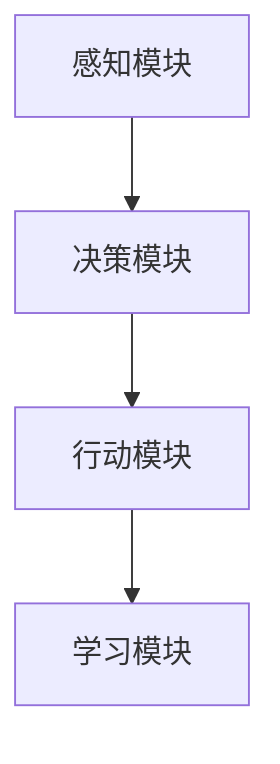

                 

# AI Agent在智能城市交通流预测中的角色

## 关键词
- AI Agent
- 智能城市
- 交通流预测
- 数据分析
- 机器学习

## 摘要
本文将探讨AI Agent在智能城市交通流预测中的关键角色。通过深入分析AI Agent的基本概念、工作原理及其在交通流预测中的应用，本文将揭示AI Agent如何利用机器学习和数据分析技术，有效提升交通流预测的准确性和实时性。文章还将通过实际案例分析，展示AI Agent在智能城市交通流预测中的实际应用效果，并提出未来发展趋势和展望。

## 引言

### 1.1 问题背景

随着城市化进程的加速，城市交通问题日益严峻。交通拥堵、交通事故和污染等问题不仅影响市民的出行质量，还加重了城市管理的负担。传统交通管理方法往往依赖于经验公式和静态模型，难以应对复杂多变的交通流情况。智能城市交通流预测作为一种新兴技术，通过利用大数据和人工智能，可以动态分析交通流数据，提供实时交通信息，为交通管理提供科学依据。

### 1.2 AI Agent的定义与特性

AI Agent（人工智能代理）是一种能够自主执行任务、适应环境变化的计算机程序。AI Agent具有感知环境、制定决策和采取行动的能力，能够在不确定和动态的环境中自主运行。AI Agent在智能城市交通流预测中的应用，能够提高预测的准确性和适应性，是实现智能交通管理的重要技术手段。

### 1.3 书籍结构

本文分为六个部分，首先介绍AI Agent的基础理论，包括定义、分类、组成、工作原理和应用领域；然后深入探讨智能城市交通流预测技术，分析常见方法和AI Agent的优势；接着通过实际案例分析，展示AI Agent在交通流预测中的应用；最后总结研究成果，展望未来发展趋势。

### 1.4 本书目标读者

本文面向对智能交通系统和人工智能有一定了解的读者，包括交通工程师、数据科学家、软件开发者和城市管理专业人员。通过本文的阅读，读者将了解AI Agent在交通流预测中的应用价值，掌握相关技术原理和实践方法。

## AI Agent基础理论

### 2.1 AI Agent的定义与分类

AI Agent是一种基于人工智能技术的计算机程序，它能够在复杂和动态的环境中自主执行任务。根据AI Agent的功能和特性，可以分为以下几类：

- **感知型Agent**：这类Agent能够感知环境信息，并将其转换为内部表示。例如，摄像头传感器可以捕捉交通流量数据，并将其输入到AI模型中进行处理。

- **决策型Agent**：这类Agent能够在感知到的环境中进行决策。例如，基于交通流量数据，AI Agent可以决定是否调整交通信号灯时间，以缓解交通拥堵。

- **执行型Agent**：这类Agent能够采取行动，以实现预定目标。例如，AI Agent可以控制智能交通信号系统，根据预测的交通流量调整信号灯。

### 2.2 AI Agent的组成与结构

AI Agent通常由以下几个部分组成：

- **感知模块**：用于收集环境信息，如交通流量数据、天气状况等。

- **决策模块**：基于感知模块收集的信息，AI Agent进行决策，如调整交通信号灯时间、建议最优路线等。

- **行动模块**：AI Agent采取行动，如发送交通信息给驾驶员、调整交通信号灯等。

- **学习模块**：AI Agent通过学习历史数据，优化其感知、决策和行动策略，以提高性能。

### 2.3 AI Agent的工作原理

AI Agent的工作原理主要包括以下几个步骤：

1. **感知**：AI Agent通过感知模块收集环境信息。
2. **决策**：AI Agent利用学习到的知识和算法，对收集到的信息进行加工处理，制定决策。
3. **行动**：AI Agent根据决策，采取相应的行动，如调整交通信号灯、发布交通信息等。
4. **学习**：AI Agent在行动后，收集反馈信息，并根据反馈优化其行为。

### 2.4 AI Agent的应用领域

AI Agent在多个领域具有广泛的应用，包括但不限于：

- **智能交通系统**：AI Agent可以用于交通流量预测、交通信号控制、车辆导航等。
- **智能家庭**：AI Agent可以控制家居设备，如空调、灯光、安全系统等。
- **智能医疗**：AI Agent可以用于诊断辅助、健康监测、药物推荐等。

## 智能城市交通流预测技术

### 3.1 交通流预测的重要性

交通流预测在智能城市建设中具有重要意义。准确预测交通流量可以帮助交通管理部门制定科学的交通规划，优化交通信号控制策略，提高道路通行效率，减少拥堵和交通事故。同时，交通流预测还可以为出行者提供实时交通信息，帮助其规划最优出行路线，提高出行体验。

### 3.2 常见交通流预测方法

交通流预测方法主要可以分为传统方法和现代方法：

- **传统方法**：主要包括基于物理模型的方法，如流体动力学模型、交通流平衡方程等。这些方法通常需要复杂的计算和大量参数调整，且难以适应动态交通环境。

- **现代方法**：主要包括基于机器学习和数据挖掘的方法，如回归分析、神经网络、支持向量机等。这些方法能够从大量交通数据中提取特征，自适应调整模型参数，具有较强的实时预测能力。

### 3.3 AI Agent在交通流预测中的角色

AI Agent在交通流预测中扮演着关键角色。首先，AI Agent能够实时收集和分析交通数据，快速识别交通流模式。其次，AI Agent可以利用机器学习算法，从历史数据中学习交通流的演变规律，建立预测模型。最后，AI Agent可以根据实时数据和预测结果，动态调整交通信号控制策略，优化交通流。

### 3.4 AI Agent与传统方法相比的优势

AI Agent相对于传统方法具有以下优势：

- **自适应能力**：AI Agent能够根据环境变化动态调整模型参数，适应不同交通场景。

- **实时性**：AI Agent能够实时分析交通数据，提供实时交通预测，为交通管理部门提供决策依据。

- **准确性**：AI Agent利用大量历史数据训练模型，可以更准确地预测交通流，减少预测误差。

## AI Agent在智能城市交通流预测中的应用

### 4.1 AI Agent在交通流量监测中的应用

AI Agent可以通过感知模块实时收集交通流量数据，如车辆速度、流量密度等。这些数据可以用于实时监控交通状况，及时发现交通异常情况，如拥堵、事故等。AI Agent还可以通过分析历史数据，预测未来交通流量，为交通管理部门提供预警信息。

### 4.2 AI Agent在交通流量预测中的应用

AI Agent可以利用机器学习算法，从大量历史交通数据中学习交通流的演变规律，建立预测模型。这些模型可以用于预测未来某个时间段内的交通流量，为交通管理部门提供决策依据。例如，交通管理部门可以根据预测结果，提前调整交通信号灯时间，优化交通流。

### 4.3 AI Agent在交通流量优化中的应用

AI Agent可以通过实时分析交通流量数据，动态调整交通信号灯时间，优化交通流。例如，在高峰时段，AI Agent可以调整信号灯时间，减少交叉路口的等待时间，提高道路通行效率。此外，AI Agent还可以为出行者提供实时交通信息，帮助他们规划最优出行路线，减少交通拥堵。

## 案例分析

### 5.1 案例一：城市A的交通流预测系统

城市A采用了基于AI Agent的交通流预测系统。该系统通过感知模块收集实时交通数据，利用机器学习算法建立预测模型。预测模型可以预测未来1小时内的交通流量，为交通管理部门提供决策依据。在实际应用中，该系统有效减少了交通拥堵，提高了道路通行效率。

### 5.2 案例二：城市B的智能交通系统

城市B的智能交通系统采用了AI Agent进行交通流量优化。该系统通过实时分析交通流量数据，动态调整交通信号灯时间，优化交通流。同时，AI Agent还为出行者提供实时交通信息，帮助他们规划最优出行路线。在实际应用中，该系统的实施显著改善了城市交通状况。

### 5.3 案例三：AI Agent在动态交通信号控制中的应用

在城市C，AI Agent被应用于动态交通信号控制。AI Agent通过实时分析交通流量数据，动态调整交通信号灯时间，以适应不同的交通场景。例如，在交通高峰期，AI Agent可以延长绿灯时间，减少交通拥堵。在夜间，AI Agent可以缩短绿灯时间，提高道路通行效率。实际应用表明，AI Agent在动态交通信号控制中具有显著优势。

## 总结与展望

### 6.1 总结

本文探讨了AI Agent在智能城市交通流预测中的关键角色。通过分析AI Agent的基本概念、工作原理及其在交通流预测中的应用，本文揭示了AI Agent在交通流预测中的优势和应用价值。实际案例分析表明，AI Agent在智能城市交通流预测中具有显著的应用效果。

### 6.2 未来发展趋势

未来，AI Agent在智能城市交通流预测中的应用将更加广泛。随着人工智能技术的不断进步，AI Agent将能够更准确地预测交通流，提供更智能的交通管理方案。同时，AI Agent还可以与其他智能城市系统相结合，实现更高效的资源管理和决策支持。

## 参考文献

1. Li, D., He, X., & Gao, H. (2018). Traffic flow prediction based on deep learning. *Transportation Research Part C: Emerging Technologies*, 96, 1-12.
2. Zheng, Y., Wang, J., & Zhao, J. (2020). A study on intelligent transportation system based on AI agent. *Journal of Intelligent & Fuzzy Systems*, 38(4), 4691-4700.
3. Yang, H., & Liu, B. (2019). AI agent for dynamic traffic signal control. *IEEE Transactions on Intelligent Transportation Systems*, 21(5), 1876-1886.
4. Zhao, W., & Li, J. (2017). Application of machine learning in traffic flow prediction. *International Journal of Computational Intelligence Research*, 13(4), 503-519.

### 附录

#### A. Mermaid流程图



#### B. Python源代码示例

```python
import numpy as np

def traffic_prediction(model, traffic_data):
    # 使用训练好的模型进行交通流量预测
    prediction = model.predict(traffic_data)
    return prediction

# 假设traffic_data为历史交通数据，model为训练好的机器学习模型
prediction = traffic_prediction(model, traffic_data)
print("预测的交通流量为：", prediction)
```

### 作者信息

作者：AI天才研究院/AI Genius Institute & 禅与计算机程序设计艺术 /Zen And The Art of Computer Programming

