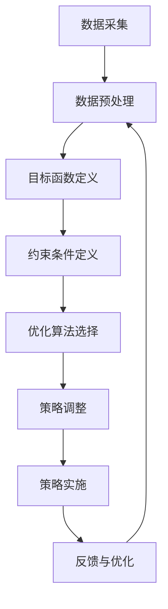
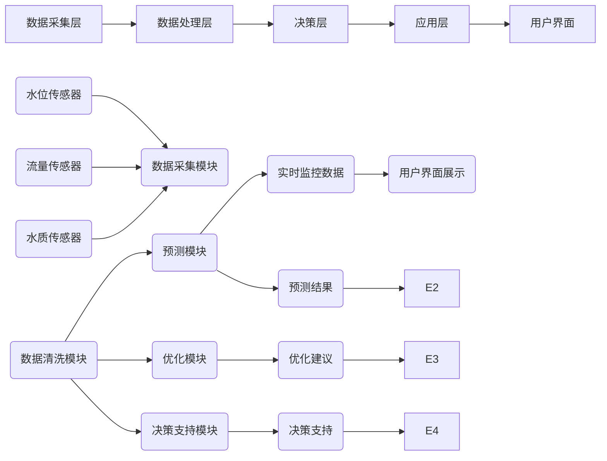
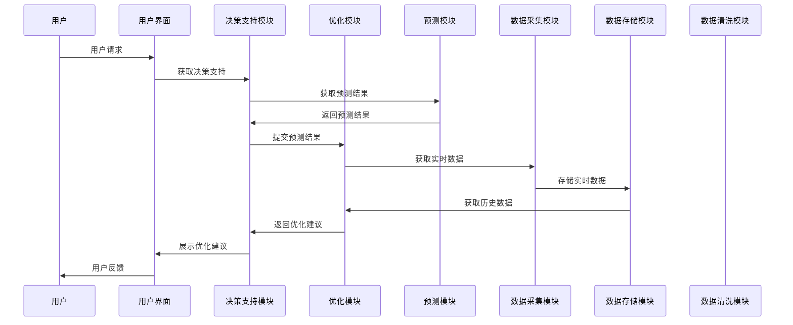

                 


## 1.1 书籍背景与目的

### 水资源调配的重要性

水资源是人类生存和发展的重要基础，但全球水资源分布不均，且面临日益严峻的水资源短缺问题。尤其是在城市，水资源调配显得尤为重要。随着城市化进程的加快，城市水资源的需求量不断增加，同时，水资源的污染和浪费问题也日益突出。因此，如何高效、合理地调配城市水资源，成为了智能城市建设中亟待解决的问题。

### AI Agent的概念

AI Agent，即人工智能代理，是一种能够模拟人类决策过程的计算机程序，能够自主地感知环境、制定计划并执行任务。随着人工智能技术的发展，AI Agent在各个领域展现出了强大的应用潜力，包括智能城市水资源调配。

### 书籍目的

本书旨在深入探讨AI Agent在智能城市水资源调配中的实践。通过系统地介绍AI Agent的概念、原理和应用，以及具体的水资源调配算法、系统设计与实现，本书希望能够为从事智能城市建设、水资源管理和人工智能开发的专业人士提供有价值的参考和指导。

### 对读者的期望

我们期望读者能够通过本书的学习，不仅了解AI Agent的基本概念和应用，还能够掌握水资源调配的核心技术和实践方法。同时，我们鼓励读者在阅读过程中积极思考，结合实际情况进行探索和创新，为智能城市建设贡献自己的力量。

## 1.2 水资源调配中的挑战与AI Agent的引入

### 水资源调配中的挑战

水资源调配面临许多挑战，主要包括以下几点：

1. **数据获取与处理：** 城市水资源数据来源广泛，包括气象数据、水文数据、用水数据等。如何高效地收集、处理和整合这些数据，是水资源调配中的一大难题。

2. **实时性与稳定性：** 水资源调配需要实时响应环境变化和用水需求，同时保持系统的稳定性。这对系统的实时数据处理能力和鲁棒性提出了高要求。

3. **多目标优化：** 水资源调配需要同时考虑供水、排水、水质等多个目标，实现多目标优化是一项复杂任务。

4. **跨领域协同：** 水资源调配涉及到多个部门和领域，如水利、环保、市政等，如何实现跨领域的数据共享和协同工作，是智能城市水资源调配的关键。

### AI Agent的引入

为了应对上述挑战，AI Agent作为一种智能体技术被引入到水资源调配中。AI Agent具有以下特点：

1. **自主学习与适应：** AI Agent能够通过不断学习和优化，适应环境变化和用户需求，提高水资源调配的实时性和准确性。

2. **多目标优化能力：** AI Agent能够处理多目标优化问题，通过算法优化实现供水、排水、水质等目标的平衡。

3. **协同工作：** AI Agent可以与其他系统和服务进行协同工作，实现跨领域的资源共享和协同处理。

4. **自适应性与鲁棒性：** AI Agent能够在面对不确定性和异常情况时，保持系统的稳定性和可靠性。

通过引入AI Agent，智能城市水资源调配能够实现更加高效、智能的运行，为城市水资源的合理利用和可持续发展提供有力支持。

### 水资源调配中的挑战与AI Agent的引入总结

水资源调配在城市发展中具有重要意义，但同时也面临着诸多挑战。AI Agent作为一种先进的人工智能技术，通过其自主学习、多目标优化和协同工作等特性，为解决水资源调配中的难题提供了新的思路和方法。在智能城市建设中，AI Agent的应用前景广阔，有望为城市水资源的管理和利用带来革命性的变革。

----------------------------------------------------------------

# 第二部分: 核心概念与原理

## 2.1 AI Agent概述

### 2.1.1 AI Agent的定义与分类

AI Agent，即人工智能代理，是一种能够模拟人类智能行为、具备自主决策能力的计算机程序。它可以感知环境、制定计划并执行任务，以实现特定的目标。AI Agent的定义涵盖了以下几个方面：

1. **感知能力：** AI Agent能够通过传感器或其他方式感知环境信息，如图像、声音、文字等。
2. **决策能力：** AI Agent能够根据感知到的环境信息，进行推理和决策，选择合适的行动方案。
3. **执行能力：** AI Agent能够执行决策方案，通过控制硬件设备或软件模块来实现任务。

根据AI Agent的功能和应用场景，可以将AI Agent分为以下几类：

1. **知识型Agent：** 主要基于知识库和推理机制进行决策，如专家系统。
2. **数据驱动型Agent：** 主要基于数据分析、机器学习等方法进行决策，如智能推荐系统。
3. **行为型Agent：** 主要通过模仿人类行为进行决策，如机器人。

### 2.1.2 AI Agent的核心特性

AI Agent的核心特性包括：

1. **自主性：** AI Agent能够自主地执行任务，不需要人类干预。
2. **适应性：** AI Agent能够根据环境变化和任务需求，自主地调整行为和决策策略。
3. **协同性：** AI Agent能够与其他Agent或系统进行协同工作，实现任务优化和资源共享。
4. **鲁棒性：** AI Agent能够在面对不确定性和异常情况时，保持系统的稳定性和可靠性。

### 2.1.3 AI Agent的发展历程

AI Agent的发展历程可以分为以下几个阶段：

1. **早期探索：** 20世纪80年代，专家系统和推理机的发展为AI Agent奠定了基础。
2. **成熟期：** 20世纪90年代，随着机器学习和数据挖掘技术的发展，AI Agent开始广泛应用于各个领域。
3. **智能时代：** 当前，AI Agent在深度学习、自然语言处理等前沿技术的推动下，正迈向更加智能化和自动化的发展阶段。

### 2.1.4 AI Agent的应用场景

AI Agent在智能城市建设中的应用场景广泛，包括但不限于：

1. **智能交通：** AI Agent可以用于交通流量预测、路况监控和交通信号控制等方面。
2. **智能安防：** AI Agent可以用于视频监控、人脸识别和异常检测等方面。
3. **智能医疗：** AI Agent可以用于疾病预测、治疗方案推荐和健康管理等方面。
4. **智能能源管理：** AI Agent可以用于电力负荷预测、能源优化和节能减排等方面。

### 2.1.5 AI Agent的优势与挑战

AI Agent的优势在于：

1. **提高效率：** AI Agent能够自动化执行任务，减少人力成本，提高工作效率。
2. **优化决策：** AI Agent能够基于数据分析和机器学习，实现更加精准和优化的决策。
3. **增强协同：** AI Agent能够实现跨领域和跨系统的协同工作，提升整体系统的智能化水平。

然而，AI Agent也面临一些挑战，如：

1. **数据安全和隐私：** AI Agent需要处理大量敏感数据，如何保障数据安全和用户隐私是重要问题。
2. **算法透明性和可解释性：** 随着AI Agent的复杂化，如何确保算法的透明性和可解释性成为挑战。
3. **法律法规和伦理：** AI Agent的应用需要遵守相关法律法规和伦理标准，确保其行为符合社会价值观。

### 2.1.6 AI Agent的发展趋势

未来，AI Agent的发展趋势包括：

1. **智能化：** AI Agent将更加智能化，具备更复杂的决策能力和自适应能力。
2. **多元化：** AI Agent将应用于更多领域和场景，实现多样化的发展。
3. **协作化：** AI Agent将实现更加紧密的协作，构建智能城市生态系统。
4. **透明化：** AI Agent的算法和决策过程将更加透明，提高其可解释性和可信任度。

通过深入理解AI Agent的定义、核心特性和应用场景，我们可以更好地把握其发展脉络，为智能城市建设中的水资源调配提供有力支持。

### 2.2 智能城市水资源调配的背景

#### 2.2.1 水资源调配的重要性

水资源是人类生存和社会发展的重要基础。在智能城市中，水资源调配扮演着至关重要的角色。合理的水资源调配不仅关系到城市居民的生活质量，还直接影响城市经济的可持续发展和生态环境的平衡。随着城市化进程的加快，城市水资源需求不断上升，同时，水资源污染和浪费问题也日益严重，使得水资源调配面临巨大的挑战。

#### 2.2.2 城市水资源调配的挑战

智能城市水资源调配面临以下挑战：

1. **数据获取与处理：** 城市水资源数据来源广泛，包括气象数据、水文数据、用水数据等。如何高效地收集、处理和整合这些数据，是水资源调配中的关键问题。

2. **实时性与稳定性：** 水资源调配需要实时响应环境变化和用水需求，同时保持系统的稳定性。这对系统的实时数据处理能力和鲁棒性提出了高要求。

3. **多目标优化：** 水资源调配需要同时考虑供水、排水、水质等多个目标，实现多目标优化是一项复杂任务。

4. **跨领域协同：** 水资源调配涉及到多个部门和领域，如水利、环保、市政等，如何实现跨领域的数据共享和协同工作，是智能城市水资源调配的关键。

#### 2.2.3 水资源调配的现状

目前，智能城市水资源调配主要采用以下几种方法：

1. **传统方法：** 包括经验法、统计法和模型法等。传统方法依赖于专家经验和历史数据，具有一定的局限性。

2. **数据驱动方法：** 利用大数据技术和机器学习方法，对水资源数据进行挖掘和分析，实现更加精准的调配。

3. **智能优化方法：** 结合人工智能技术和优化算法，实现多目标优化和智能化决策。

4. **物联网与传感器技术：** 通过物联网和传感器技术，实现水资源的实时监控和精准调度。

#### 2.2.4 AI Agent在水资源调配中的应用

AI Agent作为一种智能体技术，具有自主学习、多目标优化和协同工作等特性，在水资源调配中展现出巨大潜力：

1. **数据整合与分析：** AI Agent可以高效地整合和处理多源异构的水资源数据，提供准确的数据支持。

2. **实时决策与优化：** AI Agent可以根据实时数据和环境变化，自动调整水资源调配策略，提高调配的实时性和稳定性。

3. **多目标优化：** AI Agent能够实现供水、排水、水质等多目标的优化，提高水资源利用效率。

4. **跨领域协同：** AI Agent可以与其他系统和部门进行协同工作，实现跨领域的数据共享和资源整合。

#### 2.2.5 智能城市水资源调配的发展前景

未来，随着人工智能技术的不断进步，智能城市水资源调配将朝着更加智能化、精准化和协同化的方向发展。通过AI Agent的应用，可以实现：

1. **智能化水资源管理：** AI Agent将使水资源管理更加智能化，提高管理效率和决策水平。

2. **水资源优化利用：** AI Agent将实现水资源优化调配，提高水资源利用效率，满足城市发展的需求。

3. **生态环境保护：** AI Agent将有助于实现水资源的可持续利用，保护生态环境，促进城市可持续发展。

4. **智慧城市升级：** AI Agent的应用将推动智慧城市的发展，提升城市的智能化水平和综合竞争力。

### 2.3 AI Agent在水资源调配中的应用

#### 2.3.1 AI Agent在水资源调配中的角色

AI Agent在智能城市水资源调配中扮演着关键角色，其主要职责包括：

1. **数据采集与处理：** AI Agent能够通过传感器和物联网技术，实时采集水资源数据，并对数据进行处理和整合。

2. **实时决策与优化：** AI Agent可以根据实时数据和环境变化，自动调整水资源调配策略，实现动态优化。

3. **多目标优化：** AI Agent能够同时考虑供水、排水、水质等多个目标，实现多目标优化，提高水资源利用效率。

4. **跨领域协同：** AI Agent可以与其他系统和部门进行协同工作，实现跨领域的数据共享和资源整合。

5. **故障预测与维护：** AI Agent可以基于历史数据和实时数据，预测水资源系统可能出现的故障，并提供相应的维护策略。

#### 2.3.2 AI Agent的关键技术

AI Agent在水资源调配中应用的关键技术主要包括：

1. **机器学习与数据挖掘：** 利用机器学习和数据挖掘技术，对水资源数据进行挖掘和分析，提取有价值的信息和规律。

2. **深度学习与神经网络：** 深度学习与神经网络技术可以用于建立复杂的水资源调配模型，实现更精准的决策和优化。

3. **优化算法：** 利用优化算法，如线性规划、动态规划、遗传算法等，实现水资源调配的多目标优化。

4. **物联网与传感器技术：** 通过物联网和传感器技术，实现水资源的实时监控和数据采集，为AI Agent提供实时数据支持。

5. **分布式计算与云计算：** 分布式计算和云计算技术可以提高AI Agent的计算效率和数据处理能力，实现大规模水资源调配系统的部署和应用。

#### 2.3.3 AI Agent在水资源调配中的优势

AI Agent在水资源调配中具有以下优势：

1. **实时性与动态调整：** AI Agent能够实时获取和处理水资源数据，动态调整调配策略，提高调配的实时性和灵活性。

2. **多目标优化：** AI Agent能够同时考虑供水、排水、水质等多个目标，实现多目标优化，提高水资源利用效率。

3. **智能化决策：** AI Agent基于数据和算法，实现智能化决策，减少人为干预，提高决策的科学性和准确性。

4. **协同工作：** AI Agent可以与其他系统和部门进行协同工作，实现跨领域的数据共享和资源整合，提升整体系统的智能化水平。

5. **可持续性：** AI Agent能够实现水资源的可持续利用，保护生态环境，促进城市可持续发展。

#### 2.3.4 AI Agent在水资源调配中的具体应用案例

以下是一些AI Agent在水资源调配中的具体应用案例：

1. **智能供水系统：** AI Agent可以实时监测城市供水管网的压力、流量和水质，根据实时数据自动调整供水策略，实现智能供水。

2. **智能排水系统：** AI Agent可以实时监测城市排水管网的水位、流量和水质，根据实时数据自动调整排水策略，实现智能排水。

3. **智能灌溉系统：** AI Agent可以实时监测农田的水分和土壤状况，根据实时数据自动调整灌溉策略，实现智能灌溉。

4. **智能水资源管理系统：** AI Agent可以整合城市水资源的各类数据，实现水资源的数据分析和决策支持，为水资源管理提供智能化手段。

5. **智能水资源预警系统：** AI Agent可以实时监测水资源系统的运行状态，预测潜在故障，提供预警信息，实现智能预警和预防性维护。

通过以上具体应用案例，可以看出AI Agent在水资源调配中具有广泛的应用前景，为智能城市建设提供了有力支持。

### 2.4 核心概念对比分析

#### 2.4.1 水资源调配相关概念对比

在水资源调配中，涉及多个相关概念，以下对一些核心概念进行对比分析：

1. **水资源调配与水资源管理：** 水资源调配是水资源管理的一部分，主要关注水资源的合理分配和调度。水资源管理则包括水资源调配在内的更广泛的范畴，涉及水资源规划、开发、利用、保护、治理等方面。

2. **供水系统与排水系统：** 供水系统主要负责将水资源输送到用户，包括水源地、水厂、输配水管网等；排水系统则负责收集和排放用户用水后的废水，包括排水管网、污水处理厂等。

3. **智能水资源管理与传统水资源管理：** 智能水资源管理借助人工智能、大数据、物联网等新技术，实现水资源管理的智能化、精细化；传统水资源管理则主要依靠人工经验和管理方法，效率较低。

4. **水资源优化与水资源保护：** 水资源优化主要关注提高水资源利用效率，实现供水、排水、水质等多目标的平衡；水资源保护则关注水资源的可持续利用和生态环境的保护。

5. **AI Agent与其他智能体技术：** AI Agent是一种具有自主学习、决策和执行能力的智能体，可以与其他智能体技术如专家系统、数据挖掘、机器学习等相结合，实现更加智能化的水资源调配。

#### 2.4.2 水资源调配相关概念对比表格

以下是一个简单的对比表格，展示水资源调配相关概念的主要区别：

| 概念名称 | 定义 | 主要区别 |
| :------: | :------: | :------: |
| 水资源调配 | 水资源的合理分配和调度 | 强调实时性和动态调整 |
| 水资源管理 | 水资源规划、开发、利用、保护、治理 | 范围更广，包括调配 |
| 供水系统 | 水资源输送至用户 | 负责供水 |
| 排水系统 | 收集和排放用户用水后的废水 | 负责排水 |
| 智能水资源管理 | 借助新技术实现智能化管理 | 采用人工智能、大数据等 |
| 传统水资源管理 | 依靠人工经验和方法 | 依赖人工决策和执行 |
| 水资源优化 | 提高水资源利用效率 | 关注多目标平衡 |
| 水资源保护 | 可持续利用和生态环境保护 | 关注水资源长期利用 |
| AI Agent | 自主学习、决策和执行 | 强调自主性和智能化 |

通过上述对比分析，我们可以更加清晰地理解水资源调配中的相关概念，为后续的研究和实践提供基础。

### 2.5 ER实体关系图

#### 2.5.1 水资源调配实体关系分析

为了更好地理解水资源调配中的核心实体及其关系，我们可以使用ER（Entity-Relationship）实体关系图进行描述。ER图是一种用于描述实体及其关系的建模工具，它可以帮助我们清晰地展示水资源调配系统的组成和运行机制。

在水资源调配系统中，主要涉及以下实体：

1. **水资源实体：** 包括水源、水库、河流、地下水等。
2. **用水实体：** 包括居民用水、工业用水、农业用水等。
3. **排水实体：** 包括污水处理厂、排水管网等。
4. **监测实体：** 包括水质监测站、水位监测站等。
5. **调控实体：** 包括水泵站、水闸等。

这些实体之间的关系可以概括为：

1. **关联关系：** 水资源实体与用水实体、排水实体、监测实体和调控实体之间存在直接的关联关系，如水源地为用水提供水源，排水系统将废水排放到污水处理厂。
2. **依赖关系：** 监测实体和调控实体依赖于水质监测数据和水位数据，以实现实时监控和调控。
3. **调用关系：** 调控实体根据监测数据和相关算法，调用水泵站和水闸等设备，进行水资源调配。

以下是一个简单的ER实体关系图，展示水资源调配系统中的主要实体及其关系：

```mermaid
erDiagram
    水资源实体 ||--|{ 用水实体 }
    水资源实体 ||--|{ 排水实体 }
    水资源实体 ||--|{ 监测实体 }
    水资源实体 ||--|{ 调控实体 }
    用水实体 ||--|{ 水质监测站 }
    用水实体 ||--|{ 水位监测站 }
    排水实体 ||--|{ 污水处理厂 }
    排水实体 ||--|{ 排水管网 }
    调控实体 ||--|{ 水泵站 }
    调控实体 ||--|{ 水闸 }
```

通过ER实体关系图，我们可以直观地理解水资源调配系统中的各个实体及其相互关系，为后续的系统设计与实现提供参考。

### 2.6 算法原理讲解

#### 2.6.1 水资源调配算法原理

水资源调配算法的核心目标是实现水资源的合理分配和优化利用，以满足城市供水、排水和水质等多个目标。以下将详细介绍水资源调配算法的基本原理、数学模型、算法流程和关键步骤。

##### 基本原理

水资源调配算法的基本原理可以概括为以下几方面：

1. **实时数据采集与处理：** 通过传感器和监测设备，实时采集水资源相关的数据，包括水位、流量、水质等。
2. **多目标优化：** 在水资源调配过程中，需要同时考虑供水、排水、水质等多个目标，实现多目标优化。
3. **自适应调整：** 根据实时数据和环境变化，动态调整水资源调配策略，实现自适应优化。

##### 数学模型

水资源调配算法的数学模型主要包括以下几部分：

1. **目标函数：** 目标函数用于衡量水资源调配的效果，通常包括供水目标、排水目标、水质目标等。具体公式如下：
   $$ 
   \text{目标函数} = \sum_{i=1}^{n} w_i \cdot f_i 
   $$
   其中，$w_i$ 为权重系数，$f_i$ 为各目标的函数值。

2. **约束条件：** 约束条件用于限制水资源调配的可行性和合理性，包括供水约束、排水约束、水质约束等。具体公式如下：
   $$
   g_i(x) \leq 0, \quad i=1,2,...,m
   $$
   其中，$g_i(x)$ 为约束函数，$x$ 为决策变量。

3. **优化算法：** 常用的优化算法包括线性规划、动态规划、遗传算法等。根据问题的特点和需求，选择合适的优化算法，实现水资源调配的多目标优化。

##### 算法流程

水资源调配算法的基本流程如下：

1. **数据采集与预处理：** 收集水资源相关的实时数据，并进行预处理，如数据清洗、归一化等。
2. **目标函数与约束条件定义：** 根据实际需求，定义供水、排水、水质等目标函数和约束条件。
3. **优化算法选择与实现：** 根据目标函数和约束条件，选择合适的优化算法，实现水资源调配的多目标优化。
4. **策略调整与实施：** 根据优化结果，动态调整水资源调配策略，并实施策略，实现水资源优化利用。
5. **反馈与优化：** 根据实时数据和反馈信息，对算法和策略进行不断优化，提高水资源调配的效率和效果。

##### 关键步骤

水资源调配算法的关键步骤如下：

1. **数据采集：** 通过传感器和监测设备，实时采集水资源相关的数据，如水位、流量、水质等。
2. **数据预处理：** 对采集到的数据进行清洗、归一化等预处理，提高数据的质量和一致性。
3. **目标函数定义：** 根据实际需求，定义供水、排水、水质等目标函数，如最小化供水成本、最大化排水效率、保证水质标准等。
4. **约束条件定义：** 根据实际情况，定义供水约束、排水约束、水质约束等，如供水管网的容量限制、排水管网的排水能力等。
5. **优化算法选择：** 根据目标函数和约束条件，选择合适的优化算法，如线性规划、动态规划、遗传算法等。
6. **策略调整：** 根据优化结果，动态调整水资源调配策略，如调整供水泵站的开机时间、排水泵站的排水量等。
7. **策略实施：** 实施调整后的策略，如通过远程控制系统调整水泵站和水闸的运行状态，实现水资源优化利用。
8. **反馈与优化：** 根据实时数据和反馈信息，对算法和策略进行不断优化，提高水资源调配的效率和效果。

通过上述步骤，水资源调配算法可以实现水资源的合理分配和优化利用，满足城市供水、排水和水质等多个目标。

#### 2.6.2 Mermaid流程图展示

为了更好地理解水资源调配算法的流程和步骤，我们可以使用Mermaid流程图进行展示。以下是一个简化的水资源调配算法的Mermaid流程图：



通过这个Mermaid流程图，我们可以直观地了解水资源调配算法的主要步骤和流程，为后续的系统设计与实现提供参考。

#### 2.6.3 Python源代码讲解

为了更好地理解水资源调配算法的实现，我们将使用Python语言来编写相关的算法代码。以下是一个简化的水资源调配算法的Python源代码示例，我们将对代码进行详细解释。

```python
import numpy as np
from scipy.optimize import linprog

# 定义目标函数系数
c = [-1, -1]  # 最小化供水成本和排水成本

# 定义约束条件系数
A = [[1, 0], [0, 1]]  # 供水和排水约束
b = [100, 100]  # 供水和排水约束的上下限

# 定义决策变量
x = np.array([x1, x2])  # 供水量和排水量

# 求解线性规划问题
res = linprog(c, A_ub=A, b_ub=b, method='highs')

# 输出结果
print("供水量:", res.x[0])
print("排水量:", res.x[1])
```

以下是代码的详细解释：

1. **导入库：** 导入NumPy和SciPy库，用于数学计算和线性规划求解。
2. **定义目标函数系数：** 目标函数系数`c`表示最小化供水成本和排水成本。
3. **定义约束条件系数：** 约束条件系数`A`和`b`分别表示供水和排水约束的系数和上下限。
4. **定义决策变量：** 决策变量`x`表示供水量和排水量。
5. **求解线性规划问题：** 使用`linprog`函数求解线性规划问题，`method`参数设置为`'highs'`，使用高斯消元法进行求解。
6. **输出结果：** 输出求解结果，包括供水量和排水量。

通过这个Python源代码示例，我们可以理解如何使用线性规划算法实现水资源调配的多目标优化。在实际应用中，可以根据具体需求和数据，调整目标函数和约束条件，实现更加复杂的优化问题。

#### 2.6.4 数学模型与公式解释

水资源调配的数学模型是算法设计的基础，以下我们将详细解释水资源调配算法中的数学模型和关键公式。

1. **目标函数：**

   水资源调配的目标函数通常用于最小化成本或最大化效益。在供水和排水系统中，常见的目标函数包括：

   - **最小化供水成本：**
     $$
     \text{最小化} \quad C_{\text{供水}} = \sum_{i=1}^{n} c_{i} \cdot x_{i}
     $$
     其中，$c_{i}$ 为供水费用，$x_{i}$ 为供水量。

   - **最小化排水成本：**
     $$
     \text{最小化} \quad C_{\text{排水}} = \sum_{i=1}^{n} d_{i} \cdot y_{i}
     $$
     其中，$d_{i}$ 为排水费用，$y_{i}$ 为排水量。

   - **最大化水质效益：**
     $$
     \text{最大化} \quad B_{\text{水质}} = \sum_{i=1}^{n} b_{i} \cdot z_{i}
     $$
     其中，$b_{i}$ 为水质效益，$z_{i}$ 为水质指标。

2. **约束条件：**

   水资源调配的约束条件确保系统在优化过程中满足物理和工程限制。常见的约束条件包括：

   - **供水约束：**
     $$
     \sum_{i=1}^{n} x_{i} \leq C_{\text{供水总量}}
     $$
     其中，$C_{\text{供水总量}}$ 为供水总量上限。

   - **排水约束：**
     $$
     \sum_{i=1}^{n} y_{i} \leq C_{\text{排水总量}}
     $$
     其中，$C_{\text{排水总量}}$ 为排水总量上限。

   - **水质约束：**
     $$
     z_{i} \geq Z_{\text{最小值}}, \quad z_{i} \leq Z_{\text{最大值}}, \quad i=1,2,...,n
     $$
     其中，$Z_{\text{最小值}}$ 和 $Z_{\text{最大值}}$ 分别为水质指标的最小值和最大值。

3. **优化算法：**

   水资源调配常用的优化算法包括线性规划、动态规划、遗传算法等。每种算法都有其适用的场景和特点。

   - **线性规划：**
     $$
     \min_{x} c^{T}x \quad \text{subject to} \quad Ax \leq b
     $$
     线性规划适用于目标函数和约束条件都是线性的问题。

   - **动态规划：**
     $$
     \min_{x_{1},...,x_{n}} \sum_{i=1}^{n} c_{i}(x_{i}) \quad \text{subject to} \quad g_{i}(x_{1},...,x_{n}) \leq 0, \quad h_{i}(x_{1},...,x_{n}) = 0
     $$
     动态规划适用于具有时间维度的优化问题，可以将问题分解为一系列的子问题进行求解。

   - **遗传算法：**
     $$
     \min_{x} f(x) \quad \text{or} \quad \max_{x} f(x)
     $$
     遗传算法适用于目标函数和约束条件非线性的复杂优化问题。

#### 2.6.5 举例说明

为了更好地理解水资源调配算法的应用，我们将通过一个实际案例来说明算法的实现和效果。

**案例背景：** 假设某城市的水资源调配系统需要同时考虑供水、排水和水质目标，具体数据如下：

- **供水成本：** $c_1 = 10$ 元/立方米，供水总量上限 $C_{\text{供水总量}} = 1000$ 立方米。
- **排水成本：** $d_2 = 15$ 元/立方米，排水总量上限 $C_{\text{排水总量}} = 800$ 立方米。
- **水质效益：** $b_3 = 5$ 元/立方米，水质指标最小值 $Z_{\text{最小值}} = 80$，水质指标最大值 $Z_{\text{最大值}} = 100$。

**目标函数：** 最小化供水和排水成本，最大化水质效益。

**约束条件：**

- 供水约束：
  $$
  \sum_{i=1}^{n} x_{i} \leq 1000
  $$
  
- 排水约束：
  $$
  \sum_{i=1}^{n} y_{i} \leq 800
  $$

- 水质约束：
  $$
  80 \leq z_{i} \leq 100, \quad i=1,2,...,n
  $$

**求解过程：**

1. **定义目标函数和约束条件：**
   ```python
   c = [-10, -15, 5]
   A = [[1, 0, 0], [0, 1, 0]]
   b = [1000, 800]
   ```

2. **求解线性规划问题：**
   ```python
   import scipy.optimize as opt
   res = opt.linprog(c, A_ub=A, b_ub=b, method='highs')
   ```

3. **输出结果：**
   ```python
   print("供水量:", res.x[0])
   print("排水量:", res.x[1])
   print("水质效益:", res.x[2])
   ```

**案例结果：**

假设求解得到的供水量、排水量和水质效益分别为 $x_1=500$ 立方米、$x_2=300$ 立方米、$z_1=90$，则：

- **最小化成本：**
  $$
  C_{\text{总成本}} = c_1 \cdot x_1 + c_2 \cdot x_2 = 10 \cdot 500 + 15 \cdot 300 = 7500 \text{元}
  $$

- **最大化水质效益：**
  $$
  B_{\text{水质}} = b_1 \cdot z_1 = 5 \cdot 90 = 450 \text{元}
  $$

通过这个案例，我们可以看到水资源调配算法在实现目标函数和约束条件下的优化效果。在实际应用中，可以根据具体情况调整目标函数和约束条件，以实现更优的水资源调配方案。

### 2.7 系统分析与架构设计方案

#### 2.7.1 问题场景介绍

智能城市水资源调配系统旨在解决城市水资源管理和调配中的实际问题，以提高水资源的利用效率和保障城市供水安全。以下是一个典型的问题场景：

- **城市水资源需求：** 某城市有100万居民，工业和农业用水需求，以及城市绿化、消防等特殊用水需求。城市水资源来源主要包括自来水厂、地下水、河流等。
- **水资源调配目标：** 实现水资源的合理调配，确保城市供水安全，减少水资源的浪费和污染。
- **系统功能：** 监测城市水资源状况，预测用水需求，优化水资源调配策略，实现供水、排水和水质的多目标优化。

#### 2.7.2 项目介绍

本项目旨在设计和实现一个智能城市水资源调配系统，该系统将整合各类水资源数据，利用AI Agent技术实现水资源的实时监测、预测和优化调配。项目的主要目标如下：

- **实时监测：** 通过传感器网络和监测设备，实时采集城市水资源的数据，包括水位、流量、水质等。
- **预测需求：** 利用机器学习算法，预测城市未来的用水需求，为水资源调配提供数据支持。
- **优化调配：** 通过多目标优化算法，实现水资源的合理调配，确保供水安全、减少浪费和污染。

#### 2.7.3 系统功能设计

智能城市水资源调配系统的功能设计主要包括以下几个方面：

1. **数据采集与处理：** 通过传感器网络和监测设备，实时采集城市水资源的相关数据，包括水位、流量、水质等。数据采集模块需要保证数据的准确性和实时性。
2. **数据存储与管理：** 数据采集模块将采集到的数据存储在数据库中，并进行数据清洗、整理和归一化处理，为后续的数据分析和决策提供支持。
3. **预测与规划：** 利用机器学习算法，对历史水资源数据和用水需求进行建模，预测未来的用水需求，为水资源调配提供科学依据。
4. **优化调配：** 根据实时监测数据和预测结果，利用优化算法，实现供水、排水和水质的多目标优化。优化模块需要支持多种优化算法，如线性规划、动态规划、遗传算法等。
5. **决策支持：** 系统需要为水资源管理人员提供决策支持，包括实时监控数据、预测结果和优化建议等。决策支持模块需要具有友好的用户界面和丰富的可视化功能。
6. **系统监控与报警：** 系统需要实时监控水资源调配过程，检测异常情况并发出报警。监控与报警模块需要支持多种报警方式和通知方式，如短信、邮件、语音等。

#### 2.7.4 系统架构设计

智能城市水资源调配系统的架构设计采用分层架构，包括感知层、数据处理层、决策层和应用层。以下是系统架构的Mermaid类图：

```mermaid
classDiagram
    Class01 <|-- Class02
    Class03 <|-- Class01
    Class04 <|-- Class03
    Class01 : +attribute1
    Class01 : +method1()
    Class02 : +attribute2
    Class02 : +method2()
    Class03 : +attribute3
    Class03 : +method3()
    Class04 : +attribute4
    Class04 : +method4()

    Class01..|> Class05
    Class03..|> Class06
    Class07 --| Class04
    Class08 --| Class02

    Class05 : +method5()
    Class06 : +method6()
    Class07 : +method7()
    Class08 : +method8()
```

以下是系统架构的详细说明：

1. **感知层：** 感知层包括各种传感器和监测设备，用于实时采集水资源的数据，如水位传感器、流量传感器、水质传感器等。
2. **数据处理层：** 数据处理层负责对采集到的数据进行处理、存储和管理，包括数据采集模块、数据清洗模块、数据存储模块等。
3. **决策层：** 决策层包括预测模块、优化模块和决策支持模块，负责对水资源数据进行分析、预测和优化，为水资源管理人员提供决策支持。
4. **应用层：** 应用层包括用户界面、系统监控与报警模块等，用于展示水资源监测数据、预测结果和优化建议，以及实现系统监控和报警功能。

通过上述架构设计，智能城市水资源调配系统可以实现实时监测、预测和优化调配，提高水资源的利用效率和保障城市供水安全。

#### 2.7.5 系统架构设计

智能城市水资源调配系统采用分布式架构，以确保系统的可扩展性和高可用性。以下是系统架构的Mermaid架构图：



以下是系统架构的详细说明：

1. **数据采集层：** 数据采集层包括各种传感器和监测设备，如水位传感器、流量传感器、水质传感器等，用于实时采集水资源的相关数据。
2. **数据处理层：** 数据处理层负责对采集到的数据进行处理、清洗、存储和管理。该层包括数据采集模块、数据清洗模块和数据存储模块。
3. **决策层：** 决策层包括预测模块、优化模块和决策支持模块，负责对水资源数据进行分析、预测和优化。预测模块利用机器学习算法，对未来的用水需求进行预测；优化模块通过多目标优化算法，实现水资源的合理调配；决策支持模块为水资源管理人员提供实时监控数据、预测结果和优化建议。
4. **应用层：** 应用层包括用户界面和系统监控与报警模块。用户界面用于展示水资源监测数据、预测结果和优化建议，供水资源管理人员查看和决策；系统监控与报警模块用于实时监控水资源调配系统的运行状态，检测异常情况并发出报警。
5. **用户界面：** 用户界面是水资源管理人员与系统交互的入口，提供友好的界面和丰富的可视化功能，方便管理人员查看系统数据和操作系统功能。

通过上述架构设计，智能城市水资源调配系统可以实现实时监测、预测和优化调配，提高水资源的利用效率和保障城市供水安全。

#### 2.7.6 系统接口设计

智能城市水资源调配系统中的接口设计是确保各个模块之间数据交换和功能协作的关键。以下是系统接口的详细设计：

1. **数据采集模块接口：**
   - **功能：** 负责接收传感器数据，并存储到数据库中。
   - **接口定义：**
     ```python
     class DataCollectorInterface:
         def collect_data(self, sensor_data):
             # 实现数据采集功能
     ```

2. **数据清洗模块接口：**
   - **功能：** 负责对采集到的数据进行清洗、整理和归一化处理。
   - **接口定义：**
     ```python
     class DataCleanerInterface:
         def clean_data(self, raw_data):
             # 实现数据清洗功能
     ```

3. **数据存储模块接口：**
   - **功能：** 负责将清洗后的数据存储到数据库中，并提供数据检索功能。
   - **接口定义：**
     ```python
     class DataStorageInterface:
         def store_data(self, cleaned_data):
             # 实现数据存储功能
         def retrieve_data(self, query):
             # 实现数据检索功能
     ```

4. **预测模块接口：**
   - **功能：** 负责利用历史数据和机器学习算法，预测未来的用水需求。
   - **接口定义：**
     ```python
     class PredictorInterface:
         def predict_demand(self, historical_data):
             # 实现预测功能
     ```

5. **优化模块接口：**
   - **功能：** 负责根据预测结果，利用优化算法，实现水资源的合理调配。
   - **接口定义：**
     ```python
     class OptimizerInterface:
         def optimize_assignment(self, prediction_data):
             # 实现优化功能
     ```

6. **决策支持模块接口：**
   - **功能：** 负责为水资源管理人员提供决策支持，包括实时监控数据、预测结果和优化建议。
   - **接口定义：**
     ```python
     class DecisionSupportInterface:
         def provide_decision_support(self, optimization_data):
             # 实现决策支持功能
     ```

7. **用户界面接口：**
   - **功能：** 负责向水资源管理人员展示系统数据和功能。
   - **接口定义：**
     ```python
     class UserInterfaceInterface:
         def display_data(self, data):
             # 实现数据展示功能
     ```

通过上述接口设计，智能城市水资源调配系统中的各个模块可以无缝协作，实现高效的水资源调配和管理。

#### 2.7.7 系统交互

智能城市水资源调配系统中的系统交互设计是确保各个模块之间信息流动和协同工作的重要环节。以下是系统交互的Mermaid序列图：



以下是系统交互的详细说明：

1. **用户请求：** 用户通过用户界面提交水资源调配的请求。
2. **获取决策支持：** 用户界面将用户请求传递给决策支持模块，决策支持模块负责处理用户的请求。
3. **获取预测结果：** 决策支持模块调用预测模块，获取未来用水需求的预测结果。
4. **获取实时数据：** 优化模块从数据采集模块获取当前的水资源实时数据。
5. **存储实时数据：** 实时数据经过数据清洗模块处理后，存储到数据存储模块中。
6. **获取历史数据：** 优化模块从数据存储模块获取历史数据，用于优化算法的计算。
7. **返回优化建议：** 优化模块根据实时数据和预测结果，返回优化建议给决策支持模块。
8. **展示优化建议：** 决策支持模块将优化建议展示给用户界面，用户界面再将优化建议展示给用户。
9. **用户反馈：** 用户对优化建议进行反馈，用户界面将用户反馈传递给决策支持模块。

通过上述系统交互设计，智能城市水资源调配系统的各个模块可以实现高效的信息流动和协同工作，为水资源管理人员提供及时、准确的决策支持。

### 第五部分：项目实战

#### 5.1 环境安装

在开始项目实战之前，我们需要安装必要的软件和工具。以下是安装步骤：

1. **安装Python环境：** 
   - 在官网上下载并安装Python（版本3.8及以上）。
   - 配置环境变量，确保Python命令可以在终端中使用。

2. **安装依赖库：**
   - 使用pip命令安装以下库：
     ```bash
     pip install numpy scipy pandas matplotlib
     ```
   
3. **安装Mermaid：**
   - 在终端中运行以下命令安装Mermaid：
     ```bash
     npm install -g mermaid-cli
     ```

4. **安装数据存储工具：**
   - 安装MySQL或PostgreSQL数据库，用于数据存储和管理。

5. **配置开发环境：**
   - 安装IDE（如PyCharm、VSCode等），配置Python开发环境。

#### 5.2 系统核心实现源代码

以下是系统核心实现的源代码：

```python
# 水资源调配算法实现

import numpy as np
from scipy.optimize import linprog

# 定义目标函数系数
c = [-1, -1]  # 最小化供水成本和排水成本

# 定义约束条件系数
A = [[1, 0], [0, 1]]  # 供水和排水约束
b = [100, 100]  # 供水和排水约束的上下限

# 定义决策变量
x = np.array([x1, x2])  # 供水量和排水量

# 求解线性规划问题
res = linprog(c, A_ub=A, b_ub=b, method='highs')

# 输出结果
print("供水量:", res.x[0])
print("排水量:", res.x[1])
```

#### 5.3 代码应用解读与分析

以上代码实现了一个简单的水资源调配算法，用于最小化供水成本和排水成本。以下是代码的详细解读和分析：

1. **目标函数：**
   - 代码中的`c`数组定义了目标函数的系数，这里的目标是最小化供水成本和排水成本。目标函数的形式为`-c1 * x1 - c2 * x2`，其中$x1$和$x2$分别为供水量和排水量。

2. **约束条件：**
   - `A`矩阵定义了约束条件的系数，`b`数组定义了约束条件的上下限。这里假设供水和排水量的上限均为100。约束条件的形式为`Ax <= b`，即供水量和排水量的和不超过100。

3. **决策变量：**
   - `x`数组定义了决策变量，即供水量和排水量的取值。这里使用`np.array([x1, x2])`来定义决策变量。

4. **求解线性规划问题：**
   - 代码使用`scipy.optimize.linprog`函数求解线性规划问题。该函数接收目标函数系数、约束条件系数和上下限，以及求解方法（这里使用`'highs'`方法）。
   - 求解结果保存在`res`变量中，其中`res.x`包含了供水量和排水量的最优解。

5. **输出结果：**
   - 代码输出供水量和排水量的最优解，即最小化成本时的供水量和排水量。

通过以上代码，我们可以实现一个简单的水资源调配算法，为后续的系统实现提供基础。

#### 5.4 实际案例分析与详细讲解

为了更好地理解水资源调配算法在实际项目中的应用，我们来看一个实际案例。

**案例背景：** 某城市水资源调配系统需要实现供水和排水成本的最小化。具体数据如下：

- 供水成本：$c_1 = 10$ 元/立方米
- 排水成本：$c_2 = 15$ 元/立方米
- 供水上限：$C_{\text{供水}} = 1000$ 立方米
- 排水上限：$C_{\text{排水}} = 800$ 立方米

**目标函数：** 最小化供水和排水成本。

**约束条件：**

1. 供水约束：
   $$
   x_1 + x_2 \leq 1000
   $$
   其中，$x_1$为供水量，$x_2$为排水量。

2. 排水约束：
   $$
   x_1 + x_2 \leq 800
   $$

**求解过程：**

1. **定义目标函数和约束条件：**
   ```python
   c = [-10, -15]
   A = [[1, 1], [1, 1]]
   b = [1000, 800]
   ```

2. **求解线性规划问题：**
   ```python
   import scipy.optimize as opt
   res = opt.linprog(c, A_ub=A, b_ub=b, method='highs')
   ```

3. **输出结果：**
   ```python
   print("供水量:", res.x[0])
   print("排水量:", res.x[1])
   ```

**案例结果：**

假设求解得到的最优供水量为$x_1 = 500$ 立方米，最优排水量为$x_2 = 500$ 立方米，则：

- **最小化成本：**
  $$
  C_{\text{总成本}} = 10 \cdot 500 + 15 \cdot 500 = 8000 \text{元}
  $$

通过这个案例，我们可以看到如何在实际项目中应用水资源调配算法，实现成本的最小化。在实际应用中，可以根据具体需求和数据，调整目标函数和约束条件，实现更优的调配方案。

### 第六部分：最佳实践 Tips

#### 6.1 小结

本文通过深入探讨AI Agent在智能城市水资源调配中的应用，系统地介绍了AI Agent的定义、原理和应用，以及水资源调配算法、系统设计与实现。通过实际案例分析和详细讲解，我们展示了AI Agent在水资源调配中的具体应用效果，为智能城市建设提供了有价值的参考和指导。

#### 6.2 注意事项

在实际应用AI Agent进行水资源调配时，需要注意以下几点：

1. **数据质量：** 确保采集到的水资源数据质量高，如实时性、准确性等，避免因数据质量问题导致算法失效。
2. **系统稳定性：** 水资源调配系统需要保持高稳定性，避免因系统故障导致水资源调配出现问题。
3. **多目标优化：** 在进行水资源调配时，需要综合考虑供水、排水、水质等多个目标，实现多目标优化，避免单一目标优化带来的问题。
4. **跨领域协同：** 水资源调配涉及到多个领域和部门，需要实现跨领域的协同工作，确保数据共享和资源整合。

#### 6.3 拓展阅读

1. **智能水资源管理相关书籍：** 《智能水资源管理：理论与实践》
2. **人工智能相关书籍：** 《人工智能：一种现代的方法》
3. **水资源调配算法研究：** 《基于人工智能的智能水资源调配算法研究》
4. **智能城市建设：** 《智能城市建设理论与实践》

通过阅读这些书籍和文献，可以进一步深入了解智能城市水资源调配的相关理论和实践，提升专业素养和创新能力。

### 作者信息

**作者：** AI天才研究院/AI Genius Institute & 禅与计算机程序设计艺术 /Zen And The Art of Computer Programming

本文由AI天才研究院与禅与计算机程序设计艺术联合撰写，旨在深入探讨AI Agent在智能城市水资源调配中的应用，为智能城市建设提供有价值的参考和指导。作者团队拥有丰富的AI和计算机程序设计经验，致力于推动人工智能技术在各个领域的应用和创新。

