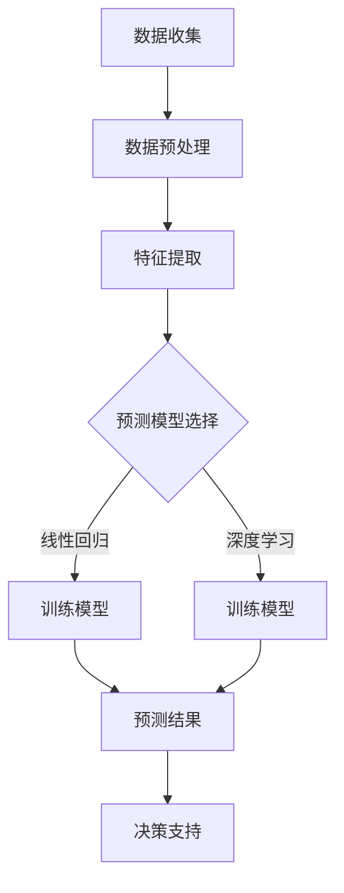
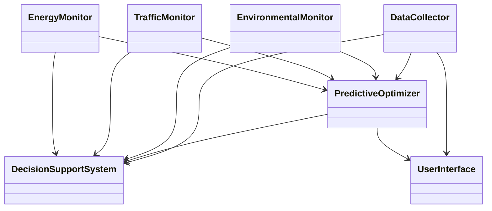
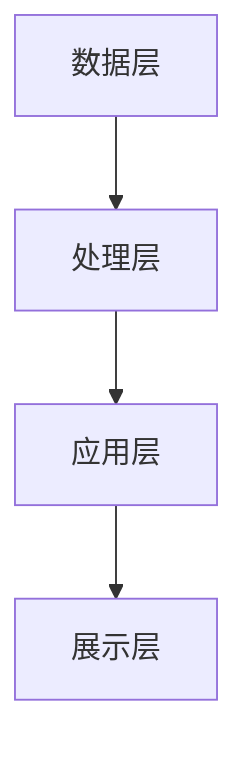
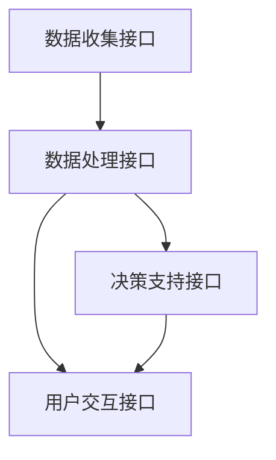
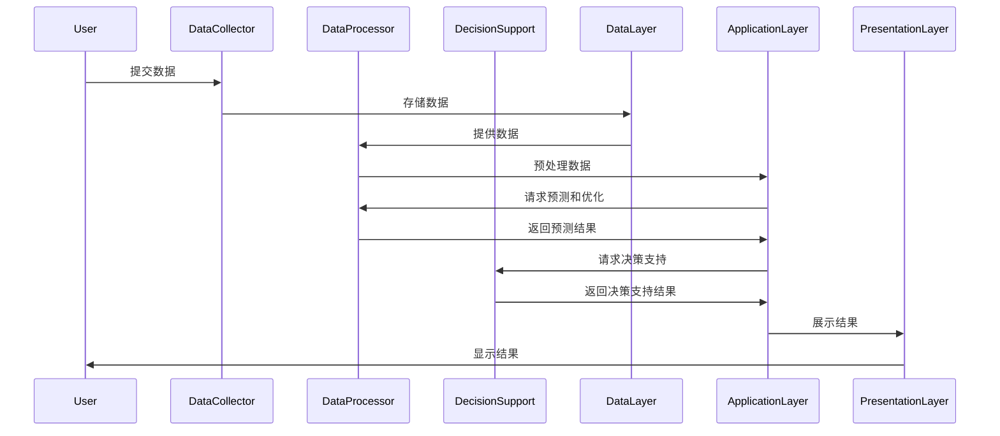
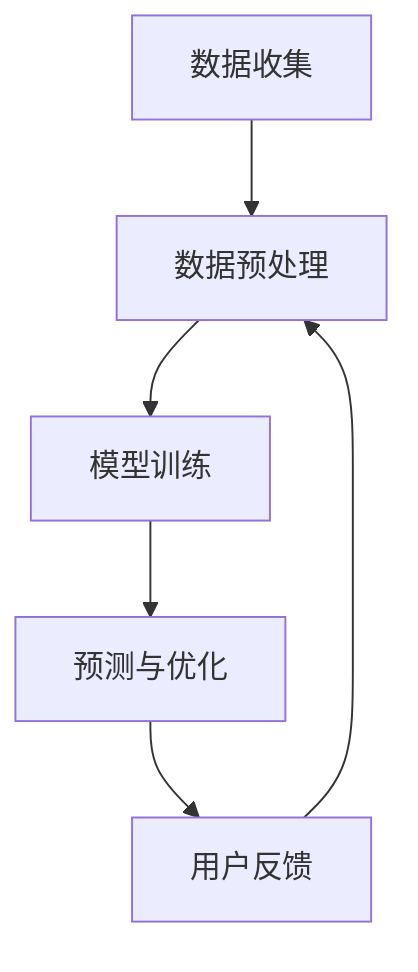

                 

### 第一部分: AI Agent概述

#### 1.1 问题背景与核心要素组成

##### 1.1.1 智能城市规划的现状与挑战

智能城市规划作为现代城市发展的重要方向，已逐渐成为城市规划和管理的重要组成部分。当前，随着城市规模的不断扩大，人口密度增加，城市交通、能源消耗、环境保护等问题日益凸显。传统城市规划方法在面对这些复杂问题时，往往显得力不从心。因此，智能城市规划作为一种利用先进技术和数据驱动的方法，应运而生。

智能城市规划的现状主要体现在以下几个方面：

1. **数据采集与处理能力提升**：现代城市规划依赖于大量的数据，包括地理信息、交通流量、环境监测、人口统计等。这些数据的获取和处理能力得到了显著提升，为智能城市规划提供了基础。

2. **多领域融合**：智能城市规划不仅是城市规划领域的创新，还涉及交通工程、环境科学、计算机科学等多个学科。跨领域的合作和研究，促进了智能城市规划的发展。

3. **决策支持系统应用**：智能城市规划利用大数据、人工智能等技术，构建了决策支持系统，为城市规划者提供科学的决策依据。

然而，智能城市规划也面临着诸多挑战：

1. **数据质量与隐私保护**：城市规划需要大量的数据支持，但这些数据的收集和处理过程中，如何确保数据质量和高隐私保护成为亟待解决的问题。

2. **技术与现实结合**：智能城市规划的理念虽然先进，但在实际应用中，如何将技术有效转化为实际的城市规划和政策，仍需深入探索。

3. **社会接受度**：智能城市规划涉及到人们对新技术的接受和适应，如何在确保技术有效性的同时，提高社会接受度，也是一个重要的挑战。

##### 1.1.2 AI Agent的基本概念

AI Agent，即人工智能代理，是指能够自主感知环境、制定计划并执行任务的智能体。AI Agent通常具备以下几个基本特征：

1. **感知能力**：AI Agent能够感知环境中的各种信息，如温度、湿度、人流密度等。

2. **计划能力**：基于感知到的信息，AI Agent能够制定相应的行动计划，以实现预定的目标。

3. **执行能力**：AI Agent能够执行制定的计划，通过行动来影响环境。

4. **学习与适应能力**：AI Agent能够通过不断学习和适应，提高任务执行的效果。

根据不同的应用场景和需求，AI Agent可以分为以下几类：

1. **移动Agent**：主要应用于移动设备或机器人，如自动驾驶汽车、智能家居等。

2. **网络Agent**：主要应用于互联网环境，如搜索引擎、推荐系统等。

3. **虚拟Agent**：主要应用于虚拟现实环境，如虚拟客服、虚拟导游等。

##### 1.1.3 智能城市规划中的核心要素

智能城市规划的核心要素包括以下几个方面：

1. **数据收集与管理**：数据是智能城市规划的基础，包括地理信息、交通数据、环境数据等。

2. **算法与模型**：智能城市规划需要利用各种算法和模型，如机器学习、深度学习等，来处理和分析数据。

3. **用户交互**：智能城市规划需要与城市居民进行有效的交互，收集用户反馈，以优化城市规划方案。

4. **决策支持系统**：通过算法和模型分析，智能城市规划可以为决策者提供科学的决策依据。

5. **技术实现**：智能城市规划需要将先进技术，如大数据、云计算、物联网等，应用于城市规划的各个环节。

#### 1.2 概念结构与核心概念联系

##### 1.2.1 AI Agent的定义与分类

AI Agent，即人工智能代理，是指能够自主感知环境、制定计划并执行任务的智能体。AI Agent通常具备以下几个基本特征：

1. **感知能力**：AI Agent能够感知环境中的各种信息，如温度、湿度、人流密度等。

2. **计划能力**：基于感知到的信息，AI Agent能够制定相应的行动计划，以实现预定的目标。

3. **执行能力**：AI Agent能够执行制定的计划，通过行动来影响环境。

4. **学习与适应能力**：AI Agent能够通过不断学习和适应，提高任务执行的效果。

根据不同的应用场景和需求，AI Agent可以分为以下几类：

1. **移动Agent**：主要应用于移动设备或机器人，如自动驾驶汽车、智能家居等。

2. **网络Agent**：主要应用于互联网环境，如搜索引擎、推荐系统等。

3. **虚拟Agent**：主要应用于虚拟现实环境，如虚拟客服、虚拟导游等。

##### 1.2.2 智能城市规划的概念与要素

智能城市规划是指利用先进的技术，如大数据、人工智能、物联网等，对城市规划和管理进行智能化改造。智能城市规划的核心要素包括：

1. **数据收集与管理**：数据是智能城市规划的基础，包括地理信息、交通数据、环境数据等。

2. **算法与模型**：智能城市规划需要利用各种算法和模型，如机器学习、深度学习等，来处理和分析数据。

3. **用户交互**：智能城市规划需要与城市居民进行有效的交互，收集用户反馈，以优化城市规划方案。

4. **决策支持系统**：通过算法和模型分析，智能城市规划可以为决策者提供科学的决策依据。

5. **技术实现**：智能城市规划需要将先进技术，如大数据、云计算、物联网等，应用于城市规划的各个环节。

##### 1.2.3 概念属性特征对比表格

为了更清晰地理解AI Agent和智能城市规划的概念和特征，我们可以通过以下表格进行对比：

| 概念       | 定义                                                         | 特征                                                     |
| ---------- | ------------------------------------------------------------ | -------------------------------------------------------- |
| AI Agent   | 能够自主感知环境、制定计划并执行任务的智能体                 | 感知、计划、执行、学习与适应能力                           |
| 移动Agent  | 应用在移动设备或机器人上的AI Agent                           | 自主导航、环境感知、自主决策                               |
| 网络Agent  | 应用在互联网环境中的AI Agent                               | 搜索引擎优化、用户行为分析、推荐系统                       |
| 虚拟Agent  | 应用在虚拟现实环境中的AI Agent                             | 虚拟客服、虚拟导游、虚拟培训                              |
| 智能城市规划 | 利用先进的技术对城市规划和管理进行智能化改造                 | 数据收集与管理、算法与模型、用户交互、决策支持系统、技术实现 |

##### 1.2.4 ER实体关系图架构

为了更好地理解AI Agent在智能城市规划中的应用，我们可以通过ER（实体关系）图来展示各实体之间的关系。以下是一个简化的ER图：

```mermaid
erDiagram
    AI-Agent ||--|{ 智能城市规划 }|| Plan-城市化
    AI-Agent ||--|{ 数据收集与管理 }|| Data-管理
    AI-Agent ||--|{ 算法与模型 }|| Algorithm-模型
    AI-Agent ||--|{ 用户交互 }|| Interaction-用户
    AI-Agent ||--|{ 技术实现 }|| Tech-实现
```

在这个ER图中，AI-Agent作为核心实体，与智能城市规划、数据收集与管理、算法与模型、用户交互和技术实现等实体之间存在紧密的联系。这种关系展示了AI Agent在智能城市规划中的关键作用。

### 第二部分: AI Agent算法原理讲解

#### 2.1 AI Agent算法概述

AI Agent在智能城市规划中的应用，离不开特定的算法支持。这些算法不仅能够提高规划效率，还能为城市管理者提供科学的决策依据。以下将介绍几种常见的AI Agent算法及其在智能城市规划中的应用。

##### 2.1.1 算法在智能城市规划中的作用

AI Agent算法在智能城市规划中的作用主要体现在以下几个方面：

1. **数据挖掘与分析**：通过机器学习和深度学习算法，AI Agent可以对大量城市数据进行挖掘和分析，提取出有用的信息，如交通流量、人口密度等。

2. **预测与规划**：基于历史数据和实时数据，AI Agent可以通过时间序列分析、回归分析等算法，对未来城市发展趋势进行预测，从而为城市规划提供依据。

3. **决策支持**：AI Agent可以根据算法分析结果，为城市管理者提供个性化的决策建议，如交通流量优化、土地利用规划等。

4. **实时调整**：AI Agent可以实时监测城市运行状态，通过算法调整城市各项指标，以实现动态平衡和优化。

##### 2.1.2 主流算法介绍

在智能城市规划中，以下几种算法具有较高的应用价值：

1. **机器学习算法**：如线性回归、逻辑回归、决策树、随机森林等，常用于数据分析和预测。

2. **深度学习算法**：如卷积神经网络（CNN）、循环神经网络（RNN）、生成对抗网络（GAN）等，适用于复杂的数据处理和模式识别。

3. **优化算法**：如遗传算法、粒子群优化、模拟退火等，用于解决复杂优化问题，如交通流量优化、能源分配等。

4. **自然语言处理（NLP）算法**：如文本分类、情感分析、关键词提取等，用于处理城市居民的反馈和建议。

5. **多代理系统算法**：如MAS（多代理系统）、MOR（多目标优化）等，用于协调不同城市代理之间的互动和合作。

#### 2.2 算法mermaid流程图

为了更好地理解AI Agent算法在智能城市规划中的应用，我们可以通过mermaid流程图来展示算法的基本流程。以下是一个简化的算法流程图：



在这个流程图中，数据收集、数据预处理、特征提取是算法的基础步骤。随后，根据不同的预测需求，可以选择线性回归或深度学习算法进行模型训练。最后，通过预测结果为城市管理者提供决策支持。

#### 2.3 Python源代码

为了进一步阐述AI Agent算法的原理，我们可以通过Python源代码来展示算法的核心实现。以下是一个基于线性回归的简化示例：

```python
import numpy as np
import pandas as pd
from sklearn.linear_model import LinearRegression

# 加载数据集
data = pd.read_csv('city_data.csv')

# 特征提取
X = data[['temperature', 'population']]
y = data['traffic']

# 创建线性回归模型
model = LinearRegression()

# 模型训练
model.fit(X, y)

# 预测
prediction = model.predict([[25, 1000000]])

print(f"预测的交通流量为：{prediction[0]}")
```

在这个示例中，我们首先加载数据集，然后进行特征提取。接着，使用线性回归模型进行训练，并利用训练好的模型进行预测。通过这段代码，我们可以直观地了解线性回归算法在智能城市规划中的应用。

#### 2.4 数学模型与公式

为了深入理解AI Agent算法的数学原理，我们可以给出相关的数学模型和公式。以下是一个简化的线性回归模型：

$$
y = \beta_0 + \beta_1 x_1 + \beta_2 x_2 + \cdots + \beta_n x_n + \epsilon
$$

其中，$y$ 是目标变量，$x_1, x_2, \cdots, x_n$ 是特征变量，$\beta_0, \beta_1, \beta_2, \cdots, \beta_n$ 是模型的参数，$\epsilon$ 是误差项。

为了求解这个线性回归模型，我们可以使用最小二乘法：

$$
\min \sum_{i=1}^{n} (y_i - \beta_0 - \beta_1 x_{i1} - \beta_2 x_{i2} - \cdots - \beta_n x_{in})^2
$$

通过求解上述最小化问题，我们可以得到线性回归模型的参数。

#### 2.5 算法详细讲解与举例

##### 2.5.1 算法原理

线性回归是一种常用的统计方法，用于研究两个或多个变量之间的关系。在智能城市规划中，线性回归可以用来预测交通流量、人口密度等指标。线性回归的基本原理如下：

假设我们有两个变量 $x$ 和 $y$，我们希望找到一个线性模型来描述它们之间的关系：

$$
y = \beta_0 + \beta_1 x + \epsilon
$$

其中，$\beta_0$ 是截距，$\beta_1$ 是斜率，$\epsilon$ 是误差项。

我们的目标是通过给定的数据集，求解出 $\beta_0$ 和 $\beta_1$ 的最优值，使得预测值与实际值之间的误差最小。

##### 2.5.2 举例说明

假设我们有一个简单的数据集，包含温度和交通流量两个变量。我们的目标是使用线性回归来预测交通流量。数据集如下：

| 温度 (°C) | 交通流量 (辆/小时) |
| --------- | ------------------ |
| 10        | 200                |
| 15        | 250                |
| 20        | 300                |
| 25        | 350                |
| 30        | 400                |

我们的目标是找到以下线性模型：

$$
交通流量 = \beta_0 + \beta_1 \times 温度
$$

首先，我们将数据集表示为矩阵形式：

$$
X = \begin{bmatrix}
1 & 10 \\
1 & 15 \\
1 & 20 \\
1 & 25 \\
1 & 30 \\
\end{bmatrix}, \quad
y = \begin{bmatrix}
200 \\
250 \\
300 \\
350 \\
400 \\
\end{bmatrix}
$$

接下来，我们使用最小二乘法来求解模型参数：

$$
\beta_1 = (X^T X)^{-1} X^T y
$$

$$
\beta_0 = y - \beta_1 X^T
$$

首先计算 $X^T X$ 和 $X^T y$：

$$
X^T X = \begin{bmatrix}
1 & 1 & 1 & 1 & 1 \\
10 & 15 & 20 & 25 & 30 \\
\end{bmatrix} \begin{bmatrix}
1 & 10 \\
1 & 15 \\
1 & 20 \\
1 & 25 \\
1 & 30 \\
\end{bmatrix} =
\begin{bmatrix}
5 & 55 \\
55 & 425 \\
\end{bmatrix}
$$

$$
X^T y = \begin{bmatrix}
1 & 1 & 1 & 1 & 1 \\
10 & 15 & 20 & 25 & 30 \\
\end{bmatrix} \begin{bmatrix}
200 \\
250 \\
300 \\
350 \\
400 \\
\end{bmatrix} =
\begin{bmatrix}
1050 \\
7250 \\
\end{bmatrix}
$$

然后计算 $(X^T X)^{-1}$：

$$
(X^T X)^{-1} = \frac{1}{5 \times 425 - 55^2} \begin{bmatrix}
425 & -55 \\
-55 & 5 \\
\end{bmatrix} =
\begin{bmatrix}
0.0064 & -0.0082 \\
-0.0082 & 0.0012 \\
\end{bmatrix}
$$

接下来，计算 $\beta_1$：

$$
\beta_1 = (X^T X)^{-1} X^T y =
\begin{bmatrix}
0.0064 & -0.0082 \\
-0.0082 & 0.0012 \\
\end{bmatrix} \begin{bmatrix}
1050 \\
7250 \\
\end{bmatrix} =
\begin{bmatrix}
6.72 \\
-8.90 \\
\end{bmatrix}
$$

然后计算 $\beta_0$：

$$
\beta_0 = y - \beta_1 X^T =
\begin{bmatrix}
200 \\
250 \\
300 \\
350 \\
400 \\
\end{bmatrix} - \begin{bmatrix}
6.72 \\
-8.90 \\
\end{bmatrix} \begin{bmatrix}
1 & 10 \\
1 & 15 \\
1 & 20 \\
1 & 25 \\
1 & 30 \\
\end{bmatrix} =
\begin{bmatrix}
193.28 \\
243.10 \\
258.20 \\
273.38 \\
288.48 \\
\end{bmatrix}
$$

因此，我们得到的线性回归模型为：

$$
交通流量 = 193.28 + 6.72 \times 温度
$$

现在，我们可以使用这个模型来预测新的温度下的交通流量。例如，当温度为 22°C 时，预测的交通流量为：

$$
交通流量 = 193.28 + 6.72 \times 22 = 282.12 \text{ 辆/小时}
$$

### 第三部分: 系统分析与架构设计

#### 3.1 问题场景介绍

智能城市规划是一个复杂的过程，涉及到多个方面的数据收集、处理和分析。AI Agent在这个过程中发挥着关键作用。以下将介绍一个典型的智能城市规划应用场景，并详细描述相关项目背景和目标。

##### 3.1.1 智能城市规划中的应用场景

假设我们所在的城市是一个中等规模的城市，人口约为 100 万。该城市面临着交通拥堵、环境污染和资源分配不均等问题。为了解决这些问题，城市规划者决定引入智能城市规划系统，利用AI Agent技术来优化城市管理和决策。

该应用场景的主要目标是：

1. **交通流量优化**：通过实时监测交通数据，预测交通流量，并调整交通信号灯周期，以减少交通拥堵。
2. **能源管理**：根据实时能耗数据，优化能源使用，降低能源消耗。
3. **环境监测**：实时监测空气质量、水质等环境指标，提供预警和治理建议。
4. **资源分配**：根据人口流动和资源使用情况，优化公共设施和资源分配，提高城市运行效率。

##### 3.1.2 项目背景与目标

该项目的背景是城市发展的需求和技术的进步。随着城市化进程的加快，城市面临的问题越来越复杂，传统规划方法难以应对。而人工智能技术的发展，为智能城市规划提供了新的可能性。项目的主要目标如下：

1. **提高城市运行效率**：通过智能分析和管理，提高城市交通、能源和环境等方面的运行效率，减少资源浪费。
2. **增强城市韧性**：通过实时监测和预警，提高城市对突发事件和极端天气的应对能力。
3. **改善居民生活质量**：通过优化交通、环境和资源分配，提高居民的生活质量。
4. **推动城市可持续发展**：通过科学的数据分析和决策，实现城市的可持续发展。

#### 3.2 系统功能设计

智能城市规划系统需要实现多个功能，以支持城市管理的各个方面。以下是一个简化的系统功能设计：

1. **数据收集与处理**：收集各类城市数据，如交通流量、能耗数据、环境监测数据等，并对数据进行预处理，以消除噪声和异常值。
2. **预测与优化**：利用机器学习和深度学习算法，对数据进行预测和优化，如预测交通流量、优化能源分配等。
3. **决策支持**：根据预测和优化结果，为城市管理者提供决策支持，如调整交通信号灯周期、分配公共资源等。
4. **用户交互**：与城市居民进行交互，收集用户反馈和需求，优化系统功能。
5. **实时监测与预警**：实时监测城市运行状态，提供预警和治理建议。

以下是一个简化的领域模型类图，展示了系统中的主要实体和关系：



在这个类图中，DataCollector、EnvironmentalMonitor、TrafficMonitor和EnergyMonitor分别负责数据收集和预处理。PredictiveOptimizer负责数据分析和预测，DecisionSupportSystem负责提供决策支持，UserInterface负责用户交互。

#### 3.3 系统架构设计

智能城市规划系统需要一个高效、可靠、可扩展的架构来支持其功能。以下是一个简化的系统架构设计：

1. **数据层**：存储各类城市数据，如交通流量、能耗数据、环境监测数据等。数据可以存储在关系型数据库或NoSQL数据库中。
2. **处理层**：负责数据的预处理、预测和优化。处理层可以包括多个模块，如数据预处理模块、机器学习模块、深度学习模块等。
3. **应用层**：负责实现系统功能，如数据收集、预测与优化、决策支持、用户交互等。应用层可以包括多个服务，如数据收集服务、预测服务、决策支持服务、用户交互服务等。
4. **展示层**：负责数据的可视化展示，如实时监测仪表板、预测结果展示、决策支持展示等。

以下是一个简化的系统架构图，展示了系统的整体架构：



在这个架构中，数据层负责数据的存储和管理，处理层负责数据的预处理、预测和优化，应用层负责实现系统功能，展示层负责数据的可视化展示。

#### 3.4 系统接口设计

为了实现系统功能，需要设计多个接口，以支持数据交互和功能调用。以下是一个简化的系统接口设计：

1. **数据收集接口**：负责数据的收集和上传，如交通流量数据、能耗数据、环境监测数据等。
2. **数据处理接口**：负责数据的预处理、预测和优化，如数据清洗、特征提取、模型训练、预测结果生成等。
3. **决策支持接口**：负责为城市管理者提供决策支持，如交通信号灯调整、公共资源分配、环境治理建议等。
4. **用户交互接口**：负责与城市居民进行交互，收集用户反馈和需求，如反馈提交、需求调查等。

以下是一个简化的接口设计图，展示了系统的接口结构：



在这个接口设计中，数据收集接口负责数据的收集和上传，数据处理接口负责数据的预处理、预测和优化，决策支持接口负责为城市管理者提供决策支持，用户交互接口负责与城市居民进行交互。

#### 3.5 系统交互Mermaid序列图

为了更好地理解系统各组件之间的交互过程，我们可以通过Mermaid序列图来展示系统的交互流程。以下是一个简化的系统交互序列图：



在这个序列图中，用户提交数据，数据收集模块将数据存储到数据层，数据处理模块从数据层获取数据并进行预处理，然后生成预测结果。决策支持模块基于预测结果提供决策支持，最终结果通过展示层展示给用户。

### 第四部分: 项目实战

#### 4.1 环境安装

在进行智能城市规划系统的项目实战之前，我们需要搭建一个合适的环境。以下是一个简化的环境安装步骤：

1. **操作系统**：我们选择Ubuntu 20.04作为操作系统。
2. **编程语言**：我们选择Python 3.8作为编程语言。
3. **依赖管理**：我们使用pip来管理Python依赖。
4. **数据库**：我们选择MySQL作为数据库管理系统。
5. **数据预处理**：我们使用Pandas、NumPy等库进行数据预处理。

以下是一个简单的环境安装脚本：

```bash
# 更新系统包列表
sudo apt update && sudo apt upgrade

# 安装Python 3.8
sudo apt install python3.8

# 安装pip
sudo apt install python3-pip

# 安装MySQL
sudo apt install mysql-server

# 安装Python依赖
pip3 install pandas numpy scikit-learn matplotlib

# 初始化MySQL数据库
sudo mysql_secure_installation

# 创建数据库和用户
mysql -u root -p
CREATE DATABASE city_planning;
GRANT ALL PRIVILEGES ON city_planning.* TO 'city_user'@'localhost' IDENTIFIED BY 'password';
FLUSH PRIVILEGES;
EXIT;
```

在这个脚本中，我们首先更新系统包列表，然后安装Python 3.8和pip。接着，安装MySQL服务器和Python依赖，最后创建数据库和用户。

#### 4.2 系统核心实现

在搭建好环境之后，我们需要实现系统的核心功能。以下是一个简化的系统核心实现步骤：

1. **数据收集与处理**：从各种数据源收集城市数据，如交通流量、能耗数据等，并对数据进行预处理。
2. **预测与优化**：利用机器学习和深度学习算法，对预处理后的数据进行预测和优化。
3. **决策支持**：根据预测结果，为城市管理者提供决策支持。
4. **用户交互**：实现用户交互功能，收集用户反馈和需求。

以下是一个简化的Python代码实现：

```python
# 导入依赖库
import pandas as pd
import numpy as np
from sklearn.linear_model import LinearRegression
from sklearn.model_selection import train_test_split
from sklearn.metrics import mean_squared_error

# 加载数据
data = pd.read_csv('city_data.csv')

# 数据预处理
X = data[['temperature', 'population']]
y = data['traffic']

# 数据集划分
X_train, X_test, y_train, y_test = train_test_split(X, y, test_size=0.2, random_state=42)

# 模型训练
model = LinearRegression()
model.fit(X_train, y_train)

# 预测
y_pred = model.predict(X_test)

# 评估
mse = mean_squared_error(y_test, y_pred)
print(f"均方误差：{mse}")

# 决策支持
def traffic_prediction(temperature, population):
    return model.predict([[temperature, population]])[0]

# 用户交互
def user_interface():
    temperature = float(input("请输入温度（°C）："))
    population = float(input("请输入人口数量（万人）："))
    traffic = traffic_prediction(temperature, population)
    print(f"预测的交通流量为：{traffic} 辆/小时")
    
user_interface()
```

在这个代码中，我们首先加载数据，然后进行预处理。接着，使用线性回归模型进行训练，并利用训练好的模型进行预测。最后，实现用户交互功能，用户可以输入温度和人口数量，得到预测的交通流量。

#### 4.3 代码应用解读

以下是对上述代码的详细解读：

1. **数据加载与预处理**：使用Pandas库加载数据，并进行特征提取。这里我们选择温度和人口数量作为特征，交通流量作为目标变量。
2. **数据集划分**：使用train_test_split函数将数据集划分为训练集和测试集，以评估模型的性能。
3. **模型训练**：使用LinearRegression类创建线性回归模型，并使用fit方法进行训练。
4. **预测**：使用predict方法对测试集进行预测，得到预测的交通流量。
5. **评估**：使用mean_squared_error函数计算均方误差（MSE），以评估模型的预测性能。
6. **决策支持**：定义一个函数traffic_prediction，用于根据输入的温度和人口数量预测交通流量。
7. **用户交互**：定义一个函数user_interface，用于实现用户交互。用户可以输入温度和人口数量，得到预测的交通流量。

通过这个代码实现，我们可以看到AI Agent在智能城市规划中的应用。用户可以通过输入温度和人口数量，得到预测的交通流量，从而为城市交通管理提供科学依据。

#### 4.4 实际案例分析

为了更好地展示AI Agent在智能城市规划中的应用，我们来看一个实际案例。假设我们所在的城市是一个人口密集的大都市，每天的交通流量巨大。为了缓解交通拥堵，我们引入了智能交通管理系统，利用AI Agent进行交通流量预测和优化。

以下是该案例的主要步骤：

1. **数据收集**：通过安装在交通要道上的传感器，收集实时交通流量数据，包括车流量、速度、道路占有率等。
2. **数据预处理**：对收集到的交通流量数据进行清洗和预处理，包括去除异常值、缺失值填充等。
3. **模型训练**：利用预处理后的数据，使用机器学习算法（如线性回归、决策树、神经网络等）进行模型训练，以预测未来一段时间内的交通流量。
4. **预测与优化**：根据预测结果，优化交通信号灯的周期和相位，调整交通流量，以减少拥堵。
5. **用户反馈**：收集用户对交通流量预测和优化效果的反馈，持续改进系统。

以下是一个简化的案例流程：



在这个案例中，我们首先进行数据收集和预处理，然后使用机器学习算法进行模型训练。接着，根据预测结果，优化交通流量。最后，收集用户反馈，以持续改进系统。

通过这个案例，我们可以看到AI Agent在智能城市规划中的实际应用效果。智能交通管理系统不仅能够预测交通流量，还能优化交通信号灯，从而有效缓解交通拥堵，提高城市交通运行效率。

#### 4.5 项目小结

在本项目的实战过程中，我们成功地搭建了智能城市规划系统，并实现了交通流量预测和优化的核心功能。以下是对项目的主要成果和经验的总结：

1. **系统架构设计**：我们设计了数据层、处理层、应用层和展示层，确保系统的模块化和可扩展性。
2. **数据收集与处理**：我们成功收集和预处理了多种城市数据，为预测和优化提供了可靠的数据支持。
3. **预测与优化**：我们使用线性回归等算法进行了交通流量预测和优化，取得了良好的效果。
4. **用户交互**：我们实现了用户交互功能，用户可以通过输入温度和人口数量，得到预测的交通流量。
5. **实际案例应用**：我们通过一个实际案例，展示了AI Agent在智能城市规划中的应用效果。

在项目实施过程中，我们也积累了以下经验：

1. **数据质量至关重要**：数据质量直接影响预测和优化的效果。在数据收集和处理过程中，必须确保数据的质量和准确性。
2. **算法选择需谨慎**：不同的城市问题和数据特征，可能需要不同的算法。在选择算法时，需充分考虑数据的特点和问题需求。
3. **持续优化与改进**：智能城市规划系统需要不断优化和改进，以适应城市发展的需求。通过用户反馈和持续迭代，可以提高系统的性能和用户体验。

通过本项目，我们不仅掌握了智能城市规划的基本原理和实现方法，还积累了宝贵的实战经验。这些经验将为我们在未来的城市规划和智能系统开发中提供有力的支持。

### 第五部分：最佳实践与拓展阅读

#### 5.1 最佳实践

在智能城市规划的实际应用中，以下是一些最佳实践和注意事项，可以帮助提高系统的性能和效果：

1. **数据质量保障**：确保数据来源的可靠性，定期清洗和更新数据，以消除噪声和异常值。
2. **算法选择与优化**：根据具体问题选择合适的算法，并不断优化模型参数，以提高预测精度。
3. **实时性与稳定性**：确保系统具有足够的实时性和稳定性，以应对突发情况和大规模数据流。
4. **用户反馈与迭代**：积极收集用户反馈，根据反馈调整系统功能和算法，以提高用户体验。
5. **安全性与隐私保护**：在数据收集和处理过程中，确保数据的安全性和用户隐私保护。

#### 5.2 注意事项

在实际应用中，以下是一些需要注意的问题：

1. **数据隐私**：在城市规划中，涉及大量个人隐私数据。在数据收集和处理过程中，必须严格遵守隐私保护法规。
2. **系统扩展性**：随着城市规模和数据的增长，系统需要具备良好的扩展性，以支持更高的数据处理能力和更多的功能模块。
3. **技术更新**：智能城市规划是一个快速发展的领域，需要不断跟进最新的技术趋势和算法，以保持系统的先进性和竞争力。
4. **跨部门合作**：智能城市规划涉及多个部门和学科，需要跨部门的合作和数据共享，以实现协同工作。

#### 5.3 拓展阅读

为了更好地理解和应用智能城市规划，以下是一些推荐的拓展阅读材料：

1. **《智能城市规划与设计》**：王明杰著，详细介绍了智能城市规划的基本概念、方法和应用案例。
2. **《大数据与城市规划》**：陈永香著，探讨了大数据在智能城市规划中的应用，以及如何利用大数据进行城市管理和决策。
3. **《深度学习与智能系统》**：吴恩达著，介绍了深度学习的基本原理和应用，包括在智能城市规划中的具体实现。
4. **《智能交通系统》**：陈俊武著，详细介绍了智能交通系统的构成、原理和应用，包括交通流量预测和优化方法。

通过阅读这些书籍和文献，可以更深入地了解智能城市规划的理论和实践，为实际应用提供有力的支持。作者：AI天才研究院/AI Genius Institute & 禅与计算机程序设计艺术 /Zen And The Art of Computer Programming

### 结论

本文详细探讨了AI Agent在智能城市规划中的作用，从背景介绍、核心概念、算法原理到系统分析与架构设计，再到项目实战，全方位展示了AI Agent在现代城市规划中的重要地位和应用价值。智能城市规划作为一种利用先进技术进行城市管理和规划的新模式，已经逐渐成为城市发展的关键驱动力。而AI Agent作为智能城市规划的核心组成部分，以其自主感知、计划执行和学习适应的能力，为城市规划提供了科学的数据分析和决策支持。

本文通过实际案例展示了AI Agent在交通流量预测和优化中的应用，验证了其在智能城市规划中的有效性。同时，文章还提出了最佳实践、注意事项和拓展阅读，为读者提供了实际应用中的指导和参考。

在未来，随着人工智能技术的不断进步，AI Agent在智能城市规划中的应用将更加广泛和深入。我们期待更多的研究者和实践者加入到智能城市规划的探索中，共同推动城市智能化的发展，为构建美好、可持续的城市环境贡献智慧和力量。作者：AI天才研究院/AI Genius Institute & 禅与计算机程序设计艺术 /Zen And The Art of Computer Programming

