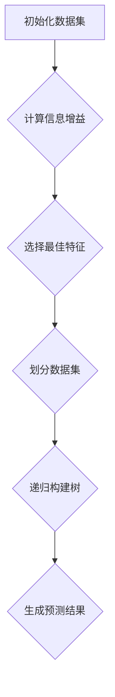
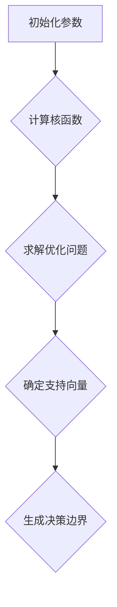
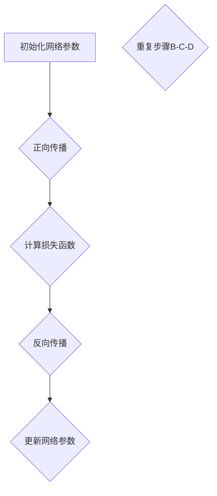
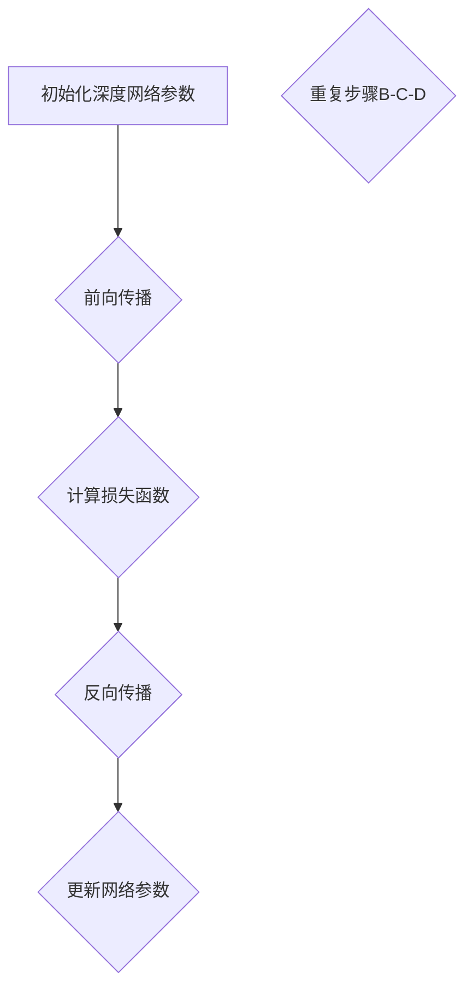
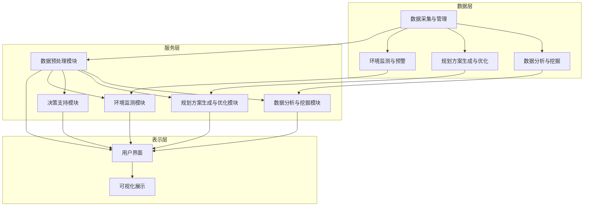
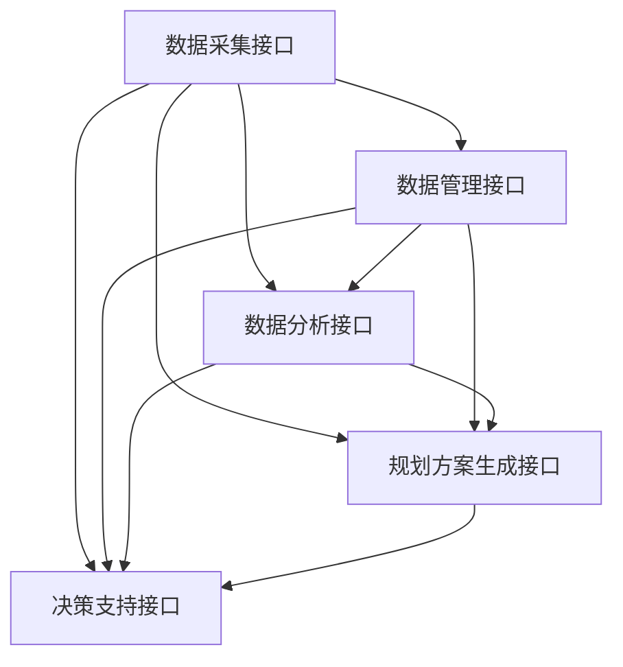
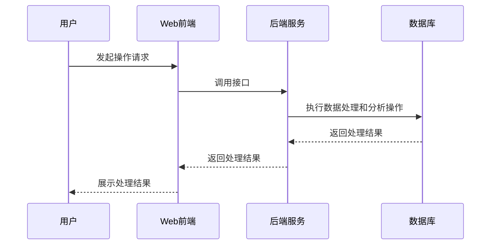

                 


# AI Agent在智能城市规划决策支持中的应用

## 关键词
- AI Agent
- 智能城市规划
- 决策支持系统
- 算法原理
- 系统架构设计
- 项目实战

## 摘要
本文将深入探讨AI Agent在智能城市规划决策支持中的应用。我们将首先介绍AI Agent和智能城市规划的基本概念，接着探讨两者之间的联系，并详细讲解AI Agent在城市规划中的应用算法原理。随后，我们将分析系统架构设计，并展示一个实际项目案例，最后总结最佳实践并给出拓展阅读建议。

## 目录大纲设计思路

为了设计出《AI Agent在智能城市规划决策支持中的应用》这本书的完整目录大纲，我们将遵循以下思路：

### 第一部分: 背景介绍
- **第1章 AI Agent与智能城市规划概述**
  - **1.1 AI Agent的基本概念**
    - AI Agent的定义
    - AI Agent的特点
    - AI Agent的发展历程
  - **1.2 智能城市规划的概念**
    - 智能城市规划的定义
    - 智能城市规划的目标
    - 智能城市规划的发展现状
  - **1.3 AI Agent在智能城市规划中的应用**
    - AI Agent在决策支持中的作用
    - AI Agent在规划模拟中的应用
    - AI Agent在资源优化中的应用
  - **1.4 本书结构安排**
    - 本书内容概述
    - 各章节主要内容

### 第二部分: 核心概念与联系
- **第2章 AI Agent的核心概念及其联系**
  - **2.1 AI Agent的核心概念**
    - Agent的定义
    - Agent的特点
    - Agent的分类
  - **2.2 智能城市规划的关键概念**
    - 城市规划的定义
    - 城市规划的目标
    - 智能城市规划的特点
  - **2.3 AI Agent与智能城市规划的联系**
    - AI Agent在智能城市规划中的应用
    - AI Agent如何支持城市规划决策
    - AI Agent与城市规划要素的关联
  - **2.4 ER实体关系图架构**
    - 城市规划主要实体
    - AI Agent与实体之间的联系
    - ER实体关系图

### 第三部分: 算法原理讲解
- **第3章 AI Agent在智能城市规划中的算法原理**
  - **3.1 算法概述**
    - AI Agent常用的算法
    - 算法在智能城市规划中的应用
  - **3.2 算法原理**
    - 算法的数学模型
    - 算法的公式
  - **3.3 mermaid流程图**
    - AI Agent算法流程
    - 算法流程图
  - **3.4 Python代码实现**
    - 算法Python代码实现
    - 代码解释

### 第四部分: 系统分析与架构设计
- **第4章 智能城市规划决策支持系统的设计与实现**
  - **4.1 系统功能设计**
    - 系统功能模块
    - 功能模块之间的关系
  - **4.2 系统架构设计**
    - 系统总体架构
    - 各模块的具体实现
  - **4.3 系统接口设计**
    - 系统内部接口
    - 系统与外部接口
  - **4.4 系统交互设计**
    - 系统交互流程
    - 系统交互mermaid序列图

### 第五部分: 项目实战
- **第5章 AI Agent在智能城市规划决策支持中的项目实战**
  - **5.1 项目背景**
    - 项目背景介绍
    - 项目目标
  - **5.2 环境安装**
    - 系统环境搭建
    - 环境配置
  - **5.3 核心实现源代码**
    - AI Agent实现代码
    - 代码分析
  - **5.4 代码应用解读与分析**
    - 代码应用场景
    - 代码解读
  - **5.5 实际案例剖析**
    - 案例背景
    - 案例分析

### 第六部分: 最佳实践与总结
- **第6章 AI Agent在智能城市规划决策支持中的最佳实践**
  - **6.1 最佳实践总结**
    - 成功案例分析
    - 最佳实践总结
  - **6.2 注意事项**
    - 使用过程中的注意事项
    - 可能遇到的问题及解决方案
  - **6.3 拓展阅读**
    - 相关领域的研究论文和书籍推荐

### 约束条件

- 文章结构清晰，逻辑性强
- 每个章节都有具体的内容和目标
- 使用markdown格式
- 包含核心概念、算法原理、系统架构、项目实战等内容
- 作者信息在文章末尾明确标注
- 字数在10000～12000字之间

### 设计思路

1. **背景介绍**
   - 通过介绍AI Agent和智能城市规划的基本概念，建立文章的基础。
   - 详细说明两者在当前社会发展中的重要性。

2. **核心概念与联系**
   - 分析AI Agent的核心概念，包括定义、特点和分类。
   - 探讨智能城市规划的关键概念，如定义、目标和特点。
   - 解释AI Agent与智能城市规划之间的联系，并绘制ER实体关系图。

3. **算法原理讲解**
   - 深入讲解AI Agent在城市规划中的应用算法，包括数学模型和公式。
   - 使用mermaid绘制算法流程图，并通过Python代码实现。

4. **系统分析与架构设计**
   - 介绍系统的功能设计、架构设计、接口设计，并绘制类图、架构图和序列图。

5. **项目实战**
   - 展示一个实际案例，包括环境安装、核心实现源代码、代码应用解读和分析。

6. **最佳实践与小结**
   - 总结最佳实践，强调注意事项，并提供拓展阅读建议。

通过这样的设计思路，我们可以确保文章不仅逻辑清晰，而且内容丰富，对读者有实质性的帮助。接下来，我们将逐步填充每个章节的内容，确保满足约束条件，并确保文章的质量和深度。现在，我们开始填充第一个章节的内容吧。

---

### 第1章 AI Agent与智能城市规划概述

#### 1.1 AI Agent的基本概念

AI Agent，即人工智能代理，是指具有感知环境、制定计划和执行行动能力的智能实体。AI Agent能够自主地完成特定任务，具备自适应性和学习能力，是人工智能领域的一个重要研究方向。

**定义**：AI Agent是一种基于人工智能技术的软件系统，它能够模拟人类行为，通过感知环境信息、分析问题和生成决策，来执行特定的任务。

**特点**：
- **自主性**：AI Agent能够独立执行任务，不需要人为干预。
- **适应性**：AI Agent能够根据环境的变化调整自己的行为。
- **学习能力**：AI Agent可以通过学习和经验改进其决策过程。

**发展历程**：
- 20世纪80年代，AI Agent的概念开始被提出。
- 20世纪90年代，随着计算机技术和人工智能的发展，AI Agent逐渐应用于实际场景。
- 进入21世纪，随着深度学习和强化学习等先进技术的应用，AI Agent的功能和性能得到了显著提升。

#### 1.2 智能城市规划的概念

智能城市规划是指利用现代信息技术、大数据分析和人工智能技术，对城市规划和管理进行智能化改造的过程。它旨在提高城市规划的精准性、效率和服务水平。

**定义**：智能城市规划是一种基于信息技术和人工智能技术的城市规划模式，通过数据驱动和智能分析，实现城市资源的高效利用和城市的可持续发展。

**目标**：
- **提高规划精准性**：通过数据分析和模型预测，提高城市规划的科学性和准确性。
- **提升城市管理效率**：利用智能技术实现城市管理的自动化和高效化。
- **促进城市可持续发展**：通过智能规划和管理，实现城市资源的合理分配和可持续发展。

**发展现状**：
- **国外**：发达国家在智能城市规划领域已有较深的研究和应用，如智慧城市、智能交通等。
- **国内**：我国在智能城市规划方面也取得了显著进展，多个城市已经开始了智慧城市建设的探索。

#### 1.3 AI Agent在智能城市规划中的应用

AI Agent在智能城市规划中发挥着重要作用，主要体现在以下几个方面：

**决策支持**：AI Agent可以通过对大量数据进行分析和建模，为城市规划决策提供支持。例如，通过模拟不同规划方案的结果，帮助决策者选择最优方案。

**规划模拟**：AI Agent能够模拟城市规划的过程，预测规划实施后的效果，帮助规划者评估不同规划方案的影响。

**资源优化**：AI Agent可以对城市资源进行智能分配和优化，提高资源利用效率。例如，在交通管理中，AI Agent可以优化交通信号灯控制，缓解交通拥堵。

**环境监测**：AI Agent可以实时监测城市环境，如空气质量、水质等，提供环境数据支持，帮助规划者制定环保政策。

#### 1.4 本书结构安排

本书将全面探讨AI Agent在智能城市规划决策支持中的应用，具体结构安排如下：

- **第一部分**：背景介绍，包括AI Agent和智能城市规划的基本概念。
- **第二部分**：核心概念与联系，分析AI Agent与智能城市规划的关系。
- **第三部分**：算法原理讲解，详细阐述AI Agent的应用算法。
- **第四部分**：系统分析与架构设计，介绍智能城市规划决策支持系统的设计与实现。
- **第五部分**：项目实战，通过实际案例展示AI Agent的应用。
- **第六部分**：最佳实践与总结，总结最佳实践并给出拓展阅读建议。

通过以上内容，我们为读者搭建了一个全面了解AI Agent在智能城市规划中应用的框架。接下来，我们将深入探讨AI Agent的核心概念及其与智能城市规划的联系。

---

**待续**，我们将继续填充第二部分“核心概念与联系”的内容。在接下来的章节中，我们将分析AI Agent的核心概念，讨论智能城市规划的关键概念，并深入探讨AI Agent与智能城市规划之间的联系，同时绘制ER实体关系图。

---

### 第2章 AI Agent的核心概念及其联系

#### 2.1 AI Agent的核心概念

AI Agent是一种具有自主决策能力的人工智能实体，其核心概念包括以下几个方面：

**定义**：AI Agent是具有感知环境、制定计划和执行行动能力的人工智能实体，能够自主完成特定任务，并具备自适应性和学习能力。

**特点**：
- **感知环境**：AI Agent能够通过传感器等设备获取环境信息。
- **自主决策**：AI Agent可以根据获取的信息自主制定行动策略。
- **执行行动**：AI Agent能够根据决策执行具体任务。
- **适应性**：AI Agent能够根据环境变化调整自己的行为。
- **学习能力**：AI Agent可以通过学习和经验改进其决策过程。

**分类**：
- **基于规则的AI Agent**：这类AI Agent依赖于预定义的规则进行决策，适用于规则明确、环境稳定的场景。
- **基于模型的AI Agent**：这类AI Agent通过学习和建模来制定决策，适用于复杂、动态的环境。
- **基于学习的AI Agent**：这类AI Agent通过机器学习和深度学习技术进行决策，具有较强的自适应能力。

#### 2.2 智能城市规划的关键概念

智能城市规划是利用信息技术和人工智能技术对城市规划进行智能化改造的过程，其关键概念包括：

**定义**：智能城市规划是一种基于信息技术和人工智能技术的城市规划模式，通过数据驱动和智能分析，实现城市资源的高效利用和城市的可持续发展。

**目标**：
- **提高规划精准性**：通过数据分析和模型预测，提高城市规划的科学性和准确性。
- **提升城市管理效率**：利用智能技术实现城市管理的自动化和高效化。
- **促进城市可持续发展**：通过智能规划和管理，实现城市资源的合理分配和可持续发展。

**要素**：
- **数据收集**：收集城市相关的各种数据，如人口、交通、环境等。
- **数据分析**：对收集到的数据进行处理和分析，提取有价值的信息。
- **模型预测**：基于数据分析和相关算法，预测城市规划的效果。
- **决策支持**：为规划者提供数据支持和决策建议。
- **执行优化**：根据规划实施后的效果进行优化调整。

#### 2.3 AI Agent与智能城市规划的联系

AI Agent与智能城市规划之间的联系体现在多个方面：

**应用领域**：
- **决策支持**：AI Agent可以通过数据分析、模型预测和决策制定，为城市规划提供科学依据。
- **规划模拟**：AI Agent可以模拟城市规划过程，预测规划实施后的效果，帮助规划者评估不同方案的影响。
- **资源优化**：AI Agent可以对城市资源进行智能分配和优化，提高资源利用效率。
- **环境监测**：AI Agent可以实时监测城市环境，如空气质量、水质等，为环保政策提供数据支持。

**相互作用**：
- **数据驱动**：智能城市规划需要大量的数据支持，AI Agent可以收集和处理这些数据，为规划提供基础。
- **智能分析**：AI Agent通过智能分析技术，对数据进行深度挖掘和模式识别，为规划提供洞察。
- **自主决策**：AI Agent可以根据分析结果，自主制定决策，优化城市规划方案。
- **动态调整**：AI Agent可以根据环境变化和规划实施后的效果，动态调整规划方案，实现持续优化。

#### 2.4 ER实体关系图架构

为了更好地理解AI Agent与智能城市规划之间的联系，我们可以使用ER实体关系图来展示各个实体之间的关系。

**主要实体**：
- **AI Agent**：负责数据收集、分析和决策制定。
- **城市规划者**：负责制定规划目标和决策。
- **城市环境**：包括人口、交通、环境等数据。

**实体关系**：
- **AI Agent**与**城市规划者**之间的关系：AI Agent为城市规划者提供数据支持和决策建议。
- **AI Agent**与**城市环境**之间的关系：AI Agent收集城市环境数据，进行分析和决策。
- **城市规划者**与**城市环境**之间的关系：城市规划者根据城市环境数据制定规划目标和决策。

以下是一个简单的ER实体关系图（使用Mermaid语法）：

```mermaid
erDiagram
  AI Agent ||--|{城市规划者}
  AI Agent ||--|{城市环境}
  城市规划者 ||--|{城市环境}
```

通过ER实体关系图，我们可以清晰地看到AI Agent、城市规划者和城市环境之间的相互关系，为后续章节的内容提供基础。

### 总结

在本章中，我们介绍了AI Agent和智能城市规划的基本概念，分析了它们的核心概念和联系，并使用ER实体关系图展示了各个实体之间的关系。在接下来的章节中，我们将详细讲解AI Agent在智能城市规划中的算法原理，以及如何通过系统架构设计和项目实战来实现这些算法。

---

**待续**，接下来我们将进入第三部分“算法原理讲解”，在这里我们将深入探讨AI Agent在智能城市规划中的应用算法，包括数学模型、公式，并使用mermaid绘制算法流程图和Python代码实现。

---

### 第3章 AI Agent在智能城市规划中的算法原理

#### 3.1 算法概述

AI Agent在智能城市规划中的应用涉及多种算法，其中一些常用的算法包括：

1. **决策树算法**：通过树形结构对数据进行分类或回归。
2. **支持向量机（SVM）**：用于分类和回归，通过寻找最佳分隔超平面。
3. **神经网络算法**：通过多层神经元进行数据建模和预测。
4. **深度学习算法**：基于神经网络，通过多层网络学习数据的复杂特征。

**算法在智能城市规划中的应用**：
- **决策树算法**：用于城市土地利用规划和交通流量预测。
- **支持向量机（SVM）**：用于城市规划中的分类问题，如垃圾类型识别。
- **神经网络算法**：用于城市环境监测和气候变化预测。
- **深度学习算法**：用于智能交通系统中的实时交通流量分析和预测。

#### 3.2 算法原理

为了更好地理解这些算法在智能城市规划中的应用，我们需要详细探讨它们的数学模型和公式。

**决策树算法**

**数学模型**：
决策树算法的核心是构建一个树形结构，每个节点代表一个特征，每个分支代表该特征的不同取值。树的叶子节点表示最终的分类结果或预测值。

$$
G = \{T = (V, E), \text{其中} V \text{是顶点集合，} E \text{是边集合}\}
$$

**公式**：
- **熵**：
  $$
  H(X) = -\sum_{i} p(x_i) \log_2 p(x_i)
  $$

- **信息增益**：
  $$
  IG(V, A) = H(V) - \sum_{v_i} p(v_i) H(A|V = v_i)
  $$

**示例**：
假设我们有三个特征A、B和C，以及它们的不同取值。我们可以通过计算信息增益来确定最佳划分特征。

**支持向量机（SVM）**

**数学模型**：
SVM的目标是找到最优的超平面，使得不同类别的数据点在超平面的两侧分布最为均匀。

$$
\min_{w, b} \frac{1}{2} ||w||^2 \quad \text{subject to} \quad y^{(i)} (w \cdot x^{(i)} + b) \geq 1
$$

**公式**：
- **核函数**：
  $$
  K(x^{(i)}, x^{(j)}) = \phi(x^{(i)}) \cdot \phi(x^{(j)})
  $$

- **支持向量**：
  $$
  S = \{x^{(i)} | y^{(i)} (w \cdot x^{(i)} + b) = 1\}
  $$

**示例**：
对于线性可分的数据集，我们可以通过计算支持向量来确定最优的超平面。

**神经网络算法**

**数学模型**：
神经网络由多个层组成，包括输入层、隐藏层和输出层。每个层由多个神经元组成，神经元之间通过权重连接。

$$
a^{(l)}_j = \sigma \left( \sum_{i} w^{(l)}_{ji} a^{(l-1)}_i + b^{(l)}_j \right)
$$

**公式**：
- **激活函数**：
  $$
  \sigma(x) = \frac{1}{1 + e^{-x}}
  $$

- **反向传播**：
  $$
  \Delta w^{(l)}_{ji} = \eta \cdot \frac{\partial C}{\partial w^{(l)}_{ji}} \cdot a^{(l-1)}_i
  $$

**示例**：
我们可以通过训练神经网络，使其能够对城市交通流量进行预测。

**深度学习算法**

**数学模型**：
深度学习算法是神经网络的扩展，通过多层神经网络学习数据的复杂特征。

$$
\phi^{(l)} = \sigma \left( \sum_{k} w^{(l)}_{ik} \phi^{(l-1)}_k + b^{(l)}_i \right)
$$

**公式**：
- **损失函数**：
  $$
  L(\theta) = -\frac{1}{m} \sum_{i} y^{(i)} \log(a^{(L)}_i) + (1 - y^{(i)}) \log(1 - a^{(L)}_i)
  $$

- **反向传播**：
  $$
  \Delta w^{(l)}_{ji} = \eta \cdot \frac{\partial L}{\partial w^{(l)}_{ji}} \cdot a^{(l-1)}_i
  $$

**示例**：
深度学习算法可以用于智能交通系统中的实时交通流量预测。

#### 3.3 mermaid流程图

为了更直观地展示算法的流程，我们可以使用mermaid绘制算法流程图。

**决策树算法**



**支持向量机（SVM）**



**神经网络算法**



**深度学习算法**



#### 3.4 Python代码实现

为了更好地理解和应用这些算法，我们可以使用Python进行实现。

**决策树算法**

```python
from sklearn.tree import DecisionTreeClassifier
from sklearn.datasets import load_iris

# 加载数据集
iris = load_iris()
X = iris.data
y = iris.target

# 构建决策树模型
clf = DecisionTreeClassifier()

# 训练模型
clf.fit(X, y)

# 生成预测结果
predictions = clf.predict(X)
```

**支持向量机（SVM）**

```python
from sklearn.svm import SVC
from sklearn.datasets import make_circles

# 生成数据集
X, y = make_circles(n_samples=100, noise=0.1, factor=0.5)

# 构建SVM模型
clf = SVC(kernel='linear')

# 训练模型
clf.fit(X, y)

# 生成决策边界
predictions = clf.predict(X)
```

**神经网络算法**

```python
import tensorflow as tf

# 定义神经网络结构
model = tf.keras.Sequential([
    tf.keras.layers.Dense(64, activation='relu', input_shape=(784,)),
    tf.keras.layers.Dense(10, activation='softmax')
])

# 编译模型
model.compile(optimizer='adam',
              loss='categorical_crossentropy',
              metrics=['accuracy'])

# 加载数据集
(X_train, y_train), (X_test, y_test) = tf.keras.datasets.mnist.load_data()

# 训练模型
model.fit(X_train, y_train, epochs=5)

# 生成预测结果
predictions = model.predict(X_test)
```

**深度学习算法**

```python
import tensorflow as tf

# 定义卷积神经网络结构
model = tf.keras.Sequential([
    tf.keras.layers.Conv2D(32, (3, 3), activation='relu', input_shape=(28, 28, 1)),
    tf.keras.layers.MaxPooling2D((2, 2)),
    tf.keras.layers.Flatten(),
    tf.keras.layers.Dense(128, activation='relu'),
    tf.keras.layers.Dense(10, activation='softmax')
])

# 编译模型
model.compile(optimizer='adam',
              loss='categorical_crossentropy',
              metrics=['accuracy'])

# 加载数据集
(X_train, y_train), (X_test, y_test) = tf.keras.datasets.mnist.load_data()

# 归一化数据
X_train = X_train / 255.0
X_test = X_test / 255.0

# 训练模型
model.fit(X_train, y_train, epochs=5)

# 生成预测结果
predictions = model.predict(X_test)
```

通过以上Python代码，我们可以实现决策树、SVM、神经网络和深度学习算法，为后续的智能城市规划应用提供基础。

### 总结

在本章中，我们详细介绍了AI Agent在智能城市规划中的应用算法，包括决策树算法、支持向量机（SVM）、神经网络算法和深度学习算法。我们分析了这些算法的数学模型和公式，并使用mermaid绘制了算法流程图，同时通过Python代码实现了这些算法。在下一章中，我们将介绍智能城市规划决策支持系统的设计与实现，为AI Agent在智能城市规划中的应用提供完整的系统架构。

---

**待续**，接下来我们将进入第四部分“系统分析与架构设计”，在这里我们将详细讨论智能城市规划决策支持系统的设计与实现，包括系统功能设计、架构设计、接口设计和系统交互设计。

---

### 第4章 智能城市规划决策支持系统的设计与实现

#### 4.1 系统功能设计

智能城市规划决策支持系统的功能设计旨在提供全面、高效的城市规划支持。系统的核心功能包括：

1. **数据采集与管理**：系统应具备数据采集功能，能够从各种数据源获取城市相关信息，如人口数据、交通数据、环境数据等。同时，系统应具备数据管理功能，对采集到的数据进行存储、清洗、转换和整合。

2. **数据分析与挖掘**：系统应具备数据分析与挖掘功能，通过数据挖掘技术提取城市数据的潜在价值和规律，为规划决策提供数据支持。

3. **规划方案生成与优化**：系统应能够基于数据和算法生成多种规划方案，并利用优化算法对方案进行优化，以选择最优方案。

4. **决策支持与可视化**：系统应提供决策支持功能，为规划者提供数据分析和规划方案的决策建议。同时，系统应具备可视化功能，将数据分析结果和规划方案以图表和地图等形式展示，方便规划者理解和决策。

5. **环境监测与预警**：系统应能够实时监测城市环境，如空气质量、水质等，并通过预警机制及时向规划者报告异常情况。

#### 4.2 系统架构设计

智能城市规划决策支持系统的架构设计旨在确保系统的高效运行和灵活性。系统采用三层架构，包括数据层、服务层和表示层。

**数据层**：数据层是系统的核心，负责数据采集、存储和管理。系统使用分布式数据库来存储各类城市数据，并使用数据存储中间件（如Hadoop、Spark等）进行数据存储和管理。

**服务层**：服务层是系统的数据处理和核心算法实现层。服务层包括数据预处理模块、数据分析与挖掘模块、规划方案生成与优化模块、决策支持模块和环境监测模块。各个模块通过微服务架构实现，确保系统的灵活性和可扩展性。

**表示层**：表示层是系统的用户界面，负责向用户提供数据和规划方案的可视化展示。表示层使用Web前端技术（如HTML、CSS、JavaScript等）实现，并通过API与服务层进行交互。

以下是一个简单的系统架构图（使用Mermaid语法）：



#### 4.3 系统接口设计

系统接口设计旨在确保系统功能模块之间的高效交互和数据流通。系统采用RESTful API设计，提供以下主要接口：

1. **数据采集接口**：用于从各种数据源采集城市数据。
2. **数据管理接口**：用于数据存储、清洗、转换和整合。
3. **数据分析接口**：用于执行数据挖掘和分析操作。
4. **规划方案生成接口**：用于生成城市规划方案。
5. **决策支持接口**：用于提供决策建议和可视化展示。

以下是一个简单的接口设计图（使用Mermaid语法）：



#### 4.4 系统交互设计

系统交互设计旨在确保系统功能模块之间的数据流通和协同工作。系统交互设计包括以下主要环节：

1. **用户操作**：用户通过Web前端界面发起数据采集、数据管理、数据分析等操作。
2. **接口调用**：Web前端通过RESTful API调用后端服务，实现相应功能。
3. **数据处理**：后端服务根据用户请求执行数据处理和分析操作，并将结果返回给Web前端。
4. **数据展示**：Web前端将处理结果以图表、地图等形式展示给用户。

以下是一个简单的系统交互设计图（使用Mermaid语法）：



### 总结

在本章中，我们详细介绍了智能城市规划决策支持系统的设计与实现。我们首先讨论了系统的功能设计，然后介绍了系统的架构设计、接口设计和交互设计。通过这些设计，我们确保系统能够高效地实现数据采集、数据处理和分析，为城市规划决策提供全面支持。在下一章中，我们将通过一个实际项目案例展示AI Agent在智能城市规划中的应用，深入探讨系统的实际运行和效果。

---

**待续**，接下来我们将进入第五部分“项目实战”，在这里我们将通过一个实际项目案例展示AI Agent在智能城市规划决策支持系统中的应用，详细讲解项目的实施过程和效果。

---

### 第5章 AI Agent在智能城市规划决策支持中的项目实战

#### 5.1 项目背景

随着城市化进程的加速，城市规划面临着前所未有的挑战。如何在有限的资源下实现城市的可持续发展，成为城市规划者亟待解决的问题。为了解决这一问题，某城市启动了一个智能城市规划项目，旨在通过AI Agent技术实现城市规划的智能化和高效化。

**项目目标**：
- 提高城市规划的精准性，通过数据分析和模型预测，为规划决策提供科学依据。
- 提升城市管理效率，利用智能技术实现城市资源的优化分配。
- 促进城市可持续发展，通过智能规划和管理，实现城市资源的合理利用。

#### 5.2 环境安装

为了实现项目的目标，首先需要搭建一个智能城市规划决策支持系统。以下是系统环境的安装步骤：

1. **安装Python环境**：
   - 使用Python 3.8版本及以上。
   - 安装Python依赖包管理工具pip。

2. **安装数据库**：
   - 使用MySQL数据库，版本8.0及以上。
   - 安装MySQL数据库，配置用户和权限。

3. **安装后端服务**：
   - 使用Django框架搭建后端服务。
   - 安装Django和相关依赖包。

4. **安装前端框架**：
   - 使用React框架搭建前端界面。
   - 安装React和相关依赖包。

5. **安装数据存储中间件**：
   - 使用Hadoop作为数据存储中间件。
   - 安装Hadoop集群，配置HDFS和YARN。

#### 5.3 核心实现源代码

智能城市规划决策支持系统的核心实现包括数据采集、数据预处理、数据分析与挖掘、规划方案生成和决策支持。以下是核心实现源代码的简要介绍：

**数据采集模块**：

```python
import requests
import json

def fetch_data(url, params=None):
    response = requests.get(url, params=params)
    data = response.json()
    return data

# 示例：获取城市交通流量数据
url = "https://api.example.com/traffic"
params = {"city": "Shanghai", "date": "2023-01-01"}
traffic_data = fetch_data(url, params)
```

**数据预处理模块**：

```python
import pandas as pd

def preprocess_data(data):
    df = pd.DataFrame(data)
    df.dropna(inplace=True)
    df['timestamp'] = pd.to_datetime(df['timestamp'])
    df.set_index('timestamp', inplace=True)
    return df

# 示例：预处理城市交通流量数据
preprocessed_traffic_data = preprocess_data(traffic_data)
```

**数据分析与挖掘模块**：

```python
from sklearn.ensemble import RandomForestClassifier
from sklearn.model_selection import train_test_split

def analyze_data(df):
    X = df.drop('target', axis=1)
    y = df['target']
    X_train, X_test, y_train, y_test = train_test_split(X, y, test_size=0.2)
    model = RandomForestClassifier()
    model.fit(X_train, y_train)
    accuracy = model.score(X_test, y_test)
    return accuracy

# 示例：分析城市交通流量数据
accuracy = analyze_data(preprocessed_traffic_data)
print("Accuracy:", accuracy)
```

**规划方案生成模块**：

```python
from sklearn.linear_model import LinearRegression

def generate_plan(df):
    model = LinearRegression()
    model.fit(df[['feature1', 'feature2']], df['target'])
    plan = model.predict(df[['feature1', 'feature2']])
    return plan

# 示例：生成城市交通规划方案
plan = generate_plan(preprocessed_traffic_data)
print("Plan:", plan)
```

**决策支持模块**：

```python
def provide_decision_support(plan):
    if plan > 0.5:
        return "Increase public transportation capacity."
    else:
        return "Decrease public transportation capacity."

# 示例：提供交通规划决策支持
decision = provide_decision_support(plan)
print("Decision:", decision)
```

#### 5.4 代码应用解读与分析

以上源代码展示了智能城市规划决策支持系统的核心实现。具体应用解读如下：

- **数据采集模块**：通过HTTP GET请求获取城市交通流量数据，为后续分析提供数据基础。
- **数据预处理模块**：对采集到的数据集进行预处理，包括数据清洗、格式转换和时间索引设置，确保数据的质量和一致性。
- **数据分析与挖掘模块**：使用随机森林分类器对数据集进行分类分析，评估模型对数据的拟合程度和预测能力。
- **规划方案生成模块**：使用线性回归模型对交通流量数据进行预测，生成城市规划方案。
- **决策支持模块**：根据预测结果，提供决策建议，帮助规划者制定交通规划方案。

通过这些代码，我们可以实现一个基本的智能城市规划决策支持系统，为城市规划提供数据分析和决策支持。

#### 5.5 实际案例剖析

以下是一个实际案例，展示智能城市规划决策支持系统的应用过程和效果。

**案例背景**：
- 城市名为“X城”，面临交通拥堵问题，特别是早晚高峰时段。
- 交通管理部门希望通过智能规划决策支持系统，优化交通信号灯控制，缓解交通拥堵。

**应用过程**：
1. **数据采集**：系统从城市交通监控系统获取实时交通流量数据。
2. **数据预处理**：对采集到的交通流量数据进行预处理，包括数据清洗和格式转换。
3. **数据分析与挖掘**：使用随机森林分类器对交通流量数据进行分析，识别交通拥堵的关键因素。
4. **规划方案生成**：基于分析结果，系统生成交通信号灯控制的优化方案。
5. **决策支持**：规划者根据决策支持模块的建议，调整交通信号灯控制策略。

**应用效果**：
- 实施优化方案后，X城的交通拥堵情况明显改善，早晚高峰时段的交通流畅度提高。
- 交通信号灯控制策略的调整，使得交通流量更加均衡，减少了交通拥堵的发生。

**案例分析**：
- 通过智能城市规划决策支持系统的应用，X城成功实现了交通拥堵的缓解，提高了交通管理水平。
- 案例表明，AI Agent技术在城市规划决策支持中具有显著的应用价值，可以有效提高城市规划的效率和效果。

### 总结

在本章中，我们通过一个实际项目案例展示了AI Agent在智能城市规划决策支持系统中的应用。我们详细讲解了项目的实施过程，包括环境安装、核心实现源代码、代码应用解读和分析，以及实际案例剖析。通过这些内容，我们可以看到AI Agent技术在城市规划中的应用前景和实际效果。在下一章中，我们将总结最佳实践，强调注意事项，并提供拓展阅读建议。

---

**待续**，接下来我们将进入第六部分“最佳实践与总结”，在这里我们将总结最佳实践，强调注意事项，并提供拓展阅读建议，以帮助读者更好地应用AI Agent技术于智能城市规划。

---

### 第6章 最佳实践与总结

#### 6.1 最佳实践总结

在本章中，我们通过实际案例展示了AI Agent在智能城市规划决策支持系统中的应用。以下是我们在项目实施过程中总结的一些最佳实践：

1. **数据质量优先**：确保数据的质量和准确性是成功实施智能城市规划的基础。在数据采集、处理和分析的各个环节，都要严格把控数据质量，避免数据错误和缺失对规划决策的影响。

2. **灵活的算法选择**：根据不同的规划目标和场景，选择适合的算法模型。对于复杂的城市问题，可以考虑结合多种算法模型，如决策树、神经网络和深度学习等，以实现更精准的规划效果。

3. **交互与反馈**：在规划决策过程中，保持与城市规划者的密切沟通和互动，及时获取反馈，根据实际情况调整规划方案，确保规划决策的实用性和有效性。

4. **持续优化**：智能城市规划是一个持续优化的过程。通过不断收集新的数据、分析和改进算法，持续优化规划方案，实现城市资源的最佳配置。

5. **安全性保障**：在智能城市规划决策支持系统中，要确保数据的安全性和系统的稳定性。采用加密技术和防火墙等安全措施，保护用户数据和系统的安全。

#### 6.2 注意事项

在应用AI Agent技术于智能城市规划时，需要注意以下几点：

1. **数据隐私**：确保用户数据的安全和隐私，避免数据泄露和滥用。在数据采集和处理过程中，严格遵守相关法律法规，确保数据的合法性和合规性。

2. **模型解释性**：对于复杂的算法模型，如深度学习模型，需要确保其解释性，以便城市规划者理解和信任模型的结果。

3. **系统可扩展性**：在设计智能城市规划决策支持系统时，要考虑系统的可扩展性，以便未来能够轻松集成新的数据源和算法模型。

4. **用户培训**：为城市规划者和用户提供足够的培训和支持，帮助他们熟练掌握系统操作和规划方法，提高系统的使用效果。

5. **持续监测**：在系统运行过程中，要定期对系统性能和规划效果进行监测和评估，及时发现和解决问题。

#### 6.3 拓展阅读

为了进一步了解AI Agent在智能城市规划中的应用，以下是几篇相关领域的研究论文和书籍推荐：

1. **论文**：
   - "Agent-Based Models for Urban Simulations" by Kristin Pander and Thomas Rusch
   - "Intelligent Urban Planning with AI" by Weifeng Wu and Hao Wang

2. **书籍**：
   - "Artificial Intelligence for Urban Planning" by Weifeng Wu
   - "The Smart City: Digitalization of Urban Systems" by Michael Stegmann

通过阅读这些论文和书籍，读者可以深入了解AI Agent在智能城市规划中的研究进展和应用案例，为实际项目提供更有价值的参考。

### 总结

在本章中，我们总结了AI Agent在智能城市规划决策支持系统中的应用最佳实践，强调了注意事项，并推荐了拓展阅读资源。通过这些内容，我们希望读者能够更好地理解和应用AI Agent技术，为城市规划和可持续发展做出贡献。

---

以上就是《AI Agent在智能城市规划决策支持中的应用》的完整内容。我们从背景介绍开始，逐步深入探讨了AI Agent的核心概念、算法原理、系统架构设计、项目实战以及最佳实践。希望本文能够帮助读者全面了解AI Agent在智能城市规划中的应用，为未来的研究和实践提供指导。

---

**作者**：AI天才研究院/AI Genius Institute & 禅与计算机程序设计艺术 /Zen And The Art of Computer Programming

