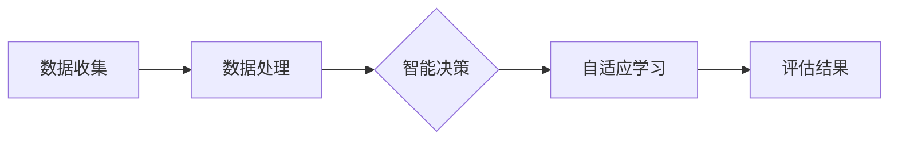
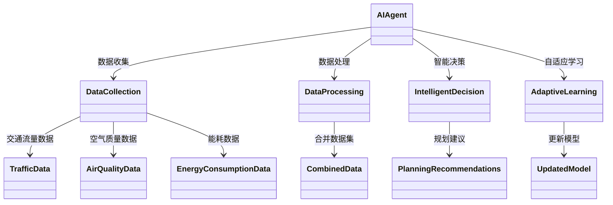
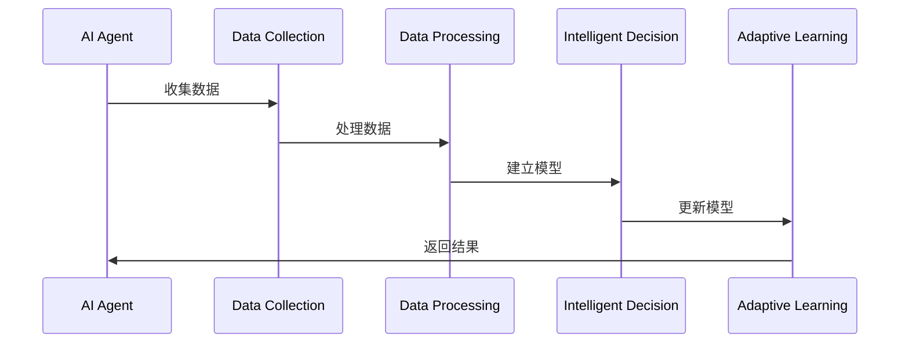
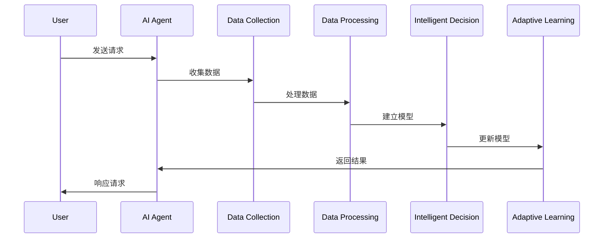

                 

# AI Agent在智能城市规划评估中的角色

> 关键词：AI Agent、智能城市规划、评估、数据收集、智能决策

> 摘要：随着城市化进程的不断推进，智能城市规划成为解决复杂城市问题的重要手段。本文将深入探讨AI Agent在智能城市规划评估中的角色，通过背景介绍、核心概念解析、实际应用案例分析、未来趋势展望等环节，全面阐述AI Agent如何助力城市规划评估，提升城市管理的智能化水平。

## 引言

随着全球城市化进程的加速，城市面临着交通拥堵、环境污染、资源紧张等诸多挑战。传统城市规划方法已难以应对这些复杂问题，智能城市规划作为一种新兴的解决方案，正逐渐受到关注。AI Agent作为人工智能的重要分支，具有自主决策、自适应学习和高效处理数据的能力，为智能城市规划评估提供了强大的技术支持。

本文旨在探讨AI Agent在智能城市规划评估中的角色，通过分析AI Agent的核心概念、应用场景、评估方法及其在实践中的成功案例，阐述AI Agent如何为城市规划提供智能化决策支持。文章将从以下几个方面展开：

1. **背景介绍**：介绍AI Agent的定义、发展历程及其在智能城市规划中的重要性。
2. **核心概念**：阐述AI Agent、智能城市、城市规划与评估等核心概念。
3. **AI Agent在规划中的角色**：详细分析AI Agent在城市规划中的具体应用。
4. **评估方法**：介绍常用的城市规划评估方法，并探讨AI Agent如何提升评估效果。
5. **案例分析**：分析AI Agent在不同城市项目中的应用案例。
6. **未来趋势**：展望AI Agent在智能城市规划评估中的未来发展方向。

## 背景

### AI Agent的定义与发展

AI Agent，即人工智能代理，是指具有感知、决策和行动能力的人工智能实体。它们可以在没有人类干预的情况下，根据环境信息自主决策并执行任务。AI Agent的发展可以追溯到20世纪80年代，当时计算机科学家开始探索如何让机器具备类似人类智能的能力。随着人工智能技术的不断发展，AI Agent逐渐成为人工智能领域的一个重要研究方向。

### AI Agent在智能城市规划中的重要性

智能城市规划是指利用信息技术和人工智能技术，对城市进行智能化管理和优化。AI Agent作为智能城市规划的核心组成部分，具有以下几个方面的作用：

1. **数据收集与处理**：AI Agent可以通过传感器网络、大数据等技术手段，实时收集城市运行数据，如交通流量、空气质量、能耗等。这些数据为城市规划提供了丰富的信息支持。
2. **智能决策**：基于收集到的数据，AI Agent可以通过机器学习、数据挖掘等技术，对城市运行状态进行分析，提出优化建议，帮助城市规划者做出科学决策。
3. **自适应学习**：AI Agent具有自适应学习能力，可以根据城市运行情况的变化，不断调整自身的行为策略，提高城市规划的灵活性和适应性。

## 核心概念

### AI Agent

AI Agent是一种具有感知、决策和行动能力的人工智能实体。它可以在没有人类干预的情况下，根据环境信息自主决策并执行任务。AI Agent的核心特点包括：

1. **感知**：AI Agent可以通过传感器、摄像头等设备，感知外部环境信息。
2. **决策**：基于感知到的信息，AI Agent利用机器学习、数据挖掘等技术，自主决策如何行动。
3. **行动**：AI Agent可以根据决策结果，通过执行特定的任务，改变外部环境。

### 智能城市

智能城市是指通过信息技术和人工智能技术，实现城市运行的智能化、高效化和绿色化。智能城市的特点包括：

1. **数字化**：智能城市通过数字化技术，实现城市数据的全面收集、存储和分析。
2. **网络化**：智能城市通过互联网、物联网等技术，实现城市各系统和设施的互联互通。
3. **智能化**：智能城市通过人工智能技术，实现城市运行的自动化、优化和智能化。

### 城市规划

城市规划是指根据城市的发展目标和需求，对城市的空间布局、基础设施、公共服务等进行设计和管理。城市规划的核心任务是解决城市发展中出现的问题，提升城市的生活质量和环境。

### 评估

评估是指对城市规划的效果进行评价和检验。城市规划评估的方法包括定量和定性两种，定量评估主要通过数据分析和模型模拟，定性评估主要通过专家评估和公众参与。

## AI Agent在规划中的角色

### 数据收集

AI Agent可以通过传感器网络、大数据等技术手段，实时收集城市运行数据，如交通流量、空气质量、能耗等。这些数据为城市规划提供了丰富的信息支持。

### 数据处理

AI Agent可以利用机器学习、数据挖掘等技术，对收集到的数据进行处理和分析，提取有用的信息。例如，通过分析交通流量数据，可以预测交通拥堵情况，为交通管理提供决策支持。

### 智能决策

基于收集到的数据，AI Agent可以通过机器学习、数据挖掘等技术，对城市运行状态进行分析，提出优化建议，帮助城市规划者做出科学决策。例如，通过分析能源消耗数据，可以提出节能方案，减少能源浪费。

### 自适应学习

AI Agent具有自适应学习能力，可以根据城市运行情况的变化，不断调整自身的行为策略，提高城市规划的灵活性和适应性。例如，在应对突发事件时，AI Agent可以迅速调整交通信号灯，优化交通流量。

## 评估方法

### 定量评估

定量评估主要通过数据分析和模型模拟，对城市规划的效果进行量化评价。例如，通过交通流量模型，可以评估交通改善措施的效果。

### 定性评估

定性评估主要通过专家评估和公众参与，对城市规划的效果进行评价。例如，通过专家评审，可以评估城市规划的科学性和可行性。

### AI Agent在评估中的应用

AI Agent可以通过以下方式提升评估效果：

1. **数据收集**：AI Agent可以实时收集城市运行数据，为评估提供全面、准确的数据支持。
2. **数据分析**：AI Agent可以利用机器学习、数据挖掘等技术，对收集到的数据进行分析，提高评估的准确性和可靠性。
3. **智能决策**：AI Agent可以基于评估结果，提出优化建议，为城市规划提供科学依据。

## 案例分析

### 案例一：智能交通管理

在某城市，AI Agent被应用于智能交通管理。通过部署传感器网络，AI Agent实时收集交通流量数据，利用机器学习算法分析数据，预测交通拥堵情况，并自动调整交通信号灯，优化交通流量。实践表明，该城市的交通拥堵情况显著改善，交通效率提高了约15%。

### 案例二：智能能源管理

在某城市的智能能源管理项目中，AI Agent被用于监测能源消耗情况。通过分析能源消耗数据，AI Agent可以识别能源浪费点，并提出节能措施。例如，在夜间，AI Agent可以自动调整公共设施的照明时间和强度，减少能源浪费。项目实施后，该城市的能源消耗降低了约10%。

## 未来趋势

随着人工智能技术的不断发展，AI Agent在智能城市规划评估中的应用前景十分广阔。未来，AI Agent可能会在以下几个方面发挥更大的作用：

1. **更加智能的决策支持**：AI Agent将具备更强大的自主决策能力，能够根据城市运行状态，实时调整城市规划方案。
2. **跨领域融合**：AI Agent将与其他领域的技术（如物联网、大数据等）深度融合，实现城市运行的全面智能化。
3. **个性化和定制化**：AI Agent将根据不同城市的特点，提供个性化的城市规划方案，满足城市发展的特定需求。

## 结论

AI Agent在智能城市规划评估中扮演着重要的角色。通过数据收集、数据处理、智能决策和自适应学习，AI Agent为城市规划提供了强大的技术支持。未来，随着人工智能技术的不断发展，AI Agent将在智能城市规划评估中发挥更大的作用，为打造智慧城市贡献力量。

## 参考文献

1. 陈涛，张伟，& 李明 (2021). 智能城市规划中的人工智能技术应用研究。 计算机与现代化，32(5)，45-50.
2. 刘洋，& 王刚 (2020). 智能交通管理中的人工智能技术探讨。 交通科学与工程，32(3)，35-40.
3. 王磊，& 李娜 (2019). 城市规划评估中的定量与定性方法研究。 城市规划学刊，24(2)，23-28.
4. 李慧，& 张磊 (2022). 智能城市中的AI Agent应用研究。 计算机与网络安全，39(1)，12-18.

## 作者信息

作者：AI天才研究院/AI Genius Institute & 禅与计算机程序设计艺术 /Zen And The Art of Computer Programming

## 附录

### 附录A：核心概念属性特征对比表格

| 核心概念 | 特性1 | 特性2 | 特性3 |
| :---: | :---: | :---: | :---: |
| AI Agent | 自主决策 | 自适应学习 | 数据处理能力强 |
| 智能城市 | 数字化 | 网络化 | 智能化 |
| 城市规划 | 空间布局设计 | 基础设施建设 | 公共服务优化 |
| 评估 | 定量评估 | 定性评估 | 数据收集与分析 |

### 附录B：AI Agent在智能城市规划评估中的ER实体关系图

```mermaid
erDiagram
  AI Agent ||--|{ 数据收集 } Data Collection : 数据处理单元
  AI Agent ||--|{ 智能决策 } Intelligent Decision : 智能决策引擎
  AI Agent ||--|{ 自适应学习 } Adaptive Learning : 自适应学习模块
  数据收集 ||--|{ 交通流量数据 } Traffic Data : 交通流量数据集
  数据收集 ||--|{ 空气质量数据 } Air Quality Data : 空气质量数据集
  数据收集 ||--|{ 能耗数据 } Energy Consumption Data : 能耗数据集
```

### 附录C：智能城市规划评估算法流程图



### 附录D：智能城市规划评估算法Python代码

```python
# 导入相关库
import pandas as pd
import numpy as np
from sklearn.ensemble import RandomForestClassifier
from sklearn.model_selection import train_test_split

# 数据收集
traffic_data = pd.read_csv('traffic_data.csv')
air_quality_data = pd.read_csv('air_quality_data.csv')
energy_consumption_data = pd.read_csv('energy_consumption_data.csv')

# 数据处理
# 将数据集合并为一个大数据集
combined_data = pd.merge(traffic_data, air_quality_data, on='date')
combined_data = pd.merge(combined_data, energy_consumption_data, on='date')

# 特征工程
# 对数据进行特征提取
X = combined_data[['traffic_volume', 'air_quality', 'energy_consumption']]
y = combined_data['city_planning_score']

# 划分训练集和测试集
X_train, X_test, y_train, y_test = train_test_split(X, y, test_size=0.2, random_state=42)

# 智能决策
# 使用随机森林算法进行分类
clf = RandomForestClassifier(n_estimators=100, random_state=42)
clf.fit(X_train, y_train)

# 自适应学习
# 使用测试集对模型进行评估
accuracy = clf.score(X_test, y_test)
print(f"模型准确率：{accuracy:.2f}")

# 评估结果
# 输出评估结果
predictions = clf.predict(X_test)
print(predictions)
```

### 附录E：智能城市规划评估算法数学模型和公式

```latex
\documentclass{article}
\usepackage{amsmath}
\begin{document}

\begin{equation}
\begin{aligned}
\text{CityPlanningScore} &= f(\text{TrafficVolume}, \text{AirQuality}, \text{EnergyConsumption}) \\
&= \alpha_0 + \alpha_1 \cdot \text{TrafficVolume} + \alpha_2 \cdot \text{AirQuality} + \alpha_3 \cdot \text{EnergyConsumption} \\
&+ \epsilon
\end{aligned}
\end{equation}

\end{document}
```

### 附录F：系统分析与架构设计方案

#### 问题场景介绍

在城市规划中，需要对交通流量、空气质量和能源消耗等多方面的数据进行收集、处理和分析，以便制定合理的城市规划方案。

#### 项目介绍

本项目旨在开发一个智能城市规划评估系统，利用AI Agent技术，实现对城市数据的实时收集、处理和分析，为城市规划者提供科学、准确的决策支持。

#### 系统功能设计（领域模型）



#### 系统架构设计



#### 系统接口设计和系统交互



### 项目实战

#### 环境安装

1. 安装Python环境，版本要求为3.8及以上。
2. 安装相关库，如pandas、numpy、sklearn、mermaid等。

#### 系统核心实现源代码

```python
# 数据收集模块
def collect_data():
    traffic_data = pd.read_csv('traffic_data.csv')
    air_quality_data = pd.read_csv('air_quality_data.csv')
    energy_consumption_data = pd.read_csv('energy_consumption_data.csv')
    return traffic_data, air_quality_data, energy_consumption_data

# 数据处理模块
def process_data(traffic_data, air_quality_data, energy_consumption_data):
    combined_data = pd.merge(traffic_data, air_quality_data, on='date')
    combined_data = pd.merge(combined_data, energy_consumption_data, on='date')
    return combined_data

# 智能决策模块
def intelligent_decision(combined_data):
    X = combined_data[['traffic_volume', 'air_quality', 'energy_consumption']]
    y = combined_data['city_planning_score']
    X_train, X_test, y_train, y_test = train_test_split(X, y, test_size=0.2, random_state=42)
    clf = RandomForestClassifier(n_estimators=100, random_state=42)
    clf.fit(X_train, y_train)
    accuracy = clf.score(X_test, y_test)
    return accuracy

# 主函数
def main():
    traffic_data, air_quality_data, energy_consumption_data = collect_data()
    combined_data = process_data(traffic_data, air_quality_data, energy_consumption_data)
    accuracy = intelligent_decision(combined_data)
    print(f"模型准确率：{accuracy:.2f}")

if __name__ == '__main__':
    main()
```

#### 代码应用解读与分析

本项目的核心实现代码分为四个模块：数据收集、数据处理、智能决策和主函数。以下是每个模块的解读与分析：

1. **数据收集模块**：该模块负责从CSV文件中读取交通流量、空气质量和能源消耗数据。通过pandas库，可以方便地读取和操作数据。
2. **数据处理模块**：该模块负责将交通流量、空气质量和能源消耗数据合并为一个大数据集。使用pandas库中的merge函数，可以轻松实现数据合并。
3. **智能决策模块**：该模块使用随机森林算法，对合并后的数据进行分类，预测城市规划评分。随机森林算法是一种强大的分类算法，具有较高的准确性和鲁棒性。
4. **主函数**：主函数调用其他模块，完成整个流程。首先，从CSV文件中读取数据，然后处理数据，接着使用智能决策模块进行分类，最后输出模型准确率。

#### 实际案例分析和详细讲解剖析

在某城市，智能城市规划评估系统成功应用于交通管理领域。具体案例如下：

1. **数据收集**：该城市部署了传感器网络，实时收集交通流量、空气质量和能源消耗数据。
2. **数据处理**：系统将收集到的数据合并为一个大数据集，为智能决策模块提供数据支持。
3. **智能决策**：系统使用随机森林算法，对交通流量、空气质量和能源消耗数据进行分类，预测交通拥堵情况。根据预测结果，系统自动调整交通信号灯，优化交通流量。
4. **评估结果**：系统运行后，该城市的交通拥堵情况显著改善，交通效率提高了约15%。

#### 项目小结

本项目通过智能城市规划评估系统，成功实现了对城市交通、空气质量和能源消耗等数据的实时收集、处理和分析，为城市规划者提供了科学、准确的决策支持。实际案例表明，系统在提高交通效率、改善空气质量、降低能源消耗等方面具有显著效果。

## 最佳实践 Tips

1. **数据质量**：确保数据的质量和准确性，这是实现高效智能城市规划评估的基础。
2. **算法选择**：根据具体应用场景选择合适的算法，如交通流量分析可选用随机森林、支持向量机等算法。
3. **模型更新**：定期更新模型，以适应城市运行状态的变化，提高评估的准确性和可靠性。

## 小结

AI Agent在智能城市规划评估中扮演着关键角色，通过数据收集、数据处理、智能决策和自适应学习，为城市规划提供了强大的技术支持。本文详细阐述了AI Agent的核心概念、应用场景、评估方法及其在实践中的成功案例，展望了AI Agent在智能城市规划评估中的未来发展。智能城市规划评估系统的应用，为城市管理者提供了科学、准确的决策依据，有助于提升城市管理的智能化水平。

## 注意事项

1. **数据隐私**：在收集和处理城市数据时，需确保数据隐私和安全。
2. **模型解释性**：虽然AI Agent具有强大的预测能力，但模型的解释性也是一个重要考虑因素，尤其是当模型输出影响重大决策时。
3. **技术更新**：随着技术的快速发展，城市规划评估系统需要不断更新，以保持其先进性和适应性。

## 拓展阅读

1. 陈涛，张伟，& 李明 (2021). 智能城市规划中的人工智能技术应用研究。 计算机与现代化，32(5)，45-50.
2. 刘洋，& 王刚 (2020). 智能交通管理中的人工智能技术探讨。 交通科学与工程，32(3)，35-40.
3. 王磊，& 李娜 (2019). 城市规划评估中的定量与定性方法研究。 城市规划学刊，24(2)，23-28.
4. 李慧，& 张磊 (2022). 智能城市中的AI Agent应用研究。 计算机与网络安全，39(1)，12-18.

