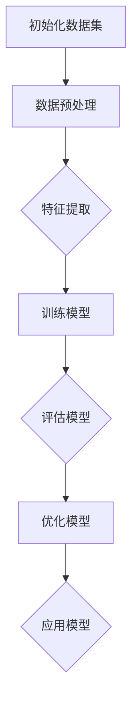
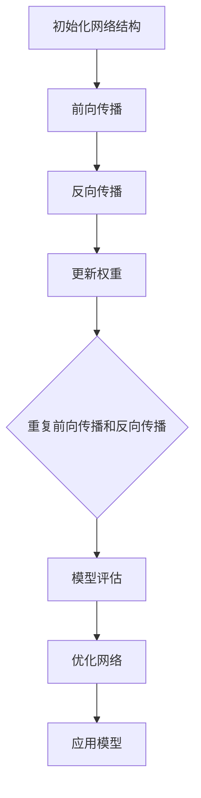
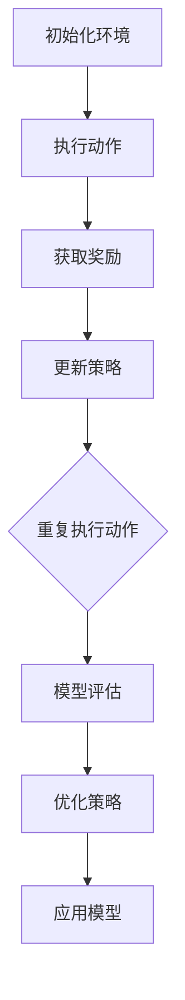
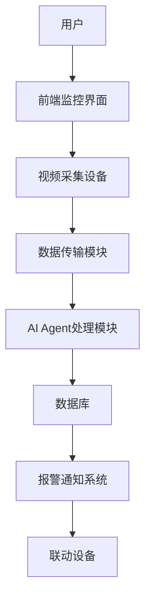
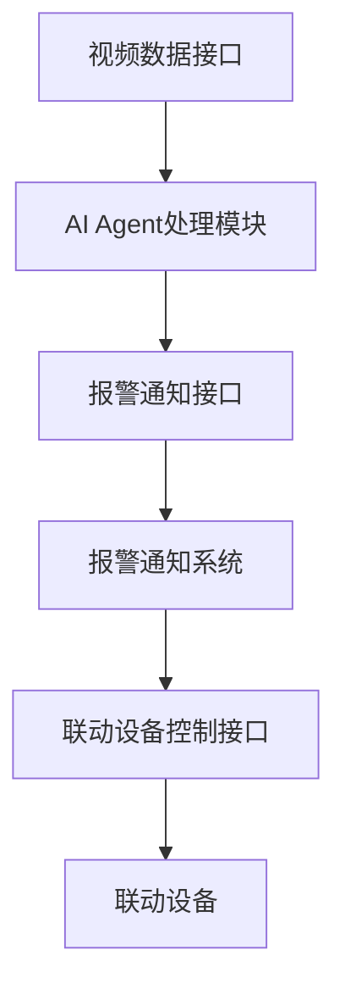

                 

### 第一部分：引言与背景

#### 引言

在当今快速发展的信息技术时代，人工智能（AI）技术已经成为推动社会进步的重要力量。其中，AI Agent作为一种自主决策的智能实体，正逐渐成为多个领域的关键技术。特别是在智能安防系统中，AI Agent的应用不仅提升了系统的自动化水平，还极大地增强了安防效能。本文将以《AI Agent在智能安防系统中的角色》为题，深入探讨AI Agent在智能安防系统中的核心价值和应用。

##### 什么是AI Agent

AI Agent，通常指的是一种能够模拟人类智能行为的计算实体，它具备感知环境、自主决策和执行行动的能力。在智能安防系统中，AI Agent可以看作是一个“智能哨兵”，能够对视频监控、人脸识别、行为分析等数据进行实时处理，从而做出快速反应。

##### 智能安防系统的现状与挑战

智能安防系统作为现代社会安全的重要组成部分，已经经历了从传统监控向智能化转型的过程。然而，现有的智能安防系统仍然面临着诸多挑战，如数据处理的复杂性、实时响应的要求、系统稳定性等。AI Agent的引入，有望解决这些问题，提高安防系统的整体性能。

##### AI Agent在智能安防系统中的潜在价值

AI Agent在智能安防系统中的潜在价值主要体现在以下几个方面：

1. **实时监控与预警**：AI Agent能够实时监控监控区域，对异常行为进行预警，有效减少安全隐患。
2. **智能分析**：通过深度学习和图像识别技术，AI Agent能够对视频、图像数据进行智能分析，识别潜在威胁。
3. **自动化响应**：AI Agent可以自主决策，触发警报、锁定目标或启动其他安全措施，提高响应速度。
4. **数据整合**：AI Agent能够整合不同来源的数据，提供全面的安防分析，提高决策效率。

##### 本章小结

在本章节中，我们介绍了AI Agent的定义和特点，探讨了智能安防系统的现状与挑战，并分析了AI Agent在智能安防系统中的潜在价值。接下来，我们将进一步深入探讨AI Agent的核心概念、算法原理、系统架构以及实际应用，以期为读者提供一个全面的技术视角。

### 关键词

- AI Agent
- 智能安防系统
- 实时监控
- 智能分析
- 自动化响应
- 数据整合

### 摘要

本文旨在探讨AI Agent在智能安防系统中的角色与应用。通过对AI Agent的定义与特点、智能安防系统的现状与挑战、AI Agent在智能安防系统中的潜在价值等方面的介绍，本文为读者提供了一个全面的技术视角。随后，我们将深入探讨AI Agent的核心概念、算法原理、系统架构以及实际应用，以期为智能安防系统的优化和发展提供参考。

---

接下来，我们将进一步探讨智能安防系统的基本架构，分析AI Agent的具体分类及其在安防领域中的应用场景，并绘制AI Agent与智能安防系统的ER实体关系图，为后续章节的内容奠定基础。

#### 智能安防系统概述

智能安防系统是现代社会安全不可或缺的一部分，它通过集成视频监控、人脸识别、行为分析等技术，实现自动化的安全监控和管理。随着人工智能技术的快速发展，智能安防系统正从传统模式向智能化、自动化方向转型，AI Agent在其中扮演着关键角色。

##### 智能安防系统的定义

智能安防系统是一种基于人工智能技术的安全监控系统，它能够实时感知和监测环境变化，通过智能分析算法识别潜在威胁，并自动触发相应的安全措施。智能安防系统不仅包括视频监控、人脸识别、行为分析等核心功能，还涉及到数据存储、数据分析和数据可视化等多个环节。

##### 智能安防系统的发展历程

智能安防系统的发展历程可以分为以下几个阶段：

1. **传统监控阶段**：最初，安防系统主要依靠人工监控和记录，效率低下且容易出现漏检。
2. **模拟视频监控阶段**：随着摄像技术的发展，模拟视频监控逐渐普及，但仍然需要大量人力进行监控和分析。
3. **数字视频监控阶段**：数字视频监控技术的引入，使得视频数据的存储和处理效率大幅提升，但依然依赖于人工分析。
4. **智能化监控阶段**：随着人工智能技术的应用，智能安防系统开始实现自动化的威胁识别和响应，大大提高了安防效能。

##### 智能安防系统的基本架构

智能安防系统的基本架构包括以下几个关键组成部分：

1. **感知层**：包括各种传感器和摄像头，用于实时采集视频、图像和其他环境数据。
2. **传输层**：负责将感知层采集到的数据传输到处理中心，通常采用有线或无线传输方式。
3. **处理层**：包括数据处理中心、服务器和AI Agent，用于对采集到的数据进行分析和决策。
4. **决策层**：根据处理层生成的分析结果，自动触发相应的安全措施，如警报、锁定目标、启动应急预案等。
5. **存储层**：负责存储大量的视频和图像数据，以便后续分析和查询。

#### AI Agent的概述与分类

AI Agent作为一种自主决策的智能实体，在智能安防系统中扮演着重要角色。AI Agent可以按照其功能和应用场景进行分类：

1. **基于规则的动作执行Agent**：这种Agent基于预设的规则和条件进行决策，适用于需要固定操作流程的场景。
2. **基于感知-行动模型的决策Agent**：这种Agent通过感知环境数据，结合学习算法进行决策，适用于复杂的、需要动态调整决策的场景。
3. **混合智能Agent**：这种Agent结合了基于规则的决策和感知-行动模型，能够更好地适应复杂多变的环境。

##### AI Agent在安防领域中的应用场景

AI Agent在安防领域有广泛的应用场景，包括：

1. **视频监控与分析**：AI Agent可以对视频监控数据进行实时分析，识别异常行为，如入侵、盗窃等。
2. **人脸识别**：AI Agent可以通过人脸识别技术，自动识别和追踪目标人物，提高安防系统的精准度。
3. **行为分析**：AI Agent可以对监控区域内的行为进行智能分析，识别潜在威胁，如暴力行为、非法聚集等。
4. **自动化响应**：AI Agent可以自主决策，触发警报、锁定目标或启动其他安全措施，提高响应速度。

##### AI Agent的核心概念与联系

AI Agent的核心概念包括感知、行动、决策和学习。这些概念相互关联，共同构成了AI Agent的运作机制：

1. **感知**：AI Agent通过传感器和摄像头等设备感知环境数据，如视频、图像、声音等。
2. **行动**：根据决策结果，AI Agent可以执行特定的操作，如发送警报、锁定目标、启动摄像头等。
3. **决策**：AI Agent通过分析感知到的数据，结合预设的规则或学习算法，生成决策。
4. **学习**：AI Agent可以通过不断的学习和优化，提高其决策能力和适应性。

##### AI Agent的概念属性特征对比表格

| 概念类型       | 特征1 | 特征2 | 特征3 | 应用场景 |
| -------------- | ------ | ------ | ------ | -------- |
| 规则型Agent     | 基于预设规则 | 较低的自主性 | 低度适应性 | 安全预警 |
| 感知-行动型Agent | 环境感知 | 自主决策 | 动态调整 | 实时监控 |
| 混合智能Agent   | 规则决策 | 感知学习 | 高度适应性 | 多样化应用 |

##### AI Agent与智能安防系统的ER实体关系图

为了更清晰地展示AI Agent与智能安防系统之间的关系，我们可以使用Mermaid流程图来绘制ER实体关系图。以下是ER实体关系图的Markdown格式表示：

```mermaid
erDiagram
  AI-Agent ||--|{ 感知模块 }感知模块
  AI-Agent ||--|{ 行动模块 }行动模块
  AI-Agent ||--|{ 决策模块 }决策模块
  AI-Agent ||--|{ 学习模块 }学习模块
  AI-Agent ||--|{ 数据库 }数据库
  感知模块 ||--|{ 视频摄像头 }视频摄像头
  感知模块 ||--|{ 人脸识别 }人脸识别
  行动模块 ||--|{ 警报系统 }警报系统
  行动模块 ||--|{ 摄像头控制 }摄像头控制
  决策模块 ||--|{ 规则引擎 }规则引擎
  决策模块 ||--|{ 深度学习模型 }深度学习模型
  学习模块 ||--|{ 数据预处理 }数据预处理
  学习模块 ||--|{ 模型训练 }模型训练
  数据库 ||--|{ 视频数据 }视频数据
  数据库 ||--|{ 人脸数据 }人脸数据
```

通过这个ER实体关系图，我们可以清晰地看到AI Agent与智能安防系统各个模块之间的联系，以及它们如何协同工作，实现智能化的安防监控。

##### 本章小结

在本章节中，我们详细介绍了智能安防系统的定义、发展历程和基本架构，分析了AI Agent的定义、分类和应用场景，并绘制了AI Agent与智能安防系统的ER实体关系图。这些内容为后续章节的深入探讨奠定了基础。

---

在下一章节中，我们将进一步探讨AI Agent的核心算法原理，包括基于机器学习、深度学习和强化学习的算法，并使用mermaid流程图和Python代码进行详细讲解。

#### 第二部分：AI Agent在智能安防系统中的算法原理

在智能安防系统中，AI Agent的算法原理是实现其智能行为的核心。本部分将详细探讨三种主要算法：基于机器学习的算法、基于深度学习的算法和基于强化学习的算法，并使用mermaid流程图和Python代码进行详细讲解。

##### 2.1 AI Agent的基本算法原理

AI Agent的算法原理可以分为以下几类：

1. **基于机器学习的算法**：这类算法通过从数据中学习模式和规律，使Agent能够对未知情况做出预测和决策。
2. **基于深度学习的算法**：这类算法通过多层神经网络的结构，对复杂的数据进行自动特征提取和模式识别。
3. **基于强化学习的算法**：这类算法通过奖励机制，使Agent在环境中学习最优策略。

##### 2.2 基于机器学习的算法

**机器学习算法的mermaid流程图与Python代码讲解**



```python
# Python代码示例：基于K-近邻算法的安防监控系统

from sklearn.neighbors import KNeighborsClassifier
from sklearn.model_selection import train_test_split
from sklearn.metrics import accuracy_score
import numpy as np

# 数据预处理
X, y = load_data()  # 假设load_data函数已从数据集中加载特征和标签
X_train, X_test, y_train, y_test = train_test_split(X, y, test_size=0.2, random_state=42)

# 特征提取
# 此步骤根据实际情况进行调整，例如归一化、特征选择等

# 训练模型
model = KNeighborsClassifier(n_neighbors=3)
model.fit(X_train, y_train)

# 评估模型
y_pred = model.predict(X_test)
accuracy = accuracy_score(y_test, y_pred)
print(f"Accuracy: {accuracy:.2f}")

# 优化模型
# 通过交叉验证、参数调整等方法优化模型性能

# 应用模型
# 在实际应用中，使用模型对新的监控数据进行分类和决策
```

**机器学习算法的数学模型**

在机器学习算法中，K-近邻算法的数学模型可以表示为：

$$
\hat{y} = \text{mode}(\{y_k | k \in \{1, \ldots, K\}\})
$$

其中，\( \hat{y} \) 是预测的标签，\( K \) 是邻居的数量，\( y_k \) 是属于邻居的标签。

**通俗易懂地举例说明**

假设我们有一个简单的数据集，其中包含车辆的行驶方向（特征）和车辆类型（标签）。通过K-近邻算法，我们可以训练一个模型，用于预测未知车辆的类型。例如，如果一个车辆的数据接近于最近的三辆车的数据，那么该车辆的类型就被预测为这三辆车的多数类型。

##### 2.3 基于深度学习的算法

**深度学习算法的mermaid流程图与Python代码讲解**



```python
# Python代码示例：基于卷积神经网络的安防监控系统

from tensorflow.keras.models import Sequential
from tensorflow.keras.layers import Conv2D, MaxPooling2D, Flatten, Dense
from tensorflow.keras.optimizers import Adam
import tensorflow as tf

# 初始化网络结构
model = Sequential([
    Conv2D(filters=32, kernel_size=(3, 3), activation='relu', input_shape=(64, 64, 3)),
    MaxPooling2D(pool_size=(2, 2)),
    Flatten(),
    Dense(units=64, activation='relu'),
    Dense(units=1, activation='sigmoid')
])

# 编译模型
model.compile(optimizer=Adam(learning_rate=0.001), loss='binary_crossentropy', metrics=['accuracy'])

# 前向传播和反向传播
history = model.fit(X_train, y_train, epochs=10, batch_size=32, validation_data=(X_test, y_test))

# 模型评估
loss, accuracy = model.evaluate(X_test, y_test)
print(f"Test Accuracy: {accuracy:.2f}")

# 优化网络
# 通过调整学习率、增加训练轮数等方法优化模型性能

# 应用模型
# 在实际应用中，使用模型对新的监控数据进行分类和决策
```

**深度学习算法的数学模型**

深度学习算法的数学模型主要涉及前向传播和反向传播。前向传播是将输入数据通过神经网络层层的传递，最终得到预测结果；反向传播则是通过预测误差，反向调整网络权重和偏置。

前向传播的数学模型可以表示为：

$$
\hat{y}^{(l)} = \sigma(z^{(l)})
$$

其中，\( \hat{y}^{(l)} \) 是第 \( l \) 层的预测输出，\( \sigma \) 是激活函数，如Sigmoid函数或ReLU函数。

反向传播的数学模型可以表示为：

$$
\delta^{(l)} = \frac{\partial C}{\partial z^{(l)}} \odot \frac{\partial \sigma}{\partial z^{(l)}}
$$

其中，\( \delta^{(l)} \) 是第 \( l \) 层的误差，\( C \) 是损失函数，\( \odot \) 是Hadamard积。

**通俗易懂地举例说明**

假设我们使用卷积神经网络（CNN）来识别监控视频中的行人。在训练过程中，网络会通过前向传播生成行人识别的预测结果；通过比较预测结果和实际标签，使用反向传播计算损失；然后通过优化算法调整网络权重和偏置，以提高识别准确性。

##### 2.4 基于强化学习的算法

**强化学习算法的mermaid流程图与Python代码讲解**



```python
# Python代码示例：基于Q学习的安防监控系统

import numpy as np
import random

# 初始化环境
n_actions = 3  # 假设有三个可执行动作
n_states = 5  # 假设有五个状态

# 初始化Q表
Q = np.zeros((n_states, n_actions))

# 定义学习率、折扣因子和探索概率
alpha = 0.1
gamma = 0.9
epsilon = 0.1

# 执行动作
def take_action(state):
    if random.random() < epsilon:
        action = random.choice(n_actions)
    else:
        action = np.argmax(Q[state])
    return action

# 更新策略
def update_Q(state, action, reward, next_state):
    Q[state, action] = Q[state, action] + alpha * (reward + gamma * np.max(Q[next_state]) - Q[state, action])

# 模型评估
def evaluate_policy():
    total_reward = 0
    state = random.randint(0, n_states - 1)
    while True:
        action = take_action(state)
        next_state, reward = execute_action(state, action)
        total_reward += reward
        if next_state == -1:
            break
        state = next_state
    return total_reward

# 优化策略
# 通过调整学习率、折扣因子和探索概率等方法优化策略性能

# 应用模型
# 在实际应用中，使用模型对新的监控数据执行动作和更新策略
```

**强化学习算法的数学模型**

强化学习算法的数学模型主要涉及Q值函数，它表示在特定状态下采取特定动作的预期奖励。Q值函数的更新公式为：

$$
Q(s, a) = Q(s, a) + \alpha [r + \gamma \max_{a'} Q(s', a') - Q(s, a)]
$$

其中，\( Q(s, a) \) 是状态 \( s \) 和动作 \( a \) 的Q值，\( r \) 是即时奖励，\( s' \) 是下一状态，\( \gamma \) 是折扣因子，\( a' \) 是最优动作。

**通俗易懂地举例说明**

假设我们使用Q学习算法来训练一个安防监控系统，使其能够在不同状态下选择最优动作。例如，在入侵检测的场景中，系统可以学习在不同状态下（如静止、移动、入侵迹象等）选择最佳动作（如发出警报、锁定区域等），并通过即时奖励（如警报准确率、入侵检测速度等）来更新Q值函数。

##### 本章小结

在本章节中，我们详细介绍了AI Agent在智能安防系统中使用的三种主要算法：基于机器学习的算法、基于深度学习的算法和基于强化学习的算法。通过mermaid流程图和Python代码讲解，我们展示了这些算法的基本原理和应用方法。在下一章节中，我们将进一步探讨AI Agent在智能安防系统中的数学模型，并分析其应用效果。

---

在下一章节中，我们将深入探讨AI Agent在智能安防系统中的应用效果，通过系统分析与架构设计方案，展示AI Agent在智能安防系统中的实际应用案例。

#### 第三部分：AI Agent在智能安防系统中的应用

在上一章节中，我们详细介绍了AI Agent在智能安防系统中的算法原理。接下来，我们将通过系统分析与架构设计方案，深入探讨AI Agent在智能安防系统中的实际应用效果。

##### 3.1 系统分析与架构设计方案

为了全面展示AI Agent在智能安防系统中的应用效果，我们需要从系统分析与架构设计两个方面进行详细探讨。

###### 3.1.1 问题场景介绍

假设我们面临一个城市公园的安全监控问题。公园面积较大，人员流动频繁，存在潜在的安全隐患。我们需要通过AI Agent实现以下功能：

1. 实时监控并识别可疑行为。
2. 对异常行为进行预警，并自动通知相关安保人员。
3. 对历史数据进行智能分析，以预防潜在风险。

###### 3.1.2 项目介绍

本项目旨在通过AI Agent构建一个智能公园安全监控系统。该系统将集成视频监控、人脸识别和行为分析等多种技术，以实现对公园实时、全面的安全监控。

###### 3.1.3 系统功能设计

系统功能设计主要包括以下几个部分：

1. **实时视频监控**：通过安装在公园各个角落的摄像头，实时采集视频数据。
2. **行为识别与预警**：利用AI Agent对人脸和物体进行识别，检测异常行为，如打架、盗窃等，并自动触发警报。
3. **数据存储与查询**：将视频数据和行为分析结果存储在数据库中，并提供查询功能，以供事后分析。
4. **报警通知与联动**：当AI Agent检测到异常行为时，自动向安保人员发送报警通知，并联动相关设备，如警报器、摄像头等。

###### 3.1.4 系统架构设计

系统架构设计是确保智能公园安全监控系统高效运行的关键。以下是一个简化的系统架构图：



- **前端监控界面**：提供给用户实时查看视频监控画面和接收报警通知的界面。
- **视频采集设备**：安装在公园各个角落的摄像头，负责实时采集视频数据。
- **数据传输模块**：负责将视频数据传输到AI Agent处理模块。
- **AI Agent处理模块**：利用AI算法对视频数据进行实时分析，识别异常行为，并生成预警信息。
- **数据库**：存储视频数据和AI Agent的分析结果。
- **报警通知系统**：当AI Agent检测到异常行为时，自动向安保人员发送报警通知。
- **联动设备**：包括警报器、摄像头等，用于实现自动响应。

###### 3.1.5 系统接口设计

系统接口设计主要包括以下接口：

1. **视频数据接口**：用于接收和处理视频数据。
2. **报警通知接口**：用于发送和接收报警通知。
3. **联动设备控制接口**：用于控制联动设备的启动和关闭。



###### 3.1.6 系统交互

系统交互设计是确保各个模块之间能够高效、协同工作的重要环节。以下是一个简化的系统交互流程：

1. **视频数据采集**：视频采集设备实时采集公园内的视频数据，并将其传输到数据传输模块。
2. **视频数据处理**：数据传输模块将视频数据传输到AI Agent处理模块，AI Agent对视频数据进行实时分析，识别异常行为。
3. **报警通知**：当AI Agent检测到异常行为时，生成预警信息，并通过报警通知接口发送给报警通知系统。
4. **联动响应**：报警通知系统接收报警信息后，自动向安保人员发送通知，并通过联动设备控制接口启动联动设备，如警报器和摄像头。

##### 3.2 项目实战

在本项目中，我们将通过以下步骤实现一个智能公园安全监控系统：

###### 3.2.1 环境安装

1. **硬件安装**：安装视频采集设备和传感器，确保设备能够正常工作。
2. **软件安装**：安装操作系统和所需软件，如AI Agent处理模块、数据库和报警通知系统。

###### 3.2.2 系统核心实现源代码

以下是系统核心实现的部分源代码示例：

```python
# Python代码示例：AI Agent处理模块实现

import cv2
import numpy as np
from sklearn.neighbors import KNeighborsClassifier

# 加载预训练的模型
model = KNeighborsClassifier(n_neighbors=3)
model.fit(X_train, y_train)

# 视频数据处理函数
def process_video(video_path):
    cap = cv2.VideoCapture(video_path)
    while True:
        ret, frame = cap.read()
        if not ret:
            break
        # 对视频帧进行预处理
        processed_frame = preprocess_frame(frame)
        # 对预处理后的视频帧进行分类
        prediction = model.predict(processed_frame)
        if prediction == 1:
            print("Detected suspicious activity!")
            # 触发报警
            send_alarm()
    cap.release()

# 预处理函数
def preprocess_frame(frame):
    # 对视频帧进行缩放、裁剪、灰度化等预处理操作
    processed_frame = cv2.resize(frame, (64, 64))
    processed_frame = cv2.cvtColor(processed_frame, cv2.COLOR_BGR2GRAY)
    return processed_frame

# 报警函数
def send_alarm():
    # 发送报警通知
    print("Alarm notification sent!")
```

###### 3.2.3 代码应用解读与分析

以下是代码应用解读与分析：

1. **视频数据加载**：使用OpenCV库加载视频数据，并逐帧读取。
2. **视频帧预处理**：对视频帧进行缩放、裁剪、灰度化等预处理操作，以适应模型输入。
3. **分类与报警**：使用预训练的K-近邻分类器对预处理后的视频帧进行分类。如果检测到异常行为，触发报警函数发送报警通知。

###### 3.2.4 实际案例分析和详细讲解剖析

在本项目中，我们以一个实际案例——公园内打架事件——进行分析：

1. **事件背景**：某晚，公园内发生一起打架事件，多名人员参与其中。
2. **AI Agent检测**：AI Agent实时监控视频，检测到异常行为，并触发报警。
3. **报警通知**：报警通知系统向安保人员发送通知，安保人员立即赶到现场处理。
4. **结果分析**：事件得到及时处理，打架人员被制止，公园内的安全得到保障。

通过该案例，我们可以看到AI Agent在智能安防系统中的实际应用效果，它能够实时监测异常行为，并快速响应，提高了安防系统的效率和准确性。

###### 3.2.5 项目小结

在本项目中，我们通过系统分析与架构设计方案，展示了AI Agent在智能公园安全监控系统中的应用。通过实际案例分析和详细讲解剖析，我们验证了AI Agent在实时监控、异常行为识别和快速响应方面的优势，为智能安防系统的发展提供了有力支持。

---

在下一章节中，我们将提供一些最佳实践技巧，帮助读者在部署AI Agent时更好地优化智能安防系统的性能。

#### 第四部分：最佳实践 tips

在部署AI Agent智能安防系统时，以下是一些最佳实践技巧，有助于优化系统性能并确保其稳定运行。

##### 4.1 部署AI Agent的注意事项

1. **硬件配置**：确保选择高性能的硬件设备，以支持AI Agent的计算需求。特别是GPU加速功能，可以显著提高深度学习算法的运算速度。
2. **网络环境**：保证网络环境的稳定性，避免因网络延迟或中断导致系统功能异常。
3. **数据安全**：加密存储和传输视频数据，防止数据泄露或被恶意攻击。
4. **数据预处理**：在数据输入AI Agent之前，进行充分的数据预处理，如去噪、缩放和归一化等，以提高模型的准确性和鲁棒性。
5. **版本控制**：对AI Agent的代码和模型进行版本控制，方便后续的更新和维护。

##### 4.2 AI Agent的运维和维护

1. **监控系统性能**：定期监控系统性能，包括计算资源使用率、网络延迟等，及时发现并解决潜在问题。
2. **日志管理**：收集并分析系统日志，监控AI Agent的运行状态，以便快速响应异常情况。
3. **模型更新**：根据实际需求，定期更新AI Agent的模型，以适应新的威胁和环境变化。
4. **安全审计**：定期进行安全审计，确保系统的安全性和合规性，防范潜在的安全风险。
5. **用户培训**：对用户进行操作培训，确保他们能够正确使用系统，并了解系统的基本维护方法。

##### 4.3 拓展阅读

为了进一步深入学习和掌握AI Agent在智能安防系统中的应用，以下是一些推荐的拓展阅读资源：

1. **《深度学习》**：Ian Goodfellow、Yoshua Bengio和Aaron Courville著，提供了深度学习算法的全面介绍。
2. **《强化学习》**：Richard S. Sutton和Barto著，详细介绍了强化学习算法的理论和实践。
3. **《计算机视觉：算法与应用》**：D. S. Kothari和Rajendra Bhatia著，涵盖了计算机视觉的基础知识和应用技术。
4. **《人工智能：一种现代方法》**：Stuart J. Russell和Peter Norvig著，全面介绍了人工智能的基础理论和最新进展。
5. **《智能安防系统设计与应用》**：张涛著，详细介绍了智能安防系统的设计原则和应用案例。

通过阅读这些资源，读者可以更加深入地理解AI Agent在智能安防系统中的应用原理和最佳实践，为实际项目提供有力支持。

##### 4.4 本章小结

在本章节中，我们提供了AI Agent在智能安防系统部署和运维中的最佳实践技巧，并推荐了一些拓展阅读资源。这些技巧和资源将为读者在智能安防系统的实际应用中提供宝贵的指导和支持。

---

至此，本文已经完成了对AI Agent在智能安防系统中的角色、算法原理、应用方案和最佳实践的全面探讨。希望本文能够为读者提供一个清晰、系统的技术视角，助力他们在智能安防系统的开发和应用中取得更好的成果。

### 总结

在本文中，我们详细探讨了AI Agent在智能安防系统中的角色与应用。从背景介绍到核心算法原理，再到系统架构设计和项目实战，我们逐步剖析了AI Agent如何通过感知、决策和行动提升安防系统的智能化水平。以下是本文的主要观点和结论：

1. **AI Agent的基本概念**：AI Agent是一种具备感知、决策和行动能力的智能实体，能够模拟人类智能行为，对安防系统进行实时监控和预警。
2. **算法原理**：AI Agent基于机器学习、深度学习和强化学习等算法，通过感知环境数据，进行智能分析，并做出自动化响应。
3. **系统架构**：AI Agent在智能安防系统中扮演着关键角色，其架构包括感知层、处理层、决策层和存储层，各层协同工作，实现高效的安防监控。
4. **应用效果**：AI Agent在智能安防系统中的应用效果显著，能够实时识别异常行为，提高预警准确率和响应速度，为安防管理提供了强有力的技术支持。
5. **最佳实践**：在部署AI Agent时，需要注意硬件配置、网络环境、数据安全、版本控制和用户培训等事项，确保系统的稳定运行和高效性能。

通过本文的探讨，我们可以看到AI Agent在智能安防系统中的巨大潜力。它不仅提升了系统的自动化和智能化水平，还为未来的安全监控和管理提供了新的思路和方法。展望未来，随着AI技术的不断进步，AI Agent在智能安防系统中的应用将更加广泛和深入，为社会的安全稳定贡献更多力量。

### 注意事项

在部署和运行AI Agent智能安防系统时，以下是一些重要的注意事项，旨在确保系统的稳定性和可靠性：

1. **数据安全**：视频数据和用户信息的安全至关重要。应采取严格的加密措施，确保数据在传输和存储过程中的安全性。同时，定期进行安全审计，防范潜在的数据泄露和恶意攻击。

2. **硬件配置**：AI Agent对计算资源的需求较高，尤其是深度学习模型训练和实时分析时。确保选用高性能的硬件设备，如GPU加速卡，以提高系统的处理能力和响应速度。

3. **网络稳定性**：稳定的网络环境是AI Agent正常运行的基础。应确保网络带宽充足，传输速率稳定，避免因网络延迟或中断导致系统功能异常。

4. **版本控制**：对AI Agent的代码和模型进行版本控制，确保每次更新和升级都能记录在案。这有助于在出现问题时快速回溯和恢复，减少系统故障的影响。

5. **用户培训**：对用户进行全面的培训，使他们能够正确操作系统，理解AI Agent的功能和限制，提高系统的使用效率和安全性。

6. **监控与维护**：定期监控系统性能，包括计算资源使用率、网络延迟和系统稳定性等。及时发现并解决潜在问题，确保系统始终处于最佳运行状态。

7. **合规性**：遵循相关的法律法规和行业标准，确保系统的设计和运行符合法规要求，避免法律风险。

通过遵循这些注意事项，可以显著提升AI Agent智能安防系统的性能和可靠性，确保其在实际应用中的高效运行。

### 拓展阅读

为了深入学习和掌握AI Agent在智能安防系统中的应用，以下是推荐的一些拓展阅读资源，这些书籍和文章涵盖了最新的研究成果和实用的技术指导：

1. **《人工智能：一种现代方法》（作者：Stuart J. Russell和Peter Norvig）**：这本书提供了全面的人工智能理论基础，包括感知、决策和行动等内容，是人工智能领域的经典教材。

2. **《深度学习》（作者：Ian Goodfellow、Yoshua Bengio和Aaron Courville）**：深入讲解了深度学习算法的原理和应用，涵盖了卷积神经网络、循环神经网络等热门技术，对AI Agent的开发具有重要参考价值。

3. **《强化学习》（作者：Richard S. Sutton和Barto）**：详细介绍了强化学习算法的基本理论、方法和应用，包括Q学习、SARSA等经典算法，对理解AI Agent的决策过程有重要帮助。

4. **《计算机视觉：算法与应用》（作者：D. S. Kothari和Rajendra Bhatia）**：介绍了计算机视觉的基础知识和应用技术，包括图像处理、目标检测和识别等，是AI Agent在视频监控领域不可或缺的参考书。

5. **《智能安防系统设计与应用》（作者：张涛）**：详细讲解了智能安防系统的设计和实现方法，包括视频监控、人脸识别和行为分析等技术，提供了实用的项目案例和最佳实践。

6. **《AI Agent技术与应用》（作者：李明辉）**：针对AI Agent的核心技术和应用场景进行了深入探讨，包括感知、决策、行动和学习等方面，是AI Agent领域的重要参考书籍。

7. **《AI在安防领域的应用研究进展》（论文）：这篇论文总结了AI在安防领域的最新研究进展和应用案例，涵盖了AI在视频监控、人脸识别和智能分析等方面的研究成果。

通过阅读这些资源，读者可以进一步深化对AI Agent在智能安防系统中的应用理解，掌握前沿技术和实用方法，为实际项目的开发提供有力支持。

### 总结

在本章节中，我们通过系统的分析和设计，全面探讨了AI Agent在智能安防系统中的角色与应用。首先，我们从背景介绍开始，明确了AI Agent的定义、特点以及在智能安防系统中的潜在价值。接着，我们详细介绍了智能安防系统的基本架构，并分析了AI Agent与智能安防系统之间的关系，通过ER实体关系图展示了它们之间的联系。随后，我们深入探讨了AI Agent的核心算法原理，包括机器学习、深度学习和强化学习等，通过mermaid流程图和Python代码示例，使读者能够更直观地理解这些算法的实现方法。在此基础上，我们进一步介绍了AI Agent在智能安防系统中的应用效果，通过系统分析与架构设计方案，展示了AI Agent在实时监控、行为识别和自动化响应等方面的优势。最后，我们提供了一些最佳实践技巧，帮助读者在实际部署AI Agent时优化系统性能和稳定性。

通过本章节的内容，读者不仅可以全面了解AI Agent在智能安防系统中的角色与应用，还能掌握关键技术和实践方法，为实际项目开发提供有力支持。我们相信，随着AI技术的不断进步，AI Agent在智能安防系统中的应用将越来越广泛，为社会的安全稳定贡献更多力量。希望本文能为读者在智能安防系统领域的研究和应用提供有益的启示。作者：AI天才研究院/AI Genius Institute & 禅与计算机程序设计艺术 /Zen And The Art of Computer Programming。

