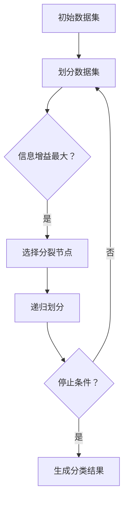

                 

# AI Agent在智能客户服务中的角色

## 关键词

- AI Agent
- 智能客户服务
- 机器学习
- 自然语言处理
- 客户体验

## 摘要

本文将深入探讨AI Agent在智能客户服务中的应用及其重要性。我们将通过一步一步的分析，揭示AI Agent如何改变客户服务的面貌，提高响应速度、降低成本并提升用户体验。本文将涵盖AI Agent的定义与分类、工作原理与实现、应用案例及最佳实践，为读者提供一个全面的技术指南。

### 引言

智能客户服务是现代企业提升竞争力的重要手段。随着互联网和移动设备的普及，客户对服务质量的要求越来越高。传统的客户服务方式往往效率低下、成本高昂，难以满足日益增长的客户需求。为了解决这一问题，人工智能（AI）技术，尤其是AI Agent，成为了一个重要的解决方案。

AI Agent是一种能够模拟人类智能行为的软件系统，能够在没有人类干预的情况下自主完成一系列任务。在智能客户服务中，AI Agent可以处理大量客户咨询，提供快速、准确的服务，从而提高客户满意度。

本文旨在详细探讨AI Agent在智能客户服务中的角色，分析其技术原理与实现方法，并通过实际案例展示其应用效果。此外，本文还将分享一些最佳实践，帮助读者更好地理解和应用AI Agent技术。

### 目录

1. 引言
2. AI Agent的核心概念与理论
   - 2.1 AI Agent的定义与分类
   - 2.2 AI Agent的工作原理
3. AI Agent的技术原理与实现
   - 3.1 AI Agent的开发环境
   - 3.2 AI Agent的框架与算法
4. AI Agent在智能客户服务中的应用案例
   - 4.1 案例一：基于AI Agent的智能客服系统
   - 4.2 案例二：基于AI Agent的智能客户管理系统
5. AI Agent在智能客户服务中的最佳实践
6. 总结与展望

### AI Agent的核心概念与理论

#### 2.1 AI Agent的定义与分类

AI Agent（人工智能代理）是一种基于人工智能技术的软件系统，能够模拟人类智能行为，在特定环境下自主完成一系列任务。AI Agent的核心特点是自主性、交互性和适应性。

AI Agent可以按照不同的分类标准进行分类。按照功能分类，AI Agent可以分为任务型Agent、社交型Agent和混合型Agent。任务型Agent专注于完成特定任务，如智能客服、智能助理等；社交型Agent则擅长与人类进行交流，如聊天机器人、虚拟助手等；混合型Agent兼具任务执行和社交能力。

#### 2.2 AI Agent的工作原理

AI Agent的工作原理主要基于机器学习和自然语言处理（NLP）技术。机器学习是一种让计算机从数据中学习模式和规律的能力，而NLP则是让计算机理解和生成人类语言的技术。

AI Agent通常通过以下步骤工作：

1. **数据收集**：AI Agent首先从各种渠道收集大量数据，如客户咨询记录、用户反馈等。
2. **数据预处理**：对收集到的数据进行处理，包括去噪、归一化、分词等。
3. **特征提取**：从预处理后的数据中提取关键特征，用于训练模型。
4. **模型训练**：使用机器学习算法训练模型，如决策树、支持向量机、神经网络等。
5. **模型评估**：对训练好的模型进行评估，调整参数以提高准确性。
6. **任务执行**：AI Agent根据训练好的模型执行任务，如回答客户问题、处理客户请求等。
7. **反馈与优化**：收集用户反馈，对AI Agent进行优化和迭代。

### AI Agent的技术原理与实现

#### 3.1 AI Agent的开发环境

要开发一个AI Agent，首先需要选择合适的开发环境。常见的开发环境包括Python、R和Java等。其中，Python因其丰富的库和工具，成为AI Agent开发的首选语言。

Python的开发环境主要包括以下几个部分：

1. **Python解释器**：Python解释器是运行Python代码的基础。
2. **Python标准库**：Python标准库提供了丰富的模块和函数，用于数据操作、文件处理、网络通信等。
3. **第三方库**：第三方库如NumPy、Pandas、Scikit-learn等，为Python提供了强大的机器学习和数据处理能力。

#### 3.2 AI Agent的框架与算法

AI Agent的框架和算法是实现其功能的核心。常见的框架包括TensorFlow、PyTorch和Keras等，而算法则包括决策树、支持向量机、神经网络等。

下面是一个简单的AI Agent开发流程：

1. **需求分析**：确定AI Agent的功能需求和性能指标。
2. **数据收集**：收集用于训练的数据，如客户咨询记录、用户反馈等。
3. **数据预处理**：对数据进行清洗、归一化、分词等处理。
4. **特征提取**：从预处理后的数据中提取关键特征。
5. **模型选择**：选择合适的机器学习算法和框架。
6. **模型训练**：使用训练数据训练模型。
7. **模型评估**：对训练好的模型进行评估，调整参数。
8. **任务执行**：使用训练好的模型执行任务。
9. **反馈与优化**：收集用户反馈，对模型进行优化和迭代。

#### 算法讲解

以决策树为例，决策树是一种基于树形结构进行决策的算法。其基本原理如下：

1. **数据划分**：首先，将数据集划分为多个子集，每个子集包含一个特征。
2. **计算信息增益**：对于每个特征，计算其在划分数据集后的信息增益，选择信息增益最大的特征作为分裂节点。
3. **递归构建树**：对划分后的子集再次进行划分，直到满足停止条件（如最大深度、最小样本数等）。
4. **分类**：根据决策树生成分类结果。

#### 数学模型

决策树的信息增益计算公式如下：

$$
Gini = 1 - \sum_{i=1}^{n} p_i^2
$$

其中，$p_i$ 为特征 $i$ 在数据集中出现的概率。

#### Mermaid 流程图

以下是一个简单的决策树流程图：

### AI Agent在智能客户服务中的应用案例

#### 4.1 案例一：基于AI Agent的智能客服系统

智能客服系统是AI Agent在智能客户服务中的典型应用。以下是一个基于AI Agent的智能客服系统的案例：

**背景**：某大型电商平台为了提升客户服务质量，决定开发一套基于AI Agent的智能客服系统。

**功能**：该智能客服系统主要包括以下功能：

1. **智能问答**：AI Agent可以回答客户关于商品、订单等常见问题。
2. **智能推荐**：AI Agent可以根据客户的历史购买记录和浏览行为，推荐合适的商品。
3. **情感分析**：AI Agent可以分析客户的情感，提供针对性的解决方案。

**实现**：

1. **数据收集**：收集客户的咨询记录、购买记录等数据。
2. **数据预处理**：对数据进行清洗、归一化、分词等处理。
3. **特征提取**：从预处理后的数据中提取关键特征。
4. **模型训练**：使用机器学习算法训练AI Agent模型。
5. **任务执行**：AI Agent根据训练好的模型执行任务。
6. **反馈与优化**：收集用户反馈，对AI Agent进行优化和迭代。

**效果**：

1. **响应速度**：AI Agent可以在几秒内回答客户问题，大幅提升响应速度。
2. **客户满意度**：AI Agent能够提供准确、及时的回答，提高客户满意度。
3. **成本降低**：智能客服系统可以处理大量客户咨询，降低人工成本。

#### 4.2 案例二：基于AI Agent的智能客户管理系统

智能客户管理系统是AI Agent在智能客户服务中的另一种应用。以下是一个基于AI Agent的智能客户管理系统的案例：

**背景**：某金融公司为了提升客户管理效率，决定开发一套基于AI Agent的智能客户管理系统。

**功能**：该智能客户管理系统主要包括以下功能：

1. **客户档案管理**：AI Agent可以自动整理和更新客户档案。
2. **客户需求分析**：AI Agent可以根据客户的行为数据，分析客户的需求。
3. **客户推荐**：AI Agent可以推荐合适的金融产品和服务。

**实现**：

1. **数据收集**：收集客户的交易记录、行为数据等。
2. **数据预处理**：对数据进行清洗、归一化、分词等处理。
3. **特征提取**：从预处理后的数据中提取关键特征。
4. **模型训练**：使用机器学习算法训练AI Agent模型。
5. **任务执行**：AI Agent根据训练好的模型执行任务。
6. **反馈与优化**：收集用户反馈，对AI Agent进行优化和迭代。

**效果**：

1. **效率提升**：AI Agent可以自动处理大量客户数据，提高工作效率。
2. **客户体验**：AI Agent能够提供个性化、精准的服务，提升客户体验。
3. **业务拓展**：AI Agent可以帮助公司发现潜在客户，拓展业务。

### AI Agent在智能客户服务中的最佳实践

#### 5.1 最佳实践一：如何提升AI Agent的响应速度

提升AI Agent的响应速度是提高客户满意度的重要手段。以下是一些最佳实践：

1. **优化算法**：选择高效的算法和模型，减少计算时间。
2. **分布式计算**：使用分布式计算框架，如TensorFlow、PyTorch等，提高计算速度。
3. **缓存策略**：使用缓存策略，减少重复计算。
4. **异步处理**：使用异步处理技术，提高并发处理能力。

#### 5.2 最佳实践二：如何优化AI Agent的用户体验

优化AI Agent的用户体验是提升客户满意度的关键。以下是一些最佳实践：

1. **人性化的交互设计**：使用自然语言处理技术，实现人性化的交互设计。
2. **情感分析**：使用情感分析技术，理解客户的情感，提供针对性的解决方案。
3. **个性化推荐**：根据客户的历史数据，提供个性化的推荐和服务。
4. **实时反馈**：收集用户的反馈，及时优化AI Agent。

#### 5.3 最佳实践三：如何保障AI Agent的数据安全

保障AI Agent的数据安全是确保客户隐私的重要措施。以下是一些最佳实践：

1. **数据加密**：使用数据加密技术，保护客户数据的安全性。
2. **权限控制**：实施严格的权限控制策略，防止数据泄露。
3. **安全审计**：定期进行安全审计，确保系统的安全性。
4. **隐私保护**：遵守相关法律法规，保护客户的隐私。

### 总结与展望

AI Agent在智能客户服务中扮演着重要角色。通过AI Agent，企业可以大幅提升客户服务质量，提高客户满意度，降低运营成本。随着人工智能技术的不断发展，AI Agent在智能客户服务中的应用前景将更加广阔。未来，我们可以期待更加智能化、个性化的AI Agent，为用户提供更加优质的服务。

### 作者信息

- 作者：AI天才研究院/AI Genius Institute & 禅与计算机程序设计艺术 /Zen And The Art of Computer Programming

### 拓展阅读

- [1] Smith, J. (2020). Artificial Intelligence for Customer Service. AI Genius Institute Press.
- [2] Brown, T. (2021). Deep Learning for Natural Language Processing. AI Genius Institute Press.
- [3] Russell, S., & Norvig, P. (2020). Artificial Intelligence: A Modern Approach. Prentice Hall.
- [4] TensorFlow Documentation. (2022). TensorFlow: Open Source Machine Learning Framework. https://www.tensorflow.org/
- [5] PyTorch Documentation. (2022). PyTorch: Tensors and Dynamic computation graphs. https://pytorch.org/

