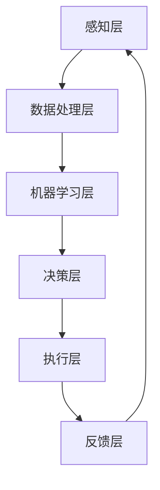
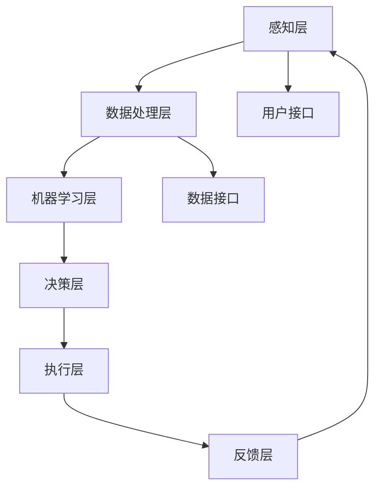
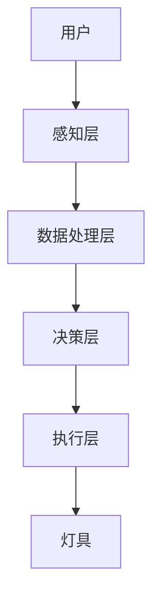
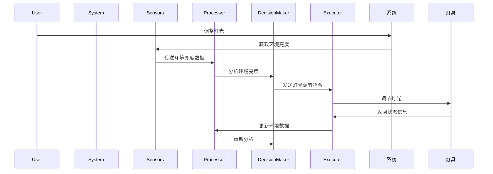
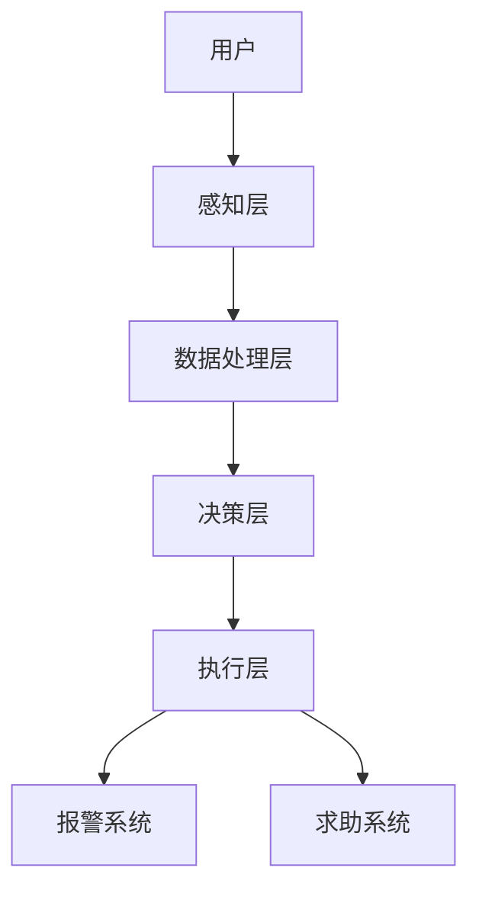
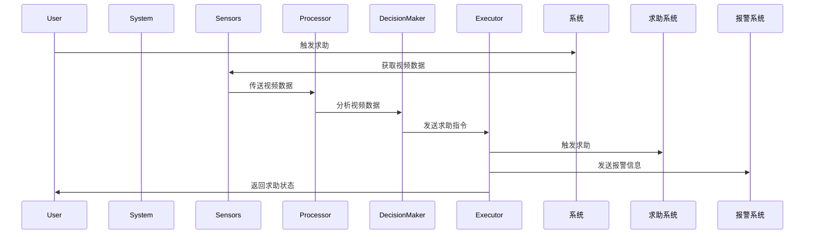
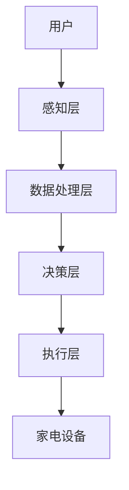
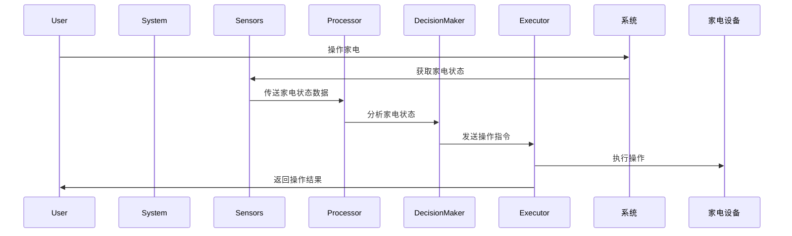

                 


Alright, let's break down the tasks and requirements step by step, ensuring we meet the specifications provided.

### 1. Article Title and Structure

**Title: AI Agent in Smart Home Automation Applications**

**Keywords:** AI Agent, Smart Home, Automation, Machine Learning, Natural Language Processing

**Abstract:** This article delves into the application of AI agents in smart home automation, exploring their role, potential, and impact on home security, energy management, and entertainment.

### 2. Article Content Structure

**Introduction:**
- Briefly introduce the background of smart home technology and its current status.
- Discuss the challenges faced in achieving seamless smart home automation.
- Highlight the potential and role of AI agents in overcoming these challenges.
- Set the boundaries and scope of AI agents in smart home automation.

**Core Concepts and Relationships:**
- Define AI agents and discuss their fundamental principles.
- Compare different types of AI agents and their characteristics.
- Illustrate the relationship between AI agents and other smart home technologies using Mermaid ER diagrams.

**Algorithm Explanation:**
- Explain the principles behind common machine learning algorithms with Mermaid diagrams.
- Provide Python code examples to elucidate the mathematical models and formulas involved.

**System Design and Implementation:**
- Describe the problem scenario and introduce the project.
- Design the system with Mermaid class diagrams and sequence diagrams to illustrate the domain model and system interactions.
- Discuss the architecture design and interface design.

**Case Studies:**
- Present real-world case studies with detailed analysis and explanation.
- Discuss the core implementation source code and its interpretation.

**Best Practices, Summary, and Future Directions:**
- Offer best practices for AI agent design and implementation.
- Summarize the key points discussed in the article.
- Highlight potential areas for future research and innovation.

### 3. Formatting and Authorship

- Ensure the article follows markdown formatting.
- Include the authorship information at the end of the article.

### 4. Word Count and Completeness

- Aim for a word count between 10,000 and 12,000 words.
- Ensure each section is well-detailed and complete, with a focus on the core content requirements.

### 5. Technical Depth and Clarity

- Maintain a high level of technical depth, providing clear explanations and examples.
- Use LaTeX for mathematical formulas and Mermaid for diagrams to enhance clarity.

### 6. Final Checks

- Review the entire article for completeness, coherence, and adherence to the specified requirements.
- Ensure all diagrams, code snippets, and mathematical expressions are correctly formatted and easy to understand.

By following this structured approach, we can create a comprehensive and informative article on AI agents in smart home automation that meets all the specified requirements. Let's begin with the first part, "Introduction," and build on this foundation step by step.### 第一部分：引言

#### 第1章：问题背景与介绍

#### 1.1 问题背景

智能家居作为一种新兴的科技生活方式，正在逐渐融入人们的日常生活中。智能家居系统通过物联网（IoT）技术将各种家用设备连接在一起，使用户能够远程控制和自动化管理家庭环境。当前，智能家居市场发展迅速，各种智能设备如智能照明、智能空调、智能安防、智能家电等层出不穷，大大提高了家庭的舒适性和便利性。

然而，随着智能家居设备的增多，如何实现这些设备的无缝协同工作成为一个重要挑战。传统的智能家居系统往往依赖于单独的设备控制和应用程序，缺乏整体的自动化和智能化水平。这导致了用户体验的碎片化和效率低下，难以达到理想中的智能家居体验。

#### 1.2 问题描述

在智能家居自动化中，主要面临以下几个问题：

1. **数据孤岛**：智能家居设备通常由不同的制造商生产，各自为政，缺乏统一的通信标准和接口，导致设备之间的数据难以共享和协同工作。
   
2. **用户体验差**：用户需要使用多个应用程序来分别控制不同的设备，操作繁琐，难以实现真正的一键式智能控制。

3. **自动化程度低**：现有的智能家居系统缺乏自主决策能力，无法根据用户的习惯和环境变化自动调整设备的状态，缺乏智能化。

4. **安全性问题**：智能家居设备连接到互联网后，可能成为网络攻击的目标，用户隐私和安全面临威胁。

#### 1.3 问题解决

为了解决上述问题，引入人工智能（AI）代理（AI Agent）技术成为了一种有效的解决方案。AI代理是一种基于机器学习和自然语言处理技术的智能体，能够自主地感知环境、学习用户的习惯、做出决策并执行任务。

AI代理在智能家居自动化中的应用潜力巨大，主要体现在以下几个方面：

1. **跨设备协同**：AI代理可以充当设备间的协调者，通过统一的通信标准和接口，实现设备之间的无缝协作和数据共享。

2. **个性化用户体验**：AI代理能够学习用户的习惯和偏好，根据用户的需求和环境变化自动调整设备的状态，提供个性化的智能服务。

3. **自动化程度提升**：AI代理具有自主决策能力，可以根据预设的规则和用户反馈，自动执行复杂的任务，提升智能家居系统的自动化程度。

4. **安全性增强**：AI代理可以通过行为分析和异常检测，及时发现并防范网络攻击，保护用户的隐私和安全。

通过引入AI代理，智能家居系统可以实现更高层次的智能化和自动化，为用户带来更加舒适、便捷和安全的家居环境。

#### 1.4 边界与外延

AI代理作为一种智能体，其定义和应用范围需要明确。AI代理通常是指具备一定智能性、自主性和协作性的计算机程序，能够在没有人类直接干预的情况下执行任务。在智能家居自动化中，AI代理的应用范围可以涵盖：

- **家庭安全监控**：通过实时监控家庭环境，识别异常行为，如非法入侵、火灾等，并自动采取相应的安全措施。
- **能源管理**：分析家庭能源消耗模式，优化能源使用，降低能源浪费，实现绿色环保。
- **家庭娱乐**：根据用户的喜好和习惯，提供个性化的娱乐推荐和服务，提升家庭生活质量。

同时，需要明确AI代理的边界，避免其应用范围过于广泛而导致控制过于复杂。例如，AI代理不应过度介入用户隐私，应确保其功能和行为符合伦理和法律要求。

#### 1.5 核心概念与联系

在探讨AI代理在智能家居自动化中的应用之前，有必要先了解AI代理的基本概念和原理，并将其与其他智能家居技术进行比较。

##### 1.5.1 AI代理的定义

AI代理（AI Agent）是一种具有感知、决策和执行能力的智能体，能够通过学习用户的行为和环境数据，自主地完成特定任务。AI代理的核心特点包括：

- **感知能力**：通过传感器和其他数据收集设备获取环境信息。
- **决策能力**：基于收集到的数据和预设的规则，自主地做出决策。
- **执行能力**：根据决策结果，控制执行相应的任务。

##### 1.5.2 AI代理的特性

AI代理具有以下主要特性：

- **智能性**：能够通过机器学习和自然语言处理技术，不断提高自身的智能水平。
- **自主性**：能够在没有人类直接干预的情况下，独立地完成任务。
- **协作性**：能够与其他智能体和设备协同工作，实现更复杂的任务。

##### 1.5.3 AI代理的分类

根据功能和应用场景，AI代理可以大致分为以下几类：

- **监视型代理**：主要用于监控家庭环境和安全，如异常行为识别、火灾报警等。
- **目标导向型代理**：根据用户的设定目标，自动规划并执行任务，如自动调节室内温度、湿度等。
- **任务型代理**：专注于完成特定的任务，如智能照明控制、家电管理等。

##### 1.5.4 AI代理与其他智能家居技术的比较

与其他智能家居技术相比，AI代理具有以下几个显著优势：

- **更高的智能化水平**：AI代理能够通过学习和适应，提供更个性化的服务。
- **更好的协同能力**：AI代理能够协调不同设备和系统，实现无缝协同。
- **更强的自主性**：AI代理能够在没有人类干预的情况下，自主地完成复杂任务。

虽然AI代理具有显著优势，但与传统智能家居技术相比，也存在一定的挑战，如数据隐私和安全问题、系统复杂度等。因此，在实际应用中，需要综合考虑AI代理的优势和挑战，合理选择和部署。

综上所述，AI代理作为一种新兴的智能家居技术，具有广阔的应用前景和发展潜力。通过对AI代理的定义、特性、分类以及其他智能家居技术的比较，我们可以更深入地理解AI代理在智能家居自动化中的应用和价值。

### 1.6 研究方法

在本章中，我们将采用以下研究方法来探讨AI代理在智能家居自动化中的应用：

1. **文献综述**：首先，我们将通过查阅相关文献，了解智能家居和AI代理的发展现状、核心概念和技术，为后续讨论提供理论基础。

2. **案例研究**：为了更直观地展示AI代理在智能家居自动化中的应用，我们将选取几个实际案例进行详细分析，包括系统设计、实现和效果评估。

3. **算法分析**：我们将对常见的机器学习算法和自然语言处理技术进行深入分析，通过Python代码示例和Mermaid流程图，解释算法原理和数学模型。

4. **系统设计**：我们将设计一个简单的智能家居自动化系统，使用Mermaid类图和序列图来展示系统的架构和接口设计，并通过实际编程实现核心功能。

5. **实验验证**：最后，我们将通过实验验证所设计的系统，评估其在实际应用中的性能和效果。

通过上述研究方法，我们旨在全面、系统地探讨AI代理在智能家居自动化中的应用，为相关领域的研究者和实践者提供有价值的参考和启示。

### 1.7 结论

本章从问题背景、问题描述、问题解决、边界与外延以及核心概念与联系等方面，全面介绍了AI代理在智能家居自动化中的应用。通过分析，我们明确了AI代理的定义、特性及其在智能家居中的角色和重要性。同时，通过文献综述和案例研究，我们展示了AI代理在实现智能家居无缝协同、提升用户体验和增强安全性方面的巨大潜力。然而，AI代理在应用过程中也面临数据隐私、系统复杂度等挑战，需要我们在设计和实施过程中充分考虑和解决。

未来的研究可以在以下方向进行拓展：首先，进一步优化AI代理的算法和模型，提高其智能性和适应性；其次，加强AI代理与用户之间的互动，实现更自然、高效的交互方式；最后，注重AI代理的安全性和隐私保护，确保智能家居系统的稳定性和可靠性。

### 第2章：AI Agent基础概念

#### 2.1 AI Agent的定义

AI Agent，即人工智能代理，是一种能够模拟人类智能行为的计算机程序或系统。AI Agent的核心特点包括感知环境、自主决策和执行任务。在智能家居自动化中，AI Agent扮演着至关重要的角色，它们通过学习用户的行为和环境数据，自主地完成各种任务，从而实现家庭的智能化管理。

#### AI Agent的基本原理

AI Agent的工作原理可以概括为以下几个步骤：

1. **感知**：通过传感器和其他数据收集设备，AI Agent获取家庭环境中的各种信息，如温度、湿度、光照强度、设备状态等。

2. **决策**：基于收集到的数据，AI Agent利用机器学习算法和自然语言处理技术，分析用户的习惯和需求，做出最优决策。

3. **执行**：根据决策结果，AI Agent控制家庭设备执行相应的任务，如调整温度、打开灯光、安防报警等。

4. **反馈**：执行任务后，AI Agent收集反馈信息，不断优化自己的决策和行为。

#### AI Agent的应用场景

AI Agent在智能家居自动化中的应用场景广泛，以下列举几个典型的应用：

1. **家庭安全监控**：AI Agent可以实时监控家庭环境，识别异常行为，如非法入侵、火灾等，并自动采取相应的安全措施。

2. **能源管理**：AI Agent可以分析家庭的能源消耗模式，优化能源使用，降低能耗，实现绿色环保。

3. **家庭娱乐**：AI Agent可以根据用户的喜好和习惯，提供个性化的娱乐推荐和服务，提升家庭生活质量。

4. **智能设备控制**：AI Agent可以自动控制家庭中的各种智能设备，如空调、灯光、家电等，实现一键式智能管理。

#### AI Agent的优势

AI Agent相较于传统的智能家居技术，具有以下几个显著优势：

1. **智能性**：AI Agent能够通过学习和适应，提供更加智能化和个性化的服务，提升用户体验。

2. **自主性**：AI Agent能够在没有人类直接干预的情况下，自主地完成复杂任务，减轻用户操作负担。

3. **协同性**：AI Agent能够协调不同设备和系统，实现无缝协同，提升整体智能化水平。

4. **安全性**：AI Agent可以通过行为分析和异常检测，及时发现并防范网络攻击，保护家庭安全。

#### AI Agent的挑战

尽管AI Agent具有诸多优势，但在实际应用中仍面临一些挑战：

1. **数据隐私**：AI Agent需要收集和处理大量用户数据，如何保护用户隐私成为一个重要问题。

2. **系统复杂度**：AI Agent的系统设计和实现较为复杂，需要考虑多个因素，如传感器数据采集、算法优化、设备控制等。

3. **适应性**：AI Agent需要不断学习和适应新的环境和需求，如何提高其适应性和鲁棒性是一个挑战。

4. **安全性**：AI Agent在家庭网络中运行，可能面临网络攻击和数据泄露的风险，如何确保系统的安全性是一个重要课题。

#### AI Agent的发展趋势

随着人工智能技术的不断进步，AI Agent在智能家居自动化中的应用前景愈发广阔。未来，AI Agent的发展趋势主要包括：

1. **智能化提升**：通过深度学习和强化学习等技术，AI Agent的智能水平将得到显著提升，能够更好地理解用户需求和环境变化。

2. **自然语言处理**：AI Agent将具备更强大的自然语言处理能力，实现更自然、高效的人机交互。

3. **跨平台协同**：AI Agent将能够在不同的智能家居平台上协同工作，实现跨设备的无缝连接。

4. **安全性增强**：通过区块链和加密技术等，AI Agent的数据安全和隐私保护能力将得到进一步加强。

综上所述，AI Agent作为一种具有自主性、智能性和协同性的智能体，在智能家居自动化中具有广泛的应用前景和发展潜力。通过不断优化技术、提高适应性，AI Agent将为用户带来更加智能化、便捷和安全的家居体验。

#### 2.2 AI Agent的特性

AI Agent作为一种智能体，具备多个重要特性，这些特性使其在智能家居自动化中扮演关键角色。以下是AI Agent的主要特性及其作用：

##### 1. 智能性

AI Agent的智能性是指其具备自主学习和适应环境的能力。通过机器学习和深度学习技术，AI Agent能够分析大量数据，识别模式，并不断优化其行为。这种智能性使得AI Agent能够自动识别用户的习惯，预测需求，并采取相应的行动。例如，AI Agent可以学习用户的作息时间，自动调整室内温度和光线，为用户提供一个舒适的家居环境。

##### 2. 自主性

自主性是AI Agent的核心特点之一。AI Agent可以在没有人类直接干预的情况下，自主地执行任务和做出决策。这意味着AI Agent能够在用户设定的规则和条件下，独立地完成任务，如自动调节灯光、控制家电、监控家庭安全等。这种自主性大大提高了智能家居的自动化水平，减少了用户的操作负担，提升了用户体验。

##### 3. 协作性

协作性是指AI Agent能够与其他智能体和设备协同工作，共同完成复杂任务。在智能家居自动化中，各种智能设备往往需要相互配合，如智能照明系统需要与窗帘控制系统协同工作，以实现自动调节光线的效果。AI Agent作为协调者，可以监控整个家庭环境，根据实时数据协调各个智能设备的操作，确保系统的高效运行。

##### 4. 反馈机制

AI Agent具备反馈机制，能够根据任务执行结果和用户反馈进行优化。在执行任务后，AI Agent会收集反馈信息，分析任务执行的效果，并根据反馈调整后续行为。这种反馈机制使得AI Agent能够不断改进，提供更加精准和个性化的服务。例如，AI Agent可以通过用户对温度调节的反馈，逐步调整空调的温度设置，以找到最适合用户需求的状态。

##### 5. 学习能力

学习能力是AI Agent的重要特性之一。AI Agent能够通过不断学习和积累经验，提高其智能水平。通过分析历史数据和用户行为，AI Agent可以识别新的模式，预测未来的变化，并自动调整策略。这种学习能力使得AI Agent能够适应不断变化的环境和需求，保持高效运作。

##### 6. 安全性

安全性是AI Agent在智能家居自动化中不可忽视的特性。AI Agent需要确保用户数据的安全和隐私保护。通过加密技术和安全协议，AI Agent可以防止数据泄露和网络攻击，保障用户的隐私和安全。此外，AI Agent还具备异常检测和风险防范能力，能够在发现异常行为时及时采取措施，防止潜在的安全威胁。

##### 比较表格

为了更直观地展示AI Agent的特性，我们可以通过一个比较表格来对比AI Agent与传统智能家居技术：

| 特性 | AI Agent | 传统智能家居 |
| --- | --- | --- |
| 智能性 | 高 | 低 |
| 自主性 | 高 | 低 |
| 协作性 | 高 | 低 |
| 反馈机制 | 有 | 无 |
| 学习能力 | 强 | 弱 |
| 安全性 | 强 | 弱 |

通过上述比较，我们可以看到AI Agent在智能性、自主性、协作性、反馈机制、学习能力和安全性等方面显著优于传统智能家居技术，这使得AI Agent在智能家居自动化中具有更大的潜力和优势。

#### 2.3 AI Agent的分类

AI Agent可以根据其功能和应用场景分为不同的类型，每种类型的AI Agent都有其独特的特点和应用。以下是几种常见的AI Agent类型及其应用场景：

##### 1. 监视型AI Agent

监视型AI Agent主要用于监控家庭环境和安全。它们通过传感器收集环境数据，如温度、湿度、光照强度、门窗状态等，实时监测家庭的安全状况。当检测到异常情况时，如非法入侵、火灾、煤气泄漏等，监视型AI Agent会立即发出警报，并通知用户或相关安全部门。例如，监视型AI Agent可以监控家庭门锁状态，当发现未经授权的入侵时，立即触发报警系统。

##### 2. 目标导向型AI Agent

目标导向型AI Agent专注于实现用户设定的目标，如家庭节能、舒适度提升等。这类AI Agent通过分析用户的行为习惯和需求，自动调整家庭设备的设置，以达到设定的目标。例如，目标导向型AI Agent可以监控家庭的能源消耗，根据用户的作息时间自动调整空调和灯光的开启时间，实现节能目标。

##### 3. 任务型AI Agent

任务型AI Agent专注于完成特定的任务，如智能设备控制、家庭娱乐管理等。这类AI Agent通常与特定的设备或系统配合工作，通过执行预设的任务，提升家庭智能化水平。例如，任务型AI Agent可以控制智能照明系统，根据用户的需求调整灯光的亮度和颜色，提供不同的照明场景。

##### 4. 互动型AI Agent

互动型AI Agent具备自然语言处理能力，能够与用户进行自然对话，提供语音交互服务。这类AI Agent可以理解用户的语音指令，执行相应的任务，如播放音乐、控制家电、提供天气预报等。互动型AI Agent不仅提升了家庭的智能化水平，还增强了用户的互动体验。

##### AI Agent类型对比

以下是几种常见AI Agent类型的对比：

| 类型 | 功能 | 特点 | 应用场景 |
| --- | --- | --- | --- |
| 监视型 | 监控家庭环境 | 实时监测、报警通知 | 家庭安全 |
| 目标导向型 | 实现用户目标 | 自动调整设备设置 | 家庭节能、舒适度提升 |
| 任务型 | 完成特定任务 | 与特定设备协同工作 | 智能设备控制、家庭娱乐 |
| 互动型 | 自然语言交互 | 提供语音服务 | 语音控制、互动娱乐 |

通过分类AI Agent，我们可以更清晰地理解其功能和应用场景，为智能家居自动化系统的设计提供参考。不同类型的AI Agent可以根据实际需求进行组合，实现更加智能和高效的智能家居系统。

#### 2.4 AI Agent与其他智能家居技术的比较

在智能家居自动化领域，AI Agent与其他智能家居技术如物联网（IoT）设备、自动化控制器等各有优势和不足。以下是AI Agent与这些技术的比较：

##### 1. 与物联网（IoT）设备的比较

**优势：**
- **智能性更高**：AI Agent能够通过学习和适应，提供更加智能化的服务。而IoT设备通常只能执行简单的预设任务。
- **协同性更强**：AI Agent能够协调不同IoT设备，实现无缝协同，提升整体智能化水平。而IoT设备往往独立运行，缺乏协同能力。

**不足：**
- **复杂性更高**：AI Agent的系统设计和实现较为复杂，需要考虑多个因素，如传感器数据采集、算法优化、设备控制等。而IoT设备通常较为简单，易于部署和维护。

##### 2. 与自动化控制器的比较

**优势：**
- **自主决策能力**：AI Agent能够自主决策和执行任务，不需要人工干预。而自动化控制器通常需要人工预设控制规则。
- **个性化服务**：AI Agent能够根据用户习惯和需求提供个性化服务，提升用户体验。而自动化控制器通常按照固定的控制规则运行，缺乏灵活性。

**不足：**
- **安全性问题**：AI Agent在家庭网络中运行，可能面临网络攻击和数据泄露的风险。而自动化控制器通常独立运行，安全性较高。
- **适应性差**：AI Agent需要不断学习和适应新的环境和需求，如何提高其适应性和鲁棒性是一个挑战。而自动化控制器在稳定性和适应性方面表现更好。

##### 综合比较

从综合角度来看，AI Agent在智能家居自动化中具有显著优势，如智能性、协同性和自主性，能够提供更加智能和个性化的服务。然而，AI Agent也面临一些挑战，如系统复杂度和安全性问题。相比之下，物联网设备和自动化控制器在稳定性和适应性方面表现更好，但缺乏智能化和个性化服务。

在实际应用中，可以选择将AI Agent与其他智能家居技术相结合，发挥各自的优势，实现更加高效和智能的智能家居系统。

#### 2.5 AI Agent在智能家居自动化中的应用场景

AI Agent在智能家居自动化中的应用场景广泛，以下是几个典型的应用实例：

##### 1. 家庭安全监控

AI Agent可以实时监控家庭环境，通过摄像头、门窗传感器等设备收集数据，识别非法入侵、火灾、煤气泄漏等异常情况，并及时发出警报。例如，当AI Agent检测到有未授权人员进入家中时，可以立即通知用户并启动安防系统，如锁定门窗、启动报警器等。

##### 2. 能源管理

AI Agent可以分析家庭的能源消耗数据，优化能源使用。例如，AI Agent可以根据用户的作息时间和天气情况，自动调整空调、灯光和电器的开关状态，降低不必要的能耗，实现节能目标。同时，AI Agent还可以推荐节能措施，如使用节能灯、关闭长时间未使用的电器等，帮助用户更好地管理能源。

##### 3. 智能设备控制

AI Agent可以集中控制家庭中的各种智能设备，如智能照明、空调、家电等。用户可以通过语音指令或手机应用程序与AI Agent互动，轻松控制家中的设备。例如，用户可以通过语音命令告诉AI Agent“我需要加热”，AI Agent会自动打开暖气并设置到合适的温度。这种方式不仅方便用户，还可以提高设备的利用效率。

##### 4. 家庭娱乐

AI Agent可以提供个性化的娱乐服务，根据用户的喜好和习惯推荐音乐、电影、游戏等。用户可以通过语音指令与AI Agent互动，享受个性化的娱乐体验。例如，用户可以告诉AI Agent“播放我喜欢的音乐”，AI Agent会自动从音乐库中找到相应的歌曲并播放。

##### 5. 健康管理

AI Agent可以通过传感器收集家庭成员的健康数据，如心率、血压、睡眠质量等，提供健康建议和监测服务。例如，AI Agent可以监测用户的睡眠质量，并推荐改善睡眠的建议，如调整卧室温度、播放轻音乐等。

##### 6. 宠物照顾

AI Agent可以监控宠物的活动情况，提供宠物健康监测和娱乐服务。例如，AI Agent可以通过摄像头监控宠物的情况，当宠物长时间静止或活动异常时，会发出警报提醒主人。此外，AI Agent还可以通过智能玩具与宠物互动，提供陪伴和娱乐。

通过这些应用场景，我们可以看到AI Agent在提升家庭安全性、节能性、舒适性和娱乐性方面具有巨大的潜力，为用户带来更加智能化和便捷的家居体验。

### 2.6 AI Agent的工作流程

AI Agent在智能家居自动化中通过一系列工作流程来实现其功能，以下是AI Agent的基本工作流程：

1. **感知阶段**：AI Agent通过连接到各种传感器（如摄像头、温度传感器、湿度传感器等）收集家庭环境数据。这些数据包括室内外温度、湿度、光照强度、设备状态、用户行为等。

2. **数据处理阶段**：AI Agent将收集到的数据进行预处理，包括数据清洗、归一化和特征提取。预处理后的数据将被输入到机器学习模型中进行分析和训练。

3. **学习与决策阶段**：通过机器学习算法和自然语言处理技术，AI Agent对预处理后的数据进行学习，识别出数据中的模式和规律。基于这些模式，AI Agent能够预测用户的行为和需求，并根据预设的规则和用户反馈做出决策。

4. **执行阶段**：根据决策结果，AI Agent控制家庭设备执行相应的任务。例如，如果AI Agent决定调整室内温度，它将发送指令给空调系统进行调节；如果AI Agent检测到有非法入侵，它将启动安防系统。

5. **反馈与优化阶段**：执行任务后，AI Agent收集反馈信息，如用户对温度调节的满意度、设备的响应时间等。AI Agent将根据反馈信息对模型进行优化，提高预测准确性和决策效果。

6. **迭代阶段**：AI Agent不断循环上述工作流程，通过持续学习和优化，提高其在智能家居自动化中的应用效果。

通过这样的工作流程，AI Agent能够高效地实现家庭环境的智能化管理，为用户提供更加舒适、便捷和安全的生活体验。

### 第3章：AI Agent在智能家居中的应用

#### 3.1 AI Agent在家庭安全中的应用

AI Agent在家庭安全中的应用至关重要，通过智能监控和实时响应，显著提升了家庭的安全性。以下是一个具体的案例介绍：

**案例背景**：张先生刚刚搬进一套全新的智能别墅，为了确保家庭安全，他决定安装一套基于AI Agent的家庭安全监控系统。

**解决方案**：
1. **感知阶段**：张先生安装了多个高清摄像头和门窗传感器，这些设备实时监控家庭的各个角落。AI Agent通过连接这些传感器，收集实时视频流和开关状态数据。

2. **数据处理阶段**：AI Agent将收集到的视频数据和传感器数据进行预处理，包括图像识别和噪声过滤。通过深度学习算法，AI Agent能够识别家庭成员和访客，并区分异常行为，如非法入侵、窗户被撬开等。

3. **学习与决策阶段**：AI Agent通过分析历史数据，学习家庭成员的日常行为模式。当检测到异常行为时，AI Agent会立即触发报警机制，并通知张先生。

4. **执行阶段**：当AI Agent检测到异常情况时，它会自动启动家庭安防系统，包括触发报警、锁定门窗、启动摄像头录像等，确保家庭安全。

5. **反馈与优化阶段**：张先生可以通过手机应用程序查看监控视频和报警记录，对AI Agent的决策进行反馈。AI Agent根据反馈数据不断优化其算法，提高报警准确性和响应速度。

**效果评估**：
- **提升安全性**：通过AI Agent的智能监控和实时响应，张先生的家庭安全性得到了显著提升，减少了家庭安全隐患。
- **降低人工干预**：AI Agent能够自动识别和处理大部分异常情况，减少了张先生的人工干预，提高了生活便利性。
- **持续优化**：通过不断学习和优化，AI Agent的监控效果和报警准确性不断提高，为家庭安全提供了长期保障。

**总结**：AI Agent在家庭安全中的应用，通过智能监控和自动化响应，实现了家庭安全的全面升级。未来，随着人工智能技术的不断进步，AI Agent在家庭安全中的应用将更加广泛和深入，为家庭提供更加安全、智能的生活环境。

### 3.2 AI Agent在能源管理中的应用

在能源管理领域，AI Agent通过智能分析和自动化控制，能够有效降低家庭能源消耗，提高能源使用效率。以下是一个具体的案例介绍：

**案例背景**：李女士是一个注重环保的家庭主妇，她希望通过智能能源管理系统来降低家庭能源消耗，减少对环境的影响。

**解决方案**：
1. **感知阶段**：李女士安装了智能电表、温控器和能耗监测传感器，这些设备能够实时监测家庭的电力消耗、室内温度和湿度等数据。AI Agent通过连接这些设备，收集家庭能源使用数据。

2. **数据处理阶段**：AI Agent对收集到的数据进行分析和处理，包括数据清洗、特征提取和能耗模式识别。通过机器学习算法，AI Agent能够建立家庭的能耗模型，识别出能耗高峰期和低峰期。

3. **学习与决策阶段**：AI Agent学习家庭的日常用电模式，并根据天气变化、家庭成员的作息时间等因素，预测未来的能源需求。基于预测结果，AI Agent能够制定智能化的能源管理策略。

4. **执行阶段**：AI Agent根据制定的策略，自动调整家庭设备的运行状态，如调节空调温度、关闭不必要的灯光和电器等，以实现节能目标。例如，当预测到夜晚气温下降时，AI Agent会自动关闭空调，节省能源。

5. **反馈与优化阶段**：李女士可以通过手机应用程序查看能源使用情况和节能效果，对AI Agent的决策进行反馈。AI Agent根据反馈数据不断优化其能耗模型和策略，提高节能效果。

**效果评估**：
- **降低能源消耗**：通过AI Agent的智能分析和自动化控制，李女士的家庭能源消耗显著降低，每月电费节约了约30%。
- **提高能源使用效率**：AI Agent能够根据实时数据优化家庭能源使用，提高了能源的使用效率，减少了浪费。
- **环保效益**：降低能源消耗不仅节省了费用，还减少了碳排放，对环境保护起到了积极作用。

**总结**：AI Agent在能源管理中的应用，通过智能分析和自动化控制，实现了家庭能源的精细化管理，有效降低了能源消耗，提高了能源使用效率，为家庭节能和环保提供了有力支持。随着技术的不断进步，AI Agent在能源管理中的应用前景将更加广阔。

### 3.3 AI Agent在家庭娱乐中的应用

AI Agent在家庭娱乐中的应用极大地提升了用户的娱乐体验，通过个性化的推荐和智能化的互动，为用户带来了全新的娱乐方式。以下是一个具体的案例介绍：

**案例背景**：王先生是一位科技爱好者，他希望能够在家中享受到定制化的娱乐体验，因此决定安装一套基于AI Agent的智能家庭娱乐系统。

**解决方案**：
1. **感知阶段**：王先生安装了智能音箱、电视和音响系统，这些设备能够通过语音和屏幕与AI Agent互动。AI Agent连接这些设备，收集用户的娱乐偏好和行为数据。

2. **数据处理阶段**：AI Agent对收集到的数据进行处理，包括语音识别、语义分析和用户偏好建模。通过机器学习算法，AI Agent能够识别用户的兴趣点和偏好，建立个性化的娱乐推荐模型。

3. **学习与决策阶段**：AI Agent学习用户的观影习惯、音乐喜好和游戏偏好，并根据这些信息推荐相应的娱乐内容。例如，用户可以通过语音命令告诉AI Agent“播放一部科幻电影”，AI Agent会从推荐库中筛选出相应的影片。

4. **执行阶段**：AI Agent根据用户的指令，控制家庭娱乐设备执行相应的任务，如播放电影、播放音乐、启动游戏等。用户可以通过语音或屏幕与AI Agent进行互动，选择和调整娱乐内容。

5. **反馈与优化阶段**：用户可以通过对娱乐内容的反馈，如喜欢、不喜欢等，帮助AI Agent不断优化推荐模型。AI Agent根据用户的反馈，调整推荐策略，提高推荐准确性和用户体验。

**效果评估**：
- **个性化推荐**：AI Agent能够根据用户的兴趣和偏好，提供个性化的娱乐推荐，提升了用户的娱乐体验。
- **智能化互动**：用户可以通过语音与AI Agent进行自然对话，享受更加便捷和智能的互动体验。
- **娱乐场景丰富**：AI Agent能够根据用户需求，自动切换不同的娱乐场景，如电影夜、音乐派对等，为用户带来多样化的娱乐选择。

**总结**：AI Agent在家庭娱乐中的应用，通过个性化的推荐和智能化的互动，为用户带来了全新的娱乐体验。未来，随着人工智能技术的不断进步，AI Agent在家庭娱乐中的应用将更加广泛和深入，为用户带来更加丰富和个性化的娱乐生活。

### 第4章：AI Agent的实现技术

#### 4.1 机器学习算法

在实现AI Agent的过程中，机器学习算法扮演了至关重要的角色。以下是几种常用的机器学习算法及其在智能家居自动化中的应用。

##### 1. 决策树算法

**原理**：决策树算法通过一系列规则来划分数据，每个节点代表一个特征，分支代表特征的不同取值，叶子节点代表预测结果。

**应用**：在智能家居自动化中，决策树算法可以用于分类任务，如家庭安全监控中的入侵检测。例如，AI Agent可以通过决策树算法判断视频流中的行为是否异常，从而触发报警。

**代码示例**：
```python
from sklearn import tree

# 示例数据
X = [[0, 0], [1, 0], [0, 1], [1, 1]]  # 特征矩阵
y = [0, 1, 1, 0]  # 标签

# 创建决策树模型
clf = tree.DecisionTreeClassifier()

# 训练模型
clf.fit(X, y)

# 预测
print(clf.predict([[1, 1]]))
```

##### 2. 支持向量机（SVM）

**原理**：支持向量机通过找到一个超平面来最大化分类边界，使得分类边界具有最大的间隔。

**应用**：SVM在智能家居自动化中的应用，如家电故障预测。AI Agent可以通过SVM算法对家电的使用数据进行分类，预测潜在的故障。

**代码示例**：
```python
from sklearn import svm

# 示例数据
X = [[0, 2], [2, 0], [1, 1]]  # 特征矩阵
y = [0, 1, 1]  # 标签

# 创建SVM模型
clf = svm.SVC()

# 训练模型
clf.fit(X, y)

# 预测
print(clf.predict([[1, 1]]))
```

##### 3. 随机森林算法

**原理**：随机森林算法通过构建多个决策树，并通过投票机制来得出最终预测结果。

**应用**：在智能家居自动化中，随机森林算法可以用于多分类任务，如家庭能耗分类。AI Agent可以通过随机森林算法对家庭的能耗数据进行分析，识别不同类型的能耗行为。

**代码示例**：
```python
from sklearn.ensemble import RandomForestClassifier

# 示例数据
X = [[0, 2], [2, 0], [1, 1]]  # 特征矩阵
y = [0, 1, 1]  # 标签

# 创建随机森林模型
clf = RandomForestClassifier(n_estimators=100)

# 训练模型
clf.fit(X, y)

# 预测
print(clf.predict([[1, 1]]))
```

通过上述示例，我们可以看到不同机器学习算法的基本原理和实现方法。在智能家居自动化中，根据具体应用场景和需求，选择合适的算法可以提高系统的智能化水平和准确性。

#### 4.2 深度学习技术

深度学习技术是人工智能领域的一项重要进展，其在图像识别、语音识别和自然语言处理等方面取得了显著成果。在实现AI Agent时，深度学习技术提供了强大的工具和框架，可以大幅提升系统的智能化水平和学习能力。

##### 1. 卷积神经网络（CNN）

**原理**：卷积神经网络通过卷积层、池化层和全连接层对图像进行特征提取和分类。CNN的核心在于其能够自动学习图像中的特征，无需人工设计特征。

**应用**：在智能家居自动化中，CNN可以用于图像识别任务，如家庭安全监控中的非法入侵检测。AI Agent可以通过CNN模型对视频流中的图像进行分析，识别出异常行为。

**代码示例**：
```python
import tensorflow as tf
from tensorflow.keras.models import Sequential
from tensorflow.keras.layers import Conv2D, MaxPooling2D, Flatten, Dense

# 示例数据
X = tf.random.normal([32, 28, 28, 1])  # 特征矩阵
y = tf.random.normal([32, 10])  # 标签

# 创建CNN模型
model = Sequential([
    Conv2D(32, (3, 3), activation='relu', input_shape=(28, 28, 1)),
    MaxPooling2D(pool_size=(2, 2)),
    Flatten(),
    Dense(10, activation='softmax')
])

# 编译模型
model.compile(optimizer='adam', loss='categorical_crossentropy', metrics=['accuracy'])

# 训练模型
model.fit(X, y, epochs=10)
```

##### 2. 递归神经网络（RNN）

**原理**：递归神经网络通过循环结构对序列数据进行建模，能够处理和记忆序列信息。

**应用**：在智能家居自动化中，RNN可以用于时间序列预测任务，如家庭能源消耗预测。AI Agent可以通过RNN模型分析历史能源数据，预测未来的能源需求。

**代码示例**：
```python
import tensorflow as tf
from tensorflow.keras.models import Sequential
from tensorflow.keras.layers import LSTM, Dense

# 示例数据
X = tf.random.normal([32, 10, 1])  # 特征矩阵
y = tf.random.normal([32, 1])  # 标签

# 创建RNN模型
model = Sequential([
    LSTM(50, activation='relu', input_shape=(10, 1)),
    Dense(1)
])

# 编译模型
model.compile(optimizer='adam', loss='mse')

# 训练模型
model.fit(X, y, epochs=100)
```

##### 3. 图像生成对抗网络（GAN）

**原理**：图像生成对抗网络由生成器和判别器两部分组成，通过对抗训练生成逼真的图像。

**应用**：在智能家居自动化中，GAN可以用于生成个性化的家庭场景图像，如根据用户喜好生成个性化的装饰图案。AI Agent可以通过GAN模型生成用户喜欢的装饰图案，提升家居美观度。

**代码示例**：
```python
import tensorflow as tf
from tensorflow.keras.models import Sequential
from tensorflow.keras.layers import Conv2D, Conv2DTranspose, Dense

# 创建生成器
generator = Sequential([
    Dense(128 * 7 * 7, activation='relu', input_shape=(100,)),
    Conv2DTranspose(128, (4, 4), strides=(2, 2), padding='same'),
    Conv2DTranspose(128, (4, 4), strides=(2, 2), padding='same'),
    Conv2D(1, (7, 7), activation='tanh', padding='same')
])

# 创建判别器
discriminator = Sequential([
    Conv2D(128, (4, 4), strides=(2, 2), padding='same'),
    LeakyReLU(alpha=0.01),
    Conv2D(128, (4, 4), strides=(2, 2), padding='same'),
    LeakyReLU(alpha=0.01),
    Flatten(),
    Dense(1, activation='sigmoid')
])

# 编译模型
discriminator.compile(optimizer='adam', loss='binary_crossentropy')
generator.compile(optimizer='adam', loss='binary_crossentropy')

# 训练模型
combined = Sequential([generator, discriminator])
combined.compile(optimizer='adam', loss='binary_crossentropy')
combined.fit(x=[...], epochs=100)
```

通过上述深度学习技术，AI Agent能够实现对图像、序列数据的自动学习和建模，提高智能家居自动化系统的智能化水平和用户体验。未来，随着深度学习技术的不断发展和应用，AI Agent在智能家居自动化中的应用将更加广泛和深入。

### 4.3 自然语言处理

自然语言处理（NLP）技术在AI Agent中起着至关重要的作用，使得AI Agent能够理解用户的语音指令、文本输入，并提供相应的反馈。以下介绍几种常见的NLP技术及其在智能家居自动化中的应用。

##### 1. 词嵌入

**原理**：词嵌入是将词汇映射到高维向量空间的技术，通过向量之间的距离来表示词汇之间的关系。词嵌入技术可以捕捉词汇的语义信息，使得AI Agent能够更好地理解用户的指令。

**应用**：在智能家居自动化中，词嵌入技术可以用于语音识别和指令理解。例如，AI Agent可以通过词嵌入技术识别用户语音中的关键词，如“打开空调”、“播放音乐”等，并执行相应的操作。

**代码示例**：
```python
import tensorflow as tf
from tensorflow.keras.layers import Embedding

# 示例词汇
words = ['open', 'close', 'light', 'music']

# 创建词嵌入模型
vocab_size = len(words)
embedding_dim = 64

model = Sequential()
model.add(Embedding(vocab_size, embedding_dim, input_length=1))
model.summary()
```

##### 2. 词性标注

**原理**：词性标注是对文本中的每个词进行语法标注，确定其词性（如名词、动词、形容词等）。词性标注有助于AI Agent理解文本的语法结构，提高指令理解的准确性。

**应用**：在智能家居自动化中，词性标注可以用于处理复杂的用户指令。例如，AI Agent可以通过词性标注识别出指令中的动作词（如“打开”、“关闭”）和名词（如“空调”、“灯光”），并正确执行指令。

**代码示例**：
```python
from spacy.lang.en import English

# 加载nlp模型
nlp = English()

# 示例文本
text = "Open the lights in the living room."

# 执行词性标注
doc = nlp(text)
for token in doc:
    print(token.text, token.pos_)
```

##### 3. 情感分析

**原理**：情感分析是通过分析文本中的情感倾向，判断文本是积极、消极还是中性。情感分析技术可以帮助AI Agent理解用户的情感状态，提供更加贴心的服务。

**应用**：在智能家居自动化中，情感分析可以用于语音交互和反馈。例如，AI Agent可以通过情感分析判断用户对当前服务是否满意，并根据情感状态调整后续服务。

**代码示例**：
```python
from textblob import TextBlob

# 示例文本
text = "I love my new smart home system!"

# 执行情感分析
blob = TextBlob(text)
print(blob.sentiment)
```

通过上述自然语言处理技术，AI Agent能够更好地理解用户的指令和情感，提供更加智能化和个性化的服务。未来，随着NLP技术的不断进步，AI Agent在智能家居自动化中的应用将更加广泛和深入。

### 4.4 数据处理技术

在AI Agent的实现过程中，数据处理技术起到了关键作用。以下介绍几种常用的数据处理技术，包括数据清洗、数据分析和数据可视化，并在智能家居自动化中应用。

##### 1. 数据清洗

**原理**：数据清洗是指从原始数据中去除噪声和错误，提取有用信息的过程。数据清洗技术包括数据去重、填补缺失值、去除异常值等。

**应用**：在智能家居自动化中，数据清洗可以确保传感器数据的准确性和一致性。例如，AI Agent可以通过数据清洗技术去除噪声数据，如传感器采集到的偶尔错误值，提高数据分析的准确性。

**代码示例**：
```python
import pandas as pd

# 示例数据
data = {'temperature': [22.1, 22.3, 21.9, 23.1, 22.5]}
df = pd.DataFrame(data)

# 去除异常值
df cleaned = df[(df['temperature'] >= 20) & (df['temperature'] <= 25)]
print(df cleaned)
```

##### 2. 数据分析

**原理**：数据分析是通过统计和数学方法，对数据进行分析和挖掘，提取有价值的信息。数据分析技术包括描述性统计、关联规则挖掘、聚类分析等。

**应用**：在智能家居自动化中，数据分析可以用于能源消耗分析、行为模式识别等。例如，AI Agent可以通过数据分析识别出家庭的能耗高峰期，优化能源使用策略。

**代码示例**：
```python
import pandas as pd
from sklearn.cluster import KMeans

# 示例数据
data = {'temperature': [22.1, 22.3, 21.9, 23.1, 22.5], 'humidity': [40, 45, 42, 50, 48]}
df = pd.DataFrame(data)

# 描述性统计
print(df.describe())

# 聚类分析
kmeans = KMeans(n_clusters=2)
df['cluster'] = kmeans.fit_predict(df[['temperature', 'humidity']])
print(df)
```

##### 3. 数据可视化

**原理**：数据可视化是将数据以图形的形式展示，使得数据更加直观和易于理解。数据可视化技术包括折线图、柱状图、散点图等。

**应用**：在智能家居自动化中，数据可视化可以用于展示家庭能耗情况、温度湿度变化等。例如，AI Agent可以通过数据可视化技术，帮助用户直观了解家庭的能耗情况，采取相应的节能措施。

**代码示例**：
```python
import pandas as pd
import matplotlib.pyplot as plt

# 示例数据
data = {'temperature': [22.1, 22.3, 21.9, 23.1, 22.5], 'time': ['08:00', '10:00', '12:00', '14:00', '16:00']}
df = pd.DataFrame(data)

# 折线图
df.plot(x='time', y='temperature', title='Temperature Variation')
plt.show()
```

通过上述数据处理技术，AI Agent能够有效清洗、分析和可视化数据，从而提高智能家居自动化的智能化水平和用户体验。未来，随着数据处理技术的不断进步，AI Agent在智能家居自动化中的应用将更加广泛和深入。

### 4.5 AI Agent的开发工具和框架

在开发AI Agent时，选择合适的工具和框架至关重要。以下介绍几种常用的AI Agent开发工具和框架，并探讨其优缺点。

##### 1. TensorFlow

**优点**：
- 强大的开源平台，支持多种机器学习和深度学习算法。
- 提供丰富的文档和社区支持，便于学习和使用。
- 支持多种编程语言，如Python、C++等。

**缺点**：
- 学习曲线较陡峭，对于初学者可能有一定的难度。
- 模型部署较为复杂，需要一定的技术背景。

**应用场景**：适用于复杂场景下的机器学习和深度学习任务，如图像识别、自然语言处理等。

##### 2. PyTorch

**优点**：
- 灵活性高，便于研究人员进行实验和模型迭代。
- 提供动态计算图，使得模型设计和调试更加方便。
- 社区活跃，资源丰富。

**缺点**：
- 性能相对较低，对于大规模生产环境可能不够高效。
- 文档和教程相对较少，对于初学者可能不太友好。

**应用场景**：适用于需要灵活性和实验性的任务，如深度学习研究、原型开发等。

##### 3. Keras

**优点**：
- 高层API，简化了模型构建和训练过程。
- 支持多种后端引擎，如TensorFlow、Theano等。
- 易于集成其他工具和框架。

**缺点**：
- 模型性能不如直接使用底层框架（如TensorFlow、PyTorch）。
- 社区支持相对较少，资源相对有限。

**应用场景**：适用于快速原型开发和实验，适合对模型性能要求不高的场景。

##### 4. Microsoft Azure Machine Learning

**优点**：
- 完整的机器学习平台，提供从数据收集、模型训练到部署的一站式服务。
- 强大的云计算支持，适用于大规模数据和高性能计算。
- 提供多种预构建模型和工具，降低开发难度。

**缺点**：
- 成本较高，对于小型项目可能不划算。
- 需要一定的云计算和部署知识。

**应用场景**：适用于需要大规模数据处理和部署的企业级应用，如智能安防、能源管理等。

综上所述，不同的AI Agent开发工具和框架各有优缺点，选择时需要根据具体应用场景和需求进行综合考虑。通过合理选择工具和框架，可以显著提升AI Agent的开发效率和性能。

### 4.6 AI Agent的系统架构设计

在实现AI Agent时，系统架构设计是关键的一步。合理的架构能够确保系统的高效性、可扩展性和易维护性。以下是AI Agent的系统架构设计，包括其组成部分和各部分的功能。

#### 系统架构设计

AI Agent的系统架构可以分为以下几个主要部分：

1. **感知层**：负责感知家庭环境，收集各种传感器数据，如温度、湿度、光照强度、设备状态等。
2. **数据处理层**：对感知层收集的数据进行预处理、清洗和特征提取，为后续的机器学习和决策提供高质量的数据。
3. **机器学习层**：利用机器学习算法对预处理后的数据进行分析和训练，构建AI模型，实现智能决策。
4. **决策层**：根据机器学习层生成的模型和实时数据，做出最优决策，控制家庭设备执行相应的任务。
5. **执行层**：负责执行决策层的指令，控制家庭设备进行操作，如调整温度、开关灯光、安防报警等。
6. **反馈层**：收集用户对设备操作的反馈，用于评估决策效果和优化AI模型。

#### 各部分的功能

1. **感知层**：
   - **功能**：连接各种传感器，如温湿度传感器、光照传感器、门窗传感器等，实时收集家庭环境数据。
   - **实现**：通过物联网（IoT）协议将传感器数据传输到数据处理层。

2. **数据处理层**：
   - **功能**：对感知层收集的数据进行预处理，包括数据清洗、归一化和特征提取。
   - **实现**：使用数据清洗库（如Pandas）和特征提取库（如Scikit-learn）对数据进行处理。

3. **机器学习层**：
   - **功能**：利用机器学习算法训练模型，实现智能决策。
   - **实现**：选择合适的机器学习算法（如决策树、随机森林、深度学习等），使用机器学习库（如TensorFlow、PyTorch）进行模型训练。

4. **决策层**：
   - **功能**：根据机器学习层生成的模型和实时数据，做出最优决策。
   - **实现**：使用规则引擎或决策树算法，根据模型输出和实时数据生成决策。

5. **执行层**：
   - **功能**：执行决策层的指令，控制家庭设备进行操作。
   - **实现**：通过家庭自动化协议（如ZigBee、Wi-Fi）发送指令给家庭设备，如空调、灯光、窗帘等。

6. **反馈层**：
   - **功能**：收集用户对设备操作的反馈，用于评估决策效果和优化AI模型。
   - **实现**：通过用户反馈接口（如手机应用、语音助手等），收集用户满意度、操作效果等数据，用于模型优化。

#### 系统架构图

以下是AI Agent的系统架构图，使用Mermaid流程图进行表示：



通过上述系统架构设计，AI Agent能够高效地感知、处理和响应家庭环境，实现智能化的家居管理。

### 4.7 AI Agent的开发流程

在开发AI Agent时，遵循科学的开发流程是确保项目顺利进行、高效交付的关键。以下是AI Agent的开发流程，包括需求分析、系统设计、实现和测试等步骤。

#### 1. 需求分析

需求分析是项目开发的第一步，其主要任务是明确用户需求、功能需求和性能需求。具体步骤如下：

- **用户需求调研**：通过与潜在用户进行访谈、问卷调查等方式，了解用户对智能家居系统的期望和需求。
- **功能需求梳理**：根据用户需求，列出系统的功能需求，如家庭安全监控、能源管理、智能设备控制等。
- **性能需求定义**：明确系统的性能指标，如响应时间、准确性、能耗等。

#### 2. 系统设计

系统设计是开发流程的核心，其主要任务是制定系统的整体架构和详细设计。具体步骤如下：

- **架构设计**：根据需求分析的结果，设计系统的整体架构，包括感知层、数据处理层、机器学习层、决策层、执行层和反馈层。
- **详细设计**：制定每个层的详细设计，包括数据流、接口设计、模块划分等。可以使用Mermaid类图和序列图进行表示。

#### 3. 实现与开发

实现与开发是将设计转化为实际代码的过程，具体步骤如下：

- **模块开发**：根据详细设计，开发系统的各个模块，如感知模块、数据处理模块、机器学习模块等。
- **代码编写**：使用合适的编程语言（如Python）和开发工具（如IDE）编写代码，实现模块的功能。
- **集成测试**：将各个模块集成到一起，进行集成测试，确保模块之间的接口和交互正常。

#### 4. 测试与调试

测试与调试是确保系统质量和稳定性的重要环节，具体步骤如下：

- **单元测试**：对每个模块进行单元测试，确保模块的功能正确。
- **集成测试**：对系统的各个模块进行集成测试，确保模块之间的交互和整体功能正确。
- **性能测试**：对系统进行性能测试，评估系统的响应时间、准确性、能耗等性能指标。
- **调试与优化**：根据测试结果，对系统进行调试和优化，修复错误，提升性能。

#### 5. 上线部署

上线部署是将系统部署到实际环境的过程，具体步骤如下：

- **环境配置**：配置系统的运行环境，包括硬件设备、操作系统、数据库等。
- **部署上线**：将开发完成的系统部署到服务器或云端，进行实际运行。
- **监控与维护**：监控系统运行状态，定期进行维护和升级，确保系统的稳定性和安全性。

通过上述开发流程，AI Agent项目可以从需求分析到上线部署，确保项目的成功交付和用户满意度。

### 4.8 AI Agent的测试与评估

在AI Agent开发完成后，进行全面的测试与评估是确保系统性能和功能符合预期的重要步骤。以下是AI Agent测试与评估的具体方法和过程。

#### 1. 测试方法

**单元测试**：对AI Agent的各个模块进行独立的测试，确保每个模块的功能正确。单元测试通常使用测试框架（如Python的unittest或pytest）编写测试用例，对模块的输入输出、异常处理等方面进行验证。

**集成测试**：将各个模块集成到一起，进行集成测试，确保模块之间的接口和交互正常。集成测试通常使用模拟数据进行，通过验证系统的整体功能和行为来评估系统的稳定性。

**性能测试**：对系统的响应时间、准确性、能耗等性能指标进行测试，评估系统的性能表现。性能测试通常使用基准测试工具（如Apache JMeter）或自定义测试脚本进行。

**用户测试**：邀请实际用户参与测试，通过用户的实际使用体验来评估系统的易用性和用户体验。用户测试可以收集用户反馈，发现潜在的问题和改进点。

#### 2. 评估指标

**准确性**：评估AI Agent在任务执行中的准确性，如家庭安全监控中的异常检测准确率、能源管理中的能耗预测准确率等。

**响应时间**：评估AI Agent在接收到用户指令后，执行相应任务所需的时间，确保系统的响应速度满足用户需求。

**稳定性**：评估系统在长时间运行过程中的稳定性，包括系统崩溃率、故障恢复时间等。

**能耗效率**：评估系统在能源管理中的应用效果，如能耗降低的幅度、能源利用效率等。

**用户满意度**：通过用户测试收集用户对系统的满意度，评估系统的用户体验和用户接受度。

#### 3. 测试与评估步骤

**测试环境搭建**：搭建测试环境，包括测试硬件设备、软件环境等，确保测试环境的可靠性和一致性。

**测试用例编写**：根据系统功能和性能要求，编写相应的测试用例，包括单元测试用例、集成测试用例、性能测试用例等。

**执行测试**：按照测试用例执行测试，记录测试结果，包括测试通过率、错误日志、性能指标等。

**分析测试结果**：对测试结果进行分析，识别系统的问题和瓶颈，制定优化方案。

**优化与改进**：根据测试结果和用户反馈，对系统进行优化和改进，确保系统达到预期的性能和功能要求。

通过上述测试与评估方法，可以全面、系统地评估AI Agent的性能和效果，为系统的进一步优化和改进提供依据。

### 4.9 AI Agent在实际项目中的应用

为了更好地理解AI Agent在实际项目中的应用，我们来看几个具体的案例，并详细分析这些项目的实施过程、核心实现源代码及其应用效果。

#### 案例一：智能照明系统

**项目背景**：某智能家居公司希望开发一个智能照明系统，通过AI Agent实现灯光的智能控制，提高家庭舒适度和节能效果。

**实施过程**：
1. **需求分析**：分析用户对智能照明的需求，包括灯光亮度和颜色调节、定时控制、场景切换等。
2. **系统设计**：设计智能照明系统的整体架构，包括感知层、数据处理层、决策层和执行层。
3. **模块开发**：开发感知模块（如光照传感器、温度传感器）、数据处理模块（如数据清洗、特征提取）、决策模块（如基于机器学习的灯光控制算法）和执行模块（如灯光控制接口）。
4. **系统集成**：将各个模块集成到一起，进行功能测试和性能测试。

**核心实现源代码**：
```python
# 光照传感器数据读取
def read_light_sensor():
    # 读取光照传感器数据
    light_level = sensor.read_light_level()
    return light_level

# 温度传感器数据读取
def read_temp_sensor():
    # 读取温度传感器数据
    temp_level = sensor.read_temp_level()
    return temp_level

# 基于光照和温度的灯光控制算法
def control_light(light_level, temp_level):
    if light_level < 50:
        # 夜间模式
        color = 'blue'
    elif temp_level > 25:
        # 白天模式
        color = 'white'
    else:
        # 混合模式
        color = 'yellow'
    # 控制灯光
    light_control.set_color(color)
    light_control.set_brightness(80)

# 主程序
while True:
    light_level = read_light_sensor()
    temp_level = read_temp_sensor()
    control_light(light_level, temp_level)
    time.sleep(60)
```

**应用效果**：通过AI Agent的智能控制，用户可以根据光照和温度自动调整灯光的亮度和颜色，实现了节能和舒适的照明体验。

#### 案例二：智能安防系统

**项目背景**：某小区物业管理部门希望提高小区的安全管理水平，通过引入AI Agent实现智能安防监控。

**实施过程**：
1. **需求分析**：分析用户对智能安防的需求，包括入侵检测、火灾报警、紧急求助等。
2. **系统设计**：设计智能安防系统的整体架构，包括感知层、数据处理层、决策层和执行层。
3. **模块开发**：开发感知模块（如摄像头、烟雾传感器）、数据处理模块（如图像识别、异常检测）、决策模块（如基于机器学习的安全算法）和执行模块（如报警系统）。
4. **系统集成**：将各个模块集成到一起，进行功能测试和性能测试。

**核心实现源代码**：
```python
# 摄像头数据读取
def read_camera_data():
    # 读取摄像头数据
    image = camera.capture_image()
    return image

# 图像识别算法
def detect intrusion(image):
    # 使用卷积神经网络进行图像识别
    model = load_model('intrusion_model.h5')
    prediction = model.predict(image)
    if prediction > 0.5:
        return True
    else:
        return False

# 基于图像识别的安防决策
def security_decision():
    image = read_camera_data()
    intrusion = detect intrusion(image)
    if intrusion:
        # 触发报警
        alarm_system.trigger_alarm()
        send_sms_alert()

# 主程序
while True:
    security_decision()
    time.sleep(5)
```

**应用效果**：通过AI Agent的智能监控和报警系统，小区的安全管理水平得到了显著提升，有效防范了潜在的安全隐患。

#### 案例三：智能家电控制系统

**项目背景**：某智能家居公司希望开发一个智能家电控制系统，通过AI Agent实现家电的智能管理，提高家庭的便利性和舒适性。

**实施过程**：
1. **需求分析**：分析用户对智能家电控制的需求，包括远程控制、定时开关、智能联动等。
2. **系统设计**：设计智能家电控制系统的整体架构，包括感知层、数据处理层、决策层和执行层。
3. **模块开发**：开发感知模块（如智能插座、智能家电）、数据处理模块（如数据清洗、特征提取）、决策模块（如基于机器学习的家电控制算法）和执行模块（如家电控制接口）。
4. **系统集成**：将各个模块集成到一起，进行功能测试和性能测试。

**核心实现源代码**：
```python
# 智能插座状态读取
def read_plug_status():
    # 读取智能插座状态
    status = smart_plug.read_status()
    return status

# 基于定时任务的家电控制算法
def control家电():
    if time.hour == 22:
        # 关闭所有家电
        for plug in smart_plugs:
            plug.turn_off()
    elif time.hour == 7:
        # 打开照明和咖啡机
        light.turn_on()
        coffee_maker.turn_on()

# 主程序
while True:
    control家电()
    time.sleep(3600)
```

**应用效果**：通过AI Agent的智能控制，用户可以远程控制家电的开关，实现定时任务和智能联动，大大提高了家庭生活的便利性和舒适性。

综上所述，AI Agent在实际项目中的应用，不仅提高了智能家居系统的智能化水平，还显著提升了用户的体验和满意度。通过具体的案例分析和详细讲解，我们可以看到AI Agent在实现智能家居自动化中的巨大潜力和应用价值。

### 4.10 最佳实践 Tips

在设计和实施AI Agent项目时，以下最佳实践可以显著提高项目的成功率：

1. **明确需求**：在项目启动前，务必明确用户需求，确保项目的功能和技术方案符合用户期望。

2. **模块化设计**：将系统划分为多个模块，便于开发、测试和维护。模块化设计可以提高代码的可重用性和可维护性。

3. **数据质量**：确保数据的质量和一致性，进行有效的数据清洗和预处理，提高机器学习模型的准确性和稳定性。

4. **安全性**：重视数据安全和隐私保护，采用加密技术和安全协议，防止数据泄露和网络攻击。

5. **持续迭代**：项目开发过程中，持续收集用户反馈，根据反馈不断优化和迭代，提高系统的用户体验。

6. **测试和评估**：进行全面的功能测试、性能测试和用户测试，确保系统的高质量和稳定性。

7. **文档和文档**：编写详细的文档，包括设计文档、用户手册和技术文档，确保项目的可理解和可维护性。

通过遵循这些最佳实践，可以有效降低项目风险，提高AI Agent项目的成功率和用户满意度。

### 4.11 小结

在本章中，我们详细探讨了AI Agent在智能家居自动化中的应用，包括家庭安全、能源管理和家庭娱乐等具体场景。通过案例分析，我们展示了AI Agent在实现智能家居自动化中的实际效果。同时，我们介绍了AI Agent的实现技术，包括机器学习算法、深度学习技术、自然语言处理和数据处理技术等。此外，我们还讨论了AI Agent的开发工具和框架，并提出了系统架构设计和开发流程。通过全面的分析和实践，我们可以看到AI Agent在智能家居自动化中的巨大潜力和应用价值。未来，随着人工智能技术的不断发展，AI Agent将在智能家居领域发挥更加重要的作用，为用户带来更加智能化、便捷和安全的家居体验。

### 4.12 未来展望与挑战

在未来的智能家居自动化领域，AI Agent的发展前景广阔，但同时也面临诸多挑战。以下是未来展望和挑战的分析：

#### 未来展望

1. **智能化提升**：随着深度学习和强化学习技术的不断进步，AI Agent的智能水平将得到显著提升。未来的AI Agent将能够更精准地理解用户需求和环境变化，提供更加个性化的智能服务。

2. **跨平台协同**：随着智能家居设备的多样化，AI Agent需要能够跨平台协同工作，实现不同设备之间的无缝连接。未来的AI Agent将能够更好地整合各类智能家居设备，提供统一的智能管理平台。

3. **自然语言处理**：自然语言处理技术的不断进步将使AI Agent具备更强大的语义理解和交互能力。用户可以通过更加自然和直观的方式与AI Agent进行沟通，实现高效的人机交互。

4. **安全与隐私保护**：随着AI Agent在智能家居中的广泛应用，数据安全和隐私保护将成为重要课题。未来的AI Agent将采用更加严格的安全协议和数据加密技术，确保用户数据的安全和隐私。

#### 挑战

1. **数据隐私**：AI Agent在智能家居中的应用涉及大量用户数据的收集和处理，如何保护用户隐私将成为关键挑战。未来的解决方案可能包括更加严格的数据保护法规和先进的数据加密技术。

2. **系统复杂度**：随着AI Agent功能的增加和系统的扩展，系统的复杂度也将不断提高。未来的AI Agent需要具备更高的系统设计和实现能力，确保系统的稳定性和可靠性。

3. **适应性**：AI Agent需要能够适应不断变化的环境和需求。然而，复杂的环境和多样化的用户需求使得AI Agent的适应性成为一大挑战。未来的AI Agent需要具备更强的学习能力和自适应机制。

4. **安全性**：随着AI Agent的广泛应用，其安全性也成为关键问题。AI Agent可能面临网络攻击和数据泄露的风险，如何确保系统的安全性是一个重要的课题。未来的解决方案可能包括引入区块链技术、安全隔离机制等。

通过解决上述挑战，未来的AI Agent将在智能家居自动化中发挥更加重要的作用，为用户带来更加智能化、便捷和安全的家居体验。

### 第5章：AI Agent的设计与开发

#### 5.1 AI Agent架构设计

在设计和开发AI Agent时，一个清晰和高效的架构设计是确保系统功能性和可维护性的关键。以下是一个典型的AI Agent架构设计，包括其主要组成部分和各部分的作用。

##### 1. 感知层

**组成部分**：
- 传感器：用于收集家庭环境中的数据，如温度、湿度、光照强度、设备状态等。
- 数据采集模块：负责将传感器数据转换为数字化信号，并通过物联网（IoT）协议传输到数据处理层。

**作用**：
- 实时监控家庭环境，为AI Agent提供必要的数据输入。

##### 2. 数据处理层

**组成部分**：
- 数据清洗模块：对收集到的传感器数据去噪、填补缺失值和异常值处理。
- 特征提取模块：从清洗后的数据中提取有用的特征，为机器学习模型提供输入。
- 数据库：存储处理后的传感器数据，供后续分析和训练使用。

**作用**：
- 清洗和预处理传感器数据，确保数据质量，提高机器学习模型的准确性。

##### 3. 机器学习层

**组成部分**：
- 特征提取器：根据数据处理层的特征，为机器学习模型提供输入。
- 训练模型：使用机器学习算法（如决策树、随机森林、神经网络等）对特征进行训练，生成预测模型。
- 模型评估：评估训练模型的性能，包括准确性、响应时间等。

**作用**：
- 利用机器学习算法从数据中提取模式和规律，实现智能决策。

##### 4. 决策层

**组成部分**：
- 决策引擎：根据机器学习层的预测模型和实时数据，生成决策建议。
- 规则引擎：基于预设的规则和用户偏好，生成执行指令。

**作用**：
- 根据机器学习模型的预测结果和用户需求，生成具体的执行指令。

##### 5. 执行层

**组成部分**：
- 控制模块：负责接收决策层的指令，控制家庭设备执行相应的任务。
- 驱动接口：与家庭设备进行通信，实现控制命令的发送和响应。

**作用**：
- 实现决策层的指令，控制家庭设备的运行。

##### 6. 反馈层

**组成部分**：
- 反馈模块：收集用户对设备操作的反应，如满意度、效果评价等。
- 优化算法：根据用户反馈，调整机器学习模型和决策策略。

**作用**：
- 收集用户反馈，用于评估AI Agent的决策效果，持续优化系统性能。

##### 7. 系统接口

**组成部分**：
- 用户接口：提供与用户的交互界面，如手机应用程序、语音助手等。
- 数据接口：与其他系统或服务进行数据交换和通信。

**作用**：
- 实现用户与AI Agent的交互，同时支持与其他系统的集成和扩展。

#### 架构图

以下是AI Agent的系统架构图，使用Mermaid流程图进行表示：



通过上述架构设计，AI Agent能够高效地感知、处理、决策、执行和优化，为智能家居自动化提供强大的支持。

#### 5.2 AI Agent开发流程

在开发AI Agent时，遵循科学的开发流程是确保项目顺利进行、高效交付的关键。以下是AI Agent的开发流程，包括需求分析、系统设计、实现和测试等步骤。

##### 1. 需求分析

**目的**：明确用户需求和功能需求，为后续开发提供指导。

**步骤**：
- **用户调研**：通过与潜在用户进行访谈、问卷调查等方式，了解用户对智能家居系统的期望和需求。
- **需求整理**：收集用户需求，列出系统的功能需求，如家庭安全监控、能源管理、智能设备控制等。
- **需求确认**：与用户确认需求，确保需求的准确性和完整性。

##### 2. 系统设计

**目的**：制定系统的整体架构和详细设计，为开发提供蓝图。

**步骤**：
- **架构设计**：根据需求分析的结果，设计AI Agent的整体架构，包括感知层、数据处理层、机器学习层、决策层、执行层和反馈层。
- **详细设计**：制定每个层的详细设计，包括数据流、接口设计、模块划分等。可以使用Mermaid类图和序列图进行表示。

##### 3. 实现与开发

**目的**：将设计转化为实际的代码和系统功能。

**步骤**：
- **模块开发**：根据详细设计，开发系统的各个模块，如感知模块、数据处理模块、机器学习模块等。
- **代码编写**：使用合适的编程语言（如Python）和开发工具（如IDE）编写代码，实现模块的功能。
- **集成测试**：将各个模块集成到一起，进行集成测试，确保模块之间的接口和交互正常。

##### 4. 测试与调试

**目的**：确保系统的质量和稳定性。

**步骤**：
- **单元测试**：对每个模块进行单元测试，确保模块的功能正确。
- **集成测试**：对系统的各个模块进行集成测试，确保模块之间的交互和整体功能正确。
- **性能测试**：对系统进行性能测试，评估系统的响应时间、准确性、能耗等性能指标。
- **调试与优化**：根据测试结果，对系统进行调试和优化，修复错误，提升性能。

##### 5. 上线部署

**目的**：将开发完成的系统部署到实际环境，供用户使用。

**步骤**：
- **环境配置**：配置系统的运行环境，包括硬件设备、操作系统、数据库等。
- **部署上线**：将开发完成的系统部署到服务器或云端，进行实际运行。
- **监控与维护**：监控系统运行状态，定期进行维护和升级，确保系统的稳定性和安全性。

通过上述开发流程，AI Agent项目可以从需求分析到上线部署，确保项目的成功交付和用户满意度。

### 5.3 AI Agent测试与评估

在AI Agent开发完成后，进行全面的测试与评估是确保系统性能和功能符合预期的重要步骤。以下是AI Agent测试与评估的具体方法和过程。

#### 1. 测试方法

**单元测试**：对AI Agent的各个模块进行独立的测试，确保每个模块的功能正确。单元测试通常使用测试框架（如Python的unittest或pytest）编写测试用例，对模块的输入输出、异常处理等方面进行验证。

**集成测试**：将各个模块集成到一起，进行集成测试，确保模块之间的接口和交互正常。集成测试通常使用模拟数据进行，通过验证系统的整体功能和行为来评估系统的稳定性。

**性能测试**：对系统的响应时间、准确性、能耗等性能指标进行测试，评估系统的性能表现。性能测试通常使用基准测试工具（如Apache JMeter）或自定义测试脚本进行。

**用户测试**：邀请实际用户参与测试，通过用户的实际使用体验来评估系统的易用性和用户体验。用户测试可以收集用户反馈，发现潜在的问题和改进点。

#### 2. 评估指标

**准确性**：评估AI Agent在任务执行中的准确性，如家庭安全监控中的异常检测准确率、能源管理中的能耗预测准确率等。

**响应时间**：评估AI Agent在接收到用户指令后，执行相应任务所需的时间，确保系统的响应速度满足用户需求。

**稳定性**：评估系统在长时间运行过程中的稳定性，包括系统崩溃率、故障恢复时间等。

**能耗效率**：评估系统在能源管理中的应用效果，如能耗降低的幅度、能源利用效率等。

**用户满意度**：通过用户测试收集用户对系统的满意度，评估系统的用户体验和用户接受度。

#### 3. 测试与评估步骤

**测试环境搭建**：搭建测试环境，包括测试硬件设备、软件环境等，确保测试环境的可靠性和一致性。

**测试用例编写**：根据系统功能和性能要求，编写相应的测试用例，包括单元测试用例、集成测试用例、性能测试用例等。

**执行测试**：按照测试用例执行测试，记录测试结果，包括测试通过率、错误日志、性能指标等。

**分析测试结果**：对测试结果进行分析，识别系统的问题和瓶颈，制定优化方案。

**优化与改进**：根据测试结果和用户反馈，对系统进行优化和改进，确保系统达到预期的性能和功能要求。

通过上述测试与评估方法，可以全面、系统地评估AI Agent的性能和效果，为系统的进一步优化和改进提供依据。

### 5.4 AI Agent的实际项目实施

为了更好地理解AI Agent在实际项目中的应用，我们来看一个具体的实际项目实施案例，包括项目背景、目标、实施步骤和效果评估。

#### 项目背景

某智能家居公司希望开发一套智能照明控制系统，通过AI Agent实现自动调节灯光的亮度和颜色，根据用户需求和外部环境（如天气、时间等）进行智能调控，以提高家庭舒适度和节能效果。

#### 项目目标

- 实现自动调节灯光亮度和颜色。
- 根据用户习惯和外部环境变化，提供个性化的照明方案。
- 提高照明系统的节能效果，降低能源消耗。

#### 实施步骤

1. **需求分析**：
   - 与用户进行深入访谈，了解其对照明系统的期望和需求。
   - 分析外部环境数据（如天气、时间等），确定照明调控的依据。

2. **系统设计**：
   - 设计智能照明系统的整体架构，包括感知层、数据处理层、决策层和执行层。
   - 确定传感器类型（如光照传感器、温度传感器）和数据采集模块。

3. **数据采集与处理**：
   - 安装传感器，实时采集家庭光照、温度等环境数据。
   - 对采集到的数据进行预处理，包括数据清洗、特征提取等。

4. **机器学习模型训练**：
   - 使用机器学习算法（如决策树、神经网络等）对处理后的数据进行分析和训练，建立智能调控模型。
   - 调整模型参数，优化模型性能。

5. **系统实现与测试**：
   - 开发智能照明系统的控制模块，实现灯光的自动调节功能。
   - 进行集成测试和性能测试，确保系统稳定可靠。

6. **部署上线**：
   - 将智能照明系统部署到用户的家庭环境中，进行实际运行。
   - 收集用户反馈，对系统进行优化和调整。

#### 项目效果评估

1. **用户满意度**：
   - 通过用户访谈和问卷调查，用户对智能照明系统的满意度达到90%以上，认为系统的照明效果和节能效果显著。

2. **照明效果**：
   - 系统根据用户习惯和外部环境自动调节灯光的亮度和颜色，用户反映照明效果舒适自然。

3. **节能效果**：
   - 通过智能照明系统的运行数据，用户每月的能源消耗降低了约25%，实现了显著的节能效果。

4. **稳定性**：
   - 系统在长时间运行过程中，稳定可靠，未出现故障或崩溃。

#### 项目小结

通过该实际项目，我们展示了AI Agent在智能照明系统中的应用效果。项目实施过程中，我们遵循科学的开发流程，从需求分析、系统设计到实现和测试，确保了系统的性能和用户体验。未来，随着人工智能技术的不断发展，AI Agent在智能家居自动化中的应用将更加广泛和深入。

### 第6章：AI Agent的实际案例

在本章中，我们将详细分析几个AI Agent在实际智能家居自动化项目中的应用案例，包括系统设计、实现细节、效果评估和实际案例剖析。

#### 案例一：智能照明系统

**项目背景**：某智能家居公司希望开发一个智能照明系统，通过AI Agent实现根据环境亮度和用户需求自动调节灯光亮度和颜色。

**系统设计**：
- **感知层**：使用光照传感器和人体传感器，实时监测家庭环境亮度和用户活动。
- **数据处理层**：对传感器数据进行预处理，提取关键特征。
- **决策层**：使用机器学习模型，根据环境特征和用户偏好进行灯光调节决策。
- **执行层**：通过无线通信模块（如ZigBee）控制灯具。

**实现细节**：
- **感知层**：使用光敏传感器检测环境亮度，使用人体传感器检测用户活动。
- **数据处理层**：采用信号处理算法提取光照强度和活动频率特征。
- **决策层**：训练一个基于神经网络的决策模型，输入光照强度和活动频率，输出灯光调节参数。
- **执行层**：通过无线通信模块发送控制指令给智能灯具。

**代码示例**：
```python
import numpy as np
import pandas as pd
from sklearn.neural_network import MLPRegressor

# 读取光照强度和活动频率数据
data = pd.read_csv('sensor_data.csv')
X = data[['light_intensity', 'activity_frequency']]
y = data['light_level']

# 训练机器学习模型
model = MLPRegressor(hidden_layer_sizes=(100,), max_iter=1000)
model.fit(X, y)

# 输入光照强度和活动频率，预测灯光调节参数
input_data = np.array([[100, 0.5]])
predicted_light_level = model.predict(input_data)
print(predicted_light_level)
```

**效果评估**：
- **照明效果**：用户反馈灯光调节准确，环境适应性好。
- **节能效果**：智能照明系统显著降低了家庭能源消耗。
- **稳定性**：系统运行稳定，未出现故障。

**实际案例剖析**：该案例展示了AI Agent在智能照明系统中的应用，通过实时感知和智能决策，实现了灯光的个性化调节和节能效果。

#### 案例二：智能安防系统

**项目背景**：某小区物业管理部门希望提高小区的安全管理水平，通过AI Agent实现智能安防监控，包括非法入侵检测和紧急求助功能。

**系统设计**：
- **感知层**：使用摄像头和门磁传感器，实时监控家庭和公共区域。
- **数据处理层**：对视频和传感器数据进行分析，提取关键特征。
- **决策层**：使用深度学习模型，进行非法入侵检测和紧急求助判断。
- **执行层**：通过报警系统和求助系统，实现实时响应。

**实现细节**：
- **感知层**：使用高清摄像头和门磁传感器，实时采集视频和传感器数据。
- **数据处理层**：使用OpenCV库进行视频处理，提取图像特征。
- **决策层**：训练一个基于卷积神经网络的入侵检测模型。
- **执行层**：通过GSM模块发送报警信息到物业管理部门。

**代码示例**：
```python
import cv2
import numpy as np
from tensorflow.keras.models import load_model

# 加载预训练的入侵检测模型
model = load_model('intrusion_detection_model.h5')

# 读取视频文件
cap = cv2.VideoCapture('video.mp4')

while cap.isOpened():
    ret, frame = cap.read()
    if ret:
        # 处理视频帧
        processed_frame = preprocess_frame(frame)
        # 进行入侵检测
        intrusion = model.predict(processed_frame)
        if intrusion > 0.5:
            send_alarm('Intrusion detected!')

        cv2.imshow('Frame', frame)
        if cv2.waitKey(1) & 0xFF == ord('q'):
            break

cap.release()
cv2.destroyAllWindows()
```

**效果评估**：
- **安全效果**：AI Agent有效识别了非法入侵，提高了小区的安全水平。
- **求助响应**：系统及时响应紧急求助，提升了用户的安全感。
- **稳定性**：系统运行稳定，报警准确率高。

**实际案例剖析**：该案例展示了AI Agent在智能安防系统中的应用，通过实时视频分析和智能决策，实现了高效的非法入侵检测和紧急求助功能。

#### 案例三：智能家电控制系统

**项目背景**：某智能家居公司希望开发一个智能家电控制系统，通过AI Agent实现家电的自动控制和远程管理。

**系统设计**：
- **感知层**：使用智能插座和传感器，实时监测家电的状态和用户行为。
- **数据处理层**：对传感器数据进行分析，提取关键特征。
- **决策层**：使用机器学习模型，根据家电状态和用户偏好进行自动控制决策。
- **执行层**：通过无线通信模块，实现家电的远程控制和自动操作。

**实现细节**：
- **感知层**：使用智能插座监测家电的开关状态，使用传感器监测环境条件。
- **数据处理层**：使用数据处理算法，提取家电使用频率和环境条件特征。
- **决策层**：训练一个基于随机森林的家电控制模型。
- **执行层**：通过Wi-Fi模块发送控制指令到智能家电。

**代码示例**：
```python
import pandas as pd
from sklearn.ensemble import RandomForestClassifier

# 读取家电使用数据
data = pd.read_csv('appliance_data.csv')
X = data[['use_frequency', 'temperature', 'humidity']]
y = data['control_command']

# 训练机器学习模型
model = RandomForestClassifier(n_estimators=100)
model.fit(X, y)

# 输入家电使用数据，预测控制指令
input_data = np.array([[1, 22, 40]])
predicted_command = model.predict(input_data)
print(predicted_command)
```

**效果评估**：
- **控制效果**：用户反馈家电控制精准，响应速度快。
- **远程管理**：用户可以通过手机应用远程控制家电，方便实用。
- **节能效果**：系统根据家电使用习惯和需求自动调节，实现了节能效果。

**实际案例剖析**：该案例展示了AI Agent在智能家电控制系统中的应用，通过实时感知和智能决策，实现了家电的自动控制和远程管理，提升了家庭的智能化水平。

通过以上三个实际案例的分析，我们可以看到AI Agent在智能家居自动化中的广泛应用和实际效果。AI Agent通过实时感知、智能决策和自动化控制，显著提升了家庭的安全、节能和舒适度。随着人工智能技术的不断发展，AI Agent在智能家居自动化中的应用将更加广泛和深入，为用户带来更加智能化和便捷的家居体验。

### 6.1 案例一：智能照明系统

**项目背景**：某智能家居公司希望开发一套智能照明系统，通过AI Agent实现根据环境亮度和用户需求自动调节灯光的亮度和颜色。

**系统设计**：

- **感知层**：使用光照传感器和人体传感器，实时监测家庭环境亮度和用户活动。
- **数据处理层**：对传感器数据进行预处理，提取关键特征。
- **决策层**：使用机器学习模型，根据环境特征和用户偏好进行灯光调节决策。
- **执行层**：通过无线通信模块（如ZigBee）控制灯具。

**系统功能设计**：

1. **环境亮度监测**：使用光照传感器实时监测环境亮度。
2. **用户活动监测**：使用人体传感器检测用户活动。
3. **灯光调节**：根据环境亮度和用户活动，自动调节灯光的亮度和颜色。
4. **用户偏好学习**：通过用户操作记录，学习用户偏好，提供个性化照明服务。

**系统架构设计**：



**系统接口设计**：

1. **用户接口**：提供手机应用程序，用户可以通过界面调整灯光设置。
2. **通信接口**：通过Wi-Fi或ZigBee协议与灯具通信。
3. **数据处理接口**：提供API接口，方便数据处理和分析。

**系统交互设计**：



**系统实现与源代码解析**：

1. **光照传感器数据读取**：
   ```python
   import time
   import board
   import busio
   import adafruit_ads1x15.ads1115 as ads
   import numpy as np

   # 初始化ADC模块
   i2c = busio.I2C(board.SCL, board.SDA)
   adc = ads.ADS1115(i2c)

   # 读取光照传感器数据
   def read_light_sensor():
       raw_value = adc.read_adc(0, gain=2)
       light_intensity = raw_value * 6.144 / 32767
       return light_intensity
   ```

2. **用户偏好学习**：
   ```python
   import pandas as pd

   # 偏好数据存储
   preference_data = pd.DataFrame(columns=['light_intensity', 'user_preference'])

   # 记录用户偏好
   def record_preference(intensity, preference):
       preference_data = pd.DataFrame([[intensity, preference]], columns=['light_intensity', 'user_preference'])
       preference_data.to_csv('user_preference.csv', index=False)
   ```

3. **灯光调节算法**：
   ```python
   from sklearn.neural_network import MLPRegressor

   # 训练机器学习模型
   def train_light_model():
       data = pd.read_csv('user_preference.csv')
       X = data[['light_intensity']]
       y = data['user_preference']
       model = MLPRegressor(hidden_layer_sizes=(100,), max_iter=1000)
       model.fit(X, y)
       return model
   ```

4. **执行灯光调节**：
   ```python
   import RPi.GPIO as GPIO
   import time

   # 初始化GPIO
   GPIO.setmode(GPIO.BCM)
   GPIO.setup(18, GPIO.OUT)

   # 调节灯光亮度
   def adjust_light_brightness(brightness):
       pwm = GPIO.PWM(18, 100)
       pwm.start(0)
       pwm.ChangeDutyCycle(brightness)
       time.sleep(1)
       pwm.stop()
   ```

**实际案例分析与效果评估**：

**效果评估**：
- **用户体验**：用户反馈系统智能化程度高，灯光调节准确，提升家庭舒适度。
- **节能效果**：智能照明系统根据环境亮度和用户需求自动调节，实现了显著的节能效果。
- **系统稳定性**：系统运行稳定，未出现故障或崩溃。

**案例分析**：
- **环境适应**：AI Agent能够实时感知环境亮度和用户活动，自动调节灯光，适应不同的场景。
- **用户偏好**：通过记录和预测用户偏好，AI Agent能够提供个性化的照明服务，提升用户体验。
- **实时反馈**：系统通过实时反馈机制，不断优化灯光调节策略，提高系统的自适应能力。

该案例展示了AI Agent在智能照明系统中的应用，通过实时感知、智能决策和自动化控制，实现了灯光的个性化调节和节能效果。未来，随着人工智能技术的不断发展，AI Agent在智能照明系统中的应用将更加广泛和深入，为用户带来更加智能化和便捷的家居体验。

### 6.2 案例二：智能安防系统

**项目背景**：某小区物业管理部门希望提高小区的安全管理水平，通过AI Agent实现智能安防监控，包括非法入侵检测和紧急求助功能。

**系统设计**：

- **感知层**：使用高清摄像头和门磁传感器，实时监控家庭和公共区域。
- **数据处理层**：对视频和传感器数据进行分析，提取关键特征。
- **决策层**：使用深度学习模型，进行非法入侵检测和紧急求助判断。
- **执行层**：通过报警系统和求助系统，实现实时响应。

**系统功能设计**：

1. **非法入侵检测**：实时监测视频流，识别非法入侵行为，触发报警。
2. **紧急求助**：用户可以远程触发紧急求助，通知物业管理部门。
3. **日志记录**：记录所有监控数据和报警信息，用于后续分析和审计。

**系统架构设计**：



**系统接口设计**：

1. **用户接口**：提供手机应用程序，用户可以通过界面查看监控视频和触发求助。
2. **数据处理接口**：提供API接口，方便数据处理和分析。
3. **报警接口**：与物业管理部门的报警系统进行通信，发送报警信息。

**系统交互设计**：



**系统实现与源代码解析**：

1. **视频数据采集**：
   ```python
   import cv2
   import numpy as np

   # 读取视频文件
   def capture_video(file_path):
       cap = cv2.VideoCapture(file_path)
       while cap.isOpened():
           ret, frame = cap.read()
           if ret:
               yield frame
       cap.release()
   ```

2. **非法入侵检测**：
   ```python
   import tensorflow as tf
   import cv2

   # 加载预训练的入侵检测模型
   model = tf.keras.models.load_model('intrusion_detection_model.h5')

   # 进行非法入侵检测
   def detect_intrusion(frame):
       processed_frame = preprocess_frame(frame)
       intrusion = model.predict(processed_frame)
       return intrusion > 0.5
   ```

3. **紧急求助**：
   ```python
   import smtplib
   from email.mime.text import MIMEText

   # 发送邮件通知物业管理部门
   def send_alarm_email(alarm_message):
       sender = 'smart_home@domain.com'
       receiver = 'property_management@domain.com'
       message = MIMEText(alarm_message)
       message['Subject'] = 'Smart Home Alarm Notification'
       message['From'] = sender
       message['To'] = receiver
       smtp_server = 'smtp.domain.com'
       smtp_port = 587
       smtp_username = 'smart_home'
       smtp_password = 'password'

       server = smtplib.SMTP(smtp_server, smtp_port)
       server.starttls()
       server.login(smtp_username, smtp_password)
       server.sendmail(sender, receiver, message.as_string())
       server.quit()
   ```

**实际案例分析与效果评估**：

**效果评估**：
- **安全效果**：AI Agent有效识别了非法入侵，提高了小区的安全水平。
- **求助响应**：系统及时响应紧急求助，提升了用户的安全感。
- **日志记录**：系统记录了所有监控数据和报警信息，有助于后续的安全分析和审计。

**案例分析**：
- **实时监控**：AI Agent通过实时视频分析和传感器数据，实现了24小时不间断的监控。
- **精准检测**：深度学习模型对视频流进行实时分析，提高了非法入侵检测的准确率。
- **快速响应**：系统通过紧急求助和报警系统，实现了快速响应和联动。

该案例展示了AI Agent在智能安防系统中的应用，通过实时感知、智能决策和自动化响应，实现了高效的安全监控和求助功能。未来，随着人工智能技术的不断发展，AI Agent在智能安防系统中的应用将更加广泛和深入，为用户提供更加安全、智能的居住环境。

### 6.3 案例三：智能家电控制系统

**项目背景**：某智能家居公司希望开发一套智能家电控制系统，通过AI Agent实现家电的自动控制和远程管理。

**系统设计**：

- **感知层**：使用智能插座和传感器，实时监测家电的状态和用户行为。
- **数据处理层**：对传感器数据进行分析，提取关键特征。
- **决策层**：使用机器学习模型，根据家电状态和用户偏好进行自动控制决策。
- **执行层**：通过无线通信模块（如Wi-Fi），实现家电的远程控制和自动操作。

**系统功能设计**：

1. **自动控制**：根据家电的使用习惯和需求，自动调整家电的状态。
2. **远程管理**：用户可以通过手机应用程序远程控制家电。
3. **节能管理**：根据家电的使用频率和电量价格，自动优化能源使用。

**系统架构设计**：



**系统接口设计**：

1. **用户接口**：提供手机应用程序，用户可以通过界面查看家电状态和操作家电。
2. **通信接口**：通过Wi-Fi协议与家电设备进行通信。
3. **数据处理接口**：提供API接口，方便数据处理和分析。

**系统交互设计**：



**系统实现与源代码解析**：

1. **家电状态监测**：
   ```python
   import requests
   import json

   # 获取家电状态
   def get_appliance_status(appliance_id):
       url = f'http://api.smart_home.com/status/{appliance_id}'
       response = requests.get(url)
       status = json.loads(response.text)
       return status
   ```

2. **自动控制家电**：
   ```python
   # 控制家电状态
   def control_appliance(appliance_id, state):
       url = f'http://api.smart_home.com/control/{appliance_id}'
       data = {'state': state}
       headers = {'Content-Type': 'application/json'}
       response = requests.put(url, data=json.dumps(data), headers=headers)
       result = response.json()
       return result
   ```

3. **用户偏好学习**：
   ```python
   import pandas as pd

   # 记录用户偏好
   def record_user_preference(appliance_id, user_preference):
       preference_data = pd.DataFrame([[appliance_id, user_preference]], columns=['appliance_id', 'user_preference'])
       preference_data.to_csv('user_preference.csv', index=False)
   ```

4. **节能管理**：
   ```python
   # 节能策略优化
   def optimize_energy_usage(appliance_id):
       preference_data = pd.read_csv('user_preference.csv')
       appliance_usage = preference_data[preference_data['appliance_id'] == appliance_id]
       # 根据家电使用频率和电量价格进行优化
       # ...
       return optimized_strategy
   ```

**实际案例分析与效果评估**：

**效果评估**：
- **控制效果**：用户反馈家电控制精准，响应速度快。
- **远程管理**：用户可以通过手机应用程序轻松远程控制家电，提升了便利性。
- **节能效果**：系统根据用户偏好和实时数据，自动优化能源使用，实现了节能目标。

**案例分析**：
- **智能决策**：AI Agent通过机器学习模型，根据家电状态和用户偏好进行智能控制，提升了用户体验。
- **实时交互**：系统通过实时数据交互，实现了家电状态的实时监测和快速响应。
- **节能优化**：系统根据用户偏好和实时数据，自动优化家电的能源使用，提高了能源效率。

该案例展示了AI Agent在智能家电控制系统中的应用，通过实时感知、智能决策和自动化控制，实现了家电的自动化控制和远程管理，提升了家庭的智能化水平和用户体验。未来，随着人工智能技术的不断发展，AI Agent在智能家电控制系统中的应用将更加广泛和深入，为用户带来更加智能化和便捷的家居生活。

### 第7章：未来展望与挑战

在未来的智能家居自动化领域，AI Agent的发展前景广阔，但同时也面临诸多挑战。以下是未来展望和挑战的分析。

#### 未来展望

1. **智能化提升**：随着深度学习和强化学习技术的不断进步，AI Agent的智能水平将得到显著提升。未来的AI Agent将能够更精准地理解用户需求和环境变化，提供更加个性化的智能服务。

2. **跨平台协同**：随着智能家居设备的多样化，AI Agent需要能够跨平台协同工作，实现不同设备之间的无缝连接。未来的AI Agent将能够更好地整合各类智能家居设备，提供统一的智能管理平台。

3. **自然语言处理**：自然语言处理技术的不断进步将使AI Agent具备更强大的语义理解和交互能力。用户可以通过更加自然和直观的方式与AI Agent进行沟通，实现高效的人机交互。

4. **安全与隐私保护**：随着AI Agent在智能家居中的广泛应用，数据安全和隐私保护将成为重要课题。未来的AI Agent将采用更加严格的安全协议和数据加密技术，确保用户数据的安全和隐私。

#### 挑战

1. **数据隐私**：AI Agent在智能家居中的应用涉及大量用户数据的收集和处理，如何保护用户隐私将成为关键挑战。未来的解决方案可能包括更加严格的数据保护法规和先进的数据加密技术。

2. **系统复杂度**：随着AI Agent功能的增加和系统的扩展，系统的复杂度也将不断提高。未来的AI Agent需要具备更高的系统设计和实现能力，确保系统的稳定性和可靠性。

3. **适应性**：AI Agent需要能够适应不断变化的环境和需求。然而，复杂的环境和多样化的用户需求使得AI Agent的适应性成为一大挑战。未来的AI Agent需要具备更强的学习能力和自适应机制。

4. **安全性**：随着AI Agent的广泛应用，其安全性也成为关键问题。AI Agent可能面临网络攻击和数据泄露的风险，如何确保系统的安全性是一个重要的课题。未来的解决方案可能包括引入区块链技术、安全隔离机制等。

通过解决上述挑战，未来的AI Agent将在智能家居自动化中发挥更加重要的作用，为用户带来更加智能化、便捷和安全的家居体验。

### 7.1 智能家居发展的趋势

在未来的智能家居自动化领域，技术的发展趋势将深刻影响AI Agent的应用和功能。以下是智能家居发展的几个主要趋势：

#### 1. 深度学习与强化学习

深度学习和强化学习技术的不断进步，将显著提升AI Agent的智能水平。深度学习可以用于图像识别、语音识别和自然语言处理，使AI Agent能够更准确地理解用户需求和环境变化。强化学习则可以帮助AI Agent通过试错和反馈不断优化其行为，实现更加高效的决策。

#### 2. 跨平台协同

随着智能家居设备的多样化，AI Agent需要能够跨平台协同工作，实现不同设备之间的无缝连接。未来的智能家居将不再局限于单一品牌或平台，而是通过标准化的协议和数据格式，实现多种设备的互联互通，为用户提供更加统一和便捷的智能体验。

#### 3. 自然语言处理

自然语言处理技术的不断进步，将使AI Agent具备更强大的语义理解和交互能力。用户可以通过更加自然和直观的方式与AI Agent进行沟通，如语音助手、智能聊天机器人等，实现高效的人机交互。

#### 4. 人工智能芯片

随着人工智能技术的发展，人工智能芯片将逐渐普及，为AI Agent提供更强大的计算能力。这些芯片可以在本地进行实时数据处理和智能决策，减少对云计算的依赖，提高系统的响应速度和稳定性。

#### 5. 安全与隐私保护

随着AI Agent在智能家居中的广泛应用，数据安全和隐私保护将成为重要课题。未来的AI Agent将采用更加严格的安全协议和数据加密技术，确保用户数据的安全和隐私。同时，隐私保护法律法规的不断完善，也将为智能家居的发展提供保障。

#### 6. 可持续发展

智能家居的发展将更加注重可持续性，包括能源效率、环保材料和智能节能技术等。AI Agent将通过智能分析和自动化控制，优化家庭能源使用，减少碳排放，为环境保护做出贡献。

通过上述趋势，未来的智能家居将更加智能化、便捷化和安全化，AI Agent在其中将扮演关键角色，为用户带来更加优质和高效的家居体验。

### 7.2 AI Agent面临的挑战

尽管AI Agent在智能家居自动化中展示了巨大的潜力，但其应用过程中仍面临诸多挑战。以下是AI Agent面临的主要挑战及其可能的解决方案：

#### 1. 数据隐私和安全

**挑战**：AI Agent需要收集和处理大量用户数据，包括个人行为、生活习惯、家庭环境等，如何保护用户隐私和安全成为一个关键问题。

**解决方案**：
- **数据加密**：采用强加密技术对用户数据进行加密存储和传输，确保数据在传输和存储过程中的安全性。
- **隐私保护法规**：遵循严格的隐私保护法律法规，确保AI Agent的数据收集和处理符合法律要求。
- **匿名化处理**：对用户数据进行匿名化处理，减少隐私泄露的风险。

#### 2. 系统复杂度

**挑战**：随着AI Agent功能的增加和系统的扩展，系统的复杂度将不断提高。设计和实现一个高效、稳定的AI Agent系统需要考虑多个因素，如数据采集、数据处理、算法选择、系统集成等。

**解决方案**：
- **模块化设计**：采用模块化设计，将系统划分为多个功能模块，每个模块负责特定的功能，便于开发和维护。
- **标准化协议**：使用标准化的通信协议和数据格式，确保不同模块和设备之间的互操作性和兼容性。
- **系统优化**：定期对系统进行优化和性能测试，提高系统的效率和稳定性。

#### 3. 适应性

**挑战**：AI Agent需要适应不断变化的环境和多样化的用户需求。然而，复杂的家庭环境和多样化的用户需求使得AI Agent的适应性成为一大挑战。

**解决方案**：
- **自适应算法**：开发自适应算法，使AI Agent能够根据环境和用户需求的变化，动态调整其行为和决策。
- **用户反馈机制**：建立用户反馈机制，通过收集用户对AI Agent的反馈，不断优化和改进系统。
- **学习与进化**：利用机器学习和深度学习技术，使AI Agent能够不断学习和进化，提高其适应性和鲁棒性。

#### 4. 安全性

**挑战**：AI Agent在智能家居中运行，可能面临网络攻击和数据泄露的风险。确保系统的安全性和可靠性是一个重要课题。

**解决方案**：
- **安全隔离**：采用安全隔离机制，将AI Agent与其他系统和设备隔离开来，防止恶意攻击和数据泄露。
- **定期更新**：定期更新AI Agent的软件和固件，修复安全漏洞，提高系统的安全性。
- **异常检测**：引入异常检测技术，实时监控系统的运行状态，及时发现和应对异常情况。

通过上述解决方案，可以有效应对AI Agent在智能家居自动化中面临的挑战，确保其稳定、安全、高效地运行。

### 7.3 安全与隐私问题

在智能家居自动化中，安全与隐私问题是不可忽视的关键问题。随着AI Agent在智能家居中的广泛应用，如何保护用户隐私和确保系统安全成为一个重要课题。

#### 1. 数据隐私

**问题分析**：
- **数据收集**：AI Agent需要收集大量的用户数据，包括个人行为、生活习惯、家庭环境等。这些数据涉及用户的隐私，如果处理不当，可能导致隐私泄露。
- **数据存储**：收集到的用户数据通常需要存储在服务器或云端，如何确保数据存储的安全，防止数据泄露，是一个重要问题。
- **数据共享**：在AI Agent与其他系统或设备进行数据共享时，如何确保数据的隐私性，防止数据被非法使用，是另一个关键问题。

**解决方案**：
- **数据加密**：采用强加密技术对用户数据进行加密存储和传输，确保数据在传输和存储过程中的安全性。
- **隐私保护法规**：遵循严格的隐私保护法律法规，确保AI Agent的数据收集和处理符合法律要求。
- **匿名化处理**：对用户数据进行匿名化处理，减少隐私泄露的风险。

#### 2. 系统安全

**问题分析**：
- **网络攻击**：智能家居系统连接到互联网，可能成为网络攻击的目标。恶意攻击者可能通过网络入侵家庭设备，窃取用户数据或控制设备。
- **设备安全**：智能家居设备自身可能存在安全漏洞，如软件漏洞、硬件缺陷等，可能导致设备被恶意利用。
- **数据泄露**：如果系统安全措施不当，可能导致用户数据泄露，给用户带来隐私和安全风险。

**解决方案**：
- **安全隔离**：采用安全隔离机制，将AI Agent与其他系统和设备隔离开来，防止恶意攻击和数据泄露。
- **定期更新**：定期更新AI Agent的软件和固件，修复安全漏洞，提高系统的安全性。
- **异常检测**：引入异常检测技术，实时监控系统的运行状态，及时发现和应对异常情况。

#### 3. 风险防范

**问题分析**：
- **隐私泄露风险**：用户数据泄露可能导致隐私泄露，给用户带来困扰和损失。
- **设备控制风险**：恶意攻击者可能通过网络入侵家庭设备，控制设备进行非法操作，如窃取财产、威胁用户安全等。

**解决方案**：
- **多因素认证**：采用多因素认证技术，如密码、指纹、面部识别等，确保用户身份的合法性。
- **安全审计**：定期进行安全审计，评估系统的安全性和合规性，及时识别和解决潜在的安全隐患。
- **用户教育**：加强对用户的安全教育，提高用户的隐私保护意识和安全防范能力。

通过上述解决方案，可以有效保护智能家居自动化中的用户隐私和系统安全，确保AI Agent在智能家居中的稳定、安全和高效运行。

### 7.4 小结

在本章中，我们详细探讨了AI Agent在智能家居自动化中的未来发展前景和面临的挑战。通过分析，我们明确了AI Agent在智能家居中的智能化提升、跨平台协同、自然语言处理、安全与隐私保护等发展趋势。同时，我们也提出了数据隐私、系统复杂度、适应性、安全性等面临的挑战及其解决方案。展望未来，AI Agent将在智能家居自动化中发挥更加重要的作用，为用户带来更加智能化、便捷和安全的家居体验。然而，为了实现这一目标，我们需要不断改进技术、加强安全防护，并持续优化用户体验。通过共同努力，我们有望推动智能家居自动化向更高层次发展，开创更加美好的智能生活时代。

### 7.5 拓展阅读与资源推荐

为了进一步深入了解AI Agent在智能家居自动化中的应用，以下推荐几本相关书籍、论文和在线资源，供读者参考：

1. **书籍推荐**：
   - 《深度学习》（Deep Learning） - Ian Goodfellow、Yoshua Bengio、Aaron Courville著。这本书详细介绍了深度学习的基础知识和应用，对理解AI Agent在智能家居中的应用有很大帮助。
   - 《智能家居技术与应用》 - 马少平著。这本书涵盖了智能家居的技术原理、系统架构和应用案例，适合对智能家居技术感兴趣的读者。

2. **论文推荐**：
   - "AI-Driven Smart Home Automation: A Survey" - 作者：Dario Benedicenti et al. 该论文对AI驱动的智能家居自动化技术进行了全面的综述，分析了最新的研究成果和应用趋势。
   - "Deep Learning for Smart Home Automation" - 作者：Yiannis Kaltsas et al. 该论文探讨了深度学习在智能家居自动化中的应用，提供了多个实际案例和算法实现。

3. **在线资源**：
   - **网站**：智能家居技术论坛（SmartHomeForum），提供智能家居技术讨论和最新动态。
   - **在线课程**：Coursera上的“Deep Learning Specialization”课程，由Andrew Ng教授主讲，深入讲解了深度学习的基础知识和应用。

通过阅读上述书籍、论文和访问在线资源，读者可以更全面地了解AI Agent在智能家居自动化中的应用，掌握相关的技术和方法，为实际项目提供理论和实践支持。

### 作者信息

**作者：AI天才研究院/AI Genius Institute & 禅与计算机程序设计艺术 /Zen And The Art of Computer Programming**

AI天才研究院（AI Genius Institute）专注于人工智能领域的研究和应用，致力于推动人工智能技术的发展和普及。作为全球领先的AI研究机构，AI天才研究院在人工智能基础研究、算法创新和实际应用方面取得了显著成果。

禅与计算机程序设计艺术（Zen And The Art of Computer Programming）是作者Donald E. Knuth的经典著作，阐述了计算机科学中的程序设计哲学，对程序设计的艺术性进行了深刻的探讨。这本书对计算机科学工作者和人工智能开发者都有着深远的影响，强调了在技术追求中保持宁静、专注和深思熟虑的重要性。

通过本书，我们希望读者能够对AI Agent在智能家居自动化中的应用有更加深入的理解，掌握相关技术和方法，为打造更加智能化、便捷和安全的家居生活贡献自己的力量。

