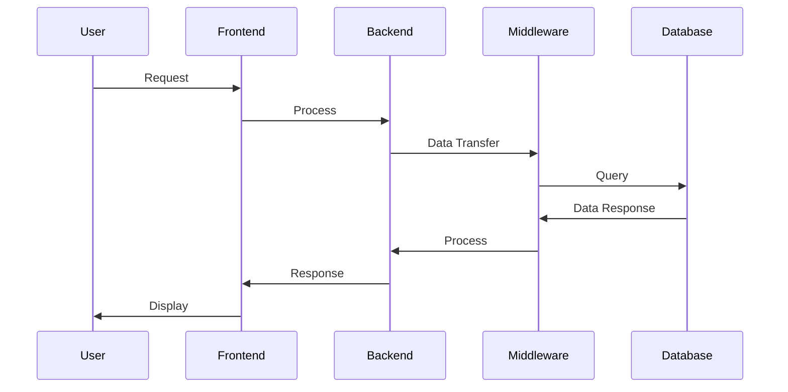
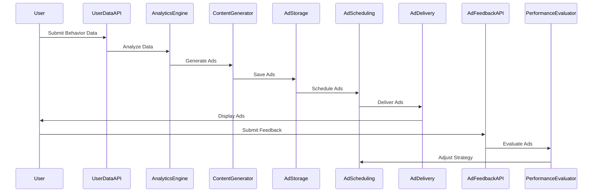
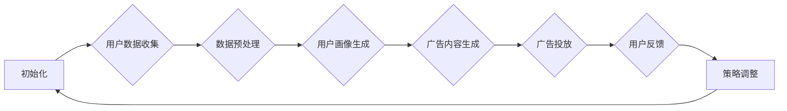

                 

### 第1章：背景介绍与核心概念

#### 1.1 AI Agent的定义与类型

AI Agent，即人工智能代理，是指能够与环境互动并实现特定目标的人工智能实体。AI Agent具有自主性、反应性、预见性和适应性等特点，是人工智能领域中的重要研究方向。

- **自主性**：AI Agent能够独立做出决策，不依赖于人类的干预。
- **反应性**：AI Agent能够实时响应当前环境的变化。
- **预见性**：AI Agent能够预测未来的情况，做出长期规划。
- **适应性**：AI Agent能够根据经验不断优化自身行为。

AI Agent根据其工作方式的不同，可以分为以下几种类型：

1. **基于规则的AI Agent**：这种Agent使用一组规则来指导其行为，适用于规则明确且变化不大的环境。
2. **基于模型的AI Agent**：这种Agent通过建立环境模型，利用模型预测环境变化，并进行决策。
3. **基于学习的AI Agent**：这种Agent通过学习环境数据，自动调整其行为策略，适应复杂多变的环境。

#### 1.2 智能广告创意的背景

智能广告创意是指利用人工智能技术，尤其是机器学习和数据挖掘技术，来创造更加个性化和高效的广告内容。随着互联网的普及和大数据技术的发展，智能广告创意已经成为广告行业的重要趋势。

- **广告创意的重要性**：广告创意是吸引消费者注意、激发购买欲望的关键。好的广告创意能够提升品牌形象，增加销售业绩。
- **广告创意面临的挑战**：随着消费者需求的多样化和信息过载，广告创意面临着如何精准定位、如何吸引目标消费者的挑战。
- **AI Agent在广告创意中的潜在应用**：AI Agent可以通过分析大量用户数据，了解用户偏好和行为模式，从而创造出更加符合用户需求的广告创意。

#### 1.3 书籍的目的与结构

本书旨在深入探讨AI Agent在智能广告创意中的应用，帮助读者了解AI Agent的基本概念、原理以及如何将其应用于广告创意中。

- **目的**：通过本书的学习，读者将能够：
  - 理解AI Agent的基本原理和工作机制。
  - 掌握AI Agent在广告创意中的应用方法和技巧。
  - 学习如何设计、实现和优化AI Agent驱动的广告创意系统。

- **结构**：本书分为六个部分，具体如下：
  - 第1章：背景介绍与核心概念
  - 第2章：核心概念与联系
  - 第3章：智能广告创意中的AI Agent算法原理
  - 第4章：智能广告创意系统的分析与架构设计
  - 第5章：智能广告创意项目实战
  - 第6章：最佳实践、小结与拓展阅读

通过这六个章节的阅读，读者将系统地掌握AI Agent在智能广告创意中的应用知识，为今后的实际工作提供有力的理论支持。

---

> **核心关键词：** AI Agent、智能广告创意、自主性、反应性、预见性、适应性、广告创意、机器学习、大数据、品牌形象、销售业绩、用户偏好、行为模式。

> **摘要：** 本书深入探讨AI Agent在智能广告创意中的应用，涵盖AI Agent的基本概念、原理、应用方法，以及系统分析与架构设计。通过本书的学习，读者将掌握AI Agent驱动的广告创意系统设计、实现与优化的实用技能。

----------------------------------------------------------------

## 第2章：核心概念与联系

### 2.1 AI Agent原理

AI Agent的工作原理可以概括为以下几个核心部分：

1. **感知**：AI Agent通过传感器感知环境，获取当前的状态信息。
2. **决策**：根据感知到的状态，AI Agent使用决策模型或算法来选择最佳的行动方案。
3. **执行**：AI Agent执行决策，采取相应的行动，改变环境状态。
4. **反馈**：环境对AI Agent的行动做出反馈，AI Agent再次感知环境状态，进入下一个决策周期。

#### AI Agent的特性

AI Agent具有以下特性：

- **自主性**：AI Agent能够独立做出决策，不需要人类干预。
- **反应性**：AI Agent能够即时响应环境变化。
- **预见性**：AI Agent能够根据当前状态预测未来，做出长期规划。
- **适应性**：AI Agent能够通过学习不断调整自身行为，适应复杂环境。

#### AI Agent的构建方法

构建AI Agent的主要方法包括：

1. **基于规则的系统**：使用一组预定义的规则来指导AI Agent的行为。
2. **基于模型的系统**：通过建立环境模型，AI Agent可以预测环境变化，做出决策。
3. **基于学习的系统**：AI Agent通过学习环境数据，自动调整行为策略。

### 2.2 智能广告创意原理

智能广告创意是指利用人工智能技术，尤其是机器学习和数据挖掘技术，来创造更加个性化和高效的广告内容。其核心原理包括：

1. **用户数据分析**：通过收集和分析用户行为数据，了解用户偏好、需求和购买习惯。
2. **内容个性化生成**：基于用户数据分析，生成符合用户兴趣和需求的广告内容。
3. **优化策略**：利用机器学习算法，不断优化广告内容和投放策略，提高广告效果。

#### 智能广告创意的要素

智能广告创意的要素包括：

- **用户画像**：描述用户的兴趣、行为、需求和背景信息。
- **广告内容**：包括广告文案、图片、视频等多媒体元素。
- **投放策略**：确定广告投放的时间、地点、渠道等。

#### 智能广告创意的设计方法

智能广告创意的设计方法包括：

1. **用户需求分析**：通过数据分析了解用户需求和偏好。
2. **内容创意**：基于用户需求，创作有针对性的广告内容。
3. **策略优化**：利用机器学习算法，根据投放效果不断优化广告策略。

### 2.3 AI Agent与智能广告创意的互动关系

AI Agent在智能广告创意中扮演着关键角色，其与智能广告创意的互动关系如下：

- **用户数据分析**：AI Agent通过分析用户数据，了解用户需求和行为模式，为广告内容创作提供依据。
- **广告内容生成**：AI Agent根据用户数据，自动生成个性化广告内容。
- **策略优化**：AI Agent通过实时监控广告投放效果，自动调整广告投放策略，提高广告效果。

#### 概念属性特征对比表格

| 概念         | 特点                                                     | 应用场景                         |
| ------------ | -------------------------------------------------------- | -------------------------------- |
| AI Agent     | 自主性、反应性、预见性、适应性                           | 自动化决策、智能交互、环境适应   |
| 智能广告创意 | 用户数据分析、内容个性化生成、优化策略                   | 广告创作、精准营销、用户满意度提升 |
| 机器学习     | 数据驱动、自动优化、高效处理复杂问题                     | 广告创意、推荐系统、金融风控     |

#### ER实体关系图架构

```mermaid
erDiagram
  User ||--|{ AI-Agent }|-- Ad-Creative
  User ||--|{ Ad-Strategy }|-- Campaign
  AI-Agent ||--|{ Content-Generator }|-- Ad-Creative
  AI-Agent ||--|{ Performance-Evaluator }|-- Ad-Strategy
```

在上述ER图中，用户（User）与AI-Agent、广告创意（Ad-Creative）和广告策略（Ad-Strategy）之间存在明确的关联。AI-Agent通过用户数据生成广告创意和策略，同时评估广告效果，以实现智能广告创意的优化。

---

> **核心关键词：** AI Agent、智能广告创意、用户数据分析、内容个性化生成、机器学习、用户画像、投放策略、广告内容、自动化决策、环境适应。

> **摘要：** 本章详细介绍了AI Agent的原理、特性及构建方法，探讨了智能广告创意的基本原理、要素和设计方法，并分析了AI Agent与智能广告创意之间的互动关系。

----------------------------------------------------------------

### 第3章：智能广告创意中的AI Agent算法原理

#### 3.1 常见AI Agent算法

在智能广告创意中，AI Agent算法的选择至关重要。以下是几种常见的AI Agent算法：

1. **强化学习算法**：强化学习（Reinforcement Learning，RL）是AI Agent中应用最广泛的一种算法。它通过奖励机制和试错学习，让AI Agent在环境中不断调整行为策略，以达到最大化收益的目标。

   **应用**：在广告创意中，强化学习可以用于优化广告投放策略，比如动态调整广告投放的时间、频次、渠道等。

2. **模拟退火算法**：模拟退火（Simulated Annealing，SA）是一种优化算法，它通过模拟物理退火过程，找到问题的近似最优解。

   **应用**：模拟退火算法可以用于广告创意中的创意组合优化，比如寻找最佳的广告文案、图片和视频的组合。

3. **蚁群算法**：蚁群算法（Ant Colony Optimization，ACO）模拟了蚂蚁寻找食物的集体行为，通过信息素更新机制来指导群体行为。

   **应用**：蚁群算法可以用于广告创意中的广告投放路径优化，比如找到最佳的广告投放序列，以最大化广告效果。

#### 3.2 强化学习算法在广告创意中的应用

强化学习算法在广告创意中的应用主要集中在以下两个方面：

1. **广告投放策略优化**：
   - **算法流程**：
     1. 初始化状态（如用户特征、广告素材等）。
     2. 根据当前状态选择广告投放策略（如投放时间、频次、渠道等）。
     3. 执行策略，获取用户反馈（如点击率、转化率等）。
     4. 根据反馈调整状态，更新策略。
     5. 重复步骤2-4，直到达到优化目标。
   - **数学模型**：
     $$Q(s, a) = r + \gamma \max_{a'} Q(s', a')$$
     其中，$Q(s, a)$是状态s下采取动作a的期望收益，$r$是即时奖励，$\gamma$是折扣因子，$s'$和$a'$是下一状态和动作。

2. **广告素材优化**：
   - **算法流程**：
     1. 初始化广告素材库。
     2. 根据用户特征和上下文信息选择广告素材。
     3. 展示广告，获取用户反馈。
     4. 根据反馈调整素材库，优化素材组合。
     5. 重复步骤2-4，直到达到优化目标。
   - **数学模型**：
     $$C(s, a) = w_1 \cdot C_1(s, a) + w_2 \cdot C_2(s, a) + ... + w_n \cdot C_n(s, a)$$
     其中，$C(s, a)$是广告创意的质量评分，$C_1(s, a)$、$C_2(s, a)$、...、$C_n(s, a)$是不同维度的评分，$w_1$、$w_2$、...、$w_n$是权重系数。

#### 3.3 模拟退火算法

模拟退火算法是一种启发式搜索算法，其核心思想是模拟物理退火过程，通过逐渐降低温度来避免陷入局部最优解。

- **算法流程**：
  1. 初始化解空间和初始解。
  2. 设置初始温度。
  3. 在当前温度下，进行迭代，生成新解。
  4. 根据概率函数接受或拒绝新解。
  5. 逐步降低温度。
  6. 重复步骤3-5，直到温度降低到某个阈值。

- **概率函数**：
  $$P(\text{accept new solution}) = \left\{
  \begin{array}{ll}
    1 & \text{if new solution is better} \\
    \frac{e^{\frac{-\Delta E}{T}}}{Z} & \text{otherwise}
  \end{array}
  \right.$$
  其中，$\Delta E$是新旧解的能量差异，$T$是当前温度，$Z$是归一化因子。

#### 3.4 蚁群算法

蚁群算法通过模拟蚂蚁觅食过程中的信息素更新机制，实现问题的优化求解。

- **算法流程**：
  1. 初始化信息素分布。
  2. 所有蚂蚁从初始点出发，选择下一城市。
  3. 计算每个城市的启发函数值。
  4. 根据启发函数值和信息素浓度，选择下一个城市。
  5. 更新信息素浓度。
  6. 所有蚂蚁完成一次循环后，回到初始点。
  7. 重复步骤2-6，直到满足停止条件。

- **信息素更新规则**：
  $$\tau_{ij}(t) = (1 - \rho) \tau_{ij}(t-1) + \sum_{k \in \text{ant}} \Delta \tau_{ij}^{k}(t)$$
  其中，$\tau_{ij}(t)$是时刻t从城市i到城市j的信息素浓度，$\rho$是信息素蒸发系数，$\Delta \tau_{ij}^{k}(t)$是蚂蚁k在时刻t在路径(i, j)上留下的信息素。

#### 3.5 算法对比与选择

不同算法在广告创意中的应用各有优缺点，选择合适的算法需要考虑以下因素：

- **问题规模**：对于大规模的广告创意优化问题，强化学习和蚁群算法可能更有效。
- **约束条件**：算法需要满足广告创意的特定约束，如预算限制、投放时间窗口等。
- **计算资源**：算法的计算复杂度和资源消耗也是选择的重要因素。

---

> **核心关键词：** 强化学习、模拟退火算法、蚁群算法、广告投放策略、广告素材优化、信息素更新、启发函数、算法对比、计算资源。

> **摘要：** 本章详细介绍了智能广告创意中常用的AI Agent算法，包括强化学习、模拟退火算法和蚁群算法。通过算法原理的讲解和实际应用场景的探讨，帮助读者理解这些算法在广告创意优化中的应用和方法。

----------------------------------------------------------------

### 第4章：智能广告创意系统的分析与架构设计

#### 4.1 问题场景介绍

智能广告创意系统的主要目标是利用人工智能技术，通过分析用户行为数据和市场趋势，生成高效、个性化的广告内容，并在适当的渠道和时间内进行精准投放，从而最大化广告效果和投资回报率。以下是一个典型的问题场景：

- **目标用户**：一个电子商务平台希望利用智能广告创意系统，针对不同用户群体（如年龄、性别、兴趣爱好等）生成个性化广告，提高用户点击率和转化率。
- **数据来源**：用户行为数据、市场趋势数据、广告投放数据等。
- **系统要求**：系统能够自动分析用户数据，生成适合不同用户的广告内容；能够根据广告效果实时调整广告投放策略；能够支持多种广告形式（如文字、图片、视频等）。

#### 4.2 系统功能设计

智能广告创意系统的主要功能设计包括以下几个模块：

1. **用户数据分析模块**：该模块负责收集、存储和处理用户行为数据，如浏览记录、购买历史、兴趣偏好等，为广告创意生成提供数据支持。
2. **广告内容生成模块**：该模块利用机器学习算法，根据用户数据分析结果，自动生成个性化的广告内容，包括文案、图片、视频等。
3. **广告投放策略模块**：该模块根据广告效果数据和用户反馈，动态调整广告投放策略，如投放时间、投放频次、投放渠道等，以最大化广告效果。
4. **广告效果评估模块**：该模块负责收集和分析广告投放数据，评估广告效果，如点击率、转化率、用户留存率等，为系统优化提供依据。

#### 4.3 系统架构设计

智能广告创意系统的架构设计分为前端、后端和中间件三个层次。

1. **前端**：主要负责用户界面设计和用户体验优化，包括广告展示页面、用户数据分析界面等。
2. **后端**：主要负责系统功能实现和数据存储，包括用户数据分析模块、广告内容生成模块、广告投放策略模块、广告效果评估模块等。
3. **中间件**：主要负责数据传输和通信，包括消息队列、缓存层、数据库连接池等。

以下是智能广告创意系统的架构图：



#### 4.4 系统接口设计与交互

智能广告创意系统的接口设计主要涉及以下几个部分：

1. **用户数据接口**：负责接收和处理用户行为数据，如浏览器行为、购买记录等。
2. **广告内容接口**：负责生成和存储广告内容，如文案、图片、视频等。
3. **广告投放接口**：负责执行广告投放策略，如确定投放时间、频次、渠道等。
4. **广告效果接口**：负责收集和评估广告投放效果，如点击率、转化率等。

以下是系统接口的交互序列图：



#### 4.5 系统功能实现与代码应用解读

以下是一个简化的用户数据分析模块的Python代码示例，用于分析用户浏览记录，生成用户画像：

```python
import pandas as pd
from sklearn.feature_extraction.text import CountVectorizer
from sklearn.decomposition import LatentDirichletAllocation

# 加载用户浏览记录数据
data = pd.read_csv('user_browsing.csv')

# 提取用户浏览记录中的文本数据
text_data = data['browsing_history'].values

# 使用CountVectorizer进行文本向量化
vectorizer = CountVectorizer(max_features=1000)
text_vectorized = vectorizer.fit_transform(text_data)

# 使用LDA进行主题建模
lda = LatentDirichletAllocation(n_components=5, random_state=0)
lda.fit(text_vectorized)

# 打印主题词
print(lda.components_)

# 根据主题词生成用户画像
def generate_user_profile(topics):
    profile = {}
    for i, topic in enumerate(topics):
        profile[f'Topic {i+1}'] = ' '.join([word for word, _ in vectorizer.vocabulary_.items() if _ in topic])
    return profile

user_profile = generate_user_profile(lda.components_[0])
print(user_profile)
```

在这个示例中，我们使用了`pandas`和`sklearn`库，通过文本向量化技术和LDA主题建模，生成用户画像。这个简单的用户数据分析模块可以帮助广告内容生成模块根据用户兴趣生成个性化的广告内容。

---

> **核心关键词：** 智能广告创意系统、用户数据分析、广告内容生成、广告投放策略、广告效果评估、系统架构设计、接口设计、代码示例、Python、用户画像。

> **摘要：** 本章介绍了智能广告创意系统的分析与架构设计，包括问题场景介绍、系统功能设计、系统架构设计、系统接口设计与交互，并通过代码示例详细阐述了用户数据分析模块的实现。

----------------------------------------------------------------

### 第5章：智能广告创意项目实战

#### 5.1 环境安装

在进行智能广告创意项目实战之前，我们需要搭建一个合适的环境。以下是安装所需软件和工具的步骤：

1. **安装Python环境**：确保Python版本为3.8及以上，可以通过Python官网下载安装包进行安装。

2. **安装Jupyter Notebook**：Jupyter Notebook是一个交互式的开发环境，便于编写和运行Python代码。可以通过以下命令安装：

   ```bash
   pip install notebook
   ```

3. **安装相关库**：根据项目需求，我们需要安装以下库：

   - `pandas`：用于数据处理。
   - `numpy`：用于数值计算。
   - `scikit-learn`：用于机器学习和数据挖掘。
   - `matplotlib`：用于数据可视化。

   安装命令如下：

   ```bash
   pip install pandas numpy scikit-learn matplotlib
   ```

4. **安装Eclipse或VSCode**：推荐使用Eclipse或VSCode作为IDE，以提高开发效率。可以从官方网站下载安装。

5. **配置数据库**：根据项目需求，可能需要安装并配置MySQL或PostgreSQL数据库。可以从官方网站下载并按照说明进行安装。

#### 5.2 系统核心实现

在本节中，我们将实现一个简化的智能广告创意系统，主要涉及用户数据分析模块和广告内容生成模块。

##### 用户数据分析模块

以下是一个用户数据分析模块的Python代码示例，用于分析用户浏览记录，生成用户画像：

```python
import pandas as pd
from sklearn.feature_extraction.text import CountVectorizer
from sklearn.decomposition import LatentDirichletAllocation

# 加载用户浏览记录数据
data = pd.read_csv('user_browsing.csv')

# 提取用户浏览记录中的文本数据
text_data = data['browsing_history'].values

# 使用CountVectorizer进行文本向量化
vectorizer = CountVectorizer(max_features=1000)
text_vectorized = vectorizer.fit_transform(text_data)

# 使用LDA进行主题建模
lda = LatentDirichletAllocation(n_components=5, random_state=0)
lda.fit(text_vectorized)

# 打印主题词
print(lda.components_)

# 根据主题词生成用户画像
def generate_user_profile(topics):
    profile = {}
    for i, topic in enumerate(topics):
        profile[f'Topic {i+1}'] = ' '.join([word for word, _ in vectorizer.vocabulary_.items() if _ in topic])
    return profile

user_profile = generate_user_profile(lda.components_[0])
print(user_profile)
```

在这个示例中，我们使用了`pandas`和`sklearn`库，通过文本向量化技术和LDA主题建模，生成用户画像。

##### 广告内容生成模块

以下是一个广告内容生成模块的Python代码示例，用于根据用户画像生成个性化的广告内容：

```python
import random

# 广告素材库
ad_assets = {
    'text': ['这是一款性价比极高的产品，赶快购买吧！', '体验前所未有的舒适，从这款产品开始。'],
    'image': ['product_1.jpg', 'product_2.jpg'],
    'video': ['video_1.mp4', 'video_2.mp4']
}

# 根据用户画像生成广告内容
def generate_ad_content(user_profile):
    text = random.choice(ad_assets['text'])
    image = random.choice(ad_assets['image'])
    video = random.choice(ad_assets['video'])
    
    if 'Topic 1' in user_profile:
        # 用户对性价比敏感
        text = '性价比之王，错过今天，再等一年！'
    elif 'Topic 2' in user_profile:
        # 用户对舒适度敏感
        text = '极致舒适，尽享生活每一天。'
    
    return text, image, video

# 生成广告内容
ad_content = generate_ad_content(user_profile)
print(ad_content)
```

在这个示例中，我们定义了一个广告素材库，并根据用户画像随机生成广告文案、图片和视频。

#### 5.3 实际案例分析与详细讲解

以下是一个实际的广告创意项目案例，用于说明如何利用AI Agent实现广告创意的自动化生成和优化。

**案例背景**：某电子商务平台希望利用智能广告创意系统，提高用户点击率和转化率。平台提供了丰富的用户数据，包括用户浏览记录、购买历史、兴趣爱好等。

**解决方案**：

1. **数据收集与处理**：收集用户数据，包括浏览记录、购买历史等，使用LDA主题建模生成用户画像。

2. **广告内容生成**：根据用户画像，利用广告素材库生成个性化的广告内容。

3. **广告投放策略优化**：使用强化学习算法，根据广告效果数据（如点击率、转化率）动态调整广告投放策略。

**具体步骤**：

1. **用户数据分析**：
   - 加载用户数据，提取用户浏览记录。
   - 使用CountVectorizer进行文本向量化，使用LDA进行主题建模。

2. **广告内容生成**：
   - 根据用户画像，随机选择广告素材库中的广告文案、图片和视频。
   - 根据用户兴趣偏好，调整广告内容的重点。

3. **广告投放策略优化**：
   - 使用强化学习算法，定义状态和动作空间。
   - 根据用户反馈（点击率、转化率），调整广告投放策略。

**案例分析**：

通过上述步骤，电子商务平台能够生成个性化的广告内容，并在不断优化的广告投放策略下，提高广告效果。以下是一个简化的算法流程图：



在实际应用中，该系统可以根据实时数据不断优化广告内容生成和投放策略，实现广告创意的自动化和智能化。

---

> **核心关键词：** 智能广告创意项目、环境安装、Python、Jupyter Notebook、用户数据分析、广告内容生成、强化学习算法、广告投放策略优化、算法流程图。

> **摘要：** 本章通过实际案例，详细介绍了如何搭建智能广告创意系统环境、实现用户数据分析模块和广告内容生成模块，并探讨了如何利用强化学习算法优化广告投放策略。通过这些实战内容，读者可以了解智能广告创意系统的实现过程和关键技巧。

----------------------------------------------------------------

### 第6章：最佳实践、小结与拓展阅读

#### 6.1 最佳实践

在设计和实施智能广告创意系统时，以下最佳实践可以帮助提高系统的效果和效率：

1. **数据质量保证**：确保收集的数据准确、完整，并进行预处理，以减少噪声和异常值的影响。
2. **用户画像细化**：根据不同用户群体的特征，建立更加细化的用户画像，以提高广告的个性化和精准度。
3. **算法选择与优化**：根据广告目标，选择合适的AI算法，并在实际应用中不断优化算法参数，提高模型性能。
4. **动态调整策略**：实时监控广告效果，根据用户反馈和数据分析结果，动态调整广告内容和投放策略。
5. **多渠道整合**：整合不同渠道的广告投放，如社交媒体、电子邮件、搜索引擎等，以实现最佳的广告效果。

#### 6.2 小结

本章详细介绍了智能广告创意系统的设计与实现过程，包括环境安装、用户数据分析、广告内容生成、广告投放策略优化以及实际案例分析。通过最佳实践和小结，读者可以掌握智能广告创意系统的关键要素和方法，为实际项目提供指导。

#### 6.3 注意事项

在实施智能广告创意系统时，需要注意以下几点：

1. **数据隐私与安全**：在数据处理和广告投放过程中，严格遵守数据隐私法规，确保用户数据的安全和保密性。
2. **用户接受度**：用户对个性化广告的接受度可能影响广告效果，因此需要平衡广告的个性化和用户体验。
3. **系统性能优化**：确保系统在高并发、大数据量情况下仍能高效运行，以避免系统崩溃或响应延迟。

#### 6.4 拓展阅读

对于希望深入了解智能广告创意和AI Agent的读者，以下书籍和资源可以提供更多有价值的参考资料：

1. **书籍**：
   - 《机器学习实战》 - 刘江，电子工业出版社
   - 《深度学习》 - 伊恩·古德费洛等，电子工业出版社
   - 《Python机器学习》 - 约书亚·比塞尔，人民邮电出版社

2. **在线资源**：
   - Coursera上的《机器学习》课程
   - Kaggle上的数据集和项目
   - ArXiv上的最新研究成果论文

通过这些拓展阅读，读者可以进一步深化对智能广告创意和AI Agent的理解和应用能力。

---

> **核心关键词：** 智能广告创意系统、最佳实践、用户画像、算法选择、数据质量、系统性能、数据隐私、用户接受度。

> **摘要：** 本章总结了智能广告创意系统的最佳实践、关键注意事项以及拓展阅读资源，帮助读者更好地理解和应用智能广告创意系统的设计和实现技巧。通过这些实践和拓展，读者可以在实际项目中取得更好的成果。

----------------------------------------------------------------

# 目录大纲

## 第一部分：背景介绍

### 第1章：背景介绍与核心概念

#### 1.1 AI Agent的定义与类型

- **1.1.1 AI Agent的定义**
- **1.1.2 AI Agent的类型**

#### 1.2 智能广告创意的背景

- **1.2.1 广告创意的重要性**
- **1.2.2 广告创意面临的挑战**
- **1.2.3 AI Agent在广告创意中的潜在应用**

#### 1.3 书籍的目的与结构

### 第2章：核心概念与联系

#### 2.1 AI Agent原理

- **2.1.1 AI Agent的基础原理**
- **2.1.2 AI Agent的特性**
- **2.1.3 AI Agent的构建方法**

#### 2.2 智能广告创意原理

- **2.2.1 广告创意的基本原理**
- **2.2.2 智能广告创意的要素**
- **2.2.3 智能广告创意的设计方法**

#### 2.3 AI Agent与智能广告创意的互动关系

### 第3章：智能广告创意中的AI Agent算法原理

#### 3.1 常见AI Agent算法

- **3.1.1 强化学习算法**
- **3.1.2 强化学习算法在广告创意中的应用**
- **3.1.3 模拟退火算法**
- **3.1.4 蚁群算法**

#### 3.2 AI Agent算法流程图

#### 3.3 AI Agent算法的数学模型与公式

### 第4章：智能广告创意系统的分析与架构设计

#### 4.1 问题场景介绍

#### 4.2 系统功能设计

- **4.2.1 领域模型类图**

#### 4.3 系统架构设计

- **4.3.1 系统架构图**

#### 4.4 系统接口设计与交互

#### 4.5 系统功能实现与代码应用解读

### 第5章：智能广告创意项目实战

#### 5.1 环境安装

#### 5.2 系统核心实现

- **5.2.1 源代码解读**
- **5.2.2 代码应用分析与实战**

#### 5.3 实际案例分析与讲解

### 第6章：最佳实践、小结与拓展阅读

#### 6.1 最佳实践

- **6.1.1 实战技巧**
- **6.1.2 问题解决方案**

#### 6.2 小结

#### 6.3 注意事项

#### 6.4 拓展阅读

---

通过以上详细的目录大纲，读者可以清晰地了解《AI Agent在智能广告创意中的应用》这本书的结构和内容。每个章节都包含了丰富的知识点和实战案例，旨在帮助读者深入理解AI Agent在智能广告创意中的实际应用，掌握相关技术和方法。希望这本书能够为读者的研究和实践提供有价值的参考和指导。

