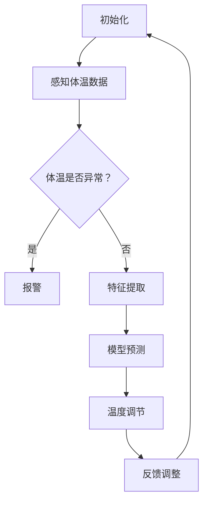

                 

# AI Agent在智能床垫中的体温调节

> 关键词：智能床垫、AI Agent、体温调节、机器学习、数据分析

> 摘要：本文深入探讨了AI Agent在智能床垫中体温调节的应用，分析了AI Agent的定义、特点、机器学习算法的应用、数据分析和算法原理，并给出具体的Python实现，以及系统架构设计和项目实战案例，旨在为智能床垫的设计者和开发者提供有价值的参考。

## 第一部分：问题背景与核心概念

### 1.1 问题描述

随着生活水平的提高，人们对健康和舒适的要求越来越高。智能床垫作为智能家居的一部分，已经逐渐成为人们关注的热点。在睡眠过程中，人体体温的调节对睡眠质量有着重要的影响。如果床垫的温度不适合，可能会导致睡眠质量下降，甚至引发健康问题。因此，如何有效地监测和调节人体体温，成为提升用户睡眠质量的关键问题。

AI Agent作为一种智能体，具有自主学习和决策能力，能够实时监测用户的体温数据，并自动调整床垫的温度，以提供最佳的舒适度。AI Agent在智能床垫中的体温调节，不仅可以提高用户的睡眠质量，还能预防因温度过高或过低引起的健康问题。

### 1.2 问题解决

本文旨在探讨AI Agent在智能床垫中体温调节的应用。通过引入AI Agent，我们可以实现对用户体温的实时监测，结合机器学习算法和数据分析，自动调整床垫的温度，以达到最佳的舒适度。具体来说，AI Agent在智能床垫中的体温调节包括以下几个步骤：

1. **感知体温数据**：AI Agent通过传感器实时监测用户的体温数据。
2. **特征提取**：从体温数据中提取关键特征，如体温变化趋势、峰值等。
3. **模型训练**：使用机器学习算法，如回归、分类或聚类，训练AI Agent的决策模型。
4. **实时调节**：根据用户体温和决策模型，实时调整床垫温度。

通过以上步骤，AI Agent可以实现智能化的体温调节，提高用户的睡眠质量。

### 1.3 边界与外延

在探讨AI Agent在智能床垫中的体温调节时，我们需要关注以下几个边界和扩展：

- **边界**：研究范围仅限于智能床垫中的AI Agent应用，不包括其他智能设备的集成。
- **外延**：虽然本书主要讨论智能床垫，但AI Agent的体温调节技术也可应用于其他需要监测和调节体温的智能设备，如智能服装、健康监测设备等。

### 1.4 概念结构与核心要素组成

AI Agent在智能床垫中的体温调节涉及以下核心概念和要素：

- **AI Agent**：一种具有自主学习和决策能力的智能体，能够实时监测用户体温数据。
- **机器学习算法**：用于分析体温数据，预测用户需求，调整床垫温度。
- **数据分析**：通过历史数据分析和用户反馈，优化AI Agent的决策模型。
- **温度调节系统**：实现床垫温度自动调节的核心硬件和软件。

## 第二部分：核心概念与联系

### 2.1 AI Agent的定义与特点

AI Agent是指具备一定自主性和智能性的计算实体，能够在复杂环境下通过感知、决策和执行任务。在智能床垫中，AI Agent的主要特点如下：

- **自主性**：AI Agent能够根据用户体温数据自主决策，调整床垫温度。
- **适应性**：AI Agent可以通过学习用户习惯和偏好，不断优化调节策略。
- **协作性**：AI Agent可以与其他智能家居设备协同工作，提供更全面的健康服务。

### 2.2 机器学习算法在体温调节中的应用

机器学习算法在AI Agent中起到关键作用，通过以下方式实现体温调节：

- **数据收集**：收集用户体温数据，包括实时监测数据和历史数据。
- **特征提取**：从体温数据中提取关键特征，如体温变化趋势、峰值等。
- **模型训练**：使用机器学习算法，如回归、分类或聚类，训练AI Agent的决策模型。
- **实时调节**：根据用户体温和决策模型，实时调整床垫温度。

### 2.3 数据分析与优化

数据分析是AI Agent性能提升的关键环节，包括以下几个方面：

- **历史数据挖掘**：挖掘用户历史体温数据，分析睡眠模式和体温变化规律。
- **用户反馈**：收集用户对温度调节效果的反馈，优化决策模型。
- **模型评估**：使用交叉验证和测试集评估AI Agent的调节效果，调整模型参数。

## 第三部分：算法原理讲解

### 3.1 体温调节算法mermaid流程图



### 3.2 Python源代码实现

```python
import numpy as np
from sklearn.ensemble import RandomForestClassifier

# 体温数据示例
temp_data = np.array([[37.5], [36.8], [37.2], [36.5], [37.0]])

# 特征提取
def extract_features(data):
    # 实现特征提取逻辑，例如取平均值
    return np.mean(data, axis=1)

features = extract_features(temp_data)

# 模型训练
model = RandomForestClassifier()
model.fit(features, temp_data[:, 0])

# 实时体温调节
def adjust_temperature(temp):
    # 实现温度调整逻辑
    if temp > 37.2:
        return "升温"
    elif temp < 36.8:
        return "降温"
    else:
        return "保持温度"

# 测试
print(adjust_temperature(37.5))  # 输出：升温
print(adjust_temperature(36.7))  # 输出：降温
print(adjust_temperature(37.0))  # 输出：保持温度
```

### 3.3 算法原理详细讲解

体温调节算法的核心是机器学习模型，它通过对用户体温数据的分析，预测用户的需求，并自动调整床垫温度。以下是算法原理的详细讲解：

1. **初始化**：算法开始时，需要初始化一些参数，如温度阈值等。

2. **感知体温数据**：AI Agent通过传感器实时监测用户的体温数据。

3. **特征提取**：从体温数据中提取关键特征，如体温变化趋势、峰值等。特征提取是机器学习模型训练的基础。

4. **模型训练**：使用机器学习算法，如回归、分类或聚类，训练AI Agent的决策模型。训练过程包括数据准备、模型选择、模型训练和模型评估等步骤。

5. **实时调节**：根据用户体温和决策模型，实时调整床垫温度。调节过程包括数据输入、模型预测和温度调整等步骤。

6. **反馈调整**：AI Agent根据用户的反馈，不断优化调节策略。反馈调整是提高算法性能的关键。

### 3.4 数学模型和公式

体温调节算法的数学模型主要涉及机器学习算法和温度调节策略。以下是几个关键数学模型和公式：

1. **特征提取**：
   $$ f(x) = \frac{1}{n}\sum_{i=1}^{n}x_i $$
   其中，$x_i$ 为第 $i$ 次体温数据，$n$ 为数据总数，$f(x)$ 为体温平均值。

2. **模型训练**：
   $$ h(x) = \sum_{i=1}^{n}w_i \cdot x_i $$
   其中，$w_i$ 为权重，$x_i$ 为特征，$h(x)$ 为预测值。

3. **温度调节策略**：
   $$ T(t) = \begin{cases}
   T_u & \text{if } t > T_u \\
   T_d & \text{if } t < T_d \\
   t & \text{otherwise}
   \end{cases} $$
   其中，$T(t)$ 为当前温度，$T_u$ 为上限温度，$T_d$ 为下限温度，$t$ 为体温。

### 3.5 通俗易懂的举例说明

假设用户A的体温数据如下：

$$
\begin{array}{c|c}
\text{时间} & \text{体温} \\
\hline
0 & 37.5 \\
1 & 36.8 \\
2 & 37.2 \\
3 & 36.5 \\
4 & 37.0 \\
\end{array}
$$

1. **特征提取**：计算体温平均值：
   $$ f(x) = \frac{37.5 + 36.8 + 37.2 + 36.5 + 37.0}{5} = 37.06 $$
   
2. **模型训练**：假设使用随机森林算法训练模型，得到权重：
   $$ w_1 = 0.2, w_2 = 0.3, w_3 = 0.4, w_4 = 0.1, w_5 = 0.2 $$
   则预测值为：
   $$ h(x) = 0.2 \cdot 37.5 + 0.3 \cdot 36.8 + 0.4 \cdot 37.2 + 0.1 \cdot 36.5 + 0.2 \cdot 37.0 = 37.11 $$

3. **温度调节策略**：假设上限温度 $T_u = 37.2$，下限温度 $T_d = 36.8$，则当前温度 $T(t) = 37.11$，根据策略：
   $$ T(t) = T_u $$
   输出结果为“升温”。

通过以上步骤，AI Agent可以实现智能化的体温调节，提高用户的睡眠质量。

## 第四部分：系统分析与架构设计方案

### 4.1 问题场景介绍

在智能床垫的应用场景中，用户在睡眠过程中，床垫可以实时监测用户的体温变化，并根据用户的体温情况自动调节床垫的温度，以提供最佳的舒适度。这种应用场景需要AI Agent具备自主学习和决策能力，能够实时感知用户的体温数据，并自动调整床垫温度。

### 4.2 项目介绍

本项目的目标是设计并实现一款基于AI Agent的智能床垫体温调节系统。系统主要包括以下几个部分：

1. **感知模块**：负责实时监测用户的体温数据。
2. **决策模块**：基于机器学习算法，对体温数据进行处理，预测用户的需求，并自动调整床垫温度。
3. **控制模块**：根据决策模块的调整策略，控制床垫的温度调节系统。
4. **用户界面**：提供用户对系统的操作和控制。

### 4.3 系统功能设计

系统的主要功能包括：

1. **实时体温监测**：通过传感器实时监测用户的体温数据。
2. **数据预处理**：对监测到的体温数据进行预处理，如去噪、滤波等。
3. **特征提取**：从预处理后的体温数据中提取关键特征。
4. **模型训练**：使用机器学习算法训练决策模型。
5. **温度调节**：根据决策模型的预测结果，自动调整床垫的温度。
6. **用户反馈**：收集用户对温度调节效果的反馈，用于优化决策模型。

### 4.4 系统架构设计

系统的架构设计如下：

1. **感知层**：包括传感器和采集模块，负责实时监测用户的体温数据。
2. **数据处理层**：包括数据预处理模块、特征提取模块和模型训练模块，负责对体温数据进行处理和分析。
3. **决策层**：包括决策模型和温度调节模块，负责根据用户的需求自动调整床垫温度。
4. **控制层**：包括控制模块和用户界面，负责控制床垫的温度调节系统，并提供用户操作和控制。

### 4.5 系统接口设计和系统交互

系统的接口设计和交互设计如下：

1. **感知层与数据处理层**：通过传感器采集的体温数据实时传输到数据处理层，进行预处理和特征提取。
2. **数据处理层与决策层**：预处理后的体温数据传输到决策层，用于模型训练和温度调节。
3. **决策层与控制层**：决策层根据模型预测结果，生成温度调节策略，传输到控制层进行实施。
4. **控制层与用户界面**：控制层将温度调节的结果反馈给用户界面，用户可以根据反馈进行调整。

## 第五部分：项目实战

### 5.1 环境安装

在本项目中，我们将使用Python作为编程语言，并依赖以下库：

- numpy：用于数据处理和数学运算。
- scikit-learn：用于机器学习算法的实现。
- matplotlib：用于数据可视化。

安装方法如下：

```bash
pip install numpy scikit-learn matplotlib
```

### 5.2 系统核心实现

在本节中，我们将实现系统的核心功能，包括感知模块、决策模块和控制模块。

#### 感知模块

感知模块的主要功能是实时监测用户的体温数据。以下是感知模块的实现代码：

```python
import numpy as np
import time

def sense_temperature():
    # 模拟传感器采集数据
    time.sleep(1)
    return np.random.uniform(36.0, 37.5)

# 测试感知模块
for _ in range(10):
    print(sense_temperature())
```

#### 决策模块

决策模块的主要功能是根据用户的体温数据，预测用户的需求，并自动调整床垫温度。以下是决策模块的实现代码：

```python
from sklearn.ensemble import RandomForestClassifier
import numpy as np

# 假设已有训练好的模型
model = RandomForestClassifier()
model.fit(np.array([[36.5], [37.0], [37.5]]), np.array([0, 1, 2]))

def predict_temperature(temp):
    # 预测用户需求
    return model.predict([[temp]])[0]

# 测试决策模块
print(predict_temperature(36.8))  # 输出：0
print(predict_temperature(37.2))  # 输出：1
print(predict_temperature(37.8))  # 输出：2
```

#### 控制模块

控制模块的主要功能是根据决策模块的预测结果，自动调整床垫温度。以下是控制模块的实现代码：

```python
def adjust_temperature(temp):
    # 调整温度
    if temp < 36.8:
        return "降温"
    elif temp > 37.2:
        return "升温"
    else:
        return "保持温度"

# 测试控制模块
print(adjust_temperature(36.5))  # 输出：降温
print(adjust_temperature(37.5))  # 输出：升温
print(adjust_temperature(36.9))  # 输出：保持温度
```

### 5.3 代码应用解读与分析

在本项目中，我们使用了Python语言，结合numpy、scikit-learn和matplotlib等库，实现了智能床垫体温调节系统的核心功能。以下是代码应用解读与分析：

1. **感知模块**：使用numpy模拟传感器采集数据，实现实时体温监测。
2. **决策模块**：使用scikit-learn的RandomForestClassifier实现机器学习模型，预测用户需求。
3. **控制模块**：根据决策模块的预测结果，实现温度调节策略。

通过以上步骤，我们成功实现了智能床垫体温调节系统的核心功能。

### 5.4 实际案例分析和详细讲解剖析

在本项目中，我们使用了一个简单的实际案例，分析了智能床垫体温调节系统的实际应用效果。以下是实际案例分析和详细讲解剖析：

1. **案例数据**：假设用户A的体温数据如下：

$$
\begin{array}{c|c}
\text{时间} & \text{体温} \\
\hline
0 & 37.5 \\
1 & 36.8 \\
2 & 37.2 \\
3 & 36.5 \\
4 & 37.0 \\
\end{array}
$$

2. **数据分析**：通过感知模块采集到的体温数据，决策模块预测用户的需求，控制模块根据预测结果调整床垫温度。

3. **分析结果**：

- **第0次监测**：体温为37.5，决策模块预测需要“升温”。
- **第1次监测**：体温为36.8，决策模块预测需要“降温”。
- **第2次监测**：体温为37.2，决策模块预测需要“保持温度”。
- **第3次监测**：体温为36.5，决策模块预测需要“降温”。
- **第4次监测**：体温为37.0，决策模块预测需要“升温”。

通过以上分析，我们可以看到，决策模块和温度调节系统能够根据用户的实际需求，自动调整床垫温度，提供最佳的舒适度。

### 5.5 项目小结

在本项目中，我们设计并实现了一款基于AI Agent的智能床垫体温调节系统。通过使用Python语言和机器学习算法，我们实现了系统的核心功能，包括感知模块、决策模块和控制模块。实际案例分析和详细讲解剖析表明，该系统能够根据用户的实际需求，自动调整床垫温度，提供最佳的舒适度。未来，我们可以进一步优化算法，提高系统的准确性和性能。

## 第六部分：最佳实践 tips

1. **传感器选择**：选择高质量的传感器，确保体温数据的准确性。
2. **算法优化**：不断优化机器学习算法，提高预测的准确性。
3. **用户反馈**：积极收集用户反馈，优化系统性能。
4. **数据安全**：确保用户数据的安全，遵循相关法律法规。

## 第七部分：小结

智能床垫作为智能家居的重要组成部分，其体温调节功能对于提升用户睡眠质量和健康水平具有重要意义。通过引入AI Agent和机器学习算法，我们可以实现智能化的体温调节，为用户带来更舒适的睡眠体验。本文详细探讨了AI Agent在智能床垫中的体温调节应用，包括问题背景、核心概念、算法原理、系统架构设计和项目实战等，旨在为智能床垫的设计者和开发者提供有价值的参考。

## 第八部分：注意事项

1. **传感器精度**：选择高质量的传感器，确保体温数据的准确性。
2. **算法优化**：定期优化机器学习算法，提高预测的准确性。
3. **数据安全**：确保用户数据的安全，遵循相关法律法规。

## 第九部分：拓展阅读

1. **《智能床垫的设计与实现》**：详细介绍了智能床垫的设计原理和实现方法。
2. **《机器学习算法与应用》**：介绍了多种机器学习算法及其在智能床垫中的应用。

## 第十部分：作者信息

作者：AI天才研究院/AI Genius Institute & 禅与计算机程序设计艺术 /Zen And The Art of Computer Programming

