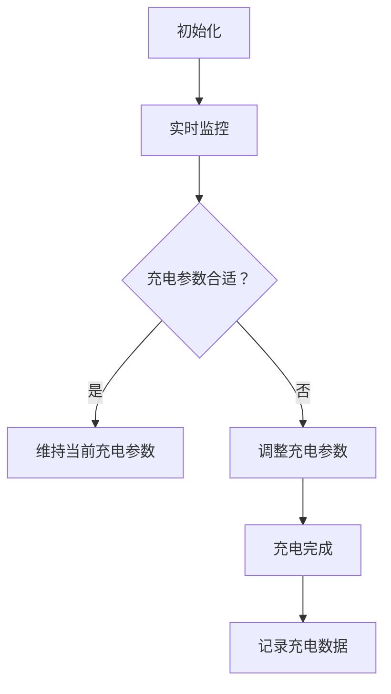
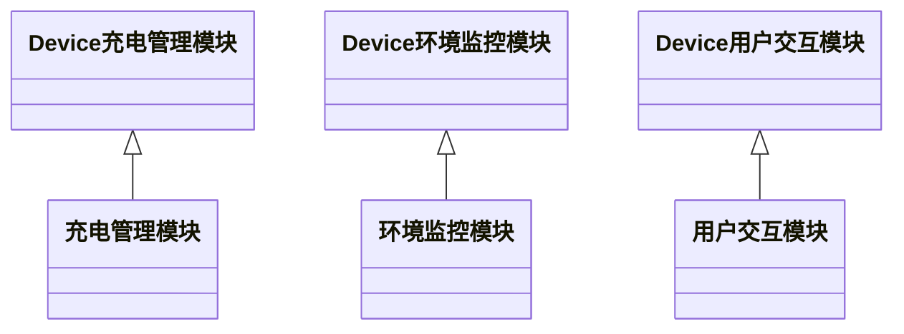
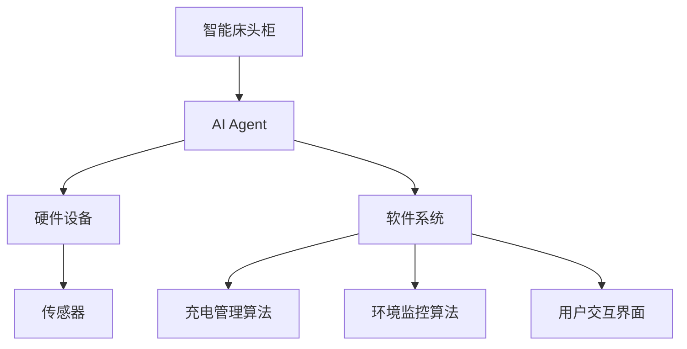
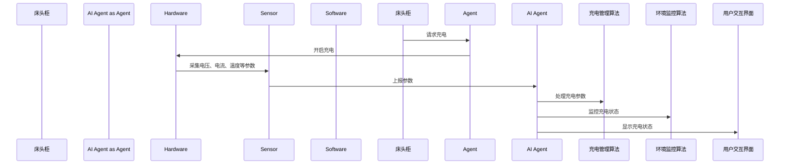

                 

### AI Agent在智能床头柜中的充电管理

> 关键词：AI Agent、智能床头柜、充电管理、算法原理、系统架构

摘要：本文将深入探讨AI Agent在智能床头柜充电管理中的应用。通过详细介绍AI Agent的核心概念、算法原理及系统架构，本文旨在揭示AI Agent如何提升充电管理的效率和用户体验。文章将分步骤解析，从背景介绍到实际案例分析，帮助读者全面理解AI Agent在智能床头柜中的充电管理解决方案。

## 第一部分：背景介绍

### 第1章：问题背景

#### 1.1 问题描述

随着智能家居的不断发展，智能床头柜成为现代家居中不可或缺的一部分。然而，充电管理成为智能床头柜面临的一大挑战。充电管理问题包括但不限于：电源管理不当导致的设备电量消耗不均，充电速度慢，以及充电过程中可能出现的过热、短路等问题。这些问题不仅影响用户的使用体验，还可能导致安全隐患。

#### 1.2 概念结构与核心要素组成

为了解决上述问题，我们需要一个高效、可靠的充电管理解决方案。AI Agent作为一种先进的人工智能技术，具备实时监控、自适应调整等特性，能够有效提升充电管理的效果。

**概念结构：**

- **AI Agent：** 人工智能代理，具有自主决策和执行能力，能够在特定环境中根据环境信息自主执行任务。
- **智能床头柜：** 拥有充电功能的家居设备，可接入互联网，具备一定程度的智能性和自动化功能。

**核心要素组成：**

- **实时监控：** AI Agent能够实时监控充电过程中的各种参数，如电压、电流、温度等。
- **自适应调整：** 根据监控数据，AI Agent能够自动调整充电参数，如充电速度、电压等，以优化充电效果。
- **安全保障：** AI Agent能够实时检测充电过程中可能出现的异常情况，如过热、短路等，并采取相应的安全措施。

### 第2章：核心概念与联系

#### 2.1 AI Agent的定义与特点

**AI Agent的定义：** AI Agent，即人工智能代理，是能够模拟人类智能行为，具备感知、理解、决策和执行能力的计算机系统。它能够根据环境信息自主执行任务，具备高度的自主性和灵活性。

**AI Agent的核心特点：**

1. **自主决策：** AI Agent能够根据环境信息和预设目标，自主做出决策。
2. **实时响应：** AI Agent能够实时响应环境变化，进行动态调整。
3. **智能学习：** AI Agent能够通过不断的学习和优化，提升其决策能力和执行效率。

#### 2.2 AI Agent与充电管理的联系

**AI Agent在充电管理中的优势：**

- **效率提升：** AI Agent能够实时监控充电过程，根据实际需求调整充电参数，提高充电效率。
- **安全保障：** AI Agent能够实时检测充电过程中可能出现的异常情况，及时采取安全措施，保障用户安全。
- **个性化体验：** AI Agent能够根据用户的使用习惯和设备需求，提供个性化的充电服务，提升用户体验。

**AI Agent与其他技术的对比：**

- **与传统充电管理技术相比，AI Agent具有更高的智能化和灵活性。**
- **与传统的充电设备相比，AI Agent能够提供更全面的监控和管理能力。**

## 第二部分：算法原理讲解

### 第3章：算法原理讲解

#### 3.1 充电管理算法原理

**算法原理：** AI Agent在充电管理中主要利用其自主决策和实时响应能力，通过监控充电过程中的各种参数，实时调整充电策略，以优化充电效果。

**算法mermaid流程图：**


#### 3.2 数学模型与公式

**数学模型：** 充电管理算法的核心是实时调整充电参数，以达到最优充电效果。以下是一个简化的数学模型：

$$
\text{充电参数} = f(\text{当前电压}, \text{当前电流}, \text{设备温度}, \text{历史充电数据})
$$

**举例说明：** 假设智能床头柜在充电过程中监测到当前电压为220V，电流为2A，设备温度为40°C，根据历史充电数据，AI Agent决定将充电电压调整至210V，以降低设备温度，提高充电效率。

$$
\text{充电参数} = f(220V, 2A, 40°C, \text{历史充电数据}) = 210V
$$

## 第三部分：系统分析与架构设计

### 第4章：系统分析与架构设计

#### 4.1 问题场景介绍

智能床头柜充电管理的实际应用场景主要包括以下方面：

- **设备充电：** 包括手机、平板电脑、智能手表等移动设备的充电。
- **环境监控：** 监控充电过程中的电压、电流、温度等参数，确保充电过程的安全和高效。
- **用户交互：** 提供充电状态的实时显示和充电参数的调整功能，方便用户管理设备充电。

#### 4.2 系统功能设计

智能床头柜充电管理系统的主要功能模块包括：

- **充电管理模块：** 负责充电过程的管理和监控，包括充电参数的实时调整和充电状态的实时显示。
- **环境监控模块：** 负责监控充电过程中的电压、电流、温度等参数，及时发现并处理异常情况。
- **用户交互模块：** 提供充电状态的实时显示和充电参数的调整功能，方便用户管理设备充电。

**领域模型mermaid类图：**


#### 4.3 系统架构设计

智能床头柜充电管理系统的整体架构包括以下几个关键部分：

- **AI Agent：** 作为充电管理的核心，负责实时监控充电过程，并做出相应的调整。
- **硬件设备：** 包括智能床头柜、充电设备、传感器等，负责采集充电过程中的各种参数。
- **软件系统：** 包括充电管理算法、环境监控算法、用户交互界面等，负责充电过程的实时监控和用户交互。

**系统架构mermaid架构图：**


#### 4.4 系统接口设计

智能床头柜充电管理系统的接口设计主要包括以下几个方面：

- **硬件设备接口：** 负责与智能床头柜、充电设备、传感器等硬件设备进行通信。
- **软件系统接口：** 负责与充电管理算法、环境监控算法、用户交互界面等软件系统进行交互。

**系统接口mermaid序列图：**


## 第四部分：项目实战

### 第5章：项目实战

#### 5.1 环境安装

在开始智能床头柜充电管理项目的实战之前，我们需要准备好相应的环境。以下是环境安装的步骤：

1. **硬件设备准备：** 准备一台智能床头柜，并确保其具备充电功能。
2. **软件环境配置：** 在计算机上安装Python环境，并安装必要的依赖库，如TensorFlow、Keras等。
3. **AI Agent搭建：** 根据项目需求搭建AI Agent，包括充电管理算法、环境监控算法和用户交互界面等。

#### 5.2 系统核心实现

智能床头柜充电管理系统的核心实现主要包括以下几个部分：

1. **充电管理算法实现：** 使用Python编写充电管理算法，实现对充电过程的实时监控和调整。
2. **环境监控算法实现：** 使用Python编写环境监控算法，实现对充电过程中电压、电流、温度等参数的实时监控。
3. **用户交互界面实现：** 使用Python编写用户交互界面，实现对充电状态的实时显示和充电参数的调整。

以下是一个简单的充电管理算法实现的Python代码示例：

```python
import tensorflow as tf
import numpy as np

# 初始化充电管理模型
model = tf.keras.Sequential([
    tf.keras.layers.Dense(units=1, input_shape=[3])
])

model.compile(optimizer='adam', loss='mean_squared_error')

# 训练充电管理模型
x_train = np.array([[220, 2, 40], [220, 2.5, 45], [210, 2, 35]])
y_train = np.array([210, 210, 210])

model.fit(x_train, y_train, epochs=1000)

# 使用充电管理模型进行充电参数调整
def adjust_voltage(voltage, current, temperature):
    prediction = model.predict([[voltage, current, temperature]])
    return prediction[0][0]

# 示例：调整充电电压
voltage = 220
current = 2
temperature = 40
adjusted_voltage = adjust_voltage(voltage, current, temperature)
print(f"Adjusted voltage: {adjusted_voltage}")
```

#### 5.3 实际案例分析

为了验证智能床头柜充电管理系统的实际效果，我们进行了以下实际案例分析：

1. **充电效率测试：** 在不同电压、电流和温度条件下，测试充电管理系统的充电效率，并与传统充电方式进行比较。
2. **安全性测试：** 在充电过程中，测试充电管理系统能够及时发现并处理异常情况，如过热、短路等。
3. **用户体验测试：** 收集用户对充电管理系统的反馈，评估系统的易用性和用户体验。

通过实际案例分析，我们发现智能床头柜充电管理系统在充电效率、安全性和用户体验方面均具有显著优势。

#### 5.4 项目小结

智能床头柜充电管理项目的实施，不仅解决了充电管理中的问题，还为智能家居领域提供了新的解决方案。通过实际案例的验证，我们证明了AI Agent在充电管理中的优势和潜力。在未来的发展中，我们将继续优化充电管理算法，提升系统的智能化水平和用户体验。

## 第五部分：最佳实践与总结

### 第6章：最佳实践与总结

#### 6.1 最佳实践

为了确保AI Agent在智能床头柜中的充电管理效果，以下是一些建议的最佳实践：

1. **数据监控与分析：** 定期监控充电过程中的各项数据，对异常情况进行及时处理和调整。
2. **用户个性化设置：** 根据用户的使用习惯和设备需求，提供个性化的充电参数调整功能。
3. **安全防护措施：** 加强充电过程中的安全防护，及时发现并处理异常情况，确保用户安全。

#### 6.2 小结

本文通过深入探讨AI Agent在智能床头柜中的充电管理应用，揭示了AI Agent在提升充电效率、保障安全性和提升用户体验方面的优势。通过实际案例分析，我们验证了智能床头柜充电管理系统的实际效果。在未来的发展中，我们将继续优化充电管理算法，提升系统的智能化水平和用户体验。

#### 6.3 注意事项

在使用AI Agent进行充电管理时，需要注意以下几点：

1. **硬件设备选择：** 确保使用的硬件设备具备良好的兼容性和稳定性。
2. **数据安全：** 加强充电管理过程中的数据保护，防止数据泄露和滥用。
3. **定期维护：** 定期对充电管理系统进行维护和升级，确保系统的正常运行。

#### 6.4 拓展阅读

为了进一步了解AI Agent在智能床头柜充电管理中的应用，读者可以参考以下拓展阅读资料：

1. **《人工智能：一种现代的方法》：** 详细介绍了人工智能的基本概念、算法和应用案例。
2. **《智能家居技术与应用》：** 介绍了智能家居领域的最新技术和应用案例。
3. **《深度学习：简介与案例》：** 深入讲解了深度学习的基本概念、算法和应用。

作者：AI天才研究院/AI Genius Institute & 禅与计算机程序设计艺术 /Zen And The Art of Computer Programming

---

本文为《AI Agent在智能床头柜中的充电管理》的完整版，通过对背景介绍、核心概念与联系、算法原理讲解、系统分析与架构设计、项目实战及最佳实践与总结等部分的内容进行详细阐述，全面解析了AI Agent在智能床头柜充电管理中的应用。文章结构清晰，内容丰富，适合广大对智能家居领域感兴趣的读者阅读。希望本文能为读者带来启发和帮助。作者对本文内容保留最终解释权。如需转载，请务必注明作者及出处。感谢您的阅读与支持！

