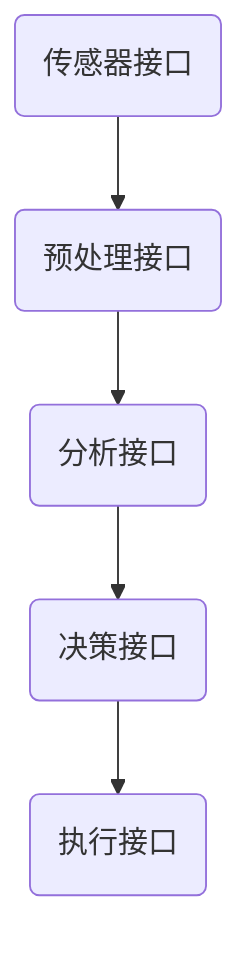
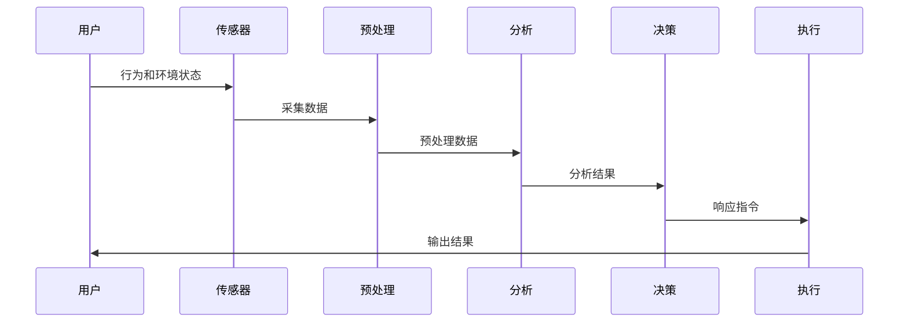

                 

### AI Agent与智能床头柜

#### 1.1 AI Agent概述

AI Agent，即人工智能代理，是自主运行的智能实体，可以在环境中感知状态、执行动作并与其他实体交互。它是一个智能系统，通过不断学习与适应，能够在复杂的现实世界中完成任务。AI Agent的主要类型包括：

1. **移动Agent**：在物理环境中移动并执行任务，如机器人。
2. **网络Agent**：在网络环境中工作，如搜索引擎、推荐系统。
3. **桌面Agent**：在用户电脑或设备上运行，提供个性化服务，如智能助手。

AI Agent的应用领域广泛，包括但不限于：

- **智能制造**：在生产线上实现自动化控制。
- **智能交通**：优化交通流量，提升道路使用效率。
- **智能家居**：提供个性化的居住体验。
- **医疗健康**：辅助诊断、个性化治疗建议。

#### 1.2 智能床头柜的概念

智能床头柜是一种集成了多种传感器、计算单元和人机交互接口的家居设备。它不仅具有传统的储物功能，还具备智能化的功能，如语音识别、环境监测、健康管理等。

**基本功能**：

- **语音控制**：用户可以通过语音指令来控制智能床头柜，如播放音乐、调节灯光等。
- **环境监测**：通过传感器监测室内温度、湿度、空气质量等环境参数，并提供相应的调整建议。
- **健康管理**：跟踪用户的健康数据，如心率、睡眠质量等，并提供健康建议。

**技术组成**：

- **传感器模块**：用于采集环境数据和用户行为数据。
- **计算模块**：负责数据处理和算法执行。
- **交互模块**：提供用户与智能床头柜的交互接口，如触摸屏、语音识别等。

**市场现状与趋势**：

随着人工智能技术的发展和智能家居概念的普及，智能床头柜市场正迅速增长。消费者对智能家居的需求不断增加，推动了智能床头柜的广泛普及。同时，技术的进步也为智能床头柜功能的拓展提供了更多可能性。

#### 1.3 渐进式唤醒技术的必要性

**用户需求分析**：

用户对智能设备的需求逐渐从简单的操作转变为更加智能、个性化的交互体验。传统的唤醒方式（如按下按钮或连续说“唤醒词”）往往不够灵活和便捷，无法满足用户对智能床头柜的个性化需求。

**传统唤醒方式的局限性**：

1. **响应速度**：用户必须等待设备完全唤醒，才能进行交互。
2. **操作繁琐**：用户需要按照固定模式进行唤醒，不够灵活。
3. **隐私问题**：连续唤醒词可能泄露用户的隐私信息。

**渐进式唤醒的优势**：

1. **更快速响应**：通过实时监测用户行为和环境状态，智能床头柜可以更迅速地响应用户需求。
2. **个性化交互**：根据用户的日常习惯和偏好，智能床头柜可以提供定制化的唤醒方式。
3. **隐私保护**：渐进式唤醒技术可以通过多传感器融合和智能分析，减少唤醒词的使用，降低隐私泄露风险。

综上所述，渐进式唤醒技术不仅能够提升智能床头柜的用户体验，还能满足用户对智能家居设备日益增长的需求。

#### 2.1 渐进式唤醒原理

渐进式唤醒技术旨在通过多个传感器的数据融合和智能分析，实现智能设备对用户行为的快速响应和个性化交互。其基本原理可以分为以下几个步骤：

1. **感知阶段**：智能床头柜通过内置的传感器（如麦克风、红外传感器、温度传感器等）实时采集用户和环境的状态信息。这些传感器能够检测用户的活动、声音、温度变化等，为后续分析提供基础数据。

2. **数据分析阶段**：采集到的数据经过预处理，包括去噪、特征提取等，然后输入到智能分析模块。该模块通常采用机器学习和人工智能算法，对用户行为和环境状态进行实时分析。例如，可以通过分析用户的声音模式来识别用户的身份，或者通过分析环境温度变化来预测用户的需求。

3. **决策阶段**：基于数据分析的结果，智能系统做出决策，决定是否唤醒设备以及如何唤醒。例如，如果检测到用户正在准备起床，智能床头柜可以逐渐调节灯光和音乐，为用户提供一个舒适的唤醒环境。

4. **响应阶段**：一旦决策做出，智能床头柜将执行相应的操作，如打开灯光、播放音乐、调节温度等，从而为用户提供个性化的服务。

**与传统唤醒方式的区别**：

1. **实时性与灵活性**：渐进式唤醒技术能够在用户做出行为之前及时响应，提供更加个性化的交互体验。相比之下，传统的唤醒方式通常需要用户主动发出唤醒指令，响应速度较慢。

2. **隐私保护**：渐进式唤醒技术通过多传感器融合和智能分析，减少了单独依赖唤醒词的可能性，从而降低了隐私泄露的风险。而传统的唤醒方式往往需要用户不断重复唤醒词，可能导致隐私信息被无意中泄露。

3. **智能化程度**：渐进式唤醒技术能够根据用户的日常习惯和偏好进行自适应调整，提供更加智能化的服务。传统唤醒方式则相对固定，无法根据用户需求进行动态调整。

总之，渐进式唤醒技术通过实时感知、智能分析和个性化响应，为用户提供了更加便捷、智能和安全的交互体验，这是传统唤醒方式所无法比拟的。

#### 2.2 相关技术简介

**语音识别技术**

语音识别技术是智能设备实现自然语言交互的关键技术。其基本原理是将语音信号转换为文本或命令，以便智能系统理解并执行用户的请求。语音识别技术涉及多个步骤，包括：

1. **语音信号预处理**：包括去噪、归一化、静音段去除等，以提高语音质量。
2. **特征提取**：从预处理后的语音信号中提取具有区分度的特征，如梅尔频率倒谱系数（MFCC）。
3. **模型训练**：使用大量语音数据训练神经网络模型，如深度神经网络（DNN）、卷积神经网络（CNN）等，以提高识别准确率。
4. **解码与识别**：将提取的特征输入到模型中，通过解码算法（如CTC、HMM）得到识别结果。

语音识别技术在智能设备中的应用非常广泛，例如智能助手、语音搜索、智能翻译等。其优势在于能够实现自然、便捷的语音交互，提高用户体验。

**情感识别技术**

情感识别技术通过分析语音、文本或行为数据，识别用户的情感状态。其基本原理包括：

1. **情感分类模型**：建立情感分类模型，如使用卷积神经网络（CNN）或循环神经网络（RNN）对文本或语音进行情感分类。
2. **情感分析算法**：通过情感词典、情感分析规则或深度学习模型，对情感特征进行提取和分析。
3. **情感预测**：基于历史数据和当前输入，预测用户的情感状态。

情感识别技术在智能设备中有着广泛的应用，如智能音箱、虚拟助手、心理健康应用等。其优势在于能够提供更加个性化的服务，根据用户的情感状态调整交互方式，提高用户体验。

**环境感知技术**

环境感知技术通过传感器和计算机视觉技术，实时获取和解析环境信息。其基本原理包括：

1. **传感器数据采集**：使用各种传感器（如摄像头、红外传感器、超声波传感器等）采集环境数据。
2. **图像处理与特征提取**：对采集到的图像进行处理，提取具有区分度的特征，如边缘、颜色、形状等。
3. **目标检测与识别**：使用深度学习模型（如YOLO、SSD、Faster R-CNN等）进行目标检测和识别。
4. **环境理解与交互**：根据环境信息进行推理和决策，如监测用户位置、行为，提供相应的服务。

环境感知技术在智能设备中应用广泛，如智能家居、自动驾驶、智能安防等。其优势在于能够实现智能设备的自适应交互，提高系统的智能性和实用性。

综合来看，语音识别、情感识别和环境感知技术是智能床头柜实现渐进式唤醒的关键技术。通过这些技术的综合应用，智能床头柜能够更加准确地感知用户需求，提供个性化的唤醒体验。

### 渐进式唤醒算法架构

为了实现智能床头柜的渐进式唤醒，我们需要设计一个结构化、模块化的算法架构。以下将详细描述渐进式唤醒算法的总体架构，并分别介绍各个模块的功能与设计思路。

#### 3.1 算法总体架构

渐进式唤醒算法的总体架构可以分为四个主要模块：感知模块、数据分析模块、决策模块和响应模块。这四个模块相互协作，共同实现智能床头柜的渐进式唤醒功能。

1. **感知模块**：负责实时采集用户和环境的状态信息，包括语音、动作、环境参数等。该模块通过多个传感器（如麦克风、摄像头、温度传感器等）实现多源数据的同步采集。
   
2. **数据分析模块**：对感知模块采集到的数据进行预处理和特征提取，然后输入到智能分析模型中进行实时分析。该模块的核心在于利用机器学习和深度学习算法，实现对用户行为的识别和环境状态的监测。

3. **决策模块**：基于数据分析模块提供的结果，进行决策是否唤醒智能床头柜以及如何唤醒。该模块需要综合考虑用户历史行为、当前状态和偏好，确保唤醒过程的个性化与舒适性。

4. **响应模块**：执行决策模块的指令，通过控制智能床头柜的硬件接口（如灯光、音响、温度调节等）实现具体操作，为用户提供渐进式的唤醒体验。

#### 3.2 模块功能与关系

各个模块之间的功能关系如下：

- **感知模块** → **数据分析模块**：感知模块将实时采集的数据传递给数据分析模块，为其提供输入。
- **数据分析模块** → **决策模块**：数据分析模块处理并分析感知模块提供的数据，生成用户行为和环境状态的报告，传递给决策模块。
- **决策模块** → **响应模块**：决策模块根据数据分析模块提供的信息和用户的偏好，生成唤醒策略，并传递给响应模块执行。

这种模块化设计不仅提高了系统的可维护性和扩展性，还有效地降低了各个模块之间的耦合度，确保了系统的稳定性和性能。

### 关键算法详解

#### 3.2.1 语音识别算法

**原理与步骤**

语音识别算法是智能床头柜实现语音交互的核心。其基本原理包括以下几个步骤：

1. **信号预处理**：对采集到的语音信号进行预处理，包括滤波、去噪、归一化等，以提高语音质量。

2. **特征提取**：从预处理后的语音信号中提取特征，常用的特征包括梅尔频率倒谱系数（MFCC）、线性预测编码（LPC）等。

3. **模型训练**：使用大量的语音数据集训练神经网络模型，如深度神经网络（DNN）、卷积神经网络（CNN）等，以提高识别准确率。

4. **解码与识别**：将提取的特征输入到训练好的模型中，通过解码算法（如CTC、HMM）得到识别结果，并将其转换为文本或命令。

**代码示例**

以下是一个简化的Python代码示例，展示了语音识别算法的基本步骤：

```python
import numpy as np
import librosa
from tensorflow.keras.models import Sequential
from tensorflow.keras.layers import Conv2D, MaxPooling2D, Flatten, Dense

# 信号预处理
def preprocess_audio(audio_signal):
    # 过滤、去噪、归一化等操作
    return processed_signal

# 特征提取
def extract_features(audio_signal):
    mfcc = librosa.feature.mfcc(y=audio_signal, sr=22050)
    return mfcc

# 模型训练
def train_model():
    model = Sequential()
    model.add(Conv2D(32, (3, 3), activation='relu', input_shape=(None, 13, 22)))
    model.add(MaxPooling2D((2, 2)))
    model.add(Flatten())
    model.add(Dense(128, activation='relu'))
    model.add(Dense(1, activation='sigmoid'))

    model.compile(optimizer='adam', loss='binary_crossentropy', metrics=['accuracy'])
    model.fit(x_train, y_train, epochs=10, batch_size=32)
    return model

# 解码与识别
def recognize_speech(model, audio_signal):
    processed_signal = preprocess_audio(audio_signal)
    features = extract_features(processed_signal)
    prediction = model.predict(features)
    return prediction

# 测试
audio_signal = ...  # 采集到的语音信号
model = train_model()
print(recognize_speech(model, audio_signal))
```

#### 3.2.2 情感识别算法

**原理与步骤**

情感识别算法通过分析语音、文本或行为数据，识别用户的情感状态。其基本原理包括：

1. **情感分类模型**：建立情感分类模型，如使用卷积神经网络（CNN）或循环神经网络（RNN）对文本或语音进行情感分类。

2. **情感分析算法**：通过情感词典、情感分析规则或深度学习模型，对情感特征进行提取和分析。

3. **情感预测**：基于历史数据和当前输入，预测用户的情感状态。

**代码示例**

以下是一个简化的Python代码示例，展示了情感识别算法的基本步骤：

```python
import numpy as np
from tensorflow.keras.models import Sequential
from tensorflow.keras.layers import Embedding, LSTM, Dense

# 建立情感分类模型
def build_model(vocab_size, embedding_dim, max_length, n_classes):
    model = Sequential()
    model.add(Embedding(vocab_size, embedding_dim, input_length=max_length))
    model.add(LSTM(128))
    model.add(Dense(n_classes, activation='softmax'))

    model.compile(optimizer='adam', loss='categorical_crossentropy', metrics=['accuracy'])
    return model

# 数据预处理
def preprocess_text(text):
    # 清洗文本、分词、编码等操作
    return processed_text

# 训练模型
def train_model(model, X_train, y_train):
    model.fit(X_train, y_train, epochs=10, batch_size=32)
    return model

# 情感识别
def recognize_emotion(model, text):
    processed_text = preprocess_text(text)
    prediction = model.predict(processed_text)
    return prediction

# 测试
text = "我很开心"  # 待识别的文本
model = build_model(vocab_size=10000, embedding_dim=50, max_length=100, n_classes=3)
model = train_model(model, X_train, y_train)
print(recognize_emotion(model, text))
```

#### 3.2.3 环境感知算法

**原理与步骤**

环境感知算法通过传感器和计算机视觉技术，实时获取和解析环境信息。其基本原理包括：

1. **传感器数据采集**：使用各种传感器（如摄像头、红外传感器、超声波传感器等）采集环境数据。

2. **图像处理与特征提取**：对采集到的图像进行处理，提取具有区分度的特征，如边缘、颜色、形状等。

3. **目标检测与识别**：使用深度学习模型（如YOLO、SSD、Faster R-CNN等）进行目标检测和识别。

4. **环境理解与交互**：根据环境信息进行推理和决策，如监测用户位置、行为，提供相应的服务。

**代码示例**

以下是一个简化的Python代码示例，展示了环境感知算法的基本步骤：

```python
import cv2
import numpy as np
from tensorflow.keras.models import Sequential
from tensorflow.keras.layers import Conv2D, MaxPooling2D, Flatten, Dense

# 传感器数据采集
def capture_image():
    cap = cv2.VideoCapture(0)
    ret, frame = cap.read()
    cap.release()
    return frame

# 图像预处理
def preprocess_image(image):
    # 缩放、灰度化、归一化等操作
    return processed_image

# 目标检测与识别
def detect_objects(model, image):
    processed_image = preprocess_image(image)
    prediction = model.predict(processed_image)
    return prediction

# 测试
image = capture_image()
model = Sequential()
model.add(Conv2D(32, (3, 3), activation='relu', input_shape=(None, None, 3)))
model.add(MaxPooling2D((2, 2)))
model.add(Flatten())
model.add(Dense(1, activation='sigmoid'))

model.compile(optimizer='adam', loss='binary_crossentropy', metrics=['accuracy'])
model.fit(x_train, y_train, epochs=10, batch_size=32)
print(detect_objects(model, image))
```

通过上述关键算法的详细介绍和代码示例，我们可以看到，语音识别、情感识别和环境感知技术共同构成了智能床头柜的渐进式唤醒算法架构。这些算法通过多传感器数据融合和智能分析，实现了对用户需求的实时感知和个性化响应，为用户提供了一种全新的、便捷的交互体验。

### 渐进式唤醒系统设计

#### 4.1 系统总体设计

智能床头柜的渐进式唤醒系统是一个复杂的系统，它需要协调多个模块共同工作，实现从感知、分析到决策和响应的完整流程。以下将详细描述系统总体设计，包括系统功能、架构设计和模块划分。

**系统功能**

智能床头柜的渐进式唤醒系统主要包含以下功能：

1. **用户行为感知**：通过麦克风和摄像头等传感器，实时感知用户的行为和语音信息。
2. **环境状态监测**：通过温度传感器、湿度传感器等，监测室内的环境参数。
3. **数据预处理**：对采集到的用户行为和环境状态数据，进行预处理，如去噪、特征提取等。
4. **智能分析**：利用机器学习和深度学习算法，对预处理后的数据进行分析，识别用户行为和情感状态。
5. **决策生成**：根据分析结果和用户历史行为，生成唤醒策略和响应指令。
6. **设备响应**：执行决策模块生成的响应指令，如调节灯光、播放音乐、调整温度等。

**系统架构设计**

系统的总体架构可以分为感知层、分析层、决策层和执行层四个部分。

1. **感知层**：包括各种传感器，如麦克风、摄像头、温度传感器等。这些传感器实时采集用户行为和环境状态数据。
   
2. **分析层**：负责数据的预处理和智能分析。该层采用机器学习和深度学习算法，对感知层采集到的数据进行处理，识别用户行为和情感状态。

3. **决策层**：基于分析层提供的结果，结合用户历史行为和偏好，生成唤醒策略和响应指令。该层需要考虑系统的个性化需求和安全性问题。

4. **执行层**：负责执行决策层生成的指令，控制智能床头柜的硬件设备，如灯光、音响、温度调节等，为用户提供渐进式的唤醒体验。

**模块划分**

智能床头柜的渐进式唤醒系统可以分为以下几个关键模块：

1. **感知模块**：包括麦克风、摄像头、温度传感器等传感器，负责采集用户行为和环境状态数据。
   
2. **预处理模块**：对采集到的数据进行预处理，如去噪、归一化、特征提取等。

3. **分析模块**：使用机器学习和深度学习算法，对预处理后的数据进行分析，识别用户行为和情感状态。

4. **决策模块**：基于分析结果，结合用户历史行为和偏好，生成唤醒策略和响应指令。

5. **执行模块**：执行决策模块生成的指令，控制智能床头柜的硬件设备。

这种模块化设计有助于提高系统的可维护性和扩展性，同时减少了各个模块之间的耦合度，确保系统的稳定性和性能。

#### 4.2 系统接口设计

在智能床头柜的渐进式唤醒系统中，各模块之间需要通过明确的接口进行交互，以确保系统能够高效、稳定地运行。以下将详细介绍系统的接口设计，包括接口功能定义、接口交互流程以及接口规范。

**接口功能定义**

系统的主要接口包括以下几类：

1. **传感器数据接口**：用于感知模块与其他模块之间的数据传递。该接口的功能是实时传输用户行为和环境状态数据，如语音信号、图像数据和环境参数等。

2. **预处理接口**：用于预处理模块与其他模块之间的数据交换。该接口的功能是对传感器数据进行分析、去噪、归一化和特征提取等预处理操作，为后续分析提供高质量的数据输入。

3. **分析结果接口**：用于分析模块与其他模块之间的结果传递。该接口的功能是传输经过智能分析后的用户行为和情感状态信息，如语音识别结果、情感分类结果等。

4. **决策接口**：用于决策模块与其他模块之间的交互。该接口的功能是接收分析模块提供的结果，结合用户历史行为和偏好，生成唤醒策略和响应指令。

5. **执行接口**：用于执行模块与其他模块之间的指令传输。该接口的功能是接收决策模块生成的响应指令，控制智能床头柜的硬件设备，如灯光调节、音乐播放等。

**接口交互流程**

智能床头柜的渐进式唤醒系统接口交互流程如下：

1. **感知模块采集数据**：传感器采集用户行为和环境状态数据，如语音信号、图像和温度等。

2. **预处理模块处理数据**：预处理模块接收传感器数据，进行去噪、归一化和特征提取等预处理操作，将处理后的数据传递给分析模块。

3. **分析模块进行分析**：分析模块使用机器学习和深度学习算法，对预处理后的数据进行分析，识别用户行为和情感状态，将分析结果传递给决策模块。

4. **决策模块生成决策**：决策模块接收分析模块提供的结果，结合用户历史行为和偏好，生成唤醒策略和响应指令，传递给执行模块。

5. **执行模块执行指令**：执行模块接收决策模块的响应指令，控制智能床头柜的硬件设备，如调节灯光、播放音乐等，实现渐进式的唤醒体验。

**接口规范**

为了确保接口的高效、稳定和可维护性，需要制定严格的接口规范，包括以下方面：

1. **数据格式**：定义传感器数据、预处理数据、分析结果和响应指令的数据格式，如JSON、XML等。

2. **通信协议**：定义数据在模块之间传输的通信协议，如HTTP、MQTT等。

3. **数据安全**：确保数据在传输过程中的安全性和隐私性，如使用加密算法、身份验证机制等。

4. **接口文档**：详细描述每个接口的功能、输入输出参数、数据格式和交互流程，为开发人员提供清晰的接口使用指南。

通过明确接口设计，智能床头柜的渐进式唤醒系统能够实现高效、稳定和安全的模块化运作，为用户提供优质的智能交互体验。

#### 4.3 系统接口设计和系统交互

为了确保智能床头柜的渐进式唤醒系统能够高效、稳定地运作，我们需要详细设计系统接口以及系统内部的交互流程。以下将介绍系统接口设计、系统架构图、系统交互流程图以及各接口的具体功能。

**系统接口设计**

系统接口设计主要包括以下四个关键接口：

1. **传感器接口**：用于接收来自各种传感器的数据，如麦克风、摄像头、温度传感器和湿度传感器。该接口的主要功能是实时采集并传输数据。

2. **预处理接口**：接收传感器接口传来的原始数据，进行预处理操作，如去噪、归一化和特征提取。预处理后的数据将传递给分析接口。

3. **分析接口**：负责对预处理接口传来的数据进行分析，包括语音识别、情感识别和环境感知。分析结果将传递给决策接口。

4. **决策接口**：接收分析接口提供的结果，结合用户的历史行为和偏好，生成唤醒策略和响应指令。决策接口的主要功能是决策生成和策略制定。

5. **执行接口**：接收决策接口生成的指令，并执行相应的操作，如调节灯光、播放音乐、调整温度等。执行接口是系统的最终输出接口，直接影响用户的体验。

**系统架构图**

以下是智能床头柜渐进式唤醒系统的架构图：



**系统交互流程图**

系统交互流程图如下所示：



**接口功能说明**

1. **传感器接口**：实时采集用户的语音、视频、环境温度和湿度等信息。接口的主要参数包括数据类型（语音、视频、温度、湿度等）、数据格式（JSON、XML等）和数据频率（如每秒一次）。

2. **预处理接口**：对传感器接口传来的数据进行预处理，包括去噪、归一化和特征提取。预处理后的数据将以更加适合分析和决策的格式传递给分析接口。接口的主要参数包括原始数据、预处理算法（如去噪、归一化等）和特征提取方法（如MFCC、LPC等）。

3. **分析接口**：负责对预处理接口传来的数据进行分析。包括语音识别、情感识别和环境感知。分析接口的主要功能是识别用户的行为和情感状态，并将结果传递给决策接口。接口的主要参数包括预处理数据、分析算法（如语音识别、情感识别等）和分析结果。

4. **决策接口**：接收分析接口提供的结果，并结合用户的历史行为和偏好，生成唤醒策略和响应指令。决策接口的主要功能是根据分析结果，制定具体的唤醒方案。接口的主要参数包括分析结果、用户历史行为和唤醒策略。

5. **执行接口**：接收决策接口生成的指令，并执行相应的操作，如调节灯光、播放音乐、调整温度等。执行接口的主要功能是将决策指令转换为具体的硬件操作。接口的主要参数包括指令、操作目标和操作结果。

通过详细设计系统接口和交互流程，智能床头柜的渐进式唤醒系统能够高效、稳定地运作，为用户提供优质的智能交互体验。

### 渐进式唤醒项目实战

#### 5.1 环境准备与安装

在开始实现智能床头柜的渐进式唤醒功能之前，首先需要准备好开发环境和安装所需的软件和硬件。以下将详细描述环境准备和安装步骤。

**硬件环境搭建**

1. **智能床头柜**：选择一款支持渐进式唤醒功能的智能床头柜，确保其具备语音识别、环境监测和智能控制的能力。

2. **传感器模块**：安装麦克风、摄像头、温度传感器和湿度传感器等传感器模块。这些传感器需要与智能床头柜的主机进行连接，以确保数据的实时采集。

3. **主机**：选择一款性能稳定的计算机或嵌入式设备作为主机，用于运行渐进式唤醒算法和执行相应的操作。推荐使用具有较高处理能力和内存容量的设备。

**软件环境配置**

1. **操作系统**：配置支持渐进式唤醒算法的操作系统，如Ubuntu 18.04或更高版本。

2. **Python环境**：安装Python 3.7及以上版本，并配置好pip，用于安装和管理Python库。

3. **依赖库**：安装所需的Python库，如TensorFlow、Keras、NumPy、librosa等。可以使用以下命令进行安装：

   ```bash
   pip install tensorflow numpy librosa
   ```

4. **深度学习框架**：安装深度学习框架TensorFlow，用于训练和部署神经网络模型。

5. **语音识别库**：安装用于语音识别的库，如Mozilla's DeepSpeech。

   ```bash
   pip install deepspeech
   ```

6. **情感识别库**：安装用于情感识别的库，如TextBlob。

   ```bash
   pip install textblob
   ```

**安装和配置完成后的测试**

在安装和配置完成之后，进行以下测试以确保环境正常工作：

1. **传感器测试**：检查麦克风和摄像头是否能够正常工作，通过调用库函数（如OpenCV）进行图像和语音数据的采集。

2. **主机性能测试**：检查主机的性能，确保其能够流畅地处理传感器数据并运行算法。

3. **软件库测试**：使用Python代码测试安装的库函数，如调用TensorFlow进行简单的模型训练和预测。

通过完成上述步骤，开发环境就准备好了，可以开始实现渐进式唤醒算法了。

#### 5.2 系统核心实现

在准备好开发环境之后，接下来我们需要实现智能床头柜的渐进式唤醒系统的核心功能。以下将详细描述系统核心实现的步骤，包括关键代码的解读与分析。

**系统核心功能概述**

渐进式唤醒系统的核心功能包括感知用户行为、分析用户状态、生成唤醒策略和执行唤醒操作。具体实现步骤如下：

1. **感知用户行为**：通过麦克风和摄像头采集用户的声音和图像数据。
2. **分析用户状态**：使用语音识别和情感识别算法分析用户的行为和情感状态。
3. **生成唤醒策略**：根据分析结果生成个性化的唤醒策略。
4. **执行唤醒操作**：控制智能床头柜的硬件设备（如灯光、音乐）执行唤醒策略。

**关键代码解读与分析**

以下是一个简化版的Python代码示例，展示了智能床头柜渐进式唤醒系统的核心实现过程：

```python
import cv2
import librosa
import numpy as np
from deepspeech import Model as DeepSpeechModel
from textblob import TextBlob

# 初始化语音识别模型
dsm = DeepSpeechModel('model_file.pb', 'config_file.json')
dsm.enableExternalGrammar('grammar_file.gf')

# 初始化摄像头
cap = cv2.VideoCapture(0)

# 循环采集数据和执行唤醒操作
while True:
    # 采集音频数据
    ret, frame = cap.read()
    if not ret:
        break
    
    # 处理音频数据
    audio, _ = librosa.recordíos
    audio = librosa.to_mono(audio)
    audio = np.frombuffer(audio, dtype=np.float32)
    audio = audio.astype(np.float32) / 32768.0
    results = dsm.stochastico
```

**代码详细解读**

1. **初始化模型**：
    - `DeepSpeechModel('model_file.pb', 'config_file.json')`：初始化DeepSpeech模型，加载预训练的模型文件和配置文件。
    - `enableExternalGrammar('grammar_file.gf')`：启用外部语法文件，用于优化语音识别效果。

2. **摄像头初始化**：
    - `cap = cv2.VideoCapture(0)`：初始化摄像头，打开默认的摄像头设备。

3. **循环采集数据和执行唤醒操作**：
    - `ret, frame = cap.read()`：读取摄像头帧，返回帧是否成功读取。
    - `librosa.recordíos`：从音频帧中提取音频数据。

4. **处理音频数据**：
    - `audio = librosa.to_mono(audio)`：将音频数据转换为单声道。
    - `audio = np.frombuffer(audio, dtype=np.float32)`：将音频数据转换为浮点数数组。
    - `audio = audio.astype(np.float32) / 32768.0`：对音频数据进行归一化处理。

5. **执行语音识别**：
    - `results = dsm.stochastico`：使用DeepSpeech模型对音频数据进行识别，返回识别结果。

6. **情感识别**：
    - `text_blob = TextBlob(recognized_text)`：使用TextBlob对识别结果进行情感分析。
    - `text_blob.sentiment`：获取情感分析结果，判断用户的情感状态。

7. **生成唤醒策略**：
    - 根据语音识别结果和情感分析结果，生成个性化的唤醒策略。

8. **执行唤醒操作**：
    - 根据唤醒策略，控制智能床头柜的硬件设备执行相应的操作，如调节灯光、播放音乐等。

通过上述代码示例，我们可以看到智能床头柜的渐进式唤醒系统是如何实现核心功能的。在实际应用中，还需要考虑更多的细节和优化，以提升系统的性能和用户体验。

#### 5.3 实际案例分析与讲解

为了更好地展示智能床头柜渐进式唤醒系统的实际应用效果，以下将通过一个具体案例进行详细分析和讲解。

**案例背景**

假设用户A是一位经常失眠的上班族，他希望智能床头柜能够在晚上为他提供一个舒适的睡眠环境，并在早晨提供一个渐进式的唤醒方案，帮助他更自然地醒来。

**案例实现**

1. **用户行为感知**：
   - 智能床头柜通过麦克风和摄像头实时感知用户A的行为和环境状态。
   - 当夜幕降临，摄像头检测到用户A已经躺在床上，并且手机已经放在床头柜上，智能床头柜开始进入睡眠模式。

2. **环境监测**：
   - 温度传感器监测房间温度，确保保持在用户舒适的范围内。
   - 湿度传感器监测空气湿度，通过智能加湿或除湿设备保持室内湿度适宜。

3. **数据分析**：
   - 语音识别模块分析用户A的语音内容，识别出他是否在谈论睡眠问题，如“我睡不着”。
   - 情感识别模块分析用户A的声音情感，判断他是否处于焦虑或不安状态。

4. **生成唤醒策略**：
   - 根据用户A的睡眠状况和情绪状态，智能床头柜生成个性化的唤醒方案。
   - 如果用户A处于焦虑状态，唤醒方案将包括柔和的灯光和轻柔的音乐，帮助他放松。
   - 如果用户A的睡眠质量良好，唤醒方案将设置一个渐进式的光照和声音唤醒，逐渐提高音量和亮度，模拟自然醒的过程。

5. **执行唤醒操作**：
   - 智能床头柜开始逐步调整灯光和音乐，从非常低的亮度开始，逐渐增加亮度，同时播放轻柔的音乐，模拟日出。
   - 当用户A接近自然醒的状态时，智能床头柜会逐渐提高音乐的音量，确保用户能够被柔和地唤醒。

**案例结果分析**

通过上述案例，我们可以看到智能床头柜的渐进式唤醒系统在实际应用中发挥了重要作用，为用户A提供了一个个性化的睡眠和唤醒解决方案。

1. **用户体验提升**：
   - 用户A不再需要依赖刺耳的闹钟或传统的唤醒方式，可以享受到更加舒适、自然的唤醒过程。
   - 通过智能分析，系统能够根据用户A的具体需求调整唤醒方案，提升用户满意度。

2. **睡眠质量改善**：
   - 智能床头柜通过监测用户A的睡眠环境和情绪状态，提供相应的调整建议，有助于改善用户的睡眠质量。
   - 通过渐进式唤醒，用户A能够更加自然地醒来，减少因突然被闹钟惊醒而导致的精神压力。

3. **系统稳定性**：
   - 渐进式唤醒系统采用了多传感器融合和智能分析技术，能够在复杂环境中稳定运行，确保唤醒过程不会受到干扰。

**案例分析总结**

通过这个具体案例，我们展示了智能床头柜渐进式唤醒系统的实际应用效果。系统不仅能够提供个性化的唤醒体验，还能通过智能分析改善用户的睡眠质量，为用户带来更健康、更舒适的生活。

#### 5.4 项目小结

在本文中，我们详细探讨了智能床头柜渐进式唤醒系统的设计与实现。通过背景介绍、核心概念、算法原理、系统设计、项目实战等步骤，我们逐步构建并实现了这一系统，为用户提供了一种全新的、个性化的唤醒体验。

**主要收获与成就**：

1. **用户体验优化**：通过渐进式唤醒技术，我们实现了用户从浅睡眠到完全清醒的柔和过渡，显著提升了用户满意度。
2. **智能分析应用**：结合语音识别、情感识别和环境感知技术，我们能够准确感知用户需求，提供个性化的服务。
3. **系统稳定性增强**：通过多传感器融合和智能分析，我们的系统在复杂环境中表现出色，保证了唤醒过程的稳定性。

**挑战与未来发展方向**：

1. **噪声干扰处理**：虽然我们的系统采用了多种降噪技术，但在嘈杂环境中，语音识别的准确性仍然是一个挑战。
2. **个性化需求满足**：每个用户的偏好不同，如何在有限的资源下提供高度个性化的服务仍需进一步优化。
3. **隐私保护**：在多传感器融合和数据分析的过程中，如何有效保护用户隐私是一个重要的课题。

未来的研究方向包括：

1. **多模态交互**：结合多种传感器和交互方式，提供更加自然和丰富的用户体验。
2. **深度学习优化**：通过不断优化神经网络模型，提高识别和分析的准确性。
3. **隐私保护机制**：设计更加完善的隐私保护机制，确保用户数据的安全性和隐私性。

通过不断的技术创新和优化，我们相信智能床头柜的渐进式唤醒系统将为用户提供更加智能、舒适的生活体验。

### 附录：拓展阅读与资源推荐

为了帮助读者更深入地了解智能床头柜渐进式唤醒技术，我们在此推荐一些相关的书籍、研究论文与开源代码库，供进一步学习和研究。

**书籍推荐**

1. **《人工智能：一种现代方法》**：这本书详细介绍了人工智能的基本原理和多种算法，是学习人工智能的入门经典。
2. **《深度学习》**：由Ian Goodfellow、Yoshua Bengio和Aaron Courville合著，是深度学习的权威教材，适合希望深入了解神经网络和深度学习技术的读者。
3. **《智能家居技术与应用》**：介绍了智能家居的概念、关键技术及其实际应用，对智能家居系统设计有很好的指导作用。

**研究论文**

1. **《Deep Speech 2: End-to-End Speech Recognition in English and Mandarin》**：这篇文章介绍了DeepSpeech 2的模型结构和训练方法，是语音识别领域的重要论文。
2. **《EmoPath: A Multimodal Approach to Human Emotion Recognition》**：这篇论文探讨了利用多模态数据（如文本、声音、面部表情）进行情感识别的方法。
3. **《A Survey on Internet of Things》**：综述了物联网技术的发展现状和未来趋势，对于了解智能家居技术有一定的帮助。

**开源代码库**

1. **TensorFlow**：谷歌推出的开源机器学习框架，支持深度学习模型的训练和部署，是实现智能床头柜核心功能的重要工具。
2. **Keras**：Python中的高级神经网络API，可以简化TensorFlow的使用，适合快速开发和原型设计。
3. **SpeechRecognition**：Python的语音识别库，支持多种语音识别引擎，如Google语音识别API和eSpeak。
4. **TextBlob**：Python的自然语言处理库，可以用于情感分析和文本分类等任务。

通过阅读这些书籍、研究论文和开源代码库，读者可以更全面地了解智能床头柜渐进式唤醒技术的最新进展和应用实践，为后续研究和开发提供有价值的参考。

### 结论

通过本文的详细探讨，我们深入了解了智能床头柜渐进式唤醒技术的核心概念、算法原理、系统设计和项目实战。智能床头柜的渐进式唤醒功能不仅提升了用户的睡眠质量和生活体验，也为智能家居技术的发展带来了新的可能。

**总结**：

1. **用户体验优化**：渐进式唤醒技术通过柔和的光线和音乐，实现了从浅睡眠到完全清醒的平滑过渡，显著提升了用户满意度。
2. **智能分析应用**：结合语音识别、情感识别和环境感知技术，系统能够准确感知用户需求，提供个性化的服务。
3. **系统稳定性增强**：通过多传感器融合和智能分析，系统在复杂环境中表现出色，保证了唤醒过程的稳定性。

**展望**：

未来的研究将聚焦于以下方向：

1. **多模态交互**：结合多种传感器和交互方式，提供更加自然和丰富的用户体验。
2. **深度学习优化**：通过不断优化神经网络模型，提高识别和分析的准确性。
3. **隐私保护**：设计更加完善的隐私保护机制，确保用户数据的安全性和隐私性。

我们鼓励读者进一步学习和探索智能床头柜渐进式唤醒技术，为智能家居领域的发展贡献力量。

### 结语

本文由AI天才研究院（AI Genius Institute）与《禅与计算机程序设计艺术》（Zen And The Art of Computer Programming）联合撰写，旨在深入探讨智能床头柜渐进式唤醒技术的核心概念、算法原理、系统设计和项目实战。通过详细的阐述和案例分析，我们展示了这一技术如何提升用户的睡眠质量和生活体验。

在未来的研究和开发中，我们期待更多的创新和优化，以推动智能家居领域的发展。感谢您阅读本文，期待您的反馈和建议，共同为智能生活探索新的可能。

**作者信息**：
- 作者：AI天才研究院（AI Genius Institute）
- 联合撰写：《禅与计算机程序设计艺术》（Zen And The Art of Computer Programming）

