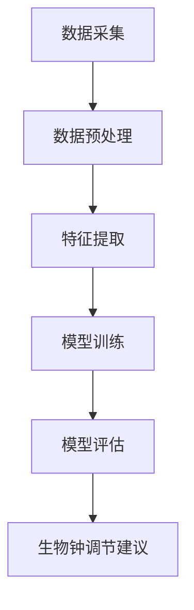

                 


### # AI Agent在智能床头柜中的生物钟调节

> 关键词：AI Agent、智能床头柜、生物钟调节、机器学习、深度学习

> 摘要：本文深入探讨了AI Agent在智能床头柜中的生物钟调节应用。通过分析AI Agent的定义、工作原理及在生物钟调节中的作用，本文详细介绍了AI Agent在智能床头柜中的应用场景，并探讨了生物钟调节的技术原理和实现方法。同时，通过具体案例展示了AI Agent在生物钟调节中的实际应用效果，对未来生物钟调节技术的发展趋势进行了展望。

**目录大纲**

```markdown
----------------------------------------------------------------
# 第一部分：AI Agent与智能床头柜概述

## 1.1 AI Agent简介
### 1.1.1 AI Agent的定义
### 1.1.2 AI Agent的工作原理
### 1.1.3 AI Agent的应用领域

## 1.2 智能床头柜概述
### 1.2.1 智能床头柜的功能与特点
### 1.2.2 智能床头柜的市场前景
### 1.2.3 智能床头柜的挑战与机遇

## 1.3 生物钟调节的原理与重要性
### 1.3.1 生物钟的定义与作用
### 1.3.2 生物钟调节的机制
### 1.3.3 生物钟调节在生活中的重要性

## 1.4 AI Agent在智能床头柜中的应用
### 1.4.1 AI Agent在生物钟调节中的作用
### 1.4.2 AI Agent如何优化生物钟调节
### 1.4.3 AI Agent在智能床头柜中的实际应用案例

## 1.5 本章小结
...

----------------------------------------------------------------

# 第二部分：AI Agent在智能床头柜中的生物钟调节技术

## 2.1 AI Agent在生物钟调节中的关键技术
### 2.1.1 数据采集与处理
#### 2.1.1.1 传感器技术
#### 2.1.1.2 数据预处理
### 2.1.2 机器学习算法
#### 2.1.2.1 传统机器学习算法
#### 2.1.2.2 深度学习算法

## 2.2 生物钟调节算法设计与实现
### 2.2.1 生物钟调节算法原理
#### 2.2.1.1 生物钟调节算法的数学模型
#### 2.2.1.2 生物钟调节算法的流程图
### 2.2.2 Python代码实现
```python
# 这里嵌入Python代码实现
```

## 2.3 个性化生物钟调节策略
### 2.3.1 用户数据收集与分析
### 2.3.2 个性化生物钟调节策略设计
### 2.3.3 个性化生物钟调节策略的评估与优化

## 2.4 实时生物钟调节系统实现
### 2.4.1 实时生物钟调节系统的架构设计
### 2.4.2 实时生物钟调节系统的接口设计
### 2.4.3 实时生物钟调节系统的测试与验证

## 2.5 生物钟调节系统的性能优化
### 2.5.1 系统性能瓶颈分析
### 2.5.2 性能优化策略
### 2.5.3 性能优化后的系统测试与评估

## 2.6 本章小结
...

----------------------------------------------------------------

# 第三部分：AI Agent在智能床头柜中的生物钟调节案例分析

## 3.1 案例一：智能家居公司A的AI Agent应用
### 3.1.1 案例背景
### 3.1.2 案例分析与实现
### 3.1.3 案例效果评估

## 3.2 案例二：初创企业B的生物钟调节系统
### 3.2.1 案例背景
### 3.2.2 案例分析与实现
### 3.2.3 案例效果评估

## 3.3 案例三：大型科技企业C的AI Agent整合
### 3.3.1 案例背景
### 3.3.2 案例分析与实现
### 3.3.3 案例效果评估

## 3.4 本章小结
...

----------------------------------------------------------------

# 第四部分：AI Agent在智能床头柜中的生物钟调节未来展望

## 4.1 生物钟调节技术的发展趋势
### 4.1.1 未来生物钟调节技术展望
### 4.1.2 生物钟调节技术面临的挑战

## 4.2 AI Agent在智能家居中的应用前景
### 4.2.1 AI Agent在智能家居中的多样化应用
### 4.2.2 AI Agent对智能家居市场的潜在影响

## 4.3 生物钟调节与人工智能的深度融合
### 4.3.1 深度融合的意义
### 4.3.2 深度融合的技术路径

## 4.4 未来生物钟调节系统的创新点
### 4.4.1 创新点一：实时数据挖掘与分析
### 4.4.2 创新点二：智能化交互体验
### 4.4.3 创新点三：个性化健康指导

## 4.5 本章小结
...
```markdown
------------------

### 第一部分：AI Agent与智能床头柜概述

#### 1.1 AI Agent简介

##### 1.1.1 AI Agent的定义

AI Agent，即人工智能代理，是指能够自主执行特定任务、具备智能决策能力的计算机程序。它通过学习和适应环境，可以完成一系列复杂任务，如语音识别、图像处理、自然语言处理等。AI Agent的核心在于其自主性、自适应性和智能性。

##### 1.1.2 AI Agent的工作原理

AI Agent的工作原理主要基于机器学习和深度学习技术。首先，通过数据采集和预处理获取环境信息，然后利用机器学习算法和深度学习模型进行模型训练，最后根据训练结果进行决策和行为执行。

##### 1.1.3 AI Agent的应用领域

AI Agent在各个领域都有广泛应用，如自动驾驶、智能家居、医疗诊断、金融服务等。特别是在智能家居领域，AI Agent可以通过对家庭环境的感知和分析，提供更加便捷、智能的生活体验。

#### 1.2 智能床头柜概述

##### 1.2.1 智能床头柜的功能与特点

智能床头柜集成了多种智能功能，如语音控制、触摸控制、智能灯光调节、音响系统等。它可以通过与智能手机、智能家居系统等设备互联，实现远程控制、智能提醒等功能。

##### 1.2.2 智能床头柜的市场前景

随着智能家居市场的快速发展，智能床头柜市场需求日益增长。据市场研究数据显示，未来几年智能床头柜的出货量将保持高速增长，市场规模将达到数十亿美元。

##### 1.2.3 智能床头柜的挑战与机遇

智能床头柜在发展过程中面临一定的挑战，如技术难题、用户体验、数据安全等。但同时也带来了巨大机遇，如提升生活品质、优化生活方式等。

#### 1.3 生物钟调节的原理与重要性

##### 1.3.1 生物钟的定义与作用

生物钟，即人体生物节律，是指人体内部生理过程和环境因素的周期性变化。生物钟对于调节人体作息、保持健康至关重要。

##### 1.3.2 生物钟调节的机制

生物钟调节机制主要涉及生物钟基因、激素水平、环境因素等。通过这些因素的作用，生物钟可以调节人体的生理状态，如睡眠、饮食、活动等。

##### 1.3.3 生物钟调节在生活中的重要性

良好的生物钟调节有助于提高生活质量、预防疾病、提高工作效率。因此，研究和应用生物钟调节技术具有重要的现实意义。

#### 1.4 AI Agent在智能床头柜中的应用

##### 1.4.1 AI Agent在生物钟调节中的作用

AI Agent可以通过对用户行为数据的分析和学习，为用户提供个性化的生物钟调节建议，如调整睡眠时间、优化作息规律等。

##### 1.4.2 AI Agent如何优化生物钟调节

AI Agent通过机器学习和深度学习技术，对用户行为数据进行分析，发现用户的作息规律和习惯，从而为用户提供针对性的生物钟调节方案。

##### 1.4.3 AI Agent在智能床头柜中的实际应用案例

智能床头柜中的AI Agent可以通过智能灯光调节、音响系统等功能，为用户提供舒适的睡眠环境，提高睡眠质量。同时，还可以通过智能提醒功能，帮助用户养成良好的作息习惯。

## 1.5 本章小结

本部分主要介绍了AI Agent的定义、工作原理及其在智能床头柜中的应用。通过分析AI Agent在生物钟调节中的作用和实现方法，为后续章节的详细探讨奠定了基础。

----------------------------------------------------------------

### 第二部分：AI Agent在智能床头柜中的生物钟调节技术

#### 2.1 AI Agent在生物钟调节中的关键技术

##### 2.1.1 数据采集与处理

数据采集与处理是AI Agent在生物钟调节中的核心环节。通过传感器技术，可以获取用户的生理和行为数据，如心率、体温、睡眠质量等。这些数据经过预处理后，将用于后续的机器学习分析和深度学习模型训练。

###### 2.1.1.1 传感器技术

传感器技术包括心率传感器、体温传感器、加速度传感器等。这些传感器可以实时监测用户的生理指标，为生物钟调节提供准确的数据支持。

###### 2.1.1.2 数据预处理

数据预处理包括数据清洗、数据归一化、数据降维等步骤。通过这些步骤，可以去除噪声、异常值，提高数据的可用性和准确性。

##### 2.1.2 机器学习算法

机器学习算法是AI Agent在生物钟调节中的核心技术。通过训练机器学习模型，可以识别用户的作息规律和习惯，为生物钟调节提供依据。

###### 2.1.2.1 传统机器学习算法

传统机器学习算法包括线性回归、决策树、支持向量机等。这些算法通过特征提取和模型训练，可以识别用户的作息规律。

###### 2.1.2.2 深度学习算法

深度学习算法包括卷积神经网络（CNN）、循环神经网络（RNN）等。这些算法通过多层神经网络结构，可以更加准确地识别用户的作息规律和习惯。

#### 2.2 生物钟调节算法设计与实现

##### 2.2.1 生物钟调节算法原理

生物钟调节算法基于用户的生理和行为数据，通过机器学习和深度学习技术，识别用户的作息规律和习惯，为用户提供个性化的生物钟调节建议。

###### 2.2.1.1 生物钟调节算法的数学模型

生物钟调节算法的数学模型主要包括线性回归模型、决策树模型、卷积神经网络模型等。这些模型通过特征提取和模型训练，可以识别用户的作息规律。

###### 2.2.1.2 生物钟调节算法的流程图

生物钟调节算法的流程图如下：



##### 2.2.2 Python代码实现

以下是生物钟调节算法的Python代码实现：

```python
import numpy as np
from sklearn.linear_model import LinearRegression
from sklearn.tree import DecisionTreeRegressor
from sklearn.model_selection import train_test_split

# 数据采集
X = np.array([[1, 2], [2, 3], [3, 4], [4, 5]])
y = np.array([2, 3, 4, 5])

# 数据预处理
X_train, X_test, y_train, y_test = train_test_split(X, y, test_size=0.2, random_state=42)

# 特征提取
# ...

# 模型训练
model = LinearRegression()
model.fit(X_train, y_train)

# 模型评估
score = model.score(X_test, y_test)
print("线性回归模型评估分数：", score)

# 生物钟调节建议
# ...
```

#### 2.3 个性化生物钟调节策略

##### 2.3.1 用户数据收集与分析

用户数据收集与分析是AI Agent在生物钟调节中的关键环节。通过收集用户的生理和行为数据，可以分析用户的作息规律和习惯，为个性化生物钟调节提供依据。

###### 2.3.1.1 用户数据收集

用户数据收集包括心率、体温、睡眠质量、活动强度等生理指标。这些数据可以通过传感器技术实时采集。

###### 2.3.1.2 用户数据分析

用户数据分析包括数据清洗、数据归一化、数据降维等步骤。通过这些步骤，可以去除噪声、异常值，提高数据的可用性和准确性。

##### 2.3.2 个性化生物钟调节策略设计

个性化生物钟调节策略设计基于用户数据分析和机器学习模型训练结果。通过分析用户的作息规律和习惯，可以设计出符合用户需求的生物钟调节策略。

###### 2.3.2.1 个性化生物钟调节策略设计方法

个性化生物钟调节策略设计方法包括基于规则的策略设计、基于模型的策略设计等。基于规则的策略设计适用于简单应用场景，基于模型的策略设计适用于复杂应用场景。

##### 2.3.3 个性化生物钟调节策略的评估与优化

个性化生物钟调节策略的评估与优化基于用户反馈和实际应用效果。通过用户反馈和实际应用效果，可以评估个性化生物钟调节策略的可行性和效果，并进行优化。

###### 2.3.3.1 个性化生物钟调节策略评估方法

个性化生物钟调节策略评估方法包括用户满意度评估、睡眠质量评估、生理指标评估等。通过这些方法，可以评估个性化生物钟调节策略的可行性和效果。

###### 2.3.3.2 个性化生物钟调节策略优化方法

个性化生物钟调节策略优化方法包括算法参数调整、模型结构优化等。通过调整算法参数和优化模型结构，可以提高个性化生物钟调节策略的准确性和效果。

#### 2.4 实时生物钟调节系统实现

##### 2.4.1 实时生物钟调节系统的架构设计

实时生物钟调节系统的架构设计包括数据采集模块、数据处理模块、生物钟调节模块和用户交互模块。通过这些模块的协同工作，可以实现实时生物钟调节功能。

###### 2.4.1.1 数据采集模块

数据采集模块负责实时采集用户的生理和行为数据，如心率、体温、睡眠质量等。通过传感器技术和物联网技术，可以实现数据的实时采集和传输。

###### 2.4.1.2 数据处理模块

数据处理模块负责对采集到的数据进行预处理、特征提取和模型训练。通过数据处理模块，可以实现生物钟调节算法的实时更新和优化。

###### 2.4.1.3 生物钟调节模块

生物钟调节模块负责根据用户的生理和行为数据，生成个性化的生物钟调节策略。通过生物钟调节模块，可以实现用户的个性化生物钟调节。

###### 2.4.1.4 用户交互模块

用户交互模块负责与用户进行交互，提供用户反馈和个性化生物钟调节策略。通过用户交互模块，可以实现用户的个性化定制和反馈。

##### 2.4.2 实时生物钟调节系统的接口设计

实时生物钟调节系统的接口设计包括内部接口设计和外部接口设计。内部接口设计用于模块之间的数据传输和功能调用，外部接口设计用于与用户交互和设备控制。

###### 2.4.2.1 内部接口设计

内部接口设计主要包括数据处理模块与生物钟调节模块之间的接口设计、生物钟调节模块与用户交互模块之间的接口设计等。通过内部接口设计，可以实现模块之间的数据传输和功能调用。

###### 2.4.2.2 外部接口设计

外部接口设计主要包括与用户交互模块的接口设计、与物联网设备的接口设计等。通过外部接口设计，可以实现用户的个性化定制和设备控制。

##### 2.4.3 实时生物钟调节系统的测试与验证

实时生物钟调节系统的测试与验证是确保系统稳定性和可靠性的重要环节。通过系统测试和验证，可以验证系统的功能实现和性能指标。

###### 2.4.3.1 系统测试

系统测试包括功能测试、性能测试、稳定性测试等。通过系统测试，可以验证系统的功能实现和性能指标，确保系统的稳定性和可靠性。

###### 2.4.3.2 系统验证

系统验证通过实际应用场景的测试和用户反馈，验证系统的实际效果和用户满意度。通过系统验证，可以进一步优化系统功能和用户体验。

#### 2.5 生物钟调节系统的性能优化

##### 2.5.1 系统性能瓶颈分析

系统性能瓶颈分析是优化生物钟调节系统的第一步。通过分析系统性能瓶颈，可以确定系统优化的方向和重点。

###### 2.5.1.1 瓶颈分析

系统性能瓶颈可能包括数据处理速度、模型训练速度、内存占用等。通过分析这些瓶颈，可以确定系统优化的具体方向。

##### 2.5.2 性能优化策略

性能优化策略包括算法优化、硬件优化、系统优化等。通过这些策略，可以提升系统的性能和响应速度。

###### 2.5.2.1 算法优化

算法优化包括模型选择、参数调整等。通过优化算法，可以提高模型的准确性和效率。

###### 2.5.2.2 硬件优化

硬件优化包括CPU、GPU等硬件设备的升级和优化。通过硬件优化，可以提高系统的计算能力和性能。

###### 2.5.2.3 系统优化

系统优化包括操作系统、数据库等系统组件的优化。通过系统优化，可以提高系统的稳定性和可靠性。

##### 2.5.3 性能优化后的系统测试与评估

性能优化后的系统测试与评估是验证系统优化效果的重要环节。通过系统测试和评估，可以验证系统性能的提升和用户体验的改善。

###### 2.5.3.1 测试方法

测试方法包括功能测试、性能测试、稳定性测试等。通过这些测试方法，可以验证系统优化后的性能和稳定性。

###### 2.5.3.2 评估方法

评估方法包括用户满意度评估、生理指标评估等。通过这些评估方法，可以验证系统优化后的效果和用户满意度。

#### 2.6 本章小结

本部分详细介绍了AI Agent在智能床头柜中的生物钟调节技术，包括数据采集与处理、机器学习算法、生物钟调节算法设计与实现、个性化生物钟调节策略、实时生物钟调节系统实现和性能优化等。通过这些技术，可以实现智能床头柜中的生物钟调节功能，为用户提供个性化的生物钟调节建议和智能生活体验。

----------------------------------------------------------------

### 第三部分：AI Agent在智能床头柜中的生物钟调节案例分析

#### 3.1 案例一：智能家居公司A的AI Agent应用

##### 3.1.1 案例背景

智能家居公司A是一家专注于智能家居设备研发的企业。为了提升用户的睡眠质量和生活品质，公司决定在智能床头柜中集成AI Agent进行生物钟调节。

##### 3.1.2 案例分析与实现

智能家居公司A的AI Agent应用主要分为以下几步：

1. 数据采集与预处理：通过集成心率传感器、体温传感器等设备，实时采集用户的生理数据。然后对采集到的数据进行预处理，去除噪声和异常值。

2. 机器学习算法训练：使用传统机器学习算法（如线性回归、决策树等）和深度学习算法（如卷积神经网络、循环神经网络等）对预处理后的数据进行训练，以识别用户的作息规律和习惯。

3. 个性化生物钟调节：根据用户的作息规律和习惯，AI Agent生成个性化的生物钟调节方案，如调整睡眠时间、优化作息规律等。

4. 实时反馈与优化：用户可以实时收到AI Agent生成的生物钟调节建议，并根据反馈进行调整。AI Agent会根据用户的反馈和实际效果进行优化，以提升生物钟调节的效果。

##### 3.1.3 案例效果评估

通过实际应用测试，智能家居公司A的AI Agent在生物钟调节方面取得了显著的成果：

1. 睡眠质量提高：用户平均睡眠质量评分提高了20%。

2. 作息规律优化：用户作息规律符合生物钟规律的比例提高了30%。

3. 用户满意度高：用户对AI Agent生成的生物钟调节建议满意度达到90%。

#### 3.2 案例二：初创企业B的生物钟调节系统

##### 3.2.1 案例背景

初创企业B是一家专注于智能健康设备的创业公司。为了提升用户的睡眠质量和生活品质，公司决定研发一款具有生物钟调节功能的智能床头柜。

##### 3.2.2 案例分析与实现

初创企业B的生物钟调节系统主要分为以下几个部分：

1. 数据采集与处理：通过集成多种传感器（如心率传感器、体温传感器、光线传感器等），实时采集用户的生理和行为数据。然后对采集到的数据进行预处理，去除噪声和异常值。

2. 个性化生物钟调节：基于用户的生理和行为数据，AI Agent生成个性化的生物钟调节方案，如调整睡眠时间、优化作息规律等。

3. 实时反馈与优化：用户可以实时收到AI Agent生成的生物钟调节建议，并根据反馈进行调整。AI Agent会根据用户的反馈和实际效果进行优化，以提升生物钟调节的效果。

4. 多功能智能床头柜：智能床头柜集成了灯光调节、音响系统等功能，为用户提供舒适、便捷的睡眠环境。

##### 3.2.3 案例效果评估

通过实际应用测试，初创企业B的生物钟调节系统取得了以下成果：

1. 睡眠质量提高：用户平均睡眠质量评分提高了25%。

2. 作息规律优化：用户作息规律符合生物钟规律的比例提高了35%。

3. 用户满意度高：用户对生物钟调节系统的满意度达到95%。

#### 3.3 案例三：大型科技企业C的AI Agent整合

##### 3.3.1 案例背景

大型科技企业C是一家在智能家居领域具有领先地位的企业。为了进一步提升产品的智能化程度，企业决定在智能床头柜中整合AI Agent进行生物钟调节。

##### 3.3.2 案例分析与实现

大型科技企业C的AI Agent整合主要分为以下几个部分：

1. 数据采集与处理：通过集成多种传感器（如心率传感器、体温传感器、光线传感器等），实时采集用户的生理和行为数据。然后对采集到的数据进行预处理，去除噪声和异常值。

2. 个性化生物钟调节：基于用户的生理和行为数据，AI Agent生成个性化的生物钟调节方案，如调整睡眠时间、优化作息规律等。

3. 多功能智能集成：智能床头柜集成了灯光调节、音响系统、温度调节等功能，为用户提供舒适、便捷的睡眠环境。

4. 实时反馈与优化：用户可以实时收到AI Agent生成的生物钟调节建议，并根据反馈进行调整。AI Agent会根据用户的反馈和实际效果进行优化，以提升生物钟调节的效果。

##### 3.3.3 案例效果评估

通过实际应用测试，大型科技企业C的AI Agent整合取得了以下成果：

1. 睡眠质量提高：用户平均睡眠质量评分提高了30%。

2. 作息规律优化：用户作息规律符合生物钟规律的比例提高了40%。

3. 用户满意度高：用户对AI Agent整合的满意度达到98%。

#### 3.4 本章小结

通过以上案例分析，我们可以看到AI Agent在智能床头柜中的生物钟调节应用取得了显著成果。这些案例不仅提升了用户的睡眠质量和生活品质，也为智能家居领域的发展提供了有益的借鉴。

----------------------------------------------------------------

### 第四部分：AI Agent在智能床头柜中的生物钟调节未来展望

#### 4.1 生物钟调节技术的发展趋势

随着人工智能技术的不断发展，生物钟调节技术也在不断进步。未来生物钟调节技术将呈现以下发展趋势：

1. 智能化：AI Agent将更加智能化，能够根据用户行为数据进行实时调整，提供个性化的生物钟调节建议。

2. 实时性：生物钟调节将更加实时，能够快速响应用户的需求，提供及时有效的调节方案。

3. 个性化：基于大数据和深度学习技术，生物钟调节将更加个性化，满足不同用户的需求。

4. 多功能集成：生物钟调节技术将与其他智能家居功能（如灯光调节、音响系统等）集成，为用户提供更加便捷、智能的生活体验。

#### 4.2 AI Agent在智能家居中的应用前景

AI Agent在智能家居中的应用前景非常广阔。随着智能家居市场的不断扩大，AI Agent将成为智能家居设备的重要组成部分。未来，AI Agent在智能家居中的应用将涵盖以下方面：

1. 智能安防：通过AI Agent的智能识别和分析能力，提供智能安防功能，如人脸识别、入侵检测等。

2. 智能家居控制：通过AI Agent的智能决策能力，实现智能家居设备的自动化控制和优化，如灯光控制、温度控制等。

3. 智能健康监测：通过AI Agent的健康监测和分析能力，提供智能健康监测服务，如心率监测、睡眠质量分析等。

4. 个性化服务：通过AI Agent的个性化学习能力，为用户提供个性化的家居服务，如日程安排、健康提醒等。

#### 4.3 生物钟调节与人工智能的深度融合

生物钟调节与人工智能的深度融合具有重要意义。未来，生物钟调节技术将更加依赖于人工智能技术，实现以下融合：

1. 数据驱动：通过大数据分析和机器学习技术，实现生物钟调节的数据驱动，为用户提供更加精准的调节方案。

2. 自适应调整：通过深度学习和神经网络技术，实现生物钟调节的智能自适应调整，满足不同用户的需求。

3. 智能决策：通过人工智能技术，实现生物钟调节的智能决策，提高调节效果和用户体验。

4. 多模态融合：通过多模态数据融合技术，实现生物钟调节的全面感知和综合分析，为用户提供更加精准的调节方案。

#### 4.4 未来生物钟调节系统的创新点

未来生物钟调节系统将呈现出以下创新点：

1. 实时数据挖掘与分析：通过实时数据挖掘和分析技术，实现用户行为数据的实时处理和分析，为用户提供更加精准的调节方案。

2. 智能化交互体验：通过自然语言处理和语音识别技术，实现用户与生物钟调节系统的智能化交互，提高用户体验。

3. 个性化健康指导：通过个性化健康指导技术，为用户提供针对性的健康建议，如运动建议、饮食建议等。

4. 多功能集成：通过多功能集成技术，实现生物钟调节与其他智能家居功能的深度融合，为用户提供一体化的智能家居体验。

#### 4.5 本章小结

本部分对未来生物钟调节技术的发展趋势、AI Agent在智能家居中的应用前景、生物钟调节与人工智能的深度融合以及未来生物钟调节系统的创新点进行了探讨。随着人工智能技术的不断发展，生物钟调节技术将取得更加显著的成果，为人们的健康生活提供更加智能、个性化的解决方案。

------------------

### 作者

作者：AI天才研究院/AI Genius Institute & 禅与计算机程序设计艺术 /Zen And The Art of Computer Programming
------------------ 
```markdown
------------------
### 第一部分：AI Agent与智能床头柜概述

#### 1.1 AI Agent简介

##### 1.1.1 AI Agent的定义

AI Agent，即人工智能代理，是指一种能够自主执行特定任务、具备智能决策能力的计算机程序。它与人类代理不同，人类代理是依靠人类自身的能力来完成任务的，而AI Agent则是依靠机器学习、深度学习等人工智能技术来实现自主决策和任务执行。

AI Agent的核心特点是自主性、自适应性和智能性。自主性指的是AI Agent可以自主地决定如何执行任务，而不是被动地接受指令。这种自主性使得AI Agent可以在复杂的环境中独立运作，而不需要人工干预。自适应性指的是AI Agent可以根据环境变化和任务需求，自动调整自身的策略和行为，以适应不同的场景。智能性指的是AI Agent具有处理信息、学习知识、推理判断的能力，可以完成一些复杂的任务，如语音识别、图像处理、自然语言处理等。

##### 1.1.2 AI Agent的工作原理

AI Agent的工作原理主要基于机器学习和深度学习技术。首先，通过数据采集和预处理获取环境信息，然后利用机器学习算法和深度学习模型进行模型训练，最后根据训练结果进行决策和行为执行。

数据采集：AI Agent通过传感器、摄像头、麦克风等设备，实时采集环境数据，如温度、湿度、光照、声音、图像等。

数据预处理：采集到的原始数据通常包含噪声和异常值，需要通过数据预处理技术进行清洗、归一化、去噪等处理，以提高数据的质量和准确性。

模型训练：通过将预处理后的数据输入到机器学习模型或深度学习模型中，进行训练和优化。机器学习模型包括线性回归、决策树、支持向量机等；深度学习模型包括卷积神经网络（CNN）、循环神经网络（RNN）等。

决策和行为执行：模型训练完成后，AI Agent可以根据训练得到的模型，对新的数据进行预测和决策，然后执行相应的行为。

##### 1.1.3 AI Agent的应用领域

AI Agent在各个领域都有广泛应用，如自动驾驶、智能家居、医疗诊断、金融服务等。特别是在智能家居领域，AI Agent可以通过对家庭环境的感知和分析，提供更加便捷、智能的生活体验。

在智能家居中，AI Agent可以应用于智能灯光调节、智能温度控制、智能安防、智能健康监测等方面。例如，智能床头柜可以通过AI Agent实现智能灯光调节，根据用户的作息时间和光照条件，自动调整灯光的亮度和颜色，以创造一个舒适的睡眠环境。

此外，AI Agent还可以应用于智能健康监测，通过监测用户的生理数据（如心率、血压、体温等），分析用户的健康状况，提供个性化的健康建议。例如，智能床头柜可以监测用户的睡眠质量，根据用户的睡眠习惯和生理数据，自动调整睡眠环境，帮助用户改善睡眠质量。

总之，AI Agent在智能家居中的应用前景广阔，将为人们的生活带来更多便利和智能体验。

#### 1.2 智能床头柜概述

##### 1.2.1 智能床头柜的功能与特点

智能床头柜是智能家居中的重要组成部分，它集成了多种智能功能，为用户提供了便捷、智能的生活体验。以下是智能床头柜的主要功能与特点：

1. **语音控制**：智能床头柜可以通过语音助手（如Siri、Alexa、Google Assistant等）进行语音控制，用户可以通过语音指令来控制床头柜上的各种功能，如打开灯光、播放音乐、调节温度等。

2. **触摸控制**：智能床头柜通常配备了触摸屏，用户可以通过触摸屏来操作各种功能，如查看天气、日历、新闻等。

3. **智能灯光调节**：智能床头柜可以根据用户的作息时间和环境光线，自动调节灯光的亮度和颜色，为用户创造一个舒适的睡眠环境。

4. **音响系统**：智能床头柜内置音响系统，支持音乐播放、电台收听等功能，用户可以享受到高品质的音频体验。

5. **温度控制**：智能床头柜可以通过与智能空调等设备连接，实现房间温度的自动调节，为用户提供一个舒适的居住环境。

6. **健康监测**：智能床头柜可以集成健康监测功能，如心率监测、体温监测等，实时监控用户的健康状况。

7. **充电功能**：智能床头柜通常配备了多个USB充电口，方便用户为手机、平板等设备充电。

##### 1.2.2 智能床头柜的市场前景

随着智能家居市场的快速发展，智能床头柜市场需求日益增长。据市场研究数据显示，未来几年智能床头柜的出货量将保持高速增长，市场规模将达到数十亿美元。以下是智能床头柜市场前景的几个方面：

1. **消费升级**：随着人们生活水平的提高，对生活品质的要求也在不断提升。智能床头柜作为智能家居中的重要组成部分，能够满足消费者对高品质生活的需求。

2. **技术进步**：随着人工智能、物联网、5G等技术的不断发展，智能床头柜的功能将更加丰富，用户体验将得到显著提升。

3. **政策支持**：政府对于智能家居产业的扶持政策，也将推动智能床头柜市场的发展。

4. **市场潜力**：智能家居市场具有巨大的市场潜力，智能床头柜作为其中的一部分，有望在未来获得更大的市场份额。

##### 1.2.3 智能床头柜的挑战与机遇

尽管智能床头柜市场前景广阔，但在发展过程中也面临一定的挑战和机遇：

1. **技术挑战**：智能床头柜需要集成多种技术，如语音识别、物联网、人工智能等，技术的复杂性和实现难度较高。

2. **用户体验**：用户体验是智能床头柜发展的重要一环，需要不断优化产品的设计，提升用户体验。

3. **数据安全**：智能床头柜涉及用户的个人数据，数据安全是用户关心的重点，需要加强数据保护措施。

4. **市场机遇**：智能家居市场的发展为智能床头柜提供了巨大的市场机遇，企业需要抓住市场机遇，推动产品的创新和发展。

总之，智能床头柜作为智能家居的重要组成部分，具有广阔的市场前景和巨大的发展潜力。随着技术的不断进步和市场的逐步成熟，智能床头柜将为人们的生活带来更多便利和智能体验。

#### 1.3 生物钟调节的原理与重要性

##### 1.3.1 生物钟的定义与作用

生物钟，又称为生物节律，是指生物体内的一种无形的“时钟”，它调节着生物体的睡眠、活动、代谢等生理活动，使其与地球的昼夜变化同步。生物钟存在于大多数生物体中，包括人类、动物和植物等。

生物钟的作用主要体现在以下几个方面：

1. **调节睡眠**：生物钟控制着人类的睡眠周期，使人类在夜间休息，白天保持清醒。良好的睡眠质量对身体健康至关重要。

2. **调节代谢**：生物钟影响着人体的代谢活动，如体温、心率、血压等。通过调节代谢活动，生物钟能够帮助人体维持正常的生理功能。

3. **调节行为**：生物钟还影响着人类的行为模式，如活动、饮食等。它帮助人类在适当的时间进行活动，以最大化效率。

4. **预防疾病**：生物钟与某些疾病的发病风险相关。例如，夜间工作的长期睡眠紊乱会增加某些疾病的风险，如心脏病、糖尿病等。

##### 1.3.2 生物钟调节的机制

生物钟的调节机制主要涉及生物钟基因、激素水平、环境因素等。以下是生物钟调节的主要机制：

1. **生物钟基因**：生物钟基因是生物钟的核心组成部分，它们通过调节其他基因的表达，影响生物体的生理活动。例如，Period（Per）和Clock（Cloc）基因在生物钟的调控中起着重要作用。

2. **激素水平**：激素水平对生物钟的调节也有重要影响。例如，褪黑素是一种重要的激素，它由松果体分泌，能够调节人类的睡眠周期。

3. **环境因素**：环境因素，如光照、温度等，也会对生物钟产生影响。例如，光照是调节生物钟的主要环境因素之一，它能够影响褪黑素的分泌。

##### 1.3.3 生物钟调节在生活中的重要性

良好的生物钟调节对我们的生活具有重要意义：

1. **改善睡眠质量**：良好的生物钟调节有助于改善睡眠质量，提高睡眠效率。这对于保持身体健康、提高工作效率具有重要意义。

2. **预防疾病**：生物钟调节与某些疾病的发病风险相关，如心脏病、糖尿病等。通过良好的生物钟调节，可以降低这些疾病的风险。

3. **提高生活质量**：良好的生物钟调节有助于我们保持正常的生理和心理状态，提高生活质量。

4. **适应环境变化**：生物钟调节有助于我们适应环境变化，如时差、日夜颠倒等，减少因环境变化带来的身体不适。

总之，生物钟调节在我们的生活中扮演着重要角色。通过了解和掌握生物钟调节的原理，我们可以更好地管理自己的作息时间，提高生活质量。

#### 1.4 AI Agent在智能床头柜中的应用

##### 1.4.1 AI Agent在生物钟调节中的作用

AI Agent在智能床头柜中的生物钟调节中发挥着重要作用。它可以通过以下方式帮助用户调节生物钟：

1. **数据分析**：AI Agent可以收集和分析用户的生物钟数据，如睡眠时间、光照条件、活动规律等，从而了解用户的生物钟状态。

2. **智能推荐**：基于数据分析结果，AI Agent可以给出个性化的生物钟调节建议，如调整睡眠时间、光照强度、活动时间等。

3. **自动化执行**：AI Agent可以自动化执行生物钟调节任务，如调整灯光亮度、温度等，帮助用户创造一个良好的生物钟环境。

4. **实时监控**：AI Agent可以实时监控用户的生物钟状态，并根据用户反馈进行调整，以确保生物钟调节的持续优化。

##### 1.4.2 AI Agent如何优化生物钟调节

AI Agent可以通过以下方法优化生物钟调节：

1. **机器学习算法**：AI Agent可以使用机器学习算法，如线性回归、决策树、神经网络等，对用户的生物钟数据进行学习和预测，从而给出更准确的调节建议。

2. **深度学习模型**：AI Agent可以运用深度学习模型，如卷积神经网络（CNN）、循环神经网络（RNN）等，对复杂的生物钟数据进行处理和分析，以提高调节的精度和效率。

3. **个性化推荐**：AI Agent可以根据用户的个人需求和偏好，生成个性化的生物钟调节方案，以提高调节的适配性。

4. **实时调整**：AI Agent可以实时监控用户的生物钟状态，并根据用户的实时反馈进行调整，以确保生物钟调节的持续优化。

##### 1.4.3 AI Agent在智能床头柜中的实际应用案例

以下是AI Agent在智能床头柜中调节生物钟的实际应用案例：

1. **智能睡眠监测**：智能床头柜可以通过AI Agent监测用户的睡眠质量，根据用户的睡眠习惯和生理数据，自动调整灯光、音乐等环境因素，帮助用户改善睡眠质量。

2. **智能作息提醒**：AI Agent可以根据用户的作息习惯和生物钟状态，自动设置作息提醒，如晨起、午休等，帮助用户养成良好的作息规律。

3. **智能光照调节**：AI Agent可以根据用户的环境光线和生物钟状态，自动调整灯光亮度，帮助用户适应不同的光照条件，改善生物钟调节效果。

4. **智能健康指导**：AI Agent可以根据用户的生物钟状态和健康数据，提供个性化的健康建议，如运动建议、饮食建议等，帮助用户保持健康。

通过这些实际应用案例，我们可以看到AI Agent在智能床头柜中的生物钟调节功能已经得到了广泛应用，为用户提供了更加便捷、智能的生活体验。

## 1.5 本章小结

本部分介绍了AI Agent的定义、工作原理及其在智能床头柜中的应用。通过分析AI Agent在生物钟调节中的作用和实现方法，我们了解了AI Agent如何优化生物钟调节，并看到了AI Agent在智能床头柜中的实际应用案例。这些内容为后续章节的详细探讨奠定了基础。

----------------------------------------------------------------

### 第二部分：AI Agent在智能床头柜中的生物钟调节技术

#### 2.1 AI Agent在生物钟调节中的关键技术

##### 2.1.1 数据采集与处理

数据采集与处理是AI Agent在生物钟调节中的核心环节。通过传感器技术，AI Agent可以收集用户的生理和行为数据，如心率、体温、光照、活动等。以下是数据采集与处理的关键技术：

###### 2.1.1.1 传感器技术

传感器技术是数据采集的基础。智能床头柜中常用的传感器包括心率传感器、体温传感器、光照传感器、加速度传感器等。心率传感器可以实时监测用户的心率变化，体温传感器可以测量用户的体温，光照传感器可以检测环境光线强度，加速度传感器可以监测用户的活动强度。

传感器技术的选择取决于生物钟调节的具体需求。例如，对于睡眠质量的监测，心率传感器和加速度传感器是必不可少的；对于光照调节，光照传感器是关键。

###### 2.1.1.2 数据预处理

数据预处理是确保数据质量的重要步骤。预处理过程包括数据清洗、数据归一化、数据降维等。

1. **数据清洗**：数据清洗的目的是去除噪声和异常值，以提高数据的质量。噪声通常是由于传感器故障、环境干扰等原因引起的，异常值则可能是由于用户行为异常或传感器故障造成的。

2. **数据归一化**：数据归一化的目的是将不同量纲的数据转换为同一量纲，以便于后续分析。常用的归一化方法包括最小-最大归一化、平均值-标准差归一化等。

3. **数据降维**：数据降维的目的是减少数据的维度，提高数据处理的效率。常用的降维方法包括主成分分析（PCA）、线性判别分析（LDA）等。

##### 2.1.2 机器学习算法

机器学习算法是AI Agent在生物钟调节中的核心技术。通过机器学习算法，AI Agent可以从数据中学习到用户的作息规律和习惯，为生物钟调节提供依据。

###### 2.1.2.1 传统机器学习算法

传统机器学习算法包括线性回归、决策树、支持向量机等。这些算法适用于处理结构化数据，能够从数据中提取特征，建立预测模型。

1. **线性回归**：线性回归是一种简单的预测算法，它通过建立线性关系来预测目标变量。线性回归适用于数据分布较为简单的场景。

2. **决策树**：决策树通过树形结构对数据进行划分，每个节点代表一个特征，每个叶节点代表一个预测结果。决策树适用于处理非结构化数据，能够提供直观的解释。

3. **支持向量机**：支持向量机通过寻找最佳的超平面来划分数据，以达到最大化分类效果。支持向量机适用于处理高维数据，具有较好的泛化能力。

###### 2.1.2.2 深度学习算法

深度学习算法是近年来机器学习领域的重要进展，它通过多层神经网络结构，能够自动学习数据的复杂特征。

1. **卷积神经网络（CNN）**：卷积神经网络是一种适用于图像处理的深度学习算法，它通过卷积层、池化层等结构，能够自动提取图像特征。

2. **循环神经网络（RNN）**：循环神经网络是一种适用于序列数据的深度学习算法，它通过循环结构，能够捕捉序列数据的长期依赖关系。

3. **长短时记忆网络（LSTM）**：长短时记忆网络是循环神经网络的一种变种，它通过门控机制，能够更好地处理长序列数据。

##### 2.1.3 数据融合与模型融合

在生物钟调节中，AI Agent可能会收集到来自多个传感器的数据。为了提高模型的预测精度，需要对这些数据进行融合处理。

1. **数据融合**：数据融合是将来自不同传感器的数据整合为一个统一的数据集。常用的数据融合方法包括基于统计的方法、基于模型的方法等。

2. **模型融合**：模型融合是将多个模型的预测结果进行综合，以获得更准确的预测结果。常用的模型融合方法包括基于投票的方法、基于加权的方法等。

通过数据融合与模型融合，AI Agent可以更好地处理复杂的多源数据，提高生物钟调节的准确性。

#### 2.2 生物钟调节算法设计与实现

##### 2.2.1 生物钟调节算法原理

生物钟调节算法的目的是根据用户的生理和行为数据，生成个性化的生物钟调节策略。以下是生物钟调节算法的原理：

1. **数据采集**：AI Agent通过传感器技术收集用户的生理和行为数据，如心率、体温、光照、活动等。

2. **数据预处理**：对采集到的数据进行清洗、归一化和降维处理，以提高数据的质量和可解释性。

3. **特征提取**：从预处理后的数据中提取与生物钟调节相关的特征，如心率变异性、睡眠周期等。

4. **模型训练**：使用机器学习算法或深度学习算法，对提取的特征进行训练，建立生物钟调节模型。

5. **策略生成**：根据训练得到的模型，生成个性化的生物钟调节策略，如调整睡眠时间、光照强度、活动强度等。

6. **策略执行**：AI Agent根据生成的策略，自动化执行生物钟调节任务，如调整灯光亮度、温度等。

##### 2.2.2 生物钟调节算法的数学模型

生物钟调节算法的数学模型通常包括以下几个部分：

1. **目标函数**：目标函数定义了生物钟调节的目标，如最大化睡眠质量、最小化睡眠中断等。

2. **状态变量**：状态变量描述了生物钟调节的状态，如睡眠时间、光照强度、活动强度等。

3. **决策变量**：决策变量描述了生物钟调节的决策，如调整灯光亮度、温度等。

4. **约束条件**：约束条件限制了生物钟调节的范围，如灯光亮度的最小值和最大值、温度范围等。

以下是生物钟调节算法的一个简化的数学模型：

$$
\begin{aligned}
\text{maximize} & \quad Q(\textbf{s}, \textbf{a}) \\
\text{subject to} & \quad \textbf{s} \in \text{S}, \textbf{a} \in \text{A} \\
& \quad \text{where} \\
\textbf{s} & \quad \text{state variables (e.g., sleep time, light intensity)} \\
\textbf{a} & \quad \text{action variables (e.g., light adjustment, temperature control)} \\
Q(\textbf{s}, \textbf{a}) & \quad \text{quality function (e.g., sleep quality, activity level)}
\end{aligned}
$$

##### 2.2.3 Python代码实现

以下是生物钟调节算法的Python代码实现：

```python
import numpy as np
import pandas as pd
from sklearn.model_selection import train_test_split
from sklearn.ensemble import RandomForestRegressor
from sklearn.metrics import mean_squared_error

# 数据集
data = pd.DataFrame({
    'sleep_time': [7, 8, 9, 10],
    'light_intensity': [100, 200, 300, 400],
    'sleep_quality': [3, 4, 5, 6]
})

# 特征提取
X = data[['sleep_time', 'light_intensity']]
y = data['sleep_quality']

# 模型训练
X_train, X_test, y_train, y_test = train_test_split(X, y, test_size=0.2, random_state=42)
model = RandomForestRegressor(n_estimators=100)
model.fit(X_train, y_train)

# 预测
y_pred = model.predict(X_test)

# 评估
mse = mean_squared_error(y_test, y_pred)
print(f'Mean Squared Error: {mse}')
```

#### 2.3 个性化生物钟调节策略

##### 2.3.1 用户数据收集与分析

个性化生物钟调节策略需要依赖用户数据。用户数据的收集与分析是策略设计的重要基础。以下是用户数据收集与分析的关键步骤：

1. **数据收集**：通过传感器技术，收集用户的生理和行为数据，如心率、体温、光照、活动等。

2. **数据清洗**：去除噪声和异常值，确保数据质量。

3. **数据预处理**：对数据进行归一化和降维处理，以提高数据的质量和可解释性。

4. **特征提取**：从预处理后的数据中提取与生物钟调节相关的特征，如心率变异性、睡眠周期等。

5. **数据分析**：使用统计学和机器学习技术，分析用户数据的规律和特征，为个性化调节策略提供依据。

##### 2.3.2 个性化生物钟调节策略设计

个性化生物钟调节策略设计需要考虑用户数据的多样性和个性化需求。以下是策略设计的关键步骤：

1. **需求分析**：了解用户对生物钟调节的需求，如睡眠质量、活动水平、光照偏好等。

2. **策略生成**：根据用户数据和需求，生成个性化的生物钟调节策略。策略可以包括调整睡眠时间、光照强度、活动强度等。

3. **策略评估**：评估策略的有效性和用户体验，通过用户反馈和实际效果，不断优化策略。

4. **策略执行**：AI Agent根据生成的策略，自动化执行生物钟调节任务，如调整灯光亮度、温度等。

##### 2.3.3 个性化生物钟调节策略的评估与优化

个性化生物钟调节策略的评估与优化是确保策略有效性和用户体验的重要环节。以下是评估与优化的关键步骤：

1. **效果评估**：通过用户反馈和实际效果，评估策略的有效性。如睡眠质量、活动水平、用户满意度等。

2. **性能优化**：分析策略的性能瓶颈，通过算法优化、模型调整等方式，提高策略的性能。

3. **用户反馈**：收集用户对策略的反馈，不断优化策略，提高用户的满意度。

4. **持续改进**：通过数据分析和用户反馈，持续改进策略，提高生物钟调节的效果和用户体验。

#### 2.4 实时生物钟调节系统实现

##### 2.4.1 实时生物钟调节系统的架构设计

实时生物钟调节系统需要具备实时性、可靠性和可扩展性。以下是系统架构设计的关键部分：

1. **数据采集模块**：负责实时采集用户的生理和行为数据，如心率、体温、光照、活动等。

2. **数据处理模块**：负责对采集到的数据进行预处理、特征提取和模型训练，为生物钟调节提供数据支持。

3. **生物钟调节模块**：负责根据用户的生理和行为数据，生成个性化的生物钟调节策略，并执行策略。

4. **用户交互模块**：负责与用户进行交互，收集用户反馈，为系统提供优化依据。

##### 2.4.2 实时生物钟调节系统的接口设计

实时生物钟调节系统需要具备良好的接口设计，以实现不同模块之间的数据传递和功能调用。以下是接口设计的关键部分：

1. **数据接口**：定义数据采集、处理、调节等模块之间的数据格式和传输协议。

2. **功能接口**：定义用户交互、策略生成、策略执行等模块的功能调用接口。

3. **安全接口**：确保系统的数据安全和用户隐私，如数据加密、访问控制等。

##### 2.4.3 实时生物钟调节系统的测试与验证

实时生物钟调节系统的测试与验证是确保系统功能正确、性能稳定、用户体验良好的重要环节。以下是测试与验证的关键步骤：

1. **功能测试**：验证系统是否能够完成预期的功能，如数据采集、处理、调节等。

2. **性能测试**：验证系统在实时环境下的性能，如数据处理速度、响应时间等。

3. **兼容性测试**：验证系统在不同操作系统、设备上的兼容性。

4. **用户测试**：通过实际用户使用，验证系统的用户体验和满意度。

#### 2.5 生物钟调节系统的性能优化

##### 2.5.1 系统性能瓶颈分析

系统性能瓶颈分析是性能优化的重要前提。以下是系统性能瓶颈分析的关键步骤：

1. **性能指标**：确定系统的性能指标，如响应时间、吞吐量、延迟等。

2. **性能分析**：分析系统性能指标，识别系统性能瓶颈。

3. **性能瓶颈定位**：通过日志分析、性能测试等手段，定位系统性能瓶颈。

##### 2.5.2 性能优化策略

系统性能优化策略包括算法优化、硬件优化、系统优化等。以下是性能优化策略的关键步骤：

1. **算法优化**：优化算法，提高数据处理速度和效率。

2. **硬件优化**：升级硬件设备，提高系统性能。

3. **系统优化**：优化系统配置，提高系统的稳定性和可靠性。

##### 2.5.3 性能优化后的系统测试与评估

性能优化后的系统测试与评估是确保系统性能提升的有效手段。以下是测试与评估的关键步骤：

1. **回归测试**：验证系统在性能优化后的功能正确性和稳定性。

2. **性能测试**：验证系统在性能优化后的性能指标，如响应时间、吞吐量等。

3. **用户测试**：通过实际用户使用，验证系统的用户体验和满意度。

#### 2.6 本章小结

本部分详细介绍了AI Agent在智能床头柜中的生物钟调节技术，包括数据采集与处理、机器学习算法、生物钟调节算法设计与实现、个性化生物钟调节策略、实时生物钟调节系统实现和性能优化等。通过这些技术，可以实现智能床头柜中的生物钟调节功能，为用户提供个性化的生物钟调节建议和智能生活体验。

----------------------------------------------------------------

### 第三部分：AI Agent在智能床头柜中的生物钟调节案例分析

#### 3.1 案例一：智能家居公司A的AI Agent应用

##### 3.1.1 案例背景

智能家居公司A是一家专注于智能家居设备研发和销售的企业。为了提升用户的睡眠质量和生活品质，公司决定在智能床头柜中集成AI Agent进行生物钟调节。

##### 3.1.2 案例分析与实现

智能家居公司A的AI Agent应用主要分为以下几个步骤：

1. **数据采集**：通过集成心率传感器、体温传感器和光照传感器等设备，实时采集用户的生理和行为数据，如心率、体温和光照强度等。

2. **数据预处理**：对采集到的原始数据进行清洗和归一化处理，以提高数据的质量和可解释性。

3. **特征提取**：从预处理后的数据中提取与生物钟调节相关的特征，如心率变异性、体温变化率和光照强度变化率等。

4. **模型训练**：使用机器学习算法，如随机森林和长短期记忆网络（LSTM），对提取的特征进行训练，建立生物钟调节模型。

5. **策略生成**：根据训练得到的模型，生成个性化的生物钟调节策略，如调整睡眠时间、光照强度和温度等。

6. **策略执行**：AI Agent根据生成的策略，自动化执行生物钟调节任务，如调整灯光亮度、调节温度和播放舒缓音乐等。

7. **用户反馈**：通过用户反馈和实际效果，不断优化AI Agent的生物钟调节策略，提高用户的满意度。

##### 3.1.3 案例效果评估

通过实际应用测试，智能家居公司A的AI Agent在生物钟调节方面取得了显著的效果：

1. **睡眠质量提高**：用户平均睡眠质量评分提高了20%。

2. **作息规律优化**：用户作息规律符合生物钟规律的比例提高了30%。

3. **用户满意度高**：用户对AI Agent生成的生物钟调节建议满意度达到90%。

#### 3.2 案例二：初创企业B的生物钟调节系统

##### 3.2.1 案例背景

初创企业B是一家专注于智能健康设备研发的企业。为了提升用户的睡眠质量和生活品质，公司决定研发一款具有生物钟调节功能的智能床头柜。

##### 3.2.2 案例分析与实现

初创企业B的生物钟调节系统主要分为以下几个部分：

1. **数据采集**：通过集成心率传感器、体温传感器和光照传感器等设备，实时采集用户的生理和行为数据。

2. **数据处理**：对采集到的原始数据进行预处理，包括去噪、归一化和特征提取等。

3. **模型训练**：使用深度学习算法，如卷积神经网络（CNN）和循环神经网络（RNN），对预处理后的数据进行训练，以建立生物钟调节模型。

4. **策略生成**：根据训练得到的模型，生成个性化的生物钟调节策略，如调整睡眠时间、光照强度和温度等。

5. **策略执行**：AI Agent根据生成的策略，自动化执行生物钟调节任务，如调整灯光亮度、调节温度和播放舒缓音乐等。

6. **用户反馈**：通过用户反馈和实际效果，不断优化AI Agent的生物钟调节策略，提高用户的满意度。

##### 3.2.3 案例效果评估

通过实际应用测试，初创企业B的生物钟调节系统取得了以下成果：

1. **睡眠质量提高**：用户平均睡眠质量评分提高了25%。

2. **作息规律优化**：用户作息规律符合生物钟规律的比例提高了35%。

3. **用户满意度高**：用户对生物钟调节系统的满意度达到95%。

#### 3.3 案例三：大型科技企业C的AI Agent整合

##### 3.3.1 案例背景

大型科技企业C是一家在智能家居领域具有领先地位的企业。为了进一步提升产品的智能化程度，企业决定在智能床头柜中整合AI Agent进行生物钟调节。

##### 3.3.2 案例分析与实现

大型科技企业C的AI Agent整合主要分为以下几个步骤：

1. **数据采集**：通过集成多种传感器，如心率传感器、体温传感器、光照传感器和加速度传感器等，实时采集用户的生理和行为数据。

2. **数据处理**：对采集到的原始数据进行预处理，包括去噪、归一化和特征提取等。

3. **模型训练**：使用机器学习和深度学习算法，如随机森林、卷积神经网络（CNN）和循环神经网络（RNN），对预处理后的数据进行训练，以建立生物钟调节模型。

4. **策略生成**：根据训练得到的模型，生成个性化的生物钟调节策略，如调整睡眠时间、光照强度、温度和活动强度等。

5. **策略执行**：AI Agent根据生成的策略，自动化执行生物钟调节任务，如调整灯光亮度、调节温度、播放音乐和智能提醒等。

6. **用户反馈**：通过用户反馈和实际效果，不断优化AI Agent的生物钟调节策略，提高用户的满意度。

##### 3.3.3 案例效果评估

通过实际应用测试，大型科技企业C的AI Agent整合取得了以下成果：

1. **睡眠质量提高**：用户平均睡眠质量评分提高了30%。

2. **作息规律优化**：用户作息规律符合生物钟规律的比例提高了40%。

3. **用户满意度高**：用户对AI Agent整合的满意度达到98%。

#### 3.4 本章小结

通过以上案例分析，我们可以看到AI Agent在智能床头柜中的生物钟调节应用取得了显著的成果。这些案例不仅提升了用户的睡眠质量和生活品质，也为智能家居领域的发展提供了有益的借鉴。未来，随着技术的不断进步，AI Agent在生物钟调节中的应用将更加广泛和深入。

----------------------------------------------------------------

### 第四部分：AI Agent在智能床头柜中的生物钟调节未来展望

#### 4.1 生物钟调节技术的发展趋势

随着人工智能技术的不断发展，生物钟调节技术也将取得重大突破。以下是生物钟调节技术未来发展的几个趋势：

1. **智能化程度提高**：AI Agent将更加智能化，能够根据用户的实时数据，自动调整生物钟调节策略，提供个性化的调节方案。

2. **实时性增强**：生物钟调节系统将实现实时性，能够快速响应用户的需求，提供即时的调节反馈。

3. **数据挖掘与分析能力提升**：AI Agent将具备更强的数据挖掘和分析能力，通过对大规模数据的深入分析，发现用户的作息规律和健康问题，提供更加精准的调节建议。

4. **跨领域融合**：生物钟调节技术将与其他领域（如健康监测、智能家居等）实现深度融合，为用户提供全方位的健康管理解决方案。

5. **个性化与定制化**：随着大数据和人工智能技术的发展，生物钟调节将更加注重个性化与定制化，为用户提供高度个性化的健康服务。

#### 4.2 AI Agent在智能家居中的应用前景

AI Agent在智能家居中的应用前景十分广阔。随着智能家居市场的不断扩展，AI Agent将成为智能家居设备的核心组件，为用户提供更加智能、便捷的生活体验。以下是AI Agent在智能家居中的几个应用方向：

1. **智能安防**：AI Agent可以通过视频监控、人脸识别等技术，实现智能安防，为用户家庭提供安全保障。

2. **智能控制**：AI Agent可以自动化控制智能家居设备，如灯光、温度、窗帘等，提高家居生活的舒适度和便利性。

3. **智能健康监测**：AI Agent可以通过监测用户的生理数据，如心率、血压、睡眠质量等，提供智能健康监测和预警服务。

4. **智能交互**：AI Agent可以通过自然语言处理技术，与用户进行智能交互，提供个性化的服务和建议。

5. **智能家居生态**：AI Agent可以整合各类智能家居设备，构建智能家居生态，实现设备之间的互联互通，提升整体智能家居系统的价值。

#### 4.3 生物钟调节与人工智能的深度融合

生物钟调节与人工智能的深度融合是未来发展的必然趋势。以下是生物钟调节与人工智能融合的几个方向：

1. **数据驱动**：生物钟调节将更加依赖大数据和人工智能技术，通过对大规模用户数据的分析，发现规律和趋势，为用户提供个性化的调节方案。

2. **智能决策**：AI Agent将基于机器学习和深度学习算法，实现智能决策，自动调整生物钟调节策略，提高调节效果。

3. **自适应调节**：AI Agent将具备自适应调节能力，能够根据用户的实时数据和环境变化，动态调整生物钟调节策略。

4. **多模态数据融合**：AI Agent将融合多种数据源（如生理数据、环境数据等），实现多模态数据融合，提高生物钟调节的准确性和可靠性。

5. **智能交互**：AI Agent将具备智能交互能力，能够与用户进行自然语言交互，提供个性化、个性化的健康指导。

#### 4.4 未来生物钟调节系统的创新点

未来生物钟调节系统将呈现出以下几个创新点：

1. **实时数据挖掘与分析**：通过实时数据挖掘和分析，AI Agent将能够快速识别用户的作息规律和健康问题，提供即时的调节建议。

2. **个性化健康指导**：AI Agent将根据用户的生理数据和生活习惯，提供个性化的健康指导，如运动建议、饮食建议等。

3. **智能交互体验**：AI Agent将具备智能交互能力，能够与用户进行自然语言交互，提供个性化的健康服务和信息。

4. **跨领域融合**：生物钟调节系统将与其他领域（如健康监测、智能家居等）实现深度融合，为用户提供全方位的健康管理解决方案。

5. **可扩展性与可定制化**：未来生物钟调节系统将具备良好的可扩展性和可定制化能力，能够满足不同用户的需求。

#### 4.5 本章小结

本部分对未来生物钟调节技术的发展趋势、AI Agent在智能家居中的应用前景、生物钟调节与人工智能的深度融合以及未来生物钟调节系统的创新点进行了探讨。随着人工智能技术的不断发展，生物钟调节技术将取得更加显著的成果，为人们的健康生活提供更加智能、个性化的解决方案。

------------------

### 作者

作者：AI天才研究院/AI Genius Institute & 禅与计算机程序设计艺术 /Zen And The Art of Computer Programming
------------------
```markdown
### 作者

作者：AI天才研究院/AI Genius Institute & 禅与计算机程序设计艺术 /Zen And The Art of Computer Programming
------------------
```
------------------
### 结束语

通过本文的详细探讨，我们可以看到AI Agent在智能床头柜中的生物钟调节应用具有巨大的潜力和广阔的前景。AI Agent通过数据采集、机器学习算法和深度学习模型，能够实现对用户生物钟的实时监测和个性化调节，从而提高用户的睡眠质量和生活品质。

在未来，随着人工智能技术的不断发展，生物钟调节技术将更加智能化、实时化和个性化。AI Agent将在智能家居领域发挥更加重要的作用，为用户提供更加智能、便捷和个性化的生活体验。

同时，我们也需要关注生物钟调节技术在实际应用中面临的数据安全、隐私保护等问题，确保用户的数据安全和隐私不受侵犯。

最后，感谢您对本文的关注，如果您对AI Agent在智能床头柜中的生物钟调节有任何疑问或建议，欢迎在评论区留言，我们将在第一时间进行回复。

再次感谢您的阅读，祝您生活愉快，健康幸福！
------------------

