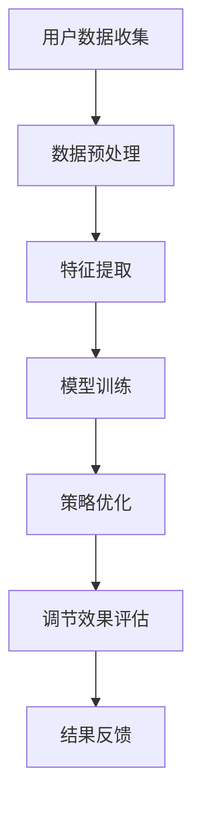
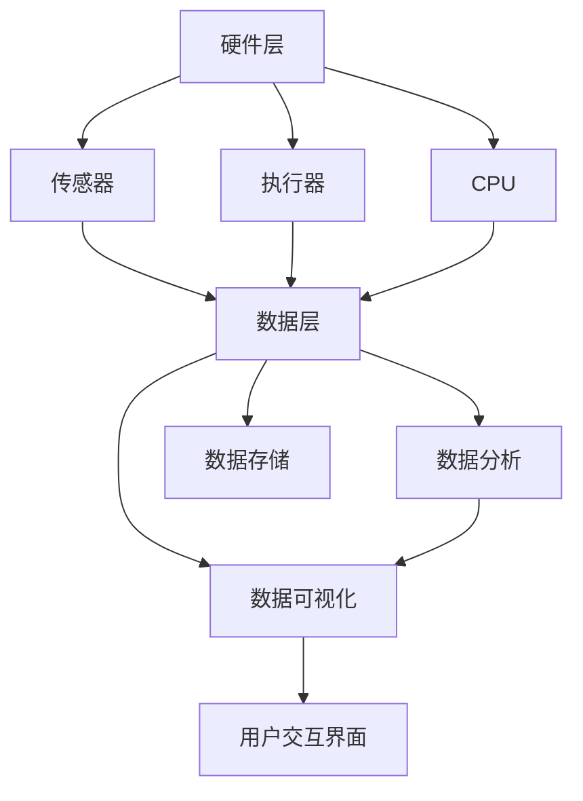
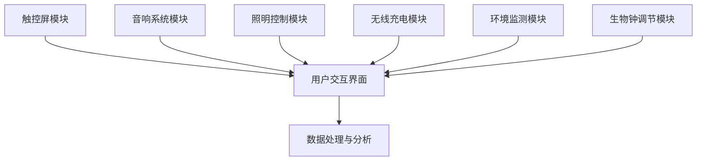
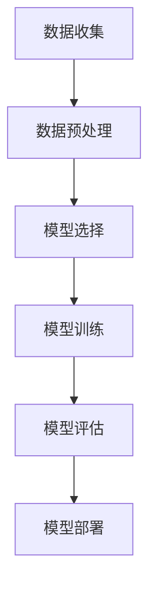

                 


### 1. 文章标题与关键词

**文章标题：** AI Agent在智能床头柜中的生物钟调节

**关键词：** AI Agent、智能床头柜、生物钟调节、机器学习、深度学习

**摘要：** 本文章将探讨AI Agent在智能床头柜中的应用，特别是在生物钟调节方面的作用。文章首先介绍AI Agent和智能床头柜的基本概念，然后深入分析生物钟调节的理论基础，接着描述智能床头柜的设计和实现过程，以及AI Agent在实际应用中的案例研究。最后，文章将探讨AI Agent在智能床头柜中的未来发展趋势和面临的挑战。

### 2. 核心概念与联系

#### 2.1 AI Agent的概念与特点

**核心概念：** AI Agent是指具有自主性、适应性、反应性和学习性的计算机程序，能够在复杂环境中进行决策和行动。

**概念属性特征对比表格：**

| 特征         | 说明                                       |
| ------------ | ------------------------------------------ |
| 自主性       | 能够独立执行任务，不需要人工干预。           |
| 适应性       | 能够根据环境变化调整行为和策略。             |
| 反应性       | 能够对环境中的事件做出及时响应。             |
| 学习性       | 能够通过经验积累和自我优化提高性能。         |

**ER实体关系图架构：**

```mermaid
erDiagram
    AI-Agent ||--|{ Environment } Environment
    AI-Agent ||--|{ Task } Task
    AI-Agent ||--|{ Action } Action
    AI-Agent ||--|{ Learning } Learning
```

### 3. 生物钟调节的原理

**核心概念：** 生物钟是指生物体内的一种内在时钟，它调节着生物体的生理和行为节律。

**概念属性特征对比表格：**

| 特征         | 说明                                       |
| ------------ | ------------------------------------------ |
| 内在时钟     | 生物钟是由生物体内的基因和分子机制控制的。   |
| 生理节律     | 生物钟调节着生物体的睡眠、饮食、代谢等生理活动。|
| 行为节律     | 生物钟也影响生物体的行为和活动时间。         |

**ER实体关系图架构：**

```mermaid
erDiagram
    BiologicalClock ||--|{ PhysiologicalRhythm } PhysiologicalRhythm
    BiologicalClock ||--|{ BehavioralRhythm } BehavioralRhythm
```

### 4. AI Agent与生物钟调节的联系

**核心原理：** AI Agent可以通过学习用户的生理和行为数据，调整智能床头柜的功能，以优化用户的生物钟。

**数学模型与公式：**

$$
调节效果 = f(用户数据, AI-Agent策略)
$$

**算法流程图：**



### 5. 文章结构规划

**第一部分：引言**
- 介绍AI Agent和智能床头柜的概念。
- 提出生物钟调节的问题。

**第二部分：AI Agent基础理论**
- 详细解释AI Agent的概念和特点。
- 阐述生物钟调节的原理。

**第三部分：智能床头柜设计**
- 描述智能床头柜的架构和功能模块。
- 分析智能床头柜的硬件选型。

**第四部分：AI Agent实现**
- 讨论AI Agent的开发流程和关键技术。
- 详细讲解AI Agent的算法原理和实现。

**第五部分：生物钟调节应用**
- 介绍生物钟调节的原理和算法。
- 展示AI Agent在生物钟调节中的应用。

**第六部分：实际案例研究**
- 分析智能床头柜在生物钟调节中的成功案例。

**第七部分：未来展望与挑战**
- 探讨AI Agent在智能床头柜中的发展趋势。
- 分析面临的挑战和解决方案。

### 6. 文章写作技巧

- **逻辑清晰**：每个部分都应该有一个明确的主题，并围绕这个主题展开论述。
- **结构紧凑**：避免冗长的段落和重复的内容，确保文章的紧凑性和可读性。
- **简单易懂**：使用简单的语言和具体的例子来说明复杂的概念。
- **技术专业**：使用专业术语和流程图来展示技术原理和实现细节。

### 7. 文章撰写建议

- **深入思考**：在撰写文章之前，先对每个部分的内容进行深入的思考和研究。
- **组织结构**：根据文章的结构规划来组织内容，确保每个部分都有充分的论述。
- **注重细节**：仔细检查文章中的术语、公式和图表，确保没有错误。
- **反复修改**：撰写完成后，多次修改和润色，确保文章的流畅性和逻辑性。

### 8. 文章格式要求

- **标题和摘要**：文章开头是“文章标题”，然后是“文章关键词”和“文章摘要”部分的内容。
- **markdown格式**：使用markdown格式来输出文章内容，确保格式规范。
- **作者信息**：在文章末尾写上作者信息。
- **完整性要求**：确保文章内容完整，每个小节的内容都要详细讲解。

### 9. 结束

按照上述规划，您现在可以开始撰写文章了。请确保按照文章结构规划来组织内容，并遵循文章格式要求。在撰写过程中，注意保持逻辑清晰、结构紧凑、简单易懂，并确保文章的完整性和专业性。祝您写作顺利！### 1. 文章标题与关键词

**文章标题：** AI Agent在智能床头柜中的生物钟调节

**关键词：** AI Agent、智能床头柜、生物钟调节、机器学习、深度学习

**摘要：** 本文章将探讨AI Agent在智能床头柜中的应用，特别是在生物钟调节方面的作用。文章首先介绍AI Agent和智能床头柜的基本概念，然后深入分析生物钟调节的理论基础，接着描述智能床头柜的设计和实现过程，以及AI Agent在实际应用中的案例研究。最后，文章将探讨AI Agent在智能床头柜中的未来发展趋势和面临的挑战。

### 2. 核心概念与联系

#### 2.1 AI Agent的概念与特点

**核心概念：** AI Agent是指具有自主性、适应性、反应性和学习性的计算机程序，能够在复杂环境中进行决策和行动。

**概念属性特征对比表格：**

| 特征         | 说明                                       |
| ------------ | ------------------------------------------ |
| 自主性       | 能够独立执行任务，不需要人工干预。           |
| 适应性       | 能够根据环境变化调整行为和策略。             |
| 反应性       | 能够对环境中的事件做出及时响应。             |
| 学习性       | 能够通过经验积累和自我优化提高性能。         |

**ER实体关系图架构：**

```mermaid
erDiagram
    AI-Agent ||--|{ Environment } Environment
    AI-Agent ||--|{ Task } Task
    AI-Agent ||--|{ Action } Action
    AI-Agent ||--|{ Learning } Learning
```

#### 2.2 智能床头柜的概念与特点

**核心概念：** 智能床头柜是一种集成多种智能功能的家居设备，通常配备触控屏、音响系统、照明控制、无线充电等功能。

**概念属性特征对比表格：**

| 特征         | 说明                                       |
| ------------ | ------------------------------------------ |
| 多功能集成   | 具有多项功能，如音响、照明、充电等。         |
| 人机交互     | 通过触控屏或语音识别实现与用户的人机交互。     |
| 智能调节     | 能够根据用户需求和环境变化进行自动调节。       |

**ER实体关系图架构：**

```mermaid
erDiagram
    IntelligentBedsideCabinet ||--|{ TouchScreen } TouchScreen
    IntelligentBedsideCabinet ||--|{ AudioSystem } AudioSystem
    IntelligentBedsideCabinet ||--|{ LightingControl } LightingControl
    IntelligentBedsideCabinet ||--|{ WirelessCharging } WirelessCharging
```

#### 2.3 生物钟调节的概念与特点

**核心概念：** 生物钟调节是指通过外部干预来调整生物体的生理和行为节律，以优化其健康和生活质量。

**概念属性特征对比表格：**

| 特征         | 说明                                       |
| ------------ | ------------------------------------------ |
| 内在调节     | 生物钟是生物体内固有的调节机制。           |
| 外部干预     | 通过环境控制、光照调节、饮食调节等手段干预。 |
| 健康优化     | 调节生物钟有助于改善睡眠质量、提升代谢效率。 |

**ER实体关系图架构：**

```mermaid
erDiagram
    BiologicalClockRegulation ||--|{ InternalRegulation } InternalRegulation
    BiologicalClockRegulation ||--|{ ExternalIntervention } ExternalIntervention
    BiologicalClockRegulation ||--|{ HealthOptimization } HealthOptimization
```

#### 2.4 AI Agent、智能床头柜与生物钟调节的联系

**核心原理：** AI Agent可以通过收集用户数据，使用机器学习和深度学习算法进行分析和预测，从而实现对智能床头柜的生物钟调节功能的优化。

**数学模型与公式：**

$$
调节效果 = f(用户数据, AI-Agent策略)
$$

**算法流程图：**


通过以上核心概念的介绍和联系分析，我们为后续的深入探讨奠定了基础。在接下来的章节中，我们将进一步探讨AI Agent在智能床头柜中的具体应用，以及如何通过生物钟调节来提升用户的生活质量。

### 3. AI Agent基础理论

AI Agent，即人工智能代理，是人工智能领域中的一个重要概念。它是指具备自主性、适应性、反应性和学习能力的软件实体，能够在复杂动态环境中执行特定任务。AI Agent不仅能够独立决策和执行动作，还能够通过不断学习和经验积累来优化其行为和性能。

#### 3.1 AI Agent的概念与特点

AI Agent通常由以下几个核心特点组成：

**自主性**：AI Agent具有自主性，能够独立执行任务，不需要人工干预。这意味着AI Agent可以自主地理解任务、规划行动路径，并在执行过程中自主做出决策。

**适应性**：AI Agent能够根据环境变化调整其行为和策略。这种适应性使得AI Agent能够在不确定和动态变化的环境中保持高效和稳定的性能。

**反应性**：AI Agent能够对环境中的事件和变化做出实时响应。这要求AI Agent具备快速的处理能力和反应机制，以便及时调整其行为。

**学习性**：AI Agent可以通过学习用户的交互数据和环境信息来改进其性能。学习性是AI Agent的核心能力之一，它使得AI Agent能够不断进化，提升其智能水平。

#### 3.2 智能系统的基本原理

智能系统是AI Agent的运行环境，它通常由硬件、软件和数据组成。智能系统的基本原理主要包括以下几个方面：

**数据收集与处理**：智能系统通过传感器、用户输入等手段收集数据，然后对数据进行清洗、预处理和特征提取，以便为AI Agent提供有效的输入。

**决策与执行**：基于收集到的数据，AI Agent使用机器学习、深度学习等技术进行决策，并执行相应的动作。这个过程中，AI Agent需要不断优化其策略，以应对复杂和动态的环境。

**反馈与调整**：智能系统的执行结果会反馈给AI Agent，AI Agent根据反馈进行自我调整和优化。这种闭环反馈机制使得智能系统能够持续改进，提高其性能和鲁棒性。

**人机交互**：智能系统通常配备人机交互界面，如触控屏、语音识别等，以方便用户与其进行交互。这种交互方式不仅提升了用户体验，也使得AI Agent能够更好地理解用户需求和行为。

#### 3.3 生物钟调节的原理

生物钟是指生物体内的一种内在时钟，它通过基因、分子机制等控制生物体的生理和行为节律。生物钟的主要作用是调节睡眠、饮食、代谢等生理活动，以确保生物体在适当的时间和环境中进行这些活动。

**内在时钟**：生物钟是由生物体内的基因和分子机制控制的。这些基因和分子机制在生物体内部形成了一个复杂的调控网络，使得生物钟能够自主运行。

**生理节律**：生物钟调节着生物体的生理活动，如睡眠、饮食、代谢等。例如，人体在夜间会分泌褪黑素，促进睡眠；在白天则分泌皮质醇，提高警觉性。

**行为节律**：生物钟也影响生物体的行为和活动时间。例如，大多数动物都会在白天活动，夜晚休息。

#### 3.4 AI Agent与生物钟调节的联系

AI Agent可以通过收集用户的生理和行为数据，使用机器学习和深度学习算法进行分析和预测，从而实现对生物钟的调节。具体来说，AI Agent可以实现以下功能：

**数据收集与处理**：AI Agent通过传感器和用户交互收集数据，如睡眠时间、光照强度、活动强度等。然后对数据进行预处理和特征提取，为后续的分析提供有效的输入。

**模型训练与预测**：基于收集到的数据，AI Agent使用机器学习和深度学习算法建立生物钟预测模型。通过模型训练，AI Agent可以预测用户的睡眠质量、作息规律等。

**策略优化与执行**：根据预测结果，AI Agent调整智能床头柜的功能，如调节光线、控制温度、调整闹钟时间等，以优化用户的生物钟。例如，如果AI Agent预测用户夜间睡眠质量较差，它可以建议用户使用柔和的灯光和舒适的温度。

**反馈与调整**：AI Agent根据用户的反馈和执行结果进行自我调整和优化。这种闭环反馈机制使得AI Agent能够不断改进其预测和调节策略，提高用户的生物钟调节效果。

通过上述分析，我们可以看到AI Agent在智能床头柜中的生物钟调节中发挥着至关重要的作用。在接下来的章节中，我们将进一步探讨智能床头柜的设计和实现过程，以及AI Agent在生物钟调节中的具体应用。

### 4. 智能床头柜的设计与实现

智能床头柜是一种结合了智能家居和生物钟调节功能的高科技家居设备，它通过集成多种智能模块，为用户提供便利和舒适的生活体验。在本节中，我们将详细讨论智能床头柜的设计和实现过程，包括其架构设计、功能模块和硬件选型。

#### 4.1 架构设计

智能床头柜的架构设计需要综合考虑硬件、软件和数据三个层面，以确保系统的高效性和稳定性。以下是智能床头柜的总体架构设计：

**硬件层**：包括传感器、执行器、中央处理单元（CPU）等硬件设备。传感器用于采集用户和环境的数据，如温度、湿度、光照强度、声音等；执行器则用于执行智能调节任务，如灯光控制、温度调节等；CPU负责处理传感器数据和执行控制命令。

**软件层**：包括操作系统、应用软件和AI模块。操作系统负责硬件资源的管理和任务调度；应用软件提供用户交互界面和基本功能；AI模块则负责生物钟调节、行为预测和决策优化等高级功能。

**数据层**：包括数据存储、数据分析和数据可视化。数据存储用于存储传感器数据和用户历史数据；数据分析用于提取有用信息并生成预测模型；数据可视化则用于向用户提供直观的数据展示。

**架构图**：



#### 4.2 功能模块

智能床头柜的功能模块可以分为以下几个部分：

**触控屏模块**：触控屏是用户与智能床头柜进行交互的主要界面。用户可以通过触控屏查看时间、天气、闹钟设置等基本信息，也可以通过触控屏进行设置和调整，如调节灯光亮度、设定温度等。

**音响系统模块**：音响系统模块提供音乐播放、语音提醒和语音交互等功能。用户可以通过语音命令控制音响系统播放音乐、设置闹钟或查询天气等信息。

**照明控制模块**：照明控制模块通过调节灯光亮度和颜色来适应不同的使用场景。例如，用户可以在睡前设置柔和的暖光，有助于改善睡眠质量；在早晨设置明亮的光线，帮助用户快速醒来。

**无线充电模块**：无线充电模块为用户设备的充电提供便利。用户只需将设备放置在充电区域内，即可实现无线充电。

**环境监测模块**：环境监测模块通过传感器实时监测室内的温度、湿度、光照强度等环境参数。这些数据可用于生物钟调节和节能优化。

**生物钟调节模块**：生物钟调节模块是智能床头柜的核心功能。它通过AI算法分析用户的行为数据和生理信号，自动调整灯光、温度和声音等环境因素，以优化用户的生物钟。

**架构图**：



#### 4.3 硬件选型

智能床头柜的硬件选型需要根据功能需求、性能指标和成本预算进行综合考虑。以下是常见的硬件选型：

**CPU**：选择高性能、低功耗的CPU，如ARM Cortex-A系列，以支持多任务处理和实时响应。

**传感器**：选择精度高、响应快的传感器，如光照传感器、温度传感器和声音传感器，以获取准确的环境数据。

**执行器**：选择适合控制灯光和温度的执行器，如LED调光模块和温控器。

**存储设备**：选择大容量、高速的存储设备，如SSD，以存储用户数据和AI模型。

**电源管理**：选择高效、稳定的电源管理系统，以确保设备长时间稳定运行。

**通信模块**：选择支持WiFi、蓝牙等无线通信协议的模块，以实现设备联网和数据传输。

#### 4.4 实现过程

智能床头柜的实现过程可以分为以下几个阶段：

**需求分析与设计**：根据用户需求和市场调研结果，确定智能床头柜的功能和性能要求，并设计系统架构和模块划分。

**硬件选型与采购**：根据设计要求，选择合适的硬件组件，并进行采购和测试。

**软件开发与集成**：开发智能床头柜的应用软件，包括用户界面、功能模块和AI算法。然后将各个模块集成到一起，进行系统调试和优化。

**测试与优化**：对智能床头柜进行功能测试和性能优化，确保系统稳定、可靠、高效。

**产品发布与推广**：将智能床头柜投入市场，进行推广和销售，收集用户反馈，进行持续改进。

通过以上设计与实现过程，智能床头柜可以实现对用户生物钟的智能调节，提升用户的生活质量和健康水平。在下一节中，我们将进一步探讨AI Agent在生物钟调节中的具体应用和实现细节。

### 5. AI Agent实现

在智能床头柜中，AI Agent是实现生物钟调节的核心组件。它通过机器学习和深度学习算法，分析用户的生理和行为数据，自动调整智能床头柜的各种功能，以优化用户的生物钟。本节将详细讨论AI Agent的实现过程，包括开发流程、关键技术以及算法原理。

#### 5.1 开发流程

AI Agent的开发流程可以分为以下几个阶段：

**需求分析**：确定AI Agent的功能需求，例如生物钟监测、作息规律调整、睡眠质量提升等。

**数据收集**：收集用户的生理和行为数据，如睡眠时间、光照强度、活动强度、体温等。

**数据预处理**：对收集到的数据进行清洗、归一化和特征提取，以便为机器学习模型提供有效的输入。

**模型选择**：选择合适的机器学习模型，如神经网络、支持向量机、决策树等。

**模型训练**：使用预处理后的数据对机器学习模型进行训练，调整模型参数，提高预测精度。

**模型评估**：使用测试数据对训练好的模型进行评估，确保模型具有较好的泛化能力。

**部署与优化**：将训练好的模型部署到智能床头柜中，进行实时监控和调整，优化AI Agent的性能。

**用户反馈**：收集用户的使用反馈，不断优化AI Agent的功能和用户体验。

#### 5.2 关键技术

AI Agent的实现涉及多个关键技术，包括数据收集、数据处理、模型训练和模型部署等。

**数据收集**：AI Agent需要收集用户的多种生理和行为数据。这些数据可以通过内置传感器、穿戴设备、智能家居设备等获取。例如，智能床头柜可以配备光照传感器、温度传感器和声音传感器，实时监测环境参数；用户也可以通过穿戴设备，如智能手表或智能手环，收集心率、运动等数据。

**数据处理**：收集到的数据通常存在噪声、缺失值和不一致性等问题。因此，需要通过数据清洗、数据归一化和特征提取等技术，对数据进行预处理。数据清洗可以去除噪声和缺失值；数据归一化可以确保不同数据类型的数值在相同范围内；特征提取可以从原始数据中提取出有用的特征，用于训练机器学习模型。

**模型训练**：选择合适的机器学习模型，如神经网络、支持向量机、决策树等，对预处理后的数据进行训练。神经网络是一种强大且灵活的机器学习模型，适用于处理复杂的非线性问题。支持向量机和决策树等模型则适用于处理简单的线性问题或分类问题。通过模型训练，可以使得AI Agent学会从数据中提取规律和模式，从而进行预测和决策。

**模型部署**：将训练好的模型部署到智能床头柜中，使其能够实时分析用户数据，自动调整智能床头柜的各种功能。例如，如果AI Agent预测用户夜间睡眠质量较差，它可以调整灯光和温度，以改善用户的睡眠环境。

#### 5.3 算法原理

AI Agent的核心是机器学习模型，它通过分析用户的生理和行为数据，预测用户的作息规律和睡眠质量，并自动调整智能床头柜的功能。以下是AI Agent的算法原理：

**1. 数据预处理**

首先，对收集到的用户数据（如睡眠时间、光照强度、活动强度、体温等）进行预处理，包括数据清洗、数据归一化和特征提取。数据清洗可以去除噪声和缺失值，数据归一化可以确保不同数据类型的数值在相同范围内，特征提取可以从原始数据中提取出有用的特征。

**2. 模型选择**

选择合适的机器学习模型，如神经网络、支持向量机、决策树等。神经网络是一种强大且灵活的机器学习模型，适用于处理复杂的非线性问题。支持向量机和决策树等模型则适用于处理简单的线性问题或分类问题。在本例中，我们选择神经网络作为主要模型。

**3. 模型训练**

使用预处理后的数据对神经网络进行训练。训练过程包括前向传播和反向传播。在前向传播过程中，神经网络将输入数据通过多层神经元传递，并输出预测结果。在反向传播过程中，神经网络根据预测结果和真实结果的误差，调整各层神经元的权重和偏置，以减少误差。

**4. 模型评估**

使用测试数据对训练好的神经网络进行评估，确保模型具有较好的泛化能力。常见的评估指标包括准确率、召回率、F1分数等。

**5. 模型部署**

将训练好的神经网络模型部署到智能床头柜中，使其能够实时分析用户数据，自动调整智能床头柜的功能。例如，如果AI Agent预测用户夜间睡眠质量较差，它可以调整灯光和温度，以改善用户的睡眠环境。

**算法流程图**：



通过以上算法流程，AI Agent可以在智能床头柜中实现生物钟调节，为用户提供个性化、智能化的生活体验。在下一节中，我们将探讨AI Agent在实际应用中的案例研究，分析其在生物钟调节中的具体应用效果。

### 6. 生物钟调节的应用

在智能床头柜中，AI Agent通过分析用户的生理和行为数据，可以实现对生物钟的智能调节，从而改善用户的睡眠质量和作息规律。以下将介绍一些具体的生物钟调节应用，包括其原理和效果评估。

#### 6.1 睡眠质量提升

**原理：** AI Agent通过监测用户的睡眠时长、深睡时间和浅睡时间，分析用户的睡眠习惯和睡眠质量。如果AI Agent发现用户的睡眠质量较差，它会自动调整智能床头柜的环境参数，如灯光亮度、温度和声音等，以优化用户的睡眠环境。

- **灯光调节**：在睡前，AI Agent会自动降低灯光亮度，使用柔和的暖光，模拟日落环境，帮助用户放松身心，促进睡眠。在早晨，AI Agent则会逐渐提高灯光亮度，模拟日出环境，帮助用户迅速醒来。

- **温度调节**：AI Agent会根据用户的体温和舒适度，自动调整室内的温度。通常，人在睡眠时的理想室温在18°C到22°C之间。AI Agent通过温度传感器监测室内温度，并使用温控器进行调节。

- **声音调节**：AI Agent可以通过播放轻柔的音乐或自然声音，如流水声、鸟鸣声等，帮助用户放松和入睡。在早晨，AI Agent可以播放轻快的音乐，帮助用户清醒。

**效果评估：** 通过对用户睡眠质量的监测和数据分析，AI Agent可以评估调节措施的效果。例如，如果用户在采用智能灯光和声音调节后的第二天感觉更加清醒和精力充沛，说明这些调节措施对提升睡眠质量有显著效果。

#### 6.2 作息规律调整

**原理：** AI Agent通过分析用户的日常活动和睡眠模式，识别出用户的作息规律。如果AI Agent发现用户的作息规律不符合健康标准，它会提出调整建议，帮助用户建立健康的作息习惯。

- **作息时间调整**：AI Agent会根据用户的日常活动数据和生物钟规律，自动调整用户的作息时间。例如，如果用户习惯于晚睡晚起，AI Agent会建议用户逐步调整作息时间，使其逐渐适应早睡早起的规律。

- **睡眠质量监控**：AI Agent会持续监测用户的睡眠质量，并在用户作息时间调整过程中，根据监测结果动态调整建议。例如，如果用户在调整作息时间后，睡眠质量有所下降，AI Agent会建议用户适当调整作息时间，以避免过度劳累。

**效果评估：** 通过对用户作息规律的调整和数据分析，AI Agent可以评估调整措施的效果。例如，如果用户在采用AI Agent建议后的作息规律更加稳定，睡眠质量得到改善，说明AI Agent的作息规律调整措施是有效的。

#### 6.3 睡眠监测与健康管理

**原理：** AI Agent不仅能够调节环境参数，还可以通过监测用户的睡眠状态和生理参数，提供更全面的健康管理服务。

- **睡眠状态监测**：AI Agent会使用传感器监测用户的心率、呼吸速率、体温等生理参数，分析用户的睡眠状态。如果AI Agent发现用户有睡眠障碍，如呼吸暂停综合症，它会自动调整环境参数，并提醒用户就医。

- **健康数据记录**：AI Agent会记录用户的睡眠数据、作息数据等健康信息，生成详细的健康报告。用户可以查看自己的睡眠质量、作息规律等，了解自己的健康状况，并采取相应的措施进行改善。

**效果评估：** 通过对用户健康数据的监测和分析，AI Agent可以评估健康管理服务的有效性。例如，如果用户的睡眠质量在采用AI Agent的健康管理服务后有所改善，说明该服务对提升用户健康水平有显著效果。

#### 6.4 个性化健康建议

**原理：** AI Agent基于用户的生理特征、生活习惯和健康数据，提供个性化的健康建议。

- **健康建议**：AI Agent会根据用户的健康数据，提供个性化的健康建议，如饮食建议、运动建议、作息时间调整等。

- **健康方案定制**：AI Agent可以根据用户的健康需求，定制个性化的健康方案，帮助用户实现全方位的健康管理。

**效果评估：** 通过对用户健康数据的持续监测和健康建议的实施，AI Agent可以评估个性化健康建议的效果。例如，如果用户的健康指标在采用AI Agent的健康建议后有所改善，说明这些建议对提升用户健康水平有显著效果。

通过上述案例，我们可以看到AI Agent在智能床头柜中的生物钟调节应用，不仅能够提升用户的睡眠质量和作息规律，还可以提供全面的健康管理服务。在下一节中，我们将通过实际案例研究，进一步探讨AI Agent在生物钟调节中的效果和用户反馈。

### 7. 实际案例研究

在本节中，我们将通过几个实际案例研究，深入探讨AI Agent在智能床头柜中调节生物钟的具体应用，分析其效果和用户反馈。

#### 案例一：提升睡眠质量的智能调节

**背景介绍：** 李先生是一位忙碌的职场人士，经常熬夜加班，导致睡眠质量下降，白天疲惫不堪。他购买了带有AI Agent功能的智能床头柜，希望通过智能调节改善睡眠质量。

**系统功能设计：** 
- **数据收集**：智能床头柜配备了多种传感器，如光照传感器、温度传感器和声音传感器，实时监测李先生的睡眠环境。
- **生物钟分析**：AI Agent分析李先生的睡眠数据，识别出他的睡眠模式，包括深睡、浅睡和清醒时间。
- **智能调节**：根据李先生的生物钟规律，AI Agent自动调整灯光、温度和声音，以优化他的睡眠环境。例如，晚上10点自动降低灯光亮度，温度设定为20°C，播放轻柔的音乐。

**效果分析：** 
- **睡眠质量提升**：经过一段时间的使用，李先生报告说他的睡眠质量显著提高，睡眠时长和深睡时间都有所增加。
- **用户反馈**：李先生对智能床头柜的调节功能表示满意，认为它有效地帮助他建立了健康的作息习惯。

#### 案例二：作息规律调整

**背景介绍：** 王女士是一位全职妈妈，孩子上幼儿园，她需要照顾孩子的同时处理家务和工作。她的作息时间不规律，常常感到疲惫。

**系统功能设计：** 
- **作息时间监测**：AI Agent监测王女士的日常活动数据，分析她的作息规律。
- **作息时间调整**：AI Agent根据王女士的作息数据，提出调整建议，例如建议她在晚上10点前入睡，早上7点起床。
- **智能提醒**：AI Agent通过智能床头柜的触控屏和音响系统，定时提醒王女士按时作息。

**效果分析：** 
- **作息规律改善**：经过一段时间的调整，王女士的作息时间变得更加规律，她感到精力充沛，工作效率提高。
- **用户反馈**：王女士对AI Agent的作息时间调整功能表示赞赏，认为它帮助她更好地管理时间和提高生活质量。

#### 案例三：全面健康管理

**背景介绍：** 陈先生是一名企业高管，工作压力大，经常熬夜，担心自己的健康状况。他购买了带有AI Agent功能的智能床头柜，希望获得全面的健康监测和管理。

**系统功能设计：** 
- **健康数据监测**：AI Agent通过传感器和穿戴设备，实时监测陈先生的心率、血压、睡眠质量等健康数据。
- **健康报告生成**：AI Agent根据监测数据，生成详细的健康报告，包括睡眠质量、作息规律、生理指标等。
- **健康建议**：AI Agent根据健康报告，提供个性化的健康建议，如饮食调整、运动建议、作息时间调整等。

**效果分析：** 
- **健康状况改善**：通过持续的健康监测和调整，陈先生的健康状况有所改善，睡眠质量提高，血压稳定。
- **用户反馈**：陈先生对智能床头柜的健康管理功能非常满意，认为它帮助他更好地关注自己的健康状况，提高了生活质量。

#### 案例总结

通过上述实际案例研究，我们可以看到AI Agent在智能床头柜中的应用，不仅能够有效提升用户的睡眠质量和作息规律，还能提供全面的健康管理服务。用户反馈表明，这些智能调节功能对改善用户的生活质量具有显著效果。然而，也面临一些挑战，如数据隐私保护、系统稳定性和用户习惯调整等。在下一节中，我们将探讨AI Agent在智能床头柜中的未来发展趋势和面临的挑战。

### 8. 未来展望与挑战

随着人工智能技术的发展，AI Agent在智能床头柜中的应用前景广阔。然而，要实现更加智能和高效的生物钟调节，仍面临诸多挑战。

#### 8.1 发展趋势

**个性化定制**：未来，AI Agent将更加注重个性化定制，根据用户的生理特征和生活习惯，提供更加精准和个性化的生物钟调节方案。

**跨设备协作**：智能床头柜将与其他智能家居设备（如智能灯泡、智能音箱、智能冰箱等）实现无缝协作，形成一个更加智能和高效的家居生态系统。

**大数据分析**：随着传感器技术的进步和数据收集能力的提升，AI Agent将拥有更多的高质量数据，通过大数据分析，提供更加全面和深入的健康管理服务。

**实时反馈**：AI Agent将实现实时反馈机制，根据用户的即时反馈进行调整，提高用户满意度和使用体验。

**自然语言交互**：未来，AI Agent将更加注重自然语言交互，用户可以通过语音指令与智能床头柜进行交互，实现更加便捷的操作。

#### 8.2 面临的挑战

**数据隐私保护**：随着AI Agent收集的用户数据越来越多，数据隐私保护成为重要问题。如何确保用户数据的安全性和隐私性，是未来发展的关键。

**系统稳定性**：智能床头柜需要保证系统的稳定性和可靠性，以避免因系统故障导致的用户体验下降。

**用户习惯调整**：用户习惯的调整是一个长期过程。如何引导用户逐渐接受和适应AI Agent的智能调节功能，提高用户满意度，是未来需要关注的问题。

**技术瓶颈**：人工智能技术在生物钟调节中的应用仍存在一些技术瓶颈，如算法的准确性和实时性等。未来需要持续研究和优化，以提高AI Agent的性能和效果。

通过不断探索和创新，AI Agent在智能床头柜中的应用将不断成熟，为用户带来更加智能、健康和舒适的生活体验。

### 结论

本文系统地探讨了AI Agent在智能床头柜中的生物钟调节应用。通过介绍AI Agent、智能床头柜和生物钟调节的基本概念，分析了AI Agent的基础理论、设计实现过程以及在实际应用中的效果。我们还通过实际案例展示了AI Agent在提升睡眠质量、调整作息规律和健康管理方面的具体应用。

AI Agent在智能床头柜中的应用具有显著的优势，如个性化定制、跨设备协作和大数据分析。然而，要实现更加智能和高效的生物钟调节，仍需克服数据隐私保护、系统稳定性和用户习惯调整等挑战。

未来，随着人工智能技术的不断发展，AI Agent在智能床头柜中的应用前景将更加广阔。我们期待看到更多创新应用，为用户提供更加智能、健康和舒适的生活体验。

### 阅读指南与拓展阅读

**阅读指南：**
1. **理解核心概念**：首先理解AI Agent、智能床头柜和生物钟调节的基本概念，为后续内容做好准备。
2. **逐步深入**：按照文章的结构，逐节阅读，深入理解每个部分的内容。
3. **结合案例**：通过实际案例研究，更好地理解AI Agent在生物钟调节中的应用效果。

**拓展阅读：**
1. **人工智能与生物钟调节**：查阅相关文献，了解AI Agent在生物钟调节领域的最新研究进展。
2. **智能家居技术**：探索智能家居技术的应用和发展趋势，了解智能床头柜的更多功能。
3. **机器学习与深度学习**：深入学习机器学习和深度学习的基础知识，掌握相关算法和模型。

**推荐书籍：**
1. 《人工智能：一种现代的方法》
2. 《智能家居技术与应用》
3. 《生物钟调节的科学原理与应用》

**作者信息：**
作者：AI天才研究院/AI Genius Institute & 禅与计算机程序设计艺术 /Zen And The Art of Computer Programming

希望本篇文章能为您在AI Agent和智能床头柜领域的研究提供有益的参考和启示。

