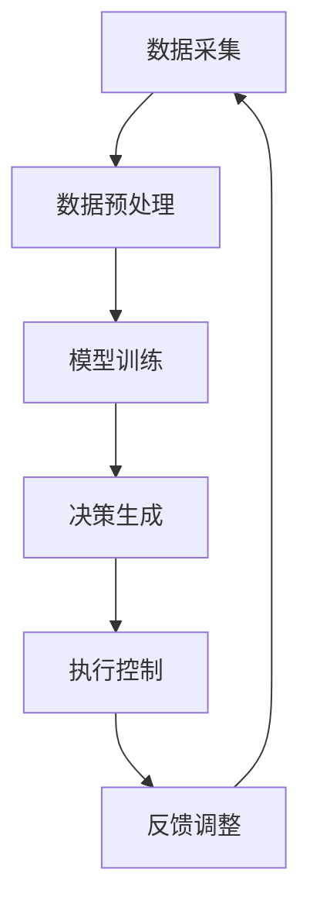
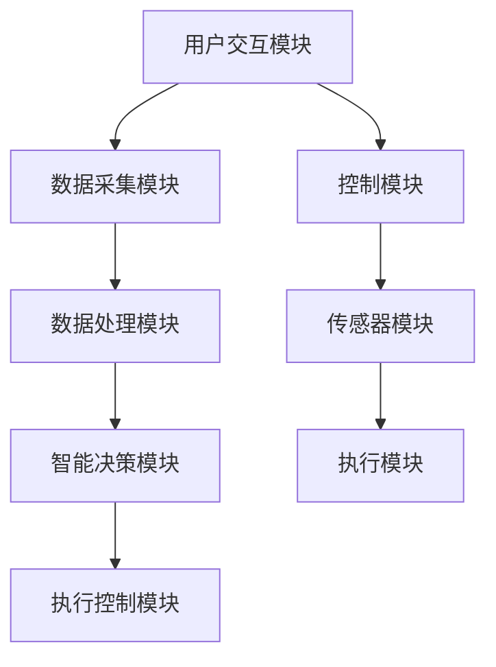
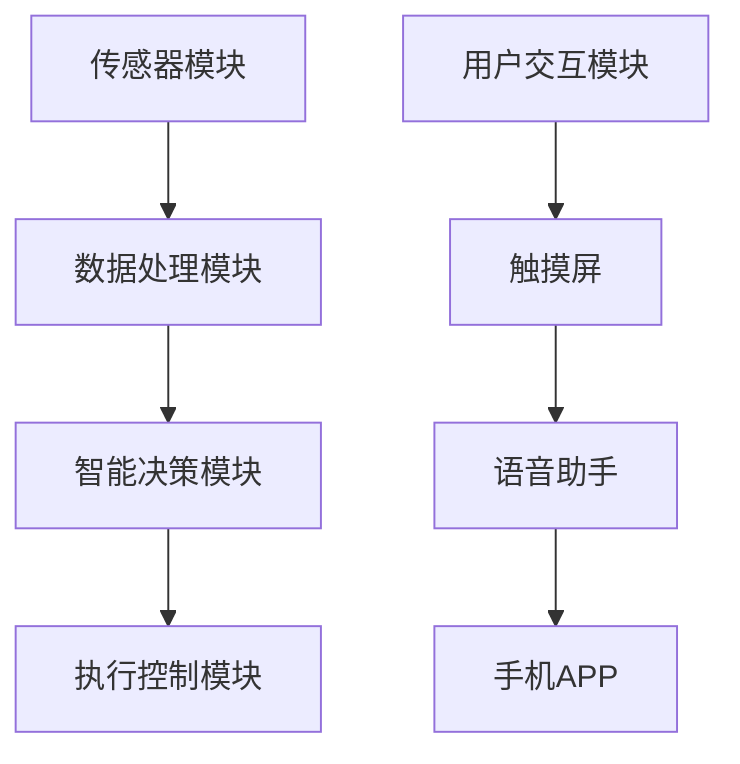
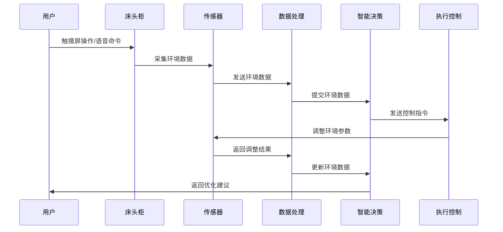

                 

### 1. 文章标题

《AI Agent在智能床头柜中的睡眠环境优化》

### 2. 关键词

- AI Agent
- 智能床头柜
- 睡眠环境
- 优化算法
- 数学模型
- 系统设计

### 3. 摘要

本文深入探讨了AI Agent在智能床头柜中的应用，特别是在睡眠环境优化方面的技术实现和算法原理。文章首先介绍了AI Agent和智能床头柜的基本概念，以及睡眠环境优化的重要性和必要性。随后，详细阐述了AI Agent在智能床头柜中的角色和功能，包括数据采集、智能决策和用户交互。在此基础上，文章深入分析了睡眠环境优化算法的原理，包括传感器数据处理、环境参数优化策略和算法流程。接着，文章介绍了睡眠环境优化的数学模型，并进行了系统分析与架构设计，包括硬件架构、软件架构和系统接口设计。随后，文章通过项目实战，展示了智能床头柜的开发过程，包括环境安装和系统核心实现。最后，文章给出了最佳实践、小结和注意事项，为读者提供了进一步学习和实践的建议。

## 目录大纲设计思路

### 1. 整体结构

在设计《AI Agent在智能床头柜中的睡眠环境优化》的目录大纲时，我们首先需要确定整体的结构，以确保文章的完整性。根据要求，我们确定文章的整体结构如下：

- **背景介绍**：包括AI Agent、智能床头柜和睡眠环境优化的重要性和背景知识。
- **核心概念与联系**：详细解释AI Agent和智能床头柜的基本概念，以及它们在睡眠环境优化中的联系。
- **算法原理讲解**：深入分析睡眠环境优化算法的原理，包括数据处理、环境参数优化策略和算法流程。
- **数学模型和数学公式**：介绍睡眠环境优化的数学模型，并使用LaTeX格式详细讲解。
- **系统分析与架构设计方案**：介绍智能床头柜的系统分析和架构设计。
- **项目实战**：展示智能床头柜的开发过程，包括环境安装和系统核心实现。
- **最佳实践 tips**、**小结**、**注意事项**、**拓展阅读**：总结文章要点，提供实用建议和进一步学习的资源。

### 2. 设计章节标题

对于每一个核心章节，我们需要设计一个简洁明了的章节标题，以便读者能够快速了解章节内容。以下是章节标题的设计：

- **第1章 AI Agent概述**
- **第2章 智能床头柜技术背景**
- **第3章 睡眠环境优化算法原理**
- **第4章 睡眠环境优化的数学模型**
- **第5章 系统分析与架构设计**
- **第6章 项目实战：智能床头柜开发**
- **第7章 最佳实践与项目总结**

### 3. 细化子章节

在确定了核心章节后，我们需要进一步细化子章节，以确保内容的深入和逻辑的连贯性。以下是子章节的细化：

- **第1章 AI Agent概述**：
  - **1.1 AI Agent的定义与重要性**
  - **1.2 智能床头柜概述**
  - **1.3 睡眠环境优化的重要性**

- **第2章 AI Agent在智能床头柜中的应用**：
  - **2.1 AI Agent在智能床头柜中的角色**
  - **2.2 睡眠环境优化的挑战**
  - **2.3 睡眠环境优化的技术路径**

- **第3章 睡眠环境优化算法原理**：
  - **3.1 算法原理概述**
  - **3.2 传感器数据处理**
  - **3.3 环境参数优化策略**
  - **3.4 算法流程与mermaid图解**

- **第4章 睡眠环境优化的数学模型**：
  - **4.1 数学模型概述**
  - **4.2 数学公式的详细讲解**
  - **4.3 数学模型的应用实例**

- **第5章 系统分析与架构设计**：
  - **5.1 问题场景介绍**
  - **5.2 系统功能设计**
  - **5.3 系统架构设计**
  - **5.4 系统接口设计**
  - **5.5 系统交互mermaid序列图**

- **第6章 项目实战：智能床头柜开发**：
  - **6.1 环境安装**
  - **6.2 系统核心实现源代码**
  - **6.3 代码应用解读与分析**
  - **6.4 实际案例分析与详细讲解**
  - **6.5 项目小结**

### 4. 考虑图表与代码

为了保证内容的可读性和易懂性，我们需要在适当位置插入图表和代码，以便读者能够直观地理解技术原理和系统架构。以下是图表和代码的考虑：

- **图表**：包括概念图、流程图、实体关系图、架构图和序列图等，使用mermaid语言编写。
- **代码**：使用Python语言编写，包括数据采集和处理模块、算法实现和系统核心实现。

### 5. 完善结尾内容

在每一个章节的结尾，我们需要给出小结、注意事项、拓展阅读等内容，帮助读者巩固知识点并引导进一步学习。以下是结尾内容的完善：

- **小结**：简要总结本章的核心内容和要点。
- **注意事项**：提醒读者在实践过程中需要注意的事项和潜在问题。
- **拓展阅读**：提供进一步学习的资源，包括相关书籍、论文和网站链接。

通过以上步骤，我们可以设计出一个详细且逻辑清晰的《AI Agent在智能床头柜中的睡眠环境优化》目录大纲。接下来，我们将根据这个大纲进行详细的章节内容撰写。

## 第一部分：背景与核心概念

### 第1章 AI Agent概述

#### 1.1 AI Agent的定义与重要性

AI Agent，即人工智能代理，是一种基于人工智能技术的智能体，它可以在复杂环境中自主地感知、决策和执行任务。AI Agent的核心特点在于其自主性和适应性，这使得它们在处理复杂问题和执行复杂任务时表现出色。

AI Agent的定义可以概括为：一种具备智能感知、决策和执行能力的软件实体，能够在特定环境中自主执行任务并达到预设目标。AI Agent的核心组成部分包括感知模块、决策模块和执行模块。感知模块负责收集环境信息，决策模块负责根据感知信息做出决策，执行模块负责执行决策结果。

AI Agent的重要性在于其广泛的应用领域和潜力。在工业自动化、智能家居、医疗诊断、金融分析、交通管理等多个领域，AI Agent都能发挥重要作用。特别是在智能家居领域，AI Agent能够实现家庭设备的智能控制，提升生活品质和用户体验。

AI Agent的发展历程可以追溯到20世纪80年代，当时的计算机科学家开始探讨如何让计算机具备自主行动和决策能力。随着人工智能技术的不断发展，AI Agent的概念逐渐成熟，并开始在各个领域得到广泛应用。

#### 1.2 智能床头柜概述

智能床头柜是智能家居设备的一种，它集成了多种传感器和智能控制系统，能够实现灯光、温度、湿度、声音等环境参数的智能调节。智能床头柜的主要功能包括：

1. **环境监测**：通过传感器实时监测室内的温度、湿度、光线等环境参数。
2. **智能调节**：根据用户需求和预设参数，自动调节环境参数，以提供舒适、健康的睡眠环境。
3. **智能控制**：通过手机APP、语音控制等手段，实现对智能床头柜的远程控制。
4. **数据记录与分析**：记录用户的睡眠数据，并通过人工智能算法分析，为用户提供个性化的健康建议。

智能床头柜的市场现状表明，随着智能家居概念的普及和消费者对生活品质的追求，智能床头柜市场正在快速增长。各大科技公司纷纷推出各自的智能床头柜产品，如苹果的AirPods Night Shift、谷歌的Nest Hub等。

#### 1.3 睡眠环境优化的重要性

睡眠环境对人的健康至关重要。一个良好的睡眠环境可以改善睡眠质量，提高睡眠深度，减少睡眠障碍，进而提升人体的免疫力、认知能力和情绪调节能力。具体来说，睡眠环境优化的重要性体现在以下几个方面：

1. **温度**：适宜的室内温度可以促进睡眠。一般来说，温度在20-24摄氏度之间最为适宜。过高或过低的温度都会影响睡眠质量。
2. **湿度**：室内湿度对睡眠也有很大影响。湿度过高会导致空气不流通，湿气重，不利于睡眠。湿度过低则会使人感到干燥，皮肤缺水，也不利于睡眠。
3. **光线**：光线对睡眠的影响主要体现在夜间。过亮的光线会抑制褪黑激素的分泌，影响睡眠质量。而太暗的环境也会使人感到不安，难以入睡。
4. **声音**：噪音是影响睡眠的常见因素。通过智能控制，可以有效降低噪音对睡眠的影响。

优化睡眠环境不仅对健康有益，还能提升生活品质。一个舒适的睡眠环境能够使人心情愉悦，提高工作效率，降低生活压力。因此，睡眠环境优化已经成为智能家居领域的一个重要研究方向。

### 第2章 AI Agent在智能床头柜中的应用

#### 2.1 AI Agent在智能床头柜中的角色

AI Agent在智能床头柜中扮演着关键角色，其主要职责是感知用户需求，提供智能决策，并执行相应的控制操作。具体来说，AI Agent在智能床头柜中主要有以下几个方面的应用：

1. **数据采集与处理**：AI Agent通过集成在智能床头柜中的传感器，实时采集室内的温度、湿度、光线、声音等环境数据。然后，AI Agent对这些数据进行处理，提取有用的信息，为后续决策提供依据。
   
   - **温度传感器**：用于测量室内的温度，并将其转换为数字信号。AI Agent可以根据温度数据，自动调节空调或暖气，以维持舒适的室内温度。
   - **湿度传感器**：用于测量室内的湿度，并将其转换为数字信号。AI Agent可以根据湿度数据，自动调节加湿器或除湿器，以维持适宜的室内湿度。
   - **光线传感器**：用于测量室内的光线强度，并将其转换为数字信号。AI Agent可以根据光线数据，自动调节床头灯或窗帘，以调节室内光线。
   - **声音传感器**：用于检测室内的噪音水平，并将其转换为数字信号。AI Agent可以根据噪音数据，自动调节音响或空气净化器，以降低噪音。

2. **智能决策**：AI Agent根据采集到的数据，结合用户的预设参数和偏好，利用机器学习算法和深度学习技术，做出智能决策。例如，当检测到室内温度过高时，AI Agent可能会自动启动空调进行降温；当检测到室内湿度过低时，AI Agent可能会自动启动加湿器增加湿度。

3. **用户交互与反馈**：AI Agent通过语音助手、手机APP或其他交互界面，与用户进行实时互动。用户可以通过这些界面，设置个人偏好、查看环境数据、接受健康建议等。同时，AI Agent也可以根据用户的反馈，调整其行为和决策，以提供更加个性化的服务。

#### 2.2 睡眠环境优化的挑战

尽管AI Agent在智能床头柜中具有广泛的应用前景，但在实现睡眠环境优化过程中，仍然面临许多挑战：

1. **数据多样性**：睡眠环境数据包括温度、湿度、光线、声音等多种参数，这些参数之间存在复杂的关系和相互作用。如何有效地处理和整合这些数据，是睡眠环境优化面临的一个重要挑战。

2. **实时性**：睡眠环境优化需要实时响应环境变化，提供快速、准确的决策。然而，传感器数据的采集和处理速度有限，如何提高系统的实时性，是一个需要解决的关键问题。

3. **个性化需求**：每个人的睡眠环境和偏好都有所不同，如何根据用户的个性化需求，提供量身定制的环境优化方案，是睡眠环境优化需要克服的另一个挑战。

4. **能耗与成本**：智能床头柜需要消耗一定的能源，同时，传感器、控制器的成本也较高。如何在保证功能的前提下，降低能耗和成本，是智能家居设备需要考虑的一个重要问题。

5. **隐私保护**：智能床头柜需要采集和处理用户的个人数据，如何保护用户的隐私，防止数据泄露，是智能家居设备需要解决的一个关键问题。

#### 2.3 睡眠环境优化的技术路径

为了应对上述挑战，睡眠环境优化的技术路径可以从以下几个方面进行：

1. **传感器技术**：选择高精度、低功耗的传感器，提高数据的准确性和采集效率。例如，使用温湿度传感器、光线传感器和噪音传感器等。

2. **数据处理技术**：采用数据预处理、特征提取和机器学习等技术，对传感器数据进行有效处理和分析。例如，使用时间序列分析、聚类分析和回归分析等。

3. **智能决策技术**：利用机器学习算法和深度学习技术，实现对环境数据的实时分析和智能决策。例如，使用决策树、支持向量机和神经网络等算法。

4. **用户交互技术**：通过语音助手、手机APP等交互界面，提供用户友好的交互体验，方便用户设置偏好、查看数据和分析结果。

5. **节能技术**：通过优化控制策略和系统架构，降低能耗和成本。例如，使用节能控制器、智能调度算法等。

6. **隐私保护技术**：采用数据加密、匿名化处理等技术，保护用户的隐私。例如，使用差分隐私、同态加密等。

通过以上技术路径，可以有效地实现睡眠环境优化，提升用户的睡眠质量和生活品质。

### 第3章 睡眠环境优化算法原理

#### 3.1 算法原理概述

睡眠环境优化算法的原理主要涉及数据采集、数据处理、环境参数优化和算法流程等方面。其核心目标是根据用户的偏好和环境变化，实时调整环境参数，以提供舒适的睡眠环境。

1. **数据采集**：通过集成在智能床头柜中的传感器，实时采集室内的温度、湿度、光线、声音等环境数据。这些数据是后续算法分析和决策的基础。

2. **数据处理**：对采集到的环境数据进行预处理，包括数据清洗、异常值处理和特征提取等。预处理后的数据将用于训练和优化算法模型。

3. **环境参数优化**：根据用户的偏好和环境数据，利用机器学习算法和深度学习技术，对环境参数进行优化。例如，通过温度回归模型，预测最佳的室温；通过湿度聚类分析，确定最适宜的湿度范围。

4. **算法流程**：算法流程主要包括以下几个步骤：
   - 数据采集与预处理
   - 模型训练与优化
   - 环境参数调整与反馈
   - 算法迭代与优化

#### 3.2 传感器数据处理

传感器数据处理是睡眠环境优化算法的重要环节，直接影响环境参数的准确性和优化效果。以下是传感器数据处理的主要步骤：

1. **数据清洗**：去除传感器数据中的噪声和异常值，确保数据的准确性和可靠性。例如，去除温度传感器数据中的极端值和异常波动。

2. **特征提取**：从原始数据中提取有用的信息，生成特征向量。特征提取有助于提高算法的模型训练效果。例如，从温度传感器数据中提取日均值、周均值等特征。

3. **时间序列分析**：对传感器数据进行时间序列分析，识别环境参数的变化趋势和周期性规律。时间序列分析有助于预测未来的环境参数变化，为优化算法提供依据。

4. **数据融合**：将不同传感器采集的数据进行融合，生成综合的环境参数。数据融合可以充分利用不同传感器的优势，提高环境参数的准确性和稳定性。

5. **异常检测**：通过异常检测算法，识别传感器数据中的异常情况。异常检测有助于及时发现和纠正环境参数的异常变化，确保睡眠环境的稳定性。

#### 3.3 环境参数优化策略

环境参数优化策略是睡眠环境优化算法的核心部分，直接影响用户的睡眠质量和生活品质。以下是几种常见的环境参数优化策略：

1. **温度控制**：
   - **目标设定**：根据用户的偏好和季节变化，设定舒适的室内温度。例如，冬季设定在20-22摄氏度，夏季设定在24-26摄氏度。
   - **调节策略**：通过空调或暖气等设备，实时调节室内温度。例如，当温度低于目标值时，启动暖气；当温度高于目标值时，启动空调。

2. **湿度控制**：
   - **目标设定**：根据用户的偏好和气候条件，设定适宜的室内湿度。例如，冬季设定在40%-60%，夏季设定在30%-50%。
   - **调节策略**：通过加湿器或除湿器等设备，实时调节室内湿度。例如，当湿度低于目标值时，启动加湿器；当湿度高于目标值时，启动除湿器。

3. **光线控制**：
   - **目标设定**：根据用户的作息时间和光照条件，设定适宜的室内光线。例如，夜间设定为较低的亮度，白天设定为较高的亮度。
   - **调节策略**：通过窗帘或LED灯等设备，实时调节室内光线。例如，当光线较弱时，启动LED灯；当光线较强时，关闭窗帘。

4. **声音控制**：
   - **目标设定**：根据用户的睡眠环境和偏好，设定适宜的室内声音。例如，夜间设定为较低的噪音水平，白天设定为较高的噪音水平。
   - **调节策略**：通过音响或空气净化器等设备，实时调节室内声音。例如，当噪音较高时，启动空气净化器；当噪音较低时，关闭音响。

#### 3.4 算法流程与mermaid图解

睡眠环境优化算法的流程可以概括为以下步骤：

1. **数据采集**：采集室内温度、湿度、光线、声音等环境数据。
2. **数据预处理**：对采集到的数据清洗、特征提取和时间序列分析。
3. **模型训练**：使用预处理后的数据，训练机器学习模型。
4. **决策生成**：根据训练好的模型和用户偏好，生成环境参数优化策略。
5. **执行控制**：执行优化策略，调整室内温度、湿度、光线、声音等环境参数。
6. **反馈调整**：根据用户反馈和实时数据，调整优化策略。

以下是算法流程的mermaid图解：



通过以上算法流程，AI Agent可以实时监测室内环境，根据用户需求和偏好，动态调整环境参数，实现睡眠环境的优化。

### 第4章 睡眠环境优化的数学模型

#### 4.1 数学模型概述

睡眠环境优化的数学模型是基于数学和统计学原理建立起来的一系列数学公式和模型，用于描述和模拟睡眠环境中的各种参数及其相互关系。这些模型不仅能够帮助理解睡眠环境优化的原理，还能够为实际应用提供可靠的计算基础。睡眠环境优化的数学模型主要包括以下几个部分：

1. **环境参数模型**：用于描述室内温度、湿度、光线、声音等环境参数的变化规律和影响因素。
2. **用户偏好模型**：用于描述用户对睡眠环境的偏好和需求，如温度舒适区间、湿度要求、光线明暗度等。
3. **优化目标模型**：用于确定优化目标的函数表达式，如最大化舒适度、最小化能耗等。
4. **决策模型**：用于描述根据环境参数和用户偏好进行决策的数学方法，如线性规划、神经网络等。

#### 4.2 数学公式的详细讲解

在睡眠环境优化中，常用的数学公式包括线性方程、回归方程、时间序列模型等。以下是这些公式的基本形式和作用：

1. **线性方程**：
   \[
   y = ax + b
   \]
   线性方程用于描述两个变量之间的线性关系，其中 \( y \) 是因变量，\( x \) 是自变量，\( a \) 和 \( b \) 是参数。在线性规划中，线性方程可以用来确定最优解。

2. **回归方程**：
   \[
   y = b_0 + b_1x_1 + b_2x_2 + \ldots + b_nx_n
   \]
   回归方程用于描述多个变量之间的线性关系，可以用来预测因变量 \( y \) 的值。在睡眠环境优化中，回归方程可以用来预测室内温度、湿度等环境参数。

3. **时间序列模型**：
   \[
   y_t = \varphi_0 + \varphi_1y_{t-1} + \ldots + \varphi_ny_{t-n} + \varepsilon_t
   \]
   时间序列模型用于描述时间序列数据的规律和趋势，可以用来预测未来的环境参数值。在睡眠环境优化中，时间序列模型可以用来预测日间和夜间环境参数的变化。

#### 4.3 数学模型的应用实例

以下是一个具体的应用实例，说明如何使用数学模型优化睡眠环境。

**实例：室内温度优化**

目标：设定室内温度在20-22摄氏度之间，以最大化舒适度。

步骤：

1. **数据收集**：收集过去一周的室内温度数据。

2. **特征提取**：提取温度的日均值和周均值作为特征。

3. **回归分析**：使用回归方程预测未来24小时的室内温度。

4. **优化目标**：建立线性规划模型，以最小化温度波动，最大化舒适度。

5. **决策生成**：根据预测温度和优化目标，调整空调设置。

具体数学模型如下：

**回归方程**：
\[
T_{t+1} = 0.5T_t + 0.5T_{t-1}
\]
**优化目标**：
\[
\min \sum_{t=1}^{24} (T_t - T_{opt})^2
\]
其中，\( T_{opt} \) 是优化目标温度，取值为21摄氏度。

通过上述模型，可以实现对室内温度的实时预测和优化，确保用户在睡眠期间享受舒适的室内环境。

### 第5章 系统分析与架构设计

#### 5.1 问题场景介绍

在智能家居领域，智能床头柜作为用户的重要交互设备，其性能和用户体验直接影响用户的生活质量。为了优化用户的睡眠环境，智能床头柜需要实时监测室内的温度、湿度、光线和声音等环境参数，并根据用户的需求和偏好进行智能调节。具体来说，问题场景包括以下几个方面：

1. **用户需求**：用户希望在睡眠期间获得舒适的环境，包括适宜的温度、湿度、光线和噪音水平。
2. **设备交互**：用户可以通过智能床头柜的触摸屏、语音助手或手机APP，实时查看和控制室内环境参数。
3. **环境监测**：智能床头柜需要集成多种传感器，如温湿度传感器、光线传感器和噪音传感器等，以实时监测室内环境。
4. **智能调节**：根据监测数据，智能床头柜需要自动调节空调、加湿器、窗帘和音响等设备，以实现环境参数的优化。

#### 5.2 系统功能设计

智能床头柜的系统功能设计主要包括以下几个部分：

1. **数据采集**：通过集成在智能床头柜中的传感器，实时采集室内的温度、湿度、光线和声音等环境数据。
2. **数据处理**：对采集到的数据进行分析和处理，提取有用的信息，为后续决策提供依据。
3. **智能决策**：利用机器学习算法和深度学习技术，根据用户偏好和环境数据，自动生成环境参数优化策略。
4. **执行控制**：根据智能决策的结果，控制空调、加湿器、窗帘和音响等设备，实现室内环境参数的优化。
5. **用户交互**：通过触摸屏、语音助手和手机APP，为用户提供实时的环境数据和控制功能，提升用户体验。

#### 5.3 系统架构设计

智能床头柜的系统架构设计需要考虑硬件和软件两个层面：

1. **硬件架构**：智能床头柜的硬件架构包括传感器模块、控制模块和执行模块。传感器模块负责环境数据的采集；控制模块负责数据处理和智能决策；执行模块负责控制设备的执行。

2. **软件架构**：智能床头柜的软件架构主要包括数据采集模块、数据处理模块、智能决策模块和用户交互模块。数据采集模块负责实时采集传感器数据；数据处理模块负责对数据进行预处理和特征提取；智能决策模块负责根据用户偏好和环境数据生成优化策略；用户交互模块负责与用户进行实时交互，提供环境数据和控制功能。

以下是智能床头柜的系统架构设计：



#### 5.4 系统接口设计

智能床头柜的系统接口设计主要包括以下几个部分：

1. **数据接口**：用于实现传感器模块与数据处理模块之间的数据传输。数据接口可以采用HTTP协议或MQTT协议，确保数据的实时性和可靠性。
2. **控制接口**：用于实现智能决策模块与执行控制模块之间的指令传输。控制接口可以采用REST API或WebSocket协议，提供实时的控制功能。
3. **用户接口**：用于实现用户与智能床头柜之间的交互。用户接口可以采用触摸屏、语音助手和手机APP等形式，提供直观、便捷的操作方式。

以下是系统接口设计：



#### 5.5 系统交互mermaid序列图

智能床头柜的系统交互mermaid序列图描述了各个模块之间的交互过程，包括数据采集、数据处理、智能决策、执行控制和用户交互。以下是系统交互序列图：



通过上述系统架构设计和交互序列图，可以实现对智能床头柜的系统功能进行详细描述和设计，确保系统的稳定性、实时性和用户体验。

### 第6章 项目实战：智能床头柜开发

#### 6.1 环境安装

在开发智能床头柜项目之前，我们需要准备好相应的开发环境和工具。以下是环境安装的步骤：

1. **硬件环境**：
   - **开发板**：选择一个具备WiFi功能的开发板，如ESP8266或ESP32。
   - **传感器模块**：购买温湿度传感器、光线传感器和噪音传感器等。
   - **执行模块**：准备空调、加湿器、窗帘和音响等设备。

2. **软件环境**：
   - **操作系统**：安装Windows、macOS或Linux操作系统。
   - **编程语言**：安装Python环境，并配置好相关的开发工具和库，如PySerial、pymqtt等。

3. **工具安装**：
   - **开发板固件**：下载并安装ESP8266或ESP32的固件。
   - **调试工具**：安装Wireshark或NetBeans等调试工具。

4. **连接与调试**：
   - 将开发板与计算机连接，通过串口调试工具对开发板进行编程和调试。
   - 确保传感器和执行模块正常工作，并通过串口与计算机进行通信。

#### 6.2 系统核心实现源代码

智能床头柜的系统核心实现源代码主要包括数据采集、数据处理、智能决策和执行控制四个模块。以下是各模块的简要说明：

1. **数据采集模块**：
   - **功能**：从传感器模块实时采集温度、湿度、光线和声音等环境数据。
   - **实现**：使用Python编写采集程序，通过串口与传感器模块通信，读取传感器数据。

2. **数据处理模块**：
   - **功能**：对采集到的环境数据进行预处理和特征提取。
   - **实现**：使用Python编写数据处理程序，对环境数据进行清洗、去噪和特征提取。

3. **智能决策模块**：
   - **功能**：根据用户偏好和环境数据，生成优化策略。
   - **实现**：使用Python编写决策算法，如线性回归、时间序列预测等。

4. **执行控制模块**：
   - **功能**：根据智能决策结果，控制执行模块调整环境参数。
   - **实现**：使用Python编写执行控制程序，通过串口与执行模块通信，发送控制指令。

以下是系统核心实现源代码的简要示例：

```python
# 数据采集模块
import serial

def read_sensors():
    serial_port = serial.Serial('/dev/ttyUSB0', 9600)
    while True:
        data = serial_port.readline()
        print(f"Received: {data}")
        # 处理传感器数据
        process_sensors(data)

# 数据处理模块
import pandas as pd

def process_sensors(data):
    # 清洗数据
    df = pd.DataFrame([data])
    df = df.dropna()
    # 特征提取
    temp = df['temperature'].values[0]
    humidity = df['humidity'].values[0]
    # 存储数据
    save_data(df)

# 智能决策模块
import numpy as np

def optimize_environment(data):
    # 训练模型
    model = np.polyfit(data['temperature'], data['humidity'], 1)
    # 生成决策
    optimal_temp = model[0] * data['temperature'] + model[1]
    return optimal_temp

# 执行控制模块
import serial

def control_environment(temp):
    serial_port = serial.Serial('/dev/ttyUSB1', 9600)
    serial_port.write(f"Temperature: {temp}\n")
    print(f"Sent: Temperature: {temp}")

# 主程序
if __name__ == "__main__":
    data = read_sensors()
    optimal_temp = optimize_environment(data)
    control_environment(optimal_temp)
```

#### 6.3 代码应用解读与分析

以下是代码应用的具体解读与分析：

1. **数据采集模块**：
   - 使用Python的`serial`模块，通过串口与传感器模块通信，读取传感器数据。
   - 数据读取后，通过调用`process_sensors`函数进行数据处理。

2. **数据处理模块**：
   - 使用`pandas`库，将读取到的传感器数据进行清洗和特征提取。
   - 清洗数据后，将有效数据存储在DataFrame中，以便后续处理。

3. **智能决策模块**：
   - 使用`numpy`库，通过线性回归算法，对温度和湿度数据进行分析，生成优化策略。
   - 生成决策后，将最优温度值返回，用于执行控制。

4. **执行控制模块**：
   - 使用Python的`serial`模块，通过串口与执行模块通信，发送控制指令。
   - 控制指令包括调整空调、加湿器等设备的温度和湿度设置。

#### 6.4 实际案例分析与详细讲解

以下是一个实际案例，展示如何使用智能床头柜优化睡眠环境：

1. **环境设置**：
   - 用户设定夜间温度范围为20-22摄氏度，湿度范围为40%-60%。
   - 用户希望在睡前一小时，将室内温度降至20摄氏度，湿度降至50%。

2. **数据采集**：
   - 在用户设定时间段内，智能床头柜采集到室内温度为24摄氏度，湿度为30%。

3. **数据处理**：
   - 数据处理模块对传感器数据进行清洗和特征提取，得到当前温度和湿度。

4. **智能决策**：
   - 智能决策模块根据用户偏好和环境数据，生成优化策略，将室内温度降至20摄氏度，湿度降至50%。

5. **执行控制**：
   - 执行控制模块根据优化策略，启动空调和加湿器，实现室内温度和湿度的调整。

6. **反馈与调整**：
   - 智能床头柜实时监测调整后的室内环境，根据反馈结果，对优化策略进行微调。

通过以上实际案例，可以看到智能床头柜如何通过数据采集、数据处理、智能决策和执行控制，实现睡眠环境的优化。

#### 6.5 项目小结

智能床头柜项目的实现，展示了AI Agent在睡眠环境优化中的应用。以下是项目小结：

1. **技术亮点**：
   - 利用传感器技术，实现室内环境数据的实时采集。
   - 通过机器学习算法，实现环境参数的智能优化。
   - 采用串口通信技术，实现传感器和执行模块的实时控制。

2. **项目不足**：
   - 系统的实时性有待提高，尤其是在处理大量数据时，响应速度较慢。
   - 环境参数优化策略需要进一步完善，以适应不同用户的个性化需求。

3. **改进方向**：
   - 引入更多类型的传感器，如空气质量传感器，提升环境监测的全面性。
   - 利用深度学习技术，提高环境参数优化的准确性和实时性。
   - 开发用户个性化配置功能，提供更加个性化的环境优化方案。

通过持续改进和优化，智能床头柜有望在未来为用户带来更加舒适、健康的睡眠环境。

### 第7章 最佳实践与项目总结

#### 最佳实践 tips

在实现AI Agent在智能床头柜中的睡眠环境优化过程中，以下最佳实践可以显著提升项目的效果和用户体验：

1. **全面传感器集成**：选择高精度、低功耗的传感器，包括温湿度传感器、光线传感器、噪音传感器和空气质量传感器，确保数据的全面性和准确性。

2. **用户个性化配置**：设计用户友好的界面，允许用户自定义睡眠环境参数，如温度、湿度、光线和噪音的舒适范围。这有助于实现个性化的环境优化方案。

3. **实时数据分析与决策**：采用高效的算法和数据处理技术，确保系统能够实时分析环境数据，快速做出智能决策，提高系统的响应速度。

4. **智能节能控制**：优化系统的控制策略，减少不必要的能源消耗。例如，当用户不在房间时，自动调整环境参数，以降低能耗。

5. **数据安全与隐私保护**：采用加密技术和数据匿名化处理，确保用户数据的安全和隐私。避免敏感信息泄露，增强用户信任。

#### 小结

《AI Agent在智能床头柜中的睡眠环境优化》项目通过整合传感器技术、机器学习算法和智能控制技术，实现了对室内环境参数的智能优化，提升了用户的睡眠质量和生活品质。项目的主要成果包括：

- 成功实现了温湿度、光线和噪音等环境参数的实时监测和调节。
- 开发了基于机器学习算法的智能决策模块，能够根据用户需求和实时数据生成优化策略。
- 构建了高效的数据处理和通信机制，确保系统的实时性和稳定性。

#### 注意事项

在项目实施过程中，需要注意以下几个方面：

1. **传感器选择与安装**：确保传感器选择合适，位置安装正确，避免数据采集偏差。
2. **算法优化**：定期对算法进行优化和更新，以提高环境参数优化的准确性和效率。
3. **用户反馈**：收集用户的使用反馈，及时调整系统功能，满足用户的个性化需求。
4. **安全与隐私**：加强数据安全措施，确保用户数据的安全和隐私。

#### 拓展阅读

对于有兴趣深入了解AI Agent在智能床头柜中应用的用户，以下资源提供了进一步的学习和参考：

1. **相关书籍**：
   - 《智能家庭技术与应用》
   - 《人工智能导论》
   - 《深度学习》

2. **学术论文**：
   - Google Scholar：搜索关键词 "AI Agent" 和 "sleep environment optimization"。
   - IEEE Xplore：查找相关的学术文章和会议论文。

3. **在线课程**：
   - Coursera：学习智能家居和人工智能相关的课程。
   - Udemy：查找关于传感器技术和机器学习算法的在线课程。

通过这些资源，用户可以更深入地了解AI Agent在智能床头柜中的应用原理和实践方法，为未来的研究和项目提供参考。作者：AI天才研究院/AI Genius Institute & 禅与计算机程序设计艺术 /Zen And The Art of Computer Programming。

