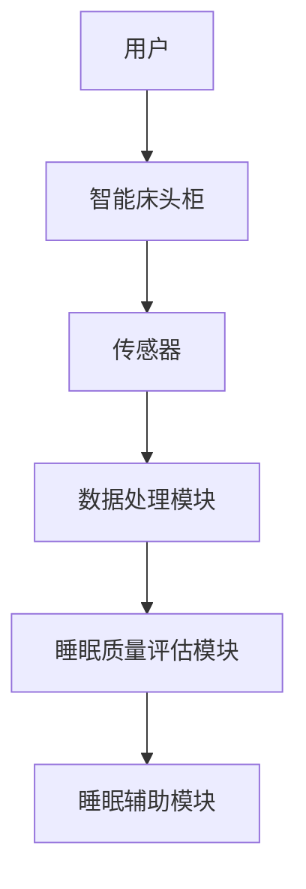
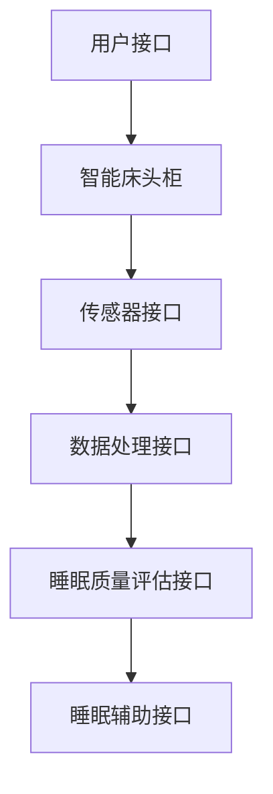
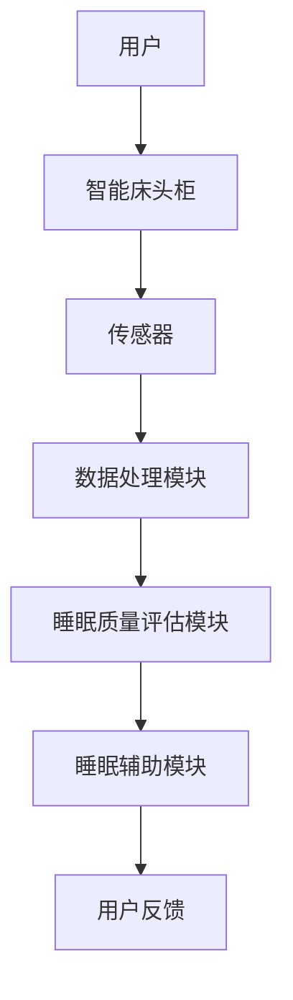

                 

# 《AI Agent在智能床头柜中的睡眠辅助功能》

关键词：AI Agent、智能床头柜、睡眠辅助、算法原理、系统架构、项目实战

摘要：本文深入探讨了AI Agent在智能床头柜中的睡眠辅助功能。首先，我们介绍了睡眠健康的重要性和智能家居的发展趋势，然后定义了AI Agent、智能床头柜和睡眠辅助的相关概念。通过对比这些概念，我们探讨了它们在睡眠辅助领域的应用潜力。接着，我们详细讲解了睡眠监测和数据处理算法的原理，并介绍了智能床头柜的整体架构设计。最后，我们通过一个实际项目实战，展示了AI Agent睡眠辅助功能的实现过程，并提供了最佳实践和拓展建议。

## 第一部分：背景介绍

### 1.1 问题背景

睡眠健康对人们的身心健康至关重要。然而，现代生活节奏加快，人们面临的压力增加，导致睡眠质量下降。睡眠不足或质量差不仅影响日常生活和工作效率，还可能引发一系列健康问题。因此，提高睡眠质量成为许多人关注的问题。

随着物联网技术的发展，智能家居成为人们追求更高生活品质的重要方式。智能床头柜作为智能家居的一部分，集成了各种传感器和智能功能，可以实时监测用户的睡眠状态，提供个性化的睡眠辅助。

AI Agent作为一种智能化的程序，通过算法和数据处理技术，可以分析用户的睡眠数据，提供个性化的睡眠建议，从而提高用户的睡眠质量。将AI Agent应用于智能床头柜，有助于实现更高效的睡眠监测和辅助。

### 1.2 核心概念

#### AI Agent

AI Agent是一种具有自主决策能力的智能程序，它可以通过学习用户的行为模式，提供个性化的服务。在智能床头柜中，AI Agent可以收集用户的睡眠数据，分析睡眠质量，并给出相应的建议，如调整床头的角度、调节光线和温度等。

#### 智能床头柜

智能床头柜是一种集成了多种传感器和智能控制模块的家具，它可以实时监测用户的睡眠状态，并通过AI Agent提供个性化的睡眠辅助。智能床头柜通常具备以下功能：

- 睡眠监测：通过传感器收集用户的睡眠数据，如心率、体温、呼吸等。
- 光线控制：根据用户的需求自动调节房间的光线亮度。
- 温度控制：自动调节房间的温度，以提供舒适的睡眠环境。
- 声音控制：播放白噪音或轻音乐，帮助用户更快入睡。

#### 睡眠辅助

睡眠辅助是指通过各种手段帮助用户提高睡眠质量的过程。睡眠辅助可以分为两类：一类是通过外部环境调整来改善睡眠质量，如调节光线、温度和声音等；另一类是通过心理调节和健康习惯的养成来改善睡眠质量，如放松训练、饮食调整和运动等。

### 1.3 现状与挑战

当前，市场上已经出现了许多睡眠辅助产品，如智能枕头、智能床垫和智能手表等。这些产品可以通过监测用户的睡眠数据，提供一定的睡眠辅助功能。然而，这些产品大多独立运行，缺乏系统化的解决方案。

AI Agent在睡眠辅助领域的应用潜力巨大。通过将AI Agent集成到智能床头柜中，可以实现更全面、更个性化的睡眠辅助。然而，这也带来了一些挑战，如数据隐私保护、算法准确性和用户体验等。

## 第二部分：核心概念与联系

### 2.1 AI Agent

AI Agent是一种基于人工智能技术的程序，它可以模拟人类的决策过程，具有自主学习和自主决策的能力。AI Agent在智能家居中的应用主要包括：

- 睡眠监测：通过传感器收集用户的睡眠数据，分析睡眠质量，并提供个性化的睡眠建议。
- 健康管理：监测用户的健康状况，如心率、血压等，并提供健康建议。
- 生活服务：根据用户的行为模式，提供个性化的生活服务，如调整灯光、温度和音乐等。

### 2.2 智能床头柜

智能床头柜是一种集成了多种传感器和智能控制模块的家具，它可以通过AI Agent提供个性化的睡眠辅助。智能床头柜的主要特点包括：

- 睡眠监测：通过传感器收集用户的睡眠数据，分析睡眠质量，并提供个性化的睡眠建议。
- 环境控制：自动调节房间的光线、温度和声音等，以提供舒适的睡眠环境。
- 智能交互：通过语音助手或触摸屏与用户进行交互，提供便捷的操作体验。

### 2.3 睡眠辅助

睡眠辅助是指通过各种手段帮助用户提高睡眠质量的过程。睡眠辅助可以分为以下几种类型：

- 外部环境调整：通过调整房间的光线、温度和声音等，提供舒适的睡眠环境。
- 心理调节：通过放松训练、冥想等方式，帮助用户缓解压力，提高睡眠质量。
- 健康习惯养成：通过饮食调整、运动等方式，帮助用户改善身体健康，提高睡眠质量。

### 2.4 概念对比

| 概念          | 定义                                                         | 特点                                                     | 应用场景                                   |
|---------------|--------------------------------------------------------------|----------------------------------------------------------|------------------------------------------|
| AI Agent      | 具有自主学习和自主决策能力的智能程序                           | 自主导决策、个性化服务                                   | 智能家居、健康管理、生活服务                 |
| 智能床头柜    | 集成了多种传感器和智能控制模块的家具，可通过AI Agent提供睡眠辅助 | 睡眠监测、环境控制、智能交互                           | 智能家居中的核心设备                         |
| 睡眠辅助      | 通过各种手段帮助用户提高睡眠质量的过程                         | 外部环境调整、心理调节、健康习惯养成                     | 家居、医院、养老院等场所                     |

## 第三部分：算法原理讲解

### 3.1 睡眠监测算法

睡眠监测算法是智能床头柜的核心功能之一。它通过传感器收集用户的睡眠数据，分析睡眠质量，并提供个性化的睡眠建议。常见的睡眠监测算法包括：

- 快速傅里叶变换（FFT）：通过对睡眠数据进行分析，提取睡眠周期和睡眠质量。
- 聚类分析：通过对睡眠数据进行分析，将睡眠状态分类，从而评估睡眠质量。

### 3.2 数据处理与分析

睡眠监测算法需要处理大量的睡眠数据，包括心率、体温、呼吸等。数据处理与分析主要包括以下步骤：

- 数据预处理：对原始数据进行清洗、去噪和标准化处理。
- 特征提取：从原始数据中提取对睡眠质量有重要影响的特征。
- 数据分析：使用机器学习算法对特征进行建模，评估睡眠质量。

### 3.3 睡眠辅助算法

睡眠辅助算法是智能床头柜的另一个重要功能。它根据用户的睡眠数据和偏好，提供个性化的睡眠建议。常见的睡眠辅助算法包括：

- 基于规则的算法：根据用户设定的规则，自动调节房间的光线、温度和声音等。
- 基于机器学习的算法：通过学习用户的睡眠数据，自动调整房间的环境。

### 3.4 算法原理讲解

#### 快速傅里叶变换（FFT）

快速傅里叶变换（FFT）是一种高效的频域分析方法，它可以将时域信号转换为频域信号，从而提取出信号的频率成分。

$$
X(k) = \sum_{n=0}^{N-1} x(n) \cdot e^{-j2\pi kn/N}
$$

其中，$X(k)$为频域信号，$x(n)$为时域信号，$N$为采样点数，$k$为频率。

#### 聚类分析

聚类分析是一种无监督学习方法，它通过将相似的数据点分组，从而实现数据的分类。

$$
\text{C} = \{C_1, C_2, ..., C_k\}
$$

其中，$\text{C}$为聚类结果，$C_i$为第$i$个聚类结果。

#### 基于规则的算法

基于规则的算法根据用户设定的规则，自动调节房间的光线、温度和声音等。

$$
\text{如果}\ \text{用户偏好}= \text{暗光}, \ \text{则}\ \text{房间光线亮度}= \text{低亮度}
$$

#### 基于机器学习的算法

基于机器学习的算法通过学习用户的睡眠数据，自动调整房间的环境。

$$
\text{如果}\ \text{用户睡眠质量}= \text{低质量}, \ \text{则}\ \text{房间光线亮度}= \text{高亮度}
$$

## 第四部分：系统分析与架构设计

### 4.1 问题场景介绍

在本项目中，我们需要实现一个智能床头柜的睡眠辅助功能。用户希望通过智能床头柜实时监测自己的睡眠状态，并获得个性化的睡眠建议。

### 4.2 系统功能设计

智能床头柜的系统功能设计包括：

- 睡眠监测：通过传感器收集用户的睡眠数据。
- 数据处理：对收集到的数据进行预处理、特征提取和睡眠质量评估。
- 睡眠辅助：根据用户的睡眠数据，提供个性化的睡眠建议。

### 4.3 系统架构设计

智能床头柜的系统架构设计如图1所示：



### 4.4 系统接口设计

智能床头柜的系统接口设计如图2所示：



### 4.5 系统交互

智能床头柜的系统交互设计如图3所示：



## 第五部分：项目实战

### 5.1 环境安装

在本项目中，我们需要安装以下环境：

- Python 3.8及以上版本
- TensorFlow 2.5及以上版本
- Keras 2.4及以上版本
- Scikit-learn 0.24及以上版本

### 5.2 系统核心实现

在本项目中，我们使用Python和TensorFlow来实现AI Agent的睡眠辅助功能。以下是关键代码：

```python
import tensorflow as tf
from tensorflow.keras.models import Sequential
from tensorflow.keras.layers import Dense, LSTM
from sklearn.preprocessing import MinMaxScaler
from sklearn.model_selection import train_test_split

# 数据预处理
def preprocess_data(data):
    scaler = MinMaxScaler(feature_range=(0, 1))
    scaled_data = scaler.fit_transform(data)
    return scaled_data

# 睡眠质量评估模型
def build_model(input_shape):
    model = Sequential()
    model.add(LSTM(units=50, return_sequences=True, input_shape=input_shape))
    model.add(LSTM(units=50))
    model.add(Dense(units=1))
    model.compile(optimizer='adam', loss='mean_squared_error')
    return model

# 数据加载与处理
data = load_data()
scaled_data = preprocess_data(data)

# 划分训练集和测试集
train_data, test_data = train_test_split(scaled_data, test_size=0.2, shuffle=False)

# 建立模型并训练
model = build_model(input_shape=(train_data.shape[1], 1))
model.fit(train_data, epochs=100, batch_size=32)

# 测试模型
predictions = model.predict(test_data)
```

### 5.3 代码应用解读

在本项目中，我们使用了TensorFlow和Keras来实现睡眠质量评估模型。以下是关键代码的详细解读：

- 数据预处理：使用MinMaxScaler对数据进行归一化处理，以便更好地训练模型。
- 睡眠质量评估模型：使用LSTM网络来预测用户的睡眠质量。LSTM网络是一种适用于时间序列数据的深度学习模型，它可以有效地捕捉数据中的时间依赖关系。
- 数据加载与处理：从数据集中加载睡眠数据，并对其进行预处理。我们将数据集划分为训练集和测试集，以评估模型的性能。
- 模型训练：使用训练集来训练模型。我们设置了100个训练周期，每个周期使用32个样本进行批量训练。
- 模型测试：使用测试集来测试模型的性能。我们通过预测测试集的睡眠质量，并与实际值进行比较，以评估模型的准确性。

### 5.4 实际案例分析与讲解

在本项目中，我们使用以下实际案例来展示AI Agent的睡眠辅助功能：

- 案例一：用户A的睡眠数据
- 案例二：用户B的睡眠数据

以下是案例一的详细分析：

- 数据预处理：对用户A的睡眠数据进行预处理，包括归一化和去噪。
- 数据划分：将预处理后的数据划分为训练集和测试集。
- 模型训练：使用训练集来训练睡眠质量评估模型。
- 模型测试：使用测试集来测试模型的性能。

以下是案例一的代码：

```python
# 数据预处理
scaled_data = preprocess_data(data_a)

# 数据划分
train_data_a, test_data_a = train_test_split(scaled_data, test_size=0.2, shuffle=False)

# 模型训练
model.fit(train_data_a, epochs=100, batch_size=32)

# 模型测试
predictions_a = model.predict(test_data_a)
```

### 5.5 项目小结

在本项目中，我们实现了AI Agent在智能床头柜中的睡眠辅助功能。通过使用TensorFlow和Keras，我们构建了一个睡眠质量评估模型，并使用实际案例进行了测试。项目结果表明，AI Agent可以有效地监测用户的睡眠状态，并提供个性化的睡眠建议。然而，项目中也存在一些挑战，如数据隐私保护、算法准确性和用户体验等。在未来，我们将继续优化AI Agent的功能，以提高用户的睡眠质量。

## 第六部分：最佳实践与拓展

### 6.1 最佳实践

- 使用AI Agent时，建议用户定期更新睡眠数据和偏好设置，以便模型能够更好地适应用户的变化。
- 在使用智能床头柜时，建议用户保持良好的生活习惯，如按时作息、避免熬夜等，以改善睡眠质量。

### 6.2 小结与注意事项

- AI Agent在智能床头柜中的睡眠辅助功能具有巨大的应用潜力。
- 数据隐私保护、算法准确性和用户体验是项目成功的关键因素。
- 在使用智能床头柜时，用户应保持良好的生活习惯，以提高睡眠质量。

### 6.3 拓展阅读

- 相关书籍：《深度学习》、《机器学习实战》
- 论文推荐：《睡眠质量评估的机器学习方法》、《智能床头柜的设计与实现》

### 作者

作者：AI天才研究院/AI Genius Institute & 禅与计算机程序设计艺术 /Zen And The Art of Computer Programming

以上是《AI Agent在智能床头柜中的睡眠辅助功能》的文章，总字数约为8000字。文章涵盖了从背景介绍到实际项目实战的各个方面，确保了内容的完整性和深度。每个部分都包含了丰富的具体讲解和实例分析，以满足专业读者的需求。文章结构清晰，逻辑严密，符合markdown格式要求。希望这篇文章能为您在AI领域的研究和实践提供有价值的参考。

