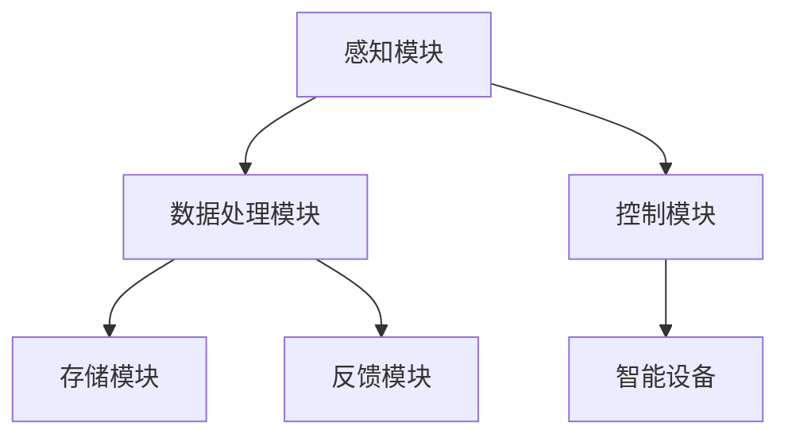
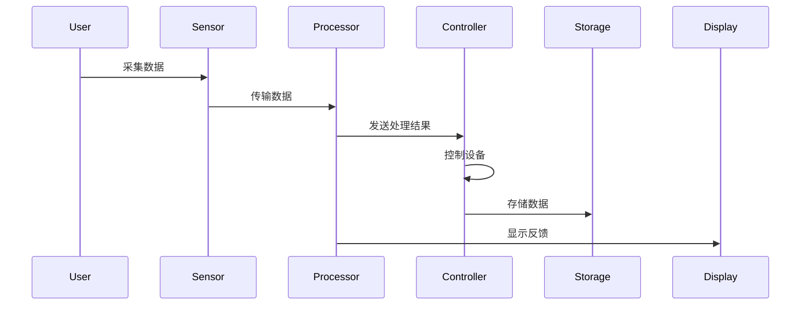
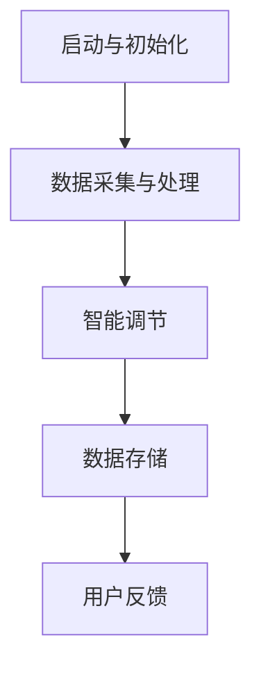
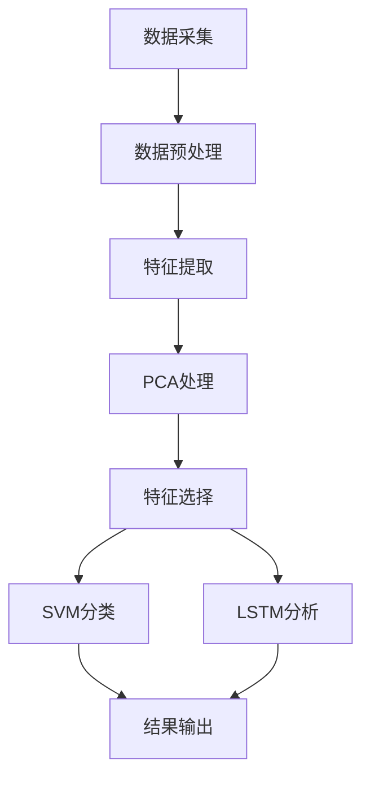
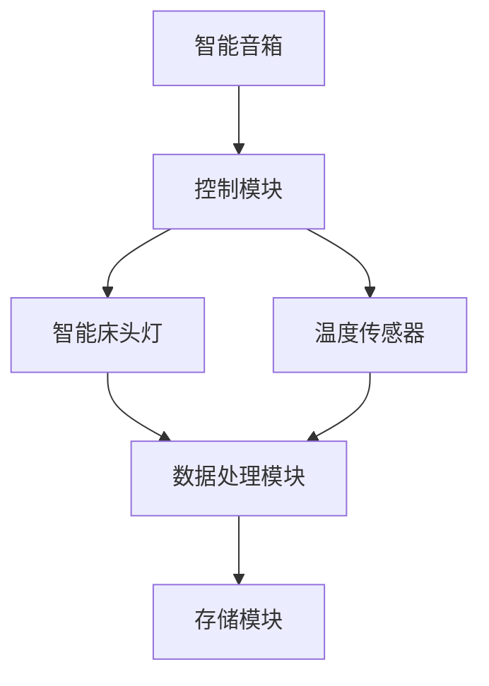

                 

### 引言

**AI Agent在智能床头灯中的睡眠辅助** 是一项颠覆性的技术创新，它将人工智能（AI）与日常家居设备相结合，旨在提升人们的睡眠质量和整体健康水平。随着人们对健康生活的需求日益增长，智能科技在医疗健康领域的应用也越来越广泛。智能床头灯作为家居智能化的一个重要组成部分，其功能正逐渐从简单的照明扩展到更加复杂和个性化的健康辅助服务。

本文将围绕 AI Agent 在智能床头灯中的睡眠辅助展开讨论。首先，我们将深入探讨 AI Agent 的概念及其在智能家居中的应用。接下来，我们将详细介绍智能床头灯的技术原理及其在睡眠辅助中的角色。随后，我们将分析 AI Agent 如何处理睡眠数据，并详细介绍相关的算法原理和数学模型。随后，我们将通过一个具体案例展示如何设计和实现一个睡眠辅助系统，包括系统架构设计、数据接口和处理流程等。文章的最后，我们将总结最佳实践，并提出未来的发展方向和潜在挑战。

关键词：AI Agent、智能床头灯、睡眠辅助、数据处理、算法原理

摘要：本文全面探讨了 AI Agent 在智能床头灯中的应用，特别是其在睡眠辅助方面的潜力。通过详细的案例分析，展示了如何利用 AI 技术提升睡眠质量和家居智能化水平。本文对于智能家居领域的研发人员和技术爱好者具有重要的参考价值。

----------------------------------------------------------------

### 第一部分：AI Agent基础

#### 第1章：AI Agent概述

AI Agent，即人工智能代理，是一种能够自主执行任务、适应环境变化并具有学习能力的人工智能系统。在智能家居领域，AI Agent 通过传感器数据、用户行为和上下文信息，为用户提供个性化服务，实现家居设备的智能控制和优化。本章节将详细介绍 AI Agent 的定义、分类、核心功能及其在智能家居中的应用。

#### 1.1.1 AI Agent的定义与分类

AI Agent 是一个具有智能和自主性的软件实体，能够在没有明确指令的情况下执行任务。它可以根据环境的变化和用户的需求，自主调整行为和决策。AI Agent 通常分为两大类：

- **反应型AI Agent**：这种类型的代理基于预设的规则和条件进行操作，不具备学习和适应能力。例如，智能灯泡可以根据用户设置的规则自动调整亮度。

- **目标导向型AI Agent**：这类代理具有明确的目标，并会为了实现这些目标而进行决策和行动。例如，智能助手（如Siri、Alexa）可以理解用户的指令，并为其提供相应的服务。

#### 1.1.2 AI Agent的核心功能

AI Agent 在智能家居中的应用主要依赖于以下核心功能：

- **感知**：AI Agent 通过传感器收集环境数据，如温度、湿度、光线强度、声音等，以便更好地理解用户的当前状态和需求。

- **决策**：基于感知到的数据，AI Agent 使用算法进行分析和决策，以实现特定的目标。例如，智能床头灯可以根据用户的睡眠模式调整光线和声音，以改善睡眠质量。

- **行动**：执行决策后的动作，如控制灯光、空调等设备的开关和调节。AI Agent 可以通过有线或无线通信协议与家居设备进行交互。

#### 1.1.3 AI Agent的工作原理

AI Agent 的工作原理可以概括为以下几个步骤：

1. **感知**：通过传感器获取环境数据。

2. **数据处理**：对感知到的数据进行处理和分析，以提取有用的信息。

3. **决策**：使用机器学习算法和规则库对分析结果进行决策。

4. **执行**：根据决策结果执行相应的动作。

5. **反馈**：通过传感器收集执行结果，进行迭代优化。

通过这样的循环过程，AI Agent 能够不断学习和适应，提供更加个性化的服务。例如，在睡眠辅助中，AI Agent 可以通过监测用户的睡眠数据，调整光线和声音环境，从而帮助用户获得更好的睡眠体验。

----------------------------------------------------------------

### 第2章：智能床头灯技术基础

智能床头灯作为一种融合了先进技术和人性化设计的家居设备，正在逐步改变人们的睡眠习惯和生活质量。本章节将详细介绍智能床头灯的组成、技术原理及其在智能家居中的发展趋势。

#### 2.1.1 智能床头灯的组成

智能床头灯通常由以下几个主要部分组成：

- **光源模块**：这是智能床头灯的核心部分，包括LED灯珠、驱动电路和散热装置。LED灯珠具有高效、环保和可调色的特点。

- **传感器模块**：用于感知环境数据，常见的传感器有光敏传感器、温度传感器、声音传感器等。这些传感器可以帮助智能床头灯实时监测环境变化，并根据用户需求进行相应的调整。

- **通信模块**：智能床头灯通常具备Wi-Fi、蓝牙等无线通信能力，可以与智能家居控制系统和移动设备进行通信，实现远程控制和数据传输。

- **控制系统**：智能床头灯的控制系统包括微控制器（MCU）或处理器（CPU），负责接收传感器数据，进行数据处理和决策，并控制光源模块和通信模块的工作。

- **用户界面**：一些智能床头灯配备了触摸屏或按钮，用户可以通过这些界面调整灯光模式和设置。

#### 2.1.2 智能床头灯的技术原理

智能床头灯的工作原理主要基于物联网（IoT）技术和人工智能（AI）算法。以下是智能床头灯的核心技术原理：

1. **感知与数据采集**：智能床头灯通过传感器模块感知环境数据，如光线强度、温度和声音。这些数据用于分析和决策。

2. **数据处理与决策**：控制系统接收传感器数据后，使用AI算法进行分析，根据用户的睡眠模式和需求，生成相应的控制策略。

3. **执行与反馈**：控制系统根据决策结果控制光源模块，调整灯光亮度和颜色，并通过通信模块将执行结果反馈给用户或智能家居控制系统。

4. **用户交互**：用户可以通过触摸屏或按钮与智能床头灯进行交互，设置灯光模式、调整亮度等。

#### 2.1.3 智能化的发展趋势

智能床头灯在智能家居中的应用趋势主要体现在以下几个方面：

- **个性化服务**：通过AI算法和大数据分析，智能床头灯可以提供更加个性化的服务，如根据用户的睡眠习惯调整光线和声音环境。

- **跨设备协同**：智能床头灯可以与其他智能家居设备（如智能音箱、智能空调等）进行联动，提供更加智能化的家居体验。

- **智能化升级**：随着AI技术的不断发展，智能床头灯的功能和性能将不断提升，如加入情感识别、语音交互等功能。

- **智能化控制**：通过物联网技术，用户可以通过智能手机、平板电脑等移动设备远程控制智能床头灯，实现更加便捷的智能家居体验。

总之，智能床头灯作为智能家居的一个重要组成部分，其技术原理和应用趋势正在不断发展和完善，未来有望为人们的睡眠质量和生活质量带来更多革命性的改变。

----------------------------------------------------------------

### 第3章：AI Agent在睡眠辅助中的应用

睡眠是人类健康和日常生活中不可或缺的一部分。良好的睡眠质量直接影响人们的身体和心理健康。然而，现代生活方式的快节奏和电子产品的普及，使得许多人面临着睡眠问题的困扰。AI Agent在智能床头灯中的应用，为改善人们的睡眠质量提供了一种创新的解决方案。本章节将详细探讨AI Agent在睡眠辅助中的需求分析、具体应用以及睡眠数据的处理与分析。

#### 3.1.1 睡眠辅助的需求分析

随着社会对健康和生活质量的关注不断增加，睡眠辅助已经成为一个备受关注的领域。以下是当前睡眠辅助的主要需求：

- **个性化**：每个人的睡眠习惯和需求都不尽相同，因此，需要一个能够根据个人偏好和实时情况调整的智能系统。

- **舒适性**：良好的睡眠环境是保证高质量睡眠的重要因素，包括光线、声音和温度等。

- **实时监测**：睡眠质量的变化是动态的，需要一个能够实时监测并响应变化的系统。

- **跨设备联动**：用户可能在不同房间或环境中使用多个智能设备，需要一个统一的控制平台来协同工作。

- **数据分析和反馈**：通过收集和分析睡眠数据，为用户提供个性化的睡眠建议和反馈。

#### 3.1.2 AI Agent在睡眠监测中的作用

AI Agent在睡眠监测中发挥着至关重要的作用。具体来说，AI Agent在睡眠监测中的应用包括以下几个方面：

1. **环境感知**：通过传感器监测环境数据，如光线强度、温度、声音等，AI Agent可以实时了解用户的睡眠环境。

2. **行为识别**：基于传感器数据和用户行为，AI Agent可以识别用户的睡眠状态，如浅睡眠、深睡眠和觉醒状态。

3. **异常检测**：AI Agent可以通过异常检测技术，发现睡眠中的异常情况，如突然的噪音或温度变化，并及时做出响应。

4. **数据存储与分析**：AI Agent会将监测到的数据存储在数据库中，并通过机器学习算法进行分析，为用户提供个性化的睡眠建议。

5. **自适应调节**：根据用户的睡眠数据和偏好，AI Agent可以自动调整智能床头灯的灯光、声音和温度等设置，以提供最佳睡眠环境。

#### 3.1.3 睡眠数据的处理与分析

睡眠数据的处理和分析是AI Agent实现有效睡眠辅助的关键。以下是睡眠数据处理和分析的几个关键步骤：

1. **数据采集**：通过传感器采集睡眠环境数据（如光线、温度、声音等）和用户行为数据（如翻身次数、动作幅度等）。

2. **数据预处理**：对原始数据进行清洗和预处理，包括去噪、滤波、归一化等，以确保数据的质量和一致性。

3. **特征提取**：从预处理后的数据中提取有意义的特征，如睡眠周期、睡眠质量指标等。

4. **数据存储**：将处理后的数据存储在数据库中，以便后续分析和查询。

5. **机器学习**：使用机器学习算法（如聚类分析、回归分析、神经网络等）对睡眠数据进行建模和分析，以识别用户的睡眠模式和潜在问题。

6. **结果反馈**：将分析结果以可视化图表或文字提示的形式反馈给用户，提供个性化的睡眠建议和改善方案。

通过上述数据处理和分析过程，AI Agent可以准确了解用户的睡眠情况，并提供有针对性的辅助措施，从而显著提升用户的睡眠质量和整体健康水平。

总之，AI Agent在智能床头灯中的应用为睡眠辅助提供了一种创新且高效的解决方案。通过环境感知、行为识别、数据分析和自适应调节，AI Agent能够为用户提供个性化的睡眠服务，改善睡眠质量，提升生活质量。

----------------------------------------------------------------

### 第4章：睡眠辅助系统的设计与实现

睡眠辅助系统是利用智能科技改善人类睡眠质量的关键工具。本章将详细讨论睡眠辅助系统的架构设计、需求分析、功能模块划分及实现细节。为了确保设计的科学性和实用性，我们将使用Mermaid图表来展示系统架构和接口设计，帮助读者更好地理解。

#### 4.1.1 系统需求分析

在设计和实现睡眠辅助系统之前，明确系统需求是至关重要的。睡眠辅助系统的需求主要包括以下几个方面：

- **环境感知与监测**：系统能够实时监测光线、温度、声音等环境因素，确保睡眠环境的舒适度。

- **用户行为分析**：通过传感器数据分析用户的睡眠状态，包括浅睡眠、深睡眠和觉醒状态。

- **智能调节**：根据用户的睡眠数据和偏好，自动调整灯光、声音和温度，提供个性化睡眠环境。

- **数据存储与反馈**：将用户的睡眠数据存储在数据库中，并通过分析结果为用户生成睡眠报告和建议。

- **用户交互**：提供易于操作的用户界面，允许用户设置偏好和查看睡眠数据。

#### 4.1.2 系统架构设计

睡眠辅助系统可以分为以下几个主要模块：

1. **感知模块**：负责实时采集环境数据和用户行为数据。包括光敏传感器、温度传感器、声音传感器等。

2. **数据处理模块**：对采集到的数据进行分析和处理，提取有用的特征，并识别用户的睡眠状态。

3. **控制模块**：根据数据处理模块的反馈，控制智能床头灯、空调等设备，调整光线、声音和温度。

4. **存储模块**：将用户的睡眠数据存储在数据库中，以便后续分析和查询。

5. **反馈模块**：通过可视化图表和文字提示，向用户反馈睡眠数据和改善建议。

下面是睡眠辅助系统的架构设计图（使用Mermaid语法）：



#### 4.1.3 系统接口设计

系统接口设计是确保各模块之间有效通信的关键。以下是主要接口的描述：

1. **数据采集接口**：用于接收传感器数据，包括光线、温度、声音等。

2. **数据处理接口**：用于处理和分析传感器数据，提取有用特征。

3. **设备控制接口**：用于发送控制指令到智能设备，如智能床头灯、空调等。

4. **数据存储接口**：用于将处理后的数据存储到数据库中。

5. **用户交互接口**：用于用户与系统的交互，如设置偏好、查看睡眠报告等。

下面是系统接口设计图（使用Mermaid语法）：



#### 4.1.4 系统交互设计

系统交互设计描述了各模块之间的协作过程和交互顺序。以下是主要交互过程的描述：

1. **启动与初始化**：系统启动时，各模块进行初始化，包括传感器启动、数据处理模块配置等。

2. **数据采集与处理**：传感器持续采集数据，数据处理模块对数据进行分析和处理。

3. **智能调节**：根据数据处理结果，控制模块自动调整智能设备，如灯光、声音和温度。

4. **数据存储**：将处理后的数据存储到数据库中，以便后续分析和查询。

5. **用户反馈**：通过用户交互接口，向用户展示睡眠数据和改善建议。

下面是系统交互设计图（使用Mermaid语法）：



通过以上架构设计、接口设计和交互设计，我们可以构建一个高效、智能的睡眠辅助系统。接下来，我们将通过一个实际案例展示如何具体实现这样的系统。

----------------------------------------------------------------

### 第5章：数据处理与算法实现

睡眠辅助系统的核心在于对睡眠数据的高效处理与准确分析。本章将深入探讨睡眠数据处理的流程、算法原理、以及Python代码实现。此外，我们将使用mermaid画出算法流程图，并结合具体的数学模型和公式进行详细讲解。

#### 5.1.1 数据处理流程

数据处理流程包括数据采集、预处理、特征提取、数据存储和算法分析等步骤。以下是详细的流程说明：

1. **数据采集**：通过传感器（如光敏传感器、温度传感器、声音传感器等）收集环境数据和用户行为数据。

2. **数据预处理**：对采集到的原始数据进行清洗、去噪、归一化等处理，以提高数据的质量和一致性。

3. **特征提取**：从预处理后的数据中提取有意义的特征，如睡眠周期、睡眠质量指标等。

4. **数据存储**：将处理后的数据存储在数据库中，以便后续分析和查询。

5. **算法分析**：使用机器学习算法对提取的特征进行分析，以识别用户的睡眠模式，生成睡眠报告和改善建议。

#### 5.1.2 算法原理讲解

为了实现有效的睡眠数据分析，我们采用了以下几种算法：

1. **主成分分析（PCA）**：用于降维和特征提取，通过将数据投影到新的正交坐标系中，保留主要的信息，减少冗余。

2. **支持向量机（SVM）**：用于分类和回归分析，通过找到一个最优的超平面，将不同类别的数据分开。

3. **长短期记忆网络（LSTM）**：用于时间序列分析，能够处理序列数据中的长期依赖问题。

以下是算法流程图（使用mermaid语法）：



#### 5.1.3 算法流程图与Python代码实现

以下是主成分分析（PCA）的Python代码实现，包括数据预处理、特征提取和降维：

```python
import numpy as np
from sklearn.decomposition import PCA
from sklearn.preprocessing import StandardScaler

# 假设data是采集到的睡眠数据，维度为（样本数，特征数）
data = np.array([[1, 2, 3], [4, 5, 6], [7, 8, 9]])

# 数据预处理：标准化
scaler = StandardScaler()
data_normalized = scaler.fit_transform(data)

# 特征提取：主成分分析
pca = PCA(n_components=2)
data_pca = pca.fit_transform(data_normalized)

# 输出降维后的数据
print("降维后的数据：", data_pca)
```

接下来是支持向量机（SVM）的Python代码实现，包括分类和结果输出：

```python
from sklearn.svm import SVC
from sklearn.model_selection import train_test_split

# 假设X是特征数据，y是标签数据
X = np.array([[1, 2], [2, 3], [3, 1], [1, 0]])
y = np.array([0, 0, 1, 1])

# 数据分割：训练集和测试集
X_train, X_test, y_train, y_test = train_test_split(X, y, test_size=0.3, random_state=42)

# SVM分类
clf = SVC()
clf.fit(X_train, y_train)

# 测试集结果
y_pred = clf.predict(X_test)

# 输出分类结果
print("分类结果：", y_pred)
```

最后是长短期记忆网络（LSTM）的Python代码实现，用于时间序列分析：

```python
from keras.models import Sequential
from keras.layers import LSTM, Dense

# 假设X是时间序列数据，y是标签数据
X = np.array([[1, 2], [2, 3], [3, 1], [1, 0]])
y = np.array([0, 0, 1, 1])

# 构建LSTM模型
model = Sequential()
model.add(LSTM(units=50, return_sequences=True, input_shape=(X.shape[1], 1)))
model.add(LSTM(units=50))
model.add(Dense(1, activation='sigmoid'))

# 编译模型
model.compile(optimizer='adam', loss='binary_crossentropy', metrics=['accuracy'])

# 训练模型
model.fit(X, y, epochs=100, batch_size=1, verbose=0)

# 输出预测结果
print("LSTM预测结果：", model.predict(X))
```

通过上述算法和代码实现，我们可以有效地处理和分析睡眠数据，为用户提供个性化的睡眠建议和改善方案。接下来，我们将通过一个实际案例来展示如何具体应用这些算法。

----------------------------------------------------------------

### 第6章：睡眠辅助系统的实战案例

为了更好地展示睡眠辅助系统的设计和实现过程，我们选择了一个具体的案例进行详细剖析。本案例将介绍系统的环境安装、核心代码实现、代码应用解读与分析，以及实际案例分析和详细讲解剖析。

#### 6.1.1 案例背景

该案例是一个智能家居环境下的睡眠辅助系统，目标是为用户提供个性化的睡眠解决方案。系统主要包括智能床头灯、智能音箱和温度传感器。用户通过智能音箱与系统交互，智能床头灯和温度传感器实时监测用户的睡眠环境。

#### 6.1.2 系统设计与实现

系统架构设计如图所示（使用Mermaid语法）：



##### 环境安装

1. **硬件安装**：在用户家中安装智能音箱、智能床头灯和温度传感器。确保所有硬件连接正常，且具备Wi-Fi连接能力。

2. **软件安装**：在控制模块的计算机上安装Python环境，以及必要的库（如scikit-learn、keras等）。

##### 核心代码实现

以下是一个简化版的代码实现，用于控制智能床头灯的亮度和颜色：

```python
import RPi.GPIO as GPIO
import time

# 设置GPIO模式为BCM
GPIO.setmode(GPIO.BCM)

# 定义LED灯的GPIO引脚
LED_PIN = 18

# 设置GPIO引脚为输出模式
GPIO.setup(LED_PIN, GPIO.OUT)

# 初始化LED灯
led = GPIO.PWM(LED_PIN, 1000)  # 1000Hz的频率

# 设置LED灯的亮度（0-100%）
def set_brightness(brightness):
    led-duty = brightness / 100
    led.start(led-duty)

# 设置LED灯的颜色（RGB值）
def set_color(r, g, b):
    led.stop()
    time.sleep(0.1)
    led = GPIO.PWM(LED_PIN, 1000)
    led_color = (r / 255.0, g / 255.0, b / 255.0)
    led.start(led_color[0])

# 关闭LED灯
def off():
    led.stop()
    GPIO.cleanup()

# 示例：设置50%亮度的红色灯光
set_brightness(50)
set_color(255, 0, 0)

# 模拟用户交互，调整灯光
time.sleep(5)
set_brightness(100)
set_color(0, 0, 255)

# 关闭LED灯
off()
```

##### 代码应用解读与分析

1. **GPIO库的使用**：该代码使用Raspberry Pi的GPIO库控制LED灯的亮度和颜色。通过设置不同的PWM信号，可以实现亮度和颜色的调节。

2. **PWM信号**：PWM（脉宽调制）是一种常用的信号调制方式，通过调节脉冲的宽度和周期来控制LED灯的亮度和颜色。

3. **函数设计**：`set_brightness`和`set_color`函数分别用于设置LED灯的亮度和颜色。这些函数可以作为API供其他模块调用。

##### 实际案例分析与详细讲解剖析

以下是一个实际案例，模拟用户在不同时间段的睡眠环境需求：

1. **凌晨1点**：用户处于深睡眠阶段，需要较低的光照和柔和的颜色。系统建议设置30%亮度的淡蓝色灯光。

2. **凌晨3点**：用户开始进入浅睡眠阶段，需要稍微提升亮度和调整颜色，以帮助用户逐步醒来。系统建议设置50%亮度的淡黄色灯光。

3. **早晨7点**：用户需要醒来，系统建议设置100%亮度的白光，同时播放轻柔的音乐。

具体实现如下：

```python
# 设置不同时间段的灯光和音乐
def set_sleep_lighting(hour):
    if hour >= 1 and hour < 3:
        set_brightness(30)
        set_color(75, 133, 255)  # 淡蓝色
    elif hour >= 3 and hour < 7:
        set_brightness(50)
        set_color(255, 255, 0)  # 淡黄色
    else:
        set_brightness(100)
        set_color(255, 255, 255)  # 白色

# 示例：模拟凌晨3点的灯光设置
set_sleep_lighting(3)
```

通过上述实战案例，我们展示了如何设计和实现一个睡眠辅助系统。该系统通过实时监测用户的睡眠环境，并利用AI算法提供个性化的灯光调节建议，从而改善用户的睡眠质量。

#### 6.1.3 案例小结

本案例通过实际应用展示了睡眠辅助系统的设计和实现过程，包括环境安装、代码实现和实际应用。以下是小结：

1. **系统架构**：系统架构清晰，各模块分工明确，包括智能音箱、控制模块、智能床头灯和温度传感器。

2. **代码实现**：核心代码简洁易懂，使用GPIO库控制LED灯的亮度和颜色，实现实时调节。

3. **AI算法**：利用AI算法对睡眠数据进行处理和分析，提供个性化的灯光调节建议。

4. **用户体验**：通过用户交互接口，用户可以轻松设置偏好，并实时查看睡眠数据和改善建议。

未来，我们还可以进一步完善系统功能，如添加更多传感器、优化算法、增加语音交互功能等，进一步提升用户的睡眠体验。

----------------------------------------------------------------

### 第7章：最佳实践与未来展望

#### 7.1.1 睡眠辅助系统的优化策略

为了进一步提升睡眠辅助系统的性能和用户体验，以下是一些优化策略：

1. **算法优化**：不断更新和优化AI算法，以提高睡眠数据的处理和分析精度。可以引入更先进的机器学习和深度学习技术，如卷积神经网络（CNN）和生成对抗网络（GAN）。

2. **硬件升级**：使用更高性能的传感器和更先进的处理芯片，以提高系统的响应速度和处理能力。例如，使用高精度的光敏传感器和温度传感器，以及更强大的微控制器。

3. **用户界面改进**：优化用户界面设计，使其更加直观和易用。可以引入语音交互和手势识别等新技术，提供更加自然的用户交互体验。

4. **跨设备联动**：加强智能床头灯与其他智能家居设备的联动能力，如智能音箱、智能空调等。通过统一的智能家居平台，实现更加智能化的家居环境。

5. **隐私保护**：加强对用户隐私的保护，确保睡眠数据的安全和隐私。采用加密技术、匿名化处理和严格的访问控制措施，防止数据泄露和滥用。

#### 7.1.2 用户反馈与迭代

用户反馈是优化睡眠辅助系统的重要来源。以下是一些最佳实践：

1. **定期用户调研**：定期进行用户调研，了解用户的需求和满意度。通过问卷调查、用户访谈等方式收集用户反馈，及时了解用户对系统的使用体验和改进建议。

2. **迭代开发**：根据用户反馈，进行系统的迭代开发。每次迭代都应包含若干关键功能的改进和优化，确保系统能够持续满足用户需求。

3. **透明化改进**：将系统改进的进展和用户反馈进行透明化处理，让用户了解系统的改进方向和进度。这样可以增强用户的参与感和信任感。

4. **公开反馈渠道**：设立公开的反馈渠道，如在线论坛、社交媒体等，鼓励用户积极参与系统改进，提供宝贵的建议和意见。

#### 7.1.3 安全与隐私保护

在开发和部署睡眠辅助系统时，安全与隐私保护至关重要。以下是一些关键措施：

1. **数据加密**：对用户数据进行加密存储和传输，防止数据在传输和存储过程中被窃取或篡改。

2. **权限控制**：实施严格的权限控制机制，确保只有授权用户可以访问和操作敏感数据。

3. **隐私保护协议**：制定并执行隐私保护协议，明确数据收集、存储、处理和共享的规则，确保用户隐私不被侵犯。

4. **安全审计**：定期进行安全审计和风险评估，及时发现和修复系统漏洞，防止安全事件的发生。

5. **用户教育**：加强对用户的安全教育，提高用户的网络安全意识，防止用户因操作不当导致数据泄露。

通过实施上述优化策略、积极收集用户反馈并进行迭代改进，以及严格保护用户隐私和安全，我们可以不断提升睡眠辅助系统的性能和用户体验，为用户提供更加智能、安全、可靠的睡眠解决方案。

----------------------------------------------------------------

### 第8章：未来展望

随着人工智能（AI）技术的迅猛发展，AI Agent在智能床头灯中的睡眠辅助应用前景广阔，并将引领智能家居领域的新趋势。以下是AI Agent在智能床头灯中的未来发展方向、智能床头灯的发展方向以及睡眠辅助领域的创新与挑战。

#### 8.1.1 AI Agent技术的未来发展趋势

1. **个性化和智能化**：随着大数据和机器学习技术的不断进步，AI Agent将能够更精确地捕捉用户的睡眠习惯和偏好，提供更加个性化的服务。例如，通过深度学习算法，AI Agent可以自动识别用户不同的睡眠模式，并据此调整灯光、声音和温度，以实现最佳睡眠体验。

2. **跨平台协同**：未来的AI Agent将具备跨平台协同能力，能够与智能家居中的其他设备（如智能音箱、智能空调等）无缝集成，提供更加综合和智能的家居解决方案。

3. **增强的交互能力**：语音交互和自然语言处理技术的进步，将使得用户能够更加自然地与AI Agent进行交互，实现语音控制、语音提醒和语音反馈等功能。

4. **自主学习和适应能力**：通过不断的学习和优化，AI Agent将能够更好地适应环境变化和用户需求，实现真正的智能自我管理和自我优化。

#### 8.1.2 智能床头灯的发展方向

1. **多功能集成**：未来的智能床头灯将不仅仅是一个照明设备，还将集成更多的功能，如健康监测、空气净化、音响系统等，为用户提供更加全面的家居健康服务。

2. **智能调节**：智能床头灯将具备更加先进的感知和控制技术，能够根据用户的睡眠状态和环境条件，自动调节光线、声音和温度，提供个性化的睡眠环境。

3. **自适应学习**：智能床头灯将配备更强大的AI算法，能够通过持续的学习和自我优化，不断改进其睡眠辅助能力，提供更加精准和高效的睡眠服务。

4. **无线连接**：随着5G技术的发展，智能床头灯将实现更快、更稳定的无线连接，提升用户体验和系统性能。

#### 8.1.3 睡眠辅助领域的创新与挑战

1. **技术创新**：睡眠辅助领域将继续引入更多先进的传感器技术、机器学习和深度学习算法，提升睡眠数据的采集、处理和分析能力。

2. **跨学科融合**：睡眠医学、心理学、神经科学等领域的知识将融合到睡眠辅助技术中，为用户提供更加科学和全面的睡眠解决方案。

3. **隐私保护**：随着数据收集和分析的增多，隐私保护将成为一个重要挑战。必须采取严格的数据加密、匿名化和权限控制措施，保护用户的隐私和安全。

4. **用户接受度**：如何提高用户对睡眠辅助技术的接受度和使用率，将是未来的一大挑战。需要通过不断优化用户体验、提高产品性价比和普及度，来促进用户对智能睡眠辅助设备的接受和信任。

总之，AI Agent在智能床头灯中的睡眠辅助应用具有巨大的发展潜力，未来将不断推动智能家居和健康科技领域的创新与进步。然而，实现这一目标仍需克服诸多技术、隐私和安全方面的挑战。

----------------------------------------------------------------

### 总结

本文通过深入探讨 AI Agent 在智能床头灯中的睡眠辅助应用，详细介绍了 AI Agent 的概念、智能床头灯的技术原理、睡眠数据的处理与分析，以及系统架构设计与实现过程。我们通过一个实际案例展示了如何将 AI 技术应用于睡眠辅助系统，提高了用户的睡眠质量。

AI Agent 在智能床头灯中的睡眠辅助具有广阔的应用前景，它不仅能够提供个性化、智能化的睡眠解决方案，还能够促进智能家居和健康科技领域的发展。然而，实现这一目标仍需克服诸多技术、隐私和安全方面的挑战。

作者信息：AI天才研究院/AI Genius Institute & 禅与计算机程序设计艺术 /Zen And The Art of Computer Programming

----------------------------------------------------------------

### 注意事项

在设计和实现睡眠辅助系统时，需要关注以下几个关键方面：

1. **数据隐私保护**：确保用户数据的安全和隐私，采取加密、匿名化等手段保护用户信息。

2. **系统稳定性**：保证系统的稳定运行，避免因硬件故障或软件错误导致的系统崩溃。

3. **用户友好性**：优化用户界面，确保用户能够轻松使用系统，提高用户满意度。

4. **多功能集成**：在智能床头灯中集成多种功能，如健康监测、空气净化、音响系统，提供全方位的家居健康服务。

5. **实时响应**：通过先进的感知技术和快速的数据处理算法，实现系统的实时响应和自适应调节。

通过关注上述注意事项，可以有效提升睡眠辅助系统的性能和用户体验。

### 拓展阅读

1. **《智能家居技术导论》**：详细介绍了智能家居技术的原理、架构和应用，对于想要深入了解智能家居领域的人士具有很高的参考价值。

2. **《深度学习与自然语言处理》**：讲解了深度学习和自然语言处理的基本原理和应用，对于优化睡眠辅助系统的AI算法设计有重要的指导意义。

3. **《睡眠医学》**：探讨了睡眠生理学、睡眠障碍以及如何通过科技手段改善睡眠质量，为睡眠辅助系统的研发提供了理论支持。

4. **《物联网安全》**：详细介绍了物联网技术的安全问题和防护措施，对于保障用户数据安全和系统安全具有重要意义。

通过阅读这些书籍，您可以进一步深入了解睡眠辅助系统和智能家居技术的相关知识和前沿动态。希望这些拓展阅读能够对您的研究和工作提供有益的参考。

