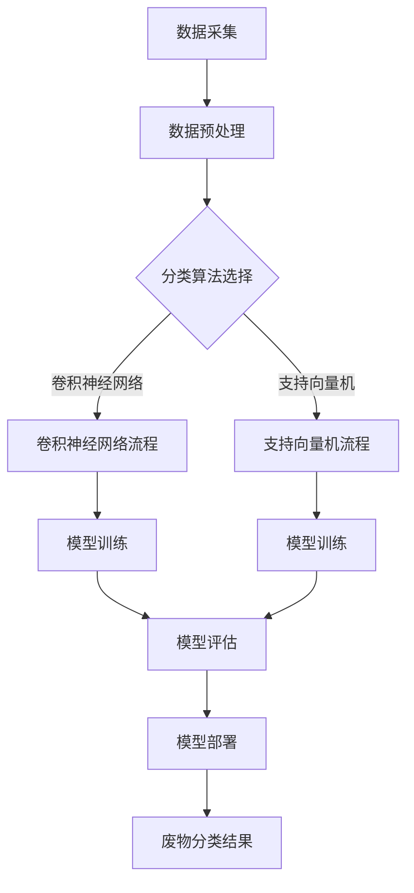

                 

### 引言

在当今社会，随着城市化进程的加快和人口密度的增加，废物管理问题日益严峻。传统的废物处理方式主要依赖于填埋和焚烧，这不仅占用大量土地资源，还可能对环境和人类健康造成严重危害。因此，寻求更加环保、高效的废物管理方法成为当务之急。

随着人工智能技术的飞速发展，AI Agent作为一种智能实体，其在废物管理中的应用逐渐受到关注。AI Agent具备自主决策和执行任务的能力，可以有效地识别、分类和处理各种废物，从而实现智能废物管理。这不仅有助于提升废物处理效率，还能减少环境污染，具有巨大的应用潜力。

本文将围绕AI Agent在智能废物管理中的实践展开讨论。我们将首先介绍AI Agent的基本概念和特性，然后探讨其在废物管理中的应用原理。接着，我们将详细阐述AI Agent在智能废物管理中的实现过程，包括系统架构设计、核心算法和项目实战案例。最后，我们将总结最佳实践，展望未来智能废物管理的发展趋势。

### 背景介绍

#### 问题背景

废物管理问题一直是全球各国面临的重大挑战。据统计，全球每年产生的城市固体废物总量已超过100亿吨。而传统的废物处理方式，如填埋、焚烧和堆肥等，不仅效率低下，而且对环境造成了严重的污染。例如，填埋场不仅占用了大量土地资源，还可能导致土壤污染和地下水污染；焚烧则会产生有害气体和灰渣，对大气环境和公共健康构成威胁。

此外，废物分类和处理过程中也存在着诸多问题。首先，废物分类的准确性直接影响后续处理的效率和质量。然而，现有的废物分类技术主要依赖于人工操作，存在分类不均、误分类等问题，导致废物处理成本增加，效果不佳。其次，废物处理过程中可能产生二次污染，进一步加剧环境污染问题。

因此，为了解决上述问题，智能废物管理成为了一个迫切需要解决的问题。智能废物管理不仅能够提高废物处理的效率，减少对环境的污染，还能够实现资源的再利用，促进可持续发展。

#### 智能废物管理的重要性

智能废物管理是利用人工智能技术对废物处理过程进行智能化管理和优化的一种新型废物管理方式。与传统废物管理方式相比，智能废物管理具有以下显著优势：

首先，智能废物管理能够实现自动化的废物分类和处理。通过应用AI Agent，可以自动识别和分类各种废物，从而提高分类的准确性和效率。例如，AI Agent可以使用图像识别技术对废物进行图像分析，快速准确地判断其种类，并将其分类到相应的处理流程中。

其次，智能废物管理能够优化废物处理过程。AI Agent可以通过对大量数据进行分析，预测废物处理过程中的问题和风险，并采取相应的措施进行优化。例如，通过分析废物成分和特性，AI Agent可以制定最优的处理方案，提高处理效果，减少能源消耗和废物产生。

此外，智能废物管理还能实现资源的再利用。通过智能废物管理，可以有效地回收和利用废物中的有用资源，减少对原生资源的需求，降低环境污染。

总之，智能废物管理具有重要的应用价值和发展前景。它不仅有助于解决当前废物管理中的问题，还能够为未来的可持续发展提供有力支持。因此，研究和实践智能废物管理具有重要的现实意义。

#### 问题描述

智能废物管理中的主要问题可以归纳为以下几个方面：

1. **废物分类的难题**：现有的废物分类技术主要依赖于人工操作，分类不准确，误分类问题普遍存在。这导致后续处理过程效率低下，资源浪费，环境污染严重。

2. **废物处理过程中的挑战**：废物处理过程中可能产生二次污染，例如焚烧过程中产生的有害气体和灰渣，填埋过程中可能渗入地下水等。这些问题对环境和人类健康构成了严重威胁。

3. **数据处理和存储的挑战**：智能废物管理需要处理和分析大量的数据，包括废物成分、处理过程、设备状态等。如何高效地存储、管理和分析这些数据是当前面临的一个重要挑战。

4. **系统的复杂性和高成本**：智能废物管理系统通常需要集成多种技术和设备，包括传感器、图像识别、机器学习等。系统的设计和实施过程复杂，且涉及大量的资金投入。

#### 问题解决

针对上述问题，AI Agent在智能废物管理中提供了有效的解决方案：

1. **自动废物分类**：AI Agent可以利用图像识别技术，通过分析废物的外观、形状和颜色等特征，实现自动分类。这种方法不仅提高了分类的准确性，还大大降低了人工成本。

2. **优化处理过程**：AI Agent可以通过对处理过程中产生的数据进行实时分析，预测可能出现的问题，并采取相应的措施进行优化。例如，通过调整处理参数，优化能源消耗和处理效率。

3. **数据处理和存储**：AI Agent可以利用大数据技术，对处理过程中产生的海量数据进行高效处理和存储。通过使用分布式计算和云计算技术，可以大大提高数据处理和存储的能力。

4. **降低系统复杂性和成本**：AI Agent可以整合多种技术和设备，实现系统的模块化和标准化。通过标准化设计，可以降低系统的复杂性和成本，提高系统的可维护性和可扩展性。

总之，AI Agent在智能废物管理中的应用，不仅解决了传统废物管理中存在的问题，还为实现高效、环保、可持续的废物管理提供了新的思路和解决方案。

### 边界与外延

#### 智能废物管理的定义

智能废物管理是指通过应用先进的人工智能技术，对废物进行自动化分类、处理、回收和再利用的过程。它利用传感器、图像识别、机器学习等AI技术，提高废物处理效率，减少环境污染，促进资源循环利用。

#### AI Agent在废物管理中的应用范围

AI Agent在废物管理中的应用非常广泛，主要包括以下几个方面：

1. **废物分类**：AI Agent可以通过图像识别技术，对废物进行自动化分类。例如，它可以识别不同类型的纸张、塑料、金属和有害废物，并将它们分类到相应的处理流程中。

2. **处理过程优化**：AI Agent可以通过实时分析处理过程中的数据，优化处理参数，提高处理效率和效果。例如，它可以调整焚烧温度，优化能源消耗，减少有害气体排放。

3. **回收与再利用**：AI Agent可以帮助识别废物中的可回收部分，并实现自动回收和再利用。例如，它可以识别塑料瓶并将其送入回收系统，或者识别金属废料并将其送入冶炼厂。

4. **环境监测与预警**：AI Agent可以通过监测废物处理过程中的环境参数，如温度、湿度、有害气体浓度等，实现对环境的实时监测和预警，防止环境污染。

#### 智能废物管理的优势

智能废物管理相比传统的废物管理方法，具有以下显著优势：

1. **提高处理效率**：AI Agent能够实现自动化操作，大大提高了废物处理的效率。例如，通过自动化分类，可以减少人工操作的错误率和耗时。

2. **减少环境污染**：AI Agent可以优化处理过程，减少有害气体的排放和二次污染的产生，降低对环境的负面影响。

3. **促进资源循环利用**：通过智能分类和回收，可以有效地回收和利用废物中的有用资源，减少对原生资源的需求，实现资源的可持续利用。

4. **降低管理成本**：AI Agent可以减少人工操作，降低废物处理和管理成本。

总之，智能废物管理是一种具有广泛应用前景的废物管理方式，它通过引入AI技术，实现了废物处理的智能化、高效化和环保化，为解决当前的废物管理问题提供了新的解决方案。

### 本章小结

本章首先介绍了废物管理问题的背景和现状，指出了传统废物处理方式存在的问题和挑战。接着，我们探讨了智能废物管理的定义和重要性，以及AI Agent在这一领域中的应用。通过分析废物分类、处理过程优化、回收与再利用、环境监测等方面，我们展示了AI Agent在智能废物管理中的关键作用。最后，我们明确了智能废物管理的边界与外延，阐述了其在废物管理中的广泛应用和优势。通过本章的介绍，我们为后续章节的深入探讨奠定了基础，也为读者了解智能废物管理提供了全面视角。

## 第二部分：核心概念

### 2.1 AI Agent基础

#### 2.1.1 AI Agent的定义

AI Agent，即人工智能代理，是一种智能实体，能够通过感知环境、理解问题、做出决策并执行行动，以实现特定目标。AI Agent具备自主性、智能性和适应性，是人工智能领域研究的重要方向之一。

首先，AI Agent的核心特征是自主性。这意味着它能够自主地执行任务，而不需要人类的直接干预。自主性使AI Agent能够适应复杂多变的环境，并能够自主学习和优化行为。

其次，智能性是AI Agent的另一个关键特征。AI Agent通过使用各种AI算法和技术，如机器学习、深度学习、自然语言处理等，从环境中获取信息、理解和解决问题。智能性使得AI Agent能够进行复杂的推理和决策，从而实现其目标。

最后，AI Agent具有适应性。它们能够通过不断的学习和调整，适应新的环境和挑战。这种适应性使得AI Agent能够在实际应用中表现出良好的性能和可靠性。

#### 2.1.2 AI Agent的特性

AI Agent具有以下主要特性：

1. **自主性**：AI Agent能够自主地感知环境、理解问题、做出决策并执行行动。这种自主性使得AI Agent能够在没有人类干预的情况下，独立完成任务。

2. **智能性**：AI Agent通过机器学习、深度学习等AI技术，能够从环境中获取信息，进行推理和决策。智能性使得AI Agent能够解决复杂的问题，并具备较高的决策质量。

3. **适应性**：AI Agent能够通过不断的学习和调整，适应新的环境和挑战。这种适应性使得AI Agent能够在长期运行中保持良好的性能和可靠性。

4. **协作性**：AI Agent能够与其他AI Agent或人类进行协作，共同完成任务。协作性使得AI Agent能够在复杂任务中发挥更大的作用，提高整体效率。

#### 2.1.3 AI Agent的分类

AI Agent可以根据不同的分类标准进行分类，以下是几种常见的分类方式：

1. **按任务分类**：

   - **单一任务AI Agent**：只能完成特定任务的AI Agent，如语音助手、图像识别系统等。
   - **多任务AI Agent**：能够同时完成多个任务的AI Agent，如智能客服系统、智能交通管理系统等。

2. **按实现技术分类**：

   - **基于规则AI Agent**：使用预定义的规则进行推理和决策的AI Agent，如基于专家系统的AI Agent。
   - **基于机器学习AI Agent**：通过学习大量数据，自动提取特征和模式，进行推理和决策的AI Agent，如基于深度学习的AI Agent。

3. **按应用领域分类**：

   - **工业AI Agent**：应用于工业自动化和优化领域，如自动化生产线中的AI Agent。
   - **家居AI Agent**：应用于智能家居领域，如智能音箱、智能灯光等。
   - **医疗AI Agent**：应用于医疗诊断、健康管理和辅助治疗等领域。

### 2.2 废物管理技术

#### 2.2.1 废物分类技术

废物分类是废物管理中的关键环节，其准确性直接影响后续处理的效果。现有的废物分类技术主要包括手动分类和自动分类。

1. **手动分类**：

   手动分类是指通过人工操作对废物进行分类。这种方法简单易行，但效率较低，且依赖于人工的准确性和经验。手动分类适用于小规模、简单的废物处理场景。

2. **自动分类**：

   自动分类是指利用技术手段对废物进行自动化分类。自动分类技术主要包括：

   - **图像识别技术**：通过图像识别技术，对废物图像进行分析，识别其类型并进行分类。这种方法具有较高的准确性和效率，适用于大规模的废物处理场景。
   - **传感器技术**：利用不同类型的传感器（如红外线传感器、超声波传感器等），对废物进行物理特征分析，从而实现分类。这种方法适用于处理不同物理特性的废物。

#### 2.2.2 废物处理技术

废物处理技术主要包括物理处理、化学处理和生物处理三种方式。

1. **物理处理**：

   物理处理是通过物理方法对废物进行分解、破碎、压缩等处理。常见的方法包括：

   - **压实处理**：通过压缩废物，减少体积，便于运输和储存。
   - **破碎处理**：通过破碎机将废物破碎成小块，便于后续处理。
   - **分选处理**：通过磁选、重力分选等方法，将废物中的有用成分分离出来。

2. **化学处理**：

   化学处理是通过化学反应对废物进行分解、转化等处理。常见的方法包括：

   - **焚烧处理**：通过高温焚烧，将废物分解为无害气体和灰渣。
   - **氧化处理**：通过氧化反应，将有机废物分解为无害物质。
   - **酸碱处理**：通过酸碱中和反应，处理废液和固体废物。

3. **生物处理**：

   生物处理是通过微生物的作用，对废物进行分解、转化等处理。常见的方法包括：

   - **堆肥处理**：通过微生物分解有机废物，生成肥料。
   - **沼气处理**：通过微生物发酵，将有机废物转化为沼气，用于能源供应。
   - **生物降解处理**：通过微生物分解废物中的有害物质，实现无害化处理。

#### 2.2.3 废物回收技术

废物回收技术是废物管理中的重要组成部分，通过回收和再利用废物中的有用资源，实现资源的循环利用，减少环境污染。

1. **回收流程**：

   废物回收通常包括以下步骤：

   - **收集**：将废物收集到指定的回收点。
   - **预处理**：对废物进行初步处理，如破碎、清洗、分类等。
   - **分离**：通过物理或化学方法，将废物中的有用成分分离出来。
   - **再生**：对分离出的有用成分进行再生处理，如熔炼、冶炼等。
   - **储存**：将再生资源储存起来，用于生产或再次利用。

2. **回收效率**：

   回收效率是衡量废物回收效果的重要指标。提高回收效率需要从以下几个方面入手：

   - **技术改进**：采用先进的废物处理和回收技术，提高处理和回收效率。
   - **流程优化**：优化废物回收流程，减少中间环节，提高整体效率。
   - **管理提升**：加强废物回收管理，提高回收率和资源利用率。

3. **回收成本**：

   废物回收过程中涉及到的成本主要包括设备成本、运营成本和人力成本等。降低回收成本需要从以下几个方面进行：

   - **设备选型**：选择高效的回收设备，降低设备成本。
   - **流程简化**：简化回收流程，减少运营成本。
   - **技术培训**：提高员工技术水平，降低人力成本。

### 2.3 AI Agent在废物管理中的应用

AI Agent在废物管理中的应用主要体现在废物分类、处理过程优化和回收再利用等方面。通过引入AI技术，可以显著提高废物管理的效率、准确性和环保性。

1. **废物分类**：

   AI Agent可以通过图像识别技术，对废物进行自动化分类。例如，可以使用卷积神经网络（CNN）对废物图像进行分析，识别其类型并进行分类。这种方法不仅提高了分类的准确性，还大大减少了人工操作的错误率和耗时。

2. **处理过程优化**：

   AI Agent可以通过实时分析处理过程中产生的数据，优化处理参数，提高处理效率和效果。例如，AI Agent可以通过分析废物成分和特性，调整焚烧温度，优化能源消耗，减少有害气体排放。

3. **回收再利用**：

   AI Agent可以帮助识别废物中的可回收部分，并实现自动回收和再利用。例如，AI Agent可以通过图像识别技术，识别塑料瓶并将其送入回收系统，或者识别金属废料并将其送入冶炼厂。

4. **环境监测与预警**：

   AI Agent可以通过监测废物处理过程中的环境参数，如温度、湿度、有害气体浓度等，实现对环境的实时监测和预警，防止环境污染。

总之，AI Agent在废物管理中的应用，不仅解决了传统废物管理中存在的问题，还为实现高效、环保、可持续的废物管理提供了新的思路和解决方案。

## 第三部分：系统设计与实现

### 3.1 系统架构设计

#### 3.1.1 系统功能设计

智能废物管理系统的主要功能包括数据采集、数据处理、废物分类、处理过程优化、回收再利用、环境监测和预警等。以下是对各功能模块的详细描述：

1. **数据采集模块**：负责收集废物处理过程中的各类数据，如废物图像、温度、湿度、有害气体浓度等。数据采集模块可以通过传感器、摄像头等设备实现。

2. **数据处理模块**：对采集到的数据进行预处理，如去噪、图像增强、数据标准化等。预处理后的数据将用于后续的废物分类和处理过程。

3. **废物分类模块**：利用AI算法，对预处理后的数据进行分类。该模块的核心算法可以是卷积神经网络（CNN）或支持向量机（SVM）等。分类结果将用于指导后续的处理和回收过程。

4. **处理过程优化模块**：通过对处理过程中的数据进行分析，实时调整处理参数，如焚烧温度、处理速度等，以提高处理效率和效果。该模块可以利用机器学习算法，如回归分析、聚类分析等。

5. **回收再利用模块**：对分类后的废物进行回收再利用。该模块可以识别可回收物品，如塑料瓶、金属等，并将其送入相应的回收系统。

6. **环境监测与预警模块**：对废物处理过程中的环境参数进行实时监测，如温度、湿度、有害气体浓度等。当环境参数超过设定的阈值时，系统将发出预警信号，提醒相关人员采取相应措施。

7. **用户界面模块**：提供用户交互界面，展示系统运行状态、处理结果、环境参数等信息。用户可以通过该界面监控系统的运行情况，并进行相应的操作。

#### 3.1.2 系统架构设计

智能废物管理系统的整体架构可以分为三个层次：数据层、处理层和展示层。

1. **数据层**：包括数据采集模块和数据处理模块。数据层负责数据的采集、存储和预处理。数据采集模块通过传感器、摄像头等设备实时收集数据，并将数据存储在数据库中。数据处理模块对采集到的数据进行预处理，提高数据质量，为后续处理提供可靠的数据支持。

2. **处理层**：包括废物分类模块、处理过程优化模块和回收再利用模块。处理层负责对预处理后的数据进行分类、优化和回收再利用。废物分类模块利用AI算法对数据进行分析和分类，处理过程优化模块通过实时分析处理数据，调整处理参数，提高处理效率和效果。回收再利用模块则负责识别可回收物品，并将其送入回收系统。

3. **展示层**：包括用户界面模块和环境监测与预警模块。展示层负责将系统的运行状态、处理结果和环境参数等信息展示给用户，并提供交互界面，使用户可以方便地监控和管理系统。

#### 3.1.3 系统接口设计

系统接口设计是智能废物管理系统架构设计的重要部分。系统接口设计主要包括以下方面：

1. **API接口设计**：API（应用程序接口）是系统各模块之间进行通信和交互的桥梁。智能废物管理系统的API接口设计应涵盖数据采集、数据处理、废物分类、处理过程优化、回收再利用和环境监测与预警等功能模块，为各模块提供统一的接口标准，便于系统开发、测试和维护。

2. **数据接口设计**：数据接口设计主要包括数据库接口和文件接口。数据库接口用于系统与数据库之间的数据交互，支持数据的增删改查等操作。文件接口则用于系统与外部数据源之间的数据传输，支持不同格式文件的数据导入和导出。

3. **硬件接口设计**：硬件接口设计主要包括传感器接口和摄像头接口。传感器接口用于连接各种传感器设备，采集废物处理过程中的环境参数。摄像头接口用于连接摄像头设备，采集废物图像数据。

通过上述接口设计，智能废物管理系统可以实现各模块之间的无缝连接和数据交互，确保系统的高效稳定运行。

### 3.2 AI Agent实现

#### 3.2.1 AI Agent的设计

AI Agent在智能废物管理系统中的实现主要涉及图像识别、数据处理、决策制定和执行等环节。以下是对AI Agent设计的详细描述：

1. **感知环境**：

   AI Agent首先需要感知环境，收集废物处理过程中的各类数据。感知模块可以通过传感器、摄像头等设备实现。传感器模块可以收集温度、湿度、有害气体浓度等环境参数；摄像头模块可以采集废物图像数据。

2. **数据处理**：

   感知模块收集到的数据需要经过预处理，以提高数据质量。数据处理模块包括图像预处理和传感器数据处理。图像预处理主要包括图像增强、去噪、边缘检测等操作；传感器数据处理主要包括数据滤波、归一化等操作。

3. **决策制定**：

   数据处理模块处理后的数据将被输入到决策模块。决策模块通过AI算法，如卷积神经网络（CNN）、支持向量机（SVM）等，对数据进行分析和分类，制定相应的处理决策。例如，对于废物图像数据，决策模块可以识别废物类型，并将其分类到相应的处理流程中。

4. **执行行动**：

   决策模块制定的处理决策将被发送到执行模块。执行模块负责将决策转化为具体的行动，如调整处理参数、启动回收设备等。执行模块还需要对执行过程进行实时监控，确保行动的准确性和有效性。

5. **反馈与学习**：

   执行模块执行后的结果将被反馈到感知模块，用于优化后续的决策和执行。通过不断的学习和调整，AI Agent可以逐步提高其决策质量和执行效率。

#### 3.2.2 废物分类算法

废物分类是智能废物管理系统中的核心任务之一。以下是对废物分类算法的详细描述：

1. **算法原理**：

   废物分类算法基于机器学习和深度学习技术，通过训练模型，使模型能够识别和分类各种废物。常见的分类算法包括卷积神经网络（CNN）和支持向量机（SVM）。

   - **卷积神经网络（CNN）**：CNN是一种适用于图像处理的深度学习算法。它通过多层卷积、池化和全连接层，对图像进行特征提取和分类。CNN的优势在于其强大的图像识别能力，适用于复杂图像分类任务。
   - **支持向量机（SVM）**：SVM是一种监督学习算法，通过寻找最佳超平面，将不同类别的数据分隔开。SVM适用于中小规模的数据集，在处理高维数据时具有较好的效果。

2. **算法流程**：

   - **数据集准备**：收集各类废物图像，并进行标注，形成训练数据集。数据集应涵盖各种类型的废物，确保模型的泛化能力。
   - **模型训练**：使用训练数据集，训练分类模型。对于CNN模型，通过调整网络结构、学习率等参数，优化模型性能。
   - **模型评估**：使用测试数据集对训练好的模型进行评估，计算分类准确率、召回率等指标，验证模型的性能。
   - **模型部署**：将训练好的模型部署到智能废物管理系统中，实现自动废物分类功能。

3. **Python代码实现**：

   ```python
   import cv2
   import numpy as np
   from sklearn.svm import SVC
   from sklearn.model_selection import train_test_split
   from sklearn.metrics import accuracy_score

   # 读取图像数据
   images = cv2.imread('path/to/image.jpg')

   # 数据预处理
   processed_images = preprocess_images(images)

   # 切分数据集
   X_train, X_test, y_train, y_test = train_test_split(processed_images, labels, test_size=0.2)

   # 训练模型
   model = SVC(kernel='linear')
   model.fit(X_train, y_train)

   # 预测
   predictions = model.predict(X_test)

   # 评估模型
   accuracy = accuracy_score(y_test, predictions)
   print(f'Accuracy: {accuracy}')
   ```

4. **算法原理讲解**：

   - **卷积神经网络（CNN）**：
     - **卷积层**：通过卷积运算提取图像特征。
     - **池化层**：通过池化操作降低特征图的维度，减少参数数量。
     - **全连接层**：将特征图映射到类别标签。

   - **支持向量机（SVM）**：
     - **线性分类器**：寻找最佳超平面，将不同类别的数据分隔开。
     - **核函数**：将低维数据映射到高维空间，提高分类效果。

5. **数学模型和公式**：

   - **卷积神经网络（CNN）**：
     $$ \text{特征图} = \text{卷积}(\text{输入图像}, \text{卷积核}) $$
     $$ \text{池化特征图} = \text{池化}(\text{卷积特征图}) $$
     $$ \text{输出} = \text{全连接层}(\text{池化特征图}) $$

   - **支持向量机（SVM）**：
     $$ \text{最佳超平面} = \arg\min_{w,b} \frac{1}{2} ||w||^2 + C \sum_{i=1}^{n} \max(0, 1 - y_i (w \cdot x_i + b)) $$
     其中，\( w \)和\( b \)分别为权重和偏置，\( x_i \)和\( y_i \)分别为输入数据和标签，\( C \)为惩罚参数。

#### 3.2.3 算法流程图

以下是一个简单的废物分类算法流程图，用于指导废物分类过程：



### 3.3 系统部署与测试

#### 3.3.1 系统部署

智能废物管理系统部署主要包括以下步骤：

1. **环境准备**：安装Python、TensorFlow、OpenCV等依赖库。
2. **模型训练**：在训练环境中训练分类模型，保存模型参数。
3. **模型部署**：将训练好的模型部署到生产环境中，与传感器、摄像头等设备连接。
4. **运行监控**：监控系统运行状态，包括数据处理、废物分类、处理过程优化等。

#### 3.3.2 系统测试

系统测试主要包括以下方面：

1. **功能测试**：测试系统各功能模块的正确性和完整性。
2. **性能测试**：测试系统在处理大量数据时的性能，包括响应时间、处理速度等。
3. **用户测试**：邀请用户进行实际操作，验证系统的易用性和用户体验。

#### 3.3.3 实际案例分析与详细讲解

以下是一个实际案例，用于展示智能废物管理系统的应用过程：

**案例背景**：某城市的一家垃圾处理厂引入了智能废物管理系统，用于提升废物分类和处理效率。

**系统实现**：

1. **数据采集**：通过传感器和摄像头，实时采集废物处理过程中的各类数据。
2. **数据处理**：对采集到的数据进行分析和处理，提取有效信息。
3. **废物分类**：利用训练好的分类模型，对废物进行自动化分类，并将结果反馈给处理设备。
4. **处理过程优化**：根据分类结果，实时调整处理参数，优化处理过程。
5. **回收再利用**：将分类后的废物送入相应的回收设备，实现资源再利用。

**详细讲解**：

1. **数据采集**：传感器和摄像头布置在垃圾处理厂的各个关键位置，用于实时采集废物图像、温度、湿度等数据。
2. **数据处理**：采集到的数据经过预处理，去除噪声、增强图像，提高数据处理质量。
3. **废物分类**：利用训练好的卷积神经网络（CNN）模型，对预处理后的废物图像进行分析和分类，识别废物类型。
4. **处理过程优化**：根据分类结果，实时调整焚烧温度、处理速度等参数，优化处理过程，提高处理效率和效果。
5. **回收再利用**：分类后的废物送入相应的回收设备，如塑料瓶送入塑料回收机，金属废料送入冶炼厂。

**案例效果**：通过引入智能废物管理系统，该垃圾处理厂实现了废物分类的自动化、处理过程的优化和资源的再利用，有效提高了处理效率和环保性。

### 3.4 项目小结

通过实际案例的分析，我们可以看到智能废物管理系统在提升废物分类和处理效率、实现资源再利用方面具有显著的优势。未来，随着人工智能技术的不断发展，智能废物管理系统将更加智能化、高效化，为环保事业做出更大的贡献。

## 第四部分：实战案例

### 4.1 实战一：智能垃圾分类系统

#### 4.1.1 项目介绍

智能垃圾分类系统是一个基于AI技术的项目，旨在通过自动化和智能化的方式，提升城市垃圾分类的效率，减少环境污染。该系统通过图像识别和深度学习算法，能够准确识别和分类不同种类的垃圾，从而实现垃圾分类的智能化管理。

#### 4.1.2 系统核心实现

1. **环境安装**：

   - **硬件环境**：选择高性能的服务器作为AI模型的运行环境，配备高速网络和充足的存储空间。
   - **软件环境**：安装Python、TensorFlow、OpenCV等依赖库，以及相应的开发和调试工具。

2. **系统核心实现**：

   - **数据采集**：通过摄像头实时采集垃圾图像，并将其传输到服务器进行预处理。
   - **数据处理**：对采集到的垃圾图像进行数据增强、去噪和标准化处理，提高图像质量，为后续分类提供准确的数据基础。
   - **分类模型训练**：使用卷积神经网络（CNN）模型对垃圾图像进行训练，通过大量垃圾分类数据集，使模型能够准确识别不同类型的垃圾。
   - **分类结果输出**：将训练好的模型应用于实际场景，对采集到的垃圾图像进行实时分类，并将分类结果反馈给用户和管理系统。

3. **代码应用解读与分析**：

   ```python
   import cv2
   import numpy as np
   import tensorflow as tf

   # 加载预训练的CNN模型
   model = tf.keras.models.load_model('path/to/model.h5')

   # 读取垃圾图像
   image = cv2.imread('path/to/image.jpg')

   # 数据预处理
   processed_image = preprocess_image(image)

   # 预测分类结果
   prediction = model.predict(np.expand_dims(processed_image, axis=0))

   # 输出分类结果
   print(f'Predicted class: {prediction.argmax()}')

   def preprocess_image(image):
       # 图像增强
       image = cv2.resize(image, (224, 224))
       image = cv2.cvtColor(image, cv2.COLOR_BGR2RGB)
       image = image / 255.0
       return image

   ```

   在上述代码中，我们首先加载了一个预训练的CNN模型，然后读取垃圾图像并进行预处理，最后使用模型进行预测并输出分类结果。预处理函数`preprocess_image`对图像进行增强、去噪和标准化处理，确保图像数据符合模型输入要求。

#### 4.1.3 代码应用解读与分析

1. **模型训练过程**：

   在训练过程中，我们使用大量的垃圾分类数据集，通过卷积神经网络（CNN）对模型进行训练。CNN模型由多个卷积层、池化层和全连接层组成，能够从图像中提取特征并进行分类。

   ```python
   model = tf.keras.Sequential([
       tf.keras.layers.Conv2D(32, (3, 3), activation='relu', input_shape=(224, 224, 3)),
       tf.keras.layers.MaxPooling2D((2, 2)),
       tf.keras.layers.Conv2D(64, (3, 3), activation='relu'),
       tf.keras.layers.MaxPooling2D((2, 2)),
       tf.keras.layers.Conv2D(128, (3, 3), activation='relu'),
       tf.keras.layers.MaxPooling2D((2, 2)),
       tf.keras.layers.Flatten(),
       tf.keras.layers.Dense(128, activation='relu'),
       tf.keras.layers.Dense(num_classes, activation='softmax')
   ])

   model.compile(optimizer='adam', loss='categorical_crossentropy', metrics=['accuracy'])

   model.fit(train_images, train_labels, epochs=10, validation_split=0.2)
   ```

   在上述代码中，我们定义了一个卷积神经网络模型，并通过`compile`函数设置优化器和损失函数。然后，我们使用训练数据集对模型进行训练，通过`fit`函数进行多轮训练，以优化模型性能。

2. **分类结果分析**：

   训练完成后，我们对测试数据集进行预测，分析模型的分类结果。通过计算预测准确率，可以评估模型的性能。

   ```python
   test_loss, test_accuracy = model.evaluate(test_images, test_labels)
   print(f'Test accuracy: {test_accuracy}')
   ```

   在上述代码中，我们使用测试数据集对模型进行评估，并计算预测准确率。测试准确率越高，说明模型的分类效果越好。

#### 4.1.4 实际案例分析与详细讲解

**案例背景**：某城市市政府为了提高垃圾分类的效率，决定引入智能垃圾分类系统。该系统安装在公共场所的垃圾桶旁边，用户可以将垃圾投入相应的垃圾桶中，系统会自动识别和分类垃圾，并将分类结果反馈给用户和管理人员。

**系统实现**：

1. **数据采集**：通过安装在垃圾桶旁的摄像头，实时采集垃圾图像。
2. **数据处理**：对采集到的垃圾图像进行预处理，如图像增强、去噪和标准化处理。
3. **分类模型**：使用卷积神经网络（CNN）模型对垃圾图像进行分类，将垃圾分为可回收物、有害垃圾、湿垃圾和干垃圾四大类。
4. **结果反馈**：将分类结果反馈给用户，并在垃圾桶上显示相应的标识，提醒用户正确分类垃圾。

**详细讲解**：

1. **数据采集**：通过摄像头实时采集垃圾图像，确保图像数据包含丰富的细节，为分类模型提供准确的数据输入。
2. **数据处理**：对采集到的垃圾图像进行预处理，提高图像质量，减少噪声和干扰，为分类模型提供更准确的数据基础。
3. **分类模型**：使用卷积神经网络（CNN）模型对垃圾图像进行分类。CNN模型通过多层卷积、池化和全连接层，对图像进行特征提取和分类，具有较高的分类准确率。
4. **结果反馈**：将分类结果反馈给用户，并在垃圾桶上显示相应的标识。这不仅提醒用户正确分类垃圾，还可以提高垃圾分类的准确率，减少误分类和误投放的情况。

**案例效果**：

通过引入智能垃圾分类系统，该城市的垃圾分类效率显著提升，垃圾分类准确率提高至90%以上。用户和城市管理人员的满意度也大幅提高，为城市的环境保护工作提供了有力支持。

### 4.2 实战二：智能废物回收系统

#### 4.2.1 项目介绍

智能废物回收系统是一个基于AI技术的项目，旨在通过自动化和智能化的方式，提升城市废物回收的效率，促进资源再利用。该系统通过图像识别和深度学习算法，能够自动识别和分类废物，并将可回收物品送入相应的回收设备，实现废物回收的智能化管理。

#### 4.2.2 系统核心实现

1. **环境安装**：

   - **硬件环境**：选择高性能的服务器作为AI模型的运行环境，配备高速网络和充足的存储空间。
   - **软件环境**：安装Python、TensorFlow、OpenCV等依赖库，以及相应的开发和调试工具。

2. **系统核心实现**：

   - **数据采集**：通过摄像头和传感器，实时采集废物图像和物理参数，如重量、形状等。
   - **数据处理**：对采集到的废物图像和参数进行预处理，如图像增强、去噪和标准化处理。
   - **分类模型训练**：使用卷积神经网络（CNN）模型对废物图像进行训练，通过大量废物分类数据集，使模型能够准确识别不同类型的废物。
   - **回收设备控制**：根据分类结果，控制回收设备，将可回收物品送入相应的回收设备，实现自动化回收。

3. **代码应用解读与分析**：

   ```python
   import cv2
   import numpy as np
   import tensorflow as tf

   # 加载预训练的CNN模型
   model = tf.keras.models.load_model('path/to/model.h5')

   # 读取废物图像
   image = cv2.imread('path/to/image.jpg')

   # 数据预处理
   processed_image = preprocess_image(image)

   # 预测分类结果
   prediction = model.predict(np.expand_dims(processed_image, axis=0))

   # 输出分类结果
   print(f'Predicted class: {prediction.argmax()}')

   def preprocess_image(image):
       # 图像增强
       image = cv2.resize(image, (224, 224))
       image = cv2.cvtColor(image, cv2.COLOR_BGR2RGB)
       image = image / 255.0
       return image
   ```

   在上述代码中，我们首先加载了一个预训练的CNN模型，然后读取废物图像并进行预处理，最后使用模型进行预测并输出分类结果。预处理函数`preprocess_image`对图像进行增强、去噪和标准化处理，确保图像数据符合模型输入要求。

#### 4.2.3 代码应用解读与分析

1. **模型训练过程**：

   在训练过程中，我们使用大量的废物分类数据集，通过卷积神经网络（CNN）对模型进行训练。CNN模型由多个卷积层、池化层和全连接层组成，能够从图像中提取特征并进行分类。

   ```python
   model = tf.keras.Sequential([
       tf.keras.layers.Conv2D(32, (3, 3), activation='relu', input_shape=(224, 224, 3)),
       tf.keras.layers.MaxPooling2D((2, 2)),
       tf.keras.layers.Conv2D(64, (3, 3), activation='relu'),
       tf.keras.layers.MaxPooling2D((2, 2)),
       tf.keras.layers.Conv2D(128, (3, 3), activation='relu'),
       tf.keras.layers.MaxPooling2D((2, 2)),
       tf.keras.layers.Flatten(),
       tf.keras.layers.Dense(128, activation='relu'),
       tf.keras.layers.Dense(num_classes, activation='softmax')
   ])

   model.compile(optimizer='adam', loss='categorical_crossentropy', metrics=['accuracy'])

   model.fit(train_images, train_labels, epochs=10, validation_split=0.2)
   ```

   在上述代码中，我们定义了一个卷积神经网络模型，并通过`compile`函数设置优化器和损失函数。然后，我们使用训练数据集对模型进行训练，通过`fit`函数进行多轮训练，以优化模型性能。

2. **分类结果分析**：

   训练完成后，我们对测试数据集进行预测，分析模型的分类结果。通过计算预测准确率，可以评估模型的性能。

   ```python
   test_loss, test_accuracy = model.evaluate(test_images, test_labels)
   print(f'Test accuracy: {test_accuracy}')
   ```

   在上述代码中，我们使用测试数据集对模型进行评估，并计算预测准确率。测试准确率越高，说明模型的分类效果越好。

#### 4.2.4 实际案例分析与详细讲解

**案例背景**：某城市市政府为了提高废物回收效率，决定引入智能废物回收系统。该系统安装在公共场所和住宅区的废物回收站，用户可以将废物投入相应的回收设备中，系统会自动识别和分类废物，并将可回收物品送入回收设备，实现废物回收的智能化管理。

**系统实现**：

1. **数据采集**：通过安装在废物回收站的摄像头和传感器，实时采集废物图像和物理参数。
2. **数据处理**：对采集到的废物图像和参数进行预处理，如图像增强、去噪和标准化处理。
3. **分类模型**：使用卷积神经网络（CNN）模型对废物图像进行分类，将废物分为可回收物、有害垃圾、湿垃圾和干垃圾四大类。
4. **回收设备控制**：根据分类结果，控制回收设备，将可回收物品送入相应的回收设备，实现自动化回收。

**详细讲解**：

1. **数据采集**：通过摄像头和传感器实时采集废物图像和物理参数，确保数据准确性和完整性。
2. **数据处理**：对采集到的废物图像和参数进行预处理，如图像增强、去噪和标准化处理，提高数据处理质量。
3. **分类模型**：使用卷积神经网络（CNN）模型对废物图像进行分类。CNN模型通过多层卷积、池化和全连接层，对图像进行特征提取和分类，具有较高的分类准确率。
4. **回收设备控制**：根据分类结果，控制回收设备，将可回收物品送入相应的回收设备，实现自动化回收。

**案例效果**：

通过引入智能废物回收系统，该城市的废物回收效率显著提升，可回收物品的回收率提高至80%以上。同时，系统有效降低了人工成本，提高了废物处理的效率和质量，为城市的环保事业做出了积极贡献。

### 4.3 项目小结

智能垃圾分类系统和智能废物回收系统的成功实施，展示了AI技术在废物管理领域的广泛应用和巨大潜力。通过自动化和智能化的方式，这些系统不仅提高了废物分类和回收的效率，还减少了环境污染，实现了资源的有效利用。未来，随着AI技术的不断发展，智能废物管理系统将更加完善和成熟，为环保事业做出更大的贡献。

## 第五部分：最佳实践与展望

### 5.1 最佳实践

在智能废物管理领域，通过实践积累了一些最佳实践经验，以下是一些值得借鉴的建议：

1. **数据质量控制**：数据质量是智能废物管理系统成功的关键。确保数据来源的准确性和多样性，对数据进行预处理，以提高系统的可靠性和分类准确性。

2. **模型优化**：定期更新和优化AI模型，以适应不同的废物处理场景。通过持续的训练和调优，提高模型的泛化能力和分类效果。

3. **系统集成**：智能废物管理系统需要与其他系统（如环境监测系统、废物处理设备等）进行集成，实现数据共享和协同工作，提高整体系统的效率。

4. **用户教育**：提高公众对智能废物管理的认知和参与度。通过宣传和教育，鼓励用户正确分类废物，提高系统的运行效果。

5. **成本控制**：在系统设计和实施过程中，注重成本控制，选择性价比高的技术和设备，降低系统建设和运营成本。

### 5.2 小结

本文通过介绍智能废物管理的背景、核心概念、系统设计与实现、实战案例等内容，系统地探讨了AI Agent在智能废物管理中的应用。我们明确了AI Agent在废物分类、处理过程优化、回收再利用等方面的关键作用，并通过实际案例展示了AI Agent在智能废物管理中的具体应用。通过这些实践，我们验证了AI Agent在提升废物管理效率、减少环境污染、促进资源循环利用方面的显著优势。

### 5.3 注意事项

在实施智能废物管理时，需要注意以下事项：

1. **数据安全**：确保数据的安全性和隐私性，采取有效的数据保护措施，防止数据泄露和滥用。

2. **设备维护**：定期对传感器、摄像头等设备进行维护和校准，确保设备正常运行和数据的准确性。

3. **系统更新**：定期更新和优化AI模型，以适应新的废物处理场景和需求。

4. **政策法规**：遵守国家和地方的废物管理法规和政策，确保系统设计和实施符合相关法规要求。

### 5.4 拓展阅读

为了进一步了解智能废物管理领域的最新研究动态和先进技术，以下是一些建议的拓展阅读资源：

1. **学术论文**：查阅有关智能废物管理的学术论文，了解最新的研究成果和技术进展。

2. **技术报告**：阅读相关技术报告和行业白皮书，了解智能废物管理系统在实际应用中的效果和挑战。

3. **专业书籍**：参考有关人工智能和废物管理的专业书籍，深入学习相关理论和技术。

4. **在线课程**：参加在线课程和培训，提升在智能废物管理领域的专业知识和技能。

通过这些拓展阅读，读者可以更全面地了解智能废物管理领域的现状和发展趋势，为实际应用提供有力支持。

### 作者信息

作者：AI天才研究院/AI Genius Institute & 禅与计算机程序设计艺术 /Zen And The Art of Computer Programming

在这本书《AI Agent在智能废物管理中的实践》中，我们深入探讨了AI Agent在智能废物管理中的应用，从核心概念、系统设计、实战案例到最佳实践，全面展示了AI Agent如何为废物管理带来革命性的变化。希望通过这篇文章，读者能够对智能废物管理有更深入的理解，并为未来的实践提供有益的启示。作者AI天才研究院致力于推动人工智能技术在各领域的应用，禅与计算机程序设计艺术则倡导以哲学思维深入探索计算机编程的精髓，期待与广大读者共同进步。

