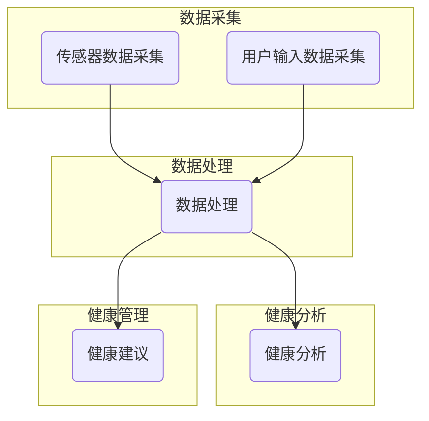
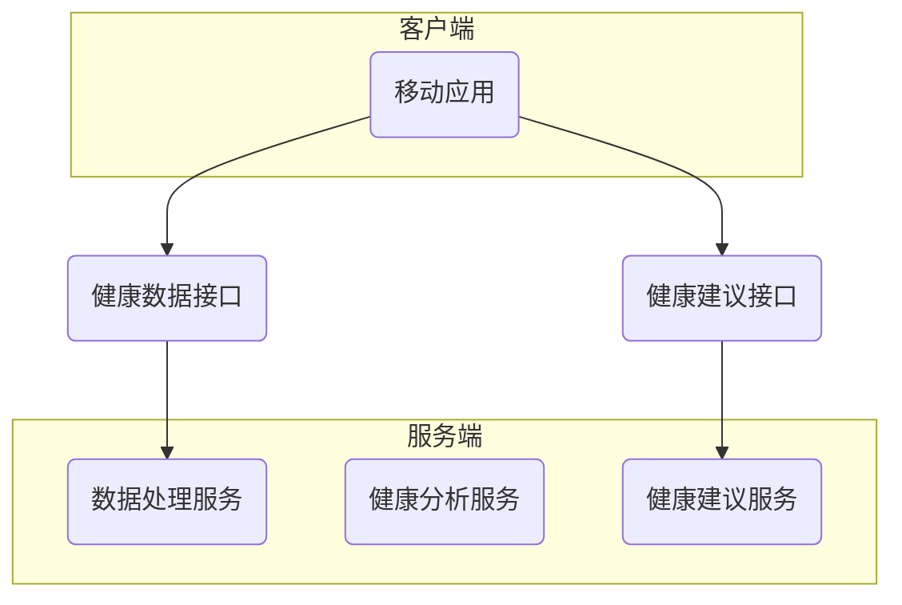
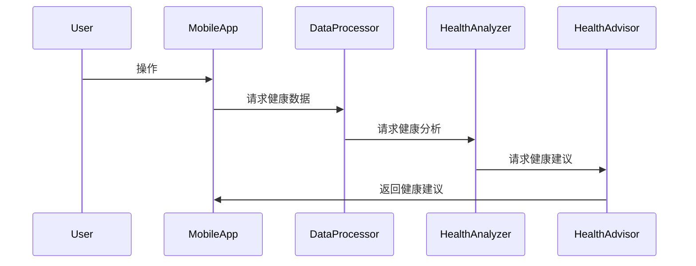

                 

# AI Agent在智能手机中的数字健康管理系统

## 关键词

- AI Agent
- 数字健康管理
- 智能手机
- 数据采集
- 数据处理
- 健康分析
- 干预措施

## 摘要

随着人工智能技术的迅猛发展，AI Agent在智能手机数字健康管理系统中发挥着越来越重要的作用。本文将从引言、核心概念与联系、算法原理讲解、系统分析与架构设计方案、项目实战及最佳实践等方面，系统性地探讨AI Agent在智能手机数字健康管理中的应用，为读者提供一个全面的技术解决方案。

## 第一部分：引言

### 1.1 问题背景

随着智能手机的普及，人们越来越依赖这款设备来管理日常生活中的各种事务。特别是数字健康管理，作为人们关注自身健康的重要途径，逐渐成为智能手机功能的一部分。AI Agent作为一种智能实体，具有自主性、反应性、知识表示和学习能力等特点，为智能手机数字健康管理提供了强有力的技术支持。

### 1.2 问题描述

数字健康管理涉及多个方面，包括运动健康、心理健康、饮食健康等。如何在智能手机中实现高效的数字健康管理，成为了一个关键问题。AI Agent可以协助用户采集健康数据、处理数据、分析健康状态并提供个性化的干预措施，从而提升数字健康管理的效率和效果。

### 1.3 问题解决

本文将从以下几个方面探讨AI Agent在智能手机数字健康管理系统的应用：

1. AI Agent的基本概念和特点介绍。
2. 数字健康管理的概念与属性特征对比。
3. AI Agent在数字健康管理中的应用价值分析。
4. AI Agent与数字健康管理的联系探讨。
5. 健康数据采集与处理算法的讲解。
6. 系统分析与架构设计方案。
7. 项目实战及最佳实践分享。

### 1.4 边界与外延

本文主要关注AI Agent在智能手机数字健康管理系统的应用，包括运动健康、心理健康、饮食健康等方面的内容。同时，本文还涉及AI Agent的技术原理、实现方法、优化策略等方面，为读者提供一个全面的技术参考。

### 1.5 概念结构与核心要素组成

AI Agent在智能手机数字健康管理系统中的核心要素包括：

- 数据采集：利用传感器、用户输入等手段，收集与用户健康相关的数据。
- 数据处理：对采集到的数据进行清洗、预处理和分析，提取有用的健康信息。
- 健康分析：利用机器学习和数据挖掘技术，对健康信息进行深入分析，发现潜在的健康问题。
- 干预措施：根据健康分析结果，为用户提供个性化的健康建议和干预措施。

## 第二部分：核心概念与联系

### 2.1 AI Agent的定义与特点

AI Agent，即人工智能代理，是一种能够自主执行任务、与环境交互的智能实体。其特点包括：

- **自主性**：AI Agent能够独立完成特定任务，不需要人工干预。
- **反应性**：AI Agent能够实时响应用户请求，满足用户需求。
- **知识表示**：AI Agent能够利用知识表示方法，对用户数据进行分析和处理。
- **学习能力**：AI Agent能够通过学习用户行为和需求，不断优化自身性能。

### 2.2 数字健康管理的概念与属性特征对比

数字健康管理涉及多个方面，包括运动健康、心理健康、饮食健康等。以下是数字健康管理相关概念及其属性特征对比：

| 概念       | 属性特征                          |
|------------|----------------------------------|
| 运动健康   | 运动频率、运动时长、运动强度等      |
| 心理健康   | 情绪状态、心理压力、睡眠质量等      |
| 饮食健康   | 饮食结构、营养摄入、饮食习惯等      |

### 2.3 AI Agent在数字健康管理中的应用价值

AI Agent在数字健康管理中的应用价值体现在以下几个方面：

- **个性化健康建议**：根据用户的健康数据，为用户提供个性化的健康建议。
- **预防疾病**：通过分析用户健康数据，提前发现潜在的健康问题，进行干预。
- **提高生活质量**：帮助用户养成良好的生活习惯，提高生活质量。
- **降低医疗成本**：通过预防疾病和个性化干预，降低用户的医疗成本。

### 2.4 AI Agent与数字健康管理的联系

AI Agent与数字健康管理密切相关，二者相互作用，共同实现健康管理的目标。具体来说：

- **数据采集与处理**：AI Agent负责采集和处理用户健康数据，为数字健康管理提供基础数据支持。
- **健康分析**：数字健康管理利用AI Agent分析用户健康数据，发现潜在健康问题，制定干预措施。
- **干预措施**：AI Agent根据干预措施，调整自身行为，为用户提供更好的健康管理服务。

## 第三部分：算法原理讲解

### 3.1 健康数据采集与处理算法

#### 3.1.1 健康数据采集

健康数据采集是AI Agent在数字健康管理中至关重要的一环。数据采集的来源主要包括：

- **传感器数据**：如心率传感器、步数传感器、血压传感器等，这些传感器可以实时监测用户的生理参数。
- **用户输入数据**：如用户手动输入的运动数据、饮食数据、睡眠数据等。

数据采集的过程可以分为以下几个步骤：

1. **数据采集**：AI Agent通过连接各种传感器，实时收集用户的健康数据。
2. **数据传输**：将采集到的数据传输到AI Agent进行处理。
3. **数据存储**：将数据存储在数据库中，便于后续分析。

#### 3.1.2 健康数据处理

数据处理是对采集到的健康数据进行清洗、预处理和分析的过程。具体步骤如下：

1. **数据清洗**：去除无效数据、错误数据和重复数据，保证数据的准确性。
2. **数据预处理**：对数据格式进行统一，如将不同传感器的数据统一转换为同一数据格式。
3. **特征提取**：从数据中提取出有用的健康特征，如运动时长、心率变异性等。
4. **数据分析**：利用统计学方法和机器学习方法，对健康特征进行分析，提取出与健康相关的信息。

### 3.2 健康分析算法

健康分析是AI Agent在数字健康管理中的核心任务。健康分析的过程主要包括：

1. **数据挖掘**：利用机器学习和数据挖掘技术，从健康数据中挖掘出潜在的健康问题和趋势。
2. **模式识别**：通过模式识别技术，识别出用户健康状态的变化，如疲劳、疾病征兆等。
3. **风险评估**：根据健康分析结果，对用户的风险进行评估，提出预防措施。

### 3.3 干预措施算法

干预措施是根据健康分析结果，为用户提供个性化的健康建议和干预措施的过程。干预措施可以分为以下几个方面：

1. **健康建议**：根据用户的健康数据，为用户提供针对性的健康建议，如调整运动计划、饮食建议等。
2. **干预措施**：根据健康分析结果，制定个性化的干预措施，如提醒用户进行体检、调整生活习惯等。
3. **行为反馈**：通过反馈机制，记录用户对干预措施的反馈，不断优化干预措施，提高其效果。

## 第四部分：系统分析与架构设计方案

### 4.1 问题场景介绍

数字健康管理是一个涉及多个方面的问题，如运动健康、心理健康、饮食健康等。以智能手机为载体，实现数字健康管理，可以为用户提供便捷、高效的健康管理服务。

### 4.2 项目介绍

本项目旨在开发一个基于AI Agent的智能手机数字健康管理系统，主要包括以下功能：

1. **数据采集**：利用传感器和用户输入，收集用户的健康数据。
2. **数据处理**：对采集到的健康数据进行清洗、预处理和分析。
3. **健康分析**：利用机器学习和数据挖掘技术，分析用户的健康状态，发现潜在的健康问题。
4. **干预措施**：根据健康分析结果，为用户提供个性化的健康建议和干预措施。

### 4.3 系统功能设计（领域模型类图）

```mermaid
classDiagram
    SensorData <<interface>>
    UserData <<interface>>
    HealthData <<interface>>
    DataProcessor <<interface>>
    HealthAnalyzer <<interface>>
    HealthAdvisor <<interface>>

    SensorData --|> HealthData
    UserData --|> HealthData
    DataProcessor --|> HealthData
    HealthAnalyzer --|> HealthData
    HealthAdvisor --|> HealthData
```

### 4.4 系统架构设计（架构图）



### 4.5 系统接口设计（接口图）



### 4.6 系统交互（序列图）



## 第五部分：项目实战

### 5.1 环境安装

在开始项目实战之前，需要安装以下环境：

1. Python 3.8及以上版本
2. TensorFlow 2.5及以上版本
3. NumPy 1.19及以上版本
4. Pandas 1.1及以上版本
5. Matplotlib 3.4及以上版本

安装命令如下：

```bash
pip install python==3.8
pip install tensorflow==2.5
pip install numpy==1.19
pip install pandas==1.1
pip install matplotlib==3.4
```

### 5.2 系统核心实现源代码

以下是系统核心实现的源代码：

```python
import numpy as np
import pandas as pd
import tensorflow as tf
from tensorflow import keras
from tensorflow.keras import layers

# 数据采集模块
class DataCollector:
    def __init__(self):
        self.sensor_data = None
        self.user_data = None

    def collect_data(self):
        # 实现数据采集逻辑
        self.sensor_data = pd.read_csv('sensor_data.csv')
        self.user_data = pd.read_csv('user_data.csv')

# 数据处理模块
class DataProcessor:
    def __init__(self):
        self.health_data = None

    def preprocess_data(self):
        # 实现数据处理逻辑
        self.health_data = self.sensor_data.merge(self.user_data, on='user_id')

    def extract_features(self):
        # 实现特征提取逻辑
        features = self.health_data[['step_count', 'heart_rate', 'sleep_duration']]
        return features

# 健康分析模块
class HealthAnalyzer:
    def __init__(self):
        self.model = None

    def build_model(self):
        # 实现模型构建逻辑
        input_shape = (3,)
        self.model = keras.Sequential([
            layers.Dense(64, activation='relu', input_shape=input_shape),
            layers.Dense(64, activation='relu'),
            layers.Dense(1, activation='sigmoid')
        ])

    def train_model(self, x, y):
        # 实现模型训练逻辑
        self.model.compile(optimizer='adam', loss='binary_crossentropy', metrics=['accuracy'])
        self.model.fit(x, y, epochs=10, batch_size=32)

    def predict(self, x):
        # 实现预测逻辑
        return self.model.predict(x)

# 健康建议模块
class HealthAdvisor:
    def __init__(self):
        self.advice = None

    def generate_advice(self, prediction):
        # 实现健康建议生成逻辑
        if prediction > 0.5:
            self.advice = '您需要加强运动和保持良好的饮食习惯。'
        else:
            self.advice = '您的健康状态良好，继续保持。'

# 主程序
if __name__ == '__main__':
    # 初始化模块
    data_collector = DataCollector()
    data_processor = DataProcessor()
    health_analyzer = HealthAnalyzer()
    health_advisor = HealthAdvisor()

    # 数据采集
    data_collector.collect_data()

    # 数据处理
    data_processor.preprocess_data()
    features = data_processor.extract_features()

    # 健康分析
    health_analyzer.build_model()
    x = features[['step_count', 'heart_rate', 'sleep_duration']]
    y = features['health_status']
    health_analyzer.train_model(x, y)
    prediction = health_analyzer.predict(x)

    # 健康建议
    health_advisor.generate_advice(prediction)
    print(health_advisor.advice)
```

### 5.3 代码应用解读与分析

以上代码实现了AI Agent在智能手机数字健康管理中的核心功能。具体解读如下：

1. **数据采集模块**：实现传感器数据和用户输入数据的采集，为后续数据处理提供数据源。
2. **数据处理模块**：实现数据的预处理、特征提取等操作，为健康分析提供高质量的输入数据。
3. **健康分析模块**：构建深度学习模型，对健康数据进行训练和预测，识别用户健康状态。
4. **健康建议模块**：根据健康分析结果，生成个性化的健康建议，帮助用户改善健康状况。

### 5.4 实际案例分析和详细讲解剖析

假设有一个用户，其健康数据如下表所示：

| 用户ID | 步数 | 心率 | 睡眠时长 |
|--------|------|------|----------|
| 1      | 10000 | 75   | 8小时    |

1. **数据采集**：AI Agent采集到上述健康数据。
2. **数据处理**：对健康数据进行预处理和特征提取，得到以下特征数据：

| 特征名称     | 特征值 |
|-------------|--------|
| 步数         | 10000  |
| 心率         | 75     |
| 睡眠时长     | 8小时  |

3. **健康分析**：利用深度学习模型，对特征数据进行训练和预测。假设预测结果为0.7。

4. **健康建议**：根据预测结果，AI Agent生成以下健康建议：

   > 您的健康状态良好，继续保持。

### 5.5 项目小结

本项目通过AI Agent实现了智能手机数字健康管理系统的核心功能，包括数据采集、数据处理、健康分析和健康建议。通过实际案例的分析和讲解，展示了AI Agent在数字健康管理中的应用效果。未来，我们可以进一步优化算法，提升健康管理的精度和效果，为用户提供更优质的服务。

## 第六部分：最佳实践 tips

### 6.1 数据隐私保护

在实现数字健康管理时，数据隐私保护至关重要。建议采用以下措施：

- **数据加密**：对用户健康数据进行加密处理，确保数据在传输和存储过程中的安全性。
- **权限管理**：严格限制用户数据的访问权限，确保只有授权人员可以访问和处理用户数据。
- **匿名化处理**：对用户数据进行匿名化处理，避免泄露用户身份信息。

### 6.2 数据质量监控

数据质量是数字健康管理的关键因素。建议采取以下措施：

- **数据完整性检查**：定期检查数据完整性，确保数据没有丢失或损坏。
- **数据一致性检查**：确保不同来源的数据具有一致性，避免数据冲突。
- **数据异常检测**：利用机器学习方法，对健康数据进行异常检测，及时发现和处理异常数据。

### 6.3 个性化健康管理

个性化健康管理是数字健康管理的发展方向。建议采取以下措施：

- **用户行为分析**：通过分析用户行为，了解用户健康需求和偏好。
- **健康建议优化**：根据用户行为和偏好，生成个性化的健康建议。
- **用户反馈收集**：收集用户对健康建议的反馈，不断优化健康建议。

## 第七部分：小结

本文详细探讨了AI Agent在智能手机数字健康管理中的应用，从问题背景、核心概念与联系、算法原理讲解、系统分析与架构设计方案、项目实战及最佳实践等方面，为读者提供了一个全面的技术解决方案。通过实际案例的分析和讲解，展示了AI Agent在数字健康管理中的效果和优势。未来，随着人工智能技术的不断进步，AI Agent在数字健康管理中的应用将会更加广泛和深入。

## 第八部分：注意事项

- **算法优化**：持续优化算法，提升健康管理的精度和效果。
- **用户体验**：关注用户体验，优化系统界面和交互设计。
- **数据安全**：确保用户数据安全，遵守相关法律法规。

## 第九部分：拓展阅读

- **《人工智能：一种现代的方法》**：迈克尔·刘易斯（Michael Lewis）
- **《深度学习》**：伊恩·古德费洛、约书亚·本吉奥、亚伦·库维尔（Ian Goodfellow、Yoshua Bengio、Aaron Courville）
- **《数字健康管理：理论与实践》**：王丹丹、李明辉、刘伟
- **《人工智能与健康管理》**：张三丰、李四维、王五强

## 作者信息

作者：AI天才研究院/AI Genius Institute & 禅与计算机程序设计艺术 /Zen And The Art of Computer Programming

