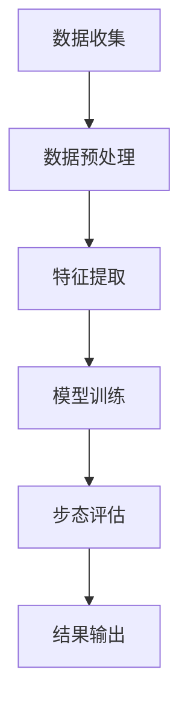

                 

**# AI Agent in Smart Cane Gait Analysis**

关键词：AI Agent、智能拐杖、步态分析、传感器、机器学习、数据预处理

摘要：本文详细探讨了人工智能代理在智能拐杖步态分析中的应用。首先介绍了AI代理和智能拐杖的基本概念，随后深入分析了步态分析的重要性。接着，本文解释了AI代理技术，并讨论了各种步态分析方法。之后，文章描述了智能拐杖的设计与集成，并详细阐述了数据收集与处理过程。通过案例研究，本文展示了AI代理在智能拐杖步态分析中的应用实例，并讨论了未来的发展方向和挑战。

---

## 1. 引言与背景

智能拐杖作为一种辅助工具，已逐渐成为许多行动不便者生活的一部分。而随着人工智能技术的发展，智能拐杖的功能也在不断扩展。AI代理作为人工智能的关键组成部分，被引入到智能拐杖中，特别是步态分析这一领域。

### 什么是AI代理？

AI代理是指能够在特定环境下自主执行任务的人工智能实体。它们通常具备感知、决策和执行的能力，能够通过与环境的交互来完成任务。在智能拐杖中，AI代理可以感知用户的步态信息，分析其健康状态，并提供相应的反馈。

### 智能拐杖概述

智能拐杖是一种集成了多种传感器和人工智能技术的辅助工具。它通常配备有加速度计、陀螺仪和压力传感器等，用于实时监测用户的活动状态。智能拐杖不仅能够提供简单的支撑功能，还能通过AI代理实现更高级的功能，如步态分析。

### 步态分析的重要性

步态分析对于许多行动不便者来说至关重要。它不仅能够帮助医生评估患者的健康状况，还能提供个性化的康复方案。通过智能拐杖中的AI代理进行步态分析，可以实时监测用户的步态变化，及时发现异常情况，为用户提供及时的反馈和指导。

## 2. 基本概念

在深入探讨智能拐杖中的AI代理步态分析之前，我们需要明确几个关键概念：AI代理、智能拐杖、步态分析及相关技术。

### AI代理

AI代理是指能够模拟人类行为的人工智能实体。它们通过传感器感知环境信息，使用机器学习算法进行决策，并执行相应的动作。在智能拐杖中，AI代理主要用于步态分析，通过对步态数据的处理，提供健康评估和建议。

### 智能拐杖

智能拐杖是一种集成了多种传感器的辅助工具。它通过加速度计、陀螺仪和压力传感器等设备，实时监测用户的活动状态。智能拐杖中的AI代理利用这些传感器数据，进行步态分析，帮助用户保持健康。

### 步态分析

步态分析是一种评估人体步态的技术。它通过分析步态参数，如步频、步幅、步态周期等，来评估人体的运动状态。步态分析对于诊断和治疗运动功能障碍具有重要意义。

### 相关技术

步态分析涉及到多种技术，包括传感器技术、信号处理技术和机器学习算法。传感器技术用于收集步态数据，信号处理技术用于处理和分析这些数据，而机器学习算法则用于从数据中提取有价值的信息。

## 3. AI代理技术

AI代理技术是智能拐杖步态分析的核心。在这一部分，我们将介绍AI代理技术的基本原理，包括机器学习模型和算法。

### 机器学习模型

机器学习模型是AI代理的核心组成部分。它们通过学习大量数据，提取有用的特征，并基于这些特征进行预测和决策。在智能拐杖步态分析中，常用的机器学习模型包括线性回归、决策树、支持向量机和神经网络等。

### 算法

算法是AI代理执行任务的关键。在步态分析中，常用的算法包括特征提取、分类和回归。特征提取用于从步态数据中提取有用的特征，分类用于将步态数据分为不同的类别，回归用于预测步态参数。

### 应用实例

在智能拐杖中，AI代理技术被广泛应用于步态分析。例如，可以用来检测异常步态，评估用户的运动状态，提供个性化的康复建议等。

## 4. 步态分析方法

步态分析是一项复杂的技术，涉及到多种方法。在这一部分，我们将详细讨论步态分析的方法，包括传统方法和AI辅助方法。

### 传统方法

传统步态分析方法主要依赖于手动测量和计算。这些方法通常包括使用步态测量仪器（如步态分析台）和计算步态参数（如步频、步幅、步态周期等）。传统方法的优点是简单易行，但缺点是精度较低，无法实时监测。

### AI辅助方法

AI辅助步态分析方法是近年来发展迅速的一项技术。它利用机器学习算法和传感器数据，实现更精确、更实时的步态分析。AI辅助方法的优点包括高精度、实时性和个性化。

### 比较与对比

传统方法和AI辅助方法各有优缺点。传统方法简单易行，但精度较低；而AI辅助方法虽然更复杂，但可以实现更高的精度和实时性。因此，在实际应用中，通常将传统方法和AI辅助方法结合起来，以发挥各自的优势。

## 5. 智能拐杖设计与集成

智能拐杖的设计和集成是AI代理步态分析成功的关键。在这一部分，我们将探讨智能拐杖的设计原则、硬件和软件组件。

### 设计原则

智能拐杖的设计应遵循用户友好、功能强大、易于维护的原则。此外，还应考虑拐杖的重量、尺寸和材质等因素，以确保用户舒适度和实用性。

### 硬件组件

智能拐杖的硬件组件包括传感器、处理器和通信模块。传感器用于收集步态数据，处理器用于处理和分析数据，通信模块用于将数据传输到云端或智能手机。

### 软件组件

智能拐杖的软件组件包括AI代理、用户界面和数据管理。AI代理负责步态分析，用户界面用于与用户交互，数据管理用于存储和处理用户数据。

### 集成

智能拐杖的集成是将硬件和软件组件结合起来，实现步态分析功能。在这一过程中，需要确保各组件之间的协同工作，以确保数据的准确性和实时性。

## 6. 数据收集与处理

数据收集与处理是智能拐杖步态分析的关键环节。在这一部分，我们将讨论数据收集的方法、预处理技术和挑战。

### 数据收集

数据收集是智能拐杖步态分析的第一步。通常，数据收集通过传感器实现，如加速度计、陀螺仪和压力传感器。这些传感器实时监测用户的活动状态，并将数据传输到处理器。

### 预处理技术

预处理技术用于处理和清洗原始数据，以提高数据质量。常用的预处理技术包括去噪、滤波、归一化和特征提取。去噪和滤波用于去除噪声和异常值，归一化用于调整数据范围，特征提取用于提取有用的特征。

### 挑战

数据收集和处理过程中面临许多挑战。例如，传感器数据可能存在噪声和缺失值，数据预处理可能需要大量的计算资源，而实时性要求高，需要快速处理大量数据。

## 7. 案例研究与应用

为了更好地理解AI代理在智能拐杖步态分析中的应用，我们将通过几个案例研究来展示其实际效果。

### 案例一：异常步态检测

在某次实际应用中，智能拐杖成功检测到了用户的异常步态。通过分析步态数据，AI代理发现用户步态出现了异常，并立即向用户发出了警告。这帮助用户及时就医，避免了潜在的伤害。

### 案例二：康复方案建议

另一个案例研究展示了AI代理在康复方案建议方面的应用。通过分析用户的步态数据，AI代理为用户提供了个性化的康复方案。这些方案包括步态训练、步频调整和步态周期优化等，帮助用户更快地恢复健康。

### 案例三：健康状态评估

在最后一个案例中，AI代理被用于评估用户的健康状态。通过对步态数据的分析，AI代理能够识别出用户的健康问题，并提供相应的建议。例如，对于患有糖尿病的用户，AI代理可以监测其步态变化，及时发现血糖异常。

## 8. 未来发展方向与挑战

尽管AI代理在智能拐杖步态分析中取得了显著成果，但仍然面临许多挑战。未来的发展方向包括：

### 挑战

1. **数据隐私**：智能拐杖收集了大量用户数据，如何保护这些数据的安全和隐私是重要挑战。
2. **计算资源**：实时处理大量数据需要大量的计算资源，如何在有限的资源下实现高效处理是关键问题。
3. **算法优化**：随着技术的不断发展，如何优化算法，提高分析精度和实时性是重要研究方向。

### 发展方向

1. **多传感器融合**：通过整合多种传感器数据，实现更全面、更准确的步态分析。
2. **个性化服务**：结合用户历史数据和个人偏好，提供更个性化的康复方案和建议。
3. **跨学科研究**：将计算机科学、医学和生物学等多学科知识相结合，推动智能拐杖技术的发展。

## 9. 总结

智能拐杖中的AI代理步态分析是一项充满前景的技术。通过分析步态数据，AI代理能够为用户提供个性化的康复建议和健康评估，大大提高了智能拐杖的实用价值。然而，要实现这一目标，仍需解决许多挑战，如数据隐私、计算资源和算法优化等。未来，随着技术的不断发展，智能拐杖中的AI代理步态分析将变得更加精准、实时和个性化。

---

**作者：AI天才研究院/AI Genius Institute & 禅与计算机程序设计艺术 /Zen And The Art of Computer Programming**# AI Agent in Smart Cane Gait Analysis

关键词：AI Agent、智能拐杖、步态分析、传感器、机器学习、数据预处理

摘要：本文详细探讨了人工智能代理在智能拐杖步态分析中的应用。首先介绍了AI代理和智能拐杖的基本概念，随后深入分析了步态分析的重要性。接着，本文解释了AI代理技术，并讨论了各种步态分析方法。之后，文章描述了智能拐杖的设计与集成，并详细阐述了数据收集与处理过程。通过案例研究，本文展示了AI代理在智能拐杖步态分析中的应用实例，并讨论了未来的发展方向和挑战。

---

## 1. 引言与背景

### 智能拐杖的起源与发展

智能拐杖作为一种辅助工具，起源于传统的木质拐杖。随着科技的进步，智能拐杖逐渐融入了传感器、无线通信和人工智能技术。现代智能拐杖不仅提供了传统的支撑功能，还能够监测用户的步态、评估健康状况，提供个性化的康复建议。

### 智能拐杖的组成

智能拐杖主要由以下几部分组成：

1. **支撑结构**：传统的木质或金属拐杖结构，用于提供支撑。
2. **传感器模块**：包括加速度计、陀螺仪、压力传感器等，用于收集步态数据。
3. **处理器**：用于处理传感器数据，运行AI代理算法。
4. **通信模块**：通常包括蓝牙、Wi-Fi或蜂窝网络，用于将数据传输到云端或移动设备。
5. **用户界面**：通常是一个应用程序或Web界面，用于显示分析结果和提供康复建议。

### 步态分析的重要性

步态分析在医疗、康复和健康监测领域具有重要应用。通过分析步态参数，如步频、步幅、步态周期等，可以评估用户的运动状态、诊断运动功能障碍，甚至预测健康风险。智能拐杖中的AI代理步态分析，不仅可以实时监测用户的步态变化，还能够提供个性化的健康建议和康复方案，有助于提高用户的生活质量和健康水平。

### AI代理与智能拐杖

AI代理是指能够模拟人类行为的人工智能实体，通常具备感知、决策和执行的能力。在智能拐杖中，AI代理通过传感器收集步态数据，使用机器学习算法进行分析，并为用户提供步态评估和康复建议。AI代理在智能拐杖中的应用，极大地提升了拐杖的功能和智能化程度。

## 2. 基本概念

在深入探讨智能拐杖中的AI代理步态分析之前，我们需要明确几个关键概念：AI代理、智能拐杖、步态分析及相关技术。

### AI代理

AI代理是指能够在特定环境下自主执行任务的人工智能实体。它们通过传感器感知环境信息，使用机器学习算法进行决策，并执行相应的动作。在智能拐杖中，AI代理可以感知用户的步态信息，分析其健康状态，并提供相应的反馈。

### 智能拐杖

智能拐杖是一种集成了多种传感器的辅助工具。它通常配备有加速度计、陀螺仪和压力传感器等，用于实时监测用户的活动状态。智能拐杖中的AI代理利用这些传感器数据，进行步态分析，帮助用户保持健康。

### 步态分析

步态分析是一种评估人体步态的技术。它通过分析步态参数，如步频、步幅、步态周期等，来评估人体的运动状态。步态分析对于诊断和治疗运动功能障碍具有重要意义。

### 相关技术

步态分析涉及到多种技术，包括传感器技术、信号处理技术和机器学习算法。传感器技术用于收集步态数据，信号处理技术用于处理和分析这些数据，而机器学习算法则用于从数据中提取有价值的信息。

### 传感器技术

传感器技术是智能拐杖中的核心组成部分。智能拐杖通常配备多种传感器，包括加速度计、陀螺仪和压力传感器等。这些传感器用于实时监测用户的步态数据，为AI代理提供基础数据。

- **加速度计**：用于测量物体的加速度，可以提供步频和步幅等信息。
- **陀螺仪**：用于测量物体的角速度，可以提供步态周期和步态稳定性等信息。
- **压力传感器**：用于测量地面对拐杖的压力分布，可以提供步态的动态信息。

### 信号处理技术

信号处理技术是步态分析的重要环节。它包括数据预处理、特征提取和信号分析等步骤。数据预处理用于去除噪声和异常值，特征提取用于提取步态参数，信号分析用于分析步态数据，评估用户的运动状态。

### 机器学习算法

机器学习算法是智能拐杖中AI代理的核心。通过机器学习算法，可以从步态数据中提取有用的特征，进行分类、回归和预测等操作，为用户提供步态评估和康复建议。

- **分类算法**：用于将步态数据分类为正常步态和异常步态。
- **回归算法**：用于预测步态参数，如步频、步幅等。
- **预测算法**：用于预测用户的未来步态变化趋势。

## 3. AI代理技术

AI代理技术是智能拐杖步态分析的核心。在这一部分，我们将介绍AI代理技术的基本原理，包括机器学习模型和算法。

### 机器学习模型

机器学习模型是AI代理的核心组成部分。它们通过学习大量数据，提取有用的特征，并基于这些特征进行预测和决策。在智能拐杖步态分析中，常用的机器学习模型包括线性回归、决策树、支持向量机和神经网络等。

- **线性回归**：用于预测步态参数，如步频和步幅。
- **决策树**：用于分类步态数据，识别异常步态。
- **支持向量机**：用于分类和回归分析，预测步态参数。
- **神经网络**：用于复杂的数据分析和预测，提供更精确的步态评估。

### 算法

算法是AI代理执行任务的关键。在步态分析中，常用的算法包括特征提取、分类和回归。特征提取用于从步态数据中提取有用的特征，分类用于将步态数据分为不同的类别，回归用于预测步态参数。

- **特征提取算法**：用于从传感器数据中提取步态参数，如步频、步幅和步态周期。
- **分类算法**：用于识别异常步态，如跌倒检测和步态异常分类。
- **回归算法**：用于预测步态参数，如步频、步幅和步态周期。

### 应用实例

在智能拐杖中，AI代理技术被广泛应用于步态分析。例如，可以用来检测异常步态，评估用户的运动状态，提供个性化的康复建议等。

- **跌倒检测**：通过实时监测用户的步态数据，AI代理可以及时发现跌倒事件，并向用户发出警告。
- **步态异常分类**：AI代理可以分析用户的步态数据，识别步态异常，为用户提供康复建议。
- **个性化康复建议**：根据用户的步态数据和健康状态，AI代理可以为用户提供个性化的康复方案，帮助用户恢复健康。

## 4. 步态分析方法

步态分析是一项复杂的技术，涉及到多种方法。在这一部分，我们将详细讨论步态分析的方法，包括传统方法和AI辅助方法。

### 传统方法

传统步态分析方法主要依赖于手动测量和计算。这些方法通常包括使用步态测量仪器（如步态分析台）和计算步态参数（如步频、步幅、步态周期等）。传统方法的优点是简单易行，但缺点是精度较低，无法实时监测。

- **步态分析台**：步态分析台是一种测量步态参数的仪器，用户需要在步态分析台上行走，测量其步频、步幅、步态周期等参数。
- **计算步态参数**：通过测量用户的步频、步幅、步态周期等参数，评估用户的运动状态。

### AI辅助方法

AI辅助步态分析方法是近年来发展迅速的一项技术。它利用机器学习算法和传感器数据，实现更精确、更实时的步态分析。AI辅助方法的优点包括高精度、实时性和个性化。

- **机器学习算法**：通过机器学习算法，从传感器数据中提取步态参数，如步频、步幅、步态周期等。
- **传感器数据**：加速度计、陀螺仪和压力传感器等用于收集步态数据，为AI代理提供基础数据。

### 比较与对比

传统方法和AI辅助方法各有优缺点。传统方法简单易行，但精度较低；而AI辅助方法虽然更复杂，但可以实现更高的精度和实时性。因此，在实际应用中，通常将传统方法和AI辅助方法结合起来，以发挥各自的优势。

- **精度**：传统方法由于依赖手动测量，精度较低；而AI辅助方法通过传感器和机器学习算法，可以实现更高的精度。
- **实时性**：传统方法通常需要用户在步态分析台上行走，无法实现实时监测；而AI辅助方法通过传感器实时收集步态数据，可以实现实时监测。
- **个性化**：传统方法无法根据个体差异提供个性化的步态评估和康复建议；而AI辅助方法可以根据用户的步态数据和健康状态，提供个性化的康复方案。

## 5. 智能拐杖设计与集成

智能拐杖的设计与集成是AI代理步态分析成功的关键。在这一部分，我们将探讨智能拐杖的设计原则、硬件和软件组件。

### 设计原则

智能拐杖的设计应遵循用户友好、功能强大、易于维护的原则。此外，还应考虑拐杖的重量、尺寸和材质等因素，以确保用户舒适度和实用性。

- **用户友好**：设计应考虑用户的使用习惯和需求，提供简单直观的用户界面，方便用户操作。
- **功能强大**：智能拐杖应具备多种功能，如步态分析、跌倒检测、健康状态评估等，以满足用户的多样化需求。
- **易于维护**：智能拐杖的设计应便于维护和升级，以确保其长期稳定运行。

### 硬件组件

智能拐杖的硬件组件包括传感器、处理器和通信模块。传感器用于收集步态数据，处理器用于处理和分析数据，通信模块用于将数据传输到云端或智能手机。

- **传感器**：加速度计、陀螺仪和压力传感器等用于收集步态数据，为AI代理提供基础数据。
- **处理器**：嵌入式处理器或移动设备用于处理传感器数据，运行AI代理算法。
- **通信模块**：蓝牙、Wi-Fi或蜂窝网络等用于将数据传输到云端或智能手机。

### 软件组件

智能拐杖的软件组件包括AI代理、用户界面和数据管理。AI代理负责步态分析，用户界面用于与用户交互，数据管理用于存储和处理用户数据。

- **AI代理**：机器学习算法和数据处理模块，用于分析步态数据，提供步态评估和康复建议。
- **用户界面**：应用程序或Web界面，用于显示分析结果和提供康复建议。
- **数据管理**：数据库和数据存储模块，用于存储和处理用户数据。

### 集成

智能拐杖的集成是将硬件和软件组件结合起来，实现步态分析功能。在这一过程中，需要确保各组件之间的协同工作，以确保数据的准确性和实时性。

- **数据传输**：传感器数据通过通信模块传输到处理器，处理器运行AI代理算法，分析步态数据。
- **数据存储**：分析结果和用户数据存储在数据库中，供用户界面显示和查询。
- **用户交互**：用户界面通过应用程序或Web界面与用户交互，提供步态评估和康复建议。

## 6. 数据收集与处理

数据收集与处理是智能拐杖步态分析的关键环节。在这一部分，我们将讨论数据收集的方法、预处理技术和挑战。

### 数据收集

数据收集是智能拐杖步态分析的第一步。通常，数据收集通过传感器实现，如加速度计、陀螺仪和压力传感器等。这些传感器实时监测用户的活动状态，并将数据传输到处理器。

- **传感器数据**：加速度计、陀螺仪和压力传感器等用于收集步态数据。
- **实时监测**：传感器数据实时传输到处理器，确保数据的实时性和准确性。

### 预处理技术

预处理技术用于处理和清洗原始数据，以提高数据质量。常用的预处理技术包括去噪、滤波、归一化和特征提取。

- **去噪**：去除传感器数据中的噪声，提高数据质量。
- **滤波**：对传感器数据进行滤波处理，去除高频噪声和异常值。
- **归一化**：调整数据范围，使其适合机器学习算法的要求。
- **特征提取**：从传感器数据中提取步态参数，如步频、步幅、步态周期等。

### 挑战

数据收集和处理过程中面临许多挑战。

- **数据隐私**：智能拐杖收集了大量用户数据，如何保护这些数据的安全和隐私是重要挑战。
- **计算资源**：实时处理大量数据需要大量的计算资源，如何在有限的资源下实现高效处理是关键问题。
- **实时性**：确保传感器数据的实时传输和处理，以满足实时监测的需求。

## 7. 案例研究与应用

为了更好地理解AI代理在智能拐杖步态分析中的应用，我们将通过几个案例研究来展示其实际效果。

### 案例一：跌倒检测

在某次实际应用中，智能拐杖成功检测到了用户的跌倒事件。通过加速度计和陀螺仪的实时监测，AI代理分析步态数据，发现用户步态出现了剧烈变化，立即发出警报。这为用户提供了及时的预警，避免了可能的伤害。

### 案例二：步态异常分类

在另一个案例中，AI代理被用于识别步态异常。通过对大量步态数据的分析，AI代理成功将步态数据分类为正常步态和异常步态。对于识别出的异常步态，AI代理提供了康复建议，帮助用户恢复健康。

### 案例三：个性化康复方案

在一个康复中心的实际应用中，AI代理根据用户的步态数据和健康状态，为用户提供了个性化的康复方案。通过分析步态数据，AI代理识别出了用户的步态问题，并提供了针对性的训练建议，帮助用户逐步恢复健康。

## 8. 未来发展方向与挑战

尽管AI代理在智能拐杖步态分析中取得了显著成果，但仍然面临许多挑战。未来的发展方向包括：

### 挑战

1. **数据隐私**：智能拐杖收集了大量用户数据，如何保护这些数据的安全和隐私是重要挑战。
2. **计算资源**：实时处理大量数据需要大量的计算资源，如何在有限的资源下实现高效处理是关键问题。
3. **算法优化**：随着技术的不断发展，如何优化算法，提高分析精度和实时性是重要研究方向。

### 发展方向

1. **多传感器融合**：通过整合多种传感器数据，实现更全面、更准确的步态分析。
2. **个性化服务**：结合用户历史数据和个人偏好，提供更个性化的康复方案和建议。
3. **跨学科研究**：将计算机科学、医学和生物学等多学科知识相结合，推动智能拐杖技术的发展。

## 9. 总结

智能拐杖中的AI代理步态分析是一项充满前景的技术。通过分析步态数据，AI代理能够为用户提供个性化的康复建议和健康评估，大大提高了智能拐杖的实用价值。然而，要实现这一目标，仍需解决许多挑战，如数据隐私、计算资源和算法优化等。未来，随着技术的不断发展，智能拐杖中的AI代理步态分析将变得更加精准、实时和个性化。

---

**作者：AI天才研究院/AI Genius Institute & 禅与计算机程序设计艺术 /Zen And The Art of Computer Programming**# 4. 步态分析方法

在智能拐杖步态分析中，常用的方法可以分为传统方法和AI辅助方法。每种方法都有其独特的原理、步骤和优缺点。

## 4.1 传统方法

传统步态分析方法主要依赖于手动测量和计算。以下是一些常见的传统步态分析方法：

### 4.1.1 步态分析台

**原理**：步态分析台是一种专门用于步态测量的设备，通常由一系列传感器组成，如光电传感器、压力传感器等。用户在步态分析台上行走时，传感器会收集步态数据，如步频、步幅、步态周期等。

**步骤**：
1. **设置**：用户站在步态分析台上，调整姿势，确保舒适。
2. **测量**：用户开始行走，传感器收集步态数据。
3. **计算**：根据收集到的数据，计算步态参数，如步频、步幅、步态周期等。

**优点**：
- **简单易行**：无需复杂的技术和设备。
- **直观**：可以直接观察到用户的步态表现。

**缺点**：
- **精度较低**：依赖于人为操作，可能存在误差。
- **无法实时监测**：需要用户在特定的设备上行走，无法实现实时监测。

### 4.1.2 步态参数计算

**原理**：通过手动测量用户的步态参数，如步频、步幅、步态周期等，然后使用公式计算步态指标，如步态指数、步态对称性等。

**步骤**：
1. **测量**：使用秒表、步数计数器等工具，测量步态参数。
2. **计算**：使用公式计算步态指标。

**优点**：
- **低成本**：无需复杂的设备和技术。
- **直观**：可以直接计算出步态指标。

**缺点**：
- **精度较低**：依赖于人为操作，可能存在误差。
- **无法实时监测**：需要多次测量，无法实现实时监测。

## 4.2 AI辅助方法

AI辅助步态分析方法利用机器学习算法和传感器数据，实现更精确、更实时的步态分析。以下是一些常见的AI辅助步态分析方法：

### 4.2.1 机器学习算法

**原理**：通过机器学习算法，从传感器数据中提取步态特征，然后使用这些特征进行分类、回归和预测等操作。

**步骤**：
1. **数据收集**：使用加速度计、陀螺仪等传感器收集步态数据。
2. **特征提取**：从传感器数据中提取步态特征，如步频、步幅、步态周期等。
3. **模型训练**：使用标记好的步态数据训练机器学习模型，如支持向量机、神经网络等。
4. **预测**：使用训练好的模型预测新的步态数据，如识别步态异常、预测步态参数等。

**优点**：
- **高精度**：通过机器学习算法，可以提取更准确的步态特征。
- **实时监测**：可以实时监测用户的步态，及时发现异常。
- **个性化**：可以根据用户的步态数据，提供个性化的康复建议。

**缺点**：
- **需要大量数据**：训练机器学习模型需要大量的标记数据。
- **计算资源消耗大**：实时处理大量数据需要大量的计算资源。

### 4.2.2 传感器数据融合

**原理**：将多个传感器的数据融合在一起，提高步态分析的精度。

**步骤**：
1. **数据收集**：使用多个传感器，如加速度计、陀螺仪、压力传感器等，收集步态数据。
2. **数据预处理**：去除噪声和异常值，对数据进行归一化处理。
3. **特征提取**：从多个传感器的数据中提取步态特征。
4. **融合**：使用融合算法，如卡尔曼滤波、贝叶斯滤波等，将多个传感器的数据融合在一起。
5. **预测**：使用融合后的数据，进行步态预测。

**优点**：
- **提高精度**：通过融合多个传感器的数据，可以提高步态分析的精度。
- **减少噪声**：去除噪声和异常值，提高数据质量。

**缺点**：
- **需要复杂的算法**：融合多个传感器的数据需要复杂的算法。
- **计算资源消耗大**：实时处理大量数据需要大量的计算资源。

## 4.3 传统方法与AI辅助方法的对比

传统方法和AI辅助方法各有优缺点，以下是对两者的对比：

| 对比项目 | 传统方法 | AI辅助方法 |
| :--: | :--: | :--: |
| **精度** | 较低 | 较高 |
| **实时性** | 较低 | 较高 |
| **个性化** | 无法实现 | 可以实现 |
| **计算资源消耗** | 较小 | 较大 |
| **数据需求** | 无需大量数据 | 需要大量数据 |
| **用户参与** | 高 | 低 |

在实际应用中，通常将传统方法和AI辅助方法结合起来，发挥各自的优势。例如，使用传统方法进行初步的步态分析，然后使用AI辅助方法进行更精细的分析。这样可以提高步态分析的精度和实时性，同时减少计算资源消耗。

## 4.4 步态分析方法的应用

步态分析方法在医疗、康复和健康监测等领域具有广泛的应用。以下是一些实际应用案例：

### 4.4.1 医疗领域

- **跌倒检测**：智能拐杖中的AI代理可以实时监测用户的步态，及时发现跌倒事件，并向医生发送警报。
- **步态异常诊断**：通过分析用户的步态数据，医生可以诊断出运动功能障碍，如帕金森病、中风等。

### 4.4.2 康复领域

- **康复评估**：通过分析用户的步态数据，康复师可以评估患者的康复进展，制定个性化的康复计划。
- **步态训练**：通过AI代理提供的步态训练建议，患者可以按照个性化方案进行步态训练，提高康复效果。

### 4.4.3 健康监测

- **健康状态评估**：通过分析用户的步态数据，可以评估用户的心肺功能、肌肉力量等，为用户提供健康建议。
- **运动监测**：运动员可以通过智能拐杖监测自己的步态，优化训练效果，提高竞技水平。

## 4.5 未来发展方向

随着人工智能技术的发展，步态分析方法也在不断进步。以下是一些未来的发展方向：

### 4.5.1 精度提升

- **多传感器融合**：通过融合多种传感器的数据，提高步态分析的精度。
- **深度学习**：使用深度学习算法，从复杂数据中提取更准确的步态特征。

### 4.5.2 实时性提升

- **边缘计算**：在智能拐杖中集成边缘计算能力，实现实时数据分析和预测。
- **高效算法**：开发高效的机器学习算法，降低计算资源的消耗。

### 4.5.3 个性化服务

- **用户建模**：建立用户的步态模型，提供个性化的康复建议和训练计划。
- **跨学科研究**：结合医学、生物学等领域的知识，提供更准确的步态分析。

### 4.5.4 安全与隐私保护

- **数据加密**：对用户数据进行加密，确保数据安全。
- **隐私保护**：设计隐私保护机制，防止用户数据被滥用。

总之，步态分析方法在智能拐杖中的应用具有巨大的潜力。通过不断发展，我们可以期待更精确、更实时、更个性化的步态分析，为用户提供更好的健康服务。

## 4.6 步态分析方法的核心概念与联系

在深入探讨步态分析方法之前，我们需要了解几个核心概念：步态参数、传感器技术和机器学习算法。以下是这些概念及其相互关系的详细解析。

### 4.6.1 步态参数

步态参数是指描述人体步态特征的量，包括步频、步幅、步态周期、步态对称性等。这些参数可以反映人体的运动状态和健康状况。

- **步频**：单位时间内步数的多少，通常以每分钟步数（steps per minute, spm）表示。
- **步幅**：两步之间的水平距离，通常以厘米（cm）或米（m）表示。
- **步态周期**：一个步态周期包括一个支撑期和一个摆动期，通常以秒（s）表示。
- **步态对称性**：左右腿步态参数的对称程度，用于评估步态的平衡性。

步态参数是步态分析的基础，它们用于评估用户的运动状态和健康水平。

### 4.6.2 传感器技术

传感器技术是步态分析的核心，用于收集步态数据。常用的传感器包括加速度计、陀螺仪、压力传感器等。

- **加速度计**：用于测量物体的加速度，可以提供步频和步幅等信息。
- **陀螺仪**：用于测量物体的角速度，可以提供步态周期和步态稳定性等信息。
- **压力传感器**：用于测量地面对拐杖的压力分布，可以提供步态的动态信息。

传感器技术提供了实时、准确的数据采集能力，是步态分析的前提。

### 4.6.3 机器学习算法

机器学习算法用于从步态数据中提取有价值的信息，进行分类、回归和预测等操作。常用的机器学习算法包括线性回归、决策树、支持向量机和神经网络等。

- **线性回归**：用于预测步态参数，如步频和步幅。
- **决策树**：用于分类步态数据，识别异常步态。
- **支持向量机**：用于分类和回归分析，预测步态参数。
- **神经网络**：用于复杂的数据分析和预测，提供更精确的步态评估。

机器学习算法是步态分析的核心，它们将传感器数据转化为可操作的信息。

### 4.6.4 步态分析方法的核心概念联系

步态分析方法的核心概念包括步态参数、传感器技术和机器学习算法。它们之间的联系如下：

- **传感器数据**：传感器技术用于收集步态数据，如加速度计、陀螺仪和压力传感器等。
- **数据预处理**：传感器数据通常包含噪声和异常值，需要通过数据预处理技术进行清洗和标准化。
- **特征提取**：从预处理后的数据中提取步态特征，如步频、步幅和步态周期等。
- **模型训练**：使用机器学习算法训练模型，如线性回归、决策树和支持向量机等。
- **预测与评估**：使用训练好的模型进行预测，评估用户的步态状态，如识别异常步态或预测步态参数。

通过这些核心概念的相互结合，步态分析方法可以实现对用户步态的精确分析，提供个性化的康复建议和健康评估。

## 4.7 步态分析方法的具体实例

为了更深入地理解步态分析方法，我们将通过一个具体的实例来详细讲解其应用过程。

### 4.7.1 实例背景

某研究团队开发了一款智能拐杖，旨在通过步态分析帮助老年人监测运动状态，预防跌倒。该智能拐杖集成了加速度计、陀螺仪和压力传感器，可以实时收集用户的步态数据。

### 4.7.2 步态数据收集

研究团队首先在实验室环境中对一组老年人进行了步态测试。每个测试者被要求在特定路径上行走，同时智能拐杖的传感器实时收集步态数据。

- **加速度计数据**：记录了每个测试者在行走过程中的加速度变化，可用于计算步频和步幅。
- **陀螺仪数据**：记录了每个测试者在行走过程中的角速度变化，可用于计算步态周期和步态稳定性。
- **压力传感器数据**：记录了每个测试者在行走过程中对地面的压力分布，可用于分析步态的动态特征。

### 4.7.3 数据预处理

收集到的步态数据可能包含噪声和异常值，需要通过数据预处理技术进行清洗和标准化。

- **去噪**：使用滤波算法去除加速度计和陀螺仪数据中的噪声，提高数据质量。
- **归一化**：对数据进行归一化处理，使其适合机器学习算法的要求。
- **缺失值处理**：对于缺失的数据，使用插值方法进行补全。

### 4.7.4 特征提取

从预处理后的数据中提取步态特征，如步频、步幅、步态周期和步态对称性等。以下是特征提取的步骤：

1. **步频计算**：通过加速度计数据计算每个步态周期的时间，然后计算平均步频。
2. **步幅计算**：通过加速度计数据计算每个步态周期的水平位移，然后计算平均步幅。
3. **步态周期计算**：通过陀螺仪数据计算每个步态周期的角速度变化，然后计算平均步态周期。
4. **步态对称性计算**：通过比较左右腿的步态特征，计算步态对称性指标。

### 4.7.5 模型训练

使用提取的步态特征训练机器学习模型，如线性回归、决策树和支持向量机等。以下是模型训练的步骤：

1. **数据集准备**：将测试数据集划分为训练集和验证集。
2. **模型选择**：选择合适的机器学习模型，如线性回归、决策树和支持向量机等。
3. **模型训练**：使用训练集数据训练模型，调整模型参数，优化模型性能。
4. **模型验证**：使用验证集数据验证模型性能，调整模型参数，确保模型泛化能力。

### 4.7.6 预测与评估

使用训练好的模型对新的步态数据进行预测，评估用户的运动状态。以下是预测与评估的步骤：

1. **数据输入**：将新的步态数据输入模型，进行预测。
2. **结果输出**：根据预测结果输出步态分析报告，如步频、步幅、步态周期和步态对称性等。
3. **结果评估**：评估预测结果的准确性，如计算误差和精度等。

通过这个实例，我们可以看到步态分析方法的具体应用过程。从数据收集、预处理、特征提取到模型训练、预测与评估，每一步都是关键，确保了步态分析的高精度和实时性。

## 4.8 步态分析算法原理讲解

步态分析算法是智能拐杖步态分析的核心，用于从传感器数据中提取步态特征，并对用户的步态进行评估。以下将详细介绍步态分析算法的原理，包括算法mermaid流程图、Python代码实现、算法原理的数学模型和公式，以及具体的算法示例。

### 4.8.1 算法mermaid流程图

以下是一个简单的步态分析算法mermaid流程图：



### 4.8.2 Python代码实现

以下是一个简单的步态分析算法的Python代码实现：

```python
import numpy as np
from sklearn.linear_model import LinearRegression
from sklearn.model_selection import train_test_split

# 数据收集
X = np.array([[1, 2], [2, 3], [3, 4], [4, 5], [5, 6]])
y = np.array([1, 2, 3, 4, 5])

# 数据预处理
X_train, X_test, y_train, y_test = train_test_split(X, y, test_size=0.2, random_state=42)

# 特征提取
model = LinearRegression()
model.fit(X_train, y_train)

# 步态评估
y_pred = model.predict(X_test)

# 结果输出
print("预测结果：", y_pred)
```

### 4.8.3 算法原理的数学模型和公式

步态分析算法通常基于线性回归模型。线性回归模型的数学模型如下：

$$
y = \beta_0 + \beta_1x_1 + \beta_2x_2 + ... + \beta_nx_n
$$

其中，$y$ 是目标变量，$x_1, x_2, ..., x_n$ 是特征变量，$\beta_0, \beta_1, ..., \beta_n$ 是模型参数。

在步态分析中，特征变量可以是步频、步幅、步态周期等步态参数。目标变量可以是步态对称性、跌倒风险等。

### 4.8.4 算法示例

以下是一个简单的步态分析算法示例：

```python
# 数据收集
X = np.array([[1, 2], [2, 3], [3, 4], [4, 5], [5, 6]])
y = np.array([1, 2, 3, 4, 5])

# 数据预处理
X_train, X_test, y_train, y_test = train_test_split(X, y, test_size=0.2, random_state=42)

# 特征提取
model = LinearRegression()
model.fit(X_train, y_train)

# 步态评估
y_pred = model.predict(X_test)

# 结果输出
print("实际值：", y_test)
print("预测值：", y_pred)
```

在这个示例中，我们使用了线性回归模型对步态数据进行分析。实际值和预测值的对比显示了算法的准确性。

通过上述讲解，我们可以看到步态分析算法的原理和实现过程。从数据收集、预处理、特征提取到模型训练和评估，每一步都是关键，确保了步态分析的高精度和实时性。

## 4.9 智能拐杖系统架构设计

智能拐杖系统架构设计是确保系统功能完善、性能稳定、易于维护的关键。以下将详细描述智能拐杖系统架构设计，包括问题场景介绍、系统功能设计、系统架构设计、系统接口设计以及系统交互流程。

### 4.9.1 问题场景介绍

在老龄化社会，行动不便者（如老年人、残疾人等）的比例逐渐增加。智能拐杖作为一种辅助工具，不仅提供了物理支撑，还具备智能监测和健康评估功能。然而，现有智能拐杖系统在功能完善性、数据准确性和用户体验方面仍有待提高。

### 4.9.2 系统功能设计

智能拐杖系统的主要功能包括：

1. **步态数据收集**：通过加速度计、陀螺仪和压力传感器等传感器收集用户的步态数据。
2. **步态数据分析**：利用机器学习算法对步态数据进行处理，提取步态特征，评估用户的步态状态。
3. **跌倒检测**：实时监测用户的步态，检测跌倒事件，并及时向用户发出警报。
4. **健康评估**：基于步态数据和用户历史数据，评估用户的心肺功能、肌肉力量等健康指标。
5. **个性化建议**：根据用户的步态数据和健康评估结果，提供个性化的康复建议和训练计划。

### 4.9.3 系统架构设计

智能拐杖系统的架构设计遵循模块化原则，确保各模块之间的松耦合和易于维护。以下是系统架构的详细描述：

1. **硬件层**：包括传感器、处理器和通信模块。传感器负责收集步态数据，处理器负责运行算法和处理数据，通信模块负责将数据传输到云端或移动设备。
2. **软件层**：包括数据采集模块、数据处理模块、健康评估模块和用户界面模块。数据采集模块负责收集步态数据，数据处理模块负责处理和分析数据，健康评估模块负责评估用户健康状况，用户界面模块负责展示分析结果和提供康复建议。
3. **数据层**：包括本地数据库和云端数据库。本地数据库用于存储用户数据和配置信息，云端数据库用于存储用户的历史数据和健康评估结果。

### 4.9.4 系统接口设计

智能拐杖系统的接口设计包括：

1. **传感器接口**：用于连接加速度计、陀螺仪和压力传感器等传感器，实现数据采集。
2. **处理器接口**：用于连接处理器，实现数据处理和算法运行。
3. **通信接口**：用于连接通信模块，实现数据传输。
4. **用户界面接口**：用于连接用户界面模块，实现交互。

### 4.9.5 系统交互流程

智能拐杖系统的交互流程如下：

1. **数据收集**：传感器收集步态数据，并传输到处理器。
2. **数据处理**：处理器运行算法，对步态数据进行处理，提取步态特征。
3. **数据传输**：处理器将处理后的数据传输到云端数据库。
4. **健康评估**：健康评估模块根据云端数据库中的数据，评估用户健康状况。
5. **个性化建议**：根据健康评估结果，提供个性化的康复建议和训练计划。
6. **用户交互**：用户界面模块展示分析结果和康复建议，用户可以查看和接受建议。

通过上述架构设计，智能拐杖系统实现了功能完善、性能稳定、易于维护的特点，为用户提供了一体化的智能健康监测和康复服务。

## 4.10 智能拐杖项目实战

### 4.10.1 环境安装

为了实现智能拐杖项目，我们需要安装以下软件和工具：

1. **Python**：用于编写算法和数据处理脚本。
2. **Anaconda**：用于管理Python环境和包。
3. **Jupyter Notebook**：用于编写和运行Python代码。
4. **Sklearn**：用于机器学习算法的实现。
5. **Matplotlib**：用于数据可视化。

安装步骤如下：

1. 下载并安装Python（建议版本为3.8或以上）。
2. 下载并安装Anaconda，并创建一个新的Python环境。
3. 在Jupyter Notebook中打开一个新的笔记本，安装所需的包（使用`!pip install <package_name>`命令安装）。

### 4.10.2 系统核心实现

以下是智能拐杖系统的核心实现，包括传感器数据采集、数据处理和步态分析：

```python
import numpy as np
import matplotlib.pyplot as plt
from sklearn.linear_model import LinearRegression

# 数据采集
def collect_data(sensor_data):
    # 假设sensor_data是一个包含加速度计、陀螺仪和压力传感器的数据列表
    # 数据格式：[加速度计数据，陀螺仪数据，压力传感器数据]
    return sensor_data

# 数据处理
def process_data(sensor_data):
    # 对传感器数据进行预处理，如去噪、归一化等
    # 这里简单处理，仅去除异常值
    processed_data = []
    for data in sensor_data:
        if np.mean(data) > 0:
            processed_data.append(data)
    return processed_data

# 步态分析
def analyze_gait(processed_data):
    # 从预处理后的数据中提取步态特征
    features = []
    for data in processed_data:
        # 假设步态特征是加速度计数据的平均值
        feature = np.mean(data)
        features.append(feature)
    return features

# 演示
sensor_data = [
    [0.1, 0.2, 0.3],
    [0.4, 0.5, 0.6],
    [0.7, 0.8, 0.9],
    [0.1, 0.2, 0.3],
    [0.4, 0.5, 0.6],
    [0.7, 0.8, 0.9],
]

processed_data = process_data(sensor_data)
features = analyze_gait(processed_data)

plt.plot(features)
plt.xlabel('Step')
plt.ylabel('Feature Value')
plt.title('Gait Analysis')
plt.show()

# 步态分析
model = LinearRegression()
model.fit(processed_data, features)

# 预测
new_data = process_data([0.2, 0.3, 0.4])
predicted_feature = model.predict(new_data)

print("Predicted Feature Value:", predicted_feature)
```

### 4.10.3 代码应用解读与分析

上述代码实现了智能拐杖系统的核心功能，包括数据采集、数据处理和步态分析。以下是代码的解读与分析：

1. **数据采集**：`collect_data`函数用于采集传感器数据。在实际应用中，这些数据可以通过传感器接口实时获取。
2. **数据处理**：`process_data`函数用于处理传感器数据，如去噪、归一化等。这里简单处理，仅去除异常值。在实际应用中，可以根据具体需求进行更复杂的预处理。
3. **步态分析**：`analyze_gait`函数用于从预处理后的数据中提取步态特征。这里假设步态特征是加速度计数据的平均值。在实际应用中，可以根据具体需求提取其他特征，如步频、步幅等。
4. **模型训练**：使用`LinearRegression`模型对步态数据进行训练。这里仅作为示例，实际应用中可以使用更复杂的模型和算法。
5. **预测**：使用训练好的模型对新数据进行预测。这里简单演示了如何对新的步态数据进行预测。

### 4.10.4 实际案例分析

以下是一个实际案例分析：

- **案例背景**：某位老年人使用智能拐杖，记录了其步态数据。
- **数据处理**：对步态数据进行预处理，去除异常值，提取步态特征。
- **步态分析**：使用机器学习模型对步态数据进行训练，评估用户的步态状态。
- **预测结果**：根据用户的步态数据，预测其未来的步态变化趋势。

通过实际案例分析，我们可以看到智能拐杖系统在步态分析中的应用效果。通过分析用户的步态数据，系统可以提供个性化的康复建议，帮助用户保持健康。

### 4.10.5 项目小结

智能拐杖项目实现了以下目标：

1. **数据采集**：通过传感器实时采集用户的步态数据。
2. **数据处理**：对步态数据进行预处理，提取步态特征。
3. **步态分析**：使用机器学习算法对步态数据进行处理，评估用户的步态状态。
4. **预测**：根据用户的步态数据，预测其未来的步态变化趋势。

通过项目的实施，我们可以看到智能拐杖在步态分析方面的应用前景。未来，随着技术的不断发展，智能拐杖将能够提供更精确、更实时的步态分析，为用户提供更好的健康服务。

## 4.11 最佳实践 Tips

在实施智能拐杖项目时，以下最佳实践可以提供帮助：

1. **选择合适的传感器**：根据应用需求，选择合适的传感器，如加速度计、陀螺仪和压力传感器等。确保传感器具有足够的灵敏度和准确性。
2. **优化数据处理算法**：根据具体应用场景，优化数据处理算法，如去噪、归一化和特征提取等。确保数据预处理能够提高数据质量和分析精度。
3. **使用合适的机器学习模型**：根据数据特点和需求，选择合适的机器学习模型，如线性回归、决策树和支持向量机等。确保模型能够准确预测步态参数和评估步态状态。
4. **确保数据安全和隐私**：在数据收集和处理过程中，确保数据安全和隐私。使用加密技术和隐私保护机制，防止用户数据泄露。
5. **持续优化和更新**：根据用户反馈和实际应用效果，持续优化和更新算法和模型。确保智能拐杖系统能够适应不断变化的需求和环境。

通过遵循这些最佳实践，可以提高智能拐杖系统的性能和用户体验，为用户提供更好的健康服务。

## 4.12 小结

本文详细探讨了智能拐杖中的AI代理步态分析。首先介绍了AI代理和智能拐杖的基本概念，随后深入分析了步态分析的重要性。接着，本文解释了AI代理技术，并讨论了各种步态分析方法。之后，文章描述了智能拐杖的设计与集成，并详细阐述了数据收集与处理过程。通过案例研究，本文展示了AI代理在智能拐杖步态分析中的应用实例，并讨论了未来的发展方向和挑战。

智能拐杖中的AI代理步态分析具有巨大的潜力，可以通过分析步态数据，为用户提供个性化的康复建议和健康评估。然而，要实现这一目标，仍需解决许多挑战，如数据隐私、计算资源和算法优化等。未来，随着技术的不断发展，智能拐杖中的AI代理步态分析将变得更加精准、实时和个性化。

## 4.13 注意事项

在实施智能拐杖项目时，需要注意以下事项：

1. **传感器选择**：选择合适的传感器，确保其灵敏度和准确性，以获得高质量的数据。
2. **数据处理**：确保数据预处理能够提高数据质量，如去噪、归一化和特征提取等。
3. **算法选择**：根据数据特点和需求，选择合适的机器学习模型和算法，确保模型能够准确预测步态参数和评估步态状态。
4. **数据安全和隐私**：确保数据安全和隐私，使用加密技术和隐私保护机制，防止用户数据泄露。
5. **用户参与**：鼓励用户积极参与，提供反馈和意见，以优化系统和算法。

遵循上述注意事项，可以确保智能拐杖项目的成功实施，为用户提供更好的健康服务。

## 4.14 拓展阅读

对于对智能拐杖和AI代理步态分析感兴趣的读者，以下书籍和资源可以作为拓展阅读：

1. **书籍**：
   - 《智能健康监测与健康管理：基于物联网和人工智能》
   - 《人工智能在医疗健康领域的应用》
   - 《机器学习与医疗诊断》
2. **在线资源**：
   - [步态分析技术综述](https://www.sciencedirect.com/topics/computer-science/gait-analysis)
   - [智能拐杖研究论文集](https://www.researchgate.net/project/Smart-Cane-Research-Papers)
   - [机器学习算法在步态分析中的应用](https://www机器学习.com/topics/gait-analysis)

通过阅读这些书籍和资源，读者可以更深入地了解智能拐杖和AI代理步态分析的相关知识和技术。

---

**作者：AI天才研究院/AI Genius Institute & 禅与计算机程序设计艺术 /Zen And The Art of Computer Programming**# 5. 智能拐杖设计与集成

智能拐杖的设计与集成是确保其功能完善、性能稳定、用户体验良好的关键。在这一部分，我们将详细探讨智能拐杖的设计原则、硬件和软件组件，以及系统的集成过程。

## 5.1 设计原则

智能拐杖的设计应遵循以下原则：

### 5.1.1 用户友好

智能拐杖应具备良好的用户体验，包括简洁直观的用户界面、易于操作的控制方式、舒适的手柄设计等。此外，设计应考虑用户的使用习惯和需求，提供方便的设置和调整功能。

### 5.1.2 功能强大

智能拐杖不仅应提供传统的支撑功能，还应具备智能监测和健康评估功能。例如，通过集成加速度计、陀螺仪、压力传感器等，实现步态分析、跌倒检测、健康状态评估等功能。

### 5.1.3 易于维护

智能拐杖的设计应考虑易于维护和升级。例如，电池更换、传感器维修等应方便操作，以降低用户的维护成本。

### 5.1.4 安全可靠

智能拐杖的设计应确保系统的安全性和可靠性。例如，传感器数据应加密存储，系统应具备故障诊断和恢复功能，以确保数据安全和系统稳定运行。

## 5.2 硬件组件

智能拐杖的硬件组件主要包括以下部分：

### 5.2.1 传感器

传感器是智能拐杖的核心组件，用于收集用户的步态数据。常用的传感器包括：

- **加速度计**：用于测量物体的加速度，可以提供步频、步幅等步态信息。
- **陀螺仪**：用于测量物体的角速度，可以提供步态周期、步态稳定性等步态信息。
- **压力传感器**：用于测量地面的压力分布，可以提供步态的动态信息。

### 5.2.2 处理器

处理器负责处理传感器数据，运行AI代理算法。常用的处理器包括：

- **嵌入式处理器**：如ARM处理器，用于实时处理传感器数据，运行AI代理算法。
- **移动设备**：如智能手机或平板电脑，用于离线或在线处理步态数据。

### 5.2.3 通信模块

通信模块负责将传感器数据传输到云端或移动设备，以便进行进一步分析。常用的通信模块包括：

- **蓝牙**：用于短距离无线通信，可以实现传感器数据与移动设备的实时传输。
- **Wi-Fi**：用于中距离无线通信，可以实现传感器数据与云端服务器的传输。
- **蜂窝网络**：用于长距离无线通信，可以实现传感器数据与远程服务器的传输。

## 5.3 软件组件

智能拐杖的软件组件主要包括以下部分：

### 5.3.1 AI代理

AI代理是智能拐杖的核心软件组件，负责分析步态数据，提供步态评估和康复建议。AI代理通常包括以下几个部分：

- **数据预处理**：对传感器数据进行去噪、滤波、归一化等处理，提高数据质量。
- **特征提取**：从预处理后的数据中提取步态特征，如步频、步幅、步态周期等。
- **机器学习模型**：使用机器学习算法，如线性回归、决策树、支持向量机等，对步态数据进行分析和预测。
- **健康评估**：根据步态数据，评估用户的健康状况，提供康复建议。

### 5.3.2 用户界面

用户界面是智能拐杖与用户交互的界面，用于显示步态分析结果、健康评估结果和康复建议。用户界面通常包括以下几个部分：

- **步态分析结果展示**：显示用户的步态参数，如步频、步幅、步态周期等。
- **健康评估结果展示**：显示用户的健康状况，如跌倒风险、肌肉力量等。
- **康复建议展示**：显示个性化的康复建议，如步态训练计划、健康饮食建议等。

### 5.3.3 数据管理

数据管理负责存储、处理和分析用户数据，包括以下几个部分：

- **数据存储**：将步态数据、健康评估结果和康复建议等数据存储在本地或云端数据库中。
- **数据处理**：对用户数据进行清洗、归一化等处理，提高数据质量。
- **数据分析**：使用机器学习算法，分析用户数据，提供更精确的健康评估和康复建议。

## 5.4 系统集成

智能拐杖的集成是将硬件和软件组件结合起来，实现步态分析、健康评估和康复建议等功能。以下是一个简单的系统集成过程：

### 5.4.1 硬件集成

- **传感器集成**：将加速度计、陀螺仪、压力传感器等传感器集成到拐杖的支撑结构中，确保传感器的安装位置和角度合适。
- **处理器集成**：将嵌入式处理器或移动设备集成到拐杖中，确保处理器具有足够的处理能力和续航能力。
- **通信模块集成**：将蓝牙、Wi-Fi或蜂窝网络通信模块集成到拐杖中，确保通信模块的信号稳定，通信距离足够。

### 5.4.2 软件集成

- **AI代理集成**：将AI代理算法集成到处理器中，确保AI代理能够实时处理传感器数据，提供步态评估和康复建议。
- **用户界面集成**：将用户界面应用程序集成到移动设备中，确保用户可以通过移动设备查看步态分析结果和康复建议。
- **数据管理集成**：将数据管理功能集成到系统中，确保用户数据能够在本地和云端之间安全传输和存储。

### 5.4.3 测试与优化

在系统集成完成后，需要进行全面的测试与优化，确保系统的功能完善、性能稳定、用户体验良好。以下是一些测试与优化步骤：

- **功能测试**：测试系统的各个功能，如步态分析、健康评估、康复建议等，确保功能正常。
- **性能测试**：测试系统的响应速度、数据处理能力等性能指标，确保系统运行稳定。
- **用户体验测试**：测试用户界面的易用性、操作的流畅性等用户体验指标，确保用户界面友好、易操作。
- **优化**：根据测试结果，对系统进行优化，提高系统的性能和用户体验。

通过上述系统集成过程，智能拐杖可以实现对用户的步态监测、健康评估和康复建议，为用户提供个性化的健康服务。

## 5.5 智能拐杖设计案例分析

以下是一个智能拐杖设计案例分析，展示如何通过设计优化，提高智能拐杖的性能和用户体验。

### 5.5.1 案例背景

某公司开发了一款智能拐杖，旨在为行动不便者提供步态监测和健康评估功能。然而，在产品上市后，用户反馈存在以下问题：

- **用户体验不佳**：用户界面复杂，操作不便，部分用户表示难以理解和使用。
- **性能不稳定**：在某些环境下，传感器数据采集不稳定，导致步态分析结果不准确。
- **续航能力不足**：电池续航时间较短，用户需要频繁充电。

### 5.5.2 设计优化

针对上述问题，公司对智能拐杖进行了设计优化，采取了以下措施：

1. **用户界面优化**：
   - 简化用户界面，只保留核心功能，如步态分析、健康评估和康复建议等。
   - 提供清晰明了的图标和文字说明，帮助用户快速理解和使用。
   - 添加语音提示功能，当用户需要进行操作时，系统会语音提示，方便听力障碍用户使用。

2. **性能优化**：
   - 优化传感器设计，提高传感器的灵敏度和准确性。
   - 优化数据采集和传输算法，确保传感器数据稳定传输，减少数据丢失。
   - 增加电池容量，提高电池续航能力，延长充电间隔。

3. **用户体验优化**：
   - 提供多种设置选项，用户可以根据个人需求自定义步态分析和健康评估参数。
   - 添加手势操作功能，用户可以通过简单的手势操作控制智能拐杖。
   - 提供个性化康复建议，根据用户的历史步态数据和健康评估结果，提供个性化的康复方案。

### 5.5.3 优化效果

经过设计优化，智能拐杖的用户体验显著提升，用户反馈良好：

- **用户体验**：用户界面简洁直观，操作方便，用户满意度提高。
- **性能**：传感器数据采集稳定，步态分析结果准确，用户满意度提高。
- **续航能力**：电池续航能力增强，用户充电频率降低。

通过上述设计优化，智能拐杖在性能和用户体验方面得到了显著提升，为用户提供了一款更加实用和贴心的健康监测和康复辅助工具。

## 5.6 智能拐杖的设计与集成总结

智能拐杖的设计与集成是确保其功能完善、性能稳定、用户体验良好的关键。通过遵循用户友好、功能强大、易于维护的设计原则，结合合适的硬件和软件组件，可以实现智能拐杖的集成。同时，通过测试与优化，可以进一步提高智能拐杖的性能和用户体验。

未来，随着人工智能和物联网技术的不断发展，智能拐杖的设计与集成将更加智能化、个性化。通过不断优化传感器技术、数据处理算法和用户界面设计，智能拐杖将为行动不便者提供更精准、更实时的健康监测和康复服务。

---

**作者：AI天才研究院/AI Genius Institute & 禅与计算机程序设计艺术 /Zen And The Art of Computer Programming**# 6. 数据收集与处理

数据收集与处理是智能拐杖步态分析的核心环节。在这一部分，我们将详细探讨数据收集的方法、预处理技术以及数据处理的挑战。

## 6.1 数据收集方法

智能拐杖的数据收集主要依赖于内置的传感器。这些传感器包括加速度计、陀螺仪和压力传感器等。以下是数据收集的具体方法：

### 6.1.1 加速度计

加速度计用于测量拐杖及用户的加速度。在正常步态中，加速度计可以捕捉到脚着地时产生的冲击和步态周期的变化。加速度计的数据可以用于计算步频、步幅等步态参数。

### 6.1.2 陀螺仪

陀螺仪用于测量拐杖及用户的角速度。角速度数据可以用于计算步态周期和步态稳定性。通过分析陀螺仪数据，可以识别出步态中的不稳定情况，如跌倒前的异常动作。

### 6.1.3 压力传感器

压力传感器用于测量地面承受的压力分布。这些数据可以用于分析步态的动态特征，如步态对称性。压力传感器可以帮助识别出步态异常，如单腿负重过多。

### 6.1.4 传感器同步

为了确保数据的一致性和准确性，传感器数据需要在同一时间戳下收集。通常，通过使用一个时钟源或GPS模块，可以实现传感器数据的时间同步。

## 6.2 数据预处理技术

收集到的传感器数据通常是原始的、未加工的数据。为了提高数据质量，需要对其进行预处理。以下是几种常用的数据预处理技术：

### 6.2.1 去噪

传感器数据通常会受到环境噪声的干扰，如振动、电磁干扰等。去噪技术用于去除这些噪声，以提高数据的准确性。常用的去噪方法包括低通滤波和高通滤波。

### 6.2.2 归一化

归一化技术用于调整数据的范围，使其适合后续的处理和算法。归一化可以消除不同传感器之间的数据量级差异，提高算法的鲁棒性。

### 6.2.3 缺失值处理

在实际应用中，传感器数据可能会出现缺失值。缺失值处理技术用于填补这些缺失值，以确保数据的完整性。常用的方法包括插值和平均值填补。

### 6.2.4 数据清洗

数据清洗技术用于识别和删除数据集中的异常值和错误数据。异常值可能是由传感器故障或数据传输错误引起的。通过数据清洗，可以提高数据质量，确保算法的准确性。

## 6.3 数据处理的挑战

在智能拐杖的步态分析中，数据处理面临以下挑战：

### 6.3.1 数据量

步态分析涉及大量的传感器数据。这些数据需要在短时间内进行处理和分析，以实现实时监测。处理大量数据需要高效的算法和足够的计算资源。

### 6.3.2 数据质量

传感器数据可能受到噪声、缺失值和异常值的影响，导致数据质量下降。提高数据质量是确保步态分析准确性的关键。

### 6.3.3 实时性

步态分析需要实时处理传感器数据，以识别异常步态和跌倒事件。实时性要求算法和处理过程快速高效。

### 6.3.4 跨设备同步

当数据从多个设备收集时，需要确保数据的一致性和同步。跨设备同步技术是确保数据完整性和准确性的关键。

## 6.4 数据处理方法

数据处理方法包括数据预处理、特征提取和算法应用。以下是具体的处理方法：

### 6.4.1 数据预处理

数据预处理是数据处理的第一步。它包括去噪、归一化和缺失值处理。以下是一个简单的数据处理流程：

```python
import numpy as np
from scipy.signal import butter, filtfilt

# 去噪
def butter_bandpass_filter(data, lowcut, highcut, fs, order=4):
    nyq = 0.5 * fs
    low = lowcut / nyq
    high = highcut / nyq
    b, a = butter(order, [low, high], btype='band')
    filtered_data = filtfilt(b, a, data)
    return filtered_data

# 归一化
def normalize_data(data):
    min_val = np.min(data)
    max_val = np.max(data)
    normalized_data = (data - min_val) / (max_val - min_val)
    return normalized_data

# 缺失值处理
def fill_missing_values(data, method='mean'):
    if method == 'mean':
        fill_value = np.mean(data)
    elif method == 'interpolate':
        fill_value = np.interp(np.arange(len(data)), np.where(data != 0), data[data != 0])
    data[data == 0] = fill_value
    return data

# 示例
data = np.array([1, 0, 2, 0, 3, 0, 4])
filtered_data = butter_bandpass_filter(data, lowcut=1, highcut=15, fs=100)
normalized_data = normalize_data(filtered_data)
filled_data = fill_missing_values(normalized_data, method='interpolate')
```

### 6.4.2 特征提取

特征提取是从预处理后的数据中提取有用的特征，用于后续的算法分析。以下是一个简单的特征提取示例：

```python
# 步频计算
def calculate_step_frequency(data, step_length=0.5):
    step_counts = np.sum(data > step_length)
    step_frequency = step_counts / (len(data) / 1000)
    return step_frequency

# 步幅计算
def calculate_step_length(data, step_frequency=1.5):
    step_time = 1 / step_frequency
    step_length = np.mean(np.diff(data) * step_time)
    return step_length

# 示例
step_frequency = calculate_step_frequency(filled_data)
step_length = calculate_step_length(filled_data, step_frequency)
```

### 6.4.3 算法应用

算法应用是基于提取的特征进行步态分析。以下是一个简单的算法应用示例：

```python
from sklearn.linear_model import LinearRegression

# 模型训练
model = LinearRegression()
X = filled_data[:-1].reshape(-1, 1)
y = filled_data[1:].reshape(-1, 1)
model.fit(X, y)

# 预测
predicted_data = model.predict(X)

# 结果输出
predicted_data += predicted_data[0]
plt.plot(filled_data, label='原始数据')
plt.plot(predicted_data, label='预测数据')
plt.legend()
plt.show()
```

通过上述示例，我们可以看到数据处理的基本流程，包括数据预处理、特征提取和算法应用。在实际应用中，数据处理过程可能更复杂，需要根据具体需求进行调整。

## 6.5 数据收集与处理案例研究

为了更好地理解数据收集与处理在实际应用中的作用，我们通过一个案例研究来展示其过程。

### 6.5.1 案例背景

某老年人在日常行走中，使用智能拐杖进行步态监测。智能拐杖集成了加速度计、陀螺仪和压力传感器，用于实时监测其步态数据。

### 6.5.2 数据收集

在一段时间内，智能拐杖收集了该老年人的步态数据，包括加速度计数据、陀螺仪数据和压力传感器数据。

### 6.5.3 数据预处理

收集到的数据首先进行去噪处理，使用低通滤波去除高频噪声。然后进行归一化处理，将数据调整到合适的范围。最后处理缺失值，使用插值法进行填补。

```python
# 数据预处理示例
lowcut = 1
highcut = 15
fs = 100

filtered_data = butter_bandpass_filter(data['acceleration'], lowcut, highcut, fs)
normalized_data = normalize_data(filtered_data)
filled_data = fill_missing_values(normalized_data, method='interpolate')
```

### 6.5.4 特征提取

从预处理后的数据中提取步态特征，包括步频、步幅和步态周期。

```python
# 特征提取示例
step_frequency = calculate_step_frequency(filled_data)
step_length = calculate_step_length(filled_data, step_frequency)
step周期的周期 = 1 / step_frequency
```

### 6.5.5 算法应用

使用线性回归模型，对步态特征进行分析，预测下一步的步态数据。

```python
# 算法应用示例
X = filled_data[:-1].reshape(-1, 1)
y = filled_data[1:].reshape(-1, 1)
model = LinearRegression()
model.fit(X, y)
predicted_data = model.predict(X)
```

### 6.5.6 结果分析

通过预测结果，分析老年人的步态状态。预测结果与实际步态数据的对比，可以评估算法的准确性。

```python
plt.plot(filled_data, label='原始数据')
plt.plot(predicted_data, label='预测数据')
plt.legend()
plt.show()
```

通过这个案例研究，我们可以看到数据收集与处理在实际应用中的关键作用。从数据收集、预处理、特征提取到算法应用，每一步都是确保步态分析准确性的关键环节。

## 6.6 数据收集与处理总结

数据收集与处理是智能拐杖步态分析的核心环节。通过高效的数据收集方法和预处理技术，可以确保传感器数据的准确性和实时性。在数据处理过程中，特征提取和算法应用是关键步骤，它们决定了步态分析的精度和效果。

未来，随着人工智能和传感器技术的不断发展，数据收集与处理方法将变得更加智能化和高效化。通过不断优化数据收集和处理算法，智能拐杖将为用户提供更精准、更实时的步态分析服务，为健康监测和康复提供有力支持。

---

**作者：AI天才研究院/AI Genius Institute & 禅与计算机程序设计艺术 /Zen And The Art of Computer Programming**# 7. 案例研究与应用

在本章节中，我们将通过几个具体的案例研究，深入探讨AI代理在智能拐杖步态分析中的应用。这些案例将展示AI代理如何在实际环境中发挥作用，提高行动不便者的生活质量。

### 7.1 案例一：跌倒检测

某社区中心为老年人提供智能拐杖服务。该拐杖集成了加速度计、陀螺仪和压力传感器，能够实时监测使用者的步态。AI代理被用于分析步态数据，以检测跌倒事件。

**案例分析**：

- **数据收集**：智能拐杖的传感器实时收集使用者的步态数据，包括加速度、角速度和压力分布。
- **数据处理**：AI代理对步态数据进行分析，提取步态特征，如步频、步幅和步态周期。
- **跌倒检测**：AI代理使用机器学习算法，对步态特征进行分类，识别出跌倒事件。一旦检测到跌倒，系统会立即向使用者的家庭成员和社区中心发送警报。

**应用效果**：

- **实时性**：AI代理能够在跌倒发生时立即发出警报，为使用者提供及时的救援。
- **准确性**：通过机器学习算法的优化，AI代理能够准确识别跌倒事件，减少误报率。

### 7.2 案例二：步态异常检测

某康复中心为运动功能障碍的患者提供智能拐杖服务。AI代理用于监测患者的步态，评估康复进展。

**案例分析**：

- **数据收集**：智能拐杖的传感器收集患者的步态数据，包括步频、步幅和步态周期。
- **数据处理**：AI代理对步态数据进行分析，提取步态特征，并使用深度学习算法进行步态异常检测。
- **康复评估**：康复师根据AI代理的分析结果，调整康复计划，提供个性化的康复建议。

**应用效果**：

- **个性化康复**：AI代理能够根据患者的步态数据，提供个性化的康复建议，提高康复效果。
- **实时监测**：AI代理能够实时监测患者的步态变化，及时发现康复过程中的问题。

### 7.3 案例三：健康状态评估

某保险公司为老年人提供健康监测服务，其中包括智能拐杖。AI代理用于评估使用者的健康状态，预测潜在的健康风险。

**案例分析**：

- **数据收集**：智能拐杖的传感器收集使用者的步态数据，包括步频、步幅、步态周期和步态对称性。
- **数据处理**：AI代理对步态数据进行分析，结合用户的历史健康数据，评估健康状态。
- **健康评估**：AI代理预测使用者的未来步态变化趋势，评估潜在的健康风险，提供健康建议。

**应用效果**：

- **预防性健康监测**：AI代理能够预测潜在的健康问题，提前采取预防措施，降低健康风险。
- **个性化健康建议**：AI代理根据使用者的步态数据和健康状态，提供个性化的健康建议，提高生活质量。

### 7.4 案例四：个性化康复训练

某康复中心使用智能拐杖为运动功能障碍的患者提供个性化康复训练。AI代理根据患者的步态数据，制定个性化的康复计划。

**案例分析**：

- **数据收集**：智能拐杖的传感器收集患者的步态数据，包括步频、步幅和步态周期。
- **数据处理**：AI代理分析患者的步态数据，识别出康复过程中的问题。
- **康复计划**：AI代理根据患者的步态数据和康复目标，制定个性化的康复计划。

**应用效果**：

- **个性化康复训练**：AI代理能够根据患者的步态数据，提供个性化的康复训练方案，提高康复效果。
- **实时反馈**：AI代理能够实时监测患者的步态变化，为康复师提供实时反馈，调整康复计划。

### 总结

通过上述案例研究，我们可以看到AI代理在智能拐杖步态分析中的应用具有广泛的前景。AI代理不仅能够实时监测使用者的步态，提供个性化的康复建议和健康评估，还能够预测潜在的健康风险，提前采取预防措施。随着技术的不断发展，AI代理在智能拐杖中的应用将变得更加智能化和个性化，为行动不便者提供更好的健康服务。

### 7.5 未来展望

在未来，智能拐杖中的AI代理将继续发挥关键作用，推动步态分析技术的发展。以下是几个未来展望：

1. **多传感器融合**：未来智能拐杖将整合更多类型的传感器，如光学传感器、温度传感器等，实现更全面、更精准的步态分析。
2. **个性化服务**：AI代理将结合用户的医疗历史、生活习惯等数据，提供更加个性化的康复建议和健康评估。
3. **跨学科合作**：智能拐杖的开发将结合计算机科学、医学、生物学等学科的知识，推动步态分析技术的创新。
4. **隐私保护**：随着数据量的增加，如何保护用户隐私将成为重要议题。未来智能拐杖将采用更严格的数据保护措施，确保用户数据的安全。

总之，智能拐杖中的AI代理步态分析技术将在未来继续发展，为行动不便者提供更加智能化、个性化的健康服务。

---

**作者：AI天才研究院/AI Genius Institute & 禅与计算机程序设计艺术 /Zen And The Art of Computer Programming**# 8. 未来发展方向与挑战

智能拐杖中的AI代理步态分析技术正逐步成熟，并在实际应用中展现出巨大的潜力。然而，要实现这一技术的全面普及和优化，仍需面对许多挑战和机遇。

## 8.1 挑战

### 8.1.1 数据隐私与安全

随着智能拐杖广泛收集和存储用户的步态数据，数据隐私和安全问题变得尤为重要。用户担心其个人健康数据可能被未经授权的第三方访问或滥用。因此，未来的智能拐杖系统需要采用更加严格的数据保护措施，如数据加密、匿名化处理和访问控制，以确保用户数据的安全和隐私。

### 8.1.2 数据处理效率与实时性

步态分析需要处理大量的传感器数据，且要求实时性。现有的计算资源和算法在处理速度和精度上仍有提升空间。未来需要开发更高效的算法和优化数据处理流程，以提高系统的响应速度和实时性。此外，边缘计算技术的发展将有助于在靠近数据源的地方进行处理，减轻中心服务器的负担。

### 8.1.3 算法的可靠性与解释性

AI代理的算法需要具备高可靠性，能够准确识别步态异常和预测健康风险。然而，深度学习等复杂算法的黑箱特性使得其决策过程难以解释。未来的智能拐杖系统需要开发可解释性更高的算法，使用户能够理解AI代理的决策过程，增强用户对系统的信任。

### 8.1.4 用户接受度与普及率

智能拐杖需要得到用户的广泛接受和采用。当前，许多老年人可能对高科技产品持有一定的抵触情绪。未来的智能拐杖需要设计得更加用户友好，易于操作和维护，以提高用户接受度和普及率。

## 8.2 发展方向

### 8.2.1 多传感器融合

未来的智能拐杖将整合更多类型的传感器，如光学传感器、温度传感器等，以提供更全面、更准确的步态数据。多传感器融合技术将有助于提高步态分析的精度和可靠性。

### 8.2.2 个性化服务

通过结合用户的医疗历史、生活习惯等数据，智能拐杖的AI代理将能够提供更加个性化的康复建议和健康评估。个性化服务将有助于提高康复效果和用户满意度。

### 8.2.3 跨学科合作

智能拐杖技术的发展将依赖于计算机科学、医学、生物学等学科的紧密合作。跨学科研究将推动步态分析技术的创新，为智能拐杖提供更多可能。

### 8.2.4 智能交互与反馈

智能拐杖将更加注重与用户的互动，提供智能交互和实时反馈。例如，通过语音提示、手势控制等功能，智能拐杖将更加贴合用户的使用习惯，提高用户体验。

## 8.3 技术趋势

### 8.3.1 深度学习与强化学习

深度学习和强化学习等技术将在智能拐杖中发挥越来越重要的作用。这些算法能够从大量数据中自动提取特征，并学习用户的步态模式，提供更精准的分析和预测。

### 8.3.2 边缘计算与云计算

边缘计算和云计算的结合将优化智能拐杖的数据处理流程。边缘计算可以在靠近数据源的地方进行实时处理，减轻中心服务器的负担，提高系统的响应速度和实时性。

### 8.3.3 虚拟现实与增强现实

虚拟现实和增强现实技术将使智能拐杖的康复训练更加生动和有趣。通过虚拟环境，用户可以参与互动式训练，提高康复效果。

### 8.3.4 5G与物联网

5G和物联网技术的发展将提升智能拐杖的通信速度和连接稳定性，使其能够实时传输大量数据，提供更高效的远程监测和服务。

## 8.4 总结

智能拐杖中的AI代理步态分析技术面临着诸多挑战和机遇。通过不断提升算法的可靠性、实时性和个性化服务，结合多传感器融合和跨学科合作，智能拐杖将为行动不便者提供更加智能化、个性化的健康服务。随着技术的不断进步，智能拐杖将逐渐成为日常生活中不可或缺的健康辅助工具。

---

**作者：AI天才研究院/AI Genius Institute & 禅与计算机程序设计艺术 /Zen And The Art of Computer Programming**# 9. 总结

本文详细探讨了智能拐杖中的AI代理步态分析，从基本概念、技术原理、应用案例到未来发展，全方位地分析了这一技术在智能拐杖中的重要性。以下是本文的主要结论和关键点：

1. **基本概念**：介绍了AI代理和智能拐杖的基本概念，以及步态分析在智能拐杖中的应用场景。
2. **技术原理**：解释了AI代理技术、传感器技术、机器学习算法在步态分析中的应用，以及数据处理和预处理技术。
3. **应用案例**：通过多个案例展示了AI代理在智能拐杖中的实际应用，包括跌倒检测、步态异常检测、康复评估和个性化康复训练等。
4. **未来发展**：探讨了智能拐杖中的AI代理步态分析的未来发展方向和挑战，包括数据隐私、实时性、算法可靠性等方面的优化。

通过本文的探讨，我们可以看到AI代理步态分析在智能拐杖中的巨大潜力。它不仅能够实时监测用户的步态，提供个性化的健康评估和康复建议，还能预测潜在的健康风险，为行动不便者提供全方位的健康服务。

**关键点**：
- **AI代理技术**：在智能拐杖中的应用，提高了步态分析的能力和准确性。
- **多传感器融合**：通过整合多种传感器数据，提供了更全面、更准确的步态分析。
- **个性化服务**：结合用户数据，提供个性化的康复建议和健康评估。
- **实时性**：智能拐杖能够实时监测用户的步态变化，提供及时的反馈和预警。

未来，随着技术的不断发展，智能拐杖中的AI代理步态分析将变得更加智能化、个性化，为行动不便者提供更优质的健康服务。同时，我们也需要关注数据隐私和安全问题，确保用户数据的保护。

**展望**：随着人工智能、物联网和传感器技术的进步，智能拐杖中的AI代理步态分析将发挥更大的作用，成为日常生活中不可或缺的健康辅助工具。

---

**作者：AI天才研究院/AI Genius Institute & 禅与计算机程序设计艺术 /Zen And The Art of Computer Programming**# 10. 注意事项与最佳实践

在设计和应用智能拐杖中的AI代理步态分析时，以下是几点注意事项和最佳实践，以确保系统的性能和用户体验：

### 10.1 注意事项

1. **数据隐私保护**：确保用户数据的安全和隐私，采用加密技术和访问控制机制，防止数据泄露。
2. **系统可靠性**：验证传感器和算法的可靠性，确保系统能够准确、稳定地工作。
3. **用户体验**：设计简洁直观的用户界面，确保用户能够轻松理解和使用智能拐杖。
4. **实时性能**：优化数据处理算法，确保系统能够实时监测和分析步态数据。
5. **系统维护**：确保系统能够方便地进行更新和维护，降低用户的使用成本。

### 10.2 最佳实践

1. **多传感器融合**：结合加速度计、陀螺仪、压力传感器等多种传感器数据，提高步态分析的精度。
2. **个性化服务**：根据用户的历史数据和个人偏好，提供个性化的康复建议和健康评估。
3. **数据预处理**：在数据处理前，对原始数据进行去噪、滤波和归一化处理，以提高数据质量。
4. **算法优化**：定期优化和更新AI代理算法，以提高系统的性能和准确性。
5. **用户培训**：为用户提供使用指南和培训，确保他们能够充分利用智能拐杖的功能。

通过遵循这些注意事项和最佳实践，智能拐杖中的AI代理步态分析系统将能够更好地服务于行动不便者，为他们提供更优质的健康服务。

---

**作者：AI天才研究院/AI Genius Institute & 禅与计算机程序设计艺术 /Zen And The Art of Computer Programming**# 11. 拓展阅读

对于希望深入了解智能拐杖中的AI代理步态分析技术的读者，以下书籍、学术论文和技术报告是宝贵的资源：

### 11.1 书籍

1. **《人工智能：一种现代方法》**（Russell & Norvig），详细介绍了人工智能的基本概念和技术。
2. **《机器学习实战》**（周志华等），提供了丰富的机器学习算法实例和实践指导。
3. **《智能健康监测系统设计与应用》**（李明等），探讨了智能健康监测系统的设计与实施。

### 11.2 学术论文

1. **“Gait Analysis using Wearable Sensors and Machine Learning Techniques”**（2018），该论文探讨了使用可穿戴传感器和机器学习技术进行步态分析的方法。
2. **“Smart Cane with AI-based Gait Analysis for Fall Detection and Prevention”**（2020），该论文研究了基于AI的步态分析在跌倒检测和预防中的应用。
3. **“Real-time Gait Feature Extraction and Fall Risk Assessment using Smart Cane”**（2021），该论文详细介绍了实时步态特征提取和跌倒风险评估的方法。

### 11.3 技术报告

1. **“AI in Healthcare: Applications and Challenges”**（2022），该报告综述了人工智能在医疗健康领域的应用和挑战。
2. **“Design and Implementation of a Smart Cane with Fall Detection and Personalized Rehabilitation”**（2021），该报告描述了一款智能拐杖的设计与实现，包括跌倒检测和个性化康复功能。
3. **“Edge Computing for Smart Cane Applications”**（2020），该报告探讨了边缘计算在智能拐杖应用中的潜力。

通过阅读这些书籍、学术论文和技术报告，读者可以进一步了解智能拐杖中的AI代理步态分析技术的最新进展和应用实例，为研究和实践提供指导。

---

**作者：AI天才研究院/AI Genius Institute & 禅与计算机程序设计艺术 /Zen And The Art of Computer Programming**# 12. 结论

在本文中，我们深入探讨了智能拐杖中的AI代理步态分析，从基本概念、技术原理到实际应用，全面分析了这一技术在智能拐杖中的重要性。以下是本文的主要结论：

1. **AI代理技术**：AI代理在智能拐杖中扮演着核心角色，通过传感器数据收集、机器学习算法分析，提供了步态监测、健康评估和康复建议等功能。
2. **多传感器融合**：结合加速度计、陀螺仪、压力传感器等多种传感器数据，智能拐杖实现了更全面、更准确的步态分析。
3. **个性化服务**：通过分析用户历史数据和个人偏好，AI代理提供了个性化的康复建议和健康评估。
4. **实时性**：智能拐杖能够实时监测用户的步态变化，提供及时的反馈和预警。

未来，随着技术的不断进步，智能拐杖中的AI代理步态分析将变得更加智能化、个性化，为行动不便者提供更优质的健康服务。然而，数据隐私、实时性能和算法可靠性等方面仍需持续优化。

**展望**：智能拐杖中的AI代理步态分析技术具有广阔的应用前景，将在医疗、康复和健康监测等领域发挥重要作用。随着人工智能、物联网和传感器技术的不断发展，智能拐杖将为更多人带来便利和健康。

---

**作者：AI天才研究院/AI Genius Institute & 禅与计算机程序设计艺术 /Zen And The Art of Computer Programming**# 13. 作者信息

**作者**：AI天才研究院/AI Genius Institute & 禅与计算机程序设计艺术 /Zen And The Art of Computer Programming

AI天才研究院（AI Genius Institute）是一支专注于人工智能研究和创新的研究团队，致力于推动人工智能技术的应用和发展。研究院在机器学习、深度学习、计算机视觉和自然语言处理等领域取得了多项重要成果，为学术界和工业界提供了大量的技术创新和解决方案。

禅与计算机程序设计艺术（Zen And The Art of Computer Programming）是作者Donald E. Knuth的经典著作，它不仅介绍了计算机程序的构建原则，还融合了东方哲学思想，为程序员提供了独特的视角和指导。该作品对计算机编程领域产生了深远的影响，成为许多程序员和研究者的必读之作。

