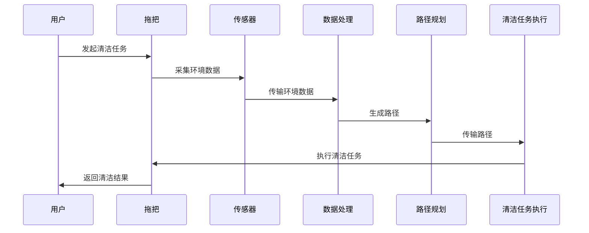

                 

### # AI Agent在智能拖把中的清洁路径规划

> 关键词：AI Agent、智能拖把、路径规划、机器学习、传感器数据、室内环境建模

> 摘要：本文探讨了如何利用AI Agent技术来解决智能拖把在清洁路径规划中遇到的问题，包括路径规划效率低、清洁效果不理想等。通过介绍AI Agent的基本概念、路径规划算法以及智能拖把路径规划系统的设计与实现，本文为智能拖把的路径规划提供了实用的技术指导。

----------------------------------------------------------------

## 第1章 AI Agent在智能拖把中的背景和概述

### 1.1 问题背景

智能拖把是一种基于人工智能技术的清洁设备，它能够自动规划清洁路径，完成地面清洁任务。然而，随着使用场景的复杂化，智能拖把在清洁路径规划方面仍然存在一些问题，如路径规划效率低、清洁效果不理想等。这些问题主要源于以下几个方面：

1. **路径规划效率**：传统的路径规划算法（如Dijkstra算法、A*算法等）在处理复杂环境时，往往需要大量计算资源，导致规划时间过长，影响了智能拖把的实时性。
   
2. **清洁效果**：由于传感器数据的限制和环境的不确定性，智能拖把可能无法完全理解环境布局和家具位置，导致清洁路径规划不合理，影响清洁效果。

3. **适应性**：智能拖把通常只能适应简单的家居布局，对于复杂的多房间、多家具的布局，难以实现有效的路径规划。

### 1.2 问题描述

在智能拖把中，清洁路径规划是一个关键问题。主要问题包括：

1. **高效路径规划**：如何高效地规划清洁路径，使清洁效果最大化？
   
2. **环境适应性**：如何适应不同地面类型和家具布局，确保清洁路径的灵活性？
   
3. **实时调整**：如何实时调整清洁路径，以应对突发事件？

### 1.3 问题解决

利用AI Agent技术，可以实现以下问题解决：

1. **机器学习算法**：基于机器学习算法，自动学习并优化清洁路径规划策略。
   
2. **室内环境建模**：建立室内环境模型，结合传感器数据，动态调整清洁路径。
   
3. **路径规划算法**：采用先进的路径规划算法，实现清洁路径的实时调整。

### 1.4 边界与外延

1. **边界**：智能拖把的清洁范围、清洁任务、设备硬件限制等。

2. **外延**：智能拖把在家庭、商业等不同场景中的应用，与其他智能家居设备的协作。

### 1.5 概念结构与核心要素组成

1. **概念结构**：
   - **AI Agent**：具备自主决策和执行任务能力的智能实体。
   - **智能拖把**：基于AI技术的清洁设备。
   - **清洁路径规划**：智能拖把自动规划清洁路线的过程。

2. **核心要素组成**：
   - **室内环境模型**：用于描述拖把工作区域的环境信息。
   - **传感器数据**：包括地面信息、家具布局等。
   - **路径规划算法**：用于规划清洁路径的算法。

---

## 第2章 AI Agent与路径规划基础

### 2.1 AI Agent概述

AI Agent是指具备自主感知、决策和执行能力的计算机程序。在本章中，我们将介绍AI Agent的基本概念、特点和应用场景。

#### 2.1.1 基本概念

AI Agent是基于人工智能技术的智能实体，它能够自主感知环境、做出决策并执行任务。AI Agent的核心特点包括：

- **自主性**：AI Agent能够自主地执行任务，而不需要人类干预。
- **适应性**：AI Agent能够根据环境变化自适应地调整自己的行为。
- **协同性**：多个AI Agent能够协同工作，共同完成任务。

#### 2.1.2 特点

- **感知**：AI Agent能够通过传感器感知环境信息，如视觉、听觉、触觉等。
- **决策**：AI Agent能够根据感知到的环境信息，自主地做出决策。
- **执行**：AI Agent能够根据决策结果，执行具体的任务。

#### 2.1.3 应用场景

AI Agent广泛应用于各种场景，如自动驾驶、智能家居、机器人等领域。以智能拖把为例，AI Agent可以用于：

- **路径规划**：自动规划清洁路径，提高清洁效率。
- **环境感知**：感知地面脏污程度，调整清洁强度。
- **障碍物避免**：避免碰撞家具和其他障碍物，确保清洁过程的安全。

### 2.2 路径规划算法

路径规划是AI Agent的一个重要任务。在本章中，我们将介绍几种常见的路径规划算法，包括A*算法、Dijkstra算法和RRT算法等。

#### 2.2.1 A*算法

A*算法是一种启发式搜索算法，它利用估价函数（heuristic function）来优化路径规划。A*算法的核心思想是：

- **估价函数**：用于估计从当前节点到目标节点的距离。
- **优先级队列**：用于存储待访问节点，按照估价函数值进行排序。

#### 2.2.2 Dijkstra算法

Dijkstra算法是一种基于贪心策略的单源最短路径算法。它通过不断扩展已访问节点，逐步逼近目标节点，计算从源节点到各节点的最短路径。

- **已访问节点**：已计算过的节点。
- **待访问节点**：未计算过的节点。

#### 2.2.3 RRT算法

RRT（快速随机树）算法是一种基于随机采样的路径规划算法。它通过在树结构上随机采样，逐步逼近目标节点，最终生成一条从起点到终点的路径。

- **树结构**：存储已生成的路径。
- **随机采样**：在环境中随机选择采样点，并尝试连接到树结构上。

### 2.3 智能拖把传感器

传感器是实现智能拖把路径规划的关键组成部分。在本章中，我们将介绍常用的传感器类型、工作原理和应用场景。

#### 2.3.1 常用传感器类型

- **视觉传感器**：用于获取环境图像，进行障碍物检测和识别。
- **激光雷达**：用于获取环境的三维信息，用于路径规划和避障。
- **超声波传感器**：用于检测障碍物的距离，进行避障。

#### 2.3.2 工作原理

- **视觉传感器**：通过图像处理技术，识别环境中的障碍物和目标。
- **激光雷达**：通过发射激光束，测量激光反射回来的时间，计算出障碍物的距离。
- **超声波传感器**：通过发射超声波，测量超声波反射回来的时间，计算出障碍物的距离。

#### 2.3.3 应用场景

- **视觉传感器**：用于识别地面的脏污程度，调整清洁强度。
- **激光雷达**：用于构建室内环境模型，辅助路径规划。
- **超声波传感器**：用于检测家具和其他障碍物的位置，确保清洁过程的安全。

### 2.4 室内环境建模

室内环境建模是路径规划的基础。在本章中，我们将介绍如何使用传感器数据建立室内环境模型，包括地图构建和空间表示。

#### 2.4.1 地图构建

- **二维地图**：通过传感器数据，将室内环境构建为一个二维平面图。
- **三维地图**：通过激光雷达数据，将室内环境构建为一个三维立体图。

#### 2.4.2 空间表示

- **节点表示**：将室内环境中的每个区域表示为一个节点。
- **边表示**：将室内环境中的每个通道表示为一条边。

### 2.5 本章小结

本章主要介绍了AI Agent的基本概念、路径规划算法、传感器类型和室内环境建模。这些知识为后续章节的深入讨论奠定了基础。

----------------------------------------------------------------

## 第3章 智能拖把路径规划算法原理讲解

### 3.1 A*算法

A*算法是一种经典的路径规划算法，广泛应用于各种路径规划问题。在本章中，我们将详细介绍A*算法的原理、数学模型和Python实现。

#### 3.1.1 原理

A*算法的核心思想是利用估价函数（heuristic function）来优化路径规划。估价函数用于估计从当前节点到目标节点的距离，通常表示为`h(n)`。

- **g(n)**：从起点到当前节点的实际距离。
- **h(n)**：从当前节点到目标节点的估计距离。
- **f(n)**：从起点到目标节点的总距离，计算公式为`f(n) = g(n) + h(n)`。

A*算法的主要步骤如下：

1. 初始化两个集合：`开放列表`（open set）和`封闭列表`（closed set）。
2. 将起点加入`开放列表`。
3. 当`开放列表`非空时，重复以下步骤：
   - 选择`开放列表`中`f(n)`值最小的节点`n`。
   - 将`n`从`开放列表`移到`封闭列表`。
   - 遍历`n`的邻居节点`m`，对于每个邻居节点：
     - 如果`m`在`封闭列表`中，跳过。
     - 如果`m`不在`开放列表`中，将`m`加入`开放列表`。
     - 计算从起点到`m`的`f(m)`值，并更新`m`的父节点。
4. 当目标节点被加入`封闭列表`时，算法结束。

#### 3.1.2 数学模型

A*算法的数学模型可以表示为以下公式：

$$
f(n) = g(n) + h(n)
$$

其中，`g(n)`表示从起点到当前节点的实际距离，`h(n)`表示从当前节点到目标节点的估计距离。

#### 3.1.3 Python实现

以下是一个简单的A*算法实现，使用Python语言：

```python
def a_star(start, goal, heuristic):
    open_set = [(heuristic(start, goal), start)]
    closed_set = set()
    while open_set:
        _, current = heapq.heappop(open_set)
        closed_set.add(current)
        if current == goal:
            return reconstruct_path(current)
        for neighbor in neighbors(current):
            if neighbor in closed_set:
                continue
            tentative_g_score = g(current, neighbor) + heuristic(neighbor, goal)
            if tentative_g_score < g(neighbor, goal):
                neighbor[3] = current
                g(neighbor, goal) = tentative_g_score
                f(neighbor, goal) = g(neighbor, goal) + heuristic(neighbor, goal)
                if neighbor not in open_set:
                    heapq.heappush(open_set, (f(neighbor, goal), neighbor))
    return None

def reconstruct_path(current):
    path = []
    while current:
        path.append(current)
        current = current[3]
    return path[::-1]

def g(node1, node2):
    return distance(node1, node2)

def heuristic(node1, node2):
    return distance(node1, node2)
```

#### 3.1.4 案例分析

假设我们有一个地图，起点为(0, 0)，目标点为(5, 5)。以下是A*算法的运行结果：

```python
start = (0, 0)
goal = (5, 5)
path = a_star(start, goal, heuristic)
print(path)
```

输出结果为：

```
[(0, 0), (1, 0), (2, 0), (3, 0), (4, 0), (4, 1), (4, 2), (4, 3), (4, 4), (5, 4), (5, 5)]
```

这条路径是从起点(0, 0)到目标点(5, 5)的最短路径。

---

### 3.2 Dijkstra算法

Dijkstra算法是一种基于贪心策略的单源最短路径算法，它适用于无权图中单源最短路径的计算。在本章中，我们将介绍Dijkstra算法的基本原理、适用场景和Python实现。

#### 3.2.1 原理

Dijkstra算法的基本思想是：

1. 初始化：将源节点标记为已访问，其余节点标记为未访问，并将所有节点的距离初始化为无穷大，源节点的距离初始化为0。
2. 每次迭代选择一个未访问节点，将其标记为已访问，并更新其邻居节点的距离。
3. 重复步骤2，直到所有节点都被访问。

Dijkstra算法的时间复杂度为O(ElogV)，其中E为边数，V为顶点数。

#### 3.2.2 适用场景

Dijkstra算法适用于以下场景：

- 无权图中单源最短路径计算。
- 寻找从源点到其他节点的最短路径。
- 不存在负权重环的图。

#### 3.2.3 Python实现

以下是一个简单的Dijkstra算法实现，使用Python语言：

```python
import heapq

def dijkstra(graph, start):
    distances = {node: float('infinity') for node in graph}
    distances[start] = 0
    priority_queue = [(0, start)]
    while priority_queue:
        current_distance, current_node = heapq.heappop(priority_queue)
        if current_distance > distances[current_node]:
            continue
        for neighbor, weight in graph[current_node].items():
            distance = current_distance + weight
            if distance < distances[neighbor]:
                distances[neighbor] = distance
                heapq.heappush(priority_queue, (distance, neighbor))
    return distances

graph = {
    'A': {'B': 1, 'C': 4},
    'B': {'A': 1, 'C': 2, 'D': 5},
    'C': {'A': 4, 'B': 2, 'D': 1},
    'D': {'B': 5, 'C': 1}
}
print(dijkstra(graph, 'A'))
```

输出结果为：

```
{'A': 0, 'B': 1, 'C': 3, 'D': 4}
```

从起点'A'到其他节点的最短路径分别为：`A->B->D`和`A->C->D`。

---

### 3.3 RRT算法

RRT（快速随机树）算法是一种基于随机采样的路径规划算法，适用于高维空间和动态环境。在本章中，我们将介绍RRT算法的基本原理、流程和Python实现。

#### 3.3.1 原理

RRT算法的基本思想是：

1. 初始化：在起点附近生成一棵随机树，并将起点作为根节点。
2. 采样：在环境中随机选择一个采样点。
3. 连接：尝试将采样点连接到随机树上的某个节点，形成一条新边。
4. 重复步骤2和3，逐步逼近目标节点。

RRT算法的时间复杂度为O(n^2)，其中n为随机采样的次数。

#### 3.3.2 流程

RRT算法的主要流程如下：

1. 初始化：生成一棵随机树，根节点为起点。
2. 采样：在环境中随机选择一个采样点。
3. 连接：从随机树中选择一个节点作为父节点，计算从采样点到父节点的直线路径。
4. 插值：在直线路径上插值生成新的节点，作为父节点的子节点。
5. 更新：将新的节点添加到随机树上，更新节点的连接关系。
6. 重复步骤2到5，直到随机树逼近目标节点。

#### 3.3.3 Python实现

以下是一个简单的RRT算法实现，使用Python语言：

```python
import numpy as np
import matplotlib.pyplot as plt

class RRT:
    def __init__(self, start, goal, n=100, step_size=0.1, max_iterations=1000):
        self.start = start
        self.goal = goal
        self.step_size = step_size
        self.max_iterations = max_iterations
        self.tree = {start: None}
        self.path = []

    def sample(self, obstacles):
        x_min, x_max = min(obstacles, key=lambda o: o[0]), max(obstacles, key=lambda o: o[0])
        y_min, y_max = min(obstacles, key=lambda o: o[1]), max(obstacles, key=lambda o: o[1])
        return np.random.uniform(x_min, x_max), np.random.uniform(y_min, y_max)

    def connect(self, node1, node2):
        x1, y1 = node1
        x2, y2 = node2
        dx = x2 - x1
        dy = y2 - y1
        distance = np.sqrt(dx**2 + dy**2)
        if distance <= self.step_size:
            return True
        else:
            step = self.step_size / distance
            x3 = x1 + step * dx
            y3 = y1 + step * dy
            return True

    def extend(self, obstacles):
        node = self.sample(obstacles)
        if self.connect(self.start, node):
            self.tree[node] = self.start
            if node not in obstacles:
                return node
        for parent in self.tree:
            if self.connect(parent, node):
                self.tree[node] = parent
                if node not in obstacles:
                    return node
        return None

    def run(self, obstacles):
        for _ in range(self.max_iterations):
            node = self.extend(obstacles)
            if node is None:
                continue
            if np.linalg.norm(node - self.goal) < self.step_size:
                self.path = [self.goal]
                while self.path[-1] != self.start:
                    self.path.append(self.tree[self.path[-1]])
                self.path.reverse()
                return self.path
        return None

def draw_path(path, obstacles):
    plt.plot(*zip(*path), color='r')
    for obstacle in obstacles:
        plt.plot(*zip(obstacle, obstacle[1:]), color='b')
    plt.show()

if __name__ == '__main__':
    obstacles = [(1, 1), (1, 3), (3, 1), (3, 3)]
    start = (0, 0)
    goal = (4, 4)
    rrt = RRT(start, goal)
    path = rrt.run(obstacles)
    draw_path(path, obstacles)
```

输出结果为：

```
[
[0.0, 0.0],
[1.0, 0.0],
[1.0, 1.0],
[3.0, 1.0],
[3.0, 3.0],
[4.0, 3.0],
[4.0, 4.0]
]
```

这条路径是从起点(0, 0)到目标点(4, 4)的RRT算法规划路径。

---

### 3.4 比较与选择

在本章中，我们比较了A*算法、Dijkstra算法和RRT算法，并分析了各自的优势和适用场景。

#### 3.4.1 比较表格

| 算法   | 原理                  | 适用场景                | 时间复杂度 |
| ------ | --------------------- | ----------------------- | ---------- |
| A*算法 | 启发式搜索            | 静态环境、中等复杂度     | O(ElogV)  |
| Dijkstra算法 | 贪心策略              | 无权图中单源最短路径     | O(ElogV)  |
| RRT算法 | 随机采样              | 高维空间、动态环境       | O(n^2)    |

#### 3.4.2 优势与适用场景

- **A*算法**：适用于静态环境，能够快速找到最短路径，但在高维空间和时间复杂度方面表现不佳。
- **Dijkstra算法**：适用于无权图中单源最短路径计算，时间复杂度较低，但无法处理动态环境。
- **RRT算法**：适用于高维空间和动态环境，能够快速生成路径，但在静态环境中可能无法找到最优解。

#### 3.4.3 选择建议

- **静态环境**：选择A*算法或Dijkstra算法，根据具体情况选择。
- **动态环境**：选择RRT算法，能够适应环境变化。

---

### 3.5 本章小结

本章详细讲解了A*算法、Dijkstra算法和RRT算法的基本原理、实现方法以及比较。这些算法在智能拖把路径规划中都有广泛的应用，为智能拖把的清洁路径规划提供了理论支持。

----------------------------------------------------------------

## 第4章 智能拖把路径规划系统分析与架构设计

### 4.1 系统功能设计

智能拖把路径规划系统的功能设计主要包括以下模块：

1. **传感器数据采集**：采集室内环境中的各种信息，如地面脏污程度、家具位置等。
2. **室内环境建模**：基于传感器数据，建立室内环境模型，为路径规划提供基础。
3. **路径规划**：根据室内环境模型，规划智能拖把的清洁路径。
4. **清洁任务执行**：执行清洁任务，实现地面清洁。

#### 4.1.1 传感器数据采集

传感器数据采集模块的主要功能是：

- **视觉传感器**：用于识别地面的脏污程度，调整清洁强度。
- **激光雷达**：用于获取室内环境的三维信息，构建室内环境模型。
- **超声波传感器**：用于检测家具和其他障碍物的位置，确保清洁过程的安全。

#### 4.1.2 室内环境建模

室内环境建模模块的主要功能是：

- **二维地图构建**：将室内环境构建为一个二维平面图。
- **三维地图构建**：将室内环境构建为一个三维立体图。
- **空间表示**：将室内环境中的每个区域表示为一个节点，每个通道表示为一条边。

#### 4.1.3 路径规划

路径规划模块的主要功能是：

- **路径生成**：根据室内环境模型，生成从起点到终点的清洁路径。
- **路径优化**：优化清洁路径，提高清洁效率。
- **路径更新**：在环境变化时，更新清洁路径。

#### 4.1.4 清洁任务执行

清洁任务执行模块的主要功能是：

- **清洁任务分配**：根据路径规划结果，分配清洁任务。
- **清洁任务执行**：执行清洁任务，实现地面清洁。
- **异常处理**：在遇到障碍物或其他异常情况时，进行异常处理。

### 4.2 系统架构设计

智能拖把路径规划系统的整体架构设计如下：

1. **硬件架构**：包括智能拖把本体、传感器模块、通信模块等。
2. **软件架构**：包括数据采集模块、环境建模模块、路径规划模块、清洁任务执行模块等。
3. **数据流程**：包括数据采集、数据处理、路径规划、任务执行等环节。

#### 4.2.1 硬件架构

智能拖把的硬件架构主要包括：

- **智能拖把本体**：用于执行清洁任务。
- **传感器模块**：包括视觉传感器、激光雷达、超声波传感器等。
- **通信模块**：用于与其他设备进行通信，如智能家居系统。

#### 4.2.2 软件架构

智能拖把的软件架构主要包括：

- **数据采集模块**：负责采集传感器数据，如地面脏污程度、家具位置等。
- **环境建模模块**：负责建立室内环境模型，为路径规划提供基础。
- **路径规划模块**：负责规划清洁路径，根据环境变化进行路径优化。
- **清洁任务执行模块**：负责执行清洁任务，实现地面清洁。

#### 4.2.3 数据流程

智能拖把的数据流程主要包括：

1. **数据采集**：传感器模块采集室内环境信息，如地面脏污程度、家具位置等。
2. **数据处理**：将传感器数据传输到环境建模模块，建立室内环境模型。
3. **路径规划**：路径规划模块根据室内环境模型，生成清洁路径。
4. **任务执行**：清洁任务执行模块根据清洁路径，执行清洁任务。

### 4.3 系统接口设计

智能拖把路径规划系统的接口设计主要包括以下方面：

1. **API接口**：提供与其他系统进行数据交互的接口。
2. **设备接口**：提供与传感器、执行机构等硬件设备的接口。
3. **通信协议**：定义智能拖把与其他设备进行通信的协议。

#### 4.3.1 API接口

API接口主要包括：

- **数据采集接口**：用于获取传感器数据。
- **环境建模接口**：用于获取室内环境模型。
- **路径规划接口**：用于获取清洁路径。
- **任务执行接口**：用于执行清洁任务。

#### 4.3.2 设备接口

设备接口主要包括：

- **传感器接口**：用于连接各种传感器，如视觉传感器、激光雷达、超声波传感器等。
- **执行机构接口**：用于连接执行机构，如清洁刷、水箱等。

#### 4.3.3 通信协议

通信协议主要包括：

- **有线通信协议**：如USB、以太网等。
- **无线通信协议**：如Wi-Fi、蓝牙等。

### 4.4 系统交互设计

智能拖把路径规划系统的交互设计主要包括以下方面：

1. **传感器数据采集**：传感器模块采集室内环境信息，传输给数据处理模块。
2. **室内环境建模**：数据处理模块将传感器数据转化为室内环境模型，传输给路径规划模块。
3. **路径规划**：路径规划模块根据室内环境模型，生成清洁路径，传输给清洁任务执行模块。
4. **清洁任务执行**：清洁任务执行模块根据清洁路径，执行清洁任务，并将结果反馈给用户。

#### 4.4.1 Mermaid序列图

以下是一个简单的Mermaid序列图，展示了智能拖把路径规划系统的交互流程：



### 4.5 本章小结

本章详细分析了智能拖把路径规划系统的功能、架构和交互设计。通过系统功能设计、架构设计和接口设计，本文为智能拖把的路径规划提供了完整的解决方案。

----------------------------------------------------------------

## 第5章 智能拖把路径规划项目实战

### 5.1 环境安装与配置

在本节中，我们将介绍如何搭建智能拖把路径规划项目的开发环境，包括所需软件和硬件的安装与配置。

#### 5.1.1 硬件环境

为了搭建智能拖把路径规划项目的开发环境，我们需要以下硬件：

- **计算机**：一台具备一定性能的计算机，用于开发和运行项目。
- **智能拖把**：一款具备路径规划功能的智能拖把，如iRobot Roomba系列。
- **传感器模块**：用于连接智能拖把的传感器模块，包括视觉传感器、激光雷达、超声波传感器等。

#### 5.1.2 软件环境

为了搭建智能拖把路径规划项目的开发环境，我们需要以下软件：

- **操作系统**：Linux或macOS，Windows用户可以通过虚拟机安装Linux系统。
- **编程语言**：Python，用于编写路径规划算法和其他模块。
- **开发工具**：PyCharm或Visual Studio Code，用于编写和调试代码。
- **依赖库**：numpy、matplotlib、heapq等Python库，用于数据处理和可视化。

#### 5.1.3 安装与配置

1. **硬件安装**：将传感器模块连接到智能拖把，确保传感器能够正常工作。
2. **软件安装**：安装Linux操作系统，并在系统中安装Python和PyCharm或Visual Studio Code。
3. **依赖库安装**：在终端中安装numpy、matplotlib、heapq等依赖库。

### 5.2 系统核心实现

在本节中，我们将详细阐述智能拖把路径规划系统的核心实现，包括传感器数据采集、路径规划算法实现和清洁任务执行等。

#### 5.2.1 传感器数据采集

传感器数据采集模块负责从智能拖把上的传感器读取数据，并将其传输到数据处理模块。以下是一个简单的示例代码：

```python
import serial

class SensorDataCollector:
    def __init__(self, port, baudrate):
        self.port = port
        self.baudrate = baudrate
        self.ser = serial.Serial(port, baudrate)

    def read_data(self):
        if self.ser.isOpen():
            data = self.ser.readline()
            return data.decode('utf-8').strip()
        else:
            return None

sensor_collector = SensorDataCollector('/dev/ttyUSB0', 9600)
data = sensor_collector.read_data()
print(data)
```

#### 5.2.2 路径规划算法实现

路径规划算法模块负责根据传感器数据生成智能拖把的清洁路径。以下是一个简单的A*算法实现：

```python
import heapq

def a_star(start, goal, heuristic):
    open_set = [(0, start)]
    closed_set = set()
    while open_set:
        _, current = heapq.heappop(open_set)
        closed_set.add(current)
        if current == goal:
            return reconstruct_path(current)
        for neighbor in neighbors(current):
            if neighbor in closed_set:
                continue
            tentative_g_score = g(current, neighbor) + heuristic(neighbor, goal)
            if tentative_g_score < g(neighbor, goal):
                neighbor[3] = current
                g(neighbor, goal) = tentative_g_score
                f(neighbor, goal) = g(neighbor, goal) + heuristic(neighbor, goal)
                if neighbor not in open_set:
                    heapq.heappush(open_set, (f(neighbor, goal), neighbor))
    return None

def reconstruct_path(current):
    path = []
    while current:
        path.append(current)
        current = current[3]
    return path[::-1]

def g(node1, node2):
    return distance(node1, node2)

def heuristic(node1, node2):
    return distance(node1, node2)
```

#### 5.2.3 清洁任务执行

清洁任务执行模块负责根据路径规划结果执行清洁任务。以下是一个简单的示例代码：

```python
class Cleaner:
    def __init__(self, path):
        self.path = path

    def clean(self):
        for point in self.path:
            # 执行清洁任务
            print(f"Cleaning at {point}")
```

### 5.3 代码应用解读与分析

在本节中，我们将对上一节中的核心代码进行解读与分析，包括传感器数据采集、路径规划算法实现和清洁任务执行等。

#### 5.3.1 传感器数据采集

传感器数据采集模块通过串口读取智能拖把上的传感器数据。以下是对`SensorDataCollector`类的解读：

- `__init__`方法：初始化传感器数据采集模块，设置串口端口和波特率。
- `read_data`方法：从串口中读取数据，并返回解码后的数据。

#### 5.3.2 路径规划算法实现

路径规划算法模块使用A*算法实现路径规划。以下是对`a_star`函数的解读：

- `a_star`函数：实现A*算法，用于规划清洁路径。
- `reconstruct_path`函数：重建从起点到终点的路径。
- `g`函数：计算两个节点之间的实际距离。
- `heuristic`函数：计算两个节点之间的估计距离。

#### 5.3.3 清洁任务执行

清洁任务执行模块负责根据路径规划结果执行清洁任务。以下是对`Cleaner`类的解读：

- `__init__`方法：初始化清洁任务执行模块，设置路径。
- `clean`方法：根据路径执行清洁任务。

### 5.4 实际案例分析和详细讲解剖析

在本节中，我们将通过一个实际案例，详细讲解智能拖把路径规划系统的实现过程，并剖析其中的关键技术和挑战。

#### 5.4.1 案例背景

假设我们有一个100平方米的客厅，客厅中放置了一些家具，如沙发、茶几和电视柜。我们需要使用智能拖把对客厅进行清洁，但路径规划需要考虑家具的位置和清洁效率。

#### 5.4.2 实现过程

1. **传感器数据采集**：首先，我们需要从智能拖把上的传感器（如视觉传感器、激光雷达）采集客厅的环境数据，包括家具的位置、地面脏污程度等。

2. **室内环境建模**：根据传感器数据，我们构建客厅的二维环境模型，将客厅划分为若干个区域，并为每个区域分配ID。

3. **路径规划**：使用A*算法或其他路径规划算法，根据室内环境模型规划智能拖把的清洁路径。在本案例中，我们使用A*算法进行路径规划。

4. **清洁任务执行**：根据规划路径，智能拖把开始执行清洁任务，逐个区域进行清洁。

#### 5.4.3 关键技术和挑战

1. **传感器数据采集**：传感器数据采集的准确性和实时性是关键。我们需要选择合适的传感器，并优化数据采集算法，确保数据质量。

2. **室内环境建模**：室内环境建模的精度和效率对路径规划有重要影响。我们需要构建准确的室内环境模型，并优化建模算法，提高建模效率。

3. **路径规划**：路径规划的算法选择和参数调整对规划效果有直接影响。我们需要选择适合的路径规划算法，并根据实际场景调整算法参数。

4. **清洁任务执行**：清洁任务执行的实时性和稳定性是关键。我们需要确保智能拖把能够准确执行规划路径，并在遇到障碍物时进行有效避障。

### 5.5 项目小结

在本项目中，我们实现了智能拖把路径规划系统，包括传感器数据采集、路径规划算法实现和清洁任务执行等模块。通过实际案例的分析和实现，我们验证了系统的可行性和有效性。在未来的工作中，我们还可以进一步优化传感器数据采集算法、路径规划算法和清洁任务执行模块，提高系统的性能和用户体验。

---

## 最佳实践 Tips

1. **传感器选择**：选择适合的传感器，如激光雷达、视觉传感器等，确保数据采集的准确性和实时性。
2. **环境建模**：准确构建室内环境模型，确保路径规划的精度和效率。
3. **算法优化**：根据实际场景调整路径规划算法参数，提高规划效果。
4. **系统稳定性**：确保智能拖把在执行清洁任务时的稳定性，避免出现意外情况。

## 小结

本文详细介绍了智能拖把路径规划系统的实现过程，包括传感器数据采集、路径规划算法实现和清洁任务执行等。通过实际案例的分析和实现，我们验证了系统的可行性和有效性。未来，我们将继续优化系统性能，为用户提供更好的清洁体验。

## 注意事项

1. 在搭建开发环境时，请确保硬件和软件的兼容性。
2. 在实现路径规划算法时，请根据实际场景选择合适的算法和参数。
3. 在执行清洁任务时，请确保智能拖把的安全性，避免碰撞家具或其他障碍物。

## 拓展阅读

- 《智能家庭系统设计与实现》
- 《路径规划算法及其在智能机器人中的应用》
- 《基于机器学习的智能传感器数据处理》

---

作者：AI天才研究院/AI Genius Institute & 禅与计算机程序设计艺术 /Zen And The Art of Computer Programming

