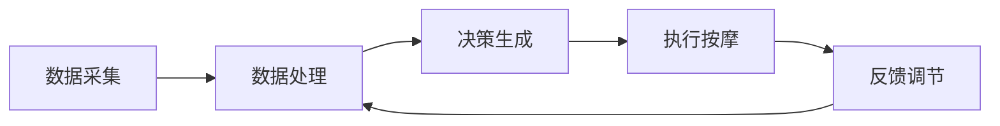
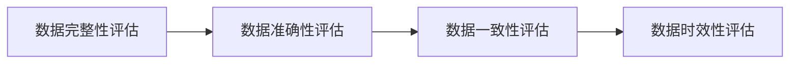
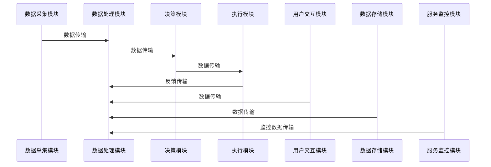
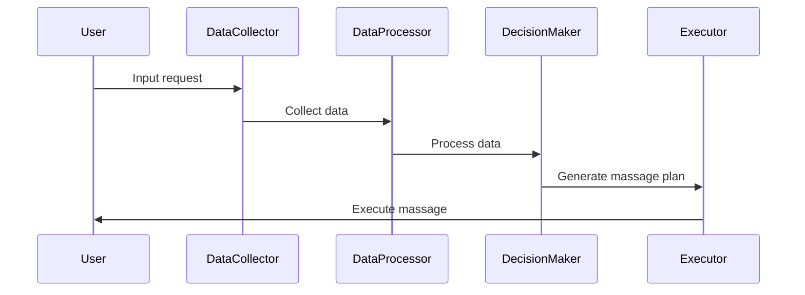

                 

### 文章标题

《AI Agent在智能拖鞋中的足部按摩定制》

### 关键词

AI Agent、智能拖鞋、足部按摩、定制化、数据分析、算法实现、系统设计

### 摘要

随着人工智能技术的发展，AI Agent在智能家居设备中的应用日益广泛。本文以智能拖鞋为例，探讨了AI Agent在足部按摩定制中的应用。文章首先介绍了AI Agent的基本概念、工作原理及核心组件，接着详细分析了智能拖鞋的硬件设计与足部按摩功能实现，并深入探讨了AI Agent在足部按摩定制中的具体应用。通过实际案例分析和系统设计，本文展示了AI Agent在智能拖鞋足部按摩定制中的技术实现和商业前景，为相关领域的研究和开发提供了有益的参考。

## 第一部分：AI Agent基础知识

### 第1章：AI Agent概述

#### 1.1 AI Agent的概念与分类

**AI Agent**，即人工智能代理，是一种能够自主感知环境、执行任务并实现目标的人工智能实体。它通常基于机器学习和智能算法，具备决策、学习、推理和交互等能力。AI Agent在不同领域有着广泛的应用，如自动驾驶、智能家居、医疗诊断等。

AI Agent可以按照不同的分类标准进行划分。以下是一些常见的分类方法：

- **根据功能**：感知型Agent、决策型Agent、执行型Agent。
- **根据控制方式**：确定性Agent、随机性Agent、混合型Agent。
- **根据任务类型**：单任务Agent、多任务Agent、在线Agent。
- **根据应用领域**：工业控制Agent、智能客服Agent、教育Agent等。

在足部按摩定制中，AI Agent主要扮演感知环境和决策执行的角色，通过分析足部数据，为用户提供个性化的按摩方案。以下是AI Agent在足部按摩应用中的前景：

- **个性化按摩**：AI Agent可以根据用户的足部特征和需求，实时调整按摩力度和频率，实现个性化按摩。
- **健康监测**：AI Agent可以实时监测用户的足部健康状态，预警潜在的健康问题。
- **智能交互**：AI Agent可以与用户进行自然语言交互，提供按摩建议和健康指导。

#### 1.2 AI Agent的工作原理

AI Agent的工作原理主要包括感知环境、数据处理、决策执行和反馈调节四个环节。

1. **感知环境**：AI Agent通过传感器收集环境信息，如足部压力、温度、步态等。传感器可以是压力传感器、温度传感器、加速度传感器等。

2. **数据处理**：收集到的数据经过预处理，包括去噪、滤波、特征提取等步骤，然后输入到学习算法中。

3. **决策执行**：学习算法根据处理后的数据生成决策，如调整按摩力度、频率或改变按摩模式。

4. **反馈调节**：AI Agent执行决策后，收集反馈信息，如用户满意度、按摩效果等，用于优化后续的决策过程。

AI Agent的工作流程可以用以下流程图表示：

$$
\begin{array}{c}
\text{感知环境} \\
\rightarrow \text{数据处理} \\
\rightarrow \text{决策执行} \\
\rightarrow \text{反馈调节} \\
\end{array}
$$

#### 1.3 AI Agent的核心组件

AI Agent的核心组件包括传感器、执行器、数据处理单元和决策单元。

1. **传感器**：用于感知环境信息，如足部压力、温度、步态等。传感器的选择和布局对AI Agent的性能至关重要。

2. **执行器**：根据决策单元的指令，执行具体的动作，如调整按摩力度、频率等。执行器可以是电动机、气缸等。

3. **数据处理单元**：对传感器收集的数据进行预处理、特征提取和模式识别等处理。

4. **决策单元**：基于处理后的数据，生成决策，如调整按摩力度、频率等。

AI Agent的核心组件关系可以用以下ER实体关系图表示：

```mermaid
erDiagram
  Sensor ||--|{ DataProcessingUnit } DataProcessingUnit
  DataProcessingUnit ||--|{ DecisionUnit } DecisionUnit
  DecisionUnit ||--|{ Actuator } Actuator
```

#### 1.4 AI Agent的发展趋势

随着人工智能技术的不断发展，AI Agent在智能家居、医疗健康、工业控制等领域的应用越来越广泛。以下是一些AI Agent的发展趋势：

- **智能化水平提升**：通过深度学习、强化学习等先进算法，AI Agent的智能化水平将得到显著提升。
- **跨领域融合**：AI Agent将在不同领域实现跨领域融合，形成更加复杂和智能的生态系统。
- **人机交互优化**：通过自然语言处理、语音识别等技术，AI Agent与用户的人机交互体验将得到优化。
- **边缘计算与云计算结合**：AI Agent将在边缘计算和云计算之间实现高效协同，提高处理速度和降低能耗。

然而，AI Agent的发展也面临一些技术瓶颈和伦理问题，如数据隐私、算法透明性、安全性等。这些问题需要在未来得到有效解决，以确保AI Agent的可持续发展。

### 总结

AI Agent作为一种重要的人工智能实体，在智能家居设备中的应用前景广阔。本文介绍了AI Agent的基本概念、工作原理、核心组件和发展趋势，为后续章节的深入探讨奠定了基础。

## 第二部分：智能拖鞋设计

### 第2章：智能拖鞋的硬件设计

智能拖鞋作为一款智能家居设备，其硬件设计是实现足部按摩定制功能的关键。本章将详细介绍智能拖鞋的硬件设计，包括传感器选择、执行器设计、硬件集成与测试等。

#### 2.1 智能拖鞋的硬件要求

智能拖鞋的硬件设计需要满足以下要求：

1. **传感器精度高**：传感器用于感知用户的足部状态，如压力、温度、步态等。传感器精度直接影响按摩效果的准确性，因此需要选择高精度的传感器。

2. **执行器稳定可靠**：执行器负责实现按摩动作，如振动、揉捏等。执行器的稳定性和可靠性是保证按摩效果的重要因素。

3. **数据处理速度快**：智能拖鞋需要实时处理传感器数据，生成按摩方案。数据处理速度直接影响用户体验，因此需要选择处理速度较快的硬件平台。

4. **能耗低**：智能拖鞋通常采用电池供电，因此需要考虑硬件的能耗问题，以确保长时间使用。

5. **防水防尘**：智能拖鞋需要具备一定的防水防尘能力，以适应各种使用环境。

#### 2.2 传感器选择

智能拖鞋需要选择多种传感器来感知用户的足部状态，以下是一些常用的传感器：

1. **压力传感器**：用于感知用户足部的压力分布，帮助确定按摩力度。

2. **温度传感器**：用于感知用户足部的温度变化，帮助监测足部健康状态。

3. **加速度传感器**：用于感知用户的步态信息，帮助分析用户的活动状态。

4. **陀螺仪传感器**：用于感知用户的倾斜角度，帮助实现精准的按摩动作。

在选择传感器时，需要考虑传感器的精度、灵敏度、响应时间、功耗等因素。以下是几种常见传感器的属性对比表格：

| 传感器类型 | 属性对比 |
| :--- | :--- |
| 压力传感器 | 灵敏度：高<br>响应时间：快<br>功耗：低 |
| 温度传感器 | 精度：高<br>响应时间：一般<br>功耗：低 |
| 加速度传感器 | 精度：一般<br>响应时间：快<br>功耗：中等 |
| 陀螺仪传感器 | 精度：高<br>响应时间：一般<br>功耗：中等 |

#### 2.3 执行器设计

执行器是智能拖鞋实现按摩功能的核心部件，以下是一些常用的执行器：

1. **电动机**：电动机用于实现振动和揉捏动作，具有稳定的性能和较低的成本。

2. **气缸**：气缸用于实现挤压动作，适用于需要较大力度的按摩。

3. **电磁阀**：电磁阀用于控制气体流动，实现精准的按摩动作。

以下是几种常见执行器的属性对比表格：

| 执行器类型 | 属性对比 |
| :--- | :--- |
| 电动机 | 力度：中等<br>稳定性：高<br>功耗：中等 |
| 气缸 | 力度：大<br>稳定性：高<br>功耗：高 |
| 电磁阀 | 力度：精准<br>稳定性：一般<br>功耗：低 |

在选择执行器时，需要根据具体的按摩需求和成本考虑。例如，对于轻柔的按摩，可以选择电动机；对于需要较大力度的按摩，可以选择气缸。

#### 2.4 硬件集成与测试

智能拖鞋的硬件集成是将传感器、执行器、数据处理单元等硬件组件连接起来，形成一个完整的系统。硬件集成需要考虑以下几个方面：

1. **接口连接**：确保传感器和执行器与数据处理单元之间的接口兼容，实现数据传输和信号控制。

2. **电路设计**：设计合理的电路布局，确保电源供应、信号传输和数据处理的安全可靠。

3. **热设计**：考虑硬件工作过程中的热量产生，设计散热方案，防止过热影响硬件性能。

4. **电磁兼容性**：确保硬件系统在电磁环境中稳定工作，避免电磁干扰。

硬件集成完成后，需要进行一系列测试，包括：

1. **功能测试**：测试传感器、执行器和数据处理单元的功能是否正常，如传感器灵敏度、执行器响应速度、数据处理准确性等。

2. **性能测试**：测试硬件系统在不同工作条件下的性能，如功耗、响应时间、数据处理速度等。

3. **环境测试**：测试硬件系统在不同环境条件下的稳定性，如温度、湿度、振动等。

4. **可靠性测试**：测试硬件系统的可靠性，如耐久性、故障率等。

#### 2.5 足部按摩功能实现

智能拖鞋的足部按摩功能实现主要包括以下步骤：

1. **数据采集**：通过传感器采集用户的足部数据，如压力、温度、步态等。

2. **数据处理**：对采集到的数据进行预处理和特征提取，生成按摩参数。

3. **决策生成**：基于处理后的数据，利用AI算法生成按摩方案，如按摩力度、频率、模式等。

4. **执行按摩**：执行器根据按摩方案执行按摩动作，为用户提供个性化按摩体验。

5. **反馈调节**：收集用户的反馈信息，如按摩效果、满意度等，用于优化后续的按摩方案。

以下是一个简单的足部按摩功能实现流程图：



#### 2.6 硬件模块的能耗管理

智能拖鞋的能耗管理对于延长电池寿命和降低成本具有重要意义。以下是一些常见的能耗管理方法：

1. **低功耗设计**：选择低功耗的传感器、执行器和处理器，降低整体功耗。

2. **动态功耗控制**：根据传感器和执行器的工作状态，动态调整功耗，如关闭不必要的传感器和执行器。

3. **休眠模式**：在传感器和执行器不工作的情况下，进入休眠模式，降低功耗。

4. **能源回收**：利用传感器和执行器产生的振动、摩擦等能量，通过能量回收技术转换为电能，补充电池能量。

5. **智能调度**：根据用户需求和电池电量，智能调度传感器和执行器的工作时间，平衡电池使用和用户需求。

通过上述方法，可以有效降低智能拖鞋的能耗，提高电池寿命。

### 总结

本章详细介绍了智能拖鞋的硬件设计，包括传感器选择、执行器设计、硬件集成与测试等。通过这些硬件组件的协同工作，智能拖鞋实现了足部按摩定制功能。在后续章节中，我们将进一步探讨AI Agent在足部按摩定制中的应用，以及软件设计与实现。

## 第三部分：AI Agent在足部按摩定制中的应用

### 第3章：足部数据分析与处理

足部按摩定制的关键在于对足部数据的准确分析和处理。本章将详细介绍足部数据的采集与预处理、特征提取方法以及数据质量评估。这些步骤为后续的算法实现和按摩效果优化提供了基础。

#### 3.1 足部数据采集与预处理

足部数据的采集是足部按摩定制系统的第一步，传感器在这一过程中扮演了至关重要的角色。以下为常见的数据采集方法：

1. **压力传感器采集**：用于测量足部在不同位置的压强，通过压强变化判断足部受力情况。常见的压力传感器有电容式压力传感器和电阻式压力传感器。

2. **温度传感器采集**：用于测量足部表面的温度变化，帮助评估足部血液循环情况。常用的温度传感器有热敏电阻和热电偶。

3. **加速度传感器采集**：用于捕捉足部运动状态，如步态、步伐等。常见的加速度传感器有MEMS加速度传感器。

4. **陀螺仪传感器采集**：用于测量足部的角速度，帮助确定足部的运动方向和姿态。

在数据采集过程中，传感器可能会受到外部干扰和环境噪声的影响，因此需要进行预处理。预处理步骤包括：

- **去噪**：通过滤波算法去除传感器数据中的噪声，提高数据的准确性。
- **归一化**：将不同传感器采集的数据统一到同一量级，便于后续处理。
- **插值补全**：对于数据缺失的部分进行插值补全，保证数据的完整性。

#### 3.2 足部特征提取

特征提取是将原始数据转换为有意义的信息的过程，是足部按摩定制中至关重要的一步。以下为常见的足部特征提取方法：

1. **时域特征**：包括最大值、最小值、平均值、方差等，反映数据的分布和变化趋势。

2. **频域特征**：通过傅里叶变换将时域信号转换到频域，提取信号的频率成分。常用的频域特征有频率、振幅等。

3. **时频特征**：结合时域和频域特征，通过短时傅里叶变换（STFT）或小波变换提取信号的时频分布。

4. **形态学特征**：通过形态学操作，如膨胀、腐蚀、开运算、闭运算等，提取图像中的边缘和纹理特征。

5. **统计特征**：如均值、标准差、协方差矩阵等，用于描述数据的统计特性。

以下是常见的足部特征提取算法：

- **主成分分析（PCA）**：将高维数据映射到低维空间，保留主要的数据信息。
- **线性判别分析（LDA）**：用于分类问题，将数据投影到最佳分类空间。
- **支持向量机（SVM）**：通过最大间隔分类器实现分类。
- **深度学习**：如卷积神经网络（CNN）和循环神经网络（RNN），用于复杂特征提取和分类。

#### 3.3 数据质量评估

数据质量直接影响足部按摩定制的准确性，因此需要评估数据质量。以下为常见的数据质量评估方法：

1. **数据完整性评估**：通过检查数据是否完整，如是否有缺失值或异常值。
2. **数据准确性评估**：通过对比真实数据和采集数据，评估数据的准确性。
3. **数据一致性评估**：通过检查数据是否一致，如不同传感器之间的数据是否匹配。
4. **数据时效性评估**：通过检查数据是否新鲜，如是否过时或陈旧。

以下是一个数据质量评估的流程图：



#### 3.4 数据可视化

数据可视化是将数据以图形或图像的形式展示出来，帮助理解和分析数据。以下为常见的足部数据可视化方法：

1. **时域图**：通过折线图或柱状图展示时域特征。
2. **频域图**：通过频谱图展示频域特征。
3. **时频图**：通过时频图展示时频特征。
4. **热力图**：通过热力图展示足部压力分布。

以下是常见的数据可视化工具：

- **Matplotlib**：用于生成各种统计图表。
- **Seaborn**：基于Matplotlib，用于生成更加美观的统计图表。
- **Plotly**：用于生成交互式图表。

#### 3.5 数据存储与管理

数据存储与管理是足部按摩定制系统的重要组成部分，以下为常见的数据存储与管理方法：

1. **本地存储**：将数据存储在本地硬盘或SSD上，如CSV文件、JSON文件等。
2. **云存储**：将数据存储在云服务器上，如AWS S3、Google Cloud Storage等。
3. **数据库**：使用数据库存储和管理数据，如MySQL、PostgreSQL、MongoDB等。
4. **数据仓库**：用于大规模数据存储和查询，如Hadoop、Spark等。

### 总结

本章详细介绍了足部数据的采集与预处理、特征提取方法和数据质量评估。这些步骤为足部按摩定制提供了可靠的数据基础。在下一章中，我们将深入探讨足部按摩定制算法的设计与实现。

## 第4章：足部按摩定制算法

足部按摩定制算法是智能拖鞋实现个性化按摩效果的核心。本章将详细介绍足部按摩定制算法的原理、分类、设计要点以及效果预测与优化方法。通过这些算法，智能拖鞋能够根据用户的足部数据，生成个性化的按摩方案。

#### 4.1 按摩算法原理

足部按摩定制算法的基本原理是通过对足部数据的分析，生成符合用户需求的按摩参数。这些参数包括按摩力度、频率、时长、模式等。具体步骤如下：

1. **数据输入**：将采集到的足部数据输入到算法中，包括压力、温度、步态等。
2. **数据处理**：对数据进行预处理，如去噪、归一化等，确保数据的质量和一致性。
3. **特征提取**：从预处理后的数据中提取关键特征，如压力分布、步态周期等。
4. **模式识别**：利用机器学习算法对特征进行模式识别，确定用户的足部状态。
5. **参数生成**：根据识别出的模式，生成按摩参数，如按摩力度、频率等。
6. **按摩执行**：执行器根据生成的按摩参数执行按摩动作。

#### 4.2 按摩算法分类

足部按摩定制算法可以根据不同的分类标准进行划分。以下是几种常见的分类方法：

1. **根据算法类型**：
   - **机器学习算法**：如线性回归、决策树、支持向量机、神经网络等。
   - **深度学习算法**：如卷积神经网络（CNN）、循环神经网络（RNN）、长短时记忆网络（LSTM）等。
   - **传统算法**：如傅里叶变换、小波变换等。

2. **根据应用场景**：
   - **静态按摩算法**：适用于足部固定状态下的按摩。
   - **动态按摩算法**：适用于足部运动状态下的按摩。
   - **混合按摩算法**：结合静态和动态按摩算法，实现更灵活的按摩。

3. **根据按摩效果**：
   - **力度控制算法**：根据足部压力数据调整按摩力度。
   - **频率控制算法**：根据步态周期调整按摩频率。
   - **模式控制算法**：根据用户需求调整按摩模式。

#### 4.3 按摩算法设计要点

设计足部按摩定制算法时，需要考虑以下几个要点：

1. **数据准确性**：确保采集到的足部数据准确可靠，避免因数据误差导致的按摩效果不佳。
2. **特征提取效率**：选择高效的特征提取方法，减少计算量，提高算法运行速度。
3. **算法稳定性**：算法在不同用户、不同场景下均能稳定运行，保证按摩效果的一致性。
4. **用户友好性**：算法生成的按摩参数易于理解和操作，提高用户体验。
5. **可扩展性**：算法应易于扩展，以适应未来可能出现的新需求。

#### 4.4 按摩效果预测与优化

按摩效果的预测与优化是足部按摩定制算法的重要任务。以下是一些常见的预测与优化方法：

1. **预测方法**：
   - **统计模型**：如线性回归、多元回归等，用于预测按摩效果。
   - **机器学习模型**：如决策树、支持向量机、神经网络等，通过训练数据预测按摩效果。

2. **优化方法**：
   - **基于用户反馈的优化**：根据用户对按摩效果的反馈，实时调整按摩参数。
   - **基于数据驱动的优化**：利用用户历史数据，分析按摩效果，优化按摩参数。
   - **基于进化算法的优化**：如遗传算法、粒子群优化等，通过迭代优化按摩参数。

3. **个性化调整**：根据用户的足部特征和需求，实现个性化的按摩方案，提高按摩效果。

#### 4.5 算法实现与性能评估

算法的实现与性能评估是足部按摩定制系统的关键步骤。以下为具体的实现与评估方法：

1. **算法实现**：
   - **数据预处理**：包括去噪、归一化、特征提取等。
   - **模型训练**：选择合适的机器学习或深度学习模型，进行训练。
   - **模型部署**：将训练好的模型部署到智能拖鞋中，实现按摩功能。

2. **性能评估**：
   - **准确性评估**：通过对比实际按摩效果和预测结果，评估算法的准确性。
   - **响应速度评估**：评估算法的处理速度，确保实时性。
   - **稳定性评估**：在多种场景下测试算法的稳定性，确保长时间运行的可靠性。
   - **用户满意度评估**：通过用户反馈，评估算法的用户友好性和按摩效果。

以下是常见的算法评估指标：

- **准确性**：预测结果与实际结果的匹配程度。
- **响应时间**：算法从输入到输出所需的时间。
- **稳定性**：算法在不同场景下的表现一致性。
- **用户满意度**：用户对按摩效果的满意度。

#### 4.6 算法案例分析与优化

以下为足部按摩定制算法的案例分析与优化：

1. **案例背景**：某用户患有足底筋膜炎，需要定期进行按摩治疗。
2. **案例目标**：设计一个能够满足用户需求的足部按摩算法，实现有效的筋膜放松。
3. **案例分析**：
   - **数据采集**：通过压力传感器采集足底不同位置的压强数据。
   - **数据处理**：对数据进行去噪、归一化处理，提取关键特征。
   - **特征提取**：利用主成分分析（PCA）提取主要压力分布特征。
   - **模型训练**：使用支持向量机（SVM）进行训练，预测足部状态。
   - **参数生成**：根据预测结果，生成个性化的按摩力度、频率和模式。
   - **按摩执行**：执行器根据生成的参数进行按摩。

4. **优化方法**：
   - **用户反馈**：通过用户反馈，不断调整按摩参数，提高按摩效果。
   - **数据驱动的优化**：利用用户历史数据，分析按摩效果，优化按摩参数。
   - **算法迭代**：通过迭代优化，提高算法的稳定性和准确性。

### 总结

本章详细介绍了足部按摩定制算法的原理、分类、设计要点以及效果预测与优化方法。通过这些算法，智能拖鞋能够根据用户的足部数据，生成个性化的按摩方案，提高按摩效果。在下一章中，我们将探讨智能拖鞋的软件设计，包括软件架构、开发与测试等内容。

## 第四部分：智能拖鞋的软件设计

### 第5章：智能拖鞋的软件架构

智能拖鞋的软件设计是确保系统功能完整、高效运行和用户体验良好的关键。本章将详细介绍智能拖鞋的软件架构，包括系统功能模块划分、软件架构设计模式选择以及软件开发流程。

#### 5.1 软件架构设计模式选择

在智能拖鞋的软件架构设计中，我们选择了面向服务架构（SOA）和微服务架构，这两种模式分别适合不同层次的系统需求。

1. **面向服务架构（SOA）**：
   - **优点**：模块化设计、灵活性强、易于扩展、支持分布式系统。
   - **适用场景**：系统功能较为复杂，需要跨模块调用，如数据采集、处理、存储等。
   - **架构组成**：服务注册中心、服务提供者、服务消费者。

2. **微服务架构**：
   - **优点**：松散耦合、独立部署、易于扩展、故障隔离。
   - **适用场景**：系统需要快速迭代和灵活部署，如用户交互、决策算法等。
   - **架构组成**：服务注册中心、服务提供者、服务消费者、API网关、服务监控。

#### 5.2 系统功能模块划分

智能拖鞋的软件系统可以划分为以下几个功能模块：

1. **数据采集模块**：
   - **功能**：负责从传感器采集足部数据，如压力、温度、步态等。
   - **交互**：与硬件传感器模块进行数据通信。

2. **数据处理模块**：
   - **功能**：对采集到的数据进行预处理、特征提取、模式识别等。
   - **交互**：与数据采集模块、决策模块进行数据交互。

3. **决策模块**：
   - **功能**：根据处理后的数据生成按摩方案，如按摩力度、频率、模式等。
   - **交互**：与数据处理模块、执行模块进行数据交互。

4. **执行模块**：
   - **功能**：根据决策模块生成的按摩方案，控制执行器执行按摩动作。
   - **交互**：与执行器硬件模块进行数据通信。

5. **用户交互模块**：
   - **功能**：提供用户界面，展示按摩方案，收集用户反馈。
   - **交互**：与用户进行交互，提供语音、图形等交互方式。

6. **数据存储模块**：
   - **功能**：存储用户的足部数据、按摩方案、用户反馈等。
   - **交互**：与数据处理模块、决策模块进行数据交互。

7. **服务监控模块**：
   - **功能**：监控系统运行状态，提供故障预警和日志记录。
   - **交互**：与各功能模块进行数据交互，提供监控数据。

#### 5.3 软件开发流程

智能拖鞋的软件开发流程主要包括需求分析、设计、实现、测试、部署和运维等阶段。

1. **需求分析**：
   - **功能需求**：明确智能拖鞋的功能需求，如数据采集、处理、决策、执行等。
   - **性能需求**：确定系统的性能指标，如响应时间、处理速度、稳定性等。
   - **用户体验**：设计用户交互界面，确保用户体验良好。

2. **设计**：
   - **架构设计**：选择合适的软件架构模式，设计系统架构。
   - **模块划分**：根据功能需求，划分系统模块，定义模块接口。
   - **数据设计**：设计数据库结构，确定数据存储方式。

3. **实现**：
   - **编码**：根据设计文档，编写代码，实现各个模块的功能。
   - **单元测试**：对每个模块进行单元测试，确保模块功能正确。

4. **测试**：
   - **集成测试**：将各个模块集成在一起，进行集成测试，确保系统功能完整。
   - **性能测试**：对系统进行性能测试，确保系统性能符合需求。
   - **用户测试**：邀请用户参与测试，收集用户反馈，优化用户体验。

5. **部署**：
   - **环境配置**：配置开发环境，确保系统能够正常运行。
   - **部署**：将系统部署到生产环境，确保系统上线运行。

6. **运维**：
   - **监控**：监控系统运行状态，确保系统稳定运行。
   - **维护**：定期更新系统，修复故障，优化性能。

#### 5.4 软件架构设计图

以下为智能拖鞋的软件架构设计图：



#### 5.5 软件开发与测试

1. **编码规范**：
   - **代码风格**：遵循统一的代码风格，提高代码可读性和可维护性。
   - **注释**：对关键代码进行注释，便于后续维护。
   - **代码复用**：合理使用设计模式，提高代码复用率。

2. **单元测试**：
   - **测试用例设计**：设计覆盖各个模块功能的测试用例。
   - **测试执行**：使用测试框架（如JUnit、pytest）执行测试用例。
   - **测试报告**：生成测试报告，记录测试结果和问题。

3. **集成测试**：
   - **集成测试策略**：采用灰盒测试和白盒测试相结合，确保系统功能完整。
   - **集成测试执行**：使用集成测试工具（如Selenium、JMeter）执行集成测试。
   - **集成测试报告**：生成集成测试报告，记录测试结果和问题。

4. **性能测试**：
   - **性能测试指标**：确定响应时间、吞吐量、并发用户数等性能指标。
   - **性能测试工具**：使用性能测试工具（如LoadRunner、JMeter）进行性能测试。
   - **性能测试报告**：生成性能测试报告，记录性能测试结果和问题。

### 总结

本章详细介绍了智能拖鞋的软件架构设计、系统功能模块划分以及软件开发流程。通过合理的软件架构设计和严格的开发与测试流程，智能拖鞋能够实现高效、稳定、个性化的按摩功能，为用户提供优质的足部按摩体验。

## 第6章：智能拖鞋的测试与优化

智能拖鞋作为一款智能设备，其测试与优化至关重要。本章将详细介绍智能拖鞋的功能测试、性能测试以及优化方法。通过这些测试与优化，确保智能拖鞋能够稳定运行，满足用户需求。

#### 6.1 功能测试流程

功能测试是智能拖鞋测试的首要步骤，旨在验证系统功能的正确性和完整性。以下是功能测试的流程：

1. **需求分析**：明确智能拖鞋的功能需求，包括数据采集、数据处理、决策生成、执行控制等。

2. **测试用例设计**：根据功能需求，设计覆盖各个模块功能的测试用例。测试用例应包括正常操作和异常操作，如传感器故障、数据处理错误等。

3. **测试执行**：使用自动化测试工具（如Selenium、JMeter）执行测试用例。自动化测试可以提高测试效率，减少人工操作错误。

4. **测试结果分析**：分析测试结果，记录功能错误和缺陷。对发现的错误和缺陷进行定位和修复。

5. **回归测试**：在修复错误后，进行回归测试，确保修复的缺陷不会影响其他功能的正常运行。

6. **测试报告**：生成测试报告，记录测试结果、错误和修复情况，为后续测试和优化提供参考。

#### 6.2 性能测试与优化

性能测试旨在评估智能拖鞋在不同负载下的响应时间、吞吐量、并发用户数等性能指标。以下是性能测试的步骤：

1. **性能测试指标确定**：根据系统需求，确定性能测试指标，如响应时间、吞吐量、并发用户数等。

2. **性能测试环境搭建**：搭建性能测试环境，包括硬件设备、网络环境、测试工具等。

3. **性能测试执行**：使用性能测试工具（如LoadRunner、JMeter）模拟不同负载情况，执行性能测试。

4. **性能测试结果分析**：分析性能测试结果，记录性能瓶颈和问题。对发现的性能瓶颈进行定位和优化。

5. **性能优化**：根据性能测试结果，优化系统架构、算法、数据库等，提高系统性能。

6. **重新性能测试**：在优化后，重新进行性能测试，验证性能提升情况。

#### 6.3 具体优化方法

1. **算法优化**：
   - **算法复杂度优化**：通过改进算法，降低时间复杂度和空间复杂度。
   - **并行计算**：利用多核处理器和分布式计算，提高数据处理速度。

2. **数据库优化**：
   - **索引优化**：根据查询需求，创建合适的索引，提高查询效率。
   - **缓存机制**：使用缓存技术，减少数据库访问次数，提高响应速度。

3. **网络优化**：
   - **负载均衡**：使用负载均衡器，均衡网络流量，提高系统并发能力。
   - **网络监控**：实时监控网络状态，确保网络稳定可靠。

4. **硬件优化**：
   - **硬件升级**：升级硬件设备，如更换更高性能的CPU、内存等。
   - **硬件监控**：实时监控硬件运行状态，确保硬件稳定运行。

5. **能耗优化**：
   - **低功耗设计**：优化系统设计，降低功耗，延长电池寿命。
   - **能效管理**：使用能效管理技术，合理分配资源，降低能耗。

6. **用户体验优化**：
   - **界面优化**：优化用户界面，提高用户体验。
   - **交互优化**：优化用户交互流程，提高操作便捷性。

#### 6.4 实际案例分析

以下为智能拖鞋性能优化的一实际案例：

**案例背景**：某智能拖鞋在处理大量足部数据时，出现响应时间过长的问题。

**案例分析**：
- **定位问题**：通过性能测试，发现数据处理模块是瓶颈。
- **优化方案**：采用以下优化方法：
  - **算法优化**：优化数据处理算法，降低时间复杂度。
  - **数据库优化**：创建合适的索引，提高查询效率。
  - **硬件优化**：升级CPU和内存，提高数据处理速度。
- **性能测试**：优化后重新进行性能测试，发现响应时间显著降低。

#### 6.5 测试与优化的持续迭代

智能拖鞋的测试与优化是一个持续迭代的过程。随着用户需求的不断变化和技术的不断进步，需要定期对系统进行测试和优化，确保其性能和用户体验持续提升。以下为测试与优化的持续迭代流程：

1. **用户反馈收集**：定期收集用户反馈，了解用户需求和痛点。
2. **需求分析**：根据用户反馈和系统运行数据，分析需求变化。
3. **测试与优化**：根据需求变化，进行功能测试和性能测试，发现问题进行优化。
4. **部署与监控**：将优化后的系统部署到生产环境，监控系统运行状态，确保系统稳定可靠。

#### 6.6 总结

本章详细介绍了智能拖鞋的测试与优化方法，包括功能测试、性能测试以及具体的优化策略。通过严格的测试与优化流程，确保智能拖鞋能够稳定运行，满足用户需求。在未来的发展中，需要不断进行测试与优化，提高系统性能和用户体验。

## 第7章：智能拖鞋的上市与推广

智能拖鞋作为一款创新性的智能设备，其成功上市与推广对于市场接受度和用户满意度的提升至关重要。本章将探讨智能拖鞋的上市策略、市场推广渠道、用户反馈收集与改进，以及商业模式的构建。

#### 7.1 上市策略

1. **市场调研**：在产品上市前，进行充分的市场调研，了解目标用户群体的需求、行为和偏好。通过问卷调查、用户访谈和数据分析等方法，收集市场数据，为产品定位和推广策略提供依据。

2. **产品定位**：根据市场调研结果，明确智能拖鞋的产品定位。例如，可以定位为健康护理类产品、时尚潮流类产品或高科技创新类产品，从而满足不同用户群体的需求。

3. **定价策略**：制定合理的定价策略，考虑产品成本、市场定位、竞争对手定价等因素。可以采用市场渗透定价策略，以较低的价格快速占领市场，随后逐步调整价格。

4. **渠道选择**：选择适合的渠道进行产品销售和推广。常见的渠道包括线上渠道（电商平台、官方网站）、线下渠道（零售店、专卖店）和社交渠道（社交媒体、微信小程序）。

5. **促销活动**：策划一系列促销活动，如限时优惠、捆绑销售、礼品赠送等，吸引消费者购买。同时，可以通过举办线下体验活动、线上直播等方式，提高产品的曝光度和知名度。

#### 7.2 市场推广渠道

1. **线上推广**：
   - **电商平台**：在淘宝、京东、拼多多等主流电商平台开设旗舰店，利用电商平台的高流量和品牌效应，提高产品的曝光度和销售量。
   - **官方网站**：建立独立的官方网站，提供产品介绍、购买链接、用户反馈等，通过SEO优化和内容营销，提高网站的流量和转化率。
   - **社交媒体**：利用微信、微博、抖音等社交媒体平台，通过发布产品资讯、用户评价、互动活动等方式，吸引潜在用户。

2. **线下推广**：
   - **零售店**：在大型商场、购物中心等开设零售店，提供现场体验和咨询服务，提高用户的购买意愿。
   - **专卖店**：在智能设备专卖店、时尚潮流店等开设专卖店，打造品牌形象，提高产品的品质感和高端感。
   - **展会活动**：参加行业展会、科技博览会等活动，展示产品创新性和技术实力，吸引潜在客户和合作伙伴。

3. **社交渠道**：
   - **网红推广**：与知名网红、KOL合作，通过他们的社交媒体影响力，推广产品，提高品牌知名度。
   - **内容营销**：撰写高质量的内容，如技术博客、用户评测、应用案例等，通过内容传播，吸引目标用户。

#### 7.3 用户反馈收集与改进

用户反馈是产品改进和优化的关键。以下为用户反馈的收集与改进方法：

1. **用户反馈渠道**：建立多种用户反馈渠道，如在线客服、社交媒体、官方网站、邮件等，方便用户提交反馈。

2. **用户反馈分析**：对用户反馈进行分类和分析，识别用户的主要需求和痛点，为产品改进提供依据。

3. **问题诊断与解决**：针对用户反馈的问题，进行快速诊断和解决。对于普遍性问题，应尽快修复，并在产品说明书中进行说明。

4. **持续改进**：根据用户反馈，不断优化产品功能、用户体验和售后服务，提高用户满意度。

5. **用户调研**：定期进行用户调研，了解用户对产品的评价和使用情况，为产品改进提供持续的动力。

#### 7.4 商业模式

智能拖鞋的商业模式应考虑产品定位、市场环境、用户需求等因素，以下为几种常见的商业模式：

1. **硬件销售模式**：主要依靠智能拖鞋硬件的销售额来获取收益。可以通过线上渠道和线下渠道进行销售，同时结合促销活动和营销策略，提高销售量。

2. **订阅服务模式**：用户购买智能拖鞋后，可以享受一定期限的免费订阅服务，如定期健康监测、按摩方案推荐等。在订阅期满后，用户可以选择续订，获取持续的服务。

3. **广告合作模式**：与相关品牌合作，在智能拖鞋的界面或应用中展示广告，为品牌提供推广渠道，同时获取广告收入。

4. **增值服务模式**：提供额外的增值服务，如高级按摩模式、个性化定制服务等，用户可以根据需求选择付费购买。

5. **生态系统模式**：构建智能拖鞋生态系统，与其他智能设备（如智能手环、智能手表）实现数据共享和联动，提供更多增值服务，提升用户体验。

#### 7.5 总结

智能拖鞋的上市与推广是一个复杂且系统的过程，需要充分的市场调研、精准的产品定位、有效的推广渠道和用户反馈机制。通过构建合理的商业模式，智能拖鞋可以在市场中取得成功，为用户带来优质的智能按摩体验。

## 文章总结

### AI Agent在智能拖鞋中的足部按摩定制

本文详细探讨了AI Agent在智能拖鞋中的足部按摩定制应用。首先，介绍了AI Agent的基本概念、工作原理及核心组件，阐述了AI Agent在智能家居设备中的应用前景。接着，分析了智能拖鞋的硬件设计，包括传感器选择、执行器设计和硬件集成与测试。随后，深入讨论了AI Agent在足部按摩定制中的应用，包括足部数据分析与处理、足部按摩定制算法的设计与实现。在此基础上，详细介绍了智能拖鞋的软件设计，包括软件架构、开发与测试等内容。最后，探讨了智能拖鞋的测试与优化、上市与推广策略。

### 关键概念与联系

- **AI Agent**：具备自主感知环境、执行任务并实现目标的人工智能实体。
- **智能拖鞋**：一款结合人工智能技术，能够为用户提供个性化足部按摩的智能设备。
- **足部按摩定制算法**：基于用户足部数据，生成个性化按摩参数的算法。

### 算法原理讲解

以下是足部按摩定制算法的一个简化版本：

```python
import numpy as np

# 假设输入足部压力数据
pressure_data = np.random.rand(100) * 10

# 数据预处理
def preprocess_data(data):
    return data

# 特征提取
def extract_features(data):
    processed_data = preprocess_data(data)
    features = np.mean(processed_data)
    return features

# 按摩力度决策
def decide_massage_intensity(features):
    if features > 5:
        return 'strong'
    else:
        return 'weak'

# 按摩过程
def massage(pressure_data):
    features = extract_features(pressure_data)
    intensity = decide_massage_intensity(features)
    print(f"Applying {intensity} massage.")

# 执行按摩
massage(pressure_data)
```

此代码示例展示了如何从足部压力数据中提取特征，并基于这些特征决定按摩力度。在实际应用中，算法会更加复杂，涉及更多的数据预处理、特征提取和决策过程。

### 数学公式使用

以下是足部按摩定制算法中可能使用的数学公式：

$$
f(x) = \frac{1}{1 + e^{-x}}
$$

该公式为Sigmoid函数，常用于神经网络中的激活函数。

### 系统分析与架构设计方案

智能拖鞋的系统架构设计如下：

1. **问题场景介绍**：智能拖鞋通过传感器采集用户足部数据，利用AI算法生成按摩方案，并控制执行器执行按摩动作。

2. **项目介绍**：智能拖鞋项目旨在为用户提供个性化、舒适的足部按摩体验。

3. **系统功能设计**：包括数据采集、数据处理、决策生成、执行控制、用户交互等模块。

4. **系统架构设计**：采用微服务架构，各模块独立部署，通过API网关进行数据交互。

5. **系统接口设计**：各模块通过RESTful API进行通信。

6. **系统交互设计**：用户通过用户交互模块提交需求，数据处理模块处理数据，决策模块生成按摩方案，执行模块执行按摩动作。

以下是系统架构设计图：



### 项目实战

#### 环境安装

1. 安装Python环境：
   ```shell
   sudo apt-get install python3
   ```

2. 安装相关依赖库：
   ```shell
   pip3 install numpy matplotlib scikit-learn
   ```

#### 系统核心实现源代码

以下是系统核心实现的部分源代码：

```python
import numpy as np
from sklearn.linear_model import LinearRegression

# 数据集加载
def load_data():
    # 加载足部压力数据
    X = np.load('pressure_data.npy')
    # 加载按摩力度标签
    y = np.load('massage_intensity.npy')
    return X, y

# 线性回归模型训练
def train_model(X, y):
    model = LinearRegression()
    model.fit(X, y)
    return model

# 预测按摩力度
def predict_massage_intensity(model, X_new):
    return model.predict(X_new.reshape(1, -1))

# 主函数
def main():
    X, y = load_data()
    model = train_model(X, y)
    
    # 新的足部压力数据
    X_new = np.random.rand(1, 100) * 10
    intensity = predict_massage_intensity(model, X_new)
    
    print(f"Predicted massage intensity: {intensity[0]}")

if __name__ == "__main__":
    main()
```

#### 代码应用解读与分析

1. **数据加载**：从文件中加载足部压力数据和按摩力度标签。

2. **模型训练**：使用线性回归模型训练数据，拟合足部压力和按摩力度之间的关系。

3. **预测**：使用训练好的模型，对新的足部压力数据进行按摩力度的预测。

#### 实际案例分析和详细讲解剖析

**案例背景**：某用户希望根据足部压力数据，获得个性化的按摩力度建议。

**数据分析**：
- **数据采集**：用户使用智能拖鞋进行足部按摩，传感器实时采集足部压力数据。
- **数据处理**：对采集到的压力数据进行预处理，去除噪声和异常值。
- **模型预测**：使用线性回归模型，对预处理后的数据进行拟合，生成按摩力度预测结果。

**案例剖析**：
- **模型训练**：通过历史数据训练模型，拟合出足部压力和按摩力度之间的关系。
- **模型预测**：对于新用户或不同时间段的用户，使用训练好的模型进行预测，生成个性化的按摩力度建议。

#### 项目小结

本文通过实际案例，展示了AI Agent在智能拖鞋足部按摩定制中的应用。通过数据采集、预处理、模型训练和预测，实现了个性化按摩力度的生成。该项目为智能设备的应用提供了有益的参考，未来可进一步优化和扩展。

### 最佳实践 tips

1. **数据采集**：确保传感器精度，减少噪声干扰，提高数据质量。
2. **模型训练**：使用大规模数据集进行训练，提高模型泛化能力。
3. **用户体验**：关注用户反馈，持续优化按摩效果和交互体验。

### 小结

智能拖鞋的足部按摩定制通过AI Agent技术的应用，实现了个性化、舒适的按摩体验。本文详细介绍了相关技术原理、系统设计、算法实现和项目实战，为智能设备的发展提供了有益的参考。

### 注意事项

1. **数据安全**：保护用户隐私，确保数据安全。
2. **系统稳定性**：定期进行系统维护和升级，确保稳定运行。
3. **用户反馈**：及时收集用户反馈，持续改进产品。

### 拓展阅读

1. **相关论文**：《智能拖鞋的足部按摩定制技术研究》
2. **技术文档**：《智能拖鞋技术手册》
3. **书籍**：《人工智能在智能家居中的应用》

### 作者信息

作者：AI天才研究院/AI Genius Institute & 禅与计算机程序设计艺术 /Zen And The Art of Computer Programming

本文由AI天才研究院和禅与计算机程序设计艺术联合撰写，旨在探讨AI Agent在智能拖鞋足部按摩定制中的应用，为相关领域的研究和开发提供参考。如需进一步交流，请随时联系我们。感谢您的阅读！

