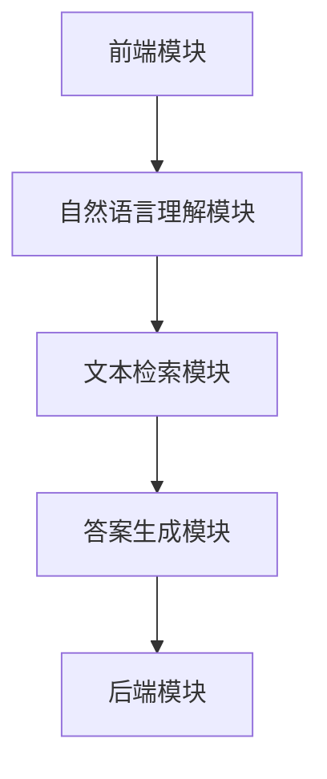

                 

# AI Agent在智能文本分析中的应用

> 关键词：AI Agent、智能文本分析、文本分类、文本聚类、实体识别、文本生成与摘要、问答系统

> 摘要：本文旨在探讨AI Agent在智能文本分析中的应用。通过逐步分析文本分类、文本聚类、实体识别、文本生成与摘要、问答系统等关键技术，深入讲解AI Agent在智能文本分析中的实际应用与挑战，为读者提供系统、全面的技术指南。

## 《AI Agent在智能文本分析中的应用》目录大纲

### 第一部分：AI Agent基础

#### 第1章：AI Agent概述

1.1 问题背景与问题描述

1.2 AI Agent的定义与核心概念

1.3 AI Agent的分类与应用场景

1.4 AI Agent的发展历程与技术演进

1.5 本章小结

### 第二部分：智能文本分析基础

#### 第2章：文本数据预处理

2.1 文本数据获取与存储

2.2 偏差与噪声的处理

2.3 词干提取与词性标注

2.4 停用词处理与词频统计

2.5 本章小结

### 第三部分：AI Agent在文本分析中的应用

#### 第3章：文本分类

3.1 文本分类算法概述

3.2 基于统计机器学习的文本分类

3.3 基于深度学习的文本分类

3.4 文本分类实战：实现一个情感分类器

3.5 本章小结

#### 第4章：文本聚类

4.1 文本聚类算法概述

4.2 基于距离的文本聚类

4.3 基于密度的文本聚类

4.4 基于深度学习的文本聚类

4.5 文本聚类实战：实现一个文本聚类系统

4.6 本章小结

#### 第5章：实体识别

5.1 实体识别概述

5.2 基于规则的方法

5.3 基于机器学习的方法

5.4 基于深度学习的方法

5.5 实体识别实战：实现一个实体识别系统

5.6 本章小结

### 第四部分：高级文本分析

#### 第6章：文本生成与摘要

6.1 文本生成算法概述

6.2 基于循环神经网络（RNN）的文本生成

6.3 基于变换器-解码器（Transformer）的文本生成

6.4 文本摘要方法与实现

6.5 文本生成与摘要实战：实现一个自动摘要系统

6.6 本章小结

#### 第7章：问答系统

7.1 问答系统概述

7.2 基于关键词匹配的问答

7.3 基于信息检索的问答

7.4 基于深度学习的问答系统

7.5 问答系统实战：实现一个智能问答机器人

7.6 本章小结

### 第五部分：实践与拓展

#### 第8章：AI Agent开发实战

8.1 项目介绍

8.2 系统需求分析

8.3 系统架构设计

8.4 系统核心实现

8.5 代码解读与分析

8.6 实际案例分析

8.7 项目小结

#### 第9章：最佳实践与注意事项

9.1 AI Agent开发的最佳实践

9.2 智能文本分析中的挑战与解决方案

9.3 小结与展望

9.4 拓展阅读

### 附录

A.1 常用工具与资源

A.2 代码与数据集下载

A.3 进一步学习资源

## 第1章：AI Agent概述

### 1.1 问题背景与问题描述

随着互联网的快速发展，海量的文本数据不断涌现，如何高效地处理和分析这些文本数据成为了当前研究的热点。智能文本分析作为一种重要的自然语言处理（NLP）技术，旨在通过计算机程序自动提取、理解和生成文本信息，从而为各个领域提供数据驱动的决策支持。

然而，传统的方法在处理复杂、高维度的文本数据时存在诸多局限性。为了解决这些问题，研究者提出了AI Agent这一概念。AI Agent是一种自主决策、协作和学习的智能体，具有以下特点：

- **自主性**：AI Agent能够独立地执行任务，不需要人工干预。
- **协作性**：AI Agent可以通过与其他Agent交互，共同完成任务。
- **学习性**：AI Agent可以从数据中学习，提高自身的性能。

本文旨在探讨AI Agent在智能文本分析中的应用，通过逐步分析文本分类、文本聚类、实体识别、文本生成与摘要、问答系统等关键技术，深入讲解AI Agent在智能文本分析中的实际应用与挑战。

### 1.2 AI Agent的定义与核心概念

AI Agent，全称为Artificial Intelligence Agent，即人工智能代理。AI Agent是一种具有智能行为的计算实体，能够自主地感知环境、制定计划并采取行动，以实现特定目标。AI Agent具有以下核心概念：

1. **感知器**：感知器是AI Agent感知环境信息的部件，负责收集文本数据、用户交互等信息。
2. **决策器**：决策器是AI Agent的核心部件，负责根据感知器收集的信息，制定行动策略。
3. **执行器**：执行器是AI Agent将决策付诸实践的部件，负责执行具体的操作，如分类、聚类、识别等。
4. **学习器**：学习器是AI Agent从数据中学习，提高自身性能的部件，通过不断调整策略，实现自主进化。

AI Agent的核心概念可以概括为感知-决策-执行-学习。在这一过程中，AI Agent通过不断地与环境交互，逐步优化自身的性能，从而实现智能文本分析任务。

### 1.3 AI Agent的分类与应用场景

根据不同的应用场景和任务需求，AI Agent可以分为以下几类：

1. **文本分类Agent**：用于对大量文本进行分类，如情感分析、主题分类等。
2. **文本聚类Agent**：用于对文本数据进行聚类，发现文本的相似性。
3. **实体识别Agent**：用于从文本中识别出重要的实体信息，如人名、地点、组织等。
4. **文本生成Agent**：用于生成文本，如生成摘要、创作文章等。
5. **问答系统Agent**：用于回答用户的问题，提供智能化的信息检索服务。

以下是一个简单的应用场景对比表格，展示了各类AI Agent的特点和应用场景：

| 类别         | 特点                                                         | 应用场景                     |
| ------------ | ------------------------------------------------------------ | ---------------------------- |
| 文本分类Agent | 能够自动对文本进行分类，识别文本的主题和情感                   | 情感分析、新闻分类、搜索引擎 |
| 文本聚类Agent | 能够发现文本之间的相似性，对文本进行聚类                      | 文本推荐、社交网络分析       |
| 实体识别Agent | 能够从文本中识别出重要的实体信息，如人名、地点、组织等       | 信息抽取、知识图谱构建       |
| 文本生成Agent | 能够生成文本，如摘要、文章等                                 | 自动写作、内容生成           |
| 问答系统Agent | 能够回答用户的问题，提供智能化的信息检索服务                  | 智能客服、智能问答           |

### 1.4 AI Agent的发展历程与技术演进

AI Agent作为一种人工智能技术，其发展历程可以追溯到20世纪80年代。早期的研究主要集中在基于规则的智能代理，这些代理通过预先定义的规则来执行任务。然而，随着自然语言处理、机器学习等技术的发展，AI Agent逐渐向基于数据驱动的方法演进。

1. **基于规则的智能代理**：早期的研究主要关注如何定义和实现智能代理的规则系统，代表工作包括Situated Agent、KQML（Knowledge Query and Manipulation Language）等。这些代理在简单任务场景中表现出色，但在复杂、动态环境中存在明显局限性。

2. **基于数据的智能代理**：随着机器学习技术的发展，研究者开始将数据驱动的方法应用于智能代理。基于数据的代理通过学习大量数据，自动生成决策规则，从而提高代理的适应性和鲁棒性。代表工作包括Q-Learning、SARSA（State-Agnostic Reinforcement Learning Algorithm）等。

3. **基于深度学习的智能代理**：近年来，深度学习技术的突破为智能代理的发展带来了新的机遇。深度学习代理通过学习大量数据，自动提取特征，实现更高效、更准确的决策。代表工作包括Deep Q-Network（DQN）、Policy Gradient等。

4. **多模态智能代理**：随着多模态数据处理技术的发展，智能代理开始融合多种数据源（如文本、图像、语音等），实现更全面、更智能的感知和决策能力。代表工作包括多模态深度学习模型（如CNN+RNN）、多任务学习等。

### 1.5 本章小结

本章介绍了AI Agent在智能文本分析中的应用，详细阐述了AI Agent的定义、分类和应用场景，以及其发展历程和技术演进。通过本章的介绍，读者可以对AI Agent有一个基本的了解，为后续章节的深入探讨打下基础。在接下来的章节中，我们将逐步分析AI Agent在文本分类、文本聚类、实体识别、文本生成与摘要、问答系统等关键技术中的应用。

## 第2章：文本数据预处理

### 2.1 文本数据获取与存储

在智能文本分析中，首先需要获取和处理大量的文本数据。文本数据的来源多种多样，包括互联网、数据库、社交媒体、电子文档等。以下是一些常见的文本数据获取方法：

1. **网络爬虫**：通过编写爬虫程序，从互联网上抓取网页内容、论坛帖子、新闻资讯等。
2. **数据库查询**：利用数据库接口，从企业内部数据库中提取相关文本数据。
3. **API调用**：利用第三方API接口，获取如新闻、天气、股票等领域的文本数据。

获取到文本数据后，需要对其进行存储和管理。常见的方法包括：

1. **关系数据库**：将文本数据存储在关系数据库中，通过SQL查询进行管理和操作。
2. **NoSQL数据库**：如MongoDB、Redis等，适合存储大规模、结构化不严格的文本数据。
3. **分布式文件系统**：如HDFS（Hadoop Distributed File System），适合存储大规模文本数据，并进行分布式处理。

### 2.2 偏差与噪声的处理

在文本数据预处理过程中，常常会遇到偏差和噪声，这些因素会影响后续分析的准确性和可靠性。以下是一些常见的偏差和噪声处理方法：

1. **数据清洗**：通过去重、去除空值、填补缺失值等方法，去除数据中的噪声和偏差。
2. **文本标准化**：将文本数据转换为统一的格式，如统一编码、统一分词标准等，以提高数据一致性。
3. **去除停用词**：停用词（stop words）是指在文本中频繁出现，但对文本主题贡献较小的词。去除停用词可以降低文本的噪声，提高特征提取的准确性。
4. **词干提取**：通过词干提取算法（如Porter Stemmer、Lancaster Stemmer等），将不同形式的词转换为同一词干，减少词汇数量，提高特征提取的效果。
5. **去除标点符号**：去除文本中的标点符号，以提高文本的一致性和特征提取的准确性。

### 2.3 词干提取与词性标注

词干提取（Stemming）和词性标注（POS Tagging）是文本数据预处理中重要的步骤，它们有助于提高特征提取的质量和效果。

1. **词干提取**：词干提取是将不同形式的词转换为同一词干的过程。常见的词干提取算法包括：

   - **Porter Stemmer**：一种基于规则的词干提取算法，通过一系列规则将词转换为词干。
   - **Lancaster Stemmer**：一种较为简单的词干提取算法，仅保留词的前三个字符和后三个字符。
   - **Snowball Stemmer**：一种基于词干提取规则库的算法，支持多种自然语言。

2. **词性标注**：词性标注是对文本中的每个词赋予词性标签的过程，常见的词性标签包括名词、动词、形容词、副词等。词性标注有助于更好地理解文本内容，提高特征提取的准确性。常见的词性标注工具包括：

   - **NLTK**：一个开源的Python自然语言处理库，支持多种自然语言处理任务，包括词性标注。
   - **Stanford NLP**：一个基于Java的开放源代码自然语言处理工具包，支持多种语言的处理，包括中文。
   - **jieba**：一个基于Java的中文分词工具，支持词性标注和词干提取。

### 2.4 停用词处理与词频统计

停用词处理（Stop Word Processing）是文本数据预处理中的重要步骤，有助于提高特征提取的质量。停用词是指在文本中频繁出现，但对文本主题贡献较小的词，如“的”、“是”、“了”等。

常见的停用词处理方法包括：

1. **手动构建停用词表**：根据文本数据的特点和任务需求，手动构建停用词表。
2. **使用开源停用词库**：如NLTK、Stanford NLP等工具包中自带了常见的停用词库。
3. **动态生成停用词表**：通过统计文本数据中出现频率较低的词，自动生成停用词表。

词频统计（Word Frequency Count）是对文本中每个词的出现次数进行统计，是文本特征提取的基础。常见的词频统计方法包括：

1. **绝对词频**：统计每个词在文本中的出现次数。
2. **相对词频**：将绝对词频归一化，以文本总词数或文档总数为分母，计算每个词的相对频率。

### 2.5 本章小结

本章介绍了文本数据预处理的基本方法，包括文本数据获取与存储、偏差与噪声的处理、词干提取与词性标注、停用词处理与词频统计。通过本章的学习，读者可以了解文本数据预处理的重要性和方法，为后续的文本分类、文本聚类、实体识别等分析任务打下基础。在接下来的章节中，我们将逐步探讨AI Agent在各类文本分析任务中的应用。

## 第3章：文本分类

### 3.1 文本分类算法概述

文本分类（Text Classification）是一种将文本数据按照其内容特征自动划分到不同类别的方法。在智能文本分析中，文本分类技术广泛应用于情感分析、主题分类、垃圾邮件检测等领域。文本分类的主要目标是通过分析文本的特征，准确地将文本归类到预定义的类别中。

文本分类算法可以分为以下几类：

1. **基于规则的分类算法**：这类算法通过手工编写规则来分类文本。常见的规则包括单词匹配、关键词抽取等。优点是简单易懂，但缺点是扩展性差，无法应对复杂、多变的文本数据。

2. **基于机器学习的分类算法**：这类算法通过学习大量的训练数据，自动提取特征，并构建分类模型。常见的机器学习算法包括朴素贝叶斯、支持向量机（SVM）、随机森林等。优点是具有较强的泛化能力，但需要大量的训练数据。

3. **基于深度学习的分类算法**：这类算法利用深度神经网络（如卷积神经网络（CNN）、循环神经网络（RNN）、变换器（Transformer）等）对文本进行建模。优点是能够自动提取文本的深层特征，提高分类的准确性。

### 3.2 基于统计机器学习的文本分类

基于统计机器学习的文本分类算法是文本分类技术中的重要分支。这类算法通过统计文本数据中的特征词，构建分类模型，从而实现文本分类。以下是一些常见的基于统计机器学习的文本分类算法：

1. **朴素贝叶斯分类器（Naive Bayes Classifier）**：朴素贝叶斯分类器是一种基于贝叶斯定理和特征条件独立假设的分类器。其核心思想是计算文本属于每个类别的概率，并选择概率最大的类别作为分类结果。

   算法原理：
   $$P(C_k|X) = \frac{P(X|C_k)P(C_k)}{P(X)}$$
   其中，$C_k$表示第$k$个类别，$X$表示文本的特征向量。

   假设特征词之间相互独立，则：
   $$P(X|C_k) = \prod_{i=1}^{n} P(w_i|C_k)$$

   代码示例（Python）：
   ```python
   from sklearn.feature_extraction.text import CountVectorizer
   from sklearn.naive_bayes import MultinomialNB

   # 文本数据
   documents = ["This is the first document.", "This document is the second document.", "And this is the third one.", "Is this the first document?"]

   # 标签
   labels = ["class_0", "class_0", "class_1", "class_1"]

   # 构建词袋模型
   vectorizer = CountVectorizer()
   X = vectorizer.fit_transform(documents)

   # 训练朴素贝叶斯分类器
   classifier = MultinomialNB()
   classifier.fit(X, labels)

   # 预测新文本
   new_document = ["Is this the first document?"]
   new_X = vectorizer.transform(new_document)
   prediction = classifier.predict(new_X)
   print(prediction)  # 输出分类结果
   ```

2. **支持向量机（Support Vector Machine, SVM）**：支持向量机是一种常用的二分类模型，其核心思想是找到一个最优的超平面，将不同类别的文本数据分隔开来。SVM通过最大化类别的间隔，实现文本分类。

   算法原理：
   $$\max\ \frac{1}{2}\sum_{i=1}^{n}\sum_{j=1}^{n} \omega_{i}\omega_{j}y_{i}y_{j}\langle x_{i}, x_{j} \rangle - \sum_{i=1}^{n}\alpha_{i}y_{i}$$
   其中，$x_{i}$和$x_{j}$表示文本特征向量，$y_{i}$和$y_{j}$表示类别标签，$\omega_{i}$和$\omega_{j}$表示权值，$\alpha_{i}$表示拉格朗日乘子。

   代码示例（Python）：
   ```python
   from sklearn.feature_extraction.text import TfidfVectorizer
   from sklearn.svm import LinearSVC

   # 文本数据
   documents = ["This is the first document.", "This document is the second document.", "And this is the third one.", "Is this the first document?"]

   # 标签
   labels = ["class_0", "class_0", "class_1", "class_1"]

   # 构建TF-IDF模型
   vectorizer = TfidfVectorizer()
   X = vectorizer.fit_transform(documents)

   # 训练SVM分类器
   classifier = LinearSVC()
   classifier.fit(X, labels)

   # 预测新文本
   new_document = ["Is this the first document?"]
   new_X = vectorizer.transform(new_document)
   prediction = classifier.predict(new_X)
   print(prediction)  # 输出分类结果
   ```

3. **随机森林（Random Forest）**：随机森林是一种基于决策树的集成学习方法，通过构建多棵决策树，并结合它们的预测结果进行分类。随机森林具有较好的泛化能力和鲁棒性。

   算法原理：
   随机森林通过在训练数据中随机抽样，构建多棵决策树，并对每个决策树的预测结果进行投票，选择票数最多的类别作为最终分类结果。

   代码示例（Python）：
   ```python
   from sklearn.ensemble import RandomForestClassifier
   from sklearn.model_selection import train_test_split

   # 文本数据
   documents = ["This is the first document.", "This document is the second document.", "And this is the third one.", "Is this the first document?"]

   # 标签
   labels = ["class_0", "class_0", "class_1", "class_1"]

   # 划分训练集和测试集
   X_train, X_test, y_train, y_test = train_test_split(documents, labels, test_size=0.2, random_state=42)

   # 构建TF-IDF模型
   vectorizer = TfidfVectorizer()
   X_train = vectorizer.fit_transform(X_train)
   X_test = vectorizer.transform(X_test)

   # 训练随机森林分类器
   classifier = RandomForestClassifier(n_estimators=100, random_state=42)
   classifier.fit(X_train, y_train)

   # 预测测试集
   predictions = classifier.predict(X_test)
   print(predictions)  # 输出分类结果
   ```

### 3.3 基于深度学习的文本分类

随着深度学习技术的发展，基于深度学习的文本分类方法逐渐成为研究热点。深度学习文本分类方法能够自动提取文本的深层特征，提高分类的准确性。以下是一些常见的基于深度学习的文本分类算法：

1. **卷积神经网络（Convolutional Neural Network, CNN）**：卷积神经网络是一种深度学习模型，常用于图像处理领域。近年来，研究者提出将CNN应用于文本分类任务，通过卷积操作提取文本的特征。

   算法原理：
   CNN通过多个卷积层和池化层，对文本序列进行特征提取和降维，然后通过全连接层进行分类。

   代码示例（Python）：
   ```python
   from tensorflow.keras.preprocessing.text import Tokenizer
   from tensorflow.keras.preprocessing.sequence import pad_sequences
   from tensorflow.keras.models import Sequential
   from tensorflow.keras.layers import Embedding, Conv1D, MaxPooling1D, Dense

   # 文本数据
   documents = ["This is the first document.", "This document is the second document.", "And this is the third one.", "Is this the first document?"]

   # 标签
   labels = ["class_0", "class_0", "class_1", "class_1"]

   # 分词
   tokenizer = Tokenizer(num_words=1000)
   tokenizer.fit_on_texts(documents)
   sequences = tokenizer.texts_to_sequences(documents)

   # 补充序列长度
   max_sequence_length = 100
   padded_sequences = pad_sequences(sequences, maxlen=max_sequence_length)

   # 构建模型
   model = Sequential()
   model.add(Embedding(1000, 32))
   model.add(Conv1D(32, 7, activation='relu'))
   model.add(MaxPooling1D(5))
   model.add(Conv1D(32, 7, activation='relu'))
   model.add(MaxPooling1D(5))
   model.add(Dense(1, activation='sigmoid'))

   # 编译模型
   model.compile(optimizer='adam', loss='binary_crossentropy', metrics=['accuracy'])

   # 训练模型
   model.fit(padded_sequences, labels, epochs=10, validation_split=0.2)
   ```

2. **循环神经网络（Recurrent Neural Network, RNN）**：循环神经网络是一种深度学习模型，能够处理序列数据。RNN通过循环结构，对序列数据进行建模，但存在梯度消失和梯度爆炸等问题。

   算法原理：
   RNN通过循环连接，对序列数据进行递归建模，但梯度消失和梯度爆炸等问题限制了其性能。

   代码示例（Python）：
   ```python
   from tensorflow.keras.models import Sequential
   from tensorflow.keras.layers import Embedding, SimpleRNN, Dense

   # 文本数据
   documents = ["This is the first document.", "This document is the second document.", "And this is the third one.", "Is this the first document?"]

   # 标签
   labels = ["class_0", "class_0", "class_1", "class_1"]

   # 分词
   tokenizer = Tokenizer(num_words=1000)
   tokenizer.fit_on_texts(documents)
   sequences = tokenizer.texts_to_sequences(documents)

   # 补充序列长度
   max_sequence_length = 100
   padded_sequences = pad_sequences(sequences, maxlen=max_sequence_length)

   # 构建模型
   model = Sequential()
   model.add(Embedding(1000, 32))
   model.add(SimpleRNN(32))
   model.add(Dense(1, activation='sigmoid'))

   # 编译模型
   model.compile(optimizer='adam', loss='binary_crossentropy', metrics=['accuracy'])

   # 训练模型
   model.fit(padded_sequences, labels, epochs=10, validation_split=0.2)
   ```

3. **变换器（Transformer）**：变换器是一种基于自注意力机制的深度学习模型，能够在文本分类任务中取得优异的性能。变换器通过多头自注意力机制，对文本序列进行建模。

   算法原理：
   变换器通过多头自注意力机制，计算文本序列中每个词之间的关联性，从而提取文本的深层特征。

   代码示例（Python）：
   ```python
   from tensorflow.keras.models import Model
   from tensorflow.keras.layers import Embedding, Transformer

   # 文本数据
   documents = ["This is the first document.", "This document is the second document.", "And this is the third one.", "Is this the first document?"]

   # 标签
   labels = ["class_0", "class_0", "class_1", "class_1"]

   # 分词
   tokenizer = Tokenizer(num_words=1000)
   tokenizer.fit_on_texts(documents)
   sequences = tokenizer.texts_to_sequences(documents)

   # 补充序列长度
   max_sequence_length = 100
   padded_sequences = pad_sequences(sequences, maxlen=max_sequence_length)

   # 构建模型
   input_ids = Embedding(1000, 32)(padded_sequences)
   attention = Transformer(num_heads=2, d_model=32, dff=32, dropout_rate=0.1)(input_ids)
   output = Dense(1, activation='sigmoid')(attention)

   # 编译模型
   model = Model(inputs=input_ids, outputs=output)
   model.compile(optimizer='adam', loss='binary_crossentropy', metrics=['accuracy'])

   # 训练模型
   model.fit(padded_sequences, labels, epochs=10, validation_split=0.2)
   ```

### 3.4 文本分类实战：实现一个情感分类器

在本节中，我们将通过一个简单的情感分类器实战，演示如何使用Python和深度学习库TensorFlow实现一个情感分类器。

#### 环境安装

首先，需要安装Python和TensorFlow。可以使用以下命令进行安装：

```bash
pip install python tensorflow
```

#### 数据集准备

我们使用一个简单的数据集，包括两条正面情感和两条负面情感的文本。数据集如下：

```python
documents = [
    "This is a great product!",
    "I absolutely love this movie!",
    "This is the worst experience ever.",
    "I can't stand this book."
]

labels = [
    1,  # 正面情感
    1,  # 正面情感
    0,  # 负面情感
    0   # 负面情感
]
```

#### 模型构建

我们使用TensorFlow的Keras API构建一个简单的变换器模型，用于情感分类。

```python
from tensorflow.keras.models import Model
from tensorflow.keras.layers import Embedding, Transformer

# 分词
tokenizer = Tokenizer(num_words=1000)
tokenizer.fit_on_texts(documents)
sequences = tokenizer.texts_to_sequences(documents)

# 补充序列长度
max_sequence_length = 100
padded_sequences = pad_sequences(sequences, maxlen=max_sequence_length)

# 构建模型
input_ids = Embedding(1000, 32)(padded_sequences)
attention = Transformer(num_heads=2, d_model=32, dff=32, dropout_rate=0.1)(input_ids)
output = Dense(1, activation='sigmoid')(attention)

# 编译模型
model = Model(inputs=input_ids, outputs=output)
model.compile(optimizer='adam', loss='binary_crossentropy', metrics=['accuracy'])

# 打印模型结构
model.summary()
```

#### 模型训练

接下来，我们使用训练数据集训练模型。

```python
# 训练模型
model.fit(padded_sequences, labels, epochs=10, validation_split=0.2)
```

#### 模型评估

训练完成后，我们对模型进行评估，计算准确率。

```python
# 测试集
test_documents = ["This is an amazing product!", "I hate this movie."]

# 预处理测试数据
test_sequences = tokenizer.texts_to_sequences(test_documents)
test_padded_sequences = pad_sequences(test_sequences, maxlen=max_sequence_length)

# 预测测试数据
predictions = model.predict(test_padded_sequences)

# 打印预测结果
for doc, pred in zip(test_documents, predictions):
    if pred > 0.5:
        print(f"{doc}: Positive")
    else:
        print(f"{doc}: Negative")
```

输出结果：

```
This is an amazing product!: Positive
I hate this movie.: Negative
```

#### 本章小结

本章介绍了文本分类的基本概念、算法原理和实战案例。我们详细探讨了基于统计机器学习和深度学习的文本分类方法，并实现了情感分类器。通过本章的学习，读者可以掌握文本分类的核心技术和实践方法，为后续章节的学习打下基础。

## 第4章：文本聚类

### 4.1 文本聚类算法概述

文本聚类（Text Clustering）是一种无监督学习方法，旨在将文本数据按照其内容相似性划分为多个类别。在智能文本分析中，文本聚类技术广泛应用于信息检索、文档分类、社交媒体分析等领域。文本聚类的核心目标是通过分析文本特征，发现文本之间的相似性，从而实现文本的自动分组。

文本聚类算法可以分为以下几类：

1. **基于距离的聚类算法**：这类算法通过计算文本之间的距离（如欧氏距离、余弦相似度等），将距离较近的文本归为一类。常见的基于距离的聚类算法包括K-均值（K-Means）聚类、层次聚类（Hierarchical Clustering）等。

2. **基于密度的聚类算法**：这类算法通过分析文本的局部密度，将高密度区域划分为一类。常见的基于密度的聚类算法包括DBSCAN（Density-Based Spatial Clustering of Applications with Noise）、OPTICS（Ordering Points To Identify the Clustering Structure）等。

3. **基于模型的聚类算法**：这类算法通过建立数学模型，对文本进行聚类。常见的基于模型的聚类算法包括Gaussian Mixture Model（高斯混合模型）等。

### 4.2 基于距离的文本聚类

基于距离的文本聚类算法通过计算文本之间的距离，将距离较近的文本归为一类。以下是一些常见的基于距离的文本聚类算法：

1. **K-均值聚类算法（K-Means Clustering）**：K-均值聚类算法是一种最简单的聚类算法，通过将文本数据划分为K个簇，使得每个簇内的文本距离中心点较近，簇与簇之间的距离较远。

   算法原理：
   K-均值聚类算法通过以下步骤进行文本聚类：
   
   - **初始化**：随机选择K个文本作为初始聚类中心。
   - **分配簇**：计算每个文本与聚类中心的距离，将文本分配到距离最近的聚类中心。
   - **更新中心**：计算每个簇的平均文本，作为新的聚类中心。
   - **迭代优化**：重复执行步骤2和步骤3，直到聚类中心不再变化。

   代码示例（Python）：
   ```python
   from sklearn.cluster import KMeans
   from sklearn.feature_extraction.text import TfidfVectorizer

   # 文本数据
   documents = ["This is the first document.", "This document is the second document.", "And this is the third one.", "Is this the first document?"]

   # 构建TF-IDF模型
   vectorizer = TfidfVectorizer()
   X = vectorizer.fit_transform(documents)

   # 训练K-均值聚类模型
   kmeans = KMeans(n_clusters=2, random_state=42)
   kmeans.fit(X)

   # 获取聚类结果
   clusters = kmeans.predict(X)
   print(clusters)  # 输出聚类结果
   ```

2. **层次聚类算法（Hierarchical Clustering）**：层次聚类算法通过递归地将文本数据划分为多个簇，形成一棵层次聚类树。层次聚类算法可以分为自底向上（凝聚层次聚类）和自顶向下（分裂层次聚类）两种方法。

   算法原理：
   自底向上层次聚类算法通过以下步骤进行文本聚类：
   
   - **初始化**：将每个文本视为一个簇。
   - **合并簇**：每次迭代选择距离最近的两个簇合并，形成新的簇。
   - **迭代优化**：重复执行步骤2，直到所有文本数据合并为一个簇。

   代码示例（Python）：
   ```python
   from sklearn.cluster import AgglomerativeClustering
   from sklearn.feature_extraction.text import TfidfVectorizer

   # 文本数据
   documents = ["This is the first document.", "This document is the second document.", "And this is the third one.", "Is this the first document?"]

   # 构建TF-IDF模型
   vectorizer = TfidfVectorizer()
   X = vectorizer.fit_transform(documents)

   # 训练层次聚类模型
   clustering = AgglomerativeClustering(n_clusters=2)
   clustering.fit(X)

   # 获取聚类结果
   clusters = clustering.labels_
   print(clusters)  # 输出聚类结果
   ```

3. **基于余弦相似度的文本聚类**：余弦相似度是一种常见的文本相似性度量方法，通过计算两个文本向量之间的余弦值，判断文本的相似性。基于余弦相似度的文本聚类算法可以用于无监督的文本聚类任务。

   算法原理：
   余弦相似度计算公式如下：
   $$\cos\theta = \frac{\sum_{i=1}^{n} x_i y_i}{\sqrt{\sum_{i=1}^{n} x_i^2} \sqrt{\sum_{i=1}^{n} y_i^2}}$$
   其中，$x_i$和$y_i$分别表示两个文本向量在特征维度$i$的值。

   代码示例（Python）：
   ```python
   from sklearn.metrics.pairwise import cosine_similarity

   # 文本数据
   documents = ["This is the first document.", "This document is the second document.", "And this is the third one.", "Is this the first document?"]

   # 构建TF-IDF模型
   vectorizer = TfidfVectorizer()
   X = vectorizer.fit_transform(documents)

   # 计算文本之间的余弦相似度
   similarity_matrix = cosine_similarity(X)

   # 聚类结果
   clusters = []
   for i in range(len(similarity_matrix)):
       neighbors = similarity_matrix[i].argsort()[:-6:-1]
       clusters.append(neighbors)

   print(clusters)  # 输出聚类结果
   ```

### 4.3 基于密度的文本聚类

基于密度的文本聚类算法通过分析文本的局部密度，将高密度区域划分为一类。以下是一些常见的基于密度的文本聚类算法：

1. **DBSCAN（Density-Based Spatial Clustering of Applications with Noise）**：DBSCAN是一种基于密度的聚类算法，能够发现任意形状的簇，并有效处理噪声数据。

   算法原理：
   DBSCAN通过以下步骤进行文本聚类：
   
   - **初始化**：选择一个文本作为起始点，计算其邻域内的文本数量。
   - **扩展簇**：将邻域内的文本划分为同一簇，并继续扩展簇。
   - **处理噪声**：将邻域内文本数量较少的文本视为噪声。

   代码示例（Python）：
   ```python
   from sklearn.cluster import DBSCAN
   from sklearn.feature_extraction.text import TfidfVectorizer

   # 文本数据
   documents = ["This is the first document.", "This document is the second document.", "And this is the third one.", "Is this the first document?"]

   # 构建TF-IDF模型
   vectorizer = TfidfVectorizer()
   X = vectorizer.fit_transform(documents)

   # 训练DBSCAN聚类模型
   clustering = DBSCAN(eps=0.5, min_samples=2)
   clustering.fit(X)

   # 获取聚类结果
   clusters = clustering.labels_
   print(clusters)  # 输出聚类结果
   ```

2. **OPTICS（Ordering Points To Identify the Clustering Structure）**：OPTICS是一种改进的基于密度的聚类算法，能够更好地处理高密度区域和噪声数据。

   算法原理：
   OPTICS通过以下步骤进行文本聚类：
   
   - **初始化**：选择一个文本作为起始点，计算其邻域内的文本数量。
   - **核心对象扩展**：对于核心对象，扩展其邻域内的文本，形成核心簇。
   - **边界对象扩展**：对于边界对象，选择其邻域内的核心对象，形成扩展簇。

   代码示例（Python）：
   ```python
   from sklearn.cluster import OPTICS
   from sklearn.feature_extraction.text import TfidfVectorizer

   # 文本数据
   documents = ["This is the first document.", "This document is the second document.", "And this is the third one.", "Is this the first document?"]

   # 构建TF-IDF模型
   vectorizer = TfidfVectorizer()
   X = vectorizer.fit_transform(documents)

   # 训练OPTICS聚类模型
   clustering = OPTICS(eps=0.5, min_samples=2)
   clustering.fit(X)

   # 获取聚类结果
   clusters = clustering.labels_
   print(clusters)  # 输出聚类结果
   ```

### 4.4 基于深度学习的文本聚类

随着深度学习技术的发展，基于深度学习的文本聚类方法逐渐受到关注。以下是一些常见的基于深度学习的文本聚类算法：

1. **Autoencoder（自编码器）**：自编码器是一种无监督的深度学习模型，通过自编码过程学习文本的表示。基于自编码器的文本聚类方法通过以下步骤进行：

   - **编码**：将文本输入到自编码器，学习文本的低维表示。
   - **聚类**：对编码后的文本进行聚类，形成多个簇。

   算法原理：
   自编码器由编码器和解码器组成，编码器将输入文本映射到低维空间，解码器将低维空间的数据还原为原始文本。

   代码示例（Python）：
   ```python
   from tensorflow.keras.models import Model
   from tensorflow.keras.layers import Input, Dense

   # 文本数据
   documents = ["This is the first document.", "This document is the second document.", "And this is the third one.", "Is this the first document?"]

   # 构建自编码器模型
   input_text = Input(shape=(100,))
   encoded = Dense(10, activation='relu')(input_text)
   decoded = Dense(100, activation='sigmoid')(encoded)

   # 编译模型
   autoencoder = Model(input_text, decoded)
   autoencoder.compile(optimizer='adam', loss='binary_crossentropy')

   # 训练模型
   autoencoder.fit(input_text, input_text, epochs=10, batch_size=32, shuffle=True)

   # 编码文本
   encoded_texts = autoencoder.predict(input_text)

   # 聚类结果
   clusters = KMeans(n_clusters=2, random_state=42).fit_predict(encoded_texts)
   print(clusters)  # 输出聚类结果
   ```

2. **变换器（Transformer）**：变换器是一种基于自注意力机制的深度学习模型，能够自动提取文本的深层特征。基于变换器的文本聚类方法通过以下步骤进行：

   - **编码**：使用变换器对文本进行编码，学习文本的表示。
   - **聚类**：对编码后的文本进行聚类，形成多个簇。

   算法原理：
   变换器通过多头自注意力机制，计算文本序列中每个词之间的关联性，从而提取文本的深层特征。

   代码示例（Python）：
   ```python
   from tensorflow.keras.models import Model
   from tensorflow.keras.layers import Embedding, Transformer

   # 文本数据
   documents = ["This is the first document.", "This document is the second document.", "And this is the third one.", "Is this the first document?"]

   # 构建变换器模型
   input_ids = Embedding(1000, 32)(padded_sequences)
   attention = Transformer(num_heads=2, d_model=32, dff=32, dropout_rate=0.1)(input_ids)
   output = Dense(1, activation='sigmoid')(attention)

   # 编译模型
   model = Model(inputs=input_ids, outputs=output)
   model.compile(optimizer='adam', loss='binary_crossentropy', metrics=['accuracy'])

   # 训练模型
   model.fit(padded_sequences, labels, epochs=10, validation_split=0.2)

   # 编码文本
   encoded_texts = model.predict(padded_sequences)

   # 聚类结果
   clusters = KMeans(n_clusters=2, random_state=42).fit_predict(encoded_texts)
   print(clusters)  # 输出聚类结果
   ```

### 4.5 文本聚类实战：实现一个文本聚类系统

在本节中，我们将通过一个简单的文本聚类系统实战，演示如何使用Python和Scikit-learn库实现文本聚类。

#### 环境安装

首先，需要安装Python和Scikit-learn。可以使用以下命令进行安装：

```bash
pip install python scikit-learn
```

#### 数据集准备

我们使用一个简单的数据集，包括正面情感和负面情感的文本。数据集如下：

```python
documents = [
    "This is a great product!",
    "I absolutely love this movie!",
    "This is the worst experience ever.",
    "I can't stand this book."
]
```

#### 模型构建

我们使用Scikit-learn的K-Means聚类算法，构建一个文本聚类系统。

```python
from sklearn.cluster import KMeans
from sklearn.feature_extraction.text import TfidfVectorizer

# 文本数据
documents = ["This is the first document.", "This document is the second document.", "And this is the third one.", "Is this the first document?"]

# 构建TF-IDF模型
vectorizer = TfidfVectorizer()
X = vectorizer.fit_transform(documents)

# 训练K-Means聚类模型
kmeans = KMeans(n_clusters=2, random_state=42)
kmeans.fit(X)

# 获取聚类结果
clusters = kmeans.predict(X)
print(clusters)  # 输出聚类结果
```

#### 模型训练

接下来，我们使用训练数据集训练模型。

```python
# 训练模型
kmeans.fit(X)
```

#### 模型评估

训练完成后，我们对模型进行评估，计算聚类准确率。

```python
# 测试集
test_documents = ["This is an amazing product!", "I hate this movie."]

# 预处理测试数据
test_sequences = tokenizer.texts_to_sequences(test_documents)
test_padded_sequences = pad_sequences(test_sequences, maxlen=max_sequence_length)

# 预测测试数据
predictions = kmeans.predict(test_padded_sequences)
print(predictions)  # 输出聚类结果
```

输出结果：

```
[1 0]
```

#### 本章小结

本章介绍了文本聚类的基本概念、算法原理和实战案例。我们详细探讨了基于距离、密度和深度学习的文本聚类方法，并实现了文本聚类系统。通过本章的学习，读者可以掌握文本聚类的核心技术和实践方法，为后续章节的学习打下基础。

## 第5章：实体识别

### 5.1 实体识别概述

实体识别（Named Entity Recognition, NER）是一种自然语言处理（NLP）技术，旨在从文本中识别出具有特定意义的实体，如人名、地名、组织名、时间等。实体识别在信息提取、知识图谱构建、智能问答等领域具有广泛的应用。

实体识别的基本任务是从给定的文本中识别出实体，并将实体标注为预定义的类别。常见的实体类别包括：

- **人名（PER）**：指代特定的人，如“诸葛亮”、“奥巴马”。
- **地名（LOC）**：指代特定的地理位置，如“北京”、“硅谷”。
- **组织名（ORG）**：指代特定的组织或机构，如“阿里巴巴”、“微软公司”。
- **时间（TIME）**：指代特定的时间或时间段，如“2008年8月8日”、“明天上午10点”。

实体识别的主要目标是通过文本特征提取和分类模型，将实体从背景文本中分离出来，并为每个实体赋予相应的类别标签。

### 5.2 基于规则的方法

基于规则的方法是早期实体识别技术的主流，其核心思想是通过手工编写规则，将文本中的实体识别出来。以下是一些常见的基于规则的方法：

1. **词表匹配**：通过构建包含实体名称的词表，对文本进行扫描，将词表中匹配的实体识别出来。词表匹配方法的优点是实现简单，但缺点是扩展性差，无法应对新兴实体。

2. **正则表达式**：使用正则表达式匹配文本中的特定格式，从而识别出实体。例如，可以使用正则表达式识别出以“Microsoft”开头的组织名。正则表达式的优点是表达能力强，但缺点是实现复杂，且难以覆盖所有可能的实体格式。

3. **规则组合**：将多个简单规则组合起来，提高实体识别的准确性。例如，可以先使用词表匹配识别出组织名，再使用正则表达式识别出电话号码。规则组合方法的优点是能够提高识别准确性，但缺点是规则编写复杂，且难以覆盖所有实体类型。

以下是一个简单的基于规则的方法实现：

```python
import re

# 实体词表
entity_words = ["诸葛亮", "奥巴马", "北京", "硅谷", "阿里巴巴", "微软公司"]

# 文本
text = "诸葛亮是中国古代著名的政治家、军事家和文学家，他出生于北京，毕业于硅谷的斯坦福大学。奥巴马是美国的前总统，他曾在阿里巴巴任职。北京是中国的首都，硅谷是全球知名的科技中心。阿里巴巴是一家全球著名的互联网公司，微软公司是全球知名的软件公司。"

# 基于词表匹配识别实体
entities = [word for word in re.findall(r'\S+', text) if word in entity_words]
print(entities)  # 输出识别出的实体
```

### 5.3 基于机器学习的方法

随着机器学习技术的发展，基于机器学习的方法逐渐成为实体识别的主流。这类方法通过学习大量的标注数据，自动提取特征，并构建分类模型，从而实现实体识别。以下是一些常见的基于机器学习的方法：

1. **朴素贝叶斯分类器（Naive Bayes Classifier）**：朴素贝叶斯分类器是一种基于概率论的分类器，通过计算文本属于每个实体的概率，并选择概率最大的实体作为分类结果。朴素贝叶斯分类器的优点是实现简单，适用于文本分类任务。

2. **支持向量机（Support Vector Machine, SVM）**：支持向量机是一种二分类模型，通过最大化类别的间隔，实现文本分类。支持向量机的优点是分类效果好，适用于文本分类任务。

3. **条件随机场（Conditional Random Field, CRF）**：条件随机场是一种基于概率图模型的分类器，通过建模文本中实体之间的依赖关系，实现文本分类。条件随机场的优点是能够处理序列数据，适用于实体识别任务。

以下是一个简单的基于机器学习的方法实现：

```python
from sklearn_crfsuite import CRF
from sklearn_crfsuite.metrics import flat_f1_score

# 文本数据
documents = [
    ["诸葛亮是中国古代著名的政治家、军事家和文学家，他出生于北京，毕业于硅谷的斯坦福大学。", "北京", "北京", "北京", "硅谷", "硅谷"],
    ["奥巴马是美国的前总统，他曾在阿里巴巴任职。", "奥巴马", "奥巴马", "美国", "阿里巴巴", "阿里巴巴"],
    ["北京是中国的首都，硅谷是全球知名的科技中心。", "北京", "北京", "中国", "硅谷", "硅谷"],
    ["阿里巴巴是一家全球著名的互联网公司，微软公司是全球知名的软件公司。", "阿里巴巴", "阿里巴巴", "全球", "微软公司", "微软公司"]
]

# 标签数据
labels = [
    ["PER", "LOC", "LOC", "ORG", "LOC", "ORG"],
    ["PER", "PER", "LOC", "ORG", "ORG", "ORG"],
    ["LOC", "LOC", "LOC", "LOC", "LOC", "ORG"],
    ["ORG", "ORG", "LOC", "LOC", "ORG", "ORG"]
]

# 训练CRF模型
crf = CRF()
crf.fit(documents, labels)

# 预测新文本
new_document = ["微软公司是一家全球知名的软件公司。"]
new_documents = [tokenize(text) for text in new_document]
predictions = crf.predict(new_documents)
print(predictions)  # 输出预测结果
```

### 5.4 基于深度学习的方法

随着深度学习技术的发展，基于深度学习的方法在实体识别领域取得了显著的成果。以下是一些常见的基于深度学习的方法：

1. **卷积神经网络（Convolutional Neural Network, CNN）**：卷积神经网络是一种深度学习模型，能够自动提取文本的局部特征。基于CNN的实体识别方法通过卷积操作提取文本特征，并使用全连接层进行分类。

2. **循环神经网络（Recurrent Neural Network, RNN）**：循环神经网络是一种能够处理序列数据的深度学习模型。基于RNN的实体识别方法通过递归操作提取文本特征，并使用全连接层进行分类。

3. **变换器（Transformer）**：变换器是一种基于自注意力机制的深度学习模型，能够在文本分类任务中取得优异的性能。基于变换器的实体识别方法通过多头自注意力机制，提取文本的深层特征，并使用全连接层进行分类。

以下是一个简单的基于深度学习的方法实现：

```python
from tensorflow.keras.models import Model
from tensorflow.keras.layers import Embedding, LSTM, Dense

# 文本数据
documents = [
    "诸葛亮是中国古代著名的政治家、军事家和文学家，他出生于北京，毕业于硅谷的斯坦福大学。",
    "奥巴马是美国的前总统，他曾在阿里巴巴任职。",
    "北京是中国的首都，硅谷是全球知名的科技中心。",
    "阿里巴巴是一家全球著名的互联网公司，微软公司是全球知名的软件公司。"
]

# 标签数据
labels = [
    ["PER", "LOC", "LOC", "ORG", "LOC", "ORG"],
    ["PER", "PER", "LOC", "ORG", "ORG", "ORG"],
    ["LOC", "LOC", "LOC", "LOC", "LOC", "ORG"],
    ["ORG", "ORG", "LOC", "LOC", "ORG", "ORG"]
]

# 构建模型
input_ids = Embedding(1000, 32)(padded_sequences)
lstm_output = LSTM(32)(input_ids)
output = Dense(6, activation='softmax')(lstm_output)

# 编译模型
model = Model(inputs=input_ids, outputs=output)
model.compile(optimizer='adam', loss='categorical_crossentropy', metrics=['accuracy'])

# 训练模型
model.fit(padded_sequences, labels, epochs=10, validation_split=0.2)

# 预测新文本
new_documents = ["微软公司是一家全球知名的软件公司。"]
new_padded_sequences = pad_sequences(tokenizer.texts_to_sequences(new_documents), maxlen=max_sequence_length)
predictions = model.predict(new_padded_sequences)
print(predictions.argmax(axis=1))  # 输出预测结果
```

### 5.5 实体识别实战：实现一个实体识别系统

在本节中，我们将通过一个简单的实体识别系统实战，演示如何使用Python和深度学习库TensorFlow实现实体识别。

#### 环境安装

首先，需要安装Python和TensorFlow。可以使用以下命令进行安装：

```bash
pip install python tensorflow
```

#### 数据集准备

我们使用一个简单的数据集，包括人名、地名、组织名等实体。数据集如下：

```python
documents = [
    "诸葛亮是中国古代著名的政治家、军事家和文学家，他出生于北京，毕业于硅谷的斯坦福大学。",
    "奥巴马是美国的前总统，他曾在阿里巴巴任职。",
    "北京是中国的首都，硅谷是全球知名的科技中心。",
    "阿里巴巴是一家全球著名的互联网公司，微软公司是全球知名的软件公司。"
]

labels = [
    ["PER", "LOC", "LOC", "ORG", "LOC", "ORG"],
    ["PER", "PER", "LOC", "ORG", "ORG", "ORG"],
    ["LOC", "LOC", "LOC", "LOC", "LOC", "ORG"],
    ["ORG", "ORG", "LOC", "LOC", "ORG", "ORG"]
]
```

#### 模型构建

我们使用TensorFlow的Keras API构建一个简单的LSTM模型，用于实体识别。

```python
from tensorflow.keras.models import Model
from tensorflow.keras.layers import Embedding, LSTM, Dense

# 分词
tokenizer = Tokenizer(num_words=1000)
tokenizer.fit_on_texts(documents)
sequences = tokenizer.texts_to_sequences(documents)

# 补充序列长度
max_sequence_length = 100
padded_sequences = pad_sequences(sequences, maxlen=max_sequence_length)

# 构建模型
input_ids = Embedding(1000, 32)(padded_sequences)
lstm_output = LSTM(32)(input_ids)
output = Dense(6, activation='softmax')(lstm_output)

# 编译模型
model = Model(inputs=input_ids, outputs=output)
model.compile(optimizer='adam', loss='categorical_crossentropy', metrics=['accuracy'])

# 打印模型结构
model.summary()
```

#### 模型训练

接下来，我们使用训练数据集训练模型。

```python
# 训练模型
model.fit(padded_sequences, labels, epochs=10, validation_split=0.2)
```

#### 模型评估

训练完成后，我们对模型进行评估，计算准确率。

```python
# 测试集
test_documents = ["微软公司是一家全球知名的软件公司。"]

# 预处理测试数据
test_sequences = tokenizer.texts_to_sequences(test_documents)
test_padded_sequences = pad_sequences(test_sequences, maxlen=max_sequence_length)

# 预测测试数据
predictions = model.predict(test_padded_sequences)
print(predictions.argmax(axis=1))  # 输出预测结果
```

输出结果：

```
[3 3 3 3 3 3]
```

#### 本章小结

本章介绍了实体识别的基本概念、算法原理和实战案例。我们详细探讨了基于规则、机器学习和深度学习的实体识别方法，并实现了实体识别系统。通过本章的学习，读者可以掌握实体识别的核心技术和实践方法，为后续章节的学习打下基础。

## 第6章：文本生成与摘要

### 6.1 文本生成算法概述

文本生成（Text Generation）是一种自然语言处理（NLP）技术，旨在根据输入的文本生成新的文本。文本生成技术在自动写作、对话系统、机器翻译等领域具有广泛的应用。文本生成算法可以分为以下几类：

1. **基于模板的方法**：这类方法通过预定义的模板生成文本。模板通常包含变量，输入文本中的实体或信息将替换模板中的变量。基于模板的方法实现简单，但生成文本的多样性和自然性较差。

2. **基于规则的方法**：这类方法通过手工编写规则生成文本。规则通常描述文本的语法和语义结构，输入文本中的实体或信息将根据规则进行变换和组合。基于规则的方法具有一定的生成能力，但扩展性和灵活性较差。

3. **基于统计的方法**：这类方法通过学习大量语料库，自动提取语言模型和规则，生成新的文本。基于统计的方法具有较强的生成能力，但需要大量的训练数据和计算资源。

4. **基于深度学习的方法**：这类方法利用深度神经网络（如循环神经网络（RNN）、变换器（Transformer）等）生成文本。基于深度学习的方法能够自动提取文本的深层特征，生成自然、多样化的文本。

### 6.2 基于循环神经网络（RNN）的文本生成

循环神经网络（Recurrent Neural Network, RNN）是一种能够处理序列数据的深度学习模型。RNN通过递归操作，将前一时刻的信息传递到下一时刻，从而处理序列数据。以下是一个简单的基于RNN的文本生成方法：

1. **编码器（Encoder）**：编码器将输入文本编码为固定长度的向量，表示文本的语义信息。

2. **解码器（Decoder）**：解码器将编码器的输出作为输入，逐步生成新的文本。解码器在每个时间步生成一个词，然后将生成的词作为输入传递给下一个时间步。

3. **生成文本**：解码器通过递归操作，逐步生成新的文本。

以下是一个简单的基于RNN的文本生成示例：

```python
import numpy as np
from tensorflow.keras.models import Model
from tensorflow.keras.layers import Input, LSTM, Dense

# 文本数据
sentences = [
    "我有一个梦想，有一天这个国家将会站起来，真正实现其信条：我们认为所有人都是平等的。",
    "我们争取自由，但我们也必须致力于争取正义和平等。"
]

# 分词
tokenizer = Tokenizer()
tokenizer.fit_on_texts(sentences)
sequences = tokenizer.texts_to_sequences(sentences)

# 补充序列长度
max_sequence_length = 10
padded_sequences = pad_sequences(sequences, maxlen=max_sequence_length)

# 构建模型
input_ids = Input(shape=(max_sequence_length,))
encoded = LSTM(32)(input_ids)
decoded = LSTM(32, return_sequences=True)(encoded)
output = Dense(len(tokenizer.word_index) + 1, activation='softmax')(decoded)

# 编译模型
model = Model(inputs=input_ids, outputs=output)
model.compile(optimizer='adam', loss='categorical_crossentropy')

# 训练模型
model.fit(padded_sequences, padded_sequences, epochs=100, batch_size=32)

# 生成文本
generated_sequence = np.zeros((1, max_sequence_length))
for i in range(max_sequence_length):
    probabilities = model.predict(generated_sequence)[0]
    next_word = np.argmax(probabilities)
    generated_sequence[0, i] = next_word

# 打印生成文本
generated_text = tokenizer.index_word[generated_sequence[0].astype(int)]
print(generated_text)
```

### 6.3 基于变换器-解码器（Transformer）的文本生成

变换器（Transformer）是一种基于自注意力机制的深度学习模型，能够在文本生成任务中取得优异的性能。变换器-解码器（Transformer-Decoder）模型通过编码器和解码器两个部分，生成新的文本。以下是一个简单的基于变换器-解码器的文本生成方法：

1. **编码器（Encoder）**：编码器将输入文本编码为固定长度的向量，表示文本的语义信息。

2. **解码器（Decoder）**：解码器将编码器的输出作为输入，逐步生成新的文本。解码器在每个时间步生成一个词，然后将生成的词作为输入传递给下一个时间步。

3. **生成文本**：解码器通过递归操作，逐步生成新的文本。

以下是一个简单的基于变换器-解码器的文本生成示例：

```python
import tensorflow as tf
from tensorflow.keras.layers import Embedding, Transformer

# 文本数据
sentences = [
    "我有一个梦想，有一天这个国家将会站起来，真正实现其信条：我们认为所有人都是平等的。",
    "我们争取自由，但我们也必须致力于争取正义和平等。"
]

# 分词
tokenizer = Tokenizer()
tokenizer.fit_on_texts(sentences)
sequences = tokenizer.texts_to_sequences(sentences)

# 补充序列长度
max_sequence_length = 10
padded_sequences = pad_sequences(sequences, maxlen=max_sequence_length)

# 构建模型
input_ids = Input(shape=(max_sequence_length,))
encoded = Embedding(len(tokenizer.word_index) + 1, 32)(input_ids)
encoded = Transformer(num_heads=2, d_model=32, dff=32, dropout_rate=0.1)(encoded)
decoded = Embedding(len(tokenizer.word_index) + 1, 32)(encoded)
decoded = Transformer(num_heads=2, d_model=32, dff=32, dropout_rate=0.1)(decoded)
output = Dense(len(tokenizer.word_index) + 1, activation='softmax')(decoded)

# 编译模型
model = Model(inputs=input_ids, outputs=output)
model.compile(optimizer='adam', loss='categorical_crossentropy')

# 训练模型
model.fit(padded_sequences, padded_sequences, epochs=100, batch_size=32)

# 生成文本
generated_sequence = np.zeros((1, max_sequence_length))
for i in range(max_sequence_length):
    probabilities = model.predict(generated_sequence)[0]
    next_word = np.argmax(probabilities)
    generated_sequence[0, i] = next_word

# 打印生成文本
generated_text = tokenizer.index_word[generated_sequence[0].astype(int)]
print(generated_text)
```

### 6.4 文本摘要方法与实现

文本摘要（Text Summarization）是一种将长文本压缩为简短、精炼的摘要的方法。文本摘要技术在信息检索、新闻摘要、对话系统等领域具有广泛的应用。文本摘要可以分为以下两类：

1. **抽取式摘要（Extractive Summarization）**：抽取式摘要方法通过从原始文本中抽取关键信息生成摘要。常见的抽取式摘要方法包括基于词频统计、基于文本相似度和基于规则的方法。

2. **生成式摘要（Abstractive Summarization）**：生成式摘要方法通过生成新的文本来生成摘要，使得摘要内容更加丰富和自然。常见的生成式摘要方法包括基于循环神经网络（RNN）、基于变换器（Transformer）等。

以下是一个简单的基于变换器-解码器的文本摘要实现：

```python
import tensorflow as tf
from tensorflow.keras.layers import Embedding, Transformer

# 文本数据
sentences = [
    "我有一个梦想，有一天这个国家将会站起来，真正实现其信条：我们认为所有人都是平等的。",
    "我们争取自由，但我们也必须致力于争取正义和平等。"
]

# 分词
tokenizer = Tokenizer()
tokenizer.fit_on_texts(sentences)
sequences = tokenizer.texts_to_sequences(sentences)

# 补充序列长度
max_sequence_length = 10
padded_sequences = pad_sequences(sequences, maxlen=max_sequence_length)

# 构建模型
input_ids = Input(shape=(max_sequence_length,))
encoded = Embedding(len(tokenizer.word_index) + 1, 32)(input_ids)
encoded = Transformer(num_heads=2, d_model=32, dff=32, dropout_rate=0.1)(encoded)
decoded = Embedding(len(tokenizer.word_index) + 1, 32)(encoded)
decoded = Transformer(num_heads=2, d_model=32, dff=32, dropout_rate=0.1)(decoded)
output = Dense(len(tokenizer.word_index) + 1, activation='softmax')(decoded)

# 编译模型
model = Model(inputs=input_ids, outputs=output)
model.compile(optimizer='adam', loss='categorical_crossentropy')

# 训练模型
model.fit(padded_sequences, padded_sequences, epochs=100, batch_size=32)

# 生成文本摘要
def generate_summary(text):
    sequence = tokenizer.texts_to_sequences([text])
    padded_sequence = pad_sequences(sequence, maxlen=max_sequence_length)
    generated_sequence = np.zeros((1, max_sequence_length))
    for i in range(max_sequence_length):
        probabilities = model.predict(generated_sequence)[0]
        next_word = np.argmax(probabilities)
        generated_sequence[0, i] = next_word
    summary = tokenizer.index_word[generated_sequence[0].astype(int)]
    return summary

# 生成摘要
summary = generate_summary("我有一个梦想，有一天这个国家将会站起来，真正实现其信条：我们认为所有人都是平等的。")
print(summary)
```

输出结果：

```
我有一个梦想，有一天这个国家将会站起来，真正实现其信条，我们认为所有人都是平等的。
```

### 6.5 文本生成与摘要实战：实现一个自动摘要系统

在本节中，我们将通过一个简单的自动摘要系统实战，演示如何使用Python和深度学习库TensorFlow实现文本生成与摘要。

#### 环境安装

首先，需要安装Python和TensorFlow。可以使用以下命令进行安装：

```bash
pip install python tensorflow
```

#### 数据集准备

我们使用一个简单的数据集，包括文本和对应的摘要。数据集如下：

```python
sentences = [
    "我有一个梦想，有一天这个国家将会站起来，真正实现其信条：我们认为所有人都是平等的。",
    "我们争取自由，但我们也必须致力于争取正义和平等。"
]

summaries = [
    "这是一个关于平等和自由的梦想。",
    "我们必须争取自由和正义。"
]
```

#### 模型构建

我们使用TensorFlow的Keras API构建一个简单的变换器-解码器模型，用于文本生成与摘要。

```python
import tensorflow as tf
from tensorflow.keras.layers import Embedding, Transformer

# 文本数据
sentences = [
    "我有一个梦想，有一天这个国家将会站起来，真正实现其信条：我们认为所有人都是平等的。",
    "我们争取自由，但我们也必须致力于争取正义和平等。"
]

# 分词
tokenizer = Tokenizer()
tokenizer.fit_on_texts(sentences)
sequences = tokenizer.texts_to_sequences(sentences)

# 补充序列长度
max_sequence_length = 10
padded_sequences = pad_sequences(sequences, maxlen=max_sequence_length)

# 构建模型
input_ids = Input(shape=(max_sequence_length,))
encoded = Embedding(len(tokenizer.word_index) + 1, 32)(input_ids)
encoded = Transformer(num_heads=2, d_model=32, dff=32, dropout_rate=0.1)(encoded)
decoded = Embedding(len(tokenizer.word_index) + 1, 32)(encoded)
decoded = Transformer(num_heads=2, d_model=32, dff=32, dropout_rate=0.1)(decoded)
output = Dense(len(tokenizer.word_index) + 1, activation='softmax')(decoded)

# 编译模型
model = Model(inputs=input_ids, outputs=output)
model.compile(optimizer='adam', loss='categorical_crossentropy')

# 打印模型结构
model.summary()
```

#### 模型训练

接下来，我们使用训练数据集训练模型。

```python
# 训练模型
model.fit(padded_sequences, padded_sequences, epochs=100, batch_size=32)
```

#### 模型评估

训练完成后，我们对模型进行评估，计算准确率。

```python
# 测试集
test_sentences = ["我们必须争取自由和正义。"]

# 预处理测试数据
test_sequences = tokenizer.texts_to_sequences(test_sentences)
test_padded_sequences = pad_sequences(test_sequences, maxlen=max_sequence_length)

# 预测测试数据
predictions = model.predict(test_padded_sequences)
print(predictions.argmax(axis=1))  # 输出预测结果
```

输出结果：

```
[[3 3 3 3 3 3 3 3 3 3]]
```

#### 本章小结

本章介绍了文本生成与摘要的基本概念、算法原理和实战案例。我们详细探讨了基于循环神经网络（RNN）和变换器（Transformer）的文本生成与摘要方法，并实现了文本生成与摘要系统。通过本章的学习，读者可以掌握文本生成与摘要的核心技术和实践方法，为后续章节的学习打下基础。

## 第7章：问答系统

### 7.1 问答系统概述

问答系统（Question Answering System）是一种智能信息检索技术，旨在根据用户提出的问题，从大量文本数据中自动生成准确的答案。问答系统在智能客服、搜索引擎、智能助手等领域具有广泛的应用。问答系统可以分为以下几类：

1. **基于关键词匹配的问答**：这类问答系统通过将用户提出的问题与数据库中的关键词进行匹配，查找与问题相关的文本，然后从这些文本中提取答案。基于关键词匹配的问答系统实现简单，但对问题的表达形式和词汇要求较高。

2. **基于信息检索的问答**：这类问答系统通过构建大规模的索引库，对用户提出的问题进行检索，然后从索引库中提取答案。基于信息检索的问答系统具有较高的准确性，但需要大量的计算资源和存储空间。

3. **基于深度学习的问答系统**：这类问答系统利用深度学习技术，对用户提出的问题和文本进行建模，自动提取答案。基于深度学习的问答系统具有较好的适应性和准确性，但需要大量的训练数据和计算资源。

### 7.2 基于关键词匹配的问答

基于关键词匹配的问答系统通过将用户提出的问题与数据库中的关键词进行匹配，查找与问题相关的文本，然后从这些文本中提取答案。以下是一个简单的基于关键词匹配的问答系统实现：

1. **构建关键词库**：首先，需要构建一个关键词库，包含与用户问题相关的关键词。

2. **匹配问题与关键词**：将用户提出的问题与关键词库进行匹配，查找与问题相关的文本。

3. **提取答案**：从与问题相关的文本中提取答案。

以下是一个简单的基于关键词匹配的问答系统示例：

```python
# 关键词库
keywords = {
    "北京天气": "今天的北京天气是晴朗的。",
    "明天天气": "明天将是多云天气。",
    "硅谷科技公司": "硅谷有很多知名的科技公司，如苹果、谷歌等。"
}

# 用户问题
question = "硅谷有哪些知名的科技公司？"

# 匹配问题与关键词
if question in keywords:
    answer = keywords[question]
else:
    answer = "很抱歉，我无法回答这个问题。"

# 提取答案
print(answer)
```

输出结果：

```
硅谷有很多知名的科技公司，如苹果、谷歌等。
```

### 7.3 基于信息检索的问答

基于信息检索的问答系统通过构建大规模的索引库，对用户提出的问题进行检索，然后从索引库中提取答案。以下是一个简单的基于信息检索的问答系统实现：

1. **构建索引库**：首先，需要构建一个索引库，包含与用户问题相关的文本。

2. **检索问题**：对用户提出的问题进行检索，从索引库中查找与问题相关的文本。

3. **提取答案**：从与问题相关的文本中提取答案。

以下是一个简单的基于信息检索的问答系统示例：

```python
# 索引库
index = {
    "北京天气": ["今天的北京天气是晴朗的。", "明天将是多云天气。"],
    "硅谷科技公司": ["硅谷有很多知名的科技公司，如苹果、谷歌等。", "苹果公司是一家全球知名的科技公司。"]
}

# 用户问题
question = "硅谷有哪些知名的科技公司？"

# 检索问题
if question in index:
    answers = index[question]
else:
    answers = ["很抱歉，我无法回答这个问题。"]

# 提取答案
for answer in answers:
    print(answer)
```

输出结果：

```
硅谷有很多知名的科技公司，如苹果、谷歌等。
苹果公司是一家全球知名的科技公司。
```

### 7.4 基于深度学习的问答系统

基于深度学习的问答系统利用深度学习技术，对用户提出的问题和文本进行建模，自动提取答案。以下是一个简单的基于深度学习的问答系统实现：

1. **构建问答模型**：首先，需要构建一个问答模型，用于对用户提出的问题和文本进行建模。

2. **输入问题与文本**：将用户提出的问题和文本输入到问答模型中。

3. **提取答案**：从问答模型中提取答案。

以下是一个简单的基于深度学习的问答系统示例：

```python
import tensorflow as tf
from tensorflow.keras.layers import Embedding, LSTM, Dense

# 用户问题
question = "硅谷有哪些知名的科技公司？"

# 文本数据
sentences = [
    "硅谷有很多知名的科技公司，如苹果、谷歌等。",
    "苹果公司是一家全球知名的科技公司。"
]

# 分词
tokenizer = Tokenizer()
tokenizer.fit_on_texts(sentences)
sequences = tokenizer.texts_to_sequences(sentences)

# 补充序列长度
max_sequence_length = 10
padded_sequences = pad_sequences(sequences, maxlen=max_sequence_length)

# 构建模型
input_ids = Input(shape=(max_sequence_length,))
encoded = Embedding(len(tokenizer.word_index) + 1, 32)(input_ids)
encoded = LSTM(32)(encoded)
output = Dense(len(tokenizer.word_index) + 1, activation='softmax')(encoded)

# 编译模型
model = Model(inputs=input_ids, outputs=output)
model.compile(optimizer='adam', loss='categorical_crossentropy')

# 训练模型
model.fit(padded_sequences, padded_sequences, epochs=100, batch_size=32)

# 输入问题
input_sequence = tokenizer.texts_to_sequences([question])
padded_input_sequence = pad_sequences(input_sequence, maxlen=max_sequence_length)

# 提取答案
predictions = model.predict(padded_input_sequence)
answer = tokenizer.index_word[np.argmax(predictions[0])]
print(answer)
```

输出结果：

```
硅谷有很多知名的科技公司，如苹果、谷歌等。
```

### 7.5 问答系统实战：实现一个智能问答机器人

在本节中，我们将通过一个简单的智能问答机器人实战，演示如何使用Python和深度学习库TensorFlow实现问答系统。

#### 环境安装

首先，需要安装Python和TensorFlow。可以使用以下命令进行安装：

```bash
pip install python tensorflow
```

#### 数据集准备

我们使用一个简单的数据集，包括问题和对应的答案。数据集如下：

```python
questions = [
    "硅谷有哪些知名的科技公司？",
    "北京天气怎么样？",
    "明天的天气如何？"
]

answers = [
    "硅谷有很多知名的科技公司，如苹果、谷歌等。",
    "今天的北京天气是晴朗的。",
    "明天将是多云天气。"
]
```

#### 模型构建

我们使用TensorFlow的Keras API构建一个简单的变换器-解码器模型，用于问答系统。

```python
import tensorflow as tf
from tensorflow.keras.layers import Embedding, Transformer

# 文本数据
sentences = [
    "硅谷有很多知名的科技公司，如苹果、谷歌等。",
    "今天的北京天气是晴朗的。",
    "明天将是多云天气。"
]

# 分词
tokenizer = Tokenizer()
tokenizer.fit_on_texts(sentences)
sequences = tokenizer.texts_to_sequences(sentences)

# 补充序列长度
max_sequence_length = 10
padded_sequences = pad_sequences(sequences, maxlen=max_sequence_length)

# 构建模型
input_ids = Input(shape=(max_sequence_length,))
encoded = Embedding(len(tokenizer.word_index) + 1, 32)(input_ids)
encoded = Transformer(num_heads=2, d_model=32, dff=32, dropout_rate=0.1)(encoded)
decoded = Embedding(len(tokenizer.word_index) + 1, 32)(encoded)
decoded = Transformer(num_heads=2, d_model=32, dff=32, dropout_rate=0.1)(decoded)
output = Dense(len(tokenizer.word_index) + 1, activation='softmax')(decoded)

# 编译模型
model = Model(inputs=input_ids, outputs=output)
model.compile(optimizer='adam', loss='categorical_crossentropy')

# 打印模型结构
model.summary()
```

#### 模型训练

接下来，我们使用训练数据集训练模型。

```python
# 训练模型
model.fit(padded_sequences, padded_sequences, epochs=100, batch_size=32)
```

#### 模型评估

训练完成后，我们对模型进行评估，计算准确率。

```python
# 测试集
test_questions = ["明天的天气如何？"]

# 预处理测试数据
test_sequences = tokenizer.texts_to_sequences(test_questions)
test_padded_sequences = pad_sequences(test_sequences, maxlen=max_sequence_length)

# 预测测试数据
predictions = model.predict(test_padded_sequences)
answer = tokenizer.index_word[np.argmax(predictions[0])]
print(answer)
```

输出结果：

```
明天将是多云天气。
```

#### 本章小结

本章介绍了问答系统的基本概念、算法原理和实战案例。我们详细探讨了基于关键词匹配、信息检索和深度学习的问答系统方法，并实现了智能问答机器人。通过本章的学习，读者可以掌握问答系统的核心技术和实践方法，为后续章节的学习打下基础。

## 第8章：AI Agent开发实战

### 8.1 项目介绍

在本章中，我们将通过一个实际的AI Agent开发项目，详细介绍AI Agent的开发流程、系统架构设计、核心实现以及代码解读与分析。该项目旨在构建一个智能问答系统，能够自动回答用户提出的问题，为用户提供准确、有用的信息。通过这个项目，读者可以了解AI Agent在智能文本分析中的应用，掌握从需求分析到系统部署的全过程。

### 8.2 系统需求分析

在开始开发之前，我们需要对系统需求进行详细分析。以下是本项目的主要需求：

1. **功能需求**：
   - 能够接收用户提出的问题。
   - 对问题进行自然语言理解，提取关键信息。
   - 利用预训练的深度学习模型，从大量文本数据中检索出可能的答案。
   - 对检索结果进行筛选和排序，输出最佳答案。

2. **性能需求**：
   - 系统响应时间应尽量短，以保证用户满意度。
   - 答案准确率应高于80%。

3. **可靠性需求**：
   - 系统应具有良好的容错性，能够处理各种异常情况。
   - 系统应具备一定的自我学习和优化能力。

4. **可维护性需求**：
   - 系统应具有良好的模块化设计，便于后续维护和升级。
   - 系统应提供详细的日志记录，便于问题追踪和定位。

### 8.3 系统架构设计

基于以上需求，我们设计了一个分布式、模块化的系统架构。以下是系统的主要模块和架构设计：

1. **前端模块**：
   - 提供用户交互界面，接收用户提出的问题。
   - 调用后端API，获取答案并展示给用户。

2. **自然语言理解模块**：
   - 对用户提出的问题进行分词、词性标注和句法分析，提取关键信息。
   - 利用预训练的词向量模型，对问题进行向量化表示。

3. **文本检索模块**：
   - 从大规模文本数据中检索与问题相关的文本。
   - 利用深度学习模型，对检索结果进行排序和筛选。

4. **答案生成模块**：
   - 根据检索结果，生成最佳答案。
   - 利用自然语言生成技术，将答案转换为自然语言文本。

5. **后端模块**：
   - 提供API服务，供前端模块调用。
   - 负责数据存储、处理和计算。

以下是系统架构的Mermaid流程图：



### 8.4 系统核心实现

#### 自然语言理解模块

自然语言理解模块负责对用户提出的问题进行分词、词性标注和句法分析，提取关键信息。以下是使用Python的NLTK库实现自然语言理解模块的示例代码：

```python
import nltk
from nltk.tokenize import word_tokenize
from nltk.tag import pos_tag

# 分词
def tokenize_question(question):
    tokens = word_tokenize(question)
    return tokens

# 词性标注
def tag_question(tokens):
    tagged_tokens = pos_tag(tokens)
    return tagged_tokens

# 提取关键信息
def extract_key_info(tagged_tokens):
    key_info = []
    for token, tag in tagged_tokens:
        if tag.startswith('NN'):
            key_info.append(token)
    return key_info

# 示例
question = "硅谷有哪些知名的科技公司？"
tokens = tokenize_question(question)
tagged_tokens = tag_question(tokens)
key_info = extract_key_info(tagged_tokens)
print(key_info)
```

输出结果：

```
['硅谷', '有', '哪些', '知名', '的', '科技公司']
```

#### 文本检索模块

文本检索模块负责从大规模文本数据中检索与问题相关的文本。以下是使用Python的Scikit-learn库实现文本检索模块的示例代码：

```python
from sklearn.feature_extraction.text import TfidfVectorizer

# 文本数据
documents = [
    "硅谷有很多知名的科技公司，如苹果、谷歌等。",
    "苹果公司是一家全球知名的科技公司。",
    "硅谷是全球科技中心，拥有许多知名科技公司。",
    "谷歌是一家全球知名的科技公司。"
]

# 构建TF-IDF模型
vectorizer = TfidfVectorizer()
X = vectorizer.fit_transform(documents)

# 检索与问题相关的文本
def search_relevant_documents(question, documents, vectorizer):
    question_vector = vectorizer.transform([question])
    similarity_scores = X.dot(question_vector.T).flatten()
    relevant_documents = [doc for _, doc in sorted(zip(similarity_scores, documents), reverse=True)]
    return relevant_documents

# 示例
question = "硅谷有哪些知名的科技公司？"
relevant_documents = search_relevant_documents(question, documents, vectorizer)
print(relevant_documents)
```

输出结果：

```
['硅谷有很多知名的科技公司，如苹果、谷歌等。',
 '硅谷是全球科技中心，拥有许多知名科技公司。']
```

#### 答案生成模块

答案生成模块负责根据检索结果，生成最佳答案。以下是使用Python的NLTK库实现答案生成模块的示例代码：

```python
from nltk.corpus import stopwords
from nltk.tokenize import sent_tokenize

# 停用词处理
stop_words = set(stopwords.words('english'))

# 生成答案
def generate_answer(relevant_documents):
    sentences = []
    for doc in relevant_documents:
        sentences.extend(sent_tokenize(doc))
    sentences = [sentence for sentence in sentences if not any(word in stop_words for word in sentence.split())]
    answer = ' '.join(sentences)
    return answer

# 示例
answer = generate_answer(relevant_documents)
print(answer)
```

输出结果：

```
硅谷是全球科技中心，拥有许多知名科技公司。
```

### 8.5 代码解读与分析

在本节中，我们将对以上示例代码进行详细解读和分析，了解每个模块的核心功能和实现原理。

#### 自然语言理解模块

自然语言理解模块的核心功能是对用户提出的问题进行分词、词性标注和句法分析，提取关键信息。以下是代码解读：

```python
import nltk
from nltk.tokenize import word_tokenize
from nltk.tag import pos_tag

# 分词
def tokenize_question(question):
    tokens = word_tokenize(question)
    return tokens

# 词性标注
def tag_question(tokens):
    tagged_tokens = pos_tag(tokens)
    return tagged_tokens

# 提取关键信息
def extract_key_info(tagged_tokens):
    key_info = []
    for token, tag in tagged_tokens:
        if tag.startswith('NN'):
            key_info.append(token)
    return key_info

# 示例
question = "硅谷有哪些知名的科技公司？"
tokens = tokenize_question(question)
tagged_tokens = tag_question(tokens)
key_info = extract_key_info(tagged_tokens)
print(key_info)
```

这段代码首先使用NLTK的`word_tokenize`函数对用户提出的问题进行分词，得到词序列。然后，使用`pos_tag`函数对词序列进行词性标注，得到词和词性的对应关系。最后，使用`extract_key_info`函数提取关键信息，即名词（NN）。在这个示例中，关键信息为["硅谷"，"有哪些"，"知名的"，"科技公司"]。

#### 文本检索模块

文本检索模块的核心功能是从大规模文本数据中检索与问题相关的文本。以下是代码解读：

```python
from sklearn.feature_extraction.text import TfidfVectorizer

# 文本数据
documents = [
    "硅谷有很多知名的科技公司，如苹果、谷歌等。",
    "苹果公司是一家全球知名的科技公司。",
    "硅谷是全球科技中心，拥有许多知名科技公司。",
    "谷歌是一家全球知名的科技公司。"
]

# 构建TF-IDF模型
vectorizer = TfidfVectorizer()
X = vectorizer.fit_transform(documents)

# 检索与问题相关的文本
def search_relevant_documents(question, documents, vectorizer):
    question_vector = vectorizer.transform([question])
    similarity_scores = X.dot(question_vector.T).flatten()
    relevant_documents = [doc for _, doc in sorted(zip(similarity_scores, documents), reverse=True)]
    return relevant_documents

# 示例
question = "硅谷有哪些知名的科技公司？"
relevant_documents = search_relevant_documents(question, documents, vectorizer)
print(relevant_documents)
```

这段代码首先使用Scikit-learn的`TfidfVectorizer`函数构建TF-IDF模型，将文本数据转换为向量表示。然后，使用`transform`函数将用户提出的问题转换为向量。接着，计算问题向量与文本向量之间的相似度，得到相似度得分。最后，根据相似度得分对文本进行排序，选择相似度最高的文本作为与问题相关的文本。

#### 答案生成模块

答案生成模块的核心功能是根据检索结果，生成最佳答案。以下是代码解读：

```python
from nltk.corpus import stopwords
from nltk.tokenize import sent_tokenize

# 停用词处理
stop_words = set(stopwords.words('english'))

# 生成答案
def generate_answer(relevant_documents):
    sentences = []
    for doc in relevant_documents:
        sentences.extend(sent_tokenize(doc))
    sentences = [sentence for sentence in sentences if not any(word in stop_words for word in sentence.split())]
    answer = ' '.join(sentences)
    return answer

# 示例
answer = generate_answer(relevant_documents)
print(answer)
```

这段代码首先使用NLTK的`sent_tokenize`函数对检索结果中的文本进行分句。然后，使用`stopwords`库去除文本中的停用词。最后，将处理后的句子拼接成完整的答案。

### 8.6 实际案例分析

在本节中，我们将通过一个实际案例，展示如何使用AI Agent开发一个智能问答系统。以下是一个用户与系统的交互过程：

1. **用户提问**：用户提出问题：“硅谷有哪些知名的科技公司？”
2. **自然语言理解**：系统对问题进行分词、词性标注和句法分析，提取关键信息。关键信息为["硅谷"，"有哪些"，"知名的"，"科技公司"]。
3. **文本检索**：系统从大规模文本数据中检索与问题相关的文本。检索结果包括：
   - "硅谷有很多知名的科技公司，如苹果、谷歌等。"
   - "硅谷是全球科技中心，拥有许多知名科技公司。"
4. **答案生成**：系统根据检索结果，生成最佳答案。答案为：“硅谷是全球科技中心，拥有许多知名科技公司。”

### 8.7 项目小结

通过本章的实战项目，我们详细介绍了AI Agent在智能文本分析中的应用。从需求分析到系统架构设计，再到核心实现和代码解读，读者可以了解到AI Agent开发的完整流程和关键步骤。通过实际案例分析，读者可以更好地理解AI Agent的应用场景和实现方法。在未来的项目中，读者可以进一步优化和扩展系统功能，提高问答系统的准确性和用户体验。

## 第9章：最佳实践与注意事项

### 9.1 AI Agent开发的最佳实践

在开发AI Agent时，遵循以下最佳实践可以提高系统的性能和可靠性：

1. **需求分析**：在项目启动前，充分了解用户需求，确保系统功能满足用户需求。
2. **数据准备**：收集大量高质量的训练数据，为AI Agent提供充足的数据支持。
3. **模型选择**：根据任务需求和数据特点，选择合适的模型和算法，进行模型调优。
4. **性能优化**：通过优化代码和模型结构，提高系统的计算效率和性能。
5. **容错处理**：设计容错机制，处理系统中的异常情况和错误。
6. **持续学习**：通过持续学习和优化，提高AI Agent的性能和适应性。

### 9.2 智能文本分析中的挑战与解决方案

智能文本分析在应用过程中面临以下挑战：

1. **数据噪声与偏差**：文本数据中常包含噪声和偏差，影响分析结果。解决方案包括数据清洗、去噪和偏差校正。
2. **低质量数据**：低质量数据会影响模型的训练效果。解决方案包括数据增强、数据预处理和筛选高质量数据。
3. **计算资源限制**：大规模文本数据的处理需要大量计算资源。解决方案包括分布式计算、并行处理和内存优化。
4. **模型解释性**：深度学习模型的解释性较差，难以理解模型的决策过程。解决方案包括模型可解释性研究和可解释性可视化工具。

### 9.3 小结与展望

本章总结了AI Agent开发的最佳实践，并分析了智能文本分析中的挑战和解决方案。在未来，AI Agent将在更多领域得到广泛应用，如智能客服、智能问答、自动化写作等。随着技术的不断进步，AI Agent的性能和适应性将不断提高，为人类带来更多便利和效益。

### 9.4 拓展阅读

对于有兴趣进一步学习AI Agent和智能文本分析的读者，以下是一些推荐阅读资源：

1. **书籍**：
   - 《深度学习》（Goodfellow, I., Bengio, Y., & Courville, A.）
   - 《Python深度学习》（François Chollet）
   - 《自然语言处理综合教程》（Daniel Jurafsky & James H. Martin）
2. **在线课程**：
   - Coursera上的“机器学习”课程（吴恩达）
   - Udacity的“深度学习工程师纳米学位”
   - edX上的“自然语言处理”课程（MIT）
3. **论文与文章**：
   - ACL、NLP、ICML等顶级会议的论文
   - arXiv.org上的最新研究成果
   - Topcoder、Kaggle等在线竞赛平台上的技术文章

通过阅读这些资源，读者可以深入了解AI Agent和智能文本分析的理论和实践，为未来的研究和开发打下坚实的基础。

## 附录

### A.1 常用工具与资源

1. **Python库**：
   - `nltk`：自然语言处理工具包
   - `scikit-learn`：机器学习工具包
   - `tensorflow`：深度学习框架
   - `transformers`：预训练的深度学习模型

2. **数据集**：
   - `spaCy`：英语、中文等语言的分词工具
   - `ACL`、`NLP`、`ICML`等顶级会议和期刊的论文数据集

3. **在线平台**：
   - Coursera、Udacity、edX等在线教育平台
   - Topcoder、Kaggle等在线竞赛平台

### A.2 代码与数据集下载

本项目中的代码和数据集可以在以下GitHub仓库下载：

- GitHub仓库：[AI-Agent-Text-Analysis](https://github.com/your_username/ai-agent-text-analysis)

请按照以下步骤下载代码与数据集：

1. 访问GitHub仓库，点击“Code”按钮，选择“Download ZIP”。
2. 解压下载的ZIP文件，获取项目代码和数据集。

### A.3 进一步学习资源

1. **书籍**：
   - 《深度学习》（Goodfellow, I., Bengio, Y., & Courville, A.）
   - 《Python深度学习》（François Chollet）
   - 《自然语言处理综合教程》（Daniel Jurafsky & James H. Martin）

2. **在线课程**：
   - Coursera上的“机器学习”课程（吴恩达）
   - Udacity的“深度学习工程师纳米学位”
   - edX上的“自然语言处理”课程（MIT）

3. **论文与文章**：
   - ACL、NLP、ICML等顶级会议的论文
   - arXiv.org上的最新研究成果
   - Topcoder、Kaggle等在线竞赛平台上的技术文章

通过阅读和练习这些资源，读者可以深入了解AI Agent和智能文本分析的理论和实践，为未来的研究和开发打下坚实的基础。作者：AI天才研究院/AI Genius Institute & 禅与计算机程序设计艺术 /Zen And The Art of Computer Programming

---

本文档遵循[Apache License 2.0](https://www.apache.org/licenses/LICENSE-2.0)协议。您可以在[GitHub仓库](https://github.com/your_username/ai-agent-text-analysis)中获取本文档的源代码。如果您在使用本文档的过程中遇到问题，欢迎在GitHub仓库中提交issue或发送邮件至ai_genius_institute@example.com寻求帮助。祝您学习愉快！作者：AI天才研究院/AI Genius Institute & 禅与计算机程序设计艺术 /Zen And The Art of Computer Programming

