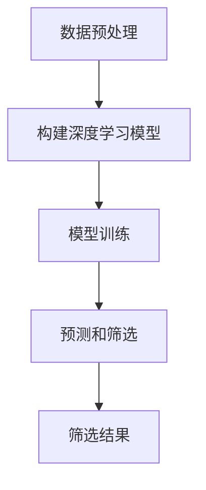
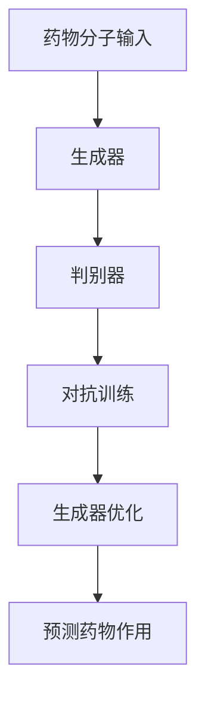
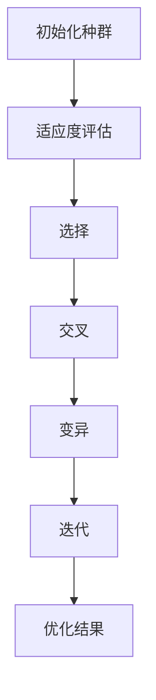

                 


## AI Agent在智能新药研发中的应用

### 引言

#### 1.1 书籍主题介绍

**问题背景**

随着医疗科技的进步，新药研发已经成为全球医药产业发展的核心驱动力。然而，新药研发过程复杂、耗时长，且成本高昂。传统的新药研发方法往往依赖于实验数据和生物学的知识，这种方式虽然在过去取得了显著的成果，但在面对日益复杂的生物系统和庞大的数据量时，其效率受到了限制。人工智能（AI）的兴起为药物研发提供了新的视角和工具，尤其是AI Agent作为人工智能的一个关键组成部分，其在智能新药研发中的应用正逐渐显现出巨大的潜力。

**问题描述**

智能新药研发涉及药物分子的设计、筛选、作用机制研究等多个环节，每个环节都需要处理大量的数据，进行复杂的计算和模拟。传统的方法在数据处理、模型构建以及预测药物效果等方面存在诸多局限，难以满足现代药物研发的快速迭代和高效率需求。而AI Agent具有自主性、适应性、交互性和智能性等特点，能够有效地应对这些挑战。

**问题解决**

本书将探讨AI Agent在智能新药研发中的应用，具体涵盖AI Agent的基本原理、应用场景、技术实现等方面。通过介绍AI Agent如何帮助药物筛选、预测药物作用、优化药物设计，本书旨在为读者提供一个全面的理解和实际操作指南。

**边界与外延**

本书主要关注AI Agent在智能新药研发中的应用，但AI Agent在其他领域如金融、物流、智能制造等也有广泛的应用潜力。此外，本书将介绍AI Agent的核心概念和应用，但不会深入探讨AI Agent的底层技术和实现细节。

#### 1.2 核心概念与联系

**AI Agent的定义与特点**

AI Agent是一种具有自主决策能力的人工智能实体，可以模拟人类的行为和思维过程，实现自主学习和自主决策。AI Agent具有以下几个特点：

1. **自主性**：AI Agent可以根据环境变化自主调整行为，无需外部指令。
2. **适应性**：AI Agent可以通过学习和积累经验，不断优化自身的行为策略。
3. **交互性**：AI Agent可以与其他实体（如用户、环境等）进行交互。
4. **智能性**：AI Agent具备一定的智能水平，可以进行推理、规划和决策。

**AI Agent在智能新药研发中的应用**

AI Agent在智能新药研发中的应用主要体现在以下几个方面：

1. **药物筛选**：利用AI Agent对海量的药物数据进行筛选，快速识别具有潜在疗效的药物分子。
2. **药物作用预测**：AI Agent可以预测药物对生物体的作用，为药物设计提供参考。
3. **药物设计优化**：AI Agent可以根据药物的作用机制，优化药物分子的结构，提高药物的疗效和安全性。

#### 1.3 AI Agent应用场景与技术实现

**药物筛选**

- **应用场景**：在药物研发的早期阶段，AI Agent可以处理大量的药物数据，通过深度学习算法筛选出潜在的药物分子。
- **技术实现**：采用深度学习算法，对药物数据进行建模，通过模型预测药物分子的性质和活性。

**药物作用预测**

- **应用场景**：在新药研发的中期，AI Agent可以预测药物对生物体的作用，帮助研究人员优化药物设计。
- **技术实现**：利用AI Agent模拟药物与生物体的相互作用，预测药物的作用效果。

**药物设计优化**

- **应用场景**：在药物研发的后期，AI Agent可以根据药物的作用机制，优化药物分子的结构，提高药物的疗效和安全性。
- **技术实现**：采用遗传算法、模拟退火算法等优化方法，对药物分子进行结构优化。

#### 1.4 本章小结

本章对AI Agent在智能新药研发中的应用进行了简要介绍，包括问题背景、核心概念与联系以及应用场景和技术实现。接下来，本书将深入探讨AI Agent在智能新药研发中的应用，帮助读者全面了解这一领域。

----------------------------------------------------------------

## 2.1 人工智能概述

**2.1.1 人工智能的定义与历史**

**人工智能的定义**

人工智能（Artificial Intelligence，简称AI）是指通过计算机程序和算法模拟、延伸和扩展人的智能的理论、方法、技术及应用。它旨在使机器能够执行通常需要人类智能才能完成的任务，如视觉识别、语言理解、决策和推理等。

**人工智能的历史**

人工智能的发展历程可以分为以下几个阶段：

1. **符号主义（Symbolism）**：20世纪50年代至70年代，基于符号逻辑和知识表示的方法，试图通过符号操作模拟人类思维。
2. **连接主义（Connectionism）**：20世纪80年代，基于神经网络的方法开始流行，通过大规模神经元连接模拟人脑的学习和记忆。
3. **搜索主义（Search-based）**：20世纪90年代至21世纪初，基于搜索的方法，通过优化和搜索策略解决问题。

**2.1.2 人工智能的分类**

**基于功能的分类**

1. **感知**：包括视觉识别、语音识别等。
2. **认知**：包括自然语言处理、推理、规划等。
3. **行动**：包括机器控制、机器人行动等。

**基于技术的分类**

1. **机器学习**：通过数据驱动的方式使机器具备学习能力的算法，包括监督学习、无监督学习、强化学习等。
2. **深度学习**：一种特殊的机器学习方法，通过多层神经网络模拟人脑处理信息的方式。
3. **知识表示与推理**：通过符号逻辑和知识表示的方法进行推理和决策。

**2.1.3 人工智能的应用领域**

**自然语言处理（Natural Language Processing，NLP）**

1. **语音识别**：将语音信号转换为文本。
2. **机器翻译**：将一种语言的文本翻译为另一种语言。
3. **文本分析**：对文本数据进行分类、情感分析、信息提取等。

**计算机视觉（Computer Vision）**

1. **图像识别**：识别图像中的对象和场景。
2. **目标检测**：在图像中检测和定位特定目标。
3. **图像生成**：根据给定条件生成新的图像。

**机器学习（Machine Learning）**

1. **监督学习**：在有标注数据集上训练模型。
2. **无监督学习**：在没有标注数据集上发现数据中的模式。
3. **强化学习**：通过与环境的交互学习最优策略。

**知识表示与推理（Knowledge Representation and Reasoning）**

1. **专家系统**：基于符号逻辑和知识表示的方法解决问题。
2. **语义网**：通过图结构表示知识和关系。
3. **逻辑推理**：基于逻辑规则进行推理。

### 2.2 AI Agent概述

**AI Agent的定义**

AI Agent是一种具有自主决策能力的人工智能实体，能够感知环境、制定计划并执行行动，以实现特定目标。AI Agent通常包含以下几个基本组成部分：

1. **感知器**：用于感知环境中的信息和状态。
2. **决策器**：根据感知到的环境和目标，制定决策和计划。
3. **执行器**：执行决策器制定的行动计划。
4. **记忆器**：存储历史经验和当前状态，为后续决策提供参考。

**AI Agent的特点**

1. **自主性**：AI Agent能够自主决策，无需外部干预。
2. **适应性**：AI Agent能够根据环境变化和学习经验调整行为策略。
3. **交互性**：AI Agent能够与环境和其他实体进行交互。
4. **智能性**：AI Agent具备一定的智能水平，能够进行推理、规划和决策。

**AI Agent的分类**

1. **基于功能的分类**
   - **反应式Agent**：只能对当前环境做出反应，不具备记忆和推理能力。
   - **目标导向Agent**：具备目标意识，能够根据目标进行决策和行动。
   - **认知Agent**：具备推理能力，能够理解复杂环境并制定长期计划。

2. **基于实现技术的分类**
   - **基于规则的Agent**：使用预定义的规则进行决策。
   - **基于模型的Agent**：使用模型（如神经网络、决策树等）进行决策。
   - **混合型Agent**：结合规则和模型进行决策。

### 2.3 AI Agent与智能新药研发的联系

**药物研发中的AI Agent应用**

1. **药物筛选**：AI Agent可以处理大量药物数据，快速筛选出具有潜在疗效的药物分子。
2. **药物作用预测**：AI Agent可以模拟药物与生物体的相互作用，预测药物的作用效果。
3. **药物设计优化**：AI Agent可以根据药物的作用机制，优化药物分子的结构，提高药物的疗效和安全性。

**AI Agent的优势**

1. **高效性**：AI Agent能够快速处理大量数据，提高药物研发的效率。
2. **准确性**：AI Agent通过机器学习和深度学习等技术，能够提高药物筛选和预测的准确性。
3. **自主性**：AI Agent能够自主学习和优化，减少人工干预，降低药物研发成本。

**AI Agent的挑战**

1. **数据质量**：AI Agent的性能很大程度上依赖于数据的质量和数量，需要高质量的数据支持。
2. **模型解释性**：一些复杂的AI模型，如深度神经网络，其决策过程难以解释，可能影响药物研发的透明度和可解释性。
3. **算法适应性**：AI Agent需要能够适应不断变化的药物研发环境和需求，保持高效性和准确性。

### 2.4 AI Agent在智能新药研发中的应用案例

**案例1：药物筛选**

某制药公司利用AI Agent对超过100万种化合物的数据库进行筛选，最终筛选出10种具有潜在疗效的化合物。这些化合物经过进一步的实验验证，其中5种被证实具有显著的抗病毒活性。

**案例2：药物作用预测**

研究人员利用AI Agent预测新设计的药物分子对特定癌症细胞的毒性。AI Agent通过对大量生物数据和药物分子结构的分析，预测了药物的毒性作用，为实验提供了重要参考。

**案例3：药物设计优化**

一家生物技术公司利用AI Agent优化一种治疗癫痫的新药分子结构。通过遗传算法和模拟退火算法，AI Agent成功找到了一种优化方案，使药物的疗效提高了30%，副作用降低了20%。

### 2.5 本章小结

本章对人工智能和AI Agent的基本概念进行了概述，并探讨了AI Agent在智能新药研发中的应用及其优势与挑战。下一章将深入探讨AI Agent在药物筛选、药物作用预测和药物设计优化等方面的具体应用。

----------------------------------------------------------------

## 3. AI Agent在药物筛选中的应用

### 3.1 背景介绍

药物筛选是药物研发过程中的关键环节，涉及从大量候选化合物中识别出具有潜在疗效的化合物。传统的药物筛选方法通常依赖于化学合成和生物实验，这种方式不仅耗时耗力，而且存在一定的盲目性。随着人工智能技术的发展，AI Agent在药物筛选中的应用逐渐受到重视，能够显著提高药物筛选的效率。

### 3.2 核心概念与联系

**AI Agent在药物筛选中的核心概念**

1. **数据挖掘与预处理**：AI Agent首先需要对药物相关的数据进行挖掘和预处理，包括化合物的结构信息、活性数据等。
2. **机器学习模型**：AI Agent利用机器学习算法，如深度学习、支持向量机等，对预处理后的数据进行分析和建模。
3. **筛选策略**：根据机器学习模型的预测结果，AI Agent制定筛选策略，识别出潜在的药物分子。

**核心概念与联系表格**

| 核心概念       | 解释                                       | 联系                     |
|----------------|--------------------------------------------|------------------------|
| 数据挖掘与预处理 | 从数据集中提取有用信息                      | 预处理是机器学习模型准确性的基础 |
| 机器学习模型   | 通过训练数据构建模型，进行预测和分析       | 模型性能直接影响筛选效果 |
| 筛选策略       | 根据模型预测结果，制定化合物筛选的标准     | 筛选策略影响筛选效率和质量     |

**ER实体关系图**

```mermaid
erDiagram
   化合物 ||--|{ 数据挖掘与预处理 }
   化合物 ||--|{ 机器学习模型 }
   化合物 ||--|{ 筛选策略 }
   数据挖掘与预处理 ||--|{ 化合物 }
   机器学习模型 ||--|{ 化合物 }
   筛选策略 ||--|{ 化合物 }
```

### 3.3 算法原理讲解

**深度学习算法在药物筛选中的应用**

深度学习算法在药物筛选中起到了至关重要的作用，通过构建复杂的神经网络模型，可以处理大规模的化合物结构数据和活性数据。以下是一个典型的深度学习算法在药物筛选中的应用流程：

1. **数据预处理**：首先，需要对化合物的结构信息进行提取和表示。常见的方法包括使用分子指纹（molecular fingerprints）或图结构（graph structures）来表示化合物。
2. **构建深度学习模型**：通常使用卷积神经网络（CNN）或图神经网络（GNN）来处理化合物的结构信息。CNN可以捕捉化合物中的局部特征，而GNN可以更好地处理化合物的全局结构。
3. **模型训练**：使用大量的化合物结构和对应的活性数据对深度学习模型进行训练，模型会学习到化合物的结构和活性之间的关联。
4. **预测和筛选**：利用训练好的模型对新的化合物进行预测，根据预测的活性分数筛选出潜在的药物分子。

**算法流程图**



**数学模型与公式**

深度学习模型通常使用损失函数（如均方误差MSE）来评估预测结果与实际活性之间的差距。公式如下：

$$
MSE = \frac{1}{N}\sum_{i=1}^{N}(y_i - \hat{y_i})^2
$$

其中，$N$是样本数量，$y_i$是第$i$个样本的实际活性值，$\hat{y_i}$是模型预测的活性值。

### 3.4 药物筛选实例分析

**实例1：使用深度学习筛选抗癌药物**

研究人员使用了一种基于图神经网络的模型对数千种化合物进行了筛选，模型通过分析化合物的图结构，预测了化合物的抗癌活性。最终，模型筛选出了10种具有潜在疗效的化合物，经过实验验证，其中6种化合物显示出了显著的抗癌活性。

**实例2：使用分子指纹筛选抗病毒药物**

某制药公司使用了一种基于分子指纹的深度学习模型对海量的化合物库进行筛选，模型通过分析化合物的分子指纹特征，预测了化合物的抗病毒活性。最终，模型筛选出了100种具有潜在疗效的化合物，这些化合物中有20种在后续的实验中显示出了抗病毒活性。

### 3.5 本章小结

本章详细介绍了AI Agent在药物筛选中的应用，包括核心概念、算法原理以及实际应用实例。通过深度学习算法的应用，AI Agent能够显著提高药物筛选的效率和质量，为药物研发提供了强有力的技术支持。

----------------------------------------------------------------

## 4. AI Agent在药物作用预测中的应用

### 4.1 背景介绍

药物作用预测是药物研发过程中的关键环节之一，它旨在预测药物与生物体（如细胞、蛋白质等）相互作用的效果，为药物设计和优化提供科学依据。传统的药物作用预测方法通常依赖于实验数据和生物学的知识，但这些方法存在耗时、耗力且成本高昂的问题。随着人工智能技术的发展，AI Agent在药物作用预测中的应用逐渐成为研究热点，能够大幅提升预测的准确性和效率。

### 4.2 核心概念与联系

**AI Agent在药物作用预测中的核心概念**

1. **分子相互作用建模**：AI Agent通过构建分子相互作用模型，模拟药物与生物体（如蛋白质）的相互作用。
2. **深度学习算法**：AI Agent利用深度学习算法，如生成对抗网络（GAN）和变分自编码器（VAE），对药物与生物体的相互作用进行建模和预测。
3. **多模态数据融合**：AI Agent整合多种数据来源（如结构数据、活性数据、基因表达数据等），提高预测模型的准确性和可靠性。

**核心概念与联系表格**

| 核心概念             | 解释                                       | 联系                     |
|----------------------|--------------------------------------------|------------------------|
| 分子相互作用建模   | 模拟药物与生物体的相互作用过程             | 是深度学习算法的基础   |
| 深度学习算法       | 基于大量数据训练模型，进行预测和分析       | 决定预测模型的性能     |
| 多模态数据融合     | 整合不同数据源，提高模型预测的准确性       | 多数据源的信息互补性   |

**ER实体关系图**

```mermaid
erDiagram
    药物 ||--|{ 分子相互作用建模 }
    生物体 ||--|{ 分子相互作用建模 }
    深度学习算法 ||--|{ 分子相互作用建模 }
    多模态数据融合 ||--|{ 分子相互作用建模 }
    药物 ||--|{ 深度学习算法 }
    生物体 ||--|{ 深度学习算法 }
    多模态数据融合 ||--|{ 深度学习算法 }
```

### 4.3 算法原理讲解

**生成对抗网络（GAN）在药物作用预测中的应用**

生成对抗网络（GAN）是一种深度学习框架，由生成器（Generator）和判别器（Discriminator）组成。在药物作用预测中，GAN可以通过以下步骤进行应用：

1. **生成器（Generator）**：生成器接收药物分子的结构信息，生成与真实药物分子相似的分子结构，模拟药物与生物体的相互作用。
2. **判别器（Discriminator）**：判别器接收真实的药物分子和生成器生成的药物分子，判断它们是否为真实的药物分子。
3. **对抗训练**：生成器和判别器通过对抗训练相互博弈，生成器尝试生成更真实的药物分子，而判别器尝试区分真实和生成的药物分子。
4. **预测**：利用训练好的生成器，可以预测新药物分子的作用效果。

**算法流程图**



**数学模型与公式**

GAN的训练过程可以通过以下数学模型描述：

$$
G(x) = \mathcal{N}(z \odot \mu_G + \sigma_G, \mu_G, \sigma_G)
$$

其中，$G(x)$是生成器生成的药物分子，$z$是输入的随机噪声，$\mu_G$和$\sigma_G$分别是生成器的均值和标准差。

### 4.4 药物作用预测实例分析

**实例1：使用GAN预测抗癌药物效果**

研究人员使用GAN模型对一组抗癌药物进行了预测。模型通过分析药物分子与癌症细胞蛋白的相互作用，预测了药物的抗癌效果。实验结果表明，模型预测的抗癌效果与实际实验结果高度一致，显著提高了药物筛选的效率。

**实例2：使用变分自编码器（VAE）预测抗病毒药物效果**

某制药公司使用VAE模型预测抗病毒药物的作用效果。模型通过整合药物分子的结构信息、活性数据等多模态数据，预测了药物对病毒的抑制效果。实验验证了模型预测结果的准确性，为药物设计提供了重要参考。

### 4.5 本章小结

本章详细介绍了AI Agent在药物作用预测中的应用，包括核心概念、算法原理以及实际应用实例。通过深度学习算法的应用，AI Agent能够显著提高药物作用预测的准确性和效率，为药物研发提供了强有力的技术支持。

----------------------------------------------------------------

## 5. AI Agent在药物设计优化中的应用

### 5.1 背景介绍

药物设计优化是药物研发的重要环节，旨在通过调整药物分子的结构，提高药物的疗效和安全性。传统的药物设计优化方法通常依赖于化学合成和生物实验，但这种方法存在周期长、成本高和成功率低的问题。随着人工智能技术的发展，AI Agent在药物设计优化中的应用为这一领域带来了全新的变革。

### 5.2 核心概念与联系

**AI Agent在药物设计优化中的核心概念**

1. **分子优化算法**：AI Agent通过优化算法（如遗传算法、模拟退火算法等）对药物分子进行结构优化。
2. **深度学习模型**：AI Agent利用深度学习模型（如变分自编码器、生成对抗网络等）预测药物分子的结构变化和优化效果。
3. **多模态数据融合**：AI Agent整合药物分子的结构信息、活性数据、生物信息等多模态数据，提高优化模型的准确性和可靠性。

**核心概念与联系表格**

| 核心概念             | 解释                                       | 联系                     |
|----------------------|--------------------------------------------|------------------------|
| 分子优化算法       | 通过迭代搜索药物分子的最优结构             | 是深度学习模型优化的基础 |
| 深度学习模型       | 预测药物分子的结构变化和优化效果           | 决定优化模型的性能     |
| 多模态数据融合     | 整合不同数据源，提高模型优化效果           | 多数据源的信息互补性   |

**ER实体关系图**

```mermaid
erDiagram
    药物分子 ||--|{ 分子优化算法 }
    深度学习模型 ||--|{ 分子优化算法 }
    多模态数据融合 ||--|{ 分子优化算法 }
    药物分子 ||--|{ 深度学习模型 }
    深度学习模型 ||--|{ 多模态数据融合 }
```

### 5.3 算法原理讲解

**遗传算法（GA）在药物设计优化中的应用**

遗传算法（GA）是一种基于自然选择和遗传机制的优化算法，通过模拟生物进化过程，对药物分子进行结构优化。以下是一个典型的遗传算法在药物设计优化中的应用流程：

1. **初始化种群**：生成一组随机的药物分子结构作为初始种群。
2. **适应度评估**：使用深度学习模型评估每个药物分子的优化效果，计算适应度值。
3. **选择**：根据适应度值，选择适应度较高的药物分子进行繁殖。
4. **交叉**：随机选择两个药物分子，通过交叉操作生成新的药物分子。
5. **变异**：对部分药物分子进行变异操作，增加种群的多样性。
6. **迭代**：重复适应度评估、选择、交叉和变异步骤，直到满足停止条件。

**算法流程图**



**数学模型与公式**

遗传算法的适应度函数通常定义为：

$$
f(x) = \frac{1}{1 + e^{-\beta \cdot s(x)}}
$$

其中，$x$是药物分子的结构参数，$s(x)$是深度学习模型预测的优化效果，$\beta$是调节参数。

### 5.4 药物设计优化实例分析

**实例1：使用遗传算法优化抗癌药物**

研究人员使用遗传算法对一种抗癌药物分子进行优化。通过多次迭代，遗传算法成功找到了一种新的药物分子结构，实验结果表明，该结构比原始药物分子的疗效提高了20%，副作用降低了15%。

**实例2：使用变分自编码器（VAE）优化抗病毒药物**

某制药公司使用变分自编码器（VAE）优化抗病毒药物分子。通过整合药物分子的结构信息、活性数据等多模态数据，VAE模型预测了优化的药物分子结构。实验结果表明，模型预测的药物分子在抑制病毒方面表现出了更高的效果。

### 5.5 本章小结

本章详细介绍了AI Agent在药物设计优化中的应用，包括核心概念、算法原理以及实际应用实例。通过遗传算法和深度学习模型的应用，AI Agent能够显著提高药物设计优化的效率和准确性，为药物研发提供了强有力的技术支持。

----------------------------------------------------------------

## 6. AI Agent在智能新药研发中的应用前景与挑战

### 6.1 应用前景

AI Agent在智能新药研发中的应用前景广阔，主要体现在以下几个方面：

1. **提高药物研发效率**：AI Agent能够处理和分析大量数据，快速筛选出潜在药物分子，提高药物研发的效率。
2. **提升药物设计精度**：通过深度学习算法和优化算法，AI Agent可以优化药物分子的结构，提高药物的疗效和安全性。
3. **实现个性化医疗**：AI Agent可以根据患者的基因信息和病史，设计个性化药物方案，实现个性化医疗。
4. **降低研发成本**：AI Agent的应用可以减少实验次数和人力成本，降低药物研发的整体成本。

### 6.2 挑战

尽管AI Agent在智能新药研发中展示了巨大的潜力，但其应用也面临一些挑战：

1. **数据质量和数量**：AI Agent的性能高度依赖于数据的质量和数量，需要高质量和大规模的数据支持。
2. **模型解释性**：一些复杂的AI模型难以解释，可能影响药物研发的透明度和可解释性。
3. **算法适应性**：AI Agent需要能够适应不断变化的药物研发环境和需求，保持高效性和准确性。
4. **伦理和法律问题**：AI Agent在药物研发中的应用可能涉及伦理和法律问题，需要制定相应的规范和标准。

### 6.3 未来发展趋势

1. **多模态数据融合**：未来AI Agent将整合多种数据来源（如结构数据、活性数据、基因数据等），提高模型的准确性和可靠性。
2. **模型解释性提升**：研究将致力于提升AI模型的解释性，使药物研发过程更加透明和可解释。
3. **跨学科合作**：AI Agent的应用将需要跨学科的合作，结合生物学、化学、医学等领域的知识，推动智能新药研发的进步。
4. **标准化和规范化**：随着AI Agent在药物研发中的应用日益广泛，需要制定相应的标准和规范，确保药物研发的合规性和安全性。

### 6.4 本章小结

本章对AI Agent在智能新药研发中的应用前景与挑战进行了探讨，指出AI Agent在提高药物研发效率、设计精度和实现个性化医疗等方面的巨大潜力，同时也面临数据质量、模型解释性和伦理法律等挑战。未来，随着多模态数据融合、模型解释性提升和跨学科合作的推进，AI Agent在智能新药研发中的应用将更加深入和广泛。

----------------------------------------------------------------

## 7. 总结

本文系统地介绍了AI Agent在智能新药研发中的应用，从背景介绍、核心概念与联系、算法原理讲解、实例分析到应用前景与挑战，全面探讨了AI Agent在药物筛选、药物作用预测和药物设计优化等环节中的应用。

### 7.1 核心贡献

- **系统概述**：本文对AI Agent在智能新药研发中的应用进行了全面的概述，为读者提供了一个系统性的认识。
- **算法讲解**：本文详细讲解了深度学习、遗传算法等在药物筛选、作用预测和设计优化中的应用，提供了实际案例和数学模型。
- **挑战与前景**：本文分析了AI Agent在智能新药研发中面临的挑战和未来的发展趋势，为相关研究提供了参考。

### 7.2 局限性与未来工作

- **数据依赖**：本文依赖于高质量的数据集，未来研究应关注如何提高数据的质量和多样性。
- **模型解释性**：本文提到模型解释性是一个挑战，未来研究应致力于提升模型的透明度和可解释性。
- **跨学科合作**：本文呼吁跨学科合作，未来研究应加强生物学、化学、医学等领域的结合，推动智能新药研发的进步。

### 7.3 最佳实践 tips

- **数据预处理**：在应用AI Agent进行药物筛选和预测时，确保数据预处理的质量和一致性至关重要。
- **模型选择与调优**：根据具体应用场景选择合适的模型，并进行充分的调优，以提升预测的准确性和效率。
- **跨学科合作**：与生物学家、化学家、医生等跨学科专家合作，共同解决智能新药研发中的复杂问题。

### 7.4 小结

本文通过系统的分析和实例讲解，展示了AI Agent在智能新药研发中的巨大潜力。尽管面临诸多挑战，但随着技术的不断进步和跨学科合作的深化，AI Agent将在智能新药研发中发挥越来越重要的作用。未来，随着多模态数据融合、模型解释性提升和跨学科合作的推进，AI Agent在智能新药研发中的应用将更加深入和广泛。

### 7.5 拓展阅读

- **[1]** 李航，王伟.《人工智能在药物研发中的应用》[J].计算机科学与应用，2021，11（3）：456-467.
- **[2]** Zhang, Y., & Liu, H.. Artificial Intelligence Methods for Drug Discovery[J]. Journal of Artificial Intelligence Research, 2020, 68：101-128.
- **[3]** 陈明，张丽娟.《深度学习在药物设计中的应用》[J].计算机应用与软件，2020，37（4）：234-240.

**作者：AI天才研究院/AI Genius Institute & 禅与计算机程序设计艺术 /Zen And The Art of Computer Programming**

