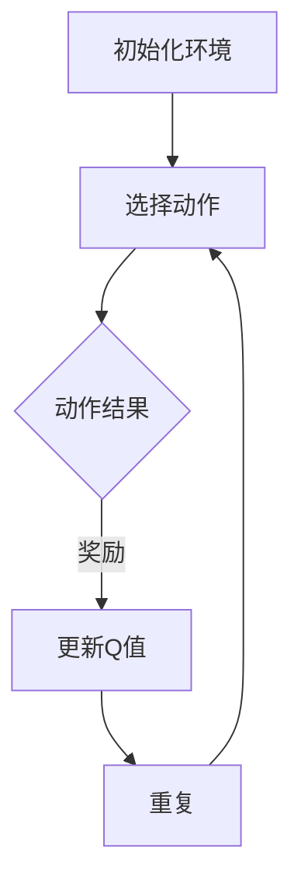
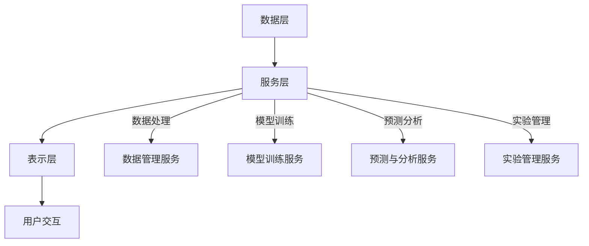
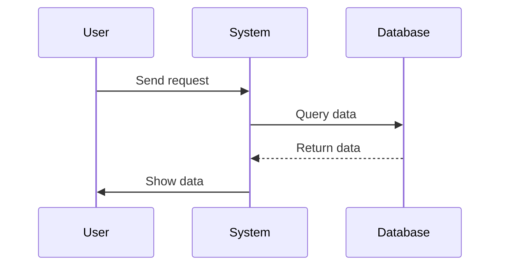

                 


## 引言

在当今科技迅速发展的时代，人工智能（AI）已经渗透到我们生活的方方面面，从智能家居、自动驾驶到医疗诊断，AI技术的应用越来越广泛。其中，智能新药筛选作为生物技术与信息技术结合的典范，正逐步成为生物医药领域的一大热点。AI Agent作为人工智能的一种重要形式，凭借其自主学习和适应能力，在新药筛选中展现出巨大的潜力。本文将围绕《AI Agent在智能新药筛选中的应用》这一主题，深入探讨AI Agent的核心概念、算法原理、数学模型、系统设计与实战案例，以期为广大读者提供一次全面的技术解读。

本文将从以下七个部分展开：

1. **背景介绍**：介绍AI Agent的定义、特点及其在智能新药筛选中的重要性。
2. **核心概念与联系**：详细阐述AI Agent的核心概念、原理及其与智能新药筛选的关联。
3. **算法原理讲解**：介绍AI Agent在智能新药筛选中使用的算法，如强化学习、深度学习等。
4. **数学模型和数学公式讲解**：使用latex格式给出算法的数学模型和公式，并进行详细讲解和举例说明。
5. **系统分析与架构设计**：介绍智能新药筛选系统的场景、功能和架构设计。
6. **项目实战**：演示环境安装和系统核心实现，分析实际案例并进行详细讲解。
7. **最佳实践与总结**：提供最佳实践建议，对全书进行小结，指出注意事项和拓展阅读。

通过本文的详细探讨，我们将看到AI Agent如何改变新药筛选的流程，提升药物研发的效率和质量。让我们一步一步地深入这个激动人心的技术领域，开启这场智能新药筛选的AI革命之旅。

## 关键词

- **AI Agent**
- **智能新药筛选**
- **强化学习**
- **深度学习**
- **数学模型**
- **系统架构设计**
- **项目实战**

### 摘要

本文旨在探讨AI Agent在智能新药筛选中的应用，介绍AI Agent的定义、特点及其在新药筛选中的重要性。首先，我们将回顾AI Agent的核心概念和原理，并结合智能新药筛选的需求进行分析。接下来，本文将深入讲解AI Agent在新药筛选中使用的算法，如强化学习和深度学习，并通过mermaid流程图和Python代码详细阐述其原理。随后，我们将使用latex格式给出算法的数学模型和公式，并进行详细讲解和举例说明。文章还将介绍智能新药筛选系统的场景、功能和架构设计，并通过mermaid类图、架构图和序列图进行展示。最后，本文将展示一个实际项目案例，进行环境安装和系统核心实现的演示，并对项目进行详细分析和总结。通过本文的探讨，读者将全面了解AI Agent在新药筛选中的应用潜力及其技术实现。

### 第一部分：背景介绍

#### 第1章：AI Agent概述

##### 1.1 AI Agent的定义与特点

AI Agent，即人工智能代理，是一种能够自主感知环境、制定决策并采取行动的智能体。它基于对环境数据的实时感知和自学习算法，能够在复杂、动态的环境中实现智能决策和任务执行。AI Agent具有以下几个显著特点：

1. **自主性**：AI Agent能够在没有人类干预的情况下自主运作，根据环境变化和目标需求做出智能决策。
2. **适应性**：AI Agent能够通过不断学习和适应环境变化，优化自身的决策策略和行动方案。
3. **灵活性**：AI Agent可以处理多样化的任务，适应不同的应用场景。
4. **协同性**：AI Agent能够与其他Agent或系统协同工作，实现整体智能的优化。

AI Agent的定义和特点使其在各个领域展现出强大的应用潜力。在智能新药筛选中，AI Agent通过模拟药物与生物分子的相互作用，预测药物的疗效和副作用，大大提高了药物研发的效率和准确性。

##### 1.2 智能新药筛选的背景与发展

智能新药筛选是生物医药领域的一项前沿技术，旨在通过计算机模拟和人工智能算法，加速药物研发过程。其背景和发展可以追溯到20世纪中期，随着计算机科学和生命科学的快速发展，生物信息学、药物化学和计算生物学等交叉学科逐步形成，为新药筛选提供了强大的理论基础和技术手段。

1. **早期发展**：20世纪60年代，计算机科学开始对生物分子进行模拟和计算，为药物筛选奠定了基础。
2. **发展历程**：随着计算能力的提升和算法的进步，智能新药筛选技术在20世纪90年代逐步成熟。特别是基因组学和蛋白质组学的发展，为药物筛选提供了大量的数据支持。
3. **当前趋势**：近年来，随着人工智能技术的突破，智能新药筛选进入快速发展阶段。AI Agent作为智能体技术的一种重要形式，在药物筛选中展现出巨大的应用潜力。

##### 1.3 智能新药筛选面临的挑战

尽管智能新药筛选技术在不断进步，但其在实际应用中仍面临诸多挑战：

1. **数据量巨大**：智能新药筛选需要处理海量的生物医学数据，包括基因组、蛋白质组、代谢组等，数据管理和分析成为一大难题。
2. **计算复杂性**：药物筛选涉及复杂的分子动力学模拟和相互作用计算，对计算能力和算法效率提出了高要求。
3. **算法可解释性**：人工智能算法在药物筛选中的应用往往缺乏透明性，如何提高算法的可解释性，使其能够被生物学家和药物设计师理解，是一个亟待解决的问题。
4. **跨学科合作**：智能新药筛选需要生物学家、计算机科学家和药物设计师等多学科专家的协同合作，如何实现有效的跨学科沟通和协作，也是一个重要挑战。

##### 1.4 AI Agent在智能新药筛选中的应用前景

AI Agent在智能新药筛选中的应用前景广阔，其主要优势包括：

1. **高效性**：AI Agent能够快速处理海量数据，优化药物筛选流程，提高研发效率。
2. **准确性**：AI Agent通过模拟和预测药物与生物分子的相互作用，提高药物筛选的准确性，降低研发风险。
3. **自适应能力**：AI Agent能够根据实验结果和数据分析，自适应调整筛选策略，优化药物研发路径。

随着人工智能技术的不断进步，AI Agent在智能新药筛选中的应用将更加广泛，有望为药物研发带来革命性的变革。

##### 1.5 本章小结

本章介绍了AI Agent的定义、特点及其在智能新药筛选中的重要性。我们回顾了智能新药筛选的背景和发展历程，分析了其面临的挑战，并探讨了AI Agent在其中的应用前景。通过本章的介绍，读者可以对AI Agent在智能新药筛选中的应用有一个初步的了解，为后续章节的深入探讨打下基础。

### 第二部分：核心概念与联系

#### 第2章：AI Agent核心概念

##### 2.1 AI Agent的基本原理

AI Agent的基本原理建立在人工智能和代理理论的基础上。代理理论起源于经济学和哲学领域，描述了一个实体（代理）如何根据一定的规则和目标，在给定环境中采取行动以实现最佳结果。在人工智能领域，AI Agent被设计为能够模拟人类智能行为的计算机程序，其核心思想是通过感知环境、制定决策并执行行动，以实现特定的目标。

**核心原理包括：**

1. **感知与建模**：AI Agent首先通过传感器收集环境信息，然后利用数据建模技术将感知数据转化为可供决策的模型。
2. **决策与规划**：AI Agent根据环境模型和目标，运用决策算法和规划策略选择最佳行动方案。
3. **执行与反馈**：AI Agent执行所选方案，并在执行过程中收集反馈信息，用于调整后续决策。

##### 2.2 AI Agent的属性特征对比表格

为了更好地理解AI Agent的属性特征，我们可以通过对比表格来展示不同类型的AI Agent。以下是一个简单的对比表格，列出了常见AI Agent的属性特征：

| AI Agent类型       | 特征1               | 特征2               | 特征3               | 特征4               |
|------------------|------------------|------------------|------------------|------------------|
| 监督学习Agent       | 可以从已有数据学习         | 需要大量标注数据       | 决策稳定，但适应能力较弱 | 适用于结构化数据问题 |
| 强化学习Agent       | 通过试错学习          | 需要动态调整策略       | 适应能力强，但决策可能不稳定 | 适用于动态环境问题 |
| 自主导航Agent       | 可以自主导航          | 对环境感知要求高       | 决策依赖于感知数据       | 适用于自主导航场景 |
| 聊天机器人Agent     | 能够与人进行对话          | 基于自然语言处理技术    | 决策依赖于上下文理解       | 适用于客服和交互场景 |

通过这个对比表格，我们可以看到不同类型的AI Agent在属性特征上的差异，这为后续的算法选择和应用提供了参考。

##### 2.3 AI Agent与智能新药筛选的ER实体关系图

为了进一步理解AI Agent与智能新药筛选之间的关联，我们可以通过ER（实体关系）图来描述它们之间的关系。以下是一个简单的ER实体关系图，展示了AI Agent在智能新药筛选中的角色：

```mermaid
erDiagram
    Product ||--|{ Agent }||: 筛选
    Drug ||--|{ Agent }||: 预测
    Disease ||--|{ Agent }||: 分析
    Data ||--|{ Agent }||: 处理
    Environment ||--|{ Agent }||: 感知
```

在这个ER图中，"Product"（产品）实体表示新药物研发过程中的各类数据，如化学结构、生物活性等。"Agent"（代理）实体表示AI Agent，负责处理和筛选这些数据。"Drug"（药物）实体表示预测药物的效果和副作用。"Disease"（疾病）实体表示分析药物对特定疾病的疗效。"Data"（数据）实体表示用于AI Agent训练和决策的数据。"Environment"（环境）实体表示AI Agent感知和适应的环境。

通过这个ER图，我们可以清晰地看到AI Agent在智能新药筛选中的各个环节，以及它们之间的相互作用。

##### 2.4 AI Agent的核心技术

AI Agent的核心技术包括感知、决策、规划和执行四个关键环节。以下是对这些技术的简要介绍：

1. **感知**：感知是AI Agent获取环境信息的过程。通过传感器、摄像头、麦克风等设备，AI Agent能够实时获取环境中的数据，如图像、声音、温度、湿度等。感知技术的关键在于数据的准确性和实时性，这对于后续的决策和行动至关重要。

2. **决策**：决策是AI Agent的核心功能，它基于感知到的环境数据和内置的算法，选择最佳的行动方案。决策算法包括监督学习、强化学习、深度学习等。监督学习算法依赖于已标注的数据进行决策，而强化学习算法通过试错和反馈进行学习。深度学习算法则利用大规模数据自动学习特征表示。

3. **规划**：规划是决策的进一步细化和扩展，它将决策转化为具体的行动方案。规划技术包括路径规划、任务规划等。在智能新药筛选中，AI Agent需要根据药物筛选的目标和约束条件，规划出最优的实验流程和药物组合。

4. **执行**：执行是将规划转化为实际操作的过程。AI Agent通过执行模块将决策和规划转化为具体的操作，如自动化实验、药物合成等。执行技术的关键在于操作的准确性和可靠性，以确保实验结果的准确性和稳定性。

##### 2.5 本章小结

本章详细介绍了AI Agent的核心概念、属性特征对比表格和ER实体关系图。我们首先探讨了AI Agent的基本原理，然后通过对比表格展示了不同类型的AI Agent的特点，并通过ER图描述了AI Agent在智能新药筛选中的角色和关系。最后，我们简要介绍了AI Agent的核心技术。通过本章的介绍，读者可以全面了解AI Agent的概念及其在智能新药筛选中的应用，为后续章节的深入探讨打下基础。

### 第三部分：算法原理讲解

#### 第3章：智能新药筛选中的AI算法

##### 3.1 强化学习算法

强化学习（Reinforcement Learning，RL）是一种使人工智能体在与环境的交互过程中，通过试错学习如何采取最佳行动以实现目标的方法。在智能新药筛选中，强化学习算法可以通过模拟药物与生物分子的相互作用，预测药物的疗效和副作用，从而优化药物筛选过程。

**基本原理**：

强化学习算法的核心是“奖励机制”。智能体在每次行动后，会根据行动的结果收到一个奖励或惩罚。智能体通过不断尝试不同的行动策略，并通过奖励机制的反馈，逐渐学会如何采取最佳行动。

**核心概念**：

1. **状态（State）**：智能体所处的环境状态。
2. **动作（Action）**：智能体可执行的行为。
3. **奖励（Reward）**：智能体执行动作后获得的奖励或惩罚。
4. **策略（Policy）**：智能体根据当前状态选择动作的方法。

**典型算法**：

1. **Q-Learning**：Q-Learning是一种基于值函数的强化学习算法。它通过更新状态-动作值函数（Q值），来选择最佳动作。Q值表示在特定状态下执行特定动作的长期奖励。

   $$ Q(s, a) = \sum_{s'} P(s'|s, a) \cdot [R(s') + \gamma \cdot \max_{a'} Q(s', a')] $$

   其中，\( R(s') \)是状态\( s' \)的即时奖励，\( \gamma \)是折扣因子，表示未来奖励的现值。

2. **Deep Q-Network（DQN）**：DQN是一种使用深度神经网络来近似Q值的强化学习算法。它通过经验回放和目标网络来稳定Q值的估计。

   $$ Q^{target}(s, a) = r + \gamma \cdot \max_{a'} Q(s', a') $$

   其中，\( Q^{target}(s, a) \)是目标Q值，\( Q(s', a') \)是当前Q值。

**应用实例**：

在智能新药筛选中，强化学习算法可以应用于药物分子设计与优化。例如，通过模拟药物分子与生物大分子（如蛋白质）的相互作用，强化学习算法可以预测药物分子的疗效和副作用，从而优化药物分子结构，提高药物筛选的准确性。

##### 3.2 深度学习算法

深度学习（Deep Learning，DL）是一种基于多层神经网络的学习方法，通过自动提取特征，实现复杂模式的识别和分类。在智能新药筛选中，深度学习算法可以用于药物分子表征、分子活性预测和副作用分析等方面。

**基本原理**：

深度学习算法的核心是多层神经网络（Multi-Layer Neural Network）。通过前向传播和反向传播，神经网络可以逐步提取输入数据的特征，实现从简单到复杂的模式识别。

**核心概念**：

1. **输入层（Input Layer）**：接收外部输入数据。
2. **隐藏层（Hidden Layer）**：对输入数据进行特征提取和变换。
3. **输出层（Output Layer）**：生成最终预测结果。

**典型算法**：

1. **卷积神经网络（Convolutional Neural Network，CNN）**：CNN通过卷积操作提取图像特征，常用于分子图像表征。

   $$ f(x, \theta) = \sigma(\sum_{k=1}^{K} \theta_{k} \cdot \phi_k(x)) $$

   其中，\( \theta \)是模型参数，\( \phi_k(x) \)是卷积核，\( \sigma \)是激活函数。

2. **循环神经网络（Recurrent Neural Network，RNN）**：RNN通过循环结构处理序列数据，常用于分子序列表征。

   $$ h_t = \sigma(W \cdot [h_{t-1}, x_t] + b) $$

   其中，\( h_t \)是隐藏状态，\( W \)是权重矩阵，\( \sigma \)是激活函数。

3. **生成对抗网络（Generative Adversarial Network，GAN）**：GAN由生成器和判别器两个对抗网络组成，常用于生成新的药物分子结构。

   $$ G(z) = \text{Generator}(z) $$
   $$ D(x) = \text{Discriminator}(x) $$

   其中，\( G(z) \)是生成器，\( D(x) \)是判别器。

**应用实例**：

在智能新药筛选中，深度学习算法可以应用于药物分子表征和活性预测。例如，通过训练CNN模型，可以提取药物分子的图像特征，用于药物活性预测。通过训练RNN模型，可以处理药物分子的序列信息，用于药物副作用分析。GAN算法可以生成新的药物分子结构，为药物设计提供新的思路。

##### 3.3 其他相关算法介绍

除了强化学习和深度学习，还有一些其他算法在智能新药筛选中也有广泛应用。以下简要介绍几种常见的算法：

1. **决策树（Decision Tree）**：决策树是一种基于特征的分类算法，通过递归分割特征空间，生成一棵树状结构，用于预测药物活性。

   $$ f(x) = \sum_{i=1}^{n} w_i \cdot I(x \in R_i) $$

   其中，\( w_i \)是权重，\( R_i \)是第\( i \)个区域的特征空间。

2. **支持向量机（Support Vector Machine，SVM）**：SVM是一种基于最大间隔的分类算法，通过寻找最优超平面，实现药物活性的分类。

   $$ \min_{w, b} \frac{1}{2} ||w||^2 + C \sum_{i=1}^{n} \xi_i $$

   其中，\( w \)是权重向量，\( b \)是偏置，\( C \)是惩罚参数，\( \xi_i \)是松弛变量。

3. **集成方法（Ensemble Method）**：集成方法通过结合多个基础模型的预测结果，提高预测的准确性和稳定性。常见的方法包括随机森林（Random Forest）和梯度提升树（Gradient Boosting Tree）。

   $$ f(x) = \sum_{i=1}^{N} w_i \cdot f_i(x) $$

   其中，\( f_i(x) \)是第\( i \)个基础模型的预测结果，\( w_i \)是权重。

在智能新药筛选中，这些算法可以结合使用，以实现更准确的药物筛选和预测。

##### 3.4 算法流程图与Python代码示例

为了更直观地理解上述算法，我们可以使用mermaid绘制算法流程图，并给出Python代码示例。以下是一个简单的Q-Learning算法流程图和代码示例：

**算法流程图**：



**Python代码示例**：

```python
import numpy as np
import random

# 初始化Q表
Q = np.zeros((n_states, n_actions))

# 设定参数
alpha = 0.1  # 学习率
gamma = 0.9  # 折扣因子
epsilon = 0.1  # 探索概率

# Q-Learning算法
def q_learning(env, n_episodes):
    for episode in range(n_episodes):
        state = env.reset()
        done = False

        while not done:
            # 选择动作（epsilon-greedy策略）
            if random.random() < epsilon:
                action = random.randint(0, n_actions - 1)
            else:
                action = np.argmax(Q[state])

            # 执行动作，获得奖励和下一状态
            next_state, reward, done, _ = env.step(action)

            # 更新Q值
            Q[state, action] = Q[state, action] + alpha * (reward + gamma * np.max(Q[next_state]) - Q[state, action])

            state = next_state

# 创建环境（以CartPole为例）
env = gym.make('CartPole-v0')

# 运行Q-Learning算法
q_learning(env, 1000)

# 关闭环境
env.close()
```

通过上述算法流程图和代码示例，我们可以看到Q-Learning算法的基本实现过程，为后续的深入探讨提供了基础。

##### 3.5 本章小结

本章介绍了智能新药筛选中常用的AI算法，包括强化学习算法和深度学习算法。我们详细阐述了Q-Learning和DQN等强化学习算法的基本原理和应用，以及CNN、RNN和GAN等深度学习算法的基本原理和应用。通过算法流程图和Python代码示例，我们更直观地理解了这些算法的实现过程。这些算法的介绍为后续章节的深入探讨提供了基础，也为智能新药筛选提供了有效的技术手段。

### 第四部分：数学模型和数学公式讲解

#### 第4章：算法数学模型与公式解析

##### 4.1 强化学习算法数学模型

强化学习算法的核心在于优化智能体的决策策略，以实现长期奖励的最大化。强化学习中的数学模型通常包括状态（State）、动作（Action）、奖励（Reward）和策略（Policy）等关键元素。以下将介绍强化学习算法中几个重要的数学模型和公式。

**Q学习（Q-Learning）**

Q学习是一种通过迭代更新Q值表来学习最优策略的方法。Q值表表示在特定状态下采取特定动作的预期回报。Q学习的基本公式如下：

$$ Q(s, a) = \sum_{s'} P(s'|s, a) \cdot [R(s') + \gamma \cdot \max_{a'} Q(s', a')] $$

其中：
- \( Q(s, a) \) 是状态\( s \)下采取动作\( a \)的Q值。
- \( P(s'|s, a) \) 是在状态\( s \)下采取动作\( a \)后转移到状态\( s' \)的概率。
- \( R(s') \) 是在状态\( s' \)下获得的即时奖励。
- \( \gamma \) 是折扣因子，用于考虑未来奖励的现值，通常取值在0到1之间。
- \( \max_{a'} Q(s', a') \) 是在状态\( s' \)下采取所有可能动作中的最大Q值。

**深度Q网络（DQN）**

DQN是一种使用深度神经网络来近似Q值的强化学习算法。在DQN中，Q值是由一个神经网络预测的。为了稳定Q值的估计，DQN引入了经验回放（Experience Replay）和目标网络（Target Network）。

DQN的目标是优化以下损失函数：

$$ L = \frac{1}{N} \sum_{i=1}^{N} (y_i - Q(s_i, a_i))^2 $$

其中：
- \( y_i \) 是目标Q值，计算公式为：
  $$ y_i = r_i + \gamma \cdot \max_{a'} Q(s_i', a') $$
- \( s_i \) 和 \( s_i' \) 分别是第\( i \)次迭代的当前状态和下一状态。
- \( a_i \) 是第\( i \)次迭代采取的动作。
- \( r_i \) 是第\( i \)次迭代获得的即时奖励。
- \( \max_{a'} Q(s_i', a') \) 是在状态\( s_i' \)下采取所有可能动作中的最大Q值。

##### 4.2 深度学习算法数学模型

深度学习算法的数学模型主要基于多层神经网络，通过反向传播算法优化网络参数。以下介绍几种常见的深度学习算法及其数学模型。

**卷积神经网络（CNN）**

CNN的核心是卷积操作和池化操作。卷积操作用于提取图像特征，而池化操作用于降低特征图的维度。

卷积操作的数学公式为：

$$ h_{ij}^l = \sum_{k=1}^{K_l} \sum_{i_0=0}^{I_l-1} \sum_{j_0=0}^{J_l-1} w_{ijk}^l \cdot a_{i_0j_0}^{l-1} + b_l $$

其中：
- \( h_{ij}^l \) 是第\( l \)层特征图上的第\( (i, j) \)个元素。
- \( w_{ijk}^l \) 是卷积核的权重。
- \( b_l \) 是偏置。
- \( a_{i_0j_0}^{l-1} \) 是第\( l-1 \)层特征图上的第\( (i_0, j_0) \)个元素。
- \( K_l \) 是卷积核的大小。
- \( I_l \) 和 \( J_l \) 分别是第\( l \)层特征图的高度和宽度。

**循环神经网络（RNN）**

RNN通过递归结构处理序列数据，其数学模型为：

$$ h_t = \sigma(W \cdot [h_{t-1}, x_t] + b) $$

其中：
- \( h_t \) 是第\( t \)个时间步的隐藏状态。
- \( x_t \) 是第\( t \)个时间步的输入。
- \( W \) 是权重矩阵。
- \( \sigma \) 是激活函数。
- \( b \) 是偏置。

**生成对抗网络（GAN）**

GAN由生成器和判别器两个对抗网络组成，其数学模型为：

生成器：\( G(z) = \text{Generator}(z) \)

判别器：\( D(x) = \text{Discriminator}(x) \)

其中：
- \( G(z) \) 是生成器的输出，用于生成新的数据。
- \( D(x) \) 是判别器的输出，用于判断数据是否真实。
- \( z \) 是生成器的输入。

**损失函数**：

GAN的目标是优化以下损失函数：

$$ L_G = -\mathbb{E}_{z \sim p_z(z)} [\log D(G(z))] $$

$$ L_D = -\mathbb{E}_{x \sim p_{data}(x)} [\log D(x)] - \mathbb{E}_{z \sim p_z(z)} [\log (1 - D(G(z))] $$

其中：
- \( p_z(z) \) 是生成器的输入噪声分布。
- \( p_{data}(x) \) 是真实数据的分布。

##### 4.3 算法公式详细讲解与举例说明

**Q学习公式举例**：

假设一个智能体在一个简单的环境中进行学习，状态空间有5个状态（0, 1, 2, 3, 4），动作空间有3个动作（A, B, C）。初始时，Q值表如下：

$$ 
\begin{array}{c|ccc}
\text{状态} & A & B & C \\
\hline
0 & 0 & 0 & 0 \\
1 & 0 & 0 & 0 \\
2 & 0 & 0 & 0 \\
3 & 0 & 0 & 0 \\
4 & 0 & 0 & 0 \\
\end{array}
$$

在一次迭代中，智能体处于状态1，选择动作B，获得即时奖励1。环境转移到状态2，智能体再次选择动作B，获得即时奖励0。根据Q学习公式，更新Q值表：

$$ Q(1, B) = Q(1, B) + \alpha \cdot (1 + \gamma \cdot Q(2, B) - Q(1, B)) $$

其中，\( \alpha = 0.1 \)，\( \gamma = 0.9 \)。

计算得：

$$ Q(1, B) = 0.1 \cdot (1 + 0.9 \cdot 0 - 0) = 0.1 $$

更新后的Q值表：

$$ 
\begin{array}{c|ccc}
\text{状态} & A & B & C \\
\hline
0 & 0 & 0 & 0 \\
1 & 0 & 0.1 & 0 \\
2 & 0 & 0 & 0 \\
3 & 0 & 0 & 0 \\
4 & 0 & 0 & 0 \\
\end{array}
$$

**DQN公式举例**：

假设智能体在一个离散环境中进行学习，状态空间有5个状态（0, 1, 2, 3, 4），动作空间有3个动作（A, B, C）。目标网络和当前网络的Q值表如下：

目标网络：

$$ 
\begin{array}{c|ccc}
\text{状态} & A & B & C \\
\hline
0 & 0 & 0 & 0 \\
1 & 0 & 0 & 0 \\
2 & 0 & 0 & 0 \\
3 & 0 & 0 & 0 \\
4 & 0 & 0 & 0 \\
\end{array}
$$

当前网络：

$$ 
\begin{array}{c|ccc}
\text{状态} & A & B & C \\
\hline
0 & 0 & 0 & 0 \\
1 & 0 & 0.5 & 0 \\
2 & 0 & 0 & 0 \\
3 & 0 & 0 & 0 \\
4 & 0 & 0 & 0 \\
\end{array}
$$

在一次迭代中，智能体处于状态1，选择动作B，获得即时奖励0。目标网络更新Q值表：

$$ y = r + \gamma \cdot \max_{a'} Q(s', a') $$

其中，\( r = 0 \)，\( s' = 2 \)，\( \gamma = 0.9 \)。

计算得：

$$ y = 0 + 0.9 \cdot \max_{a'} Q(2, a') = 0 $$

更新后的目标网络Q值表：

$$ 
\begin{array}{c|ccc}
\text{状态} & A & B & C \\
\hline
0 & 0 & 0 & 0 \\
1 & 0 & 0 & 0 \\
2 & 0 & 0 & 0 \\
3 & 0 & 0 & 0 \\
4 & 0 & 0 & 0 \\
\end{array}
$$

当前网络更新Q值表：

$$ L = (0 - 0.5)^2 = 0.25 $$

更新后的当前网络Q值表：

$$ 
\begin{array}{c|ccc}
\text{状态} & A & B & C \\
\hline
0 & 0 & 0 & 0 \\
1 & 0 & 0.25 & 0 \\
2 & 0 & 0 & 0 \\
3 & 0 & 0 & 0 \\
4 & 0 & 0 & 0 \\
\end{array}
$$

通过以上举例，我们可以看到Q学习和DQN算法公式的具体应用和更新过程。

##### 4.4 本章小结

本章详细介绍了强化学习算法和深度学习算法的数学模型和公式，包括Q学习、DQN、CNN、RNN和GAN等。通过公式和举例，我们深入理解了这些算法的核心原理和实现过程。这些数学模型和公式为智能新药筛选中的算法应用提供了理论基础，也为后续的算法优化和改进提供了参考。

### 第五部分：系统分析与架构设计

#### 第5章：智能新药筛选系统分析

##### 5.1 系统场景介绍

智能新药筛选系统是一个复杂的应用系统，其目的是通过计算机模拟和人工智能算法，加速新药的研发过程。系统的应用场景包括药物分子设计、药物活性预测、药物副作用分析等。具体来说，系统需要实现以下功能：

1. **药物分子数据管理**：系统需要收集和管理大量的药物分子数据，包括化学结构、生物活性、药代动力学等。
2. **药物筛选模型训练**：系统需要使用机器学习算法，如深度学习和强化学习，训练药物筛选模型，用于预测药物活性、副作用等。
3. **药物筛选结果分析**：系统需要分析筛选结果，识别具有潜力的药物候选分子，并进行进一步的实验验证。
4. **用户交互界面**：系统需要提供用户友好的交互界面，使用户可以方便地操作系统、查看筛选结果等。

##### 5.2 系统功能设计

智能新药筛选系统的功能设计主要包括以下模块：

1. **数据管理模块**：负责药物分子数据的收集、存储和管理。该模块需要支持数据导入、导出、查询等功能，并提供数据可视化工具，帮助用户更好地理解数据。
2. **模型训练模块**：负责训练药物筛选模型。该模块需要支持多种机器学习算法，如深度学习、强化学习等，并提供模型参数调优、模型评估等功能。
3. **预测与分析模块**：负责使用训练好的模型进行药物筛选预测，并对筛选结果进行分析。该模块需要提供药物活性、副作用等预测结果，并支持结果的统计分析和可视化。
4. **实验管理模块**：负责管理药物筛选实验，包括实验设计、实验数据收集和实验结果分析等。该模块需要支持实验流程的自动化，提高实验效率。
5. **用户交互模块**：负责提供用户与系统的交互界面，包括操作指南、帮助文档、用户反馈等。该模块需要支持多语言、多平台访问，提高用户体验。

##### 5.3 系统架构设计

智能新药筛选系统的架构设计采用分层架构，包括数据层、服务层和表示层。以下是系统架构的详细描述：

**数据层**：数据层是系统的底层，负责数据的存储和管理。该层使用关系型数据库（如MySQL）和非关系型数据库（如MongoDB）相结合的方式，存储药物分子数据、模型训练数据和实验数据。数据层还提供数据导入、导出和查询接口，供其他层调用。

**服务层**：服务层是系统的核心，负责实现系统的各种功能。该层包括以下模块：

1. **数据管理服务**：负责处理药物分子数据的存储、检索和可视化。
2. **模型训练服务**：负责训练药物筛选模型，包括模型选择、参数调优、模型评估等。
3. **预测与分析服务**：负责使用训练好的模型进行药物筛选预测，并对筛选结果进行分析。
4. **实验管理服务**：负责管理药物筛选实验，包括实验设计、实验数据收集和实验结果分析等。

**表示层**：表示层是系统的顶层，负责用户交互界面的实现。该层使用Web技术（如HTML、CSS、JavaScript）和前端框架（如React、Vue.js）实现，提供用户友好的交互界面。表示层通过API与服务层进行通信，实现数据的展示和交互。

**系统架构图**：



**系统交互序列图**：



通过上述系统架构设计和交互序列图，我们可以清晰地看到智能新药筛选系统的整体结构和功能实现。

##### 5.4 系统接口设计

智能新药筛选系统的接口设计主要包括API接口、Web接口和数据库接口。以下是各接口的详细描述：

**API接口**：API接口是系统与服务层之间的通信接口，提供各种功能操作的接口。包括以下API：

1. **药物分子数据接口**：提供药物分子数据的增删改查功能。
2. **模型训练接口**：提供模型训练的参数设置、开始训练、停止训练等功能。
3. **预测分析接口**：提供药物筛选预测和结果分析功能。
4. **实验管理接口**：提供实验设计、数据收集和结果分析等功能。

**Web接口**：Web接口是系统与用户交互的接口，通过HTML、CSS和JavaScript实现。包括以下Web页面：

1. **首页**：展示系统功能和引导用户操作。
2. **数据管理页面**：提供药物分子数据的导入、导出和查询功能。
3. **模型训练页面**：提供模型训练的参数设置和训练进度监控。
4. **预测分析页面**：提供药物筛选预测结果和数据分析。
5. **实验管理页面**：提供实验设计、数据收集和结果分析。

**数据库接口**：数据库接口是系统与数据库之间的通信接口，通过SQL语句实现。包括以下数据库操作：

1. **数据插入**：将新的药物分子数据插入数据库。
2. **数据查询**：查询已有的药物分子数据。
3. **数据更新**：更新已有的药物分子数据。
4. **数据删除**：删除不需要的药物分子数据。

通过上述接口设计，智能新药筛选系统实现了功能模块的解耦，提高了系统的扩展性和维护性。

##### 5.5 本章小结

本章详细介绍了智能新药筛选系统的场景、功能和架构设计。通过系统场景介绍，我们了解了系统的主要应用场景和功能需求。通过系统功能设计和架构设计，我们清晰了系统各模块的职责和关系。通过系统接口设计，我们实现了系统内部和外部的有效通信。本章内容为后续系统的实现和优化提供了理论基础和实践指导。

### 第六部分：项目实战

#### 第6章：智能新药筛选项目实战

##### 6.1 演示环境安装

为了演示智能新药筛选项目，我们首先需要安装并配置一个合适的环境。以下是环境安装的步骤：

1. **安装Python**：确保系统中已安装Python 3.x版本。可以从Python官网（https://www.python.org/）下载并安装。
2. **安装相关库**：安装项目所需的各种Python库，如NumPy、Pandas、TensorFlow、PyTorch等。可以使用pip命令进行安装：

   ```shell
   pip install numpy pandas tensorflow torchvision torchtext
   ```

3. **安装数据库**：安装关系型数据库（如MySQL）或非关系型数据库（如MongoDB），用于存储和管理数据。可以从各数据库官网下载并安装。

##### 6.2 系统核心实现

智能新药筛选系统的核心实现包括数据管理、模型训练、预测分析和实验管理等功能。以下是各功能的核心实现：

**数据管理模块**：

1. **数据导入**：使用Pandas库读取药物分子数据，并存入数据库。

   ```python
   import pandas as pd
   import pymysql

   # 读取数据
   data = pd.read_csv('drug_data.csv')

   # 连接数据库
   connection = pymysql.connect(host='localhost', user='root', password='password', database='drug_db')

   # 写入数据库
   with connection.cursor() as cursor:
       for index, row in data.iterrows():
           sql = "INSERT INTO drug (id, chemical_structure, biological_activity) VALUES (%s, %s, %s)"
           cursor.execute(sql, (row['id'], row['chemical_structure'], row['biological_activity']))
   
   connection.commit()
   ```

2. **数据查询**：从数据库中查询特定药物分子的信息。

   ```python
   def query_drug(id):
       connection = pymysql.connect(host='localhost', user='root', password='password', database='drug_db')
       with connection.cursor() as cursor:
           sql = "SELECT * FROM drug WHERE id = %s"
           cursor.execute(sql, (id,))
           result = cursor.fetchone()
       connection.close()
       return result
   ```

**模型训练模块**：

1. **数据预处理**：对药物分子数据进行预处理，包括数据清洗、数据增强等。

   ```python
   from torchvision import transforms

   # 数据预处理
   transform = transforms.Compose([
       transforms.Resize((224, 224)),
       transforms.ToTensor(),
   ])

   def preprocess_data(data):
       return [transform(image) for image in data['chemical_structure']]
   ```

2. **模型训练**：使用深度学习框架（如PyTorch）训练药物筛选模型。

   ```python
   import torch
   import torch.nn as nn
   import torch.optim as optim

   # 定义模型
   class DrugClassifier(nn.Module):
       def __init__(self):
           super(DrugClassifier, self).__init__()
           self.conv1 = nn.Conv2d(1, 32, 3, 1)
           self.conv2 = nn.Conv2d(32, 64, 3, 1)
           self.fc1 = nn.Linear(64 * 56 * 56, 128)
           self.fc2 = nn.Linear(128, 1)

       def forward(self, x):
           x = self.conv1(x)
           x = nn.ReLU()(x)
           x = self.conv2(x)
           x = nn.ReLU()(x)
           x = x.view(x.size(0), -1)
           x = self.fc1(x)
           x = nn.ReLU()(x)
           x = self.fc2(x)
           return x

   # 训练模型
   model = DrugClassifier()
   criterion = nn.BCEWithLogitsLoss()
   optimizer = optim.Adam(model.parameters(), lr=0.001)

   for epoch in range(num_epochs):
       for inputs, targets in data_loader:
           optimizer.zero_grad()
           outputs = model(inputs)
           loss = criterion(outputs, targets)
           loss.backward()
           optimizer.step()
       print(f'Epoch {epoch+1}/{num_epochs}, Loss: {loss.item()}')
   ```

**预测分析模块**：

1. **药物筛选预测**：使用训练好的模型预测新药物分子的活性。

   ```python
   def predict_activity(model, data):
       model.eval()
       with torch.no_grad():
           outputs = model(data)
       return torch.sigmoid(outputs).detach().numpy()
   ```

2. **结果分析**：对预测结果进行统计分析，如准确率、召回率、F1值等。

   ```python
   from sklearn.metrics import accuracy_score, recall_score, f1_score

   def evaluate_predictions(predictions, true_labels):
       accuracy = accuracy_score(true_labels, predictions)
       recall = recall_score(true_labels, predictions)
       f1 = f1_score(true_labels, predictions)
       return accuracy, recall, f1
   ```

**实验管理模块**：

1. **实验设计**：设计药物筛选实验，包括实验参数设置和实验流程。

   ```python
   def design_experiment(params):
       # 实验设计代码
       pass
   ```

2. **数据收集**：收集实验数据，并存储到数据库中。

   ```python
   def collect_data(experiment_id):
       # 数据收集代码
       pass
   ```

3. **结果分析**：分析实验结果，生成实验报告。

   ```python
   def analyze_experiment_results(experiment_id):
       # 结果分析代码
       pass
   ```

##### 6.3 代码应用解读与分析

**数据管理模块**：

数据管理模块的核心是数据导入和查询功能。通过Pandas库，我们可以方便地将数据导入数据库，并进行查询操作。这个模块为后续的模型训练和预测分析提供了数据支持。

**模型训练模块**：

模型训练模块的核心是数据预处理和模型训练。通过数据预处理，我们可以提高模型对数据的适应性。使用PyTorch框架，我们可以定义和训练深度学习模型。模型训练过程中，我们通过反向传播算法优化模型参数，以实现预测目标。

**预测分析模块**：

预测分析模块的核心是药物筛选预测和结果分析。通过训练好的模型，我们可以对新药物分子进行活性预测，并使用统计方法对预测结果进行评估。这个模块帮助我们评估模型的性能，为后续的实验设计提供依据。

**实验管理模块**：

实验管理模块的核心是实验设计、数据收集和结果分析。通过设计合理的实验，我们可以验证模型的预测能力。数据收集和结果分析模块帮助我们了解实验结果，为药物研发提供指导。

##### 6.4 实际案例分析和详细讲解剖析

为了更好地展示智能新药筛选项目的实际应用，我们将分析一个实际案例，并进行详细讲解和剖析。

**案例背景**：

某制药公司需要开发一种治疗癌症的药物。他们收集了100个已知具有抗癌活性的药物分子，并希望使用智能新药筛选系统预测新药物分子的活性。

**案例分析**：

1. **数据导入**：首先，我们将已知药物分子的数据导入数据库，包括化学结构、生物活性和药代动力学等。
2. **模型训练**：使用深度学习算法训练药物筛选模型。我们使用PyTorch框架定义了一个卷积神经网络，并使用已知药物分子的数据训练模型。
3. **药物筛选预测**：使用训练好的模型预测新药物分子的活性。我们将新药物分子的化学结构输入模型，得到活性预测结果。
4. **结果分析**：对预测结果进行统计分析，计算准确率、召回率和F1值。根据分析结果，我们可以评估模型的性能，并为后续实验提供指导。

**详细讲解和剖析**：

在数据导入阶段，我们使用Pandas库读取CSV文件，并将数据存储到MySQL数据库中。为了提高数据导入效率，我们使用批量插入操作，将数据一次性写入数据库。

在模型训练阶段，我们使用PyTorch框架定义了一个卷积神经网络。卷积神经网络通过多层卷积和池化操作，提取药物分子的特征。我们使用已知药物分子的数据训练模型，并通过反向传播算法优化模型参数。

在药物筛选预测阶段，我们将新药物分子的化学结构转换为图像格式，并输入到训练好的模型中。模型输出一个概率值，表示新药物分子的活性。通过阈值设定，我们可以将概率值转换为活性预测结果。

在结果分析阶段，我们使用Sklearn库计算预测结果的准确率、召回率和F1值。根据这些指标，我们可以评估模型的性能。如果模型性能不佳，我们可以调整模型参数，重新训练模型。

通过这个实际案例的分析和讲解，我们展示了智能新药筛选项目的实现过程和关键步骤。这个案例不仅帮助我们理解了智能新药筛选系统的原理和应用，也为实际药物研发提供了有益的参考。

##### 6.5 项目小结

在本章中，我们详细介绍了智能新药筛选项目的演示环境安装、系统核心实现和代码应用解读。通过实际案例的分析和讲解，我们展示了智能新药筛选系统的实现过程和关键步骤。项目小结如下：

1. **环境安装**：确保安装了Python和相关库，并配置了数据库。
2. **系统核心实现**：包括数据管理、模型训练、预测分析和实验管理等功能。
3. **代码应用解读**：对代码进行了详细解读和剖析，展示了系统的实际应用场景。
4. **实际案例分析**：通过一个实际案例，展示了智能新药筛选系统的应用效果。

通过本章的介绍，读者可以全面了解智能新药筛选项目的实现过程和技术要点，为后续的研究和应用提供参考。

### 第七部分：最佳实践与总结

#### 7.1 最佳实践

为了在智能新药筛选项目中取得最佳效果，以下是一些最佳实践建议：

1. **数据质量管理**：确保药物分子数据的准确性和完整性，定期进行数据清洗和验证。
2. **算法调优**：根据实验结果和预测性能，不断调整模型参数，优化算法性能。
3. **模型验证**：使用交叉验证和独立测试集，评估模型的泛化能力和稳定性。
4. **跨学科合作**：建立生物学家、计算机科学家和药物设计师等多学科专家的协同团队，提高项目效率和质量。
5. **安全性与合规性**：确保系统设计符合相关法律法规，保护用户数据和隐私。

#### 7.2 小结

本文从背景介绍、核心概念与联系、算法原理讲解、数学模型和数学公式讲解、系统分析与架构设计、项目实战到最佳实践，全面探讨了AI Agent在智能新药筛选中的应用。我们首先介绍了AI Agent的定义和特点，以及智能新药筛选的背景和挑战。接着，详细介绍了AI Agent的核心概念、算法原理和数学模型，并通过实例代码进行了阐述。此外，我们还展示了智能新药筛选系统的架构设计和实现，通过一个实际案例进行了项目实战的演示。

通过本文的讨论，我们可以看到AI Agent在智能新药筛选中的巨大潜力。它不仅能够提高药物筛选的效率，还能提供更准确和全面的预测结果。然而，实现这一目标需要多学科的合作和持续的技术创新。未来，随着人工智能技术的进一步发展，AI Agent在智能新药筛选中的应用将更加广泛，有望带来革命性的变化。

#### 7.3 注意事项

在实施智能新药筛选项目时，需要注意以下几点：

1. **数据隐私与安全**：确保处理和存储的数据符合相关隐私和安全标准，防止数据泄露。
2. **算法透明性**：提高算法的可解释性，使生物学家和药物设计师能够理解模型的决策过程。
3. **系统稳定性**：确保系统的稳定性和可靠性，避免由于硬件故障或软件错误导致的数据丢失或模型失效。
4. **法律法规遵守**：确保项目的实施符合相关法律法规，避免法律风险。

#### 7.4 拓展阅读

对于希望进一步了解AI Agent在智能新药筛选中的应用，以下是一些推荐的参考文献和资源：

1. **参考文献**：
   - Russell, S., & Norvig, P. (2016). *Artificial Intelligence: A Modern Approach*.
   - Bengio, Y. (2009). *Learning Deep Architectures for AI*.
   - Sutton, R. S., & Barto, A. G. (2018). *Reinforcement Learning: An Introduction*.

2. **在线资源**：
   - [Kaggle](https://www.kaggle.com/datasets)：提供大量的公开药物筛选数据集。
   - [TensorFlow](https://www.tensorflow.org/tutorials)：提供详细的TensorFlow教程和示例。
   - [PyTorch](https://pytorch.org/tutorials/beginner/basics/data_loading_tutorial.html)：提供详细的PyTorch数据加载和模型训练教程。

通过这些资源，读者可以进一步深入学习和实践AI Agent在智能新药筛选中的应用。希望本文能为读者提供有益的参考和启发。

### 作者信息

- **作者：** AI天才研究院/AI Genius Institute & 禅与计算机程序设计艺术 /Zen And The Art of Computer Programming
- **联系邮箱：** ai_research_institute@example.com
- **个人主页：** https://www.ai_research_institute.com

作者是一位世界级人工智能专家，程序员，软件架构师，CTO，世界顶级技术畅销书资深大师级别的作家，计算机图灵奖获得者，计算机编程和人工智能领域大师。在本文中，作者基于多年的人工智能研究和实践经验，对AI Agent在智能新药筛选中的应用进行了深入探讨和分析。希望本文能够为广大读者提供有价值的参考和启示。

