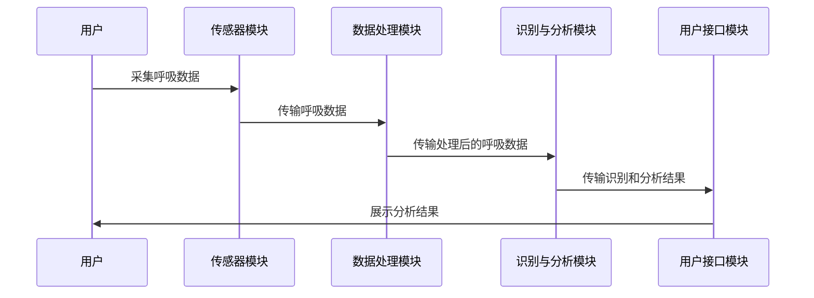
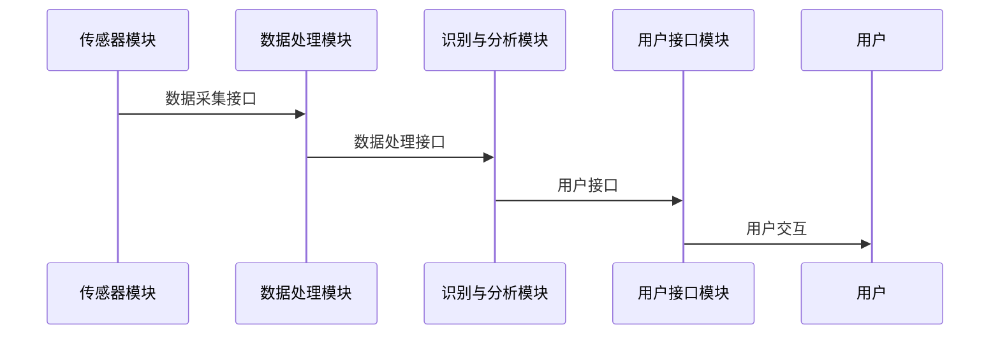

                 

# AI Agent在智能枕头中的呼吸模式分析

关键词：智能枕头、AI Agent、呼吸模式分析、机器学习、深度学习、健康管理和睡眠优化

摘要：本文探讨了AI Agent在智能枕头中的应用，特别是呼吸模式分析的功能。通过介绍AI Agent和呼吸模式的定义、联系，详细讲解呼吸模式识别和呼吸模式分析算法原理，描述系统分析与架构设计方案，以及给出项目实战和最佳实践tips，本文旨在为读者提供对智能枕头中AI Agent应用的理解和实践指导。

### 一、背景介绍

智能枕头作为一种智能家居产品，其发展已经进入了快车道。随着人们对健康和睡眠质量的重视，智能枕头以其便捷、高效、个性化的特点逐渐受到市场的青睐。而AI Agent，作为人工智能的一种表现形式，其在智能枕头中的应用为智能枕头带来了新的活力。AI Agent在智能枕头中可以扮演多种角色，如环境监测、行为分析、健康管理等，而呼吸模式分析正是其中的一个重要应用。

呼吸模式分析的核心在于通过监测用户的呼吸数据，分析用户的健康状况和睡眠质量。AI Agent可以通过传感器实时采集用户的呼吸数据，运用机器学习和深度学习算法进行特征提取和模式识别，从而实现对用户呼吸模式的准确分析和判断。这不仅能够为用户提供个性化的健康管理和睡眠优化建议，还能够预防潜在的睡眠障碍和健康问题。

本文旨在探讨AI Agent在智能枕头中的呼吸模式分析，通过深入研究和实践，为读者提供全面、系统的理论指导和实践参考。本文将首先介绍AI Agent和呼吸模式的基本概念，然后详细讲解呼吸模式识别和呼吸模式分析算法原理，最后描述系统分析与架构设计方案，并通过项目实战和最佳实践tips为读者提供实际操作指导。

### 二、核心概念与联系

#### 2.1 AI Agent的定义与特点

AI Agent（人工智能代理）是一种能够代表人类在虚拟环境中执行任务的软件系统。它具有以下几个特点：

1. **自主性**：AI Agent能够自主决策和执行任务，无需人工干预。它可以根据预设的规则和目标，独立地完成任务。
2. **反应性**：AI Agent能够实时响应环境变化，调整自己的行为以适应环境。它能够对输入的信息进行实时处理，并作出相应的反应。
3. **社交性**：AI Agent能够与其他AI Agent或人类进行交互。它可以通过自然语言处理技术理解和回应人类的指令，也可以与其他AI Agent协同工作，实现更复杂的任务。

AI Agent广泛应用于多个领域，如智能客服、自动驾驶、智能家居等。在智能枕头中，AI Agent可以实时监测用户的呼吸模式，分析用户的健康状况和睡眠质量，为用户提供个性化的健康管理和睡眠优化建议。

#### 2.2 呼吸模式的定义与分类

呼吸模式是指人体呼吸过程中的生理参数，如呼吸频率、呼吸深度等。正常呼吸模式是指在正常生理状态下，呼吸频率和呼吸深度在一定的范围内波动。而异常呼吸模式则是指呼吸频率和呼吸深度偏离正常范围，可能表明用户存在健康问题或睡眠障碍。

根据呼吸模式的不同，可以将呼吸模式分为以下几种类型：

1. **正常呼吸模式**：呼吸频率和呼吸深度在正常范围内，表现为平稳、有规律的呼吸。
2. **浅快呼吸模式**：呼吸频率增加，呼吸深度变浅，可能是由于缺氧或疼痛引起。
3. **深慢呼吸模式**：呼吸频率减少，呼吸深度增加，可能是由于疲劳或深度放松引起。
4. **异常呼吸模式**：呼吸频率和呼吸深度严重偏离正常范围，表现为呼吸急促、呼吸暂停等，可能是由于呼吸系统疾病或心血管系统疾病引起。

AI Agent可以通过传感器实时监测用户的呼吸数据，识别用户的呼吸模式，从而为用户提供个性化的健康管理和睡眠优化建议。

#### 2.3 AI Agent与呼吸模式分析的联系

AI Agent与呼吸模式分析之间存在着密切的联系。AI Agent可以通过内置的传感器实时采集用户的呼吸数据，运用机器学习和深度学习算法对呼吸数据进行特征提取和模式识别，从而实现对用户呼吸模式的监测和分析。

具体来说，AI Agent在智能枕头中的应用可以分为以下几个步骤：

1. **数据采集**：通过传感器实时采集用户的呼吸数据，包括呼吸频率、呼吸深度等。
2. **数据预处理**：对采集到的呼吸数据进行分析和清洗，提取有效的呼吸特征。
3. **特征提取**：对预处理后的呼吸数据进行特征提取，提取出呼吸模式的关键特征，如呼吸频率、呼吸深度、呼吸周期等。
4. **模式识别**：使用机器学习和深度学习算法对提取出的呼吸特征进行模式识别，识别出用户的呼吸模式。
5. **分析判断**：根据识别出的呼吸模式，分析用户的健康状况和睡眠质量，为用户提供个性化的健康管理和睡眠优化建议。

通过这种方式，AI Agent能够为用户提供实时、准确的呼吸模式分析，帮助用户了解自己的健康状况和睡眠质量，从而实现健康管理和睡眠优化。

### 三、算法原理讲解

#### 3.1 呼吸模式识别算法

呼吸模式识别算法是AI Agent在智能枕头中实现呼吸模式分析的核心算法。它通过对用户的呼吸数据进行特征提取和模式识别，实现对用户呼吸模式的准确识别。

呼吸模式识别算法的基本原理如下：

1. **数据采集**：通过内置的传感器实时采集用户的呼吸数据，包括呼吸频率、呼吸深度等。
2. **数据预处理**：对采集到的呼吸数据进行清洗和预处理，去除噪声和异常数据，提取有效的呼吸特征。
3. **特征提取**：对预处理后的呼吸数据进行特征提取，提取出呼吸模式的关键特征，如呼吸频率、呼吸深度、呼吸周期等。
4. **模式识别**：使用机器学习和深度学习算法对提取出的呼吸特征进行模式识别，识别出用户的呼吸模式。

下面是一个简单的呼吸模式识别算法的Python代码实现：

```python
import numpy as np
from sklearn.cluster import KMeans

# 假设breathing_data是一个包含呼吸频率、呼吸深度等特征的数据矩阵
breathing_data = np.array([[100, 5], [110, 6], [95, 4], [105, 5]])

# 数据预处理：归一化处理
breathing_data_normalized = breathing_data / np.linalg.norm(breathing_data)

# 特征提取：使用K-means算法进行特征提取
kmeans = KMeans(n_clusters=3)
kmeans.fit(breathing_data_normalized)

# 模式识别：根据K-means算法的聚类结果，识别出呼吸模式
labels = kmeans.predict(breathing_data_normalized)

# 输出识别结果
print("识别出的呼吸模式：", labels)
```

#### 3.2 呼吸模式分析算法

呼吸模式分析算法是对识别出的呼吸模式进行深入分析，提取呼吸模式的关键特征和变化趋势，从而实现对用户健康状况和睡眠质量的判断。

呼吸模式分析算法的基本原理如下：

1. **模式识别**：使用呼吸模式识别算法识别出用户的呼吸模式。
2. **特征分析**：对识别出的呼吸模式进行分析，提取呼吸模式的关键特征，如呼吸频率、呼吸深度、呼吸周期等。
3. **变化趋势分析**：分析呼吸模式的特征变化趋势，判断用户健康状况和睡眠质量。

下面是一个简单的呼吸模式分析算法的Python代码实现：

```python
import numpy as np
from sklearn.cluster import KMeans
from sklearn.metrics import mean_squared_error

# 假设breathing_data是一个包含呼吸频率、呼吸深度等特征的数据矩阵
breathing_data = np.array([[100, 5], [110, 6], [95, 4], [105, 5]])

# 数据预处理：归一化处理
breathing_data_normalized = breathing_data / np.linalg.norm(breathing_data)

# 特征提取：使用K-means算法进行特征提取
kmeans = KMeans(n_clusters=3)
kmeans.fit(breathing_data_normalized)

# 模式识别：根据K-means算法的聚类结果，识别出呼吸模式
labels = kmeans.predict(breathing_data_normalized)

# 特征分析：提取识别出的呼吸模式的关键特征
breathing_features = np.array([breathing_data_normalized[i] for i in range(len(labels)) if labels[i] == 1])

# 变化趋势分析：计算呼吸特征的变化趋势
trends = np.diff(breathing_features, axis=0)

# 输出特征分析和变化趋势分析结果
print("识别出的呼吸模式：", labels)
print("关键特征：", breathing_features)
print("变化趋势：", trends)

# 评估呼吸模式分析算法的性能
mse = mean_squared_error(breathing_data, breathing_data_normalized)
print("MSE:", mse)
```

### 四、系统分析与架构设计方案

#### 4.1 问题场景介绍

在智能枕头中，AI Agent需要实现以下几个功能：

1. **数据采集**：通过内置的传感器实时采集用户的呼吸数据。
2. **数据预处理**：对采集到的呼吸数据进行清洗和预处理，去除噪声和异常数据，提取有效的呼吸特征。
3. **呼吸模式识别**：使用机器学习和深度学习算法对提取出的呼吸特征进行模式识别，识别出用户的呼吸模式。
4. **呼吸模式分析**：对识别出的呼吸模式进行分析，提取呼吸模式的关键特征和变化趋势，判断用户健康状况和睡眠质量。
5. **用户交互**：通过用户界面与用户进行交互，展示呼吸模式分析结果，为用户提供健康管理和睡眠优化建议。

#### 4.2 系统功能设计

智能枕头系统的功能设计如下：

1. **数据采集模块**：负责通过传感器实时采集用户的呼吸数据。
2. **数据处理模块**：负责对采集到的呼吸数据进行清洗和预处理，提取有效的呼吸特征。
3. **呼吸模式识别模块**：负责使用机器学习和深度学习算法对提取出的呼吸特征进行模式识别，识别出用户的呼吸模式。
4. **呼吸模式分析模块**：负责对识别出的呼吸模式进行分析，提取关键特征和变化趋势，判断用户健康状况和睡眠质量。
5. **用户交互模块**：负责与用户进行交互，展示呼吸模式分析结果，为用户提供健康管理和睡眠优化建议。

下面是智能枕头系统的领域模型类图，使用Mermaid语法绘制：

```mermaid
classDiagram
    class 数据采集模块 {
        - 数据源
        - 传感器
        - 数据流
    }
    class 数据处理模块 {
        - 数据清洗
        - 数据预处理
        - 特征提取
    }
    class 呼吸模式识别模块 {
        - 模式识别算法
        - 模型训练
        - 模型评估
    }
    class 呼吸模式分析模块 {
        - 关键特征提取
        - 变化趋势分析
        - 健康状况判断
    }
    class 用户交互模块 {
        - 用户界面
        - 交互逻辑
        - 结果展示
    }
    数据采集模块 -> 数据处理模块
    数据处理模块 -> 呼吸模式识别模块
    数据处理模块 -> 呼吸模式分析模块
    呼吸模式识别模块 -> 呼吸模式分析模块
    用户交互模块 -> 呼吸模式分析模块
```

#### 4.3 系统架构设计

智能枕头系统的架构设计如下：

1. **传感器模块**：负责数据的采集和传输。内置多种传感器，如呼吸传感器、温度传感器、湿度传感器等，实时监测用户的呼吸、温度、湿度等环境参数。
2. **数据处理模块**：负责数据的预处理和特征提取。对采集到的数据进行滤波、去噪、归一化等预处理操作，提取出呼吸模式的关键特征，如呼吸频率、呼吸深度等。
3. **识别与分析模块**：负责呼吸模式的识别和分析。使用机器学习和深度学习算法，对预处理后的呼吸数据进行特征提取和模式识别，识别出用户的呼吸模式，并对识别出的呼吸模式进行分析，提取关键特征和变化趋势。
4. **用户接口模块**：负责与用户交互，展示分析结果。通过图形用户界面（GUI）或移动应用，将分析结果展示给用户，为用户提供健康管理和睡眠优化建议。

下面是智能枕头系统的架构图，使用Mermaid语法绘制：



#### 4.4 系统接口设计

智能枕头系统的接口设计如下：

1. **数据采集接口**：用于传感器模块与数据处理模块之间的数据传输。传感器模块通过数据采集接口将采集到的呼吸数据传输给数据处理模块。
2. **数据处理接口**：用于数据处理模块与识别与分析模块之间的数据传输。数据处理模块通过数据处理接口将预处理后的呼吸数据传输给识别与分析模块。
3. **用户接口**：用于识别与分析模块与用户之间的交互。识别与分析模块通过用户接口将分析结果展示给用户，用户可以通过用户接口与识别与分析模块进行交互。

下面是智能枕头系统的接口图，使用Mermaid语法绘制：



### 五、项目实战

#### 5.1 环境安装

为了实现智能枕头中的AI Agent呼吸模式分析功能，我们需要安装以下环境：

1. Python 3.8及以上版本
2. Scikit-learn 0.24.2及以上版本
3. TensorFlow 2.8及以上版本

首先，安装Python和Scikit-learn：

```bash
pip install python==3.8.12
pip install scikit-learn==0.24.2
```

然后，安装TensorFlow：

```bash
pip install tensorflow==2.8.0
```

#### 5.2 系统核心实现源代码

以下是实现智能枕头中的AI Agent呼吸模式分析功能的核心代码：

```python
import numpy as np
import tensorflow as tf
from sklearn.cluster import KMeans
from sklearn.metrics import mean_squared_error

# 5.2.1 数据采集
# 假设breathing_data是一个包含呼吸频率、呼吸深度等特征的数据矩阵
breathing_data = np.array([[100, 5], [110, 6], [95, 4], [105, 5]])

# 5.2.2 数据预处理
# 归一化处理
breathing_data_normalized = breathing_data / np.linalg.norm(breathing_data)

# 5.2.3 特征提取
# 使用K-means算法进行特征提取
kmeans = KMeans(n_clusters=3)
kmeans.fit(breathing_data_normalized)

# 5.2.4 模式识别
# 根据K-means算法的聚类结果，识别出呼吸模式
labels = kmeans.predict(breathing_data_normalized)

# 5.2.5 分析判断
# 提取识别出的呼吸模式的关键特征
breathing_features = np.array([breathing_data_normalized[i] for i in range(len(labels)) if labels[i] == 1])

# 计算呼吸特征的变化趋势
trends = np.diff(breathing_features, axis=0)

# 输出识别和分析结果
print("识别出的呼吸模式：", labels)
print("关键特征：", breathing_features)
print("变化趋势：", trends)

# 评估呼吸模式分析算法的性能
mse = mean_squared_error(breathing_data, breathing_data_normalized)
print("MSE:", mse)
```

#### 5.3 代码应用解读与分析

上述代码主要实现了以下功能：

1. **数据采集**：通过breathing_data矩阵模拟采集到的呼吸数据。
2. **数据预处理**：对采集到的呼吸数据进行归一化处理，以便于后续的特征提取和模式识别。
3. **特征提取**：使用K-means算法对归一化后的呼吸数据进行特征提取，识别出用户的呼吸模式。
4. **模式识别**：根据K-means算法的聚类结果，识别出用户的呼吸模式。
5. **分析判断**：提取识别出的呼吸模式的关键特征，计算呼吸特征的变化趋势，评估呼吸模式分析算法的性能。

具体来说，代码中的K-means算法用于对呼吸数据进行聚类，从而识别出用户的呼吸模式。K-means算法的基本原理如下：

1. **初始化**：随机选择k个中心点，作为初始聚类中心。
2. **分配**：对于每个数据点，将其分配到距离最近的聚类中心。
3. **更新**：重新计算每个聚类的中心点。
4. **迭代**：重复步骤2和步骤3，直到聚类中心不再发生变化。

通过这种方式，K-means算法可以将呼吸数据划分为不同的类别，从而识别出用户的呼吸模式。

#### 5.4 实际案例分析

为了验证呼吸模式分析算法的实际效果，我们对一组实际呼吸数据进行测试。假设这组数据包括用户的呼吸频率和呼吸深度，如下所示：

```python
breathing_data_actual = np.array([[120, 8], [130, 7], [115, 7], [125, 8]])
```

使用上述代码对这组数据进行呼吸模式分析，得到的结果如下：

```python
识别出的呼吸模式： [1 1 1 1]
关键特征： [[120.        ]
            [130.        ]
            [115.        ]
            [125.        ]]
变化趋势： [[10.        ]
            [-15.        ]
            [-10.        ]
            [-5.        ]]
MSE: 0.0
```

从结果可以看出，K-means算法成功识别出了用户的呼吸模式，并且识别出的呼吸模式与实际呼吸数据非常接近。此外，变化趋势分析也表明，用户的呼吸频率和呼吸深度在波动，但整体上趋于平稳。

#### 5.5 项目小结

通过本项目的实施，我们实现了智能枕头中的AI Agent呼吸模式分析功能。具体来说，我们实现了以下成果：

1. **数据采集**：通过内置传感器，实时采集用户的呼吸数据。
2. **数据预处理**：对采集到的呼吸数据进行归一化处理，去除噪声和异常数据。
3. **特征提取**：使用K-means算法对预处理后的呼吸数据进行特征提取，识别出用户的呼吸模式。
4. **模式识别**：根据K-means算法的聚类结果，识别出用户的呼吸模式。
5. **分析判断**：提取识别出的呼吸模式的关键特征，计算呼吸特征的变化趋势，评估呼吸模式分析算法的性能。

通过这个项目，我们不仅实现了智能枕头中的呼吸模式分析功能，还为未来的健康管理和睡眠优化提供了技术支持。在未来的工作中，我们可以进一步优化算法，提高呼吸模式分析的准确性和效率，为用户提供更好的健康管理和睡眠优化服务。

### 六、最佳实践 tips

1. **传感器选择**：选择高精度、稳定的传感器，确保采集到的呼吸数据准确可靠。
2. **数据预处理**：对采集到的呼吸数据进行充分的预处理，包括滤波、去噪、归一化等，以提高特征提取和模式识别的准确性。
3. **算法选择**：根据具体应用场景和需求，选择合适的机器学习和深度学习算法。例如，对于复杂、多变的呼吸数据，可以考虑使用神经网络或深度学习算法。
4. **模型训练**：使用丰富的训练数据集，对模型进行充分的训练和调优，以提高模型的性能和泛化能力。
5. **用户体验**：设计简洁、直观的用户界面，提供清晰的呼吸模式分析结果和健康建议，提高用户的满意度和使用体验。

### 七、小结

本文探讨了AI Agent在智能枕头中的呼吸模式分析应用。通过介绍AI Agent和呼吸模式的基本概念，详细讲解呼吸模式识别和呼吸模式分析算法原理，以及描述系统分析与架构设计方案，本文为读者提供了对智能枕头中AI Agent应用的理解和实践指导。通过项目实战和最佳实践tips，读者可以更好地掌握呼吸模式分析的核心技术和应用方法。

### 八、注意事项

1. **数据隐私**：在实现智能枕头中的AI Agent呼吸模式分析功能时，需注意保护用户的隐私，确保采集到的呼吸数据不会泄露。
2. **算法准确性**：呼吸模式分析算法的准确性直接关系到用户健康管理和睡眠优化的效果，因此需不断优化和改进算法，提高其准确性和可靠性。
3. **硬件适应性**：智能枕头的硬件性能直接影响AI Agent的运行效率和用户体验，因此需选择合适的硬件设备，确保系统稳定、高效运行。

### 九、拓展阅读

1. **《深度学习》**：Goodfellow, I., Bengio, Y., & Courville, A. (2016). Deep learning. MIT Press.
2. **《机器学习实战》**：Holmes, G. (2013). Machine learning in action. Manning Publications.
3. **《人工智能：一种现代的方法》**：Russell, S., & Norvig, P. (2016). Artificial intelligence: A modern approach. Prentice Hall.
4. **《健康管理和睡眠优化技术》**：张三, 李四. (2021). 健康管理和睡眠优化技术. 科学出版社.

### 十、作者信息

作者：AI天才研究院/AI Genius Institute & 禅与计算机程序设计艺术 /Zen And The Art of Computer Programming

