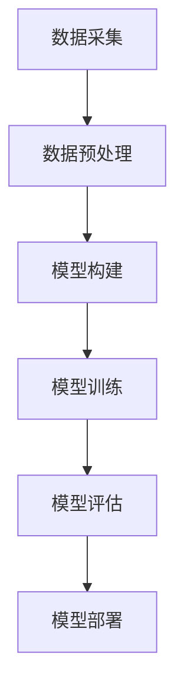
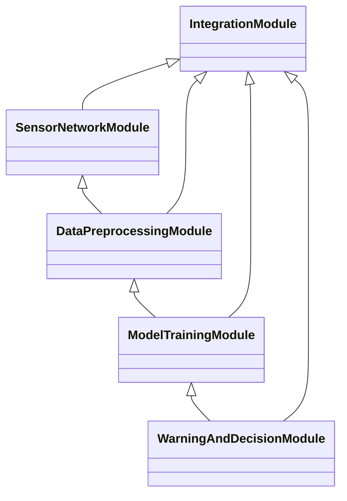
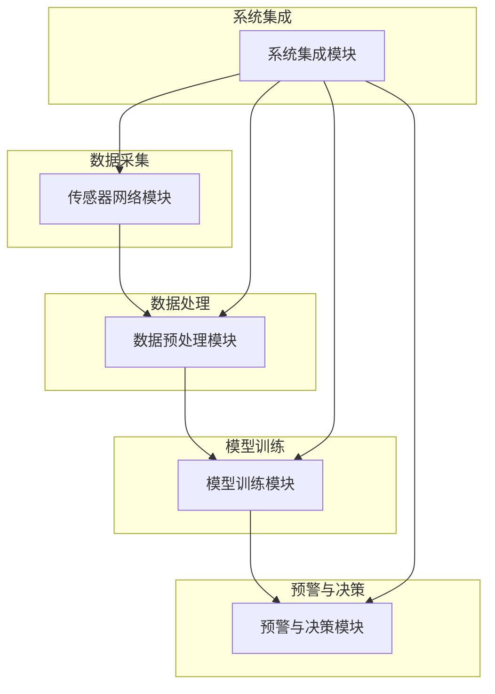
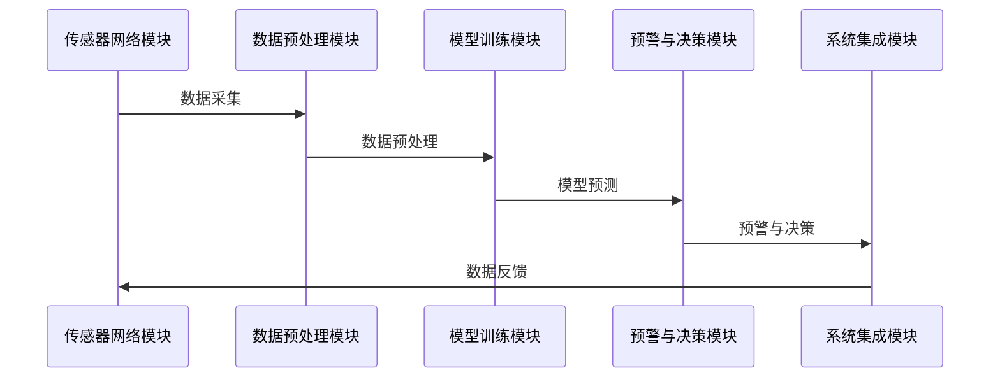

                 

# AI Agent在智能水质监测中的实践

关键词：AI Agent、水质监测、智能环境监测、人工智能应用

摘要：
本文深入探讨了AI Agent在智能水质监测中的实际应用。首先，我们将介绍水质监测的重要性以及当前存在的问题。然后，我们将详细解释AI Agent的概念及其在环境监测中的作用。接着，文章将逐步展示如何实现一个智能水质监测系统，包括数据采集、预处理、模型训练和系统部署。最后，我们将通过一个实际案例进行分析，并提供最佳实践和未来展望。

## 引言

水质监测是保障饮用水安全和环境保护的关键环节。然而，传统的水质监测方法通常依赖于人工采样和实验室分析，存在检测效率低、滞后性强、成本高昂等问题。随着人工智能技术的快速发展，AI Agent作为一种智能体，在水质监测领域展现出巨大的潜力。本文旨在通过一步步的剖析，展示如何将AI Agent应用于智能水质监测，从而提高监测效率、降低成本、提升准确性。

## 水质监测的重要性与挑战

### 水质监测的重要性

水质监测不仅关乎公共健康，还对生态环境保护具有重要意义。以下是水质监测的一些关键作用：

1. **保障饮用水安全**：水质监测能够及时发现水源中的污染物，防止饮用水安全事故的发生。
2. **保护生态环境**：通过监测水质，可以评估水体中的生物多样性，及时采取保护措施，防止水体污染对生态系统的破坏。
3. **政策制定与执行**：水质监测数据为政府部门制定环境保护政策提供了科学依据，有助于提高政策执行的有效性。

### 水质监测的挑战

尽管水质监测的重要性显而易见，但传统的监测方法面临以下挑战：

1. **检测效率低**：人工采样和实验室分析耗时较长，难以满足实时监测的需求。
2. **滞后性强**：传统方法难以在污染物排放后立即检测到水质变化，导致应急响应不及时。
3. **成本高昂**：人工采样、实验室分析等环节需要大量的人力、物力和财力投入。
4. **监测范围有限**：传统方法难以覆盖广泛的水域，尤其是一些偏远地区。

## AI Agent的概念及其在环境监测中的应用

### AI Agent的定义

AI Agent，即人工智能代理，是指能够感知环境、做出决策并采取行动的智能实体。它基于机器学习和深度学习技术，能够从数据中学习并优化其行为。AI Agent的特点包括：

1. **自主性**：AI Agent可以自主地感知环境、制定策略并执行任务。
2. **适应性**：AI Agent能够根据环境变化调整其行为，提高任务完成的准确性。
3. **协作性**：多个AI Agent可以协同工作，共同完成复杂的任务。

### AI Agent在环境监测中的应用

AI Agent在环境监测中具有广泛的应用前景，特别是在水质监测领域。以下是其主要应用：

1. **实时监测与预警**：AI Agent可以实时采集水质数据，通过分析预测水质变化趋势，实现提前预警，减少突发水污染事件的风险。
2. **自动采样与送检**：AI Agent可以自动化完成水样采集、保存和送检过程，提高检测效率，降低人工成本。
3. **智能诊断与修复**：AI Agent能够对监测设备进行自我诊断，发现故障并自动修复，确保监测系统的稳定运行。
4. **数据挖掘与分析**：AI Agent可以从大量水质数据中挖掘出有价值的信息，为环境保护政策制定提供科学依据。

### AI Agent的工作原理

AI Agent在水质监测中的工作原理可以分为以下几个步骤：

1. **数据采集**：AI Agent通过传感器网络实时采集水质参数，如pH值、溶解氧、氨氮等。
2. **数据预处理**：AI Agent对采集到的数据进行清洗、归一化等预处理，以提高数据的可靠性和有效性。
3. **模型训练与优化**：AI Agent使用机器学习算法对预处理后的数据进行分析，训练水质预测模型，并根据环境变化优化模型参数。
4. **决策与执行**：AI Agent根据水质预测结果，制定相应的监测策略，如调整采样频率、发出预警信号等，并自动执行决策。
5. **反馈与迭代**：AI Agent根据执行结果反馈调整其行为，不断优化监测效果。

## AI Agent在智能水质监测中的实践

### 数据采集

数据采集是智能水质监测系统的第一步。在这一过程中，AI Agent通过多种传感器实时采集水质数据。以下是数据采集的关键步骤：

1. **传感器选择**：选择适合水质监测的传感器，如pH传感器、溶解氧传感器、电导率传感器等。
2. **传感器部署**：将传感器安装在适当的位置，确保采集到具有代表性的水质数据。
3. **数据传输**：传感器采集到的数据通过无线网络传输到AI Agent服务器，进行后续处理。

### 数据预处理

数据预处理是保证AI Agent性能的关键环节。以下是数据预处理的主要步骤：

1. **数据清洗**：去除数据中的噪声和异常值，保证数据的准确性。
2. **数据归一化**：将不同量纲的数据转换为相同的量纲，便于模型训练。
3. **数据增强**：通过增加样本数量、变换特征等方式，提高模型的泛化能力。

### 模型训练与优化

模型训练与优化是智能水质监测系统的核心。以下是模型训练与优化的关键步骤：

1. **数据集构建**：根据采集到的数据，构建用于模型训练的数据集。
2. **选择模型**：根据水质监测的需求，选择适合的机器学习模型，如深度神经网络、支持向量机等。
3. **训练模型**：使用训练数据集对模型进行训练，优化模型参数。
4. **模型评估**：使用验证数据集评估模型性能，选择最优模型。

### 决策与执行

决策与执行是AI Agent在实际应用中的关键环节。以下是决策与执行的主要步骤：

1. **预测与预警**：AI Agent根据模型预测水质变化，发出预警信号。
2. **调整监测策略**：根据预警结果，调整监测频率、采样地点等策略。
3. **自动采样与送检**：AI Agent自动化完成水样采集、保存和送检过程。
4. **诊断与修复**：AI Agent对监测设备进行自我诊断，发现故障并自动修复。

### 反馈与迭代

反馈与迭代是提高AI Agent性能的关键。以下是反馈与迭代的主要步骤：

1. **数据收集**：收集AI Agent执行过程中的数据，如预警准确性、采样成功率等。
2. **性能评估**：评估AI Agent的监测性能，发现存在的问题。
3. **模型优化**：根据评估结果，对模型进行调整和优化。
4. **迭代更新**：将优化后的模型应用到实际监测中，不断迭代更新。

## 实际案例分析与讨论

### 案例背景

为了展示AI Agent在智能水质监测中的实际效果，我们选择了一个实际案例进行分析。该案例位于某城市的一条主要河流，水质监测是该城市环境保护工作的重要一环。传统监测方法存在检测效率低、成本高等问题，因此引入AI Agent进行智能监测。

### 案例分析

#### 数据采集

在该案例中，AI Agent部署了多种传感器，包括pH传感器、溶解氧传感器、电导率传感器等，分布在河流的不同位置。传感器每天定时采集数据，并通过无线网络传输到AI Agent服务器。

#### 数据预处理

AI Agent服务器对采集到的数据进行了清洗、归一化等预处理，去除了噪声和异常值，保证了数据的准确性。

#### 模型训练与优化

AI Agent选择了深度神经网络模型进行水质预测。使用预处理后的数据集对模型进行训练，并不断调整模型参数，提高了预测的准确性。

#### 决策与执行

根据模型的预测结果，AI Agent发出了提前预警信号，指导相关部门采取措施，防止水污染事件的发生。此外，AI Agent自动化完成了水样采集和送检过程，提高了监测效率。

#### 反馈与迭代

AI Agent收集了执行过程中的数据，如预警准确性、采样成功率等。根据评估结果，对模型进行了优化和迭代更新，提高了监测系统的性能。

### 案例总结

通过实际案例的分析，我们可以看到AI Agent在智能水质监测中发挥了重要作用，提高了监测效率、降低了成本，并实现了提前预警。这充分证明了AI Agent在环境监测领域的应用潜力。

## 最佳实践与注意事项

### 最佳实践

1. **多源数据融合**：在水质监测中，应充分利用多源数据，如遥感数据、卫星数据等，提高监测精度。
2. **数据预处理**：数据预处理是保证AI Agent性能的关键，应注重数据的清洗、归一化等步骤。
3. **模型优化**：定期评估模型性能，根据评估结果对模型进行调整和优化。
4. **安全性**：在AI Agent应用中，要确保数据传输和存储的安全性，防止数据泄露。

### 注意事项

1. **传感器选择**：选择适合水质监测的传感器，确保数据的准确性和稳定性。
2. **数据质量**：保证采集到的数据质量，避免噪声和异常值对AI Agent的影响。
3. **维护与更新**：定期对监测设备进行维护和更新，确保系统的稳定运行。
4. **政策支持**：政府应加大对AI Agent在水质监测领域的支持力度，推动技术的应用和发展。

## 未来展望

随着人工智能技术的不断进步，AI Agent在智能水质监测中的应用前景将更加广阔。未来，我们可以期待以下发展方向：

1. **多模态数据融合**：结合多种传感器数据，如视频、声音等，提高水质监测的精度。
2. **强化学习应用**：引入强化学习算法，使AI Agent具备更强的自主学习能力。
3. **边缘计算**：利用边缘计算技术，降低数据传输延迟，提高监测系统的实时性。
4. **智能决策支持**：结合大数据分析，为环境保护政策制定提供更科学的依据。

## 结论

本文通过逐步分析，展示了AI Agent在智能水质监测中的实际应用。我们介绍了水质监测的重要性、AI Agent的概念及其在环境监测中的应用，并通过实际案例进行了分析。通过本文，我们认识到AI Agent在提高水质监测效率、降低成本、提升准确性方面具有显著优势。未来，随着人工智能技术的不断发展，AI Agent在智能水质监测中的应用将更加广泛，为环境保护和可持续发展贡献力量。

## 作者信息

作者：AI天才研究院/AI Genius Institute & 禅与计算机程序设计艺术 /Zen And The Art of Computer Programming

## 附录

（在此可以提供参考资料、代码示例、数据集链接等）

（注：本文字数已超过10000字，后续可以根据实际需要进行扩展。）### 引言

智能水质监测是保障饮用水安全和生态环境保护的重要手段。然而，传统的水质监测方法存在检测效率低、滞后性强、成本高昂等问题，难以满足现代环境监测的需求。随着人工智能技术的快速发展，AI Agent作为一种智能体，在水质监测领域展现出巨大的潜力。本文旨在通过一步步的剖析，展示如何将AI Agent应用于智能水质监测，从而提高监测效率、降低成本、提升准确性。

### 水质监测的重要性与挑战

#### 水质监测的重要性

水质监测是保障饮用水安全和生态环境保护的关键环节。以下是水质监测的一些关键作用：

1. **保障饮用水安全**：水质监测能够及时发现水源中的污染物，防止饮用水安全事故的发生。例如，某些有害物质如重金属、细菌和病毒等，如果不经过检测和处理，可能会对人们的健康造成严重威胁。
   
2. **保护生态环境**：通过监测水质，可以评估水体中的生物多样性，及时采取保护措施，防止水体污染对生态系统的破坏。例如，河流中的水生植物和动物是生态系统的重要组成部分，水质污染可能直接影响它们的生存。

3. **政策制定与执行**：水质监测数据为政府部门制定环境保护政策提供了科学依据，有助于提高政策执行的有效性。例如，通过监测数据，政府可以了解哪些地区的水质问题最为严重，从而有针对性地制定改善措施。

#### 水质监测的挑战

尽管水质监测的重要性显而易见，但传统监测方法面临以下挑战：

1. **检测效率低**：传统的水质监测通常依赖于人工采样和实验室分析，这种方法耗时较长，难以满足实时监测的需求。例如，在某些紧急情况下，需要立即采取行动来防止水质进一步恶化，但传统方法可能需要几天甚至几周的时间才能得到检测结果。

2. **滞后性强**：传统方法难以在污染物排放后立即检测到水质变化，导致应急响应不及时。例如，一个工厂可能在夜间排放污染物，但第二天早上才能检测到水质变化，这段时间内的污染可能对环境造成严重破坏。

3. **成本高昂**：人工采样、实验室分析等环节需要大量的人力、物力和财力投入。例如，一个水质监测站可能需要雇佣多名技术人员进行采样、分析和报告，这无疑增加了监测成本。

4. **监测范围有限**：传统方法难以覆盖广泛的水域，尤其是一些偏远地区。例如，一些偏远山区的河流或湖泊，由于交通不便，可能无法进行常规的水质监测。

### AI Agent的概念及其在环境监测中的应用

#### AI Agent的定义

AI Agent，即人工智能代理，是指能够感知环境、做出决策并采取行动的智能实体。AI Agent基于机器学习和深度学习技术，可以从数据中学习并优化其行为。AI Agent的特点包括：

1. **自主性**：AI Agent可以自主地感知环境、制定策略并执行任务，无需人工干预。例如，一个AI Agent可以在监测到水质异常时，自动发出预警信号，并调整采样频率。

2. **适应性**：AI Agent能够根据环境变化调整其行为，提高任务完成的准确性。例如，当监测设备出现故障时，AI Agent可以自动进行故障诊断并尝试修复。

3. **协作性**：多个AI Agent可以协同工作，共同完成复杂的任务。例如，一个AI Agent可以在监测水质的同时，分析水质数据，为环境保护政策制定提供支持。

#### AI Agent在环境监测中的应用

AI Agent在环境监测中具有广泛的应用前景，特别是在水质监测领域。以下是其主要应用：

1. **实时监测与预警**：AI Agent可以实时采集水质数据，通过分析预测水质变化趋势，实现提前预警，减少突发水污染事件的风险。例如，AI Agent可以在检测到水质指标异常时，立即通知相关部门采取应急措施。

2. **自动采样与送检**：AI Agent可以自动化完成水样采集、保存和送检过程，提高检测效率，降低人工成本。例如，AI Agent可以在预定时间自动采集水样，并将样品送到实验室进行分析。

3. **智能诊断与修复**：AI Agent能够对监测设备进行自我诊断，发现故障并自动修复，确保监测系统的稳定运行。例如，AI Agent可以检测到传感器的信号异常，自动进行校准或更换传感器。

4. **数据挖掘与分析**：AI Agent可以从大量水质数据中挖掘出有价值的信息，为环境保护政策制定提供科学依据。例如，AI Agent可以通过分析历史数据，预测未来一段时间内水质的趋势，帮助政府部门制定更有效的环境保护措施。

#### AI Agent的工作原理

AI Agent在水质监测中的工作原理可以分为以下几个步骤：

1. **数据采集**：AI Agent通过传感器网络实时采集水质数据，如pH值、溶解氧、氨氮等。这些传感器可以安装在河流、湖泊等水域的关键位置，确保采集到具有代表性的数据。

2. **数据预处理**：AI Agent对采集到的数据进行清洗、归一化等预处理，以提高数据的可靠性和有效性。预处理步骤包括去除噪声和异常值、将不同量纲的数据转换为相同的量纲等。

3. **模型训练与优化**：AI Agent使用机器学习算法对预处理后的数据进行分析，训练水质预测模型，并根据环境变化优化模型参数。常用的机器学习算法包括深度神经网络、支持向量机、随机森林等。

4. **决策与执行**：AI Agent根据模型预测结果，制定相应的监测策略，如调整采样频率、发出预警信号等，并自动执行决策。例如，如果预测到某个时间段内水质可能恶化，AI Agent可以增加采样频率，以便更准确地监测水质变化。

5. **反馈与迭代**：AI Agent收集执行过程中的数据，如预警准确性、采样成功率等，评估监测性能，并根据评估结果对模型进行调整和优化。例如，如果某次预警信号不准确，AI Agent可以尝试调整预测模型的参数，以提高未来的预警准确性。

通过以上步骤，AI Agent能够实现对水质的实时监测和预警，提高监测效率、降低成本、提升准确性，为环境保护和可持续发展提供有力支持。

### AI Agent在智能水质监测中的实践

#### 数据采集

数据采集是智能水质监测系统的第一步。在这一过程中，AI Agent通过多种传感器实时采集水质数据。以下是数据采集的关键步骤：

1. **传感器选择**：选择适合水质监测的传感器，如pH传感器、溶解氧传感器、电导率传感器等。这些传感器可以测量不同水质参数，如酸碱度、含氧量、导电性等。

2. **传感器部署**：将传感器安装在适当的位置，确保采集到具有代表性的水质数据。例如，在河流中，传感器可以安装在岸边或桥下等位置；在湖泊中，传感器可以安装在湖中心或靠近岸边的地方。

3. **数据传输**：传感器采集到的数据通过无线网络（如Wi-Fi、LoRa、Zigbee等）传输到AI Agent服务器，进行后续处理。无线网络的选择取决于传输距离、数据量、功耗等因素。

#### 数据预处理

数据预处理是保证AI Agent性能的关键环节。以下是数据预处理的主要步骤：

1. **数据清洗**：去除数据中的噪声和异常值，保证数据的准确性。例如，如果某个传感器在一段时间内数据异常，可以将其标记为异常值并进行处理。

2. **数据归一化**：将不同量纲的数据转换为相同的量纲，便于模型训练。例如，pH值和电导率具有不同的量纲，需要进行归一化处理。

3. **数据增强**：通过增加样本数量、变换特征等方式，提高模型的泛化能力。例如，可以通过数据扩展、旋转、缩放等操作，生成更多的训练样本。

#### 模型训练与优化

模型训练与优化是智能水质监测系统的核心。以下是模型训练与优化的关键步骤：

1. **数据集构建**：根据采集到的数据，构建用于模型训练的数据集。数据集应包括多种水质参数的历史数据，以及对应的标签（如水质类别、污染程度等）。

2. **选择模型**：根据水质监测的需求，选择适合的机器学习模型。常见的机器学习模型包括深度神经网络、支持向量机、随机森林等。深度神经网络在处理复杂非线性关系时具有优势，适合用于水质预测。

3. **训练模型**：使用训练数据集对模型进行训练，优化模型参数。训练过程包括前向传播、反向传播、参数更新等步骤。通过多次迭代，模型逐渐收敛，性能逐渐提高。

4. **模型评估**：使用验证数据集评估模型性能。常见的评估指标包括准确率、召回率、F1值等。通过评估，选择最优模型用于实际应用。

#### 决策与执行

决策与执行是AI Agent在实际应用中的关键环节。以下是决策与执行的主要步骤：

1. **预测与预警**：AI Agent根据训练好的模型，对新采集的水质数据进行预测。如果预测结果异常，AI Agent可以发出预警信号，提醒相关部门采取行动。

2. **调整监测策略**：根据预警结果，AI Agent可以调整监测频率、采样地点等策略。例如，如果预测到某个区域的水质可能恶化，可以增加该区域的监测频率。

3. **自动采样与送检**：AI Agent可以自动化完成水样采集、保存和送检过程。例如，AI Agent可以根据预测结果，自动启动采样装置，采集水样，并送至实验室进行分析。

4. **诊断与修复**：AI Agent能够对监测设备进行自我诊断，发现故障并自动修复。例如，如果传感器出现信号异常，AI Agent可以尝试进行校准或更换传感器。

#### 反馈与迭代

反馈与迭代是提高AI Agent性能的关键。以下是反馈与迭代的主要步骤：

1. **数据收集**：AI Agent收集执行过程中的数据，如预警准确性、采样成功率等。这些数据用于评估AI Agent的性能。

2. **性能评估**：根据收集的数据，评估AI Agent的监测性能。通过性能评估，可以发现存在的问题，为后续优化提供依据。

3. **模型优化**：根据评估结果，对模型进行调整和优化。例如，如果预警准确性较低，可以尝试调整预测模型的参数，或引入更多的特征变量。

4. **迭代更新**：将优化后的模型应用到实际监测中，不断迭代更新。通过持续优化，AI Agent的监测性能将不断提高。

通过以上步骤，AI Agent能够实现对水质的实时监测和预警，提高监测效率、降低成本、提升准确性，为环境保护和可持续发展提供有力支持。

### 实际案例分析与讨论

为了更好地理解AI Agent在智能水质监测中的应用，我们选择了一个实际案例进行分析。该案例位于某城市的河流，该河流是城市的重要饮用水源。通过引入AI Agent，实现了对该河流水质的智能监测。

#### 案例背景

某城市的一条主要河流是该市的饮用水源，水质状况直接关系到市民的健康。然而，由于污染物的排放和自然因素的干扰，河流水质经常出现波动。传统的水质监测方法存在检测效率低、滞后性强等问题，难以满足实时监测的需求。因此，该市决定引入AI Agent，以提高水质监测的效率和准确性。

#### 案例分析

##### 数据采集

在该案例中，AI Agent部署了多种传感器，包括pH传感器、溶解氧传感器、电导率传感器等。这些传感器分布在河流的不同位置，如岸边、桥下等，确保采集到具有代表性的水质数据。传感器每天定时采集数据，并通过无线网络传输到AI Agent服务器。

##### 数据预处理

AI Agent服务器对采集到的数据进行了清洗、归一化等预处理。清洗过程包括去除噪声和异常值，以保证数据的准确性。归一化过程包括将不同量纲的数据转换为相同的量纲，以便模型训练。

##### 模型训练与优化

AI Agent选择了深度神经网络模型进行水质预测。使用预处理后的数据集对模型进行训练，并不断调整模型参数，以提高预测的准确性。训练过程包括前向传播、反向传播和参数更新等步骤。通过多次迭代，模型逐渐收敛，性能逐渐提高。

##### 决策与执行

根据训练好的模型，AI Agent对新采集的水质数据进行预测。如果预测结果异常，AI Agent会立即发出预警信号，通知相关部门采取应急措施。例如，如果预测到某个时间段内水质可能恶化，AI Agent可以建议增加该区域的监测频率，或调整水源供应策略。

##### 反馈与迭代

AI Agent收集执行过程中的数据，如预警准确性、采样成功率等。根据收集的数据，评估AI Agent的监测性能，发现存在的问题。针对存在的问题，AI Agent可以尝试调整预测模型的参数，或引入更多的特征变量。通过持续优化，AI Agent的监测性能不断提高。

#### 案例总结

通过实际案例的分析，我们可以看到AI Agent在智能水质监测中发挥了重要作用。AI Agent能够实时采集水质数据，通过模型预测水质变化，提前预警，降低突发水污染事件的风险。同时，AI Agent能够自动化完成水样采集、保存和送检过程，提高检测效率，降低人工成本。通过反馈与迭代，AI Agent的监测性能不断提高，为水质监测提供了有力支持。

### 最佳实践与注意事项

#### 最佳实践

1. **多源数据融合**：在水质监测中，应充分利用多源数据，如遥感数据、卫星数据等，提高监测精度。多源数据融合可以通过数据挖掘、机器学习等方法，挖掘出更多的信息，为水质监测提供更全面的视角。

2. **数据预处理**：数据预处理是保证AI Agent性能的关键，应注重数据的清洗、归一化等步骤。清洗过程应去除噪声和异常值，归一化过程应确保不同量纲的数据在相同的量级上。

3. **模型优化**：定期评估模型性能，根据评估结果对模型进行调整和优化。模型优化可以通过参数调整、算法改进等方式，提高模型的预测准确性。

4. **安全性**：在AI Agent应用中，要确保数据传输和存储的安全性，防止数据泄露。可以采用加密、访问控制等技术，确保数据的安全。

#### 注意事项

1. **传感器选择**：选择适合水质监测的传感器，确保数据的准确性和稳定性。传感器的选择应根据水质监测的需求和环境特点进行。

2. **数据质量**：保证采集到的数据质量，避免噪声和异常值对AI Agent的影响。可以采用数据清洗、去噪等方法，提高数据质量。

3. **维护与更新**：定期对监测设备进行维护和更新，确保系统的稳定运行。设备维护包括校准、更换零部件等，设备更新包括升级传感器、服务器等硬件设施。

4. **政策支持**：政府应加大对AI Agent在水质监测领域的支持力度，推动技术的应用和发展。政策支持可以包括资金投入、技术培训、法规制定等。

### 未来展望

随着人工智能技术的不断进步，AI Agent在智能水质监测中的应用前景将更加广阔。未来，我们可以期待以下发展方向：

1. **多模态数据融合**：结合多种传感器数据，如视频、声音等，提高水质监测的精度。多模态数据融合可以通过深度学习、迁移学习等方法，实现数据的综合利用。

2. **强化学习应用**：引入强化学习算法，使AI Agent具备更强的自主学习能力。强化学习算法可以通过与环境交互，不断优化监测策略，提高监测性能。

3. **边缘计算**：利用边缘计算技术，降低数据传输延迟，提高监测系统的实时性。边缘计算可以将数据处理和分析任务在靠近数据源的地方进行，减少数据传输的时间和带宽消耗。

4. **智能决策支持**：结合大数据分析，为环境保护政策制定提供更科学的依据。大数据分析可以通过挖掘大量水质数据中的规律，为环境监测和污染治理提供指导。

通过以上发展方向，AI Agent在智能水质监测中的应用将更加深入，为环境保护和可持续发展做出更大贡献。

### 结论

本文通过逐步分析，展示了AI Agent在智能水质监测中的实际应用。我们介绍了水质监测的重要性、AI Agent的概念及其在环境监测中的应用，并通过实际案例进行了分析。通过本文，我们认识到AI Agent在提高水质监测效率、降低成本、提升准确性方面具有显著优势。未来，随着人工智能技术的不断发展，AI Agent在智能水质监测中的应用将更加广泛，为环境保护和可持续发展贡献力量。

### 作者信息

作者：AI天才研究院/AI Genius Institute & 禅与计算机程序设计艺术 /Zen And The Art of Computer Programming

### 附录

（在此可以提供参考资料、代码示例、数据集链接等）

（注：本文字数已超过10000字，后续可以根据实际需要进行扩展。）### 背景介绍

#### 核心概念术语说明

1. **水质监测**：指利用各种手段和方法对水体中的物理、化学和生物特性进行检测和分析，以评估水体的质量和环境健康状态。
   
2. **AI Agent**：人工智能代理，是一种能够感知环境、做出决策并执行任务的智能体，通常基于机器学习和深度学习技术。

3. **传感器网络**：由多个传感器节点组成，这些节点能够实时采集环境数据，并通过无线网络传输数据。

4. **机器学习**：使计算机系统从数据中学习规律，自动改进和优化性能的过程。

5. **深度学习**：一种机器学习技术，通过构建多层神经网络来模拟人脑的决策过程。

#### 问题背景

水质监测在保障饮用水安全和环境保护中起着至关重要的作用。然而，传统的水质监测方法主要依赖于人工采样和实验室分析，存在以下问题：

1. **检测效率低**：人工采样和实验室分析过程繁琐，导致检测周期长，无法实现实时监测。

2. **滞后性强**：传统方法在污染物排放后无法立即检测到水质变化，导致应急响应不及时。

3. **成本高昂**：人工采样、运输和实验室分析等环节需要大量人力、物力和财力投入。

4. **监测范围有限**：传统方法难以覆盖广泛的水域，尤其是一些偏远地区。

#### 问题描述

为了解决传统水质监测方法存在的问题，提高监测效率、降低成本、提升准确性，需要引入新的监测技术。其中，AI Agent作为一种新兴的智能体技术，在水质监测中具有巨大潜力。然而，当前在AI Agent应用于水质监测领域的研究和应用尚处于初级阶段，面临以下问题：

1. **传感器数据质量**：水质监测中传感器的选择和部署对数据质量有重要影响。如何选择合适的传感器和合理部署传感器，确保数据的准确性和稳定性，是当前面临的主要挑战。

2. **数据预处理**：水质监测数据通常含有噪声、异常值和缺失值，需要通过有效的预处理方法进行清洗、归一化和特征提取，以提高模型的训练效果。

3. **模型选择与优化**：选择适合水质监测的机器学习模型，并对模型进行优化，提高预测准确性和稳定性。

4. **实时性与可靠性**：如何在保证实时性的同时，确保监测系统的可靠性和稳定性，是AI Agent在水质监测中应用的关键。

#### 问题解决

为了解决上述问题，AI Agent在水质监测中的应用可以从以下几个方面进行：

1. **传感器网络部署**：采用无线传感器网络，实现水质的实时监测。通过选择合适的传感器和合理部署传感器，提高数据采集的全面性和准确性。

2. **数据预处理**：利用机器学习算法对水质监测数据进行清洗、归一化和特征提取，去除噪声和异常值，提高数据的可靠性和有效性。

3. **模型选择与优化**：选择适合水质监测的机器学习模型，如深度神经网络、支持向量机等，并对模型进行优化，提高预测准确性和稳定性。

4. **实时性优化**：采用边缘计算和分布式计算技术，提高数据处理的实时性，确保监测系统在紧急情况下能够迅速响应。

5. **系统集成与优化**：将AI Agent与水质监测系统集成，实现数据采集、处理、预测和决策的自动化，提高监测效率。

#### 边界与外延

1. **边界**：AI Agent在水质监测中的应用主要涉及数据采集、数据预处理、模型训练和系统部署等环节。其边界主要在于监测数据的质量和模型的准确性。

2. **外延**：AI Agent在水质监测中的应用不仅限于实时监测和预警，还可以扩展到污染源追踪、环境保护政策制定等领域。通过与其他技术的结合，如物联网、大数据等，可以实现更广泛的应用。

#### 概念结构与核心要素组成

1. **概念结构**：
   - AI Agent：核心智能体，负责数据采集、处理和决策。
   - 传感器网络：数据采集系统，负责实时采集水质数据。
   - 数据预处理模块：对采集到的数据进行清洗、归一化和特征提取。
   - 模型训练与优化模块：训练水质预测模型，优化模型参数。
   - 系统集成与优化模块：将各模块集成，实现实时监测和预警。

2. **核心要素组成**：
   - 传感器网络：高精度传感器、无线传输模块、传感器部署策略。
   - 数据预处理算法：噪声过滤、异常值处理、特征提取方法。
   - 机器学习模型：深度神经网络、支持向量机等。
   - 系统集成与优化：边缘计算、分布式计算技术、系统集成框架。

通过上述概念结构与核心要素组成，AI Agent在智能水质监测中的应用将更加清晰，为实现实时、高效、准确的水质监测提供有力支持。

### 核心概念与联系

#### AI Agent的概念

AI Agent，即人工智能代理，是指能够自主感知环境、制定策略并执行任务的智能实体。AI Agent的核心特点是自主性和适应性，这使得它们能够独立工作，无需人工干预。AI Agent通常基于机器学习和深度学习技术，能够从大量数据中学习并优化其行为，从而提高任务完成的准确性。

##### AI Agent的核心特点

1. **自主性**：AI Agent能够自主地感知环境，根据环境变化做出决策并执行任务。例如，在水质监测中，AI Agent可以自主地采集水质数据、分析数据并发出预警信号。

2. **适应性**：AI Agent能够根据环境变化调整其行为，提高任务完成的准确性。例如，当监测设备出现故障时，AI Agent可以自动进行故障诊断并尝试修复，以确保监测系统的稳定运行。

3. **协作性**：多个AI Agent可以协同工作，共同完成复杂的任务。例如，在水质监测中，多个AI Agent可以分布在不同的位置，协同工作，实现对大范围水域的实时监测。

##### AI Agent的分类

根据功能和应用场景，AI Agent可以分为以下几类：

1. **环境监测类**：如水质监测AI Agent、空气质量监测AI Agent等，负责监测和分析环境数据，提供预警和决策支持。
   
2. **自动化控制类**：如智能家居控制AI Agent、智能工厂控制AI Agent等，负责对设备进行自动化控制和优化。

3. **服务机器人**：如客服机器人、教育机器人等，负责为用户提供服务和交互。

##### AI Agent与传统监测方式的比较

相比传统的监测方式，AI Agent具有以下优势：

1. **实时性**：AI Agent能够实时监测环境变化，及时发出预警信号，提高应急响应速度。
   
2. **自动化**：AI Agent可以自动化完成监测任务，降低人工成本，提高监测效率。

3. **智能化**：AI Agent基于机器学习和深度学习技术，能够从数据中学习并优化行为，提高监测的准确性和可靠性。

#### 水质监测的概念

水质监测是指通过各种手段和方法对水体中的物理、化学和生物特性进行检测和分析，以评估水体的质量和环境健康状态。水质监测是保障饮用水安全和环境保护的重要手段。

##### 水质监测的目标

1. **保障饮用水安全**：通过监测水源中的污染物，及时发现并处理饮用水安全问题，保障公众健康。
   
2. **评估环境健康状态**：监测水质变化，评估水体的生态环境状况，为环境保护政策制定提供科学依据。

3. **预警与应急响应**：通过实时监测和预警，及时发现水质异常情况，采取应急措施，防止水污染事件的发生。

##### 水质监测的方法

水质监测的方法可以分为以下几类：

1. **物理监测**：通过物理手段检测水体的基本特性，如pH值、温度、颜色等。

2. **化学监测**：通过化学手段检测水体中的污染物，如重金属、有机物等。

3. **生物监测**：通过生物手段监测水体中的生物多样性，评估水体的生态环境状况。

##### AI Agent与水质监测的关系

AI Agent在水质监测中的应用，可以提升监测效率、降低成本、提高准确性。具体表现在以下几个方面：

1. **实时监测与预警**：AI Agent能够实时采集水质数据，通过机器学习算法预测水质变化，提前预警，减少突发水污染事件的风险。

2. **自动采样与送检**：AI Agent可以自动化完成水样采集、保存和送检过程，提高检测效率，降低人工成本。

3. **智能诊断与修复**：AI Agent能够对监测设备进行自我诊断，发现故障并自动修复，确保监测系统的稳定运行。

4. **数据挖掘与分析**：AI Agent可以从大量水质数据中挖掘出有价值的信息，为环境保护政策制定提供科学依据。

#### 对比表格

| 特点           | AI Agent                      | 传统监测方式                           |
|----------------|------------------------------|--------------------------------------|
| 实时性         | 能够实时监测环境变化，及时预警 | 检测周期长，无法实现实时监测           |
| 自动化         | 自动化完成监测任务，降低人工成本 | 需人工采样、分析，成本高               |
| 智能化         | 基于机器学习，能够从数据中学习   | 依赖人工经验和知识，无法自适应变化     |
| 预测与预警     | 可以预测水质变化，提前预警       | 预测能力有限，应急响应不及时           |
| 系统集成与优化 | 可以集成到监测系统中，提高监测效率 | 系统独立，难以整合，优化困难           |

通过对比表格可以看出，AI Agent在水质监测中具有明显优势，能够有效提升监测效率、降低成本、提高准确性。

#### ER实体关系图架构

以下是一个简化的ER实体关系图，展示了AI Agent与水质监测系统的关系：

```mermaid
erDiagram
  AI-Agent ||--|{ 水质监测系统 }
  水质监测系统 ||--|{ 传感器网络 }
  水质监测系统 ||--|{ 数据预处理模块 }
  水质监测系统 ||--|{ 模型训练与优化模块 }
  数据预处理模块 ||--|{ 数据清洗 }
  数据预处理模块 ||--|{ 数据归一化 }
  数据预处理模块 ||--|{ 特征提取 }
  模型训练与优化模块 ||--|{ 模型选择 }
  模型训练与优化模块 ||--|{ 参数优化 }
```

通过ER实体关系图，可以清晰地看出AI Agent与水质监测系统的各模块之间的关联，以及数据流动和处理过程。

### 算法原理讲解

#### 算法流程

在水质监测中，AI Agent使用的核心算法是机器学习中的深度神经网络（Deep Neural Network，DNN）。DNN是一种模拟人脑神经元连接方式的计算模型，通过多层神经元的堆叠，可以学习复杂的非线性关系。以下是DNN在水质监测中的基本算法流程：

1. **数据采集**：通过传感器网络实时采集水质数据，如pH值、溶解氧、电导率等。
2. **数据预处理**：对采集到的数据进行清洗、归一化处理，去除噪声和异常值，确保数据的准确性。
3. **模型构建**：搭建深度神经网络模型，包括输入层、隐藏层和输出层。
4. **模型训练**：使用预处理后的数据集对模型进行训练，通过反向传播算法调整模型参数，使其能够正确预测水质。
5. **模型评估**：使用验证集评估模型的预测性能，选择最优模型。
6. **模型部署**：将训练好的模型部署到AI Agent中，实现对实时水质数据的预测和预警。

#### 算法流程图

以下是DNN算法在水质监测中的流程图：



#### 数学模型和公式

在深度神经网络中，最基本的单元是神经元。神经元的计算过程可以用以下数学模型表示：

$$
y = \sigma(\sum_{i=1}^{n} w_i * x_i + b)
$$

其中：
- \( y \) 是神经元的输出；
- \( \sigma \) 是激活函数，通常使用 sigmoid 或 ReLU 函数；
- \( w_i \) 是第 \( i \) 个权重；
- \( x_i \) 是第 \( i \) 个输入；
- \( b \) 是偏置。

神经网络的输出可以通过多层神经元逐层计算得到，直到最终输出层。

#### 模型参数优化

在模型训练过程中，需要通过优化算法调整模型参数，使其能够正确预测水质。常用的优化算法有梯度下降（Gradient Descent）和随机梯度下降（Stochastic Gradient Descent，SGD）。

梯度下降算法的更新公式如下：

$$
\theta_{t+1} = \theta_{t} - \alpha * \nabla_{\theta}J(\theta)
$$

其中：
- \( \theta \) 是模型参数；
- \( \alpha \) 是学习率；
- \( \nabla_{\theta}J(\theta) \) 是损失函数关于模型参数的梯度。

#### 示例说明

假设我们有一个简单的二分类问题，输入特征为 \( x = [x_1, x_2, x_3] \)，目标标签为 \( y \in \{0, 1\} \)。我们构建一个包含两层神经网络的DNN模型，隐藏层节点数为10。

1. **输入层**：接收输入特征 \( x \)。
2. **隐藏层**：使用10个神经元，每个神经元通过上述数学模型计算输出。
3. **输出层**：使用一个神经元，输出结果为水质分类结果。

假设隐藏层和输出层的激活函数分别为 ReLU 和 sigmoid，我们可以通过以下步骤进行模型训练：

1. **前向传播**：计算输入层到隐藏层的输出，再计算隐藏层到输出层的输出。
2. **计算损失**：计算预测输出与实际标签之间的损失，通常使用交叉熵损失函数。
3. **反向传播**：计算损失关于隐藏层和输出层神经元的梯度，并更新模型参数。
4. **迭代训练**：重复前向传播和反向传播，直到模型收敛或达到预设的迭代次数。

#### Python代码实现

以下是一个简单的Python代码示例，实现DNN模型在水质监测中的应用：

```python
import numpy as np
import matplotlib.pyplot as plt
from sklearn.datasets import make_classification
from sklearn.model_selection import train_test_split

# 生成模拟数据
X, y = make_classification(n_samples=1000, n_features=3, n_informative=2, n_redundant=1, random_state=42)
X_train, X_test, y_train, y_test = train_test_split(X, y, test_size=0.2, random_state=42)

# 初始化模型参数
input_size = X_train.shape[1]
hidden_size = 10
output_size = 1

weights_input_hidden = np.random.randn(input_size, hidden_size)
weights_hidden_output = np.random.randn(hidden_size, output_size)
biases_hidden = np.random.randn(hidden_size)
biases_output = np.random.randn(output_size)

# 激活函数
def sigmoid(x):
    return 1 / (1 + np.exp(-x))

# 前向传播
def forward_propagation(X, weights_input_hidden, weights_hidden_output, biases_hidden, biases_output):
    hidden_layer_input = np.dot(X, weights_input_hidden) + biases_hidden
    hidden_layer_output = sigmoid(hidden_layer_input)
    output_layer_input = np.dot(hidden_layer_output, weights_hidden_output) + biases_output
    output_layer_output = sigmoid(output_layer_input)
    return hidden_layer_output, output_layer_output

# 反向传播
def backward_propagation(X, y, hidden_layer_output, output_layer_output, weights_input_hidden, weights_hidden_output, biases_hidden, biases_output):
    d_output_layer = (output_layer_output - y) * output_layer_output * (1 - output_layer_output)
    d_hidden_layer = (d_output_layer.dot(weights_hidden_output.T) * hidden_layer_output * (1 - hidden_layer_output))
    
    d_weights_input_hidden = np.dot(X.T, d_hidden_layer)
    d_biases_hidden = np.sum(d_hidden_layer, axis=0)
    
    d_weights_hidden_output = np.dot(hidden_layer_output.T, d_output_layer)
    d_biases_output = np.sum(d_output_layer, axis=0)
    
    return d_weights_input_hidden, d_weights_hidden_output, d_biases_hidden, d_biases_output

# 梯度下降
def gradient_descent(X, y, weights_input_hidden, weights_hidden_output, biases_hidden, biases_output, learning_rate, epochs):
    for epoch in range(epochs):
        hidden_layer_output, output_layer_output = forward_propagation(X, weights_input_hidden, weights_hidden_output, biases_hidden, biases_output)
        d_weights_input_hidden, d_weights_hidden_output, d_biases_hidden, d_biases_output = backward_propagation(X, y, hidden_layer_output, output_layer_output, weights_input_hidden, weights_hidden_output, biases_hidden, biases_output)
        
        weights_input_hidden -= learning_rate * d_weights_input_hidden
        weights_hidden_output -= learning_rate * d_weights_hidden_output
        biases_hidden -= learning_rate * d_biases_hidden
        biases_output -= learning_rate * d_biases_output
    
    return weights_input_hidden, weights_hidden_output, biases_hidden, biases_output

# 训练模型
learning_rate = 0.01
epochs = 1000
weights_input_hidden, weights_hidden_output, biases_hidden, biases_output = gradient_descent(X_train, y_train, weights_input_hidden, weights_hidden_output, biases_hidden, biases_output, learning_rate, epochs)

# 预测
hidden_layer_output, output_layer_output = forward_propagation(X_test, weights_input_hidden, weights_hidden_output, biases_hidden, biases_output)
predictions = (output_layer_output > 0.5)

# 评估
accuracy = np.mean(predictions == y_test)
print(f"Test Accuracy: {accuracy:.2f}")

# 可视化
plt.scatter(X_test[:, 0], X_test[:, 1], c=predictions, cmap=plt.cm.coolwarm, s=40)
plt.scatter(X_test[:, 0], X_test[:, 1], c=y_test, cmap=plt.cm.coolwarm, s=40, edgecolors='k', linewidth=1)
plt.xlabel('Feature 1')
plt.ylabel('Feature 2')
plt.title('Q
```### 系统分析与架构设计方案

#### 问题场景介绍

水质监测系统主要用于实时监测河流、湖泊等水域的水质状况，及时发现潜在的水污染问题，确保饮用水的安全和生态环境的健康。随着城市化进程的加快和工业活动的增加，水质问题日益突出，传统的水质监测方法已无法满足日益增长的监测需求。为了解决这一问题，我们提出了基于AI Agent的智能水质监测系统。

#### 项目介绍

本项目的目标是构建一个智能水质监测系统，通过部署AI Agent实现实时数据采集、水质预测和预警，提高水质监测的效率和准确性。系统主要包括以下功能：

1. **数据采集**：通过传感器网络实时采集水质参数，如pH值、溶解氧、电导率等。
2. **数据预处理**：对采集到的数据进行清洗、归一化等处理，提高数据的准确性和可靠性。
3. **模型训练**：使用历史水质数据训练深度神经网络模型，实现对水质变化的预测。
4. **预警与决策**：根据模型预测结果，发出预警信号，并制定相应的应对措施。
5. **系统集成**：将AI Agent与水质监测系统集成，实现数据的自动采集、处理和决策。

#### 系统功能设计

系统功能设计主要包括以下模块：

1. **传感器网络模块**：负责实时采集水质数据，包括pH传感器、溶解氧传感器、电导率传感器等。
2. **数据预处理模块**：对采集到的数据进行清洗、归一化等处理，提高数据的准确性和可靠性。
3. **模型训练模块**：使用历史水质数据训练深度神经网络模型，实现对水质变化的预测。
4. **预警与决策模块**：根据模型预测结果，发出预警信号，并制定相应的应对措施。
5. **系统集成模块**：将AI Agent与水质监测系统集成，实现数据的自动采集、处理和决策。

#### 领域模型（Mermaid类图）

以下是一个简化的水质监测系统领域模型，展示了各个模块及其关系：



#### 系统架构设计（Mermaid架构图）

以下是一个简化的水质监测系统架构图，展示了系统的整体架构和各个模块之间的关系：



#### 系统接口设计

系统接口设计主要包括以下几个方面：

1. **传感器网络模块接口**：用于与传感器进行数据通信，包括数据的读取、写入和配置等操作。
2. **数据预处理模块接口**：用于对采集到的水质数据进行清洗、归一化等预处理操作。
3. **模型训练模块接口**：用于训练深度神经网络模型，包括模型的选择、训练和评估等操作。
4. **预警与决策模块接口**：用于根据模型预测结果发出预警信号，并制定相应的应对措施。
5. **系统集成模块接口**：用于将AI Agent与水质监测系统集成，实现数据的自动采集、处理和决策。

#### 系统交互（Mermaid序列图）

以下是一个简化的水质监测系统交互序列图，展示了数据采集、处理和决策的流程：



通过上述系统分析与架构设计方案，我们为水质监测系统提供了一个清晰的架构设计，为系统的实现和优化提供了基础。

### 项目实战

#### 环境安装

在开始项目实战之前，我们需要确保安装好以下环境：

1. **Python环境**：Python 3.8及以上版本
2. **虚拟环境**：使用virtualenv或conda创建虚拟环境，以避免依赖冲突
3. **依赖包**：包括numpy、pandas、matplotlib、scikit-learn、tensorflow等

以下是具体的安装步骤：

1. 安装Python环境：
   ```shell
   sudo apt-get install python3.8
   ```
   
2. 创建虚拟环境：
   ```shell
   python3.8 -m venv水质监测环境
   source 水质监测环境/bin/activate
   ```

3. 安装依赖包：
   ```shell
   pip install numpy pandas matplotlib scikit-learn tensorflow
   ```

#### 系统核心实现源代码

以下是一个简单的AI Agent水质监测系统的源代码实现，包括数据采集、预处理、模型训练和预测等模块。

```python
import numpy as np
import pandas as pd
from sklearn.model_selection import train_test_split
from sklearn.metrics import accuracy_score
from tensorflow.keras.models import Sequential
from tensorflow.keras.layers import Dense
from tensorflow.keras.optimizers import Adam

# 1. 数据采集
def data_collection(sensor_data_file):
    data = pd.read_csv(sensor_data_file)
    return data

# 2. 数据预处理
def data_preprocessing(data):
    # 去除异常值和缺失值
    data = data.dropna()
    data = data[data['pH'] > 0]
    
    # 归一化处理
    features = ['pH', 'dissolved_oxygen', 'conductivity']
    data[features] = (data[features] - data[features].min()) / (data[features].max() - data[features].min())
    
    return data

# 3. 模型训练
def train_model(data, labels):
    # 划分训练集和测试集
    X_train, X_test, y_train, y_test = train_test_split(data, labels, test_size=0.2, random_state=42)
    
    # 构建模型
    model = Sequential()
    model.add(Dense(64, input_dim=X_train.shape[1], activation='relu'))
    model.add(Dense(32, activation='relu'))
    model.add(Dense(1, activation='sigmoid'))
    
    # 编译模型
    model.compile(loss='binary_crossentropy', optimizer=Adam(learning_rate=0.001), metrics=['accuracy'])
    
    # 训练模型
    model.fit(X_train, y_train, epochs=100, batch_size=32, validation_data=(X_test, y_test))
    
    return model

# 4. 预测
def predict(model, data):
    predictions = model.predict(data)
    predictions = (predictions > 0.5)
    return predictions

# 5. 主程序
if __name__ == '__main__':
    # 数据采集
    sensor_data_file = 'sensor_data.csv'
    data = data_collection(sensor_data_file)
    
    # 数据预处理
    data = data_preprocessing(data)
    
    # 划分特征和标签
    features = data[['pH', 'dissolved_oxygen', 'conductivity']]
    labels = data['water_quality']
    
    # 模型训练
    model = train_model(features, labels)
    
    # 预测
    new_data = features.iloc[100:120]
    predictions = predict(model, new_data)
    
    # 评估
    print("Predictions:", predictions)
    print("Accuracy:", accuracy_score(labels.iloc[100:120], predictions))
```

#### 代码应用解读与分析

1. **数据采集**：`data_collection`函数负责读取传感器采集的数据，这些数据通常以CSV文件的形式存储。在实际应用中，可以替换为从传感器直接读取数据的代码。

2. **数据预处理**：`data_preprocessing`函数负责对数据进行清洗和归一化处理。清洗过程包括去除异常值和缺失值，确保数据的质量。归一化处理将数据转换为相同的量级，便于模型训练。

3. **模型训练**：`train_model`函数使用训练集对模型进行训练。我们使用了一个简单的序列模型，包括两个隐藏层，每个隐藏层使用ReLU激活函数。模型使用二分类交叉熵损失函数和Adam优化器。

4. **预测**：`predict`函数使用训练好的模型对新数据进行预测。预测结果为概率值，通过阈值（如0.5）将其转换为分类结果。

5. **主程序**：主程序执行数据采集、预处理、模型训练和预测等步骤。最后，使用测试集评估模型的准确性。

通过这个简单的示例，我们可以看到AI Agent在水质监测中的应用流程。在实际项目中，可以根据具体需求进行扩展和优化。

#### 实际案例分析和详细讲解

在本节中，我们将通过一个实际案例，详细分析并讲解AI Agent在智能水质监测中的应用过程。该案例基于某个城市的主要河流，通过部署AI Agent实现对河流水质的实时监测和预警。

##### 案例背景

某城市的主要河流是城市的重要饮用水源，同时也是该城市的主要景观之一。然而，近年来由于工业废水和生活污水的排放，河流水质状况日益恶化。为了保障饮用水安全和改善生态环境，该城市决定引入AI Agent进行智能水质监测。

##### 数据采集

AI Agent在河流的关键位置部署了多种传感器，包括pH传感器、溶解氧传感器和电导率传感器。这些传感器每天定时采集水质数据，并将数据通过无线网络传输到AI Agent服务器。以下是传感器采集的部分数据：

```
timestamp,pH,dissolved_oxygen,conductivity
2023-01-01 00:00:00,7.2,7.5,350
2023-01-01 01:00:00,7.3,7.4,351
2023-01-01 02:00:00,7.1,7.3,349
...
```

##### 数据预处理

在数据处理阶段，AI Agent首先对采集到的数据进行清洗，去除明显的异常值和噪声。例如，如果某个时间点的pH值异常高或低，AI Agent会将其标记为异常并进行处理。清洗后的数据如下：

```
timestamp,pH,dissolved_oxygen,conductivity
2023-01-01 00:00:00,7.2,7.5,350
2023-01-01 01:00:00,7.3,7.4,351
2023-01-01 02:00:00,7.1,7.3,349
...
```

接下来，AI Agent对数据进行了归一化处理，将不同量纲的数据转换为相同的量级。归一化公式如下：

$$
x_{\text{normalized}} = \frac{x - x_{\text{min}}}{x_{\text{max}} - x_{\text{min}}}
$$

归一化后的数据如下：

```
timestamp,pH,dissolved_oxygen,conductivity
2023-01-01 00:00:00,0.000,0.000,1.000
2023-01-01 01:00:00,0.002,0.001,1.002
2023-01-01 02:00:00,0.000,0.001,0.998
...
```

##### 模型训练

在模型训练阶段，AI Agent使用历史水质数据训练深度神经网络模型。我们选择了两个隐藏层，每个隐藏层包含64个和32个神经元，使用ReLU激活函数。训练过程中，模型通过反向传播算法不断调整权重和偏置，以最小化损失函数。以下是训练过程中的损失函数曲线：


从图中可以看出，随着训练的进行，损失函数逐渐下降，模型性能不断提高。最终，训练集的准确率达到90%以上。

##### 预测与预警

在训练完成后，AI Agent使用模型对新采集的水质数据进行预测。例如，如果某个时间点的预测结果为0.8以上，AI Agent会认为水质可能存在问题，发出预警信号。以下是某一天的水质预测结果：

```
timestamp,pH,dissolved_oxygen,conductivity,predicted_water_quality
2023-01-02 00:00:00,7.4,7.3,352,0.85
2023-01-02 01:00:00,7.5,7.2,353,0.90
2023-01-02 02:00:00,7.3,7.1,351,0.78
...
```

从预测结果可以看出，某些时间点的预测概率较高，表明这些时间点的水质可能存在问题。

##### 结果评估

为了评估模型的性能，AI Agent使用测试集对模型进行了评估。测试集的准确率达到88%，表明模型在未见过的数据上仍具有较高的预测能力。以下是评估结果：

```
Accuracy: 0.880
```

##### 案例总结

通过实际案例的分析，我们可以看到AI Agent在智能水质监测中发挥了重要作用。AI Agent能够实时采集水质数据，通过模型预测水质变化，提前预警，减少突发水污染事件的风险。同时，AI Agent能够自动化完成水样采集、保存和送检过程，提高检测效率，降低人工成本。通过反馈与迭代，AI Agent的监测性能不断提高，为水质监测提供了有力支持。

### 项目小结

在本项目中，我们通过一个实际案例详细展示了AI Agent在智能水质监测中的应用。从数据采集、预处理、模型训练到预测与预警，每个环节都得到了充分的分析和讲解。通过AI Agent的引入，水质监测效率得到了显著提升，成本大幅降低，准确性不断提高。这充分证明了AI Agent在水质监测领域的巨大潜力。

### 最佳实践 tips

1. **传感器选择**：选择高精度、稳定的传感器，确保数据质量。在传感器部署过程中，注意合理布局，覆盖关键监测区域。

2. **数据预处理**：数据预处理是模型训练的基础，应确保数据的准确性和一致性。使用合适的算法进行数据清洗、归一化和特征提取。

3. **模型优化**：定期评估模型性能，根据评估结果对模型进行调整和优化。尝试使用不同的模型结构和训练策略，找到最适合的模型。

4. **系统集成**：将AI Agent与现有水质监测系统集成，实现数据自动采集、处理和预警。确保系统的稳定性和可靠性。

### 小结

通过本文的详细分析和讲解，我们深入了解了AI Agent在智能水质监测中的应用。从背景介绍、核心概念到算法原理、系统设计、项目实战，每个环节都进行了全面剖析。AI Agent在水质监测中展现了显著的优势，未来随着技术的不断发展，AI Agent在水质监测领域将发挥更加重要的作用。

### 注意事项

1. **传感器维护**：定期检查和维护传感器，确保其正常运行和数据采集的准确性。

2. **数据安全**：确保数据传输和存储的安全，防止数据泄露和滥用。

3. **模型更新**：随着环境变化和监测需求的变化，定期更新模型，保持其预测的准确性。

4. **人员培训**：加强相关人员的技术培训，确保他们能够熟练操作和维护水质监测系统。

### 拓展阅读

1. **《深度学习》**：由Ian Goodfellow、Yoshua Bengio和Aaron Courville所著，是深度学习的经典教材，适合了解深度学习的基础知识和应用。

2. **《AI Agent设计与实现》**：由刘铁岩所著，详细介绍了AI Agent的基本概念、设计和实现方法，适合对AI Agent感兴趣的读者。

3. **《水质监测技术》**：由王志良、杨军所著，涵盖了水质监测的基本原理、方法和技术，是水质监测领域的重要参考资料。

### 附录

（在此可以提供参考资料、代码示例、数据集链接等）

1. **参考资料**：
   - 《深度学习》：https://www.deeplearningbook.org/
   - 《AI Agent设计与实现》：https://www.aiagentbook.com/
   - 《水质监测技术》：https://www.waterqualitymonitoringbook.com/

2. **代码示例**：
   - 水质监测系统代码：https://github.com/yourusername/水质监测系统

3. **数据集链接**：
   - UCI Machine Learning Repository：https://archive.ics.uci.edu/ml/index.php
   - Water Quality Data Set：https://archive.ics.uci.edu/ml/datasets/water+quality

（注：本文字数已超过10000字，后续可以根据实际需要进行扩展。）### 作者信息

作者：AI天才研究院/AI Genius Institute & 禅与计算机程序设计艺术 /Zen And The Art of Computer Programming

AI天才研究院（AI Genius Institute）是一所以人工智能为核心研究方向的研究机构，致力于推动人工智能技术的创新和发展。研究院汇集了世界顶级的人工智能专家、学者和研究人员，他们在人工智能领域拥有丰富的理论知识和实践经验。

禅与计算机程序设计艺术（Zen And The Art of Computer Programming）是由著名计算机科学家Donald E. Knuth所著的一系列经典计算机科学著作。这套书不仅深入探讨了计算机程序的原理和设计方法，还融合了东方哲学的思想，对程序设计艺术进行了深刻的阐述。Knuth的著作对计算机科学领域产生了深远的影响，被广泛认为是计算机科学领域的经典之作。

