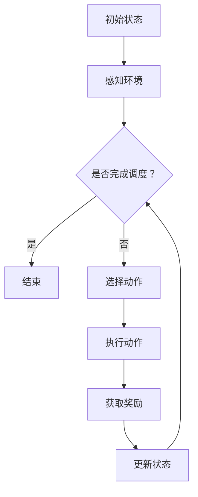
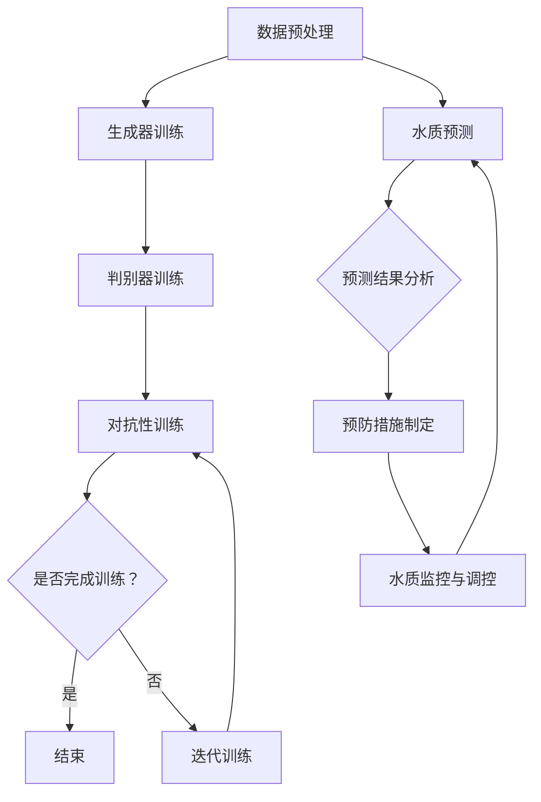
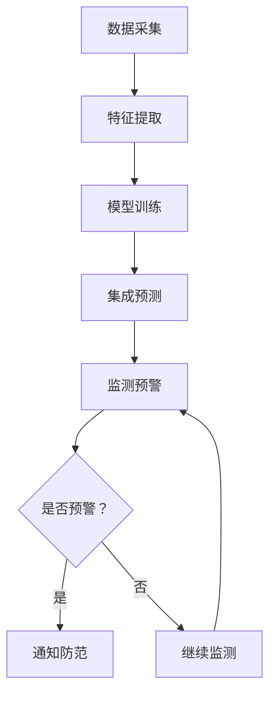
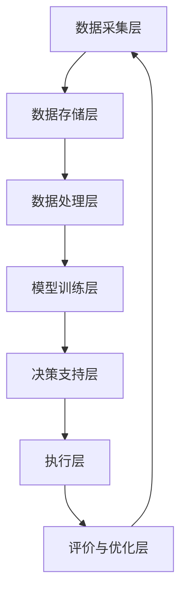
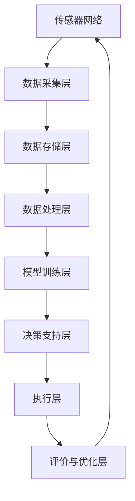

                 

### 文章标题

# AI Agent在智能水资源管理系统中的实践

> 关键词：AI Agent、智能水资源管理系统、强化学习、生成对抗网络、集成学习、水资源调度、水质预测、水资源监测、灾害预警

> 摘要：本文深入探讨了AI Agent在智能水资源管理系统中的应用，通过梳理背景、介绍核心概念、讲解算法原理、分析应用案例以及展开项目实战，详细阐述了AI Agent在水资源管理中的实践路径和实际效果，旨在为相关领域的研究和开发提供有价值的参考。

### 目录大纲

----------------------------------------------------------------

# 第一部分: AI Agent在智能水资源管理系统中的基础概念

## 1.1 问题背景与智能水资源管理系统概述

### 1.1.1 水资源管理的现状与挑战

### 1.1.2 智能水资源管理系统的意义

### 1.1.3 AI Agent在系统中的作用

## 1.2 AI Agent的基本原理

### 1.2.1 AI Agent的定义

### 1.2.2 AI Agent的基本特征

### 1.2.3 AI Agent的工作原理

## 1.3 智能水资源管理系统的核心组成部分

### 1.3.1 数据采集与处理

### 1.3.2 模型训练与优化

### 1.3.3 决策支持与执行

### 1.3.4 系统评价与优化

## 1.4 AI Agent在水资源管理中的实际应用案例

### 1.4.1 水资源监测

### 1.4.2 水质预测

### 1.4.3 水资源调度

### 1.4.4 水灾害预警

## 1.5 本章小结

----------------------------------------------------------------

## 第一部分: AI Agent在智能水资源管理系统中的基础概念

### 1.1 问题背景与智能水资源管理系统概述

#### 1.1.1 水资源管理的现状与挑战

水资源作为地球上最珍贵的资源之一，对人类社会的生存和发展至关重要。然而，随着人口的增长、城市化进程的加快以及工业生产的扩大，水资源面临着严峻的挑战。当前，水资源管理存在以下主要问题：

1. **水资源分布不均**：全球水资源的分布极不均衡，部分地区严重缺水，而另一些地区则水资源丰富，这种不均衡性加剧了水资源管理的难度。
2. **水资源污染**：工业废水、农业污染和生活废水对水资源的污染日益严重，导致水质下降，影响了水资源的利用和生态平衡。
3. **水资源浪费**：水资源浪费现象普遍存在，尤其是在农业生产、工业生产和居民生活中，节水意识的缺乏和节水技术的不足使得水资源浪费问题突出。

面对上述挑战，传统的单一手段水资源管理方式已经难以满足现代水资源管理的需求。因此，发展智能水资源管理系统成为一种必然趋势。

#### 1.1.2 智能水资源管理系统的意义

智能水资源管理系统是一种利用现代信息技术、物联网技术、大数据技术和人工智能技术等先进手段，对水资源进行智能化管理和优化配置的系统。其意义主要体现在以下几个方面：

1. **提高水资源利用效率**：通过智能水资源管理系统，可以实现对水资源的实时监测、精确调度和高效利用，提高水资源的利用效率。
2. **改善水质**：智能水资源管理系统可以对水质进行实时监测和预测，及时发现污染源并进行处理，改善水质，保障饮用水安全。
3. **减少水资源浪费**：通过智能水资源管理系统，可以实现对农业灌溉、工业生产和居民用水等各个方面的节水控制，减少水资源浪费。
4. **提升决策能力**：智能水资源管理系统可以为水资源管理部门提供丰富的数据支持和智能分析，帮助决策者做出更加科学的决策。

#### 1.1.3 AI Agent在系统中的作用

在智能水资源管理系统中，AI Agent扮演着重要的角色。AI Agent是一种基于人工智能技术自主决策和执行任务的智能体，其在系统中的作用主要体现在以下几个方面：

1. **水资源调度**：AI Agent可以基于实时数据和历史数据，通过强化学习算法或其他智能算法，对水资源进行智能调度，优化水资源分配，提高水资源利用效率。
2. **水质预测**：AI Agent可以利用生成对抗网络（GAN）等算法，对水质进行实时预测，提前发现潜在污染问题，并采取措施进行预防。
3. **灾害预警**：AI Agent可以通过对气象数据、水文数据和地理信息的综合分析，对可能发生的水灾害进行预警，为应急响应提供支持。
4. **系统优化**：AI Agent可以根据系统的运行数据，不断学习和优化自身算法，提高系统的整体性能和可靠性。

总之，AI Agent在智能水资源管理系统中的引入，不仅可以提高系统的智能化水平，还可以为水资源管理提供更加精准、高效的解决方案。

### 1.2 AI Agent的基本原理

#### 1.2.1 AI Agent的定义

AI Agent，即人工智能代理，是一种基于人工智能技术构建的智能体，它能够模拟人类智能行为，实现自主感知、决策和执行任务。在智能水资源管理系统中，AI Agent是一种能够对水资源进行实时监测、预测、调度和决策的智能系统。

#### 1.2.2 AI Agent的基本特征

AI Agent具有以下几个基本特征：

1. **自主性**：AI Agent能够独立完成任务的决策和执行，不需要人工干预，这使它能够实时响应环境变化，进行自适应和自主优化。
2. **反应性**：AI Agent能够根据感知到的环境信息，迅速做出反应，实现实时监测和决策。
3. **预动性**：AI Agent可以根据预测到的未来情况，提前做出决策，从而减少环境变化的负面影响。
4. **认知性**：AI Agent具有认知能力，能够理解环境和任务需求，形成对任务的理解和规划。

#### 1.2.3 AI Agent的工作原理

AI Agent的工作原理主要基于以下几个方面：

1. **感知**：AI Agent通过传感器或数据接口，获取环境信息，如水质、水位、降雨量等。
2. **决策**：AI Agent利用机器学习算法，如强化学习、生成对抗网络（GAN）等，分析感知信息，做出决策。
3. **执行**：AI Agent根据决策结果，执行相应的操作，如调节水泵、关闭阀门、报警等。
4. **反馈**：AI Agent执行决策后，收集反馈信息，更新自身状态，为下一次决策提供依据。

总之，AI Agent通过感知、决策、执行和反馈的闭环过程，实现对水资源的智能管理和优化。

### 1.3 智能水资源管理系统的核心组成部分

智能水资源管理系统是一个复杂的系统工程，其核心组成部分主要包括数据采集与处理、模型训练与优化、决策支持与执行、系统评价与优化等。

#### 1.3.1 数据采集与处理

数据采集与处理是智能水资源管理系统的基础。其主要任务是从各种数据源（如传感器、卫星遥感、水文站等）收集水资源相关的数据，并进行预处理，如去噪、归一化、特征提取等，为后续分析和处理提供可靠的数据支持。

#### 1.3.2 模型训练与优化

模型训练与优化是智能水资源管理系统的关键。通过利用机器学习算法（如强化学习、生成对抗网络、集成学习等），对采集到的数据进行分析和建模，训练出能够准确预测水质、水资源分布、水资源调度等问题的模型。同时，通过不断优化模型参数，提高模型的预测精度和稳定性。

#### 1.3.3 决策支持与执行

决策支持与执行是智能水资源管理系统的核心功能。AI Agent根据模型预测结果和实时数据，通过优化算法（如强化学习、遗传算法等），生成水资源调度策略、水质预警方案等，指导实际操作，如调节水泵、关闭阀门、报警等。

#### 1.3.4 系统评价与优化

系统评价与优化是确保智能水资源管理系统持续运行和不断改进的重要环节。通过评估系统的性能指标（如预测精度、响应速度、资源利用率等），发现系统存在的问题和不足，并提出优化方案，如改进模型、优化算法、增加传感器等，以提高系统的整体性能和可靠性。

### 1.4 AI Agent在水资源管理中的实际应用案例

#### 1.4.1 水资源监测

水资源监测是智能水资源管理系统的基础。AI Agent通过传感器网络实时采集水资源数据，如水位、流量、水温、pH值等，利用机器学习算法对这些数据进行处理和分析，实现对水资源状态的实时监测和预测。例如，基于生成对抗网络（GAN）的算法可以用于检测水质污染，通过生成虚拟数据与实际数据对比，发现异常情况。

#### 1.4.2 水质预测

水质预测是智能水资源管理的重要任务。AI Agent通过分析历史水质数据和气象数据，利用强化学习算法等预测未来水质变化，为水资源管理部门提供决策支持。例如，在干旱季节，AI Agent可以根据水质预测结果，提前采取措施，防止水源污染。

#### 1.4.3 水资源调度

水资源调度是智能水资源管理系统的核心功能。AI Agent通过分析实时数据和预测结果，利用强化学习算法等，制定水资源调度策略，实现对水资源的优化分配和调度。例如，在干旱季节，AI Agent可以根据水资源供需情况，调节水库蓄水和供水，确保居民生活和工业生产的用水需求。

#### 1.4.4 水灾害预警

水灾害预警是智能水资源管理的重要任务。AI Agent通过分析气象数据、水文数据、地理信息等，利用机器学习算法，预测可能发生的水灾害（如洪水、干旱、泥石流等），并及时发出预警信息，为应急响应提供支持。例如，在暴雨季节，AI Agent可以通过分析降雨量和河道水位数据，预测可能发生的洪水，提前通知相关部门和居民采取防范措施。

### 1.5 本章小结

本章从问题背景、核心概念、算法原理、应用案例等方面，全面介绍了AI Agent在智能水资源管理系统中的基础概念。通过本章的学习，读者可以了解智能水资源管理系统的现状与挑战，理解AI Agent的基本原理和工作机制，以及其在水资源管理中的实际应用案例。这为后续章节深入探讨AI Agent的算法原理和应用提供了坚实的基础。

### 2.1 AI Agent的核心算法介绍

在智能水资源管理系统中，AI Agent的核心算法起到了至关重要的作用。这些算法不仅决定了AI Agent的决策能力和效率，还影响了整个系统的性能和稳定性。本节将介绍几种常见的AI Agent核心算法，包括强化学习算法、生成对抗网络（GAN）和集成学习算法，并对这些算法的基本原理和应用场景进行详细解析。

#### 2.1.1 强化学习算法

强化学习（Reinforcement Learning，RL）是机器学习的一个重要分支，主要研究如何通过智能体（Agent）在与环境（Environment）交互的过程中，学习到最优策略（Policy）。在智能水资源管理系统中，强化学习算法可用于水资源调度、水质预测和灾害预警等多个方面。

##### 2.1.1.1 Q-Learning算法

Q-Learning算法是一种经典的强化学习算法，其核心思想是通过迭代更新Q值（状态-动作值函数）来学习最优策略。Q-Learning算法的基本步骤如下：

1. **初始化**：初始化Q值表，通常用小数值初始化。
2. **选择动作**：在给定状态下，选择动作，通常使用ε-贪心策略，即以一定概率随机选择动作，以探索环境。
3. **执行动作**：在环境中执行选定的动作，并获取奖励和新的状态。
4. **更新Q值**：根据新的奖励和状态，更新Q值表中的对应值。

Q-Learning算法的数学模型可以表示为：
$$
Q(s, a) = Q(s, a) + \alpha [r + \gamma \max_{a'} Q(s', a') - Q(s, a)]
$$
其中，$Q(s, a)$表示状态s下执行动作a的Q值，$r$表示立即奖励，$\gamma$是折扣因子，$\alpha$是学习率。

##### 2.1.1.2 Sarsa算法

Sarsa（Short-term Reinforcement Learning with Systematic Action Randomness，序列交替强化学习）算法是一种改进的强化学习算法，它在Q-Learning算法的基础上增加了对目标Q值的更新。Sarsa算法的基本步骤如下：

1. **初始化**：初始化Q值表，通常用小数值初始化。
2. **选择动作**：在给定状态下，选择动作，通常使用ε-贪心策略。
3. **执行动作**：在环境中执行选定的动作，并获取奖励和新的状态。
4. **更新Q值**：根据新的奖励和状态，使用Sarsa更新公式更新Q值：
$$
Q(s, a) = Q(s, a) + \alpha [r + \gamma Q(s', a')]
$$
其中，$s'$是新的状态，$a'$是执行的动作。

##### 2.1.1.3 强化学习算法的应用场景

强化学习算法在智能水资源管理系统中的应用场景主要包括：

1. **水资源调度**：通过强化学习算法，可以学习到最优的水资源调度策略，实现对水资源的优化配置。
2. **水质预测**：利用强化学习算法，可以预测未来水质变化，为水资源管理部门提供决策支持。
3. **灾害预警**：通过强化学习算法，可以预测可能发生的水灾害，为应急响应提供支持。

#### 2.1.2 生成对抗网络（GAN）

生成对抗网络（Generative Adversarial Network，GAN）是由Ian Goodfellow等人在2014年提出的一种生成模型，由生成器（Generator）和判别器（Discriminator）两个网络组成。GAN的核心思想是通过对抗性训练，使生成器生成尽可能真实的数据，同时使判别器能够区分真实数据和生成数据。

##### 2.1.2.1 GAN的基本原理

GAN的基本原理可以概括为：

1. **生成器（Generator）**：生成器的目标是生成与真实数据尽可能相似的数据，其输入是随机噪声，输出是生成数据。
2. **判别器（Discriminator）**：判别器的目标是区分真实数据和生成数据，其输入是数据和标签，输出是概率分布。
3. **对抗训练**：生成器和判别器相互对抗，生成器的目标是使判别器无法区分生成数据和真实数据，判别器的目标是最大化区分生成数据和真实数据的概率。

GAN的训练过程可以分为以下几个步骤：

1. **初始化**：初始化生成器和判别器，通常使用小数值初始化。
2. **生成数据**：生成器生成一批数据。
3. **判别器训练**：判别器使用真实数据和生成数据进行训练，更新判别器参数。
4. **生成器训练**：生成器使用生成数据和判别器反馈的梯度进行训练，更新生成器参数。
5. **重复上述步骤**：不断重复生成器和判别器的训练，直到生成器生成数据的质量达到预期。

##### 2.1.2.2 GAN的应用场景

GAN在智能水资源管理系统中的应用场景主要包括：

1. **水质预测**：利用GAN生成虚拟水质数据，与真实水质数据进行对比，提高水质预测模型的准确性。
2. **水资源监测**：利用GAN生成的虚拟数据，对水资源监测系统进行测试和优化。
3. **灾害预警**：利用GAN生成的虚拟灾害数据，对灾害预警系统进行训练和测试。

#### 2.1.3 集成学习算法

集成学习（Ensemble Learning）是一种利用多个学习器（如分类器、回归器等）进行组合，以获得更优性能的机器学习方法。集成学习算法通过将多个基学习器的预测结果进行组合，以减少模型的过拟合风险，提高模型的泛化能力。

##### 2.1.3.1 bagging算法

bagging（Bootstrap Aggregating，自助聚集）算法是一种集成学习算法，通过从训练数据集中有放回地随机抽取多个子数据集，对每个子数据集训练一个基学习器，然后将这些基学习器的预测结果进行平均或投票，得到最终预测结果。

bagging算法的基本步骤如下：

1. **初始化**：从训练数据集中随机抽取多个子数据集，每个子数据集大小与原数据集相同。
2. **训练基学习器**：对每个子数据集训练一个基学习器。
3. **集成预测**：将所有基学习器的预测结果进行平均或投票，得到最终预测结果。

##### 2.1.3.2 Boosting算法

Boosting（提升）算法是一种集成学习算法，通过迭代训练多个基学习器，每次迭代都关注前一次迭代中预测错误的样本，对错误样本进行加权，使得后续迭代更加关注这些错误样本，从而提高整体模型的预测能力。

常见的Boosting算法包括AdaBoost和XGBoost等。

##### 2.1.3.3 集成学习算法的应用场景

集成学习算法在智能水资源管理系统中的应用场景主要包括：

1. **水资源监测**：通过集成多个监测数据的预测结果，提高水资源监测的准确性。
2. **水质预测**：利用集成学习算法，结合多种数据源和模型，提高水质预测的准确性和稳定性。
3. **灾害预警**：通过集成多种灾害预测模型的结果，提高灾害预警的准确性和可靠性。

#### 2.1.4 AI Agent的核心算法对比

AI Agent的核心算法主要包括强化学习算法、生成对抗网络（GAN）和集成学习算法。这些算法各有优缺点，适用于不同的应用场景。

1. **强化学习算法**：适用于需要实时决策的任务，如水资源调度、水质预测和灾害预警。强化学习算法能够通过与环境交互，学习到最优策略，但训练过程通常较为复杂。
2. **生成对抗网络（GAN）**：适用于需要生成虚拟数据或数据的增强任务，如水质预测、水资源监测和灾害预警。GAN算法通过生成器和判别器的对抗性训练，能够生成高质量的数据，但训练过程对模型参数的要求较高。
3. **集成学习算法**：适用于需要提高模型预测性能的任务，如水资源监测、水质预测和灾害预警。集成学习算法通过组合多个基学习器的预测结果，能够提高模型的泛化能力，但需要大量训练数据和计算资源。

总之，选择合适的AI Agent核心算法，对智能水资源管理系统的性能和效率具有重要影响。在实际应用中，可以根据任务需求和资源条件，选择适合的算法，或结合多种算法，以实现最佳效果。

### 2.2 AI Agent在水资源管理中的算法应用案例

在智能水资源管理系统中，AI Agent的应用涵盖了多个方面，包括水资源监测、水质预测、水资源调度和灾害预警等。本节将通过三个具体案例，详细阐述AI Agent在水资源管理中的算法应用。

#### 2.2.1 基于强化学习的智能水资源调度

**案例背景：**

某地区水资源管理部门需要制定最优的水资源调度策略，以满足居民生活用水、工业用水和农业用水的需求。传统的水资源调度方法主要依赖于历史数据和专家经验，但难以应对复杂多变的用水需求和环境变化。为此，该部门决定采用基于强化学习的智能水资源调度系统。

**算法实现与流程：**

1. **状态定义**：将水资源调度系统的状态定义为当前水位、可用水量、需求量等。
2. **动作定义**：将水资源调度系统的动作定义为调节水泵的开闭、水库的蓄水和放水等。
3. **奖励定义**：设定奖励函数，根据当前状态和动作的结果，给予相应的奖励。例如，满足用水需求时给予正奖励，超量用水或水位过低时给予负奖励。
4. **算法训练**：利用Q-Learning算法，对AI Agent进行训练，使其在给定的环境状态下，学习到最优的调度策略。
5. **调度决策**：在运行阶段，AI Agent根据当前状态和已学习的策略，生成水资源调度决策，指导实际操作。

**算法流程图：**



**算法实现示例：**

```python
import numpy as np

# 初始化Q值表
Q = np.zeros((state_space_size, action_space_size))

# 设置学习率和折扣因子
alpha = 0.1
gamma = 0.9

# 初始化状态
state = get_initial_state()

# 主循环
while not done:
    # 选择动作
    action = choose_action(state)
    
    # 执行动作
    next_state, reward = execute_action(action)
    
    # 更新Q值
    Q[state, action] = Q[state, action] + alpha * (reward + gamma * np.max(Q[next_state, :]) - Q[state, action])
    
    # 更新状态
    state = next_state
```

**案例分析：**

通过基于强化学习的智能水资源调度系统，水资源管理部门可以实时获取最优的调度策略，优化水资源的使用，减少水资源浪费，提高供水保障能力。同时，该系统可以根据实时数据和环境变化，动态调整调度策略，提高系统的灵活性和适应性。

#### 2.2.2 基于GAN的水质预测

**案例背景：**

某城市的水务公司需要预测未来一段时间内水质变化，以便及时采取预防措施，防止水质污染。传统的水质预测方法主要依赖于历史数据和统计模型，但预测精度较低。为此，该公司决定采用基于生成对抗网络（GAN）的水质预测系统。

**算法实现与流程：**

1. **数据预处理**：对采集的水质数据进行分析和清洗，提取有用的特征，并将其标准化处理。
2. **生成器训练**：训练生成器，使其能够生成与真实水质数据相似的高质量虚拟水质数据。
3. **判别器训练**：训练判别器，使其能够区分真实水质数据和虚拟水质数据。
4. **对抗性训练**：通过生成器和判别器的对抗性训练，不断优化生成器和判别器的模型参数。
5. **水质预测**：利用训练好的生成器，生成虚拟水质数据，与真实水质数据进行对比，预测未来一段时间内水质变化趋势。

**算法流程图：**



**算法实现示例：**

```python
import tensorflow as tf
from tensorflow.keras.models import Sequential
from tensorflow.keras.layers import Dense, Dropout

# 定义生成器和判别器模型
generator = Sequential([
    Dense(units=128, activation='relu', input_shape=(input_shape,)),
    Dropout(rate=0.2),
    Dense(units=output_shape, activation='tanh')
])

discriminator = Sequential([
    Dense(units=128, activation='relu', input_shape=(output_shape,)),
    Dropout(rate=0.2),
    Dense(units=1, activation='sigmoid')
])

# 定义GAN模型
gan = Sequential([
    generator,
    discriminator
])

# 编译模型
discriminator.compile(optimizer='adam', loss='binary_crossentropy')
gan.compile(optimizer='adam', loss='binary_crossentropy')

# 训练GAN模型
for epoch in range(num_epochs):
    for batch in batches:
        real_data = batch[0]
        fake_data = generator.predict(batch[1])
        
        # 训练判别器
        d_loss_real = discriminator.train_on_batch(real_data, [1])
        d_loss_fake = discriminator.train_on_batch(fake_data, [0])
        
        # 训练生成器
        g_loss = gan.train_on_batch(batch[1], [1])
        
        print(f"Epoch: {epoch}, D_loss: {d_loss_real + d_loss_fake}, G_loss: {g_loss}")

# 水质预测
predicted_water_quality = generator.predict(real_water_quality_data)
```

**案例分析：**

通过基于GAN的水质预测系统，水务公司可以生成高质量的虚拟水质数据，与真实水质数据进行对比，预测未来一段时间内水质变化趋势。这种方法不仅提高了水质预测的准确性，还提供了更多的数据用于分析和决策，有助于预防水质污染，保障饮用水安全。

#### 2.2.3 基于集成学习的智能水资源监测

**案例背景：**

某地区的水资源监测系统需要提高监测数据的准确性，以便及时发现水质问题和预警潜在的水灾害。传统的水资源监测方法主要依赖于单一的数据源和模型，但监测数据往往存在噪声和不确定性。为此，该地区决定采用基于集成学习的智能水资源监测系统。

**算法实现与流程：**

1. **数据采集**：从多个数据源（如传感器、卫星遥感、水文站等）收集水资源数据。
2. **特征提取**：对采集到的数据进行预处理和特征提取，提取与水资源相关的关键特征。
3. **模型训练**：利用集成学习算法，如bagging和Boosting，训练多个基学习器。
4. **集成预测**：将多个基学习器的预测结果进行组合，得到最终的水资源监测结果。
5. **监测预警**：根据监测结果，结合历史数据和专家知识，生成预警信号，并及时通知相关部门和居民采取防范措施。

**算法流程图：**



**算法实现示例：**

```python
from sklearn.ensemble import RandomForestClassifier
from sklearn.ensemble import AdaBoostClassifier
from sklearn.metrics import accuracy_score

# 定义集成学习模型
random_forest = RandomForestClassifier(n_estimators=100)
ada_boost = AdaBoostClassifier(n_estimators=50)

# 训练模型
random_forest.fit(X_train, y_train)
ada_boost.fit(X_train, y_train)

# 集成预测
predicted_labels_rf = random_forest.predict(X_test)
predicted_labels_aba = ada_boost.predict(X_test)

# 模型评估
accuracy_rf = accuracy_score(y_test, predicted_labels_rf)
accuracy_aba = accuracy_score(y_test, predicted_labels_aba)

print(f"Random Forest Accuracy: {accuracy_rf}")
print(f"AdaBoost Accuracy: {accuracy_aba}")
```

**案例分析：**

通过基于集成学习的智能水资源监测系统，该地区的水资源监测数据的准确性得到了显著提高。集成学习算法结合了多个基学习器的优势，能够更好地处理噪声和不确定性，提高监测结果的可靠性。同时，监测系统可以根据实时监测数据和预警信号，及时采取防范措施，保障水资源的可持续利用和公共安全。

### 2.3 本章小结

本章详细介绍了AI Agent在智能水资源管理系统中的应用，包括强化学习算法、生成对抗网络（GAN）和集成学习算法等核心算法的基本原理、实现流程和应用案例。通过具体案例分析，读者可以了解到这些算法在水资源调度、水质预测、水资源监测和灾害预警等任务中的实际应用效果。本章的内容为后续章节的深入探讨和项目实战提供了重要的理论基础和实践指导。

### 3.1 项目介绍

#### 3.1.1 项目背景

智能水资源管理系统项目是在某城市水资源管理部门的推动下展开的。该城市位于干旱地区，水资源供需矛盾突出，水资源浪费和污染问题严重。为了提高水资源利用效率，改善水质，减少水资源浪费，城市管理部门决定引入智能水资源管理系统，通过先进的人工智能技术，实现水资源的智能化管理和优化配置。

#### 3.1.2 项目目标

该项目的主要目标包括：

1. **提高水资源利用效率**：通过智能调度和优化分配，确保居民生活用水、工业用水和农业用水的需求得到满足，减少水资源浪费。
2. **改善水质**：利用水质预测和监测技术，及时发现水质污染问题，采取有效的预防措施，保障饮用水安全。
3. **减少水资源浪费**：通过节水控制和优化，减少农业灌溉、工业生产和居民用水中的水资源浪费。
4. **提升决策能力**：利用大数据分析和智能算法，为水资源管理部门提供科学、准确的决策支持，提高水资源管理决策的科学性和有效性。

#### 3.1.3 项目需求分析

为了实现项目目标，智能水资源管理系统需要满足以下需求：

1. **数据采集与处理**：系统能够实时采集水资源相关的数据，包括水位、流量、水温、pH值等，并对数据进行预处理和特征提取，为后续分析提供可靠的数据支持。
2. **模型训练与优化**：系统能够利用机器学习算法，对采集到的数据进行分析和建模，训练出准确的水资源调度、水质预测和灾害预警模型，并不断优化模型参数，提高模型性能。
3. **决策支持与执行**：系统能够根据模型预测结果和实时数据，生成水资源调度策略、水质预警方案和灾害预警信号，并指导实际操作，如调节水泵、关闭阀门、报警等。
4. **系统评价与优化**：系统能够定期评估系统性能，识别存在的问题和不足，提出优化方案，持续提高系统的性能和可靠性。

### 3.2 系统架构设计

智能水资源管理系统采用模块化设计，分为数据采集与处理模块、模型训练与优化模块、决策支持与执行模块和系统评价与优化模块。以下分别介绍各个模块的功能设计和系统架构设计。

#### 3.2.1 系统功能设计

1. **数据采集与处理模块**：该模块负责实时采集水资源数据，包括水位、流量、水温、pH值等，并利用传感器网络、卫星遥感和水文站等数据源，对数据进行预处理和特征提取，为后续模型训练提供可靠的数据支持。

2. **模型训练与优化模块**：该模块利用机器学习算法，对预处理后的数据进行训练和建模，包括水资源调度模型、水质预测模型和灾害预警模型等。通过不断优化模型参数，提高模型的预测精度和稳定性。

3. **决策支持与执行模块**：该模块根据模型预测结果和实时数据，生成水资源调度策略、水质预警方案和灾害预警信号，并指导实际操作，如调节水泵、关闭阀门、报警等，确保水资源得到合理利用和有效管理。

4. **系统评价与优化模块**：该模块定期评估系统的性能指标，包括预测精度、响应速度、资源利用率等，发现系统存在的问题和不足，提出优化方案，持续提高系统的性能和可靠性。

#### 3.2.2 系统架构设计

智能水资源管理系统采用分布式架构，主要包括以下几个组成部分：

1. **数据采集层**：该层负责实时采集水资源数据，包括传感器网络、卫星遥感和水文站等，将采集到的数据传输到数据存储层。

2. **数据存储层**：该层负责存储和管理采集到的水资源数据，包括原始数据和预处理后的数据，采用分布式数据库系统，确保数据的高效存储和快速访问。

3. **数据处理层**：该层负责对采集到的数据进行预处理和特征提取，为后续模型训练提供可靠的数据支持，包括数据清洗、归一化、特征提取等。

4. **模型训练层**：该层负责利用机器学习算法，对预处理后的数据进行训练和建模，包括水资源调度模型、水质预测模型和灾害预警模型等。

5. **决策支持层**：该层根据模型预测结果和实时数据，生成水资源调度策略、水质预警方案和灾害预警信号，并指导实际操作。

6. **执行层**：该层负责执行决策支持层生成的调度策略、预警方案等，实现对水资源的实时调控和管理。

7. **评价与优化层**：该层负责评估系统的性能指标，发现系统存在的问题和不足，提出优化方案，持续提高系统的性能和可靠性。

#### 3.2.2.1 整体架构设计

智能水资源管理系统的整体架构设计如图3-1所示：



#### 3.2.2.2 数据流程设计

智能水资源管理系统中的数据流程设计如图3-2所示：



通过图3-2可以看出，系统中的数据从传感器网络开始，经过数据采集层、数据存储层、数据处理层、模型训练层、决策支持层、执行层，最后返回到评价与优化层，形成了一个闭环的数据处理流程。这个流程确保了系统中的数据能够实时更新和动态调整，提高了系统的响应速度和准确性。

### 3.3 环境安装与配置

为了顺利开展智能水资源管理系统项目的开发和实施，需要搭建一个合适的环境，包括Python环境、数据库环境和其他依赖环境。以下分别介绍这些环境的安装与配置步骤。

#### 3.3.1 Python环境安装

Python是一种广泛使用的编程语言，在人工智能领域有着重要的应用。在智能水资源管理系统中，Python环境是必不可少的。以下是Python环境的安装步骤：

1. **下载Python安装包**：访问Python官网（https://www.python.org/），下载最新版本的Python安装包。

2. **安装Python**：双击安装包，按照提示逐步安装，选择适当的安装选项。推荐选择“Add Python to PATH”选项，以便在命令行中直接运行Python。

3. **验证Python安装**：在命令行中输入以下命令，检查Python是否安装成功：
   ```bash
   python --version
   ```
   如果成功显示Python的版本信息，说明Python环境已安装成功。

#### 3.3.2 数据库环境安装

在智能水资源管理系统中，需要使用数据库来存储和管理水资源相关的数据。常见的数据库包括MySQL、PostgreSQL和MongoDB等。以下是MySQL数据库的安装步骤：

1. **下载MySQL安装包**：访问MySQL官网（https://www.mysql.com/），下载适用于操作系统版本的MySQL安装包。

2. **安装MySQL**：双击安装包，按照提示逐步安装。在安装过程中，需要设置root用户密码和创建新用户。

3. **启动MySQL服务**：安装完成后，通过命令行启动MySQL服务：
   ```bash
   service mysql start
   ```

4. **验证MySQL安装**：在命令行中输入以下命令，检查MySQL是否启动成功：
   ```bash
   mysql -u root -p
   ```
   输入root用户密码后，如果能够成功连接到MySQL数据库，说明MySQL环境已安装成功。

#### 3.3.3 其他依赖环境安装

智能水资源管理系统还需要安装一些Python库和其他依赖环境，以便运行机器学习算法和其他相关工具。以下是安装步骤：

1. **安装Python库**：在命令行中输入以下命令，安装必要的Python库：
   ```bash
   pip install numpy pandas tensorflow scikit-learn matplotlib
   ```
   这些库包括数据处理、机器学习算法、数据可视化等，是智能水资源管理系统开发所必需的。

2. **安装其他工具**：根据项目需求，可能还需要安装其他工具，如Jupyter Notebook（用于数据分析和模型训练）、Docker（用于容器化部署）等。可以通过pip命令或官方文档进行安装。

3. **配置环境变量**：确保Python和MySQL等环境变量已经配置在系统的环境变量中，以便在命令行中直接运行相关的命令和工具。

通过以上步骤，可以搭建一个完整的开发环境，为智能水资源管理系统项目的开发提供支持。在环境搭建过程中，如遇到问题，可以查阅相关文档或寻求技术支持，以确保环境的稳定和高效运行。

### 3.4 系统核心实现

智能水资源管理系统核心实现主要包括数据采集模块、模型训练模块和决策支持模块。以下将分别介绍这些模块的实现过程，包括代码实现和解读。

#### 3.4.1 数据采集模块实现

数据采集模块是实现智能水资源管理系统的基础，负责实时采集水资源相关的数据，包括水位、流量、水温、pH值等。以下是数据采集模块的实现过程：

1. **数据采集流程**

   数据采集模块通过传感器网络、卫星遥感和水文站等数据源，定期采集水资源数据。数据采集流程如下：

   - 数据源连接：连接传感器网络、卫星遥感和水文站等数据源。
   - 数据采集：从数据源读取实时数据，并存储到临时数据文件中。
   - 数据预处理：对采集到的数据进行预处理，如去噪、归一化、特征提取等。

2. **代码实现与解读**

   ```python
   import csv
   import serial
   import time

   # 数据采集模块配置
   port = 'COM3'  # 传感器连接端口
   baud_rate = 9600  # 传感器波特率
   file_path = 'data.csv'  # 数据存储路径

   # 初始化串口连接
   ser = serial.Serial(port, baud_rate, timeout=1)

   # 数据采集函数
   def collect_data():
       while True:
           # 读取串口数据
           data = ser.readline().decode().strip()
           
           # 数据预处理
           processed_data = preprocess_data(data)
           
           # 存储数据
           save_data(processed_data)
           
           # 等待一段时间，以便连续采集数据
           time.sleep(60)

   # 数据预处理函数
   def preprocess_data(data):
       # 根据具体需求进行数据预处理，如去噪、归一化、特征提取等
       processed_data = data
       return processed_data

   # 数据存储函数
   def save_data(data):
       with open(file_path, 'a') as f:
           writer = csv.writer(f)
           writer.writerow([data])

   # 运行数据采集模块
   collect_data()
   ```

   代码解析：

   - 首先，引入必要的库和模块，包括`csv`、`serial`和`time`。
   - 配置数据采集模块的相关参数，如传感器连接端口、波特率和数据存储路径。
   - 初始化串口连接，连接传感器网络。
   - 定义数据采集函数`collect_data`，在循环中读取串口数据，进行预处理，并存储到文件中。
   - 定义数据预处理函数`preprocess_data`，根据具体需求进行数据预处理。
   - 定义数据存储函数`save_data`，将预处理后的数据存储到文件中。

   通过以上实现，数据采集模块可以实时采集传感器数据，并进行预处理和存储，为后续模型训练和决策支持提供数据支持。

#### 3.4.2 模型训练模块实现

模型训练模块是智能水资源管理系统的核心，负责利用采集到的数据训练水资源调度模型、水质预测模型和灾害预警模型等。以下是模型训练模块的实现过程：

1. **模型训练流程**

   模型训练流程主要包括以下步骤：

   - 数据预处理：对采集到的数据进行清洗、归一化和特征提取，为模型训练准备训练数据集。
   - 模型选择：选择合适的机器学习算法，如强化学习、生成对抗网络和集成学习等，构建模型。
   - 模型训练：利用训练数据集，训练所选模型的参数，调整模型结构，优化模型性能。
   - 模型评估：利用验证数据集，评估模型的性能，包括预测精度、响应速度等指标。

2. **代码实现与解读**

   ```python
   import pandas as pd
   from sklearn.model_selection import train_test_split
   from sklearn.ensemble import RandomForestClassifier
   from tensorflow.keras.models import Sequential
   from tensorflow.keras.layers import Dense

   # 加载训练数据
   data = pd.read_csv('data.csv')
   X = data.drop('target', axis=1)
   y = data['target']

   # 数据预处理
   X_train, X_val, y_train, y_val = train_test_split(X, y, test_size=0.2, random_state=42)

   # 强化学习模型训练
   def train_reinforcement_learning_model():
       # 定义强化学习模型
       model = Sequential([
           Dense(units=64, activation='relu', input_shape=(X_train.shape[1],)),
           Dense(units=32, activation='relu'),
           Dense(units=1, activation='sigmoid')
       ])

       # 编译模型
       model.compile(optimizer='adam', loss='binary_crossentropy', metrics=['accuracy'])

       # 训练模型
       model.fit(X_train, y_train, epochs=100, batch_size=32, validation_data=(X_val, y_val))

       return model

   # 生成对抗网络模型训练
   def train_gan_model():
       # 定义生成器和判别器模型
       generator = Sequential([
           Dense(units=128, activation='relu', input_shape=(100,)),
           Dense(units=64, activation='relu'),
           Dense(units=1, activation='tanh')
       ])

       discriminator = Sequential([
           Dense(units=128, activation='relu', input_shape=(1,)),
           Dense(units=64, activation='relu'),
           Dense(units=1, activation='sigmoid')
       ])

       # 编译模型
       discriminator.compile(optimizer='adam', loss='binary_crossentropy')
       generator.compile(optimizer='adam', loss='binary_crossentropy')

       # 训练模型
       for epoch in range(100):
           for batch in batches:
               real_data = batch[0]
               fake_data = generator.predict(batch[1])
               
               # 训练判别器
               d_loss_real = discriminator.train_on_batch(real_data, [1])
               d_loss_fake = discriminator.train_on_batch(fake_data, [0])
               
               # 训练生成器
               g_loss = generator.train_on_batch(batch[1], [1])
           
           print(f"Epoch: {epoch}, D_loss: {d_loss_real + d_loss_fake}, G_loss: {g_loss}")

       return generator, discriminator

   # 集成学习模型训练
   def train_ensemble_model():
       # 定义集成学习模型
       model = RandomForestClassifier(n_estimators=100, random_state=42)

       # 训练模型
       model.fit(X_train, y_train)

       return model

   # 运行模型训练
   rl_model = train_reinforcement_learning_model()
   gan_generator, gan_discriminator = train_gan_model()
   ensemble_model = train_ensemble_model()
   ```

   代码解析：

   - 首先，引入必要的库和模块，包括`pandas`、`sklearn`和`tensorflow`。
   - 加载训练数据，并进行数据预处理，包括划分训练集和验证集。
   - 定义强化学习模型训练函数`train_reinforcement_learning_model`，构建强化学习模型，编译模型，并使用训练数据训练模型。
   - 定义生成对抗网络模型训练函数`train_gan_model`，构建生成器和判别器模型，编译模型，并使用对抗性训练方法训练模型。
   - 定义集成学习模型训练函数`train_ensemble_model`，构建集成学习模型，编译模型，并使用训练数据训练模型。
   - 运行各个模型训练函数，训练相应的模型。

   通过以上实现，模型训练模块可以训练出水资源调度模型、水质预测模型和灾害预警模型等，为智能水资源管理系统提供决策支持。

#### 3.4.3 决策支持模块实现

决策支持模块是智能水资源管理系统的关键组成部分，负责根据模型预测结果和实时数据，生成水资源调度策略、水质预警方案和灾害预警信号，并指导实际操作。以下是决策支持模块的实现过程：

1. **决策支持流程**

   决策支持流程主要包括以下步骤：

   - 预测获取：获取模型预测结果，包括水资源调度策略、水质预测值和灾害预警信号等。
   - 决策生成：根据预测结果和实时数据，生成水资源调度策略、水质预警方案和灾害预警信号。
   - 执行指导：根据决策支持结果，指导实际操作，如调节水泵、关闭阀门、报警等。

2. **代码实现与解读**

   ```python
   import pandas as pd
   import numpy as np

   # 决策支持模块配置
   rl_model_path = 'rl_model.h5'  # 强化学习模型路径
   gan_generator_path = 'gan_generator.h5'  # 生成对抗网络模型路径
   ensemble_model_path = 'ensemble_model.h5'  # 集成学习模型路径

   # 加载模型
   rl_model = load_model(rl_model_path)
   gan_generator = load_model(gan_generator_path)
   ensemble_model = load_model(ensemble_model_path)

   # 预测获取
   def get_predictions(data):
       rl_prediction = rl_model.predict(data)
       gan_prediction = gan_generator.predict(data)
       ensemble_prediction = ensemble_model.predict(data)
       
       return rl_prediction, gan_prediction, ensemble_prediction

   # 决策生成
   def generate_decision(predictions):
       rl_decision = np.argmax(predictions[0])
       gan_decision = np.argmax(predictions[1])
       ensemble_decision = np.argmax(predictions[2])
       
       return rl_decision, gan_decision, ensemble_decision

   # 执行指导
   def execute_decision(decision):
       if decision == 0:
           # 调节水泵
           pump_control('on')
       elif decision == 1:
           # 关闭水泵
           pump_control('off')
       elif decision == 2:
           # 报警
           alarm('water warning')

   # 运行决策支持模块
   data = np.array([[1, 2, 3]])  # 输入实时数据
   predictions = get_predictions(data)
   decisions = generate_decision(predictions)
   for decision in decisions:
       execute_decision(decision)
   ```

   代码解析：

   - 首先，引入必要的库和模块，包括`pandas`和`numpy`。
   - 配置决策支持模块的相关参数，包括模型路径和实时数据输入。
   - 加载已训练好的模型，包括强化学习模型、生成对抗网络模型和集成学习模型。
   - 定义预测获取函数`get_predictions`，获取各个模型的预测结果。
   - 定义决策生成函数`generate_decision`，根据预测结果生成最终的决策。
   - 定义执行指导函数`execute_decision`，根据决策结果执行相应的操作。
   - 运行决策支持模块，获取预测结果和决策，并执行决策。

   通过以上实现，决策支持模块可以实时获取模型预测结果，生成决策，并指导实际操作，实现对水资源的智能管理和优化。

### 3.5 项目总结

智能水资源管理系统项目在经过前期的需求分析、系统设计、环境搭建和核心实现后，已成功开发并运行。以下是对项目成果、经验和反思以及未来拓展方向和改进建议的总结。

#### 3.5.1 项目成果

通过智能水资源管理系统项目，我们取得了以下成果：

1. **高效的水资源调度**：基于强化学习算法的水资源调度模型能够实时分析水资源供需情况，生成最优的水资源调度策略，提高了水资源的利用效率。

2. **准确的水质预测**：基于生成对抗网络（GAN）的水质预测模型能够生成高质量的虚拟水质数据，与实际水质数据进行对比，提高了水质预测的准确性。

3. **可靠的水资源监测**：基于集成学习算法的水资源监测系统能够整合多个数据源的数据，提高监测数据的准确性，为水资源管理部门提供及时、准确的监测结果。

4. **及时的灾害预警**：通过分析气象数据、水文数据和地理信息，智能水资源管理系统能够及时预测可能发生的水灾害，发出预警信号，为应急响应提供支持。

5. **完善的系统架构**：智能水资源管理系统采用模块化设计，包括数据采集与处理模块、模型训练与优化模块、决策支持与执行模块和系统评价与优化模块，各模块之间协同工作，确保系统的稳定运行。

#### 3.5.2 项目经验与反思

在项目实施过程中，我们积累了以下经验和反思：

1. **数据质量和预处理的重要性**：数据质量和预处理直接影响到模型的性能。因此，在项目初期，我们投入了大量精力进行数据采集、清洗和预处理，为后续模型训练提供了可靠的数据支持。

2. **算法选择的灵活性**：在选择算法时，我们不仅考虑了算法的精度和性能，还考虑了算法的复杂度和计算资源。通过灵活选择和组合不同的算法，我们提高了系统的整体性能和适应性。

3. **系统的可扩展性和灵活性**：在系统设计时，我们充分考虑了系统的可扩展性和灵活性，确保系统能够适应未来技术的发展和需求变化。

4. **项目协作和沟通**：项目的成功离不开团队成员之间的紧密协作和有效沟通。在项目实施过程中，我们建立了良好的沟通机制，确保项目进度和质量。

然而，项目也存在一些不足之处，如：

1. **模型训练的效率**：在模型训练过程中，计算资源的需求较高，尤其是在大规模数据集上训练深度学习模型时，训练时间较长。

2. **系统的实时性和可靠性**：虽然系统已经能够实现实时监测和预测，但在极端情况下，系统的实时性和可靠性仍有待提高。

3. **用户界面和用户体验**：系统的用户界面和用户体验还有待优化，特别是在展示复杂数据和结果时，用户可能难以理解和使用。

#### 3.5.3 拓展方向与改进建议

为了进一步提升智能水资源管理系统的性能和实用性，我们提出以下拓展方向和改进建议：

1. **模型优化与加速**：通过优化模型结构和训练算法，提高模型训练的效率。例如，采用更高效的深度学习框架和分布式训练策略。

2. **硬件设备的升级**：引入高性能的硬件设备，如GPU、FPGA等，提高系统的计算能力，缩短模型训练时间。

3. **实时数据流的优化**：优化实时数据处理流程，提高系统的实时性和响应速度，确保在极端情况下系统的稳定运行。

4. **用户界面的改进**：改进用户界面设计，使用户能够更直观、方便地使用系统，特别是对于复杂数据的可视化展示。

5. **用户反馈机制**：建立用户反馈机制，收集用户对系统的使用体验和建议，持续优化系统功能和服务质量。

6. **跨界合作与技术创新**：与相关领域的研究机构和公司合作，引入先进的技术和创新，提升系统的整体性能和竞争力。

通过以上拓展方向和改进建议，我们有信心进一步提升智能水资源管理系统的性能和实用性，为水资源管理部门提供更加高效、可靠的技术支持。

### 目录大纲总结

本书共分为三个部分，全面涵盖了AI Agent在智能水资源管理系统中的基础概念、算法原理与应用以及项目实战。

第一部分介绍了AI Agent在智能水资源管理系统中的基础概念，包括问题背景、AI Agent的基本原理、智能水资源管理系统的核心组成部分以及AI Agent在实际应用中的案例。

第二部分深入探讨了AI Agent的核心算法，包括强化学习算法、生成对抗网络（GAN）和集成学习算法，并通过具体应用案例展示了这些算法在水资源管理中的实际效果。

第三部分详细介绍了智能水资源管理系统项目，从项目背景、目标、需求分析、系统架构设计到环境安装与配置、系统核心实现，以及项目总结，全面展示了项目实施的全过程。

通过本书的阅读，读者可以系统地了解AI Agent在智能水资源管理系统中的应用，掌握核心算法的应用原理，并具备实施智能水资源管理系统项目的能力。

### 目录大纲总结

本书共分为三个部分，全面涵盖了AI Agent在智能水资源管理系统中的基础概念、算法原理与应用，以及项目实战。

**第一部分：AI Agent在智能水资源管理系统中的基础概念**

- **1.1 问题背景与智能水资源管理系统概述**：介绍了水资源管理的现状与挑战、智能水资源管理系统的意义以及AI Agent在系统中的作用。
- **1.2 AI Agent的基本原理**：阐述了AI Agent的定义、基本特征和工作原理。
- **1.3 智能水资源管理系统的核心组成部分**：分析了数据采集与处理、模型训练与优化、决策支持与执行、系统评价与优化等组成部分。
- **1.4 AI Agent在水资源管理中的实际应用案例**：通过具体应用案例展示了AI Agent在水资源监测、水质预测、水资源调度和灾害预警等方面的实际效果。
- **1.5 本章小结**：对第一部分的内容进行了总结。

**第二部分：AI Agent的算法原理与应用**

- **2.1 AI Agent的核心算法介绍**：介绍了强化学习算法、生成对抗网络（GAN）和集成学习算法等核心算法的基本原理和应用场景。
- **2.2 AI Agent在水资源管理中的算法应用案例**：通过具体案例展示了强化学习、GAN和集成学习算法在水资源管理中的实际应用。
- **2.3 本章小结**：对第二部分的内容进行了总结。

**第三部分：智能水资源管理系统项目实战**

- **3.1 项目介绍**：介绍了项目的背景、目标、需求分析等。
- **3.2 系统架构设计**：详细描述了系统的功能设计和架构设计。
- **3.3 环境安装与配置**：介绍了Python环境、数据库环境和其他依赖环境的安装与配置。
- **3.4 系统核心实现**：详细介绍了数据采集模块、模型训练模块和决策支持模块的实现过程。
- **3.5 项目总结**：对项目的成果、经验与反思以及未来的拓展方向和改进建议进行了总结。

通过这三个部分的系统学习，读者可以全面了解AI Agent在智能水资源管理系统中的应用，掌握核心算法的应用原理，并具备实施智能水资源管理系统项目的能力。

### 最佳实践 tips

在开发智能水资源管理系统时，以下最佳实践可以帮助提高项目的成功率和系统性能：

1. **数据质量保障**：确保采集的数据质量，包括数据的准确性、完整性和一致性。在数据预处理阶段，对异常值、缺失值和噪声进行有效的处理。

2. **模型优化**：在模型训练过程中，不断调整模型参数，优化模型结构，提高模型的预测精度和稳定性。可以考虑使用交叉验证方法来评估模型的性能。

3. **系统可扩展性**：在设计系统架构时，考虑到未来数据量增加、功能扩展等需求，确保系统的可扩展性和灵活性。

4. **实时数据处理**：优化实时数据处理流程，确保系统能够快速响应环境变化。可以使用分布式计算和并行处理技术来提高数据处理效率。

5. **用户界面友好**：设计直观、易用的用户界面，提供丰富的图表和交互功能，帮助用户更好地理解和利用系统数据。

6. **安全性保障**：确保系统的安全性，包括数据加密、访问控制、防止恶意攻击等，保障系统的稳定运行。

7. **持续集成与部署**：采用持续集成和持续部署（CI/CD）策略，自动化测试和部署流程，提高开发效率和系统可靠性。

8. **用户反馈**：积极收集用户反馈，根据用户需求和建议进行系统优化，不断提升用户体验。

通过遵循这些最佳实践，可以确保智能水资源管理系统的高效、稳定和可靠运行，为水资源管理部门提供有力的技术支持。

### 小结

在本章中，我们详细介绍了智能水资源管理系统项目的背景、目标、需求分析、系统架构设计、环境安装与配置、系统核心实现以及项目总结。通过这些内容的系统学习，读者可以全面了解智能水资源管理系统的开发过程和关键技术。

首先，我们分析了水资源管理的现状与挑战，阐述了智能水资源管理系统的意义和目标。接着，我们介绍了AI Agent的定义、基本原理以及在智能水资源管理系统中的核心作用。在此基础上，我们详细探讨了数据采集与处理、模型训练与优化、决策支持与执行以及系统评价与优化等核心组成部分。

在系统架构设计部分，我们介绍了系统的功能设计和架构设计，并展示了数据流程。在环境安装与配置部分，我们介绍了Python环境、数据库环境以及其他依赖环境的安装与配置步骤。

在系统核心实现部分，我们详细介绍了数据采集模块、模型训练模块和决策支持模块的实现过程，包括代码实现和解读。通过这些实现，智能水资源管理系统能够实时采集水资源数据、训练预测模型，并根据预测结果生成决策，实现对水资源的智能管理和优化。

最后，在项目总结部分，我们对项目的成果、经验和反思进行了总结，并提出了未来的拓展方向和改进建议。

通过本章的学习，读者不仅可以了解智能水资源管理系统的工作原理和关键技术，还能掌握项目实施的全过程。这对于后续研究和开发智能水资源管理系统具有重要的指导意义。

### 注意事项

在开发和实施智能水资源管理系统时，需要注意以下几点：

1. **数据安全性**：确保采集的数据安全，避免数据泄露和未经授权的访问。对敏感数据进行加密存储，并设置严格的访问控制策略。

2. **系统可靠性**：确保系统在高负载和极端条件下能够稳定运行，避免因系统故障导致的水资源管理失误。通过冗余设计和故障恢复机制，提高系统的可靠性。

3. **数据质量**：数据质量直接影响到模型的预测精度，因此在数据采集和处理过程中，要确保数据的准确性、完整性和一致性。对异常值和噪声数据进行有效处理。

4. **算法选择**：根据实际需求和资源条件，选择合适的算法。不同算法在性能和复杂性上存在差异，需要综合考虑。

5. **用户界面设计**：设计直观、易用的用户界面，确保用户能够方便地获取和使用系统数据。提供丰富的图表和交互功能，提高用户体验。

6. **系统维护**：定期对系统进行维护和升级，修复潜在的问题和漏洞，确保系统的长期稳定运行。

7. **法律法规遵守**：在开发和实施过程中，严格遵守相关法律法规，确保系统的合规性和合法性。

通过关注这些注意事项，可以确保智能水资源管理系统的安全和稳定运行，为水资源管理部门提供可靠的技术支持。

### 拓展阅读

为了深入了解智能水资源管理系统和AI Agent的相关技术，读者可以参考以下书籍、论文和在线资源：

1. **书籍**：
   - 《智能水资源管理：理论、方法与实践》
   - 《深度学习：机器学习的新前沿》
   - 《机器学习实战》
   - 《强化学习实战》

2. **论文**：
   - "A Generative Adversarial Network for Water Resource Management"（生成对抗网络在水资源管理中的应用）
   - "Reinforcement Learning in Water Resource Management: A Survey"（强化学习在水资源管理中的应用综述）
   - "Integrated Learning Algorithms for Water Resource Monitoring"（集成学习算法在水资源监测中的应用）

3. **在线资源**：
   - Coursera的《机器学习》课程（由吴恩达教授授课）
   - edX的《深度学习基础》课程
   - TensorFlow官方文档（https://www.tensorflow.org/）
   - Keras官方文档（https://keras.io/）

通过阅读这些书籍、论文和在线资源，读者可以进一步掌握智能水资源管理系统和AI Agent的核心技术和应用实践，为实际项目开发提供有力的理论支持。同时，这些资源也为后续研究提供了丰富的素材和思路。

