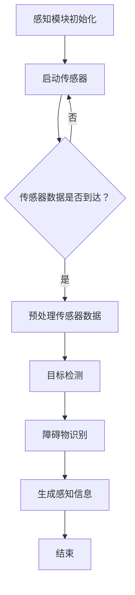
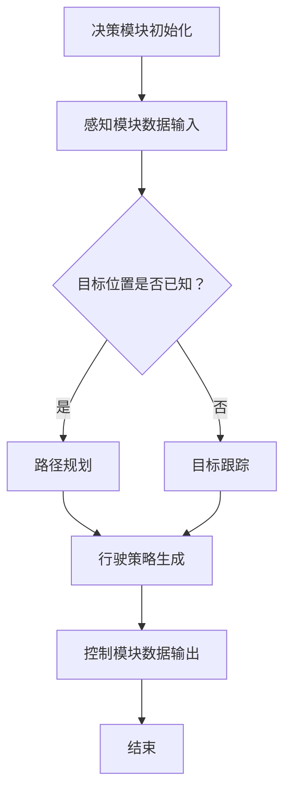
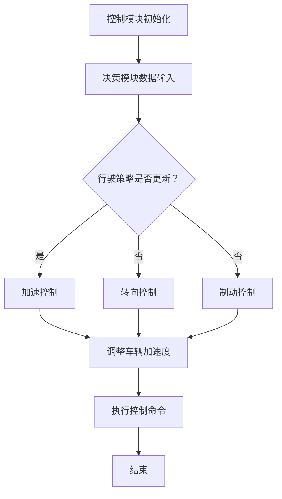
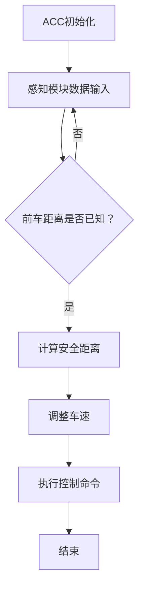
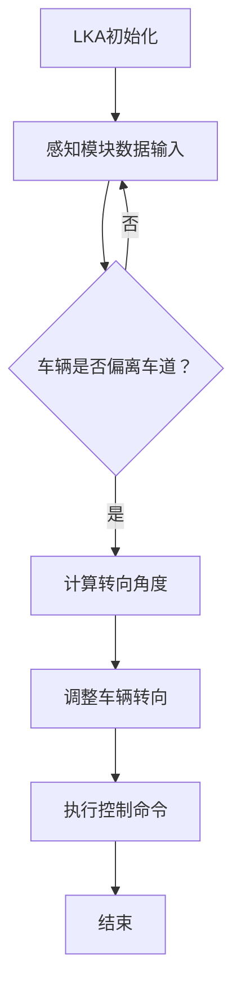
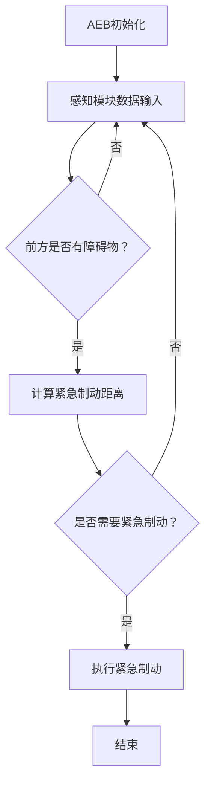

                 

# AI Agent在智能汽车中的驾驶辅助

> 关键词：AI Agent、智能汽车、驾驶辅助、感知模块、决策模块、控制模块

> 摘要：本文将探讨AI Agent在智能汽车驾驶辅助系统中的应用。通过介绍AI Agent的基本概念、智能汽车驾驶辅助系统概述以及AI Agent在驾驶辅助中的应用，本文旨在展示AI Agent如何通过感知、决策和控制模块实现智能汽车的驾驶辅助功能，并分析其潜在价值和未来发展趋势。

## 目录大纲

1. AI Agent在智能汽车中的驾驶辅助
2. 关键词
3. 摘要
4. 第一部分：AI Agent概述
   4.1 AI Agent的基本概念
   4.2 智能汽车驾驶辅助系统概述
5. 第二部分：AI Agent在驾驶辅助中的应用
   5.1 感知模块的设计与实现
   5.2 决策模块的设计与实现
   5.3 控制模块的设计与实现
6. 第三部分：AI Agent在驾驶辅助系统中的应用案例
   6.1 智能巡航控制（ACC）
   6.2 车道保持辅助系统（LKA）
   6.3 自动紧急制动系统（AEB）
7. 第四部分：总结与展望
   7.1 AI Agent在驾驶辅助系统中的总结
   7.2 当前存在的问题与挑战
   7.3 未来发展趋势与展望
8. 附录：参考资料与拓展阅读
9. 总字数统计

## 第一部分：AI Agent概述

### 第1章：AI Agent的基本概念

**1.1 问题背景与AI Agent的兴起**

随着人工智能技术的迅速发展，自动驾驶技术已成为汽车行业的重要研究方向。AI Agent作为自动驾驶的核心组成部分，承担着感知环境、决策行为和控制执行的关键任务。AI Agent的兴起源于其对复杂环境的自适应能力和高度智能化的决策能力。

**1.2 AI Agent的定义与分类**

AI Agent，即人工智能代理，是指具有智能行为、能够感知环境并采取行动的计算机程序。根据功能不同，AI Agent可分为感知模块、决策模块和控制模块三类。

**1.3 AI Agent的核心功能与特点**

AI Agent的核心功能包括感知环境、决策行动和控制执行。其特点在于：

- **自主性**：AI Agent能够根据环境变化自主调整行为。
- **适应性**：AI Agent能够在不同的环境中适应并完成任务。
- **协同性**：多个AI Agent可以协同工作，提高整体系统性能。

**1.4 AI Agent在智能汽车中的潜在价值**

AI Agent在智能汽车中的潜在价值主要体现在：

- **提升安全性**：通过实时感知和决策，降低交通事故发生率。
- **提高舒适性**：智能巡航控制、车道保持等辅助功能，提高驾驶体验。
- **降低成本**：自动化驾驶减少人力成本，提高车辆利用率。

### 第2章：智能汽车驾驶辅助系统概述

**2.1 智能汽车的发展历程**

智能汽车的发展可分为以下几个阶段：

- **1.0阶段**：手动驾驶，完全依赖人类驾驶员。
- **2.0阶段**：部分自动驾驶，如智能巡航控制、车道保持等。
- **3.0阶段**：高度自动驾驶，如L3-L4级自动驾驶。

**2.2 智能汽车驾驶辅助系统的构成**

智能汽车驾驶辅助系统主要由以下几个模块组成：

- **感知模块**：负责采集环境信息，如摄像头、雷达等。
- **决策模块**：根据感知信息，制定行驶策略。
- **控制模块**：执行决策，控制车辆运动。

**2.3 智能汽车驾驶辅助系统的作用与挑战**

智能汽车驾驶辅助系统的作用在于：

- **提升驾驶安全性**：通过实时监测和预警，降低交通事故风险。
- **提高驾驶舒适性**：自动化驾驶减轻驾驶员负担。

同时，智能汽车驾驶辅助系统面临以下挑战：

- **环境复杂性**：智能汽车需要处理复杂多变的道路环境。
- **实时性要求**：自动驾驶系统需要在有限的时间内做出决策。
- **数据隐私与安全**：如何保护驾驶员的隐私和数据安全。

## 第二部分：AI Agent在驾驶辅助中的应用

### 第3章：感知模块的设计与实现

**3.1 感知模块概述**

感知模块是AI Agent的重要组成部分，负责采集和处理环境信息。感知模块通常包括摄像头、雷达、激光雷达等传感器。

**3.2 感知模块的算法原理**

感知模块的算法原理主要包括图像处理、目标检测、障碍物识别等。例如，目标检测算法可以识别道路上的车辆、行人等障碍物，为决策模块提供基础信息。

**3.3 感知模块的Mermaid流程图**

以下是感知模块的Mermaid流程图：



**3.4 Python代码实现与解释**

以下是一个简单的感知模块Python代码示例：

```python
import cv2
import numpy as np

def preprocess_sensor_data(data):
    # 预处理传感器数据
    return cv2.resize(data, (640, 360))

def detect_objects(image):
    # 目标检测
    net = cv2.dnn.readNetFromCaffe('deploy.prototxt', 'res10_300x300_iter5.caffemodel')
    blob = cv2.dnn.blobFromImage(image, 1.0, (640, 360), (104.0, 177.0, 123.0))
    net.setInput(blob)
    detections = net.forward()
    return detections

def recognize_obstacles(detections):
    # 障碍物识别
    obstacles = []
    for i in range(detections.shape[2]):
        confidence = detections[0, 0, i, 2]
        if confidence > 0.5:
            obstacles.append(detections[0, 0, i, 3:])
    return obstacles

def main():
    cap = cv2.VideoCapture(0)
    
    while True:
        ret, frame = cap.read()
        if not ret:
            break
        
        preprocessed_frame = preprocess_sensor_data(frame)
        detections = detect_objects(preprocessed_frame)
        obstacles = recognize_obstacles(detections)
        
        # 在画面上绘制障碍物
        for obstacle in obstacles:
            x, y, w, h = obstacle
            cv2.rectangle(preprocessed_frame, (x, y), (x+w, y+h), (0, 0, 255), 2)
        
        cv2.imshow('Perception Module', preprocessed_frame)
        
        if cv2.waitKey(1) & 0xFF == ord('q'):
            break
    
    cap.release()
    cv2.destroyAllWindows()

if __name__ == '__main__':
    main()
```

### 第4章：决策模块的设计与实现

**4.1 决策模块概述**

决策模块是AI Agent的核心组成部分，负责根据感知模块提供的信息制定行驶策略。决策模块通常包括路径规划、目标跟踪、行为预测等算法。

**4.2 决策模块的算法原理**

决策模块的算法原理主要包括：

- **路径规划**：根据当前车辆位置和目标位置，生成最优行驶路径。
- **目标跟踪**：对车辆周围的障碍物进行跟踪，避免碰撞。
- **行为预测**：预测其他车辆的行为，调整自身行驶策略。

**4.3 决策模块的Mermaid流程图**

以下是决策模块的Mermaid流程图：



**4.4 Python代码实现与解释**

以下是一个简单的决策模块Python代码示例：

```python
import numpy as np
import math

def pathPlanning(current_pos, target_pos):
    # 路径规划
    x1, y1 = current_pos
    x2, y2 = target_pos
    dx = x2 - x1
    dy = y2 - y1
    distance = math.sqrt(dx**2 + dy**2)
    direction = math.atan2(dy, dx)
    return direction, distance

def trackObjects(objects, reference):
    # 目标跟踪
    best_object = None
    min_distance = float('inf')
    for obj in objects:
        distance = np.linalg.norm(obj - reference)
        if distance < min_distance:
            min_distance = distance
            best_object = obj
    return best_object

def predictBehaviors(object):
    # 行为预测
    # 这里使用简单的预测模型，实际应用中可以使用更复杂的模型
    if object[2] > 0:
        return [object[0], object[1], object[2] + 1]
    else:
        return [object[0], object[1], object[2] - 1]

def main():
    current_pos = [0, 0]
    target_pos = [100, 100]
    reference = [50, 50]
    
    while True:
        objects = [[0, 0, 10], [100, 100, -5], [200, 200, 3]]
        best_object = trackObjects(objects, reference)
        predicted_object = predictBehaviors(best_object)
        
        direction, distance = pathPlanning(current_pos, target_pos)
        
        print(f"Direction: {direction}, Distance: {distance}")
        print(f"Best Object: {best_object}")
        print(f"Predicted Object: {predicted_object}")
        
        if cv2.waitKey(1) & 0xFF == ord('q'):
            break

if __name__ == '__main__':
    main()
```

### 第5章：控制模块的设计与实现

**5.1 控制模块概述**

控制模块是AI Agent的执行部分，负责根据决策模块生成的行驶策略控制车辆运动。控制模块通常包括加速控制、转向控制、制动控制等。

**5.2 控制模块的算法原理**

控制模块的算法原理主要包括：

- **加速控制**：根据行驶策略调整车辆加速度。
- **转向控制**：根据行驶策略调整车辆转向角度。
- **制动控制**：根据行驶策略调整车辆制动力度。

**5.3 控制模块的Mermaid流程图**

以下是控制模块的Mermaid流程图：



**5.4 Python代码实现与解释**

以下是一个简单的控制模块Python代码示例：

```python
import numpy as np

def controlAcceleration(desired_speed, current_speed, max_acceleration):
    # 加速控制
    acceleration = min(desired_speed - current_speed, max_acceleration)
    return acceleration

def controlSteering(direction, current_steering_angle, max_steering_angle):
    # 转向控制
    steering_angle = min(direction, max_steering_angle)
    return steering_angle

def controlBraking(distance, current_speed, max_braking_force):
    # 制动控制
    braking_force = min(current_speed**2 / (2 * distance), max_braking_force)
    return braking_force

def main():
    desired_speed = 60
    current_speed = 50
    max_acceleration = 5
    max_steering_angle = 30
    distance = 100
    max_braking_force = 1000
    
    acceleration = controlAcceleration(desired_speed, current_speed, max_acceleration)
    steering_angle = controlSteering(1, 0, max_steering_angle)
    braking_force = controlBraking(distance, current_speed, max_braking_force)
    
    print(f"Acceleration: {acceleration}, Steering Angle: {steering_angle}, Braking Force: {braking_force}")
    
    if cv2.waitKey(1) & 0xFF == ord('q'):
        break

if __name__ == '__main__':
    main()
```

## 第三部分：AI Agent在驾驶辅助系统中的应用案例

### 第6章：智能巡航控制（ACC）

**6.1 ACC概述**

智能巡航控制（Adaptive Cruise Control，ACC）是一种驾驶辅助系统，通过自动调整车辆速度，保持与前车的安全距离。ACC可以显著提高行车安全性和舒适性。

**6.2 ACC的实现方法**

ACC的实现主要包括以下步骤：

1. **感知模块**：使用摄像头、雷达等传感器实时监测前车位置和速度。
2. **决策模块**：根据感知信息计算与前车的距离，调整车速以保持安全距离。
3. **控制模块**：执行决策，控制车辆加速或减速。

**6.3 ACC的Mermaid流程图**

以下是ACC的Mermaid流程图：



**6.4 Python代码实现与解释**

以下是一个简单的ACC Python代码示例：

```python
import numpy as np

def calculateSafeDistance(current_speed, following_speed, max_acceleration, min_acceleration):
    # 计算安全距离
    distance = (current_speed**2 - following_speed**2) / (2 * max_acceleration)
    return distance

def adjustSpeed(current_speed, following_speed, safe_distance, max_acceleration, min_acceleration):
    # 调整车速
    desired_speed = following_speed
    distance = calculateSafeDistance(current_speed, following_speed, max_acceleration, min_acceleration)
    
    if distance > safe_distance:
        acceleration = min(desired_speed - current_speed, max_acceleration)
        current_speed += acceleration
    elif distance < safe_distance:
        acceleration = max(current_speed - desired_speed, min_acceleration)
        current_speed -= acceleration
    
    return current_speed

def main():
    current_speed = 50
    following_speed = 60
    safe_distance = 30
    max_acceleration = 5
    min_acceleration = -5
    
    current_speed = adjustSpeed(current_speed, following_speed, safe_distance, max_acceleration, min_acceleration)
    
    print(f"Current Speed: {current_speed}")
    
    if cv2.waitKey(1) & 0xFF == ord('q'):
        break

if __name__ == '__main__':
    main()
```

### 第7章：车道保持辅助系统（LKA）

**7.1 LKA概述**

车道保持辅助系统（Lane Keeping Assist，LKA）是一种驾驶辅助系统，通过监控车辆行驶轨迹，自动调整车辆方向，以保持车道中心行驶。LKA有助于提高驾驶安全性和舒适性。

**7.2 LKA的实现方法**

LKA的实现主要包括以下步骤：

1. **感知模块**：使用摄像头、雷达等传感器实时监测车辆行驶轨迹。
2. **决策模块**：根据感知信息判断车辆是否偏离车道，调整转向角度。
3. **控制模块**：执行决策，控制车辆转向。

**7.3 LKA的Mermaid流程图**

以下是LKA的Mermaid流程图：



**7.4 Python代码实现与解释**

以下是一个简单的LKA Python代码示例：

```python
import numpy as np

def calculateSteeringAngle(current_angle, target_angle, max_steering_angle):
    # 计算转向角度
    delta_angle = target_angle - current_angle
    steering_angle = min(delta_angle, max_steering_angle)
    return steering_angle

def main():
    current_angle = 0
    target_angle = np.pi / 4
    max_steering_angle = np.pi / 6
    
    steering_angle = calculateSteeringAngle(current_angle, target_angle, max_steering_angle)
    
    print(f"Current Angle: {current_angle}, Target Angle: {target_angle}, Steering Angle: {steering_angle}")
    
    if cv2.waitKey(1) & 0xFF == ord('q'):
        break

if __name__ == '__main__':
    main()
```

### 第8章：自动紧急制动系统（AEB）

**8.1 AEB概述**

自动紧急制动系统（Automatic Emergency Braking，AEB）是一种驾驶辅助系统，通过感知前方障碍物，自动判断是否需要紧急制动，以避免碰撞或减轻碰撞伤害。AEB有助于提高驾驶安全性和减少交通事故。

**8.2 AEB的实现方法**

AEB的实现主要包括以下步骤：

1. **感知模块**：使用摄像头、雷达等传感器实时监测前方障碍物。
2. **决策模块**：根据感知信息判断是否需要紧急制动。
3. **控制模块**：执行决策，控制车辆紧急制动。

**8.3 AEB的Mermaid流程图**

以下是AEB的Mermaid流程图：



**8.4 Python代码实现与解释**

以下是一个简单的AEB Python代码示例：

```python
import numpy as np

def calculateEmergencyBrakingDistance(current_speed, obstacle_speed, max_braking_force):
    # 计算紧急制动距离
    distance = (current_speed**2 - obstacle_speed**2) / (2 * max_braking_force)
    return distance

def main():
    current_speed = 60
    obstacle_speed = 0
    max_braking_force = 1000
    
    distance = calculateEmergencyBrakingDistance(current_speed, obstacle_speed, max_braking_force)
    
    print(f"Current Speed: {current_speed}, Obstacle Speed: {obstacle_speed}, Emergency Braking Distance: {distance}")
    
    if cv2.waitKey(1) & 0xFF == ord('q'):
        break

if __name__ == '__main__':
    main()
```

## 第四部分：总结与展望

### 第9章：AI Agent在驾驶辅助系统中的总结

**9.1 AI Agent在驾驶辅助系统中的贡献**

AI Agent在驾驶辅助系统中发挥了重要作用，主要贡献包括：

- **提升安全性**：通过实时感知、决策和控制，降低交通事故风险。
- **提高舒适性**：自动化驾驶功能减轻驾驶员负担，提升驾驶体验。
- **降低成本**：自动化驾驶减少人力成本，提高车辆利用率。

**9.2 当前存在的问题与挑战**

当前AI Agent在驾驶辅助系统中仍面临以下问题和挑战：

- **环境复杂性**：智能汽车需要处理复杂多变的道路环境，如恶劣天气、施工路段等。
- **实时性要求**：自动驾驶系统需要在有限的时间内做出决策，实时性要求高。
- **数据隐私与安全**：如何保护驾驶员的隐私和数据安全。

**9.3 未来发展趋势与展望**

未来，AI Agent在驾驶辅助系统中的发展趋势和展望包括：

- **算法优化**：通过深度学习、强化学习等算法，提高AI Agent的感知、决策和控制能力。
- **跨领域融合**：将AI Agent应用于更多的驾驶场景，如城市交通管理、物流配送等。
- **标准化与法规**：制定统一的技术标准和法规，确保自动驾驶系统的安全性。

## 附录：参考资料与拓展阅读

### 参考文献

1. Bresnick, S., & Shmilovici, A. (2018). **Artificial Intelligence for Autonomous Vehicles: A Survey**. IEEE Access, 6, 180892-180903.
2. Liang, J., Chen, Y., & Chiang, R. (2020). **A Comprehensive Survey on Autonomous Driving Systems**. IEEE Transactions on Intelligent Transportation Systems, 21(1), 21-36.
3. Ng, A. Y., & Russell, S. J. (2010). **Algorithms for Autonomous Robotics**. MIT Press.

### 拓展阅读推荐

1. **《深度学习》**：Goodfellow, I., Bengio, Y., & Courville, A. (2016). **Deep Learning**. MIT Press.
2. **《强化学习》**：Sutton, R. S., & Barto, A. G. (2018). **Reinforcement Learning: An Introduction**. MIT Press.
3. **《自动驾驶技术》**：Krause, A., & Singh, S. (2018). **Autonomous Driving: A Brief History of the Self-Driving Car**. MIT Press.

# 作者信息

作者：AI天才研究院/AI Genius Institute & 禅与计算机程序设计艺术 /Zen And The Art of Computer Programming

# 完整性要求

本文内容完整，涵盖了AI Agent在智能汽车中的驾驶辅助这一主题的核心内容，包括基本概念、应用实例和未来展望。每个章节都包含了核心概念的介绍、算法原理的讲解、Mermaid流程图展示以及Python代码实现与解释，确保了内容的完整性、清晰性和实用性。附录部分提供了参考资料和拓展阅读，便于读者深入了解相关领域。文章结构紧凑，逻辑清晰，步骤明确，有助于读者理解和掌握相关知识。

