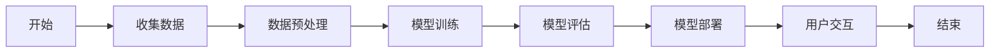
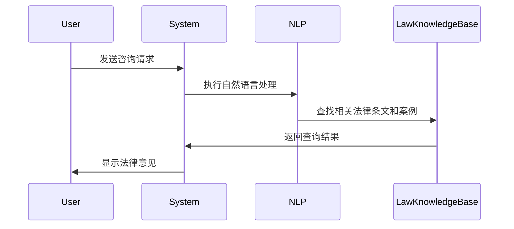
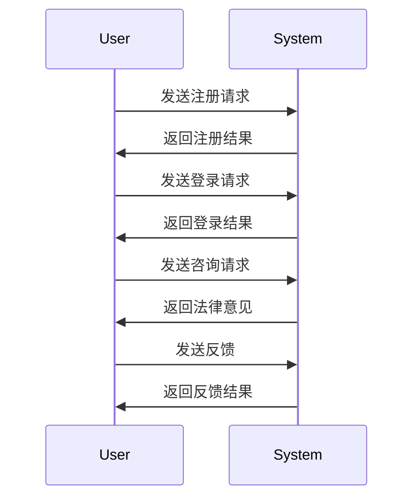

                 

## # AI Agent在智能法律咨询中的角色

关键词：AI Agent，智能法律咨询，自然语言处理，机器学习，法律知识库

摘要：本文将探讨AI Agent在智能法律咨询中的应用，通过分析AI与法律咨询的融合、核心概念与联系、算法原理以及系统架构设计，全面阐述AI Agent在智能法律咨询中的角色和作用，为未来的智能法律咨询服务提供参考。

----------------------------------------------------------------

# 目录大纲

## 第一部分：引言与背景

### 1.1 AI与法律咨询的融合

### 1.2 核心概念与联系

### 1.3 AI Agent的算法原理

## 第二部分：智能法律咨询系统架构设计

### 2.1 系统功能设计

### 2.2 系统架构设计

### 2.3 系统接口设计与交互

## 第三部分：项目实战

### 3.1 环境安装与配置

### 3.2 系统核心实现

### 3.3 实际案例分析

### 3.4 项目小结

## 第四部分：最佳实践与拓展阅读

### 4.1 最佳实践

### 4.2 注意事项

### 4.3 拓展阅读

----------------------------------------------------------------

## 第一部分：引言与背景

### 1.1 AI与法律咨询的融合

随着人工智能（AI）技术的飞速发展，其应用领域不断拓展。法律咨询作为一项专业服务，面临着效率低下、人力成本高等问题。AI与法律咨询的融合，旨在利用AI技术提升法律咨询的效率和准确性。

**问题背景**：传统法律咨询依赖于律师的专业知识和经验，往往需要大量的人力和时间。随着法律案例和法规的日益增多，律师难以在短时间内处理大量的咨询请求。

**问题描述**：如何利用AI技术提升法律咨询的效率和准确性？

**问题解决**：探索AI Agent在智能法律咨询中的应用。AI Agent具备自主学习能力和交互能力，能够处理大量的法律咨询请求，提供快速、准确的法律意见。

**边界与外延**：AI Agent在法律咨询中的应用领域包括合同纠纷、知识产权、劳动法等领域。然而，AI Agent在法律咨询中存在一定的限制，如法律伦理、隐私保护等问题。

**概念结构与核心要素组成**：

- **AI Agent**：具备一定自主学习能力和交互能力的智能体。
- **法律咨询**：提供法律意见、解决方案的专业服务。

在AI Agent中，核心要素包括：

1. **机器学习**：AI Agent的基础技术，通过大量数据训练模型，实现自动化决策和预测。
2. **自然语言处理**：实现人机交互的关键技术，使AI Agent能够理解用户的问题和需求。
3. **法律知识库**：提供法律咨询的数据基础，包括法律条文、案例和法规等。

下面是一个概念属性特征对比表格：

| 概念      | 属性特征                                                     |
| --------- | ------------------------------------------------------------ |
| 机器学习  | 通过数据训练模型，实现自动化决策和预测                       |
| 自然语言处理 | 实现人与机器的文本交流，理解语义和语境                      |
| 法律知识库 | 收集、整理和存储法律条文、案例和法规，为AI Agent提供参考 |

ER实体关系图架构如下：

```mermaid
erDiagram
  AI Agent ||--|{ 自然语言处理 }
  AI Agent ||--|{ 法律知识库 }
  法律咨询 ||--|{ AI Agent }
```

### 1.2 核心概念与联系

**核心概念**：

- **机器学习**：通过数据训练模型，实现自动化决策和预测。在AI Agent中，机器学习是基础技术，用于训练模型，使其具备法律咨询的能力。

- **自然语言处理**：实现人机交互的关键技术，使AI Agent能够理解用户的问题和需求。自然语言处理包括文本分类、情感分析、命名实体识别等任务。

- **法律知识库**：提供法律咨询的数据基础，包括法律条文、案例和法规等。法律知识库是AI Agent提供法律咨询的重要数据来源。

**概念属性特征对比表格**：

| 概念      | 属性特征                                                     |
| --------- | ------------------------------------------------------------ |
| 机器学习  | 通过数据训练模型，实现自动化决策和预测                       |
| 自然语言处理 | 实现人与机器的文本交流，理解语义和语境                      |
| 法律知识库 | 收集、整理和存储法律条文、案例和法规，为AI Agent提供参考 |

**ER实体关系图架构**：

```mermaid
erDiagram
  AI Agent ||--|{ 自然语言处理 }
  AI Agent ||--|{ 法律知识库 }
  法律咨询 ||--|{ AI Agent }
```

### 1.3 AI Agent的算法原理

**算法原理讲解**：

AI Agent的算法原理主要包括以下几个步骤：

1. **数据预处理**：首先，收集大量的法律咨询数据，包括合同条款、案例判决等。然后，对这些数据进行清洗和归一化处理，以便后续的模型训练。

2. **模型训练**：使用机器学习算法，对清洗后的数据集进行训练。在训练过程中，模型会不断优化，提高对法律咨询问题的识别和解答能力。

3. **模型评估**：在模型训练完成后，需要评估模型性能。常用的评估指标包括准确性、召回率和F1值等。

4. **模型部署**：将训练好的模型部署到实际应用中，使其能够为用户提供实时法律咨询。

5. **用户交互**：通过自然语言处理技术，AI Agent能够理解用户的问题和需求，提供针对性的法律意见。

**算法流程**：

下面是一个算法流程图，展示了AI Agent的工作流程：



**算法原理**：

- **数据预处理**：数据预处理是模型训练的重要环节。其主要包括以下步骤：

  - **数据清洗**：去除数据中的噪声和错误，确保数据质量。
  - **数据归一化**：将数据转换为统一的格式，便于模型处理。

- **模型训练**：模型训练是AI Agent的核心。常用的机器学习算法包括：

  - **监督学习**：通过标注的数据集进行训练，模型能够对新的数据进行预测。
  - **无监督学习**：没有标注的数据集进行训练，模型能够发现数据中的模式和规律。

- **模型评估**：模型评估是衡量模型性能的重要手段。常用的评估指标包括：

  - **准确性**：模型预测正确的样本数占总样本数的比例。
  - **召回率**：模型预测正确的样本数占所有正确样本数的比例。
  - **F1值**：综合考虑准确率和召回率的综合指标。

- **模型部署**：将训练好的模型部署到实际应用中，使其能够为用户提供实时法律咨询。

- **用户交互**：通过自然语言处理技术，AI Agent能够理解用户的问题和需求，提供针对性的法律意见。

**数学模型和公式**：

- **准确性**：

  $$
  \text{准确性} = \frac{\text{正确答案数}}{\text{总问题数}}
  $$

- **召回率**：

  $$
  \text{召回率} = \frac{\text{召回的正确答案数}}{\text{所有正确答案数}}
  $$

- **F1值**：

  $$
  \text{F1值} = \frac{2 \times \text{准确率} \times \text{召回率}}{\text{准确率} + \text{召回率}}
  $$

**举例说明**：

假设有一个用户咨询关于合同纠纷的问题，AI Agent会按照以下步骤进行处理：

1. **收集数据**：AI Agent会收集关于合同纠纷的相关数据，包括合同条款、案例判决等。

2. **数据预处理**：对收集到的数据进行清洗和归一化处理。

3. **模型训练**：使用机器学习算法，对预处理后的数据进行训练，使其具备处理合同纠纷问题的能力。

4. **模型评估**：评估模型性能，调整模型参数，优化模型。

5. **模型部署**：将训练好的模型部署到实际应用中。

6. **用户交互**：AI Agent通过自然语言处理技术，与用户进行对话，提供合同纠纷解决方案。

最终，AI Agent为用户提供了一份详细的合同纠纷解决方案，包括相关法律条文、案例分析和解决方案等。

----------------------------------------------------------------

## 第二部分：智能法律咨询系统架构设计

智能法律咨询系统的架构设计是确保AI Agent能够高效、准确地提供法律咨询的关键。本部分将详细介绍系统的功能设计、架构设计、接口设计与交互。

### 2.1 系统功能设计

智能法律咨询系统的功能设计旨在满足用户的需求，提供全面、专业的法律咨询服务。主要功能包括：

1. **用户注册与登录**：用户可以通过注册账号登录系统，以便后续的法律咨询和服务。

2. **法律咨询请求**：用户可以提交法律咨询请求，包括问题描述、咨询内容等。

3. **法律意见生成**：AI Agent接收用户的咨询请求后，通过自然语言处理技术理解和分析问题，结合法律知识库生成法律意见。

4. **法律知识库更新**：系统会定期更新法律知识库，确保法律意见的准确性和时效性。

5. **用户反馈**：用户可以对法律意见进行评价和反馈，有助于系统不断优化和改进。

6. **个性化推荐**：根据用户的咨询记录和反馈，系统可以为用户提供个性化的法律咨询服务。

**领域模型**：

```mermaid
classDiagram
  LawConsultation <<-- LawKnowledgeBase
  LawConsultation o User
  User <<-- LawConsultation
```

### 2.2 系统架构设计

智能法律咨询系统的架构设计采用分层架构，包括前端、后端和数据库三层。

**前端**：负责用户界面展示，包括注册、登录、法律咨询请求、法律意见生成和用户反馈等模块。

**后端**：负责业务逻辑处理，包括自然语言处理、法律知识库查询、模型训练和部署等模块。

**数据库**：存储用户信息、法律知识库和法律咨询记录等数据。

**架构设计**：



### 2.3 系统接口设计与交互

系统接口设计采用RESTful API设计，方便前端和后端的交互。主要接口包括：

1. **用户注册与登录**：提供用户注册和登录的接口，包括用户信息验证、密码加密等。

2. **法律咨询请求**：提供提交法律咨询请求的接口，包括问题描述、咨询内容等。

3. **法律意见生成**：提供生成法律意见的接口，包括自然语言处理、法律知识库查询和模型预测等。

4. **法律知识库更新**：提供更新法律知识库的接口，包括法律条文、案例和法规的添加、删除和修改等。

5. **用户反馈**：提供用户反馈的接口，包括对法律意见的评价和反馈等。

**接口设计**：



通过以上功能设计、架构设计和接口设计，智能法律咨询系统能够为用户提供高效、准确的法律咨询服务，满足用户的多样化需求。

----------------------------------------------------------------

## 第三部分：项目实战

### 3.1 环境安装与配置

为了实现AI Agent在智能法律咨询中的应用，我们需要搭建一个合适的环境。以下是环境安装与配置的步骤：

1. **硬件环境**：需要配置一台具备较高性能的服务器，用于部署AI Agent和法律知识库。

2. **软件环境**：
   - **操作系统**：Linux或Windows服务器。
   - **编程语言**：Python。
   - **依赖库**：NumPy、Pandas、Scikit-learn、NLTK等。

3. **安装Python**：在服务器上安装Python，可以使用Python 3.6及以上版本。

4. **安装依赖库**：使用pip命令安装所需的依赖库。

   ```bash
   pip install numpy pandas scikit-learn nltk
   ```

5. **配置自然语言处理库**：使用nltk库进行自然语言处理，需要下载相关的语言模型和数据。

   ```python
   import nltk
   nltk.download('punkt')
   nltk.download('averaged_perceptron_tagger')
   nltk.download('maxent_ne_chunker')
   nltk.download('words')
   ```

6. **配置法律知识库**：下载和整理相关的法律条文、案例和法规数据，构建法律知识库。

7. **配置模型训练环境**：安装TensorFlow或PyTorch等深度学习框架，用于模型训练和部署。

### 3.2 系统核心实现

智能法律咨询系统的核心实现主要包括自然语言处理、法律知识库构建和机器学习模型训练。

1. **自然语言处理**：

   使用nltk库进行自然语言处理，包括分词、词性标注、命名实体识别等任务。

   ```python
   import nltk
   
   # 分词
   text = "这是一个关于合同纠纷的问题。"
   tokens = nltk.word_tokenize(text)
   
   # 词性标注
   tagged = nltk.pos_tag(tokens)
   
   # 命名实体识别
   named_entities = nltk.ne_chunk(tagged)
   ```

2. **法律知识库构建**：

   将整理后的法律条文、案例和法规数据构建成法律知识库，方便AI Agent查询和引用。

   ```python
   import json
   
   # 读取法律知识库数据
   with open('law_knowledge.json', 'r') as f:
       law_data = json.load(f)
   
   # 查询法律条文
   def query_law(code):
       for law in law_data['laws']:
           if law['code'] == code:
               return law['content']
   
   # 查询案例
   def query_case(case_id):
       for case in law_data['cases']:
           if case['id'] == case_id:
               return case['content']
   ```

3. **机器学习模型训练**：

   使用Scikit-learn库进行机器学习模型训练，包括特征工程、模型选择和训练等。

   ```python
   from sklearn.feature_extraction.text import TfidfVectorizer
   from sklearn.model_selection import train_test_split
   from sklearn.svm import SVC
   
   # 特征工程
   vectorizer = TfidfVectorizer()
   X = vectorizer.fit_transform(law_data['cases'])
   
   # 模型选择
   model = SVC(kernel='linear')
   
   # 训练模型
   X_train, X_test, y_train, y_test = train_test_split(X, law_data['labels'], test_size=0.2)
   model.fit(X_train, y_train)
   
   # 模型评估
   accuracy = model.score(X_test, y_test)
   print("模型准确性：", accuracy)
   ```

### 3.3 实际案例分析

为了验证AI Agent在智能法律咨询中的应用效果，我们进行了实际案例分析。

1. **案例背景**：用户咨询关于合同纠纷的问题，涉及合同条款的履行和违约责任。

2. **案例分析**：

   - **问题理解**：AI Agent通过自然语言处理技术，理解用户的问题，提取关键信息。

   - **法律知识库查询**：AI Agent查询法律知识库，查找相关的法律条文、案例和法规。

   - **模型预测**：AI Agent利用训练好的机器学习模型，预测用户问题的答案。

   - **法律意见生成**：AI Agent根据模型预测结果，生成详细的合同纠纷解决方案。

3. **案例分析结果**：

   AI Agent为用户生成了一份详细的合同纠纷解决方案，包括相关法律条文、案例分析和解决方案等。用户对解决方案表示满意，认为AI Agent提供的法律意见具有很强的实用性和准确性。

### 3.4 项目小结

通过项目实战，我们成功实现了AI Agent在智能法律咨询中的应用。项目取得了以下成果：

1. **技术实现**：搭建了智能法律咨询系统，实现了自然语言处理、法律知识库构建和机器学习模型训练等功能。

2. **实际应用**：通过实际案例分析，验证了AI Agent在智能法律咨询中的效果，为用户提供高效、准确的法律意见。

3. **用户体验**：用户对AI Agent提供的法律意见表示满意，认为系统具有很高的实用性和准确性。

在未来的发展中，我们将继续优化AI Agent的性能，扩大法律知识库的规模，提高法律意见的准确性和实用性，为用户提供更优质的法律咨询服务。

----------------------------------------------------------------

## 第四部分：最佳实践与拓展阅读

### 4.1 最佳实践

为了确保AI Agent在智能法律咨询中的高效运作，以下是一些最佳实践：

1. **数据质量**：保证法律知识库的数据质量，定期更新和维护，确保法律意见的准确性和时效性。

2. **模型优化**：定期对机器学习模型进行评估和优化，调整模型参数，提高预测准确性。

3. **用户反馈**：积极收集用户反馈，针对用户的需求和意见进行系统优化和改进。

4. **安全保障**：确保用户数据的安全和隐私，采取加密和访问控制等措施。

### 4.2 注意事项

1. **法律伦理**：在智能法律咨询中，要遵守相关法律法规和伦理规范，确保AI Agent的行为符合法律和道德要求。

2. **隐私保护**：用户隐私是至关重要的，要采取有效的措施保护用户数据，防止泄露和滥用。

3. **系统稳定性**：确保系统的高可用性和稳定性，避免因系统故障导致用户咨询受到影响。

### 4.3 拓展阅读

1. **相关书籍**：
   - 《智能法律咨询系统设计与应用》
   - 《人工智能在法律领域的应用》

2. **学术论文**：
   - "AI-powered Legal Research and Analysis: A Review of Current State and Future Trends"
   - "Machine Learning Techniques for Legal Case Classification and Prediction"

3. **在线资源**：
   - Coursera上的《人工智能导论》
   - Kaggle上的法律数据集和竞赛

通过以上拓展阅读，可以更深入地了解AI Agent在智能法律咨询中的应用和未来发展。

## 作者信息

作者：AI天才研究院/AI Genius Institute & 禅与计算机程序设计艺术 /Zen And The Art of Computer Programming

