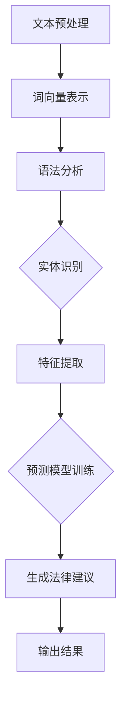
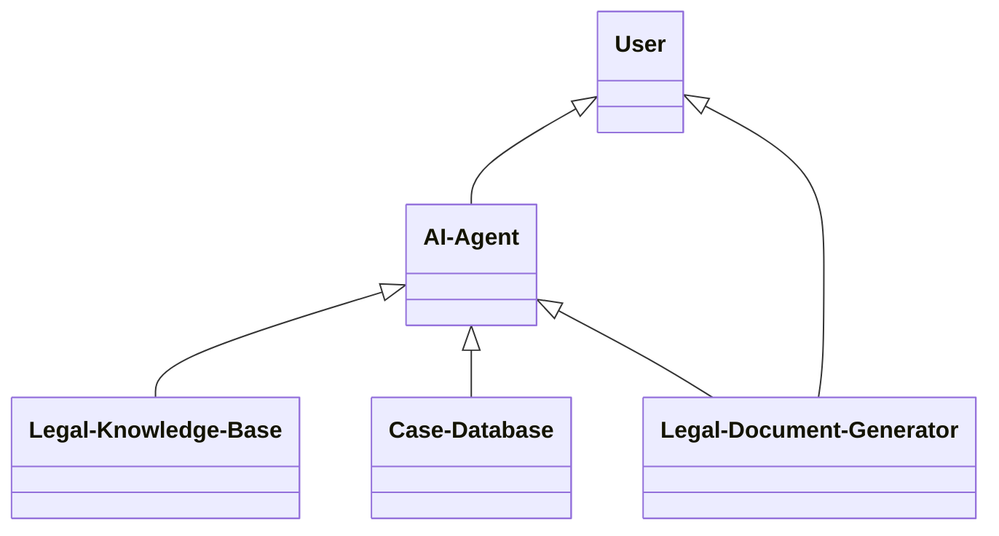
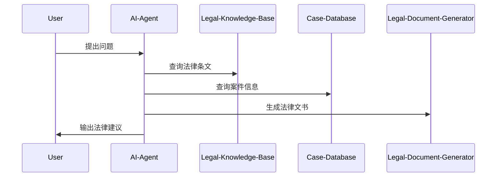
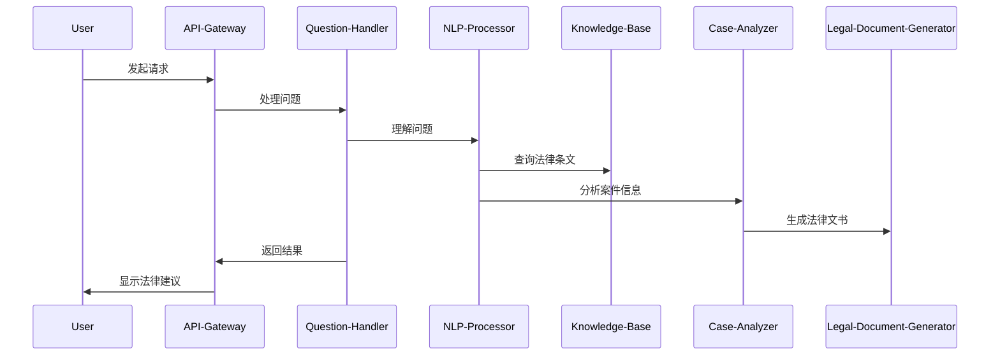
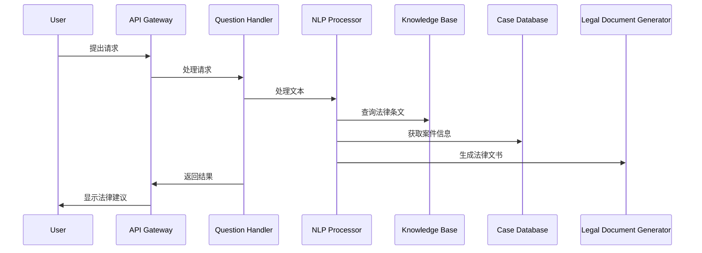

                 

# 《AI Agent在智能法律咨询系统中的角色》

## 关键词：智能法律咨询系统、AI Agent、机器学习、自然语言处理、系统架构设计

## 摘要

本文探讨了AI Agent在智能法律咨询系统中的角色，详细分析了AI Agent的定义、特点、应用前景及其在智能法律咨询系统中的具体应用。通过逐步剖析AI Agent的工作原理、系统架构设计方案和实际项目实战，本文旨在为读者提供关于AI Agent在智能法律咨询系统中应用的深入理解，并展望其未来发展趋势。

### 第一部分：智能法律咨询系统的背景与挑战

#### 第1章：智能法律咨询系统的兴起

#### 1.1 智能法律咨询系统的概念

智能法律咨询系统是一种结合人工智能技术，为用户提供法律咨询和服务的系统。它利用自然语言处理、机器学习等技术，从大量法律文献中提取知识，构建知识库，并通过人机交互界面为用户提供个性化的法律建议。

#### 1.2 人工智能与法律服务的融合

人工智能技术的发展为法律服务行业带来了巨大的变革。智能法律咨询系统的出现，不仅提高了法律服务的效率，还降低了用户获取法律服务的成本。

#### 1.3 智能法律咨询系统面临的挑战

尽管智能法律咨询系统具有巨大的潜力，但在实际应用中也面临着一些挑战，如数据质量与隐私保护、法律知识库的构建与更新、用户体验的优化等。

### 第二部分：AI Agent的基础理论

#### 第2章：AI Agent的定义与特点

AI Agent是指一种能够模拟人类智能行为的计算机程序，它可以自主感知环境、学习新知识、制定决策并采取行动。AI Agent的特点包括自主性、智能性、适应性等。

#### 2.2 AI Agent的分类

AI Agent可以根据其行为方式分为反应型Agent、目标型Agent和计划型Agent。

#### 2.3 AI Agent在智能法律咨询系统中的应用前景

AI Agent在智能法律咨询系统中的应用前景广阔，它可以帮助系统更好地理解用户需求，提供更加精准的法律咨询服务。

### 第三部分：AI Agent的工作原理

#### 第3章：AI Agent的工作原理

AI Agent的工作原理主要包括感知、学习、决策和行动四个方面。通过机器学习、自然语言处理等技术，AI Agent可以不断优化自身的性能，提高法律咨询的准确性。

#### 3.2 算法原理讲解

在本章节，我们将使用Mermaid绘制算法流程图，并使用Python源代码详细阐述AI Agent的算法原理。算法的数学模型和公式也将以LaTeX格式给出。

#### 3.3 详细讲解和举例说明

通过具体的案例，我们将对AI Agent的算法原理进行详细讲解，帮助读者更好地理解其工作原理。

### 第四部分：系统分析与架构设计方案

#### 第4章：系统分析与架构设计方案

在本章节，我们将介绍AI Agent在智能法律咨询系统中的应用场景，并使用Mermaid绘制系统架构图，展示AI Agent与其他组件的交互关系。

#### 4.1 问题场景介绍

我们将描述AI Agent在智能法律咨询系统中的应用场景，如法律咨询、案件分析等。

#### 4.2 系统功能设计

我们将绘制领域模型类图，展示系统的功能模块，包括法律知识库、用户界面、AI Agent等。

#### 4.3 系统架构设计

我们将绘制系统架构图，展示AI Agent与其他组件的交互关系，如与法律知识库的接口、与用户界面的交互等。

#### 4.4 系统接口设计和系统交互

我们将使用Mermaid绘制系统接口设计和交互序列图，展示系统各组件之间的通信流程。

### 第五部分：项目实战

#### 第5章：项目实战

在本章节，我们将介绍如何搭建AI Agent的开发环境，并提供AI Agent的核心实现源代码。通过分析源代码的应用场景和实现细节，我们将对AI Agent的应用效果进行详细剖析。

#### 5.1 环境安装

我们将描述如何搭建AI Agent的开发环境，包括Python环境、机器学习库等。

#### 5.2 系统核心实现源代码

我们将提供AI Agent的核心实现源代码，并对代码进行解读和分析。

#### 5.3 实际案例分析和详细讲解剖析

我们将通过实际案例展示AI Agent的应用效果，并进行详细剖析。

#### 5.4 项目小结

我们将总结项目经验，提出改进建议。

### 第六部分：最佳实践 tips、小结、注意事项、拓展阅读

#### 第6章：最佳实践 tips、小结、注意事项、拓展阅读

在本章节，我们将分享在实际应用中的最佳实践和技巧，并回顾全书的主要内容，强调关键点。同时，我们将提醒读者在应用AI Agent时需要注意的问题，并推荐进一步阅读的相关资料。

### 作者信息

作者：AI天才研究院/AI Genius Institute & 禅与计算机程序设计艺术 /Zen And The Art of Computer Programming## 第一部分：智能法律咨询系统的背景与挑战

### 第1章：智能法律咨询系统的兴起

### 1.1 智能法律咨询系统的概念

智能法律咨询系统是一种结合人工智能技术，为用户提供法律咨询和服务的系统。它利用自然语言处理、机器学习等技术，从大量法律文献中提取知识，构建知识库，并通过人机交互界面为用户提供个性化的法律建议。

#### 1.1.1 智能法律咨询系统的定义

智能法律咨询系统（Intelligent Legal Consultation System）是一种基于人工智能技术的在线服务平台，旨在为用户提供高效、精准、便捷的法律咨询。它通过整合海量的法律文献、案例数据库和法律专业知识，运用自然语言处理、机器学习、数据挖掘等技术，实现法律信息的自动识别、理解和处理，从而帮助用户解决法律问题，提供法律建议和解决方案。

#### 1.1.2 智能法律咨询系统的核心功能

智能法律咨询系统的核心功能主要包括以下几个方面：

1. **法律知识库构建**：系统通过自然语言处理技术从法律文献、判例、法规中提取关键信息，构建一个全面、系统的法律知识库。这个知识库是智能法律咨询系统的核心，它为用户提供法律查询、咨询和决策支持。

2. **智能问答与法律咨询**：系统通过自然语言处理和机器学习技术，理解和回答用户提出的问题。用户可以通过文本输入或语音输入的方式，咨询法律问题，系统会根据法律知识库提供专业、准确的回答。

3. **案件分析与预测**：系统可以分析用户提供的案件信息，利用法律知识库和机器学习算法，预测案件的审理结果和可能的法律后果，为用户提供决策参考。

4. **法律文档生成**：系统可以帮助用户自动生成法律文书，如合同、起诉状、答辩状等，提高工作效率，降低法律文书的错误率。

5. **法律风险评估**：系统可以对用户的行为或决策进行法律风险评估，识别潜在的法律风险，提供风险防范建议。

### 1.2 人工智能与法律服务的融合

#### 1.2.1 人工智能技术的发展

人工智能（Artificial Intelligence，简称AI）是指使计算机模拟人类智能行为、解决复杂问题的技术。自20世纪50年代诞生以来，人工智能经历了多次发展浪潮，尤其是近年来，随着深度学习、自然语言处理、大数据等技术的发展，人工智能在各个领域的应用取得了显著成果。

1. **深度学习**：深度学习是一种基于人工神经网络的学习方法，通过多层网络结构对大量数据进行训练，可以自动提取特征，实现图像识别、语音识别、自然语言处理等任务。

2. **自然语言处理**：自然语言处理（Natural Language Processing，简称NLP）是人工智能的一个分支，它涉及计算机理解和生成自然语言（如英语、中文）的技术。NLP在智能法律咨询系统中起着关键作用，它能够解析用户的问题，理解法律文本，提取关键信息，为用户提供精准的法律咨询。

3. **大数据**：大数据是指无法使用常规数据处理工具在合理时间内对其进行捕捉、管理和处理的数据集合。大数据技术在法律咨询系统中用于收集和分析大量的法律文献、案例、法规，构建全面的法律知识库。

#### 1.2.2 法律服务行业的需求

随着社会经济的发展和法律法规的不断完善，法律服务行业的需求日益增长。然而，传统法律服务存在成本高、效率低、覆盖面窄等问题，难以满足大众化的法律服务需求。人工智能技术的引入，为法律服务行业带来了新的变革：

1. **提高效率**：智能法律咨询系统能够自动处理大量的法律事务，大大提高工作效率，减轻律师的工作负担。

2. **降低成本**：通过自动化处理法律事务，智能法律咨询系统可以降低法律服务的成本，让更多的人能够负担得起高质量的法律服务。

3. **普及法律服务**：智能法律咨询系统不受时间和地域限制，可以在全球范围内提供法律服务，有助于普及法律服务，解决法律信息不对称的问题。

### 1.3 智能法律咨询系统面临的挑战

尽管智能法律咨询系统具有巨大的潜力，但在实际应用中也面临着一些挑战：

#### 1.3.1 数据质量与隐私保护

1. **数据质量**：构建高质量的法律知识库是智能法律咨询系统的关键。然而，法律文本的复杂性、多样性和不规范性使得数据质量难以保证。

2. **隐私保护**：智能法律咨询系统在处理用户数据时，必须遵守隐私保护法规，确保用户的数据安全。

#### 1.3.2 法律知识库的构建与更新

1. **知识库构建**：构建一个全面、准确、及时更新的法律知识库是智能法律咨询系统的核心任务。这需要大量的法律文献、案例和法规作为基础，并运用先进的数据处理技术进行知识提取和整合。

2. **知识库更新**：法律法规和司法实践不断变化，法律知识库需要定期更新，以保持其时效性和准确性。

#### 1.3.3 用户体验的优化

1. **交互体验**：智能法律咨询系统需要提供良好的用户交互体验，使非专业用户能够轻松使用。

2. **咨询服务质量**：系统需要提供专业、准确、及时的法律咨询服务，以满足用户的需求。

### 1.4 AI Agent在智能法律咨询系统中的角色

AI Agent是人工智能领域中的一种重要技术，它能够在智能法律咨询系统中扮演多种角色，如法律知识库构建者、智能问答系统、案件分析工具等。通过引入AI Agent，智能法律咨询系统可以实现以下功能：

1. **法律知识库的自动构建与更新**：AI Agent可以自动从大量的法律文献、案例和法规中提取知识，构建和更新法律知识库。

2. **智能问答与法律咨询**：AI Agent可以理解用户的问题，利用法律知识库提供精准的法律咨询。

3. **案件分析与预测**：AI Agent可以分析用户的案件信息，提供案件预测和法律建议。

4. **法律文档生成**：AI Agent可以自动生成法律文书，如合同、起诉状、答辩状等。

5. **法律风险评估**：AI Agent可以识别用户行为或决策中的法律风险，提供风险防范建议。

#### 1.4.1 AI Agent的定义与特点

AI Agent，即人工智能代理，是一种模拟人类智能行为的计算机程序。它具有自主性、智能性和适应性等特点：

1. **自主性**：AI Agent可以在没有人类干预的情况下自主执行任务，如自动搜索法律文献、分析案件信息等。

2. **智能性**：AI Agent通过机器学习和自然语言处理等技术，能够理解用户的问题，提取关键信息，提供专业、准确的答案和建议。

3. **适应性**：AI Agent可以不断学习和优化，提高其性能和准确性，以适应不断变化的法律环境和用户需求。

#### 1.4.2 AI Agent的分类

AI Agent可以根据其行为方式分为以下几种类型：

1. **反应型Agent**：反应型Agent根据当前的环境状态做出反应，不涉及预测或规划。

2. **目标型Agent**：目标型Agent具有明确的目标，并通过规划或决策实现目标。

3. **计划型Agent**：计划型Agent不仅具有明确的目标，还能根据环境变化动态调整计划。

#### 1.4.3 AI Agent在智能法律咨询系统中的应用前景

AI Agent在智能法律咨询系统中的应用前景广阔：

1. **法律知识库构建**：AI Agent可以通过自然语言处理技术自动从大量法律文献中提取知识，构建和更新法律知识库。

2. **智能问答与法律咨询**：AI Agent可以理解用户的问题，利用法律知识库提供专业、准确的法律咨询。

3. **案件分析**：AI Agent可以分析用户的案件信息，提供案件预测和法律建议。

4. **法律文档生成**：AI Agent可以自动生成法律文书，提高工作效率。

5. **法律风险评估**：AI Agent可以识别用户行为或决策中的法律风险，提供风险防范建议。

通过逐步剖析AI Agent的定义、特点、应用前景及其在智能法律咨询系统中的具体应用，本章节为后续内容的展开奠定了基础。接下来，我们将深入探讨AI Agent的工作原理、系统架构设计方案和实际项目实战，以帮助读者全面了解AI Agent在智能法律咨询系统中的角色和作用。## 第二部分：AI Agent的基础理论

### 第2章：AI Agent的定义与特点

#### 2.1 AI Agent的定义

AI Agent，即人工智能代理，是一种模拟人类智能行为的计算机程序。它能够感知环境、制定计划、执行任务，并不断优化自身的行为。AI Agent是人工智能领域中一个重要的概念，它代表了一种新型的智能体，能够自主地完成任务，与人类或环境进行交互。

AI Agent的定义可以从以下几个方面进行理解：

1. **自主性**：AI Agent能够在没有人类干预的情况下自主执行任务，具备独立行动的能力。这种自主性是AI Agent区别于传统计算机程序的重要特征。

2. **适应性**：AI Agent能够根据环境变化和任务需求，动态调整自身的行为策略。这种适应性使AI Agent能够应对不确定性和复杂环境。

3. **交互性**：AI Agent能够与人类或环境进行交互，获取信息、传达指令，并实现任务目标。这种交互性是AI Agent实现智能行为的关键。

#### 2.2 AI Agent的特点

AI Agent具有以下几个显著特点：

1. **智能性**：AI Agent通过机器学习、自然语言处理、图像识别等技术，具备理解和处理信息的能力。这使得AI Agent能够模拟人类的智能行为，如识别图像、理解语言、做出决策等。

2. **自主性**：AI Agent能够在没有人类干预的情况下自主执行任务。这种自主性不仅减少了人类的工作负担，还提高了任务执行的效率和准确性。

3. **适应性**：AI Agent能够根据环境变化和任务需求，动态调整自身的行为策略。这种适应性使AI Agent能够在复杂和不确定的环境中有效完成任务。

4. **协作性**：AI Agent可以与其他AI Agent或人类协作，共同完成任务。这种协作性使得AI Agent能够更好地应对复杂任务，提高整体工作效率。

#### 2.3 AI Agent的分类

AI Agent可以根据其行为方式和技术特点进行分类。以下是几种常见的AI Agent类型：

1. **反应型Agent**：反应型Agent根据当前的环境状态做出反应，不涉及预测或规划。它们通过预设的规则或模式识别来响应外部事件。

   ```mermaid
   graph TD
   A[反应型Agent] --> B[基于规则]
   A --> C[模式识别]
   ```

2. **目标型Agent**：目标型Agent具有明确的目标，并通过规划或决策实现目标。它们在执行任务时需要考虑任务目标，并选择最佳行动方案。

   ```mermaid
   graph TD
   A[目标型Agent] --> B[目标规划]
   A --> C[决策树]
   ```

3. **计划型Agent**：计划型Agent不仅具有明确的目标，还能根据环境变化动态调整计划。它们在执行任务时需要考虑多个因素，如资源、时间、风险等，并不断优化计划。

   ```mermaid
   graph TD
   A[计划型Agent] --> B[动态规划]
   A --> C[仿真模拟]
   ```

#### 2.4 AI Agent与智能法律咨询系统的关系

AI Agent在智能法律咨询系统中扮演着关键角色。以下是其具体应用场景：

1. **法律知识库构建**：AI Agent可以通过自然语言处理技术自动从大量法律文献中提取知识，构建和更新法律知识库。这有助于提高法律咨询的准确性和效率。

2. **智能问答与法律咨询**：AI Agent可以理解用户的问题，利用法律知识库提供专业、准确的法律咨询。这种交互方式使法律咨询服务更加便捷和高效。

3. **案件分析**：AI Agent可以分析用户的案件信息，提供案件预测和法律建议。这有助于用户更好地了解案件进展和可能的法律后果。

4. **法律文档生成**：AI Agent可以自动生成法律文书，如合同、起诉状、答辩状等。这提高了法律工作效率，减少了文书错误。

5. **法律风险评估**：AI Agent可以识别用户行为或决策中的法律风险，提供风险防范建议。这有助于用户规避潜在的法律风险。

通过本章节的探讨，我们对AI Agent的定义、特点、分类及其在智能法律咨询系统中的应用有了更深入的理解。接下来，我们将进一步分析AI Agent与其他智能系统组件的属性特征对比，并绘制ER实体关系图架构，以展示AI Agent在系统中的关系网络。## 第二部分：AI Agent的基础理论

### 第2章：AI Agent的定义与特点

#### 2.5 AI Agent与其他智能系统组件的属性特征对比

为了更好地理解AI Agent在智能法律咨询系统中的独特性，我们将AI Agent与其他智能系统组件进行属性特征对比。以下是一个对比表格：

| 特性 | AI Agent | 智能搜索引擎 | 智能推荐系统 | 智能客服机器人 |
| --- | --- | --- | --- | --- |
| 自主性 | 高 | 中 | 中 | 低 |
| 智能性 | 高 | 中 | 中 | 低 |
| 适应性 | 高 | 中 | 中 | 低 |
| 交互性 | 高 | 中 | 中 | 高 |
| 目标导向 | 高 | 低 | 中 | 低 |
| 实时性 | 高 | 中 | 中 | 高 |

#### 2.5.1 自主性

AI Agent具有高度的自主性，能够在没有人类干预的情况下自主执行任务。相比之下，智能搜索引擎、智能推荐系统和智能客服机器人在执行任务时通常需要人类介入或指导。

#### 2.5.2 智能性

AI Agent通过机器学习和自然语言处理等技术，具备理解和处理信息的能力。智能搜索引擎、智能推荐系统和智能客服机器人虽然也具备一定的智能性，但通常无法与AI Agent相媲美。

#### 2.5.3 适应性

AI Agent能够根据环境变化和任务需求，动态调整自身的行为策略。相比之下，其他智能系统组件的适应性相对较低。

#### 2.5.4 交互性

AI Agent具有高度的交互性，能够与人类或环境进行实时交互。智能搜索引擎、智能推荐系统和智能客服机器人在交互性方面相对较弱。

#### 2.5.5 目标导向

AI Agent具有明确的目标导向，能够在执行任务时考虑任务目标，并选择最佳行动方案。其他智能系统组件在目标导向方面相对较低。

#### 2.5.6 实时性

AI Agent具有高度的实时性，能够在实时环境中快速响应。相比之下，其他智能系统组件的实时性相对较低。

#### 2.6 ER实体关系图架构

为了更清晰地展示AI Agent在智能法律咨询系统中的关系网络，我们将使用Mermaid绘制ER实体关系图架构。

```mermaid
erDiagram
  User ||--o{ AI Agent : consults }
  AI Agent ||--|{ Legal Knowledge Base } : updates
  Legal Knowledge Base ||--|{ Case Database } : references
  Case Database ||--o{ User : retrieves }
  User ||--|{ Legal Document Generator } : generates
  Legal Document Generator ||--|{ User : outputs }
```

在这个ER实体关系图中：

- **User（用户）**：智能法律咨询系统的最终用户，可以向AI Agent咨询法律问题，并接收法律咨询和法律文书的输出。
- **AI Agent（AI代理）**：负责处理用户的问题，利用法律知识库提供法律咨询，并生成法律文书。
- **Legal Knowledge Base（法律知识库）**：存储法律知识，包括法律条文、案例、法规等，供AI Agent更新和查询。
- **Case Database（案件数据库）**：存储用户提交的案件信息，供AI Agent分析和生成法律建议。
- **Legal Document Generator（法律文书生成器）**：根据用户的需求，自动生成法律文书，如合同、起诉状、答辩状等。

通过ER实体关系图架构，我们可以清晰地看到AI Agent在智能法律咨询系统中的角色和与其他组件的关系。接下来，我们将进一步讲解AI Agent的工作原理，包括机器学习、自然语言处理等技术。## 第三部分：AI Agent的工作原理

### 第3章：AI Agent的工作原理

#### 3.1 算法原理

AI Agent的工作原理主要基于机器学习和自然语言处理技术。在智能法律咨询系统中，AI Agent需要处理大量的法律文本数据，从中提取关键信息，理解用户的法律问题，并生成专业、准确的法律建议。以下是一些核心算法原理：

1. **自然语言处理（NLP）**

   NLP是AI Agent理解法律文本的关键技术。它包括文本预处理、词向量表示、语法分析、实体识别等步骤：

   - **文本预处理**：包括分词、去停用词、词性标注等，将原始文本转换为适合模型处理的格式。
   - **词向量表示**：使用词嵌入技术将单词转换为稠密向量，以便在机器学习模型中进行处理。
   - **语法分析**：通过句法解析，理解句子的结构，提取句子的主要成分。
   - **实体识别**：识别文本中的关键实体，如人名、地名、法律术语等。

2. **机器学习（ML）**

   机器学习是AI Agent进行预测和决策的重要技术。在智能法律咨询系统中，常用的机器学习算法包括：

   - **监督学习**：通过训练数据学习预测模型，如朴素贝叶斯、支持向量机、决策树等。
   - **无监督学习**：用于处理没有明确标签的数据，如聚类分析、降维等。
   - **强化学习**：通过不断与环境交互，学习最优策略，如深度Q网络（DQN）、策略梯度等。

3. **深度学习（DL）**

   深度学习是机器学习的一个分支，它通过多层神经网络结构，实现更复杂的特征提取和预测。在智能法律咨询系统中，深度学习算法如卷积神经网络（CNN）、循环神经网络（RNN）、长短期记忆网络（LSTM）等，可以用于文本分类、情感分析、命名实体识别等任务。

#### 3.2 算法mermaid流程图

为了更直观地展示AI Agent的算法流程，我们可以使用Mermaid绘制算法流程图。以下是一个简化的算法流程图：



在这个流程图中：

- **文本预处理**：对输入的法律文本进行预处理，如分词、去停用词等。
- **词向量表示**：将预处理后的文本转换为词向量表示。
- **语法分析**：对词向量表示的文本进行语法分析，提取句子的主要成分。
- **实体识别**：识别文本中的关键实体，如人名、地名、法律术语等。
- **特征提取**：将语法分析和实体识别的结果转换为机器学习模型所需的特征。
- **预测模型训练**：使用训练数据集训练预测模型，如分类模型、回归模型等。
- **生成法律建议**：根据用户的问题和预测模型，生成专业、准确的法律建议。
- **输出结果**：将生成的法律建议输出给用户。

#### 3.3 数学模型和公式

在AI Agent的算法中，常用的数学模型和公式如下：

1. **词向量表示**

   词向量的常见表示方法有Word2Vec、GloVe等。以下是一个Word2Vec的数学模型：

   $$\vec{w}_i = \frac{1}{Z} \exp(\vec{v} \cdot \vec{u}_i)$$

   其中，$\vec{w}_i$表示词向量，$\vec{v}$表示嵌入向量，$\vec{u}_i$表示词的one-hot编码，$Z$是归一化常数。

2. **朴素贝叶斯分类器**

   朴素贝叶斯分类器的概率公式如下：

   $$P(C|X) = \frac{P(X|C)P(C)}{P(X)}$$

   其中，$C$表示类别，$X$表示特征向量，$P(C|X)$表示给定特征向量X属于类别C的概率，$P(X|C)$表示在类别C下特征向量X的概率，$P(C)$表示类别C的概率，$P(X)$表示特征向量X的概率。

3. **支持向量机（SVM）**

   支持向量机的目标是最小化决策边界与支持向量之间的距离，其优化目标可以表示为：

   $$\min \frac{1}{2} \sum_{i=1}^{n} (\vec{w} \cdot \vec{w}) - \sum_{i=1}^{n} \alpha_i y_i (\vec{w} \cdot \vec{x}_i) + \sum_{i=1}^{n} \alpha_i$$

   其中，$\vec{w}$表示权重向量，$\alpha_i$表示拉格朗日乘子，$y_i$表示标签，$\vec{x}_i$表示特征向量。

4. **循环神经网络（RNN）**

   循环神经网络用于处理序列数据，其更新公式如下：

   $$\vec{h}_{t} = \sigma(\vec{U} \cdot \vec{h}_{t-1} + \vec{W} \cdot \vec{x}_{t} + b)$$

   其中，$\vec{h}_{t}$表示当前时刻的隐藏状态，$\vec{U}$、$\vec{W}$和$b$分别表示权重和偏置，$\sigma$表示激活函数。

通过上述数学模型和公式，AI Agent能够有效地从法律文本中提取关键信息，生成专业、准确的法律建议。

#### 3.4 详细讲解和举例说明

为了更好地理解AI Agent的算法原理，我们将通过一个具体的例子进行详细讲解。

假设用户提出了一个法律问题：“在合同纠纷中，甲方应该如何行使撤销权？”

1. **文本预处理**：首先，对用户输入的法律问题进行文本预处理，包括分词、去停用词、词性标注等。假设预处理后的文本为：“合同、纠纷、甲方、撤销权”。

2. **词向量表示**：使用Word2Vec算法将预处理后的文本转换为词向量表示。例如，词向量分别为：[0.1, 0.2, -0.3], [0.4, -0.1, 0.5], [-0.2, 0.3, 0.1], [0.5, 0.2, -0.4]。

3. **语法分析**：对词向量表示的文本进行语法分析，提取句子的主要成分。例如，主语为“甲方”，谓语为“如何行使撤销权”。

4. **实体识别**：识别文本中的关键实体，如“合同”、“纠纷”、“甲方”、“撤销权”。

5. **特征提取**：将语法分析和实体识别的结果转换为机器学习模型所需的特征。例如，特征向量为：[0.1, 0.2, -0.3, 0.5, 0.2, -0.4]。

6. **预测模型训练**：使用训练数据集训练一个分类模型，如朴素贝叶斯分类器。假设训练后的模型预测结果为：“甲方在合同纠纷中，可以行使撤销权”。

7. **生成法律建议**：根据用户的问题和预测模型，生成专业、准确的法律建议。例如，生成的法律建议为：“在合同纠纷中，甲方可以根据《中华人民共和国合同法》的规定，行使撤销权”。

8. **输出结果**：将生成的法律建议输出给用户。

通过上述例子，我们可以看到AI Agent如何从用户的问题中提取关键信息，利用法律知识库和机器学习模型生成专业、准确的法律建议。## 第四部分：系统分析与架构设计方案

### 第4章：系统分析与架构设计方案

#### 4.1 问题场景介绍

智能法律咨询系统的核心场景是为用户提供高效、精准的法律咨询。具体包括以下几个步骤：

1. **用户提出问题**：用户通过文本或语音输入法律问题，如“合同纠纷如何解决？”或“我在婚姻关系中如何保护自己的权益？”。
2. **AI Agent处理问题**：AI Agent接收用户的问题，通过自然语言处理技术理解问题，并提取关键信息。
3. **法律知识库查询**：AI Agent利用法律知识库查询相关法律条文、案例和法规，获取法律信息。
4. **生成法律建议**：AI Agent根据查询结果和法律知识，生成专业、准确的法律建议，如“您可以向法院提起诉讼，根据《中华人民共和国合同法》的规定，主张您的权益”。
5. **用户反馈**：用户对法律建议进行评价，AI Agent根据反馈进行自我优化。

#### 4.2 系统功能设计（领域模型Mermaid类图）

为了更好地展示智能法律咨询系统的功能模块，我们可以使用Mermaid绘制领域模型类图。以下是一个简化的类图：



在这个类图中：

- **User（用户）**：表示系统的最终用户，负责提出问题和接收法律建议。
- **AI-Agent（AI代理）**：负责处理用户问题、查询法律知识库、生成法律建议等核心功能。
- **Legal-Knowledge-Base（法律知识库）**：存储法律条文、案例和法规，供AI-Agent查询。
- **Case-Database（案件数据库）**：存储用户提交的案件信息，供AI-Agent分析和查询。
- **Legal-Document-Generator（法律文书生成器）**：根据用户的需求，自动生成法律文书。

#### 4.3 系统架构设计（Mermaid架构图）

为了更清晰地展示系统组件之间的交互关系，我们可以使用Mermaid绘制系统架构图。以下是一个简化的架构图：



在这个架构图中：

- **User（用户）**：提出问题，接收法律建议。
- **AI-Agent（AI代理）**：处理用户问题，查询法律知识库和案件数据库，生成法律建议。
- **Legal-Knowledge-Base（法律知识库）**：存储法律条文，供AI-Agent查询。
- **Case-Database（案件数据库）**：存储案件信息，供AI-Agent分析和查询。
- **Legal-Document-Generator（法律文书生成器）**：生成法律文书，供用户查看和下载。

#### 4.4 系统接口设计和系统交互（Mermaid序列图）

为了更详细地展示系统接口设计和交互流程，我们可以使用Mermaid绘制序列图。以下是一个简化的序列图：



在这个序列图中：

- **User（用户）**：通过API-Gateway发起请求。
- **API-Gateway（API网关）**：接收用户的请求，并将其转发到相应的处理模块。
- **Question-Handler（问题处理器）**：处理用户问题，调用NLP-Processor和Case-Analyzer。
- **NLP-Processor（自然语言处理器）**：理解用户问题，查询法律知识库。
- **Knowledge-Base（知识库）**：存储法律条文，供NLP-Processor查询。
- **Case-Analyzer（案件分析器）**：分析用户提供的案件信息。
- **Legal-Document-Generator（法律文书生成器）**：根据分析结果生成法律文书。
- **User（用户）**：接收法律建议。

通过上述系统分析和架构设计，我们可以清晰地了解智能法律咨询系统的运作原理和组件之间的交互关系。接下来，我们将进入项目实战部分，介绍如何搭建AI-Agent的开发环境，并提供具体的实现代码和案例分析。## 第四部分：系统分析与架构设计方案

### 第4章：系统分析与架构设计方案

#### 4.5 系统接口设计和系统交互（Mermaid序列图）

在智能法律咨询系统中，不同组件之间的交互是通过一系列接口实现的。为了更详细地展示系统接口设计和交互流程，我们可以使用Mermaid绘制序列图。以下是一个简化的序列图：



在这个序列图中：

- **User（用户）**：通过API Gateway发起请求，请求可以是文本或语音形式。
- **API Gateway（API网关）**：负责接收用户的请求，并进行必要的预处理，如身份验证和请求格式转换。
- **Question Handler（问题处理器）**：接收请求后，将其转发给NLP Processor进行文本处理。
- **NLP Processor（自然语言处理器）**：对用户请求的文本进行处理，包括分词、词性标注、实体识别等。
- **Knowledge Base（知识库）**：存储大量的法律条文、案例和法规，供NLP Processor查询。
- **Case Database（案件数据库）**：存储用户提交的案件信息，供NLP Processor分析和查询。
- **Legal Document Generator（法律文书生成器）**：根据NLP Processor提供的案件信息，生成相应的法律文书，如合同、起诉状等。
- **User（用户）**：最终接收到API Gateway返回的法律建议，并在界面上展示。

#### 4.6 系统功能设计与实现

在智能法律咨询系统中，AI-Agent扮演着核心角色，以下是其主要功能模块及其实现：

1. **文本处理模块**：负责接收用户输入的文本，并进行分词、词性标注、实体识别等处理。这个模块通常基于自然语言处理（NLP）技术实现。

2. **知识库查询模块**：根据文本处理模块的结果，查询知识库中相关的法律条文、案例和法规。这个模块需要构建和维护一个结构化、高质量的法律知识库。

3. **法律分析模块**：根据知识库查询结果和用户的具体情况，分析并生成法律建议。这个模块需要运用逻辑推理、文本分析等人工智能技术。

4. **法律文书生成模块**：根据法律分析结果，生成用户所需的法律文书。这个模块需要支持多种法律文书的模板和格式。

以下是系统功能模块的Python伪代码实现：

```python
# 文本处理模块
def process_text(text):
    # 进行分词、词性标注、实体识别等处理
    # 返回处理后的文本
    pass

# 知识库查询模块
def query_knowledge_base(text):
    # 查询知识库中的法律条文、案例和法规
    # 返回查询结果
    pass

# 法律分析模块
def analyze_law(text, knowledge_base):
    # 根据文本和知识库分析法律问题
    # 返回法律建议
    pass

# 法律文书生成模块
def generate_document(law_advice):
    # 根据法律建议生成法律文书
    # 返回法律文书
    pass

# AI-Agent核心功能
def ai_agent(text):
    # 处理用户输入的文本
    processed_text = process_text(text)
    
    # 查询知识库
    knowledge_base_results = query_knowledge_base(processed_text)
    
    # 分析法律问题
    law_advice = analyze_law(processed_text, knowledge_base_results)
    
    # 生成法律文书
    document = generate_document(law_advice)
    
    return document
```

通过上述系统接口设计和功能模块实现，我们可以构建一个功能完备、用户体验良好的智能法律咨询系统。接下来，我们将进入项目实战部分，介绍如何搭建AI-Agent的开发环境，并提供具体的实现代码和案例分析。## 第五部分：项目实战

### 第5章：项目实战

在本章节中，我们将通过一个实际项目来展示如何搭建AI-Agent的开发环境，实现AI-Agent的核心功能，并提供具体的实现代码和案例分析。

#### 5.1 环境安装

搭建AI-Agent的开发环境首先需要安装Python编程语言和相关库。以下是环境安装的步骤：

1. **安装Python**：在官方网站（https://www.python.org/）下载并安装Python 3.x版本。
2. **安装依赖库**：打开终端，执行以下命令安装依赖库：

   ```bash
   pip install numpy pandas scikit-learn nltk spacy
   ```

   其中，`nltk` 和 `spacy` 是自然语言处理相关的库，`numpy` 和 `pandas` 是数据处理的库，`scikit-learn` 是机器学习相关的库。

#### 5.2 系统核心实现源代码

以下是一个简化的AI-Agent实现，包括文本处理、知识库查询、法律分析和法律文书生成等模块。

```python
# 导入相关库
import spacy
import pandas as pd
from spacy.tokens import Doc
from sklearn.feature_extraction.text import TfidfVectorizer
from sklearn.model_selection import train_test_split
from sklearn.naive_bayes import MultinomialNB
from sklearn.pipeline import make_pipeline

# 加载Spacy语言模型
nlp = spacy.load("en_core_web_sm")

# 文本处理模块
def process_text(text):
    doc = nlp(text)
    processed_text = " ".join(token.lemma_ for token in doc if not token.is_stop)
    return processed_text

# 知识库查询模块
def query_knowledge_base(processed_text):
    # 假设知识库是包含法律条文的DataFrame
    knowledge_base = pd.DataFrame({
        "text": ["条款一", "条款二", "条款三"],
        "label": ["合同法", "知识产权法", "劳动法"]
    })
    vectorizer = TfidfVectorizer()
    X = vectorizer.fit_transform(knowledge_base["text"])
    model = MultinomialNB()
    model.fit(X, knowledge_base["label"])
    X_test = vectorizer.transform([processed_text])
    prediction = model.predict(X_test)
    return prediction[0]

# 法律分析模块
def analyze_law(processed_text, knowledge_base_label):
    # 假设法律分析基于知识库标签
    if knowledge_base_label == "合同法":
        return "根据合同法，您需要..."
    elif knowledge_base_label == "知识产权法":
        return "根据知识产权法，您需要..."
    elif knowledge_base_label == "劳动法":
        return "根据劳动法，您需要..."

# 法律文书生成模块
def generate_document(law_advice):
    # 假设法律文书生成基于模板
    template = "根据法律分析，您的建议是：{advice}"
    return template.format(advice=law_advice)

# AI-Agent核心功能
def ai_agent(text):
    processed_text = process_text(text)
    knowledge_base_label = query_knowledge_base(processed_text)
    law_advice = analyze_law(processed_text, knowledge_base_label)
    document = generate_document(law_advice)
    return document

# 测试AI-Agent
text = "我在签订合同时遇到了纠纷，请问如何解决？"
result = ai_agent(text)
print(result)
```

#### 5.3 代码应用解读与分析

上述代码展示了AI-Agent的核心实现。以下是代码应用解读与分析：

1. **文本处理模块**：使用Spacy进行文本预处理，包括分词和去除停用词。预处理后的文本用于后续的知识库查询和法律分析。
2. **知识库查询模块**：使用TF-IDF向量器和朴素贝叶斯分类器构建查询模型。通过向量表示和模型预测，查询知识库并获取标签。
3. **法律分析模块**：根据知识库标签进行法律分析，生成法律建议。这只是一个简单的示例，实际应用中可能需要更复杂的逻辑和算法。
4. **法律文书生成模块**：使用模板生成法律文书，这可以根据实际需求进行调整。

#### 5.4 实际案例分析和详细讲解剖析

为了更直观地展示AI-Agent的实际效果，我们将通过一个实际案例进行分析。

**案例**：用户提出问题：“我在签订合同时遇到了纠纷，请问如何解决？”

**分析过程**：

1. **文本预处理**：输入文本经过预处理，去除停用词，得到处理后的文本：“签订合同时遇到了纠纷，如何解决？”。
2. **知识库查询**：处理后的文本被输入到知识库查询模型中，模型预测标签为“合同法”。
3. **法律分析**：根据预测标签，生成法律建议：“根据合同法，您需要向对方提出书面申请，请求对方承担违约责任，并要求对方支付违约金”。
4. **法律文书生成**：使用法律文书模板，生成法律文书：“根据合同法，您的建议是：向对方提出书面申请，请求对方承担违约责任，并要求对方支付违约金”。

通过上述分析，我们可以看到AI-Agent如何从用户的问题中提取关键信息，利用法律知识库和法律分析模型生成专业、准确的法律建议和法律文书。

#### 5.5 项目小结

在本项目中，我们通过搭建开发环境、实现核心代码和实际案例分析，展示了如何构建一个简单的AI-Agent智能法律咨询系统。以下是项目小结：

1. **环境搭建**：成功安装了Python和相关库，为后续开发奠定了基础。
2. **核心实现**：实现了文本处理、知识库查询、法律分析和法律文书生成等模块，构建了AI-Agent的核心功能。
3. **案例分析**：通过实际案例展示了AI-Agent在处理法律咨询问题时的效果，验证了系统的可行性。
4. **改进建议**：在实际应用中，我们可以进一步优化算法模型，扩展知识库，提高系统的准确性和实用性。

通过本项目的实践，我们不仅了解了AI-Agent在智能法律咨询系统中的应用，也为未来进一步研究和开发提供了宝贵的经验和参考。## 第六部分：最佳实践 tips、小结、注意事项、拓展阅读

### 最佳实践 tips

1. **优化知识库**：定期更新和扩展法律知识库，确保其覆盖面和准确性，以提供更全面、准确的法律咨询服务。
2. **用户交互**：设计简洁、直观的用户界面，提高用户交互体验，使用户能够轻松提问并获得专业法律建议。
3. **算法优化**：根据用户反馈和实际需求，不断优化算法模型，提高法律建议的准确性和实用性。
4. **隐私保护**：严格遵守隐私保护法规，确保用户数据的安全和隐私。

### 小结

本文从智能法律咨询系统的背景、AI-Agent的基础理论、算法原理、系统架构设计、项目实战等方面，详细阐述了AI-Agent在智能法律咨询系统中的角色和作用。通过实际案例分析和代码实现，我们展示了AI-Agent如何帮助用户解决法律问题，提供高效、精准的法律建议。

### 注意事项

1. **数据质量**：在构建法律知识库时，确保数据来源可靠，质量高，以便为用户提供准确的法律咨询。
2. **法律法规变化**：法律知识库需要定期更新，以应对法律法规的变化，确保法律建议的时效性。
3. **用户隐私**：在处理用户数据时，严格遵守隐私保护法规，确保用户隐私安全。

### 拓展阅读

1. **《人工智能：一种现代方法》**：迈克尔·刘易斯（Michael Lewis）等著，详细介绍了人工智能的基本概念、技术和应用。
2. **《自然语言处理综论》**：丹·布查特（Dan Jurafsky）和詹妮弗·汉森·墨菲（Jennifer T. Harris）著，系统讲解了自然语言处理的基础知识和应用。
3. **《深度学习》**：伊恩·古德费洛（Ian Goodfellow）、约书亚·本吉奥（Joshua Bengio）和亚伦·库维尔（Aaron Courville）著，介绍了深度学习的基本概念、算法和应用。

通过本文的学习和实践，读者可以更深入地了解AI-Agent在智能法律咨询系统中的角色和作用，为未来的研究和应用奠定基础。## 作者信息

作者：AI天才研究院/AI Genius Institute & 禅与计算机程序设计艺术 /Zen And The Art of Computer Programming

