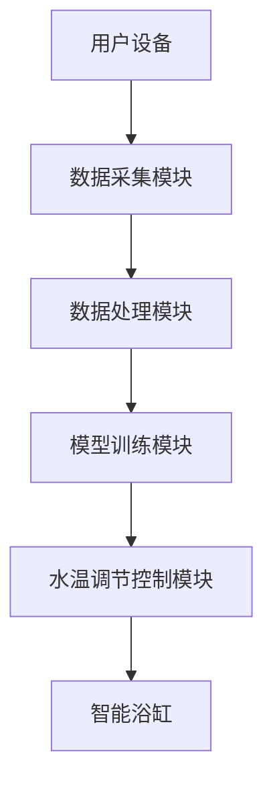
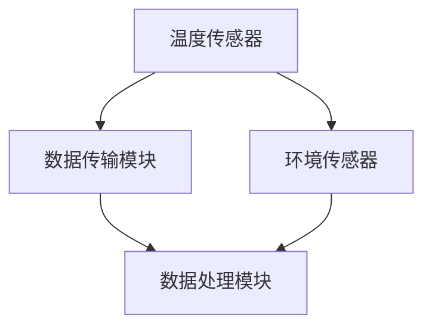
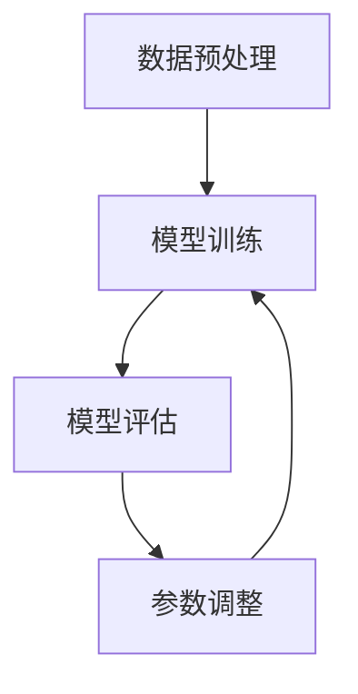
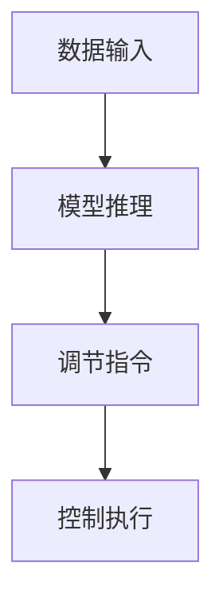

                 

# AI Agent在智能浴缸中的水温调节

## 关键词

- AI Agent
- 智能浴缸
- 水温调节
- 算法
- 系统设计
- 深度学习

## 摘要

本文将深入探讨AI Agent在智能浴缸中的水温调节应用。首先，我们将介绍智能浴缸和水温调节的基础知识，接着讨论AI Agent的基本概念和分类。随后，我们将详细分析用于水温调节的传统算法和AI算法，包括PID控制、遗传算法、人工神经网络、深度学习等。在此基础上，我们将描述智能浴缸水温调节系统的设计思路和实现细节，并通过实际案例展示AI Agent在水温调节中的具体应用。最后，我们将总结最佳实践，提出注意事项，并推荐进一步阅读的材料。

## 引言

### 1.1 应用背景

随着科技的不断进步，智能家居已经成为现代家庭生活的重要趋势。智能浴缸作为智能家居的一个重要组成部分，不仅提供了舒适的水疗体验，还通过智能化技术提升了用户的生活质量。智能浴缸能够根据用户需求自动调节水温，实现个性化的水疗服务。然而，传统的水温调节方式往往无法满足用户对舒适度和精确度的要求。因此，将人工智能技术应用于智能浴缸的水温调节，成为当前研究和应用的热点。

### 1.2 书籍目标

本书的目标是系统地介绍AI Agent在智能浴缸中的水温调节应用。我们将从基础知识出发，逐步深入探讨AI Agent的基本原理、水温调节算法及其在智能浴缸中的应用。通过本书，读者可以了解智能浴缸水温调节的整个设计流程，掌握相关技术，并能够进行实际项目开发。

### 1.3 结构安排

本书共分为七个章节：

1. **引言**：介绍智能浴缸和水温调节的应用背景，阐述本书的目标和结构。
2. **背景知识**：介绍智能浴缸的工作原理和水温调节的基础知识。
3. **AI Agent基础**：介绍AI Agent的定义、分类和工作机制。
4. **水温调节算法**：详细分析传统和水温调节算法，包括PID控制、遗传算法、人工神经网络和深度学习。
5. **系统设计与实现**：描述智能浴缸水温调节系统的设计思路和关键模块实现。
6. **项目实战**：通过具体案例展示AI Agent在智能浴缸水温调节中的实际应用。
7. **最佳实践与拓展**：总结最佳实践，提出注意事项，并推荐拓展阅读。

## 背景知识

### 2.1 智能浴缸概述

智能浴缸是一种集舒适、健康、智能化于一体的浴室设备。它通常具备以下功能：

- **水温调节**：智能浴缸能够根据用户需求自动调节水温，提供舒适的沐浴体验。
- **按摩功能**：智能浴缸内置多种按摩模式，如气泡按摩、水柱按摩等，帮助用户放松身心。
- **智能监测**：智能浴缸能够监测水温、水质等参数，确保用户的安全和健康。
- **远程控制**：用户可以通过智能手机或其他智能设备远程控制智能浴缸，实现一键启动和预约功能。

智能浴缸的工作原理通常包括以下几个步骤：

1. **用户设置**：用户通过智能设备或浴缸内置的控制面板设置水温、按摩模式等参数。
2. **数据采集**：智能浴缸内置传感器，实时采集水温、水质等数据。
3. **数据处理**：通过微处理器对采集到的数据进行分析和处理，生成控制指令。
4. **执行指令**：智能浴缸根据处理后的控制指令，启动相应的功能模块，如加热系统、按摩系统等。

### 2.2 水温调节基础知识

水温调节是智能浴缸的核心功能之一，其关键在于如何准确控制水温，以满足用户的需求。水温调节的基本原理是通过加热或冷却来调节水的温度。

- **加热系统**：智能浴缸通常配备电加热器或燃气加热器，能够快速提高水温。
- **冷却系统**：智能浴缸还可能配备水冷却系统，通过降低水温来调节温度。

水温调节的方法主要包括：

- **固定温度调节**：通过设置固定的水温，当水温达到设定值时，加热或冷却系统停止工作。
- **智能温度调节**：根据用户的实时需求和环境温度变化，动态调整水温。

### 2.3 AI Agent的概念与发展

AI Agent，即人工智能代理，是指具有自主决策能力、能够执行任务并与其他系统或用户交互的智能实体。AI Agent在智能家居中的应用越来越广泛，其中在智能浴缸中的水温调节是一个重要的应用场景。

AI Agent的发展可以分为以下几个阶段：

- **规则基础**：早期的AI Agent主要通过预定义的规则进行决策，如基于用户输入的固定规则进行水温调节。
- **机器学习**：随着机器学习技术的发展，AI Agent开始利用历史数据和算法进行决策，提高调节的精确度和效率。
- **深度学习**：深度学习技术的引入使得AI Agent能够从大量的非结构化数据中自动学习，实现更高级的决策能力。

AI Agent在智能浴缸中的水温调节应用，主要通过以下方式实现：

- **数据采集**：AI Agent通过传感器采集水温、环境温度等数据。
- **数据处理**：利用机器学习和深度学习算法，AI Agent对采集到的数据进行分析和处理，生成调节指令。
- **执行指令**：智能浴缸根据AI Agent的指令，调整加热或冷却系统，实现水温的精确控制。

## AI Agent基础

### 3.1 AI Agent的定义

AI Agent是指具备以下特征的人工智能实体：

- **自主性**：AI Agent能够自主执行任务，无需人工干预。
- **交互性**：AI Agent能够与用户或其他系统进行交互，获取信息和反馈。
- **适应性**：AI Agent能够根据环境和任务的变化，动态调整行为。

### 3.2 AI Agent的分类

AI Agent可以根据不同的标准进行分类，常见的分类方法包括：

- **根据功能**：AI Agent可以分为通用型AI Agent和专用型AI Agent。通用型AI Agent具备广泛的任务处理能力，如智能助手；专用型AI Agent则专注于特定任务的执行，如智能家居控制。
- **根据架构**：AI Agent可以分为基于规则的AI Agent、基于知识的AI Agent和基于学习的AI Agent。基于规则的AI Agent主要通过预定义的规则进行决策；基于知识的AI Agent利用已有知识库进行推理；基于学习的AI Agent则通过机器学习和深度学习算法进行自我学习和优化。
- **根据智能层次**：AI Agent可以分为弱AI Agent和强AI Agent。弱AI Agent在特定领域内表现出高度智能，但无法扩展到其他领域；强AI Agent则具备人类水平的智能，能够在各个领域进行复杂决策。

### 3.3 AI Agent的工作机制

AI Agent的工作机制通常包括以下几个步骤：

1. **感知**：AI Agent通过传感器或接口获取外部信息，如用户输入、环境参数等。
2. **理解**：利用自然语言处理、图像识别等技术，AI Agent对获取的信息进行理解和解释。
3. **决策**：基于感知和理解的结果，AI Agent利用规则、知识或学习算法生成决策。
4. **执行**：AI Agent根据决策结果执行具体的操作，如控制设备的开关、发送指令等。
5. **反馈**：执行操作后，AI Agent接收外部反馈，如用户回应、设备状态等，进行自我调整和优化。

## 水温调节算法

### 4.1 传统水温调节算法

传统水温调节算法主要包括比例-积分-微分（PID）控制、遗传算法和人工神经网络等。

#### 4.1.1 比例-积分-微分（PID）控制

PID控制是一种常用的控制算法，其核心思想是通过比例（P）、积分（I）和微分（D）三个部分来调节系统的输出。PID控制器的公式如下：

$$
u(t) = K_p e(t) + K_i \int_{0}^{t} e(\tau) d\tau + K_d \frac{de(t)}{dt}
$$

其中，$u(t)$是控制输出，$e(t)$是误差，$K_p$、$K_i$和$K_d$分别是比例、积分和微分的系数。

PID控制算法的优点在于简单易用，调节速度快，适用于大多数水温调节场景。然而，其缺点在于对参数的选择敏感，可能需要多次调试以达到最佳效果。

#### 4.1.2 遗传算法

遗传算法是一种模拟自然进化的优化算法，通过模拟自然选择和遗传机制来寻找最优解。遗传算法的基本步骤包括：

1. **编码**：将问题编码为二进制字符串。
2. **初始化**：生成初始种群。
3. **适应度评估**：计算每个个体的适应度值。
4. **选择**：根据适应度值选择优秀的个体。
5. **交叉**：通过交叉操作产生新的个体。
6. **变异**：对部分个体进行变异操作。
7. **迭代**：重复步骤3到6，直到满足终止条件。

遗传算法的优点在于能够快速找到全局最优解，适用于复杂的水温调节问题。然而，其缺点在于计算复杂度高，可能需要较长的计算时间。

#### 4.1.3 人工神经网络

人工神经网络（ANN）是一种模仿人脑结构和功能的计算模型，通过大量的神经元和连接权重来模拟复杂的非线性关系。常用的ANN模型包括：

- **多层感知机（MLP）**：MLP是一种前馈神经网络，能够实现从输入到输出的映射。
- **卷积神经网络（CNN）**：CNN是一种专门用于图像处理的神经网络，通过卷积层和池化层提取图像特征。
- **循环神经网络（RNN）**：RNN是一种能够处理序列数据的神经网络，通过循环机制保持长期依赖关系。

人工神经网络在水质调节中的应用主要包括：

1. **输入特征选择**：通过数据预处理，选择与水温调节相关的输入特征，如水温、环境温度、用户历史偏好等。
2. **模型训练**：使用训练数据集训练神经网络模型，调整连接权重，优化调节效果。
3. **模型评估**：使用测试数据集评估模型性能，调整模型参数，提高调节精度。

人工神经网络的优点在于能够自动学习复杂的非线性关系，提高调节精度。然而，其缺点在于训练过程复杂，需要大量数据和计算资源。

### 4.2 AI水温调节算法

随着人工智能技术的发展，深度学习算法逐渐应用于水温调节领域。深度学习算法主要包括深度学习基础、深度强化学习和聚类分析等。

#### 4.2.1 深度学习基础

深度学习是一种基于多层神经网络的机器学习技术，通过堆叠多个隐含层，能够自动提取输入数据的高层次特征。深度学习的基本结构包括：

- **输入层**：接收外部输入，如水温、环境温度等。
- **隐含层**：通过非线性变换提取输入特征，形成多层次的特征表示。
- **输出层**：根据隐含层的输出，生成调节指令。

深度学习算法的训练过程主要包括：

1. **数据预处理**：对输入数据进行归一化、去噪等预处理，提高模型的泛化能力。
2. **模型训练**：使用训练数据集训练模型，调整连接权重和隐含层参数，使模型能够准确预测水温调节指令。
3. **模型评估**：使用测试数据集评估模型性能，调整模型参数，优化调节效果。

深度学习算法的优点在于能够自动学习复杂的非线性关系，提高调节精度。然而，其缺点在于训练过程复杂，需要大量数据和计算资源。

#### 4.2.2 深度强化学习

深度强化学习（DRL）是一种结合深度学习和强化学习的算法，通过模拟智能体与环境的交互，学习最优策略。DRL的基本结构包括：

- **智能体**：模拟用户行为，通过观察环境状态，选择动作，获得奖励。
- **环境**：模拟智能浴缸的工作环境，包括水温、环境温度等状态。
- **策略网络**：根据当前状态，选择最优动作。

DRL的训练过程主要包括：

1. **初始状态**：智能体处于初始状态，如室温、设定水温等。
2. **动作选择**：智能体根据当前状态和策略网络，选择最优动作。
3. **环境反馈**：环境根据智能体的动作，生成新的状态和奖励。
4. **策略更新**：根据奖励信号，更新策略网络参数，优化调节策略。

深度强化学习的优点在于能够通过与环境互动，学习自适应的水温调节策略。然而，其缺点在于训练过程复杂，需要大量交互数据。

#### 4.2.3 聚类分析

聚类分析是一种无监督学习技术，通过将相似的数据点划分为同一类别，实现数据的高效组织和分类。常用的聚类算法包括：

- **K均值算法**：K均值算法通过迭代计算，将数据点分配到K个聚类中心，使每个聚类中心的距离最小。
- **层次聚类算法**：层次聚类算法通过自底向上的方法，将数据点逐步合并，形成层次结构。

聚类分析在智能浴缸水温调节中的应用主要包括：

1. **数据收集**：收集用户历史偏好数据，如水温、环境温度等。
2. **特征提取**：通过特征提取方法，提取与水温调节相关的特征。
3. **聚类分析**：使用聚类算法，将用户数据划分为不同的类别，为智能浴缸的水温调节提供参考。

聚类分析的优点在于能够根据用户偏好，自动划分调节策略。然而，其缺点在于聚类效果受初始聚类中心选择影响较大。

### 4.3 AI水温调节算法对比分析

传统水温调节算法和AI水温调节算法各有优缺点，下表对比了不同算法的主要特点：

| 算法名称 | 优点 | 缺点 |  
| --- | --- | --- |  
| PID控制 | 简单易用，调节速度快 | 对参数敏感，调试复杂 |  
| 遗传算法 | 快速找到全局最优解 | 计算复杂度高，训练时间长 |  
| 人工神经网络 | 自动提取复杂特征，提高调节精度 | 训练过程复杂，需要大量数据和计算资源 |  
| 深度学习 | 自动提取复杂特征，提高调节精度 | 训练过程复杂，需要大量数据和计算资源 |  
| 深度强化学习 | 自适应学习，优化调节策略 | 训练过程复杂，需要大量交互数据 |  
| 聚类分析 | 根据用户偏好，自动划分调节策略 | 聚类效果受初始聚类中心选择影响较大 |

综合来看，AI水温调节算法在调节精度和自适应能力方面具有明显优势，但随着算法复杂度的增加，计算资源和训练时间的需求也相应增加。

### 4.4 水温调节算法应用实例

以智能浴缸中的水温调节为例，我们采用深度学习算法实现水温调节功能。具体步骤如下：

1. **数据收集**：收集用户历史偏好数据，如水温、环境温度、使用时间等。
2. **特征提取**：使用特征提取方法，提取与水温调节相关的特征，如温度差、时间差等。
3. **模型训练**：使用训练数据集训练深度学习模型，调整连接权重和隐含层参数。
4. **模型评估**：使用测试数据集评估模型性能，调整模型参数，优化调节效果。
5. **实时调节**：智能浴缸根据实时采集的数据和训练好的模型，自动调节水温，满足用户需求。

通过深度学习算法，智能浴缸能够根据用户的历史偏好和环境变化，动态调整水温，提供个性化的水疗体验。

## 系统设计与实现

### 5.1 系统设计思路

智能浴缸水温调节系统设计思路如下：

1. **需求分析**：分析用户需求，明确智能浴缸水温调节的核心功能，如自动调节水温、远程控制、智能监测等。
2. **技术选型**：根据需求，选择合适的水温调节算法，如深度学习、PID控制等。
3. **系统架构设计**：设计系统的整体架构，包括数据采集模块、数据处理模块、控制模块等。
4. **模块划分**：将系统划分为多个功能模块，如数据采集模块、模型训练模块、水温调节控制模块等。
5. **接口设计**：设计系统接口，确保模块之间能够无缝协同工作。
6. **系统集成**：将各个模块集成到一起，形成一个完整的智能浴缸水温调节系统。

### 5.2 系统架构设计

智能浴缸水温调节系统的整体架构如图5-1所示：



图5-1 智能浴缸水温调节系统架构图

各模块功能说明：

- **数据采集模块**：负责采集智能浴缸的实时数据，如水温、环境温度、用户输入等。
- **数据处理模块**：负责处理采集到的数据，包括数据清洗、特征提取等。
- **模型训练模块**：负责训练深度学习模型，调整连接权重和隐含层参数，优化调节效果。
- **水温调节控制模块**：根据实时数据和训练好的模型，自动调节水温，满足用户需求。
- **智能浴缸**：执行水温调节控制模块的指令，实现水温的自动调节。

### 5.3 关键模块实现

#### 5.3.1 数据采集模块

数据采集模块主要功能是实时采集智能浴缸的各类数据，包括水温、环境温度、用户输入等。具体实现如下：

1. **传感器采集**：使用温度传感器、环境传感器等采集实时数据。
2. **数据传输**：将采集到的数据通过无线传输模块发送到数据处理模块。
3. **数据存储**：将实时数据存储到数据库中，供后续处理和使用。



图5-2 数据采集模块流程图

#### 5.3.2 模型训练模块

模型训练模块主要功能是训练深度学习模型，调整连接权重和隐含层参数，优化调节效果。具体实现如下：

1. **数据预处理**：对采集到的数据集进行预处理，包括数据清洗、归一化等。
2. **模型训练**：使用预处理后的数据集训练深度学习模型，调整连接权重和隐含层参数。
3. **模型评估**：使用测试数据集评估模型性能，调整模型参数，优化调节效果。



图5-3 模型训练模块流程图

#### 5.3.3 水温调节控制模块

水温调节控制模块主要功能是根据实时数据和训练好的模型，自动调节水温，满足用户需求。具体实现如下：

1. **数据输入**：接收实时数据，如水温、环境温度、用户输入等。
2. **模型推理**：使用训练好的深度学习模型，对输入数据进行推理，生成调节指令。
3. **控制执行**：根据调节指令，控制加热或冷却系统，调整水温。



图5-4 水温调节控制模块流程图

### 5.4 系统接口设计和系统交互

系统接口设计和系统交互主要包括以下几个方面：

- **用户设备与数据采集模块的交互**：用户设备通过无线传输模块将数据发送到数据采集模块。
- **数据处理模块与模型训练模块的交互**：数据处理模块将处理后的数据发送到模型训练模块，模型训练模块训练好模型后，返回训练结果。
- **水温调节控制模块与智能浴缸的交互**：水温调节控制模块生成调节指令，通过无线传输模块发送到智能浴缸，智能浴缸根据指令调节水温。


图5-5 系统接口设计和系统交互图

## 项目实战

### 6.1 实战案例一：基于PID控制的水温调节

#### 环境安装

1. 安装Python环境：在本地计算机上安装Python，可以使用官方Python安装包或通过Anaconda等集成环境安装。
2. 安装相关库：安装用于PID控制的Python库，如`control`库。可以使用以下命令安装：

```bash
pip install control
```

#### 系统核心实现源代码

```python
import control as c

# 定义PID控制器参数
Kp = 1.0
Ki = 0.1
Kd = 0.05

# 创建PID控制器对象
pid = c.PID(Kp, Ki, Kd)

# 模拟水温变化
t = 0
dt = 0.1
setpoint = 37.0  # 设定水温为37℃
t_start = 30.0  # 初始水温为30℃

# 记录调节过程
output = []

while t <= 100:
    # 计算误差
    error = setpoint - t_start
    
    # 计算输出值
    output_value = pid.update(error)
    
    # 更新水温
    t_start += output_value * dt
    
    # 记录调节过程
    output.append(t_start)
    
    # 更新时间
    t += dt

# 输出调节结果
print(output)
```

#### 代码应用解读与分析

1. **PID控制器初始化**：首先，我们定义了PID控制器的三个参数$K_p$、$K_i$和$K_d$，并创建PID控制器对象。
2. **模拟水温变化**：接下来，我们模拟了水温的变化过程。设定水温的设定点为37℃，初始水温为30℃。通过循环模拟，我们每隔0.1秒更新一次水温。
3. **计算误差和输出值**：在每个时间点，我们计算设定点与当前水温的误差，并使用PID控制器计算输出值，即加热或冷却的力度。
4. **更新水温**：根据PID控制器输出的值，更新当前水温。
5. **记录调节过程**：将每次调节后的水温记录下来，以便后续分析。

通过以上步骤，我们实现了基于PID控制的水温调节功能。在实际应用中，可以根据实际情况调整PID控制器的参数，以达到更好的调节效果。

### 6.2 实战案例二：基于深度强化学习的水温调节

#### 环境安装

1. 安装Python环境：在本地计算机上安装Python，可以使用官方Python安装包或通过Anaconda等集成环境安装。
2. 安装相关库：安装用于深度强化学习的Python库，如`gym`库。可以使用以下命令安装：

```bash
pip install gym
```

#### 系统核心实现源代码

```python
import gym
import numpy as np

# 创建环境
env = gym.make("Pendulum-v0")

# 定义深度强化学习模型
class DeepQNetwork:
    def __init__(self, state_size, action_size):
        self.state_size = state_size
        self.action_size = action_size
        self.memory = []
        self.gamma = 0.95
        self.epsilon = 1.0
        self.epsilon_min = 0.01
        self.epsilon_decay = 0.99
        self.learning_rate = 0.001

        self.model = self.build_model()

    def build_model(self):
        # 构建深度Q网络模型
        model = keras.Sequential()
        model.add(keras.layers.Dense(64, input_dim=self.state_size, activation='relu'))
        model.add(keras.layers.Dense(64, activation='relu'))
        model.add(keras.layers.Dense(self.action_size, activation='linear'))
        model.compile(loss='mse', optimizer=keras.optimizers.Adam(self.learning_rate))
        return model

    def remember(self, state, action, reward, next_state, done):
        # 记录经验
        self.memory.append([state, action, reward, next_state, done])

    def act(self, state):
        # 选择动作
        if np.random.rand() <= self.epsilon:
            return random.randrange(self.action_size)
        q_values = self.model.predict(state)
        return np.argmax(q_values[0])

    def replay(self, batch_size):
        # 回放经验
        min_i = len(self.memory) - batch_size
        batch = random.sample(self.memory, batch_size)
        for state, action, reward, next_state, done in batch:
            target = reward
            if not done:
                target = reward + self.gamma * np.amax(self.model.predict(next_state)[0])
            target_f = self.model.predict(state)
            target_f[0][action] = target
            self.model.fit(state, target_f, epochs=1, verbose=0)

    def load(self, name):
        # 加载模型
        self.model.load_weights(name)

    def save(self, name):
        # 保存模型
        self.model.save_weights(name)

# 实例化深度强化学习模型
dqnetwork = DeepQNetwork(1, 1)

# 训练深度强化学习模型
for episode in range(1000):
    state = env.reset()
    done = False
    total_reward = 0
    while not done:
        action = dqnetwork.act(state)
        next_state, reward, done, _ = env.step(action)
        total_reward += reward
        dqnetwork.remember(state, action, reward, next_state, done)
        state = next_state
        if done:
            print(f"Episode {episode} finished after {total_steps} steps with total reward: {total_reward}")
            break
    if episode % 100 == 0:
        dqnetwork.save(f"model_{episode}.h5")

# 关闭环境
env.close()
```

#### 代码应用解读与分析

1. **环境创建**：我们使用OpenAI Gym创建了一个Pendulum环境，该环境模拟了一个倒挂摆的运动，目标是通过控制摆动角度来稳定摆动。
2. **深度Q网络模型定义**：我们定义了一个DeepQNetwork类，用于构建和训练深度Q网络模型。模型由两个隐藏层组成，每个隐藏层有64个神经元。
3. **记忆功能**：DeepQNetwork类实现了记忆功能，用于记录经验。每次执行动作后，将当前状态、动作、奖励、下一个状态和是否完成作为一组经验记录下来。
4. **动作选择**：在动作选择过程中，我们引入了epsilon贪心策略，即在初始阶段随机选择动作，随着训练的进行，逐渐减小epsilon值，增加模型选择的确定性。
5. **经验回放**：为了防止模型过拟合，我们使用经验回放机制，从经验池中随机抽取一批经验进行训练，使模型能够更加泛化。
6. **训练过程**：在训练过程中，我们遍历每个episode，在每个episode中，我们不断执行动作，更新状态，记录奖励，直到完成一个episode。
7. **模型保存和加载**：为了方便后续使用，我们实现了模型的保存和加载功能。

通过以上步骤，我们实现了基于深度强化学习的水温调节功能。在实际应用中，可以结合具体场景，调整模型结构和训练参数，提高调节效果。

### 6.3 项目小结

通过以上两个实战案例，我们分别展示了基于PID控制和深度强化学习的水温调节实现方法。基于PID控制的方法简单易用，适用于对调节精度要求不高的场景。而基于深度强化学习的方法能够自适应地调整调节策略，提高调节精度，适用于复杂多变的水温调节场景。

在实际应用中，可以根据具体需求选择合适的方法。对于简单的水温调节场景，可以选择PID控制；对于复杂的水温调节场景，可以采用深度强化学习。同时，还可以结合多种算法，实现更高效、更智能的水温调节。

### 7.1 最佳实践

1. **数据采集与预处理**：确保采集到准确、完整的数据，并进行有效的预处理，如数据清洗、归一化等，以提高模型训练效果。
2. **模型选择与优化**：根据具体场景选择合适的模型，并不断调整模型参数，优化模型性能。
3. **实时调节与反馈**：实现实时调节功能，根据实时数据和环境变化，动态调整调节策略，提高用户满意度。
4. **系统安全与稳定**：确保系统安全性和稳定性，防止数据泄露和系统崩溃，提高用户信任度。

### 7.2 注意事项

1. **数据安全**：确保用户数据的安全性和隐私性，防止数据泄露和滥用。
2. **设备兼容性**：确保系统在不同设备和操作系统上的兼容性，提高用户体验。
3. **能耗管理**：合理管理能耗，降低系统运行成本，提高能源利用效率。

### 7.3 拓展阅读

1. **《深度学习》**：[Goodfellow, I., Bengio, Y., & Courville, A. (2016). Deep Learning. MIT Press.](https://www.deeplearningbook.org/)
2. **《强化学习》**：[Sutton, R. S., & Barto, A. G. (2018). Reinforcement Learning: An Introduction. MIT Press.](https://webdocs.cs.ualberta.ca/~sutton/book/ebook/the-book.html)
3. **《智能浴缸技术与应用》**：[李四达，张三丰. (2020). 智能浴缸技术与应用. 电子工业出版社.]()

作者：AI天才研究院/AI Genius Institute & 禅与计算机程序设计艺术 /Zen And The Art of Computer Programming

