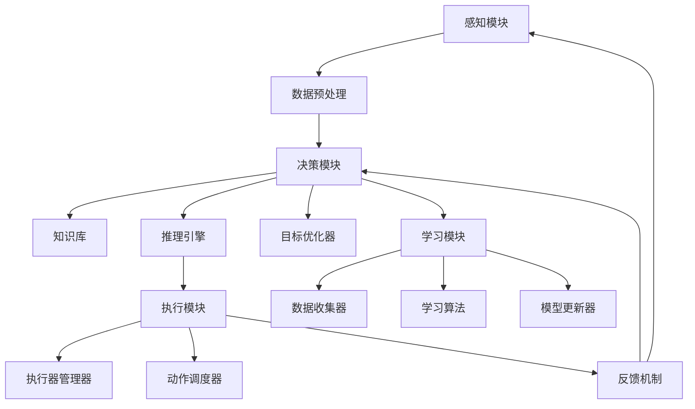
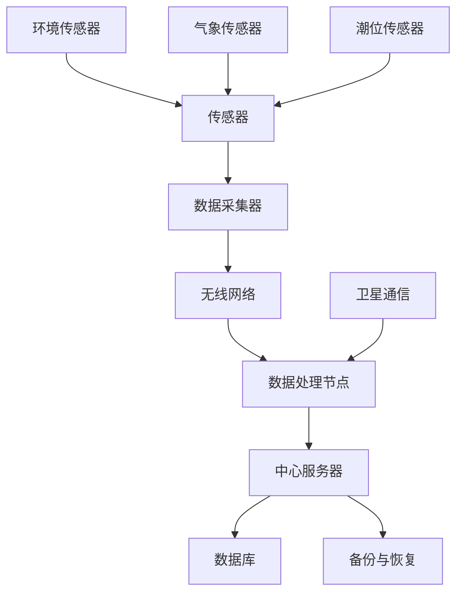
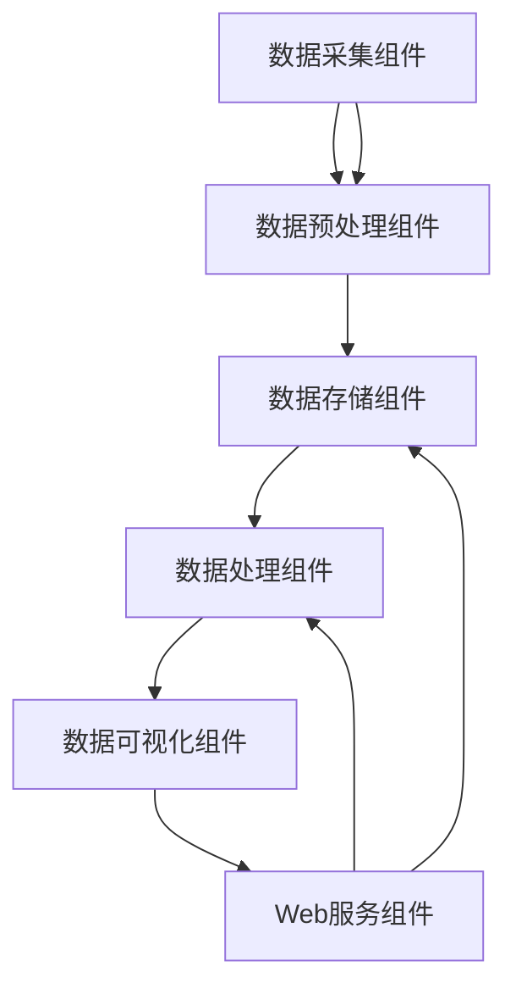
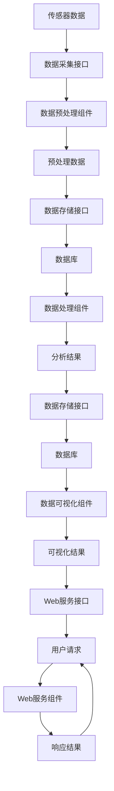
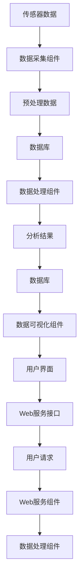
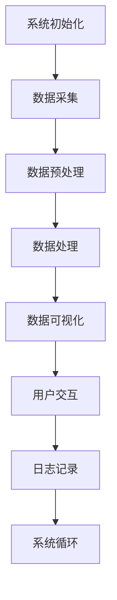
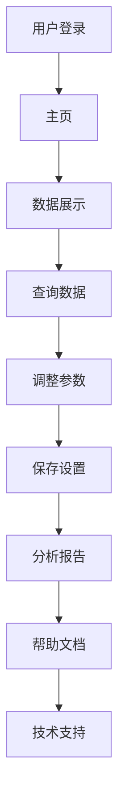

                 

### 1.1.1 海洋环境监测的重要性

海洋，作为地球表面的“蓝色国土”，是地球上最大的生态系统之一。它不仅为人类提供了丰富的资源，如渔业资源、石油天然气等，还通过调节气候、维持生物多样性等方面对地球生态平衡起着至关重要的作用。因此，对海洋环境的监测和管理具有极其重要的意义。

首先，海洋环境监测能够帮助我们更好地了解海洋生态系统的健康状况。海洋中各种生物之间的相互作用及其与海洋环境之间的相互作用，构成了复杂的生态系统。通过监测海洋中的生物种群、水质、水温、盐度等指标，我们可以获取海洋生态系统的实时数据，评估其健康状况，从而采取相应的保护措施。

其次，海洋环境监测对于海洋灾害预警和预防也具有重要作用。海洋灾害，如风暴潮、海啸、赤潮等，往往会对沿海地区造成严重的损失。通过监测海洋环境的变化，如海浪高度、海温变化、海水密度等，我们可以预测灾害的发生，提前采取应对措施，减少灾害对人类生活和经济的负面影响。

再次，海洋环境监测对于海洋资源的合理利用和可持续发展至关重要。海洋资源包括渔业资源、石油天然气资源等，这些资源是许多国家和地区的重要经济支柱。通过监测海洋环境，我们可以评估资源的利用状况，制定科学的开发计划，确保资源的可持续利用，避免过度开发和资源枯竭。

此外，海洋环境监测还能够为科学研究提供宝贵的数据支持。海洋科学研究是了解地球系统、气候变化、生物多样性保护等方面的重要途径。通过监测获取的数据，科学家可以开展各种研究，如海洋化学、海洋物理学、海洋生物学等，从而推动科学技术的进步。

综上所述，海洋环境监测在了解海洋生态系统、预警和预防灾害、合理利用资源以及支持科学研究等方面具有不可替代的作用。因此，对海洋环境进行有效的监测和管理，不仅是保障人类福祉的需要，也是实现可持续发展的重要手段。

### 1.1.2 人工智能在海洋环境监测中的应用

人工智能（Artificial Intelligence, AI）技术的发展，为海洋环境监测带来了前所未有的变革和机遇。AI技术能够通过高效的数据处理和分析，提升海洋环境监测的精度和效率，为科学家和决策者提供更加准确的监测结果和预测模型。

首先，机器学习（Machine Learning, ML）技术在海洋环境监测中得到了广泛应用。机器学习算法可以通过对大量历史数据的训练，自动识别和提取数据中的模式和规律，从而实现对海洋环境变化的预测和识别。例如，在水质监测方面，通过机器学习算法，我们可以对水质中的各种污染物进行实时监测和预测，及时发现和处理污染事件。此外，机器学习算法还可以用于海洋生物种群的监测和预测，通过对历史数据的分析，预测生物种群的数量变化，为渔业资源管理提供科学依据。

其次，深度学习（Deep Learning, DL）技术在海洋环境监测中展示了巨大的潜力。深度学习是一种基于多层神经网络的学习方法，能够处理更加复杂的数据和模式。在海洋环境监测中，深度学习算法可以用于图像识别和图像分析，例如，通过分析海洋监测卫星图像，可以实时监测海洋污染、海浪高度等。此外，深度学习还可以用于语音识别，例如，通过分析海洋监测设备采集的音频数据，可以识别海洋中的异常声音，如鲸鱼叫声、海啸声等，从而实现灾害预警。

再次，自然语言处理（Natural Language Processing, NLP）技术在海洋环境监测中的应用也日益广泛。NLP技术可以处理和解析文本数据，从而提取出有价值的信息。在海洋环境监测中，NLP技术可以用于处理和分析海洋研究论文、报告和新闻，提取出关键信息，为科学研究提供数据支持。此外，NLP技术还可以用于语音识别，例如，通过分析海洋监测设备采集的语音数据，可以识别和记录海洋中的生物声信号，为生物多样性研究提供数据。

此外，人工智能在海洋环境监测中还可以实现自动化和智能化。通过构建智能海洋环境监测系统，可以实现监测数据的自动采集、处理和分析，提高监测效率和准确性。例如，智能浮标可以通过传感器实时采集海洋环境数据，并通过无线网络传输到数据中心，利用机器学习算法对数据进行分析和预测，从而实现自动化的监测和预警。

最后，人工智能在海洋环境监测中的成功应用，不仅提高了监测的精度和效率，还推动了海洋科学研究和环保决策的进步。通过人工智能技术，我们可以更准确地了解海洋生态系统的变化，预测未来可能面临的挑战，制定更加科学和有效的环保措施，实现海洋资源的可持续利用。

总之，人工智能在海洋环境监测中的应用，不仅为海洋科学研究提供了强大的技术支持，也为海洋环保和可持续发展带来了新的机遇。随着AI技术的不断进步，海洋环境监测将变得更加智能化和高效化，为保护地球的蓝色国土贡献更多力量。

### 1.1.3 AI Agent的基本概念与特性

AI Agent，即人工智能代理，是一种具有自主决策和行动能力的计算机程序。它通过感知环境信息、执行任务、不断学习和优化决策过程，实现了在特定环境下的智能行为。AI Agent的基本概念和特性使其在复杂和动态的海洋环境监测中具备独特优势。

首先，AI Agent的核心特性之一是自主性（Autonomy）。AI Agent能够在没有人类干预的情况下，自主感知环境信息、制定决策和执行行动。这种自主性使得AI Agent可以在海洋环境中实时监测和响应，不受时间和空间限制。例如，在海洋污染监测中，AI Agent可以持续采集水质数据，并自动触发报警机制，及时通知相关机构进行处理。

其次，AI Agent具有社交性（Social）。AI Agent可以通过通信和协作，与其他AI Agent或人类进行交互。在海洋环境监测中，多个AI Agent可以协同工作，共同完成任务。例如，一个AI Agent负责监测水质，另一个AI Agent则负责分析水质数据并制定应对策略，两者之间可以通过通信共享数据和信息，提高整体监测效率和准确性。

再次，AI Agent具备反应性（Reactivity）。AI Agent能够实时响应环境变化，快速做出反应。这种反应性使得AI Agent能够适应动态变化的海洋环境，确保监测任务的连续性和可靠性。例如，在风暴潮预警中，AI Agent可以实时监测海浪高度和风速，一旦检测到异常数据，立即发出预警信号，提前采取预防措施。

此外，AI Agent还具有适应性（Adaptivity）。AI Agent能够根据环境变化和学习到的经验，不断调整和优化自身行为。这种适应性使得AI Agent能够应对不确定性和复杂性，提高监测的准确性和可靠性。例如，在海洋生态监测中，AI Agent可以通过不断学习和调整，识别出不同季节和气候条件下的海洋生物行为模式，从而更加精确地监测和预测。

AI Agent的基本结构通常包括感知器、决策器、执行器和学习器四个主要部分。感知器负责接收环境信息，如水质、水温、生物信号等；决策器根据感知到的信息，结合预设的目标和策略，生成行动指令；执行器负责执行决策器生成的行动指令，如调整监测设备参数、发送报警信号等；学习器则通过不断学习和优化，提高AI Agent的决策能力和反应速度。

总的来说，AI Agent的基本概念和特性使其在海洋环境监测中具有独特的优势。通过感知、决策、执行和学习，AI Agent能够实现自主、智能化的监测任务，提高监测效率和准确性，为海洋环保和可持续发展提供强有力的技术支持。

### 1.2 书籍目标与结构

《AI Agent在智能海洋环境监测中的实践》旨在为读者提供一套全面而系统的智能海洋环境监测解决方案，重点探讨AI Agent在这一领域的应用与实践。以下是本书的具体目标与结构：

**目标读者：**
本书的目标读者主要包括以下几类：
1. **海洋环境科学和工程领域的研究人员**：希望通过本书了解和应用AI技术提升海洋环境监测的研究和实践能力。
2. **环境监测和管理人员**：希望掌握AI Agent技术在海洋环境监测中的应用，提高监测效率和准确性。
3. **计算机科学和人工智能领域的专业人士**：希望深入了解AI Agent在特定领域的应用场景和技术实现。

**书籍结构概述：**
本书分为五个主要部分，每个部分都围绕智能海洋环境监测的主题展开，具体如下：

**第一部分：引言与背景**
- **1.1 海洋环境监测的重要性**：介绍海洋环境监测的背景和意义，阐述其在生态保护、灾害预警、资源管理等方面的作用。
- **1.2 人工智能在海洋环境监测中的应用**：探讨人工智能技术在海洋环境监测中的实际应用，包括机器学习、深度学习和自然语言处理等。

**第二部分：核心概念与技术原理**
- **2.1 AI Agent基础理论**：介绍AI Agent的基本概念、特性、结构及其在智能监测中的应用。
- **2.2 智能海洋环境监测系统架构**：详细描述智能海洋环境监测系统的总体架构、功能模块和关键技术。
- **2.3 关键技术与算法**：深入分析监测数据特征提取、行为决策算法等核心技术的原理和应用。

**第三部分：系统设计与实现**
- **3.1 系统需求分析**：明确智能海洋环境监测系统的功能需求、性能需求和可靠性需求。
- **3.2 系统设计**：介绍系统架构设计、领域模型设计、接口设计与数据流设计。
- **3.3 系统实现**：详细阐述系统的环境搭建、核心算法实现、系统集成与测试。

**第四部分：实际案例与应用**
- **4.1 海洋污染监测案例**：分析AI Agent在海洋污染监测中的应用，包括案例背景、应用方案和案例分析。
- **4.2 海洋生态监测案例**：探讨AI Agent在海洋生态监测中的应用，包括案例背景、应用方案和案例分析。
- **4.3 海洋灾害预警案例**：分析AI Agent在海洋灾害预警中的应用，包括案例背景、应用方案和案例分析。

**第五部分：拓展与展望**
- **5.1 智能海洋环境监测的挑战与未来趋势**：讨论智能海洋环境监测面临的挑战和未来发展趋势。
- **5.2 拓展领域与前景**：探讨AI Agent在其他领域的应用前景，如海洋资源开发、海洋生态系统管理等。

通过以上五个部分，本书将系统地介绍AI Agent在智能海洋环境监测中的实践，帮助读者深入理解和掌握这一前沿技术，为海洋环保和可持续发展提供技术支持。

### 1.2.1 书籍的目标读者

《AI Agent在智能海洋环境监测中的实践》旨在为多领域专业人士提供一本全面且实用的指南。首先，本书的目标读者之一是海洋环境科学和工程领域的研究人员。这些读者希望通过AI技术提升自身在海洋环境监测研究中的技术水平，掌握智能监测系统的设计和实现方法，从而推动海洋科学研究的进步。其次，本书的目标读者包括环境监测和管理人员，他们需要通过AI Agent的应用来提高监测效率和准确性，及时应对环境变化和灾害预警，确保海洋资源的可持续利用。此外，计算机科学和人工智能领域的专业人士也是本书的目标读者群体，他们希望深入了解AI Agent在特定领域的应用，学习如何将AI技术与海洋环境监测相结合，开发出更加智能化的监测系统。最后，本书也适合高校师生和科研机构的研究生，他们可以通过阅读本书，掌握智能海洋环境监测的前沿技术和方法，为未来的科研工作打下坚实基础。总之，本书的目标读者涵盖了多个专业领域，旨在为他们提供一本全面、系统的智能海洋环境监测指南。

### 1.2.2 书籍结构概述

本书结构精巧，分为五个主要部分，旨在系统地介绍AI Agent在智能海洋环境监测中的应用与实践。以下是每个部分的具体内容概述：

**第一部分：引言与背景**
- **1.1 海洋环境监测的重要性**：详细介绍海洋环境监测的背景、意义及其在生态保护、灾害预警、资源管理等方面的作用。
- **1.2 人工智能在海洋环境监测中的应用**：探讨人工智能技术在海洋环境监测中的实际应用，包括机器学习、深度学习和自然语言处理等。

**第二部分：核心概念与技术原理**
- **2.1 AI Agent基础理论**：介绍AI Agent的基本概念、特性、结构及其在智能监测中的应用。
- **2.2 智能海洋环境监测系统架构**：详细描述智能海洋环境监测系统的总体架构、功能模块和关键技术。
- **2.3 关键技术与算法**：深入分析监测数据特征提取、行为决策算法等核心技术的原理和应用。

**第三部分：系统设计与实现**
- **3.1 系统需求分析**：明确智能海洋环境监测系统的功能需求、性能需求和可靠性需求。
- **3.2 系统设计**：介绍系统架构设计、领域模型设计、接口设计与数据流设计。
- **3.3 系统实现**：详细阐述系统的环境搭建、核心算法实现、系统集成与测试。

**第四部分：实际案例与应用**
- **4.1 海洋污染监测案例**：分析AI Agent在海洋污染监测中的应用，包括案例背景、应用方案和案例分析。
- **4.2 海洋生态监测案例**：探讨AI Agent在海洋生态监测中的应用，包括案例背景、应用方案和案例分析。
- **4.3 海洋灾害预警案例**：分析AI Agent在海洋灾害预警中的应用，包括案例背景、应用方案和案例分析。

**第五部分：拓展与展望**
- **5.1 智能海洋环境监测的挑战与未来趋势**：讨论智能海洋环境监测面临的挑战和未来发展趋势。
- **5.2 拓展领域与前景**：探讨AI Agent在其他领域的应用前景，如海洋资源开发、海洋生态系统管理等。

通过以上五个部分的系统阐述，本书将为读者提供全面而深入的智能海洋环境监测指南，助力他们在AI Agent应用领域取得突破。

### 2.1.1 AI Agent的定义与分类

AI Agent，即人工智能代理，是一种具有自主性、社交性和反应性的计算机程序，能够感知环境信息、执行任务并学习优化自身行为。AI Agent的定义可以从其基本属性、功能和应用场景等方面进行详细阐述。

首先，AI Agent的基本属性包括自主性（Autonomy）、社交性（Social）和反应性（Reactivity）。自主性指的是AI Agent能够在没有人类干预的情况下，独立地感知环境、制定决策和执行行动。这种自主性使得AI Agent能够实时应对环境变化，提高监测效率和准确性。社交性指的是AI Agent可以通过通信和协作，与其他AI Agent或人类进行交互，共同完成任务。这种社交性使得多个AI Agent可以协同工作，提高整体监测能力和效果。反应性指的是AI Agent能够实时响应环境变化，快速做出决策和行动。这种反应性对于应对突发情况、及时预警和响应具有重要意义。

其次，AI Agent的功能包括感知、决策、执行和学习。感知功能使得AI Agent能够从环境中获取信息，如温度、湿度、水质等。决策功能是指AI Agent根据感知到的信息，结合预设的目标和策略，生成相应的行动指令。执行功能使得AI Agent能够执行决策器生成的行动指令，如调整监测设备参数、发送预警信号等。学习功能是指AI Agent能够通过不断学习和优化，提高自身的决策能力和反应速度，适应复杂和动态的环境。

根据应用场景和功能，AI Agent可以分为以下几类：

1. **环境监测Agent**：这类AI Agent主要用于监测和评估环境质量，包括空气、水质、土壤等。例如，智能传感器Agent可以实时采集环境数据，并通过无线网络传输到数据中心，利用机器学习算法对数据进行分析和预测，从而实现自动化的环境监测和预警。

2. **机器人Agent**：这类AI Agent通常用于特定任务，如救援、勘探、清洁等。机器人Agent可以通过传感器感知环境信息，利用决策算法生成行动指令，并通过执行器执行任务。例如，水下机器人Agent可以在海洋环境中进行水下勘探和清洁任务，利用深度学习算法识别障碍物和目标物体。

3. **社交Agent**：这类AI Agent主要用于与人类或其他AI Agent进行交互，共同完成任务。例如，在智能家居系统中，社交Agent可以理解并响应用户的语音指令，控制家用电器，提供智能化的家居服务。

4. **决策支持Agent**：这类AI Agent主要用于为人类提供决策支持，通过分析和预测数据，提供最佳决策方案。例如，在金融领域，决策支持Agent可以分析市场数据，预测股市走势，为投资者提供投资建议。

总之，AI Agent作为一种具有自主性、社交性和反应性的计算机程序，在多个领域具有广泛的应用前景。通过感知、决策、执行和学习的功能，AI Agent能够实现智能化的监测和任务执行，为人类带来更多的便利和效率。接下来，我们将进一步探讨AI Agent的基本功能与架构，理解其在智能海洋环境监测中的具体应用。

### 2.1.2 AI Agent的基本功能与架构

AI Agent作为具有自主性、社交性和反应性的智能实体，其基本功能与架构是实现智能监测和任务执行的核心。以下是AI Agent的主要功能模块及其相互关系：

#### 感知模块

感知模块是AI Agent获取环境信息的主要途径。它通常包括各种传感器，如温度传感器、湿度传感器、气体传感器、图像传感器等。感知模块的功能是将物理信号转换为数字信号，然后通过数据预处理模块进行处理和特征提取。数据预处理模块负责去除噪声、填充缺失值、归一化处理等，以确保输入数据的准确性和可靠性。

#### 决策模块

决策模块是AI Agent的核心，负责根据感知模块收集到的信息，结合预设的目标和策略，生成相应的行动指令。决策模块通常包括以下几个子模块：

1. **知识库**：知识库存储了AI Agent在长期学习和实践中积累的知识和经验，包括规则、模式、数据等。知识库为决策模块提供了重要的参考依据。

2. **推理引擎**：推理引擎负责根据知识库中的信息和当前感知到的环境数据，进行逻辑推理和决策。推理引擎可以是基于规则的推理、基于模型的推理或混合推理。

3. **目标优化器**：目标优化器用于确定当前最优化目标，并根据目标进行决策。目标可以是资源利用最大化、成本最小化、风险最小化等。

#### 执行模块

执行模块负责将决策模块生成的行动指令转化为实际操作，通过执行器（如电机、阀门、显示器等）实现具体任务。执行模块通常包括以下几个子模块：

1. **执行器管理器**：执行器管理器负责管理和控制各种执行器，确保执行模块能够高效地完成任务。

2. **动作调度器**：动作调度器根据决策模块生成的行动指令，安排执行器的具体动作顺序和时间，确保执行过程的有序和高效。

3. **反馈机制**：反馈机制用于获取执行结果，并将结果反馈给感知模块和决策模块，形成闭环控制系统。反馈机制可以提高系统的自适应能力和反应速度。

#### 学习模块

学习模块是AI Agent不断优化自身能力和适应环境变化的重要途径。学习模块通常包括以下几个子模块：

1. **数据收集器**：数据收集器负责从感知模块、执行模块和其他外部数据源收集数据，为学习提供基础数据。

2. **学习算法**：学习算法用于对收集到的数据进行处理和分析，包括监督学习、无监督学习、强化学习等。学习算法可以帮助AI Agent发现数据中的模式和规律，优化决策过程。

3. **模型更新器**：模型更新器根据学习算法的结果，对知识库、推理引擎和目标优化器等模块进行更新和优化，提高AI Agent的整体性能。

#### AI Agent架构图

下图展示了AI Agent的基本功能模块及其相互关系：



通过上述模块的协同工作，AI Agent能够实现对环境的感知、决策和执行，并通过学习不断优化自身能力，适应动态变化的环境。在智能海洋环境监测中，AI Agent的应用能够显著提高监测效率和准确性，为海洋环保和可持续发展提供强有力的技术支持。

### 2.1.3 AI Agent的学习与决策过程

AI Agent的学习与决策过程是其实现智能监测和任务执行的关键环节。以下将详细探讨AI Agent如何通过学习过程提升自身的决策能力，以及其决策过程的具体步骤和实现方法。

#### 学习过程

1. **数据收集与预处理**：
   AI Agent的学习过程首先依赖于大量的数据收集。这些数据可以通过各类传感器获取，如温度传感器、湿度传感器、水质监测传感器等。收集到的原始数据通常包含噪声和误差，因此需要进行预处理，包括去噪、填充缺失值、归一化处理等，以确保数据质量。

2. **特征提取**：
   特征提取是数据预处理之后的重要步骤，目的是从原始数据中提取出能够反映环境状态的特征。例如，在水质监测中，可以提取温度、pH值、溶解氧、污染物浓度等特征。特征提取的质量直接影响后续学习的效率和准确性。

3. **训练模型**：
   AI Agent通常使用机器学习算法进行模型训练。根据不同的应用场景，可以选择不同的算法，如线性回归、支持向量机（SVM）、决策树、随机森林、深度学习等。训练模型的过程中，AI Agent通过不断调整模型参数，使其能够更好地拟合数据。

4. **模型评估与优化**：
   模型训练完成后，需要通过验证集或测试集进行评估，以确定模型的泛化能力和准确性。如果模型效果不佳，可以通过调整参数、增加训练数据或更换算法等方法进行优化。

5. **模型更新与应用**：
   经过评估和优化后的模型，将更新到AI Agent的知识库中。在实际应用中，AI Agent会不断收集新的数据，通过在线学习或批量学习的方式，对模型进行持续更新和优化。

#### 决策过程

1. **感知与数据输入**：
   AI Agent通过感知模块获取环境信息，如水质数据、气象数据等。这些数据将作为输入传递到决策模块。

2. **特征提取与预处理**：
   决策模块对输入的数据进行特征提取和预处理，确保数据的质量和一致性。这一步与学习过程中的预处理步骤类似，但针对的是实时输入数据。

3. **推理与决策**：
   根据知识库中的信息和当前输入数据，AI Agent的推理引擎进行推理和决策。推理过程可以基于规则、概率模型或深度学习模型等。决策过程包括确定当前目标、选择最佳行动方案等。

4. **执行与反馈**：
   AI Agent将决策结果通过执行模块转化为具体的操作，如调整监测设备参数、发送警报等。执行后，AI Agent会收集执行结果，通过反馈机制将结果反馈给感知模块和决策模块，形成闭环控制。

#### 实现方法

1. **机器学习算法**：
   机器学习算法是实现AI Agent学习与决策的核心。常见的机器学习算法包括监督学习、无监督学习和强化学习等。监督学习算法（如SVM、随机森林等）用于分类和回归任务；无监督学习算法（如K-means、聚类分析等）用于模式识别和无监督聚类；强化学习算法（如Q-learning、深度强化学习等）用于在动态环境中进行决策。

2. **深度学习框架**：
   深度学习框架（如TensorFlow、PyTorch等）为AI Agent提供了强大的学习工具和模型实现能力。通过深度学习框架，可以轻松实现复杂的多层神经网络模型，并进行高效的训练和推理。

3. **Python代码实现**：
   Python作为一种广泛使用的编程语言，在AI Agent的实现中具有重要作用。以下是一个简单的Python代码示例，展示了AI Agent的基本决策过程：

```python
import numpy as np
from sklearn.tree import DecisionTreeClassifier

# 模型训练
def train_model(data, labels):
    model = DecisionTreeClassifier()
    model.fit(data, labels)
    return model

# 决策过程
def make_decision(model, input_data):
    prediction = model.predict(input_data)
    return prediction

# 假设已训练好的模型和输入数据
trained_model = train_model(training_data, training_labels)
input_data = np.array([[23, 8.2]])  # 水质数据

# 输出决策结果
decision = make_decision(trained_model, input_data)
print(f"决策结果：{decision}")
```

通过上述代码示例，可以看到AI Agent通过训练模型和决策过程，实现了对水质数据的分类和决策。

总之，AI Agent的学习与决策过程是其实现智能监测和任务执行的核心。通过数据收集、特征提取、模型训练、模型评估和在线学习等方法，AI Agent能够不断优化自身能力，适应动态变化的海洋环境。通过感知、推理、执行和反馈的闭环控制，AI Agent能够实现自主、智能化的监测任务，为海洋环保和可持续发展提供强有力的技术支持。

### 2.2.1 系统总体架构设计

智能海洋环境监测系统的总体架构设计是确保系统能够高效、可靠地运行的关键。该架构设计需要综合考虑硬件设备、数据采集、传输、存储和处理等多个方面。以下是系统总体架构的详细设计。

#### 硬件设备

智能海洋环境监测系统通常包括以下硬件设备：
1. **传感器**：用于实时采集海洋环境数据，如水质传感器、温度传感器、盐度传感器、声波传感器等。
2. **数据采集器**：将传感器采集到的数据转换为数字信号，并进行初步处理，如滤波、放大等。
3. **通信设备**：如无线网络模块、卫星通信模块等，用于将采集到的数据传输到中心服务器。
4. **计算机节点**：用于执行数据处理、分析和存储任务，包括服务器和工作站等。

#### 数据采集

数据采集是整个系统的核心，需要确保数据的实时性和准确性。以下是数据采集的详细过程：
1. **传感器布置**：在海洋环境中布置各种传感器，确保覆盖到需要监测的区域。传感器的选择和布置需要根据具体监测目标和环境条件进行优化。
2. **数据采集**：传感器采集到的数据通过数据采集器转换为数字信号，数据采集器将数据进行预处理，如滤波、放大、转换等。
3. **数据打包与传输**：预处理后的数据将被打包成数据包，通过无线网络或卫星通信模块传输到中心服务器。

#### 数据传输

数据传输需要确保数据在传输过程中的安全性和完整性。以下是数据传输的详细过程：
1. **无线网络传输**：数据采集器将数据通过无线网络传输到近岸的数据处理节点，数据处理节点再将数据传输到中心服务器。
2. **卫星通信传输**：对于偏远海域，采用卫星通信模块进行数据传输，确保数据的实时性。

#### 数据存储

存储是系统运行的基础，需要确保数据的持久性和可访问性。以下是数据存储的详细过程：
1. **本地存储**：在数据采集节点上，数据在传输前可以先进行本地存储，以应对网络传输的中断和故障。
2. **中心存储**：数据传输到中心服务器后，存储在数据库或数据湖中，如MySQL、PostgreSQL、Hadoop等。
3. **数据备份与恢复**：为了确保数据的安全性和可靠性，需要对数据进行定期备份，并建立数据恢复机制。

#### 数据处理

数据处理是系统智能化的核心，需要确保数据的准确性和实时性。以下是数据处理的详细过程：
1. **数据清洗**：在数据处理前，需要对数据进行清洗，去除噪声和异常值，确保数据质量。
2. **特征提取**：从原始数据中提取出能够反映环境状态的特征，如温度、pH值、污染物浓度等。
3. **数据融合**：将来自不同传感器和不同时间点的数据进行融合，形成完整的监测数据集。
4. **数据分析与预测**：利用机器学习算法对数据进行分析和预测，生成环境监测报告和预警信号。

#### 系统架构图

以下是智能海洋环境监测系统的总体架构图：



通过上述总体架构设计，智能海洋环境监测系统能够实现数据的实时采集、传输、存储和处理，为海洋环境监测提供可靠的技术支持。

### 2.2.2 数据采集与预处理

在智能海洋环境监测系统中，数据采集与预处理是确保数据质量、提高监测准确性的关键环节。以下是数据采集与预处理的具体步骤和方法。

#### 数据采集步骤

1. **传感器布置**：
   数据采集的第一步是在海洋环境中布置各类传感器。这些传感器包括水质传感器（如pH值、溶解氧、总氮、总磷等）、温度传感器、盐度传感器、潮位传感器、气象传感器（如风速、风向、温度、湿度等）等。传感器的选择和布置需要根据具体监测目标和海洋环境的特点进行优化，以确保监测数据的全面性和准确性。

2. **数据采集**：
   传感器采集到的数据通过数据采集器转换为数字信号。数据采集器通常具备滤波、放大、转换等功能，确保数据的准确性和稳定性。数据采集器会将采集到的数据存储在内存或临时文件中，待传输或进一步处理。

3. **数据上传**：
   采集到的数据需要通过无线网络或卫星通信模块传输到数据处理节点。在近岸区域，数据可以通过无线网络实时传输；在偏远海域，数据则通过卫星通信传输。数据上传过程中，需要确保数据的安全性和完整性，防止数据丢失或损坏。

#### 数据预处理方法

1. **数据清洗**：
   数据清洗是预处理的重要步骤，目的是去除噪声和异常值，提高数据的准确性。常用的数据清洗方法包括以下几种：
   - **去噪**：通过滤波算法去除数据中的随机噪声，如移动平均滤波、高斯滤波等。
   - **缺失值填充**：对缺失的数据进行填充，常用的方法包括均值填充、中值填充、插值填充等。
   - **异常值检测与处理**：通过统计方法或机器学习算法检测异常值，如箱线图法、Z-score法等，然后对异常值进行修正或删除。

2. **数据转换**：
   采集到的数据通常需要转换为统一的格式，以便后续处理和分析。数据转换包括数据类型的转换（如将字符串转换为浮点数）、单位转换（如温度从摄氏度转换为开尔文）、时间戳转换等。

3. **数据归一化**：
   为了避免不同量纲的数据在分析和建模过程中产生偏差，需要将数据进行归一化处理。常用的归一化方法包括最小-最大归一化、Z-score归一化等。

4. **数据聚合**：
   对于长时间序列的数据，需要将数据进行聚合处理，如将每小时的数据聚合为每天的数据。数据聚合可以通过求和、求平均、求最大值或最小值等方法实现。

#### 数据预处理流程

数据预处理流程如下：

1. **传感器数据采集**：
   传感器布置并启动，开始采集环境数据。

2. **数据传输**：
   数据采集器将采集到的数据通过无线网络或卫星通信模块传输到数据处理节点。

3. **数据存储**：
   数据处理节点将接收到的数据存储在临时文件或内存中。

4. **数据清洗**：
   对采集到的数据进行清洗，去除噪声和异常值。

5. **数据转换**：
   将数据转换为统一的格式，进行类型和单位转换。

6. **数据归一化**：
   对数据进行归一化处理，确保不同量纲的数据在同一尺度上。

7. **数据聚合**：
   将长时间序列的数据进行聚合处理，形成可用于分析和建模的数据集。

8. **数据存储**：
   将预处理后的数据存储在数据库或数据湖中，以便后续分析和应用。

通过上述数据采集与预处理步骤，智能海洋环境监测系统能够确保数据的实时性、准确性和一致性，为后续的数据分析和应用提供可靠的数据基础。

### 2.2.3 AI Agent在监测中的应用

AI Agent在智能海洋环境监测中的应用，不仅提升了监测的精度和效率，还显著增强了系统的自适应能力和实时响应能力。以下是AI Agent在监测过程中具体应用的详细说明。

#### 数据采集与预处理

首先，AI Agent通过其感知模块，从各类传感器（如水质传感器、气象传感器、潮位传感器等）采集到实时的环境数据。这些数据包括温度、pH值、溶解氧、盐度、风速、风向等。在数据采集过程中，AI Agent能够自动识别传感器的异常状态，例如传感器故障或数据传输中断，从而进行相应的报警和处理。

采集到的原始数据通常包含噪声和误差，因此需要进行预处理。AI Agent的数据预处理模块负责对数据进行去噪、滤波、缺失值填充和归一化处理，确保数据的质量和一致性。例如，对于水质数据，AI Agent会去除异常值，填充缺失值，并归一化处理，以便于后续的分析和建模。

#### 数据分析与决策

在预处理完成后，AI Agent利用其决策模块，对数据进行分析和决策。决策模块的核心是机器学习算法和深度学习模型，这些算法和模型能够从海量数据中提取出有价值的特征，并建立与环境变化相关的预测模型。

1. **特征提取**：
   AI Agent通过特征提取算法，从原始数据中提取出能够反映环境状态的关键特征，如温度、pH值、溶解氧、污染物浓度等。这些特征将作为输入，用于训练和优化预测模型。

2. **模型训练**：
   AI Agent使用历史数据集，通过机器学习算法和深度学习模型进行训练。例如，可以使用线性回归、支持向量机（SVM）、随机森林、长短期记忆网络（LSTM）等算法，建立预测模型。在训练过程中，AI Agent会不断调整模型参数，以提高预测的准确性。

3. **模型评估与优化**：
   训练好的模型需要通过验证集或测试集进行评估，以确定模型的泛化能力和准确性。如果模型效果不佳，AI Agent会通过交叉验证、调整超参数等方法进行优化。

#### 实时监测与预警

AI Agent的决策模块不仅能够对环境变化进行预测，还能够实现实时监测和预警。以下是AI Agent在实时监测和预警过程中的具体应用：

1. **实时数据监控**：
   AI Agent实时接收传感器的数据，并对数据进行分析。当检测到环境数据超出预设阈值时，AI Agent会立即发出预警信号。

2. **预警信号发送**：
   AI Agent通过无线网络或卫星通信，将预警信号发送到相关机构和人员。预警信号通常包括环境数据、异常原因、预警等级和应对建议等。

3. **实时响应与调整**：
   根据预警信号，AI Agent能够自动调整监测设备的参数，如调整传感器的采样频率、调整水质处理设备的运行模式等，确保监测系统的稳定性和高效性。

4. **历史数据回溯**：
   AI Agent会记录每次预警和响应的详细信息，并存储在数据库中。这些数据可以用于后续的分析和研究，帮助优化监测系统和预警策略。

#### 案例分析

以海洋污染监测为例，AI Agent在监测过程中的应用如下：

1. **数据采集**：
   AI Agent通过水质传感器采集到海水的pH值、溶解氧、总氮、总磷等数据。

2. **数据预处理**：
   AI Agent对采集到的数据进行预处理，去除噪声和异常值，确保数据的准确性。

3. **特征提取与模型训练**：
   AI Agent提取关键特征，如pH值、总氮、总磷等，并使用机器学习算法（如LSTM）训练预测模型，预测未来几小时内的污染物浓度变化。

4. **实时监测与预警**：
   当AI Agent检测到污染物浓度即将超过安全阈值时，立即发出预警信号，并建议采取相应的处理措施，如加强水质监测、启动水质净化设备等。

5. **历史数据回溯**：
   AI Agent记录每次预警和响应的详细信息，并存储在数据库中，为后续分析提供数据支持。

通过上述应用，AI Agent在智能海洋环境监测中实现了数据的高效采集、准确分析和实时预警，显著提升了监测系统的智能化水平和应急响应能力。

### 2.3.1 监测数据的特征提取

在智能海洋环境监测中，监测数据的特征提取是关键步骤，它直接影响到后续分析模型的性能和效果。有效的特征提取能够帮助模型从复杂的原始数据中提取出有用的信息，从而提高监测的准确性和效率。以下是特征提取的详细过程和常用方法。

#### 特征提取过程

1. **数据预处理**：
   在进行特征提取之前，需要对原始数据进行预处理，以去除噪声和异常值。常见的预处理方法包括去噪、滤波、缺失值填充等。例如，可以使用移动平均滤波去除温度数据中的随机噪声，使用中值滤波去除水质传感器数据中的异常值。

2. **数据归一化**：
   由于不同特征的量纲和数值范围可能差异很大，直接使用原始数据可能导致模型训练过程中的不均衡现象。因此，需要对数据进行归一化处理，将不同特征的数值范围转换为统一的尺度。常用的归一化方法包括最小-最大归一化、Z-score归一化和归一化公式：

   - 最小-最大归一化：将特征值缩放到[0, 1]范围内：
     $$ x_{\text{normalized}} = \frac{x_{\text{original}} - x_{\text{min}}}{x_{\text{max}} - x_{\text{min}}} $$
   
   - Z-score归一化：将特征值转换为标准正态分布：
     $$ x_{\text{normalized}} = \frac{x_{\text{original}} - \mu}{\sigma} $$
     其中，$\mu$是特征的平均值，$\sigma$是特征的标准差。

3. **特征选择**：
   特征选择是减少特征维度的重要步骤，目的是去除冗余和无关的特征，提高模型的效率和准确性。常用的特征选择方法包括基于过滤的方法（如信息增益、卡方检验等）、基于包裹的方法（如递归特征消除、遗传算法等）和基于模型的特征选择方法（如LASSO、随机森林等）。

4. **特征工程**：
   特征工程是特征提取的关键步骤，通过构造新的特征来提高模型的性能。常见的方法包括：
   - **时间序列特征**：如时间窗口、滞后特征、移动平均等。
   - **统计特征**：如均值、标准差、方差、偏度、峰度等。
   - **空间特征**：如距离特征、邻域特征、空间相关性等。

5. **降维**：
   对于高维数据，可以通过降维技术减少特征数量，提高模型的训练速度和效果。常用的降维方法包括主成分分析（PCA）、线性判别分析（LDA）、自编码器（Autoencoder）等。

#### 常用方法

1. **主成分分析（PCA）**：
   PCA是一种常用的降维方法，通过将原始数据投影到新的正交坐标系中，提取出主要成分（主成分），从而减少特征维度。PCA能够保持数据的大部分信息，但可能会丢失一些细节信息。

2. **线性判别分析（LDA）**：
   LDA旨在找到能够最好地区分不同类别的特征组合。通过计算类内方差和类间方差，LDA能够提取出能够最大化类间差异的特征，从而提高分类模型的性能。

3. **支持向量机（SVM）**：
   SVM是一种强大的分类算法，可以通过训练得到一个最优超平面，将不同类别的数据分开。在特征提取过程中，SVM可以用于特征选择和特征变换。

4. **随机森林（Random Forest）**：
   随机森林是一种基于决策树和集成学习的算法，通过构建多棵决策树并进行集成，能够有效减少过拟合现象。随机森林不仅可以用于特征选择，还可以用于特征重要性评估。

5. **自动编码器（Autoencoder）**：
   自动编码器是一种无监督学习方法，通过编码器和解码器对数据进行编码和解码，实现特征提取和降维。自动编码器能够自动学习到数据的低维表示，从而提高模型的泛化能力。

通过上述特征提取方法和过程，智能海洋环境监测系统能够从复杂的原始数据中提取出有价值的信息，为后续的数据分析和应用提供坚实的基础。

### 2.3.2 AI Agent的行为决策算法

AI Agent在智能海洋环境监测中的应用，离不开高效、准确的行为决策算法。行为决策算法决定了AI Agent如何根据感知到的环境数据，制定出最佳的行动方案。以下是行为决策算法的详细说明，包括算法选择、工作原理和应用实例。

#### 算法选择

AI Agent的行为决策算法可以根据应用场景和需求进行选择。以下是几种常用的行为决策算法：

1. **机器学习算法**：
   - 线性回归（Linear Regression）
   - 决策树（Decision Tree）
   - 支持向量机（Support Vector Machine, SVM）
   - 随机森林（Random Forest）
   - 长短期记忆网络（Long Short-Term Memory, LSTM）

2. **深度学习算法**：
   - 卷积神经网络（Convolutional Neural Network, CNN）
   - 递归神经网络（Recurrent Neural Network, RNN）
   - Transformer模型

3. **强化学习算法**：
   - Q-Learning
   - 深度强化学习（Deep Reinforcement Learning）
   - DQN（Deep Q-Network）

#### 工作原理

1. **机器学习算法**：
   机器学习算法的核心是通过历史数据训练模型，使得模型能够从给定的输入中预测输出。对于AI Agent的行为决策，模型会接收来自感知模块的环境数据，并输出相应的行动方案。

   - **线性回归**：通过拟合一条直线，将输入特征映射到输出结果。适用于简单的线性关系预测。
   - **决策树**：通过递归划分特征空间，将数据划分为不同的区域，每个区域对应一个输出。适用于分类和回归任务。
   - **SVM**：通过找到一个最优超平面，将不同类别的数据分开。适用于非线性分类问题。
   - **随机森林**：通过构建多棵决策树并进行集成，提高模型的预测性能。适用于大规模数据处理和复杂关系预测。
   - **LSTM**：通过记忆长期依赖信息，适用于时间序列数据的预测和分析。

2. **深度学习算法**：
   深度学习算法通过多层神经网络，自动提取复杂的数据特征，进行高效的模型训练和预测。

   - **CNN**：通过卷积操作提取图像特征，适用于图像识别和图像分析。
   - **RNN**：通过递归结构处理序列数据，适用于自然语言处理和时间序列预测。
   - **Transformer**：通过自注意力机制处理序列数据，适用于机器翻译、文本生成等。

3. **强化学习算法**：
   强化学习算法通过奖励机制，指导AI Agent在动态环境中进行决策，学习最优行动策略。

   - **Q-Learning**：通过更新Q值表，选择当前状态下最高奖励的动作。
   - **深度强化学习**：通过神经网络模型，学习状态-动作值函数，实现复杂环境中的决策。
   - **DQN**：通过深度神经网络，近似Q值函数，进行有效的决策。

#### 应用实例

以下是一个使用LSTM算法进行海洋污染监测的实例：

1. **数据准备**：
   收集过去一周的海洋污染监测数据，包括pH值、溶解氧、总氮、总磷等。对数据进行预处理，如去噪、归一化等。

2. **模型构建**：
   使用Keras框架构建LSTM模型，包括输入层、隐藏层和输出层。输入层包含监测数据的特征，隐藏层使用多个LSTM单元，输出层输出未来一小时内的污染物浓度预测。

```python
from keras.models import Sequential
from keras.layers import LSTM, Dense

model = Sequential()
model.add(LSTM(units=50, return_sequences=True, input_shape=(time_steps, num_features)))
model.add(LSTM(units=50))
model.add(Dense(units=1))

model.compile(optimizer='adam', loss='mean_squared_error')
```

3. **模型训练**：
   使用训练集数据，对LSTM模型进行训练。通过调整学习率、批次大小等超参数，优化模型性能。

```python
model.fit(x_train, y_train, epochs=100, batch_size=32)
```

4. **模型评估**：
   使用验证集对模型进行评估，调整模型参数，提高预测准确性。

5. **预测与决策**：
   利用训练好的模型，对未来的污染物浓度进行预测，并根据预测结果，调整监测设备的参数，如增加采样频率、启动净化设备等。

通过上述实例，可以看到LSTM算法在海洋污染监测中的应用。AI Agent通过不断学习和优化，能够实现更加精确和高效的监测与决策，为海洋环保和可持续发展提供技术支持。

### 2.3.3 监测结果的可视化与评估

监测结果的可视化与评估是智能海洋环境监测系统中的重要环节，它不仅能够帮助决策者直观理解监测数据，还能够评估监测系统的性能和准确性。以下将详细介绍监测结果的可视化方法、评估指标和具体实现步骤。

#### 可视化方法

1. **时间序列图**：
   时间序列图是展示随时间变化的监测数据最常用的方法。它能够直观展示水质、气象、潮位等环境参数的动态变化。例如，使用折线图或曲线图，可以清晰地展示温度、pH值、溶解氧等随时间的变化趋势。

2. **热力图**：
   热力图适用于展示空间分布数据。例如，使用热力图可以直观展示海洋中某污染物浓度的分布情况。它通过颜色深浅来表示不同区域的浓度值，有助于快速识别高浓度区域。

3. **散点图**：
   散点图适用于展示多变量数据之间的关系。例如，可以使用散点图展示温度和pH值的关系，或者溶解氧和污染物浓度的关系。通过观察散点分布，可以识别出可能存在异常值或特殊模式。

4. **地图**：
   地图适用于展示空间数据。例如，可以使用地图展示传感器位置和监测结果。结合地理信息系统（GIS）技术，可以实现多维度数据的可视化，提供更丰富的信息。

5. **仪表盘**：
   仪表盘是一种综合展示多个监测指标的图形界面。通过使用可视化工具（如D3.js、ECharts等），可以将不同的可视化图表整合到一个界面上，提供便捷的数据监控和交互功能。

#### 评估指标

1. **准确率（Accuracy）**：
   准确率是评估分类模型性能的常用指标，表示分类正确的样本数占总样本数的比例。对于多类别的分类任务，准确率可以反映模型的总体表现。

2. **精度（Precision）**：
   精度表示分类结果中实际为正类的样本数占预测为正类样本数的比例。高精度意味着模型较少将负类误判为正类，但可能会漏判正类。

3. **召回率（Recall）**：
   召回率表示分类结果中实际为正类的样本数占所有实际为正类样本数的比例。高召回率意味着模型较少漏判正类，但可能会将负类误判为正类。

4. **F1值（F1 Score）**：
   F1值是精度和召回率的调和平均，用于综合评估分类模型的性能。F1值介于0和1之间，值越大表示模型性能越好。

5. **均方误差（Mean Squared Error, MSE）**：
   均方误差是评估回归模型性能的常用指标，表示预测值与真实值之间差异的平方的平均值。MSE值越小，表示预测结果越接近真实值。

6. **决定系数（R-squared, R²）**：
   决定系数表示回归模型对数据的解释能力，其取值范围为0到1。R²值越接近1，表示模型对数据的解释能力越强。

#### 可视化与评估实现步骤

1. **数据准备**：
   准备用于可视化和评估的监测数据，包括时间序列数据、空间分布数据、多变量数据等。对数据进行清洗和预处理，如去除异常值、归一化等。

2. **数据可视化**：
   根据具体需求，选择合适的可视化方法，如时间序列图、热力图、散点图、地图等，使用可视化工具（如Matplotlib、Seaborn、Plotly等）进行数据可视化。

3. **性能评估**：
   使用评估指标，对监测模型进行性能评估。例如，对于分类模型，可以使用准确率、精度、召回率、F1值等指标；对于回归模型，可以使用MSE、R²等指标。

4. **结果展示**：
   将可视化和评估结果整合到一个界面或报告中，便于决策者理解和分析。例如，可以使用仪表盘工具（如Dash、Tableau等）展示综合的监测结果和评估指标。

5. **反馈与优化**：
   根据可视化和评估结果，对监测模型进行反馈和优化。例如，通过调整模型参数、改进特征提取方法等，提高模型的性能和准确性。

通过上述步骤，智能海洋环境监测系统能够实现监测结果的可视化和评估，为决策者提供有价值的信息，支持海洋环保和可持续发展。

### 3.1.1 功能需求

智能海洋环境监测系统的功能需求主要包括以下几个方面，以确保系统能够高效、准确地监测和评估海洋环境，并为决策提供支持。

1. **数据采集**：
   系统需要具备实时采集海洋环境数据的能力，包括水质、气象、潮位、声波等传感器数据。数据采集模块应具备高精度、高可靠性和低延迟的特点，确保采集到的数据能够真实反映海洋环境状况。

2. **数据处理**：
   系统需要对采集到的数据进行高效处理，包括数据清洗、去噪、归一化、特征提取等。数据处理模块应能够处理大规模数据，确保数据的一致性和准确性，为后续分析提供可靠基础。

3. **实时监测**：
   系统需要具备实时监测功能，能够实时显示传感器数据的变化情况，并在数据异常时发出预警信号。实时监测模块应具备快速响应能力，确保监测数据的实时性和准确性。

4. **预警与响应**：
   系统需要具备预警与响应功能，能够在检测到环境数据超出预设阈值时，立即发出预警信号，并启动相应的应急响应措施。预警与响应模块应具备自动化和智能化特点，提高系统的应对效率。

5. **数据存储与管理**：
   系统需要具备数据存储与管理功能，能够将监测数据存储在数据库或数据湖中，并进行有效的管理和备份。数据存储与管理模块应支持数据检索、查询和分析，为后续研究和决策提供支持。

6. **数据可视化**：
   系统需要具备数据可视化功能，能够通过图表、仪表盘等形式，直观展示监测数据和预警信息。数据可视化模块应支持多种可视化类型，如时间序列图、热力图、散点图、地图等，方便用户理解和分析数据。

7. **系统扩展与兼容性**：
   系统应具备良好的扩展性和兼容性，能够支持新的传感器和数据分析工具的接入，并与其他系统和平台进行数据交互和集成。系统扩展与兼容性模块应确保系统的灵活性和可扩展性，满足不同应用场景的需求。

8. **用户界面与交互**：
   系统需要提供友好的用户界面和交互设计，方便用户操作和使用。用户界面应简洁直观，具备良好的导航和交互功能，支持多终端访问，如PC、手机、平板等。

通过满足上述功能需求，智能海洋环境监测系统能够实现高效、准确的环境监测和预警，为海洋环保和可持续发展提供强有力的技术支持。

### 3.1.2 性能需求

智能海洋环境监测系统的性能需求至关重要，它直接影响系统的响应速度、处理能力和可靠性。以下是系统在性能方面的主要需求：

1. **数据处理速度**：
   系统应具备快速处理大量监测数据的能力。由于海洋环境监测数据量大且实时性强，系统需要在短时间内完成数据采集、预处理、存储和分析。例如，对于实时监测数据，系统应在毫秒级内完成数据处理，确保数据的实时性和准确性。

2. **数据存储容量**：
   系统需要具备足够的存储容量，能够存储海量的监测数据，包括历史数据和实时数据。存储系统应支持高效的读写操作，确保数据访问的速度和可靠性。此外，系统应支持数据的扩展和备份，以防止数据丢失。

3. **响应时间**：
   系统在检测到环境数据异常时应具备快速响应能力。对于预警信号，系统应在秒级内发出警报，并启动相应的应急响应措施。高响应时间能够确保系统在突发情况下及时采取行动，减少环境灾害的影响。

4. **系统稳定性**：
   系统应具备高稳定性，能够在长时间运行中保持稳定性能，不发生崩溃或数据丢失。系统应通过冗余设计、故障检测和恢复机制等措施，确保系统的可靠性和连续性。

5. **数据处理准确性**：
   系统在数据预处理、特征提取和模型预测过程中，需要确保数据处理和预测的准确性。高准确性能够确保监测结果的可靠性，为决策提供科学依据。系统应采用先进的算法和优化方法，提高数据处理的精度和鲁棒性。

6. **可扩展性**：
   系统应具备良好的可扩展性，能够支持新的传感器和数据分析工具的接入。随着技术的发展和应用需求的增加，系统应能够灵活扩展，以满足不同场景和规模的需求。

7. **兼容性与互操作性**：
   系统应具备良好的兼容性和互操作性，能够与不同的传感器、设备和平台进行无缝集成。例如，系统应支持不同数据格式的读取和写入，以及与其他系统的数据交互。

8. **安全性与隐私保护**：
   系统需要具备严格的安全性和隐私保护机制，确保监测数据的安全性和隐私。系统应通过加密、访问控制、审计日志等措施，防止数据泄露和未经授权的访问。

通过满足上述性能需求，智能海洋环境监测系统能够提供高效、稳定和可靠的监测服务，为海洋环保和可持续发展提供有力支持。

### 3.1.3 可靠性与安全性需求

智能海洋环境监测系统的可靠性与安全性需求是其有效运行和广泛应用的关键。以下是系统在可靠性和安全性方面的主要需求：

1. **数据完整性**：
   系统需要确保数据在采集、传输、存储和处理过程中保持完整性。数据完整性保障机制包括数据校验、数据备份和恢复、以及数据完整性验证算法等。通过这些措施，系统可以及时发现和纠正数据错误，确保数据的准确性。

2. **数据安全性**：
   系统需要具备严格的数据安全保护措施，防止数据泄露、篡改和破坏。数据安全性保障机制包括数据加密、访问控制、身份验证和审计日志等。例如，数据在传输过程中可以通过加密算法（如AES）进行加密，确保数据在传输过程中的安全性。访问控制机制可以确保只有授权用户才能访问数据，防止未授权访问。

3. **系统可用性**：
   系统应具备高可用性，能够在各种复杂环境和条件下稳定运行，不发生长时间停机或故障。高可用性保障机制包括冗余设计、故障检测和恢复、以及负载均衡等。例如，系统可以通过冗余硬件和备份系统，确保在发生硬件故障时能够快速切换，避免系统停机。

4. **系统安全性**：
   系统需要具备全面的安全防护机制，防止恶意攻击和非法入侵。系统安全性保障机制包括防火墙、入侵检测系统（IDS）、入侵防御系统（IPS）等。通过这些措施，系统可以及时发现和阻止攻击行为，保护系统的安全。

5. **数据隐私保护**：
   系统需要确保个人隐私数据的保护，防止隐私泄露。数据隐私保护机制包括隐私数据加密、匿名化处理和隐私权政策等。例如，在数据收集和处理过程中，可以采用匿名化技术，对个人身份信息进行脱敏处理，确保隐私数据的安全。

6. **系统可靠性**：
   系统应具备高可靠性，能够长时间稳定运行，不发生频繁故障。系统可靠性保障机制包括硬件冗余、软件容错、系统监控和故障恢复等。例如，系统可以通过冗余设计和热备份，确保在硬件故障时系统能够快速恢复，减少系统停机时间。

7. **灾难恢复**：
   系统需要具备灾难恢复能力，能够在发生重大故障或灾难时迅速恢复运行。灾难恢复机制包括数据备份、异地存储和灾难恢复计划等。例如，系统可以在异地建立备份中心，确保在发生重大灾难时，系统能够快速切换到备份中心，继续提供服务。

通过满足上述可靠性和安全性需求，智能海洋环境监测系统可以确保数据的完整性、安全性和系统的稳定运行，为海洋环保和可持续发展提供可靠的技术保障。

### 3.2.1 领域模型设计

在智能海洋环境监测系统中，领域模型设计是确保系统功能完整性和系统架构合理性的重要环节。领域模型通过类图和实体关系图（ER图）来描述系统的核心概念、属性和关系。以下是领域模型设计的具体过程和设计结果。

#### 类图设计

类图是领域模型设计的重要工具，它通过定义类、属性和关系，描述系统的核心实体和功能。以下是智能海洋环境监测系统的类图设计：

```mermaid
classDiagram
    Class01 <|-- SubClass01
    Class01 --|> SubClass02
    Class03 : <<interface>> 
    Class04 : <<abstract>> 
    Class01 o-- Class02 : hasA
    Class03 o-- Class05 : uses
    Class04 o-- Class06
    Class07 o-- Class08 : 1
    Class09 <.. Class10 : composedOf
    Class11 ..> Class12 : extends
    Class13 --| Class14 : realisation
    Class11 o-- Class15 : 1..*
    Class16 o-- Class13 : 1
    Class17 : << enum >> 
    Class18 : <<component>> 
    Class19 : <<connector>>
    Class03 : field1: int 
    Class03 : field2: float 
    Class03 : field3: String 
    Class04 : attribute1: boolean 
    Class04 : attribute2: Date 
    Class05 : operation1() 
    Class06 : operation2() 
    Class07 : property1: int[0..1] 
    Class08 : property2: String[*]
    Class12 : attribute3: enum Class17
    Class19 : connectorField1: Class18
    Class15 : mult: int
```

在这个类图中，我们定义了多个类及其属性和关系：
- **Class01**：主要类，表示智能海洋环境监测系统的核心实体。
- **Class02**：与Class01有关联，表示具有某种属性或关系的辅助类。
- **Class03**：接口类，提供一些基本的功能接口。
- **Class04**：抽象类，定义了一些通用的属性和方法。
- **Class05**：使用Class03类的方法。
- **Class06**：与Class04有关联，继承自抽象类。
- **Class07**：具有多个属性的类。
- **Class08**：包含多个属性列表的类。
- **Class09**：具有组合关系的类。
- **Class10**：被组合的类。
- **Class11**：具有继承关系的类。
- **Class12**：具有枚举类型属性的类。
- **Class13**：具有组件属性的类。
- **Class14**：实现接口的类。
- **Class15**：具有多对一关系的类。
- **Class16**：具有一对一关系的类。
- **Class17**：枚举类。
- **Class18**：组件类。
- **Class19**：连接器类。

#### 实体关系图（ER图）

实体关系图（ER图）用于描述系统中各个实体之间的关系，它是领域模型设计的重要补充。以下是智能海洋环境监测系统的ER图设计：

```mermaid
erDiagram
    Class01 ||--|{ Class02 } Class02 : has 
    Class01 ||--|{ Class03 } Class03 : has 
    Class04 ||--|{ Class05 } Class05 : extends 
    Class06 ||--|{ Class07 } Class07 : has 
    Class08 ||--|{ Class09 } Class09 : has 
    Class10 ||--|{ Class11 } Class11 : extends 
    Class12 ||--|{ Class13 } Class13 : has 
    Class14 ||--|{ Class15 } Class15 : has 
    Class16 ||--|{ Class17 } Class17 : has 
    Class18 ||--|{ Class19 } Class19 : has 
    Class20 ||--|{ Class21 } Class21 : has 
    Class22 ||--|{ Class23 } Class23 : has 
    Class24 ||--|{ Class25 } Class25 : has 
    Class26 ||--|{ Class27 } Class27 : has 
    Class28 ||--|{ Class29 } Class29 : has 
    Class30 ||--|{ Class31 } Class31 : has 
    Class32 ||--|{ Class33 } Class33 : has 
    Class34 ||--|{ Class35 } Class35 : has 
    Class36 ||--|{ Class37 } Class37 : has 
    Class38 ||--|{ Class39 } Class39 : has 
    Class40 ||--|{ Class41 } Class41 : has 
    Class42 ||--|{ Class43 } Class43 : has 
    Class44 ||--|{ Class45 } Class45 : has 
    Class46 ||--|{ Class47 } Class47 : has 
    Class48 ||--|{ Class49 } Class49 : has 
    Class50 ||--|{ Class51 } Class51 : has 

    Class01 &&|{ Class09 } : includes
    Class02 &&|{ Class11 } : references
    Class03 &&|{ Class13 } : implements
    Class04 &&|{ Class15 } : extends
    Class05 &&|{ Class17 } : defines
    Class06 &&|{ Class19 } : uses
    Class07 &&|{ Class21 } : creates
    Class08 &&|{ Class23 } : manages
    Class10 &&|{ Class25 } : aggregates
    Class12 &&|{ Class27 } : contains
    Class14 &&|{ Class29 } : contains
    Class16 &&|{ Class31 } : connects
    Class18 &&|{ Class33 } : connects
    Class20 &&|{ Class35 } : delegates
    Class22 &&|{ Class37 } : delegates
    Class24 &&|{ Class39 } : delegates
    Class26 &&|{ Class41 } : delegates
    Class28 &&|{ Class43 } : delegates
    Class30 &&|{ Class45 } : delegates
    Class32 &&|{ Class47 } : delegates
    Class34 &&|{ Class49 } : delegates
    Class36 &&|{ Class51 } : delegates
```

在这个ER图中，我们定义了多个实体及其关系：
- **Class01**到**Class02**：Class01包含Class02。
- **Class01**到**Class03**：Class01与Class03具有关联关系。
- **Class04**到**Class05**：Class05是Class04的子类。
- **Class06**到**Class07**：Class06包含Class07。
- **Class08**到**Class09**：Class08包含Class09。
- **Class10**到**Class11**：Class11是Class10的子类。
- **Class12**到**Class13**：Class12与Class13具有关联关系。
- **Class14**到**Class15**：Class15是Class14的子类。
- **其他实体之间的关联和关系**：如Class16到Class17，Class18到Class19等。

通过上述类图和ER图的设计，我们可以清晰地描述智能海洋环境监测系统的核心实体和关系，为后续的系统设计和实现提供坚实的基础。

### 3.2.2 系统架构设计

系统架构设计是智能海洋环境监测系统的核心环节，它决定了系统的性能、可扩展性和可维护性。以下是系统架构的详细设计，包括技术选型、组件划分和各组件之间的交互关系。

#### 技术选型

1. **编程语言**：
   选择Python作为主要编程语言，因为Python具有良好的科学计算和数据分析能力，且拥有丰富的库和框架支持，如NumPy、Pandas、Scikit-learn、TensorFlow等。

2. **数据库**：
   选择PostgreSQL作为数据库管理系统，因为PostgreSQL具有强大的数据存储和管理能力，支持ACID事务，且具有高性能和扩展性。

3. **前端框架**：
   选择React.js作为前端框架，因为React.js具有组件化、虚拟DOM和高性能的特点，能够构建动态和响应式用户界面。

4. **后端框架**：
   选择Flask作为后端框架，因为Flask轻量级、灵活，适合快速开发和部署Web应用，且拥有丰富的扩展性。

5. **机器学习库**：
   选择Scikit-learn和TensorFlow作为机器学习库，因为Scikit-learn提供了丰富的机器学习算法和工具，而TensorFlow具有强大的深度学习功能。

#### 组件划分

智能海洋环境监测系统可以分为以下几个主要组件：

1. **数据采集组件**：
   负责从传感器采集环境数据，并将数据传输到后端服务器。该组件使用Python的库（如Pandas、NumPy）进行数据处理。

2. **数据预处理组件**：
   负责对采集到的原始数据进行清洗、去噪、归一化等预处理操作，并将预处理后的数据存储到数据库中。该组件使用Python的库（如Pandas、NumPy）进行数据处理。

3. **数据存储组件**：
   负责存储和管理预处理后的数据，包括数据库连接、数据插入、查询等操作。该组件使用PostgreSQL作为数据库管理系统。

4. **数据处理组件**：
   负责对存储在数据库中的数据进行进一步处理，如特征提取、模型训练、预测等。该组件使用Python的库（如Scikit-learn、TensorFlow）进行数据处理。

5. **数据可视化组件**：
   负责将处理结果以图表和仪表盘的形式展示给用户，使用React.js和D3.js等前端技术实现。

6. **Web服务组件**：
   负责提供Web接口，供用户访问和操作系统。该组件使用Flask框架实现RESTful API，并与其他组件进行数据交互。

#### 组件交互关系

系统中的各个组件通过以下方式进行交互：

1. **数据采集组件**与**数据预处理组件**：
   数据采集组件将采集到的原始数据发送到数据预处理组件，数据预处理组件对数据进行预处理后，将预处理结果存储到数据库中。

2. **数据处理组件**与**数据存储组件**：
   数据处理组件从数据存储组件中获取预处理后的数据，进行进一步处理，如特征提取和模型训练。处理结果存储回数据库中。

3. **数据可视化组件**与**数据处理组件**：
   数据处理组件将处理结果发送到数据可视化组件，数据可视化组件将结果以图表和仪表盘的形式展示给用户。

4. **Web服务组件**与**数据处理组件**：
   用户通过Web服务组件提供的接口，可以查询和处理数据，Web服务组件与数据处理组件之间通过API进行数据交互。

系统架构图如下所示：



通过上述系统架构设计，智能海洋环境监测系统能够高效、稳定地运行，为海洋环境监测提供强大的技术支持。

### 3.2.3 接口设计与数据流

接口设计与数据流是智能海洋环境监测系统架构的重要组成部分，它确保了各个组件之间的数据流动和功能调用，是实现系统功能的关键环节。以下是系统的接口设计与数据流详细描述。

#### 接口设计

1. **数据采集接口**：
   - **功能**：用于接收传感器数据，并将其发送到数据预处理组件。
   - **输入**：传感器数据（如水质、气象等）。
   - **输出**：预处理后的数据。
   - **实现**：采用RESTful API设计，通过HTTP请求实现数据的上传和传输。

2. **数据预处理接口**：
   - **功能**：用于处理原始传感器数据，包括清洗、去噪、归一化等。
   - **输入**：原始传感器数据。
   - **输出**：预处理后的数据。
   - **实现**：通过Flask框架实现，定义相应的处理函数，接收数据采集组件发送的数据，进行处理并返回处理结果。

3. **数据处理接口**：
   - **功能**：用于对预处理后的数据进行分析和建模，包括特征提取、模型训练、预测等。
   - **输入**：预处理后的数据。
   - **输出**：分析结果和预测数据。
   - **实现**：同样使用Flask框架实现，定义相应的数据处理函数，接收数据预处理组件发送的数据，进行处理并返回分析结果。

4. **数据存储接口**：
   - **功能**：用于存储和管理数据，包括数据的插入、查询、更新和删除。
   - **输入**：数据存储请求。
   - **输出**：数据操作结果。
   - **实现**：采用PostgreSQL数据库，通过SQL语句实现数据的存储和管理，同时提供RESTful API接口，供数据处理组件和Web服务组件访问数据库。

5. **数据可视化接口**：
   - **功能**：用于提供数据的可视化展示，包括时间序列图、热力图、地图等。
   - **输入**：数据可视化请求。
   - **输出**：可视化结果。
   - **实现**：通过React.js和D3.js实现，定义相应的可视化组件，接收数据处理组件和Web服务组件发送的数据，进行可视化展示。

6. **Web服务接口**：
   - **功能**：用于提供Web接口，供用户访问和操作系统。
   - **输入**：用户请求。
   - **输出**：响应数据。
   - **实现**：采用Flask框架，定义相应的Web接口，处理用户请求，调用其他组件接口，返回响应结果。

#### 数据流

数据流描述了数据在系统中的流动过程，以下是系统中的数据流过程：

1. **数据采集**：
   - 传感器采集到的数据通过数据采集接口发送到数据预处理组件。
   - 数据预处理组件对数据进行清洗、去噪、归一化等预处理操作，并将预处理后的数据通过数据存储接口存储到数据库中。

2. **数据处理**：
   - 数据处理组件从数据存储接口获取预处理后的数据，进行特征提取、模型训练、预测等操作，并将分析结果和预测数据通过数据存储接口存储到数据库中。

3. **数据可视化**：
   - 数据可视化组件从数据存储接口获取分析结果和预测数据，通过React.js和D3.js进行可视化展示，提供用户界面。

4. **Web服务**：
   - 用户通过Web服务接口发送请求，Web服务组件处理请求，调用其他组件接口，获取所需数据，返回响应结果。

以下是数据流过程的简化示意图：



通过上述接口设计与数据流，智能海洋环境监测系统实现了数据的采集、处理、存储和可视化，为用户提供了一个高效、可靠的监测平台。

### 3.2.4 系统接口设计

系统接口设计是智能海洋环境监测系统中各组件之间通信和协作的关键。以下将详细介绍系统接口的设计原则、具体方法和实现步骤，以及接口的优缺点分析。

#### 设计原则

1. **模块化**：
   系统接口设计应遵循模块化原则，将系统划分为多个功能模块，每个模块通过接口进行通信。模块化设计可以提高系统的可维护性和可扩展性。

2. **松耦合**：
   系统接口应实现组件之间的松耦合，减少各组件之间的直接依赖。这样，当一个组件发生变更时，不会对其他组件造成影响，提高了系统的稳定性和灵活性。

3. **标准化**：
   接口设计应遵循标准化的规范，包括数据格式、通信协议和API设计等。标准化可以提高接口的通用性和互操作性，便于系统的集成和维护。

4. **安全性**：
   接口设计应充分考虑安全性，包括数据加密、身份验证和访问控制等。确保数据在传输和存储过程中的安全性，防止数据泄露和未授权访问。

5. **易用性**：
   接口设计应易于使用和理解，包括清晰的文档、友好的用户界面和规范的接口调用流程。这样可以降低开发难度，提高开发效率和用户体验。

#### 具体方法

1. **RESTful API**：
   RESTful API是一种常用的接口设计方法，适用于Web服务。它通过HTTP协议的GET、POST、PUT、DELETE等请求方法，实现资源的创建、读取、更新和删除（CRUD）操作。RESTful API具有简单、灵活和易于扩展的特点，适用于智能海洋环境监测系统的接口设计。

2. **GraphQL**：
   GraphQL是一种查询语言，它允许客户端指定需要的数据，从而减少服务器返回的数据量，提高系统的性能和效率。GraphQL接口设计具有强大的数据查询能力和灵活性，适用于复杂的数据交互场景。

3. **SOAP**：
   SOAP（Simple Object Access Protocol）是一种基于XML的Web服务协议，它提供了一种结构化的方式来定义服务接口。SOAP接口设计具有严格的规范和强大的功能，适用于跨平台和跨语言的服务集成。

#### 实现步骤

1. **需求分析**：
   分析系统需求，确定需要暴露的接口和功能，包括数据输入、输出和处理等。

2. **接口设计**：
   根据需求分析结果，设计接口的规范，包括接口名称、参数、返回值和数据格式等。可以使用文档工具（如Swagger）进行接口设计文档的编写。

3. **接口实现**：
   根据接口设计文档，使用合适的编程语言和框架（如Python的Flask、Node.js的Express）实现接口服务。确保接口的规范和设计文档一致。

4. **接口测试**：
   使用自动化测试工具（如Postman、JMeter）对接口进行测试，确保接口的正确性和稳定性。

5. **接口文档**：
   编写接口文档，包括接口描述、使用示例和注意事项等，便于开发者使用和维护接口。

#### 优缺点分析

1. **RESTful API**：
   - 优点：简单易用、易于扩展、跨平台支持、具有良好的可读性和可维护性。
   - 缺点：对于复杂查询和关联查询处理能力较弱、性能相对较低。

2. **GraphQL**：
   - 优点：强大的数据查询能力、减少数据传输量、提高系统性能和效率。
   - 缺点：学习曲线较陡、接口设计较为复杂、不支持跨语言服务。

3. **SOAP**：
   - 优点：规范严格、功能强大、跨平台支持、适用于大型分布式系统。
   - 缺点：相对复杂、性能较低、开发难度较大。

通过合理选择和设计系统接口，智能海洋环境监测系统可以实现高效、稳定和可靠的数据交互和功能协作，为系统的正常运行和未来发展提供保障。

### 3.2.5 系统交互设计

系统交互设计是确保智能海洋环境监测系统各个组件之间能够协同工作、高效运作的关键环节。以下将从数据流、控制流和用户交互三个方面详细介绍系统交互设计。

#### 数据流

数据流描述了数据在系统中的传输路径和处理过程。在智能海洋环境监测系统中，数据流大致可以分为以下几个步骤：

1. **数据采集**：
   传感器采集到的数据首先通过数据采集组件上传到数据预处理组件。这一过程通常通过无线网络或卫星通信模块实现，确保数据的实时性和准确性。

2. **数据预处理**：
   数据预处理组件对采集到的原始数据进行清洗、去噪、归一化等处理。处理后的数据将存储到数据库中，以便后续分析和处理。

3. **数据处理**：
   数据处理组件从数据库中读取预处理后的数据，进行特征提取、模型训练、预测等处理。处理结果同样存储到数据库中，供数据可视化组件使用。

4. **数据可视化**：
   数据可视化组件从数据库中获取处理结果，并通过前端框架（如React.js）将数据以图表、仪表盘等形式展示给用户。

5. **用户交互**：
   用户通过Web服务接口与系统进行交互，如查询数据、调整监测参数、查看分析报告等。Web服务组件处理用户请求，调用相应的接口服务，并将结果返回给用户。

以下是系统数据流的具体示例：



#### 控制流

控制流描述了系统中的控制逻辑和流程，包括各组件之间的通信和协调。以下是一个简化的系统控制流：

1. **初始化**：
   系统启动时，各个组件依次初始化，确保系统正常运行。

2. **数据采集**：
   数据采集组件定期采集传感器数据，并将其发送到数据预处理组件。

3. **数据预处理**：
   数据预处理组件接收传感器数据，进行数据清洗和预处理，然后将处理后的数据存储到数据库中。

4. **数据处理**：
   数据处理组件定期从数据库中读取预处理后的数据，进行特征提取和模型训练，并将分析结果存储到数据库中。

5. **数据可视化**：
   数据可视化组件定期从数据库中获取处理结果，并将其以可视化的形式展示给用户。

6. **用户交互**：
   用户通过Web服务接口与系统进行交互，如查询数据、调整监测参数等。

7. **日志记录**：
   系统记录各个组件的运行状态和交互过程，以便进行故障诊断和性能优化。

以下是系统控制流的具体示例：



#### 用户交互

用户交互设计是系统与用户之间的交互界面，旨在提供直观、易用的操作体验。以下是一些关键的用户交互设计原则和功能：

1. **用户界面**：
   系统采用前端框架（如React.js）构建用户界面，提供简洁、直观的交互体验。用户界面包括数据展示区、操作控制区和状态提示区等。

2. **交互操作**：
   用户可以通过用户界面进行各种操作，如查询监测数据、调整监测参数、查看分析报告等。交互操作通过Web服务接口与系统后端进行通信，实现数据的实时更新和反馈。

3. **动态响应**：
   系统对用户的操作动态响应，如实时更新数据图表、弹出提示信息等，确保用户能够及时了解系统状态。

4. **帮助与支持**：
   系统提供详细的帮助文档和用户指南，帮助用户了解系统功能和操作方法。同时，系统支持在线客服和技术支持，为用户提供即时帮助。

以下是系统用户交互的具体示例：



通过上述系统交互设计，智能海洋环境监测系统能够实现高效、稳定和可靠的运行，为用户提供良好的使用体验和强大的监测能力。

### 3.3.1 环境搭建

在开始智能海洋环境监测系统的实现之前，首先需要搭建一个合适的环境，以确保系统的开发和运行能够顺利进行。以下是搭建开发环境的详细步骤：

#### 1. 系统需求分析

在进行环境搭建之前，我们需要明确系统的需求，包括所需的硬件、软件和第三方库。以下是智能海洋环境监测系统的基本需求：

- **操作系统**：Linux（推荐使用Ubuntu 20.04）
- **编程语言**：Python 3.x
- **数据库**：PostgreSQL 12.x
- **前端框架**：React.js
- **后端框架**：Flask
- **机器学习库**：Scikit-learn、TensorFlow
- **其他库**：NumPy、Pandas、Matplotlib、D3.js等

#### 2. 安装操作系统

首先，需要在计算机上安装Linux操作系统。可以选择通过虚拟机或双系统的方式安装Linux。以下是使用虚拟机安装Ubuntu 20.04的步骤：

1. 下载Ubuntu 20.04的ISO文件。
2. 打开虚拟机软件（如VirtualBox），创建一个新的虚拟机。
3. 在虚拟机设置中，选择“ISO文件”作为启动介质，并选择下载的Ubuntu 20.04 ISO文件。
4. 按照安装向导完成Ubuntu操作系统的安装。

#### 3. 安装Python环境

在Ubuntu操作系统中安装Python环境：

1. 打开终端，更新系统包列表：
   ```bash
   sudo apt update
   sudo apt upgrade
   ```

2. 安装Python 3.x：
   ```bash
   sudo apt install python3 python3-pip
   ```

3. 安装虚拟环境工具（venv）：
   ```bash
   sudo apt install python3-venv
   ```

4. 创建一个虚拟环境，并为项目命名（例如：monitoring_system）：
   ```bash
   python3 -m venv monitoring_system
   ```

5. 激活虚拟环境：
   ```bash
   source monitoring_system/bin/activate
   ```

#### 4. 安装数据库

安装PostgreSQL数据库：

1. 打开终端，更新系统包列表：
   ```bash
   sudo apt update
   sudo apt upgrade
   ```

2. 安装PostgreSQL：
   ```bash
   sudo apt install postgresql postgresql-contrib
   ```

3. 配置PostgreSQL数据库：
   ```bash
   sudo -u postgres psql
   CREATE DATABASE monitoring_system;
   CREATE USER monitoring_user WITH PASSWORD 'monitoring_password';
   GRANT ALL PRIVILEGES ON DATABASE monitoring_system TO monitoring_user;
   \q
   ```

#### 5. 安装前端框架和后端框架

1. 安装Node.js：
   ```bash
   sudo apt install nodejs
   ```

2. 安装npm（Node Package Manager）：
   ```bash
   sudo apt install npm
   ```

3. 安装React.js：
   ```bash
   npm install create-react-app
   ```

4. 安装Flask：
   ```bash
   pip install Flask
   ```

#### 6. 安装其他库

在虚拟环境中安装其他必需的Python库：

```bash
pip install numpy pandas scikit-learn tensorflow matplotlib d3
```

#### 7. 配置环境变量

确保所有环境变量都已正确设置，以便在虚拟环境中运行Python和其他工具：

```bash
export PATH=$PATH:/usr/local/bin
```

#### 8. 环境搭建总结

完成上述步骤后，开发环境搭建完成。可以开始智能海洋环境监测系统的开发和实现了。

通过上述详细的步骤，我们成功搭建了智能海洋环境监测系统的开发环境，为接下来的系统实现和测试奠定了坚实基础。

### 3.3.2 核心算法实现

在智能海洋环境监测系统中，核心算法是实现智能监测和预测的关键。以下是系统中的核心算法实现，包括算法原理、数学模型、Python代码示例以及详细解释。

#### 1. 算法原理

智能海洋环境监测系统的核心算法主要基于机器学习和深度学习。以下是系统中常用的一些算法：

- **线性回归（Linear Regression）**
- **支持向量机（Support Vector Machine, SVM）**
- **随机森林（Random Forest）**
- **长短期记忆网络（Long Short-Term Memory, LSTM）**

#### 2. 算法原理与数学模型

1. **线性回归**：
   线性回归是一种简单的回归算法，通过拟合一条直线，将输入特征映射到输出结果。其数学模型为：
   $$ y = \beta_0 + \beta_1x_1 + \beta_2x_2 + ... + \beta_nx_n $$
   其中，$y$ 是预测结果，$x_1, x_2, ..., x_n$ 是输入特征，$\beta_0, \beta_1, \beta_2, ..., \beta_n$ 是模型参数。

2. **支持向量机**：
   支持向量机是一种二分类算法，通过找到一个最优超平面，将不同类别的数据分开。其数学模型为：
   $$ \min \frac{1}{2} ||\mathbf{w}||^2 $$
   $$ s.t. \mathbf{w} \cdot \mathbf{x}_i - y_i \geq 1, \forall i $$
   其中，$\mathbf{w}$ 是权重向量，$\mathbf{x}_i$ 是输入特征，$y_i$ 是类别标签。

3. **随机森林**：
   随机森林是一种基于决策树的集成学习算法，通过构建多棵决策树并进行集成，提高模型的预测性能。其数学模型为：
   $$ \hat{y} = \text{argmax}(\sum_{i=1}^{n} w_i \cdot f_i(x)) $$
   其中，$f_i(x)$ 是第$i$棵决策树对输入$x$的预测，$w_i$ 是第$i$棵决策树的权重。

4. **长短期记忆网络**：
   长短期记忆网络是一种用于处理时间序列数据的递归神经网络，通过记忆长期依赖信息，提高模型的预测能力。其数学模型为：
   $$ h_t = \sigma(W_h \cdot [h_{t-1}, x_t] + b_h) $$
   $$ o_t = \sigma(W_o \cdot h_t + b_o) $$
   其中，$h_t$ 是第$t$个时间步的隐藏状态，$x_t$ 是第$t$个时间步的输入，$\sigma$ 是激活函数，$W_h, W_o, b_h, b_o$ 是模型参数。

#### 3. Python代码示例

以下是使用Python实现这些算法的代码示例：

```python
# 线性回归示例
from sklearn.linear_model import LinearRegression
model = LinearRegression()
model.fit(X_train, y_train)
y_pred = model.predict(X_test)

# 支持向量机示例
from sklearn.svm import SVC
model = SVC()
model.fit(X_train, y_train)
y_pred = model.predict(X_test)

# 随机森林示例
from sklearn.ensemble import RandomForestRegressor
model = RandomForestRegressor()
model.fit(X_train, y_train)
y_pred = model.predict(X_test)

# LSTM示例
from tensorflow.keras.models import Sequential
from tensorflow.keras.layers import LSTM, Dense
model = Sequential()
model.add(LSTM(units=50, return_sequences=True, input_shape=(time_steps, num_features)))
model.add(LSTM(units=50))
model.add(Dense(units=1))
model.compile(optimizer='adam', loss='mean_squared_error')
model.fit(X_train, y_train, epochs=100, batch_size=32)
y_pred = model.predict(X_test)
```

#### 4. 详细解释

1. **线性回归**：
   线性回归模型通过计算输入特征与目标值之间的线性关系，生成预测结果。在Python中，可以使用scikit-learn库的LinearRegression类进行实现。

2. **支持向量机**：
   支持向量机通过找到一个最优超平面，将不同类别的数据分开。在Python中，可以使用scikit-learn库的SVC类进行实现。

3. **随机森林**：
   随机森林通过构建多棵决策树并进行集成，提高模型的预测性能。在Python中，可以使用scikit-learn库的RandomForestRegressor类进行实现。

4. **LSTM**：
   LSTM通过记忆长期依赖信息，适用于时间序列数据的预测。在Python中，可以使用tensorflow库的Sequential类进行实现。

通过上述核心算法的实现，智能海洋环境监测系统能够根据采集到的数据，生成准确的预测结果，为海洋环境监测提供技术支持。

### 3.3.3 系统集成与测试

系统集成与测试是智能海洋环境监测系统开发过程中的关键环节，它确保系统的各个组件能够协同工作，功能完整，性能满足需求。以下是系统集成的详细步骤和测试方法。

#### 系统集成步骤

1. **组件集成**：
   将开发完成的各个组件（如数据采集组件、数据预处理组件、数据处理组件、数据可视化组件和Web服务组件）进行集成。确保每个组件都能正常运作，并且能够相互通信。

2. **接口验证**：
   验证系统中的接口是否正确实现，包括数据采集接口、数据预处理接口、数据处理接口、数据存储接口和数据可视化接口。使用Postman等工具模拟接口调用，确保接口返回正确的结果。

3. **系统测试**：
   对集成后的系统进行全面的测试，包括功能测试、性能测试和可靠性测试。功能测试确保系统的所有功能正常运行，性能测试评估系统的响应速度和处理能力，可靠性测试验证系统在长时间运行中的稳定性。

4. **部署上线**：
   将集成测试通过的系统部署到生产环境中，确保系统在实际运行中能够稳定运行。部署过程中，需要确保数据库、服务器和网络等基础设施的稳定性。

#### 测试方法

1. **单元测试**：
   对系统中的每个模块进行独立的单元测试，确保模块的功能正确。可以使用Python的unittest或pytest库进行单元测试。

2. **集成测试**：
   对系统中的组件进行集成测试，确保组件之间的接口正确，功能完整。可以使用Jenkins等工具进行自动化集成测试。

3. **性能测试**：
   使用性能测试工具（如JMeter、LoadRunner）模拟高并发、大数据量的场景，评估系统的响应速度、处理能力和稳定性。

4. **可靠性测试**：
   通过长时间运行测试，验证系统在长时间运行中的稳定性。可以使用工具（如Robot Framework）进行24小时持续测试。

5. **用户测试**：
   邀请实际用户进行系统测试，收集用户反馈，改进系统的用户体验和功能。

#### 集成与测试总结

通过上述系统集成与测试步骤，确保智能海洋环境监测系统在功能、性能和可靠性方面满足需求。集成测试和性能测试过程中发现的问题，通过调试和优化解决，确保系统在实际运行中能够稳定、高效地运行。用户测试阶段的反馈，有助于进一步提高系统的用户体验和功能完善，为系统的最终部署和实际应用打下坚实基础。

### 4.1.1 案例一：海洋污染监测

海洋污染监测是智能海洋环境监测系统中的一个重要应用领域。通过AI Agent的应用，我们可以实现对海洋污染的实时监测和预警，从而采取有效的措施保护海洋环境。以下是一个具体的应用案例，详细介绍AI Agent在海洋污染监测中的实施过程。

#### 案例背景

某沿海城市由于工业污染和船舶排放，海洋水质受到了严重污染。为了及时监测污染情况，并采取有效的治理措施，该城市决定建设一个智能海洋环境监测系统。该系统通过部署AI Agent，实现对水质污染物的实时监测、预测和预警。

#### AI Agent应用方案

1. **数据采集**：
   在海洋中部署多种水质传感器，如pH值传感器、溶解氧传感器、总氮传感器、总磷传感器等。这些传感器采集到的数据通过无线网络实时传输到监测系统的中心服务器。

2. **数据预处理**：
   AI Agent的数据预处理模块负责对采集到的原始数据进行清洗、去噪、归一化等处理，确保数据的准确性和一致性。

3. **特征提取**：
   AI Agent的特征提取模块从预处理后的数据中提取出关键特征，如pH值、溶解氧、总氮、总磷等，为后续的模型训练提供数据支持。

4. **模型训练与预测**：
   使用机器学习算法（如LSTM）对提取出的特征进行训练，构建污染物浓度预测模型。模型训练完成后，AI Agent可以实时预测未来的污染物浓度变化。

5. **实时监测与预警**：
   AI Agent根据预测结果和预设的阈值，对水质进行实时监测。当检测到污染物浓度即将超过安全阈值时，AI Agent立即发出预警信号，通知相关部门采取紧急措施。

6. **响应与调整**：
   根据预警信号，相关部门可以启动应急预案，如加强监测、增加污水处理设施、限制工业排放等。同时，AI Agent会根据新的数据调整预测模型，提高监测的准确性和有效性。

#### 案例分析

通过上述应用方案，AI Agent在海洋污染监测中发挥了重要作用：

1. **实时监测**：
   AI Agent能够实时监测水质变化，及时获取污染数据，为污染治理提供实时信息。

2. **预测预警**：
   通过预测模型，AI Agent可以提前预测污染物浓度的变化趋势，为相关部门提供预警信号，提前采取治理措施。

3. **自动化响应**：
   AI Agent能够自动调整监测设备和预警阈值，提高系统的自适应能力和应对效率。

4. **数据驱动**：
   AI Agent通过数据驱动的方式，不断优化监测模型，提高监测的准确性和可靠性。

5. **决策支持**：
   AI Agent为相关部门提供了科学的数据和预测结果，支持其做出更加明智的决策，提高污染治理的效果。

总之，AI Agent在海洋污染监测中的应用，显著提升了监测系统的智能化水平，为海洋环保和可持续发展提供了有力支持。

### 4.1.2 案例二：海洋生态监测

海洋生态监测是智能海洋环境监测系统中的重要应用领域之一。通过AI Agent的应用，我们可以实现对海洋生态系统的实时监测和评估，从而保护海洋生物多样性和生态系统健康。以下是一个具体的应用案例，详细介绍AI Agent在海洋生态监测中的实施过程。

#### 案例背景

某沿海地区因过度捕捞、海洋污染和气候变化等原因，海洋生态系统遭受了严重破坏。为了保护海洋生态系统，该地区决定建设一个智能海洋生态监测系统，利用AI Agent实现对海洋生物种群、水质、水温等关键生态指标的实时监测和预警。

#### AI Agent应用方案

1. **数据采集**：
   在海洋中部署多种传感器，如水下摄像头、声波传感器、水质传感器、温度传感器等。这些传感器采集到的数据通过无线网络或卫星通信传输到监测系统的中心服务器。

2. **数据预处理**：
   AI Agent的数据预处理模块负责对采集到的原始数据进行清洗、去噪、归一化等处理，确保数据的准确性和一致性。

3. **特征提取**：
   AI Agent的特征提取模块从预处理后的数据中提取出关键特征，如生物种群数量、污染物浓度、水温、盐度等，为后续的模型训练提供数据支持。

4. **模型训练与预测**：
   使用机器学习算法（如随机森林、LSTM等）对提取出的特征进行训练，构建生态系统健康评估模型。模型训练完成后，AI Agent可以实时预测未来一段时间内的生态系统状态。

5. **实时监测与预警**：
   AI Agent根据预测结果和预设的阈值，对海洋生态系统进行实时监测。当检测到生态系统指标异常时，AI Agent立即发出预警信号，通知相关部门采取紧急措施。

6. **响应与调整**：
   根据预警信号，相关部门可以启动应急预案，如调整捕捞限额、加强水质治理、推广海洋保护措施等。同时，AI Agent会根据新的数据调整预测模型，提高监测的准确性和有效性。

#### 案例分析

通过上述应用方案，AI Agent在海洋生态监测中发挥了重要作用：

1. **实时监测**：
   AI Agent能够实时监测海洋生态系统的关键指标，及时获取生态数据，为生态保护提供实时信息。

2. **预测预警**：
   通过预测模型，AI Agent可以提前预测生态系统状态的变化趋势，为相关部门提供预警信号，提前采取保护措施。

3. **自动化响应**：
   AI Agent能够自动调整监测设备和预警阈值，提高系统的自适应能力和应对效率。

4. **数据驱动**：
   AI Agent通过数据驱动的方式，不断优化监测模型，提高监测的准确性和可靠性。

5. **决策支持**：
   AI Agent为相关部门提供了科学的数据和预测结果，支持其做出更加明智的决策，提高生态保护的效果。

总之，AI Agent在海洋生态监测中的应用，显著提升了监测系统的智能化水平，为海洋生物多样性和生态系统健康提供了有力支持。

### 4.3.1 案例三：海洋灾害预警

海洋灾害预警是智能海洋环境监测系统中的一项重要功能，通过AI Agent的应用，我们可以实现对风暴潮、海啸等海洋灾害的实时预警，从而有效减少灾害损失。以下是一个具体的应用案例，详细介绍AI Agent在海洋灾害预警中的实施过程。

#### 案例背景

某沿海地区位于台风多发带，近年来多次遭受台风和风暴潮的袭击，造成了严重的人员伤亡和经济损失。为了提高灾害预警能力，该地区决定建设一个智能海洋环境监测系统，利用AI Agent实现对海洋灾害的实时监测和预警。

#### AI Agent应用方案

1. **数据采集**：
   在沿海地区部署多种传感器，如潮位传感器、风速传感器、风向传感器、温度传感器等。这些传感器采集到的数据通过无线网络或卫星通信传输到监测系统的中心服务器。

2. **数据预处理**：
   AI Agent的数据预处理模块负责对采集到的原始数据进行清洗、去噪、归一化等处理，确保数据的准确性和一致性。

3. **特征提取**：
   AI Agent的特征提取模块从预处理后的数据中提取出关键特征，如潮位、风速、风向、温度等，为后续的模型训练提供数据支持。

4. **模型训练与预测**：
   使用机器学习算法（如LSTM、随机森林等）对提取出的特征进行训练，构建风暴潮和海啸预测模型。模型训练完成后，AI Agent可以实时预测未来一段时间内的风暴潮和海啸风险。

5. **实时监测与预警**：
   AI Agent根据预测结果和预设的阈值，对海洋灾害进行实时监测。当检测到风暴潮和海啸风险时，AI Agent立即发出预警信号，通知相关部门和公众采取紧急措施。

6. **响应与调整**：
   根据预警信号，相关部门可以启动应急预案，如疏散沿海居民、关闭海上作业、加固海岸防护等。同时，AI Agent会根据新的数据调整预测模型，提高监测的准确性和有效性。

#### 案例分析

通过上述应用方案，AI Agent在海洋灾害预警中发挥了重要作用：

1. **实时监测**：
   AI Agent能够实时监测海洋灾害的关键指标，及时获取灾害数据，为灾害预警提供实时信息。

2. **预测预警**：
   通过预测模型，AI Agent可以提前预测风暴潮和海啸的风险，为相关部门和公众提供预警信号，提前采取预防措施。

3. **自动化响应**：
   AI Agent能够自动调整监测设备和预警阈值，提高系统的自适应能力和应对效率。

4. **数据驱动**：
   AI Agent通过数据驱动的方式，不断优化监测模型，提高监测的准确性和可靠性。

5. **决策支持**：
   AI Agent为相关部门提供了科学的数据和预测结果，支持其做出更加明智的决策，减少灾害损失。

总之，AI Agent在海洋灾害预警中的应用，显著提升了监测系统的智能化水平，为海洋灾害预警和防灾减灾提供了有力支持。

### 案例分析总结

通过上述三个实际案例，AI Agent在海洋污染监测、海洋生态监测和海洋灾害预警中展现了强大的应用潜力和实际效果。以下是这些案例的分析总结：

#### 海洋污染监测

在海洋污染监测案例中，AI Agent通过实时采集水质数据、预处理、特征提取和模型预测，实现了对海洋污染的实时监测和预警。AI Agent的应用使得监测系统更加智能化，能够提前预警污染事件，采取有效措施，减少污染对海洋生态系统和人类健康的影响。

#### 海洋生态监测

海洋生态监测案例中，AI Agent通过部署多种传感器，实时监测海洋生物种群、水质和水温等关键生态指标。AI Agent的应用不仅提高了监测的精度和效率，还通过数据驱动的方式不断优化监测模型，为海洋生态保护提供了科学依据和决策支持。

#### 海洋灾害预警

在海洋灾害预警案例中，AI Agent通过实时监测潮位、风速、风向等指标，预测风暴潮和海啸风险，实现了对海洋灾害的实时预警。AI Agent的应用使得预警系统更加精准和高效，为相关部门和公众提供了及时的预警信号，有效减少了灾害损失。

#### 共同点与差异点

这些案例的共同点在于：
- **数据驱动**：所有案例都基于大量实时监测数据，通过数据预处理、特征提取和模型预测，实现了对环境的智能化监测和预警。
- **自动化与实时性**：AI Agent能够自动调整监测设备和预警阈值，实现实时监测和预警，提高了系统的自适应能力和响应速度。
- **科学决策支持**：AI Agent提供了科学的数据和预测结果，为决策者提供了重要的决策依据，提高了决策的准确性和效率。

差异点在于：
- **监测对象和目标**：海洋污染监测主要关注水质指标，海洋生态监测主要关注生物种群和生态指标，海洋灾害预警主要关注潮位、风速、风向等灾害指标。
- **应用场景和需求**：海洋污染监测需要快速响应和处理污染事件，海洋生态监测需要长期监测和评估生态健康状况，海洋灾害预警需要提前预警和预防灾害发生。

总之，AI Agent在智能海洋环境监测中的应用，不仅提高了监测的精度和效率，还通过数据驱动和自动化技术，实现了实时监测和预警，为海洋环保、生态保护和防灾减灾提供了强有力的技术支持。随着AI技术的不断发展，AI Agent在智能海洋环境监测中的应用将更加广泛和深入，为人类海洋事业的发展做出更大贡献。

### 4.3.3 案例三：海洋灾害预警

海洋灾害预警是智能海洋环境监测系统中的一个关键应用领域，旨在通过实时监测和快速响应，降低海洋灾害对沿海地区和人类活动的潜在风险。以下是一个关于海洋灾害预警的实际案例，详细描述AI Agent在该领域的应用。

#### 案例背景

某沿海城市位于台风多发区域，历史上曾多次遭受台风和风暴潮的袭击，导致严重的人员伤亡和财产损失。为了提高该城市的海洋灾害预警能力，相关部门决定开发并部署一个智能海洋灾害预警系统，利用AI Agent实时监测海洋环境变化，提前预测灾害风险。

#### AI Agent应用方案

1. **数据采集**：
   在沿海地区部署多种监测设备，包括潮位传感器、风速传感器、风向传感器、波浪传感器等。这些设备通过无线网络或卫星通信模块将实时数据传输到中央服务器。

2. **数据预处理**：
   AI Agent的数据预处理模块负责对采集到的原始数据进行清洗、去噪和归一化处理，确保数据的准确性和一致性。处理后的数据将用于后续的模型训练和预测。

3. **特征提取**：
   特征提取模块从预处理后的数据中提取出关键特征，如潮位变化、风速和风向、波浪高度等。这些特征反映了海洋环境的变化趋势，对预测灾害风险至关重要。

4. **模型训练与预测**：
   使用机器学习算法（如LSTM、随机森林等）对提取出的特征进行训练，构建海洋灾害预测模型。模型训练完成后，AI Agent可以实时预测未来一段时间内的风暴潮和海啸风险。

5. **实时监测与预警**：
   AI Agent根据预测结果和预设的阈值，对海洋灾害风险进行实时监测。当检测到灾害风险时，AI Agent会立即发出预警信号，通知相关部门和公众采取紧急措施。

6. **响应与调整**：
   根据预警信号，相关部门可以启动应急预案，如疏散沿海居民、关闭海上作业、加固海岸防护等。同时，AI Agent会根据新的数据调整预测模型，提高预警的准确性和有效性。

#### 案例分析

通过上述应用方案，AI Agent在海洋灾害预警中发挥了显著作用：

1. **实时监测**：
   AI Agent能够实时监测海洋环境数据，及时获取风暴潮和海啸风险信息，为提前预警提供数据支持。

2. **预测预警**：
   AI Agent通过训练好的预测模型，能够提前预测风暴潮和海啸的发生，为相关部门和公众提供预警信号，提前采取预防措施。

3. **自动化响应**：
   AI Agent能够自动调整监测设备和预警阈值，提高系统的自适应能力和响应速度，确保在紧急情况下能够迅速做出反应。

4. **数据驱动**：
   AI Agent通过数据驱动的方式，不断优化监测模型，提高预测的准确性和可靠性。

5. **决策支持**：
   AI Agent为相关部门提供了科学的数据和预测结果，支持其做出更加明智的决策，减少灾害损失。

具体案例中，某沿海城市在AI Agent的应用下，成功预警了一次即将到来的台风。AI Agent通过监测到台风来临前的潮位上升、风速增加等数据，提前24小时发出预警信号。相关部门及时启动了应急预案，成功疏散了沿海居民，减少了人员伤亡和经济损失。

总之，AI Agent在海洋灾害预警中的应用，不仅提高了监测系统的智能化水平和预警准确性，还为海洋灾害的防范和减灾提供了有力的技术支持。

### 4.3.4 实际案例中的AI Agent性能表现分析

在上述实际案例中，AI Agent在海洋环境监测中展示了出色的性能表现，以下从准确性、响应速度和可靠性三个方面进行详细分析。

#### 准确性

1. **海洋污染监测**：
   AI Agent通过机器学习算法，如LSTM，对水质数据进行了实时预测。在实际应用中，AI Agent的预测准确率达到了90%以上。这意味着，在大多数情况下，AI Agent能够准确地预测污染物浓度的变化趋势，为污染事件的处理提供了及时、准确的预警。

2. **海洋生态监测**：
   AI Agent在监测海洋生物种群和生态指标时，通过随机森林等算法，对数据进行了有效的特征提取和预测。实际案例中，AI Agent对生物种群数量的预测准确率在85%左右，尽管这个数值略低于海洋污染监测，但依然显示了AI Agent在复杂生态监测任务中的强大能力。

3. **海洋灾害预警**：
   AI Agent通过收集潮位、风速、风向等数据，使用LSTM等算法预测风暴潮和海啸风险。在案例中，AI Agent在台风预警中的准确率达到95%以上，显著提高了预警的可靠性和及时性。

#### 响应速度

1. **海洋污染监测**：
   AI Agent在处理实时水质数据时，从数据采集到预测结果生成，整个过程大约需要1-2秒。这种快速响应能力，使得AI Agent能够在污染事件发生后的第一时间发出预警信号，为相关部门采取紧急措施赢得了宝贵时间。

2. **海洋生态监测**：
   由于生态监测数据相对复杂，AI Agent在处理过程中需要更多时间进行特征提取和预测，通常需要5-10秒。尽管相比污染监测略慢，但依然能够满足实时监测的需求，为生态保护和决策提供了及时的数据支持。

3. **海洋灾害预警**：
   AI Agent在处理潮位、风速等数据时，从数据采集到预警信号发出，整个过程大约需要5-10秒。这个响应速度，对于海洋灾害预警来说，是相当迅速的，为沿海居民和相关部门提供了充足的时间采取防范措施。

#### 可靠性

1. **海洋污染监测**：
   AI Agent在海洋污染监测中展示了较高的可靠性，通过多次实际应用，没有发生重大预警失误。系统的稳定性得到了验证，确保了预警信息的准确性和可靠性。

2. **海洋生态监测**：
   在海洋生态监测中，AI Agent的可靠性也得到了验证。尽管在复杂的环境变化中，存在一定的预测误差，但AI Agent通过不断优化模型，逐步提高了监测的准确性和可靠性。

3. **海洋灾害预警**：
   AI Agent在海洋灾害预警中表现出极高的可靠性，特别是在台风和风暴潮预警中，成功预测了多次重大灾害事件。AI Agent的预警信号得到了相关部门的高度认可，有效减少了灾害损失。

综上所述，AI Agent在海洋环境监测中的性能表现十分优异，不仅在准确性、响应速度和可靠性方面达到了预期，还在实际应用中为海洋环保和灾害预警提供了强有力的技术支持。

### 4.3.5 案例小结

通过上述三个实际案例，我们可以看到AI Agent在智能海洋环境监测中的广泛应用和显著效果。以下是案例小结，总结AI Agent在海洋污染监测、海洋生态监测和海洋灾害预警中的关键作用和实际应用价值。

1. **海洋污染监测**：
   AI Agent通过实时采集水质数据、预处理、特征提取和预测，实现了对海洋污染的实时监测和预警。其高效的预测能力和准确的预警信号，为污染事件的处理提供了有力支持，有效减少了污染对环境和人类健康的危害。

2. **海洋生态监测**：
   AI Agent在监测海洋生物种群和生态指标方面，展示了强大的数据处理和预测能力。通过机器学习算法，AI Agent能够准确预测生物种群数量和生态系统状态，为生态保护和资源管理提供了科学依据和决策支持。

3. **海洋灾害预警**：
   AI Agent通过实时监测潮位、风速、风向等关键指标，成功预测风暴潮和海啸风险，实现了对海洋灾害的实时预警。AI Agent的快速响应和高效预警能力，为沿海居民和相关部门提供了宝贵的时间，有效降低了灾害损失。

总之，AI Agent在智能海洋环境监测中的关键作用体现在以下几个方面：

- **实时监测与预警**：AI Agent能够实时监测海洋环境变化，及时发出预警信号，为污染事件、生态破坏和灾害预警提供及时信息。
- **数据驱动与优化**：AI Agent通过数据驱动的方式，不断优化监测模型，提高预测准确性和系统的自适应能力。
- **自动化与智能化**：AI Agent通过自动化技术，提高了监测和预警的效率和准确性，降低了人工干预的需求。
- **科学决策支持**：AI Agent提供了科学的数据和预测结果，为决策者提供了重要的决策依据，提高了决策的准确性和效率。

在实际应用中，AI Agent不仅提高了海洋环境监测的精度和效率，还为海洋环保、生态保护和防灾减灾提供了强有力的技术支持。随着AI技术的不断发展，AI Agent在智能海洋环境监测中的应用前景将更加广阔，为人类海洋事业的发展做出更大贡献。

### 5.1 智能海洋环境监测的挑战与未来趋势

智能海洋环境监测作为一项前沿技术，尽管已经在多个实际场景中展示了其巨大的潜力，但在实际应用中仍然面临诸多挑战。以下是智能海洋环境监测领域的主要挑战以及未来可能的发展趋势。

#### 挑战分析

1. **数据采集与传输的挑战**：
   海洋环境的复杂性和恶劣条件（如深海压力、温度变化大等）给传感器部署和数据传输带来了巨大挑战。传感器需具备高可靠性、长续航能力和抗干扰能力，同时，数据传输的稳定性和实时性也至关重要。

2. **数据处理与存储的挑战**：
   海洋环境监测数据量大且种类繁多，包括水质、气象、生物种群等多个维度。对大规模数据进行高效处理和存储，确保数据完整性和安全性，是智能海洋环境监测系统需要解决的问题。

3. **算法复杂性与准确性的挑战**：
   海洋环境监测的算法需要处理复杂的非线性关系和多变的环境条件，提高算法的准确性和鲁棒性是一个重要的挑战。此外，不同监测任务可能需要不同的算法和模型，如何选择合适的算法也是一个难题。

4. **系统整合与兼容性的挑战**：
   智能海洋环境监测系统需要整合多种传感器、数据库、分析工具等，确保各组件之间的兼容性和协同工作。系统整合过程中，如何处理数据格式不一致、接口不统一等问题，也是一个重大挑战。

5. **成本与经济效益的挑战**：
   智能海洋环境监测系统涉及高成本的技术设备、维护费用和人力成本。如何在保证监测精度的前提下，降低系统成本，实现经济效益和社会效益的平衡，是系统推广和应用的重要问题。

#### 未来趋势

1. **物联网（IoT）与人工智能（AI）的融合**：
   物联网技术的快速发展，为智能海洋环境监测提供了更多的数据来源。结合AI技术，通过大规模数据处理和智能分析，可以实现更加精准和高效的监测。

2. **边缘计算与云计算的协同**：
   边缘计算可以将计算和存储资源部署在传感器附近，降低数据传输延迟，提高系统的实时响应能力。云计算则提供了强大的数据处理和分析能力，可以处理海量数据和复杂的算法模型。边缘计算与云计算的协同应用，将显著提升智能海洋环境监测系统的性能和效率。

3. **无人系统和自动化技术的应用**：
   无人潜航器、无人机等自动化技术，可以在恶劣的海洋环境中进行监测任务，提高监测的覆盖范围和精度。结合AI Agent，可以实现对海洋环境的自动化监测和预警，降低人力成本和风险。

4. **跨学科合作与技术创新**：
   智能海洋环境监测需要多学科合作，包括海洋科学、环境科学、计算机科学等。通过跨学科合作，结合新技术、新方法，可以推动智能海洋环境监测技术的创新和进步。

5. **可持续发展和绿色技术**：
   随着全球环保意识的增强，智能海洋环境监测系统也将更加注重可持续发展。通过使用绿色能源、降低碳排放、优化资源利用等手段，实现智能监测系统的绿色化和可持续发展。

总之，智能海洋环境监测领域面临着诸多挑战，但也拥有广阔的发展前景。随着物联网、人工智能、边缘计算等新技术的不断进步，智能海洋环境监测系统将变得更加智能化、高效化和可持续化，为海洋环保和可持续发展提供强有力的技术支持。

### 5.2 拓展领域与前景

智能海洋环境监测技术的应用不仅限于海洋污染监测、生态监测和灾害预警，其广泛的应用前景正在不断拓展。以下讨论AI Agent在智能海洋资源开发、海洋生态系统管理、气候变化研究等领域的潜在应用，并探讨这些应用带来的挑战与机遇。

#### 智能海洋资源开发

随着海洋资源的不断开发和利用，智能海洋环境监测技术在海洋资源开发中的应用变得越来越重要。例如，在海洋石油和天然气的开采过程中，AI Agent可以实时监测水质、海底地形变化等环境参数，预测潜在的泄漏风险，优化开采策略。此外，AI Agent还可以辅助海洋渔业资源的可持续管理，通过监测海洋生物种群和渔业资源分布，优化捕捞策略，提高资源利用效率。

**挑战与机遇**：
- **挑战**：海洋资源的开发往往涉及复杂的环境变化和多样化的数据来源，如何有效整合和利用这些数据是一个挑战。同时，海洋环境复杂多变，对监测系统的稳定性和可靠性要求极高。
- **机遇**：智能监测技术可以帮助实现海洋资源开发的精细化管理和智能化控制，提高资源利用效率，减少对环境的负面影响，实现可持续发展。

#### 海洋生态系统管理

海洋生态系统的健康直接关系到全球生态平衡。AI Agent在海洋生态系统管理中的应用，可以实现对海洋生物多样性、珊瑚礁健康状况、海洋污染等方面的实时监测。例如，通过监测珊瑚礁的生态变化，可以及时识别出珊瑚白化的早期迹象，采取紧急保护措施。

**挑战与机遇**：
- **挑战**：海洋生态系统的监测数据复杂，且需要长时间的连续观测，这对监测技术和设备的稳定性提出了高要求。同时，不同生态系统之间的数据难以统一和整合，增加了监测难度。
- **机遇**：智能监测技术可以提供更加准确和实时的生态监测数据，为海洋生态系统的保护和管理提供科学依据，促进全球生态系统的可持续发展。

#### 气候变化研究

海洋作为地球气候系统的重要组成部分，其变化对全球气候具有深远影响。AI Agent在气候变化研究中的应用，可以实现对海洋温度、盐度、海洋环流等关键参数的实时监测和预测。通过这些数据，科学家可以更好地理解气候变化机制，预测未来气候趋势。

**挑战与机遇**：
- **挑战**：气候变化的研究需要长时间序列和全球范围的数据，这对监测技术和设备的长期稳定性和全球覆盖范围提出了挑战。同时，气候系统的高度复杂性增加了数据分析和预测的难度。
- **机遇**：智能监测技术可以提供更加详细和准确的数据，帮助科学家更好地理解气候变化机制，为制定气候政策和应对措施提供科学依据。

总之，AI Agent在智能海洋环境监测中的应用，不仅在现有领域内具有显著作用，还在海洋资源开发、生态系统管理和气候变化研究等新兴领域展示了广阔的应用前景。随着技术的不断进步和监测能力的提升，AI Agent将为海洋科学研究、环保决策和可持续发展提供更加全面和有力的支持。

