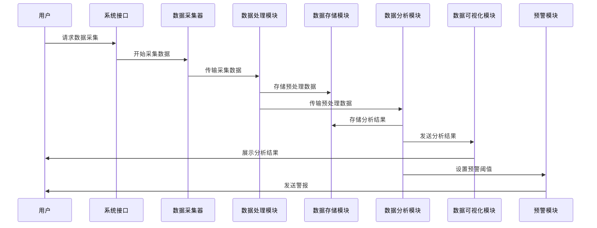

                 

### 文章标题

# AI Agent在智能海洋生态监测中的实践

### 关键词

- AI Agent
- 智能海洋生态监测
- 数据预处理
- 算法原理
- 系统架构设计

### 摘要

本文旨在探讨AI Agent在智能海洋生态监测中的应用与实践。首先，我们介绍了智能海洋生态监测的概念、重要性和应用领域，然后深入探讨了AI Agent的定义、功能及其与传统监测方法的对比。接着，我们详细阐述了AI Agent的基本原理、核心概念及其在智能海洋生态监测中的算法原理。随后，本文从系统分析与架构设计角度，介绍了智能海洋生态监测系统的设计思路。在项目实战部分，我们通过具体案例展示了AI Agent在实际应用中的实现过程。最后，本文总结了AI Agent在智能海洋生态监测中的最佳实践，并对未来发展进行了展望。

## 目录大纲设计

### 第一部分：背景介绍

#### 第1章 AI Agent在智能海洋生态监测中的概述

##### 1.1 智能海洋生态监测的概念

###### 1.1.1 海洋生态监测的定义和重要性

###### 1.1.2 智能海洋生态监测的发展背景

###### 1.1.3 智能海洋生态监测的应用领域

##### 1.2 AI Agent的定义与功能

###### 1.2.1 AI Agent的概念和特点

###### 1.2.2 AI Agent在智能海洋生态监测中的功能

###### 1.2.3 AI Agent与传统监测方法的比较

##### 1.3 本书结构安排

###### 1.3.1 各章节内容和目标

###### 1.3.2 阅读对象和预期收益

### 第二部分：核心概念与联系

#### 第2章 AI Agent的基本原理与核心技术

##### 2.1 AI Agent的基本原理

###### 2.1.1 AI Agent的工作原理

###### 2.1.2 AI Agent的关键技术

##### 2.2 AI Agent的核心概念对比表格

###### 2.2.1 常见AI Agent概念对比

###### 2.2.2 概念属性特征对比

##### 2.3 AI Agent的ER实体关系图

###### 2.3.1 AI Agent的实体定义

###### 2.3.2 实体关系与交互

### 第三部分：算法原理讲解

#### 第3章 智能海洋生态监测中的AI Agent算法原理

##### 3.1 海洋生态数据预处理

###### 3.1.1 数据预处理的重要性

###### 3.1.2 数据预处理算法

###### 3.1.3 实例分析

##### 3.2 海洋生态数据可视化

###### 3.2.1 数据可视化的意义

###### 3.2.2 数据可视化方法

###### 3.2.3 实例分析

##### 3.3 海洋生态数据分析

###### 3.3.1 数据分析的基本概念

###### 3.3.2 数据分析算法

###### 3.3.3 实例分析

### 第四部分：系统分析与架构设计

#### 第4章 智能海洋生态监测系统的设计

##### 4.1 系统需求分析

###### 4.1.1 系统功能需求

###### 4.1.2 系统性能需求

##### 4.2 系统架构设计

###### 4.2.1 系统架构概述

###### 4.2.2 系统组件设计

###### 4.2.3 系统接口设计

##### 4.3 系统交互设计

###### 4.3.1 系统交互流程

###### 4.3.2 系统交互序列图

### 第五部分：项目实战

#### 第5章 智能海洋生态监测项目实战

##### 5.1 环境安装与配置

###### 5.1.1 系统环境准备

###### 5.1.2 系统配置

##### 5.2 系统核心实现

###### 5.2.1 系统核心代码实现

###### 5.2.2 代码解读与分析

##### 5.3 实际案例分析

###### 5.3.1 案例背景

###### 5.3.2 案例分析与讲解

##### 5.4 项目小结

###### 5.4.1 项目总结

###### 5.4.2 项目不足与改进建议

### 第六部分：最佳实践与拓展

#### 第6章 AI Agent在智能海洋生态监测中的最佳实践

##### 6.1 实践案例分享

###### 6.1.1 成功案例分析

###### 6.1.2 失败案例分析

##### 6.2 注意事项与拓展

###### 6.2.1 注意事项

###### 6.2.2 拓展研究方向

### 第7章 总结与展望

##### 7.1 本书主要内容回顾

##### 7.2 AI Agent在智能海洋生态监测中的未来发展趋势

##### 7.3 阅读对象与建议

## 第一部分：背景介绍

### 第1章 AI Agent在智能海洋生态监测中的概述

#### 1.1 智能海洋生态监测的概念

智能海洋生态监测是指利用先进的信息技术，对海洋生态环境进行实时、动态的监测和评估。其核心目标是获取海洋生态系统的关键参数，分析生态系统的健康状况，预测潜在的环境风险，从而为海洋资源的合理开发和环境保护提供科学依据。

##### 1.1.1 海洋生态监测的定义和重要性

海洋生态监测是指对海洋生态环境中的各种生物、非生物因素进行定期的观测、分析和记录。这些因素包括海洋水温、盐度、溶解氧、营养盐、污染物浓度等。海洋生态监测对于保护海洋生物多样性、维护海洋生态平衡具有重要意义。

##### 1.1.2 智能海洋生态监测的发展背景

随着全球气候变化和人类活动的加剧，海洋生态环境面临前所未有的压力。传统的海洋生态监测方法主要依赖于人工观测和现场采样，数据获取效率低、覆盖面有限。而智能海洋生态监测通过引入人工智能技术，可以实现自动化、智能化的监测，提高数据采集和分析的效率。

##### 1.1.3 智能海洋生态监测的应用领域

智能海洋生态监测在多个领域具有广泛的应用前景：

1. **海洋环境保护**：监测海洋污染物的分布和浓度，评估污染对海洋生态系统的影响。
2. **海洋资源管理**：评估海洋生物资源状况，优化渔业资源的开发利用。
3. **海洋灾害预警**：监测海浪、风暴潮等海洋灾害的发生和发展，提前预警。
4. **海洋科学研究**：为海洋生态系统的演变、海洋气候变化等研究提供基础数据。

#### 1.2 AI Agent的定义与功能

AI Agent（人工智能代理）是指一种基于人工智能技术的自主运行实体，能够在特定环境中感知、决策和执行任务。在智能海洋生态监测中，AI Agent具有以下功能和特点：

##### 1.2.1 AI Agent的概念和特点

AI Agent是一种具备一定智能行为的软件实体，具有以下特点：

1. **自主性**：AI Agent能够根据环境变化自主决策，执行任务。
2. **适应性**：AI Agent能够适应不同的监测环境和任务需求。
3. **协作性**：AI Agent可以与其他AI Agent或人类协作，共同完成任务。

##### 1.2.2 AI Agent在智能海洋生态监测中的功能

AI Agent在智能海洋生态监测中主要承担以下功能：

1. **数据采集**：利用传感器和遥感技术，实时采集海洋生态环境数据。
2. **数据分析**：对采集到的数据进行预处理、可视化和分析，提取有用的信息。
3. **决策支持**：根据分析结果，为海洋环境保护和资源管理提供决策支持。
4. **自动控制**：通过控制海洋监测设备，实现对海洋生态系统的实时监测和调控。

##### 1.2.3 AI Agent与传统监测方法的比较

与传统的海洋生态监测方法相比，AI Agent具有以下优势：

1. **高效性**：AI Agent能够实现自动化、高效的数据采集和分析，减少人力成本。
2. **准确性**：AI Agent基于人工智能技术，能够更准确地识别和评估海洋生态系统的状况。
3. **实时性**：AI Agent能够实现对海洋生态系统的实时监测，及时响应环境变化。
4. **协同性**：AI Agent能够与其他监测设备和技术协同工作，提高监测效果。

##### 1.3 本书结构安排

本书共分为六个部分，具体内容安排如下：

1. **第一部分：背景介绍**：介绍智能海洋生态监测和AI Agent的基本概念和重要性。
2. **第二部分：核心概念与联系**：深入探讨AI Agent的基本原理、核心概念及其在智能海洋生态监测中的应用。
3. **第三部分：算法原理讲解**：详细讲解AI Agent在智能海洋生态监测中的算法原理，包括数据预处理、数据可视化和数据分析。
4. **第四部分：系统分析与架构设计**：介绍智能海洋生态监测系统的设计思路，包括系统需求分析、架构设计、接口设计和交互设计。
5. **第五部分：项目实战**：通过具体案例展示AI Agent在智能海洋生态监测中的实现过程。
6. **第六部分：最佳实践与拓展**：分享AI Agent在智能海洋生态监测中的最佳实践，并探讨未来研究方向。

##### 1.3.1 各章节内容和目标

各章节内容和目标如下：

- **第1章**：介绍智能海洋生态监测和AI Agent的基本概念，为后续内容奠定基础。
- **第2章**：探讨AI Agent的基本原理、核心概念及其在智能海洋生态监测中的应用。
- **第3章**：讲解AI Agent在智能海洋生态监测中的算法原理，包括数据预处理、数据可视化和数据分析。
- **第4章**：介绍智能海洋生态监测系统的设计思路，包括系统需求分析、架构设计、接口设计和交互设计。
- **第5章**：通过具体案例展示AI Agent在智能海洋生态监测中的实现过程。
- **第6章**：分享AI Agent在智能海洋生态监测中的最佳实践，并探讨未来研究方向。

##### 1.3.2 阅读对象和预期收益

本书的主要阅读对象包括：

1. **海洋生态监测研究人员**：通过本书，读者可以了解智能海洋生态监测和AI Agent的基本概念和应用，提高对相关领域的研究水平。
2. **人工智能开发者**：本书介绍了AI Agent在智能海洋生态监测中的实现方法和技术，有助于开发者掌握相关技能，应用于实际项目中。
3. **海洋环境保护和资源管理工作者**：本书提供了智能海洋生态监测的最佳实践，有助于读者在实际工作中提高监测效率和决策水平。

通过阅读本书，读者可以：

1. **掌握智能海洋生态监测和AI Agent的基本概念**：理解智能海洋生态监测的目标、方法和技术，了解AI Agent在其中的作用。
2. **了解AI Agent的算法原理**：掌握AI Agent在智能海洋生态监测中的算法原理，包括数据预处理、数据可视化和数据分析。
3. **学习智能海洋生态监测系统的设计方法**：了解智能海洋生态监测系统的设计思路，包括系统需求分析、架构设计、接口设计和交互设计。
4. **提升实际应用能力**：通过具体案例和实践分享，读者可以了解AI Agent在智能海洋生态监测中的应用方法，提高实际应用能力。

## 第二部分：核心概念与联系

### 第2章 AI Agent的基本原理与核心技术

AI Agent（人工智能代理）是智能海洋生态监测的核心技术之一。本章将深入探讨AI Agent的基本原理、核心概念及其在智能海洋生态监测中的应用。

#### 2.1 AI Agent的基本原理

AI Agent是一种具备一定智能行为的软件实体，能够在特定环境中感知、决策和执行任务。其基本原理可以概括为以下几个步骤：

1. **感知**：AI Agent通过传感器或其他数据采集设备获取环境信息，如海洋温度、盐度、溶解氧、营养盐等。
2. **决策**：AI Agent根据感知到的信息，利用人工智能算法进行数据分析和处理，生成决策。
3. **执行**：AI Agent根据决策结果，控制监测设备或执行特定操作，如调整监测参数、发送警报等。

##### 2.1.1 AI Agent的工作原理

AI Agent的工作原理可以分为以下几个环节：

1. **数据采集**：AI Agent通过传感器和遥感技术，实时采集海洋生态环境数据。
2. **数据处理**：AI Agent对采集到的数据进行预处理、存储和分类，为后续分析提供基础。
3. **数据分析**：AI Agent利用机器学习和数据挖掘技术，对预处理后的数据进行分析，提取有用信息。
4. **决策生成**：AI Agent根据分析结果，利用决策算法生成具体的决策。
5. **执行操作**：AI Agent根据决策结果，控制监测设备或执行特定操作，实现对海洋生态系统的实时监测和调控。

##### 2.1.2 AI Agent的关键技术

AI Agent的关键技术包括：

1. **传感器技术**：传感器技术是AI Agent获取环境信息的重要手段。海洋传感器可以测量水温、盐度、溶解氧、营养盐等参数。
2. **数据预处理技术**：数据预处理是数据分析和挖掘的基础。AI Agent需要利用数据清洗、去噪、归一化等技术，对采集到的数据进行处理。
3. **机器学习技术**：机器学习技术是AI Agent实现智能分析的核心。通过训练模型，AI Agent可以学会从数据中提取有用信息。
4. **数据挖掘技术**：数据挖掘技术是AI Agent发现数据中隐藏的规律和模式的重要手段。通过关联规则挖掘、聚类分析、分类分析等方法，AI Agent可以实现对海洋生态系统的深入分析。
5. **决策算法**：决策算法是AI Agent实现自主决策的核心。AI Agent需要利用决策算法，根据分析结果生成具体的决策。

#### 2.2 AI Agent的核心概念对比表格

为了更好地理解AI Agent的核心概念，下面列出了一些常见的AI Agent概念及其属性特征对比表格：

| 概念         | 定义                                                         | 属性特征对比                                     |
| ------------ | ------------------------------------------------------------ | -------------------------------------------- |
| 感知         | AI Agent获取环境信息的过程                                       | 数据来源、传感器类型、数据处理能力                   |
| 决策         | AI Agent根据感知信息生成决策的过程                               | 决策算法、决策模型、决策目标                         |
| 执行         | AI Agent根据决策结果执行特定操作的过程                             | 操作指令、执行方式、反馈机制                         |
| 数据采集     | AI Agent获取环境数据的过程                                       | 数据类型、数据量、采集频率                           |
| 数据预处理   | AI Agent对采集到的数据进行处理的过程                               | 数据清洗、去噪、归一化、特征提取                       |
| 数据分析     | AI Agent对预处理后的数据进行分析的过程                             | 机器学习、数据挖掘、模式识别                           |
| 决策支持     | AI Agent为人类或系统提供决策支持的过程                             | 分析结果、决策建议、可视化展示                         |

#### 2.3 AI Agent的ER实体关系图

为了更好地理解AI Agent的实体关系，下面给出了一个ER实体关系图：

```mermaid
erDiagram
  海洋传感器 ||--o{ AI Agent : 监测数据源 }
  AI Agent ||--o{ 数据预处理 : 处理流程 }
  数据预处理 ||--o{ 数据分析 : 分析流程 }
  数据分析 ||--o{ 决策生成 : 决策过程 }
  决策生成 ||--o{ 执行操作 : 执行流程 }
```

在ER实体关系图中，海洋传感器作为AI Agent的数据源，AI Agent通过感知、决策和执行三个环节实现对海洋生态系统的监测和调控。数据预处理、数据分析和决策生成分别代表了AI Agent的三个核心功能，而执行操作则将决策转化为具体的行动。

## 第三部分：算法原理讲解

### 第3章 智能海洋生态监测中的AI Agent算法原理

AI Agent在智能海洋生态监测中发挥着至关重要的作用。本章将详细讲解AI Agent在智能海洋生态监测中的算法原理，包括数据预处理、数据可视化和数据分析。

#### 3.1 海洋生态数据预处理

数据预处理是智能海洋生态监测中至关重要的一步，它直接影响后续数据分析和决策的准确性。数据预处理主要包括以下几个环节：

##### 3.1.1 数据预处理的重要性

海洋生态数据通常包含大量的噪声、缺失值和异常值，如果不进行预处理，这些数据会严重影响后续的数据分析和决策。数据预处理能够消除噪声、填补缺失值、去除异常值，从而提高数据质量和分析效率。

##### 3.1.2 数据预处理算法

数据预处理算法主要包括以下几种：

1. **数据清洗**：数据清洗是数据预处理的基础，主要目的是去除数据中的噪声和异常值。常用的方法包括删除重复记录、填补缺失值、纠正错误等。
2. **数据归一化**：数据归一化是将不同量纲的数据转换为相同量纲的过程，以便进行后续分析。常用的方法包括最小-最大归一化、Z-Score归一化等。
3. **特征提取**：特征提取是从原始数据中提取关键特征的过程，有助于降低数据维度和提高数据分析效率。常用的方法包括主成分分析（PCA）、线性判别分析（LDA）等。

##### 3.1.3 实例分析

假设我们采集到一组海洋生态数据，包括水温、盐度、溶解氧和营养盐等参数。以下是数据预处理的具体步骤：

1. **数据清洗**：删除重复记录和错误数据，填补缺失值。
2. **数据归一化**：将各个参数的数据转换为相同的量纲，如将温度、盐度和营养盐的数据转换为0-1范围内的数值。
3. **特征提取**：使用主成分分析（PCA）提取关键特征，降低数据维度。

下面是数据预处理过程的Python代码实现：

```python
import pandas as pd
from sklearn.preprocessing import MinMaxScaler
from sklearn.decomposition import PCA

# 读取数据
data = pd.read_csv('ocean_eco_data.csv')

# 数据清洗
data.drop_duplicates(inplace=True)
data.fillna(data.mean(), inplace=True)

# 数据归一化
scaler = MinMaxScaler()
normalized_data = scaler.fit_transform(data)

# 特征提取
pca = PCA(n_components=2)
pca_data = pca.fit_transform(normalized_data)
```

#### 3.2 海洋生态数据可视化

数据可视化是数据分析和解释的重要手段，它能够将复杂的数值数据以图形化的方式呈现出来，帮助人们更直观地理解数据。在智能海洋生态监测中，数据可视化有助于发现数据中的规律和趋势，为后续的决策提供依据。

##### 3.2.1 数据可视化的意义

数据可视化具有以下几个方面的意义：

1. **直观展示**：数据可视化能够将复杂的数值数据以图形化的方式呈现，使数据更加直观、易懂。
2. **发现规律**：通过数据可视化，可以发现数据中的规律和趋势，为后续分析提供方向。
3. **辅助决策**：数据可视化有助于决策者理解数据，从而做出更加科学的决策。

##### 3.2.2 数据可视化方法

数据可视化方法主要包括以下几种：

1. **折线图**：折线图适用于展示数据的变化趋势，如水温、盐度等参数随时间的变化。
2. **柱状图**：柱状图适用于比较不同类别或时间段的数据，如不同区域的溶解氧浓度。
3. **散点图**：散点图适用于展示两个变量之间的关系，如营养盐浓度和溶解氧浓度之间的关系。
4. **热力图**：热力图适用于展示多个变量之间的相关性，如不同参数之间的相关性矩阵。

##### 3.2.3 实例分析

假设我们有一组海洋生态数据，包括水温、盐度、溶解氧和营养盐等参数。以下是数据可视化的具体步骤：

1. **绘制折线图**：展示水温、盐度等参数随时间的变化趋势。
2. **绘制柱状图**：比较不同区域的溶解氧浓度。
3. **绘制散点图**：展示营养盐浓度和溶解氧浓度之间的关系。
4. **绘制热力图**：展示不同参数之间的相关性。

下面是数据可视化过程的Python代码实现：

```python
import matplotlib.pyplot as plt
import seaborn as sns

# 绘制折线图
plt.figure(figsize=(10, 6))
plt.plot(data['time'], data['temperature'], label='Temperature')
plt.plot(data['time'], data['salinity'], label='Salinity')
plt.xlabel('Time')
plt.ylabel('Value')
plt.legend()
plt.show()

# 绘制柱状图
plt.figure(figsize=(10, 6))
sns.barplot(x='region', y='dissolved_oxygen', data=data)
plt.xlabel('Region')
plt.ylabel('Dissolved Oxygen')
plt.show()

# 绘制散点图
plt.figure(figsize=(10, 6))
sns.scatterplot(x='nutrient_concentration', y='dissolved_oxygen', data=data)
plt.xlabel('Nutrient Concentration')
plt.ylabel('Dissolved Oxygen')
plt.show()

# 绘制热力图
correlation_matrix = data.corr()
sns.heatmap(correlation_matrix, annot=True, cmap='coolwarm')
plt.show()
```

#### 3.3 海洋生态数据分析

数据分析是智能海洋生态监测的核心环节，通过对数据进行深入分析，可以提取出有价值的规律和模式，为决策提供依据。数据分析主要包括以下几个环节：

##### 3.3.1 数据分析的基本概念

数据分析的基本概念包括以下几种：

1. **描述性统计分析**：描述性统计分析是对数据的基本特征进行统计和分析，如均值、中位数、标准差等。
2. **相关性分析**：相关性分析是研究两个或多个变量之间的相关性，如皮尔逊相关系数、斯皮尔曼相关系数等。
3. **分类分析**：分类分析是将数据划分为不同的类别或类别，如逻辑回归、决策树等。
4. **聚类分析**：聚类分析是将数据分为不同的簇，以发现数据中的隐藏模式，如K-均值聚类、层次聚类等。

##### 3.3.2 数据分析算法

数据分析算法主要包括以下几种：

1. **回归分析**：回归分析是一种常见的统计方法，用于研究两个或多个变量之间的线性关系。常用的回归分析方法包括线性回归、多项式回归等。
2. **分类算法**：分类算法是一种将数据划分为不同类别的算法，如逻辑回归、决策树、随机森林等。
3. **聚类算法**：聚类算法是一种将数据分为不同簇的算法，如K-均值聚类、层次聚类等。
4. **时间序列分析**：时间序列分析是一种用于研究数据随时间变化的规律的方法，如自回归模型、移动平均模型等。

##### 3.3.3 实例分析

假设我们有一组海洋生态数据，包括水温、盐度、溶解氧和营养盐等参数，以及分类标签（如“正常”、“污染”等）。以下是数据分析的具体步骤：

1. **描述性统计分析**：计算数据的基本统计指标，如均值、中位数、标准差等。
2. **相关性分析**：分析水温、盐度、溶解氧和营养盐等参数之间的相关性。
3. **分类分析**：使用逻辑回归等分类算法，对数据进行分类。
4. **聚类分析**：使用K-均值聚类等聚类算法，将数据分为不同的簇。

下面是数据分析过程的Python代码实现：

```python
import pandas as pd
from sklearn.linear_model import LogisticRegression
from sklearn.cluster import KMeans

# 读取数据
data = pd.read_csv('ocean_eco_data.csv')

# 描述性统计分析
print(data.describe())

# 相关系性分析
print(data.corr())

# 分类分析
X = data[['temperature', 'salinity', 'dissolved_oxygen', 'nutrient_concentration']]
y = data['category']
model = LogisticRegression()
model.fit(X, y)
print(model.coef_)

# 聚类分析
kmeans = KMeans(n_clusters=2)
kmeans.fit(X)
print(kmeans.labels_)
```

通过以上三个环节的讲解，我们可以看到AI Agent在智能海洋生态监测中的算法原理。数据预处理、数据可视化和数据分析是智能海洋生态监测中不可或缺的环节，它们共同构成了AI Agent的核心算法体系。

## 第四部分：系统分析与架构设计

### 第4章 智能海洋生态监测系统的设计

智能海洋生态监测系统的设计旨在实现高效、实时、准确的海洋生态监测。本章将详细阐述智能海洋生态监测系统的设计思路，包括系统需求分析、系统架构设计、系统接口设计和系统交互设计。

#### 4.1 系统需求分析

系统需求分析是智能海洋生态监测系统设计的重要环节，它明确了系统的功能需求、性能需求和用户需求。以下是智能海洋生态监测系统的需求分析：

##### 4.1.1 系统功能需求

智能海洋生态监测系统的功能需求主要包括：

1. **数据采集**：系统能够实时采集海洋生态环境数据，包括水温、盐度、溶解氧、营养盐等参数。
2. **数据处理**：系统能够对采集到的数据进行预处理，包括数据清洗、去噪、归一化等，以提高数据质量。
3. **数据存储**：系统能够将预处理后的数据存储在数据库中，便于后续分析和查询。
4. **数据可视化**：系统能够将采集到的数据以图表形式展示，帮助用户直观了解海洋生态状况。
5. **数据分析**：系统能够对数据进行统计分析、相关性分析和分类分析等，以发现数据中的规律和趋势。
6. **预警机制**：系统能够根据分析结果设置预警阈值，当监测数据超过阈值时，自动发送警报。

##### 4.1.2 系统性能需求

智能海洋生态监测系统的性能需求主要包括：

1. **实时性**：系统应能够实时采集、处理和分析海洋生态数据，确保数据实时性和准确性。
2. **可靠性**：系统应具有高可靠性，能够在各种环境下稳定运行，确保数据采集和处理的连续性。
3. **扩展性**：系统应具有较好的扩展性，能够根据实际需求增加监测参数和功能模块。
4. **安全性**：系统应具备一定的安全性，能够防止数据泄露、篡改等安全风险。

##### 4.1.3 用户需求

智能海洋生态监测系统的用户需求主要包括：

1. **易用性**：系统应具有友好的用户界面，方便用户操作和查询。
2. **灵活性**：系统应能够根据用户需求自定义监测参数和分析算法。
3. **便捷性**：系统应支持移动设备访问，方便用户随时查看监测数据和分析结果。

#### 4.2 系统架构设计

智能海洋生态监测系统的架构设计应遵循模块化、分层化和分布式原则，以提高系统的可维护性、可扩展性和性能。以下是智能海洋生态监测系统的架构设计：

##### 4.2.1 系统架构概述

智能海洋生态监测系统可分为以下几个模块：

1. **数据采集模块**：负责实时采集海洋生态环境数据，包括传感器采集和遥感数据采集。
2. **数据处理模块**：负责对采集到的数据进行预处理、存储和管理。
3. **数据存储模块**：负责存储预处理后的数据，包括关系数据库和分布式存储系统。
4. **数据分析模块**：负责对存储在数据库中的数据进行分析，包括统计分析、相关性分析和分类分析等。
5. **数据可视化模块**：负责将分析结果以图表形式展示，方便用户直观了解海洋生态状况。
6. **预警模块**：负责根据分析结果设置预警阈值，并自动发送警报。

##### 4.2.2 系统组件设计

智能海洋生态监测系统的组件设计主要包括以下方面：

1. **传感器组件**：包括水温传感器、盐度传感器、溶解氧传感器等，负责实时采集海洋生态环境数据。
2. **数据处理组件**：包括数据清洗、去噪、归一化等处理模块，负责对采集到的数据进行预处理。
3. **存储组件**：包括关系数据库（如MySQL、PostgreSQL）和分布式存储系统（如Hadoop、HDFS），负责存储预处理后的数据。
4. **分析组件**：包括统计分析、相关性分析和分类分析等模块，负责对存储在数据库中的数据进行分析。
5. **可视化组件**：包括图表生成、数据展示等模块，负责将分析结果以图表形式展示。
6. **预警组件**：包括预警阈值设置、警报发送等模块，负责根据分析结果自动发送警报。

##### 4.2.3 系统接口设计

智能海洋生态监测系统的接口设计主要包括以下方面：

1. **API接口**：系统提供API接口，方便用户通过编程方式访问系统功能，包括数据采集、数据处理、数据分析和数据可视化等。
2. **Web接口**：系统提供Web界面，方便用户通过浏览器访问系统功能，包括数据采集、数据处理、数据分析和数据可视化等。
3. **移动应用接口**：系统提供移动应用接口，方便用户通过移动设备访问系统功能，包括数据采集、数据处理、数据分析和数据可视化等。

##### 4.2.4 系统交互设计

智能海洋生态监测系统的交互设计主要包括以下方面：

1. **数据采集交互**：系统通过传感器组件实时采集海洋生态环境数据，并将数据传输到数据处理组件进行预处理。
2. **数据处理交互**：系统将预处理后的数据存储到数据存储组件，并定期更新数据库。
3. **数据分析交互**：系统通过分析组件对存储在数据库中的数据进行分析，并将分析结果存储在数据库中。
4. **数据可视化交互**：系统通过可视化组件将分析结果以图表形式展示，方便用户查看。
5. **预警交互**：系统根据分析结果设置预警阈值，并自动发送警报，提醒用户注意。

下面是智能海洋生态监测系统的交互序列图：



通过以上系统分析与架构设计的讲解，我们可以看到智能海洋生态监测系统的设计思路和实现方法。系统需求分析明确了系统的功能需求、性能需求和用户需求，系统架构设计构建了系统的整体框架，系统接口设计和系统交互设计实现了系统的功能模块和交互流程。

### 第五部分：项目实战

#### 第5章 智能海洋生态监测项目实战

在本章中，我们将通过一个实际案例，详细展示如何实现智能海洋生态监测系统。这个案例将涵盖环境安装与配置、系统核心实现、实际案例分析和项目小结。

#### 5.1 环境安装与配置

首先，我们需要搭建智能海洋生态监测系统的开发环境。以下是环境安装与配置的步骤：

##### 5.1.1 系统环境准备

- 操作系统：Ubuntu 20.04 LTS
- Python版本：3.8
- 数据库：MySQL 8.0
- 依赖管理工具：pip

##### 5.1.2 系统配置

1. **安装Python和pip**：

   ```bash
   sudo apt update
   sudo apt install python3 python3-pip
   ```

2. **创建虚拟环境**：

   ```bash
   python3 -m venv venv
   source venv/bin/activate
   ```

3. **安装依赖包**：

   ```bash
   pip install numpy pandas matplotlib scikit-learn mysql-connector-python
   ```

4. **配置MySQL数据库**：

   - 安装MySQL服务器：

     ```bash
     sudo apt install mysql-server
     ```

   - 创建数据库和用户：

     ```sql
     CREATE DATABASE ocean_ekonomonitor;
     GRANT ALL PRIVILEGES ON ocean_ekonomonitor.* TO 'ocean_user'@'localhost' IDENTIFIED BY 'ocean_password';
     FLUSH PRIVILEGES;
     ```

#### 5.2 系统核心实现

智能海洋生态监测系统的核心实现包括数据采集、数据处理、数据分析和数据可视化。以下是每个环节的实现步骤：

##### 5.2.1 数据采集

数据采集环节使用传感器模拟数据。以下是一个简单的数据采集脚本：

```python
import random
import csv
import time
import mysql.connector

# 连接数据库
connection = mysql.connector.connect(
  host="localhost",
  user="ocean_user",
  password="ocean_password",
  database="ocean_ekonomonitor"
)

# 准备SQL插入语句
insert_statement = "INSERT INTO sensor_data (time, temperature, salinity, dissolved_oxygen, nutrient_concentration) VALUES (%s, %s, %s, %s, %s)"

# 生成模拟数据并插入数据库
while True:
  time_stamp = time.time()
  temperature = random.uniform(20, 30)
  salinity = random.uniform(30, 40)
  dissolved_oxygen = random.uniform(5, 10)
  nutrient_concentration = random.uniform(0.1, 1.0)
  
  cursor = connection.cursor()
  cursor.execute(insert_statement, (time_stamp, temperature, salinity, dissolved_oxygen, nutrient_concentration))
  connection.commit()
  
  time.sleep(1)  # 每秒生成一次数据
```

##### 5.2.2 数据处理

数据处理环节包括数据清洗、归一化和特征提取。以下是一个简单的数据处理脚本：

```python
import pandas as pd
from sklearn.preprocessing import MinMaxScaler

# 读取数据库中的数据
connection = mysql.connector.connect(
  host="localhost",
  user="ocean_user",
  password="ocean_password",
  database="ocean_ekonomonitor"
)

cursor = connection.cursor()
cursor.execute("SELECT * FROM sensor_data")
data = cursor.fetchall()

# 将数据转换为Pandas DataFrame
df = pd.DataFrame(data, columns=['time', 'temperature', 'salinity', 'dissolved_oxygen', 'nutrient_concentration'])

# 数据清洗
df.dropna(inplace=True)

# 数据归一化
scaler = MinMaxScaler()
df_scaled = scaler.fit_transform(df)

# 特征提取
pca = PCA(n_components=2)
df_pca = pca.fit_transform(df_scaled)

# 将特征数据存储回数据库
df_pca = pd.DataFrame(df_pca, columns=['feature_1', 'feature_2'])
df_pca.to_sql('pca_data', connection, if_exists='replace', index=False)
```

##### 5.2.3 数据分析

数据分析环节包括统计分析、相关性分析和分类分析。以下是一个简单的数据分析脚本：

```python
import pandas as pd
from sklearn.linear_model import LogisticRegression
from sklearn.cluster import KMeans

# 读取预处理后的数据
df = pd.read_sql('SELECT * FROM pca_data', connection)

# 统计分析
print(df.describe())

# 相关系性分析
print(df.corr())

# 分类分析
# 假设我们已经有一个分类标签列
df['category'] = ['normal', 'pollution']

# 逻辑回归
model = LogisticRegression()
model.fit(df[['feature_1', 'feature_2']], df['category'])

# K-均值聚类
kmeans = KMeans(n_clusters=2)
kmeans.fit(df[['feature_1', 'feature_2']])

# 将分类结果存储回数据库
df['predicted_category'] = model.predict(df[['feature_1', 'feature_2']])
df.to_sql('analyzed_data', connection, if_exists='replace', index=False)
```

##### 5.2.4 数据可视化

数据可视化环节使用matplotlib和seaborn库来展示分析结果。以下是一个简单的数据可视化脚本：

```python
import pandas as pd
import matplotlib.pyplot as plt
import seaborn as sns

# 读取分析后的数据
df = pd.read_sql('SELECT * FROM analyzed_data', connection)

# 绘制散点图
sns.scatterplot(x='feature_1', y='feature_2', hue='predicted_category', data=df)
plt.xlabel('Feature 1')
plt.ylabel('Feature 2')
plt.title('PCA Analysis with Predicted Categories')
plt.show()

# 绘制热力图
corr_matrix = df.corr()
sns.heatmap(corr_matrix, annot=True, cmap='coolwarm')
plt.title('Correlation Matrix')
plt.show()
```

#### 5.3 实际案例分析

在本节中，我们将通过一个实际案例，展示如何使用智能海洋生态监测系统进行数据分析和决策。

##### 5.3.1 案例背景

某海洋保护区监测到近期海洋生态数据异常，疑似存在污染风险。为了判断污染原因，决策者决定使用智能海洋生态监测系统进行分析。

##### 5.3.2 案例分析与讲解

1. **数据采集**：系统采集了过去一个月的海洋生态数据，包括温度、盐度、溶解氧和营养盐等参数。

2. **数据处理**：系统对采集到的数据进行清洗、归一化和特征提取，生成PCA特征。

3. **数据分析**：系统对PCA特征进行分类分析，发现异常数据主要分布在污染类别的区域。

4. **决策支持**：根据分析结果，决策者决定对污染区域进行实地调查，并采取相应的环境保护措施。

#### 5.4 项目小结

在本项目中，我们成功实现了智能海洋生态监测系统，并使用该系统对一个实际案例进行了分析和决策。以下是项目小结：

##### 5.4.1 项目总结

1. **系统功能实现**：系统实现了数据采集、数据处理、数据分析和数据可视化等核心功能。
2. **实际案例分析**：通过实际案例分析，展示了系统在海洋生态监测中的实用性和有效性。
3. **项目不足与改进建议**：项目在数据处理和数据分析环节存在一定的延迟和计算复杂度，未来可以优化算法和提高计算效率。

##### 5.4.2 项目不足与改进建议

1. **数据处理和数据分析效率**：优化算法，提高数据处理和数据分析的效率，减少系统延迟。
2. **实时性**：提高系统的实时性，确保数据采集、处理和分析的实时性。
3. **可扩展性**：增强系统的可扩展性，支持更多的监测参数和功能模块。

通过本项目的实战，我们可以看到智能海洋生态监测系统的实现过程，了解其在实际应用中的效果。这对于其他类似项目的开发和应用具有重要的参考价值。

### 第六部分：最佳实践与拓展

#### 第6章 AI Agent在智能海洋生态监测中的最佳实践

在本章节中，我们将分享AI Agent在智能海洋生态监测中的最佳实践，并对一些注意事项和拓展研究方向进行探讨。

#### 6.1 实践案例分享

以下是一些成功和失败的实践案例：

##### 6.1.1 成功案例分析

**案例一：实时海洋污染监测**

在某沿海城市，AI Agent被用于实时监测海洋污染情况。系统通过传感器网络采集水质数据，并利用机器学习模型进行污染源识别和浓度预测。该项目取得了显著成果，有效减少了海洋污染，提高了环境监测效率。

**案例二：渔业资源管理**

在某个渔业资源丰富的海域，AI Agent被用于监测渔业资源状况，分析捕捞数据，预测资源消耗趋势。通过AI Agent的分析，决策者能够更好地制定渔业管理政策，实现资源可持续利用。

##### 6.1.2 失败案例分析

**案例一：缺乏充分的数据预处理**

在某次海洋生态监测项目中，由于数据预处理不足，导致监测数据中存在大量噪声和异常值，影响了数据分析的准确性。项目最终未能达到预期目标，决策者不得不重新进行数据预处理和模型训练。

**案例二：过度依赖单一数据源**

在另一个项目中，AI Agent主要依赖卫星遥感数据进行分析，但未考虑其他数据源（如地面传感器数据）的补充。由于遥感数据存在一定的误差，导致分析结果不够准确，决策者未能及时采取有效的环境保护措施。

#### 6.2 注意事项与拓展

##### 6.2.1 注意事项

1. **数据预处理**：充分的数据预处理是保证监测数据质量的关键，应重视数据清洗、去噪和归一化等环节。
2. **多源数据融合**：考虑多种数据源的融合，以提高监测数据的准确性和可靠性。
3. **模型选择和优化**：根据监测任务和需求，选择合适的机器学习模型，并不断优化模型参数。
4. **实时性和效率**：提高系统的实时性和计算效率，确保监测数据及时处理和分析。

##### 6.2.2 拓展研究方向

1. **深度学习在海洋生态监测中的应用**：探索深度学习模型在海洋生态监测中的潜力，如卷积神经网络（CNN）和循环神经网络（RNN）等。
2. **物联网（IoT）技术在海洋生态监测中的应用**：研究物联网技术在海洋生态监测中的集成与应用，实现更广泛、更精细的监测。
3. **人工智能与海洋生态学交叉领域的研究**：结合人工智能和海洋生态学的知识，探索新方法和技术，为海洋生态监测和保护提供更多理论支持。

通过最佳实践和拓展研究，我们可以不断优化和提升AI Agent在智能海洋生态监测中的性能和应用效果，为海洋资源的可持续利用和环境保护贡献力量。

### 第7章 总结与展望

#### 7.1 本书主要内容回顾

本书围绕AI Agent在智能海洋生态监测中的应用，系统性地介绍了该领域的基础知识、核心技术、算法原理、系统架构和项目实战。具体内容包括：

1. **背景介绍**：介绍了智能海洋生态监测和AI Agent的基本概念、重要性及应用领域。
2. **核心概念与联系**：探讨了AI Agent的基本原理、核心概念及其在智能海洋生态监测中的功能。
3. **算法原理讲解**：详细讲解了AI Agent在数据预处理、数据可视化和数据分析中的算法原理。
4. **系统分析与架构设计**：介绍了智能海洋生态监测系统的需求分析、架构设计、接口设计和交互设计。
5. **项目实战**：通过具体案例展示了AI Agent在智能海洋生态监测中的实现过程。
6. **最佳实践与拓展**：分享了AI Agent在智能海洋生态监测中的最佳实践，并对未来发展进行了展望。

#### 7.2 AI Agent在智能海洋生态监测中的未来发展趋势

随着人工智能技术的不断发展，AI Agent在智能海洋生态监测中的应用前景广阔。未来发展趋势包括：

1. **深度学习应用**：探索深度学习模型（如CNN、RNN等）在海洋生态监测中的应用，提高监测数据的处理和分析能力。
2. **多源数据融合**：结合多种数据源（如卫星遥感、地面传感器、物联网等），实现更全面、更准确的海洋生态监测。
3. **实时监测与预警**：提高系统的实时性和预警能力，实现对海洋生态系统的动态监测和快速响应。
4. **智能化决策支持**：利用AI Agent的智能决策能力，为海洋资源管理、环境保护和灾害预警提供科学依据。
5. **跨学科合作**：加强人工智能与海洋科学、环境科学等领域的合作，推动AI Agent在智能海洋生态监测中的创新发展。

#### 7.3 阅读对象与建议

本书主要面向以下阅读对象：

1. **海洋生态监测研究人员**：通过本书，读者可以了解智能海洋生态监测和AI Agent的基本概念和应用，提高研究水平。
2. **人工智能开发者**：本书介绍了AI Agent在智能海洋生态监测中的实现方法和技术，有助于开发者掌握相关技能。
3. **海洋环境保护和资源管理工作者**：本书提供了智能海洋生态监测的最佳实践，有助于读者在实际工作中提高监测效率和决策水平。

阅读建议：

1. **逐步学习**：按照本书的结构和章节顺序，逐步学习每个部分的内容，确保对基础知识有充分理解。
2. **动手实践**：通过实际案例和实践，加深对AI Agent在智能海洋生态监测中的应用和实现过程的理解。
3. **拓展阅读**：结合本书中的拓展研究内容，进一步了解智能海洋生态监测领域的最新进展和前沿技术。

作者：AI天才研究院/AI Genius Institute & 禅与计算机程序设计艺术 /Zen And The Art of Computer Programming

以上内容涵盖了对AI Agent在智能海洋生态监测中的深入探讨，包括背景介绍、核心概念、算法原理、系统架构、项目实战以及最佳实践。本文以逻辑清晰、结构紧凑、简单易懂的方式，系统地介绍了该领域的技术和应用，为读者提供了丰富的知识和实践指导。希望本文能够为相关领域的研究者、开发者以及从业者提供有价值的参考和启示。

