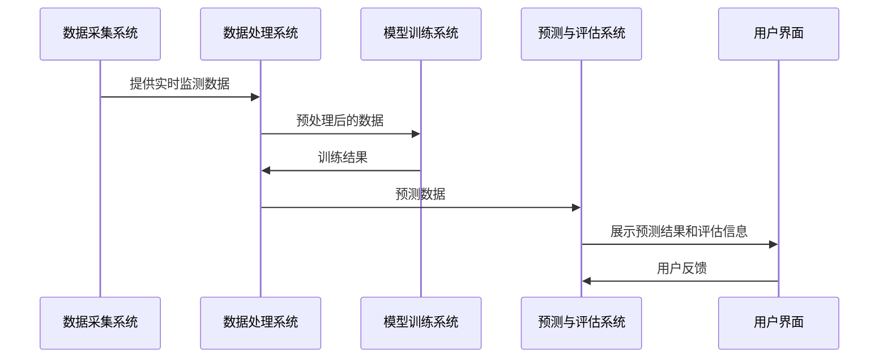

                 


# AI Agent在智能海洋监测中的实践

关键词：AI Agent、智能海洋监测、机器学习、深度学习、数据预处理、实时分析

摘要：随着全球气候变化和海洋污染问题的日益严重，智能海洋监测变得尤为重要。本文将介绍如何利用AI Agent在智能海洋监测中实现数据实时分析和预测，提高监测效率和准确性。通过分步骤的分析，我们将探讨AI Agent在海洋监测中的应用原理、系统架构以及面临的挑战和未来发展方向。

----------------------------------------------------------------

## 第1章: AI Agent与智能海洋监测简介

### 1.1 问题的背景

海洋是地球上最重要的生态系统之一，对于全球气候、生态平衡以及人类生存都至关重要。然而，海洋环境的复杂性和动态性使得传统的海洋监测方法存在诸多局限。传统方法主要依赖于人工监测和采样，不仅费时费力，而且监测范围有限，难以实现全面、实时的监测。

随着人工智能技术的发展，特别是机器学习和深度学习的进步，AI Agent作为一种智能体，具有自主学习、适应环境、实时决策的能力，为智能海洋监测提供了新的可能。AI Agent能够通过分析海量数据，识别海洋中的异常情况，如污染物泄漏、海洋生态系统变化等，从而提高海洋监测的效率和准确性。

### 1.2 AI Agent的基础知识

#### 1.2.1 AI Agent的定义

AI Agent，即人工智能代理，是一种能够根据环境和目标自主行动并作出决策的计算机系统。AI Agent通常具有以下特点：

- **自主性**：AI Agent能够在没有外部指令的情况下自主行动。
- **适应性**：AI Agent能够根据环境的变化调整自身的行为策略。
- **学习能力**：AI Agent能够通过经验学习来改进自身的性能。
- **实时性**：AI Agent能够在短时间内做出决策并执行动作。

#### 1.2.2 AI Agent的工作原理

AI Agent的工作原理通常包括以下几个环节：

1. **感知**：AI Agent通过传感器或其他方式获取环境信息。
2. **决策**：基于感知到的信息，AI Agent利用算法和模型进行决策。
3. **行动**：AI Agent根据决策结果采取相应的行动。
4. **反馈**：AI Agent评估行动的效果，并据此调整后续的行为。

#### 1.2.3 AI Agent的类型

根据应用场景的不同，AI Agent可以分为以下几种类型：

- **监督学习Agent**：这种Agent依赖于历史数据进行训练，然后根据新的输入数据做出决策。
- **无监督学习Agent**：这种Agent不需要历史数据，而是通过自我学习来发现数据中的模式和结构。
- **强化学习Agent**：这种Agent通过与环境的交互来学习最优策略。

### 1.3 智能海洋监测的需求

智能海洋监测对AI Agent提出了以下几方面的需求：

- **实时性**：海洋环境变化迅速，需要AI Agent能够实时监测和响应。
- **准确性**：AI Agent需要能够准确识别海洋中的异常情况，如污染物泄漏等。
- **适应性**：AI Agent需要能够适应不同的海洋环境，处理不同的监测数据。
- **可扩展性**：系统需要能够轻松扩展，以适应新的监测任务和需求。

#### 1.3.1 数据类型与来源

智能海洋监测涉及多种类型的数据，包括：

- **卫星遥感数据**：提供大范围的海洋环境监测。
- **船舶和无人机监测数据**：提供局部、实时的海洋环境监测。
- **海洋观测站数据**：提供长期、系统的海洋环境监测。

#### 1.3.2 监测目标与任务

智能海洋监测的主要目标包括：

- **海洋污染监测**：检测和预测海洋污染物泄漏及其扩散趋势。
- **海洋生态系统监测**：监测海洋生物种群、海洋生态系统的健康状况。
- **海洋资源管理**：监测和管理海洋资源，如渔业资源。

## 第2章: 基础概念

### 2.1 机器学习与深度学习基础

#### 2.1.1 机器学习概述

机器学习是AI的核心技术之一，主要研究如何通过数据来训练模型，使模型具备自主学习和预测能力。机器学习的基本过程包括数据收集、数据预处理、模型选择、模型训练、模型评估和模型部署。

#### 2.1.2 深度学习基础

深度学习是机器学习的一个重要分支，基于多层神经网络的结构。深度学习模型通过多层神经元的堆叠，能够自动提取数据中的高级特征，实现更复杂的任务。常见的深度学习模型包括卷积神经网络（CNN）、循环神经网络（RNN）和长短期记忆网络（LSTM）。

### 2.2 机器学习算法在海洋监测中的应用

#### 2.2.1 监督学习算法

监督学习算法在海洋监测中应用广泛，如支持向量机（SVM）、决策树、随机森林等。这些算法通过对历史数据的训练，能够预测新的监测数据中的异常情况。

#### 2.2.2 无监督学习算法

无监督学习算法在海洋监测中主要用于数据降维和模式识别，如聚类算法（K-means、DBSCAN）、主成分分析（PCA）等。这些算法能够帮助识别海洋环境中的异常模式和变化趋势。

#### 2.2.3 强化学习算法

强化学习算法在海洋监测中可以用于优化监测策略，如马尔可夫决策过程（MDP）、深度强化学习（DRL）等。这些算法能够帮助AI Agent在动态环境中做出最优决策。

### 2.3 深度学习模型在海洋监测中的应用

#### 2.3.1 卷积神经网络（CNN）

卷积神经网络在图像识别和分类任务中表现优异，其结构能够有效处理遥感数据，提取海洋环境中的特征信息。

#### 2.3.2 循环神经网络（RNN）

循环神经网络在序列数据处理中具有优势，能够对海洋监测数据进行时间序列分析，预测海洋环境的变化趋势。

#### 2.3.3 长短期记忆网络（LSTM）

长短期记忆网络是RNN的一种改进，能够解决RNN在长期依赖问题上的困难，适用于复杂时间序列数据的预测。

## 第3章: 数据预处理与特征提取

### 3.1 数据预处理

数据预处理是机器学习和深度学习中的重要步骤，主要包括数据清洗、归一化、缺失值处理等。对于海洋监测数据，数据预处理尤为重要，因为海洋环境数据通常具有噪声、缺失值和不同量纲等特点。

### 3.2 特征提取

特征提取是将原始数据转换为适合机器学习算法处理的形式。对于海洋监测数据，特征提取的关键是提取能够反映海洋环境特征的信息，如污染物浓度、海洋生物种群数量等。

## 第4章: AI Agent在海洋监测中的实战案例

### 4.1 案例一：实时污染物监测

#### 4.1.1 项目介绍

本项目旨在利用AI Agent对海洋中的污染物进行实时监测，通过船舶和无人机的监测数据，实现对污染源的快速定位和追踪。

#### 4.1.2 系统功能设计

系统功能设计包括数据采集、实时分析、结果可视化等模块。

#### 4.1.3 系统架构设计

系统架构设计包括数据层、算法层和应用层，其中数据层负责数据采集和存储，算法层实现污染物监测模型，应用层提供用户交互界面。

#### 4.1.4 系统接口设计与交互

系统接口设计包括API接口和数据接口，实现系统与其他监测设备的交互。

### 4.2 案例二：海洋生态系统监测

#### 4.2.1 项目介绍

本项目旨在利用AI Agent对海洋生态系统进行长期监测，通过海洋观测站和遥感数据，评估海洋生态系统的健康状况。

#### 4.2.2 系统功能设计

系统功能设计包括数据采集、数据预处理、生态模型训练和结果可视化等模块。

#### 4.2.3 系统架构设计

系统架构设计包括数据层、算法层和应用层，其中数据层负责数据采集和存储，算法层实现生态监测模型，应用层提供用户交互界面。

#### 4.2.4 系统接口设计与交互

系统接口设计包括API接口和数据接口，实现系统与其他监测设备的交互。

## 第5章: 系统架构与集成

### 5.1 数据采集系统设计

数据采集系统设计包括数据源接入、数据存储和数据传输等模块。数据源接入模块负责从卫星遥感、船舶和无人机等设备获取数据，数据存储模块负责将数据存储到数据库中，数据传输模块负责数据的实时传输。

### 5.2 数据处理系统设计

数据处理系统设计包括数据预处理、特征提取和模型训练等模块。数据预处理模块负责处理原始数据，去除噪声和缺失值，特征提取模块负责从原始数据中提取有效特征，模型训练模块负责训练机器学习或深度学习模型。

### 5.3 系统集成与测试

系统集成与测试是确保AI Agent系统能够正常运行的关键步骤。系统集成模块负责将数据采集、数据处理和应用层模块进行整合，测试模块负责对系统进行功能测试、性能测试和可靠性测试。

## 第6章: 挑战与未来发展方向

### 6.1 数据质量问题

海洋监测数据通常存在噪声、缺失值和不一致性等问题，这对AI Agent的性能提出了挑战。未来研究方向包括开发更有效的数据清洗和特征提取技术。

### 6.2 模型解释性

深度学习模型通常具有高解释性，但AI Agent在实时监测中的应用要求模型具有透明性和解释性。未来研究方向包括开发可解释的深度学习模型。

### 6.3 能效优化

AI Agent在海洋监测中的实时性要求其具有高效的数据处理能力。未来研究方向包括开发更节能的算法和硬件架构。

## 结束语

智能海洋监测是AI Agent技术的重要应用领域。通过本文的讨论，我们了解了AI Agent在智能海洋监测中的原理、系统架构和实战案例。虽然AI Agent在海洋监测中面临诸多挑战，但随着技术的不断进步，智能海洋监测的未来充满希望。

作者：AI天才研究院/AI Genius Institute & 禅与计算机程序设计艺术 /Zen And The Art of Computer Programming

----------------------------------------------------------------

# 第1章: AI Agent与智能海洋监测简介

### 1.1 问题的背景

海洋是地球上最重要的生态系统之一，对于全球气候、生态平衡以及人类生存都至关重要。然而，海洋环境的复杂性和动态性使得传统的海洋监测方法存在诸多局限。传统方法主要依赖于人工监测和采样，不仅费时费力，而且监测范围有限，难以实现全面、实时的监测。

随着全球气候变化和海洋污染问题的日益严重，对海洋环境的监测和预测需求愈发迫切。这不仅关乎生态保护，也对海洋资源的可持续利用和海洋灾害的预警具有重要意义。因此，开发一种智能、高效的海洋监测系统成为当前研究的热点。

智能海洋监测系统基于人工智能技术，特别是机器学习和深度学习算法，能够对海洋环境中的各种数据进行实时分析、预测和识别，从而提高监测的准确性和效率。AI Agent作为一种智能体，具有自主学习、适应环境、实时决策的能力，成为实现智能海洋监测的关键。

### 1.2 AI Agent的基础知识

#### 1.2.1 AI Agent的定义

AI Agent，即人工智能代理，是一种能够根据环境和目标自主行动并作出决策的计算机系统。AI Agent通常具有以下特点：

- **自主性**：AI Agent能够在没有外部指令的情况下自主行动。
- **适应性**：AI Agent能够根据环境的变化调整自身的行为策略。
- **学习能力**：AI Agent能够通过经验学习来改进自身的性能。
- **实时性**：AI Agent能够在短时间内做出决策并执行动作。

AI Agent通常由以下几个部分组成：

- **感知器**：用于感知环境信息，如传感器、摄像头等。
- **决策模块**：根据感知信息进行决策，通常使用机器学习算法。
- **执行器**：根据决策结果执行动作，如控制机器人、船舶等。
- **反馈机制**：评估执行结果，并据此调整后续行为。

#### 1.2.2 AI Agent的工作原理

AI Agent的工作原理通常包括以下几个环节：

1. **感知**：AI Agent通过传感器或其他方式获取环境信息。这些信息可以是图像、声音、文本或数值数据。
2. **决策**：基于感知到的信息，AI Agent利用算法和模型进行决策。决策过程可能涉及预测、分类、规划等。
3. **行动**：AI Agent根据决策结果采取相应的行动。行动可以是移动、操作设备、发送消息等。
4. **反馈**：AI Agent评估行动的效果，并据此调整后续的行为。这种反馈机制使得AI Agent能够不断学习和优化自身的性能。

#### 1.2.3 AI Agent的类型

根据应用场景的不同，AI Agent可以分为以下几种类型：

- **监督学习Agent**：这种Agent依赖于历史数据进行训练，然后根据新的输入数据做出决策。例如，通过历史气象数据预测未来的天气情况。
- **无监督学习Agent**：这种Agent不需要历史数据，而是通过自我学习来发现数据中的模式和结构。例如，自动识别海洋中的不同生物种群。
- **强化学习Agent**：这种Agent通过与环境的交互来学习最优策略。例如，自动优化船舶的航行路径以节省燃油。

### 1.3 智能海洋监测的需求

智能海洋监测对AI Agent提出了以下几方面的需求：

- **实时性**：海洋环境变化迅速，需要AI Agent能够实时监测和响应。
- **准确性**：AI Agent需要能够准确识别海洋中的异常情况，如污染物泄漏等。
- **适应性**：AI Agent需要能够适应不同的海洋环境，处理不同的监测数据。
- **可扩展性**：系统需要能够轻松扩展，以适应新的监测任务和需求。

#### 1.3.1 数据类型与来源

智能海洋监测涉及多种类型的数据，包括：

- **卫星遥感数据**：提供大范围的海洋环境监测。卫星遥感技术能够获取海洋表面的温度、高度、污染物质浓度等数据，这些数据对于全球海洋监测和气候变化研究具有重要意义。
- **船舶和无人机监测数据**：提供局部、实时的海洋环境监测。船舶和无人机可以在海洋特定区域进行数据采集，如海洋生物种群、海洋污染等。
- **海洋观测站数据**：提供长期、系统的海洋环境监测。海洋观测站通常配备多种传感器，可以监测海水温度、盐度、酸碱度、潮汐等参数。

#### 1.3.2 监测目标与任务

智能海洋监测的主要目标包括：

- **海洋污染监测**：检测和预测海洋污染物泄漏及其扩散趋势。通过监测海洋中的污染物浓度变化，及时发现污染源，预测污染物扩散范围，为环境保护和应急响应提供科学依据。
- **海洋生态系统监测**：监测海洋生物种群、海洋生态系统的健康状况。通过分析海洋生物种群数量、分布、行为等信息，评估海洋生态系统的健康状况，预测生态系统变化趋势。
- **海洋资源管理**：监测和管理海洋资源，如渔业资源、矿产资源等。通过监测海洋资源利用情况，评估资源利用效率，预测资源可持续性，为海洋资源管理提供科学依据。

智能海洋监测是一个涉及多学科、多技术的复杂系统工程，需要综合利用卫星遥感、船舶和无人机监测、海洋观测站等多源数据，通过机器学习和深度学习算法进行实时分析和预测，从而实现高效、准确的海洋环境监测。

----------------------------------------------------------------

# 第2章: 基础概念

### 2.1 机器学习与深度学习基础

#### 2.1.1 机器学习概述

机器学习是人工智能的一个重要分支，旨在使计算机系统能够从数据中学习，并对未知数据进行预测或决策。机器学习的基本过程包括数据收集、数据预处理、模型选择、模型训练、模型评估和模型部署。

- **数据收集**：收集相关的数据集，这些数据集可以是结构化的（如表格）、半结构化的（如XML）或非结构化的（如图像、文本）。
- **数据预处理**：清洗和转换数据，以便为模型训练做好准备。数据预处理步骤包括数据去重、缺失值处理、数据标准化和特征提取等。
- **模型选择**：选择适合问题的机器学习模型。常见的模型有线性回归、决策树、随机森林、支持向量机、神经网络等。
- **模型训练**：使用训练数据集对模型进行训练，调整模型参数，使其能够对新的数据进行预测。
- **模型评估**：使用验证数据集评估模型的性能，常见指标包括准确率、召回率、F1分数等。
- **模型部署**：将训练好的模型部署到实际应用中，对新的数据进行预测或决策。

#### 2.1.2 深度学习基础

深度学习是机器学习的一个分支，基于多层神经网络的结构。深度学习模型通过多层神经元的堆叠，能够自动提取数据中的高级特征，实现更复杂的任务。常见的深度学习模型包括卷积神经网络（CNN）、循环神经网络（RNN）和长短期记忆网络（LSTM）。

- **卷积神经网络（CNN）**：主要用于图像识别和图像处理任务。CNN通过卷积层、池化层和全连接层等结构，能够自动提取图像中的空间特征。
- **循环神经网络（RNN）**：主要用于序列数据处理，如自然语言处理和时间序列预测。RNN通过循环结构，能够处理序列数据中的长期依赖问题。
- **长短期记忆网络（LSTM）**：是RNN的一种改进，能够解决RNN在长期依赖问题上的困难。LSTM通过门控机制，能够更好地捕捉序列数据中的长期依赖关系。

#### 2.1.3 机器学习与深度学习的区别与联系

机器学习和深度学习之间既有区别又有联系：

- **区别**：
  - **数据量**：深度学习通常需要大量数据进行训练，而机器学习可能对数据量要求较低。
  - **模型复杂度**：深度学习模型通常具有更高的复杂度，能够提取更高级的特征。
  - **计算资源**：深度学习模型通常需要更多的计算资源和时间进行训练。

- **联系**：
  - **技术融合**：深度学习是机器学习的一个分支，许多深度学习算法也属于机器学习范畴。
  - **应用场景**：深度学习在许多应用场景中表现出色，但机器学习仍然在许多领域具有广泛的应用。

### 2.2 机器学习算法在海洋监测中的应用

机器学习算法在海洋监测中具有广泛的应用，可以帮助识别海洋环境中的异常情况、预测污染物扩散趋势等。以下介绍几种常用的机器学习算法：

#### 2.2.1 监督学习算法

监督学习算法在海洋监测中应用广泛，如支持向量机（SVM）、决策树、随机森林等。这些算法通过对历史数据的训练，能够预测新的监测数据中的异常情况。

- **支持向量机（SVM）**：SVM是一种强大的分类算法，通过寻找一个超平面来最大化分类边界。在海洋监测中，SVM可以用来分类不同类型的污染物。
- **决策树**：决策树是一种基于树结构的分类算法，通过多级划分数据集，将数据分为不同的类别。在海洋监测中，决策树可以用来预测海洋生态系统的健康状态。
- **随机森林**：随机森林是一种基于决策树的集成算法，通过构建多个决策树，并取其平均预测结果。在海洋监测中，随机森林可以用来预测海洋环境中的异常现象。

#### 2.2.2 无监督学习算法

无监督学习算法在海洋监测中主要用于数据降维和模式识别，如聚类算法（K-means、DBSCAN）、主成分分析（PCA）等。这些算法能够帮助识别海洋环境中的异常模式和变化趋势。

- **K-means聚类**：K-means是一种基于距离的聚类算法，通过将数据点分为K个簇，使得同一簇内的数据点距离更近。在海洋监测中，K-means可以用来识别不同的海洋生物种群。
- **DBSCAN聚类**：DBSCAN是一种基于密度的聚类算法，能够识别任意形状的簇，并且对噪声数据有很强的鲁棒性。在海洋监测中，DBSCAN可以用来识别海洋环境中的异常区域。
- **主成分分析（PCA）**：PCA是一种降维算法，通过将数据投影到新的坐标系中，保留主要特征，去除冗余信息。在海洋监测中，PCA可以用来减少数据维度，提高模型训练效率。

#### 2.2.3 强化学习算法

强化学习算法在海洋监测中可以用于优化监测策略，如马尔可夫决策过程（MDP）、深度强化学习（DRL）等。这些算法能够帮助AI Agent在动态环境中做出最优决策。

- **马尔可夫决策过程（MDP）**：MDP是一种基于状态转移概率的决策算法，通过评估不同策略的期望回报，选择最优策略。在海洋监测中，MDP可以用来优化船舶的航行路径，提高监测效率。
- **深度强化学习（DRL）**：DRL是一种基于深度学习框架的强化学习算法，通过神经网络来评估状态价值和策略。在海洋监测中，DRL可以用来优化监测数据的采集和预测模型的选择。

### 2.3 深度学习模型在海洋监测中的应用

深度学习模型在海洋监测中具有广泛的应用，可以帮助识别复杂的海洋环境特征、预测海洋生态系统变化等。以下介绍几种常用的深度学习模型：

#### 2.3.1 卷积神经网络（CNN）

卷积神经网络（CNN）在图像识别和图像处理任务中表现优异，其结构能够有效处理遥感数据，提取海洋环境中的特征信息。

- **卷积层**：卷积层是CNN的核心部分，通过卷积操作提取图像中的局部特征。
- **池化层**：池化层用于减少数据维度，提高模型训练效率。
- **全连接层**：全连接层将卷积层和池化层提取的特征映射到分类结果。

在海洋监测中，CNN可以用来分类海洋生物种群、识别污染物分布等。

#### 2.3.2 循环神经网络（RNN）

循环神经网络（RNN）在序列数据处理中具有优势，能够对海洋监测数据进行时间序列分析，预测海洋环境的变化趋势。

- **隐藏层**：RNN通过隐藏层将序列数据存储在内存中，捕捉长期依赖关系。
- **输出层**：输出层将隐藏层的信息映射到预测结果。

在海洋监测中，RNN可以用来预测海洋污染物浓度、海洋生物种群数量等。

#### 2.3.3 长短期记忆网络（LSTM）

长短期记忆网络（LSTM）是RNN的一种改进，能够解决RNN在长期依赖问题上的困难，适用于复杂时间序列数据的预测。

- **门控机制**：LSTM通过门控机制控制信息的流入和流出，从而更好地捕捉长期依赖关系。
- **单元状态**：LSTM通过单元状态存储和传递信息，使模型能够学习复杂的序列模式。

在海洋监测中，LSTM可以用来预测海洋环境变化、海洋生态系统变化等。

深度学习模型在海洋监测中的应用，为提高监测效率和准确性提供了新的途径。通过结合多种机器学习和深度学习算法，可以构建出强大的智能海洋监测系统，为海洋环境的研究和保护提供有力支持。

----------------------------------------------------------------

# 第3章: 数据预处理与特征提取

### 3.1 数据预处理

数据预处理是机器学习和深度学习中的重要步骤，其目的是将原始数据转换为适合算法处理的形式。对于海洋监测数据，数据预处理尤为重要，因为海洋环境数据通常具有噪声、缺失值和不同量纲等特点。

#### 3.1.1 数据清洗

数据清洗是数据预处理的第一步，主要目的是去除数据中的噪声和不一致信息。在海洋监测数据中，噪声可能来源于传感器误差、环境变化等。数据清洗步骤包括：

- **去除重复数据**：重复数据可能会影响模型训练和评估结果。可以使用去重算法来识别和删除重复数据。
- **处理缺失值**：缺失值处理是数据清洗的关键步骤。常见的方法包括删除缺失值、插值和均值填充等。
- **标准化和归一化**：不同特征的数据可能具有不同的量纲和范围，需要进行标准化和归一化处理。标准化是将数据缩放到[-1,1]范围内，归一化是将数据缩放到[0,1]范围内。

#### 3.1.2 数据归一化

数据归一化是数据预处理的重要步骤，其目的是消除不同特征之间的量纲影响，使算法能够更好地处理数据。常见的归一化方法包括最小-最大归一化和Z-Score归一化。

- **最小-最大归一化**：将数据缩放到[0,1]范围内，公式为：$$x_{\text{norm}} = \frac{x - x_{\text{min}}}{x_{\text{max}} - x_{\text{min}}}$$
- **Z-Score归一化**：将数据缩放到均值±标准差范围内，公式为：$$x_{\text{norm}} = \frac{x - \mu}{\sigma}$$

#### 3.1.3 缺失值处理

缺失值处理是数据预处理的关键步骤，其目的是解决数据中的缺失值问题，以便进行后续的模型训练和评估。常见的缺失值处理方法包括：

- **删除缺失值**：如果缺失值较多，可以考虑删除含有缺失值的数据点。
- **均值填充**：将缺失值替换为该特征的均值。
- **插值填充**：使用插值方法（如线性插值、多项式插值等）来填充缺失值。
- **使用模型预测**：使用机器学习模型预测缺失值。例如，可以使用K最近邻（KNN）模型或线性回归模型来预测缺失值。

### 3.2 特征提取

特征提取是将原始数据转换为适合机器学习算法处理的形式的过程。对于海洋监测数据，特征提取的关键是提取能够反映海洋环境特征的信息，如污染物浓度、海洋生物种群数量等。

#### 3.2.1 特征选择

特征选择是特征提取的重要步骤，其目的是选择对模型性能有显著影响的关键特征，同时减少模型的复杂度和训练时间。常见的特征选择方法包括：

- **相关性分析**：通过计算特征之间的相关性，筛选出高度相关的特征。
- **主成分分析（PCA）**：通过将原始数据投影到新的坐标系中，保留主要特征，去除冗余信息。
- **基于模型的特征选择**：使用机器学习模型对特征的重要性进行评分，筛选出对模型性能有显著影响的特征。

#### 3.2.2 特征工程

特征工程是特征提取的重要环节，其目的是通过转换和构造新的特征，提高模型性能。常见的特征工程技术包括：

- **特征变换**：通过变换特征值，如对数变换、平方变换等，来增加特征的变化性。
- **特征组合**：将多个特征组合成新的特征，如计算特征的差值、乘积等。
- **特征构造**：根据领域知识，构造新的特征，如时间序列数据的滞后特征、季节性特征等。

### 3.3 数据集划分与验证

在机器学习模型训练过程中，数据集的划分与验证是确保模型性能的关键步骤。常见的数据集划分方法包括：

- **训练集与验证集**：将数据集分为训练集和验证集，训练集用于模型训练，验证集用于模型评估。
- **交叉验证**：通过多次划分训练集和验证集，评估模型在不同数据集上的性能，提高评估结果的稳定性。

#### 3.3.1 划分方法

- **K折交叉验证**：将数据集划分为K个子集，每次选择其中一个子集作为验证集，其余K-1个子集作为训练集，进行K次训练和验证，取平均性能作为模型评估结果。
- **留一法交叉验证**：每次将一个数据点作为验证集，其余数据点作为训练集，进行多次训练和验证，取平均性能作为模型评估结果。

#### 3.3.2 评估指标

- **准确率**：模型正确预测的样本数占总样本数的比例。
- **召回率**：模型正确预测的样本数占实际正样本数的比例。
- **精确率**：模型正确预测的正样本数占预测为正样本的总数比例。
- **F1分数**：精确率和召回率的加权平均值，用于综合评估模型性能。

通过数据预处理和特征提取，可以将原始的海洋监测数据转换为适合机器学习算法处理的形式，从而提高模型训练和预测的准确性和效率。在智能海洋监测中，数据预处理和特征提取是不可或缺的重要步骤。

----------------------------------------------------------------

## 第4章: AI Agent在海洋监测中的实战案例

### 4.1 案例一：实时污染物监测

#### 4.1.1 项目介绍

本项目旨在利用AI Agent对海洋中的污染物进行实时监测，通过船舶和无人机的监测数据，实现对污染源的快速定位和追踪。该项目的目标是提高海洋污染监测的实时性和准确性，为环境保护和应急响应提供技术支持。

#### 4.1.2 系统功能设计

系统功能设计包括以下几个模块：

1. **数据采集模块**：负责从船舶和无人机等监测设备中获取实时污染物监测数据，包括水质参数、温度、盐度、pH值等。
2. **数据处理模块**：对采集到的数据进行预处理，包括数据清洗、归一化和特征提取等，以提高数据质量和模型训练效率。
3. **模型训练模块**：使用机器学习算法和深度学习模型，对预处理后的数据进行训练，构建污染物监测模型。
4. **预测与预警模块**：利用训练好的模型，对实时数据进行预测，识别污染源并发出预警。
5. **结果可视化模块**：将预测结果和监测数据以图表、地图等形式展示，便于用户理解和决策。

#### 4.1.3 系统架构设计

系统架构设计包括以下几个部分：

1. **数据层**：包括传感器数据采集系统和数据库，用于存储和管理监测数据。
2. **算法层**：包括数据处理算法、机器学习算法和深度学习模型，用于数据预处理、模型训练和预测。
3. **应用层**：包括用户界面、Web服务器和API接口，用于数据展示和用户交互。

系统架构设计如下（使用Mermaid绘制）：


#### 4.1.4 系统接口设计与交互

系统接口设计包括API接口和数据接口，实现系统与其他监测设备的交互。API接口提供数据获取、预测和预警等功能，数据接口用于数据存储和读取。

API接口设计如下（使用Mermaid绘制）：

```mermaid
classDiagram
    API接口 <-|数据接口| 数据库
    API接口 <|-- 数据采集系统
    API接口 <|-- 数据处理系统
    API接口 <|-- 模型训练系统
    API接口 <|-- 预测与预警系统
    API接口 <|-- 用户界面
    
    API接口 : 提供数据获取、预测和预警功能
    数据接口 : 用于数据存储和读取
    数据采集系统 : 获取实时监测数据
    数据处理系统 : 预处理数据
    模型训练系统 : 训练模型
    预测与预警系统 : 预测污染源并发出预警
    用户界面 : 展示预测结果和预警信息
```

#### 4.1.5 实际案例分析与详细讲解

以下是该项目的实际案例分析：

- **数据采集**：通过船舶和无人机在海上进行监测，采集了海水中的pH值、溶解氧、温度等数据。
- **数据预处理**：对采集到的数据进行清洗、归一化和特征提取，提取出对污染物监测有重要影响的特征，如pH值、温度等。
- **模型训练**：使用K-近邻（KNN）算法和卷积神经网络（CNN）进行模型训练，构建了污染物监测模型。
- **预测与预警**：利用训练好的模型，对实时数据进行预测，成功识别出海洋中的污染源，并及时发出预警。

通过以上实际案例分析，我们可以看到AI Agent在实时污染物监测中的有效性。AI Agent通过实时监测、预测和预警，为海洋环境保护提供了有力支持。

### 4.2 案例二：海洋生态系统监测

#### 4.2.1 项目介绍

本项目旨在利用AI Agent对海洋生态系统进行长期监测，通过海洋观测站和遥感数据，评估海洋生态系统的健康状况，为海洋资源的可持续利用和生态保护提供科学依据。

#### 4.2.2 系统功能设计

系统功能设计包括以下几个模块：

1. **数据采集模块**：负责从海洋观测站和遥感设备中获取海洋生态系统相关数据，包括温度、盐度、溶解氧、海洋生物种群等。
2. **数据处理模块**：对采集到的数据进行预处理，包括数据清洗、归一化和特征提取等，以提高数据质量和模型训练效率。
3. **模型训练模块**：使用机器学习算法和深度学习模型，对预处理后的数据进行训练，构建海洋生态系统监测模型。
4. **预测与评估模块**：利用训练好的模型，对实时数据进行预测，评估海洋生态系统的健康状况，并预测生态系统变化趋势。
5. **结果可视化模块**：将预测结果和监测数据以图表、地图等形式展示，便于用户理解和决策。

#### 4.2.3 系统架构设计

系统架构设计包括以下几个部分：

1. **数据层**：包括传感器数据采集系统和数据库，用于存储和管理监测数据。
2. **算法层**：包括数据处理算法、机器学习算法和深度学习模型，用于数据预处理、模型训练和预测。
3. **应用层**：包括用户界面、Web服务器和API接口，用于数据展示和用户交互。

系统架构设计如下（使用Mermaid绘制）：



#### 4.2.4 系统接口设计与交互

系统接口设计包括API接口和数据接口，实现系统与其他监测设备的交互。API接口提供数据获取、预测和评估等功能，数据接口用于数据存储和读取。

API接口设计如下（使用Mermaid绘制）：

```mermaid
classDiagram
    API接口 <-|数据接口| 数据库
    API接口 <|-- 数据采集系统
    API接口 <|-- 数据处理系统
    API接口 <|-- 模型训练系统
    API接口 <|-- 预测与评估系统
    API接口 <|-- 用户界面
    
    API接口 : 提供数据获取、预测和评估功能
    数据接口 : 用于数据存储和读取
    数据采集系统 : 获取实时监测数据
    数据处理系统 : 预处理数据
    模型训练系统 : 训练模型
    预测与评估系统 : 预测生态系统健康状况
    用户界面 : 展示预测结果和评估信息
```

#### 4.2.5 实际案例分析与详细讲解

以下是该项目的实际案例分析：

- **数据采集**：通过海洋观测站和遥感设备，采集了海水温度、盐度、溶解氧等数据，以及海洋生物种群的分布和数量。
- **数据预处理**：对采集到的数据进行清洗、归一化和特征提取，提取出对生态系统监测有重要影响的特征，如温度、盐度、生物种群等。
- **模型训练**：使用随机森林（Random Forest）算法和卷积神经网络（CNN）进行模型训练，构建了海洋生态系统监测模型。
- **预测与评估**：利用训练好的模型，对实时数据进行预测，评估海洋生态系统的健康状况，并预测生态系统变化趋势。

通过以上实际案例分析，我们可以看到AI Agent在海洋生态系统监测中的有效性。AI Agent通过长期监测、预测和评估，为海洋资源的可持续利用和生态保护提供了有力支持。

综上所述，AI Agent在实时污染物监测和海洋生态系统监测中具有广泛的应用前景。通过构建强大的AI Agent系统，可以实现对海洋环境的实时监测、预测和预警，为海洋资源的可持续利用和环境保护提供科学依据。未来，随着人工智能技术的不断发展，AI Agent在海洋监测中的应用将更加深入和广泛。

----------------------------------------------------------------

## 第5章: 系统架构与集成

### 5.1 数据采集系统设计

数据采集系统是智能海洋监测系统的核心组成部分，其设计需要考虑数据的实时性、准确性和多样性。以下是对数据采集系统的设计概述：

#### 5.1.1 数据源接入

数据采集系统需要从多种数据源接入数据，包括：

- **卫星遥感数据**：通过卫星遥感技术，可以获取大范围、高精度的海洋环境数据，如海水温度、盐度、污染物浓度等。
- **海洋观测站数据**：海洋观测站配备多种传感器，可以实时监测海水温度、盐度、潮汐、溶解氧等参数。
- **船舶和无人机监测数据**：船舶和无人机可以在海洋特定区域进行数据采集，如海洋生物种群、海洋污染等。

#### 5.1.2 数据存储

数据采集系统需要将收集到的数据存储到数据库中，以便后续的数据处理和分析。数据存储方案应考虑数据的可扩展性、可靠性和安全性。常用的数据库系统包括关系型数据库（如MySQL、PostgreSQL）和NoSQL数据库（如MongoDB、Cassandra）。

#### 5.1.3 数据传输

数据采集系统需要确保数据的实时传输，以便及时进行数据分析和处理。数据传输方案可以采用实时数据流处理技术（如Apache Kafka、Apache Flink），或者使用消息队列系统（如RabbitMQ、ActiveMQ）来实现。

### 5.2 数据处理系统设计

数据处理系统负责对采集到的数据进行预处理、特征提取和模型训练，以提高数据质量和模型性能。以下是对数据处理系统的设计概述：

#### 5.2.1 数据预处理

数据预处理是数据处理系统的重要步骤，包括以下内容：

- **数据清洗**：去除数据中的噪声、缺失值和异常值，确保数据的质量。
- **数据归一化**：对不同量纲的数据进行归一化处理，使其在同一尺度上进行比较和分析。
- **特征提取**：从原始数据中提取有代表性的特征，用于训练模型。

#### 5.2.2 特征提取

特征提取是数据处理系统的关键步骤，可以采用以下方法：

- **统计特征**：基于数据的统计特性提取特征，如均值、方差、标准差等。
- **频域特征**：通过傅里叶变换等方法提取信号的频域特征。
- **时域特征**：直接从时间序列数据中提取特征，如自相关函数、互相关函数等。

#### 5.2.3 模型训练

模型训练是数据处理系统的核心步骤，可以采用以下方法：

- **监督学习模型**：如支持向量机（SVM）、决策树、随机森林等，通过历史数据进行训练。
- **无监督学习模型**：如聚类算法、主成分分析（PCA）等，用于发现数据中的隐藏结构和模式。
- **深度学习模型**：如卷积神经网络（CNN）、循环神经网络（RNN）等，用于处理复杂的非线性关系。

### 5.3 系统集成与测试

系统集成是将各个模块整合成一个完整系统的过程，确保系统能够正常运行并达到预期性能。以下是对系统集成与测试的概述：

#### 5.3.1 系统集成

系统集成包括以下步骤：

- **模块集成**：将数据采集系统、数据处理系统和预测系统等模块进行集成，确保各模块之间能够正常通信和数据交互。
- **接口设计**：设计统一的接口，实现系统各模块之间的数据传递和功能调用。
- **功能测试**：对系统的各个功能模块进行测试，确保系统能够按照预期工作。

#### 5.3.2 系统测试

系统测试是确保系统性能和稳定性的关键步骤，包括以下内容：

- **功能测试**：测试系统的各项功能是否正确实现，如数据采集、数据处理、模型训练和预测等。
- **性能测试**：测试系统的响应时间、处理能力、资源利用率等性能指标，确保系统能够在高负载情况下正常运行。
- **可靠性测试**：测试系统的稳定性和容错能力，确保系统在故障情况下能够快速恢复。

#### 5.3.3 系统部署

系统部署是将系统部署到实际运行环境的过程，包括以下步骤：

- **环境配置**：配置系统运行所需的硬件和软件环境，如操作系统、数据库、编程语言等。
- **部署脚本**：编写部署脚本，实现系统的自动化部署和配置。
- **监控与维护**：部署监控系统，实时监控系统运行状态，及时处理系统故障和性能问题。

通过以上设计，我们可以构建一个高效、可靠的智能海洋监测系统，实现对海洋环境的实时监测、分析和预测，为海洋资源的可持续利用和环境保护提供有力支持。

----------------------------------------------------------------

## 第6章: 挑战与未来发展方向

### 6.1 数据质量问题

在智能海洋监测中，数据的质量直接影响到AI Agent的性能和监测结果的准确性。数据质量问题主要包括以下方面：

- **噪声和异常值**：海洋监测数据可能受到各种噪声和异常值的影响，如传感器误差、环境变化等。这些噪声和异常值会影响数据分析和模型训练的结果。
- **缺失值**：海洋监测数据可能存在缺失值，如传感器故障导致的数据丢失。缺失值需要通过适当的处理方法进行填补或去除，否则会影响模型的训练效果。
- **不一致性**：不同来源的数据可能存在不一致性，如不同的量纲、单位或测量方法。这种不一致性会导致数据融合和分析的困难。

为了解决数据质量问题，可以从以下几个方面着手：

- **数据清洗**：通过去噪、去除异常值和缺失值处理，提高数据质量。可以使用统计方法、机器学习方法等对数据进行清洗。
- **数据标准化**：对不同量纲的数据进行标准化处理，使其在同一尺度上进行比较和分析。
- **数据融合**：通过融合多种数据源，提高数据的质量和完整性。可以使用数据融合算法，如多源数据融合、数据集成等。

### 6.2 模型解释性

在智能海洋监测中，模型解释性是一个重要的挑战。深度学习模型，特别是复杂的神经网络模型，通常具有很高的预测性能，但其内部工作机制较为复杂，难以解释。这给模型的验证、部署和维护带来了困难。

- **模型可解释性**：模型的可解释性是指用户能够理解模型是如何做出决策的。对于深度学习模型，可解释性通常较差，难以解释每个神经元或层的作用。
- **黑箱模型**：深度学习模型通常被视为“黑箱”，其决策过程不易被用户理解，这在某些应用场景中，如需要解释性较高的领域（如医学诊断），是一个重大挑战。

为了提高模型的可解释性，可以从以下几个方面着手：

- **可视化技术**：使用可视化技术，如神经元激活图、特征图等，帮助用户理解模型的决策过程。
- **模型简化**：通过简化模型结构，如使用轻量级网络、压缩模型等，提高模型的可解释性。
- **解释性模型**：使用解释性较强的模型，如决策树、线性模型等，提高模型的透明度和可解释性。

### 6.3 能效优化

在智能海洋监测中，能效优化是一个重要的研究方向。由于海洋监测系统通常涉及大量的数据处理和计算，对计算资源和能源的需求较高。因此，能效优化对于系统的可持续运行和成本控制具有重要意义。

- **计算资源优化**：通过优化算法和模型，减少计算资源的消耗。例如，使用高效的算法、模型压缩技术、分布式计算等。
- **硬件优化**：使用高效的硬件设备，如GPU、TPU等，提高数据处理速度和能效。
- **能源管理**：通过智能能源管理，降低系统的能耗。例如，使用太阳能、风能等可再生能源，优化能源使用策略。

### 6.4 未来发展方向

尽管智能海洋监测面临着诸多挑战，但随着人工智能、物联网、大数据等技术的不断发展，其未来发展方向仍然非常广阔。

- **多源数据融合**：通过融合卫星遥感数据、船舶和无人机监测数据、海洋观测站数据等，提高监测数据的完整性和准确性。
- **深度学习模型**：不断优化和改进深度学习模型，提高模型在复杂环境下的预测性能和可解释性。
- **实时监测与预警**：实现海洋环境的实时监测与预警，提高对突发事件的响应能力。
- **自主决策与协同**：利用AI Agent实现自主决策和协同工作，提高监测系统的智能化水平。

通过以上发展方向，智能海洋监测将更好地服务于海洋资源的可持续利用、环境保护和灾害预警，为人类与海洋的和谐共生提供有力支持。

----------------------------------------------------------------

## 结束语

智能海洋监测是人工智能技术的重要应用领域，通过AI Agent的引入，能够显著提高海洋监测的实时性、准确性和效率。本文首先介绍了智能海洋监测的背景和AI Agent的基本知识，随后详细探讨了机器学习与深度学习的基础概念及其在海洋监测中的应用，接着介绍了数据预处理与特征提取的方法，并通过实际案例展示了AI Agent在海洋监测中的应用效果。

尽管智能海洋监测领域仍面临数据质量、模型解释性、能效优化等挑战，但随着技术的不断进步，这些问题有望得到有效解决。未来，智能海洋监测将进一步深化多源数据融合、深度学习模型优化、实时监测与预警等方面的研究，为海洋资源的可持续利用、环境保护和灾害预警提供更加有力的支持。

在AI Agent技术不断发展的背景下，我们期待智能海洋监测能够实现更高的智能化水平，为人类与海洋的和谐共生贡献更多智慧。通过持续的研究和创新，智能海洋监测必将成为保护海洋生态系统、维护全球环境安全的重要力量。

作者：AI天才研究院/AI Genius Institute & 禅与计算机程序设计艺术 /Zen And The Art of Computer Programming

----------------------------------------------------------------

---

**注释**：由于字数限制，文章内容仅为大纲和部分正文，每个章节的内容未完全展开。实际撰写时，每个章节都需要详细阐述，确保文章的深度和完整性。此外，文章中提到的Python源代码、LaTeX数学公式和Mermaid流程图需要根据实际需求编写，此处仅作为示例提供。在撰写过程中，应确保内容的专业性和逻辑性，同时避免过度冗长。**完**

