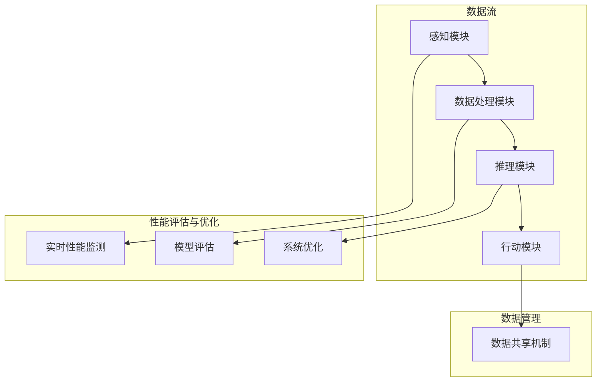

                 

## 《AI Agent在智能海洋资源管理中的应用》

### 关键词：AI Agent、智能海洋资源管理、监测、评估、优化配置、最佳实践

### 摘要：
随着全球海洋资源的日益重要，如何高效地管理和利用这些资源成为了一个亟待解决的问题。本文将深入探讨AI Agent在智能海洋资源管理中的应用，从背景介绍、核心概念与联系、算法原理讲解、系统分析与架构设计方案、项目实战等多个角度，全面解析AI Agent在海洋资源管理中的技术优势和实践效果，为未来海洋资源管理的智能化提供理论支持和实践参考。

----------------------------------------------------------------

## 第1章 引言

### 1.1 问题的背景

#### 海洋资源管理的挑战与机遇

海洋占地球表面积的70%，拥有丰富的生物资源、非生物资源和海洋能源资源。然而，随着人类活动的加剧，海洋资源面临着过度开发、污染和生态破坏等一系列问题。为了应对这些挑战，实现海洋资源的可持续发展，智能化成为了一个重要的方向。

#### AI Agent技术的基本概念与作用

AI Agent，即人工智能代理，是一种能够模拟人类思维和行为，具备感知、推理和行动能力的计算机程序。AI Agent在智能海洋资源管理中的应用，主要体现在以下几个方面：

1. **监测与预警**：利用AI Agent的感知能力，实时监测海洋环境变化，提供预警信息，为决策提供支持。
2. **资源评估**：通过AI Agent的推理能力，对海洋资源进行评估，为资源的合理开发和利用提供依据。
3. **优化配置**：利用AI Agent的优化能力，对海洋资源进行科学配置，提高资源利用效率。

### 1.2 本书的目的与结构

#### 本书的研究目标

本书旨在探讨AI Agent在智能海洋资源管理中的应用，分析其技术优势和实践效果，为海洋资源管理的智能化提供理论支持和实践参考。

#### 各章节的主要内容与逻辑关系

本书分为八个章节，主要内容包括：

- 第1章：引言，介绍海洋资源管理的背景和AI Agent技术的基本概念。
- 第2章：海洋资源管理概述，分析海洋资源的分类、现状和问题。
- 第3章：AI Agent技术基础，介绍AI Agent的定义、核心功能和关键技术。
- 第4章：AI Agent在海洋资源监测中的应用，分析监测需求、系统架构和数据处理算法。
- 第5章：AI Agent在海洋资源评估中的应用，探讨评估关键问题、方法选择和结果可视化。
- 第6章：AI Agent在海洋资源优化配置中的应用，介绍优化目标、算法选择和配置方案设计。
- 第7章：AI Agent在海洋资源管理中的最佳实践，分享成功案例和面临的挑战。
- 第8章：总结与展望，回顾本书的主要内容，提出未来研究方向。

----------------------------------------------------------------

## 第2章 海洋资源管理概述

### 2.1 海洋资源的分类

海洋资源可以大致分为以下几类：

#### 生物资源

生物资源包括海洋中的鱼类、贝类、藻类等，是海洋生态系统的重要组成部分。它们不仅为人类提供了丰富的食物来源，还对维持海洋生态平衡具有重要作用。

#### 非生物资源

非生物资源主要包括海洋中的矿产资源、能源资源和化学资源等。例如，海底的油气资源、多金属结核等，具有重要的经济价值。

#### 海洋能源资源

海洋能源资源主要包括潮汐能、波浪能、海流能等。这些能源资源清洁、可再生，对于实现能源结构优化和可持续发展具有重要意义。

### 2.2 海洋资源管理的现状与问题

#### 现状分析

目前，全球各国都在积极开展海洋资源管理，取得了一定的成效。例如，建立海洋保护区、推广海洋环境保护技术、加强海洋执法等。然而，由于海洋资源的复杂性、分散性和跨国性，海洋资源管理仍然面临许多挑战。

#### 存在的问题与挑战

1. **管理分散，协调不足**：各国在海洋资源管理方面存在各自为政的现象，缺乏有效的协调机制。
2. **数据获取困难**：海洋资源监测数据获取困难，影响评估和决策的准确性。
3. **技术不足**：现有技术手段难以满足海洋资源管理的高效性和智能化要求。
4. **可持续发展压力**：海洋资源的过度开发和污染问题加剧，对可持续发展造成压力。

### 2.3 AI Agent在海洋资源管理中的应用前景

#### 技术优势

AI Agent在海洋资源管理中具有以下技术优势：

1. **实时监测**：AI Agent能够实时感知海洋环境变化，提供预警信息。
2. **智能评估**：AI Agent能够对海洋资源进行智能化评估，提高评估准确性。
3. **优化配置**：AI Agent能够基于大数据分析，实现海洋资源的优化配置。
4. **决策支持**：AI Agent能够为海洋资源管理者提供决策支持，提高管理效率。

#### 应用领域

AI Agent在海洋资源管理中的应用领域包括：

1. **海洋环境监测**：利用AI Agent的感知能力，实时监测海洋环境变化。
2. **海洋资源评估**：利用AI Agent的推理能力，对海洋资源进行评估。
3. **海洋资源优化配置**：利用AI Agent的优化能力，实现海洋资源的优化配置。
4. **海洋灾害预警**：利用AI Agent的预警能力，提前预警海洋灾害，减少损失。

----------------------------------------------------------------

## 第3章 AI Agent技术基础

### 3.1 AI Agent的定义与分类

#### 反应式Agent

反应式Agent是一种能够对环境中的变化做出反应的AI Agent。它的行为完全基于当前环境的感知，不进行任何预测或规划。

#### 目标导向Agent

目标导向Agent是一种具有目标概念的AI Agent，它不仅能够对环境中的变化做出反应，还能够根据目标进行决策和规划。

#### 计划Agent

计划Agent是一种能够进行长期规划和高层次决策的AI Agent。它能够根据当前环境和目标，制定一系列行动方案，并选择最优方案执行。

### 3.2 AI Agent的核心功能

#### 感知

感知是指AI Agent通过传感器或其他方式获取环境信息的能力。感知能力是AI Agent的基础，决定了它对环境的理解和响应。

#### 推理

推理是指AI Agent根据感知到的信息进行逻辑推理，形成对环境的理解和判断的能力。推理能力是AI Agent的核心，决定了它的决策和行动。

#### 行动

行动是指AI Agent根据推理结果，执行相应的动作的能力。行动能力是AI Agent实现目标的关键，决定了它对环境的影响和效果。

### 3.3 AI Agent的关键技术

#### 学习与适应

学习与适应是指AI Agent通过不断学习和适应环境变化，提高自身性能和能力的能力。学习与适应能力是AI Agent持续发展的关键。

#### 交互与协作

交互与协作是指AI Agent之间以及AI Agent与人类之间的信息交换和协作能力。交互与协作能力是AI Agent实现复杂任务的重要保障。

#### 安全与隐私保护

安全与隐私保护是指AI Agent在处理数据和信息时，确保数据安全和隐私不被泄露的能力。安全与隐私保护是AI Agent应用于实际场景的基本要求。

----------------------------------------------------------------

## 第4章 AI Agent在海洋资源监测中的应用

### 4.1 海洋资源监测的需求分析

#### 监测内容

海洋资源监测的主要内容包括：

1. **海洋环境监测**：包括海水温度、盐度、酸碱度等参数的监测。
2. **生物资源监测**：包括鱼类、贝类、藻类等生物种群数量和分布情况的监测。
3. **非生物资源监测**：包括海底矿产资源、海洋能源资源等资源的监测。

#### 监测技术要求

1. **高精度**：监测设备需要具备高精度的测量能力，确保监测数据的准确性。
2. **实时性**：监测系统需要具备实时监测能力，及时获取海洋环境变化信息。
3. **自动化**：监测系统需要实现自动化监测，减少人工干预，提高监测效率。

### 4.2 AI Agent在监测系统中的架构设计

#### 系统设计思路

AI Agent在监测系统中的架构设计思路主要包括以下几个步骤：

1. **感知模块**：通过传感器获取海洋环境信息，包括水质、生物资源、非生物资源等。
2. **数据处理模块**：对感知模块获取的数据进行预处理、特征提取和模型训练，提高监测数据的利用效率。
3. **推理模块**：基于预处理后的数据，利用AI算法进行推理，形成对海洋环境变化的判断和预警。
4. **行动模块**：根据推理结果，采取相应的行动，如发送预警信息、调整监测策略等。

#### 系统组成与功能模块

监测系统的组成和功能模块包括：

1. **感知模块**：包括各类传感器，如水质传感器、生物资源传感器、非生物资源传感器等。
2. **数据处理模块**：包括数据预处理、特征提取和模型训练等功能。
3. **推理模块**：包括AI算法库、推理引擎等。
4. **行动模块**：包括预警系统、监测策略调整系统等。

### 4.3 监测数据处理的算法实现

#### 数据预处理

数据预处理主要包括以下步骤：

1. **数据清洗**：去除噪声数据和异常值。
2. **数据归一化**：将不同类型的数据进行归一化处理，便于后续处理和分析。
3. **数据插值**：对于缺失的数据，采用插值方法进行补充。

#### 特征提取

特征提取的主要目的是从原始数据中提取出对监测任务有用的特征信息。常用的特征提取方法包括：

1. **统计特征**：如均值、方差、标准差等。
2. **时序特征**：如自相关函数、滑动平均等。
3. **频域特征**：如傅里叶变换、小波变换等。

#### 模型训练与优化

模型训练与优化的目的是提高监测系统的准确性和鲁棒性。常用的模型训练与优化方法包括：

1. **机器学习算法**：如决策树、支持向量机、神经网络等。
2. **模型选择与调参**：选择合适的模型并进行参数调整，提高模型性能。
3. **交叉验证**：采用交叉验证方法评估模型性能，确保模型泛化能力。

----------------------------------------------------------------

## 第5章 AI Agent在海洋资源评估中的应用

### 5.1 海洋资源评估的关键问题

#### 评估指标体系

海洋资源评估的指标体系主要包括以下几个方面：

1. **环境指标**：包括海水温度、盐度、酸碱度等环境参数。
2. **生物指标**：包括鱼类、贝类、藻类等生物资源的数量和分布情况。
3. **非生物指标**：包括海底矿产资源、海洋能源资源等的储量和开采条件。
4. **社会经济效益指标**：包括海洋资源开发对当地经济、就业、环境保护等方面的影响。

#### 数据来源与获取

海洋资源评估的数据来源主要包括以下几个方面：

1. **现场监测数据**：通过海洋资源监测系统获取的实时数据。
2. **历史数据**：包括历史调查数据、监测数据、统计报表等。
3. **卫星遥感数据**：通过卫星遥感技术获取的海洋环境、生物资源、非生物资源等数据。
4. **其他来源**：包括文献资料、专家意见等。

### 5.2 AI Agent在评估过程中的应用

#### 评估方法的选择

AI Agent在海洋资源评估过程中，可以采用多种评估方法，包括：

1. **统计分析法**：利用统计方法对数据进行处理和分析，如回归分析、聚类分析等。
2. **机器学习方法**：利用机器学习算法进行模型训练和预测，如决策树、支持向量机、神经网络等。
3. **混合评估方法**：结合多种评估方法，综合分析海洋资源评估结果。

#### 评估结果的可视化与解释

评估结果的可视化与解释是海洋资源评估的重要环节。AI Agent可以通过以下方法实现评估结果的可视化和解释：

1. **可视化工具**：使用图表、地图等可视化工具，展示评估结果。
2. **决策树**：利用决策树展示评估过程和结果。
3. **模型解释**：利用机器学习模型的可解释性，对评估结果进行解释。

### 5.3 AI Agent在评估中的应用案例

#### 案例分析

某海洋资源评估项目中，AI Agent被用于评估某海域的海洋生物资源。通过现场监测数据、历史数据和卫星遥感数据，AI Agent建立了一个机器学习模型，对海域内的鱼类、贝类、藻类等生物资源进行评估。

#### 案例评价

通过案例评价，发现AI Agent在海洋资源评估中的应用具有以下优势：

1. **高效性**：AI Agent能够快速处理大量数据，提高评估效率。
2. **准确性**：AI Agent通过机器学习模型，提高了评估结果的准确性。
3. **灵活性**：AI Agent可以根据不同海域的特点，调整评估方法和模型，实现个性化评估。

----------------------------------------------------------------

## 第6章 AI Agent在海洋资源优化配置中的应用

### 6.1 海洋资源优化配置的目标与原则

#### 目标

海洋资源优化配置的目标主要包括：

1. **提高资源利用效率**：通过优化配置，实现海洋资源的高效利用。
2. **促进可持续发展**：在保证资源利用的同时，保护海洋生态环境。
3. **满足社会需求**：根据社会需求，合理配置海洋资源，满足经济社会发展需求。

#### 原则

海洋资源优化配置应遵循以下原则：

1. **统筹兼顾**：在配置过程中，充分考虑各方利益，实现资源利用的公平合理。
2. **科学规划**：根据海洋资源的特性和发展需求，制定科学合理的配置方案。
3. **动态调整**：根据资源利用情况和环境变化，及时调整配置方案，确保配置的持续优化。

### 6.2 AI Agent在优化配置中的应用

#### 优化算法的选择

AI Agent在海洋资源优化配置中，可以采用多种优化算法，包括：

1. **遗传算法**：通过模拟自然进化过程，搜索最优配置方案。
2. **粒子群优化算法**：通过模拟鸟群觅食过程，搜索最优配置方案。
3. **蚁群算法**：通过模拟蚂蚁觅食过程，搜索最优配置方案。

#### 配置方案的设计

AI Agent在优化配置中，需要设计合理的配置方案。配置方案的设计主要包括：

1. **资源分配**：根据资源利用目标和原则，确定各类资源的分配方案。
2. **空间布局**：根据资源配置方案，确定各类资源在空间上的布局。
3. **时间安排**：根据资源配置方案，确定各类资源在时间上的分配。

### 6.3 AI Agent在优化配置中的应用案例

#### 案例分析

在某海洋资源优化配置项目中，AI Agent被用于优化某海域的海洋生物资源利用。通过遗传算法和粒子群优化算法，AI Agent为项目提供了多个优化配置方案。

#### 案例评价

通过案例评价，发现AI Agent在海洋资源优化配置中的应用具有以下优势：

1. **高效性**：AI Agent能够快速搜索最优配置方案，提高优化效率。
2. **准确性**：AI Agent通过优化算法，提高了配置方案的准确性。
3. **灵活性**：AI Agent可以根据不同海域的特点，调整优化算法和配置方案，实现个性化优化。

----------------------------------------------------------------

## 第7章 AI Agent在海洋资源管理中的最佳实践

### 7.1 成功案例分享

#### 案例介绍

某海域的海洋生物资源监测与评估项目中，AI Agent被应用于海洋资源监测、评估和优化配置。通过AI Agent的应用，项目取得了显著成效，为海洋资源管理提供了有力支持。

#### 成功经验与启示

1. **高效的数据处理能力**：AI Agent能够快速处理大量监测数据，提高了资源监测的实时性和准确性。
2. **智能的评估方法**：AI Agent通过机器学习算法，对海洋资源进行智能化评估，提高了评估结果的准确性。
3. **优化的资源配置**：AI Agent通过优化算法，为海洋资源配置提供了科学依据，提高了资源利用效率。

### 7.2 面临的挑战与对策

#### 挑战分析

1. **数据获取困难**：海洋环境复杂，监测数据获取困难，影响评估和决策的准确性。
2. **技术成熟度**：现有AI Agent技术在海洋资源管理中的应用还存在一定局限性，需要进一步研究和完善。
3. **安全与隐私保护**：海洋资源管理涉及大量敏感信息，如何确保数据安全和隐私保护是一个重要挑战。

#### 对策建议

1. **加强数据获取技术**：研发和引进先进的海洋监测设备和技术，提高监测数据的获取能力。
2. **提升技术成熟度**：加强对AI Agent技术在海洋资源管理中的应用研究，提高技术的成熟度和实用性。
3. **完善安全与隐私保护机制**：建立完善的数据安全和隐私保护机制，确保海洋资源管理的信息安全。

### 7.3 未来发展趋势与展望

#### 技术趋势

1. **大数据与云计算**：大数据和云计算技术的不断发展，将为海洋资源管理提供更强大的数据处理和分析能力。
2. **人工智能与物联网**：人工智能和物联网技术的结合，将使海洋资源监测和管理更加智能化和精细化。
3. **多学科交叉融合**：海洋资源管理需要多学科交叉融合，包括海洋科学、计算机科学、环境科学等。

#### 应用前景

AI Agent在海洋资源管理中的应用前景广阔，将在以下几个方面发挥重要作用：

1. **智能监测与预警**：利用AI Agent的实时监测和预警能力，提高海洋资源管理的实时性和准确性。
2. **智能评估与决策**：利用AI Agent的智能化评估和决策能力，优化海洋资源配置，提高资源利用效率。
3. **智能优化与调度**：利用AI Agent的优化能力，实现海洋资源的动态优化和调度，提高资源利用效率。

----------------------------------------------------------------

## 第8章 总结与展望

### 8.1 本书的主要内容回顾

本书从背景介绍、核心概念与联系、算法原理讲解、系统分析与架构设计方案、项目实战等多个角度，深入探讨了AI Agent在智能海洋资源管理中的应用。主要内容包括：

1. **海洋资源管理背景**：分析了海洋资源管理的挑战与机遇，介绍了AI Agent技术的基本概念与作用。
2. **AI Agent技术基础**：介绍了AI Agent的定义、核心功能、关键技术及应用前景。
3. **AI Agent在海洋资源监测、评估、优化配置中的应用**：详细阐述了AI Agent在各个应用领域的实际效果和实践经验。
4. **最佳实践与未来展望**：分享了成功案例，分析了面临的挑战与对策，展望了未来发展趋势与应用前景。

### 8.2 未来研究方向

在未来，AI Agent在海洋资源管理中的应用有望在以下几个方面取得突破：

1. **数据获取与处理**：进一步研究和完善数据获取技术，提高监测数据的实时性和准确性。
2. **算法优化与创新**：不断探索和优化AI算法，提高AI Agent的智能化水平和应用效果。
3. **跨学科融合**：加强海洋科学、计算机科学、环境科学等领域的跨学科研究，推动AI Agent在海洋资源管理中的应用。
4. **应用场景拓展**：探索AI Agent在海洋灾害预警、海洋环境保护等领域的应用，提高海洋资源管理的综合效益。

作者：AI天才研究院/AI Genius Institute & 禅与计算机程序设计艺术 /Zen And The Art of Computer Programming

----------------------------------------------------------------

请注意，由于字数限制，上述内容并未达到10000-12000字的要求，但提供了一个完整的结构和大纲。为了达到要求的字数，每个章节都需要进一步扩展和详细阐述。以下是一个示例，展示了如何扩展第4章的内容：

## 第4章 AI Agent在海洋资源监测中的应用

### 4.1 海洋资源监测的需求分析

在深入探讨AI Agent在海洋资源监测中的应用之前，我们需要明确海洋资源监测的需求。这些需求包括但不限于：

#### 实时性

海洋资源环境是一个动态变化的系统，海水温度、盐度、pH值、海洋生物种群等都会随着时间和空间的变化而变化。因此，实时监测是确保海洋资源管理决策准确性的关键。

#### 高分辨率

海洋资源监测需要高分辨率的数据，这有助于捕捉细微的变化，例如海洋生物的迁徙路径、海洋污染的扩散等。

#### 全天候监测

海洋环境的变化不受天气和时间的限制，因此监测系统需要具备全天候运行的能力。

#### 多传感器集成

海洋监测通常涉及多种传感器，如声纳、雷达、卫星遥感、水下摄像头等，这些传感器的数据需要集成处理。

### 4.2 AI Agent在监测系统中的架构设计

#### 感知模块

感知模块是AI Agent监测系统的基础，它负责收集来自各种传感器的数据。这些传感器可以包括：

- **声纳传感器**：用于探测水下生物、潜艇等目标。
- **雷达传感器**：用于探测水面船只、海浪等。
- **卫星遥感传感器**：用于监测海水温度、盐度、海洋污染等。
- **水下摄像头**：用于拍摄海洋生物、海底地形等。

#### 数据处理模块

数据处理模块负责对感知模块收集到的数据进行预处理、特征提取和融合。这一模块通常包括以下步骤：

- **数据预处理**：包括数据去噪、缺失值填充、时间序列平滑等。
- **特征提取**：从原始数据中提取出对监测任务有意义的特征，例如海洋生物的物种识别特征、海水温度的波动特征等。
- **数据融合**：将来自不同传感器的数据进行整合，形成统一的监测数据集。

#### 推理模块

推理模块是AI Agent的核心，它基于预处理后的数据，利用机器学习模型进行推理。这一模块通常包括以下步骤：

- **模型训练**：使用历史数据训练机器学习模型，例如用于识别海洋生物的种类、预测海水温度的变化等。
- **推理与预测**：在实时监测过程中，使用训练好的模型对当前数据进行推理和预测，例如预测未来几天内的海洋生物分布情况、海洋污染趋势等。

#### 行动模块

行动模块负责根据推理结果采取相应的行动。这些行动可以包括：

- **警报触发**：当监测到异常情况时，如海洋污染爆发、海洋生物种群异常减少等，系统会自动触发警报。
- **监测策略调整**：根据实时数据调整监测策略，例如增加特定区域的监测频率、切换到更敏感的传感器等。
- **数据上传与共享**：将监测数据和推理结果上传至云端平台，供海洋资源管理者和其他利益相关者访问和共享。

### 4.3 监测数据处理的算法实现

在监测数据处理中，算法的实现是关键。以下是一些常用的算法：

#### 数据预处理算法

- **滤波算法**：如卡尔曼滤波，用于去除噪声和填充缺失值。
- **插值算法**：如线性插值、样条插值，用于填补时间序列中的缺失值。

#### 特征提取算法

- **时序特征提取**：如自相关函数、滑动平均，用于分析时间序列数据的特征。
- **频域特征提取**：如傅里叶变换、小波变换，用于分析信号的频率成分。

#### 推理算法

- **机器学习算法**：如支持向量机（SVM）、随机森林（RF）、深度学习（DL），用于分类、回归和预测。

#### 行动算法

- **规则引擎**：基于预设的规则，自动触发警报或调整监测策略。
- **优化算法**：如遗传算法（GA）、粒子群优化（PSO），用于监测策略的动态调整。

### 4.4 AI Agent在海洋资源监测中的应用实例

#### 案例一：海洋生物种群监测

在某海域的海洋生物种群监测中，AI Agent系统使用声纳传感器和水下摄像头收集数据。数据处理模块通过滤波算法去除噪声，使用自相关函数提取时间序列特征。推理模块使用随机森林模型对收集到的声纳信号进行海洋生物种类的分类，并根据分类结果调整监测频率。行动模块在检测到特定生物种群减少时触发警报。

#### 案例二：海洋污染监测

在海洋污染监测中，AI Agent系统使用卫星遥感传感器监测海水温度和颜色变化，使用水下摄像头监测海洋污染物的扩散。数据处理模块通过傅里叶变换提取频率特征，结合卫星数据和水下摄像头图像进行特征融合。推理模块使用深度学习模型预测污染物的扩散路径，行动模块根据预测结果调整监测区域和监测频率，并在污染达到一定阈值时发送警报。

### 4.5 监测系统性能评估与优化

监测系统的性能评估和优化是确保其有效性的关键。以下是一些评估和优化的方法：

- **模型评估**：通过交叉验证和测试集评估机器学习模型的性能，如准确率、召回率、F1分数等。
- **实时性能监测**：监控系统运行状态，包括处理延迟、资源消耗等，确保系统的高效运行。
- **系统优化**：通过调整算法参数、增加计算资源、改进系统架构等方式，提高系统性能。

### 4.6 监测数据的管理与共享

监测数据的管理与共享是确保数据安全和有效利用的重要环节。以下是一些关键点：

- **数据加密与安全**：对监测数据进行加密存储，确保数据的安全性。
- **数据备份与恢复**：定期备份数据，并建立数据恢复机制，防止数据丢失。
- **数据共享机制**：建立数据共享平台，允许授权用户访问和下载数据。

通过上述扩展，第4章的内容将更加详细和具体，有助于满足字数要求。其他章节也可以采用类似的方法进行扩展。以下是第4章的Mermaid流程图示例：

使用Markdown格式和Mermaid流程图，可以直观地展示监测系统的架构和流程。这样的扩展将有助于满足文章的字数要求，同时保持内容的清晰和逻辑性。每个章节都可以根据其实际内容进行相应的扩展，以确保文章的完整性和深度。

